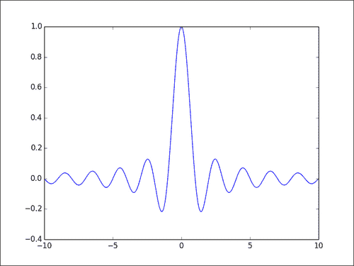
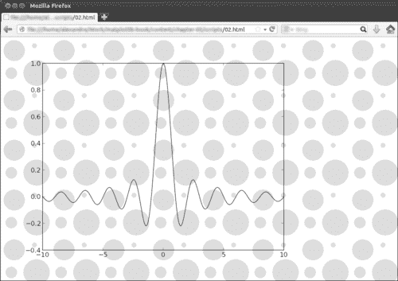
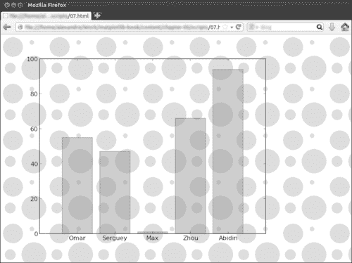
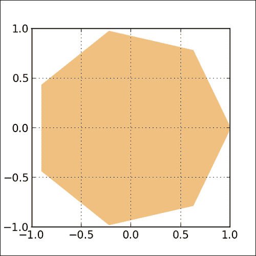
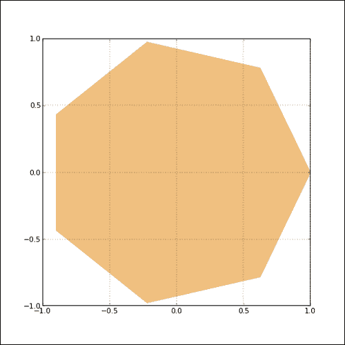
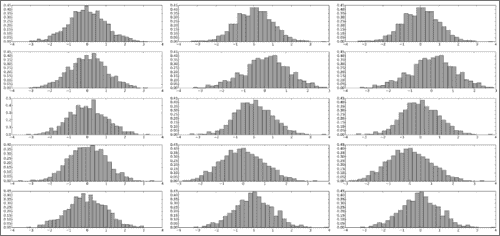

# 五、文件输出

在本章中，我们将介绍：

*   生成 PNG 图片文件
*   处理透明度
*   控制输出分辨率
*   生成 PDF 或 SVG 文档
*   处理多页 PDF 文档

## 简介

像其他类型的技术图表一样，科学图表很少是独立的文档，它们应成为文档的一部分。 matplotlib 可以将任何图形渲染为各种常见的文件格式，例如 PNG，EPS，SVG 和 PDF。 默认情况下，显示的图形具有简约的用户界面，可让您将图形保存到文件中。 但是，如果必须生成大量图形，则此方法不方便。 此外，您可能希望每次更新某些数据时都能生成一个新图形。 在本章中，我们将探讨 matplotlib 的文件输出功能。 除了以编程方式生成文件输出之外，我们还将学习如何控制重要因素，例如输出的分辨率和大小以及透明度。

## 生成 PNG 图片文件

默认情况下，matplotlib 在带有基本用户界面的窗口中显示图形。 该界面允许您将图形保存到文件中。 尽管这是一种合理的原型制作方法，但在几种常见的使用情况下并不方便。 例如，您可能想生成一堆图片，这些图片将包含在自动生成的报告中。 您可能想为每个输入文件生成一张图片作为批处理器。 matplotlib 允许您非常灵活地将图形直接保存到图片文件中。

首先，我们将了解如何将图形输出到 PNG 文件。 PNG 文件是位图输出的理想选择，它也是位图图片的实际标准。 这是一个得到良好支持的标准； 它依靠无损压缩算法（从而避免了难看的压缩伪像），并处理透明性。

### 操作步骤

当要求 matplotlib 渲染图形时，我们将使用`pyplot.savefig()` 调用而不是通常的`pyplot.show()` 调用：

```py
import numpy as np
from matplotlib import pyplot as plt

X = np.linspace(-10, 10, 1024)
Y = np.sinc(X)

plt.plot(X, Y)
plt.savefig('sinc.png', c = 'k')
```

该脚本不会在带有用户界面的窗口中显示图形，而只会创建一个名为`sinc.png`的文件。 它的分辨率为`800 x 600`像素，采用 8 位颜色（每像素 24 位）。 该文件表示以下图形：



### 工作原理

函数`pyplot.savefig()`的工作方式与`pyplot.show()`完全相同，它解释了发给`pyplot`的所有命令并生成图形。 唯一的区别是在处理结束时执行的操作。 `pyplot.show()`函数将图片数据发送到它可以使用的任何用户界面库，而`pyplot.savefig()`函数将该数据写入文件。 因此，无论最终输出的性质如何，所有命令的工作方式都完全相同。

`pyplot.savefig()`函数提供了多种可选参数，我们将在以下各节中进行探讨。

## 处理透明度

创建图形时，很少将它们单独使用。 例如，数字可以是网站或演示文稿的一部分。 在这种情况下，这些图形必须与其他图形集成在一起。 透明度对于这种整合非常重要-数字将以美观和一致的方式与背景融为一体。 在本秘籍中，我们将看到如何输出透明的图形。

### 操作步骤

为了演示的透明度，我们将创建一个图形并将其嵌入到网页中。 该图将与网页背景融合在一起。 在此秘籍中创建的所有文件应位于同一目录中。 我们将在本节中执行以下操作：

*   将图形渲染为具有透明背景的 PNG 文件
*   制作一个包含图形的 HTML 页面

#### 将图形渲染为具有透明背景的 PNG 文件

要将图形渲染为 PNG 文件，我们将再次使用`pyplot.savefig()`。 但是，可选参数`transparent`设置为`True`，如以下脚本所示：

```py
import numpy as np
import matplotlib.pyplot as plt

X = np.linspace(-10, 10, 1024)
Y = np.sinc(X)

plt.plot(X, Y, c = 'k')
plt.savefig('sinc.png', transparent = True)
```

#### 制作一个包含图形的 HTML 页面

让我们在具有背景的网页上使用 PNG 文件。 最小的 HTML 代码显示`sinc.png`，并在背景中平铺`background.png`图片，如下所示：

```py
<html>
  <head>
    <style>
      body {
        background: white url(background.png);
      }
    </style>
  </head>
  <body>
    </img>
  </body>
</html>
```

使用浏览器查看网页时，该图会与平铺的背景融合在一起，如下图所示。 在其他情况下（例如在演示中使用图形时）也会发生相同的情况。



### 工作原理

默认情况下，的`pyplot.savefig()`将不在输出中包含透明度信息。 例如，当我们输出 PNG 图片时，默认情况下，PNG 文件每个像素使用 24 位，仅在 8 位上存储像素的红色，绿色和蓝色分量。 但是，启用`transparent`输出时，`pyplot.savefig()`每个像素将使用 32 位-另一个通道 alpha 通道存储透明度信息。

### 更多

到目前为止，唯一涉及图形背景的透明度信息是图形的元素是背景（完全透明）或前景（完全不透明）。 但是，我们可以控制使用 matplotlib 生成的任何图形的透明度。

matplotlib 允许您将图形的透明级别定义为可选参数`alpha`。 如果`alpha`等于`1`，则图形将完全不透明，这是默认设置。 如果`alpha`等于`0`，则该图形将完全不可见。 中间值`alpha`将提供部分透明度。 可选参数 `alpha`可用于大多数图形函数。

以下脚本演示了这一点：

```py
import numpy as np
import matplotlib.pyplot as plt

name_list = ('Omar', 'Serguey', 'Max', 'Zhou', 'Abidin')
value_list = np.random.randint(99, size=len(name_list))
pos_list = np.arange(len(name_list))

plt.bar(pos_list, value_list, alpha = .75, color = '.75', align = 'center')
plt.xticks(pos_list, name_list)

plt.savefig('bar.png', transparent = True)
```

前面的脚本将创建一个条形图，并将该图保存到 PNG 文件中。 在网页中使用此 PNG 文件时，我们不仅可以看到图形的背景融合在一起，而且图形的内容也可以融合进去，如以下屏幕截图所示：



## 控制输出分辨率

默认情况下，当将输出用于位图图片时，matplotlib 为我们选择输出的大小和分辨率。 根据位图图片的用途，我们可能要自己选择分辨率。 例如，如果图片要成为大海报的一部分，我们可能更喜欢高分辨率，或者，如果我们想生成缩略图，则分辨率会非常低。 在本秘籍中，我们将学习如何控制输出分辨率。

### 操作步骤

`pyplot.savefig()`函数提供了一个可选参数来控制输出分辨率，如以下脚本所示：

```py
import numpy as np
from matplotlib import pyplot as plt

X = np.linspace(-10, 10, 1024)
Y = np.sinc(X)

plt.plot(X, Y)
plt.savefig('sinc.png', dpi = 300)
```

前面的脚本绘制一条曲线并将结果输出到文件中。 而不是通常的`800 x 600`像素输出，而是`2400 x 1800`像素。

### 工作原理

`pyplot.savefig()`函数具有一个称为`dpi`的可选参数。 此参数控制以 **DPI**（**每英寸点数**）表示的图片的分辨率。 对于更熟悉公制单位的人，1 英寸等于 2.54 厘米。 该单位表示在实际文档的 1 英寸中可以找到多少个点。 好的喷墨打印机将以 300 dpi 的分辨率打印文档。 高质量的激光打印机可以轻松以 600 dpi 的速度打印。

默认情况下，matplotlib 将输出`8 x 6`空间单位（长宽比为 4/3）的图形。 在 matplotlib 中，1 个空间单位等于 100 个像素。 因此，默认情况下，matplotlib 将提供`800 x 600`像素的图片文件。 如果我们使用`dpi = 300`，则图片大小将为`8 * 300 x 6 * 300`，即`2400 x 1800`像素。

### 更多

在第 4 章“处理图形”，我们看到了如何控制长宽比。 如果我们将宽高比和 DPI 结合起来，则可以完全控制图片的一般比例。 假设我们要在`512 x 512`像素的图片中显示一个六边形。 我们将执行以下操作：

```py
import numpy as np
import matplotlib.pyplot as plt

theta = np.linspace(0, 2 * np.pi, 8)
points = np.vstack((np.cos(theta), np.sin(theta))).transpose()

plt.figure(figsize=(4., 4.))
plt.gca().add_patch(plt.Polygon(points, color = '.75'))

plt.grid(True)
plt.axis('scaled')

plt.savefig('polygon.png', dpi = 128)
```

上一个脚本的结果将是以下图形：



我们将图形显示在`4 x 4`单位区域上，并以 128 dpi 的分辨率输出-输出将为`512 x 512`像素。 我们还可以显示 512 像素，单位面积为`8 x 8`，并以 64 dpi 的分辨率输出。 这将为我们带来以下结果：



标注更小，网格线更细。 标注和线条的粗细具有它们自己的默认值，以空间单位表示。 因此，将输出分辨率除以 2 将使标注变小两倍。 如果您开始操纵空间分辨率和每个单独的元素大小，它会很快变得混乱。 通常，最好只相对彼此更改单个元素的大小（注解和厚度）。 如果要使所有标注一致地变大，则可以使用分辨率设置。

## 生成 PDF 或 SVG 文档

到位图图片的输出并不总是理想的。 位图图片将图片表示为一个给定比例的像素数组。 放大，您将得到一些众所周知的伪影（锯齿，阶梯，模糊等），具体取决于所采用的采样算法。 向量图片是尺度不变的。 无论您以多大的比例观察它们，都不会丢失任何细节或工件。 这样，在编写较大的文档（例如日记帐文章）时，向量图片是理想的。 调整图形比例时，我们不需要生成新图片。 matplotlib 可以输出向量图片，例如 PDF 和 SVG 图片。

### 操作步骤

PDF 文档的输出很简单，如以下脚本所示：

```py
import numpy as np
from matplotlib import pyplot as plt

X = np.linspace(-10, 10, 1024)
Y = np.sinc(X)

plt.plot(X, Y)
plt.savefig('sinc.pdf')
```

前面的脚本将绘制一个图形并将其保存到名为`sinc.pdf`的文件中。

### 工作原理

我们已经讨论了`pyplot.savefig()`函数，该函数将图形渲染到文件中。 文件名足以指定文件是 PNG，PDF 还是 SVG。 matplotlib 将查看文件名的文件扩展名并推断文件的类型。

### 更多

在某些情况下，您可能想以给定格式保存文件，例如 SVG，但是您不希望文件名具有`.svg`扩展名。 `pyplot.savefig`参数（作为可选参数）使您可以执行此操作。 设置`format = 'svg', pyplot.savefig`不会从传递给函数的文件名推断出输出文件类型，而是会使用传递给格式的名称。

## 处理多页 PDF 文档

在第 4 章“处理图形”中，看到看到了如何在一张 matplotlib 图形中构成多个图形。 这使您可以创建非常复杂的图。 使用 PDF 输出时，我们必须记住该图形必须适合一页。 但是，通过一些额外的工作，我们可以输出多页的 PDF 文档。 请注意，matplotlib 是科学的绘图包，而不是文档合成系统，例如 LaTeX 或 ReportLab。 因此，对多个页面的支持非常少。 在本秘籍中，我们将了解如何生成多页 PDF 文档。

### 操作步骤

为了演示使用 matplotlib 的多页 PDF 输出，让我们生成 15 个条形图，每页五个图。 以下脚本将输出名为`barcharts.pdf`的三页文档：

```py
import numpy as np
from matplotlib import pyplot as plt
from matplotlib.backends.backend_pdf import PdfPages

## Generate the data
data = np.random.randn(15, 1024)

## The PDF document
pdf_pages = PdfPages('barcharts.pdf')

## Generate the pages
plots_count = data.shape[0]
plots_per_page = 5
pages_count = int(np.ceil(plots_count / float(plots_per_page)))
grid_size = (plots_per_page, 1)

for i, samples in enumerate(data):
  # Create a figure instance (ie. a new page) if needed
  if i % plots_per_page == 0:
    fig = plt.figure(figsize=(8.27, 11.69), dpi=100)

  # Plot one bar chart
  plt.subplot2grid(grid_size, (i % plots_per_page, 0))
  plt.hist(samples, 32, normed=1, facecolor='.5', alpha=0.75)

  # Close the page if needed
  if (i + 1) % plots_per_page == 0 or (i + 1) == plots_count:
    plt.tight_layout()
    pdf_pages.savefig(fig)

## Write the PDF document to the disk
pdf_pages.close()
```

条形图整齐地布置在三个页面上，如以下屏幕截图所示：



### 工作原理

通常，使用 matplotlib 的脚本不依赖于输出的类型。 我们始终将`pyplot.savefig()`用于各种输出。 但是，在这里，我们必须处理 PDF 输出的细节。 因此，此脚本执行以下操作：

*   导入可处理 PDF 输出的 matplotlib 包`matplotlib.backends.backend_pdf`。 从这个包中，我们只需要`PdfPages`对象。 该对象代表 PDF 文档。
*   创建名为`pdf_pages`的 PDF 文档实例。 这是通过使用`pdf_pages = PdfPages('histograms.pdf')`函数完成的。
*   要生成每个页面，它会执行以下操作：
    *   创建一个具有 A4 页面尺寸的新图形实例。 这是通过使用`fig = plot.figure(figsize=(8.27, 11.69), dpi=100)`函数完成的。
    *   用图填充图。 在此示例中，我们使用子图在一个图形中放置多个图。
    *   在 PDF 文档中创建一个新页面，其中将包含我们的图形。 这是通过使用`pdf_pages.savefig(fig)`函数完成的。
*   生成所需的所有图形后，即可使用`pdf_pages.close()`函数输出文档。

请注意，页面在此处是一个相当笼统的术语。 页面不必具有特定大小。 不同的页面可以具有不同的大小。 编写脚本是为了从总的图形数和每页的图形数自动计算出页面数。

### 更多

由于 matplotlib 并不是完整的文档组成系统，因此如果没有可怕的技巧，就很难实现页码或页眉之类的东西。 如果确实需要这些功能，明智的做法是将每个图形生成为单个 PDF 文档。 然后，这些数字将由文档撰写系统用来自动生成 PDF 文档。 例如，DocBook 是一个使用 XML 描述来生成 PDF 或其他常见格式的文档的系统。 当然，这是一个完全不同的努力规模。