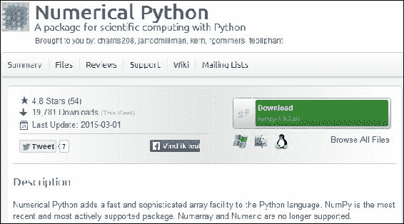
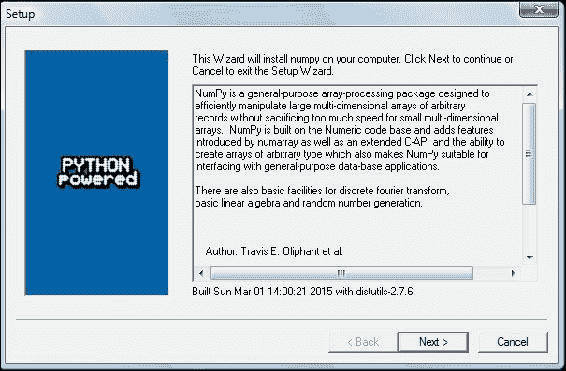
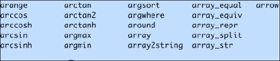

# 一、NumPy 快速入门

让我们开始吧。 我们将在不同的操作系统上安装 NumPy 和相关软件，并看一些使用 NumPy 的简单代码。 本章简要介绍了 IPython 交互式 shell。 SciPy 与 NumPy 密切相关，因此您将看到 SciPy 名称出现在此处和那里。 在本章的最后，您将找到有关如何在线获取更多信息的指南，如果您陷入困境或不确定解决问题的最佳方法。

在本章中，您将涵盖以下主题：

*   在 Windows，Linux 和 Macintosh 上安装 Python，SciPy，matplotlib，IPython 和 NumPy
*   回顾一下 Python
*   编写简单的 NumPy 代码
*   了解 IPython
*   浏览在线文档和资源

## Python

**NumPy** 基于 Python，因此您需要安装 Python。 在某些操作系统上，已经安装了 Python 。 但是，您需要检查 Python 版本是否与要安装的 NumPy 版本对应的  。 Python 有许多实现，包括商业实现和发行版。 在本书中，我们将集中在标准 **CPython** 实现上，该实现可确保与 NumPy 兼容。

## 实战时间 – 在不同的操作系统上安装 Python

NumPy [具有用于 Windows，各种 Linux 发行版和 MacOSX 的二进制安装程序](http://sourceforge.net/projects/numpy/files/)。 如果您愿意的话，还有源代码的发行版。 您需要在系统上安装 Python 2.4.x 或更高版本。 我们将完成在以下操作系统上安装 Python 所需的各个步骤：

*   **Debian** 和 **Ubuntu**：Python 可能已经安装在 Debian 和 Ubuntu 上，但是开发版通常不是。 在 Debian 和 Ubuntu 上，使用以下命令安装`python`和`python-dev`软件包：

    ```py
    $ [sudo] apt-get install python
    $ [sudo] apt-get install python-dev

    ```

*   **Windows**：Windows Python 安装程序，可从[这里](https://www.python.org/downloads/)获取。 在此网站上，我们还可以查找 MacOSX 的安装程序以及 Linux，UNIX 和 MacOSX 的源归档。
*   **Mac**：Python 已预装在 MacOSX 上。 我们还可以通过 MacPorts，Fink，Homebrew 或类似项目来获取 Python。

    例如，通过运行以下命令来安装 Python 2.7 端口：

    ```py
    $ [sudo] port install python27

    ```

    **线性代数软件包**（**LAPACK**）不需要存在，但如果存在，NumPy 会检测到它，并在安装阶段使用它。 建议您安装 LAPACK 进行认真的数值分析，因为它具有有用的数值线性代数功能。

### 刚刚发生了什么？

我们在 Debian，Ubuntu，Windows 和 MacOSX 上安装了 Python。

## Python 帮助系统

在开始介绍  NumPy 之前，让我们简要介绍一下 Python 帮助系统，以防万一您忘记了它的工作方式或不太熟悉它。 Python 帮助系统允许您从交互式 **Python shell** 中查找文档。 外壳程序是交互式程序，它接受命令并为您执行命令。

## 实战时间 – 使用 Python 帮助系统

根据您的操作系统，您可以使用特殊应用程序（通常是某种终端）访问 Python shell。

1.  在这样的终端中，键入以下命令以启动 Python Shell：

    ```py
    $ python

    ```

2.  您将收到一条简短的消息，其中包含 Python 版本和其他信息以及以下提示：

    ```py
    >>>

    ```

    在提示符下键入以下内容：

    ```py
    >>> help()

    ```

    出现另一条消息，提示更改如下：

    ```py
    help>

    ```

3.  例如，如果按消息提示输入`keywords`，则会得到一个关键字列表。 `topics`命令给出了主题列表。 如果您在提示符下键入任何主题名称（例如`LISTS`），则会获得有关该主题的其他信息。 键入`q`退出信息屏幕。 同时按`Ctrl + D`返回正常的 Python 提示符：

    ```py
    >>>

    ```

    再次同时按下`Ctrl + D`将结束 Python Shell 会话。

### 刚刚发生了什么？

我们了解了 Python 交互式外壳和 Python 帮助系统。

## 基本算术和变量赋值

在“实战时间 – 使用 Python 帮助系统”部分，我们使用 Python Shell 查找文档。 我们也可以使用 Python 作为计算器。 这种方式只是一个复习，因此，如果您是 Python 的新手，我建议您花一些时间来学习基础知识。 如果您全神贯注，那么学习基本的 Python 应该花不了几个星期的时间。

## 实战时间 – 使用 Python 作为计算器

我们可以使用 Python 作为计算器，如下所示：

1.  在 Python Shell 中，如下添加 2 和 2：

    ```py
    >>> 2 + 2
    4

    ```

2.  分别乘以 2 和 2：

    ```py
    >>> 2 * 2
    4

    ```

3.  将 2 和 2 分别如下：

    ```py
    >>> 2/2
    1

    ```

4.  如果您之前进行过编程，则可能知道除法有些技巧，因为除法的类型不同。 对于计算器，结果通常是足够的，但是以下除法可能与您期望的不符：

    ```py
    >>> 3/2
    1

    ```

    我们将在本书的后面几章中讨论此结果的含义。 取 2 的立方，如下所示：

    ```py
    >>> 2 ** 3
    8

    ```

### 刚刚发生了什么？

我们将 Python Shell 用作计算器，并执行了加法，乘法，除法和乘幂运算。

## 实战时间 – 为变量赋值

在 Python 中为变量赋值的方式与大多数编程语言相似。

1.  例如，将`2`的值赋给名为`var`的变量，如下所示：

    ```py
    >>> var = 2
    >>> var
    2

    ```

2.  我们定义了变量并为其赋了一个值。 在此 Python 代码中，变量的类型不固定。 我们可以将变量放入一个列表中，该列表是对应于值的有序序列的内置 Python 类型。 将`var`赋为一个列表，如下所示：

    ```py
    >>> var = [2, 'spam', 'eggs']
    >>> var
    [2, 'spam', 'eggs']

    ```

    我们可以使用其索引号为列表项赋一个新值（从 0 开始计数）。 将第一个列表元素赋为新值：

    ```py
    >>> var
    ['ham', 'spam', 'eggs']

    ```

3.  我们还可以轻松交换值。 定义两个变量并交换它们的值：

    ```py
    >>> a = 1
    >>> b = 2
    >>> a, b = b, a
    >>> a
    2
    >>> b
    1

    ```

### 刚刚发生了什么？

我们为变量和 Python 列表项赋了值。 本节绝不详尽； 因此，如果您在挣扎，请阅读附录 B，“其他在线资源”，以找到推荐的 Python 教程。

## `print()`函数

如果您有一段时间没有使用 Python 编程或者是 Python 新手，可能会对  Python2 与 Python3 的讨论感到困惑。 简而言之，最新版本的 Python3 与旧版本的 Python2 不向后兼容，因为 Python 开发团队认为某些问题是根本问题，因此需要进行重大更改。 Python 团队已承诺将 Python2 维护到 2020 年。这对于仍然以某种方式依赖 Python2 的人们来说可能是个问题。 `print()`函数的结果是我们有两种语法。

## 实战时间 – 使用`print()`函数进行打印

我们可以使用`print()`函数打印  ，如下所示：

1.  旧语法如下：

    ```py
    >>> print 'Hello'
    Hello

    ```

2.  新的 Python3 语法如下：

    ```py
    >>> print('Hello')
    Hello

    ```

    现在，括号在 Python3 中是必需的。在本书中，我尝试尽可能多地使用新语法。 但是，出于安全考虑，我使用 Python2。 为了强制执行语法，本书中每个带有`print()`调用的 Python2 脚本均以：

    ```py
    >>> from __future__ import print_function

    ```

3.  尝试使用旧的语法以获取以下错误消息：

    ```py
    >>> print 'Hello'
     File "<stdin>", line 1
     print 'Hello'
     ^
    SyntaxError: invalid syntax

    ```

4.  要打印换行符，请使用以下语法：

    ```py
    >>> print()

    ```

5.  要打印多个项目，请用逗号分隔它们：

    ```py
    >>> print(2, 'ham', 'egg')
    2 ham egg

    ```

6.  默认情况下，Python 用空格分隔打印的值，然后将输出打印到屏幕上。 您可以自定义这些设置。 通过键入以下命令来了解有关此功能的更多信息：

    ```py
    >>> help(print)

    ```

    您可以通过输入`q`再次退出。

### 刚刚发生了什么？

我们了解了`print()`函数及其与 Python2 和 Python3 的关系。

## 代码注释

代码注释是最佳做法，其目的是使您自己和其他编码者更加清楚代码（请参阅[这里](https://google-styleguide.googlecode.com/svn/trunk/pyguide.html?showone=Comments#Comments)）。 通常，公司和其他组织对代码注释有政策，例如注释模板。 在本书中，为了简洁起见，我没有以这种方式评论代码，因为书中的文字应使代码清晰。

## 实战时间 – 注释代码

最基本的注释以井号开始，一直持续到该行的末尾：

1.  具有此类注释的注释代码如下：

    ```py
    >>> # Comment from hash to end of line

    ```

2.  但是，如果哈希符号在单引号或双引号之间，则我们有一个字符串，它是字符的有序序列：

    ```py
    >>> astring = '# This is not a comment'
    >>> astring
    '# This is not a comment'

    ```

3.  我们也可以将多行注释为一个块。 如果您想编写更详细的代码说明，这将很有用。 注释多行，如下所示：

    ```py
    """
     Chapter 1 of NumPy Beginners Guide.
     Another line of comment.
    """

    ```

    由于明显的原因，我们将这种类型的评论称为三引号。 它还用于测试代码。 您可以在第 8 章，“确保测试的质量”中了解有关测试的信息。

## `if`语句

Python 中的`if`语句与其他语言（例如 C++ 和 Java）的语法有些不同。 最重要的区别是缩进很重要，我希望您知道这一点。

## 实战时间 – 使用`if`语句来决策

我们可以通过以下方式使用`if`语句：

1.  检查数字是否为负，如下所示：

    ```py
    >>> if 42 < 0:
    ...     print('Negative')
    ... else:
    ...     print('Not negative')
    ...
    Not negative

    ```

    在前面的示例中，Python 判定`42`不为负。 `else`子句是可选的。 比较运算符等效于 C++ ，Java 和类似语言中的运算符。

2.  Python 还具有用于多个测试的链式分支逻辑复合语句，类似于 C++，Java 和其他编程语言中的`switch`语句。 确定数字是负数，0 还是正数，如下所示：

    ```py
    >>> a = -42
    >>> if a < 0:
    ...     print('Negative')
    ... elif a == 0:
    ...     print('Zero')
    ... else:
    ...     print('Positive')
    ...
    Negative

    ```

    这次，Python 判定`42`为负。

### 刚刚发生了什么？

我们学习了如何在 Python 中执行分支逻辑。

## `for`循环

Python 具有`for`语句，其目的与 C++ ，Pascal，Java 和其他语言中的等效构造相同。 但是，循环的机制有些不同。

## 实战时间 – 使用循环来重复指令

我们可以通过以下方式使用`for`循环：

1.  循环显示有序序列（例如列表），并按以下方式打印每个项目：

    ```py
    >>> food = ['ham', 'egg', 'spam']
    >>> for snack in food:
    ...     print(snack)
    ...
    ham
    egg
    spam

    ```

2.  请记住，与往常一样，缩进在 Python 中很重要。 我们使用内置的`range()`或`xrange()`函数遍历一系列值。 在某些情况下，后者的功能会稍微更有效。 按以下步骤 2 循环编号`1-9`：

    ```py
    >>> for i in range(1, 9, 2):
    ...     print(i)
    ...
    1
    3
    5
    7

    ```

3.  `range()`函数的`start`和`step`参数是可选的，默认值为`1`。 我们还可以提早结束循环。 遍历数字`0-9`并在到达`3`时跳出循环：

    ```py
    >>> for i in range(9):
    ...     print(i)
    ...     if i == 3:
    ...     print('Three')
    ...     break
    ...
    0
    1
    2
    3
    Three

    ```

4.  循环在`3`处停止，我们没有打印更高的数字。 除了退出循环，我们也可以退出当前迭代。 打印数字`0-4`，跳过`3`，如下所示：

    ```py
    >>> for i in range(5):
    ...     if i == 3:
    ...             print('Three')
    ...             continue
    ...     print(i)
    ...
    0
    1
    2
    Three
    4

    ```

5.  由于出现`continue`语句，当我们到达`3`时未执行循环的最后一行。 在 Python 中，`for`循环可以附加一个`else`语句。 添加`else`子句，如下所示：

    ```py
    >>> for i in range(5):
    ...     print(i)
    ... else:
    ...     print(i, 'in else clause')
    ...
    0
    1
    2
    3
    4
    (4, 'in else clause')

    ```

6.  Python 最后执行`else`子句中的代码。 Python 也有一个`while`循环。 我没有使用它太多，因为我认为`for`循环更有用。

### 刚刚发生了什么？

我们学习了如何在带循环的 Python 中重复指令。 本节包含`break`和`continue`语句，它们退出并继续循环。

## Python 函数

函数是可调用的代码块。 我们用给它们的名称来调用函数。

## 实战时间 – 定义函数

让我们定义以下简单功能：

1.  通过以下方式打印`Hello`和给定名称：

    ```py
    >>> def print_hello(name):
    ...     print('Hello ' + name)
    ...

    ```

    调用函数如下：

    ```py
    >>> print_hello('Ivan')
    Hello Ivan

    ```

2.  某些函数没有参数，或者参数具有默认值。 为函数提供默认的参数值，如下所示：

    ```py
    >>> def print_hello(name='Ivan'):
    ...     print('Hello ' + name)
    ...
    >>> print_hello()
    Hello Ivan

    ```

3.  通常，我们要返回一个值。 定义一个将输入值加倍的函数，如下所示：

    ```py
    >>> def double(number):
    ...     return 2 * number
    ...
    >>> double(3)
    6

    ```

### 刚刚发生了什么？

我们学习了如何定义函数。 函数可以具有默认参数值和返回值。

## Python 模块

包含 Python 代码的文件被称为**模块**。 一个模块可以导入其他模块，其他模块中的功能以及模块的其他部分。 Python 模块的文件名以`.py`结尾。 模块的名称与文件名减去`.py`后缀相同。

## 实战时间 – 导入模块

导入模块可以通过以下方式完成：

1.  例如，如果文件名是`mymodule.py`，则按以下方式导入它：

    ```py
    >>> import mymodule

    ```

2.  标准的 Python 发行版具有`math`模块。 导入后，按如下所示在模块中列出功能和属性：

    ```py
    >>> import math
    >>> dir(math)
    ['__doc__', '__file__', '__name__', '__package__', 'acos', 'acosh', 'asin', 'asinh', 'atan', 'atan2', 'atanh', 'ceil', 'copysign', 'cos', 'cosh', 'degrees', 'e', 'erf', 'erfc', 'exp', 'expm1', 'fabs', 'factorial', 'floor', 'fmod', 'frexp', 'fsum', 'gamma', 'hypot', 'isinf', 'isnan', 'ldexp', 'lgamma', 'log', 'log10', 'log1p', 'modf', 'pi', 'pow', 'radians', 'sin', 'sinh', 'sqrt', 'tan', 'tanh', 'trunc']

    ```

3.  在`math`模块中调用`pow()`函数：

    ```py
    >>> math.pow(2, 3)
    8.0

    ```

    注意语法中的点。 我们还可以直接导入一个函数，并以其短名称调用它。 导入并调用`pow()`函数，如下所示：

    ```py
    >>> from math import pow
    >>> pow(2, 3)
    8.0

    ```

4.  Python 使我们可以为导入的模块和函数定义别名。 现在是介绍我们将用于 NumPy 的导入约定以及将大量使用的绘图库的好时机：

    ```py
    import numpy as np
    import matplotlib.pyplot as plt
    ```

### 刚刚发生了什么？

我们学习了有关模块，导入模块，导入函数，模块中的调用函数以及本书的导入约定的知识。 Python 复习到此结束。

## Windows 上的  NumPy

在 Windows 上安装 NumPy 非常简单。 您只需要下载安装程序，向导就会指导您完成安装步骤。

## 实战时间 – 在 Windows 上安装 NumPy，matplotlib，SciPy 和 IPython

在 Windows 上安装 NumPy 是必要的，但是幸运的是，这是我们将详细介绍的简单任务。 建议您安装 matplotlib，SciPy 和 IPython。 但是，对于这本书来说不需要使用它们。 我们将采取的动作如下：

1.  从 [SourceForge](http://sourceforge.net/projects/numpy/files/) 网站下载适用于 Windows 的 NumPy 安装程序。

    

    根据您的 Python 版本选择适当的 NumPy 版本。 在上一个屏幕截图中，我们选择了`numpy-1.9.2-win32-superpack-python2.7.exe`。

2.  双击打开 EXE 安装程序，如以下屏幕快照所示：
3.  现在，我们可以看到对 NumPy 及其功能的描述。 单击**下一步**。
4.  如果您安装了 Python ，则应自动检测到它。 如果未检测到，则您的路径设置可能不正确。 在本章的结尾，我们列出了资源，以防您安装 NumPy 时遇到问题。
5.  在此示例中，找到了 Python 2.7。 如果找到 Python，请单击“下一步”。 否则，请单击“取消”并安装 Python（如果没有 Python，则无法安装 NumPy）。 点击**下一步**。 这是无可挽回的地方。 很好，但是最好确保要安装到正确的目录，依此类推。 现在开始真正的安装。 可能还要等一下。

    使用 [**Enthought Canopy** 发行版](https://www.enthought.com/products/canopy/)安装 SciPy 和  matplotlib。 可能需要将`msvcp71.dll`文件放在您的`C:\Windows\system32`目录中， 您可以从[这里获得](http://www.dll-files.com/dllindex/dll-files.shtml?msvcp71)。在 [IPython 网站](http://ipython.org/)上提供 Windows IPython 安装程序。

### 刚刚发生了什么？

我们在 Windows 上安装了 NumPy，SciPy，matplotlib 和 IPython。

## Linux 上的 NumPy

在 Linux 上安装 NumPy 及其相关的推荐软件取决于您所拥有的发行版。 我们将讨论如何从命令行安装 NumPy，尽管您可能可以使用图形安装程序。 取决于您的**发行版**（**发行版**）。 安装 matplotlib，SciPy 和 IPython 的命令是相同的-仅软件包名称不同。 建议安装 matplotlib，SciPy 和 IPython，但这是可选的。

## 实战时间 – 在 Linux 上安装 NumPy，matplotlib，SciPy 和 IPython

大多数 Linux 发行版具有  NumPy 软件包。 对于某些最流行的 Linux 发行版，我们将介绍必要命令  ：

*   在 **RedHat** 上安装 **NumPy**：按照命令行中的说明运行：

    ```py
    $ yum install python-numpy

    ```

*   **在 Mandriva 上安装 NumPy**：要在 Mandriva 上安装 NumPy，请运行以下命令行指令：

    ```py
    $ urpmi python-numpy

    ```

*   **在 Gentoo 上安装 NumPy**：要在 Gentoo 上安装  NumPy，请运行以下命令行指令：

    ```py
    $ [sudo] emerge numpy

    ```

*   **在 Debian 和 Ubuntu 上安装 NumPy**：在 Debian 或 Ubuntu 上，在命令行上输入以下内容：

    ```py
    $ [sudo] apt-get install python-numpy

    ```

下表概述了 Linux 发行版以及 NumPy，SciPy，matplotlib 和 IPython 的相应软件包名称：

| Linux 发行版 | NumPy | SciPy | matplotlib | IPython |
| --- | --- | --- | --- | --- |
| Arch Linux | `python-numpy` | `python-scipy` | `python-matplotlib` | `ipython` |
| Debian | `python-numpy` | `python-scipy` | `python-matplotlib` | `ipython` |
| Fedora | `numpy` | `python-scipy` | `python-matplotlib` | `ipython` |
| Gentoo | `dev-python/numpy` | `scipy` | `matplotlib` | `ipython` |
| OpenSUSE | `python-numpy, python-numpy-devel` | `python-scipy` | `python-matplotlib` | `ipython` |
| Slackware | `numpy` | `scipy` | `matplotlib` | `ipython` |

## MacOSX 上的 NumPy

您可以使用 GUI 安装程序（并非所有版本都可以）在 MacOSX 上安装 NumPy，matplotlib 和 SciPy，也可以使用端口管理器（例如 **MacPorts**）通过命令行安装，**HomeBrew**或 **Fink**，具体取决于您的偏好。 您还可以使用[脚本](https://github.com/fonnesbeck/ScipySuperpack)来安装。

## 实战时间 – 使用 MacPorts 或 Fink 安装 NumPy，SciPy，matplotlib 和 IPython

另外，我们可以通过 MacPorts 路由或通过 Fink 安装  NumPy，SciPy，matplotlib 和 IPython。 以下安装步骤显示了如何安装所有这些软件包：

*   **使用 MacPorts 安装**：输入以下命令：

    ```py
    $ [sudo] port install py-numpy py-scipy py-matplotlib py-ipython

    ```

*   **使用 Fink 安装**：Fink 也提供用于 NumPy 的软件包-`scipy-core-py24` ，`scipy-core-py25`和`scipy-core-py26`。 SciPy 软件包为`scipy-py24`，`scipy-py25`和`scipy-py26`。 我们可以使用以下命令，将 NumPy 和其他推荐的软件包安装到 Python 2.7 上：

    ```py
    $ fink install scipy-core-py27 scipy-py27 matplotlib-py27

    ```

### 刚刚发生了什么？

我们在带有 MacPorts 和 Fink 的 MacOSX 上安装了 NumPy 和其他推荐的软件。

## 从源代码构建

我们可以使用`git`检索  NumPy 的源代码，如下所示：

```py
$ git clone git://github.com/numpy/numpy.git numpy

```

或者，从[这里](http://sourceforge.net/projects/numpy/files/)下载源。

使用以下命令在`/usr/local`中安装：

```py
$ python setup.py build
$ [sudo] python setup.py install --prefix=/usr/local

```

要构建，我们需要一个 C 编译器，例如 GCC 和`python-dev`或`python-devel`包中的 Python 头文件。

## 数组

在完成 NumPy 的安装之后，是时候看看 NumPy 数组了。 在进行数值运算时，NumPy 数组比 Python 列表更有效  。 与等效的 Python 代码相比，NumPy 代码需要更少的显式循环。

## 实战时间 – 相加向量

假设我们要添加[两个分别称为`a`和`b`的向量](https://www.khanacademy.org/science/physics/one-dimensional-motion/displacement-velocity-time/v/introduction-to-vectors-and-scalars)。**向量**在数学上是指一维数组。 我们将在第 5 章学习有关矩阵和`ufunc`的内容，它们涉及代表矩阵的专用 NumPy 数组。 向量`a`保留整数`0`至`n`的平方，例如，如果`n`等于`3`，则 a 等于`(0,1, 4)`。 向量`b`包含整数`0`至`n`的立方，因此，如果`n`等于`3`，则`b`等于`(0,1, 8)`。 您将如何使用普通 Python 做到这一点？ 在提出解决方案后，我们将其与 NumPy 等效项进行比较。

1.  **使用纯 Python 相加向量**：以下函数使用不带 NumPy 的纯 Python 解决了向量相加问题：

    ```py
    def pythonsum(n):
       a = range(n)
       b = range(n)
       c = []

       for i in range(len(a)):
           a[i] = i ** 2
           b[i] = i ** 3
           c.append(a[i] + b[i])

       return c
    ```

2.  **使用 NumPy 相加向量**：以下是与 NumPy 达到相同结果的功能：

    ```py
    def numpysum(n):
      a = np.arange(n) ** 2
      b = np.arange(n) ** 3
      c = a + b

      return c
    ```

请注意，`numpysum()`不需要`for`循环。 此外，我们使用了 NumPy 的`arange()`函数，该函数为我们创建了一个整数`0`至`n`的 NumPy 数组。 `arange()`函数已导入； 这就是为什么它以`numpy`为前缀的原因（实际上，习惯上是通过`np`的别名来缩写它）。

有趣的来了。 序言提到，在数组操作方面，NumPy 更快。 NumPy 快多少？ 以下程序将通过为`numpysum()`和`pythonsum()`函数测量经过的时间（以微秒为单位）向我们展示。 它还打印向量和的最后两个元素。 让我们检查是否通过使用 Python 和 NumPy 得到了相同的答案：

```py
##!/usr/bin/env/python

from __future__ import print_function
import sys
from datetime import datetime
import numpy as np

"""
 Chapter 1 of NumPy Beginners Guide.
 This program demonstrates vector addition the Python way.
 Run from the command line as follows

  python vectorsum.py n

 where n is an integer that specifies the size of the vectors.

 The first vector to be added contains the squares of 0 up to n.
 The second vector contains the cubes of 0 up to n.
 The program prints the last 2 elements of the sum and the elapsed time.
"""

def numpysum(n):
   a = np.arange(n) ** 2
   b = np.arange(n) ** 3
   c = a + b

   return c

def pythonsum(n):
   a = range(n)
   b = range(n)
   c = []

   for i in range(len(a)):
       a[i] = i ** 2
       b[i] = i ** 3
       c.append(a[i] + b[i])

   return c

size = int(sys.argv[1])

start = datetime.now()
c = pythonsum(size)
delta = datetime.now() - start
print("The last 2 elements of the sum", c[-2:])
print("PythonSum elapsed time in microseconds", delta.microseconds)

start = datetime.now()
c = numpysum(size)
delta = datetime.now() - start
print("The last 2 elements of the sum", c[-2:])
print("NumPySum elapsed time in microseconds", delta.microseconds)
```

`1000`，`2000`和`3000`向量元素的程序的输出如下：

```py
$ python vectorsum.py 1000
The last 2 elements of the sum [995007996, 998001000]
PythonSum elapsed time in microseconds 707
The last 2 elements of the sum [995007996 998001000]
NumPySum elapsed time in microseconds 171
$ python vectorsum.py 2000
The last 2 elements of the sum [7980015996, 7992002000]
PythonSum elapsed time in microseconds 1420
The last 2 elements of the sum [7980015996 7992002000]
NumPySum elapsed time in microseconds 168
$ python vectorsum.py 4000
The last 2 elements of the sum [63920031996, 63968004000]
PythonSum elapsed time in microseconds 2829
The last 2 elements of the sum [63920031996 63968004000]
NumPySum elapsed time in microseconds 274

```

### 刚刚发生了什么？

显然，NumPy 比等效的普通 Python 代码快得多。 可以肯定的是，无论是否使用 NumPy，我们都会得到相同的结果。 但是，打印结果在表示形式上有所不同。 请注意，`numpysum()`函数的结果没有任何逗号。 怎么会？ 显然，我们不是在处理 Python 列表，而是在处理 NumPy 数组。 在“前言”中提到，NumPy 数组是用于数值数据的专用数据结构。 在下一章中，我们将了解有关 NumPy 数组的更多信息。

### 小测验 – `arange()`函数的功能

Q1. `arange(5)`做什么？

1.  创建一个由 5 个元素组成的 Python 列表，其值是 1-5。
2.  创建一个 Python 列表，其中包含 5 个元素的值 0-4。
3.  创建一个值为 1-5 的 NumPy 数组。
4.  创建一个值为 0-4 的 NumPy 数组。
5.  以上都不是。

### 勇往直前 – 继续分析

我们用来比较 NumPy 和常规 Python 速度的程序不是很科学。 我们至少应该重复两次测量。 能够计算一些统计量（例如平均时间）将非常不错。 另外，您可能想向朋友和同事显示测量图。

#### 提示

可以在联机文档和本章末尾列出的资源中找到帮助提示。 NumPy 具有统计功能，可以为您计算平均值。 我建议使用 matplotlib 生成图。 第 9 章“matplotlib 绘图”，简要介绍了 matplotlib。

## IPython – 交互式 Shell

科学家和工程师习惯于进行实验。 科学家出于实验目的创建了 **IPython**。 许多人认为 IPython 提供的交互式环境是 **MATLAB**， **Mathematica** 和 **Maple**。 您可以浏览[这里](http://ipython.org/)来获取更多信息，包括安装的说明。

IPython 是免费开源的，可用于 Linux，UNIX，MacOSX 和 Windows。 IPython 作者仅要求您在使用 IPython 的任何科学著作中引用 IPython。 以下是 IPython 的基本功能列表：

*   制表符补全
*   历史机制
*   内联编辑
*   能够使用`%run`调用外部 Python 脚本
*   访问系统命令
*   `pylab`开关
*   访问 Python 调试器和分析器

`pylab`开关导入所有 SciPy，NumPy 和 matplotlib 程序包。 没有此开关，我们将必须导入我们需要的每个软件包。

我们需要做的就是在命令行中输入以下指令：

```py
$ ipython --pylab
IPython 2.4.1 -- An enhanced Interactive Python.
?         -> Introduction and overview of IPython's features.
%quickref -> Quick reference.
help      -> Python's own help system.
object?   -> Details about 'object', use 'object??' for extra details.
Using matplotlib backend: MacOSX

In [1]: quit()

```

`quit()`命令或`Ctrl + D`退出 IPython Shell。 我们可能希望能够返回到我们的实验。 在 IPython 中，很容易保存会话供以后使用：

```py
In [1]: %logstart
Activating auto-logging. Current session state plus future input saved.
Filename       : ipython_log.py
Mode           : rotate
Output logging : False
Raw input log  : False
Timestamping   : False
State          : active

```

假设我们有在当前目录中制作的向量加法程序。 运行脚本，如下所示：

```py
In [1]: ls
README        vectorsum.py
In [2]: %run -i vectorsum.py 1000

```

您可能还记得，`1000`指定向量中的元素数。 `%run`的`-d`开关使用`c`启动脚本的`ipdb`调试器。 `n`逐步执行代码。 在`ipdb`提示符下键入`quit`退出调试器：

```py
In [2]: %run -d vectorsum.py 1000
*** Blank or comment
*** Blank or comment
Breakpoint 1 at: /Users/…/vectorsum.py:3

```

#### 提示

在`ipdb>`提示符下输入`c`启动脚本。

```py
><string>(1)<module>()
ipdb> c
> /Users/…/vectorsum.py(3)<module>()
 2
1---> 3 import sys
 4 from datetime import datetime
ipdb> n
>
/Users/…/vectorsum.py(4)<module>()
1     3 import sys
----> 4 from datetime import datetime
 5 import numpy
ipdb> n
> /Users/…/vectorsum.py(5)<module>()
 4 from datetime import datetime
----> 5 import numpy
 6
ipdb> quit

```

我们还可以通过将`-p`选项传递给`%run:`来分析脚本

```py
In [4]: %run -p vectorsum.py 1000
 1058 function calls (1054 primitive calls) in 0.002 CPU seconds
 Ordered by: internal time
ncalls tottime percall cumtime percall filename:lineno(function)
1 0.001    0.001   0.001    0.001 vectorsum.py:28(pythonsum)
1 0.001    0.001   0.002    0.002 {execfile}
1000 0.000    0.0000.0000.000 {method 'append' of 'list' objects}
1 0.000    0.000    0.002    0.002 vectorsum.py:3(<module>)
1 0.000    0.0000.0000.000 vectorsum.py:21(numpysum)
3    0.000    0.0000.0000.000 {range}
1    0.000    0.0000.0000.000 arrayprint.py:175(_array2string)
3/1    0.000    0.0000.0000.000 arrayprint.py:246(array2string)
2    0.000    0.0000.0000.000 {method 'reduce' of 'numpy.ufunc' objects}
4    0.000    0.0000.0000.000 {built-in method now}
2    0.000    0.0000.0000.000 arrayprint.py:486(_formatInteger)
2    0.000    0.0000.0000.000 {numpy.core.multiarray.arange}
1    0.000    0.0000.0000.000 arrayprint.py:320(_formatArray)
3/1    0.000    0.0000.0000.000 numeric.py:1390(array_str)
1    0.000    0.0000.0000.000 numeric.py:216(asarray)
2    0.000    0.0000.0000.000 arrayprint.py:312(_extendLine)
1    0.000    0.0000.0000.000 fromnumeric.py:1043(ravel)
2    0.000    0.0000.0000.000 arrayprint.py:208(<lambda>)
1    0.000    0.000    0.002    0.002<string>:1(<module>)
11    0.000    0.0000.0000.000 {len}
2    0.000    0.0000.0000.000 {isinstance}
1    0.000    0.0000.0000.000 {reduce}
1    0.000    0.0000.0000.000 {method 'ravel' of 'numpy.ndarray' objects}
4    0.000    0.0000.0000.000 {method 'rstrip' of 'str' objects}
3    0.000    0.0000.0000.000 {issubclass}
2    0.000    0.0000.0000.000 {method 'item' of 'numpy.ndarray' objects}
1    0.000    0.0000.0000.000 {max}
1    0.000    0.0000.0000.000 {method 'disable' of '_lsprof.Profiler' objects}

```

这使我们对程序的运作有了更多的了解。 此外，我们现在可以确定性能瓶颈。 `%hist`命令显示命令历史记录：

```py
In [2]: a=2+2
In [3]: a
Out[3]: 4
In [4]: %hist
1: _ip.magic("hist ")
2: a=2+2
3: a

```

希望您同意 IPython 是一个非常有用的工具！

## 在线资源和帮助

当我们处于 IPython 的`pylab`模式时，可以使用`help`命令打开 NumPy 函数的手册页。 不必知道功能名称。 我们可以输入几个字符，然后让制表符完成工作。 例如，让我们浏览`arange()`函数的可用信息：

```py
In [2]: help ar<Tab>

```



```py
In [2]: help arange

```

另一种选择是在函数名称后添加问号：

```py
In [3]: arange?

```

有关 NumPy 和 SciPy 的主要文档网站在[这个页面](http://docs.scipy.org/doc/)上。 通过此网页，我们可以在 [NumPy 参考](http://docs.scipy.org/doc/numpy/reference/)中浏览用户指南和一些教程。

流行的 Stack Overflow 软件开发论坛有数百个标记为`numpy`的问题。 要查看它们，请转到[这里](http://stackoverflow.com/questions/tagged/numpy)。

如果您确实感到困惑，或者想随时了解 NumPy 开发的信息，则可以订阅 NumPy 讨论邮件列表。 电子邮件地址为`<numpy-discussion@scipy.org>`。 每天的电子邮件数量不是很高，几乎没有垃圾邮件可言。 最重要的是，积极参与 NumPy 的开发人员还回答了讨论组提出的问题。 完整列表可以在[这个页面](http://www.scipy.org/scipylib/mailing-lists.html)中找到。

对于 IRC 用户，在 [irc：//irc.freenode.net](http://irc://irc.freenode.net) 上有一个  IRC 频道。 该通道称为`#scipy`，但是您也可以询问 NumPy，因为 SciPy 用户也了解 NumPy，因为 SciPy 基于 NumPy。 任何时候，SciPy 频道上至少有 50 名成员。

## 总结

在本章中，我们安装了 NumPy 和其他推荐的软件，这些软件将在本书的某些部分中使用。 我们启动了向量加法程序，并确信 NumPy 具有出色的性能。 向您介绍了 IPython 交互式 Shell。 此外，您还浏览了可用的 NumPy 文档和在线资源。

在下一章中，您将深入了解并探索一些基本概念，包括数组和数据类型。