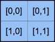
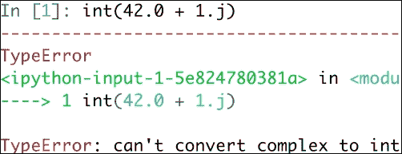
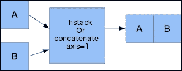
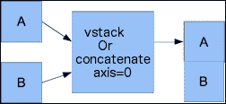
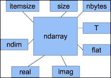

# 二、从 NumPy 基本原理开始

在安装 NumPy 并使一些代码正常工作之后，该介绍 NumPy 的基础知识了。

我们将在本章中介绍的主题如下：

*   资料类型
*   数组类型
*   类型转换
*   数组创建
*   索引编制
*   切片
*   形状操纵

在开始之前，让我对本章中的代码示例进行一些说明。 本章中的代码段显示了几个 IPython 会话的输入和输出。 回想一下，在第 1 章， “NumPy 快速入门”中引入了 IPython，它是科学计算选择的交互式 Python shell。 IPython 的优点是`--pylab`开关可以导入许多科学计算 Python 软件包，包括 NumPy，并且不需要显式调用`print()`函数来显示变量值。 其他功能还包括轻松的并行计算和 Web 浏览器中持久工作表形式的笔记本界面。

但是，本书随附的源代码是使用`import`和`print`语句的常规 Python 代码。

# NumPy 数组对象

NumPy 具有一个名为`ndarray`的多维数组对象。 它由两部分组成：

*   实际数据
*   一些描述数据的元数据

大多数数组操作都保持原始数据不变。 更改的唯一方面是元数据。

在上一章中，我们已经学习了如何使用`arange()`函数创建数组。 实际上，我们创建了一个包含一组数字的一维数组。 `ndarray`对象可以具有多个维度。

NumPy 数组通常是同质的（*实战时间 – 创建记录数据类型*部分中介绍了一种异类的特殊数组类型）—数组中的项目必须是同一类型。 好处是，如果我们知道数组中的项目属于同一类型，则很容易确定数组所需的存储大小。

NumPy 数组从 0 开始索引，就像在 Python 中一样。 数据类型由特殊对象表示。 我们将在本章中全面讨论这些对象。

让我们再次使用`arange()`函数创建一个数组。 使用以下代码获取数组的数据类型：

```py
In: a = arange(5)
In: a.dtype
Out: dtype('int64')

```

数组`a`的数据类型为`int64`（至少在我的机器上），但是如果使用 32 位 Python，则可能会得到`int32`作为输出。 在这两种情况下，我们都处理整数（64 位或 32 位）。 除了数组的数据类型外，了解其形状也很重要。

在第 1 章， “NumPy 快速入门”中，我们演示了如何创建向量（实际上是一维 NumPy 数组）。 向量通常用于数学中，但是大多数时候，我们需要更高维的对象。 确定我们在几分钟前创建的向量的形状。 以下代码是创建向量的示例：

```py
In [4]: a
Out[4]: array([0, 1, 2, 3, 4])
In: a.shape
Out: (5,)

```

如您所见，向量具有五个元素，其值范围从`0`到`4`。 数组的 shape 属性是一个元组，在这种情况下为 1 个元素的元组，其中包含每个维度的长度。

### 注意

Python 中的**元组**是一个不变的（不能更改）值序列。 创建元组后，不允许我们更改元组元素的值或追加新元素。 这使元组比列表更安全，因为您不能偶然对其进行突变。 元组的常见用例是作为函数的返回值。 有关更多示例，请查看第 3 章的“元组介绍”部分，可在 [diveintopython.net](http://www.diveintopython.net/native_data_types/tuples.html) 上获得。

# 实战时间 – 创建多维数组

既然我们知道如何创建向量，就可以创建多维 NumPy 数组了。 创建数组后，我们将再次想要显示其形状：

1.  创建一个两两数组：

    ```py
    In: m = array([arange(2), arange(2)])
    In: m
    Out:
    array([[0, 1],
     [0, 1]])

    ```

2.  显示数组形状：

    ```py
    In: m.shape
    Out: (2, 2)

    ```

## 刚刚发生了什么？

我们使用值得信赖和喜爱的`arange()`和`array()`函数创建了一个 2 x 2 的数组。 没有任何警告，`array()`函数出现在舞台上。

`array()`函数根据您提供给它的对象创建一个数组。 该对象必须是类似数组的，例如 Python 列表。 在前面的示例中，我们传入了一个数组列表。 该对象是`array()`函数的唯一必需参数。 NumPy 函数倾向于具有许多带有预定义默认值的可选参数。 在 IPython shell 中使用此处提供的`help()`函数查看此函数的文档：

```py
In [1]: help(array)

```

或使用以下速记：

```py
In [2]: array?

```

当然，您可以在此示例中将`array`替换为您感兴趣的另一个 NumPy 函数。

## 小测验– ndarray 的形状

Q1。 `ndarray`的形状如何存储？

1.  它存储在逗号分隔的字符串中。
2.  它存储在列表中。
3.  它存储在元组中。

## 拥有围棋英雄-创建三乘三的数组

现在创建一个三乘三的数组应该不难  。 试试看，检查数组形状是否符合预期。

## 选择元素

我们有时需要选择数组的特定元素。 我们将看一下如何执行此操作，但是，首先，再次创建一个 2 x 2 数组：

```py
In: a = array([[1,2],[3,4]])
In: a
Out:
array([[1, 2],
 [3, 4]])

```

这次是通过将列表列表传递给`array()`函数来创建数组的。 现在，我们将逐一选择矩阵的每个项目。 请记住，索引从`0:`开始编号

```py
In: a[0,0]
Out: 1
In: a[0,1]
Out: 2
In: a[1,0]
Out: 3
In: a[1,1]
Out: 4

```

如您所见，选择数组的元素非常简单。 对于数组`a`，我们只使用符号`a[m,n]`，其中`m`和`n`是数组中该项的索引（数组的维数比本示例中的还要多）。 此屏幕快照显示了一个简单的数组示例：



## NumPy 数值类型

Python 具有整数类型，浮点类型和复杂类型； 但是，这还不足以进行科学计算，因此，NumPy 拥有更多的数据类型  ，它们的精度取决于存储要求。

### 注意

整数代表整数，例如-1、0 和 1。浮点数对应于数学中使用的实数，例如分数或无理数，例如`pi`。 由于计算机的工作方式，我们能够精确地表示整数，但是浮点数是近似值。 复数可以具有通常用`i`或`j`表示的虚部。 根据定义，`i`是 -1 的平方根。 例如，`2.5 + 3.7i`是一个复数（有关更多信息，请参阅[这里](https://www.khanacademy.org/math/precalculus/imaginary_complex_precalc)）。

在实践中，我们甚至需要更多具有不同精度的类型，因此，该类型的内存大小也有所不同。 大多数 NumPy 数值类型都以数字结尾。 该数字表示与该类型关联的位的数目。 下表（根据 NumPy 用户指南改编）概述了 NumPy 数值类型：

| 类型 | 描述 |
| --- | --- |
| `bool` | 布尔（`True`或`False`）存储为位 |
| `inti` | 平台整数（通常为`int32`或`int64`） |
| `int8` | 字节（-128 至 127） |
| `int16` | 整数（-32768 至 32767） |
| `int32` | 整数（`-2 ** 31`到`2 ** 31 -1`） |
| `int64` | 整数（`-2 ** 63`到`2 ** 63 -1`） |
| `uint8` | 无符号整数（0 到 255） |
| `uint16` | 无符号整数（0 到 65535） |
| `uint32` | 无符号整数（0 到`2 ** 32-1`） |
| `uint64` | 无符号整数（0 到`2 ** 64-1`） |
| `float16` | 半精度浮点数：符号位，5 位指数，10 位尾数 |
| `float32` | 单精度浮点数：符号位，8 位指数，23 位尾数 |
| `float64`或`float` | 双精度浮点数：符号位，11 位指数，52 位尾数 |
| `complex64` | 复数，由两个 32 位浮点数表示（实部和虚部） |
| `complex128`或`complex` | 复数，由两个 64 位浮点数表示（实部和虚部） |

对于浮点类型，我们可以使用此处提供的`finfo()`函数来请求信息：

```py
In: finfo(float16)
Out: finfo(resolution=0.0010004, min=-6.55040e+04, max=6.55040e+04, dtype=float16)

```

对于每种数据类型，都有一个对应的转换函数：

```py
In: float64(42)
Out: 42.0
In: int8(42.0)
Out: 42
In: bool(42)
Out: True
In: bool(0)
Out: False
In: bool(42.0)
Out: True
In: float(True)
Out: 1.0
In: float(False)
Out: 0.0

```

许多函数都有一个数据类型参数，该参数通常是可选的：

```py
In: arange(7, dtype=uint16)
Out: array([0, 1, 2, 3, 4, 5, 6], dtype=uint16)

```

重要的是要知道您不允许将复数转换为整数或浮点数。 尝试执行触发`TypeError`的  ，如以下屏幕截图所示：



将复数转换为浮点数也是如此。

### 注意

Python 中的异常是一种异常情况，我们通常会尝试避免这种情况。 `TypeError`是 Python 内置的异常，当我们为参数指定错误的类型时发生。

`j`部分是复数的虚数系数。 但是，您可以将浮点数转换为复数，例如`complex(1.0)`。

## 数据类型对象

**数据类型对象**是`numpy.dtype`类。 再次  ，数组具有数据类型。 确切地说，NumPy 数组中的每个元素都具有相同的数据类型。 数据类型对象可以告诉您数据的大小（以字节为单位）。 以字节为单位的大小由`dtype` 类的`itemsize`属性给出：

```py
In: a.dtype.itemsize
Out: 8

```

## 字符代码

包括**字符代码**是为了与数字向后兼容。 数字是 NumPy 的前身。 虽然不建议使用，但此处提供代码，因为它们会在多个位置出现。 相反，我们应该使用`dtype`对象。 下表显示了字符代码：

| 类型 | 字符码 |
| --- | --- |
| 整数 | `i` |
| 无符号整数 | `u` |
| 单精度浮点 | `f` |
| 双精度浮点 | `d` |
| 布尔型 | `b` |
| 复数 | `D` |
| 字符串 | `S` |
| Unicode | `U` |
| 无 | `V` |

查看以下代码以创建单精度浮点数数组：

```py
In: arange(7, dtype='f')
Out: array([ 0.,  1.,  2.,  3.,  4.,  5.,  6.], dtype=float32)

```

同样，这将创建一个复数数组。

```py
In: arange(7, dtype='D')
Out: array([ 0.+0.j,  1.+0.j,  2.+0.j,  3.+0.j,  4.+0.j,  5.+0.j,  6.+0.j])

```

## dtype 构造函数

Python 类具有函数，如果它们属于一个类，则这些函数称为**方法**。 其中某些方法是特殊的，  用于创建新对象。 这些专门方法称为**构造函数**。

### 注意

您可以在[这个页面](https://docs.python.org/2/tutorial/classes.html)上阅读有关 Python 类的更多信息。

我们有多种创建数据类型的方法。 以浮点数据为例：

*   使用通用的 Python 浮点数：

    ```py
    In: dtype(float)
    Out: dtype('float64')

    ```

*   用字符代码指定一个单精度浮点数：

    ```py
    In: dtype('f')
    Out: dtype('float32')

    ```

*   使用双精度浮点字符代码：

    ```py
    In: dtype('d')
    Out: dtype('float64')

    ```

*   我们可以给数据类型构造函数一个两个字符的代码。 第一个字符表示类型，第二个字符是一个数字，用于指定类型中的字节数（数字 2、4 和 8 对应于 16、32 和 64 位浮点数）：

    ```py
    In: dtype('f8')
    Out: dtype('float64')

    ```

可以使用`sctypeDict.keys()`函数找到所有完整数据类型名称的列表：

```py
In: sctypeDict.keys()
Out: [0, …
 'i2',
 'int0']

```

## dtype 属性

`dtype`类具有许多有用的属性。 例如，通过`dtype`的属性获取有关数据类型的字符代码的信息：

```py
In: t = dtype('Float64')
In: t.char
Out: 'd'

```

type 属性对应于数组元素的对象类型：

```py
In: t.type
Out: <type 'numpy.float64'>

```

`dtype`类的`str`属性给出了数据类型的字符串表示形式。 它以代表**字节序**的字符开头（如果合适），然后是一个字符代码，后跟一个与每个数组项所需的字节数相对应的数字。 字节序在这里指  ，即在 32 位或 64 位字中对字节进行排序的方式。 按照大端顺序，最高有效字节先存储，由`>`指示。 以低字节序排列，最低有效字节先存储，由`<`指示：

```py
In: t.str
Out: '<f8'

```

# 实战时间 – 创建记录数据类型

记录数据类型是一种异构数据类型，可以认为它代表电子表格或数据库中的一行。 为了提供记录数据类型的示例，我们将为商店股票创建一条记录。 记录包含商品名称，40 个字符的字符串，商店中商品的数量（由 32 位整数表示）以及最后由 32 位浮点数表示的价格。 这些连续的步骤显示了如何创建记录数据类型：

1.  创建记录：

    ```py
    In: t = dtype([('name', str_, 40), ('numitems', int32), ('price', float32)])
    In: t
    Out: dtype([('name', '|S40'), ('numitems', '<i4'), ('price', '<f4')])

    ```

2.  查看类型（我们也可以查看字段的类型）：

    ```py
    In: t['name']
    Out: dtype('|S40')

    ```

如果不为`array()`函数提供数据类型，则将假定它正在处理浮点数。 现在要创建数组，我们实际上必须指定数据类型； 否则，我们将获得`TypeError`：

```py
In: itemz = array([('Meaning of life DVD', 42, 3.14), ('Butter', 13, 2.72)], dtype=t)
In: itemz[1]
Out: ('Butter', 13, 2.7200000286102295)

```

## 刚刚发生了什么？

我们创建了一个记录数据类型，它是一个异构数据类型。 该记录包含一个名称，该名称为字符串，数字为整数，以及以浮点数表示的价格。 该示例的代码可以在本书代码捆绑中的`record.py`文件中找到。

# 一维切片和索引

一维 NumPy 数组的切片就像 Python 列表的切片一样工作。 从索引`3`到`7`中选择一个数组  ，该数组提取元素`3`至`6`：

```py
In: a = arange(9)
In: a[3:7]
Out: array([3, 4, 5, 6])

```

通过步骤 2 从索引`0`到`7`中选择元素，如下所示：

```py
In: a[:7:2]
Out: array([0, 2, 4, 6])

```

同样，与 Python 中一样，使用负索引并使用以下代码片段反转数组：

```py
In: a[::-1]
Out: array([8, 7, 6, 5, 4, 3, 2, 1, 0])

```

# 实战时间 – 切片和索引多维数组

`ndarray`类支持在多个维度上切片。 为了方便  ，我们一次用省略号指代许多尺寸。

1.  To illustrate, create an array with the `arange()` function and reshape it:

    ```py
    In: b = arange(24).reshape(2,3,4)
    In: b.shape
    Out: (2, 3, 4)
    In: b
    Out:
    array([[[ 0,  1,  2,  3],
     [ 4,  5,  6,  7],
     [ 8,  9, 10, 11]],
     [[12, 13, 14, 15],
     [16, 17, 18, 19],
     [20, 21, 22, 23]]])

    ```

    数组`b`具有`24`元素，其值从`0`至`23`，我们将其重构为 2×3×4 的三维数组。 我们可以将其可视化为一个两层楼的建筑，每层有 12 个房间，3 行和 4 列（或者我们可以将其视为包含工作表，行和列的电子表格）。 您可能已经猜到了，`reshape()`函数会更改数组的形状。 我们给它一个整数元组，对应于新的形状。 如果维度与数据不兼容，则会引发异常。

2.  我们可以使用其三个坐标（即地板，列和行）选择一个房间。 例如，可以表示行和第一列中的房间（我们可以有 0 层，房间 0，这只是一个惯例）。 由以下各项组成：

    ```py
    In: b[0,0,0]
    Out: 0

    ```

3.  If we don't care about the floor, but still want the first column and row, we replace the first index by a**:** (**colon**) because we just need to specify the floor number and omit the other indices:

    ```py
    In: b[:,0,0]
    Out: array([ 0, 12])

    ```

    选择此代码中的第一层：

    ```py
    In: b[0]
    Out:
    array([[ 0,  1,  2,  3],
     [ 4,  5,  6,  7],
     [ 8,  9, 10, 11]])

    ```

    我们也可以这样写：

    ```py
    In: b[0, :, :]
    Out:
    array([[ 0,  1,  2,  3],
     [ 4,  5,  6,  7],
     [ 8,  9, 10, 11]])

    ```

    省略号（...）替换了多个冒号，因此，前面的代码等效于此：

    ```py
    In: b[0, ...]
    Out:
    array([[ 0,  1,  2,  3],
     [ 4,  5,  6,  7],
     [ 8,  9, 10, 11]])

    ```

    此外，在第一层获得第二行：

    ```py
    In: b[0,1]
    Out: array([4, 5, 6, 7])

    ```

4.  **带有步长的切片**：此外，还要选择此选择的每隔一个元素：

    ```py
    In: b[0,1,::2]
    Out: array([4, 6])

    ```

5.  **Using an ellipsis to slice**: If we want to select all the rooms on both floors that are in the second column, regardless of the row, type this code:

    ```py
    In: b[...,1]
    Out:
    array([[ 1,  5,  9],
     [13, 17, 21]])

    ```

    同样，通过编写以下代码段，选择第二行中的所有房间，而不管楼层和列如何：

    ```py
    In: b[:,1]
    Out:
    array([[ 4,  5,  6,  7],
     [16, 17, 18, 19]])

    ```

    如果我们要在第一层第二栏中选择房间，请输入以下内容：

    ```py
    In: b[0,:,1]
    Out: array([1, 5, 9])

    ```

6.  **Using negative indices**: If we want to select the first floor, last column, then type the following code snippet:

    ```py
    In: b[0,:,-1]
    Out: array([ 3,  7, 11])

    ```

    如果我们要选择一楼的房间，则将最后一列颠倒过来，然后输入以下代码片段：

    ```py
    In: b[0,::-1, -1]
    Out: array([11,  7,  3])

    ```

    选择该片的第二个元素，如下所示：

    ```py
    In: b[0,::2,-1]
    Out: array([ 3, 11])

    ```

    反转一维数组的命令将起始放到末尾，如下所示：

    ```py
    In: b[::-1]
    Out:
    array([[[12, 13, 14, 15],
     [16, 17, 18, 19],
     [20, 21, 22, 23]],
     [[ 0,  1,  2,  3],
     [ 4,  5,  6,  7],
     [ 8,  9, 10, 11]]])

    ```

## 刚刚发生了什么？

我们使用几种不同的方法对多维 NumPy 数组进行了切片。 该示例的代码可以在本书代码捆绑中的`slicing.py`文件中找到。

# 实战时间 – 处理数组形状

我们已经了解了`reshape()`函数。 另一个重复执行的任务是将数组展平。 展平多维 NumPy 数组时，结果是具有相同数据的一维数组。

1.  **Ravel**：使用`ravel()`函数完成：

    ```py
    In: b
    Out:
    array([[[ 0,  1,  2,  3],
     [ 4,  5,  6,  7],
     [ 8,  9, 10, 11]],
     [[12, 13, 14, 15],
     [16, 17, 18, 19],
     [20, 21, 22, 23]]])
    In: b.ravel()
    Out:
    array([ 0,  1,  2,  3,  4,  5,  6,  7,  8,  9, 10, 11, 12, 13, 14, 15, 16,
     17, 18, 19, 20, 21, 22, 23])

    ```

2.  **展开**：适当的命名函数`flatten()`与`ravel()`相同，但`flatten()`总是分配新的内存，而`ravel()`可能会返回数组的视图。 视图是共享数组的一种方法，但是您需要对视图小心  ，因为修改视图会影响基础数组，因此会影响其他视图。 数组副本更安全； 但是，它使用更多的内存：

    ```py
    In: b.flatten()
    Out:
    array([ 0,  1,  2,  3,  4,  5,  6,  7,  8,  9, 10, 11, 12, 13, 14, 15, 16,
     17, 18, 19, 20, 21, 22, 23])

    ```

3.  **Setting the shape with a tuple**: Besides the `reshape()` function, we can also set the shape directly with a tuple, which is shown here:

    ```py
    In: b.shape = (6,4)
    In: b
    Out:
    array([[ 0,  1,  2,  3],
     [ 4,  5,  6,  7],
     [ 8,  9, 10, 11],
     [12, 13, 14, 15],
     [16, 17, 18, 19],
     [20, 21, 22, 23]])

    ```

    如您所见，这将直接更改数组。 现在，我们有了一个六乘四的数组。

4.  **Transpose**: In linear algebra, it is common to transpose matrices.

    ### 注意

    线性代数是数学的一个分支，其中涉及**矩阵**。 矩阵是向量的二维等效项，并且包含矩形或正方形网格中的数字。 转置矩阵需要以使矩阵行变为矩数组的方式翻转矩阵，反之亦然。 可汗学院开设了关于线性代数的课程，其中包括[上的](https://www.khanacademy.org/math/linear-algebra/matrix_transformations/matrix_transpose/v/linear-algebra-transpose-of-a-matrix)  转置矩阵。https://www.khanacademy.org/math/linear-algebra/matrix_transformations/matrix_transpose/v/linear-algebra-transpose 矩阵。

    我们也可以使用以下代码来做到这一点：

    ```py
    In: b.transpose()
    Out:
    array([[ 0,  4,  8, 12, 16, 20],
     [ 1,  5,  9, 13, 17, 21],
     [ 2,  6, 10, 14, 18, 22],
     [ 3,  7, 11, 15, 19, 23]])

    ```

5.  **调整大小**：`resize()`方法的作用与`reshape()`函数相同，但是修改了它在数组上执行的操作：

    ```py
    In: b.resize((2,12))
    In: b
    Out:
    array([[ 0,  1,  2,  3,  4,  5,  6,  7,  8,  9, 10, 11],
     [12, 13, 14, 15, 16, 17, 18, 19, 20, 21, 22, 23]])

    ```

## 刚刚发生了什么？

我们使用`ravel()`函数，`flatten()`函数，`reshape()`函数和`resize()`方法操纵 NumPy 数组的形状，如下表所示：

| 函数 | 描述 |
| --- | --- |
| `ravel()` | 此函数返回一维数组，其数据与输入数组相同，并不总是返回副本 |
| `flatten()` | 这是`ndarray`的方法，它会展平数组并始终返回数组的副本 |
| `reshape()` | 此函数修改数组的形状 |
| `resize()` | 此函数更改数组的形状，并在必要时添加输入数组的副本 |

该示例的代码在本书代码捆绑的`shapemanipulation.py`文件中。

## 堆叠

数组可以水平，深度或垂直堆叠。 为此，我们可以使用`vstack()`，`dstack()`，`hstack()`，`column_stack()`，`row_stack()`和`concatenate()`函数。

# 实战时间 – 堆叠数组

首先，设置一些数组：

```py
In: a = arange(9).reshape(3,3)
In: a
Out:
array([[0, 1, 2],
 [3, 4, 5],
 [6, 7, 8]])
In: b = 2 * a
In: b
Out:
array([[ 0,  2,  4],
 [ 6,  8, 10],
 [12, 14, 16]])

```

1.  **Horizontal stacking**: Starting with horizontal stacking, form a tuple of the `ndarray` objects and give it to the `hstack()` function as follows:

    ```py
    In: hstack((a, b))
    Out:
    array([[ 0,  1,  2,  0,  2,  4],
     [ 3,  4,  5,  6,  8, 10],
     [ 6,  7,  8, 12, 14, 16]])

    ```

    使用`concatenate()`函数可以达到以下效果（此处的 axis 参数等效于笛卡尔坐标系中的轴，并且对应于数组尺寸）：

    ```py
    In: concatenate((a, b), axis=1)
    Out:
    array([[ 0,  1,  2,  0,  2,  4],
     [ 3,  4,  5,  6,  8, 10],
     [ 6,  7,  8, 12, 14, 16]])

    ```

    此图显示了`concatenate()`函数的水平堆叠：

    
2.  **Vertical stacking**: With vertical stacking, again, a tuple is formed. This time, it is given to the `vstack()` function as follows:

    ```py
    In: vstack((a, b))
    Out:
    array([[ 0,  1,  2],
     [ 3,  4,  5],
     [ 6,  7,  8],
     [ 0,  2,  4],
     [ 6,  8, 10],
     [12, 14, 16]])

    ```

    `concatenate()`函数在将轴设置为 0 时产生相同的结果。这是`axis`参数的默认值：

    ```py
    In: concatenate((a, b), axis=0)
    Out:
    array([[ 0,  1,  2],
     [ 3,  4,  5],
     [ 6,  7,  8],
     [ 0,  2,  4],
     [ 6,  8, 10],
     [12, 14, 16]])

    ```

    下图显示了具有`concatenate()`函数的垂直堆叠：

    
3.  **深度堆叠**：另外，使用`dstack()`和元组的深度堆叠，沿第三个轴（深度）堆叠了数组的列表。 例如，将图像数据的二维数组彼此堆叠在一起：

    ```py
    In: dstack((a, b))
    Out:
    array([[[ 0,  0],
     [ 1,  2],
     [ 2,  4]],
     [[ 3,  6],
     [ 4,  8],
     [ 5, 10]],
     [[ 6, 12],
     [ 7, 14],
     [ 8, 16]]])

    ```

4.  **Column stacking**: Stack the one-dimensional arrays with the `column_stack()` function column-wise as follows:

    ```py
    In: oned = arange(2)
    In: oned
    Out: array([0, 1])
    In: twice_oned = 2 * oned
    In: twice_oned
    Out: array([0, 2])
    In: column_stack((oned, twice_oned))
    Out:
    array([[0, 0],
     [1, 2]])

    ```

    二维数组以`hstack()`的方式堆叠：

    ```py
    In: column_stack((a, b))
    Out:
    array([[ 0,  1,  2,  0,  2,  4],
     [ 3,  4,  5,  6,  8, 10],
     [ 6,  7,  8, 12, 14, 16]])
    In: column_stack((a, b)) == hstack((a, b))
    Out:
    array([[ True,  True,  True,  True,  True,  True],
     [ True,  True,  True,  True,  True,  True],
     [ True,  True,  True,  True,  True,  True]], dtype=bool)

    ```

    是的，您猜对了！ 我们用`==`运算符比较了两个数组。

    ### 注意

    `==`运算符用于比较 Python 对象是否相等。 当应用于 NumPy 数组时，运算符将执行逐元素比较。 有关  Python 比较运算符的更多信息，请查看[这里](http://www.pythonlearn.com/html-009/book004.html)。

5.  **Row stacking**: NumPy, of course, also has a function that does row-wise stacking. It is called `row_stack()`, and, for one-dimensional arrays, it just stacks the arrays in rows into a two-dimensional array:

    ```py
    In: row_stack((oned, twice_oned))
    Out:
    array([[0, 1],
     [0, 2]])

    ```

    二维数组的`row_stack()`函数结果等于`vstack()`函数结果：

    ```py
    In: row_stack((a, b))
    Out:
    array([[ 0,  1,  2],
     [ 3,  4,  5],
     [ 6,  7,  8],
     [ 0,  2,  4],
     [ 6,  8, 10],
     [12, 14, 16]])
    In: row_stack((a,b)) == vstack((a, b))
    Out:
    array([[ True,  True,  True],
     [ True,  True,  True],
     [ True,  True,  True],
     [ True,  True,  True],
     [ True,  True,  True],
     [ True,  True,  True]], dtype=bool)

    ```

## 刚刚发生了什么？

我们水平，深度和垂直堆叠数组。 我们使用了`vstack()`，`dstack()`，`hstack()`，`column_stack()`，`row_stack()`和`concatenate()`函数，如下表所示：

<colgroup class="calibre22"><col class="calibre23"> <col class="calibre23"></colgroup> 
| 函数 | 描述 |
| --- | --- |
| `vstack()` | 此函数垂直堆叠数组 |
| `dstack()` | 此函数沿第三轴深度堆叠数组 |
| `hstack()` | 此函数水平堆叠数组 |
| `column_stack()` | 此函数将一维数组堆叠为列以创建二维数组 |
| `row_stack()` | 此函数垂直堆叠数组 |
| `concatenate()` | 此函数连接数组的列表或元组 |

此示例的代码在本书的代码包的`stacking.py`文件中。

## 分割

可以在垂直，水平或深度方向拆分数组。 涉及的功能是`hsplit()`，`vsplit()`，`dsplit()`和`split()`。 我们既可以拆分为相同形状的数组，也可以指示拆分之后应该发生的位置。

# 实战时间 – 分割数组

以下步骤演示了数组的拆分：

1.  **Horizontal splitting**: The ensuing code splits an array along its horizontal axis into three pieces of the same size and shape:

    ```py
    In: a
    Out:
    array([[0, 1, 2],
     [3, 4, 5],
     [6, 7, 8]])
    In: hsplit(a, 3)
    Out:
    [array([[0],
     [3],
     [6]]),
     array([[1],
     [4],
     [7]]),
     array([[2],
     [5],
     [8]])]

    ```

    将它与带有附加参数`axis=1`的`split()`函数调用进行比较：

    ```py
    In: split(a, 3, axis=1)
    Out:
    [array([[0],
     [3],
     [6]]),
     array([[1],
     [4],
     [7]]),
     array([[2],
     [5],
     [8]])]

    ```

2.  **Vertical splitting**: `vsplit()` splits along the vertical axis:

    ```py
    In: vsplit(a, 3)
    Out: [array([[0, 1, 2]]), array([[3, 4, 5]]), array([[6, 7, 8]])]

    ```

    `split()`函数和`axis=0`也沿垂直轴分割：

    ```py
    In: split(a, 3, axis=0)
    Out: [array([[0, 1, 2]]), array([[3, 4, 5]]), array([[6, 7, 8]])]

    ```

3.  **深度拆分**：`dsplit()`函数毫不奇怪地是深度拆分。 分割前先创建一个排列为  3 的数组：

    ```py
    In: c = arange(27).reshape(3, 3, 3)
    In: c
    Out:
    array([[[ 0,  1,  2],
     [ 3,  4,  5],
     [ 6,  7,  8]],
     [[ 9, 10, 11],
     [12, 13, 14],
     [15, 16, 17]],
     [[18, 19, 20],
     [21, 22, 23],
     [24, 25, 26]]])
    In: dsplit(c, 3)
    Out:
    [array([[[ 0],
     [ 3],
     [ 6]],
     [[ 9],
     [12],
     [15]],
     [[18],
     [21],
     [24]]]),
     array([[[ 1],
     [ 4],
     [ 7]],
     [[10],
     [13],
     [16]],
     [[19],
     [22],
     [25]]]),
     array([[[ 2],
     [ 5],
     [ 8]],
     [[11],
     [14],
     [17]],
     [[20],
     [23],
     [26]]])]

    ```

## 刚刚发生了什么？

我们使用`hsplit()`，`vsplit()`，`dsplit()`和`split()`函数拆分数组。 这些功能拆分的轴是不同的。 该示例的代码在本书代码捆绑的`splitting.py`文件中。

## 数组属性

除了`shape`，和`dtype`属性外，`ndarray`还有许多其他属性，如下表所示：

*   `ndim`属性提供了维度数：

    ```py
    In: b
    Out:
    array([[ 0,  1,  2,  3,  4,  5,  6,  7,  8,  9, 10, 11],
     [12, 13, 14, 15, 16, 17, 18, 19, 20, 21, 22, 23]])
    In: b.ndim
    Out: 2

    ```

*   `size`属性包含元素数。 如下所示：

    ```py
    In: b.size
    Out: 24

    ```

*   `itemsize`属性提供数组中每个元素的字节数：

    ```py
    In: b.itemsize
    Out: 8

    ```

*   如果需要数组所需的字节总数，可以查看`nbytes`。 这只是`itemsize`和`size`属性的乘积：

    ```py
    In: b.nbytes
    Out: 192
    In: b.size * b.itemsize
    Out: 192

    ```

*   `T`属性具有`transpose()`函数的相同效果，如下所示：

    ```py
    In: b.resize(6,4)
    In: b
    Out:
    array([[ 0,  1,  2,  3],
     [ 4,  5,  6,  7],
     [ 8,  9, 10, 11],
     [12, 13, 14, 15],
     [16, 17, 18, 19],
     [20, 21, 22, 23]])
    In: b.T
    Out:
    array([[ 0,  4,  8, 12, 16, 20],
     [ 1,  5,  9, 13, 17, 21],
     [ 2,  6, 10, 14, 18, 22],
     [ 3,  7, 11, 15, 19, 23]])

    ```

*   If the array has a rank lower than 2, we will just get a view of the array:

    ```py
    In: b.ndim
    Out: 1
    In: b.T
    Out: array([0, 1, 2, 3, 4])

    ```

    NumPy 中的复数用`j.`表示。例如，创建具有复数的数组，如以下代码所示：

    ```py
    In: b = array([1.j + 1, 2.j + 3])
    In: b
    Out: array([ 1.+1.j,  3.+2.j])

    ```

*   `real`属性为我们提供了数组的实部，或者如果数组仅包含实数，则为数组本身：

    ```py
    In: b.real
    Out: array([ 1.,  3.])

    ```

*   `imag`属性包含数组的虚部：

    ```py
    In: b.imag
    Out: array([ 1.,  2.])

    ```

*   如果数组包含复数，则数据类型也将自动变为复数：

    ```py
    In: b.dtype
    Out: dtype('complex128')
    In: b.dtype.str
    Out: '<c16'

    ```

*   The `flat` attribute returns a `numpy.flatiter` object. This is the only way to acquire a `flatiter`—we do not have access to a `flatiter` constructor. The flat iterator enables us to loop through an array as if it is a flat array, as shown in the following example:

    ```py
    In: b = arange(4).reshape(2,2)
    In: b
    Out:
    array([[0, 1],
     [2, 3]])
    In: f = b.flat
    In: f
    Out: <numpy.flatiter object at 0x103013e00>
    In: for item in f: print item
     .....:
    0
    1
    2
    3

    ```

    可以直接通过`flatiter`对象获取元素：

    ```py
    In: b.flat[2]
    Out: 2

    ```

    并且，还可以直接获取多个元素：

    ```py
    In: b.flat[[1,3]]
    Out: array([1, 3])

    ```

    `flat`属性是可设置的。 设置`flat`属性的值会导致覆盖整个数组的值：

    ```py
    In: b.flat = 7
    In: b
    Out:
    array([[7, 7],
     [7, 7]])

    ```

    或者，它也可能导致覆盖所选元素的值：

    ```py
    In: b.flat[[1,3]] = 1
    In: b
    Out:
    array([[7, 1],
     [7, 1]])

    ```

    下图显示了`ndarray`类的不同类型的属性：

    

# 实战时间 – 转换数组

使用`tolist()`函数将 NumPy 数组转换为 Python 列表：

1.  转换为列表：

    ```py
    In: b
    Out: array([ 1.+1.j,  3.+2.j])
    In: b.tolist()
    Out: [(1+1j), (3+2j)]

    ```

2.  The `astype()` function converts the array to an array of the specified type:

    ```py
    In: b
    Out: array([ 1.+1.j,  3.+2.j])
    In: b.astype(int)
    /usr/local/bin/ipython:1: ComplexWarning: Casting complex values to real discards the imaginary part
     #!/usr/bin/python
    Out: array([1, 3])

    ```

    ### 注意

    从 NumPy 复杂类型（而不是普通的 Python 版本）转换为`int`时，我们将丢失虚部。 `astype()`函数还接受类型名称作为字符串。

    ```py
    In: b.astype('complex')
    Out: array([ 1.+1.j,  3.+2.j])

    ```

这次我们不会显示任何警告，因为我们使用了正确的数据类型。

## 刚刚发生了什么？

我们将 NumPy 数组转换为列表和不同数据类型的数组。 该示例的代码在本书代码捆绑的`arrayconversion.py`文件中。

# 总结

在本章中，您学习了很多有关 NumPy 的基础知识：数据类型和数组。 数组有几个描述它们的属性。 您了解到这些属性之一是数据类型，在 NumPy 中，数据类型由完整的对象表示。

就像 Python 列表一样，可以以高效的方式对 NumPy 数组进行切片和索引。 NumPy 数组具有处理多个维度的附加功能。

数组的形状可以通过多种方式进行操作-堆叠，调整大小，调整形状和拆分。 本章演示了许多用于形状处理的便捷功能。

了解了基础知识之后，是时候进入第 3 章，“熟悉常用功能”了，其中包括了基本功能。 统计和数学功能。