# 三、熟悉常用函数

在本章中，我们将介绍常见的 NumPy 函数。 特别是，我们将通过一个涉及历史股价的示例来学习如何从文件加载数据。 此外，我们还将了解 NumPy 的基本数学和统计函数。

我们将学习如何读写文件。 此外，我们还将品尝 NumPy 中的函数式编程和线性代数的可能性。

在本章中，我们将涵盖以下主题：

*   数组上的函数
*   从文件加载数组
*   将数组写入文件
*   简单的数学和统计函数

## 文件 I/O

首先，我们将学习如何使用 NumPy 进行文件 I/O。 数据通常存储在文件中。 如果您无法读取和写入文件，您将走不远。

## 实战时间 – 读写文件

作为文件 I/O 的示例，我们将创建一个单位矩阵并将其内容存储在文件中。

#### 注意

在本章和其他章中，我们将按照约定使用以下行导入 NumPy：

`import numpy as np`

请执行以下步骤：

1.  [单位矩阵是一个正方形矩阵，在主对角线上有一，其余部分为零](https://www.khanacademy.org/math/precalculus/precalc-matrices/zero-identity-matrix-tutorial/v/identity-matrix)。

    可以使用`eye()`函数创建单位矩阵。 我们需要给`eye()`函数的唯一参数是个数。 因此，例如对于一个二乘二的矩阵，编写以下代码：

    ```py
    i2 = np.eye(2)
    print(i2)
    ```

    输出为：

    ```py
    [[ 1\.  0.]
    [ 0\.  1.]]
    ```

2.  使用`savetxt()`函数将数据保存在纯文本文件中。 指定我们要在其中保存数据的文件的名称以及包含数据本身的数组：

    ```py
    np.savetxt("eye.txt", i2)
    ```

应该在与 Python 脚本相同的目录中创建名为`eye.txt`的文件。

### 刚刚发生了什么？

读写文件是数据分析的必要技能。 我们使用`savetxt()`写入文件。 我们使用`eye()`函数制作了一个单位矩阵。

#### 注意

除了文件名，我们还可以提供**文件句柄**。 文件句柄是许多编程语言中的术语，它表示指向文件的变量，例如邮政地址。 有关如何在 Python 中获取文件句柄的更多信息，请参考[这里](http://www.diveintopython3.net/files.html)。

您可以自己检查内容是否符合预期。 可以[从图书支持网站下载此示例的代码](https://www.packtpub.com/books/content/support)（请参阅`save.py`）。

```py
import numpy as np

i2 = np.eye(2)
print(i2)

np.savetxt("eye.txt", i2))
```

## 逗号分隔值文件

经常遇到**逗号分隔值**（**CSV**）格式的文件。 通常，CSV 文件只是数据库中的转储。 通常，CSV 文件中的每个字段都对应一个数据库表列。 众所周知，电子表格程序（例如 Excel）也可以生成 CSV 文件。

## 实战时间 – 从 CSV 文件加载

我们如何处理 CSV 文件？ 幸运的是，`loadtxt()`函数可以方便地读取 CSV 文件，拆分字段并将数据加载到 NumPy 数组中。 在以下示例中，我们将加载苹果（公司而不是水果）的历史股价数据。 数据为 CSV 格式，是本书代码集的一部分。 第一列包含一个标识股票的符号。 在我们的情况下，它是`AAPL`。 第二个是`dd-mm-yyyy`格式的日期。 第三列为空。 然后，依次获得开盘价，最高价，最低价和收盘价。 最后但并非最不重要的是当天的交易量。 这是一行的样子：

```py
AAPL,28-01-2011, ,344.17,344.4,333.53,336.1,21144800

```

目前，我们仅对收盘价和交易量感兴趣。 在前面的示例中，将是`336.1`和`21144800`。 将收盘价和成交量存储在两个数组中，如下所示：

```py
c,v=np.loadtxt('data.csv', delimiter=',', usecols=(6,7), unpack=True)
```

如您所见，数据存储在`data.csv`文件中。 由于我们正在处理 CSV 文件，因此已将定界符设置为（`comma`）。 通过元组设置`usecols`参数以获得与收盘价和交易量相对应的第七和第八字段。 `unpack`参数设置为`True`，这意味着数据将被解包并分配给分别保持收盘价和交易量的`c`和`v`变量。

## 交易量加权平均价格

**交易量加权平均价格**（**VWAP**）在金融中非常重要。 它代表金融资产的平均价格（请参阅 [https://www.khanacademy.org/math/probability/descriptive-statistics/old-stats-videos/ v / statistics-the-average](https://www.khanacademy.org/math/probability/descriptive-statistics/old-stats-videos/v/statistics-the-average) ）。 的数量越大，价格走势通常越明显。 VWAP 通常用于算法交易中，并使用交易量值作为权重进行计算。

## 实战时间 – 计算交易量加权平均价格

以下是我们将要采取的行动：

1.  将数据读入数组。
2.  计算 VWAP：

    ```py
    from __future__ import print_function
    import numpy as np
    c,v=np.loadtxt('data.csv', delimiter=',', usecols=(6,7), unpack=True)
    vwap = np.average(c, weights=v)
    print("VWAP =", vwap)
    ```

    输出如下：

    ```py
    VWAP = 350.589549353

    ```

### 刚刚发生了什么？

那不是很难，不是吗？ 我们只是调用了`average()`函数，并将其`weights`参数设置为将`v`数组用于权重。 顺便说一下，NumPy 还具有计算算术平均值的函数。 这是所有权重均等于`1`的未加权平均值。

### `mean()`函数

`mean()`函数是相当友好，并不是那么卑鄙。 此函数计算数组的算术平均值。

#### 注意

的算术平均值是由以下公式给出的  ：

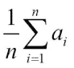

它对数组`a`中的值求和，[然后将总和除以元素数`n`](https://www.khanacademy.org/math/probability/descriptive-statistics/central_tendency/e/mean_median_and_mode)。

让我们看看它的运行情况  ：

```py
print("mean =", np.mean(c))
```

结果，我们得到以下打印输出：

```py
mean = 351.037666667

```

### 时间加权平均价格

在金融领域，**时间加权平均价格（TWAP）**是另一种平均价格指标。 现在，我们也计算 TWAP。 这实际上只是一个主题的变体。 这个想法是，最近的报价更为重要，因此我们应该给近期的价格赋予更大的权重。 最简单的方法是使用`arange()`函数创建一个数组，该函数将值从零增加到收盘价数组中的元素数量。 这不一定是正确的方法。 实际上，本书中有关股票价格分析的大多数示例只是说明性的。 以下是 TWAP 代码：

```py
t = np.arange(len(c))
print("twap =", np.average(c, weights=t))
```

它产生以下输出：

```py
twap = 352.428321839

```

TWAP 甚至高于平均值。

### 小测验 - 计算加权平均值

Q1. 哪个函数返回数组的加权平均值？

1.  `weighted_average`
2.  `waverage`
3.  `average`
4.  `avg`

### 勇往直前 – 计算其他平均值

尝试使用开盘价进行相同的计算。 计算数量和其他价格的平均值。

## 值的范围

通常，我们不仅希望知道中间值的一组值的平均值或算术平均值，还希望知道极端值，整个范围（最高和最低值） 。 我们在此处使用的样本数据每天已经具有这些值-高价和低价。 但是，我们需要知道高价的最高价和低价的最低价。

## 实战时间 – 找到最高和最低值

`min()`和`max()`函数是我们要求的答案。 执行以下步骤以找到最高和最低值：

1.  首先，再次阅读我们的文件，并将高价和低价的值存储到数组中：

    ```py
    h,l=np.loadtxt('data.csv', delimiter=',', usecols=(4,5), unpack=True)
    ```

    唯一更改的是`usecols`参数，因为高价和低价位于不同的列中。

2.  以下代码获取价格范围：

    ```py
    print("highest =", np.max(h))
    print("lowest =", np.min(l))
    ```

    这些是返回的值：

    ```py
    highest = 364.9
    lowest = 333.53

    ```

    现在，很容易获得中点，因此留给您练习。

3.  NumPy 允许我们使用名为`ptp()`的函数来计算数组的传播。 `ptp()`函数返回数组的最大值和最小值之间的差。 换句话说，它等于`max(array) - min(array)`。 调用`ptp()`函数：

    ```py
    print("Spread high price", np.ptp(h))
    print("Spread low price", np.ptp(l))
    ```

    您将看到以下文本：

    ```py
    Spread high price 24.86
    Spread low price 26.97

    ```

### 刚刚发生了什么？

我们为价格定义了最高到最低值的范围。 通过将`max()`函数应用于高价数组，可以得出最高值。 同样，通过将`min()`函数调用到低价数组可以找到最低值。 我们还使用`ptp()`函数计算了峰峰距离：

```py
from __future__ import print_function
import numpy as np

h,l=np.loadtxt('data.csv', delimiter=',', usecols=(4,5), unpack=True)
print("highest =", np.max(h))
print("lowest =", np.min(l))
print((np.max(h) + np.min(l)) /2)

print("Spread high price", np.ptp(h))
print("Spread low price", np.ptp(l))

```

## 统计

股票交易商对最可能的收盘价感兴趣。 常识认为，由于随机波动，当价格围绕均值波动时，这应该接近某种平均水平。 算术平均值和加权平均值是找到值分布中心的方法。 但是，它们都不健壮，并且都对异常值敏感。 `Outliers`是远大于或小于数据集中典型值的极值。 通常，异常值是由罕见现象或测量误差引起的。 例如，如果我们的收盘价为一百万美元，这将影响我们的计算结果。

## 实战时间 – 执行简单的统计

我们可以使用某种这种阈值来消除异常值，但是有更好的方法。 它被称为中位数，基本上是[选取一组排序值的中间值](https://www.khanacademy.org/math/probability/descriptive-statistics/central_tendency/e/mean_median_and_mode)。 数据的一半低于中位数，另一半高于中位数。 例如，如果我们具有值 1、2、3、4 和 5，则中位数将为 3，因为它位于中间。

这些是计算中位数的步骤：

1.  创建一个新的 Python 脚本并将其命名为`simplestats.py`。 您已经知道如何将数据从 CSV 文件加载到数组中。 因此，复制该行代码并确保它仅获得收盘价。 代码应如下所示：

    ```py
    c=np.loadtxt('data.csv', delimiter=',', usecols=(6,), unpack=True)
    ```

2.  对我们有用的函数称为`median()`。 我们将调用它并立即打印结果。 添加以下代码行：
    ```py
    print("median =", np.median(c))
    ```

    该程序将输出以下输出：

    ```py
    median = 352.055

    ```

3.  由于这是我们第一次使用`median()`函数，因此我们想检查一下是否正确。 显然，我们可以通过浏览文件并找到正确的值来做到这一点，但这并不有趣。 相反，我们将通过对收盘价数组进行排序并打印排序后的数组的中间值来模拟中值算法。 `msort()`函数为我们做第一部分。 调用该函数，存储排序后的数组，然后打印它：

    ```py
    sorted_close = np.msort(c)
    print("sorted =", sorted_close)
    ```

    这将输出以下输出：

    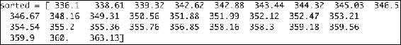

    是的，它有效！ 现在让我们获取排序数组的中间值：

    ```py
    N = len(c)
    print "middle =", sorted[(N - 1)/2]
    ```

    上面的代码片段为我们提供了以下输出：

    ```py
    middle = 351.99

    ```

4.  嘿，那和`median()`函数给我们的值不同。 怎么会？ 经过进一步调查，我们发现`median()`函数的返回值甚至没有出现在文件中。 甚至更陌生！ 向 NumPy 团队提交错误之前，让我们看一下文档：

    ```py
    $ python
     >>> import numpy as np
    >>> help(np.median)

    ```

    这个谜题很容易解决。 事实证明，我们的朴素算法仅适用于奇数长度的数组。 对于偶数长度的数组，`median`是根据中间两个数组值的平均值计算得出的。 因此，键入以下代码：

    ```py
    print("average middle =", (sorted[N /2] + sorted[(N - 1) / 2]) / 2)
    ```

    This prints the following output:

    ```py
    average middle = 352.055

    ```

5.  我们关注的另一个统计指标是方差。 [“方差”告诉我们变量的变化量](https://www.khanacademy.org/math/probability/descriptive-statistics/variance_std_deviation/e/variance)。 在我们的案例中，它还告诉我们投资有多高风险，因为股价变化过大必然会给我们带来麻烦。

    计算收盘价的方差（使用 NumPy，这只是一种方法）：

    ```py
    print("variance =", np.var(c))
    ```

    这为我们提供了以下输出：

    ```py
    variance = 50.1265178889

    ```

6.  并不是说我们不信任 NumPy 或其他任何东西，而是让我们使用文档中的方差定义仔细检查。 请注意，此定义可能与您的统计书中的定义不同，但这在统计领域非常普遍。

    ### 注意

    `population variance`定义为与平均值的偏差平方的平均值，除以数组中元素的数量：

    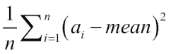

    一些书告诉我们将数组中的元素数除以 1（这称为**样本方差**）：

    ```py
    print("variance from definition =", np.mean((c - c.mean())**2))
    ```

    The output is as follows:

    ```py
    variance from definition = 50.1265178889

    ```

### 刚刚发生了什么？

也许您注意到了一些新东西。 我们突然在`c`数组上调用了`mean()`函数。 是的，这是合法的，因为`ndarray`类具有`mean()`方法。 这是为了您的方便。 现在，请记住这是可能的。 此示例的代码可以在`simplestats.py`中找到：

```py
from __future__ import print_function
import numpy as np

c=np.loadtxt('data.csv', delimiter=',', usecols=(6,), unpack=True)
print("median =", np.median(c))
sorted = np.msort(c)
print("sorted =", sorted)

N = len(c)
print("middle =", sorted[(N - 1)/2])
print("average middle =", (sorted[N /2] + sorted[(N - 1) / 2]) / 2)

print("variance =", np.var(c))
print("variance from definition =", np.mean((c - c.mean())**2))

```

## 股票收益

在学术文献中，更常见的是基于收盘价的股票收益和对数收益进行分析。 简单的回报就是从一个值到下一个值的变化率。 对数收益或对数收益是通过取所有价格的对数并计算它们之间的差来确定的。 在高中时，我们了解到：

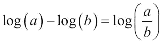

因此，对数返回还可以测量变化率。 收益是无量纲的，因为在除法操作中，我们将美元除以美元（或其他某种货币）。 无论如何，投资者最有可能对收益的方差或标准差感兴趣，因为这代表了风险。

## 实战时间 – 分析股票收益

执行以下步骤来分析股票收益：

1.  首先，让我们计算简单的收益。 NumPy 具有`diff()`函数，该函数返回一个由两个连续数组元素之间的差构成的数组。 这有点像微积分中的差异（价格相对于时间的导数）。 要获得回报，我们还必须除以前一天的值。 但是我们必须小心。 `diff()`返回的数组比收盘价数组短一个元素。 经过仔细考虑，我们得到以下代码：

    ```py
    returns = np.diff( arr ) / arr[ : -1]
    ```

    注意，我们不使用除数中的最后一个值。 标准差等于方差的平方根。 使用`std()`函数计算标准差：

    ```py
    print("Standard deviation =", np.std(returns))
    ```

    结果为以下输出：

    ```py
    Standard deviation = 0.0129221344368

    ```

2.  对数收益率或对数收益率甚至更容易计算。 使用`log()`函数获取收盘价的自然对数，然后在结果上释放`diff()`函数：

    ```py
    logreturns = np.diff(np.log(c))
    ```

    通常，我们必须检查输入数组没有零或负数。 如果是这样，我们将得到一个错误。 但是，股价始终是正数，因此我们不必检查。

3.  我们很可能会对回报为正的日子感兴趣。 在当前设置中，我们可以使用`where()`函数获得下一个最好的结果，该函数返回满足条件的数组的索引。 只需输入以下代码：

    ```py
    posretindices = np.where(returns > 0)
    print("Indices with positive returns", posretindices)
    ```

    这为数组元素提供了多个索引，这些索引作为元组为正，可通过打印输出两侧的圆括号识别：

    ```py
    Indices with positive returns (array([ 0,  1,  4,  5,  6,  7,  9, 10, 11, 12, 16, 17, 18, 19, 21, 22, 23, 25, 28]),)

    ```

4.  在投资中，波动率衡量金融证券的价格变化。 历史波动率是根据历史价格数据计算得出的。 如果您想知道历史波动率（例如，年度或每月波动率），则对数收益很有趣。 年度波动率等于对数回报率的标准差，即其平均值的比率除以一年的营业日数的平方根，通常假设为 252。 使用`std()`和`mean()`函数进行计算，如以下代码所示：

    ```py
    annual_volatility = np.std(logreturns)/np.mean(logreturns)
    annual_volatility = annual_volatility / np.sqrt(1./252.)
    print(annual_volatility)
    ```

    请注意`sqrt()`函数中除法的  。 由于在 Python 中，整数除法与浮点除法的工作原理不同，因此我们需要使用浮点数来确保获得正确的结果。 以下代码类似地给出了每月波动率：

    ```py
    print("Monthly volatility", annual_volatility * np.sqrt(1./12.))
    ```

### 刚刚发生了什么？

我们使用`diff()`函数计算了简单的股票收益，该函数计算了连续元素之间的差异。 `log()`函数计算数组元素的自然对数。 我们用它来计算对数收益。 在本节的最后，我们计算了年度和每月波动率（请参阅`returns.py`）：

```py
from __future__ import print_function
import numpy as np

c=np.loadtxt('data.csv', delimiter=',', usecols=(6,), unpack=True)

returns = np.diff( c ) / c[ : -1]
print("Standard deviation =", np.std(returns))

logreturns = np.diff( np.log(c) )

posretindices = np.where(returns > 0)
print("Indices with positive returns", posretindices)

annual_volatility = np.std(logreturns)/np.mean(logreturns)
annual_volatility = annual_volatility / np.sqrt(1./252.)
print("Annual volatility", annual_volatility)

print("Monthly volatility", annual_volatility * np.sqrt(1./12.))
```

## 日期

您有时星期一发烧吗？还是星期五发烧？ 有没有想过股市是否会遭受这些现象的困扰？ 好吧，我认为这当然值得广泛研究。

## 实战时间 – 处理日期

首先，我们将读取收盘价数据。 其次，我们将根据星期几来划分价格。 第三，我们将针对每个工作日计算平均价格。 最后，我们将找出一周中哪一天的平均数最高，而哪一天的平均数最低。 在我们开始之前提请您注意：您可能会倾向于使用结果在一天中购买股票而在另一天出售。 但是，我们没有足够的数据来做出这种决定。

程序员讨厌日期，因为它们是如此复杂！ NumPy 非常面向浮点运算。 因此，我们需要付出更多的努力来处理日期。 自己尝试一下； 将以下代码放入脚本中或使用本书随附的脚本：

```py
dates, close=np.loadtxt('data.csv', delimiter=',',
  usecols=(1,6), unpack=True)
```

执行脚本，将出现以下错误：

```py
ValueError: invalid literal for float(): 28-01-2011

```

现在，执行以下步骤来处理日期：

1.  显然，NumPy 试图将日期转换为浮点数。 我们要做的是明确告诉 NumPy 如何转换日期。 为此，`loadtxt()`函数具有一个特殊的参数。 该参数称为“转换器”，是将列与所谓的转换器函数链接在一起的字典。 编写转换器函数是我们的责任。 写下函数：

    ```py
    # Monday 0
    # Tuesday 1
    # Wednesday 2
    # Thursday 3
    # Friday 4
    # Saturday 5
    # Sunday 6
    def datestr2num(s):
       return datetime.datetime.strptime(s, "%d-%m-%Y").date().weekday()
    ```

    我们将`datestr2num()`函数日期指定为字符串，例如`28-01-2011`。 首先使用指定的格式`%d-%m-%Y`将字符串转换为`datetime`对象。 顺便说一下，这是标准的 Python，[与 NumPy 本身无关](https://docs.python.org/2/library/datetime.html#strftime-and-strptime-behavior)。 其次，  `datetime`对象变成一天。 最后，在日期上调用工作日方法以返回数字。 如您在注释中所读，数字是介于 0 和 6 之间。0 是例如星期一，6 是星期日。 当然，实际数字对于我们的算法并不重要； 它仅用作标识。

2.  现在，连接我们的日期转换器函数：

    ```py
    dates, close=np.loadtxt('data.csv', delimiter=',', usecols=(1,6), converters={1: datestr2num}, unpack=True)
    print "Dates =", dates
    ```

    This prints the following output:

    ```py
    Dates = [ 4\.  0\.  1\.  2\.  3\.  4\.  0\.  1\.  2\.  3\.  4\.  0\.  1\.  2\.  3\.  4\.  1\.  2\.  4\.  0\.  1\.  2\.  3\.  4\.  0\.  1\.  2\.  3\.  4.]

    ```

    如您所见，没有星期六和星期日。 周末不开放交易。

3.  现在，我们将制作一个数组，其中每个星期的每一天都有五个元素。 将数组的值初始化为`0`：

    ```py
    averages = np.zeros(5)
    ```

    该数组将保存每个工作日的平均值。

4.  我们已经了解了`where`函数，该函数返回符合指定条件的元素的数组索引。` take()`函数可以使用这些索引并获取相应数组项的值。 我们将使用`take()`函数来获取每个工作日的收盘价。 在下面的循环中，我们遍历日期值 0 到 4，也就是星期一至星期五。 我们每天都使用`where()`函数获取索引，并将其存储在`indices`数组中。 然后，我们使用`take()`函数检索与索引相对应的值。 最后，计算每个工作日的平均值并将其存储在“ averages”数组中，如下所示：

    ```py
    for i in range(5):
       indices = np.where(dates == i)
       prices = np.take(close, indices)
       avg = np.mean(prices)
       print("Day", i, "prices", prices, "Average", avg)
       averages[i] = avg
    ```

    该循环显示以下输出：

    ```py
    Day 0 prices [[ 339.32  351.88  359.18  353.21  355.36]] Average 351.79
    Day 1 prices [[ 345.03  355.2   359.9   338.61  349.31  355.76]] Average 350.635
    Day 2 prices [[ 344.32  358.16  363.13  342.62  352.12  352.47]] Average 352.136666667
    Day 3 prices [[ 343.44  354.54  358.3   342.88  359.56  346.67]] Average 350.898333333
    Day 4 prices [[ 336.1   346.5   356.85  350.56  348.16  360\.    351.99]] Average 350.022857143

    ```

5.  如果需要，可以继续进行操作，找出哪一天的平均值最高，哪一天最低。 但是，使用`max()`和`min()`函数很容易找到它，如下所示：

    ```py
    top = np.max(averages)
    print("Highest average", top)
    print("Top day of the week",  np.argmax(averages))
    bottom = np.min(averages)
    print("Lowest average", bottom)
    print("Bottom day of the week",  np.argmin(averages))
    ```

    The output is as follows:

    ```py
    Highest average 352.136666667
    Top day of the week 2
    Lowest average 350.022857143
    Bottom day of the week 4

    ```

### 刚刚发生了什么？

`argmin()`函数返回`averages`数组中最小值的索引。 返回的索引为`4`，它对应于星期五。 `argmax()`函数返回`averages`数组中最大值的索引。 返回的索引为`2`，它对应于星期三（请参阅`weekdays.py`）：

```py
from __future__ import print_function
import numpy as np
from datetime import datetime

## Monday 0
## Tuesday 1
## Wednesday 2
## Thursday 3
## Friday 4
## Saturday 5
## Sunday 6
def datestr2num(s):
   return datetime.strptime(s, "%d-%m-%Y").date().weekday()

dates, close=np.loadtxt('data.csv', delimiter=',', usecols=(1,6), converters={1: datestr2num}, unpack=True)
print("Dates =", dates)

averages = np.zeros(5)

for i in range(5):
   indices = np.where(dates == i)
   prices = np.take(close, indices)
   avg = np.mean(prices)
   print("Day", i, "prices", prices, "Average", avg)
   averages[i] = avg

top = np.max(averages)
print("Highest average", top)
print("Top day of the week", np.argmax(averages))

bottom = np.min(averages)
print("Lowest average", bottom)
print("Bottom day of the week", np.argmin(averages))

```

### 勇往直前 – 查看 VWAP 和 TWAP

嘿，那很有趣！ 对于样本数据，似乎星期五是最便宜的一天，而星期三是您的苹果股票最值钱的一天。 忽略我们只有很少的数据这一事实，有没有更好的方法来计算平均值？ 我们是否也应该涉及体积数据？ 进行时间加权平均可能对您更有意义。 搏一搏！ 计算 VWAP 和 TWAP。 您可以在本章开始时找到一些有关如何执行此操作的提示。

## 实战时间 – 使用`datetime64`数据类型

在 NumPy 1.7.0 中引入了[`datetime64`数据类型](http://docs.scipy.org/doc/numpy/reference/arrays.datetime.html)。

1.  要了解`datetime64`数据类型，请启动 Python Shell 并导入 NumPy，如下所示：

    ```py
    $ python
    >>> import numpy as np

    ```

    从字符串创建`datetime64` （如果愿意，可以使用其他日期）：

    ```py
    >>> np.datetime64('2015-04-22')
    numpy.datetime64('2015-04-22')

    ```

    在上述代码中，我们为 2015 年 4 月 22 日（恰好是地球日）创建了`datetime64`。 我们使用`YYYY-MM-DD`格式，其中`Y`表示年份，`M`表示月份，`D`表示月份的日期。 NumPy 使用 [ISO 8601 标准](http://en.wikipedia.org/wiki/ISO_8601)。 这是代表日期和时间的国际标准。 ISO 8601 允许使用`YYYY-MM-DD`，`YYYY-MM`和`YYYYMMDD`格式。 检查自己，如下所示：

    ```py
    >>> np.datetime64('2015-04-22')
    numpy.datetime64('2015-04-22')
    >>> np.datetime64('2015-04')
    numpy.datetime64('2015-04')

    ```

2.  默认情况下，ISO 8601 使用本地时区。 可以使用格式`T[hh:mm:ss]`指定时间。 例如，定义 1677 年 1 月 1 日晚上 8:19。 如下：

    ```py
    >>> local = np.datetime64('1677-01-01T20:19')
    >>> local
    numpy.datetime64('1677-01-01T20:19Z')

    ```

    此外，格式为`hh:mm`的字符串指定相对于 UTC 时区的偏移量。 创建具有`9`小时偏移的`datetime64`，如下所示：

    ```py
    >>> with_offset = np.datetime64('1677-01-01T20:19-0900')
    >>> with_offset
    numpy.datetime64('1677-01-02T05:19Z')

    ```

    最后的`Z`代表 Zulu 时间，有时也称为 UTC。

    彼此减去两个`datetime64`对象：

    ```py
    >>> local - with_offset
    numpy.timedelta64(-540,'m')

    ```

    减法创建一个 NumPy `timedelta64`对象，在这种情况下，该对象指示`540`分钟的差异。 我们还可以为`datetime64`对象增加或减少天数。 例如，2015 年 4 月 22 日恰好是星期三。 使用`arange()`函数，创建一个数组，该数组包含从 2015 年 4 月 22 日到 2015 年 5 月 22 日的所有星期三：

    ```py
    >>> np.arange('2015-04-22', '2015-05-22', 7, dtype='datetime64')
    array(['2015-04-22', '2015-04-29', '2015-05-06', '2015-05-13', '2015-05-20'], dtype='datetime64[D]')

    ```

    请注意，在这种情况下，必须指定`dtype`参数，否则 NumPy 认为我们正在处理字符串。

### 刚刚发生了什么？

我们了解了 NumPy `datetime64`类型。 这种数据类型使我们可以轻松地操纵日期和时间。 它的功能包括简单的算术运算和使用常规 NumPy 函数创建数组。

## 每周汇总

我们在先前的“实战时间”部分中使用的数据是当天结束的数据。 本质上，它是根据某一天的贸易数据汇总的汇总数据。 如果您对市场感兴趣并且拥有数十年的数据，则可能希望进一步汇总和压缩数据。 让我们总结一下苹果股票的数据以给我们每周的摘要。

## 实战时间 – 汇总数据

我们将汇总的数据将用于整个工作周，从星期一到星期五。 在数据覆盖的期间内，总统日 2 月 21 日有一个假期。 碰巧是星期一，美国证券交易所在这一天关闭。 结果，样本中没有这一天的输入。 样本的第一天是星期五，这很不方便。 使用以下说明汇总数据：

1.  为简化起见，只需看一下样本中的前三周，以后便可以进行改进：

    ```py
    close = close[:16]
    dates = dates[:16]
    ```

    我们将基于前面的“实战时间”部分的代码。

2.  开始，我们将在示例数据中找到第一个星期一。 回想一下，星期一在 Python 中的代码为`0`。 这就是我们在`where()`函数中的条件。 然后，我们将需要提取索引为`0`的第一个元素。 结果将是一个多维数组。 使用`ravel()`函数将其展平：

    ```py
    # get first Monday
    first_monday = np.ravel(np.where(dates == 0))[0]
    print("The first Monday index is", first_monday)
    ```

    这将打印以下输出：

    ```py
    The first Monday index is 1

    ```

3.  下一步的逻辑步骤是在样本中的上一个星期五之前找到星期五。 逻辑类似于查找第一个星期一的逻辑，星期五的代码为 4。 此外，我们正在寻找索引为 2 的倒数第二个元素：

    ```py
    # get last Friday
    last_friday = np.ravel(np.where(dates == 4))[-2]
    print("The last Friday index is", last_friday)
    ```

    这将为我们提供以下输出：

    ```py
    The last Friday index is 15

    ```

4.  接下来，创建一个包含三个星期中所有天的索引的数组：

    ```py
    weeks_indices = np.arange(first_monday, last_friday + 1)
    print("Weeks indices initial", weeks_indices)
    ```

5.  使用`split()`函数将数组拆分为大小为`5`的片段：

    ```py
    weeks_indices = np.split(weeks_indices, 3)
    print("Weeks indices after split", weeks_indices)
    ```

    这将数组拆分如下：

    ```py
    Weeks indices after split [array([1, 2, 3, 4, 5]), array([ 6,  7,  8,  9, 10]), array([11, 12, 13, 14, 15])]

    ```

6.  在 NumPy 中，数组尺寸称为**轴**。 现在，我们将使用`apply_along_axis()`函数。 该函数调用我们将提供的另一个函数，以对数组的每个元素进行操作。 当前，我们有一个包含三个元素的数组。 每个数组项对应于我们样本中的一个星期，并包含相应项的索引。 通过提供我们的函数名称`summarize()`来调用`apply_along_axis()`函数，我们将在稍后对其进行定义。 此外，指定轴或尺寸号（例如`1`），要操作的数组以及`summarize()`函数的可变参数个数（如果有）：

    ```py
    weeksummary = np.apply_along_axis(summarize, 1, weeks_indices, open, high, low, close)
    print("Week summary", weeksummary)
    ```

7.  对于每周，`summarize()`函数会返回一个元组，该元组包含一周的开盘价，最高价，最低价和收盘价，类似于日末数据：

    ```py
    def summarize(a, o, h, l, c):
        monday_open = o[a[0]]
        week_high = np.max( np.take(h, a) )
        week_low = np.min( np.take(l, a) )
        friday_close = c[a[-1]]

        return("APPL", monday_open, week_high, week_low, friday_close)
    ```

    注意，我们使用`take()`函数从索引中获取实际值。 使用`max()`和`min()`函数可以轻松计算一周的高值和低值。 周中营业时间是一周中第一天（周一）营业。 同样，收盘价是一周中最后一天（周五）的收盘价：

    ```py
    Week summary [['APPL' '335.8' '346.7' '334.3' '346.5']
     ['APPL' '347.89' '360.0' '347.64' '356.85']
     ['APPL' '356.79' '364.9' '349.52' '350.56']]

    ```

8.  使用 NumPy `savetxt()`函数将数据存储在文件中：

    ```py
    np.savetxt("weeksummary.csv", weeksummary, delimiter=",", fmt="%s")
    ```

    如您所见，已经指定了文件名，我们要存储的数组，定界符（在本例中为逗号）以及我们要在其中存储浮点数的格式。

    格式字符串以百分号开头。 第二个是可选标志。 `—flag`表示左对齐，`0`表示左填充为零，`+`表示以`+`或`-`开头。 第三是可选宽度。 宽度表示最小字符数。 第四，点后跟与精度相关的数字。 最后，有一个字符说明符。 在我们的示例中，字符说明符是字符串。 字符代码描述如下：

    <colgroup class="calibre22"><col class="calibre23"> <col class="calibre23"></colgroup> 
    | 

    字符码

     | 

    描述

     |
    | --- | --- |
    | `c` | 字符 |
    | `d`或`i` | 有符号十进制整数 |
    | `e`或`E` | `e`或`E`的科学记数法。 |
    | `f` | 十进制浮点数 |
    | `g`，`G` | 使用`e`，`E`或`f`中的较短者 |
    | `o` | 八进制 |
    | `s` | 字符串 |
    | `u` | 无符号十进制整数 |
    | `x`，`X` | 无符号十六进制整数 |

    在您喜欢的编辑器中查看生成的文件，或在命令行中键入：

    ```py
    $ cat weeksummary.csv
    APPL,335.8,346.7,334.3,346.5
    APPL,347.89,360.0,347.64,356.85
    APPL,356.79,364.9,349.52,350.56

    ```

### 刚刚发生了什么？

我们做了某些编程语言甚至无法做到的事情。 我们定义了一个函数，并将其作为参数传递给`apply_along_axis()`函数。

#### 注意

这里描述的编程范例称为函数式编程。 您可以在[这个页面](https://docs.python.org/2/howto/functional.html)上阅读有关 Python 中函数式编程的更多信息。

`apply_along_axis()`的函数巧妙地传递了`summarize()`函数的参数（请参见`weeksummary.py`）：

```py
from __future__ import print_function
import numpy as np
from datetime import datetime

## Monday 0
## Tuesday 1
## Wednesday 2
## Thursday 3
## Friday 4
## Saturday 5
## Sunday 6
def datestr2num(s):
   return datetime.strptime(s, "%d-%m-%Y").date().weekday()

dates, open, high, low, close=np.loadtxt('data.csv', delimiter=',', usecols=(1, 3, 4, 5, 6), converters={1: datestr2num}, unpack=True)
close = close[:16]
dates = dates[:16]

## get first Monday
first_monday = np.ravel(np.where(dates == 0))[0]
print("The first Monday index is", first_monday)

## get last Friday
last_friday = np.ravel(np.where(dates == 4))[-1]
print("The last Friday index is", last_friday)

weeks_indices = np.arange(first_monday, last_friday + 1)
print("Weeks indices initial", weeks_indices)

weeks_indices = np.split(weeks_indices, 3)
print("Weeks indices after split", weeks_indices)

def summarize(a, o, h, l, c):
    monday_open = o[a[0]]
    week_high = np.max( np.take(h, a) )
    week_low = np.min( np.take(l, a) )
    friday_close = c[a[-1]]

    return("APPL", monday_open, week_high, week_low, friday_close)

weeksummary = np.apply_along_axis(summarize, 1, weeks_indices, open, high, low, close)
print("Week summary", weeksummary)

np.savetxt("weeksummary.csv", weeksummary, delimiter=",", fmt="%s")
```

### 勇往直前 – 改进代码

更改代码以处理假期。 计时代码以查看由于`apply_along_axis()`而导致的加速有多大。

## 平均真实范围

**平均真实范围**（**ATR**）是衡量股票价格波动的技术指标。 ATR 计算不再重要，但将作为几个 NumPy 函数（包括`maximum()`函数）的示例。

## 实战时间 – 计算平均真实范围

要计算 ATR，请执行以下步骤  ：

1.  ATR 基于`N`天（通常是最近 20 天）的低价和高价。

    ```py
    N = 5
    h = h[-N:]
    l = l[-N:]
    ```

2.  我们还需要知道前一天的收盘价：

    ```py
    previousclose = c[-N -1: -1]
    ```

    对于每一天，我们计算以下内容：

    每日范围-最高价和最低价之差：

    ```py
    h – l

    ```

    最高价和上一个收盘价之间的区别：

    ```py
    h – previousclose

    ```

    前一个收盘价与低价之间的差异：

    ```py
    previousclose – l

    ```

3.  `max()`函数返回数组的最大值。 基于这三个值，我们计算出所谓的真实范围，即这些值的最大值。 现在，我们对跨数组的元素方式的最大值感兴趣，这意味着数组中第一个元素的最大值，数组中第二个元素的最大值，依此类推。 为此，请使用 NumPy `maximum()`函数而不是`max()`函数：

    ```py
    truerange = np.maximum(h - l, h - previousclose, previousclose - l)
    ```

4.  创建一个大小为`N`的`atr`数组，并将其值初始化为`0`：

    ```py
    atr = np.zeros(N)
    ```

5.  数组的第一个值就是`truerange`数组的平均值：

    ```py
    atr[0] = np.mean(truerange)
    ```

    使用以下公式计算其他值：

    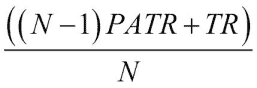

    在此，PATR 是前一天的 ATR； TR 是真实范围：

    ```py
    for i in range(1, N):
       atr[i] = (N - 1) * atr[i - 1] + truerange[i]
       atr[i] /= N
    ```

### 刚刚发生了什么？

我们形成了三个数组，分别用于三个范围-每日范围，今天的高点和昨天的收盘价之间的差距，以及昨天的收盘价和今天的低点之间的差距。 这告诉我们股票价格变动了多少，因此，它的波动性如何。 该算法要求我们找到每天的最大值。 我们之前使用的`max()`函数可以为我们提供数组中的最大值，但这不是我们想要的。 我们需要整个数组的最大值，因此我们需要三个数组中的第一个元素，第二个元素等等的最大值。 在前面的“实战时间”部分中，我们看到了`maximum()`函数可以做到这一点。 此后，我们计算了真实范围值的移动平均值（请参见`atr.py`）：

```py
from __future__ import print_function
import numpy as np

h, l, c = np.loadtxt('data.csv', delimiter=',', usecols=(4, 5, 6), unpack=True)

N = 5
h = h[-N:]
l = l[-N:]

print("len(h)", len(h), "len(l)", len(l))
print("Close", c)
previousclose = c[-N -1: -1]

print("len(previousclose)", len(previousclose))
print("Previous close", previousclose)
truerange = np.maximum(h - l, h - previousclose, previousclose - l)

print("True range", truerange)

atr = np.zeros(N)

atr[0] = np.mean(truerange)

for i in range(1, N):
   atr[i] = (N - 1) * atr[i - 1] + truerange[i]
   atr[i] /= N

print("ATR", atr)
```

在以下各节中，我们将学习更好的方法来计算移动均线。

### 勇往直前 – 使用`minimum()`函数

除了`maximum()`函数外，还有`minimum()`函数。 您可能会猜到它在做什么。 使其成为一个小脚本，或者在 IPython 中启动一个交互式会话来测试您的假设。

## 简单移动均线

**简单移动均线**（**SMA**）通常用于分析时序数据。 为了计算它，我们定义了一个`N`周期的移动窗口，在本例中为`N`天。 我们沿着数据移动此窗口，并计算窗口内值的平均值。

## 实战时间 – 计算简单移动均线

移动平均值只需几个循环和`mean()`函数即可轻松计算，但 NumPy 具有更好的选择-`convolve()`函数。 毕竟，SMA 只是具有相等权重的卷积，或者，如果您愿意，可以是未加权的。

#### 注意

**卷积**是两个函数的数学运算，定义为两个函数之一反转和移位后，两个函数的乘积积分。

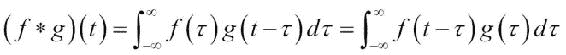

卷积[在维基百科上](https://en.wikipedia.org/wiki/Convolution)进行了描述。 可汗学院也[提供了卷积教程](https://www.khanacademy.org/math/differential-equations/laplace-transform/convolution-integral/v/introduction-to-the-convolution)。

使用以下步骤来计算 SMA：

1.  使用`ones()`函数创建一个大小为`N`的数组，并将元素初始化为 1，然后将该数组除以`N`以给我们权重：

    ```py
    N = 5
    weights = np.ones(N) / N
    print("Weights", weights)
    ```

    对于`N = 5`，这将为我们提供以下输出：

    ```py
    Weights [ 0.2  0.2  0.2  0.2  0.2]

    ```

2.  现在，使用以下权重调用`convolve()`函数：

    ```py
    c = np.loadtxt('data.csv', delimiter=',', usecols=(6,), unpack=True)
    sma = np.convolve(weights, c)[N-1:-N+1]
    ```

3.  从`convolve()`返回的数组中，我们提取了大小为`N`的中心的数据。 以下代码使用`matplotlib`构成了一个时间值和曲线数组，我们将在下一章中介绍：

    ```py
    c = np.loadtxt('data.csv', delimiter=',', usecols=(6,), unpack=True)
    sma = np.convolve(weights, c)[N-1:-N+1]
    t = np.arange(N - 1, len(c))
    plt.plot(t, c[N-1:], lw=1.0, label="Data")
    plt.plot(t, sma, '--', lw=2.0, label="Moving average")
    plt.title("5 Day Moving Average")
    plt.xlabel("Days")
    plt.ylabel("Price ($)")
    plt.grid()
    plt.legend()
    plt.show()
    ```

    在下面的图表中，平滑虚线是 5 天均线，锯齿状细线是收盘价：

    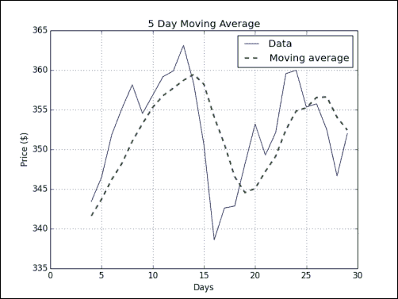

### 刚刚发生了什么？

我们为收盘价计算了 SMA。 事实证明，SMA 只是一种信号处理技术—具有权重`1/N`的卷积，其中`N`是移动平均窗口的大小。 我们了解到`ones()`函数可以创建一个带有 1 的数组，而`convolve()`函数可以计算具有指定权重的数据集的卷积（请参见`sma.py`）：

```py
from __future__ import print_function
import numpy as np
import matplotlib.pyplot as plt

N = 5

weights = np.ones(N) / N
print("Weights", weights)

c = np.loadtxt('data.csv', delimiter=',', usecols=(6,), unpack=True)
sma = np.convolve(weights, c)[N-1:-N+1]
t = np.arange(N - 1, len(c))
plt.plot(t, c[N-1:], lw=1.0, label="Data")
plt.plot(t, sma, '--', lw=2.0, label="Moving average")
plt.title("5 Day Moving Average")
plt.xlabel("Days")
plt.ylabel("Price ($)")
plt.grid()
plt.legend()
plt.show()
```

## 指数移动均线

**指数移动均线**（**EMA**）是 SMA 的一种流行替代方法。 此方法按指数方式减小权重。 过去点的权重呈指数下降，但从未达到零。 在计算权重时，我们将学习`exp()`和`linspace()`函数。

## 实战时间 – 计算指数移动平均值

给定一个数组，`exp()`函数将计算每个数组元素的指数。 例如，在以下代码中查看  ：

```py
x = np.arange(5)
print("Exp", np.exp(x))
```

它给出以下输出：

```py
Exp [  1\.           2.71828183   7.3890561   20.08553692  54.59815003]

```

`linspace()`函数将起始值，终止值以及可选的数组大小作为参数。 它返回一个均匀间隔的数字数组。 这是一个例子：

```py
print("Linspace", np.linspace(-1, 0, 5))
```

这将为我们提供以下输出：

```py
Linspace [-1\.   -0.75 -0.5  -0.25  0\.  ]

```

为我们的数据计算 EMA：

1.  现在，返回权重，使用`exp()`和`linspace()`进行计算：

    ```py
    N = 5
    weights = np.exp(np.linspace(-1., 0., N))
    ```

2.  使用`ndarray sum()`方法标准化权重：

    ```py
    weights /= weights.sum()
    print("Weights", weights)
    ```

    对于`N = 5`，我们得到以下权重：

    ```py
    Weights [ 0.11405072  0.14644403  0.18803785  0.24144538  0.31002201]

    ```

3.  之后，使用我们在 SMA 部分中了解的`convolve()`函数并绘制结果：

    ```py
    c = np.loadtxt('data.csv', delimiter=',', usecols=(6,), unpack=True)
    ema = np.convolve(weights, c)[N-1:-N+1]
    t = np.arange(N - 1, len(c))
    plt.plot(t, c[N-1:], lw=1.0, label='Data')
    plt.plot(t, ema, '--', lw=2.0, label='Exponential Moving Average')
    plt.title('5 Days Exponential Moving Average')
    plt.xlabel('Days')
    plt.ylabel('Price ($)')
    plt.legend()
    plt.grid()
    plt.show()
    ```

    这给了我们一个不错的图表，在该图表中，收盘价再次是锯齿状细线，而 EMA 是平滑虚线：

    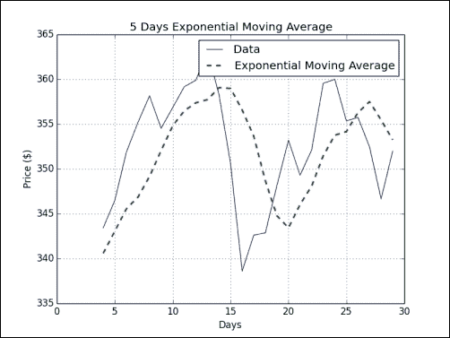

### 刚刚发生了什么？

我们计算了收盘价的 EMA。 首先，我们使用`exp()`和`linspace()`函数计算指数递减的权重。 `linspace()`函数为我们提供了元素间隔均匀的数组，然后，我们计算了这些数字的指数。 为了将权重标准化，我们将调用`ndarray sum()`方法。 此后，我们应用了在 SMA 部分中学到的`convolve()`技巧（请参阅`ema.py`）：

```py
from __future__ import print_function
import numpy as np
import matplotlib.pyplot as plt

x = np.arange(5)
print("Exp", np.exp(x))
print("Linspace", np.linspace(-1, 0, 5))

## Calculate weights
N = 5
weights = np.exp(np.linspace(-1., 0., N))

## Normalize weights
weights /= weights.sum()
print("Weights", weights)

c = np.loadtxt('data.csv', delimiter=',', usecols=(6,), unpack=True)
ema = np.convolve(weights, c)[N-1:-N+1]
t = np.arange(N - 1, len(c))
plt.plot(t, c[N-1:], lw=1.0, label='Data')
plt.plot(t, ema, '--', lw=2.0, label='Exponential Moving Average')
plt.title('5 Days Exponential Moving Average')
plt.xlabel('Days')
plt.ylabel('Price ($)')
plt.legend()
plt.grid()
plt.show()
```

## 布林带

**布林带**是另一个技术指标。 是的，有成千上万个。 此名称以其发明人的名字命名，并指示金融证券价格的范围。 它由三个部分组成：

1.  一个简单的移动均线。
2.  高于此移动平均值的两个标准差的上限-标准差是从所计算的移动平均值的相同数据中得出的。
3.  低于移动均线两个标准差的较低频带。

## 实战时间 – 布林带

我们已经知道如何计算 SMA。 因此，如果您需要刷新内存，请阅读本章中的“实战时间 – 计算简单平均”部分。 本示例将介绍  NumPy `fill()`函数。 `fill()`函数将数组的值设置为标量值。 该函数应比`array.flat = scalar`更快，或者应在循环中一对一地设置数组的值。 执行以下步骤以布林带包络：

1.  从包含移动平均值的名为`sma`的数组开始，我们将遍历与那些值相对应的所有数据集。 形成数据集后，计算标准差。 注意，在某个点上，有必要计算每个数据点与相应平均值之间的差。 如果没有 NumPy，我们将遍历这些点，并从相应的平均值中逐个减去每个值。 但是，NumPy `fill()`函数允许我们构造一个元素设置为相同值的数组。 这样一来，我们就可以节省一个循环并一次性减去数组：

    ```py
    deviation = []
    C = len(c)

    for i in range(N - 1, C):
       if i + N < C:
          dev = c[i: i + N]
       else:
          dev = c[-N:]

       averages = np.zeros(N)
       averages.fill(sma[i - N - 1])
       dev = dev - averages
       dev = dev ** 2
       dev = np.sqrt(np.mean(dev))
       deviation.append(dev)

    deviation = 2 * np.array(deviation)
    print(len(deviation), len(sma))
    upperBB = sma + deviation
    lowerBB = sma - deviation
    ```

2.  要进行绘图，我们将使用以下代码（现在不必担心；我们将在第 9 章“matplotlib 绘图”中了解其工作原理）：

    ```py
    t = np.arange(N - 1, C)
    plt.plot(t, c_slice, lw=1.0, label='Data')
    plt.plot(t, sma, '--', lw=2.0, label='Moving Average')
    plt.plot(t, upperBB, '-.', lw=3.0, label='Upper Band')
    plt.plot(t, lowerBB, ':', lw=4.0, label='Lower Band')
    plt.title('Bollinger Bands')
    plt.xlabel('Days')
    plt.ylabel('Price ($)')
    plt.grid()
    plt.legend()
    plt.show()
    ```

    以下是显示数据的布林带的图表。 中间的锯齿状细线表示收盘价，而穿过它的虚线，更平滑的线是移动均线：

    

### 刚刚发生了什么？

我们制定了包围数据收盘价的布林带。 更重要的是，我们熟悉 NumPy `fill()`函数。 此函数用标量值填充数组。 这是`fill()`函数的唯一参数（请参见`bollingerbands.py`）：

```py
from __future__ import print_function
import numpy as np
import matplotlib.pyplot as plt

N = 5

weights = np.ones(N) / N
print("Weights", weights)

c = np.loadtxt('data.csv', delimiter=',', usecols=(6,), unpack=True)
sma = np.convolve(weights, c)[N-1:-N+1]
deviation = []
C = len(c)

for i in range(N - 1, C):
   if i + N < C:
      dev = c[i: i + N]
   else:
      dev = c[-N:]

   averages = np.zeros(N)
 averages.fill(sma[i - N - 1])
   dev = dev - averages
   dev = dev ** 2
   dev = np.sqrt(np.mean(dev))
   deviation.append(dev)

deviation = 2 * np.array(deviation)
print(len(deviation), len(sma))
upperBB = sma + deviation
lowerBB = sma - deviation

c_slice = c[N-1:]
between_bands = np.where((c_slice < upperBB) & (c_slice > lowerBB))

print(lowerBB[between_bands])
print(c[between_bands])
print(upperBB[between_bands])
between_bands = len(np.ravel(between_bands))
print("Ratio between bands", float(between_bands)/len(c_slice))

t = np.arange(N - 1, C)
plt.plot(t, c_slice, lw=1.0, label='Data')
plt.plot(t, sma, '--', lw=2.0, label='Moving Average')
plt.plot(t, upperBB, '-.', lw=3.0, label='Upper Band')
plt.plot(t, lowerBB, ':', lw=4.0, label='Lower Band')
plt.title('Bollinger Bands')
plt.xlabel('Days')
plt.ylabel('Price ($)')
plt.grid()
plt.legend()
plt.show()
```

### 勇往直前 – 切换到指数移动均线

通常选择 SMA 来使布林带居中。 第二个最受欢迎的选择是 EMA，因此请尝试作为练习。 如果需要指针，可以在本章中找到合适的示例。

检查`fill()`函数是否更快或与`array.flat = scalar`一样快，或循环设置该值。

## 线性模型

科学中的许多现象都有一个相关的线性关系模型。 NumPy `linalg`包处理线性代数计算。 我们首先假设可以基于线性关系从`N`以前的价格中得出价格值。

## 实战时间 – 使用线性模型预测价格

保持开放态度  ，让我们假设可以将股票价格`p`表示为先前值的线性组合，也就是说，这些值的总和乘以我们需要确定的某些系数：

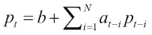

用线性代数术语，可以归结为[最小二乘法](https://www.khanacademy.org/math/linear-algebra/alternate_bases/orthogonal_projections/v/linear-algebra-least-squares-approximation)。

#### 注意

天文学家 Legendre 和 Gauss 彼此独立，于 1805 年左右发明了[最小二乘法](http://en.wikipedia.org/wiki/Least_squares)。 该方法最初用于分析天体的运动。 该算法将残差平方和（`measured`和`predicted`值之间的差）最小化：

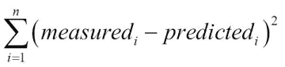

秘籍如下所示：首先，形成一个包含`N`个价格值的向量`b`：

1.  

    ```py
    b = c[-N:]
    b = b[::-1]
    print("b", x)
    ```

    结果如下：

    ```py
    b [ 351.99  346.67  352.47  355.76  355.36]

    ```

2.  其次，将矩阵`A`预先初始化为`N x N`并包含零：

    ```py
    A = np.zeros((N, N), float)
    Print("Zeros N by N", A)
    ```

    屏幕上应打印以下内容：

    ```py
    Zeros N by N [[ 0\.  0\.  0\.  0\.  0.]
     [ 0\.  0\.  0\.  0\.  0.]
     [ 0\.  0\.  0\.  0\.  0.]
     [ 0\.  0\.  0\.  0\.  0.]
     [ 0\.  0\.  0\.  0\.  0.]]

    ```

3.  第三，对于`b`中的每个值，使用`N`个之前的价格值填充矩阵`A`：

    ```py
    for i in range(N):
       A[i, ] = c[-N - 1 - i: - 1 - i]

       print("A", A)
    ```

    现在，`A`看起来像这样：

    ```py
    A [[ 360\.    355.36  355.76  352.47  346.67]
     [ 359.56  360\.    355.36  355.76  352.47]
     [ 352.12  359.56  360\.    355.36  355.76]
     [ 349.31  352.12  359.56  360\.    355.36]
     [ 353.21  349.31  352.12  359.56  360\.  ]]

    ```

4.  目的是通过解决最小二乘问题来确定满足我们的线性模型的系数。 使用 NumPy `linalg`包的`lstsq()`函数执行此操作：

    ```py
    (x, residuals, rank, s) = np.linalg.lstsq(A, b)

    print(x, residuals, rank, s)
    ```

    The result is as follows:

    ```py
    [ 0.78111069 -1.44411737  1.63563225 -0.89905126  0.92009049] [] 5 [  1.77736601e+03   1.49622969e+01   8.75528492e+00   5.15099261e+00   1.75199608e+00]

    ```

    返回的元组包含我们所追求的系数`x`，一个包含残差的数组，矩阵`A`的秩以及`A`的奇异值。

5.  一旦有了线性模型的系数，就可以预测下一个价格值。 计算系数的点积（使用 NumPy 的`dot()`函数）和最后一次已知的`N`价格：

    ```py
    print(np.dot(b, x))
    ```

    [点积](https://www.khanacademy.org/math/linear-algebra/vectors_and_spaces/dot_cross_products/v/vector-dot-product-and-vector-length)是以下项的线性组合，系数`b`和`x`的乘积。结果，我们得到：

    ```py
    357.939161015

    ```

我抬起头来； 第二天的实际收盘价为`353.56`。 因此，我们对`N = 5`的估算与预期相差不远。

### 刚刚发生了什么？

我们今天预测了明天的股价。 如果这在实践中可行，我们可以提早退休！ 瞧，这本书毕竟是一笔不错的投资！ 我们为预测设计了线性模型。 财务问题被简化为线性代数。 NumPy 的`linalg`包具有实用的`lstsq()`函数，可帮助我们完成当前的任务，估计线性模型的系数。 在获得解决方案后，我们将数字插入了 NumPy `dot()`函数中，该函数通过线性回归为我们提供了一个估计值（请参见`linearmodel.py`）：

```py
from __future__ import print_function
import numpy as np

N = 5

c = np.loadtxt('data.csv', delimiter=',', usecols=(6,), unpack=True)

b = c[-N:]
b = b[::-1]
print("b", b)

A = np.zeros((N, N), float)
print("Zeros N by N", A)

for i in range(N):
   A[i, ] = c[-N - 1 - i: - 1 - i]

print("A", A)

(x, residuals, rank, s) = np.linalg.lstsq(A, b)

print(x, residuals, rank, s)

print(np.dot(b, x))

```

## 趋势线

趋势线是股票图表上许多所谓的枢轴点中的线。 顾名思义，该线的趋势描绘了价格发展的趋势。 过去，交易员在纸上绘制趋势线，但如今，我们可以让计算机为我们绘制趋势线。 在本节中，我们将使用一种非常简单的方法，该方法在现实生活中可能不会很有用，但应很好地阐明原理。

## 实战时间 – 绘制趋势线

执行以下步骤绘制趋势线：

1.  首先，我们需要确定枢轴点。 我们假设它们等于最高价，最低价和收盘价的算术平均值：

    ```py
    h, l, c = np.loadtxt('data.csv', delimiter=',', usecols=(4, 5, 6), unpack=True)

    pivots = (h + l + c) / 3
    print("Pivots", pivots)
    ```

    从支点来看，我们可以推断出所谓的**阻力**和**支撑位**。 支撑位是价格反弹的最低水平。 阻力位是价格反弹的最高位。 这些不是自然现象，它们只是估计。 基于这些估计，可以绘制支撑和阻力趋势线。 我们将每日点差定义为高价和低价之差。

2.  定义一个函数以使数据行适合`y = at + b`的行。 该函数应返回`a`和`b`。 这是应用 NumPy `linalg`包的`lstsq()`函数的另一个机会。 将线方程式重写为`y = Ax`，其中`A = [t 1]`和`x = [a b]`。 使用 NumPy `ones_like()`的形式`A`，该数组创建一个数组，其中所有值均等于`1`，并使用输入数组作为该数组尺寸的模板：

    ```py
    def fit_line(t, y):
       A = np.vstack([t, np.ones_like(t)]).T
       return np.linalg.lstsq(A, y)[0]
    ```

3.  假设支撑位是在枢轴下方的一个每日价差，并且**阻力位**是支撑点和支撑趋势线的一个每日价差：

    ```py
    t = np.arange(len(c))
    sa, sb = fit_line(t, pivots - (h - l))
    ra, rb = fit_line(t, pivots + (h - l))
    support = sa * t + sb
    resistance = ra * t + rb
    ```

4.  目前，我们掌握了绘制趋势线的所有必要信息。 但是，检查在支撑位和阻力位之间落多少点是明智的。 显然，如果只有一小部分数据位于趋势线之间，则此设置对我们没有用。 为波段之间的点建立条件，并根据以下条件使用`where()`函数进行选择：

    ```py
    condition = (c > support) & (c < resistance)
    print("Condition", condition)
    between_bands = np.where(condition)
    ```

    这些是打印条件值：

    ```py
    Condition [False False  True  True  True  True  True False False  True False False
     False False False  True False False False  True  True  True  True False False  True  True  True False  True]

    ```

    仔细检查值：

    ```py
    print(support[between_bands])
    print( c[between_bands])
    print( resistance[between_bands])
    ```

    `where()`函数返回的数组具有`rank 2`，因此在调用`len()`函数之前先调用`ravel()`函数：

    ```py
    between_bands = len(np.ravel(between_bands))
    print("Number points between bands", between_bands)
    print("Ratio between bands", float(between_bands)/len(c))
    ```

    您将得到以下结果：

    ```py
    Number points between bands 15
    Ratio between bands 0.5

    ```

    作为额外的奖励，我们获得了一个预测模型。 推断第二天的阻力和支撑位：

    ```py
    print("Tomorrows support", sa * (t[-1] + 1) + sb)
    print("Tomorrows resistance", ra * (t[-1] + 1) + rb)
    ```

    This results in the following output:

    ```py
    Tomorrows support 349.389157088
    Tomorrows resistance 360.749340996

    ```

    确定支撑和阻力估计之间有多少个点的另一种方法是使用`[]`和`intersect1d()`。 在`[]`运算符中定义选择标准，并将结果与​​`intersect1d()`函数相交：

    ```py
    a1 = c[c > support]
    a2 = c[c < resistance]
    print("Number of points between bands 2nd approach" ,len(np.intersect1d(a1, a2)))
    ```

    毫不奇怪，我们得到：

    ```py
    Number of points between bands 2nd approach 15

    ```

5.  再一次，绘制结果：

    ```py
    plt.plot(t, c, label='Data')
    plt.plot(t, support, '--', lw=2.0, label='Support')
    plt.plot(t, resistance, '-.', lw=3.0, label='Resistance')
    plt.title('Trend Lines')
    plt.xlabel('Days')
    plt.ylabel('Price ($)')
    plt.grid()
    plt.legend()
    plt.show()
    ```

    在下图中，我们获得了价格数据以及相应的支撑线和阻力线：

    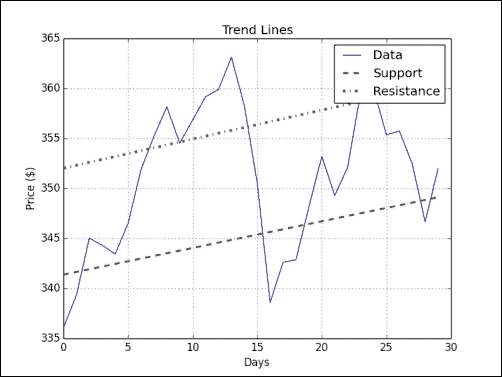

### 刚刚发生了什么？

我们绘制了趋势线，而不必弄乱标尺，铅笔和纸质图表。 我们使用 NumPy `vstack()`，`ones_like()`和`lstsq()`函数定义了可以使数据适合行的函数。 我们拟合数据以定义支撑和阻力趋势线。 然后，我们找出了在支撑和阻力范围内的点。 我们使用两种产生相同结果的独立方法进行了此操作。

第一种方法使用带有布尔条件的`where()`函数。 第二种方法使用`[]`运算符和`intersect1d()`函数。 `intersect1d()`函数从两个数组返回一个公共元素数组（请参见`trendline.py`）：

```py
from __future__ import print_function
import numpy as np
import matplotlib.pyplot as plt

def fit_line(t, y):
   ''' Fits t to a line y = at + b '''
   A = np.vstack([t, np.ones_like(t)]).T

   return np.linalg.lstsq(A, y)[0]

## Determine pivots
h, l, c = np.loadtxt('data.csv', delimiter=',', usecols=(4, 5, 6), unpack=True)

pivots = (h + l + c) / 3
print("Pivots", pivots)

## Fit trend lines
t = np.arange(len(c))
sa, sb = fit_line(t, pivots - (h - l))
ra, rb = fit_line(t, pivots + (h - l))

support = sa * t + sb
resistance = ra * t + rb
condition = (c > support) & (c < resistance)
print("Condition", condition)
between_bands = np.where(condition)
print(support[between_bands])
print(c[between_bands])
print(resistance[between_bands])
between_bands = len(np.ravel(between_bands))
print("Number points between bands", between_bands)
print("Ratio between bands", float(between_bands)/len(c))

print("Tomorrows support", sa * (t[-1] + 1) + sb)
print("Tomorrows resistance", ra * (t[-1] + 1) + rb)

a1 = c[c > support]
a2 = c[c < resistance]
print("Number of points between bands 2nd approach" ,len(np.intersect1d(a1, a2)))

## Plotting
plt.plot(t, c, label='Data')
plt.plot(t, support, '--', lw=2.0, label='Support')
plt.plot(t, resistance, '-.', lw=3.0, label='Resistance')
plt.title('Trend Lines')
plt.xlabel('Days')
plt.ylabel('Price ($)')
plt.grid()
plt.legend()
plt.show()
```

## `ndarray`的方法

NumPy `ndarray`类具有在数组上工作的许多方法。 大多数情况下，这些方法返回数组。 您可能已经注意到，NumPy 库的许多功能部分在`ndarray`类中具有相同的名称和功能。 这主要是由于 NumPy 的历史发展。

`ndarray`方法的列表很长，因此我们无法涵盖所有​​方法。 我们先前看到的`mean()`，`var()`，`sum()`，`std()`，`argmax()`，`argmin()`和`mean()`函数也是`ndarray`方法。

## 实战时间 – 剪切和压缩数组

以下是`ndarray`方法的一些示例。 执行以下步骤来裁剪和压缩数组：

1.  `clip()`方法返回一个裁剪后的数组，以便将所有大于最大值的值设置为最大值，而将小于最小值的值设置为最小值。 将值为 0 到 4 的数组裁剪为 1 和 2 的数组：

    ```py
    a = np.arange(5)
    print("a =", a)
    print("Clipped", a.clip(1, 2))
    ```

    这给出以下输出：

    ```py
    a = [0 1 2 3 4]
    Clipped [1 1 2 2 2]

    ```

2.  `ndarray compress()`方法根据条件返回一个数组。 例如，看下面的代码：

    ```py
    a = np.arange(4)
    print(a)
    print("Compressed", a.compress(a > 2))
    ```

    这将返回以下输出：

    ```py
    [0 1 2 3]
    Compressed [3]

    ```

### 刚刚发生了什么？

我们创建了数组  ，其值是`0`至`3`，并根据`a > 2`条件选择了带有`compress()`函数的最后一个元素。

## 阶乘

许多编程书籍都有一个计算阶乘的示例。 我们不应该违背这一传统。

## 实战时间 – 计算阶乘

`ndarray`类具有`prod()`方法，该方法计算数组中元素的乘积。 执行以下步骤来计算阶乘：

1.  计算`8`的阶乘。 为此，请生成一个值从 1 到 8 的数组，并对其调用`prod()`函数：

    ```py
    b = np.arange(1, 9)
    print("b =", b)
    print("Factorial", b.prod())
    ```

    用袖珍计算器检查结果：

    ```py
    b = [1 2 3 4 5 6 7 8]
    Factorial 40320

    ```

    很好，但是如果我们想知道从 1 到 8 的所有阶乘，该怎么办？

2.  没问题！ 调用`cumprod()`方法，该方法计算数组的累加乘积：

    ```py
    print("Factorials", b.cumprod())
    ```

    又是袖珍计算器时间了：

    ```py
    Factorials [    1     2     6    24   120   720  5040 40320]

    ```

### 刚刚发生了什么？

我们使用  `prod()`和`cumprod()`函数来计算阶乘（请参阅`ndarraymethods.py`）：

```py
from __future__ import print_function
import numpy as np

a = np.arange(5)
print("a =", a)
print("Clipped", a.clip(1, 2))

a = np.arange(4)
print(a)
print("Compressed", a.compress(a > 2))

b = np.arange(1, 9)
print("b =", b)
print("Factorial", b.prod())

print("Factorials", b.cumprod())

```

## 缺失值和折刀重采样

由于错误或技术问题，数据通常会丢失值。 即使我们不缺少值，我们也可能有理由怀疑某些值。 一旦我们对数据值产生怀疑，我们在本章中学会计算的诸如算术平均值之类的派生值也将变得可疑。 由于这些原因，通常尝试估算算术平均值，方差和标准差的可靠性。

一种简单但有效的方法，称为[**折刀重采样**](http://en.wikipedia.org/wiki/Jackknife_resampling)。 折刀重采样背后的想法是通过一次保留一个值来从原始数据集中系统地生成数据集。 实际上，我们正在尝试确定如果至少一个值是错误的，将会发生什么。 对于每个新生成的数据集，我们重新计算算术平均值，方差和标准差。 这使我们知道这些值可以变化多少。

## 实战时间 – 使用`nanmean()`，`nanvar()`和`nanstd()`函数处理 NaN

我们将对数据进行折刀重采样。 通过将每个值设置为**非数字**（**NaN**），将省略这些值。 然后，可以使用`nanmean()`，`nanvar()`和`nanstd()`计算算术均值，方差和标准差。

1.  首先，按如下所示初始化`30 x 3`数组以进行估算：

    ```py
    estimates = np.zeros((len(c), 3))
    ```

2.  通过在循环的每次迭代中将一个值设置为 NaN 来遍历值并生成新的数据集。 对于每个新值集，计算估计值：

    ```py
    for i in xrange(len(c)):
       a = c.copy()
       a[i] = np.nan

       estimates[i,] = [np.nanmean(a), np.nanvar(a), np.nanstd(a)]
    ```

3.  打印每个估计的方差（如果您愿意，也可以打印均值或标准差）：

    ```py
    print("Estimates variance", estimates.var(axis=0))
    ```

    屏幕上打印以下内容：

    ```py
    Estimates variance [ 0.05960347  3.63062943  0.01868965]

    ```

### 刚刚发生了什么？

我们使用折刀重采样估计了小型数据集的算术平均值，方差和标准差的方差。 这使我们知道算术平均值，方差和标准差有多少变化。 该示例的代码可以在本书的代码包的`jackknife.py`文件中找到：

```py
from __future__ import print_function
import numpy as np

c = np.loadtxt('data.csv', delimiter=',', usecols=(6,), unpack=True)

## Initialize estimates array
estimates = np.zeros((len(c), 3))

for i in xrange(len(c)):
   # Create a temporary copy and omit one value
   a = c.copy()
   a[i] = np.nan

   # Compute estimates
   estimates[i,] = [np.nanmean(a), np.nanvar(a), np.nanstd(a)]

print("Estimates variance", estimates.var(axis=0))
```

## 总结

本章向我们介绍了许多常见的 NumPy 函数。 还提到了一些常用的统计函数。

在浏览完常见的 NumPy 函数之后，我们将在下一章继续介绍方便的 NumPy 函数，例如`polyfit()`，`sign()`和`piecewise()`。