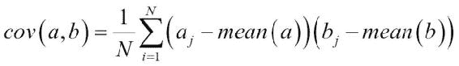
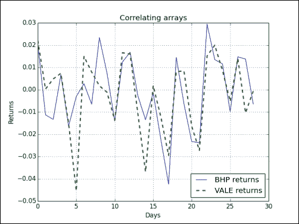
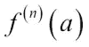
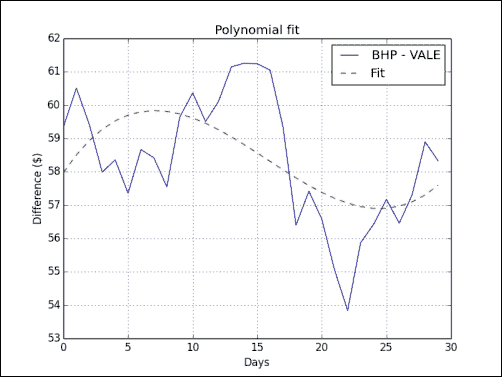
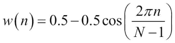
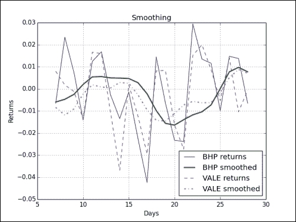

# 四、为您带来便利的便利函数

如我们所见，NumPy 具有大量功能。 这些功能中的许多功能只是为了方便起见，知道这些功能将大大提高您的生产率。 这包括选择数组某些部分（例如，基于布尔条件）或处理多项式的函数。 本章提供了一个计算相关性示例，使您可以使用 NumPy 进行数据分析。

在本章中，我们将涵盖以下主题：

*   数据选择与提取
*   简单的数据分析
*   收益相关的例子
*   多项式
*   线性代数函数

在第 3 章，“熟悉常用功能”中，我们有一个数据文件可以使用。 在本章中，情况有所改善-我们现在有两个数据文件。 让我们使用 NumPy 探索数据。

# 相关

您是否注意到某些公司的股价会紧随其后，通常是  同一行业的竞争对手？ 理论上的解释是，由于这两家公司属于同一类型的业务，因此它们面临着相同的挑战，需要相同的材料和资源，并争夺相同类型的客户。

您可能想到了许多可能的对，但是您需要检查一下真实的关系。 一种方法是查看两种股票的股票收益的[相关性和因果关系](https://www.khanacademy.org/math/probability/statistical-studies/types-of-studies/v/correlation-and-causality)。 高相关性意味着某种关系。 但是，这并不是因果关系的证明，尤其是如果您没有使用足够的数据。

# 采取行动的时候–交易相关货币对

在本节中，我们将使用两个样本数据集，其中包含日末价格数据。 第一家  公司是必和必拓（BHP），该公司活跃于石油，金属和钻石的开采。 第二个是淡水河谷（VALE），这也是一家金属和采矿公司。 因此，活动有一些重叠，尽管不是 100％。 要评估相关对，请按照下列步骤操作：

1.  首先，从本章示例代码目录中的 CSV 文件加载数据，特别是两种证券的收盘价，并计算收益。 如果您不记得该怎么做，请参阅第 3 章，“熟悉常用功能”中的示例。
2.  Covariance tells us how two variables vary together; which is nothing more than unnormalized correlation (see [https://www.khanacademy.org/math/probability/regression/regression-correlation/v/covariance-and-the-regression-line](https://www.khanacademy.org/math/probability/regression/regression-correlation/v/covariance-and-the-regression-line)):

    使用`cov()`函数从返回值计算协方差矩阵（并非严格如此，但这可以让我们演示一些矩阵运算）：

    ```py
    covariance = np.cov(bhp_returns, vale_returns)
    print("Covariance", covariance)
    ```

    协方差矩阵如下：

    ```py
    Covariance [[ 0.00028179  0.00019766]
     [ 0.00019766  0.00030123]]

    ```

3.  View the values on the diagonal with the `diagonal()` method:

    ```py
    print("Covariance diagonal", covariance.diagonal())
    ```

    协方差矩阵的对角线值如下：

    ```py
    Covariance diagonal [ 0.00028179  0.00030123]

    ```

    请注意，对角线上的值彼此不相等。 这与相关矩阵不同。

4.  Compute the trace, the sum of the diagonal values, with the `trace()` method:

    ```py
    print("Covariance trace", covariance.trace())
    ```

    协方差矩阵的跟踪值如下：

    ```py
    Covariance trace 0.00058302354992

    ```

5.  The correlation of two vectors is defined as the covariance, divided by the product of the respective standard deviations of the vectors. The equation for vectors `a` and `b` is as follows:

    ```py
    print(covariance/ (bhp_returns.std() * vale_returns.std()))
    ```

    相关矩阵如下：

    ```py
    [[ 1.00173366  0.70264666]
    [ 0.70264666  1.0708476 ]]

    ```

6.  We will measure the correlation of our pair with the correlation coefficient. The correlation coefficient takes values between `-1` and `1`. The correlation of a set of values with itself is `1` by definition. This would be the ideal value; however, we will also be happy with a slightly lower value. Calculate the correlation coefficient (or, more accurately, the correlation matrix) with the `corrcoef()` function:

    ```py
    print("Correlation coefficient", np.corrcoef(bhp_returns, vale_returns))
    ```

    系数如下：

    ```py
    [[ 1\.          0.67841747]
    [ 0.67841747  1\.        ]]

    ```

    对角线上的值仅是 BHP 和 VALE 与它们自身的相关性，因此等于 1。在任何可能性下，都不会进行任何实际计算。 由于相关性是对称的，因此其他两个值彼此相等，这意味着 BHP 与 VALE 的相关性等于 VALE 与 BHP 的相关性。 似乎这里的相关性不是那么强。

7.  Another important point is whether the two stocks under consideration are in sync or not. Two stocks are considered out of sync if their difference is two standard deviations from the mean of the differences.

    如果它们不同步，我们可以发起交易，希望它们最终能够再次恢复同步。 计算  两种证券的收盘价之间的差异，以检查同步：

    ```py
    difference = bhp - vale
    ```

    检查最后的价格差异是否不同步； 请参阅以下代码：

    ```py
    avg = np.mean(difference)
    dev = np.std(difference)
    print("Out of sync", np.abs(difference[-1] – avg) > 2 * dev)
    ```

    不幸的是，我们还不能交易：

    ```py
    Out of sync False

    ```

8.  Plotting requires `matplotlib`; this will be discussed in [Chapter 9](../Text/ch09.html "Chapter 9. Plotting with matplotlib"), *Plotting with matplotlib*. Plotting can be done as follows:

    ```py
    t = np.arange(len(bhp_returns))
    plt.plot(t, bhp_returns, lw=1, label='BHP returns')
    plt.plot(t, vale_returns, '--', lw=2, label='VALE returns')
    plt.title('Correlating arrays')

    plt.xlabel('Days')
    plt.ylabel('Returns')
    plt.grid()
    plt.legend(loc='best')
    plt.show()
    ```

    结果图如下所示：

    

## 刚刚发生了什么？

我们分析了必和必拓和 VALE 收盘价的  关系。 确切地说，我们计算了他们的股票收益的相关性。 我们通过  `corrcoef()`功能实现了这一目标。 此外，我们看到了如何计算可以从中得出相关性的协方差矩阵。 另外，我们演示了`diagonal()`和`trace()`方法，它们分别为我们提供对角线值和矩阵迹线。 有关源代码，请参见本书代码包中的`correlation.py`文件：

```py
from __future__ import print_function
import numpy as np
import matplotlib.pyplot as plt

bhp = np.loadtxt('BHP.csv', delimiter=',', usecols=(6,), unpack=True)

bhp_returns = np.diff(bhp) / bhp[ : -1]

vale = np.loadtxt('VALE.csv', delimiter=',', usecols=(6,), unpack=True)

vale_returns = np.diff(vale) / vale[ : -1]

covariance = np.cov(bhp_returns, vale_returns)
print("Covariance", covariance)

print("Covariance diagonal", covariance.diagonal())
print("Covariance trace", covariance.trace())

print(covariance/ (bhp_returns.std() * vale_returns.std()))

print("Correlation coefficient", np.corrcoef(bhp_returns, vale_returns))

difference = bhp - vale
avg = np.mean(difference)
dev = np.std(difference)

print("Out of sync", np.abs(difference[-1] - avg) > 2 * dev)

t = np.arange(len(bhp_returns))
plt.plot(t, bhp_returns, lw=1, label='BHP returns')
plt.plot(t, vale_returns, '--', lw=2, label='VALE returns')
plt.title('Correlating arrays')
plt.xlabel('Days')
plt.ylabel('Returns')
plt.grid()
plt.legend(loc='best')
plt.show()
```

## 小测验-计算协方差

Q1。 哪个函数  返回两个数组的协方差？

1.  协方差
2.  科瓦
3.  的
4.  cvar

# 多项式

您喜欢微积分吗？ 好吧，我喜欢它！ 微积分学中的一种思想是**泰勒展开**，即代表无穷级数的可微函数（请参见[这里](https://www.khanacademy.org/math/integral-calculus/sequences_series_approx_calc/taylor-series/v/generalized-taylor-series-approximation)和[这里](http://en.wikipedia.org/wiki/Taylor_series)）。

### 注意

泰勒级数的定义如下所示：




在此定义中，是在点`a`上计算的函数`f`的`n`阶导数。

实际上，这意味着我们可以使用高阶多项式来估计任何可微的，因此是连续的函数。 然后，我们假设较高学位的条款可以忽略不计。

# 起作用的时间–适合多项式

NumPy `polyfit()`函数拟合多项式的一组数据点，即使基础函数不是连续的：

1.  Continuing with the price data of BHP and VALE, look at the difference of their close prices and fit it to a polynomial of the third power:

    ```py
    bhp=np.loadtxt('BHP.csv', delimiter=',', usecols=(6,), unpack=True)
    vale=np.loadtxt('VALE.csv', delimiter=',', usecols=(6,), unpack=True)
    t = np.arange(len(bhp))
    poly = np.polyfit(t, bhp - vale, 3)
    print("Polynomial fit", poly)
    ```

    多项式拟合（在此示例中，选择了三次多项式）如下：

    ```py
    Polynomial fit [  1.11655581e-03  -5.28581762e-02   5.80684638e-01   5.79791202e+01]

    ```

2.  The numbers you see are the coefficients of the polynomial. Extrapolate to the next value with the `polyval()` function and the polynomial object that we got from the fit:

    ```py
    print("Next value", np.polyval(poly, t[-1] + 1))
    ```

    我们预测的下一个值将是：

    ```py
    Next value 57.9743076081

    ```

3.  Ideally, the difference between the close prices of BHP and VALE should be as small as possible. In an extreme case, it might be zero at some point. Find out when our polynomial fit reaches zero with the `roots()` function:

    ```py
    print( "Roots", np.roots(poly))
    ```

    多项式的根如下：

    ```py
    Roots [ 35.48624287+30.62717062j  35.48624287-30.62717062j -23.63210575 +0.j        ]

    ```

4.  Another thing you may have learned in calculus class was to find **extrema**—these could be potential maxima or minima. Remember, from calculus, that these are the points where the derivative of our function is zero. Differentiate the polynomial fit with the `polyder()` function:

    ```py
    der = np.polyder(poly)
    print("Derivative", der)
    ```

    导数多项式的系数如下：

    ```py
    Derivative [ 0.00334967 -0.10571635  0.58068464]

    ```

5.  Get the roots of the derivative:

    ```py
    print("Extremas", np.roots(der))
    ```

    我们得到的极值如下：

    ```py
    Extremas [ 24.47820054   7.08205278]

    ```

    让我们使用`polyval()`函数仔细检查并计算拟合值：

    ```py
    vals = np.polyval(poly, t)
    ```

6.  Now, find the maximum and minimum values with the `argmax()` and the `argmin()` function:

    ```py
    vals = np.polyval(poly, t)
    print(np.argmax(vals))
    print(np.argmin(vals))
    ```

    这为我们提供了以下屏幕快照中所示的预期结果。 好的，结果并不完全相同，但是，如果我们退回到步骤 1，我们可以看到`t`是通过  `arange()`函数定义的：

    ```py
    7
    24

    ```

    绘制数据并对其拟合  ，以得到以下曲线：

    

    显然，平滑线是拟合的，而锯齿线是基础的数据。 但是由于不太适合，您可能需要尝试更高阶的多项式。

## 刚刚发生了什么？

我们使用  `polyfit()`函数将数据拟合为多项式。 我们了解了用于计算多项式值的`polyval()`函数，用于返回多项式的  根的`roots()`函数以及用于返回多项式导数的`polyder()`函数（ 参见`polynomials.py`）：

```py
from __future__ import print_function
import numpy as np
import sys
import matplotlib.pyplot as plt

bhp=np.loadtxt('BHP.csv', delimiter=',', usecols=(6,), unpack=True)
vale=np.loadtxt('VALE.csv', delimiter=',', usecols=(6,), unpack=True)

t = np.arange(len(bhp))
poly = np.polyfit(t, bhp - vale, 3)
print("Polynomial fit", poly)

print("Next value", np.polyval(poly, t[-1] + 1))

print("Roots", np.roots(poly))

der = np.polyder(poly)
print("Derivative", der)

print("Extremas", np.roots(der))
vals = np.polyval(poly, t)
print(np.argmax(vals))
print(np.argmin(vals))

plt.plot(t, bhp - vale, label='BHP - VALE')
plt.plot(t, vals, '-—', label='Fit')
plt.title('Polynomial fit')
plt.xlabel('Days')
plt.ylabel('Difference ($)')
plt.grid()
plt.legend()
plt.show()
```

## 拥有围棋英雄-提高身体健康

您可以做很多事情来提高合身性。 例如，尝试使用其他幂，因为在本节中选择了三次  多项式。 考虑在拟合之前对数据进行平滑处理。 平滑数据的一种方法是移动平均值。 您可以在第 3 章，“熟悉常用功能”中找到简单和 EMA 计算的示例。

# 余量

交易量是  在投资中非常重要的变量； 它表明价格走势有多大。 平衡量指标是  最简单的股票价格指标之一。 它基于当日和前几日的收盘价以及当日的交易量。 对于每一天，如果今天的收盘价高于昨天的收盘价，那么余额表上的交易量的值等于今天的交易量。 另一方面，如果今天的收盘价低于昨天的收盘价，那么资产负债表上交易量指标的价值就是资产负债表上的交易量与今天的交易量之差。 但是，如果收盘价没有变化，那么余额表上的交易量的值为零。

# 采取行动的时候-平衡音量

换句话说，我们需要  乘以收盘价和交易量的符号。 在本节中，我们研究解决此问题的两种方法：一种使用 NumPy `sign()`函数，另一种使用 NumPy `piecewise()`函数。

1.  Load the BHP data into a close and volume array:

    ```py
    c, v=np.loadtxt('BHP.csv', delimiter=',', usecols=(6, 7), unpack=True)
    ```

    计算绝对值的变化。 用`diff()`函数计算收盘价的变化。 `diff()`函数计算两个连续数组元素之间的差，并返回包含这些差的数组：

    ```py
    change = np.diff(c)
    print("Change", change)
    ```

    收盘价变化如下：

    ```py
    Change [ 1.92 -1.08 -1.26  0.63 -1.54 -0.28  0.25 -0.6   2.15  0.69 -1.33  1.16
     1.59 -0.26 -1.29 -0.13 -2.12 -3.91  1.28 -0.57 -2.07 -2.07  2.5   1.18
    -0.88  1.31  1.24 -0.59]

    ```

2.  The NumPy `sign()` function returns the signs for each element in an array. -1 is returned for a negative number, 1 for a positive number, and 0, otherwise. Apply the `sign()` function to the `change` array:

    ```py
    signs = np.sign(change)
    print("Signs", signs)
    ```

    更改数组的符号如下：

    ```py
    Signs [ 1\. -1\. -1\.  1\. -1\. -1\.  1\. -1\.  1\.  1\. -1\.  1\.  1\. -1\. -1\. -1\. -1\. -1.
    -1\. -1\. -1\.  1\.  1\.  1\. -1\.  1\.  1\. -1.]

    ```

    另外，我们可以用`piecewise()`函数来计算  。 顾名思义，`piecewise()`函数逐段评估函数  。 使用适当的返回值和条件调用该函数：

    ```py
    pieces = np.piecewise(change, [change < 0, change > 0], [-1, 1])
    print("Pieces", pieces)
    ```

    这些标志再次显示如下：

    ```py
    Pieces [ 1\. -1\. -1\.  1\. -1\. -1\.  1\. -1\.  1\.  1\. -1\.  1\.  1\. -1\. -1\. -1\. -1\. -1.
    -1\. -1\. -1\.  1\.  1\.  1\. -1\.  1\.  1\. -1.]

    ```

    检查结果是否相同：

    ```py
    print("Arrays equal?", np.array_equal(signs, pieces))
    ```

    结果如下：

    ```py
    Arrays equal? True

    ```

3.  The on-balance volume depends on the change of the previous close, so we cannot calculate it for the first day in our sample:

    ```py
    print("On balance volume", v[1:] * signs)
    ```

    余额余额如下：

    ```py
    [ 2620800\. -2461300\. -3270900\.  2650200\. -4667300\. -5359800\.  7768400.
     -4799100\.  3448300\.  4719800\. -3898900\.  3727700\.  3379400\. -2463900.
     -3590900\. -3805000\. -3271700\. -5507800\.  2996800\. -3434800\. -5008300.
     -7809799\.  3947100\.  3809700\.  3098200\. -3500200\.  4285600\.  3918800.
     -3632200.]

    ```

## 刚刚发生了什么？

我们计算了取决于收盘价变化的余额  数量。 使用 NumPy `sign()`和`piecewise()`函数，我们遍历了两种不同的方法来确定更改的符号（请参见`obv.py`），如下所示：

```py
from __future__ import print_function
import numpy as np

c, v=np.loadtxt('BHP.csv', delimiter=',', usecols=(6, 7), unpack=True)

change = np.diff(c)
print("Change", change)

signs = np.sign(change)
print("Signs", signs)

pieces = np.piecewise(change, [change < 0, change > 0], [-1, 1])
print("Pieces", pieces)

print("Arrays equal?", np.array_equal(signs, pieces))

print("On balance volume", v[1:] * signs)

```

# 模拟

通常，您会想先尝试一下。 玩耍，试验，但最好不要炸东西或变脏！ NumPy 非常适合进行实验。 我们  将使用 NumPy 模拟交易日，而不会实际亏损。 许多人喜欢逢低买入，换句话说，等待股票价格下跌之后再购买。 一个变种是等待价格下跌一小部分，例如比当天的开盘价低 0.1％。

# 实战时间 – 使用`vectorize()`避免循环

`vectorize()`功能是  ，这是另一个可以减少程序循环次数的技巧  。 请按照以下步骤计算一个交易日的利润：

1.  首先，加载数据：

    ```py
    o, h, l, c = np.loadtxt('BHP.csv', delimiter=',', usecols=(3, 4, 5, 6), unpack=True)
    ```

2.  `vectorize()`函数与 Python `map()`函数的 NumPy 等效。 调用`vectorize()`函数，并将其作为参数作为`calc_profit()`函数：

    ```py
    func = np.vectorize(calc_profit)
    ```

3.  现在，我们可以应用`func()`，就好像它是一个函数一样。 将我们获得的  的`func()`函数结果应用于价格数组：

    ```py
    profits = func(o, h, l, c)
    ```

4.  `calc_profit()`功能非常简单。 首先，我们尝试以低于  的开盘价购买。 如果这超出每日范围，那么很明显，我们的  尝试失败，没有获利，或者我们蒙受了损失，因此将返回 0。否则，我们以收盘价卖出 利润仅仅是买入价和收盘价之间的差。 实际上，查看相对利润实际上更有趣：

    ```py
    def calc_profit(open, high, low, close):
       #buy just below the open
       buy = open * 0.999
       # daily range
       if low <  buy < high:
          return (close - buy)/buy
       else:
          return 0

    print("Profits", profits)
    ```

5.  Assume that there are two days with zero profits, where there was either no net gain or a loss. Select the days with trades and calculate the averages:

    ```py
    real_trades = profits[profits != 0]
    print("Number of trades", len(real_trades), round(100.0 * len(real_trades)/len(c), 2), "%")
    print("Average profit/loss %", round(np.mean(real_trades) * 100, 2))
    ```

    交易摘要如下所示：

    ```py
    Number of trades 28 93.33 %
    Average profit/loss % 0.02

    ```

6.  As optimists, we are interested in winning trades with a gain greater than zero. Select the days with winning trades and calculate the averages:

    ```py
    winning_trades = profits[profits > 0]
    print("Number of winning trades", len(winning_trades), round(100.0 * len(winning_trades)/len(c), 2), "%")
    print("Average profit %", round(np.mean(winning_trades) * 100, 2))
    ```

    获胜行业统计如下：

    ```py
    Number of winning trades 16 53.33 %
    Average profit % 0.72

    ```

7.  Alternatively, as pessimists, we are interested in losing trades with a profit less than zero. Select the days with losing trades and calculate the averages:

    ```py
    losing_trades = profits[profits < 0]
    print("Number of losing trades", len(losing_trades), round(100.0 * len(losing_trades)/len(c), 2), "%")
    print("Average loss %", round(np.mean(losing_trades) * 100, 2))
    ```

    亏损交易统计如下：

    ```py
    Number of losing trades 12 40.0 %
    Average loss % -0.92

    ```

## 刚刚发生了什么？

我们对函数进行向量化，这是避免使用循环的另一种方法。 我们用一个函数模拟了一个交易日，该函数返回了每天交易的相对利润。 我们打印了亏损交易和获胜交易的统计摘要（请参见`simulation.py`）：

```py
from __future__ import print_function
import numpy as np

o, h, l, c = np.loadtxt('BHP.csv', delimiter=',', usecols=(3, 4, 5, 6), unpack=True)

def calc_profit(open, high, low, close):
   #buy just below the open
   buy = open * 0.999

   # daily range
   if low <  buy < high:
      return (close - buy)/buy
   else:
      return 0

func = np.vectorize(calc_profit)
profits = func(o, h, l, c)
print("Profits", profits)

real_trades = profits[profits != 0]
print("Number of trades", len(real_trades), round(100.0 * len(real_trades)/len(c), 2), "%")
print("Average profit/loss %", round(np.mean(real_trades) * 100, 2))

winning_trades = profits[profits > 0]
print("Number of winning trades", len(winning_trades), round(100.0 * len(winning_trades)/len(c), 2), "%")
print("Average profit %", round(np.mean(winning_trades) * 100, 2))

losing_trades = profits[profits < 0]
print("Number of losing trades", len(losing_trades), round(100.0 * len(losing_trades)/len(c), 2), "%")
print("Average loss %", round(np.mean(losing_trades) * 100, 2))
```

## 拥有围棋英雄-分析连续的获胜和失利

尽管平均利润为正，但了解我们是否必须承受连续亏损的  连胜也很重要。 如果是这种情况，我们可能只剩下很少甚至没有资本，那么平均利润就无关紧要。

找出是否有这样的损失。 如果需要，您还可以找出是否有长时间的连胜纪录。

# 平滑

嘈杂的数据很难处理，因此我们经常需要进行一些平滑处理。 除了计算  移动平均值外，我们还可以使用 NumPy 函数之一来平滑数据。

`hanning()`函数是[由加权余弦形成的窗口函数](http://en.wikipedia.org/wiki/Hann_function) ）：



在上式中， `N`对应于窗口的大小。 在后面的章节中，我们将介绍其他窗口功能。

# 作用时间–使用`hanning()`函数进行平滑处理

我们将使用  `hanning()`函数来平滑股票收益数组，如以下步骤所示：

1.  Call the `hanning()` function to compute weights for a certain length window (in this example 8) as follows:

    ```py
    N = 8
    weights = np.hanning(N)
    print("Weights", weights)
    ```

    权重如下：

    ```py
    Weights [ 0\.          0.1882551   0.61126047  0.95048443  0.95048443  0.61126047
     0.1882551   0\.        ]

    ```

2.  使用具有标准化权重的`convolve()`计算 BHP 和 VALE 报价的股票收益：

    ```py
    bhp = np.loadtxt('BHP.csv', delimiter=',', usecols=(6,), unpack=True)
    bhp_returns = np.diff(bhp) / bhp[ : -1]
    smooth_bhp = np.convolve(weights/weights.sum(), bhp_returns)[N-1:-N+1]

    vale = np.loadtxt('VALE.csv', delimiter=',', usecols=(6,), unpack=True)
    vale_returns = np.diff(vale) / vale[ : -1]
    smooth_vale = np.convolve(weights/weights.sum(), vale_returns)[N-1:-N+1]
    ```

3.  Plot with `matplotlib` using this code:

    ```py
    t = np.arange(N - 1, len(bhp_returns))
    plt.plot(t, bhp_returns[N-1:], lw=1.0)
    plt.plot(t, smooth_bhp, lw=2.0)
    plt.plot(t, vale_returns[N-1:], lw=1.0)
    plt.plot(t, smooth_vale, lw=2.0)
    plt.show()
    ```

    该图表如下所示：

    

    上图的细线是股票收益，粗线是平滑的结果。 如您所见，这些线交叉了几次。 这些点可能很重要，因为趋势可能在那里更改了  。 或者至少，必和必拓与 VALE 的关系可能已更改。 这些拐点可能经常发生，因此我们可能希望展望未来。

4.  将平滑步骤的结果拟合为多项式，如下所示：

    ```py
    K = 8
    t = np.arange(N - 1, len(bhp_returns))
    poly_bhp = np.polyfit(t, smooth_bhp, K)
    poly_vale = np.polyfit(t, smooth_vale, K)
    ```

5.  Next, we need to evaluate the situation, where the polynomials we found in the previous step were equal to each other. This boils down to subtracting the polynomials and finding the roots of the resulting polynomial. Subtract the polynomials using `polysub()`:

    ```py
    poly_sub = np.polysub(poly_bhp, poly_vale)
    xpoints = np.roots(poly_sub)
    print("Intersection points", xpoints)
    ```

    这些点如下所示：

    ```py
    Intersection points [ 27.73321597+0.j          27.51284094+0.j          24.32064343+0.j
     18.86423973+0.j          12.43797190+1.73218179j  12.43797190-1.73218179j
     6.34613053+0.62519463j   6.34613053-0.62519463j]

    ```

6.  The numbers we get are complex, and that is not good for us (unless there is such a thing as imaginary time). Check which numbers are real with the `isreal()` function:

    ```py
    reals = np.isreal(xpoints)
    print("Real number?", reals)
    ```

    结果如下：

    ```py
    Real number? [ True  True  True  True False False False False]

    ```

    一些数字是实数，因此请使用`select()`功能选择它们。 `select()`函数  通过根据条件列表从选项列表中获取元素来形成数组：

    ```py
    xpoints = np.select([reals], [xpoints])
    xpoints = xpoints.real
    print("Real intersection points", xpoints)
    ```

    实际交点如下：

    ```py
    Real intersection points [ 27.73321597  27.51284094  24.32064343  18.86423973   0\.           0\.   0\.  0.]

    ```

7.  We managed to pick up some zeroes. The `trim_zeros()` function strips the leading and trailing zeroes from a one-dimensional array. Get rid of the zeroes with the `trim_zeros()` function:

    ```py
    print("Sans 0s", np.trim_zeros(xpoints))
    ```

    零消失了，输出如下所示：

    ```py
    Sans 0s [ 27.73321597  27.51284094  24.32064343  18.86423973]

    ```

## 刚刚发生了什么？

我们将`hanning()`函数应用于包含股票收益的数组。 我们用  `polysub()`函数减去了两个多项式。 然后，我们使用`isreal()`功能检查实数  ，然后使用`select()`功能选择实数。 最后，我们使用`trim_zeros()`函数从数组中剥离了  零（请参见`smoothing.py`）：

```py
from __future__ import print_function
import numpy as np
import matplotlib.pyplot as plt

N = 8

weights = np.hanning(N)
print("Weights", weights)

bhp = np.loadtxt('BHP.csv', delimiter=',', usecols=(6,), unpack=True)
bhp_returns = np.diff(bhp) / bhp[ : -1]
smooth_bhp = np.convolve(weights/weights.sum(), bhp_returns)[N-1:-N+1]

vale = np.loadtxt('VALE.csv', delimiter=',', usecols=(6,), unpack=True)
vale_returns = np.diff(vale) / vale[ : -1]
smooth_vale = np.convolve(weights/weights.sum(), vale_returns)[N-1:-N+1]

K = 8
t = np.arange(N - 1, len(bhp_returns))
poly_bhp = np.polyfit(t, smooth_bhp, K)
poly_vale = np.polyfit(t, smooth_vale, K)

poly_sub = np.polysub(poly_bhp, poly_vale)
xpoints = np.roots(poly_sub)
print("Intersection points", xpoints)

reals = np.isreal(xpoints)
print("Real number?", reals)

xpoints = np.select([reals], [xpoints])
xpoints = xpoints.real
print("Real intersection points", xpoints)

print("Sans 0s", np.trim_zeros(xpoints))

plt.plot(t, bhp_returns[N-1:], lw=1.0, label='BHP returns')
plt.plot(t, smooth_bhp, lw=2.0, label='BHP smoothed')

plt.plot(t, vale_returns[N-1:], '--', lw=1.0, label='VALE returns')
plt.plot(t, smooth_vale, '-.', lw=2.0, label='VALE smoothed')
plt.title('Smoothing')
plt.xlabel('Days')
plt.ylabel('Returns')
plt.grid()
plt.legend(loc='best')
plt.show()
```

## 勇往直前–平滑变化

试用其他  平滑功能-`hamming()`，`blackman()`，`bartlett()`和`kaiser()`。 它们的工作方式几乎与`hanning()`功能相同。

# 初始化

到目前为止，在本书中，我们  遇到了一些用于初始化数组的便捷函数。 `full()`和`full_like()`函数最近被添加到 NumPy，以使初始化更加容易。

以下简短的 Python 会话显示了这两个函数的（缩写）文档：

```py
$ python
>>> import numpy as np
>>> help(np.full)
Return a new array of given shape and type, filled with `fill_value`.
>>> help(np.full_like)

```

返回形状和类型与给定数组相同的完整数组。

# 实战时间 – 使用`full()`和`full_like()`函数创建值初始化的数组

让我们  演示`full()`和`full_like()`函数的工作方式。 如果您还不在 Python shell 中，请输入以下  ：

```py
$ python
>>> import numpy as np

```

1.  Create a one-by-two array with the `full()` function filled with the number `42` as follows:

    ```py
    >>> np.full((1, 2), 42)
    array([[ 42.,  42.]])

    ```

    从输出可以推断出，数组元素是浮点数，这是 NumPy 数组的默认数据类型。 指定整数数据类型，如下所示：

    ```py
    >>> np.full((1, 2), 42, dtype=np.int)
    array([[42, 42]])

    ```

2.  The `full_like()` function looks at the metadata of an input array and uses that information to create a new array, filled with a specified value. For instance, after creating an array with the `linspace()` function, use that as a template for the `full_like()` function:

    ```py
    >>> a = np.linspace(0, 1, 5)
    >>> a
    array([ 0\.  ,  0.25,  0.5 ,  0.75,  1\.  ])
    >>> np.full_like(a, 42)
    array([ 42.,  42.,  42.,  42.,  42.])

    ```

    同样，我们有一个充满`42`的数组。 要将数据类型更改为整数，请键入以下内容：

    ```py
    >>> np.full_like(a, 42, dtype=np.int)
    array([42, 42, 42, 42, 42])

    ```

## 刚刚发生了什么？

我们使用`full()`和`full_like()`函数创建了数组。 `full()`函数用数字`42`填充数组。 `full_like()`函数使用  输入数组  的元数据来创建新数组。 这两个功能都可以指定数据类型。

# 总结

我们使用`corrcoef()`函数计算了两只股票的股票收益率的相关性。 另外，我们演示了`diagonal()` 和`trace()`函数，它们可以为我们提供矩阵的对角线和迹线。

我们使用`polyfit()`函数将数据拟合为多项式。 我们了解了用于计算多项式值的`polyval()`函数，用于返回多项式根的`roots()`函数以及用于返回多项式导数的`polyder()`函数。

我们看到`full()`函数用数字填充数组，`full_like()`函数使用输入数组的元数据创建一个新数组。 这两个功能都可以指定数据类型。

希望您提高了工作效率，因此我们可以在下一章继续使用矩阵和**通用函数**（**ufuncs）。