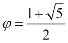
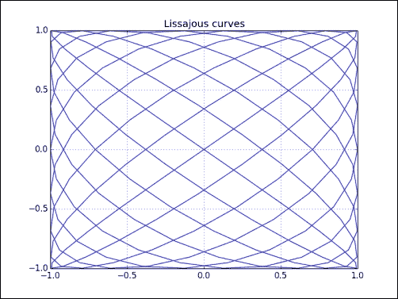
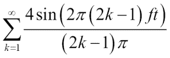
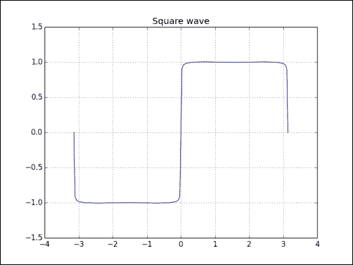
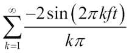
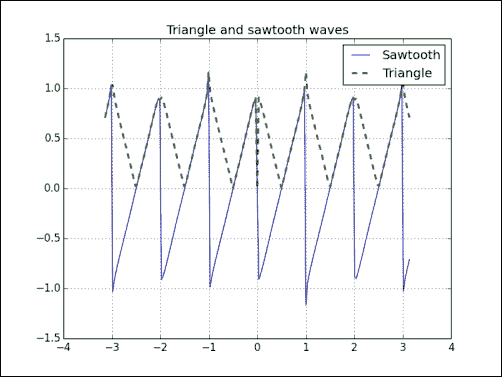

# 第 5 章使用矩阵和 ufunc

本章介绍矩阵和通用函数（ufuncs）。 矩阵在数学上是众所周知的，在 NumPy 中也具有  表示。 通用函数适用于数组，逐元素或标量。 ufuncs 期望一组标量作为输入，并产生一组标量作为输出。 通用函数通常可以映射到它们的数学对应物，例如加，减，除，乘等。 我们还将介绍三角函数，按位和比较通用函数。

在本章中，我们将介绍以下主题：

*   矩阵创建
*   矩阵运算
*   基本功能
*   三角函数
*   按位函数
*   比较功能

# 矩阵

NumPy 中的矩阵是`ndarray`的子类。 我们可以使用特殊的字符串格式创建矩阵。 就像在数学中一样，[它们是二维的](https://www.khanacademy.org/math/precalculus/precalc-matrices)。 正如您期望的那样，矩阵乘法不同于正常的 NumPy 乘法。 电力运营商也是如此。 我们可以使用`mat()`，`matrix()`和`bmat()`函数创建矩阵。

# 实战时间 – 建立矩阵

如果输入已经是矩阵或`ndarray`，则  `mat()`函数不会  复制。 调用此函数等效于调用`matrix`（`data, copy=False`）。 我们还将演示转置和求逆矩阵。

1.  Rows are delimited by a semicolon and values by a space. Call the `mat()` function with the following string to create a matrix:

    ```py
    A = np.mat('1 2 3; 4 5 6; 7 8 9')
    print("Creation from string", A)
    ```

    矩阵输出应为以下矩阵：

    ```py
    Creation from string [[1 2 3]
     [4 5 6]
     [7 8 9]]

    ```

2.  Transpose the matrix with the `T` attribute as follows:

    ```py
    print("transpose A", A.T)
    ```

    以下是转置矩阵：

    ```py
    transpose A [[1 4 7]
     [2 5 8]
     [3 6 9]]

    ```

3.  The matrix can be inverted with the `I` attribute as follows (see [https://www.khanacademy.org/math/precalculus/precalc-matrices/inverting_matrices/v/inverse-matrix-part-1](https://www.khanacademy.org/math/precalculus/precalc-matrices/inverting_matrices/v/inverse-matrix-part-1)):

    ```py
    print("Inverse A", A.I)
    ```

    逆矩阵打印如下（请注意，这是`O(n<sup class="calibre54">3</sup>)`操作，这意味着需要平均三次时间）：

    ```py
    Inverse A [[ -4.50359963e+15   9.00719925e+15  -4.50359963e+15]
     [  9.00719925e+15  -1.80143985e+16   9.00719925e+15]
     [ -4.50359963e+15   9.00719925e+15  -4.50359963e+15]]

    ```

4.  Instead of using a string to create a matrix, do it with an array:

    ```py
    print("Creation from array", np.mat(np.arange(9).reshape(3, 3)))
    ```

    新创建的数组如下所示：

    ```py
    Creation from array [[0 1 2]
     [3 4 5]
     [6 7 8]]

    ```

## 刚刚发生了什么？

我们使用  `mat()`函数创建了矩阵。 我们将具有`T`属性的矩阵转置，而  将其具有`I`属性的矩阵反转（请参见`matrixcreation.py`）：

```py
from __future__ import print_function
import numpy as np

A = np.mat('1 2 3; 4 5 6; 7 8 9')
print("Creation from string", A)
print("transpose A", A.T)
print("Inverse A", A.I)
print("Check Inverse", A * A.I)

print("Creation from array", np.mat(np.arange(9).reshape(3, 3)))
```

# 从其他矩阵创建矩阵

有时，我们想  由其他较小的  矩阵创建矩阵。 我们可以通过  `bmat()`功能来实现。 `b`在这里代表块矩阵。

# 实战时间 – 从其他矩阵创建矩阵

我们将从两个较小的矩阵创建一个矩阵，如下所示：

1.  First, create a 2-by-2 identity matrix:

    ```py
    A = np.eye(2)
    print("A", A)
    ```

    身份矩阵如下所示：

    ```py
    A [[ 1\.  0.]
     [ 0\.  1.]]

    ```

2.  Create another matrix like `A` and multiply it by 2:

    ```py
    B = 2 * A
    print("B", B)
    ```

    第二个矩阵如下：

    ```py
    B [[ 2\.  0.]
     [ 0\.  2.]]

    ```

3.  Create the compound matrix from a string. The string uses the same format as the `mat()` function—use matrices instead of numbers:

    ```py
    print("Compound matrix\n", np.bmat("A B; A B"))
    ```

    复合矩阵如下所示：

    ```py
    Compound matrix
    [[ 1\.  0\.  2\.  0.]
     [ 0\.  1\.  0\.  2.]
     [ 1\.  0\.  2\.  0.]
     [ 0\.  1\.  0\.  2.]]

    ```

## 刚刚发生了什么？

我们使用`bmat()`函数从两个较小的矩阵创建了一个  块矩阵。 我们给该函数一个字符串，其中包含矩阵名称，而不是数字的  （请参见`bmatcreation.py`）：

```py
from __future__ import print_function
import numpy as np

A = np.eye(2)
print("A", A)
B = 2 * A
print("B", B)
print("Compound matrix\n", np.bmat("A B; A B"))
```

## 小测验–使用字符串定义矩阵

Q1。 `mat()`和`bmat()`函数接受的字符串中的行分隔符是什么？

1.  分号
2.  结肠
3.  逗号
4.  空间

# 通用功能

**通用函数**（**ufuncs**）期望一组标量作为输入并产生 一组标量作为输出。 它们实际上是  Python 对象，它们封装了函数的行为。 通常，我们可以将 ufunc 映射到它们的数学对应项，例如加，减，除，乘等。 通常，通用功能由于其特殊的优化以及在本机级别上运行而更快。

# 采取行动的时候–创建通用功能

我们可以使用 NumPy 和`frompyfunc()`函数从 Python 函数创建  ufunc，如下所示：

1.  Define a Python function that answers the ultimate question to the universe, existence, and the rest (it's from *The Hitchhiker's Guide to the Galaxy*, *Douglas Adam*, *Pan Books*, if you haven't read it, you can safely ignore this!):

    ```py
    def ultimate_answer(a):
    ```

    到目前为止，没有什么特别的。 我们给函数命名为`ultimate_answer()`并定义了一个参数`a`。

2.  使用`zeros_like()`函数，创建一个形状与`a`相同的所有零组成的结果：

    ```py
    result = np.zeros_like(a)
    ```

3.  现在，将初始化数组的元素设置为答案`42`，然后返回结果。 完整的功能应显示在下面的代码片段中。 `flat`属性使我们可以访问平面迭代器，该迭代器允许我们设置数组的值。

    ```py
    def ultimate_answer(a):
       result = np.zeros_like(a)
       result.flat = 42
       return result
    ```

4.  Create a ufunc with `frompyfunc()`; specify `1` as the number of input parameter followed by `1` as the number of output parameters:

    ```py
    ufunc = np.frompyfunc(ultimate_answer, 1, 1)
    print("The answer", ufunc(np.arange(4)))
    ```

    一维数组的结果如下所示：

    ```py
    The answer [42 42 42 42]

    ```

    使用以下代码对二维数组执行相同的操作：

    ```py
    print("The answer", ufunc(np.arange(4).reshape(2, 2)))
    ```

    二维数组的输出如下所示：

    ```py
    The answer [[42 42]
     [42 42]]

    ```

## 刚刚发生了什么？

我们定义了一个 Python 函数。 在此函数中，我们使用  和`zeros_like()`函数，根据输入参数的形状将数组的元素初始化为零。 然后，使用`ndarray`的`flat`属性，将数组元素设置为最终答案`42`（请参见`answer42.py`）：

```py
from __future__ import print_function
import numpy as np

def ultimate_answer(a):
   result = np.zeros_like(a)
   result.flat = 42
   return result

ufunc = np.frompyfunc(ultimate_answer, 1, 1)
print("The answer", ufunc(np.arange(4)))

print("The answer", ufunc(np.arange(4).reshape(2, 2)))
```

# 通用功能方法

函数  如何具有方法？ 如前所述，通用函数不是函数，而是表示函数的 Python 对象。 通用功能具有五种重要方法，列为  ：

1.  `ufunc.reduce(a[, axis, dtype, out, keepdims])`
2.  `ufunc.accumulate(array[, axis, dtype, out])`
3.  `ufunc.reduceat(a, indices[, axis, dtype, out])`
4.  `ufunc.outer(A, B)`
5.  `ufunc.at(a, indices[, b])])])`

# 生效时间–将 ufunc 方法应用于添加功能

让我们在`add()`函数上调用前四个方法：

1.  The universal function reduces the input array recursively along a specified axis on consecutive elements. For the `add()` function, the result of reducing is similar to calculating the sum of an array. Call the `reduce()` method:

    ```py
    a = np.arange(9)
    print("Reduce", np.add.reduce(a))
    ```

    精简数组应如下所示：

    ```py
    Reduce 36

    ```

2.  The `accumulate()` method also recursively goes through the input array. But, contrary to the `reduce()` method, it stores the intermediate results in an array and returns that. The result, in the case of the `add()` function, is equivalent to calling the `cumsum()` function. Call the `accumulate()` method on the `add()` function:

    ```py
    print("Accumulate", np.add.accumulate(a))
    ```

    累积的数组如下：

    ```py
    Accumulate [ 0  1  3  6 10 15 21 28 36]

    ```

3.  The `reduceat()` method is a bit complicated to explain, so let's call it and go through its algorithm, step by step. The `reduceat()` method requires as arguments an input array and a list of indices:

    ```py
    print("Reduceat", np.add.reduceat(a, [0, 5, 2, 7]))
    ```

    结果如下所示：

    ```py
    Reduceat [10  5 20 15]

    ```

    第一步  与索引`0`和`5`有关。 此步骤可减少索引`0`和`5`之间的数组元素的运算：

    ```py
    print("Reduceat step I", np.add.reduce(a[0:5]))
    ```

    步骤 1 的输出如下：

    ```py
    Reduceat step I 10

    ```

    第二步涉及索引`5`和`2`。 由于`2`小于`5`，因此返回索引为`5`的数组元素：

    ```py
    print("Reduceat step II", a[5])
    ```

    第二步产生以下输出：

    ```py
    Reduceat step II 5

    ```

    第三步涉及索引`2`和`7`。 此步骤可减少索引`2`和`7`之间的数组元素的运算：

    ```py
    print("Reduceat step III", np.add.reduce(a[2:7]))
    ```

    第三步的结果如下所示：

    ```py
    Reduceat step III 20

    ```

    第四步涉及索引`7`。 此步骤导致从索引`7`到数组末尾的数组元素减少操作：

    ```py
    print("Reduceat step IV", np.add.reduce(a[7:]))
    ```

    第四步结果如下所示：

    ```py
    Reduceat step IV 15

    ```

4.  The `outer()` method returns an array that has a rank, which is the sum of the ranks of its two input arrays. The method is applied to all possible pairs of the input array elements. Call the `outer()` method on the `add()` function:

    ```py
    print("Outer", np.add.outer(np.arange(3), a))
    ```

    外部总和  的输出结果如下：

    ```py
    Outer [[ 0  1  2  3  4  5  6  7  8]
     [ 1  2  3  4  5  6  7  8  9]
     [ 2  3  4  5  6  7  8  9 10]]

    ```

## 刚刚发生了什么？

我们将通用函数的  前四种方法`reduce()`，`accumulate()`，`reduceat()`和`outer()`应用于`add()`函数（请参见`ufuncmethods.py`）：

```py
from __future__ import print_function
import numpy as np

a = np.arange(9)

print("Reduce", np.add.reduce(a))
print("Accumulate", np.add.accumulate(a))
print("Reduceat", np.add.reduceat(a, [0, 5, 2, 7]))
print("Reduceat step I", np.add.reduce(a[0:5]))
print("Reduceat step II", a[5])
print("Reduceat step III", np.add.reduce(a[2:7]))
print("Reduceat step IV", np.add.reduce(a[7:]))
print("Outer", np.add.outer(np.arange(3), a))
```

# 算术函数

通用算术运算符`+`，`-`和`*`分别隐式链接到  通用函数的加，减和乘。 这意味着在 NumPy 数组上使用这些运算符之一时，将调用相应的通用函数。 除法涉及一个稍微复杂的过程。 与数组划分有关的三个通用函数是`divide()`，`true_divide()`和`floor_division()`。 两个运算符对应于除法：`/`和`//`。

# 实战时间 – 分割阵列

让我们来看一下数组划分  的作用：

1.  The `divide()` function does truncated integer division and normal floating-point division:

    ```py
    a = np.array([2, 6, 5])
    b = np.array([1, 2, 3])
    print("Divide", np.divide(a, b), np.divide(b, a))
    ```

    `divide()`函数的结果如下所示：

    ```py
    Divide [2 3 1] [0 0 0]

    ```

    如您所见，截断发生了。

2.  The `true_divide()` function comes closer to the mathematical definition of division. Integer division returns a floating-point result and no truncation occurs:

    ```py
    print("True Divide", np.true_divide(a, b), np.true_divide(b, a))
    ```

    `true_divide()`函数的结果如下：

    ```py
    True Divide [ 2\.          3\.          1.66666667] [ 0.5         0.33333333  0.6       ]

    ```

3.  The `floor_divide()` function always returns an integer result. It is equivalent to calling the `floor()` function after calling the `divide()` function. The `floor()` function discards the decimal part of a floating-point number and returns an integer:

    ```py
    print("Floor Divide", np.floor_divide(a, b), np.floor_divide(b, a))
    c = 3.14 * b
    print("Floor Divide 2", np.floor_divide(c, b), np.floor_divide(b, c))
    ```

    `floor_divide()`函数调用导致：

    ```py
    Floor Divide [2 3 1] [0 0 0]
    Floor Divide 2 [ 3\.  3\.  3.] [ 0\.  0\.  0.]

    ```

4.  By default, the `/` operator is equivalent to calling the `divide()` function:

    ```py
    from __future__ import division
    ```

    但是，如果在 Python 程序的开头找到此行，则将调用`true_divide()`函数。 因此，此代码将如下所示：

    ```py
    print("/ operator", a/b, b/a)
    ```

    The result is shown as follows:

    ```py
    / operator [ 2\.          3\.          1.66666667] [ 0.5         0.33333333  0.6       ]

    ```

5.  The `//` operator is equivalent to calling the `floor_divide()` function. For example, look at the following code snippet:

    ```py
    print("// operator", a//b, b//a)
    print("// operator 2", c//b, b//c)
    ```

    `//`运算符结果如下所示：

    ```py
    // operator [2 3 1] [0 0 0]
    // operator 2 [ 3\.  3\.  3.] [ 0\.  0\.  0.]

    ```

## 刚刚发生了什么？

`divide()`函数会截断  整数除法和常规浮点除法。 `true_divide()`函数始终返回浮点结果而没有任何截断。 `floor_divide()`函数始终返回整数结果； 结果与通过连续调用`divide()`和`floor()`函数（请参见`dividing.py`）获得的  相同：

```py
from __future__ import print_function
from __future__ import division
import numpy as np

a = np.array([2, 6, 5])
b = np.array([1, 2, 3])

print("Divide", np.divide(a, b), np.divide(b, a))
print("True Divide", np.true_divide(a, b), np.true_divide(b, a))
print("Floor Divide", np.floor_divide(a, b), np.floor_divide(b, a))
c = 3.14 * b
print("Floor Divide 2", np.floor_divide(c, b), np.floor_divide(b, c))
print("/ operator", a/b, b/a)
print("// operator", a//b, b//a)
print("// operator 2", c//b, b//c)
```

## 拥有围棋英雄-试用 __future __。division

通过实验确认  导入 __future __。division 的影响。

# 模运算

我们可以使用 NumPy `mod()`，`remainder()`和`fmod()`函数来计算模或余数。 同样，我们  可以使用`%`运算符。 这些函数之间的主要区别在于它们如何处理负数。 该组中的奇数是`fmod()`功能。

# 实战时间 – 计算模数

让我们调用前面提到的  函数：

1.  The `remainder()` function returns the remainder of the two arrays, element-wise. `0` is returned if the second number is `0`:

    ```py
    a = np.arange(-4, 4)
    print("Remainder", np.remainder(a, 2))
    ```

    `remainder()`函数的结果如下所示：

    ```py
    Remainder [0 1 0 1 0 1 0 1]

    ```

2.  The `mod()` function does exactly the same as the `remainder()` function:

    ```py
    print("Mod", np.mod(a, 2))
    ```

    `mod()`函数的结果如下所示：

    ```py
    Mod [0 1 0 1 0 1 0 1]

    ```

3.  The `%` operator is just shorthand for the `remainder()` function:

    ```py
    print("% operator", a % 2)
    ```

    `%`运算符的结果如下所示：

    ```py
    % operator [0 1 0 1 0 1 0 1]

    ```

4.  The `fmod()` function handles negative numbers differently than `mod()`, `fmod()`, and `%` do. The sign of the remainder is the sign of the dividend, and the sign of the divisor has no influence on the results:

    ```py
    print("Fmod", np.fmod(a, 2))
    ```

    `fmod()`结果打印如下：

    ```py
    Fmod [ 0 -1  0 -1  0  1  0  1]

    ```

## 刚刚发生了什么？

我们向 NumPy 演示了`mod()`，`remainder()`和`fmod()`函数，它们计算模或余数（请参见`modulo.py`）：

```py
from __future__ import print_function
import numpy as np

a = np.arange(-4, 4)

print("Remainder", np.remainder(a, 2))
print("Mod", np.mod(a, 2))
print("% operator", a % 2)
print("Fmod", np.fmod(a, 2))
```

# 斐波那契数

[**斐波那契数**](http://en.wikipedia.org/wiki/Fibonacci_number) 基于递归关系：


用 NumPy 代码直接表达这种关系是困难的。 但是，我们可以用矩阵形式表示这种关系，也可以按照**黄金比例**公式：


与



这将介绍`matrix()`和`rint()`功能。 `matrix()`函数创建矩阵，   数字四舍五入到最接近的整数，但结果不是整数。

# 实战时间 – 计算斐波纳契数

矩阵可以  表示斐波那契递归关系。 我们可以将斐波纳契数的计算表示为重复的矩阵乘法：

1.  Create the Fibonacci matrix as follows:

    ```py
    F = np.matrix([[1, 1], [1, 0]])
    print("F", F)
    ```

    斐波那契矩阵如下所示：

    ```py
    F [[1 1]
     [1 0]]

    ```

2.  Calculate the `8th` Fibonacci number (ignoring `0`), by subtracting `1` from `8` and taking the power of the matrix. The Fibonacci number then appears on the diagonal:

    ```py
    print("8th Fibonacci", (F ** 7)[0, 0])
    ```

    斐波那契数如下：

    ```py
    8th Fibonacci 21

    ```

3.  The **golden ratio** formula, better known as **Binet's** formula, allows us to calculate Fibonacci numbers with a rounding step at the end. Calculate the first eight Fibonacci numbers:

    ```py
    n = np.arange(1, 9)
    sqrt5 = np.sqrt(5)
    phi = (1 + sqrt5)/2
    fibonacci = np.rint((phi**n - (-1/phi)**n)/sqrt5)
    print("Fibonacci", fibonacci)
    ```

    前八个斐波那契数如下：

    ```py
    Fibonacci [  1\.   1\.   2\.   3\.   5\.   8\.  13\.  21.]

    ```

## 刚刚发生了什么？

我们用两种方法计算了  斐波那契数。 在此过程中，我们了解了用于创建矩阵的`matrix()`函数。 我们还了解了  `rint()`函数，该函数将数字四舍五入到最接近的整数，但不将类型更改为整数（请参见`fibonacci.py`）：

```py
from __future__ import print_function
import numpy as np

F = np.matrix([[1, 1], [1, 0]])
print("F", F)
print("8th Fibonacci", (F ** 7)[0, 0])
n = np.arange(1, 9)

sqrt5 = np.sqrt(5)
phi = (1 + sqrt5)/2
fibonacci = np.rint((phi**n - (-1/phi)**n)/sqrt5)
print("Fibonacci", fibonacci)
```

## 勇往直前–计时计算

您可能在  想知道哪种方法更快，因此请继续并确定时间。 用`frompyfunc()`创建通用的斐波那契函数，并对其计时。

# 李沙育曲线

所有标准的三角函数，例如`sin`，`cos`，`tan`等，都由 NumPy 中的[通用函数表示](https://www.khanacademy.org/math/trigonometry)）。**利萨如曲线**是使用三角函数的一种有趣方式。 我记得在物理实验室的示波器上制作了李沙育的数字。 两个参数方程式描述了这些图形：

```py
x = A sin(at + π/2)
y = B sin(bt)
```

# 实战时间 – 绘制李萨如曲线

利萨如的数字是由`A`，`B`，`a`和`b`四个参数确定的  。 为了简单起见，我们将`A`和`B`设置为`1`：

1.  将具有`linspace()`功能的`t`从`-pi`初始化为具有`201`点的`pi`：

    ```py
    a = 9
    b = 8
    t = np.linspace(-np.pi, np.pi, 201)
    ```

2.  使用`sin()`函数和`np.pi`计算`x`：

    ```py
    x = np.sin(a * t + np.pi/2)
    ```

3.  使用`sin()`函数计算`y`：

    ```py
    y = np.sin(b * t)
    ```

4.  Plot as shown in the following:

    ```py
    plt.plot(x, y)
    plt.title('Lissajous curves')
    plt.grid()
    plt.show()
    ```

    `a = 9`和`b = 8`的结果如下：

    

## 刚刚发生了什么？

我们用上述参数方程式绘制了  Lissajous 曲线，其中`A=B=1`，`a=9`和`b=8`。 我们使用了`sin()`和`linspace()`函数，以及 NumPy `pi`常量（请参见`lissajous.py`）：

```py
import numpy as np
import matplotlib.pyplot as plt

a = 9
b = 8
t = np.linspace(-np.pi, np.pi, 201)
x = np.sin(a * t + np.pi/2)
y = np.sin(b * t)
plt.plot(x, y)
plt.title('Lissajous curves')
plt.grid()
plt.show()
```

# 方波

方波也是您可以在示波器上查看的那些整洁的东西之一。 正弦波可以很好地将其近似为  。 毕竟，方波是  可以用无限**傅立叶级数**表示的信号。

### 注意

傅立叶级数是以著名数学家让·巴蒂斯特·傅立叶（Jean-Baptiste Fourier）命名的，一系列[正弦和余弦项之和](http://en.wikipedia.org/wiki/Fourier_series)。

代表方波的该特定系列的公式如下：



# 实战时间 – 绘制方波

就像上一节  一样，我们将初始化`t`。 我们需要总结一些术语。 术语数量越多，结果越准确； `k = 99`应该足够。 为了绘制方波，请按照下列步骤操作：

1.  我们将从初始化`t`和`k`开始。 将该功能的初始值设置为`0`：

    ```py
    t = np.linspace(-np.pi, np.pi, 201)
    k = np.arange(1, 99)
    k = 2 * k - 1
    f = np.zeros_like(t)
    ```

2.  使用`sin()`和`sum()`功能计算功能值：

    ```py
    for i, ti in enumerate(t):
       f[i] = np.sum(np.sin(k * ti)/k)

    f = (4 / np.pi) * f
    ```

3.  The code to plot is almost identical to the one in the previous section:

    ```py
    plt.plot(t, f)
    plt.title('Square wave')
    plt.grid()
    plt.show()
    ```

    用`k = 99`生成的所得方波如下：

    

## 刚刚发生了什么？

我们使用  `sin()`函数生成了  方波，或者至少是它的近似值。 输入值通过  `linspace()`功能进行组装，而`k`值  通过`arange()`功能进行组装（请参见`squarewave.py`）：

```py
import numpy as np
import matplotlib.pyplot as plt

t = np.linspace(-np.pi, np.pi, 201)
k = np.arange(1, 99)
k = 2 * k - 1
f = np.zeros_like(t)

for i, ti in enumerate(t):
   f[i] = np.sum(np.sin(k * ti)/k)

f = (4 / np.pi) * f

plt.plot(t, f)
plt.title('Square wave')
plt.grid()
plt.show()
```

## 拥有围棋英雄-摆脱循环

您可能已经  注意到代码中存在一个循环。 使用 NumPy 函数摆脱它，并确保性能也得到改善。

# 锯齿波和三角波

锯齿波和三角波也是在示波器上容易看到的现象。 就像  方波一样，我们可以定义无限傅立叶级数。 三角波可以通过获取锯齿波的绝对值来找到。 一系列锯齿波的  表示公式如下：



# 实战时间 – 绘制锯齿波和三角波

就像上一节一样，我们将  初始化`t`。 同样，`k = 99`应该足够。 为了绘制  锯齿波和三角波，请按照下列步骤操作：

1.  将该功能的初始值设置为`zero`：

    ```py
    t = np.linspace(-np.pi, np.pi, 201)
    k = np.arange(1, 99)
    f = np.zeros_like(t)
    ```

2.  使用`sin()`和`sum()`功能计算功能值：

    ```py
    for i, ti in enumerate(t):
       f[i] = np.sum(np.sin(2 * np.pi * k * ti)/k)

    f = (-2 / np.pi) * f
    ```

3.  It's easy to plot the sawtooth and triangle waves since the value of the triangle wave should be equal to the absolute value of the sawtooth wave. Plot the waves as shown in the following:

    ```py
    plt.plot(t, f, lw=1.0, label='Sawtooth')
    plt.plot(t, np.abs(f), '--', lw=2.0, label='Triangle')
    plt.title('Triangle and sawtooth waves')
    plt.grid()
    plt.legend(loc='best')
    plt.show()
    ```

    在下图中，三角形波是带有虚线的波：

    

## 刚刚发生了什么？

我们使用`sin()`功能绘制了  锯齿波  。 我们将输入值与`linspace()`功能组合在一起，并将`k`值与`arange()`功能组合在一起。 通过取绝对值从锯齿波中产生一个三角波（请参见`sawtooth.py`）：

```py
import numpy as np
import matplotlib.pyplot as plt

t = np.linspace(-np.pi, np.pi, 201)
k = np.arange(1, 99)
f = np.zeros_like(t)

for i, ti in enumerate(t):
   f[i] = np.sum(np.sin(2 * np.pi * k * ti)/k)

f = (-2 / np.pi) * f
plt.plot(t, f, lw=1.0, label='Sawtooth')
plt.plot(t, np.abs(f), '--', lw=2.0, label='Triangle')
plt.title('Triangle and sawtooth waves')
plt.grid()
plt.legend(loc='best')
plt.show()
```

## 拥有围棋英雄-摆脱循环

如果您选择接受  ，那么您面临的挑战是摆脱程序中的循环。 它应该可以与 NumPy 函数一起使用，并且性能  应该得到改善。

# 按位和比较功能

按位函数是整数或  整数数组的位，因为它们是通用函数。 运算符`^`，`&`，`|`，`<<`，`>>`等具有其 NumPy 对应物。 比较运算符，例如`<`，`>`和`==`等也是如此。 这些运算符使您可以做一些巧妙的技巧，从而提高性能； 但是，它们会使您的代码难以理解，因此请谨慎使用。

# 作用时间–旋转位

现在，我们将介绍三个技巧：检查整数的符号是​​否不同，检查  数字是否为`2`的幂，以及计算作为`2`的幂的数字的模数。 我们将展示一个仅用于运算符的符号，以及一个使用相应的 NumPy 函数的符号：

1.  The first trick depends on the `XOR` or `^` operator. The `XOR` operator is also called the inequality operator; so, if the sign bit of the two operands is different, the `XOR` operation will lead to a negative number (see [https://www.khanacademy.org/computing/computer-science/cryptography/ciphers/a/xor-bitwise-operation](https://www.khanacademy.org/computing/computer-science/cryptography/ciphers/a/xor-bitwise-operation)).

    下面的真值表说明了`XOR`运算符：

    <colgroup class="calibre22"><col class="calibre23"> <col class="calibre23"> <col class="calibre23"></colgroup> 
    | 

    输入 1

     | 

    输入 2

     | 

    异或

     |
    | --- | --- | --- |
    | 真正 | True | 假 |
    | False | True | True |
    | True | False | True |
    | False | False | False |

    `^`运算符对应于`bitwise_xor()`功能，`<`运算符对应于`less()`功能：

    ```py
    x = np.arange(-9, 9)
    y = -x
    print("Sign different?", (x ^ y) < 0)
    print("Sign different?", np.less(np.bitwise_xor(x, y), 0))
    ```

    结果为  ，如下所示：

    ```py
    Sign different? [ True  True  True  True  True  True  True  True  True False  True  True
     True  True  True  True  True  True]
    Sign different? [ True  True  True  True  True  True  True  True  True False  True  True
     True  True  True  True  True  True]

    ```

    正如预期的那样，除零以外，所有符号均不同。

2.  A power of `2` is represented by a `1`, followed by a series of trailing zeroes in binary notation. For instance, `10`, `100`, or `1000`. A number one less than a power of `2` will be represented by a row of ones in binary. For instance, `11`, `111`, or `1111` (or `3`, `7`, and `15` in the decimal system). Now, if we bitwise `AND` a power of `2`, and the integer that is one less than that, then we should get `0`.

    `AND`运算符的真值表如下所示：

    <colgroup class="calibre22"><col class="calibre23"> <col class="calibre23"> <col class="calibre23"></colgroup> 
    | 

    Input 1

     | 

    Input 2

     | 

    和

     |
    | --- | --- | --- |
    | True | True | True |
    | False | True | False |
    | True | False | False |
    | False | False | False |

    `&`的 NumPy 对应项是`bitwise_and()`，`==`的对应项是`equal()`通用函数：

    ```py
    print("Power of 2?\n", x, "\n", (x & (x - 1)) == 0)
    print("Power of 2?\n", x, "\n", np.equal(np.bitwise_and(x,  (x - 1)), 0))
    ```

    The result is shown as follows:

    ```py
    Power of 2?
    **[-9 -8 -7 -6 -5 -4 -3 -2 -1  0  1  2  3  4  5  6  7  8]** 
    [False False False False False False False False False  True  True  True
     False  True False False False  True]
    Power of 2?
    **[-9 -8 -7 -6 -5 -4 -3 -2 -1  0  1  2  3  4  5  6  7  8]** 
    [False False False False False False False False False  True  True  True
     False  True False False False  True]

    ```

3.  The trick of computing the modulus of 4 actually works when taking the modulus of integers that are a power of `2` such as `4`, `8`, `16`, and so on. A bitwise left shift leads to doubling of values (see [https://wiki.python.org/moin/BitwiseOperators](https://wiki.python.org/moin/BitwiseOperators)). We saw in the previous step that subtracting one from a power of `2` leads to a number in binary notation that has a row of ones such as `11`, `111`, or `1111`. This basically gives us a mask. Bitwise-ANDing with such a number gives you the remainder with a power of `2`. The NumPy equivalent of `<<` is the `left_shift()` universal function:

    ```py
    print("Modulus 4\n", x, "\n", x & ((1 << 2) - 1))
    print("Modulus 4\n", x, "\n", np.bitwise_and(x, np.left_shift(1, 2) - 1))
    ```

    The result is shown as follows:

    ```py
    Modulus 4
    **[-9 -8 -7 -6 -5 -4 -3 -2 -1  0  1  2  3  4  5  6  7  8]** 
    [3 0 1 2 3 0 1 2 3 0 1 2 3 0 1 2 3 0]
    Modulus 4
    **[-9 -8 -7 -6 -5 -4 -3 -2 -1  0  1  2  3  4  5  6  7  8]** 
    [3 0 1 2 3 0 1 2 3 0 1 2 3 0 1 2 3 0]

    ```

## 刚刚发生了什么？

我们介绍了三点技巧：检查整数的符号是​​否不同，检查数字是否为`2`的幂，并计算数字的模数为`2`的幂。 我们看到了运算符`^`，`&`，`<<`和`<`的 NumPy 对应项（请参见`bittwidling.py`）：

```py
from __future__ import print_function
import numpy as np

x = np.arange(-9, 9)
y = -x
print("Sign different?", (x ^ y) < 0)
print("Sign different?", np.less(np.bitwise_xor(x, y), 0))
print("Power of 2?\n", x, "\n", (x & (x - 1)) == 0)
print("Power of 2?\n", x, "\n", np.equal(np.bitwise_and(x,  (x - 1)), 0))
print("Modulus 4\n", x, "\n", x & ((1 << 2) - 1))
print("Modulus 4\n", x, "\n", np.bitwise_and(x, np.left_shift(1, 2) - 1))
```

# 花式索引

`at()`方法是在 **NumPy 1.8** 中添加的  。 此方法允许就地建立精美索引。 花式索引是不涉及整数或切片的索引  ，这是正常的索引。 就地意味着将对我们操作的数组进行修改。

`at()`方法的签名为`ufunc.at(a, indices[, b])`。 indexs 数组指定要操作的元素。 我们仅需要`b`数组用于具有两个操作数的通用函数。 以下*时间* *用于* *操作*部分的时间为`at()`方法的示例 。

# 实战时间 – 使用 at（）方法为 ufuncs 就地建立索引

要演示  方法的工作方式，请启动  Python 或 IPython shell 并导入 NumPy。 您现在应该知道如何执行此操作。

1.  Create an array with seven random integers from `-3` to `3` with a seed of `42`:

    ```py
    >>> a = np.random.random_integers(-3, 3, 7)
    >>> a
    array([ 1,  0, -1,  2,  1, -2,  0])

    ```

    当我们在编程中谈论随机数字时，我们通常会谈论[伪随机数](https://www.khanacademy.org/computing/computer-science/cryptography/crypt/v/random-vs-pseudorandom-number-generators)。 这些数字看起来是随机的，但实际上是使用种子来计算的。

2.  将`sign()`通用函数的`at()`方法应用于第四和第六个数组元素：

    ```py
    >>> np.sign.at(a, [3, 5])
    >>> a
    array([ 1, 0, -1,  1,  1, -1,  0])

    ```

## 刚刚发生了什么？

我们使用`at()`方法来选择  数组元素，并执行就地操作-确定  符号。 我们还学习了如何创建  随机整数。

# 总结

在本章中，您学习了关于矩阵和通用函数的知识。 我们介绍了如何创建矩阵，并研究了通用函数如何工作。 您简要介绍了算术，三角函数，按位和比较通用函数。

在下一章中，您将介绍 NumPy 模块。