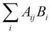
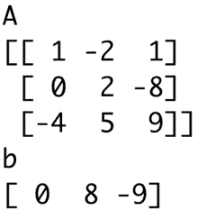
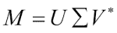
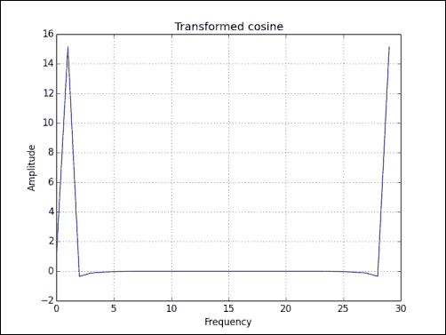
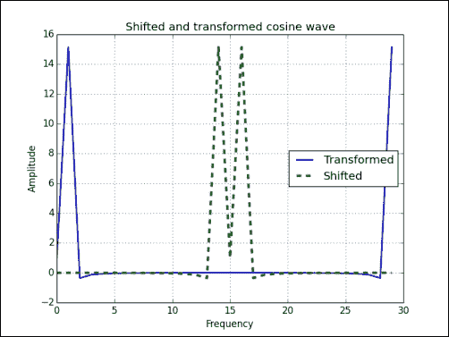
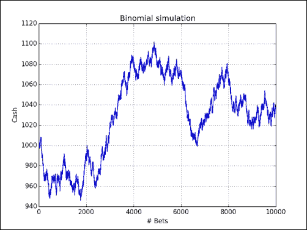
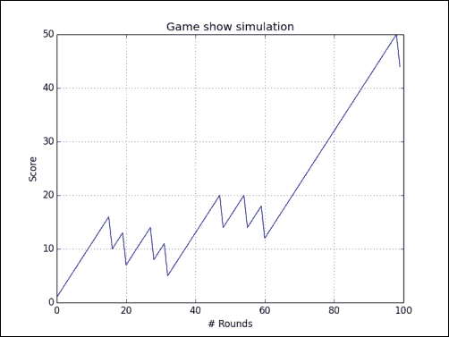
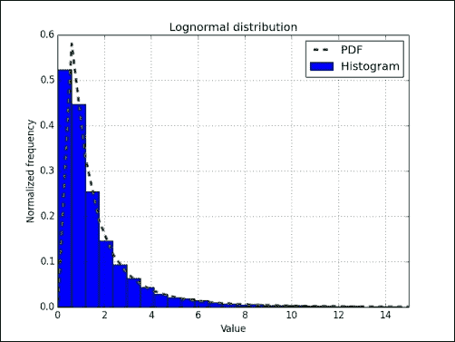
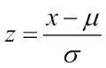

# 第 6 章。使用 NumPy 模块进一步移动

*NumPy 具有许多从其前身 Numeric 继承的模块。 其中一些软件包具有 SciPy 对应版本，可能具有更完整的功能。 我们将在下一章中讨论 SciPy。*

在本章中，我们将介绍以下主题：

*   `linalg`封装
*   `fft`封装
*   随机数
*   连续和离散分布

# 线性代数

线性代数是数学的重要分支。 `numpy.linalg`程序包包含线性代数  函数。 使用此模块，您可以求矩阵求逆，计算  特征值，求解线性方程式和确定行列式等（请参见 [http://docs.scipy.org/doc/numpy/reference/ 例程.linalg.html](http://docs.scipy.org/doc/numpy/reference/routines.linalg.html) ）。

# 采取行动了–转换矩阵

线性代数中矩阵`A`的逆  是矩阵`A<sup class="calibre60">-1</sup>`，当与原始矩阵相乘时，它等于单位矩阵`I`。 可以这样写  ：

`A A<sup class="calibre60">-1</sup> = I`

`numpy.linalg`程序包  中的`inv()`函数可以通过以下步骤反转示例矩阵：

1.  Create the example matrix with the `mat()` function we used in the previous chapters:

    ```py
    A = np.mat("0 1 2;1 0 3;4 -3 8")
    print("A\n", A)
    ```

    `A`矩阵如下所示：

    ```py
    **A**
    **[[ 0  1  2]**
     **[ 1  0  3]**
     **[ 4 -3  8]]**

    ```

2.  Invert the matrix with the `inv()` function:

    ```py
    inverse = np.linalg.inv(A)
    print("inverse of A\n", inverse)
    ```

    逆矩阵如下所示：

    ```py
    **inverse of A**
    **[[-4.5  7\.  -1.5]**
     **[-2\.   4\.  -1\. ]**
     **[ 1.5 -2\.   0.5]]**

    ```

    ### 提示

    如果矩阵是奇异的，或者不是  正方形，则引发`LinAlgError`。 如果需要，可以用笔和纸手动检查结果。 这留给读者练习。

3.  Check the result by multiplying the original matrix with the result of the `inv()` function:

    ```py
    print("Check\n", A * inverse)
    ```

    结果是单位矩阵，如预期的那样：

    ```py
    **Check**
    **[[ 1\.  0\.  0.]**
     **[ 0\.  1\.  0.]**
     **[ 0\.  0\.  1.]]**

    ```

## 刚刚发生了什么？

我们用`numpy.linalg`包的`inv()`函数计算了矩阵的逆。 我们使用矩阵乘法检查了这是否确实是逆矩阵（请参见`inversion.py`）：

```py
from __future__ import print_function
import numpy as np

A = np.mat("0 1 2;1 0 3;4 -3 8")
print("A\n", A)

inverse = np.linalg.inv(A)
print("inverse of A\n", inverse)

print("Check\n", A * inverse)
```

## 小测验-创建矩阵

Q1。 可以创建哪个  函数？

1.  `array`
2.  create_matrix
3.  餐饮
4.  向量

## 拥有围棋英雄-反转自己的矩阵

创建自己的矩阵并将其求逆。 逆仅针对平方矩阵定义。 矩阵必须是正方形且可逆； 否则，将引发`LinAlgError`异常。

# 求解线性系统

矩阵以线性方式将  向量转换为另一个向量。 该变换在数学上对应于线性方程组。 `numpy.linalg`函数`solve()`求解形式为`Ax = b`的线性方程组，其中`A`是矩阵，`b`可以是一维或二维数组，而`x`是未知数 变量。 我们将看到`dot()`功能的使用。 此函数返回两个浮点数组的点积。

`dot()`函数  计算点积（请参阅 [https://www.khanacademy.org/math/linear-algebra/vectors_and_spaces/dot_cross_products/v/vector-dot-product-and- 向量长度](https://www.khanacademy.org/math/linear-algebra/vectors_and_spaces/dot_cross_products/v/vector-dot-product-and-vector-length)）。 对于矩阵`A`和向量`b`，点积等于以下总和：



# 作用时间–解决线性系统

通过以下步骤解决  线性系统的示例：

1.  Create `A` and `b`:

    ```py
    A = np.mat("1 -2 1;0 2 -8;-4 5 9")
    print("A\n", A)
    b = np.array([0, 8, -9])
    print("b\n", b)
    ```

    `A`和`b`出现如下：

    
2.  Solve this linear system with the `solve()` function:

    ```py
    x = np.linalg.solve(A, b)
    print("Solution", x)
    ```

    线性系统的解如下：

    ```py
    **Solution [ 29\.  16\.   3.]**

    ```

3.  Check whether the solution is correct with the `dot()` function:

    ```py
    print("Check\n", np.dot(A , x))
    ```

    结果是预期的：

    ```py
    **Check**
    **[[ 0\.  8\. -9.]]**

    ```

## 刚刚发生了什么？

我们使用 NumPy linalg 模块的`solve()`函数求解了线性系统，并使用`dot()`函数检查了解。 请参考本书代码捆绑中的`solution.py`文件：

```py
from __future__ import print_function
import numpy as np

A = np.mat("1 -2 1;0 2 -8;-4 5 9")
print("A\n", A)

b = np.array([0, 8, -9])
print("b\n", b)

x = np.linalg.solve(A, b)
print("Solution", x)

print("Check\n", np.dot(A , x))
```

# 查找特征值和特征向量

**特征值**是方程`Ax = ax`的标量解，其中`A`是二维矩阵，`x`是一维向量。**特征向量**是对应于特征值的向量（请参阅 [https://www.khanacademy.org/math/linear-algebra/alternate_bases/eigen_everything/v /线性代数本征值和本征向量](https://www.khanacademy.org/math/linear-algebra/alternate_bases/eigen_everything/v/linear-algebra-introduction-to-eigenvalues-and-eigenvectors)）。 `numpy.linalg`软件包中的`eigvals()`函数  计算  特征值。 `eig()`函数  返回包含特征值和  特征向量的元组。

# 行动时间–确定特征值和特征向量

让我们计算  矩阵的特征值：

1.  Create a matrix as shown in the following:

    ```py
    A = np.mat("3 -2;1 0")
    print("A\n", A)
    ```

    我们创建的矩阵如下所示：

    ```py
    **A**
    **[[ 3 -2]**
     **[ 1  0]]**

    ```

2.  Call the `eigvals()` function:

    ```py
    print("Eigenvalues", np.linalg.eigvals(A))
    ```

    矩阵的特征值如下：

    ```py
    **Eigenvalues [ 2\.  1.]**

    ```

3.  Determine eigenvalues and eigenvectors with the `eig()` function. This function returns a tuple, where the first element contains eigenvalues and the second element contains corresponding eigenvectors, arranged column-wise:

    ```py
    eigenvalues, eigenvectors = np.linalg.eig(A)
    print("First tuple of eig", eigenvalues)
    print("Second tuple of eig\n", eigenvectors)
    ```

    特征值和特征向量如下所示：

    ```py
    **First tuple of eig [ 2\.  1.]**
    **Second tuple of eig**
    **[[ 0.89442719  0.70710678]**
     **[ 0.4472136   0.70710678]]**

    ```

4.  Check the result with the `dot()` function by calculating the right and left side of the eigenvalues equation `Ax = ax`:

    ```py
    for i, eigenvalue in enumerate(eigenvalues):
          print("Left", np.dot(A, eigenvectors[:,i]))
          print("Right", eigenvalue * eigenvectors[:,i])
          print()
    ```

    输出如下：

    ```py
    **Left [[ 1.78885438]**
     **[ 0.89442719]]**
    **Right [[ 1.78885438]**
     **[ 0.89442719]]**

    ```

## 刚刚发生了什么？

我们发现了具有`numpy.linalg`模块的`eigvals()`和`eig()`函数的矩阵的特征值和特征向量。 我们使用`dot()`函数检查了结果（请参见`eigenvalues.py`）：

```py
from __future__ import print_function
import numpy as np

A = np.mat("3 -2;1 0")
print("A\n", A)

print("Eigenvalues", np.linalg.eigvals(A) )

eigenvalues, eigenvectors = np.linalg.eig(A)
print("First tuple of eig", eigenvalues)
print("Second tuple of eig\n", eigenvectors)

for i, eigenvalue in enumerate(eigenvalues):
      print("Left", np.dot(A, eigenvectors[:,i]))
      print("Right", eigenvalue * eigenvectors[:,i])
      print()
```

# 奇异值分解

**奇异 值 分解**（ **SVD** ）是一种分解因子，可以将矩阵分解为三个矩阵的乘积。 SVD 是先前讨论的特征值分解的概括。 SVD 对于像  这样的伪逆算法非常有用，我们将在下一部分中进行讨论。 `numpy.linalg`程序包中的  `svd()`函数可以执行此分解。 此函数返回三个矩阵`U`，`∑`和`V`，使得`U`和`V`为一元且`∑`包含输入矩阵的奇异值：



星号表示  **Hermitian 共轭物**或**共轭物 转置**。**复数 共轭物**改变复数虚部的符号，因此与 实数。

### 注意

如果`A<sup class="calibre64">*</sup>A = AA<sup class="calibre64">*</sup> = I`（单位矩阵），则复方矩阵 A 是 unit 的。 我们可以将 SVD 解释为三个操作的序列-旋转，缩放和另一个旋转。

我们已经在本书中转置了矩阵。 转置翻转矩阵，将行变成列，然后将列变成行。

# 采取行动了–分解矩阵

现在该使用以下  步骤用 SVD 分解  矩阵：

1.  First, create a matrix as shown in the following:

    ```py
    A = np.mat("4 11 14;8 7 -2")
    print("A\n", A)
    ```

    The matrix we created looks like the following:

    ```py
    **A**
    **[[ 4 11 14]**
     **[ 8  7 -2]]**

    ```

2.  Decompose the matrix with the `svd()` function:

    ```py
    U, Sigma, V = np.linalg.svd(A, full_matrices=False)
    print("U")
    print(U)
    print("Sigma")
    print(Sigma)
    print("V")
    print(V)
    ```

    由于`full_matrices=False`规范，NumPy 执行了简化的 SVD 分解，计算速度更快。 结果是一个元组，在左侧和右侧分别包含两个 unit 矩阵`U`和`V`，以及中间矩阵的单数  值：

    ```py
    **U**
    **[[-0.9486833  -0.31622777]**
     **[-0.31622777  0.9486833 ]]**
    **Sigma**
    **[ 18.97366596   9.48683298]**
    **V**
    **[[-0.33333333 -0.66666667 -0.66666667]**
     **[ 0.66666667  0.33333333 -0.66666667]]**

    ```

3.  We do not actually have the middle matrix—we only have the diagonal values. The other values are all 0\. Form the middle matrix with the `diag()` function. Multiply the three matrices as follows:

    ```py
    print("Product\n", U * np.diag(Sigma) * V)
    ```

    这三个矩阵的乘积等于我们在第一步中创建的矩阵：

    ```py
    **Product**
    **[[  4\.  11\.  14.]**
     **[  8\.   7\.  -2.]]**

    ```

## 刚刚发生了什么？

我们分解矩阵，并通过矩阵乘法检查结果。 我们使用了 NumPy `linalg`模块中的`svd()`函数（请参见`decomposition.py`）：

```py
from __future__ import print_function
import numpy as np

A = np.mat("4 11 14;8 7 -2")
print("A\n", A)

U, Sigma, V = np.linalg.svd(A, full_matrices=False)

print("U")
print(U)

print("Sigma")
print(Sigma)

print("V")
print(V)

print("Product\n", U * np.diag(Sigma) * V)
```

# 伪逆

矩阵的 **Moore-Penrose 伪逆**的计算公式为  `numpy.linalg`模块的`pinv()`功能（请参阅 [http://en.wikipedia.org/wiki/Moore%E2%80%93Penrose_pseudoinverse](http://en.wikipedia.org/wiki/Moore%E2%80%93Penrose_pseudoinverse) ）。 使用 SVD 计算伪逆（请参见前面的示例）。 `inv()`函数仅接受平方  矩阵； `pinv()`函数确实没有  的限制，因此被认为是反函数的推广。

# 作用时间–计算矩阵的伪逆

让我们计算矩阵的伪逆：

1.  First, create a matrix:

    ```py
    A = np.mat("4 11 14;8 7 -2")
    print("A\n", A)
    ```

    The matrix we created looks like the following:

    ```py
    **A**
    **[[ 4 11 14]**
     **[ 8  7 -2]]**

    ```

2.  Calculate the pseudo inverse matrix with the `pinv()` function:

    ```py
    pseudoinv = np.linalg.pinv(A)
    print("Pseudo inverse\n", pseudoinv)
    ```

    伪逆结果如下：

    ```py
    **Pseudo inverse**
    **[[-0.00555556  0.07222222]**
     **[ 0.02222222  0.04444444]**
     **[ 0.05555556 -0.05555556]]**

    ```

3.  Multiply the original and pseudo inverse matrices:

    ```py
    print("Check", A * pseudoinv)
    ```

    我们得到的不是一个恒等矩阵，但是很接近它：

    ```py
    **Check [[  1.00000000e+00   0.00000000e+00]**
     **[  8.32667268e-17   1.00000000e+00]]**

    ```

## 刚刚发生了什么？

我们使用`numpy.linalg`模块的`pinv()`函数计算了矩阵的伪  逆。 通过矩阵乘法检查得出的矩阵大约是  单位矩阵（请参见`pseudoinversion.py`）：

```py
from __future__ import print_function
import numpy as np

A = np.mat("4 11 14;8 7 -2")
print("A\n", A)

pseudoinv = np.linalg.pinv(A)
print("Pseudo inverse\n", pseudoinv)

print("Check", A * pseudoinv)
```

# 行列式

**行列式**是与平方矩阵相关的  值。 在整个数学中都使用它； 有关更多详细信息，请  参见 [http://en.wikipedia.org/wiki/Determinant](http://en.wikipedia.org/wiki/Determinant) 。 对于`n x n`实值矩阵，行列式对应于矩阵变换后 n 维体积所经历的缩放。 行列式的正号表示体积保留  的方向（顺时针或逆时针），而负号表示方向相反。 `numpy.linalg`模块具有`det()`函数，该函数返回矩阵的行列式。

# 作用时间–计算矩阵的行列式

要计算矩阵的行列式  ，请按照下列步骤操作：

1.  Create the matrix:

    ```py
    A = np.mat("3 4;5 6")
    print("A\n", A)
    ```

    我们创建的矩阵如下所示：

    ```py
    **A**
    **[[ 3\.  4.]**
     **[ 5\.  6.]]**

    ```

2.  Compute the determinant with the `det()` function:

    ```py
    print("Determinant", np.linalg.det(A))
    ```

    行列式如下所示：

    ```py
    **Determinant -2.0**

    ```

## 刚刚发生了什么？

我们从`numpy.linalg`模块（请参见`determinant.py`）计算了具有`det()`函数  的矩阵的  行列式：

```py
from __future__ import print_function
import numpy as np

A = np.mat("3 4;5 6")
print("A\n", A)

print("Determinant", np.linalg.det(A))
```

# 快速傅立叶变换

**快速 傅里叶 变换**（ **FFT** 是一种用于计算**离散 傅立叶 的  有效算法 变换**（ **DFT** ）。

### 注意

傅立叶变换与  ，**傅立叶 系列**相关，在上一章中提到了第 5 章，*处理矩阵和函数*。 傅里叶级数将信号表示为正弦和余弦项之和。

FFT 在更多  朴素算法上进行了改进，其阶数为`O(N log N)`。 DFT 在信号处理，图像处理，求解偏微分方程等方面具有应用。 NumPy 有一个名为`fft`的模块，该模块提供 FFT 功能。 该模块中的许多功能已配对。 对于那些函数，另一个函数执行逆运算。 例如，`fft()`和`ifft()`功能形成这样的一对。

# 作用时间–计算傅立叶变换

首先，我们将创建  一个要转换的信号。 通过以下步骤计算傅立叶变换：

1.  创建具有`30`点的余弦波，如下所示：

    ```py
    x =  np.linspace(0, 2 * np.pi, 30)
    wave = np.cos(x)
    ```

2.  用  `fft()`功能变换余弦波：

    ```py
    transformed = np.fft.fft(wave)
    ```

3.  Apply the inverse transform with the `ifft()` function. It should approximately return the original signal. Check with the following line:

    ```py
    print(np.all(np.abs(np.fft.ifft(transformed) - wave) < 10 ** -9))
    ```

    结果显示如下：

    ```py
    **True**

    ```

4.  Plot the transformed signal with matplotlib:

    ```py
    plt.plot(transformed)
    plt.title('Transformed cosine')
    plt.xlabel('Frequency')
    plt.ylabel('Amplitude')
    plt.grid()
    plt.show()
    ```

    下图显示了 FFT 结果：

    

## 刚刚发生了什么？

我们将  和`fft()`函数应用于余弦波。 应用`ifft()`函数后，我们得到了信号（请参阅`fourier.py`）：

```py
from __future__ import print_function
import numpy as np
import matplotlib.pyplot as plt

x =  np.linspace(0, 2 * np.pi, 30)
wave = np.cos(x)
transformed = np.fft.fft(wave)
print(np.all(np.abs(np.fft.ifft(transformed) - wave) < 10 ** -9))

plt.plot(transformed)
plt.title('Transformed cosine')
plt.xlabel('Frequency')
plt.ylabel('Amplitude')
plt.grid()
plt.show()
```

# 移位

`numpy.linalg`模块的`fftshift()`功能  将零频率分量移到频谱中心。 零频率分量对应于信号的平均值  。 `ifftshift()`功能可逆转此操作。

# 采取行动的时机–变换频率

我们将创建一个信号，对其进行转换，然后将其移位。 按以下步骤移动频率：

1.  创建具有`30`点的余弦波：

    ```py
    x =  np.linspace(0, 2 * np.pi, 30)
    wave = np.cos(x)
    ```

2.  使用`fft()`功能变换余弦波：

    ```py
    transformed = np.fft.fft(wave)
    ```

3.  使用`fftshift()`功能移动信号：

    ```py
    shifted = np.fft.fftshift(transformed)
    ```

4.  Reverse the shift with the `ifftshift()` function. This should undo the shift. Check with the following code snippet:

    ```py
    print(np.all((np.fft.ifftshift(shifted) - transformed) < 10 ** -9))
    ```

    The result appears as follows:

    ```py
    **True**

    ```

5.  Plot the signal and transform it with matplotlib:

    ```py
    plt.plot(transformed, lw=2, label="Transformed")
    plt.plot(shifted, '--', lw=3, label="Shifted")
    plt.title('Shifted and transformed cosine wave')
    plt.xlabel('Frequency')
    plt.ylabel('Amplitude')
    plt.grid()
    plt.legend(loc='best')
    plt.show()
    ```

    下图显示了移位和 FFT 的效果：

    

## 刚刚发生了什么？

我们将`fftshift()`函数应用于余弦波。 应用`ifftshift()`函数后，我们得到  我们的信号返回（请参阅`fouriershift.py`）：

```py
import numpy as np
import matplotlib.pyplot as plt

x =  np.linspace(0, 2 * np.pi, 30)
wave = np.cos(x)
transformed = np.fft.fft(wave)
shifted = np.fft.fftshift(transformed)
print(np.all(np.abs(np.fft.ifftshift(shifted) - transformed) < 10 ** -9))

plt.plot(transformed, lw=2, label="Transformed")
plt.plot(shifted, '--', lw=3, label="Shifted")
plt.title('Shifted and transformed cosine wave')
plt.xlabel('Frequency')
plt.ylabel('Amplitude')
plt.grid()
plt.legend(loc='best')
plt.show()
```

# 随机数

蒙特卡罗方法，随机演算等中使用了随机数。 真正的随机数很难生成，因此在实践中，我们使用**伪 随机 数字**，除了某些非常特殊的情况外，对于大多数意图和目的来说都是足够随机的。 这些数字似乎是随机的，但是如果您更仔细地分析它们，则  将意识到它们遵循一定的模式。 与随机数相关的功能位于 NumPy 随机模块中。 核心随机  数字生成器基于 **Mersenne Twister 算法** ] -一种标准且众所周知的算法（请参阅 [https://en.wikipedia.org/wiki/Mersenne_Twister](https://en.wikipedia.org/wiki/Mersenne_Twister) ）。 我们可以从离散或连续分布中生成随机数。 分布函数具有一个可选的 size 参数，该参数告诉 NumPy 生成多少个数字。 您可以指定整数或元组作为大小。 这将导致数组中填充适当形状的随机数。 离散分布包括几何分布，超几何分布和二项分布。

# 采取行动了–与二项式赌博

**二项式 分布**模型  在整数个独立试验的实验中成功的次数，其中 每个实验中成功的概率是固定的数字（请参见 [https://www.khanacademy.org/math/probability/random-variables-topic/binomial_distribution](https://www.khanacademy.org/math/probability/random-variables-topic/binomial_distribution) ）。

想象一下一个 17 世纪的  赌场，您可以在上面掷 8 个筹码。 九枚硬币被翻转。 如果少于五个，那么您将损失八分之一，否则将获胜。 让我们模拟一下，从拥有的 1,000 个硬币开始。 为此，可以使用随机模块中的`binomial()`功能。

要了解  `binomial()`功能，请查看以下部分：

1.  将代表现金余额的数组初始化为零。 调用大小为 10000 的`binomial()`函数。这表示在我们的赌场中有 10,000 次硬币翻转：

    ```py
    cash = np.zeros(10000)
    cash[0] = 1000
    outcome = np.random.binomial(9, 0.5, size=len(cash))
    ```

2.  Go through the outcomes of the coin flips and update the cash array. Print the minimum and maximum of the outcome, just to make sure we don't have any strange outliers:

    ```py
    for i in range(1, len(cash)):
       if outcome[i] < 5:
          cash[i] = cash[i - 1] - 1
       elif outcome[i] < 10:
          cash[i] = cash[i - 1] + 1
       else:
          raise AssertionError("Unexpected outcome " + outcome)

    print(outcome.min(), outcome.max())
    ```

    不出所料，该值在`0`和`9`之间。 在下图中，您可以看到现金余额执行随机游走：

    

## 刚刚发生了什么？

我们使用 NumPy 随机  模块中的`binomial()`函数进行了随机游走实验（请参见`headortail.py`）：

```py
from __future__ import print_function
import numpy as np
import matplotlib.pyplot as plt

cash = np.zeros(10000)
cash[0] = 1000
np.random.seed(73)
outcome = np.random.binomial(9, 0.5, size=len(cash))

for i in range(1, len(cash)):
   if outcome[i] < 5:
      cash[i] = cash[i - 1] - 1
   elif outcome[i] < 10:
      cash[i] = cash[i - 1] + 1
   else:
      raise AssertionError("Unexpected outcome " + outcome)

print(outcome.min(), outcome.max())

plt.plot(np.arange(len(cash)), cash)
plt.title('Binomial simulation')
plt.xlabel('# Bets')
plt.ylabel('Cash')
plt.grid()
plt.show()
```

# 超几何分布

**超几何 分布**对其中装有两种对象的罐进行建模。 该模型告诉我们，如果我们从罐子中取出指定数量的物品而不更换它们，可以得到一种类型的对象  （请参阅 [https://en.wikipedia.org/wiki / Hypergeometric_distribution](https://en.wikipedia.org/wiki/Hypergeometric_distribution) ）。 NumPy 随机模块具有模拟这种情况的`hypergeometric()`函数。

# 采取行动了–模拟游戏节目

想象一下，游戏  会显示出参赛者每次正确回答问题时，都会从罐子中拉出三个球，然后放回去。 现在，有一个陷阱，罐子里的一个球不好。 每次拔出时，参赛者将失去 6 分。 但是，如果他们设法摆脱 25 个普通球中的 3 个，则得到 1 分。 那么，如果我们总共有 100 个问题，将会发生什么？ 查看以下部分以了解解决方案：

1.  使用`hypergeometric()`功能初始化  游戏结果。 此函数的第一个参数是做出正确选择的方法数量，第二个参数是做出错误选择的方法数量，第三个参数是采样的项目数量：

    ```py
    points = np.zeros(100)
    outcomes = np.random.hypergeometric(25, 1, 3, size=len(points))
    ```

2.  Set the scores based on the outcomes from the previous step:

    ```py
    for i in range(len(points)):
       if outcomes[i] == 3:
          points[i] = points[i - 1] + 1
       elif outcomes[i] == 2:
          points[i] = points[i - 1] - 6
       else:
          print(outcomes[i])
    ```

    下图显示了评分如何演变：

    

## 刚刚发生了什么？

我们使用 NumPy `random`模块中的  `hypergeometric()`函数模拟了  游戏节目。 游戏得分取决于每次比赛参与者从罐子中抽出多少好球和坏球（请参阅`urn.py`）：

```py
from __future__ import print_function
import numpy as np
import matplotlib.pyplot as plt

points = np.zeros(100)
np.random.seed(16)
outcomes = np.random.hypergeometric(25, 1, 3, size=len(points))

for i in range(len(points)):
   if outcomes[i] == 3:
      points[i] = points[i - 1] + 1
   elif outcomes[i] == 2:
      points[i] = points[i - 1] - 6
   else:
      print(outcomes[i])

plt.plot(np.arange(len(points)), points)
plt.title('Game show simulation')
plt.xlabel('# Rounds')
plt.ylabel('Score')
plt.grid()
plt.show()
```

# 连续分布

我们通常使用**概率密度函数**（ **PDF** ）对连续分布进行建模。 值处于特定间隔的可能性由 PDF 的积分确定（请参阅 [https://www.khanacademy.org/math/probability/random-variables-topic/random_variables_prob_dist/ v /概率密度函数](https://www.khanacademy.org/math/probability/random-variables-topic/random_variables_prob_dist/v/probability-density-functions)）。 NumPy `random`模块具有表示连续分布的  功能-`beta()`，`chisquare()`，`exponential()`，`f()`，`gamma()`，`gumbel()`，`laplace()`，`lognormal()` ，`logistic()`，`multivariate_normal()`，`noncentral_chisquare()`，`noncentral_f()`，`normal()`等。

# 采取行动了–绘制正态分布

我们可以从正态分布中生成  随机数，并通过直方图可视化其分布（请参见 [https://www.khanacademy.org/math/probability/statistics-inferential/normal_distribution/v/introduction 到正常分布](https://www.khanacademy.org/math/probability/statistics-inferential/normal_distribution/v/introduction-to-the-normal-distribution)）。 通过以下步骤绘制正态分布：

1.  使用`random` NumPy 模块中的`normal()`函数，为给定的样本量生成随机的  数字：

    ```py
    N=10000
    normal_values = np.random.normal(size=N)
    ```

2.  Draw the histogram and theoretical PDF with a center value of `0` and standard deviation of `1`. Use matplotlib for this purpose:

    ```py
    _, bins, _ = plt.hist(normal_values, np.sqrt(N), normed=True, lw=1)
    sigma = 1
    mu = 0
    plt.plot(bins, 1/(sigma * np.sqrt(2 * np.pi)) * np.exp( - (bins - mu)**2 / (2 * sigma**2) ),lw=2)
    plt.show()
    ```

    在下面的  图表中，我们  看到了熟悉的钟形曲线：

    

## 刚刚发生了什么？

我们使用来自随机 NumPy 模块的`normal()`函数可视化  正态分布。 为此，我们绘制了钟形曲线和随机生成的值的直方图（请参见`normaldist.py`）：

```py
import numpy as np
import matplotlib.pyplot as plt

N=10000

np.random.seed(27)
normal_values = np.random.normal(size=N)
_, bins, _ = plt.hist(normal_values, np.sqrt(N), normed=True, lw=1, label="Histogram")
sigma = 1
mu = 0
plt.plot(bins, 1/(sigma * np.sqrt(2 * np.pi)) * np.exp( - (bins - mu)**2 / (2 * sigma**2) ), '--', lw=3, label="PDF")
plt.title('Normal distribution')
plt.xlabel('Value')
plt.ylabel('Normalized Frequency')
plt.grid()
plt.legend(loc='best')
plt.show()
```

# 对数正态分布

**对数正态**分布是自然对数呈正态分布的随机变量的  分布。 随机 NumPy 模块的  `lognormal()`函数可对该分布进行建模。

# 作用时间–绘制对数正态分布

让我们用直方图可视化  对数正态分布及其 PDF：

1.  使用`random` NumPy 模块中的`normal()`函数生成随机数：

    ```py
    N=10000
    lognormal_values = np.random.lognormal(size=N)
    ```

2.  Draw the histogram and theoretical PDF with a center value of `0` and standard deviation of `1`:

    ```py
    _, bins, _ = plt.hist(lognormal_values, np.sqrt(N), normed=True, lw=1)
    sigma = 1
    mu = 0
    x = np.linspace(min(bins), max(bins), len(bins))
    pdf = np.exp(-(numpy.log(x) - mu)**2 / (2 * sigma**2))/ (x * sigma * np.sqrt(2 * np.pi))
    plt.plot(x, pdf,lw=3)
    plt.show()
    ```

    直方图和理论 PDF 的拟合非常好，如下图所示：

    

## 刚刚发生了什么？

我们使用`random` NumPy 模块中的`lognormal()`函数可视化了  对数正态分布。 我们通过绘制理论 PDF 曲线和随机生成的值的直方图（请参见`lognormaldist.py`）来做到这一点：

```py
import numpy as np
import matplotlib.pyplot as plt

N=10000
np.random.seed(34)
lognormal_values = np.random.lognormal(size=N)
_, bins, _ = plt.hist(lognormal_values, np.sqrt(N), normed=True, lw=1, label="Histogram")
sigma = 1
mu = 0
x = np.linspace(min(bins), max(bins), len(bins))
pdf = np.exp(-(np.log(x) - mu)**2 / (2 * sigma**2))/ (x * sigma * np.sqrt(2 * np.pi))
plt.xlim([0, 15])
plt.plot(x, pdf,'--', lw=3, label="PDF")
plt.title('Lognormal distribution')
plt.xlabel('Value')
plt.ylabel('Normalized frequency')
plt.grid()
plt.legend(loc='best')
plt.show()
```

# 统计信息自举

**自举**是一种用于估计方差，准确性和其他样本估计量度的方法，例如  算术平均值。 最简单的引导过程包括以下步骤：

1.  从具有相同大小`N`的原始数据样本中生成大量  样本。 您可以将原始数据视为包含数字的罐子。 我们通过`N`次从瓶子中随机选择一个数字来创建新样本。 每次我们将数字返回到罐子中时，一个生成的样本中可能会多次出现一个数字。
2.  对于新样本，我们为每个样本计算要调查的统计估计值（例如，算术平均值）。 这为我们提供了估计器可能值的样本。

# 采取行动了–使用 numpy.random.choice（）进行采样

我们将  使用`numpy.random.choice()`功能对  执行引导。

1.  启动 IPython 或 Python Shell 并导入 NumPy：

    ```py
    **$ ipython**
    **In [1]: import numpy as np**

    ```

2.  按照正态分布生成数据样本：

    ```py
    **In [2]: N = 500**

    **In [3]: np.random.seed(52)**

    **In [4]: data = np.random.normal(size=N)**

    ```

3.  Calculate the mean of the data:

    ```py
    **In [5]: data.mean()**
    **Out[5]: 0.07253250605445645**

    ```

    从原始数据生成`100`样本并计算其平均值（当然，更多样本可能会导致更准确的结果）：

    ```py
    **In [6]: bootstrapped = np.random.choice(data, size=(N, 100))**

    **In [7]: means = bootstrapped.mean(axis=0)**

    **In [8]: means.shape**
    **Out[8]: (100,)**

    ```

4.  Calculate the mean, variance, and standard deviation of the arithmetic means we obtained:

    ```py
    **In [9]: means.mean()**
    **Out[9]: 0.067866373318115278**

    **In [10]: means.var()**
    **Out[10]: 0.001762807104774598**

    **In [11]: means.std()**
    **Out[11]: 0.041985796464692651**

    ```

    如果我们假设均值的正态分布，则可能需要了解 **z 得分**，其定义如下：

    

    ```py
    **In [12]: (data.mean() - means.mean())/means.std()**
    **Out[12]: 0.11113598238549766**

    ```

    从 z 得分值，我们可以了解实际均值的可能性。

## 刚刚发生了什么？

我们通过生成样本并计算每个样本的平均值来引导数据样本。 然后，我们计算了均值，标准差，方差和均值的 z 得分。 我们使用`numpy.random.choice()`函数进行引导。

# 摘要

您在本章中学到了很多有关 NumPy 模块的知识。 我们介绍了线性代数，快速傅立叶变换，连续和离散分布以及随机数。

在下一章中，我们将介绍专门的例程。 这些功能可能不经常使用，但是在需要时非常有用。