# 七、了解特殊例程

作为 NumPy 的用户，我们有时会发现自己有特殊需要，例如财务计算或信号处理。 幸运的是，NumPy 满足了我们的大多数需求。 本章介绍一些更专门的 NumPy 函数。

在本章中，我们将介绍以下主题：

*   排序和搜索
*   特殊功能
*   金融公用事业
*   视窗功能

## 排序

NumPy 具有几个数据排序例程：

*   `sort()`函数返回排序数组
*   `lexsort()`函数使用键列表执行排序
*   `argsort()`函数返回将对数组进行排序的索引
*   `ndarray`类具有执行原地排序的`sort()`方法
*   `msort()`函数沿第一轴对数组进行排序
*   `sort_complex()`函数按复数的实部和虚部对它们进行排序

从此列表中，`argsort()`和`sort()`函数也可用作 NumPy 数组的方法。

## 实战时间 – 按词法排序

NumPy `lexsort()`函数返回输入数组元素的索引数组，这些索引对应于按词法对数组进行排序。 我们需要给函数一个数组或排序键元组：

1.  让我们回到第 3 章，“熟悉常用功能”。 在该章中，我们使用了 APL 的股价数据。 我们将加载收盘价和（总是复杂的）日期。 实际上，只为日期创建一个转换器函数：

    ```py
    def datestr2num(s):
       return datetime.datetime.strptime(s, "%d-%m-%Y").toordinal()
    dates, closes=np.loadtxt('AAPL.csv', delimiter=',', usecols=(1, 6), converters={1:datestr2num}, unpack=True)
    ```

2.  使用`lexsort()`函数按词法对名称进行排序。 数据已经按日期排序，但也按结束排序：

    ```py
    indices = np.lexsort((dates, closes))
    print("Indices", indices)
    print(["%s %s" % (datetime.date.fromordinal(dates[i]),
      closes[i]) for i in indices])
    ```

    该代码显示以下内容：

    ```py
    Indices [ 0 16  1 17 18  4  3  2  5 28 19 21 15  6 29 22 27 20  9  7 25 26 10  8 14 11 23 12 24 13]
    ['2011-01-28 336.1', '2011-02-22 338.61', '2011-01-31 339.32', '2011-02-23 342.62', '2011-02-24 342.88', '2011-02-03 343.44', '2011-02-02 344.32', '2011-02-01 345.03', '2011-02-04 346.5', '2011-03-10 346.67', '2011-02-25 348.16', '2011-03-01 349.31', '2011-02-18 350.56', '2011-02-07 351.88', '2011-03-11 351.99', '2011-03-02 352.12', '2011-03-09 352.47', '2011-02-28 353.21', '2011-02-10 354.54', '2011-02-08 355.2', '2011-03-07 355.36', '2011-03-08 355.76', '2011-02-11 356.85', '2011-02-09 358.16', '2011-02-17 358.3', '2011-02-14 359.18', '2011-03-03 359.56', '2011-02-15 359.9', '2011-03-04 360.0', '2011-02-16 363.13']

    ```

### 刚刚发生了什么？

我们使用 NumPy `lexsort()`函数按词法对 AAPL 的收盘价进行分类。 该函数返回与数组排序相对应的索引（请参见`lex.py`）：

```py
from __future__ import print_function
import numpy as np
import datetime

def datestr2num(s):
   return datetime.datetime.strptime(s, "%d-%m-%Y").toordinal()

dates, closes=np.loadtxt('AAPL.csv', delimiter=',', usecols=(1, 6), converters={1:datestr2num}, unpack=True)
indices = np.lexsort((dates, closes))

print("Indices", indices)
print(["%s %s" % (datetime.date.fromordinal(int(dates[i])),  closes[i]) for i in indices])
```

### 勇往直前 – 尝试不同的排序顺序

我们使用日期和收盘价顺序进行了排序。 请尝试其他顺序。 使用我们在上一章中学习到的随机模块生成随机数，然后使用`lexsort()`对其进行排序。

## 实战时间 – 通过使用`partition()`函数选择快速中位数进行部分排序

`partition()`函数执行部分排序，  应该比完整排序更快，因为它的工作量较小。

#### 注意

有关更多信息，请参考[这里](http://en.wikipedia.org/wiki/Partial_sorting)。 一个常见的用例是获取集合的前 10 个元素。 部分排序不能保证顶部元素组本身的正确顺序。

该函数的第一个参数是要部分排序的数组。 第二个参数是与数组元素索引相对应的整数或整数序列。 `partition()`函数对那些索引中的元素进行正确排序。 使用一个指定的索引，我们得到两个分区。 具有多个索引，我们得到多个分区。 排序算法确保分区中的元素（小于正确排序的元素）位于该元素之前。 否则，它们将放置在此元素后面。 让我们用一个例子来说明这个解释。 启动 Python 或 IPython Shell 并导入 NumPy：

```py
$ ipython
In [1]: import numpy as np

```

创建一个包含随机元素的数组以进行排序：

```py
In [2]: np.random.seed(20)

In [3]: a = np.random.random_integers(0, 9, 9)

In [4]: a
Out[4]: array([3, 9, 4, 6, 7, 2, 0, 6, 8])

```

通过将其分成两个大致相等的部分，对数组进行部分排序：

```py
In [5]: np.partition(a, 4)
Out[5]: array([0, 2, 3, 4, 6, 6, 7, 9, 8])

```

除了最后两个元素外，我们得到了几乎完美的排序。

### 刚刚发生了什么？

我们对 9 个元素的数组进行了部分排序。 排序仅保证索引 4 中间的一个元素位于正确的位置。 这对应于尝试获取数组的前五个元素而不关心前五个组中的顺序。 由于正确排序的元素位于中间，因此这也给出了数组的中位数。

## 复数

复数是具有实部和虚部的数字。 如您在前几章中所记得的那样，NumPy 具有特殊的复杂数据类型，这些数据类型通过两个浮点数表示复数。 可以使用 NumPy `sort_complex()`函数对这些数字进行排序。 此功能首先对实部进行排序，然后对虚部进行排序。

## 实战时间 – 对复数进行排序

我们将创建复数数组并将其排序：

1.  为复数的实部生成五个随机数，为虚部生成五个数。 将随机生成器播种到`42`：

    ```py
    np.random.seed(42)
    complex_numbers = np.random.random(5) + 1j * 
    np.random.random(5)
    print("Complex numbers\n", complex_numbers)
    ```

2.  调用`sort_complex()`函数对我们在上一步中生成的复数进行排序：

    ```py
    print("Sorted\n", np.sort_complex(complex_numbers))
    ```

    排序的数字将是：

    ```py
    Sorted
    [ 0.39342751+0.34955771j  0.40597665+0.77477433j  0.41516850+0.26221878j
     0.86631422+0.74612422j  0.92293095+0.81335691j]

    ```

### 刚刚发生了什么？

我们生成了随机复数，并使用`sort_complex()`函数对其进行了排序（请参见`sortcomplex.py`）：

```py
from __future__ import print_function
import numpy as np

np.random.seed(42)
complex_numbers = np.random.random(5) + 1j * np.random.random(5)
print("Complex numbers\n", complex_numbers)

print("Sorted\n", np.sort_complex(complex_numbers))
```

### 小测验 - 生成随机数

Q1. 哪个 NumPy 模块处理随机数？

1.  `randnum`
2.  `random`
3.  `randomutil`
4.  `rand`

## 搜索

NumPy 具有几个可以搜索数组的函数：

*   `argmax()`函数提供数组最大值的索引  ：

    ```py
    >>> a = np.array([2, 4, 8])
    >>> np.argmax(a)
    2

    ```

*   `nanargmax()`函数的作用与上面相同，但忽略 NaN 值：

    ```py
    >>> b = np.array([np.nan, 2, 4])
    >>> np.nanargmax(b)
    2

    ```

*   `argmin()`和`nanargmin()`函数提供相似的功能，但针对最小值。 `argmax()`和`nanargmax()`函数也可用作`ndarray`类的方法。
*   `argwhere()`函数搜索非零值，并返回按元素分组的相应索引：

    ```py
    >>> a = np.array([2, 4, 8])
    >>> np.argwhere(a <= 4)
    array([[0],
     [1]])

    ```

*   `searchsorted()`函数告诉您数组中的索引，指定值所属的数组将保持排序顺序。 它使用[二分搜索](https://www.khanacademy.org/computing/computer-science/algorithms/binary-search/a/binary-search)，即`O(log n)`算法。 我们很快就会看到此功能的作用。
*   `extract()`函数根据条件从数组中检索值。

## 实战时间 – 使用搜索排序

`searchsorted()`函数获取排序数组中值的索引。 一个例子应该清楚地说明这一点：

1.  为了演示，使用`arange()`创建一个数组，该数组当然被排序：

    ```py
    a = np.arange(5)
    ```

2.  是时候调用`searchsorted()`函数了：

    ```py
    indices = np.searchsorted(a, [-2, 7])
    print("Indices", indices)
    ```

    索引，应保持排序顺序：

    ```py
    Indices [0 5]

    ```

3.  用`insert（）`函数构造完整的数组：

    ```py
    print("The full array", np.insert(a, indices, [-2, 7]))
    ```

    这给了我们完整的数组：

    ```py
    The full array [-2  0  1  2  3  4  7]

    ```

### 刚刚发生了什么？

`searchsorted()`函数为我们提供了`7`和`-2`的索引`5`和`0`。 使用这些索引，我们将数组设置为`array [-2, 0, 1, 2, 3, 4, 7]`，因此数组保持排序状态（请参见`sortedsearch.py`）：

```py
from __future__ import print_function
import numpy as np

a = np.arange(5)
indices = np.searchsorted(a, [-2, 7])
print("Indices", indices)

print("The full array", np.insert(a, indices, [-2, 7]))
```

## 数组元素提取

NumPy `extract()`函数使我们可以根据条件从数组中提取项目。 此函数类似于第 3 章，“我们熟悉的函数”。 特殊的`nonzero()`函数选择非零元素。

## 实战时间 – 从数组中提取元素

让我们提取数组的偶数元素：

1.  使用`arange()`函数创建数组：

    ```py
    a = np.arange(7)
    ```

2.  创建选择偶数元素的条件：

    ```py
    condition = (a % 2) == 0
    ```

3.  使用我们的条件和`extract()`函数提取偶数元素：

    ```py
    print("Even numbers", np.extract(condition, a))
    ```

    这为我们提供了所需的偶数（`np.extract(condition, a)`等于`a[np.where(condition)[0]]`）：

    ```py
    Even numbers [0 2 4 6]

    ```

4.  使用`nonzero()`函数选择非零值：

    ```py
    print("Non zero", np.nonzero(a))
    ```

    这将打印数组的所有非零值：

    ```py
    Non zero (array([1, 2, 3, 4, 5, 6]),)

    ```

### 刚刚发生了什么？

我们使用布尔值条件和 NumPy `extract()`函数从数组中提取了偶数元素（请参见`extracted.py`）：

```py
from __future__ import print_function
import numpy as np

a = np.arange(7)
condition = (a % 2) == 0
print("Even numbers", np.extract(condition, a))
print("Non zero", np.nonzero(a))
```

## 财务职能

NumPy 具有多种财务功能：

*   `fv()`函数计算出所谓的**未来值**。 未来价值基于某些假设，给出了金融工具在未来日期的价值。
*   `pv()`函数计算当前值（请参阅[这里](https://www.khanacademy.org/economics-finance-domain/core-finance/interest-tutorial/present-value/v/time-value-of-money)）。 现值是今天的资产价值。
*   `npv()`函数返回**净当前值**。 净现值定义为所有当前现金流的总和。
*   `pmt()`函数计算**借贷还款的本金加上利息**。
*   `irr()`函数计算的**内部收益率**。 内部收益率是实际利率，  未将通货膨胀考虑在内。
*   `mirr()`函数计算**修改后的内部收益率**。 修改后的内部收益率是内部收益率的改进版本。
*   `nper()`函数返回**定期付款数值**。
*   `rate()`函数计算**利率**。

## 实战时间 – 确定未来价值

未来价值根据某些假设给出了金融工具在未来日期的价值。 终值取决于四个参数-利率，周期数，定期付款和现值。

#### 注意

在[这个页面](http://en.wikipedia.org/wiki/Future_value)上阅读更多关于未来价值的东西。 具有复利的终值的公式如下：

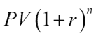

在上式中， `PV`是现值，`r`是利率，`n`是周期数。

在本节中，让我们以`3`% 的利率，`5`年的季度`10`的季度付款以及`1000`的现值。 用适当的值调用`fv()`函数（负值表示支出现金流）：

```py
print("Future value", np.fv(0.03/4, 5 * 4, -10, -1000))
```

终值如下：

```py
Future value 1376.09633204

```

如果我们改变保存和保持其他参数不变的年数，则会得到以下图表：

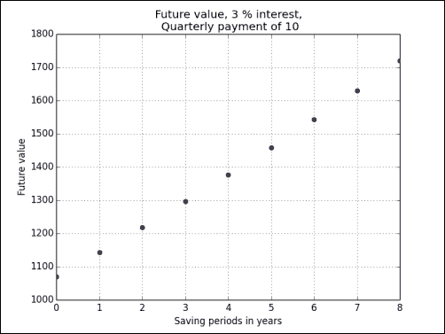

### 刚刚发生了什么？

我们使用 NumPy `fv()`函数从`1000`的现值，`3`的利率，`5`年和`10`的季度付款开始计算未来价值。 。 我们绘制了各种保存期的未来值（请参见`futurevalue.py`）：

```py
from __future__ import print_function
import numpy as np
import matplotlib.pyplot as plt

print("Future value", np.fv(0.03/4, 5 * 4, -10, -1000))

fvals = []

for i in xrange(1, 10):
   fvals.append(np.fv(.03/4, i * 4, -10, -1000))

plt.plot(range(1, 10), fvals, 'bo')
plt.title('Future value, 3 % interest,\n Quarterly payment of 10')
plt.xlabel('Saving periods in years')
plt.ylabel('Future value')
plt.grid()
plt.legend(loc='best')
plt.show()
```

## 现值

现值是今天的资产价值。 NumPy `pv()`函数可以计算当前值。 此功能与`fv()`函数类似，并且需要利率，期间数和定期还款，但是这里我们从终值开始。

[了解有关当前值的更多信息](http://en.wikipedia.org/wiki/Present_value)。 如果需要，可以很容易地从将来值的公式中得出当前值的公式。

## 实战时间 – 获得现值

让我们将“实战时间 – 确定未来值”中的数字反转：

插入“实战时间 – 确定未来值”部分：

```py
print("Present value", np.pv(0.03/4, 5 * 4, -10, 1376.09633204))
```

除了微小的数值误差外，这给了我们`1000`预期的效果。 实际上，这不是错误，而是表示问题。 我们在这里处理现金流出，这就是负值的原因：

```py
Present value -999.999999999

```

### 刚刚发生了什么？

我们反转了“实战时间 – 确定将来值”部分，以从将来值中获得现值。 这是通过 NumPy `pv()`函数完成的。

## 净现值

净现值定义为所有现值现金流的总和。 NumPy `npv()`函数返回现金流的净现值。 该函数需要两个参数：`rate`和代表现金流的数组。

[阅读有关净现值的更多信息](http://en.wikipedia.org/wiki/Net_present_value)，。 在净现值的公式中， `Rt`是时间段的现金流，`r`是折现率，`t`是时间段的指数：


## 实战时间 – 计算净现值

我们将计算随机产生的现金流序列的净现值：

1.  为现金流量序列生成五个随机值。 插入 -100 作为起始值：

    ```py
    cashflows = np.random.randint(100, size=5)
    cashflows = np.insert(cashflows, 0, -100)
    print("Cashflows", cashflows)
    ```

    现金流如下：

    ```py
    Cashflows [-100   38   48   90   17   36]

    ```

2.  调用`npv()`函数从上一步生成的现金流量序列中计算净现值。 使用百分之三的比率：

    ```py
    print("Net present value", np.npv(0.03, cashflows))
    ```

    净现值：

    ```py
    Net present value 107.435682443

    ```

### 刚刚发生了什么？

我们使用 NumPy `npv()`函数（请参见`netpresentvalue.py`）从随机生成的现金流序列中计算出净现值：

```py
from __future__ import print_function
import numpy as np

cashflows = np.random.randint(100, size=5)
cashflows = np.insert(cashflows, 0, -100)
print("Cashflows", cashflows)

print("Net present value", np.npv(0.03, cashflows))
```

## 内部收益率

收益率的内部利率是有效利率，它没有考虑通货膨胀。 NumPy `irr()`函数返回给定现金流序列的内部收益率。

## 实战时间 – 确定内部收益率

让我们重用“实战时间 – 计算净现值”部分的现金流序列。 在现金流序列上调用`irr()`函数：

```py
print("Internal rate of return", np.irr([-100, 38, 48, 90, 17, 36]))
```

内部收益率：

```py
Internal rate of return 0.373420226888

```

### 刚刚发生了什么？

我们根据“实战时间 – 计算净现值”部分的现金流系列计算内部收益率。 该值由 NumPy `irr()`函数给出。

## 定期付款

NumPy `pmt()`函数允许您基于利率和定期还款次数来计算贷款的定期还款。

## 实战时间 – 计算定期付款

假设您的贷款为 1000 万，利率为`1`%。 您有`30`年还清贷款。 您每个月要付多少钱？ 让我们找出答案。

使用上述值调用`pmt()`函数：

```py
print("Payment", np.pmt(0.01/12, 12 * 30, 10000000))
```

每月付款：

```py
Payment -32163.9520447

```

### 刚刚发生了什么？

我们以每年`1`% 的利率计算了 1000 万的贷款的每月付款。 鉴于我们有`30`年的还款期，`pmt()`函数告诉我们我们需要每月支付`32163.95`。

## 付款数量

NumPy `nper()`函数告诉我们要偿还贷款需要多少次定期付款。 必需的参数是贷款的利率，固定金额的定期还款以及现值。

## 实战时间 – 确定定期付款的次数

考虑一笔`9000`的贷款，其利率为`10`% ，固定每月还款`100`。

使用 NumPy `nper()`函数找出需要多少笔付款：

```py
print("Number of payments", np.nper(0.10/12, -100, 9000))
```

付款次数：

```py
Number of payments 167.047511801

```

### 刚刚发生了什么？

我们确定了还清利率为`10`的`9000`贷款和`100`每月还款所需的还款次数。 返回的付款数为`167`。

## 利率

NumPy `rate()`函数根据给定的定期付款次数，  付款金额，现值和终值来计算利率。

## 实战时间 – 确定汇率

让我们从“实战时间 – 确定定期付款的数量”部分的值，并从其他参数反向计算利率。

填写上一个“实战时间”部分中的数字：

```py
print("Interest rate", 12 * np.rate(167, -100, 9000, 0))
```

预期的利率约为 10%：

```py
Interest rate 0.0999756420664

```

### 刚刚发生了什么？

我们使用 NumPy `rate()`函数和“实战时间 – 确定定期付款的数量”部分的值来计算贷款的利率。 忽略舍入错误，我们得到了最初的`10`百分比。

## 窗口功能

窗口函数是信号处理中常用的数学函数。 应用包括光谱分析和滤波器设计。 这些函数在指定域之外定义为 0。 NumPy 具有许多窗口函数：`bartlett()`，`blackman()`，`hamming()`，`hanning()`和`kaiser()`。 您可以在第 4 章，“便捷功能”和第 3 章，“熟悉常用功能”。

## 实战时间 – 绘制 Bartlett 窗口

Bartlett 窗口是三角形平滑窗口：

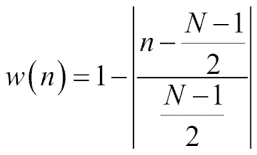

1.  调用  NumPy `bartlett()`函数：

    ```py
    window = np.bartlett(42)
    ```

2.  使用 matplotlib 进行绘图很容易：

    ```py
    plt.plot(window)
    plt.show()
    ```

    如下所示，这是 Bartlett 窗口，该窗口是三角形的：

    

### 刚刚发生了什么？

我们用 NumPy `bartlett()`函数绘制了 Bartlett 窗口。

## 布莱克曼窗口

布莱克曼窗口是以下余弦的和：

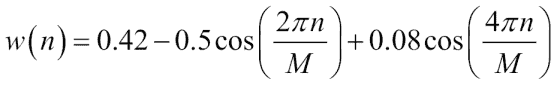

NumPy `blackman()`函数返回布莱克曼窗口。 唯一参数是输出窗口中`M`的点数。 如果该数字为`0`或小于`0`，则该函数返回一个空数组。

## 实战时间 – 使用布莱克曼窗口平滑股票价格

让我们从小型 APL 股价数据文件中平滑收盘价：

1.  将数据加载到 NumPy 数组中。 调用 NumPy `blackman()`函数形成一个窗口，然后使用该窗口平滑价格信号：

    ```py
    closes=np.loadtxt('AAPL.csv', delimiter=',', usecols=(6,), converters={1:datestr2num}, unpack=True)
    N = 5
    window = np.blackman(N)
    smoothed = np.convolve(window/window.sum(),
      closes, mode='same')
    ```

2.  使用 matplotlib 绘制平滑价格。 在此示例中，我们将省略前五个数据点和后五个数据点。 这样做的原因是存在强烈的边界效应：

    ```py
    plt.plot(smoothed[N:-N], lw=2, label="smoothed")
    plt.plot(closes[N:-N], label="closes")
    plt.legend(loc='best')
    plt.show()
    ```

    使用布莱克曼窗口平滑的 AAPL 收盘价应如下所示：

    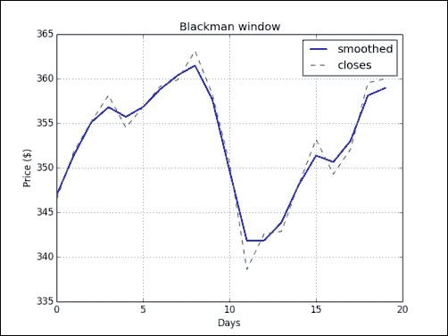

### 刚刚发生了什么？

我们从样本数据文件中绘制了 APL 的收盘价，该价格使用布莱克曼窗口和 NumPy `blackman()`函数进行了平滑处理（请参见`plot_blackman.py`）：

```py
import numpy as np
import matplotlib.pyplot as plt
from matplotlib.dates import datestr2num

closes=np.loadtxt('AAPL.csv', delimiter=',', usecols=(6,), converters={1:datestr2num}, unpack=True)
N = 5
window = np.blackman(N)
smoothed = np.convolve(window/window.sum(), closes, mode='same')
plt.plot(smoothed[N:-N], lw=2, label="smoothed")
plt.plot(closes[N:-N], '--', label="closes")
plt.title('Blackman window')
plt.xlabel('Days')
plt.ylabel('Price ($)')
plt.grid()
plt.legend(loc='best')
plt.show()
```

## 汉明窗

汉明窗由加权余弦形成。 计算公式如下：

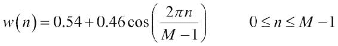

NumPy `hamming()`函数返回汉明窗口。 唯一的参数是输出窗口中点的数量`M`。 如果此数字为`0`或小于`0`，则返回一个空数组。

## 实战时间 – 绘制汉明窗

让我们绘制汉明窗口：

1.  调用 NumPy `hamming()`函数：

    ```py
    window = np.hamming(42)
    ```

2.  使用 matplotlib 绘制窗口：

    ```py
    plt.plot(window)
    plt.show()
    ```

    汉明窗图显示如下：

    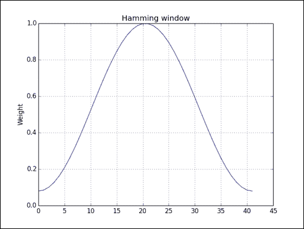

### 刚刚发生了什么？

我们使用 NumPy `hamming()`函数绘制了汉明窗口。

## 凯撒窗口

**凯撒窗口**由**贝塞尔**函数形成。

#### 注意

[贝塞尔函数是贝塞尔微分方程的解](http://en.wikipedia.org/wiki/Bessel_function)。

公式如下：

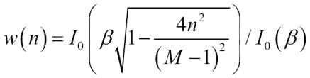

`I0`是零阶贝塞尔函数。 NumPy `kaiser()`函数返回**凯撒**窗口。 第一个参数是输出窗口中的点数。 如果此数字为`0`或小于`0`，则函数将返回一个空数组。 第二个参数是`beta`。

## 实战时间 – 绘制凯撒窗口

让我们绘制凯撒窗口：

1.  调用 NumPy `kaiser()`函数：

    ```py
    window = np.kaiser(42, 14)
    ```

2.  使用 matplotlib 绘制窗口：

    ```py
    plt.plot(window)
    plt.show()
    ```

    凯撒窗口显示如下：

    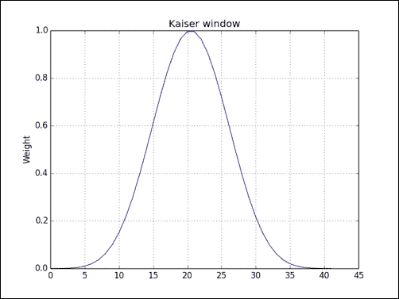

### 刚刚发生了什么？

我们使用 NumPy `kaiser()`函数绘制了凯撒窗口。

## 特殊数学函数

我们将以一些特殊的数学函数结束本章。 第一类 0 阶的修改后的贝塞尔函数由`i0()`表示为 NumPy 中的  。 `sinc`函数在 NumPy 中由具有相同名称的函数表示，  也有此函数的二维版本。 `sinc`是三角函数； 有关更多详细信息，请参见[这里](http://en.wikipedia.org/wiki/Sinc_function)。 `sinc()`函数具有两个定义。

NumPy `sinc()`函数符合以下定义：

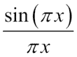

## 实战时间 – 绘制修改后的贝塞尔函数

让我们看看修改后的第一种零阶贝塞尔函数是什么样的：

1.  使用 NumPy `linspace()`函数计算均匀间隔的值：

    ```py
    x = np.linspace(0, 4, 100)
    ```

2.  调用 NumPy `i0()`函数：

    ```py
    vals = np.i0(x)
    ```

3.  使用 matplotlib 绘制修改后的贝塞尔函数：

    ```py
    plt.plot(x, vals)
    plt.show()
    ```

    修改后的贝塞尔函数将具有以下输出：

    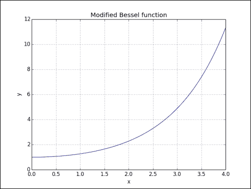

### 刚刚发生了什么？

我们用 NumPy `i0()`函数绘制了第一种零阶修改后的贝塞尔函数。

## sinc

`sinc()`函数广泛用于数学和信号处理中。 NumPy 具有相同名称的函数。 也存在二维函数。

## 实战时间 – 绘制`sinc`函数

我们将绘制`sinc()`函数：

1.  使用 NumPy `linspace()`函数计算均匀间隔的值：

    ```py
    x = np.linspace(0, 4, 100)
    ```

2.  调用 NumPy `sinc()`函数：

    ```py
    vals = np.sinc(x)
    ```

3.  用 matplotlib 绘制`sinc()`函数：

    ```py
    plt.plot(x, vals)
    plt.show()
    ```

    `sinc()`函数将具有以下输出：

    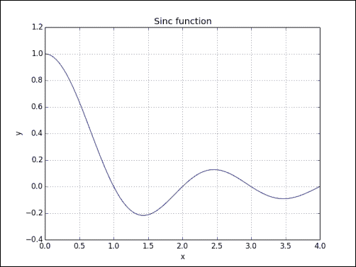

    `sinc2d()`函数需要二维数组。 我们可以使用`outer()`函数创建它，从而得到该图（代码在以下部分中）：

    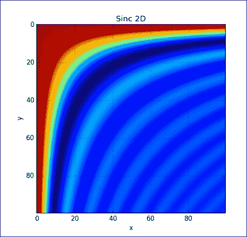

### 刚刚发生了什么？

我们用 NumPy `sinc()`函数（参见`plot_sinc.py`）绘制了众所周知的`sinc`函数：

```py
import numpy as np
import matplotlib.pyplot as plt

x = np.linspace(0, 4, 100)
vals = np.sinc(x)

plt.plot(x, vals)
plt.title('Sinc function')
plt.xlabel('x')
plt.ylabel('y')
plt.grid()
plt.show()
```

我们在两个维度上都做了相同的操作（请参见`sinc2d.py`）：

```py
import numpy as np
import matplotlib.pyplot as plt

x = np.linspace(0, 4, 100)
xx = np.outer(x, x)
vals = np.sinc(xx)

plt.imshow(vals)
plt.title('Sinc 2D')
plt.xlabel('x')
plt.ylabel('y')
plt.grid()
plt.show()
```

## 总结

这是一章，涵盖了更多专门的 NumPy 主题。 我们介绍了排序和搜索，特殊功能，财务实用程序和窗口功能。

下一章是关于非常重要的测试主题的。