# 九、matplotlib 绘图

`matplotlib`是一个非常有用的 Python 绘图库。 它与 NumPy 很好地集成在一起，但是是一个单独的开源项目。 您可以在[这个页面](http://matplotlib.org/gallery.html)上找到漂亮的示例。

`matplotlib`也具有实用程序功能，可以从 Yahoo Finance 下载和操纵数据。 我们将看到几个股票图表示例。

本章涵盖以下主题：

*   简单图
*   子图
*   直方图
*   情节定制
*   三维图
*   等高线图
*   动画
*   对数图

# 简单图

`matplotlib.pyplot`软件包包含用于简单绘图的功能。 重要的是要记住，每个后续函数调用都会更改当前图的状态。 最终，我们想要将图保存在文件中，或使用  `show()`函数显示。 但是，如果我们在 Qt 或 Wx 后端上运行的 IPython 中，则该图将交互更新，而无需等待`show()`函数。 这与即时输出文本输出的方式相当。

# 作用时间–绘制多项式函数

为了说明绘图的工作原理，让我们显示一些多项式图。 我们将使用 NumPy 多项式函数`poly1d()`创建一个多项式。

1.  将标准输入值作为多项式系数。 使用 NumPy `poly1d()`函数创建多项式：

    ```py
    func = np.poly1d(np.array([1, 2, 3, 4]).astype(float))
    ```

2.  使用 NumPy 和`linspace()`函数创建`x`值。 使用`-10`到`10`范围，并创建`30`等距值：

    ```py
    x = np.linspace(-10, 10, 30)
    ```

3.  使用我们在第一步中创建的多项式来计算多项式值：

    ```py
    y = func(x)
    ```

4.  调用`plot()`函数； 这样不会立即显示图形：

    ```py
    plt.plot(x, y)
    ```

5.  使用  `xlabel()`函数在`x`轴上添加标签：

    ```py
    plt.xlabel('x')
    ```

6.  使用`ylabel()`函数在`y`轴上添加标签：

    ```py
    plt.ylabel('y(x)')
    ```

7.  调用`show()`函数显示图形：

    ```py
    plt.show()
    ```

    以下是具有多项式系数 1、2、3 和 4 的图：

    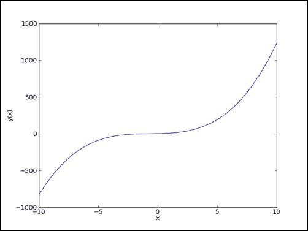

## 刚刚发生了什么？

我们在屏幕上显示了多项式的图。 我们在`x`和`y`轴上添加了标签（请参见`polyplot.py`）：

```py
import numpy as np
import matplotlib.pyplot as plt

func = np.poly1d(np.array([1, 2, 3, 4]).astype(float))
x = np.linspace(-10, 10, 30)
y = func(x)

plt.plot(x, y)
plt.xlabel('x')
plt.ylabel('y(x)')
plt.show()
```

## 小测验– `plot()`函数

Q1. `plot()`函数有什么作用？

1.  它在屏幕上显示二维图。
2.  它将二维图的图像保存在文件中。
3.  它同时执行 a 和 b。
4.  它既不执行 a，b 或 c。

# 绘图格式字符串

`plot()`函数接受无限数量的参数。 在上一节中，我们给了它两个数组作为参数。 我们也可以通过可选的格式字符串指定线条颜色和样式。 默认情况下，它是蓝色实线，表示为`b-`，但是您可以指定其他颜色和样式，例如红色破折号。

# 作用时间–绘制多项式及其导数

让我们使用`deriv()`函数和`m`作为`1`绘制多项式及其一阶导数。 我们已经在前面的“实战时间”部分中做了第一部分。 我们希望使用两种不同的线型来识别什么是什么。

1.  创建并区分多项式：

    ```py
    func = np.poly1d(np.array([1, 2, 3, 4]).astype(float))
    func1 = func.deriv(m=1)
    x = np.linspace(-10, 10, 30)
    y = func(x)
    y1 = func1(x)
    ```

2.  用两种样式绘制多项式及其导数：红色圆圈和绿色虚线。 您无法在本书的印刷版本中看到颜色，因此您将不得不亲自尝试以下代码：

    ```py
    plt.plot(x, y, 'ro', x, y1, 'g--')
    plt.xlabel('x')
    plt.ylabel('y')
    plt.show()
    ```

    具有多项式系数`1`，`2`，`3`和`4`的图如下：

    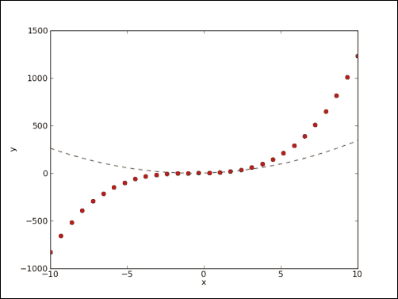

## 刚刚发生了什么？

我们使用两种不同的线型和一次调用`plot()`函数（请参见`polyplot2.py`）来绘制多项式及其导数：

```py
import numpy as np
import matplotlib.pyplot as plt

func = np.poly1d(np.array([1, 2, 3, 4]).astype(float))
func1 = func.deriv(m=1)
x = np.linspace(-10, 10, 30)
y = func(x)
y1 = func1(x)

plt.plot(x, y, 'ro', x, y1, 'g--')
plt.xlabel('x')
plt.ylabel('y')
plt.show()
```

# 子图

在某一时刻，一个绘图中将有太多的线。 但是，您仍然希望将所有内容组合在一起。 我们可以通过  `subplot()`函数执行此操作。 此功能在网格中创建多个图。

# 作用时间–绘制多项式及其导数

让我们绘制一个多项式及其一阶和二阶导数。 为了清楚起见，我们将进行三个子图绘制：

1.  使用以下代码创建多项式及其导数：

    ```py
    func = np.poly1d(np.array([1, 2, 3, 4]).astype(float))
    x = np.linspace(-10, 10, 30)
    y = func(x)
    func1 = func.deriv(m=1)
    y1 = func1(x)
    func2 = func.deriv(m=2)
    y2 = func2(x)
    ```

2.  使用`subplot()`函数创建多项式的第一个子图。 此函数的第一个参数是行数，第二个参数是列数，第三个参数是以 1 开头的索引号。或者，将这三个参数合并为一个数字，例如`311`。 子图将组织成三行一列。 为子图命名为`Polynomial`。 画一条红色实线：

    ```py
    plt.subplot(311)
    plt.plot(x, y, 'r-')
    plt.title("Polynomial")
    ```

3.  使用`subplot()`函数创建一阶导数的第三子图。 为子图命名为`First Derivativ`。 使用一行蓝色三角形：

    ```py
    plt.subplot(312)
    plt.plot(x, y1, 'b^')
    plt.title("First Derivative")
    ```

4.  使用`subplot()`函数创建第二个导数的第二个子图。 给子图标题为`"Second Derivative"`。 使用一行绿色圆圈：

    ```py
    plt.subplot(313)
    plt.plot(x, y2, 'go')
    plt.title("Second Derivative")
    plt.xlabel('x')
    plt.ylabel('y')
    plt.show()
    ```

    多项式系数为 1、2、3 和 4 的三个子图如下：

    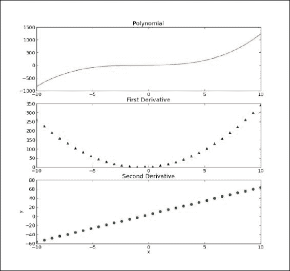

## 刚刚发生了什么？

我们在三行一列中使用三种不同的线型和三个子图绘制了多项式及其一阶和二阶导数（请参见`polyplot3.py`）：

```py
import numpy as np
import matplotlib.pyplot as plt

func = np.poly1d(np.array([1, 2, 3, 4]).astype(float))
x = np.linspace(-10, 10, 30)
y = func(x)
func1 = func.deriv(m=1)
y1 = func1(x)
func2 = func.deriv(m=2)
y2 = func2(x)

plt.subplot(311)
plt.plot(x, y, 'r-')
plt.title("Polynomial")
plt.subplot(312)
plt.plot(x, y1, 'b^')
plt.title("First Derivative")
plt.subplot(313)
plt.plot(x, y2, 'go')
plt.title("Second Derivative")
plt.xlabel('x')
plt.ylabel('y')
plt.show()
```

# 财务

`matplotlib`可以帮助监视我们的股票投资。 `matplotlib.finance`程序包具有实用程序，我们可以使用这些实用程序从 [Yahoo Finance 网站](http://finance.yahoo.com/)下载股票报价。 然后，我们可以将数据绘制为烛台。

# 实战时间 – 绘制一年的股票报价

我们可以使用`matplotlib.finance`包绘制一年的股票报价数据。 这需要连接到 Yahoo Finance，这是数据源。

1.  通过从今天减去一年来确定开始日期：

    ```py
    from matplotlib.dates import DateFormatter
    from matplotlib.dates import DayLocator
    from matplotlib.dates import MonthLocator
    from matplotlib.finance import quotes_historical_yahoo
    from matplotlib.finance import candlestick
    import sys
    from datetime import date
    import matplotlib.pyplot as plt
    today = date.today()
    start = (today.year - 1, today.month, today.day)
    ```

2.  我们需要创建所谓的**定位器**。 来自`matplotlib.dates`程序包的这些对象在`x`轴上定位了几个月和几天：

    ```py
    alldays = DayLocator()
    months = MonthLocator()
    ```

3.  创建一个日期格式化程序以格式化`x`轴上的日期。 此格式化程序创建一个字符串，其中包含月份和年份的简称：

    ```py
    month_formatter = DateFormatter("%b %Y")
    ```

4.  使用以下代码从 Yahoo Finance 下载股票报价数据：

    ```py
    quotes = quotes_historical_yahoo(symbol, start, today)
    ```

5.  创建一个`matplotlib Figure`对象-这是绘图组件的顶级容器：

    ```py
    fig = plt.figure()
    ```

6.  在该图中添加子图：

    ```py
    ax = fig.add_subplot(111)
    ```

7.  将`x`轴上的主定位器设置为月份定位器。 此定位器负责`x`轴上的大刻度：

    ```py
    ax.xaxis.set_major_locator(months)
    ```

8.  将`x`轴上的次要定位器设置为天定位器。 此定位器负责`x`轴上的小滴答声：

    ```py
    ax.xaxis.set_minor_locator(alldays)
    ```

9.  将`x`轴上的主要格式器设置为月份格式器。 此格式化程序负责`x`轴上大刻度的标签：

    ```py
    ax.xaxis.set_major_formatter(month_formatter)
    ```

10.  `matplotlib.finance`程序包中的功能使我们可以显示烛台。 使用报价数据创建烛台。 可以指定烛台的宽度。 现在，使用默认值：

    ```py
    candlestick(ax, quotes)
    ```

11.  将`x`轴上的标签格式化为日期。 这将旋转标签在`x`轴上，以使其更适合：

    ```py
    fig.autofmt_xdate()
    plt.show()
    ```

    `DISH`（**Disk Network**）的烛台图显示如下：

    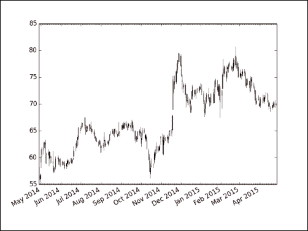

## 刚刚发生了什么？

我们从 Yahoo Finance 下载了年的数据。 我们使用烛台绘制了这些数据的图表（请参见`candlesticks.py`）：

```py
from matplotlib.dates import DateFormatter
from matplotlib.dates import DayLocator
from matplotlib.dates import MonthLocator
from matplotlib.finance import quotes_historical_yahoo
from matplotlib.finance import candlestick
import sys
from datetime import date
import matplotlib.pyplot as plt

today = date.today()
start = (today.year - 1, today.month, today.day)

alldays = DayLocator()
months = MonthLocator()
month_formatter = DateFormatter("%b %Y")

symbol = 'DISH'

if len(sys.argv) == 2:
   symbol = sys.argv[1]

quotes = quotes_historical_yahoo(symbol, start, today)

fig = plt.figure()
ax = fig.add_subplot(111)
ax.xaxis.set_major_locator(months)
ax.xaxis.set_minor_locator(alldays)
ax.xaxis.set_major_formatter(month_formatter)

candlestick(ax, quotes)
fig.autofmt_xdate()
plt.show()
```

# 直方图

直方图可视化数值数据的分布。 `matplotlib`具有方便的`hist()`函数  ，可绘制直方图。 `hist()`函数有两个主要参数-包含数据和条数的数组。

# 实战时间 – 绘制股价分布图

让我们绘制 Yahoo Finance 的股票价格  ，  的分布图。

1.  下载一年前的数据：

    ```py
    today = date.today()
    start = (today.year - 1, today.month, today.day)

    quotes = quotes_historical_yahoo(symbol, start, today)
    ```

2.  上一步中的报价数据存储在 Python 列表中。 将其转换为 NumPy 数组并提取收盘价：

    ```py
    quotes = np.array(quotes)
    close = quotes.T[4]
    ```

3.  用合理数量的条形图绘制直方图：

    ```py
    plt.hist(close, np.sqrt(len(close)))
    plt.show()
    ```

    DISH 的直方图如下所示：

    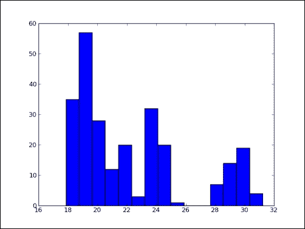

## 刚刚发生了什么？

我们将 DISH 的股价分布绘制为直方图  （请参见`stockhistogram.py`）：

```py
from matplotlib.finance import quotes_historical_yahoo
import sys
from datetime import date
import matplotlib.pyplot as plt
import numpy as np

today = date.today()
start = (today.year - 1, today.month, today.day)

symbol = 'DISH'

if len(sys.argv) == 2:
   symbol = sys.argv[1]

quotes = quotes_historical_yahoo(symbol, start, today)
quotes = np.array(quotes)
close = quotes.T[4]

plt.hist(close, np.sqrt(len(close)))
plt.show()
```

## 成为英雄-画钟形曲线

使用平均价格和标准差覆盖钟形曲线（与**高斯**或正态分布有关）。 当然只是练习。

# 对数图

当数据具有较宽范围的值时，对数图很有用。 `matplotlib`具有函数`semilogx()`（对数`x`轴），`semilogy()`（对数`y`轴）和`loglog()`（`x`和`y`轴为对数）。

# 实战时间 – 绘制股票量

股票量变化很大，因此让我们以对数标度进行绘制。 首先，我们需要从 Yahoo Finance 下载历史数据，提取日期和交易量，创建定位符和日期格式化程序，然后创建图形并将其添加到子图中。 我们已经在上一个“实战时间”部分中完成了这些步骤，因此我们将在此处跳过  。

使用对数刻度绘制体积：

```py
plt.semilogy(dates, volume)
```

现在，设置定位器并将`x`轴格式化为日期。 这些步骤的说明也可以在前面的“实战时间”部分中找到。

使用对数刻度的 DISH 的股票量显示如下：

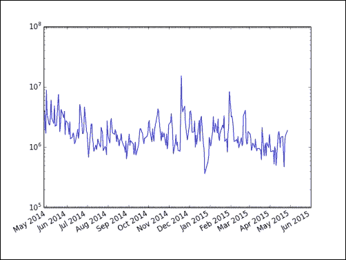

## 刚刚发生了什么？

我们使用对数比例（参见`logy.py`）绘制了股票量  ：

```py
from matplotlib.finance import quotes_historical_yahoo
from matplotlib.dates import DateFormatter
from matplotlib.dates import DayLocator
from matplotlib.dates import MonthLocator
import sys
from datetime import date
import matplotlib.pyplot as plt
import numpy as np

today = date.today()
start = (today.year - 1, today.month, today.day)

symbol = 'DISH'

if len(sys.argv) == 2:
   symbol = sys.argv[1]

quotes = quotes_historical_yahoo(symbol, start, today)
quotes = np.array(quotes)
dates = quotes.T[0]
volume = quotes.T[5]

alldays = DayLocator()
months = MonthLocator()
month_formatter = DateFormatter("%b %Y")

fig = plt.figure()
ax = fig.add_subplot(111)
plt.semilogy(dates, volume)
ax.xaxis.set_major_locator(months)
ax.xaxis.set_minor_locator(alldays)
ax.xaxis.set_major_formatter(month_formatter)
fig.autofmt_xdate()
plt.show()
```

# 散点图

散点图在同一数据集中显示两个数值变量的值。 matplotlib `scatter()`函数创建散点图。 （可选）我们可以在图中指定数据点的颜色和大小以及 alpha 透明度。

# 采取行动的时候–用散点图绘制价格和数量回报

我们可以轻松地绘制股票价格和交易量回报的散点图。 同样，从 Yahoo Finance 下载必要的数据。

1.  上一步中的报价数据存储在 Python 列表中。 将此转换为 NumPy 数组并提取关闭和体积值：

    ```py
    dates = quotes.T[4]
    volume = quotes.T[5]
    ```

2.  计算收盘价和批量收益：

    ```py
    ret = np.diff(close)/close[:-1]
    volchange = np.diff(volume)/volume[:-1]
    ```

3.  创建一个 matplotlib 图形对象：

    ```py
    fig = plt.figure()
    ```

4.  在该图中添加子图：

    ```py
    ax = fig.add_subplot(111)
    ```

5.  创建散点图，将数据点的颜色链接到收盘价，将大小链接到体积变化：

    ```py
    ax.scatter(ret, volchange, c=ret * 100, s=volchange * 100, alpha=0.5)
    ```

6.  设置图的标题并在其上放置网格：

    ```py
    ax.set_title('Close and volume returns')
    ax.grid(True)

    plt.show()
    ```

    DISH 的散点图如下所示：

    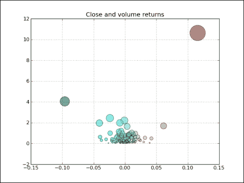

## 刚刚发生了什么？

我们绘制了 DISH 收盘价和成交量回报的散点图  （请参见`scatterprice.py`）：

```py
from matplotlib.finance import quotes_historical_yahoo
import sys
from datetime import date
import matplotlib.pyplot as plt
import numpy as np

today = date.today()
start = (today.year - 1, today.month, today.day)

symbol = 'DISH'

if len(sys.argv) == 2:
   symbol = sys.argv[1]

quotes = quotes_historical_yahoo(symbol, start, today)
quotes = np.array(quotes)
close = quotes.T[4]
volume = quotes.T[5]
ret = np.diff(close)/close[:-1]
volchange = np.diff(volume)/volume[:-1]

fig = plt.figure()
ax = fig.add_subplot(111)
ax.scatter(ret, volchange, c=ret * 100, s=volchange * 100, alpha=0.5)
ax.set_title('Close and volume returns')
ax.grid(True)

plt.show()
```

# 介于

`fill_between()`函数用指定的颜色填充绘图区域。 我们可以选择一个可选的 Alpha 通道值。 该函数还具有`where`参数，以便我们可以根据条件对区域进行着色。

# 作用时间–根据条件对绘图区域进行阴影处理

假设您要在股票图表的某个区域遮蔽  ，该区域的收盘价低于平均水平，而其颜色高于高于均值的颜色。 `fill_between()`函数是工作的最佳选择。 我们将再次省略以下步骤：下载一年前的历史数据，提取日期和收盘价以及创建定位器和日期格式化程序。

1.  创建一个 matplotlib `Figure`对象：

    ```py
    fig = plt.figure()
    ```

2.  在该图中添加子图：

    ```py
    ax = fig.add_subplot(111)
    ```

3.  绘制收盘价：

    ```py
    ax.plot(dates, close)
    ```

4.  根据值是低于平均价格还是高于平均价格，使用不同的颜色对低于收盘价的地块区域进行阴影处理：

    ```py
    plt.fill_between(dates, close.min(), close, where=close>close.mean(), facecolor="green", alpha=0.4)
    plt.fill_between(dates, close.min(), close, where=close<close.mean(), facecolor="red", alpha=0.4)
    ```

    现在，我们可以通过设置定位器并将`x`轴值格式化为日期来完成绘制，如图所示。 使用 DISH 的条件阴影的股票价格如下：

    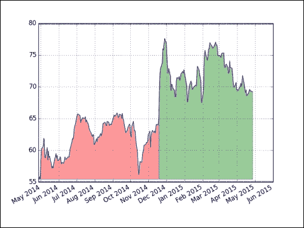

## 刚刚发生了什么？

我们用与高于均值（请参见`fillbetween.py`）不同的颜色，来着色股票图表中收盘价低于平均水平的区域：

```py
from matplotlib.finance import quotes_historical_yahoo
from matplotlib.dates import DateFormatter
from matplotlib.dates import DayLocator
from matplotlib.dates import MonthLocator
import sys
from datetime import date
import matplotlib.pyplot as plt
import numpy as np

today = date.today()
start = (today.year - 1, today.month, today.day)

symbol = 'DISH'

if len(sys.argv) == 2:
   symbol = sys.argv[1]

quotes = quotes_historical_yahoo(symbol, start, today)
quotes = np.array(quotes)
dates = quotes.T[0]
close = quotes.T[4]

alldays = DayLocator()
months = MonthLocator()
month_formatter = DateFormatter("%b %Y")

fig = plt.figure()
ax = fig.add_subplot(111)
ax.plot(dates, close)
plt.fill_between(dates, close.min(), close, where=close>close.mean(), facecolor="green", alpha=0.4)
plt.fill_between(dates, close.min(), close, where=close<close.mean(), facecolor="red", alpha=0.4)
ax.xaxis.set_major_locator(months)
ax.xaxis.set_minor_locator(alldays)
ax.xaxis.set_major_formatter(month_formatter)
ax.grid(True)
fig.autofmt_xdate()
plt.show()
```

# 图例和注释

图例和注释对于良好的情节至关重要。 我们可以使用`legend()`函数创建透明的图例，然后让`matplotlib`找出放置它们的位置。 同样，通过`annotate()`函数，我们可以准确地在图形上进行注释。 有大量的注释和箭头样式。

# 实战时间 – 使用图例和注释

在第 3 章，“熟悉常用功能”中，我们学习了如何计算股票价格的 EMA。 我们将绘制股票的收盘价及其三只  EMA 的收盘价。 为了阐明情节，我们将添加一个图例。 我们还将用注释指示两个平均值的交叉。 为了避免重复，再次省略了某些步骤。

1.  返回第 3 章“熟悉常用功能”，如果需要，并查看 EMA 算法。 计算并绘制 9，12 和 15 周期的 EMA：

    ```py
    emas = []

    for i in range(9, 18, 3):
       weights = np.exp(np.linspace(-1., 0., i))
       weights /= weights.sum()

       ema = np.convolve(weights, close)[i-1:-i+1]
       idx = (i - 6)/3
       ax.plot(dates[i-1:], ema, lw=idx, label="EMA(%s)" % (i))
       data = np.column_stack((dates[i-1:], ema))
       emas.append(np.rec.fromrecords(
         data, names=["dates", "ema"]))
    ```

    请注意，`plot()`函数调用需要图例标签。 我们将移动平均值存储在记录数组中，以进行下一步。

2.  让我们找到前两个移动均线的交叉点：

    ```py
    first = emas[0]["ema"].flatten()
    second = emas[1]["ema"].flatten()
    bools = np.abs(first[-len(second):] - second)/second < 0.0001
    xpoints = np.compress(bools, emas[1])
    ```

3.  现在我们有了交叉点，用箭头注释它们。 确保注释文本稍微偏离交叉点：

    ```py
    for xpoint in xpoints:
       ax.annotate('x', xy=xpoint, textcoords='offset points',
                    xytext=(-50, 30),
                    arrowprops=dict(arrowstyle="->"))
    ```

4.  添加图例，然后让`matplotlib`决定将其放置在何处：

    ```py
    leg = ax.legend(loc='best', fancybox=True))
    ```

5.  通过设置 Alpha 通道值使图例透明：

    ```py
    leg.get_frame().set_alpha(0.5)
    ```

    带有图例和注释的股票价格和移动均线如下所示：

    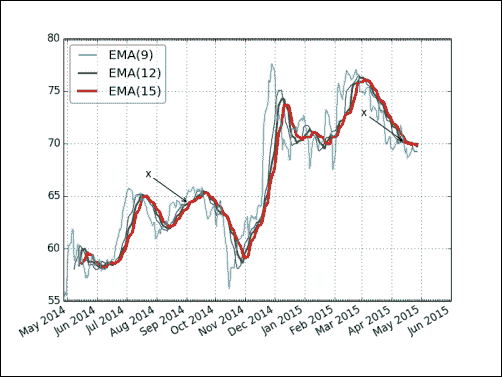

## 刚刚发生了什么？

我们绘制了股票的收盘价及其三个 EMA。 我们在剧情中添加了图例。 我们用注释注释了前两个平均值的交叉点（请参见`emalegend.py`）：

```py
from matplotlib.finance import quotes_historical_yahoo
from matplotlib.dates import DateFormatter
from matplotlib.dates import DayLocator
from matplotlib.dates import MonthLocator
import sys
from datetime import date
import matplotlib.pyplot as plt
import numpy as np

today = date.today()
start = (today.year - 1, today.month, today.day)

symbol = 'DISH'

if len(sys.argv) == 2:
   symbol = sys.argv[1]

quotes = quotes_historical_yahoo(symbol, start, today)
quotes = np.array(quotes)
dates = quotes.T[0]
close = quotes.T[4]

fig = plt.figure()
ax = fig.add_subplot(111)

emas = []
for i in range(9, 18, 3):
   weights = np.exp(np.linspace(-1., 0., i))
   weights /= weights.sum()
   ema = np.convolve(weights, close)[i-1:-i+1]
   idx = (i - 6)/3
   ax.plot(dates[i-1:], ema, lw=idx, label="EMA(%s)" % (i))
   data = np.column_stack((dates[i-1:], ema))
   emas.append(np.rec.fromrecords(data, names=["dates", "ema"]))

first = emas[0]["ema"].flatten()
second = emas[1]["ema"].flatten()
bools = np.abs(first[-len(second):] - second)/second < 0.0001
xpoints = np.compress(bools, emas[1])

for xpoint in xpoints:
   ax.annotate('x', xy=xpoint, textcoords='offset points',
                xytext=(-50, 30),
                arrowprops=dict(arrowstyle="->"))

leg = ax.legend(loc='best', fancybox=True)
leg.get_frame().set_alpha(0.5)

alldays = DayLocator()
months = MonthLocator()
month_formatter = DateFormatter("%b %Y")
ax.plot(dates, close, lw=1.0, label="Close")
ax.xaxis.set_major_locator(months)
ax.xaxis.set_minor_locator(alldays)
ax.xaxis.set_major_formatter(month_formatter)
ax.grid(True)
fig.autofmt_xdate()
plt.show()
```

# 三维图

三维图非常壮观，因此我们也必须在此处进行介绍。 对于三维图，我们需要一个与`3D`投影关联的`Axes3D`对象。

# 实战时间 – 三维绘制

我们将绘制一个简单的三维函数：

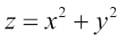

1.  使用 3D 关键字为绘图指定三维投影：

    ```py
    ax = fig.add_subplot(111, projection='3d')
    ```

2.  要创建方形二维网格，请使用`meshgrid()`函数初始化`x`和`y`值：

    ```py
    u = np.linspace(-1, 1, 100)

    x, y = np.meshgrid(u, u)
    ```

3.  我们将为表面图指定行跨度，列跨度和颜色图。 步幅决定了表面砖的尺寸。 颜色图的选择取决于风格：

    ```py
    ax.plot_surface(x, y, z,  rstride=4, cstride=4, cmap=cm.YlGnBu_r)
    ```

    结果是以下三维图：

    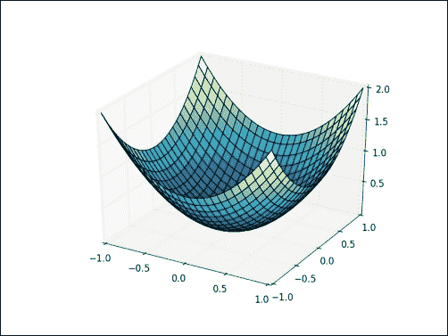

## 刚刚发生了什么？

我们创建了一个三维函数的绘图（请参见`three_d.py`）：

```py
from mpl_toolkits.mplot3d import Axes3D
import matplotlib.pyplot as plt
import numpy as np
from matplotlib import cm

fig = plt.figure()
ax = fig.add_subplot(111, projection='3d')

u = np.linspace(-1, 1, 100)

x, y = np.meshgrid(u, u)
z = x ** 2 + y ** 2
ax.plot_surface(x, y, z,  rstride=4, cstride=4, cmap=cm.YlGnBu_r)

plt.show()
```

# 等高线图

`matplotlib`等高线三维图有两种样式-填充的和未填充的。 等高线图使用所谓的**等高线**。 您可能熟悉地理地图上的等高线。 在此类地图中，等高线连接了海拔相同高度的点。 我们可以使用`contour()`函数创建法线轮廓图。 对于填充的轮廓图，我们使用`contourf()`函数。

# 作用时间–绘制填充的轮廓图

我们将在前面的“实战时间”部分中绘制三维数学函数的填充轮廓图  。 代码也非常相似。 一个主要区别是我们不再需要`3D`投影参数。 要绘制填充的轮廓图，请使用以下代码行：

```py
ax.contourf(x, y, z)
```

这为我们提供了以下填充轮廓图：

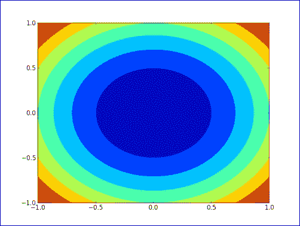

## 刚刚发生了什么？

我们创建了三维数学函数的填充轮廓图（请参见`contour.py`）：

```py
import matplotlib.pyplot as plt
import numpy as np
from matplotlib import cm

fig = plt.figure()
ax = fig.add_subplot(111)

u = np.linspace(-1, 1, 100)

x, y = np.meshgrid(u, u)
z = x ** 2 + y ** 2
ax.contourf(x, y, z)

plt.show()
```

# 动画

`matplotlib`通过特殊的动画模块提供精美的动画功能。 我们需要定义一个用于定期更新屏幕的回调函数。 我们还需要一个函数来生成要绘制的数据。

# 实战时间 – 动画情节

我们将绘制三个随机数据集  ，并将它们显示为圆形，点和三角形。 但是，我们将仅使用随机值更新其中两个数据集。

1.  以不同的颜色绘制三个随机数据集，如圆形，点和三角形：

    ```py
    circles, triangles, dots = ax.plot(x, 'ro', y, 'g^', z, 'b.')
    ```

2.  调用此函数可以定期更新屏幕。 使用新的`y`值更新两个图：

    ```py
    def update(data):
        circles.set_ydata(data[0])
        triangles.set_ydata(data[1])
        return circles, triangles
    ```

3.  使用 NumPy 生成随机数据：

    ```py
    def generate():
        while True: yield np.random.rand(2, N)
    ```

    以下是运行中的动画的快照：

    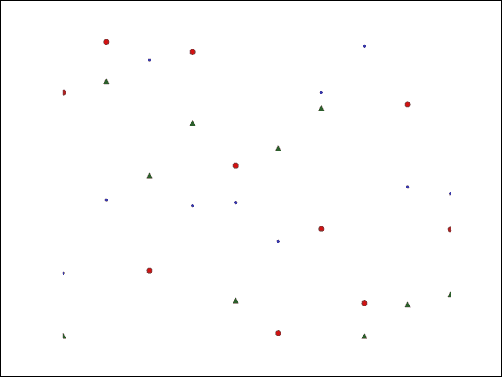

## 刚刚发生了什么？

我们创建了一个随机数据点的动画  （请参见`animation.py`）：

```py
import numpy as np
import matplotlib.pyplot as plt
import matplotlib.animation as animation

fig = plt.figure()
ax = fig.add_subplot(111)
N = 10
x = np.random.rand(N)
y = np.random.rand(N)
z = np.random.rand(N)
circles, triangles, dots = ax.plot(x, 'ro', y, 'g^', z, 'b.')
ax.set_ylim(0, 1)
plt.axis('off')

def update(data):
    circles.set_ydata(data[0])
    triangles.set_ydata(data[1])
    return circles, triangles

def generate():
    while True: yield np.random.rand(2, N)

anim = animation.FuncAnimation(fig, update, generate, interval=150)
plt.show()
```

# 总结

本章是关于`matplotlib`的-Python 绘图库。 我们涵盖了简单图，直方图，图定制，子图，三维图，轮廓图和对数图。 您还看到了一些显示股票走势图的示例。 显然，我们只是刮擦了表面，只是看到了冰山的一角。 `matplotlib`的功能非常丰富，因此我们没有足够的空间来覆盖 Latex 支持，极坐标支持和其他功能。

`matplotlib`的作者 **John Hunter** 于 2012 年 8 月去世。该书的一位技术评论家建议提及[**John Hunter 纪念基金**](http://numfocus.org/news/2012/08/28/johnhunter/)。 **NumFocus 基金会**设立的纪念基金为我们（约翰·亨特的工作迷）提供了一个“回馈”的机会。 同样，有关更多详细信息，请查看前面的 NumFocus 网站链接。

下一章将介绍 SciPy，这是一个基于 NumPy 构建的科学 Python 框架。