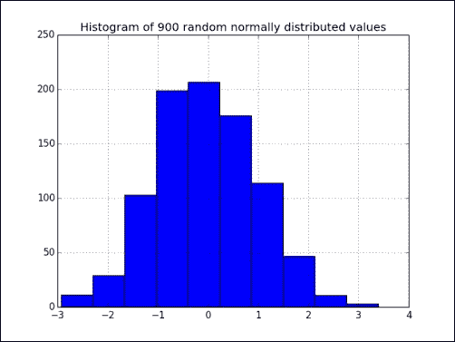
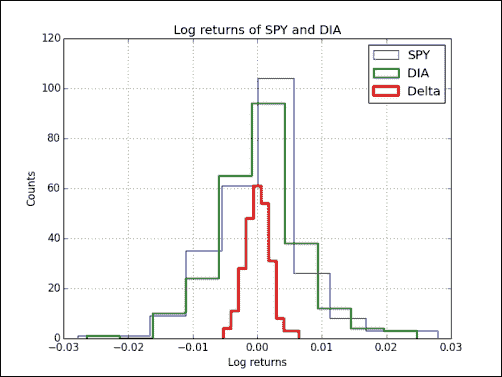
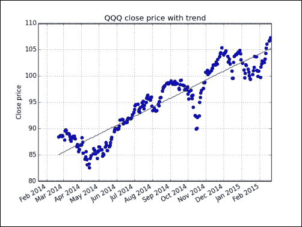
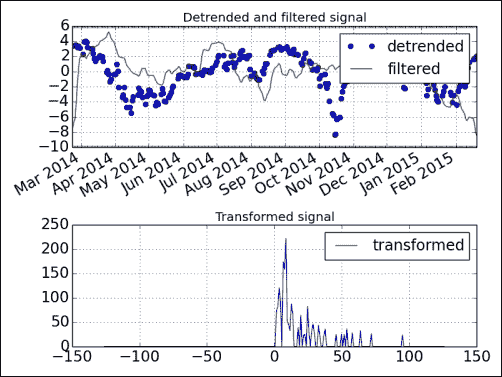
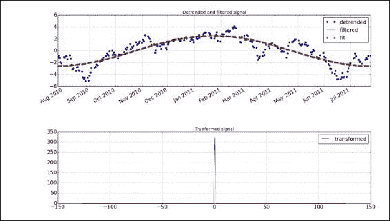
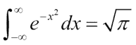
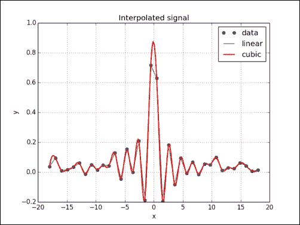
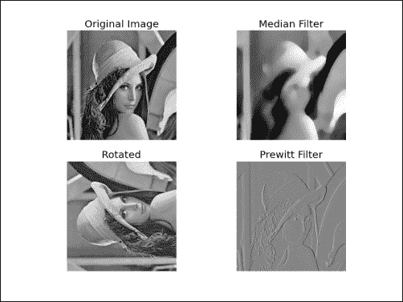
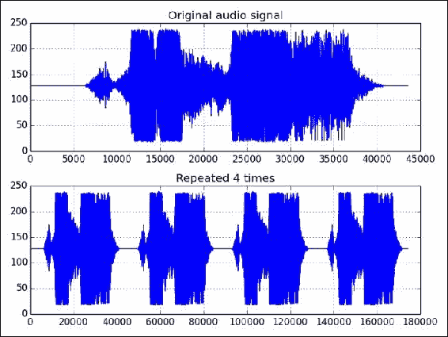

# 十、当 NumPy 不够用时 - SciPy 及更多

SciPy 是建立在 NumPy 之上的世界著名的 Python 开源科学计算库。 它增加了一些功能，例如数值积分，优化，统计和特殊功能。

在本章中，我们将介绍以下主题：

*   文件 I/O
*   统计
*   信号处理
*   优化
*   插补
*   图像和音频处理

## MATLAB 和 Octave

**MATLAB** 及其开源替代品 Octave 是流行的数学程序。 `scipy.io`软件包具有一些函数，可让您加载 MATLAB 或 Octave 矩阵，以及数字或 Python 程序中的字符串，反之亦然。 `loadmat()`函数加载`.mat`文件。 `savemat()`函数将名称和数组的字典保存到`.mat`文件中。

## 实战时间 – 保存并加载`.mat`文件

如果我们从 NumPy 数组开始并决定在 MATLAB 或 Octave 环境中使用所述数组，那么最简单的方法就是创建一个`.mat`文件。 然后，我们可以在 MATLAB 或 Octave 中加载文件。 让我们完成必要的步骤：

1.  创建一个 NumPy 数组，然后调用  `savemat()`函数来创建`.mat`文件。 该函数有两个参数：文件名和包含变量名和值的字典：

    ```py
    a = np.arange(7)

    io.savemat("a.mat", {"array": a})
    ```

2.  在 MATLAB 或 Octave 环境中，加载`.mat`文件并检查存储的数组：

    ```py
    octave-3.4.0:7> load a.mat
    octave-3.4.0:8> a

    octave-3.4.0:8> array
    array =

      0
      1
      2
      3
      4
      5
      6
    ```

### 刚刚发生了什么？

我们从 NumPy 代码创建了一个`.mat`文件，并将其加载到 Octave 中。 我们检查了创建的 NumPy 数组（请参见`scipyio.py`）：

```py
import numpy as np
from scipy import io

a = np.arange(7)

io.savemat("a.mat", {"array": a})
```

### 小测验-加载`.mat`文件

Q1. 哪个功能加载`.mat`文件？

1.  `Loadmatlab`
2.  `loadmat`
3.  `loadoct`
4.  `frommat`

## 统计

SciPy 统计模块为  ，称为`scipy.stats`。 一类实现连续分布  ，一类实现离散分布。 同样，在此模块中，可以找到执行大量统计检验的功能。

## 实战时间 – 分析随机值

我们将生成模拟正态分布的随机值，并使用`scipy.stats`包中的统计函数分析生成的数据。

1.  使用`scipy.stats`包从正态分布生成随机值：

    ```py
    generated = stats.norm.rvs(size=900)
    ```

2.  将生成的值拟合为正态分布。 这基本上给出了数据集的平均值和标准偏差：

    ```py
    print("Mean", "Std", stats.norm.fit(generated))
    ```

    平均值和标准差如下所示：

    ```py
    Mean Std (0.0071293257063200707, 0.95537708218972528)

    ```

3.  **偏度**告诉我们[概率分布有多偏斜（不对称）](http://en.wikipedia.org/wiki/Skewness)。执行偏度检验。 该检验返回两个值。 第二个值是 **p 值** -- 数据集的偏斜度不符合正态分布的概率。

    ### 注意

    一般而言，p 值是结果与给定零假设所期望的结果不同的概率，在这种情况下，偏度与正态分布（由于对称而为 0）不同的概率。

    P 值的范围是`0`至`1`：

    ```py
    print("Skewtest", "pvalue", stats.skewtest(generated))
    ```

    偏度检验的结果如下所示：

    ```py
    Skewtest pvalue (-0.62120640688766893, 0.5344638245033837)

    ```

    因此，我们不处理正态分布的可能性为`53`% 。 观察如果我们生成更多的点会发生什么，这很有启发性，因为如果我们生成更多的点，我们应该具有更正态的分布。 对于 900,000 点，我们得到`0.16`的 p 值。 对于 20 个生成的值，p 值为`0.50`。

4.  **峰度**告诉我们概率分布的弯曲程度。 执行峰度检验。 此检验的设置与偏度检验类似，但当然适用于峰度：

    ```py
    print("Kurtosistest", "pvalue", stats.kurtosistest(generated))
    ```

    峰度检验的结果显示如下：

    ```py
    Kurtosistest pvalue (1.3065381019536981, 0.19136963054975586)

    ```

    900,000 个值的 p 值为`0.028`。 对于 20 个生成的值，p 值为`0.88`。

5.  **正态检验**告诉我们数据集符合正态分布的可能性。 执行正态性检验。 此检验还返回两个值，其中第二个是p值：

    ```py
    print("Normaltest", "pvalue", stats.normaltest(generated))
    ```

    正态性检验的结果如下所示：

    ```py
    Normaltest pvalue (2.09293921181506, 0.35117535059841687)

    ```

    900,000 个生成值的 p 值为`0.035`。 对于 20 个生成的值，p 值为`0.79`。

6.  我们可以使用 SciPy 轻松找到某个百分比的值：

    ```py
    print("95 percentile", stats.scoreatpercentile(generated, 95))
    ```

    `95th`百分位的值显示如下：

    ```py
    95 percentile 1.54048860252

    ```

7.  进行与上一步相反的操作，以找到 1 处的百分位数：

    ```py
    print("Percentile at 1", stats.percentileofscore(generated, 1))
    ```

    `1`处的百分位数显示如下：

    ```py
    Percentile at 1 85.5555555556

    ```

8.  使用`matplotlib`在直方图中绘制生成的值（有关`matplotlib`的更多信息，请参见前面的第 9 章，
“Matplotlib 绘图”：

    ```py
    plt.hist(generated)
    ```

    生成的随机值的直方图如下：

    

### 刚刚发生了什么？

我们从正态分布创建了一个数据集，并使用`scipy.stats`模块对其进行了分析（请参见`statistics.py`）：

```py
from __future__ import print_function
from scipy import stats
import matplotlib.pyplot as plt

generated = stats.norm.rvs(size=900)
print("Mean", "Std", stats.norm.fit(generated))
print("Skewtest", "pvalue", stats.skewtest(generated))
print("Kurtosistest", "pvalue", stats.kurtosistest(generated))
print("Normaltest", "pvalue", stats.normaltest(generated))
print("95 percentile", stats.scoreatpercentile(generated, 95))
print("Percentile at 1", stats.percentileofscore(generated, 1))
plt.title('Histogram of 900 random normally distributed values')
plt.hist(generated)
plt.grid()
plt.show()
```

### 成为英雄-改善数据生成

从前面的“实战时间”部分中的直方图来看，在生成数据方面还有改进的余地。 尝试使用 NumPy 或`scipy.stats.norm.rvs()`函数的其他参数。

## SciKits 样本比较

通常，我们有两个数据样本，可能来自不同的实验，它们之间存在某种关联。 存在可以比较样本的统计检验。 其中一些是在`scipy.stats`模块中实现的。

我喜欢的另一个统计检验是`scikits.statsmodels.stattools`的 **Jarque-Bera** 正态性检验。 **SciKit** 是小型实验 Python 软件工具箱。 它们不属于 SciPy。 还有 Pandas，这是`scikits.statsmodels`的分支。 可以在[这个页面](https://scikits.appspot.com/scikits)上找到  SciKit 的列表。 您可以使用安装工具通过以下工具安装`statsmodels`：

```py
$ [sudo] easy_install statsmodels

```

## 实战时间 – 比较股票日志收益

我们将使用`matplotlib`下载两个追踪器的去年股票报价。 如先前的第 9 章，“matplotlib 绘图”，我们可以从 Yahoo Finance 检索报价。 我们将比较`DIA`和`SPY`的收盘价的对数回报（DIA 跟踪道琼斯指数； SPY 跟踪 S&P 500 指数）。 我们还将对返回值的差异执行 Jarque–Bera 检验。

1.  编写一个可以返回指定股票的收盘价的函数：

    ```py
    def get_close(symbol):
       today = date.today()
       start = (today.year - 1, today.month, today.day)

       quotes = quotes_historical_yahoo(symbol, start, today)
       quotes = np.array(quotes)

       return quotes.T[4]
    ```

2.  计算 DIA 和 SPY 的日志返回。 通过采用收盘价的自然对数，然后采用连续值的差来计算对数收益：

    ```py
    spy =  np.diff(np.log(get_close("SPY")))
    dia =  np.diff(np.log(get_close("DIA")))
    ```

3.  均值比较测试检查两个不同的样本是否可以具有相同的平均值。 返回两个值，第二个是从 0 到 1 的 p 值：

    ```py
    print("Means comparison", stats.ttest_ind(spy, dia))
    ```

    均值比较检验的结果如下所示：

    ```py
    Means comparison (-0.017995865641886155, 0.98564930169871368)

    ```

    因此，这两个样本有大约 98% 的机会具有相同的平均对数回报。 实际上，该文档的内容如下：

    ### 注意

    如果我们观察到较大的 p 值（例如，大于 0.05 或 0.1），那么我们将无法拒绝具有相同平均分数的原假设。 如果 p 值小于阈值，例如 1% ，5% 或 10% ，则我们拒绝均值的零假设。

4.  **Kolmogorov–Smirnov** 双样本检验告诉我们从同一分布中抽取两个样本的可能性：

    ```py
    print("Kolmogorov smirnov test", stats.ks_2samp(spy, dia))
    ```

    再次返回两个值，其中第二个值为 p 值：

    ```py
    Kolmogorov smirnov test (0.063492063492063516, 0.67615647616238039)

    ```

5.  对日志返回值的差异进行 **Jarque–Bera** 正态性检验：

    ```py
    print("Jarque Bera test", jarque_bera(spy – dia)[1])
    ```

    Jarque-Bera 正态性检验的 p 值显示如下：

    ```py
    Jarque Bera test 0.596125711042

    ```

6.  用`matplotlib`绘制对数收益的直方图及其差值：

    ```py
    plt.hist(spy, histtype="step", lw=1, label="SPY")
    plt.hist(dia, histtype="step", lw=2, label="DIA")
    plt.hist(spy - dia, histtype="step", lw=3, label="Delta")
    plt.legend()
    plt.show()
    ```

    日志收益和差异的直方图如下所示：

    

### 刚刚发生了什么？

我们比较了 DIA 和 SPY 的对数回报样本。 另外，我们对日志返回值的差进行了 Jarque-Bera 检验（请参见`pair.py`）：

```py
from __future__ import print_function
from matplotlib.finance import quotes_historical_yahoo
from datetime import date
import numpy as np
from scipy import stats
from statsmodels.stats.stattools import jarque_bera
import matplotlib.pyplot as plt

def get_close(symbol):
   today = date.today()
   start = (today.year - 1, today.month, today.day)
   quotes = quotes_historical_yahoo(symbol, start, today)
   quotes = np.array(quotes)
   return quotes.T[4]

spy =  np.diff(np.log(get_close("SPY")))
dia =  np.diff(np.log(get_close("DIA")))

print("Means comparison", stats.ttest_ind(spy, dia))
print("Kolmogorov smirnov test", stats.ks_2samp(spy, dia))

print("Jarque Bera test", jarque_bera(spy - dia)[1])

plt.title('Log returns of SPY and DIA')
plt.hist(spy, histtype="step", lw=1, label="SPY")
plt.hist(dia, histtype="step", lw=2, label="DIA")
plt.hist(spy - dia, histtype="step", lw=3, label="Delta")
plt.xlabel('Log returns')
plt.ylabel('Counts')
plt.grid()
plt.legend(loc='best')
plt.show()
```

## 信号处理

`scipy.signal`模块包含滤波函数和 **B 样条插值**算法。

#### 注意

样条插值使用称为样条的[多项式进行插值](http://en.wikipedia.org/wiki/Spline_interpolation) ）。 然后，插值尝试将样条线粘合在一起以拟合数据。 B 样条是样条的一种。

SciPy 信号定义为数字数组。 过滤器的一个示例是`detrend()`函数。 此函数接收信号并对其进行线性拟合。 然后从原始输入数据中减去该趋势。

## 实战时间 – 检测 QQQ 趋势

通常对数据样本的趋势比对其去趋势更感兴趣。 在下降趋势之后，我们仍然可以轻松地恢复趋势。 让我们以 QQQ 的年价格数据为例。

1.  编写获取 QQQ 收盘价和相应日期的代码：

    ```py
    today = date.today()
    start = (today.year - 1, today.month, today.day)

    quotes = quotes_historical_yahoo("QQQ", start, today)
    quotes = np.array(quotes)

    dates = quotes.T[0]
    qqq = quotes.T[4]
    ```

2.  消除趋势：

    ```py
    y = signal.detrend(qqq)
    ```

3.  为日期创建月和日定位符：

    ```py
    alldays = DayLocator()
    months = MonthLocator()
    ```

4.  创建一个日期格式化程序，该日期格式化程序创建月份名称和年份的字符串：

    ```py
    month_formatter = DateFormatter("%b %Y")
    ```

5.  创建图形和子图：

    ```py
    fig = plt.figure()
    ax = fig.add_subplot(111)
    ```

6.  通过减去去趋势信号绘制数据和潜在趋势：

    ```py
    plt.plot(dates, qqq, 'o', dates, qqq - y, '-')
    ```

7.  设置定位器和格式化程序：

    ```py
    ax.xaxis.set_minor_locator(alldays)
    ax.xaxis.set_major_locator(months)
    ax.xaxis.set_major_formatter(month_formatter)
    ```

8.  将 x 轴标签的格式设置为日期：

    ```py
    fig.autofmt_xdate()
    plt.show()
    ```

    下图显示了带有趋势线的 QQQ 价格：

    

### 刚刚发生了什么？

我们用趋势线绘制了 QQQ 的收盘价（请参见`trend.py`）：

```py
from matplotlib.finance import quotes_historical_yahoo
from datetime import date
import numpy as np
from scipy import signal
import matplotlib.pyplot as plt
from matplotlib.dates import DateFormatter
from matplotlib.dates import DayLocator
from matplotlib.dates import MonthLocator

today = date.today()
start = (today.year - 1, today.month, today.day)

quotes = quotes_historical_yahoo("QQQ", start, today)
quotes = np.array(quotes)

dates = quotes.T[0]
qqq = quotes.T[4]

y = signal.detrend(qqq)

alldays = DayLocator()
months = MonthLocator()
month_formatter = DateFormatter("%b %Y")

fig = plt.figure()
ax = fig.add_subplot(111)

plt.title('QQQ close price with trend')
plt.ylabel('Close price')
plt.plot(dates, qqq, 'o', dates, qqq - y, '-')
ax.xaxis.set_minor_locator(alldays)
ax.xaxis.set_major_locator(months)
ax.xaxis.set_major_formatter(month_formatter)
fig.autofmt_xdate()
plt.grid()
plt.show()
```

## 傅立叶分析

现实世界中的信号通常具有周期性。 处理这些信号的常用工具是[**离散傅里叶变换**](https://en.wikipedia.org/wiki/Discrete-time_Fourier_transform)。 离散傅立叶变换是从时域到频域的变换，即将周期信号线性分解为各种频率的正弦和余弦函数：


可以在`scipy.fftpack`模块中找到傅里叶变换的功能（NumPy 也有自己的傅里叶包`numpy.fft`）。 该软件包中包括快速傅立叶变换，微分和伪微分运算符，以及一些辅助函数。 MATLAB 用户将很高兴地知道`scipy.fftpack`模块中的许多函数与 MATLAB 的对应函数具有相同的名称，并且与 MATLAB 的等效函数具有相似的功能。

## 作用时间–过滤去趋势的信号

在前面的“实战时间”部分中，我们学习了如何使信号逆趋势。 该去趋势的信号可以具有循环分量。 让我们尝试将其可视化。 其中一些步骤是前面“实战时间”部分中的步骤的重复，例如下载数据和设置`matplotlib`对象。 这些步骤在此省略。

1.  应用傅立叶变换，得到频谱：

    ```py
    amps = np.abs(fftpack.fftshift(fftpack.rfft(y)))
    ```

2.  滤除噪音。 假设，如果频率分量的幅度低于最强分量的`10`% ，则将其丢弃：

    ```py
    amps[amps < 0.1 * amps.max()] = 0
    ```

3.  将滤波后的信号转换回原始域，并将其与去趋势的信号一起绘制：

    ```py
    plt.plot(dates, y, 'o', label="detrended")
    plt.plot(dates, -fftpack.irfft(fftpack.ifftshift(amps)), label="filtered")
    ```

4.  将 x 轴标签格式化为日期，并添加具有超大尺寸的图例：

    ```py
    fig.autofmt_xdate()
    plt.legend(prop={'size':'x-large'})
    ```

5.  添加第二个子图并在滤波后绘制频谱图：

    ```py
    ax2 = fig.add_subplot(212)
    N = len(qqq)
    plt.plot(np.linspace(-N/2, N/2, N), amps, label="transformed")
    ```

6.  显示图例和图解：

    ```py
    plt.legend(prop={'size':'x-large'})

    plt.show()
    ```

    下图是信号和频谱的图：

    

### 刚刚发生了什么？

我们对信号进行了去趋势处理，然后使用`scipy.fftpack`模块在其上应用了一个简单的滤波器（请参阅`frequencies.py`）：

```py
from matplotlib.finance import quotes_historical_yahoo
from datetime import date
import numpy as np
from scipy import signal
import matplotlib.pyplot as plt
from scipy import fftpack
from matplotlib.dates import DateFormatter
from matplotlib.dates import DayLocator
from matplotlib.dates import MonthLocator

today = date.today()
start = (today.year - 1, today.month, today.day)

quotes = quotes_historical_yahoo("QQQ", start, today)
quotes = np.array(quotes)

dates = quotes.T[0]
qqq = quotes.T[4]

y = signal.detrend(qqq)

alldays = DayLocator()
months = MonthLocator()
month_formatter = DateFormatter("%b %Y")

fig = plt.figure()
fig.subplots_adjust(hspace=.3)
ax = fig.add_subplot(211)

ax.xaxis.set_minor_locator(alldays)
ax.xaxis.set_major_locator(months)
ax.xaxis.set_major_formatter(month_formatter)

## make font size bigger
ax.tick_params(axis='both', which='major', labelsize='x-large')

amps = np.abs(fftpack.fftshift(fftpack.rfft(y)))
amps[amps < 0.1 * amps.max()] = 0

plt.title('Detrended and filtered signal')
plt.plot(dates, y, 'o', label="detrended")
plt.plot(dates, -fftpack.irfft(fftpack.ifftshift(amps)), label="filtered")
fig.autofmt_xdate()
plt.legend(prop={'size':'x-large'})
plt.grid()

ax2 = fig.add_subplot(212)
plt.title('Transformed signal')
ax2.tick_params(axis='both', which='major', labelsize='x-large')
N = len(qqq)
plt.plot(np.linspace(-N/2, N/2, N), amps, label="transformed")

plt.legend(prop={'size':'x-large'})
plt.grid()
plt.tight_layout()
plt.show()
```

## 数学优化

优化算法试图找到问题的最佳解决方案，例如，找到函数的最大值或最小值。 该函数可以是线性的或非线性的。 该解决方案也可能具有特殊的约束。 例如，可能不允许解决方案具有负值。 `scipy.optimize`模块提供了几种优化算法。 算法之一是最小二乘拟合函数`leastsq()`。 调用此函数时，我们提供了残差（错误项）函数。 此函数可将残差平方和最小化。 它对应于我们的解决方案数学模型。 还必须给算法一个起点。 这应该是一个最佳猜测-尽可能接近真实的解决方案。 否则，将在大约`100 * (N+1)`次迭代后停止执行，其中 *N* 是要优化的参数数量。

## 作用时间–正弦拟合

在前面的“实战时间”部分中，我们为脱趋势数据创建了一个简单的过滤器。 现在，让我们使用限制性更强的滤波器，该滤波器将只剩下主要频率分量。 我们将为其拟合正弦波模式并绘制结果。 该模型具有四个参数-幅度，频率，相位和垂直偏移。

1.  根据正弦波模型定义残差函数：

    ```py
    def residuals(p, y, x):
       A,k,theta,b = p
       err = y-A * np.sin(2* np.pi* k * x + theta) + b
       return err
    ```

2.  将滤波后的信号转换回原始域：

    ```py
    filtered = -fftpack.irfft(fftpack.ifftshift(amps))
    ```

3.  猜猜我们试图估计的从时域到频域的转换的参数值：

    ```py
    N = len(qqq)
    f = np.linspace(-N/2, N/2, N)
    p0 = [filtered.max(), f[amps.argmax()]/(2*N), 0, 0]
    print("P0", p0)
    ```

    初始值如下所示：

    ```py
    P0 [2.6679532410065212, 0.00099598469163686377, 0, 0]

    ```

4.  调用`leastsq()`函数：

    ```py
    plsq = optimize.leastsq(residuals, p0, args=(filtered, dates))
    p = plsq[0]
    print("P", p)
    ```

    最终参数值如下：

    ```py
    P [  2.67678014e+00   2.73033206e-03  -8.00007036e+03  -5.01260321e-03]

    ```

5.  用去趋势数据，过滤后的数据和过滤后的数据拟合完成第一个子图。 将日期格式用于水平轴并添加图例：

    ```py
    plt.plot(dates, y, 'o', label="detrended")
    plt.plot(dates, filtered, label="filtered")
    plt.plot(dates, p[0] * np.sin(2 * np.pi * dates * p[1] + p[2]) + p[3], '^', label="fit")
    fig.autofmt_xdate()
    plt.legend(prop={'size':'x-large'})
    ```

6.  添加第二个子图，其中包含频谱主要成分的图例：

    ```py
    ax2 = fig.add_subplot(212)
    plt.plot(f, amps, label="transformed")
    ```

    以下是结果图表：

    

### 刚刚发生了什么？

我们降低了 QQQ 一年价格数据的趋势。 然后对该信号进行滤波，直到仅剩下频谱的主要成分。 我们使用`scipy.optimize`模块（请参见`optfit.py`）将正弦拟合到滤波后的信号：

```py
from __future__ import print_function
from matplotlib.finance import quotes_historical_yahoo
import numpy as np
import matplotlib.pyplot as plt
from scipy import fftpack
from scipy import signal
from matplotlib.dates import DateFormatter
from matplotlib.dates import DayLocator
from matplotlib.dates import MonthLocator
from scipy import optimize

start = (2010, 7, 25)
end = (2011, 7, 25)

quotes = quotes_historical_yahoo("QQQ", start, end)
quotes = np.array(quotes)

dates = quotes.T[0]
qqq = quotes.T[4]

y = signal.detrend(qqq)

alldays = DayLocator()
months = MonthLocator()
month_formatter = DateFormatter("%b %Y")

fig = plt.figure()
fig.subplots_adjust(hspace=.3)
ax = fig.add_subplot(211)

ax.xaxis.set_minor_locator(alldays)
ax.xaxis.set_major_locator(months)
ax.xaxis.set_major_formatter(month_formatter)
ax.tick_params(axis='both', which='major', labelsize='x-large')

amps = np.abs(fftpack.fftshift(fftpack.rfft(y)))
amps[amps < amps.max()] = 0

def residuals(p, y, x):
   A,k,theta,b = p
   err = y-A * np.sin(2* np.pi* k * x + theta) + b
   return err

filtered = -fftpack.irfft(fftpack.ifftshift(amps))
N = len(qqq)
f = np.linspace(-N/2, N/2, N)
p0 = [filtered.max(), f[amps.argmax()]/(2*N), 0, 0]
print("P0", p0)

plsq = optimize.leastsq(residuals, p0, args=(filtered, dates))
p = plsq[0]
print("P", p)
plt.title('Detrended and filtered signal')
plt.plot(dates, y, 'o', label="detrended")
plt.plot(dates, filtered, label="filtered")
plt.plot(dates, p[0] * np.sin(2 * np.pi * dates * p[1] + p[2]) + p[3], '^', label="fit")
fig.autofmt_xdate()
plt.legend(prop={'size':'x-large'})
plt.grid()

ax2 = fig.add_subplot(212)
plt.title('Tranformed signal')
ax2.tick_params(axis='both', which='major', labelsize='x-large')
plt.plot(f, amps, label="transformed")

plt.legend(prop={'size':'x-large'})
plt.grid()
plt.tight_layout()
plt.show()
```

## 数值积分

SciPy 具有数值积分程序包`scipy.integrate`，在 NumPy 中没有等效项。 `quad()`函数可以在两个点之间整合一个单变量函数。 这些点可以是无穷大。 该函数使用最简单的数值积分方法：梯形法则。

## 作用时间–计算高斯积分

**高斯积分**是`error()`函数相关（在数学上也称为`erf`），但没有限制。 计算结果为`pi`的平方根。



让我们用`quad()`函数计算积分（对于导入，请检查代码包中的文件）：

```py
print("Gaussian integral", np.sqrt(np.pi),integrate.quad(lambda x: np.exp(-x**2), -np.inf, np.inf))
```

返回值是结果，其错误如下：

```py
Gaussian integral 1.77245385091 (1.7724538509055159, 1.4202636780944923e-08)

```

### 刚刚发生了什么？

我们使用`quad()`函数计算了高斯积分。

### 勇往直前 – 多做点实验

试用同一包中的其他集成功能。 只需替换一个函数调用即可。 我们应该得到相同的结果，因此您可能还需要阅读文档以了解更多信息。

## 插值

插值填充数据集中已知数据点之间的空白。 `scipy.interpolate()`函数根据实验数据对函数进行插值。 `interp1d`类可以创建线性或三次插值函数。 默认情况下，会创建线性插值函数，但是如果设置了`kind`参数，则会创建三次插值函数。 `interp2d`类的工作方式相同，但是是 2D 的。

## 实战时间 – 一维内插

我们将使用  `sinc()`函数创建数据点，并向其中添加一些随机噪声。 之后，我们将进行线性和三次插值并绘制结果。

1.  创建数据点并为其添加噪声：

    ```py
    x = np.linspace(-18, 18, 36)
    noise = 0.1 * np.random.random(len(x))
    signal = np.sinc(x) + noise
    ```

2.  创建一个线性插值函数，并将其应用于具有五倍数据点的输入数组：

    ```py
    interpreted = interpolate.interp1d(x, signal)
    x2 = np.linspace(-18, 18, 180)
    y = interpreted(x2)
    ```

3.  执行与上一步相同的操作，但使用三次插值：

    ```py
    cubic = interpolate.interp1d(x, signal, kind="cubic")
    y2 = cubic(x2)
    ```

4.  用`matplotlib`绘制结果：

    ```py
    plt.plot(x, signal, 'o', label="data")
    plt.plot(x2, y, '-', label="linear")
    plt.plot(x2, y2, '-', lw=2, label="cubic")
    plt.legend()
    plt.show()
    ```

    下图是数据，线性和三次插值的图形：

    

### 刚刚发生了什么？

我们通过`sinc()`函数创建了一个数据集，并添加了噪声。 然后，我们使用`scipy.interpolate`模块的`interp1d`类（请参见`sincinterp.py`）进行了线性和三次插值  ：

```py
import numpy as np
from scipy import interpolate
import matplotlib.pyplot as plt

x = np.linspace(-18, 18, 36)
noise = 0.1 * np.random.random(len(x))
signal = np.sinc(x) + noise

interpreted = interpolate.interp1d(x, signal)
x2 = np.linspace(-18, 18, 180)
y = interpreted(x2)

cubic = interpolate.interp1d(x, signal, kind="cubic")
y2 = cubic(x2)

plt.plot(x, signal, 'o', label="data")
plt.plot(x2, y, '-', label="linear")
plt.plot(x2, y2, '-', lw=2, label="cubic")

plt.title('Interpolated signal')
plt.xlabel('x')
plt.ylabel('y')
plt.grid()
plt.legend(loc='best')
plt.show()
```

## 图像处理

使用 SciPy，我们可以使用`scipy.ndimage`包进行图像处理。 该模块包含各种图像过滤器和实用程序。

## 实战时间-操纵莉娜

`scipy.misc`模块是一个加载“Lena”图像的实用程序。 这是 **Lena Soderberg** 的图像，传统上用于图像处理示例。 我们将对该图像应用一些过滤器并旋转它。 执行以下步骤以执行  ：

1.  加载 Lena 图像并将其显示在带有灰度色图的子图中：

    ```py
    image = misc.lena().astype(np.float32)
    plt.subplot(221)
    plt.title("Original Image")
    img = plt.imshow(image, cmap=plt.cm.gray)
    ```

    请注意，我们正在处理`float32`数组。

2.  **中值过滤器**扫描图像，并用相邻数据点的中值替换每个项目。 对图像应用中值过滤器，然后在第二个子图中显示它：

    ```py
    plt.subplot(222)
    plt.title("Median Filter")
    filtered = ndimage.median_filter(image, size=(42,42))
    plt.imshow(filtered, cmap=plt.cm.gray)
    ```

3.  旋转图像并将其显示在第三个子图中：

    ```py
    plt.subplot(223)
    plt.title("Rotated")
    rotated = ndimage.rotate(image, 90)
    plt.imshow(rotated, cmap=plt.cm.gray)
    ```

4.  **Prewitt 过滤器**基于计算图像强度的梯度。 将 Prewitt 过滤器应用于图像，并在第四个子图中显示它：

    ```py
    plt.subplot(224)
    plt.title("Prewitt Filter")
    filtered = ndimage.prewitt(image)
    plt.imshow(filtered, cmap=plt.cm.gray)
    plt.show()
    ```

    以下是生成的图像：

    

### 刚刚发生了什么？

我们使用 Lena 的图像：

```py
from scipy import misc
import numpy as np
import matplotlib.pyplot as plt
from scipy import ndimage

image = misc.lena().astype(np.float32)

plt.subplot(221)
plt.title("Original Image")
img = plt.imshow(image, cmap=plt.cm.gray)
plt.axis("off")

plt.subplot(222)
plt.title("Median Filter")
filtered = ndimage.median_filter(image, size=(42,42))
plt.imshow(filtered, cmap=plt.cm.gray)
plt.axis("off")

plt.subplot(223)
plt.title("Rotated")
rotated = ndimage.rotate(image, 90)
plt.imshow(rotated, cmap=plt.cm.gray)
plt.axis("off")

plt.subplot(224)
plt.title("Prewitt Filter")
filtered = ndimage.prewitt(image)
plt.imshow(filtered, cmap=plt.cm.gray)
plt.axis("off")
plt.show()
```

## 音频处理

既然我们已经完成了一些图像处理，那么您也可以使用 WAV 文件来完成令人兴奋的事情，您可能不会感到惊讶。 让我们下载一个 WAV 文件并重播几次。 我们将跳过下载部分的解释，该部分只是常规的 Python。

## 实战时间 – 重放音频片段

我们将下载 Austin Powers 的  WAV 文件，称为“Smashing baby”。 可以使用`scipy.io.wavfile`模块中的  `read()`函数将此文件转换为 NumPy 数组。 相同程序包中的  `write()`函数将在本节末尾用于创建新的 WAV 文件。 我们将进一步使用  `tile()`函数重播音频剪辑几次。

1.  使用`read()`函数读取文件：

    ```py
    sample_rate, data = wavfile.read(WAV_FILE)
    ```

    这给了我们两项–采样率和音频数据。 对于本节，我们仅对音频数据感兴趣。

2.  应用`tile()`函数：

    ```py
    repeated = np.tile(data, 4)
    ```

3.  使用`write()`函数编写一个新文件：

    ```py
    wavfile.write("repeated_yababy.wav", sample_rate, repeated)
    ```

    下图显示了四次重复的原始音频数据和音频剪辑：

    

### 刚刚发生了什么？

我们读取一个音频剪辑，将其重复四次，然后使用新数组（请参见`repeat_audio.py`）创建一个新的 WAV 文件：

```py
from __future__ import print_function
from scipy.io import wavfile
import matplotlib.pyplot as plt
import urllib.request
import numpy as np

response = urllib.request.urlopen('http://www.thesoundarchive.com/austinpowers/smashingbaby.wav')
print(response.info())
WAV_FILE = 'smashingbaby.wav'
filehandle = open(WAV_FILE, 'wb')
filehandle.write(response.read())
filehandle.close()
sample_rate, data = wavfile.read(WAV_FILE)
print("Data type", data.dtype, "Shape", data.shape)

plt.subplot(2, 1, 1)
plt.title("Original audio signal")
plt.plot(data)
plt.grid()

plt.subplot(2, 1, 2)

## Repeat the audio fragment
repeated = np.tile(data, 4)

## Plot the audio data
plt.title("Repeated 4 times")
plt.plot(repeated)
wavfile.write("repeated_yababy.wav",
    sample_rate, repeated)
plt.grid()
plt.tight_layout()
plt.show()
```

## 总结

在本章中，我们仅介绍了 SciPy 和 SciKits 可以实现的功能。 尽管如此，我们还是学到了一些有关文件 I/O，统计量，信号处理，优化，插值，音频和图像处理的知识。

在下一章中，我们将使用 Pygame（开源 Python 游戏库）创建一些简单而有趣的游戏。 在此过程中，我们将学习 NumPy 与 **Pygame**，Scikit 机器学习库，以及其他的集成。