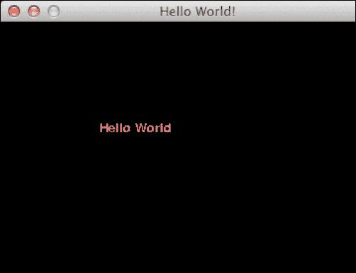
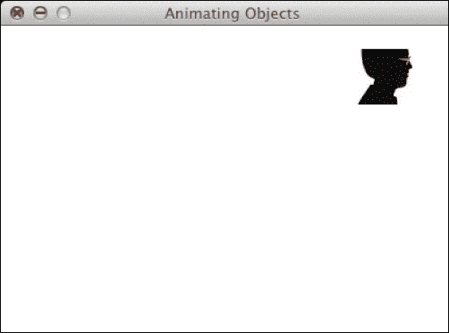
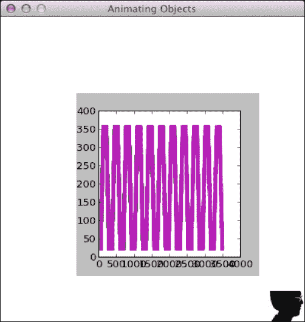
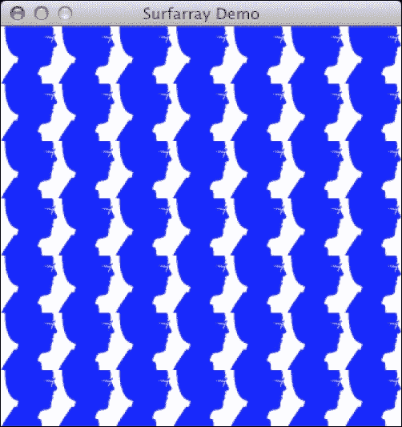
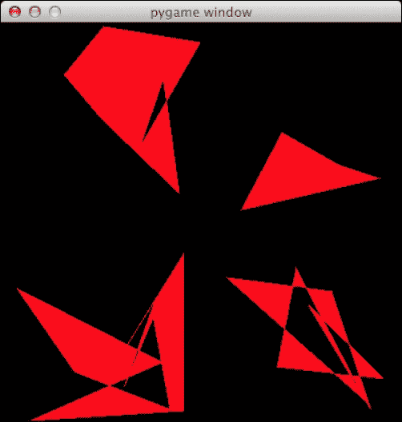
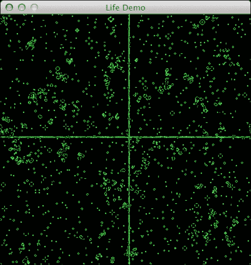

# 十一、玩转 Pygame

本章适用于希望使用 NumPy 和 Pygame 快速轻松创建游戏的开发人员。 基本的游戏开发经验会有所帮助，但这不是必需的。

您将学到的东西如下：

*   pygame 基础
*   matplotlib 集成
*   表面像素数组
*   人工智能
*   动画
*   的 OpenGL

# Pygame

**Pygame** 是 Python 框架，最初由  **Pete Shinners** 编写，  顾名思义，可用于制作视频游戏。 自 2004 年以来，Pygame 是免费的开放源代码，并获得 GPL 许可，这意味着您基本上可以制作任何类型的游戏。 Pygame 构建在**简单 DirectMedia 层**（**SDL**）。 SDL 是  一个 C 框架，可以访问各种操作系统（包括 Linux，MacOSX 和 Windows）上的图形，声音，键盘和其他输入设备。

# 实战时间 – 安装 Pygame

我们将在本节中安装 Pygame。 Pygame 应该与所有 Python 版本兼容。 在撰写  时，Python 3 存在一些不兼容问题，但很可能很快就会解决。

*   **在 Debian 和 Ubuntu 上安装**：Pygame 可以在 [Debian 档案文件](https://packages.qa.debian.org/p/pygame.html)中找到。 
*   **在 Windows 上安装**：从 [Pygame 网站](http://www.pygame.org/download.shtml)下载适用于您正在使用的版本的 Python 的二进制安装程序。
*   **在 Mac 上安装 Pygame**：适用于 MacOSX 10.3 及更高版本的 Binary Pygame 软件包可在[中找到 http://www.pygame.org /download.shtml](http://www.pygame.org/download.shtml) 。
*   **Installing from source**: Pygame is using the `distutils` system for compiling and installing. To start installing Pygame with the default options, simply run the following command:

    ```py
    $ python setup.py

    ```

    如果您需要有关可用选项的更多信息，请键入以下内容：

    ```py
    $ python setup.py help

    ```

*   要编译代码，您的操作系统需要一个  编译器。 进行设置超出了本书的范围。 有关在  Windows 上编译 Pygame 的更多信息，可以在[这个页面](http://pygame.org/wiki/CompileWindows)上找到。 有关在  MacOSX 上编译 Pygame 的更多信息，请参考[这里](http://pygame.org/wiki/MacCompile)。

# 世界您好

我们将创建一个简单的游戏，在本章中我们将进一步改进  。 与编程书籍中的传统方法一样，我们从`Hello World!`示例开始。

# 实战时间 – 创建一个简单的游戏

重要的是要注意所谓的  主游戏循环，在该循环中所有动作都会发生，并使用`Font`模块渲染文本。 在此程序中，我们将操纵用于绘制的 Pygame `Surface`对象，并处理 quit 事件。

1.  首先，导入所需的 Pygame 模块。 如果正确安装了 Pygame，则不会出现任何错误，否则请返回安装“实战时间”：

    ```py
    import pygame, sys
    from pygame.locals import *
    ```

2.  初始化 Pygame，按`300`像素创建`400`的显示，并将窗口标题设置为`Hello world!`：

    ```py
    pygame.init()
    screen = pygame.display.set_mode((400, 300))

    pygame.display.set_caption('Hello World!')
    ```

3.  Games usually have a game loop, which runs forever until, for instance, a quit event occurs. In this example, only set a label with the text `Hello world!` at coordinates (`100`, `100`). The text has font size `19` and a `red` color:

    ```py
    while True: 
       sysFont = pygame.font.SysFont("None", 19)
       rendered = sysFont.render('Hello World', 0, (255, 100, 100))
       screen.blit(rendered, (100, 100))

       for event in pygame.event.get():
          if event.type == QUIT:
             pygame.quit()
             sys.exit()

       pygame.display.update()
    ```

    我们得到以下屏幕截图作为最终结果：

    

    以下是 Hello World 的完整代码！ 例：

    ```py
    import pygame, sys
    from pygame.locals import *

    pygame.init()
    screen = pygame.display.set_mode((400, 300))

    pygame.display.set_caption('Hello World!')

    while True: 
       sysFont = pygame.font.SysFont("None", 19)
       rendered = sysFont.render('Hello World', 0, (255, 100, 100))
       screen.blit(rendered, (100, 100))

       for event in pygame.event.get():
          if event.type == QUIT:
             pygame.quit()
             sys.exit()

       pygame.display.update()
    ```

## 刚刚发生了什么？

看起来似乎不多，但是我们  在本节中学到了很多东西。 下表总结了通过审查的功能：


| 函数 | 描述 |
| --- | --- |
| `pygame.init()` | 此函数执行初始化，您必须在调用其他 Pygame 函数之前调用它。 |
| `pygame.display.set_mode((400, 300))` | 此函数创建一个要使用的所谓的`Surface`对象。 我们给这个函数一个表示表面尺寸的元组。 |
| `pygame.display.set_caption('Hello World!')` | 此功能将窗口标题设置为指定的字符串值。 |
| `pygame.font.SysFont("None", 19)` | 此函数根据逗号分隔的字体列表（在本例中为无）和整数字体大小参数创建系统字体。 |
| `sysFont.render('Hello World', 0, (255, 100, 100))` | 此功能在`Surface`上绘制文本。 最后一个参数是表示颜色的 RGB 值的元组。 |
| `screen.blit(rendered, (100, 100))` | 此功能使用`Surface`。 |
| `pygame.event.get()` | 此函数获取`Event`对象的列表。 事件表示系统中的特殊事件，例如用户退出游戏。 |
| `pygame.quit()` | 该函数清除由 Pygame 使用的资源。 退出游戏之前，请调用此函数。 |
| `pygame.display.update()` | 此功能刷新表面。 |

# 动画

大多数游戏，甚至是最静态的游戏，都有一定程度的动画效果。 从程序员的角度来看，动画就是  ，无非就是在不同的时间在不同的位置显示对象，从而模拟运动。

Pygame 提供了一个`Clock`对象，该对象管理每秒绘制多少帧。 这样可以确保动画与用户 CPU 的速度无关。

# 实战时间 – 使用 NumPy 和 Pygame 为对象设置动画

我们将加载图像  ，然后再次使用 NumPy 定义  屏幕周围的顺时针路径。

1.  创建一个 Pygame 时钟，如下所示：

    ```py
    clock = pygame.time.Clock()
    ```

2.  作为本书随附的源代码的一部分，应该有一张头像。 加载此图像并在屏幕上四处移动：

    ```py
    img = pygame.image.load('head.jpg')
    ```

3.  定义一些数组来保存位置的坐标，我们希望在动画过程中将图像放置在这些位置。 由于我们将移动对象，因此路径有四个逻辑部分：`right`，`down`，`left`和`up`。 每个部分将具有`40`等距步长。 将`0`部分中的所有值初始化：

    ```py
    steps = np.linspace(20, 360, 40).astype(int)
    right = np.zeros((2, len(steps)))
    down = np.zeros((2, len(steps)))
    left = np.zeros((2, len(steps)))
    up = np.zeros((2, len(steps)))
    ```

4.  设置图像位置的  坐标很简单。 但是，需要注意一个棘手的问题-`[::-1]`表示法会导致  数组元素的顺序颠倒：

    ```py
    right[0] = steps
    right[1] = 20

    down[0] = 360
    down[1] = steps

    left[0] = steps[::-1]
    left[1] = 360

    up[0] = 20
    up[1] = steps[::-1]
    ```

5.  我们可以加入路径部分，但是在执行此操作之前，请使用`T`运算符转置数组，因为它们未正确对齐以进行连接：

    ```py
    pos = np.concatenate((right.T, down.T, left.T, up.T))
    ```

6.  In the main event loop, let the clock tick at a rate of 30 frames per second:

    ```py
       clock.tick(30)
    ```

    摇头的屏幕截图如下：

    

    您应该能够[观看此动画的电影](https://www.youtube.com/watch?v=m2TagGiq1fs)。 它也是代码包（`animation.mp4`）的一部分。

    此示例的代码  几乎使用了到目前为止我们学到的所有内容，但仍应足够简单以了解：

    ```py
    import pygame, sys
    from pygame.locals import *
    import numpy as np

    pygame.init()
    clock = pygame.time.Clock()
    screen = pygame.display.set_mode((400, 400))

    pygame.display.set_caption('Animating Objects')
    img = pygame.image.load('head.jpg')

    steps = np.linspace(20, 360, 40).astype(int)
    right = np.zeros((2, len(steps)))
    down = np.zeros((2, len(steps)))
    left = np.zeros((2, len(steps)))
    up = np.zeros((2, len(steps)))

    right[0] = steps
    right[1] = 20

    down[0] = 360
    down[1] = steps

    left[0] = steps[::-1]
    left[1] = 360

    up[0] = 20
    up[1] = steps[::-1]

    pos = np.concatenate((right.T, down.T, left.T, up.T))
    i = 0

    while True: 
       # Erase screen
       screen.fill((255, 255, 255))

       if i >= len(pos):
          i = 0

       screen.blit(img, pos[i])
       i += 1

       for event in pygame.event.get():
          if event.type == QUIT:
             pygame.quit()
             sys.exit()

       pygame.display.update()
       clock.tick(30)
    ```

## 刚刚发生了什么？

在本节中，我们了解了一些有关动画的知识。 我们了解到的最重要的概念是时钟。 下表描述了我们使用的新功能：


| 函数 | 描述 |
| --- | --- |
| `pygame.time.Clock()` | 这将创建一个游戏时钟。 |
| `clock.tick(30)` | 此功能执行游戏时钟的刻度。 此处，`30`是每秒的帧数。 |

# matplotlib

`matplotlib`是一个易于绘制的开源  库，我们在第 9 章，“matplotlib 绘图”中了解到。 我们可以将 matplotlib 集成到 Pygame 游戏中并创建各种情节。

# 行动起来了–在 Pygame 中使用 matplotlib

在本食谱中，我们采用上一节的位置坐标，并对其进行绘制。

1.  要将 matplotlib 与 Pygame 集成，我们需要使用非交互式后端； 否则，默认情况下，matplotlib 将为我们提供一个 GUI 窗口。 我们将导入主要的 matplotlib 模块并调用`use()`函数。 在导入主 matplotlib 模块之后以及在导入其他 matplotlib 模块之前，立即调用此函数：

    ```py
    import matplotlib as mpl

    mpl.use("Agg")
    ```

2.  我们可以在 matplotlib 画布上绘制非交互式绘图。 创建此画布需要导入，创建图形和子图。 将数字指定为`3`乘`3`英寸大。 在此食谱的末尾可以找到更多详细信息：

    ```py
    import matplotlib.pyplot as plt
    import matplotlib.backends.backend_agg as agg

    fig = plt.figure(figsize=[3, 3])
    ax = fig.add_subplot(111)
    canvas = agg.FigureCanvasAgg(fig)
    ```

3.  In non-interactive mode, plotting data is a bit more complicated than in the default mode. Since we need to plot repeatedly, it makes sense to organize the plotting code in a function. Pygame eventually draws the plot on the canvas. The canvas adds a bit of complexity to our setup. At the end of this example, you can find more detailed explanation of the functions:

    ```py
    def plot(data):
       ax.plot(data)
       canvas.draw()
       renderer = canvas.get_renderer()

       raw_data = renderer.tostring_rgb()
       size = canvas.get_width_height()

       return pygame.image.fromstring(raw_data, size, "RGB")
    ```

    下面的屏幕截图显示了正在运行的动画。 您还可以[在代码包（`matplotlib.mp4`）和 YouTube 上查看截屏视频](https://www.youtube.com/watch?v=t6qTeXxtnl4)。

    

    更改后，我们将获得以下  代码：  ：

    ```py
    import pygame, sys
    from pygame.locals import *
    import numpy as np
    import matplotlib as mpl

    mpl.use("Agg")

    import matplotlib.pyplot as plt
    import matplotlib.backends.backend_agg as agg

    fig = plt.figure(figsize=[3, 3])
    ax = fig.add_subplot(111)
    canvas = agg.FigureCanvasAgg(fig)

    def plot(data):
       ax.plot(data)
       canvas.draw()
       renderer = canvas.get_renderer()

       raw_data = renderer.tostring_rgb()
       size = canvas.get_width_height()

       return pygame.image.fromstring(raw_data, size, "RGB")

    pygame.init()
    clock = pygame.time.Clock()
    screen = pygame.display.set_mode((400, 400))

    pygame.display.set_caption('Animating Objects')
    img = pygame.image.load('head.jpg')

    steps = np.linspace(20, 360, 40).astype(int)
    right = np.zeros((2, len(steps)))
    down = np.zeros((2, len(steps)))
    left = np.zeros((2, len(steps)))
    up = np.zeros((2, len(steps)))

    right[0] = steps
    right[1] = 20

    down[0] = 360
    down[1] = steps

    left[0] = steps[::-1]
    left[1] = 360

    up[0] = 20
    up[1] = steps[::-1]

    pos = np.concatenate((right.T, down.T, left.T, up.T))
    i = 0
    history = np.array([])
    surf = plot(history)

    while True: 
       # Erase screen
       screen.fill((255, 255, 255))

       if i >= len(pos):
          i = 0
          surf = plot(history)

       screen.blit(img, pos[i])
       history = np.append(history, pos[i])
       screen.blit(surf, (100, 100))

       i += 1

       for event in pygame.event.get():
          if event.type == QUIT:
             pygame.quit()
             sys.exit()

       pygame.display.update()
       clock.tick(30)
    ```

## 刚刚发生了什么？

下表  解释了  绘图相关功能：


| 函数 | 描述 |
| --- | --- |
| `mpl.use("Agg")` | 此函数指定使用非交互式后端 |
| `plt.figure(figsize=[3, 3])` | 此功能创建一个`3 x 3`英寸的图形 |
| `agg.FigureCanvasAgg(fig)` | 此功能在非交互模式下创建画布 |
| `canvas.draw()` | 此功能在画布上绘制 |
| `canvas.get_renderer()` | 此功能为画布提供渲染器 |

# 表面像素

Pygame `surfarray`模块处理 Pygame `Surface`对象与 NumPy 数组之间的转换  。 您可能还记得，NumPy 可以快速有效地处理大型数组。

# 实战时间 – 用 NumPy 访问表面像素数据

在本节中，我们将平铺一个小图像  以填充游戏屏幕。

1.  `array2d()`函数  将像素复制到二维数组中（对于三维数组也有类似的功能）。 将头像图像中的像素复制到数组中：

    ```py
    pixels = pygame.surfarray.array2d(img)
    ```

2.  使用数组的 shape 属性从像素数组的形状创建游戏屏幕。 在两个方向上将屏幕放大七倍：

    ```py
    X = pixels.shape[0] * 7
    Y = pixels.shape[1] * 7
    screen = pygame.display.set_mode((X, Y))
    ```

3.  使用 NumPy `tile()`功能可以轻松平铺图像。 数据需要转换为整数值，因为 Pygame 将颜色定义为整数：

    ```py
    new_pixels = np.tile(pixels, (7, 7)).astype(int)
    ```

4.  The `surfarray` module has a special function `blit_array()` to display the array on the screen:

    ```py
    pygame.surfarray.blit_array(screen, new_pixels)
    ```

    

    以下代码执行图像的平铺：

    ```py
    import pygame, sys
    from pygame.locals import *
    import numpy as np

    pygame.init()
    img = pygame.image.load('head.jpg')
    pixels = pygame.surfarray.array2d(img)
    X = pixels.shape[0] * 7
    Y = pixels.shape[1] * 7
    screen = pygame.display.set_mode((X, Y))
    pygame.display.set_caption('Surfarray Demo')
    new_pixels = np.tile(pixels, (7, 7)).astype(int)

    while True: 
       screen.fill((255, 255, 255))
       pygame.surfarray.blit_array(screen, new_pixels)

       for event in pygame.event.get():
          if event.type == QUIT:
             pygame.quit()
             sys.exit()

       pygame.display.update()
    ```

## 刚刚发生了什么？

以下是  对我们  使用的新功能和属性的简要说明：


| 函数 | 描述 |
| --- | --- |
| `pygame.surfarray.array2d(img)` | 此函数将像素数据复制到二维数组中 |
| `pygame.surfarray.blit_array(screen, new_pixels)` | 此功能在屏幕上显示数组值 |

# 人工智能

通常，我们需要模仿游戏中的  智能行为。 `scikit-learn`项目旨在提供一种用于机器学习的 API，而我最喜欢的是其精美的文档。 我们可以使用操作系统的软件包管理器来安装`scikit-learn`，尽管此选项可能有效或无效，具体取决于您的操作系统，但这应该是最方便的方法。 Windows 用户只需从项目网站下载安装程序即可。 在 Debian 和 Ubuntu 上，该项目称为`python-sklearn`。 在 MacPorts 上，这些端口称为`py26-scikits-learn`和`py27-scikits-learn`。 我们也可以从源代码或使用`easy_install`安装。 **PythonXY**， **Enthought** 和 **NetBSD**。

我们可以通过在命令行中键入来安装`scikit-learn`：

```py
$ [sudo] pip install -U scikit-learn

```

我们也可以键入以下内容而不是前一行：

```py
$ [sudo] easy_install -U scikit-learn

```

由于权限的原因，这可能无法正常工作，因此您可能需要在命令前面放置`sudo`或以管理员身份登录。

# 实战时间 – 聚类点

我们将生成一些随机点并将它们聚类，这意味着彼此靠近的点将放入  同一聚类中。 这只是`scikit-learn`可以应用的许多技术  之一。**聚类**是一种机器学习算法，旨在基于相似度对项目进行分组。 接下来，我们将计算平方亲和矩阵。**亲和度矩阵**是  包含亲和度值的矩阵：例如，点之间的距离。 最后，我们将这些点与[​​HTG2]中的`AffinityPropagation`类聚类。

1.  在 400 x 400 像素的正方形内生成 30 个随机点位置：

    ```py
    positions = np.random.randint(0, 400, size=(30, 2))
    ```

2.  使用到原点的欧式距离作为亲和度度量来计算亲和度矩阵：

    ```py
    positions_norms = np.sum(positions ** 2, axis=1)
    S = - positions_norms[:, np.newaxis] - positions_norms[np.newaxis, :] + 2 * np.dot(positions, positions.T)
    ```

3.  给`AffinityPropagation`类上一步的结果。 此类使用适当的群集编号标记点：

    ```py
    aff_pro = sklearn.cluster.AffinityPropagation().fit(S)
    labels = aff_pro.labels_
    ```

4.  Draw polygons for each cluster. The function involved requires a list of points, a color (let's paint it red), and a surface:

    ```py
    pygame.draw.polygon(screen, (255, 0, 0), polygon_points[i])
    ```

    结果是每个群集的  一堆多边形，如下图所示：

    

    群集示例代码如下：

    ```py
    import numpy as np
    import sklearn.cluster
    import pygame, sys
    from pygame.locals import *

    np.random.seed(42)
    positions = np.random.randint(0, 400, size=(30, 2))

    positions_norms = np.sum(positions ** 2, axis=1)
    S = - positions_norms[:, np.newaxis] - positions_norms[np.newaxis, :] + 2 * np.dot(positions, positions.T)

    aff_pro = sklearn.cluster.AffinityPropagation().fit(S)
    labels = aff_pro.labels_

    polygon_points = []

    for i in xrange(max(labels) + 1):
       polygon_points.append([])

    # Sorting points by cluster
    for label, position in zip(labels, positions):
       polygon_points[labels[i]].append(positions[i])

    pygame.init()
    screen = pygame.display.set_mode((400, 400))

    while True: 
       for point in polygon_points:
          pygame.draw.polygon(screen, (255, 0, 0), point)

       for event in pygame.event.get():
          if event.type == QUIT:
             pygame.quit()
             sys.exit()

       pygame.display.update()
    ```

## 刚刚发生了什么？

下表更详细地描述了人工智能示例中最重要的行  ：


| 函数 | 描述 |
| --- | --- |
| `sklearn.cluster.AffinityPropagation().fit(S)` | 此函数创建`AffinityPropagation`对象，并使用相似性矩阵执行拟合 |
| `pygame.draw.polygon(screen, (255, 0, 0), point)` | 给定表面，颜色（在这种情况下为红色）和点列表，此函数绘制多边形 |

# OpenGL 和 Pygame

OpenGL 为二维和三维计算机图形指定了  API。 API 由函数和常量组成。 我们将专注于名为`PyOpenGL`的 Python 实现。 使用以下命令安装`PyOpenGL`：

```py
$ [sudo] pip install PyOpenGL PyOpenGL_accelerate

```

您可能需要具有 root 访问权限才能执行此命令。 对应于`easy_install`的  命令如下：

```py
$ [sudo] easy_install PyOpenGL PyOpenGL_accelerate

```

# 实战时间 – 绘制 Sierpinski 地毯

为了演示的目的，我们将使用 OpenGL 绘制一个 **Sierpinski 地毯**，也称为 **Sierpinski 三角形**或  **Sierpinski 筛子**。 这是由数学家 **Waclaw Sierpinski** 创建的三角形形状的分形图案。 三角形是通过递归且原则上是无限的过程获得的。

1.  首先，首先初始化一些与 OpenGL 相关的原语。 这包括设置显示模式和背景颜色。 本节末尾提供逐行说明：

    ```py
    def display_openGL(w, h):
      pygame.display.set_mode((w,h), pygame.OPENGL|pygame.DOUBLEBUF)

      glClearColor(0.0, 0.0, 0.0, 1.0)
      glClear(GL_COLOR_BUFFER_BIT|GL_DEPTH_BUFFER_BIT)

      gluOrtho2D(0, w, 0, h)
    ```

2.  The algorithm requires us to display points, the more the better. First, we set the drawing color to red. Second, we define the vertices (I call them points myself) of a triangle. Then, we define random indices, which are to be used to choose one of the three triangle vertices. We pick a random point somewhere in the middle—it doesn't really matter where. After this, draw points halfway between the previous point and one of the vertices picked at random. Finally, flush the result:

    ```py
        glColor3f(1.0, 0, 0)
        vertices = np.array([[0, 0], [DIM/2, DIM], [DIM, 0]])
        NPOINTS = 9000
        indices = np.random.random_integers(0, 2, NPOINTS)
        point = [175.0, 150.0]

        for i in xrange(NPOINTS):
           glBegin(GL_POINTS)
           point = (point + vertices[indices[i]])/2.0
           glVertex2fv(point)
           glEnd()

        glFlush()
    ```

    Sierpinski 三角形如下所示：

    

    带有所有进口的完整  Sierpinski 垫圈演示代码如下：

    ```py
    import pygame
    from pygame.locals import *
    import numpy as np

    from OpenGL.GL import *
    from OpenGL.GLU import *

    def display_openGL(w, h):
      pygame.display.set_mode((w,h), pygame.OPENGL|pygame.DOUBLEBUF)

      glClearColor(0.0, 0.0, 0.0, 1.0)
      glClear(GL_COLOR_BUFFER_BIT|GL_DEPTH_BUFFER_BIT)

      gluOrtho2D(0, w, 0, h)

    def main():
        pygame.init()
        pygame.display.set_caption('OpenGL Demo')
        DIM = 400
        display_openGL(DIM, DIM)
        glColor3f(1.0, 0, 0)
        vertices = np.array([[0, 0], [DIM/2, DIM], [DIM, 0]])
        NPOINTS = 9000
        indices = np.random.random_integers(0, 2, NPOINTS)
        point = [175.0, 150.0]

        for i in xrange(NPOINTS):
           glBegin(GL_POINTS)
           point = (point + vertices[indices[i]])/2.0
           glVertex2fv(point)
           glEnd()

        glFlush()
        pygame.display.flip()

        while True:
            for event in pygame.event.get():
                if event.type == QUIT:
                    return

    if __name__ == '__main__':
      main()
    ```

## 刚刚发生了什么？

如所承诺的，以下  是该示例最重要部分的逐行说明：


| 函数 | 描述 |
| --- | --- |
| `pygame.display.set_mode((w,h), pygame.OPENGL&#124;pygame.DOUBLEBUF)` | 此功能将显示模式设置为所需的宽度，高度和 OpenGL 显示 |
| `glClear(GL_COLOR_BUFFER_BIT&#124;GL_DEPTH_BUFFER_BIT)` | 此功能使用遮罩清除缓冲区。 在这里，我们清除颜色缓冲区和深度缓冲区位 |
| `gluOrtho2D(0, w, 0, h)` | 此函数定义二维正交投影矩阵，其坐标为左，右，上和下剪切平面 |
| `glColor3f(1.0, 0, 0)` | 此功能使用 RGB 的三个浮点值（红色，绿色，蓝色）定义当前图形颜色。 在这种情况下，我们将以红色绘制 |
| `glBegin(GL_POINTS)` | 此功能定义了图元的顶点或图元的组。 这里的原语是点 |
| `glVertex2fv(point)` | 此函数在给定顶点的情况下渲染点 |
| `glEnd()` | 此函数关闭以`glBegin()`开头的一段代码 |
| `glFlush()` | 此功能强制执行 GL 命令 |

# 与 Pygame 进行的模拟游戏

作为最后一个示例，我们  将使用 **Conway 的生命游戏**模拟生命。 最初的生命游戏是基于一些基本规则。 我们从二维正方形网格上的随机配置开始。 网格中的每个单元可以是死的或活着的。 此状态取决于小区的邻居。 您可以在[这个页面](http://en.wikipedia.org/wiki/Conway%27s_Game_of_Life#Rules)上详细了解规则。在每个时间步上，都会发生以下转换：

1.  少于两个活邻居的活细胞死亡。
2.  具有两个或三个活邻居的活细胞可以存活到下一代。
3.  具有三个以上活邻居的活细胞死亡。
4.  具有  的死细胞恰好是三个活的邻居，它们成为活细胞。

卷积可用于评估游戏的基本规则。 卷积过程需要 SciPy 软件包。

# 行动时刻–模拟生命

以下代码是生命游戏的实现  ，并进行了一些修改：

*   用鼠标单击一次会画一个十字，直到我们再次单击
*   `r`键可将网格重置为随机状态
*   `b`键根据鼠标位置创建块
*   `g`键创建滑翔机

代码中最重要的数据结构是一个二维数组，其中包含游戏屏幕上像素的颜色值。 该数组用随机值初始化，然后针对游戏循环的每次迭代重新计算。 在下一部分中找到有关所涉及功能的更多信息。

1.  要评估规则，请使用卷积，如下所示：

    ```py
    def get_pixar(arr, weights):
      states = ndimage.convolve(arr, weights, mode='wrap')

      bools = (states == 13) | (states == 12 ) | (states == 3)

      return bools.astype(int)
    ```

2.  使用我们在第 2 章，“从 NumPy 基础知识开始”中学习的基本索引技巧来画十字：

    ```py
    def draw_cross(pixar):
       (posx, posy) = pygame.mouse.get_pos()
       pixar[posx, :] = 1
       pixar[:, posy] = 1
    ```

3.  Initialize the grid with random values:

    ```py
    def random_init(n):
       return np.random.random_integers(0, 1, (n, n))
    ```

    以下是完整的代码：

    ```py
    from __future__ import print_function
    import os, pygame
    from pygame.locals import *
    import numpy as np
    from scipy import ndimage

    def get_pixar(arr, weights):
      states = ndimage.convolve(arr, weights, mode='wrap')

      bools = (states == 13) | (states == 12 ) | (states == 3)

      return bools.astype(int)

    def draw_cross(pixar):
       (posx, posy) = pygame.mouse.get_pos()
       pixar[posx, :] = 1
       pixar[:, posy] = 1

    def random_init(n):
       return np.random.random_integers(0, 1, (n, n))

    def draw_pattern(pixar, pattern):
         print(pattern)

         if pattern == 'glider':
          coords = [(0,1), (1,2), (2,0), (2,1), (2,2)]
         elif pattern == 'block':
          coords = [(3,3), (3,2), (2,3), (2,2)]
         elif pattern == 'exploder':
          coords = [(0,1), (1,2), (2,0), (2,1), (2,2), (3,3)]
         elif pattern == 'fpentomino':
          coords = [(2,3),(3,2),(4,2),(3,3),(3,4)]

         pos = pygame.mouse.get_pos()

         xs = np.arange(0, pos[0], 10)
         ys = np.arange(0, pos[1], 10)

         for x in xs:
            for y in ys:
               for i, j in coords:
                   pixar[x + i, y + j] = 1

    def main():
        pygame.init ()
        N = 400
        pygame.display.set_mode((N, N))
        pygame.display.set_caption("Life Demo")

        screen = pygame.display.get_surface()

        pixar = random_init(N)
        weights = np.array([[1,1,1], [1,10,1], [1,1,1]])

        cross_on = False

        while True:
           pixar = get_pixar(pixar, weights)

           if cross_on:
              draw_cross(pixar)

           pygame.surfarray.blit_array(screen, pixar * 255 ** 3)
           pygame.display.flip()

           for event in pygame.event.get():
             if event.type == QUIT:
                 return
             if event.type == MOUSEBUTTONDOWN:
                cross_on = not cross_on
             if event.type == KEYDOWN:
                if event.key == ord('r'):
                   pixar = random_init(N)
                   print("Random init")
                if event.key == ord('g'):
                   draw_pattern(pixar, 'glider')
                if event.key == ord('b'):
                   draw_pattern(pixar, 'block')
                if event.key == ord('e'):
                   draw_pattern(pixar, 'exploder')
                if event.key == ord('f'):
                   draw_pattern(pixar, 'fpentomino')

    if __name__ == '__main__':
        main()
    ```

    您应该能够从[代码包（`life.mp4`）或 YouTube](https://www.youtube.com/watch?v=NNsU-yWTkXM) 上观看截屏视频。 正在运行的  游戏的屏幕截图如下：

    

## 刚刚发生了什么？

我们使用了一些 NumPy 和 SciPy 函数，这些函数需要说明：


| 函数 | 描述 |
| --- | --- |
| `ndimage.convolve(arr, weights, mode='wrap')` | 此函数在包装模式下使用权重将卷积运算应用于给定数组。 该模式与数组边界有关。 |
| `bools.astype(int)` | 此函数将布尔数组转换为整数。 |
| `np.arange(0, pos[0], 10)` | 此函数以 10 为步长创建一个从 0 到`pos[0]`的数组。因此，如果`pos[0]`等于 1000，我们将得到 0、10、20，… 990。 |

# 总结

您可能会发现本书中提到 Pygame 有点奇怪。 但是，阅读本章后，我希望您意识到 NumPy 和 Pygame 可以很好地结合在一起。 毕竟，游戏涉及大量计算，因此 NumPy 和 SciPy 是理想的选择，并且它们还需要`scikit-learn`中提供的人工智能功能。 无论如何，制作游戏都很有趣，我们希望最后一章相当于十道菜后的精美甜点或咖啡！ 如果您仍然渴望更多，请查看《NumPy Cookbook 第二版》， *Ivan Idris*，*Packt Publishing*，在本书的基础上以最小的重叠为基础。