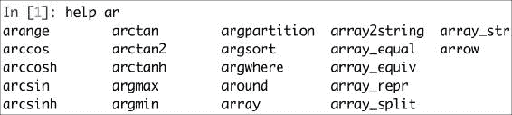
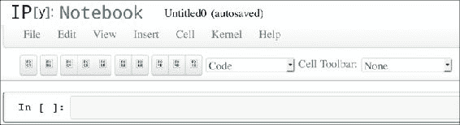
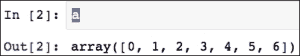
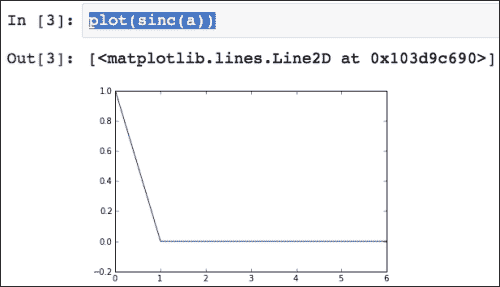
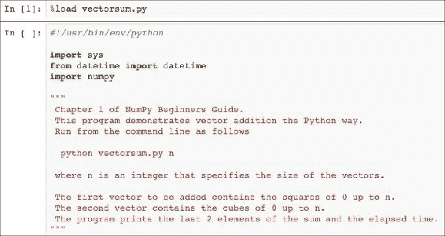

# 一、使用 IPython

在本章中，我们将介绍以下秘籍：

*   安装 IPython
*   使用 IPython 作为 Shell
*   阅读手册页
*   安装 matplotlib
*   运行 IPython 笔记本
*   导出 IPython 笔记本
*   导入网络笔记本
*   配置笔记本服务器
*   探索 SymPy 个人资料

# 简介

IPython，可从 [ipython.org](http://ipython.org/) 获得，是一个免费的开源项目  ，可用于 Linux，Unix，MacOSX， 和 Windows。 IPython 作者仅要求您在使用 IPython 的任何科学著作中引用 IPython。 IPython 提供了用于交互式计算的体系结构。 该项目最值得注意的部分是 IPython shell。 IPython 提供了以下组件，其中包括：

*   交互式 Python Shell（基于终端的 Qt 应用）
*   一个 Web 笔记本（在 IPython 0.12 和更高版本中可用），支持富媒体和绘图

IPython 与 Python 2.5、2.6、2.7、3.1、3.2、3.3 和 3.4 版本兼容。 兼容性取决于 IPython 版本。 例如，IPython 2.3.0 需要 Python 2.7 或 3.3+。

您可以在[这个页面](http://www.pythonanywhere.com/try-ipython/)上在云中尝试 IPython 而不将其安装在系统上。 与本地安装的软件相比，会有一些延迟，因此这不如真实的软件好。 但是，  IPython 交互式外壳程序中可用的大多数功能似乎都可用。 PythonAnywhere 也有一个 Vi(m) 编辑器，如果您喜欢 vi 的话，那显然很棒。 您可以从 IPython 会话中保存和编辑文件。

# 安装 IPython

可以通过多种方式安装 IPython ，具体取决于您的操作系统。 对于基于终端的外壳，需要依赖`readline`。 网络笔记本需要`tornado`和`zmq`。

除了安装 IPython 外，我们还将安装`setuptools`，它为您提供`easy_install`命令。 `easy_install`命令是 Python 的流行`package`管理器。 一旦拥有`easy_install`即可安装`pip`。 `pip`命令类似于`easy_install`，并添加了诸如卸载之类的选项。

## 操作步骤

本节介绍如何在 Windows，MacOSX 和 Linux 上安装 IPython。 它还描述了如何使用`easy_install`和`pip`或从源代码安装 IPython 及其依赖项：

*   **Installing IPython and setuptools on Windows**: A binary Windows installer for Python2 or Python3 is available on the IPython website. Also see [http://ipython.org/ipython-doc/stable/install/install.html#windows](http://ipython.org/ipython-doc/stable/install/install.html#windows).

    使用[安装程序](http://pypi.python.org/pypi/setuptools#files)安装 Setuptools。 然后安装`pip`，如下所示：

    ```py
    cd C:\Python27\scripts
    python .\easy_install-27-script.py pip

    ```

*   **在 MacOSX 上安装 IPython**：如果需要  ，请安装 Apple Developer Tools（Xcode）。 可以在[这个页面](https://developer.apple.com/xcode/)上找到  Xcode。 请遵循`easy_install/pip`说明或本节后面提供的从源安装的说明。
*   **在 Linux 上安装 IPython**：由于 Linux 发行版太多，因此本节将不详尽：
    *   在 Debian 上，键入以下命令：

        ```py
        $ su – aptitude install ipython python-setuptools

        ```

    *   在 Fedora 上，魔术命令如下：

        ```py
        $ su – yum install ipython python-setuptools-devel

        ```

    *   以下命令将在 Gentoo 上安装 IPython：

        ```py
        $ su – emerge ipython

        ```

    *   对于 Ubuntu，安装命令如下：

        ```py
        $ sudo apt-get install ipython python-setuptools

        ```

*   **Installing IPython with easy_install or pip**: Install IPython and all the dependencies required for the recipes in this chapter with `easy_install` using the following command:

    ```py
    $ sudo easy_install ipython pyzmq tornado readline

    ```

    或者，您可以通过在终端中键入以下命令，首先使用`easy_install`安装`pip`：

    ```py
    $ sudo easy_install pip

    ```

    之后，使用`pip`安装 IPython：

    ```py
    $ sudo pip install ipython pyzmq tornado readline

    ```

*   **从源代码安装**：如果您想使用最新的开发版本，则从源代码安装适合您：
    1.  从[这个页面](https://github.com/ipython/ipython/archive/master.zip)下载最新的源存档。
    2.  从存档中解压缩源代码：

        ```py
        $ tar xzf ipython-<version>.tar.gz

        ```

    3.  相反，如果您已安装 Git，则可以克隆 Git 存储库：

        ```py
        $ git clone https://github.com/ipython/ipython.git

        ```

    4.  转到下载源中的根目录：

        ```py
        $ cd ipython

        ```

    5.  运行安装脚本。 这可能需要您使用`sudo`运行命令，如下所示：

        ```py
        $ sudo python setup.py install

        ```

## 工作原理

我们使用几种方法安装了 IPython。 这些方法大多数都安装最新的稳定版本，但从源代码安装时除外，这将安装开发版本。

## 另见

*   [来自 IPython 官方网站的说明](http://ipython.org/install.html)

# 使用 IPython 作为 Shell

科学家和工程师习惯进行实验。 IPython 是科学家根据实验而创建的。 IPython 提供的交互式环境被许多人视为对 MATLAB，Mathematica，Maple 和 R 的直接回答。

以下是 IPython Shell 的功能列表：

*   制表符补全
*   历史机制
*   内联编辑
*   使用`%run`调用外部 Python 脚本的功能
*   调用与操作系统外壳程序交互的魔术函数的能力
*   访问系统命令
*   `pylab`开关
*   访问 Python 调试器和分析器

## 操作步骤

本节描述了如何使用 IPython Shell：

*   `pylab`: The `pylab` switch automatically imports all the SciPy, NumPy, and matplotlib packages. Without this switch, we would have to import these packages ourselves.

    我们需要做的就是在命令行中输入以下指令：

    ```py
    $ ipython --pylab
    Type "copyright", "credits" or "license" for more information.

    IPython 2.4.1 -- An enhanced Interactive Python.
    ?         -> Introduction and overview of IPython's features.
    %quickref -> Quick reference.
    help      -> Python's own help system.
    object?   -> Details about 'object', use 'object??' for extra details.

    Welcome to pylab, a matplotlib-based Python environment [backend: MacOSX].
    For more information, type 'help(pylab)'.

    In [1]: quit()
    quit() or Ctrl + D quits the IPython shell.

    ```

*   **Saving a session**: We might want to be able to go back to our experiments. In IPython, it is easy to save a session for later use. This is done with the following command:

    ```py
    In [1]: %logstart
    Activating auto-logging. Current session state plus future input saved.
    Filename       : ipython_log.py
    Mode           : rotate
    Output logging : False
    Raw input log  : False
    Timestamping   : False
    State          : active

    ```

    可以使用以下命令关闭日志记录：

    ```py
    In [9]: %logoff
    Switching logging OFF

    ```

*   **Executing a system shell command**: You can execute a system shell command in the default IPython profile by prefixing the command with the `!` symbol. For instance, the following input will get the current date:

    ```py
    In [1]: !date

    ```

    实际上，任何以`!`为前缀的行都将发送到系统外壳。 我们还可以存储命令输出，如下所示：

    ```py
    In [2]: thedate = !date
    In [3]: thedate

    ```

*   **Displaying history**: We can show the history of commands with the `%hist` command, like this:

    ```py
    In [1]: a = 2 + 2

    In [2]: a
    Out[2]: 4

    In [3]: %hist
    a = 2 + 2
    a
    %hist

    ```

    这是**命令行界面**（**CLI**）环境中的常见功能。 我们还可以使用`-g`开关查询历史记录：

    ```py
    In [5]: %hist -g a = 2
     1: a = 2 + 2

    ```

## 工作原理

我们看到了许多所谓的魔术功能在起作用。 这些功能以`%`字符开头。 如果单独在行中使用魔术函数，则`%`前缀是可选的。

## 另见

*   *IPython 作为系统外壳*，[来自 IPython 官方网站](http://ipython.org/ipython-doc/dev/interactive/shell.html)。

# 阅读手册页

我们可以使用`help`命令打开有关 NumPy 函数的文档。 不必知道函数的名称。 我们可以输入几个字符，然后让制表符完成工作。 例如，让我们浏览`arange()`函数的可用信息。

## 操作步骤

我们可以通过以下两种方式之一浏览可用信息：

*   **调用帮助功能**：调用`help`命令。 输入该功能的几个字符，然后按`Tab`键（请参见以下屏幕截图）：
*   **带问号的查询**：另一个选择是在函数名称后添加问号。 然后，您当然需要知道函数名称，但是不必键入`help`命令：

    ```py
    In [3]: arange?

    ```

## 工作原理

制表符的完成取决于`readline`，因此您需要确保已安装它。 问号为您提供`docstrings`中的信息。

# 安装 matplotlib

matplotlib（按惯例所有小写字母）是一个非常有用的 Python 绘图库，对于以下秘籍以及以后的内容，我们将需要它  。 它取决于 NumPy，但很可能已经安装了 NumPy。

## 操作步骤

我们将看到如何在 Windows，Linux 和 MacOSX 上安装 matplotlib，以及如何从源代码安装它：

*   **Installing matplotlib on Windows**: You can install this with the Enthought distribution, also known as Canopy ([http://www.enthought.com/products/epd.php](http://www.enthought.com/products/epd.php)).

    可能需要将`msvcp71.dll`文件放在您的`C:\Windows\system32`目录中。 您可以从[这里](http://www.dll-files.com/dllindex/dll-files.shtml?msvcp71)获取。

*   **Installing matplotlib on Linux**: Let's see how matplotlib can be installed in the various distributions of Linux:

    这是 Debian 和 Ubuntu 上的安装命令：

    ```py
    $ sudo apt-get install python-matplotlib

    ```

    *   在 Fedora/Redhat 上的安装命令如下：

        ```py
        $ su - yum install python-matplotlib

        ```

*   **Installing from source**: You can download the latest source from the `tar.gz` release at Sourceforge ([http://sourceforge.net/projects/matplotlib/files/](http://sourceforge.net/projects/matplotlib/files/)), or from the Git repository using the following command:

    ```py
    $ git clone git://github.com/matplotlib/matplotlib.git

    ```

    下载后，请使用以下命令照常构建和安装 matplotlib：

    ```py
    $ cd matplotlib
    $ sudo python setup.py install

    ```

*   **在 MacOSX 上安装 matplotlib**：从[这里](http://sourceforge.net/projects/matplotlib/files/matplotlib/)获取最新的 DMG 文件 。 您还可以使用 Mac Ports，Fink 或  Homebrew 包管理器。

## 另见

*   [matplotlib 官方文档中的说明](http://matplotlib.org/users/installing.html)
*   在[这里](http://www.scipy.org/install.html)中说明了如何在 SciPy 栈中安装。

# 运行 IPython 笔记本

IPython 具有一项令人兴奋的功能-网络笔记本。 所谓的**笔记本服务器**可以通过 Web 服务笔记本电脑。 现在，我们可以启动笔记本服务器并获得基于 Web 的 IPython 环境。 该环境具有常规 IPython 环境具有的大多数功能。 IPython 笔记本的功能包括：

*   显示图像和内嵌图
*   在文本单元格中使用 HTML 和 **Markdown**（这是一种简化的类似 HTML 的语言，请参见[这里](https://en.wikipedia.org/wiki/Markdown)）
*   笔记本的进出口

## 准备

在开始之前，我们应确保已安装所有必需的软件。 依赖于`tornado`和`zmq`。 有关更多信息，请参见本章中的“安装 IPython”秘籍。

## 操作步骤

*   **Running a notebook**: We can start a notebook with the following command:

    ```py
    $ ipython notebook

    [NotebookApp] Using existing profile dir: u'/Users/ivanidris/.ipython/profile_default'
    [NotebookApp] The IPython Notebook is running at: http://127.0.0.1:8888
    [NotebookApp] Use Control-C to stop this server and shut down all kernels.

    ```

    如您所见，我们正在使用默认配置文件。 服务器在本地计算机上的端口 8888 上启动。稍后，您将在本章中学习如何配置这些设置。 笔记本在默认浏览器中打开； 这也是可配置的（请参见以下屏幕截图）：

    

    IPython 在启动笔记本的目录中列出了所有笔记本。 在本示例中，未找到笔记本。 可以通过按`Ctrl + C`停止服务器。

*   **Running a notebook in the pylab mode**: Run a web notebook in the pylab mode with the following command:

    ```py
    $ ipython notebook --pylab

    ```

    这将加载`SciPy`，`NumPy`和`matplotlib`模块。

*   **Running a notebook with inline figures**: We can display inline matplotlib plots with the `inline` directive using the following command:

    ```py
    $ ipython notebook --pylab inline

    ```

    以下步骤演示了 IPython 笔记本的功能：

    1.  单击**新笔记本**按钮以创建新笔记本。
    2.  使用`arange()`函数创建一个数组。 输入以下屏幕快照中所示的命令，然后单击**单元格 / 运行**：
    3.  接下来输入以下命令，然后按`Enter`。 您将在`Out [2]`中看到输出，如以下屏幕截图所示：
    4.  将  `sinc()`函数应用于数组并绘制结果，如以下屏幕快照所示：

    

## 工作原理

内联选项使可以显示内联 matplotlib 图。 与`pylab`模式结合使用时，无需导入 NumPy，SciPy 和 matplotlib 包。

## 另见

*   本章中的“安装 IPython”秘籍
*   [笔记本的示例](http://nbviewer.ipython.org/github/ipython/ipython/blob/2.x/examples/Notebook/Index.ipynb)
*   [`sinc()`函数的文档](http://docs.scipy.org/doc/numpy/reference/generated/numpy.sinc.html)
*   [`plot()`函数的文档](http://matplotlib.org/api/pyplot_api.html#matplotlib.pyplot.plot)

# 导出 IPython 笔记本

有时，您想与朋友或同事交换笔记本。 网络笔记本提供了几种导出数据的方法。

## 操作步骤

可以使用以下选项导出 Web 笔记本：

*   **打印选项**：**打印**按钮实际上并未打印笔记本，但允许您将笔记本导出为 PDF 或 HTML 文档。
*   **Downloading the notebook**: Download your notebook to a location chosen by you, using the **Download** button. We can specify whether we want to download the notebook as a `.py` file, which is just a normal Python program, or in the JSON format as a `.ipynb` file. The notebook we created in the previous recipe looks like the following after exporting:

    ```py
    {
     "metadata": {
      "name": "Untitled1"
     }, 
     "nbformat": 2, 
     "worksheets": [
      {
        "cells": [
        {
          "cell_type": "code", 
          "collapsed": false, 
          "input": [
            "plot(sinc(a))"
          ], 
          "language": "python", 
          "outputs": [
          {
            "output_type": "pyout", 
            "prompt_number": 3, 
            "text": [
              "[<matplotlib.lines.Line2D at 0x103d9c690>]"
            ]
          }, 
          {
            "output_type": "display_data", 
            "png": "iVBORw0KGgoAAAANSUhEUgAAAXkAAAD9CAYAAABZVQdHAAAABHNCSVQICAgIf...
              mgkAAAAASUVORK5CYII=\n"
          }
          ], 
          "prompt_number": 3
        }
        ]
      }
      ]
    }
    ```

    ### 注意

    为简洁起见，一些文本已被省略。 该文件不适合编辑甚至阅读，但如果忽略图像表示部分，则可读性很强。 有关 JSON 的更多信息，请参见[这里](https://en.wikipedia.org/wiki/JSON)。

*   **保存笔记本**：使用**保存**按钮保存笔记本。 这会自动以本地 JSON 格式`.ipynb`导出笔记本。 该文件将存储在最初启动 IPython 的目录中。

# 导入网络笔记本

可以将 Python 脚本作为 Web 笔记本导入。 显然，我们也可以导入以前导出的笔记本。

## 操作步骤

此秘籍向您展示如何将 Python 脚本作为 Web 笔记本导入。

使用以下命令加载 Python 脚本：

```py
% load vectorsum.py

```

以下屏幕截图显示了从“NumPy 入门指南”加载`vectorsum.py`后进入笔记本页面的示例：



# 配置笔记本服务器

公共笔记本服务器需要安全。 您应该设置一个密码并使用 SSL 证书来连接它。 我们需要证书来通过 HTTPS 提供安全的通信（有关更多信息，请参见[这里](https://en.wikipedia.org/wiki/Transport_Layer_Security)）。 HTTPS 在互联网上广泛使用的标准 HTTP 协议之上添加了一个安全层。 HTTPS 还对从客户端发送到服务器并返回的数据进行加密。**证书颁发机构**通常是为网站颁发证书的商业组织。 Web 浏览器具有证书颁发机构的知识，并且可以识别证书。 网站管理员需要创建证书并由证书颁发机构签名。

## 操作步骤

以下步骤描述了如何配置安全的笔记本服务器：

1.  We can generate a password from IPython. Start a new IPython session and type in the following commands:

    ```py
    In [1]: from IPython.lib import passwd

    In [2]: passwd()
    Enter password: 
    Verify password:
    Out[2]: 'sha1:0e422dfccef2:84cfbcbb3ef95872fb8e23be3999c123f862d856'

    ```

    在第二个输入行，将提示您输入密码。 您需要记住该密码。 生成一个长字符串。 复制此字符串，因为稍后将需要它。

2.  To create a SSL certificate, you will need the `openssl` command in your path.

    设置`openssl`命令不是火箭科学，但这可能很棘手。 不幸的是，这超出了本书的范围。 好的一面是，在线上有很多教程可以帮助您进一步发展。

    执行以下命令，以`mycert.pem`为名称创建证书：

    ```py
    $ openssl req -x509 -nodes -days 365 -newkey rsa:1024 -keyout mycert.pem -out mycert.pem
    Generating a 1024 bit RSA private key
    ......++++++
    ........................++++++
    writing new private key to 'mycert.pem'
    -----
    You are about to be asked to enter information that will be incorporated
    into your certificate request.
    What you are about to enter is what is called a Distinguished Name or a DN.
    There are quite a few fields but you can leave some blank
    For some fields there will be a default value,
    If you enter '.', the field will be left blank.
    -----
    Country Name (2 letter code) [AU]:
    State or Province Name (full name) [Some-State]:
    Locality Name (eg, city) []:
    Organization Name (eg, company) [Internet Widgits Pty Ltd]:
    Organizational Unit Name (eg, section) []:
    Common Name (eg, YOUR name) []:
    Email Address []:

    ```

    `openssl`实用程序提示您填写一些字段。 有关更多信息，请查看相关的手册页（手册页的缩写），如下所示：

    ```py
    $ man openssl

    ```

3.  使用以下命令为服务器创建特殊的配置文件：

    ```py
    $ ipython profile create nbserver

    ```

4.  Edit the configuration file. In this example, it can be found in `~/.ipython/profile_nbserver/ipython_notebook_config.py`.

    配置文件很大，因此我们将省略其中的大多数行。 我们至少需要更改的行如下：

    ```py
    c.NotebookApp.certfile = u'/absolute/path/to/your/certificate'
    c.NotebookApp.password = u'sha1:b...your password'
    c.NotebookApp.port = 9999

    ```

    请注意，我们指向的是我们创建的 SSL 证书。 我们设置了密码，并将端口更改为 9999。

5.  Using the following command, start the server to check whether the changes worked:

    ```py
    $ ipython notebook --profile=nbserver
    [NotebookApp] Using existing profile dir: u'/Users/ivanidris/.ipython/profile_nbserver'
    [NotebookApp] The IPython Notebook is running at: https://127.0.0.1:9999
    [NotebookApp] Use Control-C to stop this server and shut down all kernels.

    ```

    服务器在端口 9999 上运行，您需要通过 HTTPS 连接到它。 如果一切顺利，您应该会看到一个登录页面。 另外，您可能需要在浏览器中接受安全例外。

    

## 工作原理

我们为公共服务器创建了一个特殊的配置文件。 已经有一些样本概要文件，例如默认概要文件。 创建配置文件后，将使用配置文件将`profile_<profilename>`文件夹添加到`.ipython`目录。 然后可以使用`--profile=<profile_name>`命令行选项加载配置文件  。 我们可以使用以下命令列出配置文件：

```py
$ ipython profile list

Available profiles in IPython:
 cluster
 math
 pysh
 python3

 The first request for a bundled profile will copy it
 into your IPython directory (/Users/ivanidris/.ipython),
 where you can customize it.

Available profiles in /Users/ivanidris/.ipython:
 default
 nbserver
 sh

```

## 另见

*   [IPython `passwd()`函数的文档](http://ipython.org/ipython-doc/2/api/generated/IPython.lib.security.html)
*   [OpenSSL 的文档](https://www.openssl.org/docs/apps/openssl.html)

# 探索 SymPy 配置文件

IPython 有一个示例 SymPy 配置文件。 SymPy 是一个 Python 符号数学库。 我们可以简化代数表达式或区分函数，类似于 Mathematica 和 Maple。 显然，SymPy 是一款有趣的软件，但对于我们穿越 NumPy 的过程而言并不是必需的。 将此视为可选或额外的秘籍。 就像甜点一样，可以随意跳过它，尽管您可能会错过本章中最甜的部分。

## 准备

使用`easy_install`或`pip`安装 SymPy：

```py
$ sudo easy_install sympy
$ sudo pip install sympy

```

## 操作步骤

以下步骤将帮助您探索 SymPy 配置文件：

1.  Look at the configuration file, which can be found at `~/.ipython/profile_sympy/ipython_config.py`. The content is as follows:

    ```py
    c = get_config()
    app = c.InteractiveShellApp

    # This can be used at any point in a config file to load a sub config
    # and merge it into the current one.
    load_subconfig('ipython_config.py', profile='default')

    lines = """
    from __future__ import division
    from sympy import *
    x, y, z, t = symbols('x y z t')
    k, m, n = symbols('k m n', integer=True)
    f, g, h = symbols('f g h', cls=Function)
    """

    # You have to make sure that attributes that are containers already
    # exist before using them.  Simple assigning a new list will override
    # all previous values.

    if hasattr(app, 'exec_lines'):
     app.exec_lines.append(lines)
    else:
     app.exec_lines = [lines]

    # Load the sympy_printing extension to enable nice printing of sympy expr's.
    if hasattr(app, 'extensions'):
     app.extensions.append('sympyprinting')
    else:
     app.extensions = ['sympyprinting']

    ```

    此代码完成以下任务：

    *   加载默认配置文件
    *   导入 SymPy 包
    *   定义符号

2.  使用以下命令以 SymPy 配置文件启动 IPython：

    ```py
    $ ipython --profile=sympy

    ```

3.  使用以下屏幕快照中所示的命令扩展代数表达式：

## 另见

*   [SymPy 主页](http://sympy.org/en/index.html)