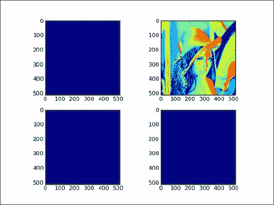
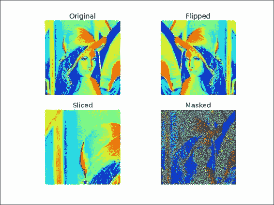
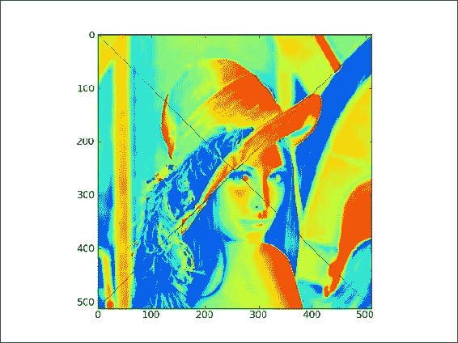
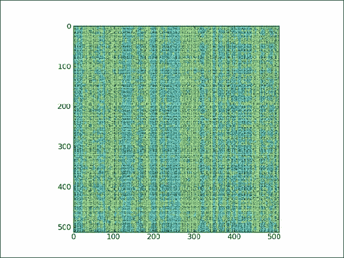
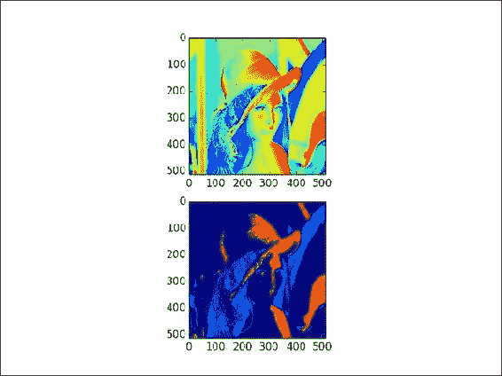
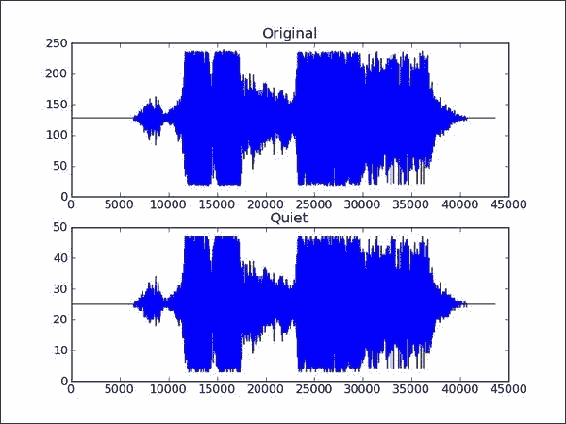

# 第 2 章。高级索引和数组概念

在本章中，我们将介绍以下秘籍：

*   安装 SciPy
*   安装 PIL
*   调整图像大小
*   比较视图和副本
*   翻转莉娜
*   花式索引
*   用位置列表编制索引
*   用布尔值建立索引
*   数独的大招
*   广播阵列

# 简介

NumPy 以  其高效的数组而闻名。 之所以成名，部分原因是索引容易。 我们将演示使用图像的高级索引技巧。 在深入研究索引之前，我们将安装必要的软件-SciPy 和 PIL。 如果您认为有此需要，请参阅第 1 章“使用 IPython”的“安装 matplotlib”秘籍。

在本章和其他章中，我们将使用以下导入：

```py
import numpy as np 
import matplotlib.pyplot as plt
import scipy
```

我们还将尽可能为`print()` Python 函数使用最新的语法。

### 注意

Python 2 是仍然很流行的主要 Python 版本，但与 Python 3 不兼容。Python2 直到 2020 年才正式受支持。主要区别之一是`print()`函数的语法。 本书使用的代码尽可能与 Python 2 和 Python 3 兼容。

本章中的一些示例涉及图像处理。 为此，我们将需要 **Python 图像库**（**PIL**），但不要担心； 必要时会在本章中提供帮助您安装 PIL 和其他必要 Python 软件的说明和指示。

# 安装 SciPy

SciPy 是科学的  Python 库，与 NumPy 密切相关。 实际上，SciPy 和 NumPy 在很多年前曾经是同一项目。 就像 NumPy 一样，SciPy 是一个开放源代码项目，已获得 BSD 许可。 在此秘籍中，我们将安装 SciPy。 SciPy 提供高级功能，包括统计，信号处理，线性代数，优化，FFT，ODE 求解器，插值，特殊功能和积分。 NumPy 有一些重叠，但是 NumPy 主要提供数组功能。

## 准备

在第 1 章，“使用 IPython”中，我们讨论了如何安装`setuptools`和`pip`。 如有必要，请重新阅读秘籍。

## 如何执行...

在此秘籍中，我们将完成安装 SciPy 的步骤：

*   **Installing from source**: If you have Git installed, you can clone the SciPy repository using the following command:

    ```py
    $ git clone https://github.com/scipy/scipy.git

    $ python setup.py build
    $ python setup.py install --user

    ```

    这会将 SciPy 安装到您的主目录。 它需要 Python 2.6 或更高版本。

    在构建之前，您还需要安装 SciPy 依赖的以下软件包：

    *   `BLAS`和`LAPACK`库
    *   C 和 Fortran 编译器

    您可能已经在  NumPy 安装过程中安装了此软件。

*   **在 Linux 上安装 SciPy** ：大多数 Linux 发行版都包含 SciPy 软件包。 我们将通过  来完成一些流行的 Linux 发行版中的  的必要步骤（您可能需要以 root 用户身份登录或具有 sudo 特权）：
    *   为了在 Red Hat，Fedora 和 CentOS 上安装 SciPy，请从命令行运行以下指令：

        ```py
        $ yum install python-scipy

        ```

    *   为了在 Mandriva 上安装 SciPy，请运行以下命令行指令：

        ```py
        $ urpmi python-scipy

        ```

    *   为了在 Gentoo 上安装 SciPy，请运行以下命令行指令：

        ```py
        $ sudo emerge scipy

        ```

    *   在 Debian 或 Ubuntu 上，我们需要输入以下指令：

        ```py
        $ sudo apt-get install python-scipy

        ```

*   **Installing SciPy on Mac OS X**: Apple Developer Tools (XCode) is required because it contains the `BLAS` and `LAPACK` libraries. It can be found either in the App Store or in the installation DVD that came with your Mac; or you can get the latest version from the Apple Developer's connection website at [https://developer.apple.com/xcode/](https://developer.apple.com/xcode/). Make sure that everything, including all the optional packages, is installed.

    您可能已经为 NumPy 安装了 Fortran 编译器。 `gfortran`的二进制文件可以在[这个链接](http://r.research.att.com/tools/)中找到。

*   **使用**`easy_install`**或**`pip`安装 SciPy：您可以使用以下两个命令中的任何一个来安装 SciPy（`sudo`的需要取决于特权）：

    ```py
    $ [sudo] pip install scipy
    $ [sudo] easy_install scipy

    ```** 
*   **在 Windows 上安装**：如果已经安装 Python，则首选方法是  下载并使用二进制发行版。 或者，您可以安装 Anaconda 或 Enthought Python 发行版，该发行版与其他科学 Python 软件包一起提供。
*   **Check your installation**: Check the SciPy installation with the following code:

    ```py
    import scipy
    print(scipy.__version__)
    print(scipy.__file__)
    ```

    这应该打印正确的 SciPy 版本。

## 工作原理...

大多数软件包管理器都会为您解决依赖项（如果有）。 但是，在某些情况下，您需要手动安装它们。 这超出了本书的范围。

## 另请参见

如果遇到问题，可以在以下位置寻求帮助：

*   `freenode`的`#scipy` IRC 频道
*   SciPy 邮件列表位于[，网址为 http://www.scipy.org/scipylib/mailing-lists.html](http://www.scipy.org/scipylib/mailing-lists.html)

# 安装 PIL

PIL（Python 映像库）是本章中进行图像处理的先决条件。 如果愿意，可以安装 Pillow，它是 PIL 的分支。 有些人喜欢 Pillow API； 但是，我们不会在本书中介绍其安装。

## 如何执行...

让我们看看如何安装 PIL：

*   **在 Windows 上安装 PIL**：[使用 Windows 中的 PIL 可执行文件安装 PIL](http://www.pythonware.com/products/pil/)。
*   **在 Debian 或 Ubuntu 上安装**：在  Debian 或 Ubuntu 上，使用以下命令安装 PIL：

    ```py
    $ sudo apt-get install python-imaging

    ```

*   **Installing with** `easy_install` **or** `pip`: At the time of writing this book, it appears that the package managers of Red Hat, Fedora, and CentOS do not have direct support for PIL. Therefore, follow this step if you are using one of these Linux distributions.

    使用以下任一命令安装  ：

    ```py
    $ easy_install PIL
    $ sudo pip install PIL

    ```

## 另请参见

*   可在[这里](http://pillow.readthedocs.org/en/latest/installation.html) 找到有关 PILLOW（PIL 的分支）的说明。

# 调整图像大小

在此秘籍中，我们  将把 Lena 的样本图像（在 SciPy 发行版中可用）加载到数组中。 顺便说一下，本章不是关于图像操作的。 我们将只使用图像数据作为输入。

### 注意

莉娜·索德伯格（Lena Soderberg）出现在 1972 年的《花花公子》杂志中。 由于历史原因，这些图像之一经常用于图像处理领域。 不用担心 该图像完全可以安全工作。

我们将使用`repeat()`函数调整图像大小。 此函数重复一个数组，这意味着在我们的用例中按一定的大小调整图像大小。

## 准备

此秘籍的前提条件是必须安装 SciPy，matplotlib 和 PIL。 看看本章和第 1 章，*与 IPython* 一起缠绕的相应秘籍。

## 如何执行...

通过以下步骤调整图像大小：

1.  First, import `SciPy`. SciPy has a `lena()` function. It is used to load the image into a NumPy array:

    ```py
    lena = scipy.misc.lena()

    ```

    从 0.10 版本开始发生了一些重构，因此，如果您使用的是旧版本，则正确的代码如下：

    ```py
    lena = scipy.lena()
    ```

2.  使用`numpy.testing`软件包中的`assert_equal()`函数检查 Lena 阵列的形状-这是可选的完整性检查测试：

    ```py
    np.testing.assert_equal((LENA_X, LENA_Y), lena.shape)
    ```

3.  使用`repeat()`函数调整 Lena 数组的大小。 我们在`x`和`y`方向上给此函数一个调整大小的因子：

    ```py
    resized = lena.repeat(yfactor, axis=0).repeat(xfactor, axis=1)
    ```

4.  We will plot the Lena image and the resized image in two subplots that are parts of the same grid. Plot the Lena array in a subplot using this code:

    ```py
    plt.subplot(211)
    plt.title("Lena")
    plt.axis("off")
    plt.imshow(lena)
    ```

    matplotlib `subplot()`函数创建一个子图。 此函数接受一个三位整数作为参数，其中第一位是行数，第二位是列数，最后一位是子图的索引，从 1 开始。`imshow()` 功能显示图像。 最后，`show()`函数显示最终结果。

    将调整大小后的数组绘制在另一个子图中并显示它。 索引现在为 2：

    ```py
    plt.subplot(212)
    plt.title("Resized")
    plt.axis("off")
    plt.imshow(resized)
    plt.show()
    ```

    以下屏幕截图显示了结果，以及原始图像（第一幅）和调整大小后的图像（第二幅）：

    

    以下是本书代码捆绑中`resize_lena.py`文件中该秘籍的  完整代码：

    ```py
    import scipy.misc
    import matplotlib.pyplot as plt
    import numpy as np

    # This script resizes the Lena image from Scipy.

    # Loads the Lena image into an array
    lena = scipy.misc.lena()

    #Lena's dimensions
    LENA_X = 512
    LENA_Y = 512

    #Check the shape of the Lena array
    np.testing.assert_equal((LENA_X, LENA_Y), lena.shape)

    # Set the resize factors
    yfactor = 2
    xfactor = 3

    # Resize the Lena array
    resized = lena.repeat(yfactor, axis=0).repeat(xfactor, axis=1)

    #Check the shape of the resized array
    np.testing.assert_equal((yfactor * LENA_Y, xfactor * LENA_Y), resized.shape)

    # Plot the Lena array
    plt.subplot(211)
    plt.title("Lena")
    plt.axis("off")
    plt.imshow(lena)

    #Plot the resized array
    plt.subplot(212)
    plt.title("Resized")
    plt.axis("off")
    plt.imshow(resized)
    plt.show()
    ```

## 工作原理...

`repeat()`函数  重复数组，在这种情况下，这会导致原始图像的大小改变。 `subplot()` matplotlib 函数创建一个子图。 `imshow()`函数显示图像。 最后，`show()`函数显示最终结果。

## 另请参见

*   第 1 章“使用 IPython”中的“安装 matplotlib”
*   本章中的“安装 SciPy”
*   本章中的“安装 PIL”
*   [这个页面](http://docs.scipy.org/doc/numpy/reference/generated/numpy.repeat.html)中介绍了`repeat()`函数。

# 创建视图和副本

了解何时处理共享数组视图以及何时  具有数组数据的副本，这一点很重要。 例如，切片将创建一个视图。 这意味着，如果您将切片分配给变量，然后更改基础数组，则此变量的值将更改。 我们将根据著名的 Lena 图像创建一个数组，复制该数组，创建一个视图，最后修改视图。

## 准备

前提条件与先前的秘籍相同。

## 如何执行...

让我们创建 Lena 数组的副本和视图：

1.  创建 Lena 数组的副本：

    ```py
    acopy = lena.copy()

    ```

2.  创建阵列的视图：

    ```py
    aview = lena.view()

    ```

3.  Set all the values of the view to `0` with a `flat` iterator:

    ```py
    aview.flat = 0

    ```

    最终结果是只有一个图像（与副本相关的图像）显示了花花公子模型。 其他图像完全消失：

    

    以下  是本教程的代码，显示了本书代码捆绑中`copy_view.py`文件中数组视图和副本的  行为：

    ```py
    import scipy.misc
    import matplotlib.pyplot as plt

    lena = scipy.misc.lena()
    acopy = lena.copy()
    aview = lena.view()

    # Plot the Lena array
    plt.subplot(221)
    plt.imshow(lena)

    #Plot the copy
    plt.subplot(222)
    plt.imshow(acopy)

    #Plot the view
    plt.subplot(223)
    plt.imshow(aview)

    # Plot the view after changes
    aview.flat = 0
    plt.subplot(224)
    plt.imshow(aview)

    plt.show()
    ```

## 工作原理...

如您所见，通过  在程序结尾处更改视图，我们更改了  原始 Lena 数组。 这样就产生了三张蓝色（如果您正在查看黑白图像，则为空白）图像-复制的阵列不受影响。 重要的是要记住，视图不是只读的。

## 另请参见

*   NumPy `view()`函数的文档位于[这里](http://docs.scipy.org/doc/numpy/reference/generated/numpy.ndarray.view.html)

# 翻转莉娜

我们将翻转  SciPy Lena 图像-当然，所有这些都是以科学的名义，或者至少是作为演示。 除了翻转图像，我们还将对其进行切片并对其应用蒙版。

## 如何执行...

步骤如下：

1.  使用以下代码围绕垂直轴翻转 Lena 数组：

    ```py
    plt.imshow(lena[:,::-1])

    ```

2.  从图像中切出一部分并将其绘制出来。 在这一步中，我们将看一下 Lena 阵列的形状。 该形状是表示数组大小的元组。 以下代码有效地选择了花花公子图片的左上象限：

    ```py
    plt.imshow(lena[:lena.shape[0]/2,:lena.shape[1]/2])

    ```

3.  Apply a mask to the image by finding all the values in the Lena array that are even (this is just arbitrary for demo purposes). Copy the array and change the even values to `0`. This has the effect of putting lots of blue dots on the image (dark spots if you are looking at a black-and-white image):

    ```py
    mask = lena % 2 == 0
    masked_lena = lena.copy()
    masked_lena[mask] = 0

    ```

    所有这些  工作都会产生 2 x 2 的图像网格，如以下屏幕截图所示：

    

    这是本书代码捆绑中`flip_lena.py`文件中此秘籍的完整代码：

    ```py
    import scipy.misc
    import matplotlib.pyplot as plt

    # Load the Lena array
    lena = scipy.misc.lena()

    # Plot the Lena array
    plt.subplot(221)
    plt.title('Original')
    plt.axis('off')
    plt.imshow(lena)

    #Plot the flipped array
    plt.subplot(222)
    plt.title('Flipped')
    plt.axis('off')
    plt.imshow(lena[:,::-1])

    #Plot a slice array
    plt.subplot(223)
    plt.title('Sliced')
    plt.axis('off')
    plt.imshow(lena[:lena.shape[0]/2,:lena.shape[1]/2])

    # Apply a mask
    mask = lena % 2 == 0
    masked_lena = lena.copy()
    masked_lena[mask] = 0
    plt.subplot(224)
    plt.title('Masked')
    plt.axis('off')
    plt.imshow(masked_lena)

    plt.show()
    ```

## 另请参见

*   第 1 章“使用 IPython”中的“安装 matplotlib”
*   本章中的“安装 SciPy”
*   本章中的“安装 PIL”

# 花式索引

在本教程中，我们将应用  奇特索引将 Lena 图像的对角线值设置为 0。这将沿着对角线绘制黑线并交叉，这不是因为图像有问题，而仅仅是 作为练习。 花式索引是不涉及整数或切片的索引； 这是正常的索引编制。

## 如何执行...

我们将从第一个对角线开始：

1.  Set the values of the first diagonal to `0`.

    要将对角线值设置为`0`，我们需要为`x`和`y`值定义两个不同的范围：

    ```py
    lena[range(xmax), range(ymax)] = 0

    ```

2.  Set the values of the other diagonal to `0`.

    要设置另一个对角线的值，我们需要一组不同的范围，但是原理保持不变：

    ```py
    lena[range(xmax-1,-1,-1), range(ymax)] = 0

    ```

    最后，我们得到带有对角线标记的图像，如以下屏幕截图所示：

    

    以下  是本书代码集中`fancy.py`文件中该秘籍的完整代码：

    ```py
    import scipy.misc
    import matplotlib.pyplot as plt

    # This script demonstrates fancy indexing by setting values
    # on the diagonals to 0.

    # Load the Lena array
    lena = scipy.misc.lena()
    xmax = lena.shape[0]
    ymax = lena.shape[1]

    # Fancy indexing
    # Set values on diagonal to 0
    # x 0-xmax
    # y 0-ymax
    lena[range(xmax), range(ymax)] = 0

    # Set values on other diagonal to 0
    # x xmax-0
    # y 0-ymax
    lena[range(xmax-1,-1,-1), range(ymax)] = 0

    # Plot Lena with diagonal lines set to 0
    plt.imshow(lena)
    plt.show()
    ```

## 工作原理...

我们为`x`值和`y`值定义了单独的范围。 这些范围用于索引 Lena 数组。 花式  索引是基于内部 NumPy 迭代器对象执行的。 执行以下步骤：

1.  创建迭代器对象。
2.  迭代器对象绑定到数组。
3.  数组元素通过迭代器访问。

## 另请参见

*   [花式索引的实现文档](http://docs.scipy.org/doc/numpy-dev/reference/internals.code-explanations.html#fancy-indexing-check)

# 索引位置列表

让我们  使用`ix_()`函数来随机播放 Lena 图像。 此函数根据多个序列创建网格。

## 如何执行...

我们将从随机改组数组索引开始：

1.  使用`numpy.random`模块的`shuffle()`函数创建随机索引数组：

    ```py
    def shuffle_indices(size):
       arr = np.arange(size)
       np.random.shuffle(arr)

       return arr
    ```

2.  Plot the shuffled indices:

    ```py
    plt.imshow(lena[np.ix_(xindices, yindices)])

    ```

    我们得到的是一张完全打乱的 Lena 图像，如以下屏幕截图所示：

    

    这是本书代码捆绑中`ix.py`文件中秘籍的  完整代码：

    ```py
    import scipy.misc
    import matplotlib.pyplot as plt
    import numpy as np

    # Load the Lena array
    lena = scipy.misc.lena()
    xmax = lena.shape[0]
    ymax = lena.shape[1]

    def shuffle_indices(size):
       '''
       Shuffles an array with values 0 - size
       '''
       arr = np.arange(size)
       np.random.shuffle(arr)

       return arr

    xindices = shuffle_indices(xmax)
    np.testing.assert_equal(len(xindices), xmax)
    yindices = shuffle_indices(ymax)
    np.testing.assert_equal(len(yindices), ymax)

    # Plot Lena
    plt.imshow(lena[np.ix_(xindices, yindices)])
    plt.show()
    ```

## 另请参见

*   `ix_()`函数的  文档页面  ，位于[，http：//docs.scipy.org/doc/numpy/reference/generation/numpy.ix_.html](http://docs.scipy.org/doc/numpy/reference/generated/numpy.ix_.html)

# 使用布尔值建立索引

布尔索引是基于布尔数组的索引  ，属于奇特索引的类别。

## 如何执行...

我们将这种索引技术应用于图像：

1.  Image with dots on the diagonal.

    这在某种程度上类似于本章中的“花式索引”秘籍。 这次，我们在图像的对角线上选择模`4`：

    ```py
    def get_indices(size):
       arr = np.arange(size)
       return arr % 4 == 0
    ```

    然后，我们只需应用此选择并绘制点：

    ```py
    lena1 = lena.copy() 
    xindices = get_indices(lena.shape[0])
    yindices = get_indices(lena.shape[1])
    lena1[xindices, yindices] = 0
    plt.subplot(211)
    plt.imshow(lena1)
    ```

2.  Select the array values between quarter and three quarters of the maximum value, and set them to `0`:

    ```py
    lena2[(lena > lena.max()/4) & (lena < 3 * lena.max()/4)] = 0
    ```

    带有两个新图像的图看起来类似于以下屏幕截图所示：

    

    这是本书代码捆绑中`boolean_indexing.py`文件中该秘籍的  完整代码：

    ```py
    import scipy.misc
    import matplotlib.pyplot as plt
    import numpy as np

    # Load the Lena array
    lena = scipy.misc.lena()

    def get_indices(size):
       arr = np.arange(size)
       return arr % 4 == 0

    # Plot Lena
    lena1 = lena.copy() 
    xindices = get_indices(lena.shape[0])
    yindices = get_indices(lena.shape[1])
    lena1[xindices, yindices] = 0
    plt.subplot(211)
    plt.imshow(lena1)

    lena2 = lena.copy() 
    # Between quarter and 3 quarters of the max value
    lena2[(lena > lena.max()/4) & (lena < 3 * lena.max()/4)] = 0
    plt.subplot(212)
    plt.imshow(lena2)

    plt.show()
    ```

## 工作原理...

由于使用  布尔值进行索引是一种奇特的索引，因此它的工作方式基本相同。 这意味着索引是在特殊的迭代器对象的帮助下发生的。

## 另请参见

*   “花式索引”

# 数独大步技巧

`ndarray` 类具有`strides`字段，它是一个元组，指示通过数组时要在每个维中步进的字节数。 让我们对将数独谜题拆分为 3 x 3 正方形的问题应用一些大步技巧。

### 注意

对 Sudoku 的规则进行解释超出了本书的范围。 简而言之，数独谜题由 3 x 3 的正方形组成。 这些正方形均包含九个数字。 有关更多信息，请参见[这里](http://en.wikipedia.org/wiki/Sudoku)。

## 如何执行...

应用如下的跨步技巧：

1.  让我们定义`sudoku`数组。 此数组充满了一个实际的已解决的数独难题的内容：

    ```py
    sudoku = np.array([
        [2, 8, 7, 1, 6, 5, 9, 4, 3],
        [9, 5, 4, 7, 3, 2, 1, 6, 8],
        [6, 1, 3, 8, 4, 9, 7, 5, 2],
        [8, 7, 9, 6, 5, 1, 2, 3, 4],
        [4, 2, 1, 3, 9, 8, 6, 7, 5],
        [3, 6, 5, 4, 2, 7, 8, 9, 1],
        [1, 9, 8, 5, 7, 3, 4, 2, 6],
        [5, 4, 2, 9, 1, 6, 3, 8, 7],
        [7, 3, 6, 2, 8, 4, 5, 1, 9]
        ])
    ```

2.  `ndarray`的`itemsize`字段为我们提供了数组中的字节数。 给定`itemsize`，请计算步幅：

    ```py
    strides = sudoku.itemsize * np.array([27, 3, 9, 1])
    ```

3.  Now we can split the puzzle into squares with the `as_strided()` function of the `np.lib.stride_tricks` module:

    ```py
    squares = np.lib.stride_tricks.as_strided(sudoku, shape=shape, strides=strides)
    print(squares)
    ```

    该代码打印单独的 Sudoku 正方形，如下所示：

    ```py
    [[[[2 8 7]
        [9 5 4]
        [6 1 3]]

      [[1 6 5]
        [7 3 2]
        [8 4 9]]

      [[9 4 3]
        [1 6 8]
        [7 5 2]]]

     [[[8 7 9]
        [4 2 1]
        [3 6 5]]

      [[6 5 1]
        [3 9 8]
        [4 2 7]]

      [[2 3 4]
        [6 7 5]
        [8 9 1]]]

     [[[1 9 8]
        [5 4 2]
        [7 3 6]]

      [[5 7 3]
        [9 1 6]
        [2 8 4]]

      [[4 2 6]
        [3 8 7]
        [5 1 9]]]]
    ```

    以下是本书代码包中`strides.py`文件中此秘籍的完整源代码：

    ```py
    import numpy as np

    sudoku = np.array([
       [2, 8, 7, 1, 6, 5, 9, 4, 3],
       [9, 5, 4, 7, 3, 2, 1, 6, 8],
       [6, 1, 3, 8, 4, 9, 7, 5, 2],
       [8, 7, 9, 6, 5, 1, 2, 3, 4],
       [4, 2, 1, 3, 9, 8, 6, 7, 5],
       [3, 6, 5, 4, 2, 7, 8, 9, 1],
       [1, 9, 8, 5, 7, 3, 4, 2, 6],
       [5, 4, 2, 9, 1, 6, 3, 8, 7],
       [7, 3, 6, 2, 8, 4, 5, 1, 9]
       ])

    shape = (3, 3, 3, 3)

    strides = sudoku.itemsize * np.array([27, 3, 9, 1])

    squares = np.lib.stride_tricks.as_strided(sudoku, shape=shape, strides=strides)
    print(squares)
    ```

## 工作原理...

我们应用了大步  技巧，将数独谜题拆分为 3 x 3 的正方形。 步幅告诉我们通过 Sudoku 数组时每一步需要跳过的字节数。

## 另请参见

*   `strides`属性的文档在[这里](http://docs.scipy.org/doc/numpy/reference/generated/numpy.ndarray.strides.html)

# 广播阵列

在不知道  的情况下，您可能已经广播了阵列。 简而言之，即使操作数的形状不同，NumPy 也会尝试执行操作。 在此秘籍中，我们将一个数组和一个标量相乘。 标量被扩展为数组操作数的形状，然后执行乘法。 我们将下载一个音频文件并制作一个更安静的新版本。

## 如何执行...

让我们从读取 WAV 文件开始：

1.  我们将使用标准的 Python 代码下载 Austin Powers 的音频文件。 SciPy 具有 WAV 文件模块，可让您加载声音数据或生成 WAV 文件。 如果已安装 SciPy，则我们应该已经有此模块。 `read()`函数返回`data`数组和采样率。 在此示例中，我们仅关心数据：

    ```py
    sample_rate, data = scipy.io.wavfile.read(WAV_FILE)
    ```

2.  使用 matplotlib 绘制原始 WAV 数据。 将子图命名为`Original`：

    ```py
    plt.subplot(2, 1, 1)
    plt.title("Original")
    plt.plot(data)
    ```

3.  现在，我们将使用 NumPy 制作更安静的音频样本。 这只是通过与常量相乘来创建具有较小值的新数组的问题。 这就是广播魔术发生的地方。 最后，由于 WAV 格式，我们需要确保与原始数组具有相同的数据类型：

    ```py
    newdata = data * 0.2
    newdata = newdata.astype(np.uint8)
    ```

4.  可以将新数组写入新的 WAV 文件，如下所示：

    ```py
    scipy.io.wavfile.write("quiet.wav",
        sample_rate, newdata)
    ```

5.  Plot the new data array with matplotlib:

    ```py
    plt.subplot(2, 1, 2)
    plt.title("Quiet")
    plt.plot(newdata)

    plt.show()
    ```

    结果是原始 WAV 文件数据和具有较小值的新数组的图，如以下屏幕快照所示：

    

    这是本书代码捆绑中`broadcasting.py`文件中该秘籍的  完整代码：

    ```py
    import scipy.io.wavfile
    import matplotlib.pyplot as plt
    import urllib2
    import numpy as np

    # Download audio file
    response = urllib2.urlopen('http://www.thesoundarchive.com/austinpowers/smashingbaby.wav')
    print(response.info())
    WAV_FILE = 'smashingbaby.wav'
    filehandle = open(WAV_FILE, 'w')
    filehandle.write(response.read())
    filehandle.close()
    sample_rate, data = scipy.io.wavfile.read(WAV_FILE)
    print("Data type", data.dtype, "Shape", data.shape)

    # Plot values original audio
    plt.subplot(2, 1, 1)
    plt.title("Original")
    plt.plot(data)

    # Create quieter audio
    newdata = data * 0.2
    newdata = newdata.astype(np.uint8)
    print("Data type", newdata.dtype, "Shape", newdata.shape)

    # Save quieter audio file
    scipy.io.wavfile.write("quiet.wav",
        sample_rate, newdata)

    # Plot values quieter file
    plt.subplot(2, 1, 2)
    plt.title("Quiet")
    plt.plot(newdata)

    plt.show()
    ```

## 另请参见

以下链接提供了更多背景信息：

*   [`scipy.io.read()`函数](http://docs.scipy.org/doc/scipy/reference/generated/scipy.io.wavfile.read.html)
*   [`scipy.io.write()`函数](http://docs.scipy.org/doc/scipy/reference/generated/scipy.io.wavfile.write.html)
*   在[这个链接](http://docs.scipy.org/doc/numpy/user/basics.broadcasting.html)中解释了广播概念。