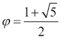
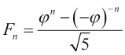
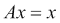
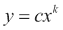
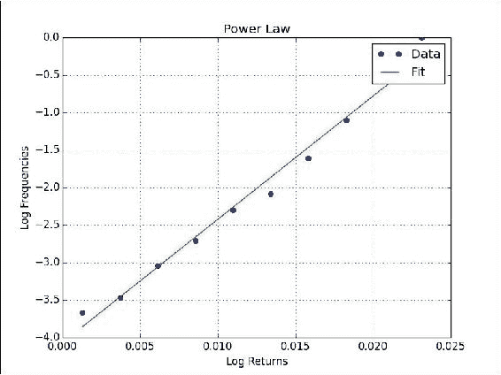
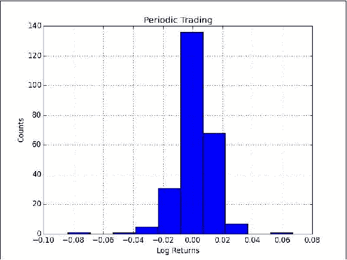
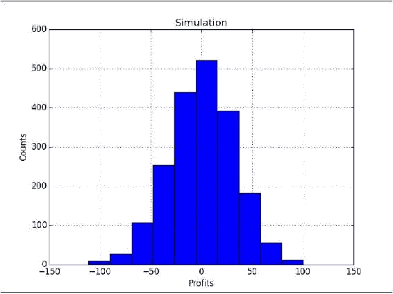

# 三、掌握常用函数

在本章中，我们将介绍许多常用函数：

*   `sqrt()`，`log()`，`arange()`，`astype()`和`sum()`
*   `ceil()`，`modf()`，`where()`，`ravel()`和`take()`
*   `sort()`和`outer()`
*   `diff()`，`sign()`和`eig()`
*   `histogram()`和`polyfit()`
*   `compress()`和`randint()`

我们将在以下秘籍中讨论这些功能：

*   斐波纳契数求和
*   寻找主要因素
*   查找回文数
*   稳态向量
*   发现幂律
*   定期逢低交易
*   随机模拟交易
*   用 Eratosthenes 筛子来筛选质数

# 简介

本章介绍常用的 NumPy 函数。 这些是您每天将要使用的功能。 显然，用法可能与您不同。 NumPy 函数太多，以至于几乎不可能全部了解，但是本章中的函数是我们应该熟悉的最低要求。

# 汇总斐波纳契数

在此秘籍中，我们将求和值不超过 400 万的斐波纳契数列中的偶数项。**斐波那契数列**是从零开始的整数序列，其中每个数字都是前两个数字的和，但（当然）前两个数字除外 ，零和一（0、1、1、2、3、5、8、13、21、34、55、89 ...）。

该序列由斐波那契（Fibonacci）在 1202 年发布，最初不包含零。 实际上，早在几个世纪以前，印度数学家就已经知道了它。 斐波那契数在数学，计算机科学和生物学中都有应用。

### 注意

有关更多信息，请阅读 Wikipedia 关于[斐波那契数字](http://en.wikipedia.org/wiki/Fibonacci_number)的文章。

该秘籍使用基于**黄金比例**的公式，这是一个无理数，具有与`pi`相当的特殊性质。 黄金比例由以下公式给出：



我们将使用`sqrt()`，`log()`，`arange()`，`astype()`和`sum()`函数。 斐波那契数列的递归关系具有以下解，涉及黄金比率：



## 操作步骤

以下是本书代码包中`sum_fibonacci.py`文件中此秘籍的完整代码：

```py
import numpy as np

#Each new term in the Fibonacci sequence is generated by adding the previous two terms.
#By starting with 1 and 2, the first 10 terms will be:

#1, 2, 3, 5, 8, 13, 21, 34, 55, 89, ...

#By considering the terms in the Fibonacci sequence whose values do not exceed four million,
#find the sum of the even-valued terms.

#1\. Calculate phi
phi = (1 + np.sqrt(5))/2
print("Phi", phi)

#2\. Find the index below 4 million
n = np.log(4 * 10 ** 6 * np.sqrt(5) + 0.5)/np.log(phi)
print(n)

#3\. Create an array of 1-n
n = np.arange(1, n)
print(n)

#4\. Compute Fibonacci numbers
fib = (phi**n - (-1/phi)**n)/np.sqrt(5)
print("First 9 Fibonacci Numbers", fib[:9])

#5\. Convert to integers
# optional
fib = fib.astype(int)
print("Integers", fib)

#6\. Select even-valued terms
eventerms = fib[fib % 2 == 0]
print(eventerms)

#7\. Sum the selected terms
print(eventerms.sum())
```

的第一件事是计算[黄金分割率](http://en.wikipedia.org/wiki/Golden_ratio)，也称为**黄金分割**或黄金平均值。

1.  Use the `sqrt()` function to calculate the square root of `5`:

    ```py
    phi = (1 + np.sqrt(5))/2
    print("Phi", phi)

    ```

    这印出了中庸之道：

    ```py
    Phi 1.61803398875

    ```

2.  Next, in the recipe, we need to find the index of the Fibonacci number below 4 million. A formula for this is given in the Wikipedia page, and we will compute it using that formula. All we need to do is convert log bases with the `log()` function. We don't need to round the result down to the closest integer. This is automatically done for us in the next step of the recipe:

    ```py
    n = np.log(4 * 10 ** 6 * np.sqrt(5) + 0.5)/np.log(phi)
    print(n)

    ```

    `n`的值如下：

    ```py
    33.2629480359

    ```

3.  `arange()`函数是许多人都知道的非常基本的功能。 不过，出于完整性考虑，我们将在这里提及：

    ```py
    n = np.arange(1, n)

    ```

4.  There is a convenient formula we can use to calculate the Fibonacci numbers. We will need the golden ratio and the array from the previous step in this recipe as input parameters. Print the first nine Fibonacci numbers to check the result:

    ```py
    fib = (phi**n - (-1/phi)**n)/np.sqrt(5)
    print("First 9 Fibonacci Numbers", fib[:9])

    ```

    ### 注意

    我本可以进行单元测试而不是打印声明。 单元测试是测试一小段代码（例如功能）的测试。 秘籍的这种变化是您的练习。

    ### 提示

    查看第 8 章，“质量保证”，以获取有关如何编写单元测试的指针。

    顺便说一下，我们不是从数字 0 开始的。 上面的代码给了我们一系列预期的结果：

    ```py
    First 9 Fibonacci Numbers [  1\.   1\.   2\.   3\.   5\.   8\.  13\.  21\.  34.]

    ```

    您可以根据需要将此权限插入单元测试。

5.  Convert to integers.

    此步骤是可选的。 我认为最后有一个整数结果是很好的。 好的，我实际上想向您展示`astype()`函数：

    ```py
    fib = fib.astype(int)
    print("Integers", fib)

    ```

    为简短起见，此代码为我们提供了以下结果：

    ```py
    Integers [      1       1       2       3       5       8      13      21      34
     ... snip ... snip ...
     317811  514229  832040 1346269 2178309 3524578]

    ```

6.  Select the even-valued terms.

    此秘籍要求我们现在选择偶数项。 如果遵循第 2 章，“高级索引和数组概念”中的“布尔值索引”秘籍，这对您来说应该很容易 ：

    ```py
    eventerms = fib[fib % 2 == 0]
    print(eventerms)

    ```

    我们去了：

    ```py
    [      2       8      34     144     610    2584   10946   46368  196418  832040 3524578]

    ```

## 工作原理

在此秘籍中，我们使用了`sqrt()`，`log()`，`arange()`，`astype()`和`sum()`函数。 其描述如下：

| 函数 | 描述 |
| --- | --- |
| `sqrt()` | [此函数计算数组元素的平方根](http://docs.scipy.org/doc/numpy/reference/generated/numpy.sqrt.html) |
| `log()` | [此函数计算数组元素的自然对数](http://docs.scipy.org/doc/numpy/reference/generated/numpy.log.html#numpy.log) |
| `arange()` | [此函数创建具有指定范围的数组](http://docs.scipy.org/doc/numpy/reference/generated/numpy.arange.html) |
| `astype()` | [此函数将数组元素转换为指定的数据类型](http://docs.scipy.org/doc/numpy/reference/generated/numpy.chararray.astype.html) |
| `sum()` | [此函数计算数组元素的总和](http://docs.scipy.org/doc/numpy/reference/generated/numpy.sum.html) |

## 另见

*   第 2 章，“高级索引和数组概念”中的“布尔值索引”秘籍

# 寻找主要因素

[**素因数**](http://en.wikipedia.org/wiki/Prime_factor)是质数，它们精确地除以整数而不会留下余数。 对于较大的数字，找到主要因子似乎几乎是不可能的。 因此，主要因素在密码学中具有应用。 但是，使用正确的算法 -- [Fermat 因式分解方法](http://en.wikipedia.org/wiki/Fermat%27s_factorization_method)和 NumPy -- 对于小数而言，因式分解变得相对容易。 想法是将`N`分解为两个数字，`c`和`d`，根据以下等式：


我们可以递归应用因式分解，直到获得所需的素因子。

## 操作步骤

以下是解决找到最大质数因子 600851475143 的问题所需的全部代码（请参见本书代码包中的`fermatfactor.py`文件）：

```py
from __future__ import print_function
import numpy as np

#The prime factors of 13195 are 5, 7, 13 and 29.

#What is the largest prime factor of the number 600851475143 ?

N = 600851475143
LIM = 10 ** 6

def factor(n):
   #1\. Create array of trial values
   a = np.ceil(np.sqrt(n))
   lim = min(n, LIM)
   a = np.arange(a, a + lim)
   b2 = a ** 2 - n

   #2\. Check whether b is a square
   fractions = np.modf(np.sqrt(b2))[0]

   #3\. Find 0 fractions
   indices = np.where(fractions == 0)

   #4\. Find the first occurrence of a 0 fraction
   a = np.ravel(np.take(a, indices))[0]
              # Or a = a[indices][0]

   a = int(a)
   b = np.sqrt(a ** 2 - n) 
   b = int(b)
   c = a + b
   d = a - b

   if c == 1 or d == 1:
      return

   print(c, d)
   factor(c)
   factor(d)

factor(N)
```

该算法要求我们为`a`尝试一些试验值：

1.  Create an array of trial values.

    创建一个 NumPy 数组并消除循环需求是有意义的。 但是，应注意不要创建一个在内存需求方面太大的数组。 在我的系统上，一百万个元素的数组似乎正好合适：

    ```py
    a = np.ceil(np.sqrt(n))
    lim = min(n, LIM)
    a = np.arange(a, a + lim)
    b2 = a ** 2 - n
    ```

    我们使用`ceil()`函数以元素为单位返回输入的上限。

2.  Get the fractional part of the `b` array.

    现在我们应该检查`b`是否为正方形。 使用 NumPy `modf()`函数获取`b`数组的分数部分：

    ```py
    fractions = np.modf(np.sqrt(b2))[0]
    ```

3.  Find `0` fractions.

    调用`where()` NumPy 函数以找到零分数的索引，其中小数部分是`0`：

    ```py
    indices = np.where(fractions == 0)
    ```

4.  Find the first occurrence of a zero fraction.

    首先，使用上一步中的`indices`数组调用`take()` NumPy 函数，以获取零分数的值。 现在，使用`ravel()` NumPy 函数将这个数组变得扁平：

    ```py
    a = np.ravel(np.take(a, indices))[0]
    ```

    ### 提示

    这条线有些令人费解，但是确实演示了两个有用的功能。 写`a = a[indices][0]`会更简单。

    此代码的输出如下：

    ```py
    1234169 486847
    1471 839
    6857 71

    ```

## 工作原理

我们使用`ceil()`，`modf()`，`where()`，`ravel()`和`take()` NumPy 函数递归地应用了费马分解。 这些功能的说明如下：

| 函数 | 描述 |
| --- | --- |
| `ceil()` | [计算数组元素的上限](http://docs.scipy.org/doc/numpy/reference/generated/numpy.ceil.html) |
| `modf()` | [返回浮点数数字的分数和整数部分](http://docs.scipy.org/doc/numpy/reference/generated/numpy.modf.html) |
| `where()` | [根据条件返回数组索引](http://docs.scipy.org/doc/numpy/reference/generated/numpy.where.html) |
| `ravel()` | [返回一个扁平数组](http://docs.scipy.org/doc/numpy/reference/generated/numpy.ravel.html) |
| `take()` | [从数组中获取元素](http://docs.scipy.org/doc/numpy/reference/generated/numpy.take.html) |

# 查找回文数

回文数字在两种方式下的读取相同。 由两个 2 位数字的乘积组成的最大回文为`9009 = 91 x 99`。让我们尝试查找由两个 3 位数字的乘积组成的最大回文。

## 操作步骤

以下是本书代码包中`palindromic.py`文件的完整程序：

```py
import numpy as np

#A palindromic number reads the same both ways. 
#The largest palindrome made from the product of two 2-digit numbers is 9009 = 91 x 99.

#Find the largest palindrome made from the product of two 3-digit numbers.

#1\. Create  3-digits numbers array
a = np.arange(100, 1000)
np.testing.assert_equal(100, a[0])
np.testing.assert_equal(999, a[-1])

#2\. Create products array
numbers = np.outer(a, a)
numbers = np.ravel(numbers)
numbers.sort()
np.testing.assert_equal(810000, len(numbers))
np.testing.assert_equal(10000, numbers[0])
np.testing.assert_equal(998001, numbers[-1])

#3\. Find largest palindromic number
for number in numbers[::-1]:
   s = str(numbers[i])

   if s == s[::-1]:
      print(s)
      break
```

我们将使用最喜欢的 NumPy 函数`arange()`创建一个数组，以容纳从 100 到 999 的三位数。

1.  Create an array of three-digit numbers.

    使用`numpy.testing`包中的`assert_equal()`函数检查数组的第一个和最后一个元素：

    ```py
    a = np.arange(100, 1000)
    np.testing.assert_equal(100, a[0])
    np.testing.assert_equal(999, a[-1])
    ```

2.  Create the products array.

    现在，我们将创建一个数组，以将三位数数组的元素的所有可能乘积与其自身保持在一起。 我们可以使用`outer()`函数来完成此操作。 需要使用`ravel()`将生成的数组弄平，以便能够轻松地对其进行迭代。 在数组上调用`sort()`方法，以确保数组正确排序。 之后，我们可以进行一些检查：

    ```py
    numbers = np.outer(a, a)
    numbers = np.ravel(numbers)
    numbers.sort()
    np.testing.assert_equal(810000, len(numbers))
    np.testing.assert_equal(10000, numbers[0])
    np.testing.assert_equal(998001, numbers[-1])
    ```

该代码打印 906609，它是回文数。

## 工作原理

我们看到了`outer()`函数的作用。 此函数返回两个数组的[外部乘积](http://en.wikipedia.org/wiki/Outer_product)。 两个向量的外部乘积（一维数字列表）创建一个矩阵。 这与内部乘积相反，该乘积返回两个向量的标量数。 外部产品用于物理，信号处理和统计。 `sort()`函数返回数组的排序副本。

## 还有更多...

检查结果可能是一个好主意。 稍微修改一下代码，找出哪两个 3 位数字产生我们的回文码。 尝试以 NumPy 方式实现最后一步。

# 稳态向量

**马尔科夫链**是一个至少具有两个状态的系统。 有关马尔可夫链的详细信息，请参阅[这里](http://en.wikipedia.org/wiki/Markov_chain)。 时间`t`的状态取决于时间`t-1`的状态，仅取决于`t-1`的状态。 系统在这些状态之间随机切换。 链没有关于状态的任何记忆。 马尔可夫链通常用于对物理，化学，金融和计算机科学中的现象进行建模。 例如，Google 的 PageRank 算法使用马尔可夫链对网页进行排名。

我想为股票定义一个马尔可夫链。 假设状态为**震荡**，**上涨**和**下跌**的状态。 我们可以根据日末收盘价确定稳定状态。

在遥远的未来，或理论上经过无限长的时间之后，我们的马尔可夫链系统的状态将不再改变。 这称为[稳定状态](http://en.wikipedia.org/wiki/Steady_state)。 动态平衡是一种稳态。 对于股票而言，达到稳定状态可能意味着关联公司已变得稳定。 [**随机矩阵**](http://en.wikipedia.org/wiki/Stochastic_matrix)`A`包含状态转移概率，当应用于稳态时，它会产生相同的状态`x`。 为此的数学符号如下：



解决此问题的另一种方法是[特征值和特征向量](http://en.wikipedia.org/wiki/Eigenvalues_and_eigenvectors)。特征值和特征向量是线性代数的基本概念，并且在量子力学，机器学习和其他科学中应用。

## 操作步骤

以下是本书代码包中`steady_state_vector.py`文件中稳态矢量示例的完整代码：

```py
from __future__ import print_function
from matplotlib.finance import quotes_historical_yahoo
from datetime import date
import numpy as np

today = date.today()
start = (today.year - 1, today.month, today.day)

quotes = quotes_historical_yahoo('AAPL', start, today)
close =  [q[4] for q in quotes]

states = np.sign(np.diff(close))

NDIM = 3
SM = np.zeros((NDIM, NDIM))

signs = [-1, 0, 1]
k = 1

for i, signi in enumerate(signs):
   #we start the transition from the state with the specified sign
   start_indices = np.where(states[:-1] == signi)[0]

   N = len(start_indices) + k * NDIM

   # skip since there are no transitions possible
   if N == 0:
      continue

   #find the values of states at the end positions
   end_values = states[start_indices + 1]

   for j, signj in enumerate(signs):
      # number of occurrences of this transition 
      occurrences = len(end_values[end_values == signj])
      SM[i][j] = (occurrences + k)/float(N)

print(SM)
eig_out = np.linalg.eig(SM)
print(eig_out)

idx_vec = np.where(np.abs(eig_out[0] - 1) < 0.1)
print("Index eigenvalue 1", idx_vec)

x = eig_out[1][:,idx_vec].flatten()
print("Steady state vector", x)
print("Check", np.dot(SM, x))
```

现在我们需要获取数据：

1.  Obtain 1 year of data.

    一种实现方法是使用 matplotlib（请参阅第 1 章的“安装 matplotlib”秘籍，如有必要）。 我们将检索去年的数据。 这是执行此操作的代码：

    ```py
    today = date.today()
    start = (today.year - 1, today.month, today.day)
    quotes = quotes_historical_yahoo('AAPL', start, today)
    ```

2.  Select the close price.

    现在，我们有了 Yahoo 金融的历史数据。 数据表示为元组列表，但我们仅对收盘价感兴趣。

    元组中的第一个元素代表日期。 其次是开盘价，最高价，最低价和收盘价。 最后一个元素是音量。 我们可以选择以下收盘价：

    ```py
    close =  [q[4] for q in quotes]
    ```

    收盘价是每个元组中的第五个数字。 现在我们应该有大约 253 个收盘价的清单。

3.  Determine the states.

    我们可以通过使用`diff()` NumPy 函数减去连续天的价格来确定状态。 然后，通过差异的符号给出状态。 `sign()` NumPy 函数返回`-1`为负数，`1`为正数，否则返回`0`。

    ```py
    states = np.sign(np.diff(close))
    ```

4.  Initialize the stochastic matrix to `0` values.

    对于每个过渡，我们有三个可能的开始状态和三个可能的结束状态。 例如，如果我们从启动状态开始，则可以切换到：

    *   向上
    *   平面
    *   下

    使用`zeros()` NumPy 函数初始化随机矩阵：

    ```py
    NDIM = 3
    SM = np.zeros((NDIM, NDIM))
    ```

5.  For each sign, select the corresponding start state indices.

    现在，代码变得有些混乱。 我们将不得不使用实际的循环！ 我们将遍历所有可能的符号，并选择与每个符号相对应的开始状态索引。 使用`where()` NumPy 函数选择索引。 在这里，`k`是一个平滑常数，我们将在后面讨论：

    ```py
    signs = [-1, 0, 1]
    k = 1

    for i, signi in enumerate(signs):
       #we start the transition from the state with the specified sign
        start_indices = np.where(states[:-1] == signi)[0]
    ```

6.  Smoothing and the stochastic matrix.

    现在，我们可以计算每个过渡的出现次数。 将其除以给定开始状态的跃迁总数，就可以得出随机矩阵的跃迁概率。 顺便说一下，这不是最好的方法，因为它可能过度拟合。

    在现实生活中，我们可能有一天收盘价不会发生变化，尽管对于流动性股票市场来说这不太可能。 处理零出现的一种方法是[应用加法平滑](http://en.wikipedia.org/wiki/Additive_smoothing)。 这个想法是在我们发现的出现次数上增加一个常数，以消除零。 以下代码计算随机矩阵的值：

    ```py
    N = len(start_indices) + k * NDIM

    # skip since there are no transitions possible
    if N == 0:
        continue

    #find the values of states at the end positions
    end_values = states[start_indices + 1]

    for j, signj in enumerate(signs):
        # number of occurrences of this transition 
        occurrences = len(end_values[end_values == signj])
        SM[i][j] = (occurrences + k)/float(N)

    print(SM)
    ```

    前述代码所做的是基于出现次数和加性平滑计算每个可能过渡的过渡概率。 在其中一个测试运行中，我得到了以下矩阵：

    ```py
    [[ 0.5047619   0.00952381  0.48571429]
     [ 0.33333333  0.33333333  0.33333333]
     [ 0.33774834  0.00662252  0.65562914]]

    ```

7.  Eigenvalues and eigenvectors.

    要获得特征值和特征向量，我们将需要`linalg` NumPy 模块和`eig()`函数：

    ```py
    eig_out = numpy.linalg.eig(SM)
    print(eig_out)
    ```

    `eig()`函数返回一个包含特征值的数组和另一个包含特征向量的数组：

    ```py
    (array([ 1\.        ,  0.16709381,  0.32663057]), array([[  5.77350269e-01,   7.31108409e-01,   7.90138877e-04],
     [  5.77350269e-01,  -4.65117036e-01,  -9.99813147e-01],
     [  5.77350269e-01,  -4.99145907e-01,   1.93144030e-02]]))

    ```

8.  Select the eigenvector for eigenvalue 1.

    目前，我们只对特征值`1`的特征向量感兴趣。 实际上，特征值可能不完全是`1`，因此我们应该建立误差容限。 我们可以在`0.9`和`1.1`之间找到特征值的索引，如下所示：

    ```py
    idx_vec = np.where(np.abs(eig_out[0] - 1) < 0.1)
    print("Index eigenvalue 1", idx_vec)

    x = eig_out[1][:,idx_vec].flatten()
    ```

    此代码的其余输出如下：

    ```py
    Index eigenvalue 1 (array([0]),)
    Steady state vector [ 0.57735027  0.57735027  0.57735027]
    Check [ 0.57735027  0.57735027  0.57735027]

    ```

## 工作原理

我们获得的特征向量的值未标准化。 由于我们正在处理概率，因此它们应该合计为一个。 在此示例中介绍了`diff()`，`sign()`和`eig()`函数。 它们的描述如下：

| 函数 | 描述 |
| --- | --- |
| `diff()` | 计算离散差。 默认情况下是[一阶](http://docs.scipy.org/doc/numpy/reference/generated/numpy.diff.html)。 |
| `sign()` | [返回数组元素的符号](http://docs.scipy.org/doc/numpy/reference/generated/numpy.sign.html)。 |
| `eig()` | [返回数组的特征值和特征向量](http://docs.scipy.org/doc/numpy/reference/generated/numpy.linalg.eig.html)。 |

## 另见

*   第 1 章，“使用 IPython”中的“安装 matplotlib”秘籍

# 发现幂律

为了这个秘籍目的，假设我们正在经营一家对冲基金。 让它沉入； 您现在是百分之一的一部分！

幂律出现在很多地方。 有关更多信息，请参见[这里](http://en.wikipedia.org/wiki/Power_law)。 在这样的定律中，一个变量等于另一个变量的幂：



例如，[帕累托原理](http://en.wikipedia.org/wiki/Pareto_principle)是幂律。 它指出财富分配不均。 这个原则告诉我们，如果我们按照人们的财富进行分组，则分组的规模将成倍地变化。 简而言之，富人不多，亿万富翁更少。 因此是百分之一

假设在收盘价对数回报中存在幂定律。 当然，这是一个很大的假设，但是幂律假设似乎到处都有。

我们不想交易太频繁，因为每笔交易涉及交易成本。 假设我们希望根据重大调整（换句话说就是大幅下降）每月进行一次买卖。 问题是要确定适当的信号，因为我们要在大约 20 天内每 1 天启动一次交易。

## 操作步骤

以下是本书代码包中`powerlaw.py`文件的完整代码：

```py
from matplotlib.finance import quotes_historical_yahoo
from datetime import date
import numpy as np
import matplotlib.pyplot as plt

#1\. Get close prices.
today = date.today()
start = (today.year - 1, today.month, today.day)

quotes = quotes_historical_yahoo('IBM', start, today)
close =  np.array([q[4] for q in quotes])

#2\. Get positive log returns.
logreturns = np.diff(np.log(close))
pos = logreturns[logreturns > 0]

#3\. Get frequencies of returns.
counts, rets = np.histogram(pos)
# 0 counts indices
indices0 = np.where(counts != 0)
rets = rets[:-1] + (rets[1] - rets[0])/2
# Could generate divide by 0 warning
freqs = 1.0/counts
freqs = np.take(freqs, indices0)[0]
rets = np.take(rets, indices0)[0]
freqs =  np.log(freqs)

#4\. Fit the frequencies and returns to a line.
p = np.polyfit(rets,freqs, 1)

#5\. Plot the results.
plt.title('Power Law')
plt.plot(rets, freqs, 'o', label='Data')
plt.plot(rets, p[0] * rets + p[1], label='Fit')
plt.xlabel('Log Returns')
plt.ylabel('Log Frequencies')
plt.legend()
plt.grid()
plt.show()
```

首先，让我们从 Yahoo 金融获取过去一年的历史日末数据。 之后，我们提取该时段的收盘价。 在上一秘籍中描述了这些步骤：

1.  Get the positive log returns.

    现在，计算收盘价的对数回报。 有关对数回报中的更多信息，请参考[这里](http://en.wikipedia.org/wiki/Rate_of_return)。

    首先，我们将获取收盘价的对数，然后使用`diff()` NumPy 函数计算这些值的第一个差异。 让我们从对数回报中选择正值：

    ```py
    logreturns = np.diff(np.log(close))
    pos = logreturns[logreturns > 0]
    ```

2.  Get the frequencies of the returns.

    我们需要使用`histogram()`函数获得退货的频率。 返回计数和垃圾箱数组。 最后，我们需要记录频率，以获得良好的线性关系：

    ```py
    counts, rets = np.histogram(pos)
    # 0 counts indices
    indices0 = np.where(counts != 0)
    rets = rets[:-1] + (rets[1] - rets[0])/2
    # Could generate divide by 0 warning
    freqs = 1.0/counts
    freqs = np.take(freqs, indices0)[0]
    rets = np.take(rets, indices0)[0]
    freqs =  np.log(freqs)
    ```

3.  Fit the frequencies and returns into a line.

    使用`polyfit()`函数进行线性拟合：

    ```py
    p = np.polyfit(rets,freqs, 1)
    ```

4.  Plot the results.

    最后，我们将绘制数据并将其与 matplotlib 线性拟合：

    ```py
    plt.title('Power Law')
    plt.plot(rets, freqs, 'o', label='Data')
    plt.plot(rets, p[0] * rets + p[1], label='Fit')
    plt.xlabel('Log Returns')
    plt.ylabel('Log Frequencies')
    plt.legend()
    plt.grid()
    plt.show()
    ```

    我们得到一个很好的线性拟合，收益率和频率图，如下所示：

    

## 工作原理

`histogram()`函数计算数据集的直方图。 它返回直方图值和桶的边界。 `polyfit()`函数将数据拟合给定阶数的多项式。 在这种情况下，我们选择了线性拟合。 我们发现了幂律法-您必须谨慎地提出此类主张，但证据看起来很有希望。

## 另见

*   第 1 章，“使用 IPython”中的“安装 matplotlib”秘籍
*   [`histogram()`函数的文档页面](http://docs.scipy.org/doc/numpy/reference/generated/numpy.histogram.html)
*   [`polyfit()`函数的文档页面](http://docs.scipy.org/doc/numpy/reference/generated/numpy.polyfit.html)

# 逢低定期交易

股票价格周期性地下跌和上涨。 我们将研究股价对数收益的概率分布，并尝试一个非常简单的策略。 该策略基于对均值的回归。 这是弗朗西斯·高尔顿爵士最初在遗传学中发现的一个概念。 据发现，高大父母的孩子往往比父母矮。 父母矮小的孩子往往比父母高。 当然，这是一种统计现象，没有考虑基本因素和趋势，例如营养改善。 均值回归也与股票市场有关。 但是，它不提供任何保证。 如果公司开始生产不良产品或进行不良投资，则对均值的回归将无法节省库存。

让我们首先下载股票的历史数据，例如`AAPL`。 接下来，我们计算收盘价的[每日对数回报率](http://en.wikipedia.org/wiki/Rate_of_return)。 我们将跳过这些步骤，因为它们在上一个秘籍中已经完成。

## 准备

如有必要，安装 matplotlib 和 SciPy。 有关相应的秘籍，请参见“另请参见”部分。

## 操作步骤

以下是本书代码包中`periodic.py`文件的完整代码：

```py
from __future__ import print_function
from matplotlib.finance import quotes_historical_yahoo
from datetime import date
import numpy as np
import scipy.stats
import matplotlib.pyplot as plt

#1\. Get close prices.
today = date.today()
start = (today.year - 1, today.month, today.day)

quotes = quotes_historical_yahoo('AAPL', start, today)
close =  np.array([q[4] for q in quotes])

#2\. Get log returns.
logreturns = np.diff(np.log(close))

#3\. Calculate breakout and pullback
freq = 0.02
breakout = scipy.stats.scoreatpercentile(logreturns, 100 * (1 - freq) )
pullback = scipy.stats.scoreatpercentile(logreturns, 100 * freq)

#4\. Generate buys and sells
buys = np.compress(logreturns < pullback, close)
sells = np.compress(logreturns > breakout, close)
print(buys)
print(sells)
print(len(buys), len(sells))
print(sells.sum() - buys.sum())

#5\. Plot a histogram of the log returns
plt.title('Periodic Trading')
plt.hist(logreturns)
plt.grid()
plt.xlabel('Log Returns')
plt.ylabel('Counts')
plt.show()
```

现在来了有趣的部分：

1.  Calculate the breakout and pullback.

    假设我们要每年进行五次交易，大约每 50 天进行一次。 一种策略是在价格下跌一定百分比时进行买入（回调），而在价格上涨另一百分比时进行卖出（突破）。

    通过设置适合我们交易频率的百分比，我们可以匹配相应的对数回报。 SciPy 提供`scoreatpercentile()`函数，我们将使用：

    ```py
    freq = 0.02
    breakout = scipy.stats.scoreatpercentile(logreturns, 100 * (1 - freq) )
    pullback = scipy.stats.scoreatpercentile(logreturns, 100 * freq)
    ```

2.  Generate buys and sells.

    使用`compress()` NumPy 函数为我们的收盘价数据生成买卖。 该函数根据条件返回元素：

    ```py
    buys = np.compress(logreturns < pullback, close)
    sells = np.compress(logreturns > breakout, close)
    print(buys)
    print(sells)
    print(len(buys), len(sells))
    print(sells.sum() - buys.sum())
    ```

    `AAPL`和 50 天期间的输出如下：

    ```py
    [  77.76375466   76.69249773  102.72        101.2          98.57      ]
    [ 74.95502967  76.55980292  74.13759123  80.93512599  98.22      ]
    5 5
    -52.1387025726

    ```

    因此，如果我们买卖`AAPL`股票五次，我们将损失 52 美元。 当我运行脚本时，经过更正后整个市场都处于恢复模式。 您可能不仅要查看`AAPL`的股价，还可能要查看`APL`和`SPY`的比率。 `SPY`可以用作美国股票市场的代理。

3.  Plot a histogram of the log returns.

    只是为了好玩，让我们用 matplotlib 绘制对数回报的直方图：

    ```py
    plt.title('Periodic Trading')
    plt.hist(logreturns)
    plt.grid()
    plt.xlabel('Log Returns')
    plt.ylabel('Counts')
    plt.show()
    ```

    直方图如下所示：

    

## 工作原理

我们遇到了`compress()`函数，该函数返回一个数组，其中包含满足给定条件的输入的数组元素。 输入数组保持不变。

## 另见

*   第 1 章，“使用 IPython”中的“安装 matplotlib”秘籍
*   第 2 章，“高级索引和数组概念”中的“安装 SciPy”秘籍
*   本章中的“发现幂律”秘籍
*   [`compress()`函数文档页面](http://docs.scipy.org/doc/numpy/reference/generated/numpy.compress.html)

# 随机模拟交易

在先前的秘籍中，我们尝试了一种交易想法。 但是，我们没有基准可以告诉我们所获得的结果是否良好。 在这种情况下，通常以我们应该能够击败随机过程为前提进行随机交易。 我们将从交易年度中随机抽出几天来模拟交易。 这应该说明使用 NumPy 处理随机数。

## 准备

如有必要，安装 matplotlib。 请参考相应秘籍的“另请参见”部分。

## 操作步骤

以下是本书代码包中`random_periodic.py`文件的完整代码：

```py
from __future__ import print_function
from matplotlib.finance import quotes_historical_yahoo
from datetime import date
import numpy as np
import matplotlib.pyplot as plt

def get_indices(high, size):
   #2\. Generate random indices
   return np.random.randint(0, high, size)

#1\. Get close prices.
today = date.today()
start = (today.year - 1, today.month, today.day)

quotes = quotes_historical_yahoo('AAPL', start, today)
close =  np.array([q[4] for q in quotes])

nbuys = 5
N = 2000
profits = np.zeros(N)

for i in xrange(N):
   #3\. Simulate trades
   buys = np.take(close, get_indices(len(close), nbuys))
   sells = np.take(close, get_indices(len(close), nbuys))
   profits[i] = sells.sum() - buys.sum()

print("Mean", profits.mean())
print("Std", profits.std())

#4\. Plot a histogram of the profits
plt.title('Simulation')
plt.hist(profits)
plt.xlabel('Profits')
plt.ylabel('Counts')
plt.grid()
plt.show()
```

首先，我们需要一个数组，其中填充了随机整数：

1.  Generate random indices.

    您可以使用`randint()` NumPy 函数生成随机整数。 这将与一个交易年度的随机日期相关联：

    ```py
    return np.random.randint(0, high, size)
    ```

2.  Simulate trades.

    您可以使用上一步中的随机指数来模拟交易。 使用`take()` NumPy 函数从步骤 1 的数组中提取随机收盘价：

    ```py
    buys = np.take(close, get_indices(len(close), nbuys))
    sells = np.take(close, get_indices(len(close), nbuys))
    profits[i] = sells.sum() - buys.sum()
    ```

3.  Plot a histogram of the profits for a large number of simulations:

    ```py
    plt.title('Simulation')
    plt.hist(profits)
    plt.xlabel('Profits')
    plt.ylabel('Counts')
    plt.grid()
    plt.show()
    ```

    以下是`AAPL`的 2,000 个模拟结果的直方图的屏幕截图，一年内进行了五次买卖：

    

## 工作原理

我们使用了`randint()`函数，该功能可以在`numpy.random`模块中找到。 该模块包含更方便的随机生成器，如下表所述：

| 函数 | 描述 |
| --- | --- |
| `rand()` | 从`[0,1]`上的均匀分布中创建一个数组，其形状基于大小参数。 如果未指定大小，[则返回单个浮点数](http://docs.scipy.org/doc/numpy/reference/generated/numpy.random.rand.html)。 |
| `randn()` | 从均值`0`和方差`1`的正态分布中采样值。 [大小参数的功能与`rand()`相同](http://docs.scipy.org/doc/numpy/reference/generated/numpy.random.randn.html)。 |
| `randint()` | [返回一个给定下限，可选上限和可选输出形状的整数数组](http://docs.scipy.org/doc/numpy/reference/generated/numpy.random.randint.html)。 |

## 另见

*   第 1 章，“使用 IPython”中的“安装 matplotlib”秘籍

# 用 Eratosthenes 筛子筛选质数

[Eratosthenes 筛子](http://en.wikipedia.org/wiki/Sieve_of_Eratosthenes)是一种过滤质数的算法。 迭代地标识找到的质数的倍数。 根据定义，倍数不是质数，可以消除。 此筛子对于不到 1000 万的质数有效。 现在让我们尝试找到第 10001 个质数。

## 操作步骤

第一步是创建自然数列表：

1.  创建一个连续整数列表。 NumPy 为此具有`arange()`函数：

    ```py
    a = np.arange(i, i + LIM, 2)
    ```

2.  Sieve out the multiples of `p`.

    我们不确定这是否是 Eratosthenes 想要我们做的，但是它有效。 在下面的代码中，我们传递 NumPy 数组，并去除除以`p`时余数为零的所有元素：

    ```py
    a = a[a % p != 0]
    ```

    以下是此问题的完整代码：

    ```py
    from __future__ import print_function
    import numpy as np

    LIM = 10 ** 6
    N = 10 ** 9
    P = 10001
    primes = []
    p = 2

    #By listing the first six prime numbers: 2, 3, 5, 7, 11, and 13, we can see that the 6th prime is 13.

    #What is the 10 001st prime number?

    def sieve_primes(a, p):
       #2\. Sieve out multiples of p
       a = a[a % p != 0]

       return a

    for i in xrange(3, N, LIM):
       #1\. Create a list of consecutive integers
       a = np.arange(i, i + LIM, 2)

       while len(primes) < P:
          a = sieve_primes(a, p)
          primes.append(p)

          p = a[0]

    print(len(primes), primes[P-1])
    ```