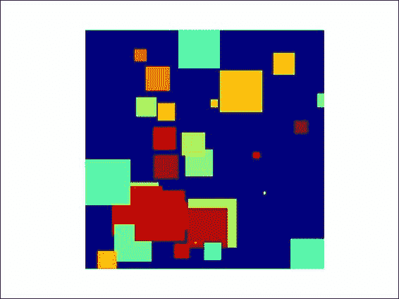
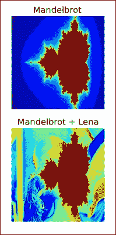
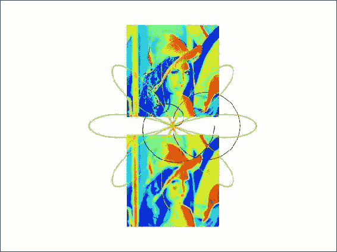
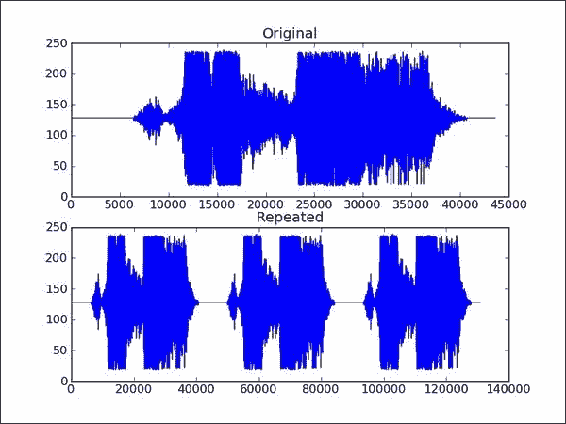
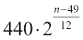
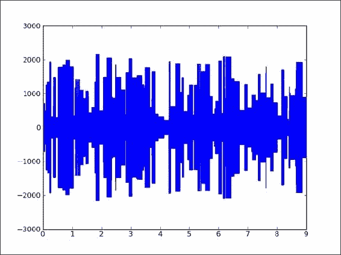
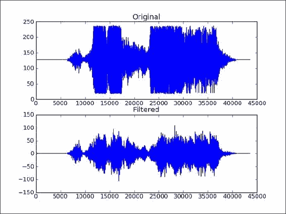
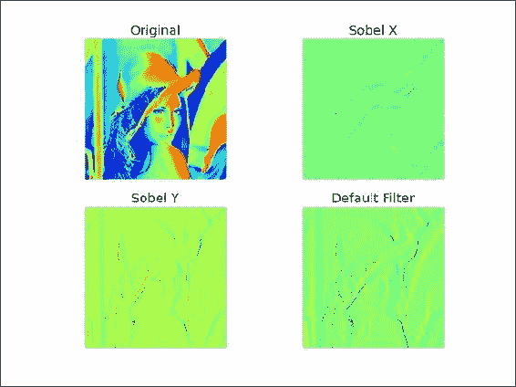

# 第 5 章。音频和图像处理

在本章中，我们将介绍 NumPy 和 SciPy 的基本图像和音频（WAV 文件）处理。 在以下秘籍中，我们将使用 NumPy 对声音和图像进行有趣的操作：

*   将图像加载到内存映射中
*   添加图像
*   影像模糊
*   重复音频片段
*   产生声音
*   设计音频过滤器
*   使用 Sobel 过滤器进行边缘检测

# 简介

尽管本书中的所有章节都很有趣，但在本章中，我们确实会继续努力并专注于获得乐趣。 在第 10 章，*与 Scikits 的乐趣*中，您会发现更多使用`scikits-image`的图像处理秘籍。 不幸的是，本书没有对音频文件的直接支持，因此您确实需要运行代码示例以充分了解其中的秘籍。

# 将图像加载到内存映射中

建议  将大文件加载到内存映射中。 内存映射文件仅加载大文件的一小部分。 NumPy 内存映射类似于  数组。 在此示例中，我们将生成彩色正方形的图像并将其加载到内存映射中。

## 准备

如有必要，安装 matplotlib。*另请参见*部分具有对相应秘籍的引用。

## 如何执行...

我们将通过初始化数组来开始  ：

1.  First we need to initialize the following arrays:

    *   保存图像数据的  数组
    *   具有正方形中心随机坐标的数组
    *   具有平方的随机半径（复数个半径）的数组
    *   具有正方形随机颜色的数组

    初始化数组：

    ```py
    img = np.zeros((N, N), np.uint8)
    NSQUARES = 30
    centers = np.random.random_integers(0, N, size=(NSQUARES, 2))
    radii = np.random.randint(0, N/9, size=NSQUARES)
    colors = np.random.randint(100, 255, size=NSQUARES)
    ```

    如您所见，我们正在将第一个数组初始化为零。 其他数组使用`numpy.random`包中的函数初始化，这些函数生成随机整数。

2.  下一步是生成正方形。 我们在上一步中使用数组创建正方形。 使用`clip()`函数，我们将确保正方形不会在图像区域外徘徊。 `meshgrid()`函数为我们提供了正方形的坐标。 如果我们给此函数两个大小分别为`N`和`M`的数组，它将给我们两个形状为 N x M 的数组。第一个数组的元素将沿 *x* 重复[ 轴。 第二个数组将沿 *y* 轴重复其元素。 以下示例 IPython 会话应该使这一点更加清楚：

    ### 注意

    ```py
    In: x = linspace(1, 3, 3)

    In: x
    Out: array([ 1.,  2.,  3.])
    In: y = linspace(1, 2, 2)

    In: y
    Out: array([ 1.,  2.])

    In: meshgrid(x, y)
    **Out:** 
    [array([[ 1.,  2.,  3.],
     [ 1.,  2.,  3.]]),
     array([[ 1.,  1.,  1.],
     [ 2.,  2.,  2.]])]

    ```

3.  最后，我们  将设置正方形的颜色：

    ```py
    for i in xrange(NSQUARES):
       xindices = range(centers[i][0] - radii[i], centers[i][0] + radii[i])
       xindices = np.clip(xindices, 0, N - 1)
       yindices = range(centers[i][1] - radii[i], centers[i][1] + radii[i])
       yindices = np.clip(yindices, 0, N - 1)

       if len(xindices) == 0 or len(yindices) == 0:
          continue
       coordinates = np.meshgrid(xindices, yindices)
       img[coordinates] = colors[i]
    ```

4.  在  将图像数据加载到内存映射之前，我们需要使用`tofile()`函数将其存储在文件中。 然后使用`memmap()`函数将图像文件中的图像数据加载到内存映射中：

    ```py
    img.tofile('random_squares.raw')
    img_memmap = np.memmap('random_squares.raw', shape=img.shape)

    ```

5.  To confirm that everything worked fine, we display the image with matplotlib:

    ```py
    plt.imshow(img_memmap)
    plt.axis('off')
    plt.show()

    ```

    注意，我们没有显示轴。 生成图像的示例如下所示：

    

    这是本书代码捆绑中`memmap.py`文件的  完整源代码  代码：

    ```py
    import numpy as np
    import matplotlib.pyplot as plt

    N = 512
    NSQUARES = 30

    # Initialize
    img = np.zeros((N, N), np.uint8)
    centers = np.random.random_integers(0, N, size=(NSQUARES, 2))
    radii = np.random.randint(0, N/9, size=NSQUARES)
    colors = np.random.randint(100, 255, size=NSQUARES)

    # Generate squares
    for i in xrange(NSQUARES):
       xindices = range(centers[i][0] - radii[i], centers[i][0] + radii[i])
       xindices = np.clip(xindices, 0, N - 1)
       yindices = range(centers[i][1] - radii[i], centers[i][1] + radii[i])
       yindices = np.clip(yindices, 0, N - 1)

       if len(xindices) == 0 or len(yindices) == 0:
          continue

       coordinates = np.meshgrid(xindices, yindices)
       img[coordinates] = colors[i]

    # Load into memory map
    img.tofile('random_squares.raw')
    img_memmap = np.memmap('random_squares.raw', shape=img.shape)

    # Display image
    plt.imshow(img_memmap)
    plt.axis('off')
    plt.show()
    ```

### 工作原理...

我们  在此秘籍中使用了以下功能：

<colgroup class="calibre33"><col class="calibre34"> <col class="calibre34"></colgroup> 
| 

功能

 | 

描述

 |
| --- | --- |
| `zeros()` | 此函数  给出一个由零填充的数组。 |
| `random_integers()` | 此函数返回一个数组，数组中的随机整数值在上限和下限之间。 |
| `randint()` | 该功能与`random_integers()`的功能相同，除了它使用半开间隔而不是关闭间隔。 |
| `clip()` | 该函数在给定最小值和最大值的情况下裁剪数组的值。 |
| `meshgrid()` | 此函数从包含 *x* 坐标的数组和包含 *y* 坐标的数组返回坐标数组。 |
| `tofile()` | 此函数将数组写入文件。 |
| `memmap()` | 给定文件名，此函数从文件创建 NumPy 内存映射。 （可选）您可以指定数组的形状。 |
| `axis()` | 该功能是用于配置绘图轴的 matplotlib 函数。 例如，我们可以将其关闭。 |

### 另请参见

*   *安装* *matplotlib [第 1 章中的](../Text/ch01.html "Chapter 1. Winding Along with IPython")* ，，*使用 IPython*
*   位于[的 NumPy](http://docs.scipy.org/doc/numpy/reference/generated/numpy.memmap.html) 内存映射文档  http://docs.scipy.org/doc/numpy/reference/produced/numpy.memmap.html

# 合成影像

在此秘籍中，我们  将结合著名的 [**Mandelbrot 分形**](http://en.wikipedia.org/wiki/Mandelbrot_set)和莉娜的形象。 Mandelbrot 集是数学家 Benoit Mandelbrot 发明的。 这些类型的分形由递归公式定义，您可以在其中通过将当前拥有的复数乘以自身并为其添加一个常数来计算序列中的下一个复数。 本秘籍将涵盖更多详细信息。

## 准备

如有必要，请安装 SciPy。*另请参见*部分具有相关秘籍的参考。

## 如何执行...

首先初始化数组，然后生成和绘制分形，最后将分形与 Lena 图像组合：

1.  使用`meshgrid()`，`zeros()`和`linspace()`函数初始化对应于图像区域中像素的`x`，`y`和`z`数组：

    ```py
    x, y = np.meshgrid(np.linspace(x_min, x_max, SIZE),
                       np.linspace(y_min, y_max, SIZE))
    c = x + 1j * y
    z = c.copy()
    fractal = np.zeros(z.shape, dtype=np.uint8) + MAX_COLOR
    ```

2.  If `z` is a complex number, we have this relation for a Mandelbrot fractal:

    在此，`c`是常数复数。 这可以在复平面上绘制，水平轴显示实数值，垂直轴显示虚数值。 我们将使用所谓的**逃逸时间** **算法**绘制分形。 该算法以大约 2 个单位的距离扫描原点周围小区域中的点。 这些点中的每一个都用作`c`值，并根据逃避区域所需的迭代次数为其指定颜色。 如果  所需的迭代次数超过了预定义的次数，则像素将获得默认背景色。 有关更多信息，请参见此秘籍中已提及的 Wikipedia 文章：

    ```py
    for n in range(ITERATIONS):
        print(n)
        mask = numpy.abs(z) <= 4 
        z[mask] = z[mask] ** 2 +  c[mask]
        fractal[(fractal == MAX_COLOR) & (-mask)] = (MAX_COLOR - 1) * n / ITERATIONS
    Plot the fractal with matplotlib:
    plt.subplot(211)
    plt.imshow(fractal)
    plt.title('Mandelbrot')
    plt.axis('off')
    Use the choose() function to pick a value from the fractal or Lena array:
    plt.subplot(212)
    plt.imshow(numpy.choose(fractal < lena, [fractal, lena]))
    plt.axis('off')
    plt.title('Mandelbrot + Lena')
    ```

    结果图像如下所示：

    

    以下  是本书代码集中`mandelbrot.py`文件中该秘籍的完整代码：

    ```py
    import numpy as np
    import matplotlib.pyplot as plt
    from scipy.misc import lena

    ITERATIONS = 10
    lena = lena()
    SIZE = lena.shape[0]
    MAX_COLOR = 255.
    x_min, x_max = -2.5, 1
    y_min, y_max = -1, 1

    # Initialize arrays
    x, y = np.meshgrid(np.linspace(x_min, x_max, SIZE),
                       np.linspace(y_min, y_max, SIZE))
    c = x + 1j * y
    z = c.copy()
    fractal = np.zeros(z.shape, dtype=np.uint8) + MAX_COLOR
    # Generate fractal
    for n in range(ITERATIONS):
        mask = np.abs(z) <= 4 
        z[mask] = z[mask] ** 2 +  c[mask]
        fractal[(fractal == MAX_COLOR) & (-mask)] = (MAX_COLOR - 1) * n / ITERATIONS

    # Display the fractal
    plt.subplot(211)
    plt.imshow(fractal)
    plt.title('Mandelbrot')
    plt.axis('off')

    # Combine with lena
    plt.subplot(212)
    plt.imshow(np.choose(fractal < lena, [fractal, lena]))
    plt.axis('off')
    plt.title('Mandelbrot + Lena')

    plt.show()
    ```

## 工作原理...

在此示例中使用了以下  功能：

<colgroup class="calibre33"><col class="calibre34"> <col class="calibre34"></colgroup> 
| 

Function

 | 

Description

 |
| --- | --- |
| `linspace()` | 此函数  返回范围内具有指定间隔的数字 |
| `choose()` | 此函数  通过根据条件从数组中选择值来创建数组 |
| `meshgrid()` | 此函数  从包含 *x* 坐标的数组和包含 *y* 坐标的数组返回坐标数组 |

## 另请参见

*   第 1 章，*中安装 matplotlib* 秘籍的*与 IPython* 一起缠绕
*   第 2 章，*高级索引和数组*中的*安装 SciPy* 秘籍

# 图像模糊

我们可以使用[高斯过滤器](http://en.wikipedia.org/wiki/Gaussian_filter)来模糊图像。 该过滤器基于正态分布。 对应的  SciPy 函数需要标准差作为  参数。 在此秘籍中，我们还将绘制[极地玫瑰和螺旋形](http://en.wikipedia.org/wiki/Polar_coordinate_system)。 这些数字没有直接关系，但是在这里将它们组合起来似乎更有趣。

## 如何执行...

我们从初始化极坐标图开始，之后我们将模糊 Lena 图像并使用极坐标进行绘图：

1.  初始化极坐标图：

    ```py
    NFIGURES = 5
    k = np.random.random_integers(1, 5, NFIGURES)
    a = np.random.random_integers(1, 5, NFIGURES)
    colors = ['b', 'g', 'r', 'c', 'm', 'y', 'k']

    ```

2.  要模糊 Lena，请应用标准差为`4`的高斯过滤器：

    ```py
    plt.subplot(212)
    blurred = scipy.ndimage.gaussian_filter(lena, sigma=4)

    plt.imshow(blurred)
    plt.axis('off')

    ```

3.  matplotlib has a `polar()` function, which plots in polar coordinates:

    ```py
    theta = np.linspace(0, k[0] * np.pi, 200)
    plt.polar(theta, np.sqrt(theta), choice(colors))

    for i in xrange(1, NFIGURES):
     theta = np.linspace(0, k[i] * np.pi, 200)
     plt.polar(theta, a[i] * np.cos(k[i] * theta), choice(colors))

    ```

    

    这是  这本书的代码集中`spiral.py`文件中该秘籍的完整代码：

    ```py
    import numpy as np
    import matplotlib.pyplot as plt
    from random import choice
    import scipy
    import scipy.ndimage
    # Initialization
    NFIGURES = 5
    k = np.random.random_integers(1, 5, NFIGURES)
    a = np.random.random_integers(1, 5, NFIGURES)

    colors = ['b', 'g', 'r', 'c', 'm', 'y', 'k']

    lena = scipy.misc.lena()
    plt.subplot(211)
    plt.imshow(lena)
    plt.axis('off')

    # Blur Lena
    plt.subplot(212)
    blurred = scipy.ndimage.gaussian_filter(lena, sigma=4)

    plt.imshow(blurred)
    plt.axis('off')

    # Plot in polar coordinates
    theta = np.linspace(0, k[0] * np.pi, 200)
    plt.polar(theta, np.sqrt(theta), choice(colors))

    for i in xrange(1, NFIGURES):
       theta = np.linspace(0, k[i] * np.pi, 200)
       plt.polar(theta, a[i] * np.cos(k[i] * theta), choice(colors))

    plt.axis('off')

    plt.show()
    ```

## 工作原理...

在本教程中，我们使用了  以下功能：

<colgroup class="calibre33"><col class="calibre34"> <col class="calibre34"></colgroup> 
| 

Function

 | 

Description

 |
| --- | --- |
| `gaussian_filter()` | 此函数应用高斯过滤器 |
| `random_integers()` | 此函数返回一个数组，数组中的随机整数值在上限和下限之间 |
| `polar()` | 该函数使用极坐标绘制图形 |

## 另请参见

*   可以在[这个页面](http://docs.scipy.org/doc/scipy-0.14.0/reference/ndimage.html)中找到`scipy.ndimage`文档。

# 重复音频片段

正如我们在第 2 章，*高级索引和数组概念*中所看到的那样，我们可以使用 WAV 文件来完成整洁的事情。 只需使用`urllib2`标准 Python 模块下载文件并将其加载到 SciPy 中即可。 让我们下载一个 WAV 文件并重复 3 次。 我们将跳过在第 2 章，*高级索引和数组概念*中已经看到的一些步骤。

## 如何执行...

1.  Although NumPy has a `repeat()` function, in this case, it is more appropriate to use the `tile()` function. The `repeat()` function would have the effect of enlarging the array by repeating individual elements and not repeating the contents of it. The following IPython session should clarify the difference between these functions:

    ```py
    In: x = array([1, 2])

    In: x
    Out: array([1, 2])

    In: repeat(x, 3)
    Out: array([1, 1, 1, 2, 2, 2])

    In: tile(x, 3)
    Out: array([1, 2, 1, 2, 1, 2])

    ```

    现在，有了这些知识，就可以应用`tile()`函数：

    ```py
    repeated = np.tile(data, 3)
    ```

2.  Plot the audio data with matplotlib:

    ```py
    plt.title("Repeated")
    plt.plot(repeated)
    ```

    原始声音数据和重复数据图如下所示：

    

    这是本书代码捆绑中`repeat_audio.py`文件中该秘籍的  完整代码：

    ```py
    import scipy.io.wavfile
    import matplotlib.pyplot as plt
    import urllib2
    import numpy as np

    response = urllib2.urlopen('http://www.thesoundarchive.com/austinpowers/smashingbaby.wav')
    print(response.info())
    WAV_FILE = 'smashingbaby.wav'
    filehandle = open(WAV_FILE, 'w')
    filehandle.write(response.read())
    filehandle.close()
    sample_rate, data = scipy.io.wavfile.read(WAV_FILE)
    print("Data type", data.dtype, "Shape", data.shape)

    plt.subplot(2, 1, 1)
    plt.title("Original")
    plt.plot(data)

    plt.subplot(2, 1, 2)

    # Repeat the audio fragment
    repeated = np.tile(data, 3)

    # Plot the audio data
    plt.title("Repeated")
    plt.plot(repeated)
    scipy.io.wavfile.write("repeated_yababy.wav",
        sample_rate, repeated)

    plt.show()
    ```

## 工作原理...

以下是此秘籍中最重要的功能：

<colgroup class="calibre33"><col class="calibre34"> <col class="calibre34"></colgroup> 
| 

Function

 | 

Description

 |
| --- | --- |
| `scipy.io.wavfile.read()` | 将 WAV 文件读入数组 |
| `numpy.tile()` | 重复数组指定次数 |
| `scipy.io.wavfile.write()` | 从 NumPy 数组中以指定的采样率创建 WAV 文件 |

## 另请参见

*   可以在[这个页面](http://docs.scipy.org/doc/scipy-0.14.0/reference/io.html)中找到  `scipy.io`文档。

# 产生声音

声音可以用具有一定幅度，频率和相位的正弦波在数学上表示如下。 我们可以从[这个页面](http://en.wikipedia.org/wiki/Piano_key_frequencies)中指定的列表中随机选择符合以下公式的频率：



此处，`n`是钢琴键的编号。 我们将键的编号从 1 到 88。我们将随机选择振幅，持续时间和相位。

## 如何执行...

首先初始化随机值，然后生成正弦波，编写旋律，最后使用 matplotlib 绘制生成的音频数据：

1.  初始化为  随机值：
    *   `200`-`2000`之间的幅度
    *   `0.01`-`0.2`的持续时间
    *   使用已经提到的公式的频率
    *   `0`和`2 pi`之间的相位值：

        ```py
        NTONES = 89
        amps = 2000\. * np.random.random((NTONES,)) + 200.
        durations = 0.19 * np.random.random((NTONES,)) + 0.01
        keys = np.random.random_integers(1, 88, NTONES)
        freqs = 440.0 * 2 ** ((keys - 49.)/12.)
        phi = 2 * np.pi * np.random.random((NTONES,))
        ```

2.  编写`generate()`函数以生成正弦波：

    ```py
    def generate(freq, amp, duration, phi):
     t = np.linspace(0, duration, duration * RATE)
     data = np.sin(2 * np.pi * freq * t + phi) * amp

     return data.astype(DTYPE)
    ```

3.  一旦我们产生了一些音调，我们只需要组成一个连贯的旋律。 现在，我们将串联正弦波。 这不会产生良好的旋律，但可以作为更多实验的起点：

    ```py
    for i in xrange(NTONES):
       newtone = generate(freqs[i], amp=amps[i], duration=durations[i], phi=phi[i])
       tone = np.concatenate((tone, newtone))
    ```

4.  Plot the generated audio data with matplotlib:

    ```py
    plt.plot(np.linspace(0, len(tone)/RATE, len(tone)), tone)
    plt.show()
    ```

    生成的音频数据图如下：

    

    可以在此处找到本示例的源代码  ，该代码来自本书代码捆绑中的`tone_generation.py`文件：

    ```py
    import scipy.io.wavfile
    import numpy as np
    import matplotlib.pyplot as plt

    RATE = 44100
    DTYPE = np.int16

    # Generate sine wave
    def generate(freq, amp, duration, phi):
     t = np.linspace(0, duration, duration * RATE)
     data = np.sin(2 * np.pi * freq * t + phi) * amp

     return data.astype(DTYPE)

    # Initialization
    NTONES = 89
    amps = 2000\. * np.random.random((NTONES,)) + 200.
    durations = 0.19 * np.random.random((NTONES,)) + 0.01
    keys = np.random.random_integers(1, 88, NTONES)
    freqs = 440.0 * 2 ** ((keys - 49.)/12.)
    phi = 2 * np.pi * np.random.random((NTONES,))

    tone = np.array([], dtype=DTYPE) 

    # Compose 
    for i in xrange(NTONES):
       newtone = generate(freqs[i], amp=amps[i], duration=durations[i], phi=phi[i])
       tone = np.concatenate((tone, newtone))

    scipy.io.wavfile.write('generated_tone.wav', RATE, tone)

    # Plot audio data
    plt.plot(np.linspace(0, len(tone)/RATE, len(tone)), tone)
    plt.show()
    ```

## 工作原理...

我们创建了带有随机生成声音的 WAV 文件  。 `concatenate()`函数用于连接正弦波。

## 另请参见

*   [`concatenate()`函数的文档](http://docs.scipy.org/doc/numpy/reference/generated/numpy.concatenate.html)

# 设计音频过滤器

我记得  在模拟电子课上学习了所有类型的过滤器。 然后，我们实际上构造了这些过滤器。 可以想象，用软件制作过滤器要比用硬件制作过滤器容易得多。

我们将构建一个过滤器，并将其应用于要下载的音频片段。 在本章之前，我们已经完成了一些步骤，因此我们将省略那些部分。

## 如何执行...

顾名思义，`iirdesign()`函数允许我们构造几种类型的模拟和数字过滤器。 可以在`scipy.signal`模块中找到。 该模块包含信号处理功能的完整列表：

1.  Design the filter with the `iirdesign()` function of the `scipy.signal` module. IIR stands for infinite impulse response; for more information, see [http://en.wikipedia.org/wiki/Infinite_impulse_response](http://en.wikipedia.org/wiki/Infinite_impulse_response). We are not going to go into all the details of the `iirdesign()` function. Take a look at the documentation at [http://docs.scipy.org/doc/scipy/reference/generated/scipy.signal.iirdesign.html](http://docs.scipy.org/doc/scipy/reference/generated/scipy.signal.iirdesign.html) if necessary. In short, these are the parameters we will set:

    *   频率  从 0 标准化为 1
    *   最大损失
    *   最小衰减
    *   过滤器类型：

        ```py
        b,a = scipy.signal.iirdesign(wp=0.2, ws=0.1, gstop=60, gpass=1, ftype='butter')
        ```

    此过滤器的配置对应于 [Butterworth 过滤器](http://en.wikipedia.org/wiki/Butterworth_filter)。 **Butterworth 过滤器**由物理学家 Stephen Butterworth 于 1930 年首次描述。

2.  Apply the filter with the `scipy.signal.lfilter()` function. It accepts as arguments the values from the previous step and, of course, the data array to filter:

    ```py
    filtered = scipy.signal.lfilter(b, a, data)
    ```

    写入新的音频文件时，请确保其数据类型与原始数据数组相同：

    ```py
    scipy.io.wavfile.write('filtered.wav', sample_rate, filtered.astype(data.dtype))
    ```

    在绘制原始数据和过滤后的数据之后，我们得到以下图：

    

    音频过滤器的代码  列出如下：

    ```py
    import scipy.io.wavfile
    import matplotlib.pyplot as plt
    import urllib2
    import scipy.signal

    response =urllib2.urlopen('http://www.thesoundarchive.com/austinpowers/smashingbaby.wav')
    print response.info()
    WAV_FILE = 'smashingbaby.wav'
    filehandle = open(WAV_FILE, 'w')
    filehandle.write(response.read())
    filehandle.close()
    sample_rate, data = scipy.io.wavfile.read(WAV_FILE)
    print("Data type", data.dtype, "Shape", data.shape)

    plt.subplot(2, 1, 1)
    plt.title("Original")
    plt.plot(data)

    # Design the filter
    b,a = scipy.signal.iirdesign(wp=0.2, ws=0.1, gstop=60, gpass=1, ftype='butter')

    # Filter
    filtered = scipy.signal.lfilter(b, a, data)

    # Plot filtered data
    plt.subplot(2, 1, 2)
    plt.title("Filtered")
    plt.plot(filtered)

    scipy.io.wavfile.write('filtered.wav', sample_rate, filtered.astype(data.dtype))

    plt.show()
    ```

## 工作原理...

我们创建并  应用了 Butterworth 带通过滤器。 引入了以下功能来创建过滤器：

<colgroup class="calibre33"><col class="calibre34"> <col class="calibre34"></colgroup> 
| 

Function

 | 

Description

 |
| --- | --- |
| `scipy.signal.iirdesign()` | 创建一个 IIR 数字或模拟过滤器。 此函数具有广泛的参数列表，该列表在[这个页面](http://docs.scipy.org/doc/scipy/reference/generated/scipy.signal.iirdesign.html)中记录。 |
| `scipy.signal.lfilter()` | 给定一个数字过滤器，对数组进行滤波。 |

# 使用 Sobel 过滤器进行边缘检测

[**Sobel 过滤器**](http://en.wikipedia.org/wiki/Sobel_operator)可以用于图像中的边缘检测 。 边缘检测基于对图像强度执行离散  区分。 由于图像是二维的，因此渐变也有两个分量，除非我们将自身限制为一维。 我们将 Sobel 过滤器应用于 LenaSöderberg 的图片。

## 如何执行...

在本部分中，您将学习如何应用 Sobel 过滤器来检测 Lena 图像中的边缘：

1.  要在 *x* 方向上应用 Sobel 过滤器，请将轴参数设置为`0`：

    ```py
    sobelx = scipy.ndimage.sobel(lena, axis=0, mode='constant')
    ```

2.  要在 *y* 方向上应用 Sobel 过滤器，请将轴参数设置为`1`：

    ```py
    sobely = scipy.ndimage.sobel(lena, axis=1, mode='constant')
    ```

3.  The default Sobel filter only requires the input array:

    ```py
    default = scipy.ndimage.sobel(lena)
    ```

    是原始图像图和所得图像图，显示了使用 Sobel 过滤器进行边缘检测：

    

    完整的边缘检测代码如下：

    ```py
    import scipy
    import scipy.ndimage
    import matplotlib.pyplot as plt

    lena = scipy.misc.lena()

    plt.subplot(221)
    plt.imshow(lena)
    plt.title('Original')
    plt.axis('off')

    # Sobel X filter
    sobelx = scipy.ndimage.sobel(lena, axis=0, mode='constant')

    plt.subplot(222)
    plt.imshow(sobelx)
    plt.title('Sobel X')
    plt.axis('off')

    # Sobel Y filter
    sobely = scipy.ndimage.sobel(lena, axis=1, mode='constant')

    plt.subplot(223)
    plt.imshow(sobely)
    plt.title('Sobel Y')
    plt.axis('off')

    # Default Sobel filter
    default = scipy.ndimage.sobel(lena)

    plt.subplot(224)
    plt.imshow(default)
    plt.title('Default Filter')
    plt.axis('off')

    plt.show()
    ```

## 工作原理...

我们将  Sobel 过滤器应用于著名模型  LenaSöderberg 的图片。 如本例所示，我们可以指定沿哪个轴进行计算。 默认设置为独立于轴。