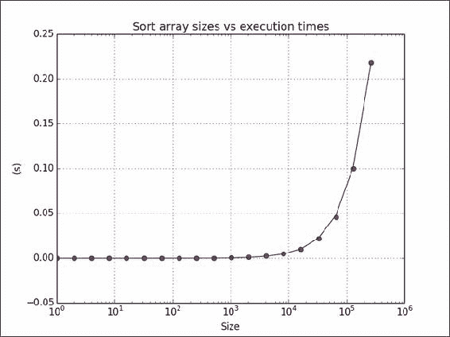
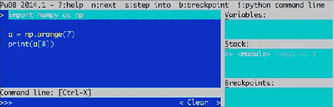

# 七、性能分析和调试

在本章中，我们将介绍以下秘籍：

*   使用`timeit`进行性能分析
*   使用 IPython 进行分析
*   安装`line_profiler`
*   使用`line_profiler`分析代码
*   具有`cProfile`扩展名的性能分析代码
*   使用 IPython 进行调试
*   使用`PuDB`进行调试

# 简介

调试是从软件中查找和删除错误的行为。 分析是指构建程序的概要文件，以便收集有关内存使用或时间复杂度的信息。 分析和调试是开发人员生活中必不可少的活动。 对于复杂的软件尤其如此。 好消息是，许多工具可以为您提供帮助。 我们将回顾 NumPy 用户中流行的技术。

# 与 timeit 进行性能分析

`timeit`是一个  模块，可用于计时代码段。 它是标准 Python 库的  的一部分。 我们将使用几种数组大小对`sort()` NumPy 函数计时。 经典的**快速排序**和 **归并排序**算法的平均运行时间为 O（N log N），因此我们将尝试拟合 我们对这种模型的结果。

## 如何执行...

我们将要求数组进行排序：

1.  创建数组以排序包含随机整数值的各种大小：

    ```py
    times = np.array([])

    for size in sizes:
        integers = np.random.random_integers (1, 10 ** 6, size)
    ```

2.  要测量时间，请创建一个计时器，为其提供执行功能，并指定相关的导入。 然后，排序 100 次以获取有关排序时间的数据：

    ```py
    def measure():
        timer = timeit.Timer('dosort()', 'from __main__ import dosort')
        return timer.timeit(10 ** 2)
    ```

3.  通过一次乘以时间来构建测量时间阵列：

    ```py
    times = np.append(times, measure())
    ```

4.  Fit the times into the theoretical model of `n log n`. Since we are varying the array size as powers of two, this is easy:

    ```py
    fit = np.polyfit(sizes * powersOf2, times, 1)
    ```

    以下是完整的计时代码：

    ```py
    import numpy as np
    import timeit
    import matplotlib.pyplot as plt

    # This program measures the performance of the NumPy sort function
    # and plots time vs array size.
    integers = []

    def dosort():
       integers.sort()

    def measure():
       timer = timeit.Timer('dosort()', 'from __main__ import dosort')

       return timer.timeit(10 ** 2)

    powersOf2 = np.arange(0, 19)
    sizes = 2 ** powersOf2

    times = np.array([])

    for size in sizes:
       integers = np.random.random_integers(1, 10 ** 6, size)
       times = np.append(times, measure())

    fit = np.polyfit(sizes * powersOf2, times, 1)
    print(fit)
    plt.title("Sort array sizes vs execution times")
    plt.xlabel("Size")
    plt.ylabel("(s)")
    plt.semilogx(sizes, times, 'ro')
    plt.semilogx(sizes, np.polyval(fit, sizes * powersOf2))
    plt.grid()
    plt.show()
    ```

    以下  屏幕截图显示了运行时间与数组大小的关系图：

    

## 工作原理...

我们测量了`sort()` NumPy 函数的平均  运行时间。 此秘籍中使用了  以下功能：

<colgroup class="calibre33"><col class="calibre34"> <col class="calibre34"></colgroup> 
| 

功能

 | 

描述

 |
| --- | --- |
| `random_integers()` | 给定值和数组大小的范围时，此函数  创建一个随机整数数组 |
| `append()` | 此函数  将值附加到 NumPy 数组 |
| `polyfit()` | 此函数将  数据拟合为给定阶数的多项式 |
| `polyval()` | 此函数  计算多项式，并为给定的 `x`值返回相应的值 |
| `semilogx()` | 此功能  使用对数刻度在 *X* 轴上绘制数据 |

## 另请参见

*   [`timeit`的文档](http://docs.python.org/2/library/timeit.html)

# 使用 IPython 进行分析

在 IPython 中，我们可以  使用`timeit`来分析代码的小片段。 我们可以  也分析较大的脚本。 我们将展示两种方法。

## 如何执行...

首先，我们将介绍一个小片段：

1.  Start IPython in `pylab` mode:

    ```py
    $ ipython --pylab
    ```

    创建一个包含 1000 个介于 0 到 1000 之间的整数值的数组：

    ```py
    In [1]: a = arange(1000)
    ```

    测量在阵列中搜索“所有问题的答案”（42）所花费的时间。 是的，所有问题的答案都是 42。如果您不相信我，请阅读[这个页面](http://en.wikipedia.org/wiki/42_%28number%29)：

    ```py
    In [2]: %timeit searchsorted(a, 42)
    100000 loops, best of 3: 7.58 us per loop
    ```

2.  Profile the following small script that inverts a matrix of varying size containing random values. The `.I` attribute (that's an uppercase I) of a NumPy matrix represents the inverse of that matrix:

    ```py
    import numpy as np

    def invert(n):
      a = np.matrix(np.random.rand(n, n))

      return a.I

    sizes = 2 ** np.arange(0, 12)

    for n in sizes:
      invert(n)
    ```

    将此代码计时如下：

    ```py
    In [1]: %run -t invert_matrix.py

    IPython CPU timings (estimated):
     User   :       6.08 s.
     System :       0.52 s.
    Wall time:      19.26 s.

    ```

    然后使用`p`选项对  脚本进行配置：

    ```py
    In [2]: %run -p invert_matrix.py

    852 function calls in 6.597 CPU seconds

       Ordered by: internal time

       ncalls  tottime  percall  cumtime  percall filename:lineno(function)
           12    3.228    0.269    3.228    0.269 {numpy.linalg.lapack_lite.dgesv}
           24    2.967    0.124    2.967    0.124 {numpy.core.multiarray._fastCopyAndTranspose}
           12    0.156    0.013    0.156    0.013 {method 'rand' of 'mtrand.RandomState' objects}
           12    0.087    0.007    0.087    0.007 {method 'copy' of 'numpy.ndarray' objects}
           12    0.069    0.006    0.069    0.006 {method 'astype' of 'numpy.ndarray' objects}
           12    0.025    0.002    6.304    0.525 linalg.py:404(inv)
           12    0.024    0.002    6.328    0.527 defmatrix.py:808(getI)
            1    0.017    0.017    6.596    6.596 invert_matrix.py:1(<module>)
           24    0.014    0.001    0.014    0.001 {numpy.core.multiarray.zeros}
           12    0.009    0.001    6.580    0.548 invert_matrix.py:3(invert)
           12    0.000    0.000    6.264    0.522 linalg.py:244(solve)
           12    0.000    0.000    0.014    0.001 numeric.py:1875(identity)
            1    0.000    0.000    6.597    6.597 {execfile}
           36    0.000    0.000    0.000    0.000 defmatrix.py:279(__array_finalize__)
           12    0.000    0.000    2.967    0.247 linalg.py:139(_fastCopyAndTranspose)
           24    0.000    0.000    0.087    0.004 defmatrix.py:233(__new__)
           12    0.000    0.000    0.000    0.000 linalg.py:99(_commonType)
           24    0.000    0.000    0.000    0.000 {method '__array_prepare__' of 'numpy.ndarray' objects}
           36    0.000    0.000    0.000    0.000 linalg.py:66(_makearray)
           36    0.000    0.000    0.000    0.000 {numpy.core.multiarray.array}
           12    0.000    0.000    0.000    0.000 {method 'view' of 'numpy.ndarray' objects}
           12    0.000    0.000    0.000    0.000 linalg.py:127(_to_native_byte_order)
            1    0.000    0.000    6.597    6.597 interactiveshell.py:2270(safe_execfile)
    ```

## 工作原理...

我们通过分析器运行了上述  NumPy 代码。 下表  概述了探查器的输出：

<colgroup class="calibre33"><col class="calibre34"> <col class="calibre34"></colgroup> 
| 

柱

 | 

Description

 |
| --- | --- |
| `ncalls` | 这是  通话次数 |
| `tottime` | 这是一个函数花费的  总时间 |
| `percall` | 这是每次通话所花费的时间  ，计算方法是将总时间除以通话次数 |
| `cumtime` | 这是  在函数和由  函数调用的函数（包括递归调用）上花费的累积时间 |

## 另请参见

*   [上的](http://ipython.org/ipython-doc/dev/interactive/magics.html)  IPython 魔术文档 http://ipython.org/ipython-doc/dev/interactive/magics.html

# 安装 line_profiler

`line_profiler`由 NumPy 的开发人员之一创建。 此模块对  Python 代码进行逐行分析。 我们将在此秘籍中描述必要的安装步骤。

## 准备

您可能需要安装`setuptools`。 先前的秘籍中对此进行了介绍； 如有必要，请参阅*。另请参阅*部分。 为了安装开发版本，您将需要 Git。 安装 Git 超出了本书的范围。

## 如何执行...

选择适合您的安装选项：

*   使用以下任一命令将`line_profiler`与`easy_install`一起安装：

    ```py
    $ easy_install line_profiler
    $ pip install line_profiler

    ```

*   Install the development version.

    使用 Git 查看源代码：

    ```py
    $ git clone https://github.com/rkern/line_profiler

    ```

    签出源代码后，按如下所示构建它：

    ```py
    $ python setup.py install

    ```

## 另请参见

*   第 1 章，“使用 IPython”中的“安装 IPython”

# 使用 line_profiler 分析代码

现在我们已经安装了  ，现在可以  开始分析。

## 如何执行...

显然，我们将需要代码来分析：

1.  编写以下代码，以自身乘以大小可变的随机矩阵。 此外，线程将休眠几秒钟。 使用`@profile`注释功能以进行概要分析：

    ```py
    import numpy as np
    import time

    @profile
    def multiply(n):
      A = np.random.rand(n, n)
      time.sleep(np.random.randint(0, 2))
      return np.matrix(A) ** 2

    for n in 2 ** np.arange(0, 10):
      multiply(n)
    ```

2.  使用以下命令运行事件探查器：

    ```py
    $ kernprof.py -l -v mat_mult.py
    Wrote profile results to mat_mult.py.lprof
    Timer unit: 1e-06 s

    File: mat_mult.py
    Function: multiply at line 4
    Total time: 3.19654 s

    Line #      Hits         Time  Per Hit   % Time  Line Contents
    ==============================================================
     4                                           @profile
     5                                           def multiply(n):
     6        10        13461   1346.1      0.4     A = numpy.random.rand(n, n)
     7        10      3000689 300068.9     93.9     time.sleep(numpy.random.randint(0, 2))
     8        10       182386  18238.6      5.7     return numpy.matrix(A) ** 2

    ```

## 工作原理...

`@profile`装饰器告诉`line_profiler`要分析哪些功能。 下表说明了探查器的  输出：

<colgroup class="calibre33"><col class="calibre34"> <col class="calibre34"></colgroup> 
| 

Column

 | 

Description

 |
| --- | --- |
| `Line #` | 文件中的  行号 |
| `Hits` | 执行该行的  次数 |
| `Time` | 执行该行所花费的时间 |
| `Per Hit` | 执行该行所花费的平均  时间 |
| `% Time` | 执行该行所花费的  时间相对于执行所有行所花费的时间的百分比 |
| `Line Contents` | 该行的  内容 |

## 另请参见

*   [Github `line_profiler`项目页面](https://github.com/rkern/line_profiler)

# 具有 cProfile 扩展名的性能分析代码

`cProfile`是  是 Python 2.5 中引入的`C`扩展名。 它可以用于确定性分析。 确定性分析  表示所获得的时间测量是精确的，并且不使用采样。 这与统计分析相反，统计分析来自随机样本。 我们将使用`cProfile`对一个小的 NumPy 程序进行分析，该程序会对具有随机值的数组进行转置。

## 如何执行...

同样，我们需要代码来配置：

1.  编写以下`transpose()`函数以创建具有随机值的数组并将其转置：

    ```py
    def transpose(n):
      random_values = np.random.random((n, n))
      return random_values.T
    ```

2.  Run the profiler and give it the function to profile:

    ```py
    cProfile.run('transpose (1000)')
    ```

    可以在以下片段中找到本教程的完整代码：

    ```py
    import numpy as np
    import cProfile

    def transpose(n):
       random_values = np.random.random((n, n))
       return random_values.T

    cProfile.run('transpose (1000)')
    ```

    对于 1000 x 1000 的数组，我们得到以下输出：

    ```py
    4 function calls in 0.029 CPU seconds
     Ordered by: standard name
     ncalls  tottime  percall  cumtime  percall filename:lineno(function)
     1    0.001    0.001    0.029    0.029 <string>:1(<module>)
     1    0.000    0.000    0.028    0.028 cprofile_transpose.py:5(transpose)
     1    0.000    0.000    0.000    0.000 {method 'disable' of '_lsprof.Profiler' objects}
     1    0.028    0.028    0.028    0.028 {method 'random_sample' of 'mtrand.RandomState' objects}

    ```

    输出  中的  列与 IPython 分析秘籍中看到的列相同。

## 另请参见

*   [Python 分析器文档](http://docs.python.org/2/library/profile.html)
*   [与`pstats`一起工作的教程](http://pymotw.com/2/profile/#module-pstats)

# 使用 IPython 进行调试

> “如果调试是清除软件错误的过程，则编程必须是放入它们的过程。”
> 
> -- 荷兰计算机科学家 Edsger Dijkstra，1972 年图灵奖的获得者

调试是  之一，没人真正喜欢，但是掌握这些东西非常重要。 这可能需要几个小时，并且由于墨菲定律，您很可能没有时间。 因此，重要的是要系统地了解您的工具。 找到错误并实施修复后，您应该进行单元测试（如果该错误具有来自问题跟踪程序的相关 ID，我通常在末尾附加 ID 来命名测试）。 这样，您至少不必再次进行调试。 下一章将介绍单元测试。 我们将调试以下错误代码。 它尝试访问不存在的数组元素：

```py
import numpy as np

a = np.arange(7)
print(a[8])
```

IPython 调试器充当普通的 Python `pdb`调试器； 它添加了选项卡补全和语法突出显示等功能。

## 如何执行...

以下步骤说明了典型的调试会话：

1.  启动 IPython Shell。 通过发出以下命令在 IPython 中运行错误脚本：

    ```py
    In [1]: %run buggy.py
    ---------------------------------------------------------------------------
    IndexError                                Traceback (most recent call last)
    .../site-packages/IPython/utils/py3compat.pyc in execfile(fname, *where)
     173             else:
     174                 filename = fname
    --> 175             __builtin__.execfile(filename, *where)

    .../buggy.py in <module>()
     2
     3 a = numpy.arange(7)
    ----> 4 print a[8]

    IndexError: index out of bounds

    ```

2.  现在您的  程序崩溃了，启动调试器。 在发生错误的行上设置一个断点：

    ```py
    In [2]: %debug
    > .../buggy.py(4)<module>()
     2 
     3 a = numpy.arange(7)
    ----> 4 print a[8]

    ```

3.  使用`list`命令列出代码，或使用简写`l`：

    ```py
    ipdb> list
     1 import numpy as np
     2 
     3 a = np.arange(7)
    ----> 4 print(a[8])

    ```

4.  现在，我们可以在调试器当前所在的行上评估任意代码：

    ```py
    ipdb> len(a)
    7

    ipdb> print(a)
    [0 1 2 3 4 5 6]

    ```

5.  The **call stack** is a stack containing information about active functions of a running program. View the call stack with the `bt` command:

    ```py
    ipdb> bt
     .../py3compat.py(175)execfile()
     171             if isinstance(fname, unicode):
     172                 filename = fname.encode(sys.getfilesystemencoding())
     173             else:
     174                 filename = fname
    --> 175             __builtin__.execfile(filename, *where)

    > .../buggy.py(4)<module>()
     0 print a[8]

    ```

    向上移动调用堆栈：

    ```py
    ipdb> u
    > .../site-packages/IPython/utils/py3compat.py(175)execfile()
     173             else:
     174                 filename = fname
    --> 175             __builtin__.execfile(filename, *where)

    ```

    下移调用堆栈：

    ```py
    ipdb> d
    > .../buggy.py(4)<module>()
     2
     3 a = np.arange(7)
    ----> 4 print(a[8])

    ```

## 工作原理...

在本教程中，您  学习了如何使用 IPython 调试 NumPy 程序。 我们设置一个断点并导航调用堆栈。 使用了以下调试器命令：

<colgroup class="calibre33"><col class="calibre34"> <col class="calibre34"></colgroup> 
| 

命令

 | 

Description

 |
| --- | --- |
| `list`或 `l` | 列出源代码 |
| `bt` | 显示调用堆栈 |
| `u` | 向上移动调用堆栈 |
| `d` | 下移调用堆栈 |

## 另请参见

*   [Python 调试器文档](http://docs.python.org/2/library/pdb.html)
*   [`ipdb` 程序包的主页](https://pypi.python.org/pypi/ipdb)

# 使用 PuDB 进行调试

**PuDB** 是基于视觉的，全屏，基于控制台的 Python 调试器，易于安装。 PuDB 支持光标键  和 vi 命令。 如果需要，我们还可以将此调试器与 IPython 集成。

## 如何执行...

我们将从安装`pudb`开始：

1.  要安装`pudb`，我们只需执行以下命令（或等效的`pip`命令）：

    ```py
    $ sudo easy_install pudb
    $ pip install pudb
    $ pip freeze|grep pudb
    pudb==2014.1

    ```

2.  Let's debug the buggy program from the previous example. Start the debugger as follows:

    ```py
    $ python -m pudb buggy.py

    ```

    以下  屏幕截图显示了调试器的用户界面：

    

屏幕快照在顶部显示了最重要的调试命令。 我们还可以看到正在调试的代码，变量，堆栈和定义的断点。 键入`q`退出大多数菜单。 键入`n`将调试器移至下一行。 我们还可以使用光标键或 vi `j`和`k`键移动，例如，通过键入`b`设置断点。

## 另请参见

*   [PyPi PuDB 页面](https://pypi.python.org/pypi/pudb)