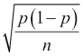
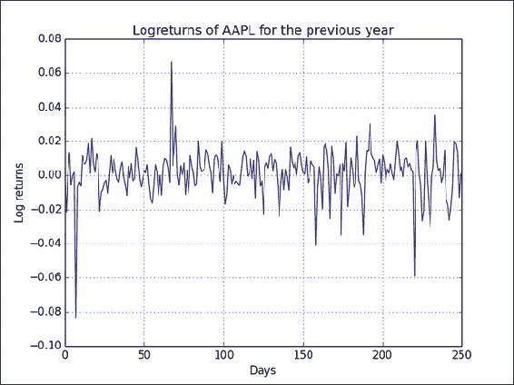
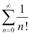
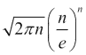
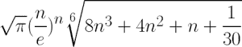
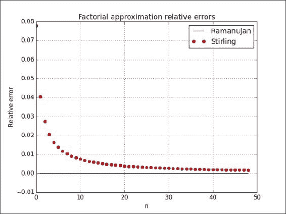

# 第 9 章。使用 Cython 加速代码

在本章中，我们将介绍以下秘籍：

*   安装 Cython
*   建立一个 Hello World 程序
*   将 Cython 与 NumPy 结合使用
*   调用 C 函数
*   分析 Cython 代码
*   用 Cython 近似阶乘

# 简介

**Cython** 是基于 Python 的相对  较年轻的编程语言。 它允许编码人员将 C 的速度与 Python 的功能混合在一起。 与 Python 的区别在于我们可以选择声明静态类型。 许多编程语言（例如 C）具有静态类型，这意味着我们必须告诉 C 变量的类型，函数参数和返回值类型。 另一个区别是 C 是一种编译语言，而 Python 是一种解释语言。 根据经验，可以说 C 比 Python 更快，但灵活性更低。 通过 Cython 代码，我们可以生成 C 或 C ++代码。 之后，我们可以将生成的代码编译为 Python 扩展模块。

在本章中，您将学习 Cython。 我们将获得一些与 NumPy 一起运行的简单 Cython 程序。 另外，我们将介绍 Cython 代码。

# 安装 Cython

为了使用  Cython，我们需要安装它。 热情的机盖，水蟒和  Sage 分布包括 Cython。 有关  的更多信息，请参见 [https://www.enthought.com/products/canopy/](https://www.enthought.com/products/canopy/) ， [https://store.continuum.io/cshop/anaconda/](https://store.continuum.io/cshop/anaconda/) 和 [http://sagemath.org/](http://sagemath.org/) 。 我们将不在这里讨论如何安装这些发行版。 显然，我们需要一个 C 编译器来编译生成的 C 代码。 在某些操作系统（例如 Linux）上，编译器将已经存在。 在本秘籍中，我们将假定您已经安装了编译器。

## 如何执行...

我们可以使用以下任何一种方法来安装  Cython：

*   通过执行以下步骤从源存档中安装 Cython ：
    *   从[下载源归档文件 http://cython.org/#download](http://cython.org/#download) 。
    *   打开包装。
    *   使用`cd`命令浏览到目录。
    *   运行以下命令：

        ```py
        $ python setup.py install

        ```

*   使用以下任一命令从 PyPI 存储库安装 Cython：

    ```py
    $ easy_install cython
    $ sudo pip install cython

    ```

*   使用来自 [http://www.lfd.uci.edu/~gohlke/pythonlibs/#cython](http://www.lfd.uci.edu/~gohlke/pythonlibs/#cython) 的非官方 Windows 安装程序，在 Windows 上安装  Cython。

## 另请参见

*   相关  Cython 在线文档位于 [http://docs.cython.org/src/quickstart/install.html](http://docs.cython.org/src/quickstart/install.html)

# 构建 Hello World 程序

与编程语言的  传统一样，我们将从 Hello World 示例开始。 与 Python 不同，我们需要编译 Cython 代码。 我们从`.pyx`文件开始，然后从中生成 C 代码。 可以编译此`.c`文件，然后将其导入 Python 程序中。

## 如何执行...

本节介绍如何构建 Cython Hello World 程序：

1.  首先，编写一些非常简单的代码以显示`Hello World`。 这只是普通的 Python 代码，但文件具有`pyx`扩展名：

    ```py
    def say_hello():
      print "Hello World!"
    ```

2.  Create a file named `setup.py` to help build the Cython code:

    ```py
    from distutils.core import setup
    from distutils.extension import Extension
    from Cython.Distutils import build_ext

    ext_modules = [Extension("hello", ["hello.pyx"])]

    setup(
            name = 'Hello world app',
            cmdclass = {'build_ext': build_ext},
            ext_modules = ext_modules
         )
    ```

    如您所见，我们在上一步中指定了文件，并为应用程序命名。

3.  Build using the following command:

    ```py
    $ python setup.py build_ext --inplace

    ```

    这将生成 C 代码，将其编译为您的平台，并产生以下输出：

    ```py
    running build_ext
    cythoning hello.pyx to hello.c
    building 'hello' extension
    creating build

    ```

    现在，我们可以使用以下语句导入模块：

    ```py
    from hello import say_hello
    ```

## 工作原理...

在此秘籍中，我们创建了一个传统的 Hello World 示例。 Cython 是一种编译语言，因此我们需要编译代码。 我们编写了一个包含`Hello World`代码的`.pyx`文件和一个用于生成和构建 C 代码的`setup.py`文件。

## 另请参见

*   有关 Cython 的在线文档位于 [http://docs.cython.org/src/quickstart/build.html](http://docs.cython.org/src/quickstart/build.html)

# 将 Cython 与 NumPy 结合使用

我们可以  集成 Cython 和 NumPy 代码，就像  可以集成 Cython 和 Python 代码一样。 让我们来看一个示例，该示例分析股票的上涨天数（股票收盘价高于前一日的天数）的比率。 我们将对二项式比例  置信度应用公式。 您可以参考 [http://en.wikipedia.org/wiki/Binomial_proportion_confidence_interval](http://en.wikipedia.org/wiki/Binomial_proportion_confidence_interval) 了解更多信息。 以下公式说明该比率的重要性：



式中， **p** 是概率， **n** 是观察数。

## 如何执行...

本节通过以下步骤介绍如何将 Cython 与 NumPy 结合使用：

1.  编写一个`.pyx`文件，其中包含一个函数，该函数可计算上升天数的比率和相关的置信度。 首先，此函数计算价格之间的差异。 然后，它计算出正差的数量，从而得出上升天数的比率。 最后，在引言中的 Wikipedia 页面上应用置信度公式：

    ```py
    import numpy as np

    def pos_confidence(numbers):
       diffs = np.diff(numbers)
       n = float(len(diffs))
       p = len(diffs[diffs > 0])/n
       confidence = np.sqrt(p * (1 - p)/ n)

       return (p, confidence)
    ```

2.  Use the `setup.py` file from the previous example as a template. Change the obvious things, such as the name of the `.pyx` file:

    ```py
    from distutils.core import setup
    from distutils.extension import Extension
    from Cython.Distutils import build_ext

    ext_modules = [Extension("binomial_proportion", ["binomial_proportion.pyx"])]

    setup(
            name = 'Binomial proportion app',
            cmdclass = {'build_ext': build_ext},
            ext_modules = ext_modules
         )
    ```

    我们现在可以建立； 有关更多详细信息，请参见前面的秘籍。

3.  After building, use the Cython module from the previous step by importing. We will write a Python program that downloads stock price data with `matplotlib`. Then we'll apply the `confidence()` function to the close prices:

    ```py
    from matplotlib.finance import quotes_historical_yahoo
    from datetime import date
    import numpy
    import sys
    from binomial_proportion import pos_confidence

    #1\. Get close prices.
    today = date.today()
    start = (today.year - 1, today.month, today.day)

    quotes = quotes_historical_yahoo(sys.argv[1], start, today)
    close =  numpy.array([q[4] for q in quotes])
    print pos_confidence(close)
    ```

    AAPL 程序的输出如下：

    ```py
    (0.56746031746031744, 0.031209043355655924)

    ```

## 工作原理...

我们计算了 APL 股价上涨的可能性和相应的置信度。 我们通过创建  Cython 模块，将 NumPy 代码放入`.pyx`文件中，并按照上一教程中的步骤进行构建。 最后，我们导入并使用了 Cython 模块。

## 另请参见

*   有关 Cython 的在线文档位于 [http://docs.cython.org/src/tutorial/numpy.html](http://docs.cython.org/src/tutorial/numpy.html)

# 调用 C 函数

我们可以从 Cython 调用 C 函数。 在此示例中，我们调用 C `log()`函数。 此功能仅适用于单个数字。 请记住，NumPy `log()`函数也可以与数组一起使用。 我们将计算股票价格的所谓对数回报。

## 如何执行...

我们首先编写一些 Cython 代码：

1.  First, import the C `log()` function from the `libc` namespace. Then, apply this function to numbers in a `for` loop. Finally, use the NumPy `diff()` function to get the first-order difference between the log values in the second step:

    ```py
    from libc.math cimport log
    import numpy as np

    def logrets(numbers):
       logs = [log(x) for x in numbers] 
       return np.diff(logs)
    ```

    先前的秘籍中已经介绍了建筑。 我们只需要更改`setup.py`文件中的某些值。

2.  Again, download the stock price data with `matplotlib`. Apply the Cython `logrets()` function you just created on the prices and plot the result:

    ```py
    from matplotlib.finance import quotes_historical_yahoo
    from datetime import date
    import numpy as np
    from log_returns import logrets
    import matplotlib.pyplot as plt

    today = date.today()
    start = (today.year - 1, today.month, today.day)

    quotes = quotes_historical_yahoo('AAPL', start, today)
    close =  np.array([q[4] for q in quotes])
    plt.plot(logrets(close))
    plt.title('Logreturns of AAPL for the previous year')
    plt.xlabel('Days')
    plt.ylabel('Log returns')
    plt.grid()
    plt.show()
    ```

    的 APAPL 对数回报结果图类似于以下屏幕截图所示：

    

## 工作原理...

我们从 Cython 代码中调用了 C `log()`函数。 该函数与 NumPy 函数一起用于  计算股票的对数收益。 这样，我们可以创建自己的包含便利功能的专用 API。 令人高兴的是，我们的代码应该或多或少地像 Python 代码一样，以与 C 代码差不多的速度执行。

## 另请参见

*   相关的  Cython 在线文档位于 [http://docs.cython.org/src/tutorial/external.html](http://docs.cython.org/src/tutorial/external.html)

# 分析 Cython 代码

我们将使用以下公式对  Cython 和 NumPy 代码进行剖析，这些代码试图近似于 Euler 常数：



有关更多背景  的信息，请参见 [http://en.wikipedia.org/wiki/E_%28mathematical_constant%29](http://en.wikipedia.org/wiki/E_%28mathematical_constant%29) 。

## 如何执行...

本节演示如何通过以下步骤来分析 Cython 代码：

1.  For the NumPy approximation of e, follow these steps:

    *   首先，我们将创建一个`1`到`n`的数组（在我们的示例中`n`是`40`）。
    *   然后，我们将计算该数组的累积乘积，该乘积恰好是阶乘。 在那之后，我们采取阶乘的倒数。 最后，我们从 Wikipedia 页面应用公式。 最后，我们放入标准配置代码，为我们提供以下程序：

        ```py
        from __future__ import print_function
        import numpy as np
        import cProfile
        import pstats

        def approx_e(n=40, display=False):
           # array of [1, 2, ... n-1]
           arr = np.arange(1, n)

           # calculate the factorials and convert to floats
           arr = arr.cumprod().astype(float)

           # reciprocal 1/n
           arr = np.reciprocal(arr)

           if display:
            print(1 + arr.sum())

        # Repeat multiple times because NumPy is so fast
        def run(repeat=2000):
            for i in range(repeat):
                approx_e()

        cProfile.runctx("run()", globals(), locals(), "Profile.prof")

        s = pstats.Stats("Profile.prof")
        s.strip_dirs().sort_stats("time").print_stats()

        approx_e(display=True)
        ```

    以下代码段显示了 *e* 近似值的分析输出和结果。 有关概要分析输出的更多信息，请参见[第 7 章](../Text/ch07.html "Chapter 7. Profiling and Debugging")， *分析和调试* 。

    ```py
     8004 function calls in 0.016 seconds

     Ordered by: internal time

     ncalls  tottime  percall  cumtime  percall filename:lineno(function)
     2000    0.007    0.000    0.015    0.000 numpy_approxe.py:6(approx_e)
     2000    0.004    0.000    0.004    0.000 {method 'cumprod' of 'numpy.ndarray' objects}
     2000    0.002    0.000    0.002    0.000 {numpy.core.multiarray.arange}
     2000    0.002    0.000    0.002    0.000 {method 'astype' of 'numpy.ndarray' objects}
     1    0.001    0.001    0.016    0.016 numpy_approxe.py:20(run)
     1    0.000    0.000    0.000    0.000 {range}
     1    0.000    0.000    0.016    0.016 <string>:1(<module>)
     1    0.000    0.000    0.000    0.000 {method 'disable' of '_lsprof.Profiler' objects}

    2.71828182846

    ```

2.  The Cython code uses the same algorithm as shown in the previous step, but the implementation is different. There are less convenience functions, and we actually need a `for` loop now. Also, we need to specify types for some of the variables. The code for the `.pyx` file is shown as follows:

    ```py
    def approx_e(int n=40, display=False):
        cdef double sum = 0.
        cdef double factorial = 1.
        cdef int k

        for k in xrange(1,n+1):
            factorial *= k
            sum += 1/factorial

        if display:
            print(1 + sum)
    ```

    以下 Python 程序导入 Cython 模块并进行一些分析：

    ```py
    import pstats
    import cProfile
    import pyximport
    pyximport.install()

    import approxe

    # Repeat multiple times because Cython is so fast
    def run(repeat=2000):
        for i in range(repeat):
            approxe.approx_e()

    cProfile.runctx("run()", globals(), locals(), "Profile.prof")

    s = pstats.Stats("Profile.prof")
    s.strip_dirs().sort_stats("time").print_stats()

    approxe.approx_e(display=True)
    ```

    这是 Cython 代码的分析输出：

    ```py
     2004 function calls in 0.001 seconds

     Ordered by: internal time

     ncalls  tottime  percall  cumtime  percall filename:lineno(function)
     2000    0.001    0.000    0.001    0.000 {approxe.approx_e}
     1    0.000    0.000    0.001    0.001 cython_profile.py:9(run)
     1    0.000    0.000    0.000    0.000 {range}
     1    0.000    0.000    0.001    0.001 <string>:1(<module>)
     1    0.000    0.000    0.000    0.000 {method 'disable' of '_lsprof.Profiler' objects}

    2.71828182846

    ```

## 工作原理...

我们分析了 NumPy 和 Cython 代码。 NumPy 已针对速度进行了优化，因此 NumPy 和 Cython 程序都是高性能程序，我们对此不会感到惊讶。 但是，当比较 2,000 次近似代码的总时间时，我们意识到  NumPy 需要 0.016 秒，而 Cython 仅需要 0.001 秒。 显然，实际时间取决于硬件，操作系统和其他因素，例如计算机上运行的其他进程。 同样，提速取决于代码类型，但我希望您同意，根据经验，Cython 代码会更快。

## 另请参见

*   相关  Cython 在线文档位于 [http://docs.cython.org/src/tutorial/profiling_tutorial.html](http://docs.cython.org/src/tutorial/profiling_tutorial.html)

# 与 Cython 近似的阶乘

最后一个示例  与 Cython 近似近似阶乘  。 我们将使用两种近似  方法。 首先，我们将应用斯特林近似方法（有关更多信息，请参见 [http://en.wikipedia.org/wiki/Stirling%27s_approximation](http://en.wikipedia.org/wiki/Stirling%27s_approximation) ）。 斯特林近似的公式如下：



其次，我们将使用 Ramanujan 的近似值，并使用以下公式：



## 如何执行...

本节介绍如何使用 Cython 近似阶乘。 您可能还记得，在本秘籍中，我们使用在 Cython 中可选的  类型。 从理论上讲，声明静态类型应加快速度。 静态类型化提供了一些有趣的挑战，这些挑战在编写 Python 代码时可能不会遇到，但请不要担心。 我们将尝试使其简单：

1.  除了将函数参数和一个局部变量声明为`ndarray`数组外，我们将编写的 Cython 代码类似于常规的 Python 代码。 为了使静态类型起作用，我们需要`cimport` NumPy。 另外，我们必须使用`cdef`关键字声明局部变量的类型：

    ```py
    import numpy
    cimport numpy

    def ramanujan_factorial(numpy.ndarray n):
       sqrt_pi = numpy.sqrt(numpy.pi, dtype=numpy.float64)
       cdef numpy.ndarray root = (8 * n + 4) * n + 1 
       root = root * n + 1/30.
       root = root ** (1/6.)
       return sqrt_pi * calc_eton(n) * root

    def stirling_factorial(numpy.ndarray n):
        return numpy.sqrt(2 * numpy.pi * n) * calc_eton(n)

    def calc_eton(numpy.ndarray n):
        return (n/numpy.e) ** n
    ```

2.  如先前的教程所示，构建需要我们创建一个`setup.py`文件，但是现在我们通过调用`get_include()`函数来包含与 NumPy 相关的目录。 通过此修订，`setup.py`文件具有以下内容：

    ```py
    from distutils.core import setup
    from distutils.extension import Extension
    from Cython.Distutils import build_ext
    import numpy

    ext_modules = [Extension("factorial", ["factorial.pyx"], include_dirs = [numpy.get_include()])] 

    setup(
            name = 'Factorial app',
            cmdclass = {'build_ext': build_ext},
            ext_modules = ext_modules
         )
    ```

3.  Plot the relative error for both the approximation methods. Calculate the error relative to the factorial values that we will compute with the NumPy `cumprod()` function, as we did throughout the book:

    ```py
    from factorial import ramanujan_factorial
    from factorial import stirling_factorial
    import numpy as np
    import matplotlib.pyplot as plt

    N = 50
    numbers = np.arange(1, N)
    factorials = np.cumprod(numbers, dtype=float)

    def error(approximations):
       return (factorials - approximations)/factorials

    plt.plot(error(ramanujan_factorial(numbers)), 'b-', label='Ramanujan')
    plt.plot(error(stirling_factorial(numbers)), 'ro', label='Stirling')
    plt.title('Factorial approximation relative errors')
    plt.xlabel('n')
    plt.ylabel('Relative error')
    plt.grid()
    plt.legend(loc='best')
    plt.show()
    ```

    以下  图显示了 Ramanujan 近似值（点）和 Stirling 近似值（线）的相对误差：

    

## 工作原理...

在此示例中，我们看到了 Cython 静态  类型的  演示。 该秘籍的主要成分如下：

*   `cimport`，它导入 C 声明
*   包含具有`get_include()`功能的目录
*   `cdef`关键字，用于定义局部变量的类型

## 另请参见

*   相关  Cython 在线文档位于 [http://docs.cython.org/src/quickstart/cythonize.html](http://docs.cython.org/src/quickstart/cythonize.html)