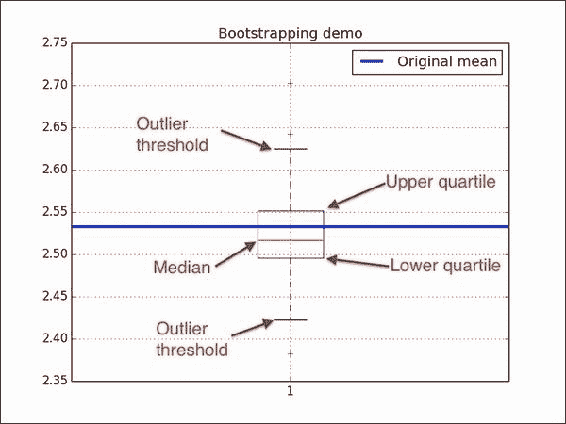

# 第 11 章。最新最强的 NumPy

在本章中，我们涵盖以下秘籍：

*   用`at()`方法用花式索引代替 ufuncs
*   通过使用`partition()`函数选择快速中位数进行部分排序
*   使用`nanmean()`，`nanvar()`和`nanstd()`函数跳过 NaN
*   使用`full()`和`full_like()`函数创建值初始化的数组
*   `numpy.random.choice()`随机抽样
*   使用`datetime64`类型和相关的 API

# 简介

自《NumPy 秘籍》第一版以来，NumPy 团队引入了新功能； 我将在本章中对其进行描述。 您可能不太可能阅读本书的第一版，而现在正在阅读第二版。 我在 2012 年撰写了第一版，并使用了当时可用的功能。 NumPy 具有许多功能，因此您不能期望涵盖所有功能，但是我在本章中介绍的功能相对重要。

# 使用 at（）方法为 ufuncs 建立了花式索引

`at()`方法已添加到 NumPy 1.8 的 NumPy 通用函数类中。 此方法允许就地进行花式索引。 花式索引是不涉及整数或切片的索引，这是正常的索引。 “就地”是指将更改输入数组的数据。

`at()`方法的签名为`ufunc.at(a, indices[, b])`。 索引数组对应于要操作的元素。 我们仅必须为具有两个操作数的通用函数指定`b`数组。

## 如何执行...

以下  步骤演示了`at()`方法的工作方式：

1.  Create an array with `7` random integers from `-4` to `4` with a seed of `44:`

    ```py
    np.random.seed(44)
    a = np.random.random_integers(-4, 4, 7)
    print(a)
    ```

    该数组如下所示：

    ```py
    [ 0 -1 -3 -1 -4  0 -1]

    ```

2.  Apply the `at()` method of the `sign` universal function to the third and fifth array elements:

    ```py
    np.sign.at(a, [2, 4])
    print(a)
    ```

    我们得到以下更改后的数组：

    ```py
    [ 0 -1 -1 -1 -1  0 -1]

    ```

## 另请参见

*   NumPy 通用功能文档位于[，http：//docs.scipy.org/doc/numpy/reference/ufuncs.html](http://docs.scipy.org/doc/numpy/reference/ufuncs.html)

# 使用 partition（）函数通过选择进行快速中位数的部分排序

`partition()`子例程进行部分排序。 这应该比正常的分类工作少。

### 注意

有关更多信息，请参见[这里](http://en.wikipedia.org/wiki/Partial_sorting)。 有用的情况是选择组中的前五项（或其他一些数字）。 部分排序不能在顶部元素集中保留正确的顺序。

子例程的第一个参数是要排序的输入数组。 第二个参数是整数或与数组元素的索引相对应的整数列表。 `partition()`子例程正确地对那些索引处的项目进行排序。 一个指定的索引给出两个分区。 多个索引导致两个以上的分区。 该算法保证分区中小于正确排序项目的项目位于该项目之前。 否则，它们将放在该项目的后面。

## 如何执行...

让我们  举例说明此解释：

1.  Create an array with random numbers to sort:

    ```py
    np.random.seed(20)
    a = np.random.random_integers(0, 7, 9)
    print(a)
    ```

    该数组具有以下元素：

    ```py
    [3 2 7 7 4 2 1 4 3]

    ```

2.  Partially sort the array by partitioning it into two roughly equal parts:

    ```py
    print(np.partition(a, 4))
    ```

    我们得到以下结果：

    ```py
    [2 3 1 2 3 7 7 4 4]

    ```

## 工作原理...

我们  对 9 个元素的数组进行了部分排序。 该函数保证索引`4,`的中间只有一个元素在正确的位置。 这对应于尝试选择数组的前五项而不关心前五组中的顺序。 由于正确排序的项目位于中间，因此这也将返回数组的中位数。

## 另请参见

*   [相关 NumPy 文档](http://docs.scipy.org/doc/numpy/reference/generated/numpy.partition.html)

# 使用 nanmean（），nanvar（）和 nanstd（）函数跳过 NaN

试图估计一组数据的算术平均值，方差和  标准差的变量是  很常见。

一种简单但有效的  方法称为 [**Jackknife 重采样**](http://en.wikipedia.org/wiki/Jackknife_resampling)。 Jackknife 重采样的想法是通过每次都遗漏一个值来从  原始数据创建数据集。 本质上，我们试图估计如果至少一个值不正确会发生什么。 对于每个新数据集，我们都会重新计算我们感兴趣的统计估计量。这有助于我们了解估计量的变化方式。

## 如何执行...

我们将折刀重采样应用于随机数据。 通过将其设置为 NaN（非数字），我们将跳过每个数组元素一次。 然后，可以使用`nanmean()`，`nanvar()`和`nanstd()`计算算术平均值，方差和标准差：

1.  首先为估算值初始化一个 30 x 3 的数组，如下所示：

    ```py
    estimates = np.zeros((len(a), 3))
    ```

2.  遍历数组并通过在循环的每次迭代中将一个值设置为 NaN 来创建新的数据集。 对于每个新数据集，计算估计值：

    ```py
    for i in xrange(len(a)):
       b = a.copy()
       b[i] = np.nan
       estimates[i,] = [np.nanmean(b), np.nanvar(b), np.nanstd(b)]
    ```

3.  Print the variance for every estimator:

    ```py
    print("Estimator variance", estimates.var(axis=0))
    ```

    屏幕上显示以下输出：

    ```py
    Estimator variance [ 0.00079905  0.00090129  0.00034604]

    ```

## 工作原理...

我们用折刀重采样估计了数据集的算术平均值，方差和标准差的方差。 这表明算术平均值，方差和标准差有多少变化。 该秘籍的  代码在本书的代码包的`jackknife.py` 文件中：

```py
from __future__ import print_function
import numpy as np

np.random.seed(46)
a = np.random.randn(30)
estimates = np.zeros((len(a), 3))

for i in xrange(len(a)):
   b = a.copy()
   b[i] = np.nan

   estimates[i,] = [np.nanmean(b), np.nanvar(b), np.nanstd(b)]

print("Estimator variance", estimates.var(axis=0))
```

## 另请参见

*   `nanmean()`的  文档页面是[上的](http://docs.scipy.org/doc/numpy-dev/reference/generated/numpy.nanmean.html)  ，http：//docs.scipy.org/doc/numpy-dev/reference/generation/numpy.nanmean.html
*   `nanvar()`的  文档页面位于[，http：//docs.scipy.org/doc/numpy-dev/reference/genic/numpy.nanvar.html](http://docs.scipy.org/doc/numpy-dev/reference/generated/numpy.nanvar.html)
*   `nanstd()`的  文档页面位于[，http：//docs.scipy.org/doc/numpy-dev/reference/genic/numpy.nanstd.html](http://docs.scipy.org/doc/numpy-dev/reference/generated/numpy.nanstd.html)

# 使用 full（）和 full_like（）函数创建值初始化的数组

`full()`和`full_like()` 功能  是 NumPy 的新增功能  ，旨在促进初始化。 这是文档中关于它们的内容：

```py
>>> help(np.full)
Return a new array of given shape and type, filled with `fill_value`.
>>> help(np.full_like)
Return a full array with the same shape and type as a given array.

```

## 如何执行...

让我们  看一下`full()`和`full_like()`的功能：

1.  Create a `1` by `2` array with `full()`, filled with the lucky number `7`:

    ```py
    print(np.full((1, 2), 7))
    ```

    因此，我们得到以下数组：

    ```py
    array([[ 7.,  7.]])

    ```

    数组元素是浮点数。

2.  Specify an integer data type, as follows:

    ```py
    print(np.full((1, 2), 7, dtype=np.int))
    ```

    输出相应地更改：

    ```py
    array([[7, 7]])

    ```

3.  `full_like()`函数检查数组的元数据，并将其重新用于新数组。 例如，使用`linspace()`创建一个数组，并将其用作`full_like()`函数的模板：

    ```py
    a = np.linspace(0, 1, 5)
    print(a)
    array([ 0\.  ,  0.25,  0.5 ,  0.75,  1\.  ])
    print(np.full_like(a, 7))
    array([ 7.,  7.,  7.,  7.,  7.])
    ```

4.  同样，我们  用幸运数字`7`填充阵列。 要将数据类型修改为整数，请在以下行中使用  ：

    ```py
    print(np.full_like(a, 7, dtype=np.int))
    array([7, 7, 7, 7, 7])
    ```

## 工作原理...

我们用`full()`和`full_like()`产生了  阵列。 `full()`函数用数字`7`填充数组。 `full_like()`函数重新使用了数组的元数据来创建新的数组。 这两个函数都可以指定数组的数据类型。

# 使用 numpy.random.choice（）进行随机采样

**自举**的过程类似于  粗加工。 基本的引导方法包括以下步骤：

1.  从大小为 N 的原始数据生成样本。将原始数据样本可视化为一碗数字。 我们通过从碗中随机抽取数字来创建新样本。 取一个数字后，我们将其放回碗中。
2.  对于每个生成的样本，我们计算感兴趣的统计估计量（例如，算术平均值）。

## 如何执行...

我们将  应用`numpy.random.choice()`进行引导：

1.  按照二项式分布生成数据样本，该数据样本模拟五次抛掷公平硬币：

    ```py
    N = 400
    np.random.seed(28)
    data = np.random.binomial(5, .5, size=N)
    ```

2.  生成 30 个样本并计算其平均值（更多样本将得到更好的结果）：

    ```py
    bootstrapped = np.random.choice(data, size=(N, 30))
    means = bootstrapped.mean(axis=0)
    ```

3.  Visualize the arithmetic means distribution with a `matplotlib` box plot:

    ```py
    plt.title('Bootstrapping demo')
    plt.grid()
    plt.boxplot(means)
    plt.plot(3 * [data.mean()], lw=3, label='Original mean')
    plt.legend(loc='best')
    plt.show()
    ```

    有关最终结果，请参考以下带注释的图：

    

## 工作原理...

我们模拟了一个实验，该实验涉及掷出五次公平硬币。 我们通过  创建样本并计算相应的方法来引导数据。 然后，我们使用`numpy.random.choice()`进行引导。 我们用`matplotlib`箱形图直观地表示了均值。 如果您不熟悉箱形图，图中的注释将对您有所帮助。 箱形图中的  以下元素很重要：

*   中位数由框中的一条线表示。
*   上下四分位数显示为框的边缘。
*   胡须指示异常值的边界。 默认情况下，这些值从框的边缘设置为`1.5 * (Q3 - Q1)`，也称为**四分位间距**。

## 另请参见

*   [NumPy `numpy.random.choice()`文档](http://docs.scipy.org/doc/numpy-dev/reference/generated/numpy.random.choice.html)
*   [`matplotlib boxplot()`函数文档](http://matplotlib.org/api/pyplot_api.html)
*   [有关箱形图的维基百科](http://en.wikipedia.org/wiki/Box_plot)

# 使用 datetime64 类型和相关的 API

`datetime64`类型  表示日期和相应的时间。 您需要 NumPy 1.7.0 或更高版本才能使用此数据类型。

## 如何执行...

要熟悉`datetime64`，请按照下列步骤操作：

1.  Create a `datetime64` from a string, as follows:

    ```py
    print(np.datetime64('2015-05-21'))
    ```

    前一行输出以下输出：

    ```py
    numpy.datetime64('2015-05-21')
    ```

    我们使用`YYYY-MM-DD`格式在 2015 年 5 月 21 日创建了`datetime64`类型，其中`Y`对应于年份，`M`对应于月份，`D`对应于每月的一天。 NumPy 符合 ISO 8601 标准-一种表示日期和时间的国际标准。

2.  ISO 8601 also defines the `YYYY-MM-DD`, `YYYY-MM`, and `YYYYMMDD` formats. Check these out for yourself, as follows:

    ```py
    print(np.datetime64('20150521'))
    print(np.datetime64('2015-05'))
    ```

    该代码显示以下行：

    ```py
    numpy.datetime64('20150521')
    numpy.datetime64('2015-05')

    ```

3.  By default, ISO 8601 uses the local time zone. The time can be specified using the `T[hh:mm:ss]` format. For example, we can define January 1, 1578, and the time 9:18 p.m. as follows:

    ```py
    local = np.datetime64('1578-01-01T21:18')
    print(local)
    ```

    以下行显示了结果：

    ```py
    numpy.datetime64('1578-01-01T21:18Z')

    ```

4.  A string in the `-[hh:mm]` format defines an offset relative to the UTC time zone. We can create a `datetime64` type with 8 hours of offset, as follows:

    ```py
    with_offset = np.datetime64('1578-01-01T21:18-0800')
    print(with_offset)
    ```

    然后，我们在屏幕上看到以下行：

    ```py
    numpy.datetime64('1578-01-02T05:18Z')

    ```

    最后的`Z`代表 Zulu 时间，有时也称为 UTC。

5.  Subtract the two `datetime64` objects from each other:

    ```py
    print(local - with_offset)
    ```

    结果显示如下：

    ```py
    numpy.timedelta64(-480,'m')

    ```

    减法创建一个`timedelta64` NumPy 对象，在这种情况下，它表示 480 分钟的增量。

## 工作原理...

您了解了`datetime64` NumPy 类型。 这种数据类型使我们可以轻松地操纵日期和时间。 它的功能包括简单的算术运算和使用常规 NumPy 功能创建数组。 请参考本书代码捆绑中的`datetime_demo.py`文件：

```py
import numpy as np

print(np.datetime64('2015-05-21'))
#numpy.datetime64('2015-05-21')

print(np.datetime64('20150521'))
print(np.datetime64('2015-05'))
#numpy.datetime64('20150521')
#numpy.datetime64('2015-05')

local = np.datetime64('1578-01-01T21:18')
print(local)
#numpy.datetime64('1578-01-01T21:18Z')

with_offset = np.datetime64('1578-01-01T21:18-0800')
print(with_offset)
#numpy.datetime64('1578-01-02T05:18Z')

print(local - with_offset)
```

## 另请参见

*   [相关的 NumPy 文档](http://docs.scipy.org/doc/numpy/reference/arrays.datetime.html)
*   [相关的 Wikipedia 页面](http://en.wikipedia.org/wiki/ISO_8601)