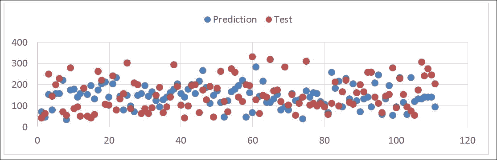

# 十、扩展阅读

NumPy 是 Python 中功能强大的科学模块； 希望在前九章中，我们已经向您展示了足以向您证明这一点的内容。 `ndarray`是所有其他 Python 科学模块的核心。 使用 NumPy 的最佳方法是使用`numpy.ndarray`作为基本数据格式，并将其与其他科学模块组合以进行预处理，分析，计算，导出等。 在本章中，我们的重点是向您介绍可以与 NumPy 一起使用的两个模块，并使您的工作/研究效率更高。

在本章中，我们将讨论以下主题：

*   大熊猫
*   scikit 学习
*   netCDF4
*   科学的

# 熊猫

到目前为止，pandas 是 Python 中最可取的数据预处理模块。 它处理数据的方式与 R 非常相似。它的数据框不仅为您提供视觉上吸引人的表打印输出，而且还允许您以更直观的方式访问数据。 如果您不熟悉 R，请尝试考虑以编程方式使用电子表格软件（例如 Microsoft Excel 或 SQL 表）。 这涵盖了熊猫所做的很多事情。

您可以从熊猫官方网站 [http://pandas.pydata.org/](http://pandas.pydata.org/) 下载并安装熊猫。 一种更可取的方法是使用 pip 或安装 Python 科学发行版，例如 Anaconda。

还记得我们如何使用`numpy.genfromtxt()`读取第 4 章， “Numpy 核心和子模块”中的`csv`数据吗？ 实际上，使用熊猫来读取表格并将经过预处理的数据传递给`ndarray`（简单地执行`np.array(data_frame)`会将数据帧转换为多维`ndarray`）对于分析来说是更可取的工作流程。 在本节中，我们将向您展示熊猫的两个基本数据结构：`Series`（用于一维）和`DataFrame`（用于二维或多维）。然后，我们将向您展示如何使用熊猫来读取 表并将数据传递给

然后，我们将向您展示如何使用熊猫读取表并将数据传递给`ndarray`进行进一步分析。 让我们从`pandas.Series`开始：

```py
In [1]: import pandas as pd 
In [2]: py_list = [3, 8, 15, 25, 11] 
In [3]: series = pd.Series(py_list) 
In [4]: series 
Out[4]: 
0     3 
1     8
2    15
3    25 
4    11 
dtype: int64 

```

在前面的示例中，您可以看到我们已经将 Python 列表转换为大熊猫`series`，并且在打印`series`时，这些值完美对齐并具有与之关联的索引号（0 到 4 ）。 当然，我们可以指定自己的索引（以 *1* 开头或以字母形式）。 看下面的代码示例：

```py
In [5]: indices = ['A', 'B', 'C', 'D', 'E'] 
In [6]: series = pd.Series(py_list, index = indices) 
In [7]: series 
Out[7]: 
A     3 
B     8 
C    15 
D    25 
E    11 
dtype: int64 

```

我们将索引从数字更改为从 *A〜E* 的字母。 更方便的是，当我们将 Python 词典转换为熊猫`Series`时，执行此操作所需的键将自动成为索引。 尝试练习转换字典。 接下来，我们将探索`DataFrame`，这是大熊猫中最常用的数据结构：

```py
In [8]: data = {'Name': ['Brian', 'George', 'Kate', 'Amy', 'Joe'], 
   ...:         'Age': [23, 41, 26, 19, 35]} 
In [9]: data_frame = pd.DataFrame(data) 
In [10]: data_frame 
Out[10]: 
   Age    Name 
0   23   Brian 
1   41  George
2   26    Kate 
3   19     Amy 
4   35     Joe 

```

在前面的示例中，我们创建了`DataFrame`，其中包含两列：第一个是`Name`，第二个是`Age`。 您可以从打印输出中看到它看起来像一张表格，因为它的格式正确。 当然，您也可以更改数据帧的索引。 但是，数据帧的优势远不止于此。 我们可以访问每列中的数据或对其进行排序（按列名，访问`data_frame.column_name`或`data_frame[column_name]`需要两个符号）； 我们甚至可以分析汇总统计信息。 为此，请看以下代码示例：

```py
In [11]: data_frame = pd.DataFrame(data) 
In [12]: data_frame['Age'] 
Out[12]: 
0    23 
1    41 
2    26 
3    19 
4    35 
Name: Age, dtype: int64 
In [13]: data_frame.sort(columns = 'Age') 
Out[13]: 
   Age    Name 
3   19     Amy 
0   23   Brian 
2   26    Kate 
4   35     Joe 
41  George 
In [14]: data_frame.describe() 
Out[14]: 
             Age 
count   5.000000 
mean   28.800000 
std     9.011104 
min    19.000000 
25%    23.000000 
50%    26.000000 
75%    35.000000 
max    41.000000 

```

在前面的示例中，我们仅获得`Age`列，并按`Age`对`DataFrame`进行排序。 当我们使用`describe()`时，它将计算所有数字字段的摘要统计信息（包括计数，均值，标准差，最小值，最大值和百分位数）。在本节的最后部分，我们将使用熊猫读取

在本节的最后部分，我们将使用熊猫读取`csv`文件并将一个字段值传递给`ndarray`以进行进一步的计算。 `example.csv`文件来自**国家统计局**（**ONS**）。 请访问 [http://www.ons.gov.uk/ons/datasets-and-tables/index.html](http://www.ons.gov.uk/ons/datasets-and-tables/index.html) 了解更多详细信息。 我们将在 ONS 网站上使用*房屋类型和地方当局（英格兰和威尔士）的销售计数*。 您可以按主题名称搜索它，以访问下载页面或选择您感兴趣的任何数据集。在以下示例中，我们将示例数据集重命名为`sales.csv`：

```py
In [15]: sales = pd.read_csv('sales.csv') 
In [16]: sales.shape 
Out[16]: (348, 97) 
In [17]: sales.columns[:3] 
Out[17]: Index([u'LA_Code', u'LA_Name', u'1995_COUNT_ALL_TYPES'], dtype='object') 
In [18]: sales['1995_COUNT_ALL_TYPES'].head() 
Out[18]: 
0    1,188 
1    1,652 
2    1,684 
3    2,314 
4    1,558 
Name: 1995_COUNT_ALL_TYPES, dtype: object 

```

首先，我们将`sale.csv`读入名为`sales`的`DataFrame`对象; 当我们打印销售的`shapes`时，我们发现数据框中有 384 条记录和 97 列。 `DataFrame column`属性的返回列表是一个普通的 Python 列表，我们在数据中打印了前三列：`LA_Code`，`LA_Name`和`1995_COUNT_ALL_TYPES`。 然后，我们使用`head()`功能在`1995_COUNT_ALL_TYPES`中打印了前五个记录（`tail()`函数将打印后五个记录）。

同样，pandas 是 Python 中一个功能强大的预处理模块（通常，其数据处理能力超过其预处理功能，但在前面的示例中，我们仅介绍了预处理部分），并且它具有许多方便的功能来帮助您清理数据并准备数据。 您的分析。 本节仅作介绍； 由于空间限制，我们无法涵盖很多内容，例如数据透视，`datetime`等。 希望您能理解并开始提高脚本的效率。

# scikit 学习

Scikit 是 SciPy 工具包的缩写，它是 SciPy 的附加软件包。 它提供了广泛的分析模块，而 scikit-learn 是其中之一。 这是迄今为止最全面的 Python 机器学习模块。 scikit-learn 提供了一种简单有效的方法来执行数据挖掘和数据分析，并且它拥有非常活跃的用户社区。

您可以从 scikit-learn 的官方网站下载并安装它，网址为 [http://scikit-learn.org/stable/](http://scikit-learn.org/stable/) 。 如果您使用的是 Python 科学发行版（例如 Anaconda），则也包含在其中。

现在，是时候使用 scikit-learn 进行一些机器学习了。 scikit-learn 的优点之一是它提供了一些用于实践的样本数据集（演示数据集）。 让我们首先加载糖尿病数据集。

```py
In [1]: from sklearn.datasets import load_diabetes 
In [2]: diabetes = load_diabetes() 
In [3]: diabetes.data 
Out[3]: 
array([[ 0.03807591,  0.05068012,  0.06169621, ..., -0.00259226, 
         0.01990842, -0.01764613], 
       [-0.00188202, -0.04464164, -0.05147406, ..., -0.03949338, 
        -0.06832974, -0.09220405], 
       [ 0.08529891,  0.05068012,  0.04445121, ..., -0.00259226, 
         0.00286377, -0.02593034], 
       ..., 
       [ 0.04170844,  0.05068012, -0.01590626, ..., -0.01107952, 
        -0.04687948,  0.01549073], 
       [-0.04547248, -0.04464164,  0.03906215, ...,  0.02655962, 
         0.04452837, -0.02593034], 
       [-0.04547248, -0.04464164, -0.0730303 , ..., -0.03949338, 
        -0.00421986,  0.00306441]]) 
In [4]: diabetes.data.shape 
Out[4]: (442, 10) 

```

我们从`sklearn.datasets`中加载了一个名为`diabetes`的样本数据集； 它包含 442 个观测值，10 个维度，范围从-2 到 2\. `Toy`数据集还提供了标记数据用于监督学习（如果您不熟悉机器学习，请尝试将标记数据视为类别）。 在我们的示例中，可以从`diabetes.target`调用`diabetes`数据集中的标记数据，范围为 25 到 346。

还记得我们在第 5 章， *numpy* 中的线性代数中如何进行线性回归吗？ 我们将使用 scikit-learn 再次执行它。 同样，我建议您在开发脚本以帮助您进行研究或分析时，请使用 NumPy `ndarray`作为常规数据格式； 但是，对于计算，使用 scipy，scikit-learn 或其他科学模块会更好。 机器学习的优势之一是模型评估（您可以在其中训练和测试结果）。 使用此方法，我们将数据分为两个数据集：训练数据集和测试数据集，然后将这两个数据集传递给线性回归：

```py
In [5]: from sklearn.cross_validation import train_test_split 
In [6]: X_train, X_test, y_train, y_test  = 
        train_test_split(diabetes.data, 
diabetes.target, 
random_state = 50) 

```

在前面的示例中，我们使用`train_test_split()`函数将糖尿病数据集分为训练和测试数据集（针对数据及其类别）。 前两个参数是我们要拆分的数组。 `random_state`参数是可选的，这意味着伪随机数生成器状态用于随机采样。 默认拆分率是 0.25，这意味着 75％的数据拆分为训练集，而 25％的数据拆分为测试集。 您可以尝试打印出我们刚刚创建的训练/测试数据集，以查看其分布情况（在前面的代码示例中，`X_train`代表糖尿病数据的训练数据集，`X_test`代表糖尿病测试数据，`y_train`代表分类的糖尿病训练数据，`y_test`代表分类的糖尿病测试数据。

接下来，我们将数据集拟合为线性回归模型：

```py
In [7]: from sklearn.linear_model import LinearRegression 
In [8]: lr = LinearRegression() 
In [9]: lr.fit(X_train, y_train) 
Out[9]: LinearRegression(copy_X = True, fit_intercept = True, 
     Normalize = False) 
In [10]: lr.coef_ 
Out[10]: 
array([  80.73490856, -195.84197988,  474.68083473,  371.06688824, 
       -952.26675602,  611.63783483,  174.40777144,  159.78382579, 
        832.01569658,   12.04749505]) 

```

首先，我们从`sklearn.linear_model`创建了一个`LinearRegression`对象，并使用`fit()`函数拟合了`X_train`和`y_train`数据集。 我们可以通过调用`coef_`属性来检查线性回归的估计系数。 此外，我们可以使用拟合的线性回归进行预测。 看下面的例子：

```py
In [11]: lr.predict(X_test)[:10] 
Out[11]: 
array([  71.96974998,   82.55916305,  265.71560021,   79.37396336, 
         72.48674613,   47.01580194,  149.11263906,  185.36563936, 
         94.88688296,  132.08984366]) 

```

`predict()`函数用于基于我们拟合训练数据集的线性回归来预测测试数据集； 在前面的示例中，我们打印了前 10 个预测值。 这是`y`的预测值和测试值的图：



```py
In [12]: lr.score(X_test, y_test) 
Out[12]: 0.48699089712593369 

```

然后，我们可以使用`score()`函数检查预测的确定 R 平方。

这几乎是 scikit 学习中的标准拟合和预测过程，并且非常直观且易于使用。 当然，除了回归之外，scikit-learn 还可以执行许多分析，例如分类，聚类和建模。 希望本节对您的脚本有所帮助。

# netCDF4

netCDF4 是 netCDF 库的第四个版本，该库是在 HDF5（分层数据格式，旨在存储和组织大量数据）的基础上实现的，从而可以管理非常大和复杂的多维数据。 netCDF4 的最大优点是，它是一种完全可移植的文件格式，对集合中数据对象的数量或大小没有限制，并且在可归档的同时也可以追加。 许多科研组织将其用于数据存储。 Python 还具有访问和创建此类数据格式的接口。

您可以从 [http://unidata.github.io/netcdf4-python/](http://unidata.github.io/netcdf4-python/) 的官方文档页面下载并安装该模块，或从 [https：// github 的 GitHub 存储库中克隆该模块。 .com / Unidata / netcdf4-python](https://github.com/Unidata/netcdf4-python) 。 它不包含在标准的 Python Scientific 发行版中，但已内置在 NumPy 中，可以与 Cython 一起构建（建议但并非必需）。

对于以下示例，我们将使用 Unidata 网站上的示例`netCDF4`文件，该文件位于 [http://www.unidata.ucar.edu/software/netcdf/examples/files.html](http://www.unidata.ucar.edu/software/netcdf/examples/files.html) ，并且 我们将以气候系统模型为例：`sresa1b_ncar_ccsm3-example.nc`

首先，我们将使用`netCDF4`模块稍微探索一下数据集，并提取我们需要进行进一步分析的值：

```py
In [1]: import netCDF4 as nc 
In [2]: dataset = nc.Dataset('sresa1b_ncar_ccsm3-example.nc', 'r') 
In [3]: variables = [var for var in dataset.variables] 
In [4]: variables 
Out[4]: 
['area', 'lat', 'lat_bnds', 'lon', 'lon_bnds', 'msk_rgn', 'plev', 
'pr', 'tas', 'time', 'time_bnds', 'ua'] 

```

我们导入了 python `netCDF4`模块，并使用`Dataset()`函数读取了示例`netCDF4`文件。 `r`参数表示文件处于只读模式，因此当我们要附加文件或`w`创建新文件时，我们也可以指定`a`。 然后，我们获得了存储在数据集中的所有变量，并将它们保存到名为变量的列表中（请注意，variables 属性将返回变量对象的 Python 字典）。 最后，我们使用以下命令在数据集中打印出变量：

```py
In [5]: precipitation = dataset.variables['pr'] 
In [6]: precipitation.standard_name 
Out[6]: 'precipitation_flux' 
In [7]: precipitation.missing_value 
Out[7]: 1e+20 
In [8]: precipitation.ndim 
Out[8]: 3 
In [9]: precipitation.shape 
Out[9]: (1, 128, 256) 
In [10]: precipitation[:, 1, :10] 
Out[10]: 
array([[  8.50919207e-07,   8.01471970e-07,   7.74396426e-07, 
          7.74230614e-07,   7.47181844e-07,   7.21426375e-07, 
          7.19294349e-07,   6.99790974e-07,   6.83397502e-07, 
          6.74683179e-07]], dtype=float32) 

```

在前面的示例中，我们选择了一个名为`pr`的变量并将其保存到`precipitation`中。 众所周知`netCDF4`是一种自我描述的文件格式; 您可以创建和访问存储在变量中的任何用户定义属性，尽管最常见的是`standard_name`，它告诉我们该变量代表降水通量。 我们检查了另一个常用属性`missing_value`，该属性表示存储在`netCDF4`文件中的无数据值。 然后，我们通过`ndim`来打印降水量的维数，并通过`shape`属性来打印形状。 最后，我们要获取第 1 行的值，即`netCDF4`文件中的前 10 列; 为此，只需像往常一样使用索引。

接下来，我们将介绍创建`netCDF4`文件并将三维 NumPy `ndarray`作为变量存储的基础知识：

```py
In [11]: import numpy as np 
In [12]: time = np.arange(10) 
In [13]: lat = 54 + np.random.randn(8) 
In [14]: lon = np.random.randn(6) 
In [15]: data = np.random.randn(480).reshape(10, 8, 6) 

```

首先，我们准备了一个三维`ndarray`（数据）以存储在`netCDF4`文件中； 数据建立在三个维度中，分别是时间（`time`，大小为 10），纬度（`lat`，大小为 8）和经度（`lon`，大小为 6）。 在`netCDF4`中，时间不是`datetime`对象，而是从定义的开始时间（在`unit`属性中指定）开始的时间单位数（可以是秒，小时，天等）。 稍后再向您解释）。 现在，我们拥有了要存储在文件中的所有数据，因此让我们构建 netCDF 结构：

```py
In [16]: output = nc.Dataset('test_output.nc', 'w') 
In [17]: output.createDimension('time', 10) 
In [18]: output.createDimension('lat', 8) 
In [19]: output.createDimension('lon', 6) 
In [20]: time_var = output.createVariable('time', 'f4', ('time',)) 
In [21]: time_var[:] = time 
In [22]: lat_var = output.createVariable('lat', 'f4', ('lat',)) 
In [23]: lat_var[:] = lat 
In [24]: lon_var = output.createVariable('lon', 'f4', ('lon',)) 
In [25]: lon_var[:] = lon 

```

我们通过指定文件路径并使用`w`写入模式来初始化`netCDF4`文件。 然后，我们使用`createDimension()`构建结构以指定尺寸：`time`，`lat`和`lon`。 每个尺寸都有一个变量来表示其值，就像轴的刻度一样。 接下来，我们将把三维数据保存到文件中：

```py
In [26]: var = output.createVariable('test', 'f8', ('time', 'lat', 'lon')) 
In [27]: var[:] = data 

```

变量的创建始终从`createVariable()`函数开始，并指定变量名称，变量数据类型以及与其关联的维。 第二步是将`ndarray` 的相同形状传递到声明的变量中。 现在我们已经将整个数据存储在文件中，我们可以指定属性以帮助描述数据集。 以下示例使用`time`变量说明如何指定属性：

```py
In [28]: time_var.standard_name = 'Time' 
In [29]: time_var.units = 'days since 2015-01-01 00:00:00' 
In [30]: time_var.calendar = 'gregorian' 

```

因此，现在时间变量已与单位和日历相关联，因此`ndarray`时间将根据我们指定的单位和日历转换为日期； 这类似于所有变量。 完成`netCDF4`文件的创建后，最后一步是关闭文件连接：

```py
In [31]: output.close() 

```

上面的代码向您展示了 Python netCDF4 API 的用法，以便读取和创建`netCDF4`文件。 该模块不包含任何科学计算（因此它不包含在任何 Python 科学发行版中），但是目标位于文件 I/O 的接口中，该接口可以是研究和分析的第一阶段或最后阶段。

# 科学

SciPy 是一个着名的 Python 库，专注于科学计算（它包含用于优化，线性代数，积分，内插以及诸如 FFT，信号和图像处理等特殊功能的模块）。 它建立在 NumPy 数组对象的基础上，并且 NumPy 是整个 SciPy 堆栈的一部分（请记住，我们在第 1 章， “NumPy 简介”）。 但是，SciPy 模块包含各种主题，而我们不能仅在一个部分中进行介绍。 让我们看一个图像处理（降噪）示例，以帮助您了解 SciPy 可以做什么：

```py
In [1]: from scipy.misc import imread, imsave, ascent 
In [2]: import matplotlib.pyplot as plt 
In [3]: image_data = ascent() 

```

首先，我们从 SciPy 的其他例程中导入三个函数：`imread`，`imsave`和`ascent`。 在下面的示例中，我们使用内置图像`ascent`，它是 512 x 512 灰度图像。 当然，您可以使用自己的图像。 只需调用`imread('your_image_name')`，它将作为`ndarray`加载。

我们在此处导入的`matplotlib`模块的`pyplot`结果仅用于显示图像； 我们在第 6 章，*在 NumPy* 中进行了傅里叶分析。 这是内置图像`ascent`：


现在，我们可以为图像添加一些噪点，并使用`pyplot`模块显示噪点图像：

```py
In [4]: import numpy as np 
In [5]:noise_img = image_data +  image_data.std() * np.random.random(image_data.shape) 
In [6]: imsave('noise_img.png', noise_img) 
In [7]: plt.imshow(noise_img) 
Out[7]: <matplotlib.image.AxesImage at 0x20066572898> 
In [8]: plt.show() 

```

在此代码段中，我们导入`numpy`以根据图像形状生成一些随机噪声。 然后，将噪点图像保存到`noise_img.png`。 噪点图像如下所示：


接下来，我们将使用 SciPy `scipy.ndimage`中的多维图像处理模块对噪波图像应用滤镜以使其平滑。 `ndimage`模块提供各种过滤器； 有关详细列表，请参考 [http://docs.scipy.org/doc/scipy/reference/ndimage.html](http://docs.scipy.org/doc/scipy/reference/ndimage.html) ，但是在以下示例中，我们将仅使用高斯和均匀滤波器：

```py
In [9]: from scipy import ndimage 
In [10]: gaussian_denoised = ndimage.gaussian_filter(noise_img, 3) 
In [11]: imsave('gaussian_denoised.png', gaussian_denoised ) 
In [12]: plt.imshow(gaussian_denoised) 
Out[12]: <matplotlib.image.AxesImage at 0x2006ba54860> 
In [13]: plt.show() 
In [14]: uniform_denoised = ndimage.uniform_filter(noise_img) 
In [15]: imsave('uniform_denoised.png', uniform_denoised) 
In [16]: plt.imshow(gaussian_denoised) 
Out[17]: <matplotlib.image.AxesImage at 0x2006ba80320> 
In [18]: plt.show() 

```


首先，我们从 SciPy 导入`ndimage`，在`noise_image`上应用高斯滤波器，将`sigma`（高斯内核的标准偏差）设置为`3`，然后将其保存到`gaussian_denoised.png`。 查看上一张图片的左侧。 通常，sigma 越大，图像将越平滑，这意味着细节丢失。 我们应用的第二个过滤器是 Uniform 过滤器，并采用了所有参数的默认值，这将导致上一张图像的右侧。 尽管统一滤波器保留了原始图像的更多细节，但图像仍包含噪点。

上一个示例是使用 SciPy 的简单图像处理示例。 但是，SciPy 不仅可以处理图像处理，还可以执行许多类型的分析/科学计算。 有关详细信息，请参阅*数值科学计算学习科学*，*第二版*， *Packt Publishing* 。

# 摘要

NumPy 当然是使用 Python 进行科学计算的核心：许多模块都基于 NumPy。 尽管有时您可能会发现 NumPy 没有分析模块，但它无疑为您提供了一种接触广泛科学模块的方法。

我们希望本书的最后一章为您提供了一个关于将这些模块与 NumPy 一起使用的好主意，并使您的脚本更加有效（本书中无法涵盖很多便捷的 NumPy 模块；仅在 GitHub 上度过了一个下午 或 PyPI，您可能会发现其中的少数几个）。 最后但并非最不重要的一点，感谢您花时间与我们一起完成许多功能。 现在与 NumPy 一起玩吧！