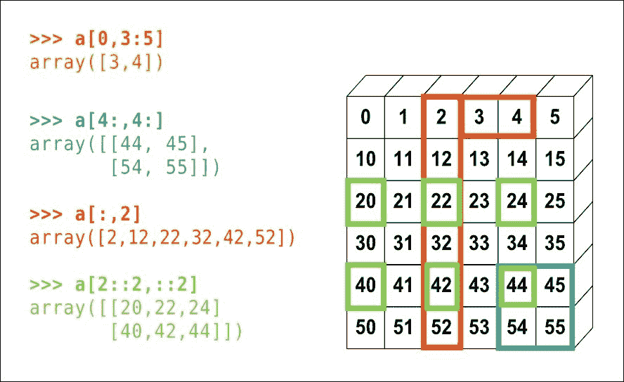

# 二、NumPy `ndarray`对象

面向数组的计算是计算科学的核心。 这是大多数 Python 程序员都不习惯的。 尽管列表或字典的理解是相对于数组的，有时与数组的用法类似，但是在性能和​​操作上，列表/字典和数组之间还是存在巨大差异。 本章介绍了 NumPy 中的基本数组对象。 它涵盖了可以从 NumPy 数组的固有特性中收集的信息，而无需对该数组执行任何外部操作。

本章将涉及的主题如下：

*   `numpy.ndarray`以及如何使用它-面向基本数组的计算
*   `numpy.ndarray`内存访问，存储和检索的性能
*   索引，切片，视图和副本
*   数组数据类型

# numpy.ndarray 入门

在本节中，我们将介绍 numpy ndarray 的一些内部结构，包括其结构和行为。 开始吧。 在 IPython 提示符中输入以下语句：

```py
In [1]: import numpy as np 

In [2]: x = np.array([[1,2,3],[2,3,4]]) 

In [3]: print(x)
```

NumPy 与其他模块（例如 Python 标准库中的 math 模块）中的函数共享其函数名称。 不建议使用如下所示的导入：

```py
from numpy import * 

```

因为它可能会覆盖全局名称空间中已经存在的许多功能，所以不建议这样做。 这可能会导致您的代码出现意外行为，并可能在其中引入非常细小的错误。 这也可能会在代码本身中造成冲突（例如 numPy 具有`any`并会与系统`any`关键字发生冲突），并可能在检查或调试一段代码时引起混乱。 因此，重要的是建议始终使用带有显式名称的导入 numPy，例如第一行中使用的`np`约定：-`import numpy as np`，这是用于导入目的的标准约定，因为它有助于 开发人员找出功能的来源。 这可以避免大型程序中的许多混乱。

如我们将看到的，可以用多种方式创建 NumPy 数组。 创建数组的最简单方法之一是使用`array`函数。 注意，我们向函数传递了一个列表列表，组成列表的长度相等。 每个组成列表成为数组中的一行，并且这些列表的元素填充了结果数组的列。 `array`函数可以在列表甚至嵌套列表上调用。 由于此处输入的嵌套级别是 2，因此生成的数组是二维的。 这意味着可以使用两个整数集对数组进行索引。 计算数组维数的最简单方法是检查数组的`ndim`属性：

```py
In [4]: x.ndim 

Out [4]: 2 

```

这也可以通过检查数组的`shape`属性以其他（间接）方式来实现。 数组的维数将等于您在`shape`属性中看到的数字。 （但是请注意，这并不是`shape`属性的目的。）：

```py
In [5]: x.shape 

Out [5]: (2, 3) 

```

这意味着该数组具有两行三列。 重要的是要注意，与 MATLAB 和 R 不同，NumPy 数组的索引是从零开始的。 也就是说，NumPy 数组的第一个元素索引为零，而最后一个元素索引为整数 n-1，其中 n 是数组沿相应维度的长度。 因此，对于我们刚刚创建的数组，可以使用一对零来访问数组左上角的元素，并且可以使用索引来访问右下角的元素（`1`，`2`）：

```py
In [6]: x 

Out[6]: 
array([[1, 2, 3], 
       [2, 3, 4]]) 

In [7]: x[0,0] 

Out[7]: 1 

In [8]: x[1,2] 

Out[8]: 4 

```

ndarray 对象具有许多有用的方法。 要获取可以在 ndarray 对象上调用的方法的列表，请在 IPython 提示符下键入`array`变量（在前面的示例中为`x`），然后按`TAB`。 这应该列出该对象可用的所有方法。 作为练习，尝试与其中一些玩耍。

# 数组索引和切片

NumPy 为数组提供了强大的索引功能。 NumPy 中的索引功能变得如此流行，以至于其中许多功能又重新添加到 Python 中。

在许多方面，为 NumPy 数组建立索引与为列表或元组建立索引非常相似。 存在一些差异，随着我们的进行，这些差异将变得显而易见。 首先，让我们创建一个尺寸为 100 x 100 的数组：

```py
In [9]: x = np.random.random((100, 100)) 

```

简单的整数索引的工作方式是在一对方括号内键入索引，然后将其放置在数组变量旁边。 这是一种广泛使用的 Python 构造。 具有`__getitem__`方法的任何对象都将响应此类索引。 因此，要访问第 42 <sup class="calibre26">行和</sup>行以及第 87 <sup class="calibre26">行</sup>列中的元素，只需键入：

```py
In [10]: y = x[42, 87] 

```

像列表和其他 Python 序列一样，也支持使用冒号为一系列值建立索引。 以下语句将打印`x`矩阵的`k` <sup class="calibre26">第</sup>行。

```py
In [11]: print(x[k, :]) 

```

冒号可以被认为是*所有元素*的字符。 因此，前面的语句实际上意味着打印第`k`行的所有字符。 同样，可以使用`x[:,k]`访问列。 反转数组也类似于反转列表，例如`x[::-1]`。

数组的索引部分也称为数组的*切片*，它创建端口或整个数组的副本（我们将在后面的部分中介绍副本和视图） 。 在数组的上下文中，单词“切片”和“索引”通常可以互换使用。

下图显示了不同切片和索引技术的非常简洁的概述：



# ndarray 的内存布局

ndarray 对象的一个​​特别有趣的属性是`flags`。 输入以下代码：

```py
In [12]: x.flags 

```

它应该产生如下内容：

```py
Out[12]: 
  C_CONTIGUOUS : True 
  F_CONTIGUOUS : False 
  OWNDATA : True 
  WRITEABLE : True 
  ALIGNED : True 
  UPDATEIFCOPY : False 

```

`flags`属性保存有关数组的内存布局的信息。 输出中的`C_CONTIGUOUS`字段指示该数组是否为 C 样式数组。 这意味着该数组的索引就像 C 数组一样完成。 在 2D 数组的情况下，这也称为行优先索引。 这意味着，当在数组中移动时，行索引将首先增加，然后列索引将增加。 在多维 C 样式数组的情况下，最后一个维度首先递增，然后是最后一个，但最后一个递增，依此类推。

同样，`F_CONTIGUOUS`属性指示该数组是否为 Fortran 样式的数组。 据说这样的数组具有列主索引（R，Julia 和 MATLAB 使用列主数组）。 这意味着，当在数组中移动时，第一个索引（沿着列）首先增加。

知道索引样式之间的差异很重要，尤其是对于大型数组，因为如果以正确的方式应用索引，则可以大大加快对数组的操作。 让我们通过练习来演示这一点。

声明一个数组，如下所示：

```py
In [13]: c_array = np.random.rand(10000, 10000) 

```

这将产生一个名为`c_array`的变量，它是一个二维数组，其随机数为一亿。 （我们使用了 NumPy 中`random`子模块中的`rand`函数，我们将在下一部分中对其进行处理）。 接下来，从`c_array`创建一个 Fortran 样式的数组，如下所示：

```py
In [14]: f_array = np.asfortranarray(c_array) 

```

您可以通过读取`flags`属性来分别检查`c_array`和`f_array`是否确实为 C 和 Fortran 风格。 接下来，我们定义以下两个函数：

```py
In [15]: def sum_row(x):
         '''
         Given an array `x`, return the sum of its zeroth row.
         '''
         return np.sum(x[0, :])
In [16]: def sum_col(x):
         '''
         Given an array `x`, return the sum of its zeroth column.
         '''
         return np.sum(x[:, 0])
```

现在，让我们使用 IPython 的`%timeit`魔术函数在两个数组上测试这两个函数的性能：

### 注意

IPython 提供了一些魔术函数来帮助我们更好地理解代码。 有关更多详细信息，请参见： [http://ipython.readthedocs.org/en/stable/interactive/magics.html?highlight=magic](http://ipython.readthedocs.org/en/stable/interactive/magics.html?highlight=magic) 。

```py
In [17]: %timeit sum_row(c_array) 
10000 loops, best of 3: 21.2 µs per loop 

In [18]: %timeit sum_row(f_array) 
10000 loops, best of 3: 157 µs per loop 

In [19]: %timeit sum_col(c_array) 
10000 loops, best of 3: 162 µs per loop 

In [20]: %timeit sum_col(f_array) 
10000 loops, best of 3: 21.4 µs per loop 

```

如我们所见，对 C 数组的行求和比对其列求和要快得多。 这是因为，在 C 数组中，一行中的元素被放置在连续的内存位置中。 对于 Fortran 数组，情况恰好相反，其中列的元素布置在连续的内存位置中。

### 提示

请注意，确切的数字可能会因所使用的操作系统，RAM 和 Python 发行版而异，但是执行时间之间的相对顺序应保持不变。

这是一个重要的区别，它使您可以根据要执行的算法或运算的类型将数据适当地排列在一个数组中。 知道这种区别可以帮助您将代码加速几个数量级。

# 视图和副本

通过切片和索引访问数据主要有两种方法。 它们称为副本和视图：您可以直接从数组访问元素，也可以创建仅包含访问的元素的数组副本。 由于视图是原始数组的引用（在 Python 中，所有变量都是引用），因此修改视图也将修改原始数组。 对于副本，情况并非如此。

NumPy 其他例程中的`may_share_memory`函数可用于确定两个数组是彼此的副本还是彼此的视图。 尽管此方法在大多数情况下都能胜任，但由于使用启发式方法，因此并不总是可靠的。 它也可能返回错误的结果。 但是，出于介绍性目的，我们将其视为理所当然。

通常，切片数组会创建一个视图，对其进行索引会创建一个副本。 让我们通过一些代码片段研究这些差异。 首先，让我们创建一个随机的 100x10 数组。

```py
In [21]: x = np.random.rand(100,10) 

```

现在，让我们提取数组的前五行，并将它们分配给变量`y`。

```py
In [22]: y = x[:5, :] 

```

让我们看看`y`是否是`x`的视图。

```py
In [23]: np.may_share_memory(x, y) 

Out[23]: True 

```

现在让我们修改数组`y`，看看它如何影响`x`。 将`y`的所有元素设置为零：

```py
In [24]: y[:] = 0 

In [25]: print(x[:5, :]) 
Out[25]: [[ 0\.  0\.  0\.  0\.  0\.  0\.  0\.  0\.  0\.  0.] 
[ 0\.  0\.  0\.  0\.  0\.  0\.  0\.  0\.  0\.  0.] 
[ 0\.  0\.  0\.  0\.  0\.  0\.  0\.  0\.  0\.  0.] 
[ 0\.  0\.  0\.  0\.  0\.  0\.  0\.  0\.  0\.  0.] 
          [ 0\.  0\.  0\.  0\.  0\.  0\.  0\.  0\.  0\.  0.]] 

```

该代码段打印出五行零。 这是因为`y`只是一个视图，是对`x`的引用。

接下来，让我们创建一个副本以查看区别。 我们使用前面的方法使用随机函数来创建`x`数组，但是这次我们使用`numpy.empty`初始化`y`数组以首先创建一个空数组，然后将值从`x`复制到`y`。 因此，现在`y`不再是`x`的视图/参考； 它是一个独立的数组，但具有与`x`相同的值。 让我们再次使用`may_share_memory`函数来验证`y`是`x`的副本：

```py
In [26]: x = np.random.rand(100,10) 

In [27]: y = np.empty([5, 10]) 

In [28]: y[:] = x[:5, :] 

In [29]: np.may_share_memory(x, y) 
Out[29]: False 

```

让我们更改`y`中的值，并检查`x`的值是否也发生变化：

```py
In [30]: y[:] = 0 
In [31]: print(x[:5, :]) 

```

您应该看到前面的代码段在初始化`x`时打印了五行随机数，因此将`y`更改为`0`不会影响`x`。

# 创建数组

数组可以通过多种方式创建，例如从其他数据结构，通过读取磁盘上的文件或从 Web 创建。 就本章而言，其目的是使我们熟悉 NumPy 数组的核心特性，我们将使用列表或各种 NumPy 函数创建数组。

## 从列表创建数组

创建数组的最简单方法是使用`array`函数。 若要创建有效的数组对象，数组函数的参数必须至少满足以下条件之一：

*   它必须是有效的可迭代值或序列，可以嵌套
*   它必须具有返回有效的 numpy 数组的`__array__`方法

考虑以下代码段：

```py
In [32]: x = np.array([1, 2, 3]) 

In [33]: y = np.array(['hello', 'world']) 

```

第一个条件对于 Python 列表和元组始终为 true。 从列表或元组创建数组时，输入可能包含不同的（异构）数据类型。 但是，数组函数通常会将所有输入元素转换为数组所需的最合适的数据类型。 例如，如果列表同时包含浮点数和整数，则结果数组将为 float 类型。 如果它包含一个整数和一个布尔值，则结果数组将由整数组成。 作为练习，请尝试从包含任意数据类型的列表创建数组。

使用`range`函数是创建整数列表以及数组的最便捷方法之一：

```py
In [34]: x = range(5) 

In [35]: y = np.array(x) 

```

NumPy 具有称为`arange`的便捷功能，该功能结合了`range`和`array`功能的功能。 前两行代码与此等效：

```py
In [36]: x = np.arange(5) 

```

对于多维数组，只需嵌套输入列表，如下所示：

```py
In [37]: x = np.array([[1, 2, 3],[4, 5, 6]]) 

In [38]: x.ndim 
Out[38]: 2 

In [39]: x.shape 
Out[39]: (2, 3) 

```

前面的示例仅说明如何从现有数组或一系列数字创建 NumPy 数组。 接下来，我们将讨论创建具有随机数的数组。

## 创建随机数组

NumPy 中的`random`模块提供了各种功能来创建任何数据类型的随机数组。 在整本书中，我们将非常频繁地使用此模块来演示 NumPy 中函数的工作。 `random`模块大致由以下功能组成：

*   创建随机数组
*   创建数组的随机排列
*   生成具有特定概率分布的数组

我们将在本书中详细介绍所有这些内容。 在本章中，我们将重点介绍`random`模块中的两个重要功能-`rand`和`random`。 这是一个简单的代码段，展示了这两个功能的使用：

```py
In [40]: x = np.random.rand(2, 2, 2) 

In [41]: print(x.shape) 
Out[41]: (2, 2, 2) 

In [42]: shape_tuple = (2, 3, 4) 

In [43]: y = np.random.random(shape_tuple) 

In [44]: print(y.shape) 
Out[44]: (2, 3, 4) 

```

注意传递给两个函数的参数之间的细微差别。 随机函数接受*元组*作为参数，并创建维数等于元组长度的数组。 各个尺寸的长度等于元组的元素。 另一方面，`rand`函数采用任意数量的*整数参数*，并返回一个随机数组，使得其维数等于传递给该函数的整数参数的数量 ，并且各个维度的长度等于整数参数的值。 因此，前面的代码段中的`x`是三维数组（传递给函数的参数数量），并且`x`的三个维度中的每个维度的长度均为 *2* （每个参数的值）。 `rand`是`random`的便捷功能。 这两个函数可以互换使用，只要传递的参数分别对两个函数均有效即可。

但是，这两个函数的主要缺点是-它们只能创建浮点数组。 如果我们想要一个随机整数数组，则必须将这些函数的输出转换为整数。 但是，这也是一个重大问题，因为 NumPy 的`int`函数将浮点数截断为最接近 0 的整数（这与`floor`函数等效）。 因此，将`rand`或`random`的输出强制转换为整数将始终返回零数组，因为这两个函数都返回`[0, 1)`区间内的浮点数。 可以使用`randint`功能解决此问题，如下所示：

```py
In [45]: LOW, HIGH = 1, 11 

In [46]: SIZE = 10 

In [47]: x = np.random.randint(LOW, HIGH, size=SIZE) 

In [48]: print(x) 
Out[48]: [ 6  9 10  7  9  5  8  8  9  3] 

```

`randint`函数带有三个参数，其中两个是可选的。 第一个参数表示输出值的期望下限，第二个可选参数表示输出值的（专有）上限。 可选的`size`参数是一个元组，用于确定输出数组的形状。

还有许多其他功能，例如将随机数生成器植入随机子模块中。 有关详细信息，请参考：

[http://docs.scipy.org/doc/numpy/reference/routines.random.html](http://docs.scipy.org/doc/numpy/reference/routines.random.html)

## 其他数组

还有一些其他的数组创建函数，例如`zeros()`，`ones()`，`eye()`和其他一些函数（类似于 MATLAB 中的函数）可用于创建 NumPy 数组。 它们的使用非常简单。 数组也可以从文件或从 Web 填充。 我们将在下一章中处理文件 I/O。

# 数组数据类型

数据类型是 NumPy 数组的另一个重要内在方面，它的内存布局和索引也是如此。 只需检查数组的`dtype`属性即可找到 NumPy 数组的数据类型。 尝试以下示例检查不同数组的数据类型：

```py
In [49]: x = np.random.random((10,10)) 

In [50]: x.dtype 
Out[50]: dtype('float64') 
In [51]: x = np.array(range(10)) 

In [52]: x.dtype 
Out[52]: dtype('int32') 

In [53]: x = np.array(['hello', 'world']) 

In [54]: x.dtype 
Out [54]: dtype('S5') 

```

许多数组创建函数提供默认的数组数据类型。 例如，`np.zeros`和`np.ones`函数默认创建充满浮点数的数组。 但是也可以使它们创建其他数据类型的数组。 考虑以下示例，这些示例演示如何使用 dtype 参数创建任意数据类型的数组。

```py
In [55]: x = np.ones((10, 10), dtype=np.int) 

In [56]: x.dtype 
Out[56]: dtype('int32') 

In [57]: x = np.zeros((10, 10), dtype='|S1') 

In [58]: x.dtype 
Out[58]: dtype('S1') 

```

有关 NumPy 支持的数据类型的完整列表，请参考 [http://docs.scipy.org/doc/numpy/user/basics.types.html](http://docs.scipy.org/doc/numpy/user/basics.types.html) 。

# 摘要

在本章中，我们介绍了 NumPy ndarray 对象的一些基础知识。 我们研究了一些创建 NumPy 数组的基本方法。 我们还研究了数组的副本和视图之间的差异，以及它们如何影响使用索引和切片的情况。 我们看到了 NumPy 提供的内存布局之间的细微差别。 现在，我们已经配备了 ndarray 对象的基本词汇，并且可以开始使用 NumPy 的核心功能。 在下一章中，我们将探索 ndarray 的更多细节，并使用某些技巧和窍门（通用函数和形状操作）向您展示其中的一些技巧，以使您的 NumPy 脚本加速！