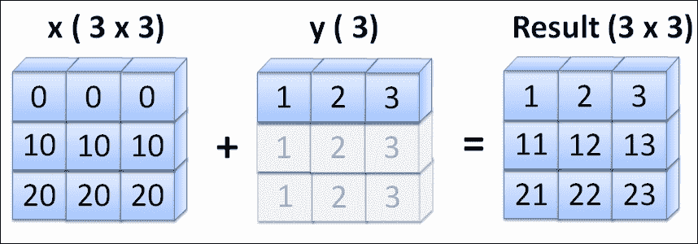
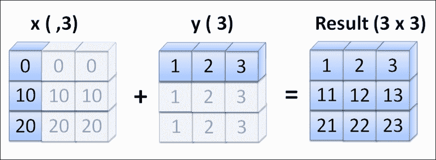
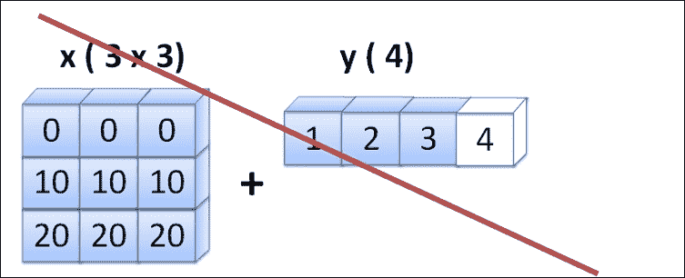

# 三、使用 NumPy 数组

NumPy 数组的优点在于您可以使用数组索引和切片来快速访问数据或执行计算，同时保持 C 数组的效率。 还支持许多数学运算。 在本章中，我们将深入研究使用 NumPy 数组。 在本章结束之后，您将对使用 NumPy 数组及其大部分功能感到满意。

这是本章将涉及的主题列表：

*   NumPy 数组的基本操作和属性
*   通用函数（ufuncs）和辅助函数
*   广播规则和形状操纵
*   掩盖 NumPy 数组

# 向量化运算

所有 NumPy 操作都是矢量化的，您可以将操作应用于整个数组，而不是分别应用于每个元素。 与使用循环相比，这不仅整齐方便，而且还提高了计算性能。 在本节中，我们将体验 NumPy 向量化操作的强大功能。 在开始探索此主题之前，一个值得牢记的关键思想是始终考虑整个数组集而不是每个元素。 这将帮助您享受有关 NumPy 数组及其性能的学习。 让我们从标量和 NumPy 数组之间进行一些简单的计算开始：

```
In [1]: import numpy as np 
In [2]: x = np.array([1, 2, 3, 4]) 
In [3]: x + 1 
Out[3]: array([2, 3, 4, 5]) 

```

数组中的所有元素通过`1`同时添加。 这与 Python 或大多数其他编程语言有很大不同。 NumPy 数组中的元素都具有相同的`dtype`； 在前面的示例中，这是`numpy.int`（根据计算机的不同是 32 位或 64 位）; 因此，NumPy 可以节省在运行时检查每个元素的类型的时间，这通常是由 Python 完成的。 因此，只需应用以下算术运算：

```
In [4]: y = np.array([-1, 2, 3, 0]) 
In [5]: x * y 
Out[5]: array([-1,  4,  9,  0]) 

```

两个 NumPy 数组逐个元素相乘。 在前面的示例中，两个数组的形状相同，因此此处不应用广播（我们将在后面的部分中解释不同的形状，NumPy Array 操作和广播规则。）数组`x`中的第一个元素乘以 数组`y`中的第一个元素，依此类推。 这里要注意的重要一点是，两个 NumPy 数组之间的算术运算不是矩阵乘法。 结果仍然返回相同形状的 NumPy 数组。 NumPy 中的矩阵乘法将使用`numpy.dot()`。 看一下这个例子：

```
In [6]: np.dot(x, y) 
Out[6]: 12 

```

NumPy 还支持两个数组之间的逻辑比较，并且比较也被向量化。 结果返回一个布尔值，并且 NumPy Array 指示两个数组中的哪个元素相等。 如果比较两个不同形状的数组，结果将仅返回一个`False`，这表明两个数组不同，并且实际上将比较每个元素：

```
In [7]: x == y 
Out[7]: array([False,  True,  True, False], dtype=bool) 

```

从前面的示例中，我们可以深入了解 NumPy 的元素操作，但是使用它们的好处是什么？ 我们怎么知道通过这些 NumPy 操作进行了优化？ 我们将使用上一章中介绍的 IPython 中的`%timeit`函数，向您展示 NumPy 操作和 Python `for`循环之间的区别：

```
In [8]: x = np.arange(10000) 
In [9]: %timeit x + 1 
100000 loops, best of 3: 12.6 µs per loop 
In [10]: y = range(10000) 
In [11]: %timeit [i + 1 for i in y] 
1000 loops, best of 3: 458 µs per loop 

```

`x `和`y`这两个变量的长度相同，并且执行相同的工作，其中包括向数组中的所有元素添加值。 在 NumPy 操作的帮助下，性能比普通的 Python `for`循环要快得多（我们在这里使用列表推导来编写整洁的代码，这比普通的 Python `for`循环要快，但是 NumPy 的性能却更好 与普通的 Python `for`循环相比）。 知道这个巨大的区别可以通过用 NumPy 操作替换循环来帮助您加速代码。

正如我们在前面的示例中提到的，性能的提高归因于 NumPy 数组中一致的`dtype`。 可以帮助您正确使用 NumPy 数组的技巧是在执行任何操作之前始终考虑`dtype` ，因为您很可能会在大多数编程语言中进行此操作。 下面的示例将为您展示使用相同操作的巨大不同结果，但这是基于不同的`dtype`数组：

```
In [12]: x = np.arange(1,9) 
In [13]: x.dtype 
Out[13]: dtype('int32') 
In [14]: x = x / 10.0 
In [15]: x 
Out[15]: array([ 0.1,  0.2,  0.3,  0.4,  0.5,  0.6,  0.7,  0.8]) 
In [16]: x.dtype 
Out[16]: dtype('float64') 
In [17]: y = np.arange(1,9) 
In [18]: y /= 10.0 
In [19]: y 
Out[19]: array([0, 0, 0, 0, 0, 0, 0, 0]) 
In [20]: y.dtype 
Out[20]: dtype('int32') 

```

两个变量`x`和`y`完全相同：都是`numpy.int32`数组，范围从 *1* 到 *8* （如果使用 64 位计算机，则可能会得到`numpy.int64`）并除以`float 10.0`。 但是，当`x`除以浮点数时，将使用`dtype = numpy.float64`创建一个新的 NumPy 数组。 这是一个全新的数组，但是具有相同的变量名`x`，因此`x`中的`dtype`进行了更改。 另一方面，`y`使用`/=`符号，该符号始终沿用`y`数组的`dtype`值。 因此，当它除以`10.0`时，不会创建新的数组; 仅更改`y`元素中的值，但`dtype `仍为`numpy.int32`。 这就是`x`和`y`最终具有两个不同阵列的原因。 请注意，从 1.10 版本开始，NumPy 不允许将浮点结果强制转换为整数。 因此，必须提高`TypeError`。

# 通用功能（ufuncs）

NumPy 具有许多通用函数（所谓的 ufuncs），因此可以利用它们来发挥自己的优势，从而尽可能地减少循环以优化代码。 ufunc 在数学，三角函数，汇总统计信息和比较运算方面有很好的覆盖范围。 有关详细的 ufunc 列表，请参考在线文档 [http://docs.scipy.org/doc/numpy/reference/ufuncs.html](http://docs.scipy.org/doc/numpy/reference/ufuncs.html) 。

由于 NumPy 中有大量的 ufunc，我们很难在一章中涵盖所有这些功能。 在本节中，我们仅旨在了解如何以及为何应使用 NumPy ufuncs。

## 基本 ufunc 入门

大多数 ufunc 都是一元或二进制的，这意味着它们只能接受一个或两个参数，然后逐元素地或在数学中应用它们。 这称为向量化运算或 NumPy 算术运算，我们已在前面的部分中进行了说明。 以下是一些常见的 ufunc：

```
In [21]: x = np.arange(5,10) 
In [22]: np.square(x) 
Out[22]: array([25, 36, 49, 64, 81]) 

```

ufuncs 中广泛支持数学运算，其中一些基本与`numpy.square()`或`numpy.log()`基本相同，而另一些则是高级三角运算，例如`numpy.arcsin()`，`numpy.rad2deg()`等。 在这里`np.mod()`检索除法的余数：

```
In [23]: y = np.ones(5) * 10 
In [24]: np.mod(y, x) 
Out[24]: array([ 0.,  4.,  3.,  2.,  1.]) 

```

一些 ufunc 具有相似的名称，但它们的功能和行为却大不相同。 首先查看在线文档，以确保获得期望的结果。 这是`numpy.minimum() `和`numpy.min()`的示例：

```
In [25]: np.minimum(x, 7) 
Out[25]: array([5, 6, 7, 7, 7]) 
In [26]: np.min(x) 
Out[26]: 5 

```

如您所见，`numpy.minimum()`比较两个数组并返回两个数组的最小值。 `1` 是数组值的形状，其值为 7，因此将其广播到`[7, 7, 7, 7, 7]`。 我们将在下一节中讨论 NumPy 广播规则。 `numpy.min()`，仅接受一个必需的参数，并返回数组中最小的元素。

## 使用更高级的功能

大多数 ufunc 具有可选参数，以在使用它们时提供更大的灵活性。 以下示例将使用`numpy.median()`。 这是在`numpy.repeat()`函数创建的二维数组上使用可选的`axis` 参数完成的，以重复`x`数组三次并将其分配给`z`变量：

```
In [27]: z = np.repeat(x, 3).reshape(5, 3) 
In [28]: z 
Out[28]: 
array([[5, 5, 5], 
       [6, 6, 6], 
       [7, 7, 7], 
       [8, 8, 8], 
       [9, 9, 9]]) 
In [29]: np.median(z) 
Out[29]: 7.0 
In [30]: np.median(z, axis = 0) 
Out[30]: array([ 7.,  7.,  7.]) 
In [31]: np.median(z, axis = 1) 
Out[31]: array([ 5.,  6.,  7.,  8.,  9.]) 

```

我们可以不使用`axis`参数就可以看到`numpy.median()`函数默认情况下会展平数组并返回中值元素，因此仅返回一个值。 使用`axis`自变量，如果将其应用于 0，则该操作将基于该列； 因此，我们获得了一个新的 NumPy 数组，其长度为 *3* （`z`变量中总共有 *3* 列 ）。 虽然`axis = 1`，它基于行执行操作，所以我们有了一个包含五个元素的新数组。

ufuncs 不仅提供可选参数来调整操作，而且其中许多还具有一些内置方法，从而提供了更大的灵活性。 以下示例使用`numpy.add()`中的`accumulate()`累积对所有元素应用`add()`的结果：

```
In [32]: np.add.accumulate(x) 
Out[32]: array([ 5, 11, 18, 26, 35]) 

```

第二个示例将`numpy.multiply()`上的矩阵外部运算应用于来自两个输入数组的所有元素对。 在此示例中，两个数组来自`x`。 `multiply()`的外部产品的最终形状为 *5* 的 *5* ：

```
In [33]: np.multiply.outer(x, x) 
Out[33]: 
array([[25, 30, 35, 40, 45], 
       [30, 36, 42, 48, 54], 
       [35, 42, 49, 56, 63], 
       [40, 48, 56, 64, 72], 
       [45, 54, 63, 72, 81]]) 

```

如果您需要更高级的功能，则可以考虑构建自己的 ufunc，这可能需要使用 Python-C API，或者您也可以使用 Numba 模块（矢量化装饰器）来实现自定义的 ufunc。 在本章中，我们的目标是了解 NumPy ufunc，因此我们将不介绍自定义的 ufunc。 有关更多详细信息，请参阅 NumPy 的联机文档，名为 *编写自己的 ufunc* ，位于 [http://docs.scipy.org/doc/numpy/user/c- info.ufunc-tutorial.html](http://docs.scipy.org/doc/numpy/user/c-info.ufunc-tutorial.html) 或称为的 Numba 文档*在[上创建 Numpy 通用函数](http://numba.pydata.org/numba-doc/dev/user/vectorize.html)* http://numba.pydata.org/numba-doc/ dev / user / vectorize.html 。

# 广播和形状处理

NumPy 操作大部分是按元素进行的，这需要一个操作中的两个数组具有相同的形状。 但是，这并不意味着 NumPy 操作不能采用两个形状不同的数组（请参阅我们在标量中看到的第一个示例）。 NumPy 提供了在较大的阵列上广播较小尺寸的阵列的灵活性。 但是我们不能将数组广播成几乎任何形状。 它需要遵循某些约束； 我们将在本节中介绍它们。 要记住的一个关键思想是广播涉及在两个不同形状的阵列上执行有意义的操作。 但是，不当广播可能会导致内存使用效率低下，从而减慢计算速度。

## 广播规则

广播的一般规则是确定两个阵列是否与尺寸兼容。 需要满足两个条件：

*   两个数组的大小应相等
*   其中之一是 1

如果不满足上述条件，将引发`ValueError`异常，以指示数组具有不兼容的形状。 现在，我们将通过三个示例来研究广播规则的工作原理：

```
In [35]: x = np.array([[ 0, 0, 0], 
   ....:               [10,10,10], 
   ....:               [20,20,20]]) 
In [36]: y = np.array([1, 2, 3]) 
In [37]: x + y 
Out[37]: 
array([[ 1,  2,  3], 
       [11, 12, 13], 
       [21, 22, 23]]) 

```

让我们将前面的代码制作成图表，以帮助我们理解广播。 `x`变量的形状为`(3, 3)`，而`y`的形状仅为 3。但是在 NumPy 广播中，`y`的形状转换为 *3* 由 *1* ； 因此，该规则的第二个条件已得到满足。 通过重复将`y`广播到`x`的相同形状。 `+`操作可以按元素应用。



Numpy broadcasting on different shapes of arrays, where x(3,3) + y(3)

接下来，我们将向您展示广播两个数组的结果：

```
In [38]: x = np.array([[0], [10], [20]]) 
In [39]: x 
Out[39]: 
array([[ 0], 
       [10], 
       [20]]) 
In [40]: x + y 
Out[40]: 
array([[ 1,  2,  3], 
       [11, 12, 13], 
       [21, 22, 23]]) 

```

前面的示例向您展示`x`和`y`的广播方式。 `x`按列广播，而`y`按行广播，因为它们的形状在形状上均等于 *1* 。 满足第二个广播条件，并且新结果数组是 *3* 数组的 *3* 。



让我们看一下最后一个示例，其中两个数组不能满足广播规则的要求：

```
In [41]: x = np.array([[ 0, 0, 0], 
   ....:               [10,10,10], 
   ....:               [20,20,20]]) 
In [42]: y = np.arange(1,5) 
In [43]: x + y 
ValueError: operands could not be broadcast together with shapes (3,3) (4) 

```

在第三个示例中，由于`x`和`y`在行维度上具有不同的形状，并且它们都不等于 *1* ，因此无法执行广播。 因此，不能满足任何广播条件。 NumPy 抛出`ValueError`，告诉您形状不兼容。



## 重塑 NumPy 数组

了解广播规则之后，这里的另一个重要概念是重塑 NumPy 数组，尤其是在处理多维数组时。 通常只在一个维度上创建一个 NumPy 数组，然后将其重塑为多维，反之亦然。 这里的一个关键思想是，您可以更改数组的形状，但不应更改元素的数量。 例如，您无法通过 *3* 数组将 *3* 整形为 *10* [ *1* 阵列中的。 整形前后，元素的总数（或 ndarray 内部组织中的所谓数据缓冲区）应保持一致。 或者，您可能需要调整大小，但这是另一回事了。 现在，让我们看一些形状操作：

```
In [44]: x = np.arange(24) 
In [45]: x.shape = 2, 3, -1 
In [46]: x 
Out[46]: 
array([[[ 0,  1,  2,  3], 
        [ 4,  5,  6,  7], 
        [ 8,  9, 10, 11]], 
       [[12, 13, 14, 15], 
        [16, 17, 18, 19], 
        [20, 21, 22, 23]]]) 

```

基本的重塑技术会更改`numpy.shape`属性。 在前面的示例中，我们有一个形状为`(24,1)`的数组，更改了 shape 属性后，我们获得了一个相同大小的数组，但是形状已更改为 *2* 由 *3* 由 *4* 组成。 注意， *-1* 的形状是指转移阵列的剩余形状尺寸。

```
In [47]: x = np.arange(1000000) 
In [48]: x.shape = 100, 100, 100 
In [49]: %timeit x.flatten() 
1000 loops, best of 3: 1.14 ms per loop 
In [50]: %timeit x.ravel() 
1000000 loops, best of 3: 330 ns per loop 

```

前面的示例是将 100 x 100 x 100 阵列整形为一个尺寸; 在这里，我们应用`numpy.flatten()`和`numpy.ravel()`这两个函数来折叠数组，同时我们还比较了执行时间。 我们注意到`numpy.flatten()`和`numpy.ravel()`之间的速度差异很大，但是它们都比三层 Python 循环快得多。 两种功能在性能上的差异是`np.flatten()`从原始数组创建副本，而`np.ravel()`只是更改视图（如果您不记得副本和视图之间的区别，请回到[第 2 章](../Text/2.html#K0RQ1-7febf188d2c44542a50efe01951015f9 "Chapter 2. The NumPy ndarray Object")， *NumPy ndarray 对象* ）。

这个例子只是向您展示了 NumPy 提供了许多功能，其中一些可以产生相同的结果。 选择满足您目的的功能，同时为您提供优化的性能。

## 矢量叠加

重塑会更改一个数组的形状，但是如何通过大小相等的行向量构造二维或多维数组呢？ NumPy 为这种称为向量堆叠的解决方案提供了解决方案。 在这里，我们将通过三个示例使用三个不同的堆栈函数来实现基于不同维度的两个数组的组合：

```
In [51]: x = np.arange (0, 10, 2) 
In [52]: y = np.arange (0, -5, -1) 
In [53]: np.vstack([x, y]) 
Out[53]: 
array([[ 0,  2,  4,  6,  8], 
          [ 0, -1, -2, -3, -4]]) 

```

`Numpy.vstack()`通过垂直堆叠两个输入数组来构造新数组。 新数组是二维的：

```
In [54]: np.hstack([x, y]) 
Out[54]: array([ 0,  2,  4,  6,  8,  0, -1, -2, -3, -4]) 

```

`numpy.hstack()`水平合并两个数组时，新数组仍是一维的：

```
In [55]: np.dstack([x, y]) 
Out[55]: 
array([[[ 0,  0], 
        [ 2, -1], 
        [ 4, -2], 
        [ 6, -3], 
        [ 8, -4]]]) 

```

`numpy.dstack()`有点不同：它沿三维方向在深度方向上按顺序堆叠数组，因此新数组是三维的。

在下面的代码中，如果您使用`numpy.resize()`更改数组大小，则您正在放大数组，它将重复自身直到达到新大小； 否则，它将把数组截断为新的大小。 这里要注意的一点是`ndarray`也具有`resize()`操作，因此在此示例中，您还可以通过键入`x.resize(8)`来使用它来更改阵列的大小； 但是，您会注意到放大部分填充了零，而不是重复数组本身。 另外，如果您已将数组分配给另一个变量，则无法使用`ndarray.resize()`。 `Numpy.resize()`创建一个具有指定形状的新数组，该数组的限制比`ndarray.resize()`少，并且是在需要时用于更改 NumPy 数组大小的更可取的操作：

```
In [56]: x = np.arange(3) 
In [57]: np.resize(x, (8,)) 
Out[57]: array([0, 1, 2, 0, 1, 2, 0, 1]) 

```

# 布尔掩码

在 NumPy 中，索引和切片非常方便且功能强大，但是使用 boolean 掩码，效果会更好！ 让我们首先创建一个布尔数组。 请注意，NumPy 中有一种特殊的数组，称为 *蒙版数组* 。 在这里，我们不讨论它，但是我们还将解释如何使用 NumPy 数组扩展索引和切片：

```
In [58]: x = np.array([1,3,-1, 5, 7, -1]) 
In [59]: mask = (x < 0) 
In [60]: mask 
Out[60]: array([False, False,  True, False, False,  True], dtype=bool) 

```

从前面的示例中我们可以看到，通过应用`<`逻辑符号，我们将标量应用于 NumPy 数组，并将新数组命名为`mask`，它仍被向量化并返回`True` / `False `布尔值 具有相同形状的变量`x`表示`x`中的哪个元素符合标准：

```
In [61]: x [mask] = 0 
In [62]: x 
Out[62]: array([1, 3, 0, 5, 7, 0]) 

```

使用掩码，我们可以在不知道数组索引的情况下访问或替换数组中的任何元素值。 不用说，无需使用`for`循环即可完成此操作。

以下示例显示了如何对掩码数组求和，其中`True`代表 1，`False` 代表 0。我们创建了 50 个随机值，范围从 *0* 到 *1* ，其中 20 个大于 *0.5* ； 但是，对于随机数组，这是非常期望的：

```
In [69]: x = np.random.random(50) 
In [70]: (x > .5).sum() 
Out[70]: 20 

```

# 辅助功能

除了 Python 和其他在线文档中的`help()`和`dir()`函数之外，NumPy 还提供了一个辅助函数`numpy.lookfor()`来帮助您找到所需的正确函数。 参数是一个字符串，可以采用函数名称或任何与之相关的形式。 让我们尝试查找与`resize`相关的操作的更多信息，我们在前面的部分中进行了介绍：

```
In [71]: np.lookfor('resize') 
Search results for 'resize' 
--------------------------- 
numpy.ma.resize 
    Return a new masked array with the specified size and shape. 
numpy.chararray.resize 
    Change shape and size of array in-place. 
numpy.oldnumeric.ma.resize 
    The original array's total size can be any size. 
numpy.resize 
    Return a new array with the specified shape. 

```

# 摘要

在本章中，我们介绍了 NumPy 及其 ufunc 的基本操作。 我们看了 NumPy 操作和 Python 循环之间的巨大差异。 我们还研究了广播的工作原理以及应避免的情况。 我们也试图理解掩蔽的概念。

使用 NumPy 数组的最好方法是尽可能地消除循环，并在 NumPy 中使用 ufuncs。 请记住广播规则，并谨慎使用它们。 将切片和索引与掩码一起使用可提高代码效率。 最重要的是，在使用时要玩得开心。

在接下来的几章中，我们将介绍 NumPy 的核心库，包括日期/时间和文件 I / O，以帮助您扩展 NumPy 的使用体验。