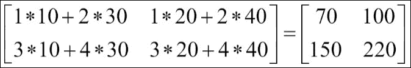
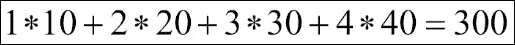
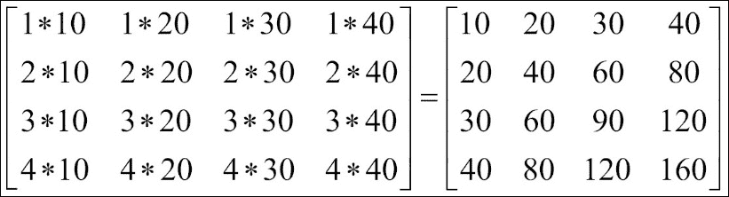
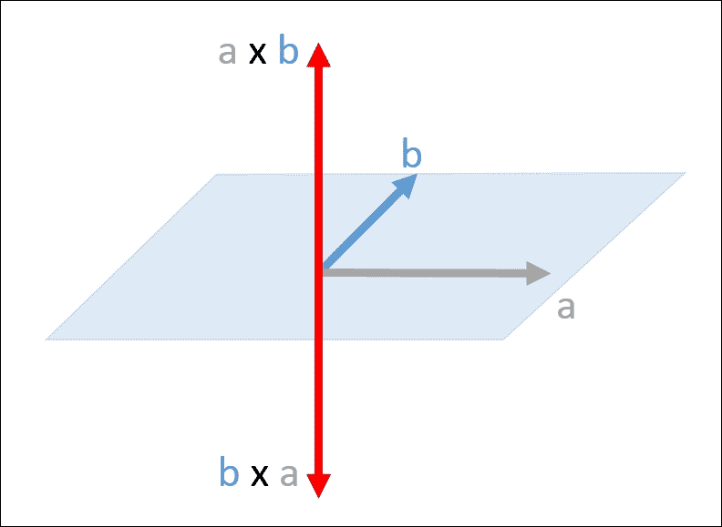
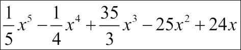
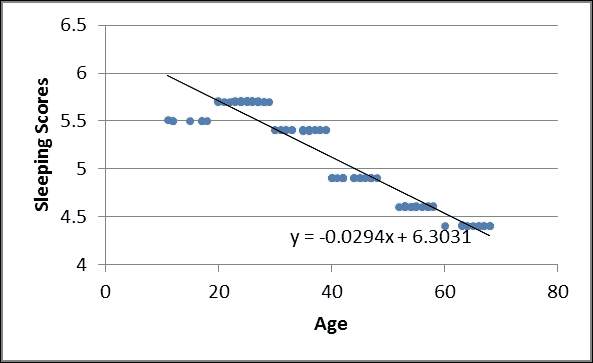
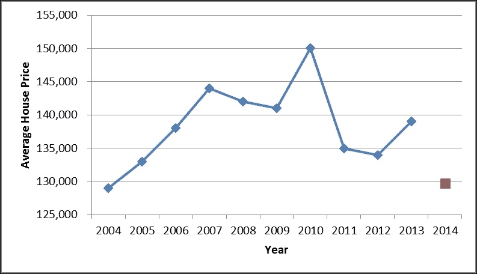

# 五、NumPy 中的线性代数

NumPy 专为数值计算而设计； 在引擎盖下，它仍然是功能强大的`ndarray`对象，但同时 NumPy 提供了不同类型的对象来解决数学问题。 在本章中，我们将介绍矩阵对象和多项式对象，以帮助您使用非 ndarray 方法解决问题。 同样，NumPy 提供了许多标准的数学算法并支持多维数据。 虽然矩阵无法执行三维数据，但更可取的是使用`ndarray`对象以及线性代数和多项式的 NumPy 函数（更广泛的 SciPy 库是线性代数的另一个不错的选择，但是 NumPy 是我们关注的重点） 书）。 现在让我们使用 NumPy 进行一些数学运算！

本章将涉及的主题是：

*   矩阵和向量运算
*   分解
*   多项式的数学
*   回归和曲线拟合

# 矩阵类别

对于线性代数，使用矩阵可能更直接。 NumPy 中的矩阵对象继承了`ndarray`的所有属性和方法，但严格来说是二维的，而`ndarray`可以是多维的。 使用 NumPy 矩阵的众所周知的优点是它们提供矩阵乘法作为`*`表示法； 例如，如果`x`和`y`是矩阵，则`x * y`是它们的矩阵乘积。 但是，从 Python 3.5 / NumPy 1.10 开始，新的运算符“

但是，从 Python 3.5 / NumPy 1.10 开始，新的运算符“ `@`”支持本机矩阵乘法。 因此这是使用`ndarray`（ [https://docs.python.org/3/whatsnew/3.5.html#whatsnew-pep-465](https://docs.python.org/3/whatsnew/3.5.html#whatsnew-pep-465) ）的另一个很好的理由。

但是，矩阵对象仍提供方便的转换，例如逆和共轭转置，而`ndarray`不提供。 让我们从创建 NumPy 矩阵开始：

```py
In [1]: import numpy as np 
In [2]: ndArray = np.arange(9).reshape(3,3) 
In [3]: x = np.matrix(ndArray) 
In [4]: y = np.mat(np.identity(3)) 
In [5]: x 
Out[5]: 
matrix([[0, 1, 2], 
        [3, 4, 5], 
        [6, 7, 8]]) 
In [6]: y 
Out[6]: 
matrix([[1., 0., 0.], 
        [0., 1., 0.], 
        [0., 0., 1.]]) 

```

有两种创建或转换为 NumPy 矩阵对象的方法，更优选的方法是使用`numpy.mat()`或`numpy.matrix()`。 两种方法都创建矩阵，但是`numpy.matrix()`创建一个副本，而`numpy.mat()`仅更改视图; 等效于`numpy.matrix(data, copy = False)`。 在前面的示例中，我们创建了两个矩阵，两个矩阵均来自`ndarray`对象（`np.identity(3)`返回 3 x 3 的标识数组）。 当然，您可以使用字符串或列表来创建矩阵，例如：`np.matrix('0 1 2; 3 4 5; 6 7 8')`和`np.matrix([[0,1,2],[3,4,5],[6,7,8]])`将创建与`x`相同的矩阵。 在以下示例中，我们将执行一些基本的矩阵运算：

```py
In [7]: x + y 
Out[7]: 
matrix([[ 1.,  1.,  2.], 
        [ 3.,  5.,  5.], 
        [ 6.,  7.,  9.]]) 
In [8]: x * x 
Out[8]: 
matrix([[ 15,  18,  21], 
        [ 42,  54,  66], 
        [ 69,  90, 111]]) 
In [9]: np.dot(ndArray, ndArray) 
Out[9]: 
array([[ 15,  18,  21], 
       [ 42,  54,  66], 
       [ 69,  90, 111]]) 
In [10]: x**3 
Out[10]: 
matrix([[ 180,  234,  288], 
        [ 558,  720,  882], 
        [ 936, 1206, 1476]])
In [11]: z = np.matrix(np.random.random_integers(1, 50, 9).reshape(3,3)) 
In [12]: z 
Out[12]: 
matrix([[32, 21, 28], 
        [ 2, 24, 22], 
        [32, 20, 22]]) 
In [13]: z.I 
Out[13]: 
matrix( [[-0.0237 -0.0264  0.0566] 
         [-0.178   0.0518  0.1748] 
         [ 0.1963 -0.0086 -0.1958]]) 

In [14]: z.H 
Out[14]: 
matrix([[32  2 32] 
        [21 24 20] 
        [28 22 22]]) 

```

您可以从前面的示例中看到，当我们使用`*`表示法时，当您为`ndarray`使用`numpy.dot()`时，它会应用矩阵乘法（我们将在下一节中讨论）。 同样，`**`功率符号以矩阵方式完成。 我们还根据随机函数创建了一个矩阵`z`，以显示该矩阵何时可逆（非奇异）。 您可以使用`numpy.matrix.I`获得逆矩阵。 我们还可以使用`numpy.matrix.H`进行共轭（Hermitian）转置。

现在我们知道了如何创建矩阵对象并执行一些基本操作，是时候进行一些练习了。 让我们尝试求解一个简单的线性方程。 假设我们有一个线性方程`A x = b`，我们想知道`x`的值。 可能的解决方案如下：

```py
A-1A x = A-1 b 
I x = A-1 b 
x = A-1 b 

```

我们通过将`A`和`b`的逆数相乘来获得`x`，所以我们用`numpy.matrix`来做到这一点：

```py
In [15]: A = np.mat('3 1 4; 1 5 9; 2 6 5') 
In [16]: b = np.mat([[1],[2],[3]]) 
In [17]: x = A.I * b 
In [18]: x 
Out[18]: 
matrix([[ 0.2667], 
        [ 0.4667], 
        [-0.0667]]) 
In [21]: np.allclose(A * x, b) 
Out[21]: True 

```

我们获得了`x`，并使用`numpy.allclose()`在公差范围内比较了 LHS 和 RHS。 默认的绝对公差为`1e-8`。 结果返回`True`，这意味着 LHS 和 RHS 在公差范围内相等，这验证了我们的解决方案。 尽管`numpy.matrix()`采用普通矩阵形式，但在大多数情况下`ndarray`足以满足您进行线性代数的需要。 现在我们将简单比较`ndarray`和`matrix`的性能：

```py
In [20]: x = np.arange(25000000).reshape(5000,5000) 

In [21]: y = np.mat(x) 

In [22]: %timeit x.T 
10000000 loops, best of 3: 176 ns per loop 

In [23]: %timeit y.T 
1000000 loops, best of 3: 1.36 µs per loop 

```

此示例显示了转置时`ndarray`和`matrix`之间的巨大性能差异。 `x`和`y`都具有 5,000 x 5,000 元素，但是`x`是二维`ndarray`，而`y`将其转换为相同的形状`matrix`。 即使计算已通过 NumPy 优化，NumPy 矩阵也将始终以矩阵方式进行运算。

虽然默认情况下`ndarray`会反转尺寸而不是对轴进行置换（矩阵始终对轴进行置换），但这是`ndarray`中完成的一项巨大的性能改进技巧。 因此，考虑到线性代数的性能，`ndarray` 特别适用于大型数据集。 仅在必要时使用`matrix`。 在继续下一节之前，让我们看一下另外两个`matrix`对象属性，这些属性将`matrix`转换​​为基本的`ndarray`：

```py
In [24]: A.A 
Out[24]: 
array([[3, 1, 4], 
       [1, 5, 9], 
       [2, 6, 5]]) 
In [25]: A.A1 
Out[25]: array([3, 1, 4, 1, 5, 9, 2, 6, 5]) 

```

前面的示例使用了我们在线性方程实践中创建的矩阵`A`。 `numpy.matrix.A`返回基本的`ndarray`，`numpy.matrix.A1`返回一维的`ndarray`。

# NumPy 中的线性代数

在进入 NumPy 的线性代数类之前，我们将在本节的开头介绍五种向量积。 让我们从`numpy.dot()`产品开始逐一回顾它们：

```py
In [26]: x = np.array([[1, 2], [3, 4]]) 
In [27]: y = np.array([[10, 20], [30, 40]]) 
In [28]: np.dot(x, y) 
Out[28]: 
array([[ 70, 100], 
       [150, 220]]) 

```

`numpy.dot()`函数执行矩阵乘法，其详细计算如下所示：



`numpy.vdot()`处理多维数组的方式与`numpy.dot()`不同。 它不执行矩阵乘积，而是首先将输入参数展平到一维向量：

```py
In [29]: np.vdot(x, y) 
Out[29]: 300 

```

`numpy.vdot()`的详细计算如下：



`numpy.outer()`函数是两个向量的外积。 如果输入数组不是一维的，则它将变平。 假设扁平化的输入向量 A 的形状为`(M, )`，扁平化的输入向量 B 的形状为`(N, )`。 那么结果形状将是`(M, N)`：

```py
In [100]: np.outer(x,y) 
Out[100]: 
array([[ 10,  20,  30,  40], 
       [ 20,  40,  60,  80], 
       [ 30,  60,  90, 120], 
       [ 40,  80, 120, 160]]) 

```

`numpy.outer()`的详细计算如下：



最后一个是`numpy.cross()`乘积，它是三维空间中两个向量的二进制运算（并且仅适用于向量），其结果是垂直于两个输入数据的向量（`a`，`b`）。 如果您不熟悉外部产品，请参考 [https://en.wikipedia.org/wiki/Cross_product](https://en.wikipedia.org/wiki/Cross_product) 。 以下示例显示`a`和`b`是向量数组，以及（`a`，`b`）和（`b`，`a`）的叉积：

```py
In [31]: a = np.array([1,0,0]) 
In [32]: b = np.array([0,1,0]) 
In [33]: np.cross(a,b) 
Out[33]: array([0, 0, 1]) 
In [34]: np.cross(b,a) 
Out[34]: array([ 0,  0, -1]) 

```

下图显示了详细的计算，并且两个向量`a`与`b`的叉积由`a x b`表示：



NumPy 为标准向量例程提供了以前的功能。 现在，我们将讨论本节的关键主题：用于线性代数的`numpy.linalg`子模块。 将 NumPy `ndarray`与`numpy.linalg`结合使用会比`numpy.matrix()`更好。

### 注意

如果您希望将 scipy 作为程序的依赖项，则`scipy.linalg`具有比`numpy.linalg`更高级的功能，例如矩阵中的三角函数以及更多的分解选择。 但是，NumPy 包含所有基本操作。

在以下示例中，我们将介绍`numpy.linalg`的其余基本操作，并使用它们来求解矩阵部分中的线性方程：

```py
In [35]: x = np.array([[4,8],[7,9]]) 
In [36]: np.linalg.det(x) 
Out[36]: -20.000000000000007 

```

前面的示例计算方阵的行列式。 当然，我们可以使用`numpy.linalg.inv()`来计算数组的逆数，就像我们使用`numpy.matrix.I`一样：

```py
In [37]: np.linalg.inv(x) 
Out[37]: 
array([[-0.45,  0.4 ], 
       [ 0.35, -0.2 ]]) 
In [38]: np.mat(x).I 
Out[38]: 
matrix([[-0.45,  0.4 ], 
        [ 0.35, -0.2 ]]) 

```

从前面的示例中，我们可以看到`numpy.linalg.inv()`提供与`numpy.matrix.I`相同的结果。 唯一的区别是`numpy.linalg`返回`ndarray`。 接下来，我们将再次回到线性方程式`A x = b`，以了解如何使用`numpy.linalg.solve()`获得与使用矩阵对象相同的结果：

```py
In [39]: x = np.linalg.solve(A,b) 
In [40]: x 
Out[40]: 
matrix([[ 0.2667], 
        [ 0.4667], 
        [-0.0667]]) 

```

`numpy.linalg.solve(A,b)`计算`x`的解，其中第一个输入参数（`A`）代表系数数组，第二个参数（`b`）代表坐标或因变量值。 `numpy.linalg.solve()`功能支持输入数据类型。 在示例中，我们使用矩阵作为输入，因此输出还返回一个矩阵`x`。 我们也可以使用`ndarray `作为输入。

使用 NumPy 进行线性代数运算时，最好仅使用一种数据类型，即`ndarray`或`matrix`。 不建议在计算中使用混合类型。 原因之一是减少了不同数据类型之间的转换。 另一个原因是要避免两种类型的计算中的意外错误。 由于`ndarray`对数据尺寸的限制较少，并且可以执行所有类似矩阵的运算，因此与`matrix`相比，`ndarray`与`numpy.linalg`结合使用是首选的。

# 分解

`numpy.linalg`提供了分解，在本节中，我们将介绍两种最常用的分解：**奇异值分解**（**svd**）和 **QR** 因式分解。 让我们首先计算**特征值**和**特征向量**。 在我们开始之前，如果您不熟悉特征值和特征向量，可以在 [https://en.wikipedia.org/wiki/Eigenvalues_and_eigenvectors](https://en.wikipedia.org/wiki/Eigenvalues_and_eigenvectors) 进行检查。 开始吧：

```py
In [41]: x = np.random.randint(0, 10, 9).reshape(3,3) 
In [42]: x 
Out[42]: 
array([[ 1,  5,  0] 
       [ 7,  4,  0] 
       [ 2,  9,  8]]) 
In [42]: w, v = np.linalg.eig(x) 
In [43]: w 
Out[43]: array([ 8.,  8.6033,  -3.6033]) 
In [44]: v 
Out[44]: 
array([[ 0.,  0.0384,  0.6834] 
       [ 0.,  0.0583, -0.6292] 
       [ 1.,  0.9976,  0.3702]] 
) 

```

在前面的示例中，首先我们使用`numpy.random.randint` `()`创建了一个 3 x 3 `ndarray`，然后使用`np.linalg.eig()`计算了特征值和特征向量。 该函数返回两个元组：第一个元组是特征值，每个元组根据其多重性重复;第二个元组是规范化的特征向量，其中`v[: , i]`列是与特征值`w[i]`相对应的特征向量。 在此示例中，我们将元组解压缩为`w`和`v`。 如果输入`ndarray`是复数值，则计算出的特征向量也将是复数类型，如下面的示例所示：

```py
In [45]: y = np.array([[1, 2j],[-3j, 4]]) 
In [46]: np.linalg.eig(y) 
Out[46]: 
(array([ -0.3723+0.j,  5.3723+0.j]), 
 array([[0.8246+0.j    ,  0.0000+0.416j     ], 
        [-0.0000+0.5658j,  0.9094+0.j    ]])) 

```

但是，如果输入`ndarray`是实数，则计算出的特征值也将是实数； 因此，在计算时，我们应注意舍入错误，如以下示例所示：

```py
In [47]: z = np.array([[1 + 1e-10, -1e-10],[1e-10, 1 - 1e-10]]) 
In [48]: np.linalg.eig(z) 
Out[48]: 
(array([ 1.,  1.]), array([[0.70710678,  0.707106], 
        [0.70710678,  0.70710757]])) 

```

`ndarrayz`是实型（`numpy.float64`），因此在计算特征值时会自动四舍五入。 从理论上讲，特征值应为`1 ± 1e-10`，但从第一个`np.linalg.eig()`可以看出 特征值都向上舍入为 *1*。

`svd`可以认为是特征值的扩展。 我们可以使用`numpy.linalg.svd()`分解`M x N`数组，所以让我们从一个简单的例子开始：

```py
In [51]: np.set_printoptions(precision = 4) 
In [52]: A = np.array([3,1,4,1,5,9,2,6,5]).reshape(3,3) 
In [53]: u, sigma, vh = np.linalg.svd(A) 
In [54]: u 
Out[54]: 
array([[-0.3246,  0.799 ,  0.5062], 
       [-0.7531,  0.1055, -0.6494], 
       [-0.5723, -0.592 ,  0.5675]]) 
In [55]: vh 
Out[55]: 
array([[-0.2114, -0.5539, -0.8053], 
       [ 0.4633, -0.7822,  0.4164], 
       [ 0.8606,  0.2851, -0.422 ]]) 
In [56]: sigma 
Out[56]: array([ 13.5824,   2.8455,   2.3287]) 

```

在此示例中，`numpy.linalg.svd()`返回了三个元组数组，我们将其解压缩为三个变量：`u`，`sigma`和`vh`，其中`u`代表`A`的左奇异向量（`AA-1`的特征向量），`vh`是`A`的右奇异向量（`A-1A`的特征向量的逆矩阵），`sigma`是`A`的非零奇异值（`AA-1`和`A-1A`的特征值）。 在该示例中，存在三个特征值，它们按顺序返回。 您可能会对结果感到怀疑，所以让我们做一些数学运算来验证它：

```py
In [57]: diag_sigma = np.diag(sigma) 
In [58]: diag_sigma 
Out[58]: 
array([[ 13.5824,   0\.    ,   0\.    ], 
       [  0\.    ,   2.8455,   0\.    ], 
       [  0\.    ,   0\.    ,   2.3287]]) 
In [59]: Av = u.dot(diag_sigma).dot(vh) 
In [60]: Av 
Out[60]: 
array([[ 3.,  1.,  4.], 
       [ 1.,  5.,  9.], 
       [ 2.,  6.,  5.]]) 
In [61]: np.allclose(A, Av) 
Out[61]: True 

```

输入数组`A`可以转换为`svd`中的`U ∑ V*`，其中`∑`是奇异向量的值。 但是，从 NumPy 返回的`sigma`是具有非零值的数组，我们需要将其设为向量，因此在此示例中，形状为`(3, 3)`。 我们首先使用`numpy.diag()`制作`sigma`对角矩阵`diag_sigma`。 然后我们只需在`u`，`diag_sigma`和`vh`之间执行矩阵乘法，以检查计算结果（`Av`）是否与原始输入`A`相同，这意味着我们验证了 svd 结果。

QR 分解（有时称为极坐标分解）可用于任何`M x N`数组，并将其分解为正交矩阵（`Q`）和上三角矩阵（`R`）。 让我们尝试使用它来解决先前的`Ax = b`问题：

```py
In [62]: b = np.array([1,2,3]).reshape(3,1) 
In [63]: q, r = np.linalg.qr(A) 
In [64]: x = np.dot(np.linalg.inv(r), np.dot(q.T, b)) 
In [65]: x 
Out[65]: 
array([[ 0.2667], 
       [ 0.4667], 
       [-0.0667]]) 

```

我们使用`numpy.linalg.qr()`分解`A`以获得`q`和`r`。 因此现在将原始方程式转换为`(q * r) x = b`。 我们可以使用`r`和`q`和`b`的逆矩阵乘法（点积）获得`x`。 由于`q`是一个 unit 矩阵，因此我们使用了转置而不是逆。 如您所见，结果`x`与我们使用矩阵和`numpy.linalg.solve()`时的结果相同; 这是解决线性问题的另一种方法。

### 注意

通常，三角矩阵逆的计算效率更高，因为您可以创建一个大型数据集并比较不同解决方案之间的性能。

# 多项式数学

NumPy 还提供了使用多项式的方法，并包括一个名为`numpy.polynomial`的程序包，用于创建，操作和拟合多项式。 常见的应用是内插和外推。 在本节中，我们的重点仍然是将`ndarray`与 NumPy 函数一起使用，而不是使用多项式实例。 （不用担心，我们仍将向您展示多项式类的用法。）

正如我们在矩阵类部分所述，将`ndarray`与 NumPy 函数结合使用是首选，因为`ndarray`可以在任何函数中接受，而矩阵和多项式对象则需要转换，尤其是在与其他程序通信时。 它们都提供了方便的属性，但是在大多数情况下，`ndarray`足够好。

在本节中，我们将介绍如何基于一组根来计算系数，以及如何求解多项式方程，最后我们将评估积分和导数。 让我们从计算多项式的系数开始：

```py
In [66]: root = np.array([1,2,3,4]) 
In [67]: np.poly(root) 
Out[67]: array([  1, -10,  35, -50,  24]) 

```

`numpy.poly()`返回一阶多项式系数数组，其根是从最高到最低指数的给定数组`root`。 在此示例中，我们采用根数组`[1,2,3,4]`并返回多项式，等效于`x^4 - 10x^3 + 35x^2 - 50x + 24`。

我们需要注意的一件事是输入根数组应该是一维或正方形二维数组，否则会触发`ValueError`。 当然，我们也可以执行相反的操作：使用`numpy.roots()`根据系数计算根：

```py
In [68]: np.roots([1,-10,35,-50,24]) 
Out[68]: array([ 4.,  3.,  2.,  1.]) 

```

现在，假设我们有方程式`y = x^4 - 10x^3 + 35x^2 - 50x + 24`，当`x = 5`时我们想知道`y`的值。 我们可以使用`numpy.polyval()`来计算：

```py
In [69]: np.polyval([1,-10,35,-50,24], 5) 
Out[69]: 24 

```

`numpy.polyval()`具有两个输入参数，第一个是多项式的系数数组，第二个是用于评估给定多项式的特定点值。 我们也可以输入`x`的序列，结果将返回`ndarray`，其值对应于给定的`x`序列。

接下来我们将讨论**积分**和**导数**。 我们将继续以`x^4 - 10x^3 + 35x^2 - 50x + 24`的示例为例：

```py
In [70]: coef = np.array([1,-10,35,-50,24]) 
In [71]: integral = np.polyint(coef) 
In [72]: integral 
Out[72]: array([  0.2 ,  -2.5 ,  11.6667, -25\.  ,  24\.  ,  0\.  ]) 
In [73]: np.polyder(integral) == coef 
Out[73]: array([ True,  True,  True,  True,  True], dtype=bool) 
In [74]: np.polyder(coef, 5) 
Out[74]: array([], dtype=int32) 

```

在此示例中，我们对整数演算使用`numpy.polyint()`，结果等于：



默认积分常数为 0，但我们可以使用输入参数`k`进行指定。 您可以自己做一些练习，以获得不同的`k`的积分。

让我们回到前面的示例-完成积分后，我们立即使用`numpy.polyder()`执行了微积分，并将导数与原始`coef`数组进行了比较。 我们得到了五个`True`布尔数组，它们验证了两个数组是否相同。

我们还可以在`numpy.polyder()`中指定区分的顺序（默认为 1）。 如我们所料，当我们计算四阶多项式的五阶导数时，它将返回一个空数组。

现在，我们将使用多项式类的实例重复这些示例，以查看用法的差异。 使用`numpy.polynomial`类的第一步是初始化多项式实例。 开始吧：

```py
In [75]: from numpy.polynomial import polynomial 
In [76]: p = polynomial.Polynomial(coef) 
In [77]: p 
Out[77]: Polynomial([  1., -10.,  35., -50.,  24.], [-1,  1], [-1,  1]) 

```

请注意，在返回的`p`类型旁边是`Polynomial`类的实例，并且返回了三部分。 第一部分是多项式的系数。 第二个是`domain`，它表示多项式中的输入值间隔（默认为`[-1, 1]`）。 第三个是`window`，它根据多项式将域间隔映射到相应的间隔（默认也是`[-1, 1]`）：

```py
In [78]: p.coef 
Out[78]: array([  1., -10.,  35., -50.,  24.]) 
In [79]: p.roots() 
Out[79]: array([ 0.25  ,  0.3333,  0.5   ,  1\.    ]) 

```

使用`Polynomial`实例，我们可以简单地调用`coef`属性以显示系数的`ndarray`。 `roots()`方法将显示根。 接下来，我们将评估特定值的多项式`5`：

```py
In [80]: polynomial.polyval(p, 5) 
Out[80]: Polynomial([ 5.], [-1.,  1.], [-1.,  1.]) 

```

集成和派生还使用`Polynomial`类中的内置函数`roots()`完成，但函数名称更改为`integ()`和`derive()`：

```py
In [81]: p.integ() 
Out[81]: Polynomial([  0\.    ,   1\.    ,  -5\.    ,  11.6667, -12.5   ,   4.8   ], [-1.,  1.], [-1.,  1.]) 
In [82]: p.integ().deriv() == p 
Out[82]: True 

```

多项式包还提供了特殊的多项式，例如 Chebyshev，Legendre 和 Hermite。 有关这些内容的更多详细信息，请参考 [http://docs.scipy.org/doc/numpy-1.10.0/reference/routines.polynomials.classes.html](http://docs.scipy.org/doc/numpy-1.10.0/reference/routines.polynomials.classes.html) 。

总之，在大多数情况下，`ndarray`和 NumPy 函数可以解决与多项式有关的问题。 它们也是一种更可取的方式，因为程序中类型之间的转换较少，这意味着较少的潜在问题。 但是，在处理特殊多项式时，我们仍然需要多项式包。 我们几乎完成了数学部分。 在下一节中，我们将讨论线性代数的应用。

# 应用-回归和曲线拟合

由于我们在讨论线性代数的应用，因此我们的经验来自实际案例。 让我们从线性回归开始。 因此，假设我们对一个人的年龄与其睡眠质量之间的关系感到好奇。 我们将使用 2012 年大不列颠睡眠调查（ [https://www.sleepio.com/2012report/](https://www.sleepio.com/2012report/) ）在线提供的数据。

有 20,814 人参加了调查，年龄范围从 20 岁以下到 60 岁以上，他们通过 4 到 6 分对他们的睡眠质量进行了评估。

在这种情况下，我们将只使用 100 作为总人口，并模拟年龄和睡眠得分，其分布与调查结果相同。 我们想知道他们的年龄在增长，睡眠质量（分数）增加还是减少？ 如您所知，这是一个隐藏的线性回归实践。 一旦我们绘制了年龄和睡眠分数的回归线，通过观察该线的斜率，就可以得出答案。

但是在讨论应该使用哪个 NumPy 函数以及如何使用它之前，让我们首先创建数据集。 根据调查，我们知道 20 岁以下的参与者占 7％，21 岁至 30 岁的参与者占 24％，31 岁至 40 岁的参与者占 21％，60 岁以上的参与者占 21％。因此，我们首先创建一个代表每个参与者人数的组列表 年龄组，并使用`numpy.random.randint()`模拟我们 100 个人口中的实际年龄，以查看年龄变量。 现在我们知道了每个年龄段的睡眠分数分布，我们称其为`scores`：这是`[5.5, 5.7, 5.4, 4.9, 4.6, 4.4]`的列表，`[5.5, 5.7, 5.4, 4.9, 4.6, 4.4]`是根据年龄段从最小到最大的顺序排列的。 在这里，我们还使用`np.random.rand()`函数以及均值（来自分数列表）和标准方差（均设置为`0.01`）来模拟分数分布（当然，如果您有一个好的数据集，则可以使用） ，最好只使用上一章介绍的`numpy.genfromtxt()`函数）：

```py
In [83]: groups = [7, 24, 21, 19, 17, 12] 

In [84]: age = np.concatenate([np.random.randint((ind + 1)*10, (ind + 2)*10, group) for ind, group in enumerate(groups)]) 

In [85]: age 
Out[85]: 
array( 
[11, 15, 12, 17, 17, 18, 12, 26, 29, 24, 28, 25, 27, 25, 26, 24, 23,  27, 26, 24, 27, 20, 28, 20, 22, 21, 23, 25, 27, 24, 25, 35, 39, 33, 35, 30, 32, 32, 36, 38, 31, 35, 38, 31, 37, 36, 39, 30, 36, 33, 36, 37, 45, 41, 44, 48, 45, 40, 44, 42, 47, 46, 47, 42, 42, 42, 44, 40, 40, 47, 47, 57, 56, 53, 53, 57, 54, 55, 53, 52, 54, 57, 53, 58, 58, 54, 57, 55, 64, 67, 60, 63, 68, 65, 66, 63, 67, 64, 68, 66] 
) 
In [86]: scores = [5.5, 5.7, 5.4, 4.9, 4.6, 4.4] 
In [87]: sim_scores = np.concatenate([.01 * np.random.rand(group) + scores[ind] for ind, group in enumerate(groups)] ) 

In [88]: sim_scores 
Out[88]: 
array([ 
5.5089,  5.5015,  5.5024,  5.5   ,  5.5033,  5.5019,  5.5012, 
5.7068,  5.703 ,  5.702 ,  5.7002,  5.7084,  5.7004,  5.7036, 
5.7055,  5.7024,  5.7099,  5.7009,  5.7013,  5.7093,  5.7076, 
5.7029,  5.702 ,  5.7067,  5.7007,  5.7004,  5.7   ,  5.7017, 
5.702 ,  5.7031,  5.7087,  5.4079,  5.4082,  5.4083,  5.4025, 
5.4008,  5.4069,  5.402 ,  5.4071,  5.4059,  5.4037,  5.4004, 
5.4024,  5.4058,  5.403 ,  5.4041,  5.4075,  5.4062,  5.4014, 
5.4089,  5.4003,  5.4058,  4.909 ,  4.9062,  4.9097,  4.9014, 
4.9097,  4.9023,  4.9   ,  4.9002,  4.903 ,  4.9062,  4.9026, 
4.9094,  4.9099,  4.9071,  4.9058,  4.9067,  4.9005,  4.9016, 
4.9093,  4.6041,  4.6031,  4.6016,  4.6021,  4.6079,  4.6046, 
4.6055,  4.609 ,  4.6052,  4.6005,  4.6017,  4.6091,  4.6073, 
4.6029,  4.6012,  4.6062,  4.6098,  4.4014,  4.4043,  4.4013, 
4.4091,  4.4087,  4.4087,  4.4027,  4.4017,  4.4067,  4.4003, 
4.4021,  4.4061]) 

```

现在我们有了年龄和睡眠得分，每个变量都有 100 次事件。 接下来，我们将计算回归线：`y = mx + c`，其中`y`代表`sleeping_score`，而`x`代表`age`。 回归线的 NumPy 函数为`numpy.linalg.lstsq()`，它将系数矩阵和因变量值作为输入。 因此，我们要做的第一件事是将变量年龄打包到一个系数矩阵中，我们称之为`AGE`：

```py
In [87]: AGE = np.vstack([age, np.ones(len(age))]).T 
In [88]: m, c = np.linalg.lstsq(AGE, sim_scores)[0] 
In [89]: m 
Out[90]: -0.029435313781 
In [91]: c 
Out[92]: 6.30307651938 

```

现在我们有斜率`m`和常数`c`。 我们的回归线是`y = -0.0294x + 6.3031`，这表明，随着年龄的增长，人的年龄会略有下降 在他们的睡眠分数/质量中，如下图所示：



您可能认为回归线方程看起来很熟悉。 还记得我们在矩阵部分求解的第一个线性方程吗？ 是的，您也可以使用`numpy.linalg.lstsq()`来求解`Ax = b`方程，实际上这将是本章的第四个解决方案。 自己尝试； 用法与您使用`numpy.linalg.solve()`时非常相似。

但是，并非每个问题都能简单地通过绘制回归线来回答，例如按年的房价。 它显然不是线性关系，可能是平方或三次关系。 那么我们如何解决这个问题呢？ 让我们使用房价指数（国家统计局 [http://ons.gov.uk/ons/taxonomy/index.html?nscl=House+Price+Indices#tab-data-tables）中的统计数据](http://ons.gov.uk/ons/taxonomy/index.html?nscl=House+Price+Indices#tab-data-tables) ），然后选择 2004 年至 2013 年。我们将平均房价（英镑）调整为通胀因素； 我们想知道明年的平均价格。

在寻求解决方案之前，让我们首先分析问题。 问题的背后是多项式曲线拟合问题； 我们想找到最适合我们的问题的多项式，但是我们应该为它选择哪个 NumPy 函数？ 但是在此之前，让我们创建两个变量：每年的价格`price`和房屋的年份`year`：

```py
In [93]: year = np.arange(1,11) 
In [94]: price = np.array([129000, 133000, 138000, 144000, 142000, 141000, 150000, 135000, 134000, 139000]). 
In [95]: year 
Out[95]: array([ 1,  2,  3,  4,  5,  6,  7,  8,  9, 10]) 

```

现在我们有了年份和价格数据，我们假设它们之间的关系是平方的。 我们的目标是找到多项式：`y = ax^2 + bx + c`表示关系（一种典型的最小二乘法）。`y`代表`price`，`x`代表`year`。 这里我们将使用`numpy.polyfit()`帮助我们找到该多项式的系数：

```py
In [97]: a, b, c = np.polyfit(year, price, 2) 
In [98]: a 
Out[98]: -549.242424242 
In [99]: b 
Out[99]: 6641.66666667 
In [100]: c 
Out[100]: 123116.666667 
In [101]: a*11**2 + b*11 + c 
Out[101]: 129716.66666666642 

```

我们从`numpy.polyfit()`获得了多项式的所有系数，它采用三个输入参数：第一个代表自变量：`year`; 第二个是因变量：`price`; 最后一个是多项式的阶数，在这种情况下为 2。现在我们只需要使用`year` `= 11`（从 2004 年起 11 年），就可以计算出估算价格。 您可以在下图中看到结果：



NumPy 可以从线性代数中获得许多应用程序，例如插值和外推，但是我们不能在本章中全部介绍它们。 我们希望本章为您使用 NumPy 解决线性或多项式问题提供一个良好的开端。

# 总结

在本章中，我们介绍了线性代数的矩阵类和多项式类。 我们研究了两个类提供的高级功能，还看到了`ndarray`在进行基本转置时的性能优势。 我们还介绍了`numpy.linalg`类，它提供了许多函数来处理`ndarray`的线性或多项式计算。

在本章中，我们做了很多数学运算，但同时也发现了如何使用 NumPy 帮助我们回答一些现实问题。

在下一章中，我们将了解傅立叶变换及其在 NumPy 中的应用。