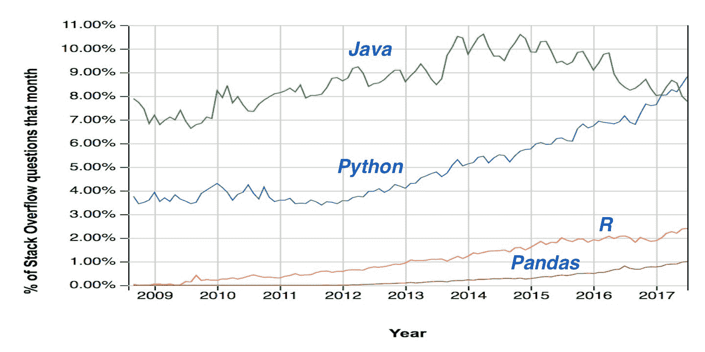
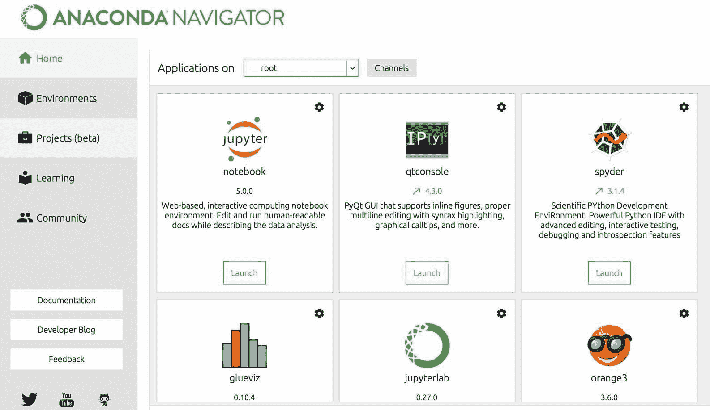
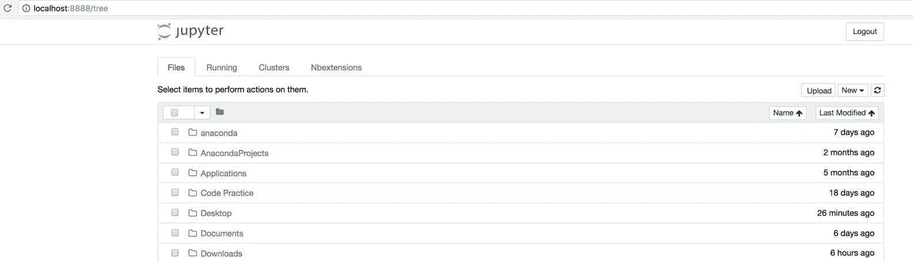
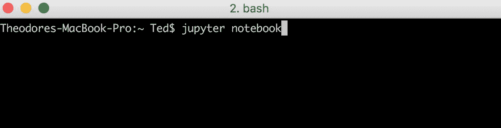
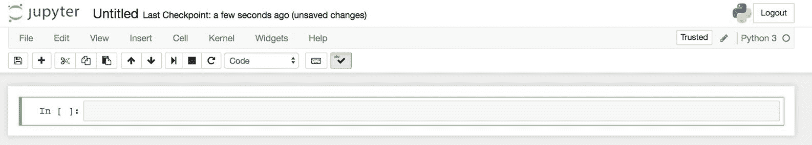
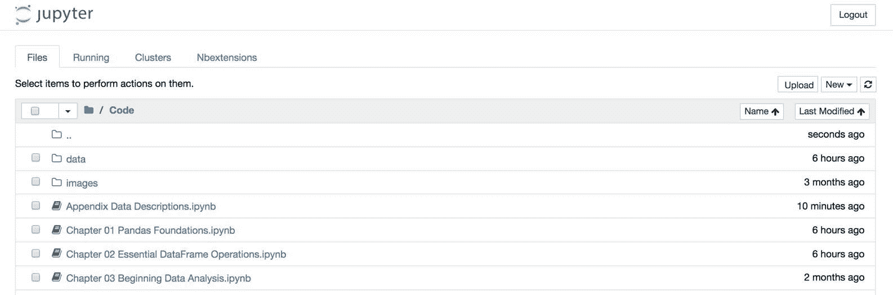
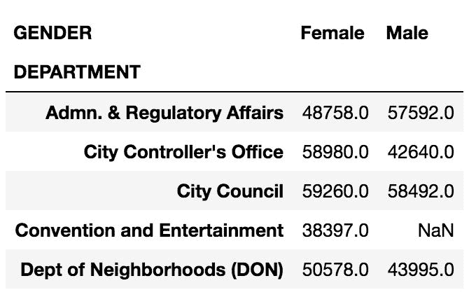

# 前言

自从 2012 年被《哈佛评论》（Harvard Review）称为，*，《 21 世纪最性感的工作》，*之后，数据科学的知名度迅速上升。在 2016 年和 2017 年，它被 Glassdoor 排名第一。 行业的需求助推了数据科学的飞速普及。 几个应用程序在新闻中引起了轰动，例如 Netflix 提出了更好的电影推荐，IBM 沃森在 Jeopardy 击败了人类，特斯拉制造了无人驾驶汽车，美国职棒大联盟的球队发现了被低估的前景以及谷歌学习识别互联网上的猫。

几乎每个行业都在寻找使用数据科学来构建新技术或提供更深刻见解的方法。 由于取得了如此显着的成功，炒作的光环似乎封装了数据科学。 支持这种炒作的大多数科学进展都来自机器学习领域，机器学习领域产生了使预测负责人工智能的算法。

所有机器学习算法的基本组成部分当然是数据。 由于公司已经意识到这一点，所以不乏它。 商业智能公司 Domo 估计，在最近两年中已创建了 90% 的世界数据。 尽管机器学习得到了所有关注，但它完全依赖于所馈送数据的质量。 在数据到达机器学习算法的输入层之前，必须对其进行准备，并且为了正确准备数据，需要对它进行彻底的探索，以进行基本理解并识别不正确之处。 在探索数据之前，必须先将其捕获。

总之，我们可以将数据科学流水线分为三个阶段-数据捕获，数据探索和机器学习。 有大量工具可用于完成管道的每个阶段。 Pandas 是科学 Python 生态系统中用于数据探索和分析的主要工具。 它具有检查，清理，整理，过滤，转换，聚合甚至可视化（在一些帮助下）所有类型数据的强大能力。 它不是最初捕获数据的工具，也不是构建机器学习模型的工具。

对于许多使用 Python 的数据分析人员和科学家来说，绝大多数工作将使用 Pandas 来完成。 这可能是因为最初的数据探索和准备往往花费最多的时间。 一些整个项目仅包含数据探索，没有机器学习组件。 数据科学家在此阶段花费了太多时间，以至于出现了永恒的传说-*数据科学家花费了 80% 的时间来清理数据，另外 20% 的时间抱怨清理数据。*

尽管有大量的开放源代码和免费编程语言可用于数据探索，但目前该领域仅由两个参与者（Python 和 R）主导。这两种语言的语法差异很大，但都具有进行数据分析和机器处理的能力 学习。 受欢迎程度的一种度量是在受欢迎的 Q & A 站点 Stack Overflow（ [https://insights.stackoverflow.com/trends](https://insights.stackoverflow.com/trends) ）上提出的问题数量：



尽管这不是使用情况的真实衡量标准，但很显然，Python 和 R 都已变得越来越流行，这可能是由于它们的数据科学功能所致。 有趣的是，直到 2012 年数据科学开始兴起，Python 问题的比例一直保持不变。 这张图最令人惊讶的是，Pandas 问题现在占 Stack Overflow 上所有最新问题的百分之一。

Python 之所以成为数据科学首选语言的原因之一是，它是一种相当容易学习和开发的语言，因此入门门槛低。 它也是免费和开源的，能够在各种硬件和软件上运行，并且轻而易举地启动并运行。 它有一个非常活跃的社区，在线上有大量免费资源。 在我看来，Python 是用于开发程序的最有趣的语言之一。 语法非常清晰，简洁和直观，但像所有语言一样，需要花费相当长的时间才能掌握。

由于 Python 并非像 R 那样用于数据分析，因此语法可能不像其他 Python 库那样自然。 实际上，这可能是其中有太多堆栈溢出问题的原因的一部分。 尽管 Pandas 功能强大，但通常编写得很差。 本书的主要目的之一是展示高性能和惯用的 Pandas 代码。

不幸的是，Stack Overflow 发挥了其巨大的作用，使错误信息永久存在，并且是大量写得不好的 Pandas 的来源。 这实际上不是 Stack Overflow 或其社区的错。 Pandas 是一个开放源代码项目，即使在最近，它也进行了许多重大更改，因为它在 2018 年已接近成立十年。然而，开放源代码的优点在于，新功能一直在不断增加。

本书中的秘籍是根据我作为数据科学家工作，建立和托管数周的数据探索训练营，回答关于 Stack Overflow 的数百个问题以及为我的本地聚会小组创建教程而制定的。 这些秘籍不仅为常见数据问题提供惯用的解决方案，而且还带您穿越许多真实世界的数据集，在这些数据集中经常发现令人惊讶的见解。 这些秘籍还将帮助您掌握 Pandas 库，从而极大地提高生产力。 仅对 Pandas 有粗略了解的人与对 Pandas 有所了解的人之间存在巨大差异。 有很多有趣而有趣的技巧来解决您的数据问题，这些技巧只有在您真正了解库内外的情况下才会显现出来。 就个人而言，我发现 Pandas 是一种用于分析数据的令人愉悦且有趣的工具，希望您和我一起享受旅途。 如有疑问，请随时在 Twitter 上与我联系：`@TedPetrou`。

# 本书涵盖的内容

[第 1 章](../Text/ch01.html#VF2I0-5686c430c0a9442a82c4c5795c8553c9)和*Pandas 基金会，*涵盖了用于识别两个主要 Pandas 数据结构（系列和数据框）的组成部分的解剖结构和词汇表。 每一列必须仅具有一种数据类型，并且涵盖了每种数据类型。 您将学习如何通过调用和链接它们的方法来释放序列和数据帧的功能。

[第 2 章](../Text/ch02.html#2OM4A0-5686c430c0a9442a82c4c5795c8553c9)和*基本数据帧操作*着重介绍您将在数据分析期间执行的最关键和最常见的操作。

[第 3 章](../Text/ch03.html#4B7I40-5686c430c0a9442a82c4c5795c8553c9)，*开始数据分析*可帮助您开发例程，以在读取数据后开始使用。 其他有趣的发现将被发现。

[第 4 章](../Text/ch04.html#5DI6C0-5686c430c0a9442a82c4c5795c8553c9)，*选择数据子集*涵盖了选择不同数据子集的许多不同且可能引起混淆的方式。

[第 5 章](../Text/#6JMSS0-5686c430c0a9442a82c4c5795c8553c9)，*布尔索引*涵盖了查询数据以根据布尔条件选择子集的过程。

[第 6 章](../Text/ch06.html#8PALU0-5686c430c0a9442a82c4c5795c8553c9)，*索引对齐*以非常重要且经常被误解的`index`对象为目标。 错误使用索引会导致许多错误的结果，这些秘籍向您展示了如何正确使用它来提供有力的结果。

[第 7 章](../Text/ch07.html#A56FQ0-5686c430c0a9442a82c4c5795c8553c9)，*进行聚集，过滤和转换的分组*涵盖了强大的分组功能，这些功能几乎是数据分析期间始终需要的。 您将构建自定义功能以应用于您的组。

[第 8 章](../Text/ch08.html#C8T7O0-5686c430c0a9442a82c4c5795c8553c9)，*将数据重组为整齐的表格*，解释了整洁的数据及其重要性，然后向您展示了如何将许多不同形式的杂乱数据集转换为整洁的数据集。

[第 9 章](../Text/ch09.html#EBLF40-5686c430c0a9442a82c4c5795c8553c9)和*组合 Pandas 对象*涵盖了许多可用于垂直或水平组合数据帧和序列的方法。 我们还将进行一些网上爬虫比较，以比较特朗普总统和奥巴马总统的支持率，并连接到 SQL 关系数据库。

[第 10 章](../Text/ch10.html#F89000-5686c430c0a9442a82c4c5795c8553c9)和*时间序列分析*涵盖了高级且强大的时间序列功能，可以按任何可能的时间维度进行剖析。

[第 11 章](../Text/ch11.html#GQQDQ0-5686c430c0a9442a82c4c5795c8553c9)和*使用 Matplotlib，Pandas 和 Seaborn* 进行可视化介绍了 matplotlib 库，该库负责 Pandas 中的所有绘图。 然后，我们将重点转移到 Pandas`plot`方法上，最后转移到`seaborn`库，该库能够产生在美学上令人愉悦的可视化效果，而这些效果在 Pandas 中不直接可用。

# 这本书需要什么

Pandas 是用于 Python 编程语言的第三方软件包，在本书出版时，它的版本为 0.20。 目前，Python 有两个主要受支持的版本，版本 2.7 和 3.6。 Python 3 是未来，现在强烈建议所有 Python 的科学计算用户都使用它，因为 2020 年将不再支持 Python2。本书中的所有示例均已在 Python 3.6 上以 pandas 0.20 运行和测试。

除了 Pandas，您还需要安装 matplotlib 2.0 版和 seaborn 0.8 版可视化库。 对 Pandas 的主要依赖是 NumPy 库，它构成了大多数流行的 Python 科学计算库的基础。

您可以通过多种方式来安装 Pandas 和计算机上提到的其余库，但是到目前为止，最简单的方法是安装 Anaconda 发行版。 它由 Continuum Analytics 创建，将所有流行的用于科学计算的库打包到一个可下载的文件中，该文件可在 Windows，Mac OSX 和 Linux 上使用。 访问下载页面以获取 Anaconda 发行版（ [https://www.anaconda.com/download](https://www.anaconda.com/download/) ）。

除了所有科学计算库之外，Anaconda 发行版还附带 Jupyter Notebook，这是一个基于浏览器的程序，可使用 Python 和许多其他语言进行开发。 本书的所有秘籍都是在 Jupyter 笔记本内部开发的，每一章的所有单个笔记本都可以使用。

无需使用 Anaconda 发行版就可以安装本书所需的所有库。 对于感兴趣的用户，请访问 pandas *安装*页面（ [http://pandas.pydata.org/pandas-docs/stable/install.html](http://pandas.pydata.org/pandas-docs/stable/install.html) ）。

# 运行 Jupyter 笔记本

建议阅读本书的全部内容的方法是启动并运行 Jupyter Notebook，以便您可以在阅读秘籍的同时运行代码。 与仅阅读本书相比，这使您可以自己进行探索并获得更深刻的理解。

假设您已经在计算机上安装了 Anaconda 发行版，则可以使用两个选项来启动 Jupyter Notebook：

*   使用程序 Anaconda Navigator
*   从终端/命令提示符运行`jupyter notebook` 命令

Anaconda Navigator 是基于 GUI 的工具，可让您轻松查找 Anaconda 提供的所有不同软件。 运行程序将为您提供如下屏幕：



如您所见，有许多可用的程序。 单击*启动*以打开 Jupyter Notebook。 浏览器中将打开一个新标签，向您显示主目录中的文件夹和文件列表：



您可以通过打开终端/命令提示符并运行`jupyter notebook`，命令来启动 Jupyter Notebook，而不是使用 Anaconda Navigator，如下所示：



不必从主目录运行此命令。 您可以从任何位置运行它，浏览器中的内容将反映该位置。

尽管我们现在已经启动了 Jupyter Notebook 程序，但实际上并没有启动一个单独的笔记本就可以开始用 Python 开发。 为此，您可以单击页面右侧的 New 按钮，该按钮将下拉列出所有可能使用的内核的列表。 如果您刚刚下载了 Anaconda，则只有一个可用的内核（Python 3）。 选择 Python 3 内核后，将在浏览器中打开一个新标签，您可以在其中开始编写 Python 代码：



当然，您可以打开以前创建的笔记本，而不用开始新的笔记本。 为此，只需在 Jupyter Notebook 浏览器主页中提供的文件系统中导航，然后选择要打开的笔记本即可。 所有 Jupyter Notebook 文件都以`.ipynb`结尾。 例如，当您导航到这本书的笔记本文件的位置时，您将看到所有这些文件，如下所示：



# 这本书是给谁的

本书包含近 100 种秘籍，从非常简单到高级。 所有秘籍都力求以清晰，简洁，现代的惯用 Pandas 代码编写。 *的工作原理...* 部分包含对秘籍每个步骤的复杂性的非常详细的描述。 通常，在*中还有更多...* 部分，您将获得似乎是一个全新的秘籍。 这本书密密麻麻地包装着大量的 Pandas 代码。

概括地说，与后五章相比，前六章中的秘籍更简单，更侧重于 Pandas 的基本和基本操作，后五章中的重点是更高级的操作并且更受项目驱动。 由于复杂性范围很广，因此这本书对于新手和日常用户都非常有用。 根据我的经验，即使定期使用 Pandas 的人也不会在没有惯用的 Pandas 密码的情况下掌握它。 Pandas 提供的宽度在一定程度上促进了这一点。 几乎总是有多种方法可以完成相同的操作，这些方法可以使用户以非常低效的方式获得所需的结果。 在同一问题的两组 Pandas 解决方案之间看到一个数量级或更多个性能差异并不少见。

本书唯一真正的先决条件是 Python 的基础知识。 假定读者熟悉 Python 中所有常见的内置数据容器，例如列表，集合，字典和元组。

# 如何充分利用这本书

您可以采取几项措施来充分利用本书。 首先，也是最重要的是，您应该下载所有代码，这些代码将存储在 Jupyter Notebooks 中。 阅读每个秘籍时，请在笔记本中运行代码的每个步骤。 在运行代码时，请确保自己进行探索。 其次，在您的浏览器选项卡之一中打开 pandas 官方文档（ [http://pandas.pydata.org/pandas-docs/stable/](http://pandas.pydata.org/pandas-docs/stable/) ）。 Pandas 文档是一个很好的资源，其中包含超过 1000 页的材料。 文档中有大多数 Pandas 操作的示例，它们通常会从*直接链接到*，另请参见部分。 虽然涵盖了大多数操作的基础知识，但它提供了一些琐碎的示例和伪造的数据，这些伪造的数据并不能反映您在分析现实世界中的数据集时可能遇到的情况。

# 约定

在本书中，您将找到一些可以区分不同类型信息的文本样式。 最常见的是，您会在每个秘籍中看到如下所示的代码块：

```py
>>> employee = pd.read_csv('data/employee')
>>> max_dept_salary = employee.groupby('DEPARTMENT')['BASE_SALARY'].max()
```

在笔记本中输出时，pandas Series 和数据帧的样式不同。 Pandas 系列没有特殊的格式，只是原始文本。 它们将直接出现在代码块本身中创建它们的代码行的前面，如下所示：

```py
>>> max_dept_salary.head()
DEPARTMENT
Admn. & Regulatory Affairs      140416.0
City Controller's Office         64251.0
City Council                    100000.0
Convention and Entertainment     38397.0
Dept of Neighborhoods (DON)      89221.0
Name: BASE_SALARY, dtype: float64
```

另一方面，数据帧在笔记本中具有良好的风格，并显示为代码框外部的图像，如下所示：

```py
>>> employee.pivot_table(index='DEPARTMENT', 
                         columns='GENDER', 
                         values='BASE_SALARY').round(0).head()
```



文本，数据库表名称，文件夹名称，文件名，文件扩展名，路径名，虚拟 URL，用户输入和 Twitter 句柄中的代码字如下所示：为了通过`GENDER`查找平均`BASE_SALARY`，可以使用 `pivot_table`方法。

**新术语**和**重要词**以粗体显示。 您在屏幕上看到的字词，例如在菜单或对话框中，将像这样显示在文本中：“ 在 Jupyter 笔记本电脑中，按住 S *快捷键* + *选项卡* + *选项卡* ，将光标置于对象中的某个位置，将弹出文档字符串的窗口 使得该方法更易于使用。 “

Tips and tricks appear like this.Warnings or important notes appear in a box like this.

# 每个秘籍的假设

应该假设在每个秘籍的开始，都会将 pandas，NumPy 和 matplotlib 导入命名空间。 为了将绘图直接嵌入到笔记本中，还必须运行 magic 命令`%matplotlib inline`。 同样，所有数据都存储在  `data` 目录中，并且最通常存储为 CSV 文件，可以通过`read_csv`功能直接读取。

```py
>>> import pandas as pd
>>> import numpy as np
>>> import matplotlib.pyplot as plt
>>> %matplotlib inline

>>> my_dataframe = pd.read_csv('data/dataset_name.csv')
```

# 数据集说明

本书共使用了大约十二个数据集。 完成秘籍中的步骤时，在每个数据集上具有背景信息可能会非常有帮助。 可以在 [https://github.com/PacktPublishing/Pandas-Cookbook](https://github.com/PacktPublishing/Pandas-Cookbook) 的`dataset_descriptions` Jupyter Notebook 中找到每个数据集的详细说明。 对于每个数据存储，将有一个列列表，有关每个列的信息以及有关如何获取数据的注释。

# 栏目

在本书中，您会发现经常出现的几个标题（准备工作，如何做……，如何工作……，还有更多……以及另请参见）。

为了给出有关如何完成秘籍的明确说明，我们使用以下部分：

# 准备

本节将告诉您秘籍中的预期内容，并介绍如何设置秘籍所需的任何软件或任何初步设置。

# 操作步骤

本节包含遵循秘籍所需的步骤。

# 工作原理

本节通常包括对上一节中发生的情况的详细说明。

# 更多

本节包含有关秘籍的其他信息，以使读者对秘籍有更多的了解。

# 另见

本部分提供了指向该秘籍其他有用信息的有用链接。
