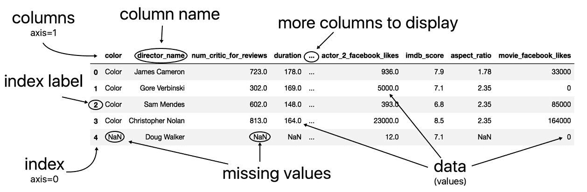
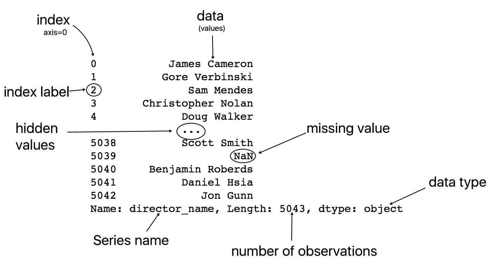
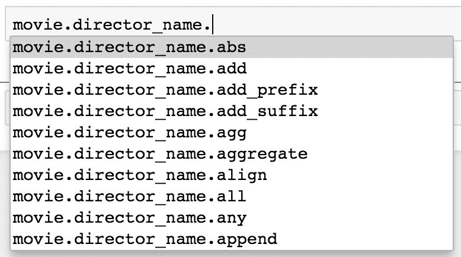
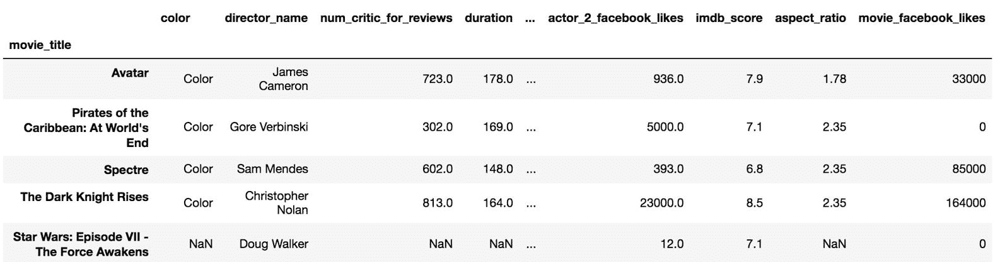
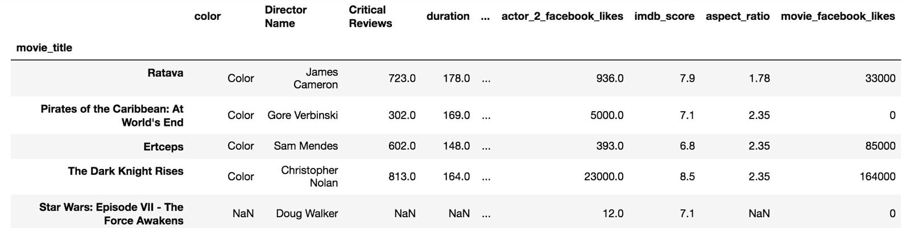

# Pandas 基金会

在本章中，我们将介绍以下内容：

*   剖析数据帧的结构
*   访问主要的数据帧组件
*   了解数据类型
*   选择单列数据作为系列
*   调用系列方法
*   与操作员一起进行系列赛
*   连锁系列方法在一起
*   使索引有意义
*   重命名行和列名称
*   创建和删除列

# 介绍

本章的目的是通过彻底检查序列和数据帧数据结构来介绍 Pandas 的基础。 对于 Pandas 用户来说，了解序列和数据帧的每个组件，并了解 Pandas 中的每一列数据正好具有一种数据类型，这一点至关重要。

在本章中，您将学习如何从数据帧中选择一个数据列，该数据列将作为序列返回。 使用此一维对象可以轻松显示不同的方法和运算符如何工作。 许多序列方法返回另一个序列作为输出。 这导致有可能连续调用其他方法，这被称为**方法链接**。

Series 和数据帧的 Index 组件是将 Pandas 与其他大多数数据分析库区分开的组件，并且是了解执行多少操作的关键。 当我们将其用作系列值的有意义的标签时，我们将瞥见这个强大的对象。 最后两个配方包含在数据分析期间经常发生的简单任务。

# 剖析数据帧的结构

在深入研究 Pandas 之前，值得了解数据帧的组件。 在视觉上，大 Pandas DataFrame 的输出显示（在 Jupyter Notebook 中）似乎只不过是由行和列组成的普通数据表。 隐藏在表面下方的是三个组成部分-您必须具备的**索引**，**列**和**数据**（也称为**值**）。 请注意，以便最大化数据帧的全部潜力。

# 做好准备

此配方将电影数据集读入 pandas DataFrame 中，并提供其所有主要成分的标签图。

# 怎么做...

1.  使用`read_csv`函数读取影片数据集，并使用`head`方法显示前五行：

```py
>>> movie = pd.read_csv('data/movie.csv')
>>> movie.head()
```

2.  分析数据帧的标记解剖结构：



# 怎么运行的...

Pandas 首先使用出色且通用的`read_csv`功能将数据从磁盘读入内存，然后读入数据帧。 列和索引的输出均以粗体显示，这使它们易于识别。 按照惯例，术语**索引标签**和**列名**分别是指索引和列的各个成员。 术语*索引*整体上指所有索引标签，正如术语*列*整体上指所有列名称一样。

列和索引用于特定目的，即为数据帧的列和行提供标签。 这些标签允许直接轻松地访问不同的数据子集。 当多个序列或 DataFrames 组合在一起时，索引将在进行任何计算之前首先对齐。 列和索引统称为**轴**。

A DataFrame has two axes--a vertical axis (the index) and a horizontal axis(the columns). Pandas borrows convention from `NumPy` and uses the integers 0/1 as another way of referring to the vertical/horizontal axis.

DataFrame 数据（值）始终为常规字体，并且是与列或索引完全独立的组件。 Pandas 使用 **NaN** （**不是数字**）来表示缺失值。 请注意，即使`color`列仅包含字符串值，它仍使用 NaN 表示缺少的值。

列中间的三个连续点表示存在至少一列，但由于列数超过了预定义的显示限制，因此未显示。

The Python standard library contains the `csv` module, which can be used to parse and read in data. The pandas `read_csv` function offers a powerful increase in performance and functionality over this module.

# 还有更多...

`head`方法接受单个参数`n`，该参数控制显示的行数。 同样，`tail`方法返回最后的`n`行。

# 也可以看看

*   Pandas`read_csv`功能的官方文档（ [http://bit.ly/2vtJQ9A](https://pandas.pydata.org/pandas-docs/stable/generated/pandas.read_csv.html) ）

# 访问主要的数据帧组件

可以直接从数据帧访问三个数据帧组件（索引，列和数据）中的每一个。 每个组件本身都是一个 Python 对象，具有自己的独特属性和方法。 通常，您希望对单个组件而不是对整个数据帧进行操作。

# Getting ready

此配方将数据帧的索引，列和数据提取到单独的变量中，然后说明如何从同一对象继承列和索引。

# How to do it...

1.  使用数据帧属性`index`，`columns`和`values`将索引，列和数据分配给它们自己的变量：

```py
>>> movie = pd.read_csv('data/movie.csv')
>>> index = movie.index
>>> columns = movie.columns
>>> data = movie.values
```

2.  显示每个组件的值：

```py
>>> index
RangeIndex(start=0, stop=5043, step=1)

>>> columns
Index(['color', 'director_name', 'num_critic_for_reviews',
       ...
       'imdb_score', 'aspect_ratio', 'movie_facebook_likes'],
       dtype='object')

>>> data
array([['Color', 'James Cameron', 723.0, ..., 7.9, 1.78, 33000],
       ..., 
       ['Color', 'Jon Gunn', 43.0, ..., 6.6, 1.85, 456]],
       dtype=object)
```

3.  输出每个数据帧组件的类型。 类型的名称是输出最后一个点后面的单词：

```py
>>> type(index)
pandas.core.indexes.range.RangeIndex

>>> type(columns)
pandas.core.indexes.base.Index

>>> type(data)
numpy.ndarray
```

4.  有趣的是，索引和列的类型似乎都密切相关。 内置的`issubclass`方法检查`RangeIndex`是否确实是`Index`的子类：

```py
>>> issubclass(pd.RangeIndex, pd.Index)
True
```

# How it works...

您可以使用`index`，`columns`和`values`属性访问数据帧的三个主要组件。 `columns`属性的输出似乎只是列名称的序列。 从技术上讲，此列名称序列是`Index`对象。 函数`type`的输出是对象的**完全限定的类名**。

The fully qualified class name of the object for the variable `columns` is `pandas.core.indexes.base.Index`. It begins with the package name, which is followed by a path of modules and ends with the name of the type. A common way of referring to objects is to include the package name followed by the name of the object type. In this instance, we would refer to the columns as a pandas `Index` object.

内置的`subclass`函数检查第一个参数是否从第二个参数继承。 `Index`和`RangeIndex`对象非常相似，实际上，pandas 具有许多专门为索引或列保留的相似对象。 索引和列都必须都是某种`Index`对象。 本质上，索引和列表示同一事物，但沿不同的轴。 有时将它们称为**行索引**和**列索引**。

In this context, the `Index` objects refer to all the possible objects that can be used for the index or columns. They are all subclasses of `pd.Index`. Here is the complete list of the `Index` objects: `CategoricalIndex`, `MultiIndex`, `IntervalIndex`, `Int64Index`, `UInt64Index`, `Float64Index`, `RangeIndex`, `TimedeltaIndex`, `DatetimeIndex`, `PeriodIndex`.

`RangeIndex`是`Index`对象的一种特殊类型，类似于 Python 的`range`对象。 直到必须将其整个值序列加载到内存中为止，从而节省了内存。 它完全由其开始，停止和步长值定义。

# There's more...

尽可能使用哈希表实现`Index`对象，以实现非常快速的选择和数据对齐。 它们与 Python 集相似，因为它们支持诸如相交和并集之类的操作，但是由于它们的排序允许重复，因此它们是不同的。

Python dictionaries and sets are also implemented with hash tables that allow for membership checking to happen very fast in constant time, regardless of the size of the object.

注意`values` DataFrame 属性如何返回 NumPy n 维数组或`ndarray`。 大部分 Pandas 都严重依赖`ndarray`。 在索引，列和数据之下是 NumPy `ndarrays`。 可以将它们视为构建许多其他对象的 Pandas 的基本对象。 要看到这一点，我们可以查看`index`和`columns`的值：

```py
>>> index.values
array([   0,    1,    2, ..., 4913, 4914, 4915])

>>> columns.values
array(['color', 'director_name', 'num_critic_for_reviews',
 ...
 'imdb_score', 'aspect_ratio', 'movie_facebook_likes'],
 dtype=object)
```

# See also

*   的 Pandas 官方文档 *索引和选择数据*（ [http://bit.ly/2vm8f12](https://pandas.pydata.org/pandas-docs/stable/indexing.html) ）
*   *Pandas 设计与开发的内幕*Pandas 作者 Wes McKinney（ [http://bit.ly/2u4YVLi](http://wesmckinney.com/blog/nycpython-1102012-a-look-inside-pandas-design-and-development/) ）的幻灯片

# 了解数据类型

用非常广泛的术语来说，数据可以分类为连续的或分类的。 连续数据始终是数字，代表某种度量，例如身高，工资或薪水。 连续数据可能具有无限数量的可能性。 另一方面，分类数据代表离散的有限数量的值，例如汽车颜色，扑克手类型或谷类食品品牌。

Pandas 没有将数据大致分为连续数据或分类数据。 相反，它对许多不同的数据类型都有精确的技术定义。 下表包含所有 pandas 数据类型，及其等效字符串，以及每种类型的一些注释：

| **通用数据类型名称** | **NumPy / pandas 对象** | **Pandas 字符串名称** | **注释** |
| 布尔型 | `np.bool` | *布尔* | 存储为单个字节。 |
| 整数 | `np.int` | *int* | 默认为 64 位。 也可以使用无符号整数-`np.uint`。 |
| 浮动 | `np.float` | *浮动* | 默认为 64 位。 |
| 复杂 | `np.complex` | *复合物* | 在数据分析中很少见。 |
| 宾语 | `np.object` | *O* 和*对象* | 通常为字符串，但是对于具有多种不同类型的列或其他 Python 对象（元组，列表，字典等）来说是万能的。 |
| 约会时间 | `np.datetime64, pd.Timestamp` | *datetime64* | 特定时间点具有纳秒精度。 |
| 时间增量 | `np.timedelta64, pd.Timedelta` | *小时 delta64* | 时间量，从几天到纳秒。 |
| 分类的 | `pd.Categorical` | *类别* | 仅限于 Pandas。 对于唯一值相对较少的对象列很有用。 |

# Getting ready

在此配方中，我们将显示数据帧中每一列的数据类型。 了解每一列中保存的数据类型至关重要，因为它会从根本上改变可能进行的操作的类型。

# How to do it...

1.  使用`dtypes`属性显示每一列及其数据类型：

```py
>>> movie = pd.read_csv('data/movie.csv')
>>> movie.dtypes
color                       object
director_name               object
num_critic_for_reviews     float64
duration                   float64
director_facebook_likes    float64
                            ...   
title_year                 float64
actor_2_facebook_likes     float64
imdb_score                 float64
aspect_ratio               float64
movie_facebook_likes         int64
Length: 28, dtype: object
```

2.  使用`get_dtype_counts`方法返回每种数据类型的计数：

```py
>>> movie.get_dtype_counts()
float64    13
int64       3
object     12
```

# How it works...

每个数据帧列必须恰好是一种类型。 例如，`aspect_ratio`列中的每个值都是 64 位浮点数，`movie_facebook_likes`列中的每个值都是 64 位整数。 Pandas 默认使用其核心数字类型，整数，并且浮点数为 64 位，而不管所有数据放入内存所需的大小如何。 即使列完全由整数值 0 组成，数据类型仍将为`int64`。 `get_dtype_counts`是一种方便的方法，用于直接返回数据帧中所有数据类型的计数。

**Homogeneous data** is another term for referring to columns that all have the same type. DataFrames as a whole may contain **heterogeneous data** of different data types for different columns.

对象数据类型是一种与其他数据类型不同的数据类型。 对象数据类型的列可以包含任何有效 Python 对象的值。 通常，当列属于对象数据类型时，它表示整个列都是字符串。 不一定是这种情况，因为这些列可能包含整数，布尔值，字符串或其他甚至更复杂的 Python 对象（例如列表或字典）的混合物。 对象数据类型是 Pandas 无法识别为其他任何特定类型的列的全部内容。

# There's more...

几乎所有的 Pandas 数据类型都是直接从 NumPy 构建的。 这种紧密的集成使用户可以更轻松地集成 Pandas 和 NumPy 操作。 随着 Pandas 越来越大，越来越流行，事实证明，对象数据类型对于具有字符串值的所有列来说太通用了。 Pandas 创建了自己的分类数据类型，以处理具有固定数量的可能值的字符串（或数字）列。

# See also

*   Pandas *dtypes* 的官方文档（ [http://bit.ly/2vxe8ZI](http://pandas.pydata.org/pandas-docs/stable/basics.html#dtypes) ）
*   用于 *数据类型*的 NumPy 官方文档（ [http://bit.ly/2wq0qEH](https://docs.scipy.org/doc/numpy/user/basics.types.html) ）

# 选择单列数据作为系列

系列是来自数据帧的单列数据。 它是数据的一个维度，仅由索引和数据组成。

# Getting ready

此配方检查了两种不同的语法以选择“序列”，一种使用索引运算符，另一种使用点符号。

# How to do it...

1.  将列名作为字符串传递给索引运算符以选择一系列数据：

```py
>>> movie = pd.read_csv('data/movie.csv')
>>> movie['director_name']
```

2.  或者，您可以使用点符号来完成相同的任务：

```py
>>> movie.director_name
```

3.  检查系列解剖结构：
4.  验证输出是否为系列：

```py
>>> type(movie['director_name'])
pandas.core.series.Series
```

# How it works...

Python 有几个内置对象用于包含数据，例如列表，元组和字典。 所有这三个对象都使用索引运算符来选择其数据。数据帧是更强大，更复杂的数据容器，但它们也使用索引运算符作为选择数据的主要方式。 将单个字符串传递给数据帧索引运算符将返回一个序列。

Series 的视觉输出风格比数据帧少。 它代表一列数据。 连同索引和值一起，输出显示序列的名称，长度和数据类型。

或者，虽然不建议这样做，但可能会出错，但是可以使用带有列名作为属性的点表示法来访问数据列。 尽管它适用于此特定示例，但这不是最佳实践，并且容易出错和误用。 不能以这种方式访问​​带有空格或特殊字符的列名称。 如果列名称为`director name`，则该操作将失败。 与数据帧方法冲突的列名，例如`count`，也无法使用点符号正确选择。 分配新值或删除带有点符号的列可能会导致意外的结果。 因此，在生产代码中应避免使用点表示法访问列。

# There's more...

如果会引起麻烦，为什么有人会使用点符号语法呢？ 程序员很懒，而且键入的字符更少。 但主要是，当您想使用自动完成智能功能时，它非常方便。 因此，在本书中有时会使用点标记进行列选择。 自动完成智能非常适合帮助您了解对象可用的所有可能的属性和方法。

在使用步骤 1 中的索引运算符后，尝试链接操作时，智能将无法工作，但将继续使用步骤 2 中的点符号。下面的屏幕快照显示了在选择了索引之后的弹出窗口。 `director_name`带点符号。 在点后按选项卡后，所有可能的属性和方法将显示在列表中：

In a Jupyter notebook, when holding down S*hift* + *Tab* + *Tab* with the cursor placed somewhere in the object, a window of the docsstrings will pop out making the method far easier to use. This intelligence again disappears if you try to chain an operation after selecting a column with the indexing operator.

注意点表示法的另一个原因是，它在流行的问答网站 Stack Overflow 上在线使用的数量激增。 另外，请注意，旧列名称现在是序列的`name`，实际上已经成为一个属性：

```py
>>> director = movie['director_name']
>>> director.name
'director_name'
```

可以使用`to_frame`方法将此系列转换为单列数据帧。 此方法将使用系列名称作为新的列名称：

```py
>>> director.to_frame()
```

# See also

*   要了解 Python 对象如何获得使用索引运算符的能力，请参见`__getitem__`特殊方法（ [http://bit.ly/2u5ISN6](https://docs.python.org/3/reference/datamodel.html#object.__getitem__) ）上的 Python 文档。
*   请参阅*选择多个数据帧列[的食谱](../Text/ch02.html#2OM4A0-5686c430c0a9442a82c4c5795c8553c9)*第 2 章和*基本数据帧操作*

# 调用系列方法

利用一维系列是所有 Pandas 数据分析的组成部分。 典型的工作流程将使您在序列和 DataFrames 上的执行语句之间来回切换。 调用序列方法是使用序列提供的功能的主要方法。

# Getting ready

Series 和数据帧都具有强大的功能。 我们可以使用`dir`函数来揭示系列的所有属性和方法。 此外，我们可以找到序列和 DataFrames 共有的属性和方法的数量。 这两个对象共享绝大多数的属性和方法名称：

```py
>>> s_attr_methods = set(dir(pd.Series))
>>> len(s_attr_methods)
442

>>> df_attr_methods = set(dir(pd.DataFrame))
>>> len(df_attr_methods)
445

>>> len(s_attr_methods & df_attr_methods)
376
```

本食谱涵盖了最常见且功能最强大的序列方法。 对于 DataFrames，许多方法几乎是等效的。

# How to do it...

1.  读完电影数据集后，让我们选择两个具有不同数据类型的系列。 `director_name`列包含字符串，形式上是对象数据类型，列`actor_1_facebook_likes`包含数字数据，形式上是`float64`：

```py
>>> movie = pd.read_csv('data/movie.csv')
>>> director = movie['director_name']
>>> actor_1_fb_likes = movie['actor_1_facebook_likes']
```

2.  检查每个系列的`head`：

```py
>>> director.head()
0        James Cameron
1       Gore Verbinski
2           Sam Mendes
3    Christopher Nolan
4          Doug Walker
Name: director_name, dtype: object

>>> actor_1_fb_likes.head()
0     1000.0
1    40000.0
2    11000.0
3    27000.0
4      131.0
Name: actor_1_facebook_likes, dtype: float64
```

3.  系列的数据类型通常确定哪种方法最有用。 例如，对象数据类型序列最有用的方法之一是`value_counts`，它计算每个唯一值的所有出现次数：

```py
>>> director.value_counts()
Steven Spielberg        26
Woody Allen             22
Martin Scorsese         20
Clint Eastwood          20
                        ..
Fatih Akin               1
Analeine Cal y Mayor     1
Andrew Douglas           1
Scott Speer              1
Name: director_name, Length: 2397, dtype: int64
```

4.  `value_counts`方法通常对于具有对象数据类型的序列更为有用，但有时也可以提供对数值序列的深入了解。 与`actor_1_fb_likes`一起使用时，似乎已将较高的数字四舍五入到最接近的千位，因为不太可能有那么多电影获得准确的 1,000 个赞：

```py
>>> actor_1_fb_likes.value_counts()
1000.0     436
11000.0    206
2000.0     189
3000.0     150
          ... 
216.0        1
859.0        1
225.0        1
334.0        1
Name: actor_1_facebook_likes, Length: 877, dtype: int64
```

5.  可以使用`size`或`shape`参数或`len`函数对系列中的元素数进行计数：

```py
>>> director.size
4916
>>> director.shape
(4916,)
>>> len(director)
4916
```

6.  此外，还有一种有用但令人困惑的`count`方法，它返回非缺失值的数量：

```py
>>> director.count()
4814
>>> actor_1_fb_likes.count()
4909
```

7.  基本摘要统计信息可以通过`min`，`max`，`mean`，`median`，`std`和`sum`方法得出：

```py
>>> actor_1_fb_likes.min(), actor_1_fb_likes.max(), \
    actor_1_fb_likes.mean(), actor_1_fb_likes.median(), \
    actor_1_fb_likes.std(), actor_1_fb_likes.sum()
(0.0, 640000.0, 6494.488490527602, 982.0, 15106.98, 31881444.0)
```

8.  为了简化步骤 7，您可以使用`describe`方法一次返回汇总统计信息和一些分位数。 当`describe` 与对象数据类型列一起使用时，将返回完全不同的输出：

```py
>>> actor_1_fb_likes.describe()
count      4909.000000
mean       6494.488491
std       15106.986884
min           0.000000
25%         607.000000
50%         982.000000
75%       11000.000000
max      640000.000000
Name: actor_1_facebook_likes, dtype: float64

>>> director.describe()
count                 4814
unique                2397
top       Steven Spielberg
freq                    26
Name: director_name, dtype: object
```

9.  `quantile`方法用于计算数字数据的精确分位数：

```py
>>> actor_1_fb_likes.quantile(.2)
510

>>> actor_1_fb_likes.quantile([.1, .2, .3, .4, .5,
                               .6, .7, .8, .9])
0.1      240.0
0.2      510.0
0.3      694.0
0.4      854.0
        ...   
0.6     1000.0
0.7     8000.0
0.8    13000.0
0.9    18000.0
Name: actor_1_facebook_likes, Length: 9, dtype: float64
```

10.  由于第 6 步中的`count`方法返回的值小于在第 5 步中找到的序列元素的总数，因此我们知道每个序列中都有缺失的值。 `isnull`方法可用于确定每个单独的值是否丢失。 结果将是一系列布尔值，其长度与原始系列相同：

```py
>>> director.isnull()
0       False
1       False
2       False
3       False
        ...  
4912     True
4913    False
4914    False
4915    False
Name: director_name, Length: 4916, dtype: bool
```

11.  可以用`fillna`方法替换系列中的所有缺失值：

```py
>>> actor_1_fb_likes_filled = actor_1_fb_likes.fillna(0)
>>> actor_1_fb_likes_filled.count()
4916
```

12.  要删除缺少值的序列元素，请使用`dropna`：

```py
>>> actor_1_fb_likes_dropped = actor_1_fb_likes.dropna()
>>> actor_1_fb_likes_dropped.size
4909
```

# How it works...

将字符串传递给数据帧的索引运算符会将单个列选择为序列。 选择本食谱中使用的方法是因为它们在数据分析中的使用频率。

本食谱中的步骤应简单明了，并具有易于解释的输出。 即使输出易于阅读，您也可能无法跟踪返回的对象。 它是标量值，元组，另一个序列还是其他 Python 对象？ 花一点时间，看看每一步之后返回的输出。 您可以命名返回的对象吗？

步骤 1 中`head`方法的结果是另一个系列。 `value_counts`方法也产生一个序列，但具有原始序列的唯一值作为索引，计数作为其值。 在步骤 5 中，`size`和`count`返回标量值，但是`shape`返回单项元组。

It seems odd that the `shape` attribute returns a one-item tuple, but this is convention borrowed from NumPy, which allows for arrays of any number of dimensions.

在步骤 7 中，每个方法返回一个标量值，并作为元组输出。 这是因为 Python 将仅包含逗号分隔值且不带括号的表达式视为元组。

在步骤 8 中，`describe`返回一个序列，其所有摘要统计信息名称均作为索引，而实际统计信息则为值。

在步骤 9 中，`quantile`是灵活的，当传递单个值时返回标量值，但在给定列表时返回序列。

从步骤 10、11 和 12，`isnull`，`fillna`和`dropna`都返回一个序列。

# There's more...

`value_counts`方法是最有用的序列方法之一，在探索性分析中特别是在分类列分析中被大量使用。 它默认返回计数，但是通过将`normalize`参数设置为`True`，则返回相对频率，这提供了另一种分布图：

```py
>>> director.value_counts(normalize=True)
Steven Spielberg        0.005401
Woody Allen             0.004570
Martin Scorsese         0.004155
Clint Eastwood          0.004155
                          ...   
Fatih Akin              0.000208
Analeine Cal y Mayor    0.000208
Andrew Douglas          0.000208
Scott Speer             0.000208
Name: director_name, Length: 2397, dtype: float64
```

在此配方中，我们通过观察`count`方法的结果与`size`属性不匹配，确定该系列中缺少值。 一种更直接的方法是使用`hasnans`属性：

```py
>>> director.hasnans
True
```

`isnull`存在一个补充：`notnull`方法，该方法为所有非缺失值返回`True`：

```py
>>> director.notnull()
0        True
1        True
2        True
3        True
        ...  
4912    False
4913     True
4914     True
4915     True
Name: director_name, Length: 4916, dtype: bool
```

# See also

*   要连续调用许多序列方法，请在本章中一起参考 *Chaining Series 方法*配方

# 与操作员一起进行系列赛

Python 中存在大量用于操作对象的运算符。 运算符本身不是对象，而是强制对对象执行操作的语法结构和关键字。 例如，将加号运算符放在两个整数之间时，Python 会将它们加在一起。 在以下代码中查看更多运算符示例：

```py
>>> 5 + 9   # plus operator example adds 5 and 9
14

>>> 4 ** 2  # exponentiation operator raises 4 to the second power
16

>>> a = 10  # assignment operator assigns 10 to a

>>> 5 <= 9  # less than or equal to operator returns a boolean
True
```

操作员可以处理任何类型的对象，而不仅仅是数字数据。 这些示例显示了正在操作的不同对象：

```py
>>> 'abcde' + 'fg' 
'abcdefg'

>>> not (5 <= 9)
False

>>> 7 in [1, 2, 6]
False

>>> set([1,2,3]) & set([2,3,4])
set([2,3])
```

访问教程要点（ [http://bit.ly/2u5g5Io](https://www.tutorialspoint.com/python/python_basic_operators.htm) ），以查看所有基本 Python 运算符的表。 并非对每个对象都实现所有运算符。 这些示例在使用运算符时都会产生错误：

```py
>>> [1, 2, 3] - 3
TypeError: unsupported operand type(s) for -: 'list' and 'int'

>>> a = set([1,2,3])     
>>> a[0] TypeError: 'set' object does not support indexing
```

Series 和数据帧对象可与大多数 Python 运算符一起使用。

# Getting ready

在此配方中，各种运算符将应用于不同的序列对象，以产生具有完全不同值的新序列。

# How to do it...

1.  选择`imdb_score`列作为系列：

```py
>>> movie = pd.read_csv('data/movie.csv')
>>> imdb_score = movie['imdb_score']
>>> imdb_score
0       7.9
1       7.1
2       6.8
       ... 
4913    6.3
4914    6.3
4915    6.6
Name: imdb_score, Length: 4916, dtype: float64
```

2.  使用加号运算符可向每个序列元素添加一个：

```py
>>> imdb_score + 1
0       8.9
1       8.1
2       7.8
       ... 
4913    7.3
4914    7.3
4915    7.6
Name: imdb_score, Length: 4916, dtype: float64
```

3.  其他基本算术运算符减号（`-`），乘法（`*`），除法（`/`）和幂（`**`）与标量值相似。 在这一步中，我们将序列乘以`2.5`：

```py
>>> imdb_score * 2.5
0       19.75
1       17.75
2       17.00
        ...  
4913    15.75
4914    15.75
4915    16.50
Name: imdb_score, Length: 4916, dtype: float64
```

4.  Python 使用两个连续的除法运算符（`//`）进行地板除法，并使用百分号（`%`）进行模数运算，这将在除法后返回余数。 系列使用这些相同的方式：

```py
>>> imdb_score // 7
0       1.0
1       1.0
2       0.0
       ... 
4913    0.0
4914    0.0
4915    0.0
Name: imdb_score, Length: 4916, dtype: float64
```

5.  存在六个比较运算符，它们大于（`>`），小于（`<`），大于或等于（`>=`，小于或等于（`<=`），等于（`==` ），并且不等于（`!=`）。 每个比较运算符都会根据条件的结果将序列中的每个值转换为`True`或`False`：

```py
>>> imdb_score > 7
0        True
1        True
2       False
        ...  
4913    False
4914    False
4915    False
Name: imdb_score, Length: 4916, dtype: bool

>>> director = movie['director_name']
>>> director == 'James Cameron'
0        True
1       False
2       False
        ...  
4913    False
4914    False
4915    False
Name: director_name, Length: 4916, dtype: bool
```

# How it works...

本配方中使用的所有运算符都将相同的操作应用于系列中的每个元素。 在本机 Python 中，这将需要一个 for 循环在应用操作之前遍历序列中的每个项目。 Pandas 严重依赖`NumPy`库，该库允许进行矢量化计算，也可以对整个数据序列进行操作而无需显式编写 for 循环。 每个操作都返回一个具有相同索引的序列，但其值已被运算符修改。

# There's more...

此配方中使用的所有运算符都具有等效的方法，这些方法可产生完全相同的结果。 例如，在步骤 1 中，可以用`add`方法再现`imdb_score + 1`。 检查以下代码以查看配方中每个步骤的方法版本：

```py
>>> imdb_score.add(1)              # imdb_score + 1
>>> imdb_score.mul(2.5)            # imdb_score * 2.5
>>> imdb_score.floordiv(7)         # imdb_score // 7
>>> imdb_score.gt(7)               # imdb_score > 7
>>> director.eq('James Cameron')   # director == 'James Cameron'
```

为什么 Pandas 提供与这些运算符等效的方法？ 从本质上讲，操作员只能以一种方式进行操作。 另一方面，方法可以具有允许您更改其默认功能的参数：

| **运营商组** | **运算符** | **系列方法名称** |
| 算术 | `+`，`-`，`*`，`/`，`//`，`%`，`**` | `add`，`sub`，`mul`，`div`，`floordiv`，`mod`，`pow` |
| 比较方式 | `<`，`>`，`<=`，`>=`，`==`，`!=` | `lt`，`gt`，`le`，`ge`，`eq`，`ne`  |

您可能对 Python Series 对象或与此相关的任何对象如何在遇到运算符时知道该怎么办感到好奇。 例如，表达式`imdb_score * 2.5`如何知道将序列中的每个元素乘以`2.5`？ Python 使用**特殊方法**为对象与操作员通信提供了一种内置的标准化方法。

特殊方法是对象在遇到运算符时在内部调用的方法。 特殊方法在 Python 数据模型中定义，这是官方文档中非常重要的一部分，并且对于整个语言中的每个对象都是相同的。 特殊方法始终以两个下划线开头和结尾。 例如，每当使用乘法运算符时，就会调用特殊方法`__mul__`。 Python 将`imdb_score * 2.5`表达式解释为`imdb_score.__mul__(2.5)`。

使用特殊方法和使用运算符之间没有什么区别，因为它们在做完全相同的事情。 运算符只是特殊方法的语法糖。

# See also

*   有关运算符的 Python 官方文档（ [http://bit.ly/2wpOId8](https://docs.python.org/3/library/operator.html) ）
*   有关数据模型的 Python 官方文档（ [http://bit.ly/2v0LrDd](https://docs.python.org/3/reference/datamodel.html) ）

# 连锁系列方法在一起

在 Python 中，每个变量都是一个对象，并且所有对象都具有引用或返回更多对象的属性和方法。 使用点符号的方法的顺序调用称为**方法链接**。 Pandas 是一个很适合进行方法链接的库，因为许多序列和数据帧方法返回更多的序列和 DataFrames，因此可以调用更多方法。

# Getting ready

为了激励方法链接，让我们用一个简单的英语句子将事件链转换为方法链。 考虑一下句子*，一个人开车去商店买食物，然后开车回家，在洗碗之前准备，做饭，上菜和吃食物。*

该句子的 Python 版本可能采用以下形式：

```py
>>> person.drive('store')\
          .buy('food')\
          .drive('home')\
          .prepare('food')\
          .cook('food')\
          .serve('food')\
          .eat('food')\
          .cleanup('dishes')
```

在前面的代码中，`person`是调用每个方法的对象，就像人正在执行原始句子中的所有动作一样。 传递给每个方法的参数指定方法的操作方式。

尽管可以在单个连续的行中写入整个方法链，但更可取的是在每行中写入一个方法。 由于 Python 通常不允许将一个表达式写在多行上，因此您需要使用反斜杠行继续符。 或者，您可以将整个表达式用括号括起来。 为了进一步提高可读性，请将每种方法直接放在其上方的点下。 此食谱显示了与 Pandas Series 相似的方法链接。

# How to do it...

1.  加载电影数据集，然后选择两列作为不同的系列：

```py
>>> movie = pd.read_csv('data/movie.csv')
>>> actor_1_fb_likes = movie['actor_1_facebook_likes']
>>> director = movie['director_name']
```

2.  附加到链上的最常见方法之一是`head`方法。 这抑制了长输出。 对于较短的链，则不需要将每种方法放在不同的行上：

```py
>>> director.value_counts().head(3)
Steven Spielberg    26
Woody Allen         22
Clint Eastwood      20
Name: director_name, dtype: int64
```

3.  计算缺失值数量的一种常见方法是在`isnull`之后链接`sum`方法：

```py
>>> actor_1_fb_likes.isnull().sum()
7
```

4.  `actor_1_fb_likes`的所有非缺失值都应为整数，因为不可能有部分 Facebook 样。 缺少值的任何数字列的数据类型都必须为`float`。 如果我们用零填充`actor_1_fb_likes`中的缺失值，则可以使用`astype`方法将其转换为整数：

```py
>>> actor_1_fb_likes.dtype
dtype('float64')

>>> actor_1_fb_likes.fillna(0)\
                    .astype(int)\
                    .head()
0     1000
1    40000
2    11000
3    27000
4      131
Name: actor_1_facebook_likes, dtype: int64
```

# How it works...

所有的 Python 对象都可以进行方法链接，因为每个对象方法必须返回另一个自身将具有更多方法的对象。 该方法不必返回相同类型的对象。

步骤 2 首先使用`value_counts`返回一个序列，然后链接`head`方法以选择前三个元素。 最后返回的对象是一个序列，也可以在其上链接更多方法。

在步骤 3 中，`isnull`方法创建一个布尔系列。 Pandas 在数值上将`False` / `True`评估为 0/1，因此`sum`方法返回缺失值的数量。

步骤 4 中的三个链接方法中的每一个都返回一个序列。 似乎不直观，但是`astype`方法返回具有不同数据类型的全新 Series

# There's more...

无需对第 3 步中的布尔值求和以找到缺失值的总数，我们可以采用序列的平均值来获取缺失值的百分比：

```py
>>> actor_1_fb_likes.isnull().mean()
0.0014
```

如本食谱开头所述，对于多行代码，可以使用括号而不是反斜杠。 第 4 步可以这样重写：

```py
>>> (actor_1_fb_likes.fillna(0)
                     .astype(int)
                     .head())
```

并不是所有的程序员都喜欢使用方法链接，因为它有一些缺点。 这样的缺点之一是调试变得困难。 链中产生的中间对象都不存储在变量中，因此，如果出现意外结果，将很难跟踪链中发生它的确切位置。

配方开头的示例可以重写，以使每种方法的结果都保存为唯一变量。 这使跟踪错误更加容易，因为您可以在每个步骤检查对象：

```py
>>> person1 = person.drive('store')
>>> person2 = person1.buy('food')
>>> person3 = person2.drive('home')
>>> person4 = person3.prepare('food')
>>> person5 = person4.cook('food')
>>> person6 = person5.serve('food')
>>> person7 = person6.eat('food')
>>> person8 = person7.cleanup('dishes')
```

# 使索引有意义

DataFrame 的索引为每行提供一个标签。 如果在创建数据帧时未显式提供索引，则默认情况下，将创建`RangeIndex`，其标签为从 0 到 n-1 的整数，其中 n 是行数。

# Getting ready

此配方将影片数据集的毫无意义的默认行索引替换为影片标题，这更有意义。

# How to do it...

1.  读取电影数据集，然后使用`set_index`方法将每部电影的标题设置为新索引：

```py
>>> movie = pd.read_csv('data/movie.csv')
>>> movie2 = movie.set_index('movie_title')
>>> movie2
```

2.  或者，可以通过`read_csv`函数的`index_col`参数在初始读取时选择一列作为索引：

```py
>>> movie = pd.read_csv('data/movie.csv', index_col='movie_title')
```



# How it works...

一个有意义的索引是清楚地标识每一行的索引。 默认的 RangeIndex 不是很有帮助。 由于每一行仅标识一部电影的数据，因此使用电影标题作为标签是有意义的。 如果您提前知道哪个列将是一个很好的索引，则可以在导入时使用`read_csv`函数的`index_col`参数指定该索引。

默认情况下，`set_index`和`read_csv`都将从数据帧中删除用作索引的列。 使用`set_index`，可以通过将`drop`参数设置为`False`将列保留在数据帧中。

# There's more...

相反，可以使用`reset_index`方法将索引变成一列。 这将使`movie_title`再次成为一列，并将索引还原回`RangeIndex`。 `reset_index`始终将列作为数据帧中的第一个列，因此这些列可能未按其原始顺序排列：

```py
>>> movie2.reset_index()
```

# See also

*   Pandas 的`RangeIndex`官方文档（ [http://bit.ly/2hs6DNL](https://pandas.pydata.org/pandas-docs/stable/advanced.html#int64index-and-rangeindex) ）

# 重命名行和列名称

DataFrame 上最基本，最常见的操作之一是重命名行或列的名称。 好的列名是描述性的，简短的，并且在大小写，空格，下划线和其他功能方面遵循通用约定。

# Getting ready

在此配方中，行名和列名均被重命名。

# How to do it...

1.  读取电影数据集，并通过将其设置为电影标题来使索引有意义：

```py
>>> movie = pd.read_csv('data/movie.csv', index_col='movie_title')
```

2.  `rename` DataFrame 方法接受将旧值映射到新值的字典。 让我们为行创建一个，为列创建另一个：

```py
>>> idx_rename = {'Avatar':'Ratava', 'Spectre': 'Ertceps'} 
>>> col_rename = {'director_name':'Director Name', 
                  'num_critic_for_reviews': 'Critical Reviews'} 
```

3.  将字典传递给`rename`方法，并将结果分配给新变量：

```py
>>> movie_renamed = movie.rename(index=idx_rename, 
                                 columns=col_rename)
>>> movie_renamed.head()
```



# How it works...

`rename` DataFrame 方法允许使用`index`和`columns`参数同时重命名行标签和列标签。 这些参数中的每一个都可以设置为字典，该字典将旧标签映射到它们的新值。

# There's more...

重命名行标签和列标签有多种方法。 可以直接将索引和列属性重新分配给 Python 列表。 当列表具有与行和列标签相同数量的元素时，此分配有效。 以下代码在每个 Index 对象上使用`tolist`方法来创建 Python 标签列表。 然后，它修改列表中的几个值，并将列表重新分配给属性`index`和`columns`：

```py
>>> movie = pd.read_csv('data/movie.csv', index_col='movie_title')
>>> index = movie.index
>>> columns = movie.columns

>>> index_list = index.tolist()
>>> column_list = columns.tolist()

# rename the row and column labels with list assignments
>>> index_list[0] = 'Ratava'
>>> index_list[2] = 'Ertceps'
>>> column_list[1] = 'Director Name'
>>> column_list[2] = 'Critical Reviews'

>>> print(index_list)
['Ratava', "Pirates of the Caribbean: At World's End", 'Ertceps', 'The Dark Knight Rises', ... ]

>>> print(column_list)
['color', 'Director Name', 'Critical Reviews', 'duration', ...]

# finally reassign the index and columns
>>> movie.index = index_list
>>> movie.columns = column_list
```

# 创建和删除列

在数据分析期间，极有可能需要创建新列来表示新变量。 通常，这些新列将从数据集中已有的先前列创建。 Pandas 有几种不同的方法可以向数据帧添加新列。

# Getting ready

在此配方中，我们通过使用赋值在影片数据集中创建新列，然后使用`drop`方法删除列。

# How to do it...

1.  创建新列的最简单方法是为其分配标量值。 将新列的名称作为字符串放入索引运算符。 让我们在电影数据集中创建`has_seen`列以指示我们是否看过电影。 我们将为每个值分配零。 默认情况下，新列将追加到末尾：

```py
>>> movie = pd.read_csv('data/movie.csv')
>>> movie['has_seen'] = 0
```

2.  有几列包含有关 Facebook 点赞次数的数据。 让我们将所有 Facebook 演员和导演喜欢的内容加起来，并将其分配到`actor_director_facebook_likes`列：

```py
>>> movie['actor_director_facebook_likes'] =  \
        (movie['actor_1_facebook_likes'] + 
         movie['actor_2_facebook_likes'] + 
         movie['actor_3_facebook_likes'] + 
         movie['director_facebook_likes'])
```

3.  从本章的*调用系列方法*配方中，我们知道此数据集包含缺失值。 当像上一步那样将数字列彼此相加时，pandas 将缺失值默认为零。 但是，如果缺少特定行的所有值，则大 Pandas 也会将总数也保留为丢失。 让我们检查新列中是否缺少值，并用 0 填充它们：

```py
>>> movie['actor_director_facebook_likes'].isnull().sum()
122
>>> movie['actor_director_facebook_likes'] = \
    movie['actor_director_facebook_likes'].fillna(0)
```

4.  数据集中还有另一列`cast_total_facebook_likes`。 看到此列的百分比来自我们新创建的列`actor_director_facebook_likes`会很有趣。 在创建百分比列之前，我们先进行一些基本数据验证。 让我们确保`cast_total_facebook_likes`大于或等于`actor_director_facebook_likes`：

```py
>>> movie['is_cast_likes_more'] = \
         (movie['cast_total_facebook_likes'] >=             
          movie['actor_director_facebook_likes'])
```

5.  `is_cast_likes_more`现在是一列布尔值。 我们可以使用`all` Series 方法检查此列的所有值是否均为`True`：

```py
>>> movie['is_cast_likes_more'].all()
False
```

6.  事实证明，至少有一部电影的`actor_director_facebook_likes`比`cast_total_facebook_likes`多。 导演 Facebook 的喜欢可能不是演员总数喜欢的一部分。 让我们回溯并删除`actor_director_facebook_likes`列：

```py
>>> movie = movie.drop('actor_director_facebook_likes',
                       axis='columns')
```

7.  让我们重新创建一个仅包含演员总数的列：

```py
>>> movie['actor_total_facebook_likes'] = \
         (movie['actor_1_facebook_likes'] + 
          movie['actor_2_facebook_likes'] + 
          movie['actor_3_facebook_likes'])

>>> movie['actor_total_facebook_likes'] = \
         movie['actor_total_facebook_likes'].fillna(0)
```

8.  再次检查`cast_total_facebook_likes`中的所有值是否都大于`actor_total_facebook_likes`：

```py
>>> movie['is_cast_likes_more'] = \
         (movie['cast_total_facebook_likes'] >= 
          movie['actor_total_facebook_likes'])

>>> movie['is_cast_likes_more'].all()
True
```

9.  最后，让我们计算来自`actor_total_facebook_likes`的`cast_total_facebook_likes`的百分比：

```py
>>> movie['pct_actor_cast_like'] = \
         (movie['actor_total_facebook_likes'] / 
          movie['cast_total_facebook_likes'])
```

10.  让我们验证此列的最小值和最大值在 0 到 1 之间：

```py
>>> (movie['pct_actor_cast_like'].min(), 
     movie['pct_actor_cast_like'].max())
(0.0, 1.0)
```

11.  然后，我们可以将该列输出为系列。 首先，我们需要将索引设置为电影标题，以便我们可以正确识别每个值。

```py
>>> movie.set_index('movie_title')['pct_actor_cast_like'].head()
movie_title
Avatar                                        0.577369
Pirates of the Caribbean: At World's End      0.951396
Spectre                                       0.987521
The Dark Knight Rises                         0.683783
Star Wars: Episode VII - The Force Awakens    0.000000
Name: pct_actor_cast_like, dtype: float64
```

# How it works...

许多 Pandas 操作都很灵活，列创建就是其中之一。 该配方既分配了标量值（如步骤 1 所示），又分配了系列（如步骤 2 所示），以创建新列。

步骤 2 将四个不同的序列与 plus 运算符相加。 步骤 3 使用方法链来查找和填充缺失值。 步骤 4 使用大于或等于比较运算符返回布尔系列，然后在步骤 5 中使用`all`方法对其进行评估，以检查每个单个值是否为`True`。

`drop`方法接受要删除的行或列的名称。 默认情况下是按索引名称删除行。 要删除列，必须将`axis`参数设置为 1 或*列*。 轴的默认值为 0 或字符串*索引。*

步骤 7 和 8 在没有`director_facebook_likes`列的情况下将步骤 3 的工作重做到步骤 5。 第 9 步最终计算出自第 4 步以来我们想要的期望列。第 10 步验证百分比在 0 到 1 之间。

# There's more...

除了`insert`方法的末尾，还可以将新列插入数据帧中的特定位置。 `insert`方法将新列的整数位置作为第一个参数，将新列的名称作为第二个参数，并将值作为第三个参数。 您将需要使用`get_loc` Index 方法来查找列名称的整数位置。

`insert`方法就地修改了调用的数据帧，因此不会有赋值语句。 可以通过从 `gross` 中减去 `budget` 并将其直接插入 `gross`之后，来计算每部电影的利润：

```py
>>> profit_index = movie.columns.get_loc('gross') + 1
>>> profit_index
9

>>> movie.insert(loc=profit_index,
                 column='profit',
                 value=movie['gross'] - movie['budget'])
```

使用 drop 方法删除列的另一种方法是使用`del`语句：

```py
>>> del movie['actor_director_facebook_likes']
```

# See also

*   请参阅*在[第 9 章](../Text/ch09.html#EBLF40-5686c430c0a9442a82c4c5795c8553c9)，*合并 Pandas 对象*中为 DataFrames* 食谱添加新行，以添加和删除行，这是一种较不常用的操作
*   请参阅*，从[第 3 章](../Text/ch03.html#4B7I40-5686c430c0a9442a82c4c5795c8553c9)和*开始数据分析*，制定数据分析例程*配方。