# DataFrame 基本操作

在本章中，我们将介绍以下主题：

*   选择多个数据帧列
*   用方法选择列
*   明智地订购列名称
*   在整个数据帧上运行
*   将数据帧方法链接在一起
*   在数据帧上与运算符一起使用
*   比较缺失值
*   转换数据帧操作的方向
*   确定大学校园的多样性

# 介绍

本章介绍了数据帧的许多基本操作。 许多秘籍将与[第 1 章](../Text/ch01.html#VF2I0-5686c430c0a9442a82c4c5795c8553c9)和 *Pandas Foundations* 中的内容类似，这些内容主要涵盖系列操作。

# 选择多个数据帧列

选择单个列是通过将所需的列名作为字符串传递给数据帧的索引运算符来完成的。 在[第 1 章](../Text/ch01.html#VF2I0-5686c430c0a9442a82c4c5795c8553c9)，*Pandas 基金会*的*选择系列*秘籍中对此进行了介绍。 通常需要关注当前工作数据集的一个子集，这是通过选择多个列来完成的。

# 准备

在此秘籍中，将从`movie`数据集中选择所有`actor`和`director`列。

# 操作步骤

1.  读取电影数据集，并将所需列的列表传递给索引运算符：

```py
>>> movie_actor_director = movie[['actor_1_name', 'actor_2_name',
                                  'actor_3_name', 'director_name']]
>>> movie_actor_director.head()
```

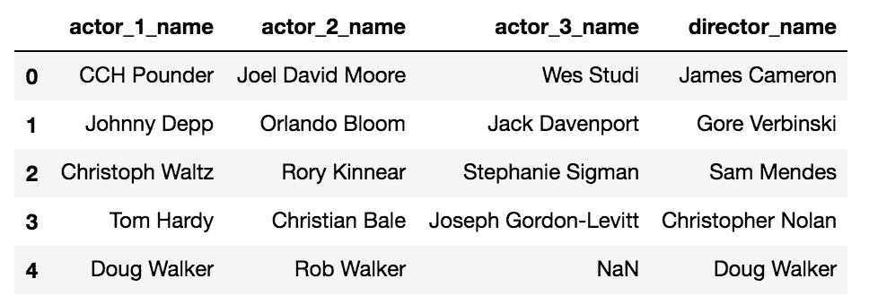

2.  在某些情况下，需要选择数据帧的一列。 这是通过将单个元素列表传递给索引运算符来完成的：

```py
>>> movie[['director_name']].head()
```

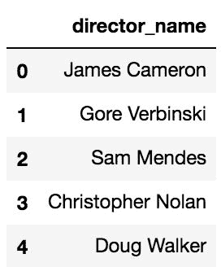

# 工作原理

DataFrame 索引运算符非常灵活，可以接受许多不同的对象。 如果传递了字符串，它将返回一维序列。 如果将列表传递给索引运算符，它将以指定顺序返回列表中所有列的 DataFrame

步骤 2 显示了如何选择单个列作为数据帧而不是序列。 最常见的是，使用字符串选择单个列，从而得到一个系列。 当数据帧是所需的输出时，只需将列名放在一个单元素列表中。

# 更多

在索引运算符内部传递长列表可能会导致可读性问题。 为了解决这个问题，您可以先将所有列名保存到列表变量中。 下面的代码获得与步骤 1 相同的结果：

```py
>>> cols = ['actor_1_name', 'actor_2_name',
            'actor_3_name', 'director_name']
>>> movie_actor_director = movie[cols]
```

`KeyError`是处理 Pandas 的最常见例外之一。 此错误主要是由于列名或索引名的错误输入。 每当尝试不使用列表进行多列选择时，都会引发相同的错误：

```py
>>> movie['actor_1_name', 'actor_2_name',
          'actor_3_name', 'director_name']
KeyError: ('actor_1_name', 'actor_2_name',
           'actor_3_name', 'director_name')
```

这是一个常见的错误，因为很容易忘记将所需的列放在列表中。 您可能想知道这里到底发生了什么。 技术上，用逗号分隔的四个字符串名称是一个元组对象。 通常，元组用开括号和闭括号括起来，但这不是必需的：

```py
>>> tuple1 = 1, 2, 3, 'a', 'b'
>>> tuple2 = (1, 2, 3, 'a', 'b')
>>> tuple1 == tuple2
True
```

Pandas 正试图找到与元组`('actor_1_name', 'actor_2_name', 'actor_3_name', 'director_name')`完全相同的列名。 它失败并引发`KeyError`。

# 用方法选择列

尽管列选择通常直接由索引运算符完成，但是有一些数据帧方法可以以替代方式方便其选择。 `select_dtypes`和`filter`是执行此操作的两种有用方法。

# 准备

您需要熟悉所有 Pandas 数据类型以及如何访问它们。 [第 1 章](../Text/ch01.html#VF2I0-5686c430c0a9442a82c4c5795c8553c9)， *Pandas Foundations* 中的*了解数据类型*秘籍具有包含所有 Pandas 数据类型的表。

# 工作原理

1.  读入电影数据集，并使用电影的标题标记每一行。 使用`get_dtype_counts`方法输出每种特定数据类型的列数：

```py
>>> movie = pd.read_csv('data/movie.csv',
                        index_col='movie_title')
>>> movie.get_dtype_counts()
float64    13
int64       3
object     11
dtype: int64
```

2.  使用`select_dtypes`方法仅选择整数列：

```py
>>> movie.select_dtypes(include=['int']).head()
```

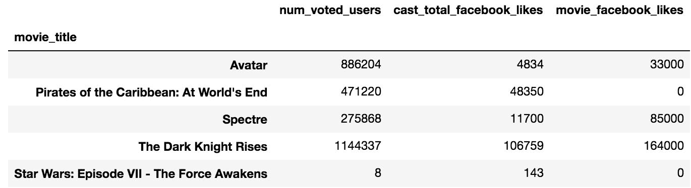

3.  如果要选择所有数字列，则只需将字符串*数字*传递给`include`参数：

```py
>>> movie.select_dtypes(include=['number']).head()
```

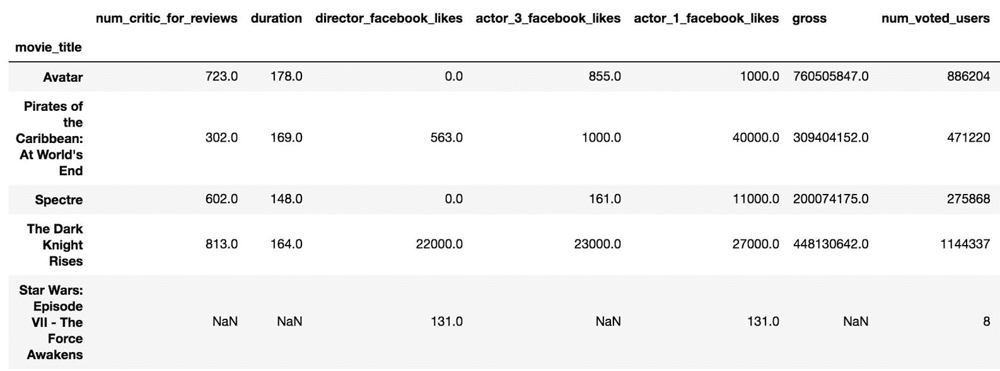

4.  选择列的另一种方法是使用`filter`方法。 此方法很灵活，可以根据使用的参数搜索列名（或索引标签）。 在这里，我们使用`like`参数搜索包含确切字符串 *facebook* 的所有列名称：

```py
>>> movie.filter(like='facebook').head()
```


5.  `filter`方法允许使用`regex`参数通过正则表达式搜索列。 在这里，我们搜索名称中某处有数字的所有列：

```py
>>> movie.filter(regex='\d').head()
```

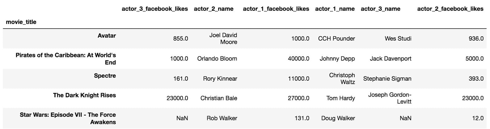

# 工作原理

步骤 1 列出了所有不同数据类型的频率。 或者，您可以使用`dtypes`属性来获取每一列的确切数据类型。 `select_dtypes`方法在其`include`参数中获取数据类型的列表，并返回仅包含那些给定数据类型的列的数据帧。 列表值可以是数据类型的字符串名称，也可以是实际的 Python 对象。

`filter`方法仅通过检查列名而不是实际数据值来选择列。 它具有三个互斥的参数`items`，`like`和`regex`，一次只能使用其中一个。 `like`参数采用一个字符串，并尝试查找名称中某处包含该确切字符串的所有列名称。 为了获得更大的灵活性，您可以使用`regex`参数代替通过正则表达式选择列名称。 这个特定的正则表达式`\d`表示从零到九的所有数字，并且匹配其中至少包含一个数字的任何字符串。

Regular expressions are character sequences that represent search patterns to be used to select different parts of the text. They allow for very complex and highly specific pattern matching.

# 更多

`filter`方法带有另一个参数`items`，该参数采用一列确切的列名。 这几乎与索引运算符完全相同，只是如果其中一个字符串与列名不匹配，则不会引发`KeyError`。 例如，`movie.filter(items=['actor_1_name', 'asdf'])`运行无错误，并返回单列数据帧。

`select_dtypes`的一个令人困惑的方面是它同时接受字符串和 Python 对象的灵活性。 下表应阐明选择许多不同列数据类型的所有可能方法。 在 Pandas 中没有引用数据类型的标准或首选方法，因此最好同时了解两种方式：

| **Python 对象** | **字符串** | **注释** |
| `np.number` | `number` | 选择整数和浮点数，而不考虑大小 |
| `np.float64, np.float_, float` | `float64`，`float_`，`float` | 仅选择 64 位浮点数 |
| `np.float16, np.float32, np.float128` | `float16`，`float32`，`float128` | 分别选择精确的 16 位，32 位和 128 位浮点数 |
| `np.floating` | `floating` | 选择所有浮子，而不管大小 |
| `np.int0, np.int64, np.int_, int` | `int0`，`int64`，`int_`，`int` | 仅选择 64 位整数 |
| `np.int8, np.int16, np.int32` | `int8`，`int16`，`int32` | 分别选择 8、16 和 32 位整数 |
| `np.integer` | `integer` | 选择所有整数，而不考虑大小 |
| `np.object` | `object`，`O` | 选择所有对象数据类型 |
| `np.datetime64` | `datetime64`，`datetime` | 所有日期时间均为 64 位 |
| `np.timedelta64` | `timedelta64`，`timedelta` | 所有时间增量均为 64 位 |
| `pd.Categorical` | `category` | Pandas 特有的； 没有等效的 NumPy |

因为所有整数和浮点数默认为 64 位，所以可以通过使用字符串 *int，*或 *float* 来选择它们，如上表所示。 如果要选择所有整数和浮点数，而不管它们的大小如何，请使用字符串*数字*。

# 另见

*   请参阅*了解数据类型。[第 1 章](../Text/ch01.html#VF2I0-5686c430c0a9442a82c4c5795c8553c9)， *Pandas Foundations**
*   很少使用的`select`方法还可以根据列名选择它们。（ [http://bit.ly/2fchzhu](https://pandas.pydata.org/pandas-docs/stable/generated/pandas.DataFrame.select.html) ）

# 明智地订购列名称

最初将数据集导入为数据帧之后要考虑的首要任务之一是分析列的顺序。 这个基本任务经常被忽略，但是可以在分析进行中产生很大的不同。 计算机没有优先选择列顺序，计算也不受影响。 作为人类，我们自然地从左到右查看和阅读列，这直接影响我们对数据的解释。 杂物柱布置类似于壁橱中的杂物衣服布置。 在短裤顶部的衬衫和裤子旁边放西装是没有好处的。 考虑列顺序时，查找和解释信息要容易得多。

没有标准的规则集来规定应如何在数据集中组织列。 但是，优良作法是制定一组您始终遵循的准则以简化分析。 如果您与一组共享大量数据集的分析师合作，则尤其如此。

# 准备

以下是订购列的简单指南：

*   将每列分为离散列或连续列
*   在离散列和连续列中将公共列分组
*   将最重要的列组首先放置在分类列之前，然后再放置连续列

本秘籍向您展示如何使用此指南订购各列。 有许多明智的可能排序。

# 操作步骤

1.  读取电影数据集，然后扫描数据：

```py
>>> movie = pd.read_csv('data/movie.csv')
>>> movie.head()
```

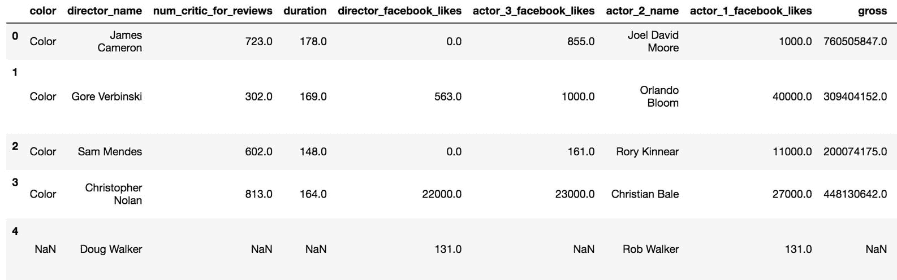

2.  输出所有列名称并扫描相似的离散列和连续列：

```py
>>> movie.columns
Index(['color', 'director_name', 'num_critic_for_reviews',
       'duration', 'director_facebook_likes',
       'actor_3_facebook_likes', 'actor_2_name',
       'actor_1_facebook_likes', 'gross', 'genres',
       'actor_1_name', 'movie_title', 'num_voted_users',
       'cast_total_facebook_likes', 'actor_3_name',
       'facenumber_in_poster', 'plot_keywords',
       'movie_imdb_link', 'num_user_for_reviews', 'language',
       'country', 'content_rating', 'budget', 'title_year',
       'actor_2_facebook_likes', 'imdb_score', 'aspect_ratio',
       'movie_facebook_likes'], dtype='object')
```

3.  这些列似乎没有任何逻辑顺序。 将名称合理地组织到列表中，以便遵循上一部分的指南：

```py
>>> disc_core = ['movie_title', 'title_year',
                 'content_rating', 'genres']
>>> disc_people = ['director_name', 'actor_1_name', 
                   'actor_2_name', 'actor_3_name']
>>> disc_other = ['color', 'country', 'language', 
                  'plot_keywords', 'movie_imdb_link']

>>> cont_fb = ['director_facebook_likes', 'actor_1_facebook_likes', 
               'actor_2_facebook_likes', 'actor_3_facebook_likes',
               'cast_total_facebook_likes', 'movie_facebook_likes']

>>> cont_finance = ['budget', 'gross']
>>> cont_num_reviews = ['num_voted_users', 'num_user_for_reviews',
                        'num_critic_for_reviews']
>>> cont_other = ['imdb_score', 'duration',
                  'aspect_ratio', 'facenumber_in_poster']
```

4.  将所有列表连接在一起以获得最终的列顺序。 另外，请确保此列表包含原始文档中的所有列：

```py
>>> new_col_order = disc_core + disc_people + \
                    disc_other + cont_fb + \
                    cont_finance + cont_num_reviews + \
                    cont_other
>>> set(movie.columns) == set(new_col_order)
True
```

5.  将具有新列顺序的列表传递给数据帧的索引运算符以对列进行重新排序：

```py
>>> movie2 = movie[new_col_order]
>>> movie2.head()
```

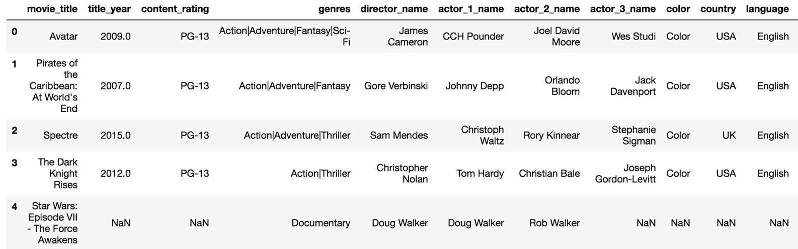

# 工作原理

要从数据帧中选择列的子集，请使用特定列名称的列表。 例如，`movie[['movie_title', 'director_name']]`仅使用`movie_title`和`director_name`列创建一个新的数据帧。 通过名称选择列是 Pandas DataFrame 的索引运算符的默认行为。

步骤 3 根据类型（离散或连续）以及它们的数据相似程度，将所有列名称整齐地组织到单独的列表中。 最重要的列（例如电影的标题）位于第一位。

步骤 4 连接所有列名称列表，并验证此新列表是否包含与原始列名称相同的值。 Python 集是无序的，并且 equity 语句检查一个集的每个成员是否是另一个集的成员。 手动订购此秘籍中的列容易受到人为错误的影响，因为很容易错误地忘记新列列表中的列。

步骤 5 通过将新的列顺序作为列表传递给索引运算符来完成重新排序。 现在，这个新订单比原来的要明智得多。

# 更多

除了前面提到的简单建议外，还有其他订购列的准则。 Hadley Wickham 在有关 Tidy Data 的开创性论文中建议将固定变量放在第一位，然后再放置测量变量。 由于此数据并非来自受控实验，因此可以灵活地确定哪些变量是固定的，哪些是测量的。 测量变量的良好候选者是我们希望预测的变量，例如`gross`，总收入或`imdb_score`。 例如，以这种顺序，我们可以混合离散变量和连续变量。 在该演员的名字之后直接放置 Facebook 喜欢人数的列可能更有意义。 当然，由于计算部分不受列顺序的影响，因此您可以提出自己的列顺序准则。

通常，您将直接从关系数据库中提取数据。 关系数据库的一种非常常见的做法是将主键（如果存在）作为第一列，并在其后直接放置任何外键。

Primary keys uniquely identify rows in the current table. Foreign keys uniquely identify rows in other tables.

# 另见

*   Hadley Wickham 关于*整洁数据*（ [http://bit.ly/2v1hvH5](http://vita.had.co.nz/papers/tidy-data.pdf) ）的论文

# 在整个数据帧上运行

在[第 1 章](../Text/ch01.html#VF2I0-5686c430c0a9442a82c4c5795c8553c9)， *Pandas Foundations* 的*调用系列方法*秘籍中，对单列或系列数据进行操作的各种方法。 当从数据帧调用这些相同的方法时，它们会立即对每一列执行该操作。

# 准备

在本秘籍中，我们将对电影数据集探索各种最常见的数据帧属性和方法。

# 操作步骤

1.  阅读电影数据集，并获取基本描述性属性`shape`，`size`和`ndim`，以及运行`len`函数：

```py
>>> movie = pd.read_csv('data/movie.csv')
>>> movie.shape
(4916, 28)

>>> movie.size
137648

>>> movie.ndim
2

>>> len(movie)
4916
```

2.  使用`count`方法查找每列的不丢失值的数量。 输出是一个序列，现在其旧列名称为，其索引为：

```py
>>> movie.count()
color                     4897
director_name             4814
num_critic_for_reviews    4867
duration                  4901
                          ... 
actor_2_facebook_likes    4903
imdb_score                4916
aspect_ratio              4590
movie_facebook_likes      4916
Length: 28, dtype: int64
```

3.  其他计算摘要统计信息的方法，例如`min`，`max`，`mean`，`median`和`std`都返回相似的序列，其索引中的列名称及其计算结果为值：

```py
>>> movie.min()
num_critic_for_reviews     1.00
duration                   7.00
director_facebook_likes    0.00
actor_3_facebook_likes     0.00
                           ... 
actor_2_facebook_likes     0.00
imdb_score                 1.60
aspect_ratio               1.18
movie_facebook_likes       0.00
Length: 16, dtype: float64
```

4.  `describe`方法非常强大，可以一次计算前面步骤中的所有描述性统计数据和四分位数。 最终结果是一个数据帧，其描述性统计信息为，其索引为：

```py
>>> movie.describe()
```

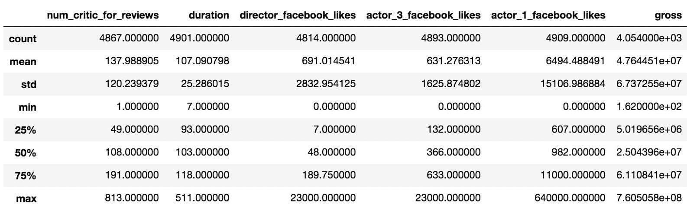

5.  可以使用`percentiles`参数在`describe`方法中指定精确的分位数：

```py
>>> movie.describe(percentiles=[.01, .3, .99])
```

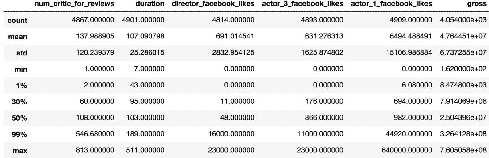

# 工作原理

步骤 1 提供有关数据集大小的基本信息。 `shape`属性返回行和列数的两个元素的元组。 `size`属性返回数据帧中元素的总数，它只是行和列数的乘积。 `ndim`属性返回维数，对于所有数据帧，维数均为 2。 Pandas 定义了内置的`len`函数以返回行数。

步骤 2 和步骤 3 中的方法将每一列汇总为一个数字。 现在，每个列名称都是序列中的索引标签，其汇总结果为相应的值。

如果仔细观察，您会发现步骤 3 的输出缺少步骤 2 的所有对象列。其原因是对象列中缺少值，而 pandas 不知道如何将字符串值与 缺失值。 它会静默删除无法为其计算最小值的所有列。

In this context, silently means that no error was raised and no warning thrown. This is a bit dangerous and requires users to have a good familiarity with pandas.

数字列也缺少值，但返回了结果。 默认情况下，pandas 通过跳过数值列来处理缺失值。 通过将`skipna`参数设置为`False`可以更改此行为。 如果存在至少一个缺失值，这将导致所有这些聚合方法的 Pandas 返回`NaN`。

`describe`方法可一次显示所有主要摘要，并且可以通过将 0 到 1 之间的数字列表传递给`percentiles`参数来扩展其摘要以包含更多分位数。 默认情况下，仅在数字列上显示信息。 有关`describe`方法的更多信息，请参见*开发数据分析例程*秘籍。

# 更多

要查看`skipna`参数如何影响结果，我们可以将其值设置为`False`，然后从前面的秘籍重新运行步骤 3。 只有没有缺失值的数字列将计算结果：

```py
>>> movie.min(skipna=False)
num_critic_for_reviews     NaN
duration                   NaN
director_facebook_likes    NaN
actor_3_facebook_likes     NaN
                          ... 
actor_2_facebook_likes     NaN
imdb_score                 1.6
aspect_ratio               NaN
movie_facebook_likes       0.0
Length: 16, dtype: float64
```

# 将数据帧方法链接在一起

无论您相信方法链接是否是一种好的做法，在使用 Pandas 进行数据分析时都会遇到它是很普遍的。 *连锁系列方法结合在一起[第 1 章](../Text/ch01.html#VF2I0-5686c430c0a9442a82c4c5795c8553c9)， *Pandas Foundations* 中的*秘籍展示了连锁系列方法一起的几个示例。 本章中的所有方法链都将从数据帧开始。 方法链接的关键之一是知道在链接的每个步骤中返回的确切对象。 在 Pandas 中，这几乎总是一个数据帧，序列或标量值。

# 准备

在此秘籍中，我们计算移动数据集每一列中的所有缺失值。

# 操作步骤

1.  要获得缺失值的计数，必须首先调用`isnull`方法以将每个数据帧值更改为布尔值。 让我们在电影数据集上调用此方法：

```py
>>> movie = pd.read_csv('data/movie.csv')
>>> movie.isnull().head()
```

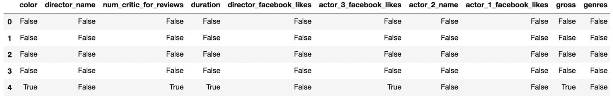

2.  我们将链接将`True` / `False`布尔值解释为 1/0 的`sum`方法。 请注意，返回了一个序列：

```py
>>> movie.isnull().sum().head()
color                       19
director_name              102
num_critic_for_reviews      49
duration                    15
director_facebook_likes    102
dtype: int64
```

3.  我们可以再走一步，取该系列的总和，然后将整个数据帧中缺失值总数的计数作为标量值返回：

```py
>>> movie.isnull().sum().sum()
2654
```

4.  略有偏差是为了确定数据帧中是否缺少任何值。 我们在此连续两次使用`any`方法来执行此操作：

```py
>>> movie.isnull().any().any()
True
```

# 工作原理

`isnull`方法返回一个与调用数据帧相同大小的数据帧，但所有值都转换为布尔值。 请参阅以下数据类型的计数以验证这一点：

```py
>>> movie.isnull().get_dtype_counts()
bool    28
dtype: int64
```

由于布尔值的数值评估为 0/1，因此可以按列对它们进行求和，如步骤 2 所示。所得的序列本身也具有`sum`方法，该方法可以使我们在数据帧中获得总计的缺失值。

在步骤 4 中，`any` DataFrame 方法返回一系列布尔值，指示每个列是否存在至少一个`True`。 `any`方法再次链接到该布尔结果序列上，以确定是否有任何列缺少值。 如果步骤 4 评估为`True`，则整个数据帧中至少存在一个缺失值。

# 更多

电影数据集中具有对象数据类型的大多数列都包含缺少的值。 默认情况下，聚合方法`min`，`max`和`sum`不返回任何内容，如以下代码片段所示，该代码片段选择三个对象列并尝试查找每个对象的最大值：

```py
>>> movie[['color', 'movie_title', 'color']].max()
Series([], dtype: float64)
```

为了迫使 Pandas 为每一列返回值，我们必须填写缺失值。 在这里，我们选择一个空字符串：

```py
>>> movie.select_dtypes(['object']).fillna('').min()
color                                                          Color
director_name                                          Etienne Faure
actor_2_name                                           Zubaida Sahar
genres                                                       Western
actor_1_name                                           Oscar Jaenada
movie_title                                                 Æon Flux
actor_3_name                                           Oscar Jaenada
plot_keywords                                    zombie|zombie spoof
movie_imdb_link    http://www.imdb.com/title/tt5574490/?ref_=fn_t...
language                                                        Zulu
country                                                 West Germany
content_rating                                                     X
dtype: object
```

出于可读性考虑，方法链通常被编写为每行一个方法调用，并在末尾使用反斜杠字符以避开新行。 这样可以更轻松地阅读和插入有关链的每个步骤返回的内容的注释：

```py
>>> # rewrite the above chain on multiple lines
>>> movie.select_dtypes(['object']) \
         .fillna('') \
         .min()
```

It is atypical to aggregate a column of all strings, as the minimum and maximum values are not universally defined. Attempting to call methods that clearly have no string interpretation, such as finding the mean or variance, will not work.

# 另见

*   一起参考*连锁系列方法[第 1 章中的](../Text/ch01.html#VF2I0-5686c430c0a9442a82c4c5795c8553c9)*秘籍， *Pandas Foundations*

# 在数据帧上与运算符一起使用

*中提供了关于运算符的入门知识，它与[第 1 章](../Text/ch01.html#VF2I0-5686c430c0a9442a82c4c5795c8553c9)，*Pandas 基金会*的* 系列秘籍秘籍有关。 这里。 Python 算术和比较运算符直接在数据帧上工作，就像在序列上一样。

# 准备

当数据帧直接使用算术运算符或比较运算符之一进行运算时，每列的每个值都会对其应用运算。 通常，当运算符与数据帧一起使用时，列要么全为数字，要么为所有对象（通常是字符串）。 如果数据帧不包含同类数据，则该操作很可能会失败。 让我们来看一个关于大学数据集失败的示例，该数据集同时包含数字和对象数据类型。 尝试将`5`添加到数据帧的每个值都会引发`TypeError`，因为不能将整数添加到字符串中：

```py
>>> college = pd.read_csv('data/college.csv')
>>> college + 5
TypeError: Could not operate 5 with block values must be str, not int
```

若要成功将运算符与数据帧配合使用，请首先选择同类数据。 对于此秘籍，我们将选择以`UGDS_`开头的所有列。 这些栏代表按种族划分的大学生比例。 首先，我们导入数据并使用机构名称作为索引的标签，然后使用`filter`方法选择所需的列：

```py
>>> college = pd.read_csv('data/college.csv', index_col='INSTNM')
>>> college_ugds_ = college.filter(like='UGDS_')
>>> college_ugds_.head()
```


此秘籍使用多个运算符和一个数据帧将本科生的列四舍五入到最接近的百分之一。 然后，我们将看到此结果如何等效于`round`方法。

# 操作步骤

1.  为了与运算符开始四舍五入的冒险，我们首先将`.00501`添加到`college_ugds_`的每个值：

```py
>>> college_ugds_ + .00501
```

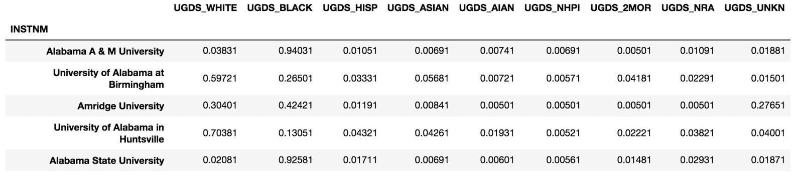

2.  使用楼层除法运算符`//`舍入到最接近的整数百分比：

```py
>>> (college_ugds_ + .00501) // .01
```


3.  要完成舍入练习，请除以 100：

```py
>>> college_ugds_op_round = (college_ugds_ + .00501) // .01 / 100
>>> college_ugds_op_round.head()
```

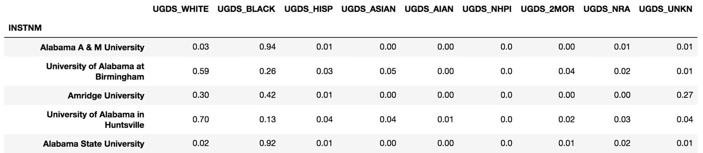

4.  现在，使用`round` DataFrame 方法为我们自动进行舍入。 NumPy 四舍五入正好在两边到偶数边中间的数字。 因此，我们在舍入前添加一小部分：

```py
>>> college_ugds_round = (college_ugds_ + .00001).round(2)
```

5.  使用`equals` DataFrame 方法测试两个数据帧的相等性：

```py
>>> college_ugds_op_round.equals(college_ugds_round)
True
```

# 工作原理

步骤 1 使用 plus 运算符，该运算符尝试将标量值添加到数据帧的每一列的每个值。 由于列都是数字，因此此操作按预期进行。 每列中都有一些缺失值，但在操作后它们仍然缺失。

从数学上讲，添加`.005`应该足够，以便下一步的底数分割正确舍入到最接近的整数百分比。 由于浮点数的不精确性而出现问题：

```py
>>> .045 + .005
0.049999999999999996
```

每个数字都有一个额外的`.00001`，以确保浮点表示的前四位数字与实际值相同。 之所以可行，是因为数据集中所有点的最大精度是四个小数位。

步骤 2 将楼层除法运算符`//`应用于数据帧中的所有值。 实际上，当我们除以小数时，它是将每个值乘以`100`并截断任何小数。 在表达式的第一部分周围需要括号，因为底数划分的优先级高于加法。 步骤 3 使用除法运算符将小数返回正确的位置。

在步骤 4 中，我们使用`round`方法重现了先前的步骤。 在执行此操作之前，由于与步骤 1 有所不同的原因，我们必须再次向每个数据帧值添加一个额外的`.00001`。NumPy 和 Python 3 的舍入数字恰好位于两边到偶数之间。 这种*与偶数*（http://bit.ly/2x3V5TU）技术的联系通常不是学校正式教的。 它不会始终将数字偏向更高端（http://bit.ly/2zhsPy8）。

这里有必要四舍五入，以使两个数据帧值相等。 `equals`方法确定两个数据帧之间的所有元素和索引是否完全相同，并返回一个布尔值。

# 更多

与序列一样，数据帧具有与运算符等效的方法。 您可以将运算符替换为其等效的方法：

```py
>>> college_ugds_op_round_methods = college_ugds_.add(.00501) \
                                                 .floordiv(.01) \
                                                 .div(100)
>>> college_ugds_op_round_methods.equals(college_ugds_op_round)
True
```

# 另见

*   每个计算机科学家都应该了解有关浮点运算的知识（ [http://bit.ly/2vmYZKi](http://bit.ly/2vmYZKi) ）

# 比较缺失值

Pandas 使用 NumPy NaN（`np.nan`）对象表示缺失值。 这是不寻常的对象，因为它不等于其自身。 与自身相比，甚至 Python 的`None`对象也将其评估为`True`：

```py
>>> np.nan == np.nan
False
>>> None == None
True
```

与`np.nan`的所有其他比较也返回`False`，除了不等于：

```py
>>> np.nan > 5
False
>>> 5 > np.nan
False
>>> np.nan != 5
True
```

# 准备

Series 和数据帧使用等号运算符`==`进行逐元素比较，以返回相同大小的对象。 此秘籍向您展示如何使用 equals 运算符，该运算符与`equals`方法非常不同。

与前面的秘籍一样，将使用代表大学数据集中各种族学生的分数的列：

```py
>>> college = pd.read_csv('data/college.csv', index_col='INSTNM')
>>> college_ugds_ = college.filter(like='UGDS_')
```

# 操作步骤

1.  为了了解 equals 运算符的工作原理，我们将每个元素与一个标量值进行比较：

```py
>>> college_ugds_ == .0019
```

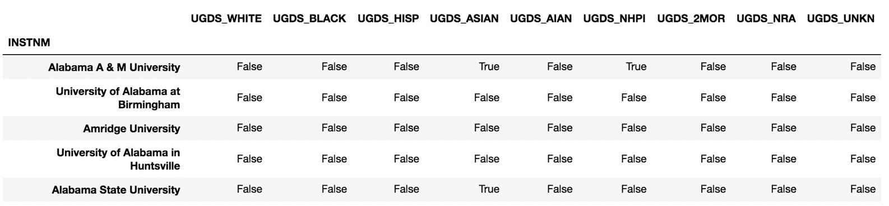

2.  这可以按预期工作，但是每当您尝试比较缺少值的数据帧时，就会出现问题。 该相同的等于运算符可用于在逐个元素的基础上将两个数据帧相互比较。 例如，将`college_ugds_` 与自身进行比较，如下所示：

```py
>>> college_self_compare = college_ugds_ == college_ugds_
>>> college_self_compare.head()
```

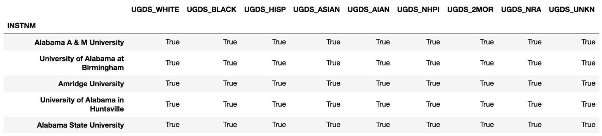

3.  乍一看，所有值似乎都相等，就像您期望的那样。 但是，使用`all`方法确定每列是否仅包含`True`值会产生意外结果：

```py
>>> college_self_compare.all()
UGDS_WHITE    False
UGDS_BLACK    False
UGDS_HISP     False
UGDS_ASIAN    False
UGDS_AIAN     False
UGDS_NHPI     False
UGDS_2MOR     False
UGDS_NRA      False
UGDS_UNKN     False
dtype: bool
```

4.  发生这种情况是因为缺失值彼此之间没有相等的比较。 如果您尝试使用 equal 运算符对缺失值进行计数并对布尔列求和，则每个数字将得到零：

```py
>>> (college_ugds_ == np.nan).sum()
UGDS_WHITE    0
UGDS_BLACK    0
UGDS_HISP     0
UGDS_ASIAN    0
UGDS_AIAN     0
UGDS_NHPI     0
UGDS_2MOR     0
UGDS_NRA      0
UGDS_UNKN     0
dtype: int64
```

5.  计算缺失值的主要方法是使用`isnull`方法：

```py
>>> college_ugds_.isnull().sum()
UGDS_WHITE    661
UGDS_BLACK    661
UGDS_HISP     661
UGDS_ASIAN    661
UGDS_AIAN     661
UGDS_NHPI     661
UGDS_2MOR     661
UGDS_NRA      661
UGDS_UNKN     661
dtype: int64
```

6.  比较两个整个数据帧的正确方法不是使用 equals 运算符，而是使用`equals`方法：

```py
>>> college_ugds_.equals(college_ugds_)
True
```

# 工作原理

步骤 1 将一个数据帧与一个标量值进行比较，而步骤 2 将一个数据帧与另一个数据帧进行比较。 乍看之下，这两种操作都非常简单直观。 第二个操作实际上是检查数据帧是否具有相同标签的索引，以及是否具有相同数量的元素。 如果不是这种情况，操作将失败。 有关更多信息，请参见[第 6 章](../Text/ch06.html#8PALU0-5686c430c0a9442a82c4c5795c8553c9)，*索引对齐*中的*生产笛卡尔积*秘籍。

步骤 3 验证数据帧中的列均不相等。 步骤 4 进一步显示了`np.nan`与它本身的不等价性。 步骤 5 验证数据帧中确实存在缺失值。 最后，第 6 步显示了将数据帧与`equals`方法进行比较的正确方法，该方法始终返回布尔型标量值。

# 更多

所有比较运算符都有对应的方法，可以使用更多功能。 有点令人困惑的是，`eq` DataFrame 方法像 equals 运算符一样进行逐元素比较。`eq`方法与`equals`方法完全不同。 它仅执行与 equals 运算符相似的任务。 以下代码重复了步骤 1：

```py
>>> college_ugds_.eq(.0019)    # same as college_ugds_ == .0019 
```

在`pandas.testing`子软件包中，存在开发人员在创建单元测试时必须使用的功能。 如果两个数据帧不相等，则`assert_frame_equal`函数将引发`AssertionError`。 如果传递的两个帧相等，则返回`None`：

```py
>>> from pandas.testing import assert_frame_equal
>>> assert_frame_equal(college_ugds_, college_ugds_) 
```

Unit tests are a very important part of software development and ensure that the code is running correctly. Pandas contains many thousands of unit tests that help ensure that it is running properly. To read more on how pandas runs its unit tests, see the *Contributing to pandas* section in the documentation (http://bit.ly/2vmCSU6).

# 转换数据帧操作的方向

许多数据帧方法都有一个`axis`参数。 这个重要的参数控制操作的方向。 轴参数只能是两个值之一（0 或 1），并且分别作为字符串*索引*和*列*的别名。

# 准备

几乎所有的数据帧方法都将`axis`参数默认为 0 / index。 此秘籍向您展示了如何调用相同的方法，但其操作方向已被调换。 为了简化练习，将仅使用引用大学数据集中每个学校的百分比种族的列。

# 操作步骤

1.  读取大学数据集； 以`UGDS_`开头的列代表特定种族的本科生所占的百分比。 使用`filter`方法选择以下列：

```py
>>> college = pd.read_csv('data/college.csv', index_col='INSTNM')
>>> college_ugds_ = college.filter(like='UGDS_')
>>> college_ugds_.head()
```


2.  现在，数据帧包含均匀的列数据，可以在垂直和水平方向上合理地进行操作。 `count`方法返回非缺失值的数量。 默认情况下，其`axis`参数设置为 0：

```py
>>> college_ugds_.count()
UGDS_WHITE    6874
UGDS_BLACK    6874
UGDS_HISP     6874
UGDS_ASIAN    6874
UGDS_AIAN     6874
UGDS_NHPI     6874
UGDS_2MOR     6874
UGDS_NRA      6874
UGDS_UNKN     6874
```

As the `axis` parameter is almost always set to 0, it is not necessary to do the following, but for purposes of understanding, Step 2 is equivalent to both `college_ugds_.count(axis=0)` and `college_ugds_.count(axis='index')`.

3.  将`axis`参数更改为 1 /列，将对操作进行转置，以使每行数据都有其非缺失值的计数：

```py
>>> college_ugds_.count(axis='columns').head()
INSTNM
Alabama A & M University               9
University of Alabama at Birmingham    9
Amridge University                     9
University of Alabama in Huntsville    9
Alabama State University               9
```

4.  代替计算非缺失值，我们可以对每一行中的所有值求和。 每行百分比应总计为 1。`sum`方法可用于验证这一点：

```py
>>> college_ugds_.sum(axis='columns').head()
INSTNM
Alabama A & M University               1.0000
University of Alabama at Birmingham    0.9999
Amridge University                     1.0000
University of Alabama in Huntsville    1.0000
Alabama State University               1.0000
```

5.  为了了解每列的分布，可以使用`median`方法：

```py
>>> college_ugds_.median(axis='index')
UGDS_WHITE    0.55570
UGDS_BLACK    0.10005
UGDS_HISP     0.07140
UGDS_ASIAN    0.01290
UGDS_AIAN     0.00260
UGDS_NHPI     0.00000
UGDS_2MOR     0.01750
UGDS_NRA      0.00000
UGDS_UNKN     0.01430
```

# 工作原理

操作的方向是 Pandas 中比较混乱的方面之一，互联网上到处都有讨论它的解释的线程。 许多新手 Pandas 用户很难记住`axis`参数的含义。 幸运的是，在 Pandas 中，一项操作可以完成两个潜在的方向。 一种可能的方法是尝试双向尝试直到获得所需结果的简单蛮力解决方案。 我记得`axis`参数的含义，认为 1 看起来像一列，对`axis=1`的任何操作都会返回一个新的数据列（与该列具有相同数量的项）。

这在第 3 步中得到确认，在第 3 步中，结果（没有`head`方法）将返回新的数据列，并且可以根据需要轻松地将其作为列附加到数据帧中。 `axis`等于 1 / index 的其他步骤将返回新的数据行。

# 更多

使用`axis=1`的`cumsum`方法累积了每一行的比赛百分比。 它给出的数据视图略有不同。 例如，很容易看到每所学校的白人，黑人和西班牙裔美国人的确切百分比：

```py
>> college_ugds_cumsum = college_ugds_.cumsum(axis=1)
>>> college_ugds_cumsum.head()
```

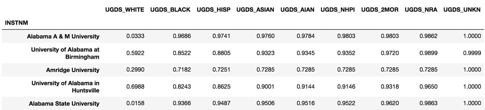

# 另见

*   Pandas `cumsum`的官方文档（ [http://bit.ly/2v3B6EZ](http://bit.ly/2v3B6EZ) ）

# 确定大学校园的多样性

每年都会写很多文章，讨论多样性对大学校园的不同方面和影响。 各种组织已经开发出度量标准，以尝试测量多样性。 《美国新闻》是为许多不同类别的大学提供排名的领导者，其中之一就是多样性。 他们的多样性指数排名前十的学院如下：

```py
>> pd.read_csv('data/college_diversity.csv', index_col='School')
```

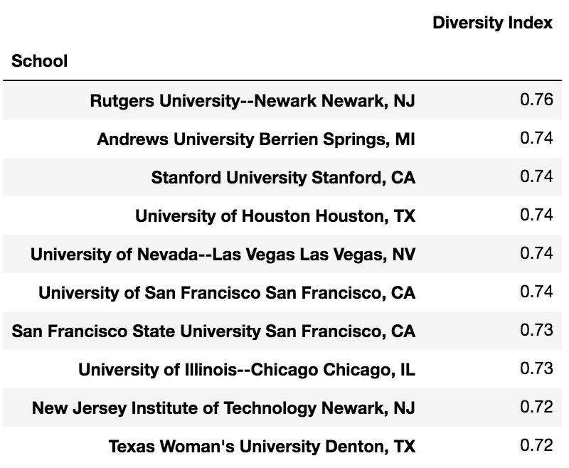

# 准备

我们的大学数据集将种族分为九个不同类别。 当尝试量化没有明显定义的事物时，例如**分集**，它有助于从非常简单的事物开始。 在此秘籍中，我们的多样性指标将等于学生人数超过 15% 的种族数。

# 操作步骤

1.  读入大学数据集，并仅针对大学生种族栏进行过滤：

```py
>>> college = pd.read_csv('data/college.csv', index_col='INSTNM')
>>> college_ugds_ = college.filter(like='UGDS_')
```

2.  这些大学中许多都缺少其所有比赛专栏的价值。 我们可以计算每一行的所有缺失值，并对所得的系列从最高到最低进行排序。 这将向大学揭示缺少值：

```py
>>> college_ugds_.isnull()\
                 .sum(axis=1)\
                 .sort_values(ascending=False)\
                 .head()
INSTNM
Excel Learning Center-San Antonio South         9
Philadelphia College of Osteopathic Medicine    9
Assemblies of God Theological Seminary          9
Episcopal Divinity School                       9
Phillips Graduate Institute                     9
dtype: int64
```

3.  既然我们已经看到了缺少所有种族列的大学，我们可以使用`dropna`方法删除所有缺少 9 个种族百分比的所有行。 然后，我们可以计算剩余的缺失值：

```py
>>> college_ugds_ = college_ugds_.dropna(how='all')
>>> college_ugds_.isnull().sum()
UGDS_WHITE    0
UGDS_BLACK    0
UGDS_HISP     0
UGDS_ASIAN    0
UGDS_AIAN     0
UGDS_NHPI     0
UGDS_2MOR     0
UGDS_NRA      0
UGDS_UNKN     0
dtype: int64
```

4.  数据集中没有遗漏任何值。 现在，我们可以计算多样性指标。 首先，我们将使用大于或等于数据帧的方法`ge`将每个值转换为布尔值：

```py
>>> college_ugds_.ge(.15)
```

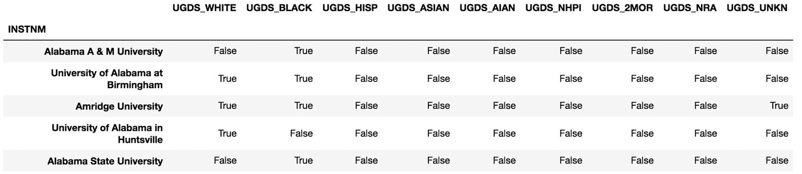

5.  从这里开始，我们可以使用`sum`方法对每个学院的`True`值进行计数。 请注意，返回了一个序列：

```py
>>> diversity_metric = college_ugds_.ge(.15).sum(axis='columns')
>>> diversity_metric.head()
INSTNM
Alabama A & M University               1
University of Alabama at Birmingham    2
Amridge University                     3
University of Alabama in Huntsville    1
Alabama State University               1
dtype: int64
```

6.  为了了解分布情况，让我们在本系列中使用`value_counts`方法：

```py
>>> diversity_metric.value_counts()
1    3042
2    2884
3     876
4      63
0       7
5       2
dtype: int64
```

7.  令人惊讶的是，两所学校在五个不同种族类别中的比例超过 15% 。 让我们对`diversity_metric`系列进行排序，以找出它们是哪些：

```py
>>> diversity_metric.sort_values(ascending=False).head()
INSTNM
Regency Beauty Institute-Austin          5
Central Texas Beauty College-Temple      5
Sullivan and Cogliano Training Center    4
Ambria College of Nursing                4
Berkeley College-New York                4
dtype: int64
```

8.  学校可以这么多样化似乎有点可疑。 让我们看一下这两家顶级学校的原始百分比。 `.loc`索引器用于根据索引标签专门选择：

```py
>>> college_ugds_.loc[['Regency Beauty Institute-Austin', 
                       'Central Texas Beauty College-Temple']]
```

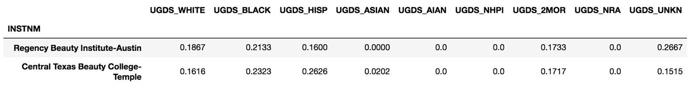

9.  似乎有几个类别被汇总到“未知”和“两个或多个种族”列中。 无论如何，它们似乎都非常不同。 我们可以看到美国新闻学院排名前 10 的学校在这一基本多样性指标方面的表现如何：

```py
>>> us_news_top = ['Rutgers University-Newark',
                   'Andrews University', 
                   'Stanford University', 
                   'University of Houston',
                   'University of Nevada-Las Vegas']

>>> diversity_metric.loc[us_news_top]
INSTNM
Rutgers University-Newark         4
Andrews University                3
Stanford University               3
University of Houston             3
University of Nevada-Las Vegas    3
dtype: int64
```

# 工作原理

第 2 步进行计数，然后显示缺失值最多的学校。 由于数据帧中有九列，因此每所学校的缺失值最大数目为九。 许多学校缺少每一列的值。 步骤 3 删除所有值均缺失的行。 步骤 3 中的`dropna`方法具有`how`参数，该参数默认为字符串`any`，但也可以更改为`all`。 设置为`any`时，它将删除包含一个或多个缺失值的行。 设置为`all`时，它仅删除缺少所有值的行。

在这种情况下，我们保守地删除丢失所有值的行。 这是因为某些缺失值可能仅代表 0% 。 这不是碰巧的情况，因为执行`dropna`之后没有丢失值。 如果仍然缺少值，我们可以运行`fillna(0)` 方法用 0 填充所有剩余值。

步骤 4 使用大于或等于方法`ge`开始我们的分集指标计算。 这将导致所有布尔值的数据帧，通过设置`axis='columns'`将其水平求和。

在第 5 步中使用`value_counts`方法来生成我们的多样性指标的分布。 对于学校而言，很少有三场比赛的大学生人数占总人数的 15% 或更多。 第 7 步和第 8 步根据我们的指标找到最多样化的两所学校。 尽管它们是多种多样的，但似乎很多种族并没有得到充分考虑，并且被默认为未知类别和两个或多个类别。

步骤 9 从“美国新闻”文章中选择排名前五的学校。 然后，从我们新创建的系列中选择其多样性指标。 事实证明，这些学校在我们的简单排名系统中也得分很高。

# 更多

另外，我们可以通过按最大种族百分比对它们进行排序来找到差异最小的学校：

```py
>>> college_ugds_.max(axis=1).sort_values(ascending=False).head(10)
INSTNM
Dewey University-Manati                               1.0
Yeshiva and Kollel Harbotzas Torah                    1.0
Mr Leon's School of Hair Design-Lewiston              1.0
Dewey University-Bayamon                              1.0
Shepherds Theological Seminary                        1.0
Yeshiva Gedolah Kesser Torah                          1.0
Monteclaro Escuela de Hoteleria y Artes Culinarias    1.0
Yeshiva Shaar Hatorah                                 1.0
Bais Medrash Elyon                                    1.0
Yeshiva of Nitra Rabbinical College                   1.0
dtype: float64
```

我们还可以确定是否有任何一所学校的所有 9 个种族类别都超过 1% ：

```py
>>> (college_ugds_ > .01).all(axis=1).any()
True
```

# 另见

*   美国新闻校园种族多样性 2015-2016（ [http://bit.ly/2vmDhWC](http://bit.ly/2vmDhWC) ）