# 开始数据分析

在本章中，我们将介绍以下主题：

*   制定数据分析程序
*   通过更改数据类型减少内存
*   从最大的中选择最小的
*   通过排序选择每个组中最大的组
*   用`sort_values`复制`nlargest`
*   计算追踪止损单价格

# 介绍

重要的是，要考虑作为分析人员在将数据集作为数据帧导入工作区后首次遇到数据集时应采取的步骤。 您通常会首先执行一组任务来检查数据吗？ 您是否了解所有可能的数据类型？ 本章首先介绍您第一次遇到新的数据集时可能要执行的任务。 本章通过回答在 Pandas 中不常见的常见问题继续进行。

# 制定数据分析程序

尽管开始数据分析时没有标准方法，但是通常最好在首次检查数据集时为自己开发一个例程。 类似于我们用于起床，洗澡，上班，吃饭等的常规例程，开始的数据分析例程可帮助人们快速熟悉新的数据集。 该例程可以表现为动态任务清单，随着您对 Pandas 的熟悉和数据分析的扩展而不断发展。

**探索性数据分析**（ **EDA** ）是一个术语，用于涵盖数据分析的整个过程，而无需正式使用统计测试程序。 EDA 的许多工作都涉及可视地显示数据之间的不同关系，以检测有趣的模式并提出假设。

# 做好准备

本食谱涵盖了 EDA 的一小部分但又是基础部分：以常规方式和系统方式收集**元数据**和**单变量描述统计信息**。 它概述了在首次将任何数据集作为 pandas DataFrame 导入时可以执行的一组常见任务。 此食谱可能有助于形成您在首次检查数据集时可以实现的例程的基础。

Metadata describes the dataset, or more aptly, data about the data. Examples of metadata include the number of columns/rows, column names, data types of each column, the source of the dataset, the date of collection, the acceptable values for different columns, and so on. Univariate descriptive statistics are summary statistics about individual variables (columns) of the dataset, independent of all other variables.

# 怎么做...

首先，将收集`college`数据集上的一些元数据，然后是每列的基本摘要统计信息：

1.  读取数据集，并使用`head`方法查看前五行：

```py
>>> college = pd.read_college('data/college.csv')
>>> college.head()
```

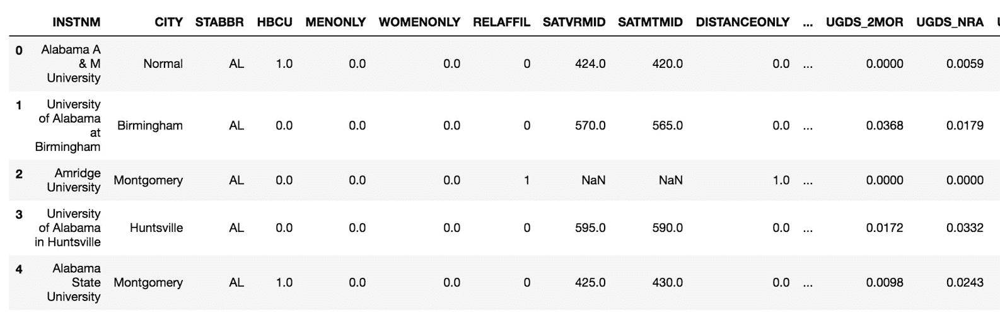

2.  使用`shape`属性获取数据帧的尺寸：

```py
>>> college.shape
>>> (7535, 27)
```

3.  使用`info`方法列出每一列的数据类型，非缺失值的数量以及内存使用情况：

```py
>>> college.info()
```

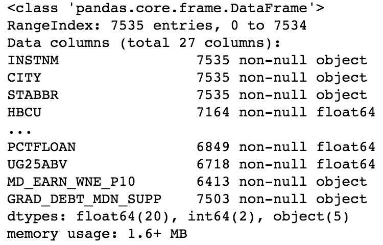

4.  获取数字列的摘要统计信息，并转置数据帧以获得更可读的输出：

```py
>>> college.describe(include=[np.number]).T
```

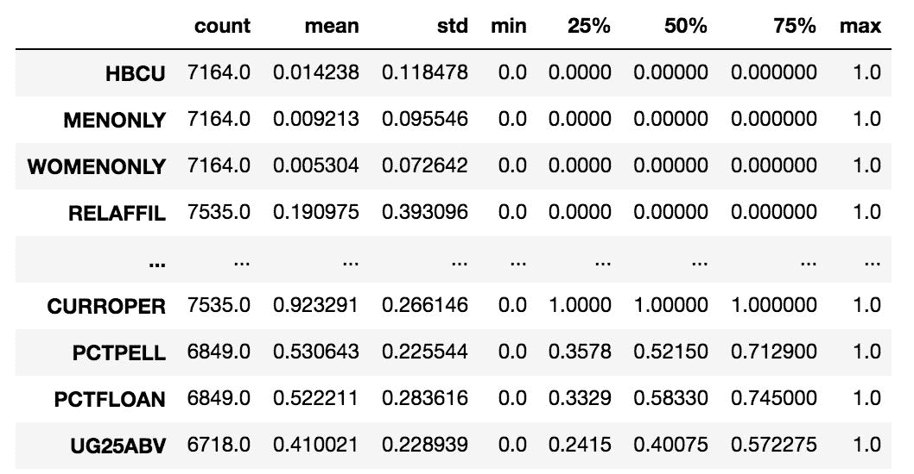

5.  获取对象和分类列的摘要统计信息：

```py
>>> college.describe(include=[np.object, pd.Categorical]).T
```


# 怎么运行的...

导入数据集后，常见的任务是打印出数据帧的前几行，以使用`head`方法进行手动检查。 `shape`属性返回第一条元数据，即包含行数和列数的元组。

一次获取最多元数据的主要方法是`info`方法。 它提供每个列的名称，非缺失值的数量，每个列的数据类型以及数据帧的近似内存使用情况。 对于所有数据帧，列值始终是一种数据类型。 关系数据库也是如此。 总体而言，数据帧可能由具有不同数据类型的列组成。

Internally, pandas stores columns of the same data type together in blocks. For a deeper dive into pandas internals, see Jeff Tratner's slides (http://bit.ly/2xHIv1g).

步骤 4 和步骤 5 在不同类型的列上生成单变量描述性统计信息。 强大的`describe`方法根据提供给`include`参数的数据类型产生不同的输出。 默认情况下，`describe`输出所有数字（主要是**连续**）列的摘要，并静默删除任何**类别**列。 您可以使用`np.number`或字符串*数字*在摘要中包含整数和浮点数。 从技术上讲，数据类型是层次结构的一部分，其中数字位于整数和浮点上方。 查看下图，以更好地了解 NumPy 数据类型层次结构：

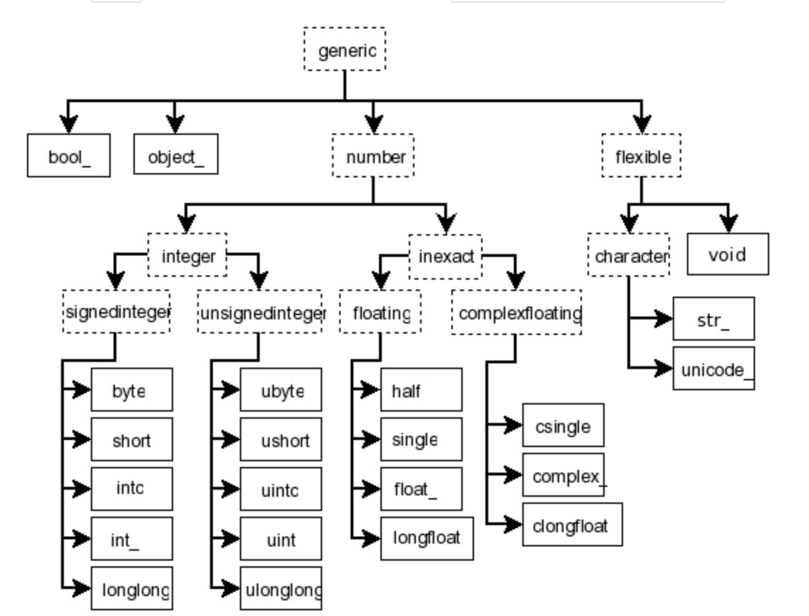Broadly speaking, we can classify data as being either continuous or categorical. Continuous data is always numeric and can usually take on an infinite number of possibilities such as height, weight, and salary. Categorical data represents discrete values that take on a finite number of possibilities such as ethnicity, employment status, and car color. Categorical data can be represented numerically or with characters.

分类列通常将是`np.object`或`pd.Categorical`类型。 步骤 5 确保同时代表这两种类型。 在第 4 步和第 5 步中，输出数据帧均带有`T`属性。 这简化了具有许多列的数据帧的可读性。

# 还有更多...

当与数字列一起使用时，可以指定从`describe`方法返回的确切分位数：

```py
>>> college.describe(include=[np.number], 
                     percentiles=[.01, .05, .10, .25, .5,
                                  .75, .9, .95, .99]).T
```

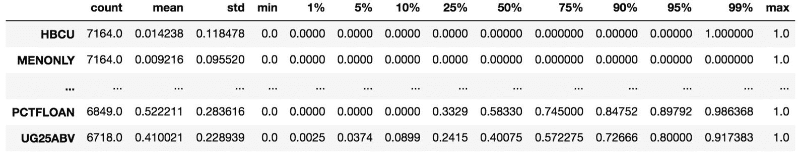

# 数据字典

数据分析的关键部分涉及创建和维护数据字典。 数据字典是元数据表和每列数据上的注释。 数据字典的主要目的之一是解释列名的含义。 高校数据集使用许多缩写，这对于首次检查它的分析师而言可能是陌生的。

以下`college_data_dictionary.csv`文件中提供了大学数据集的数据字典：

```py
>>> pd.read_csv('data/collge_data_dictionaray.csv')
```

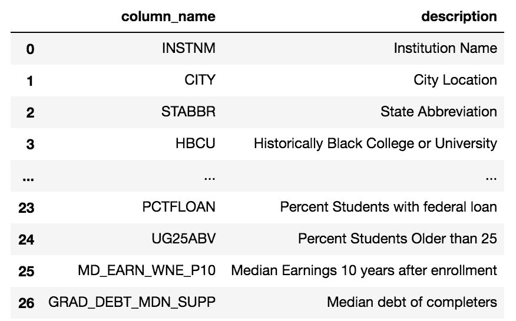

如您所见，它在解密缩写列名称方面非常有用。 实际上，数据帧不是存储数据字典的最佳位置。 诸如 Excel 或 Google 表格之类的平台具有易于编辑值和附加列的能力，是更好的选择。 至少，应在数据字典中包含一列以跟踪数据注释。 数据字典是您作为协作者的分析师可以共享的第一件事。

通常，您正在使用的数据集源自数据库，您必须联系该数据库的管理员才能获取更多信息。 正式的电子数据库通常具有更正式的数据表示形式，称为**模式**。 如果可能，请尝试与对设计有专业知识的人员一起调查您的数据集。

# 也可以看看

*   NumPy 数据层次结构文档（ [http://bit.ly/2yqsg7p](http://bit.ly/2yqsg7p) ）

# 通过更改数据类型减少内存

Pandas 并未将数据大致分为连续数据或分类数据，但对许多不同的数据类型都有精确的技术定义。

# Getting ready

此配方将大学数据集中的对象列之一的数据类型更改为特殊的 Pandas 分类数据类型，以大大减少其内存使用量。

# How to do it...

1.  阅读我们的大学数据集后，我们选择几列不同的数据类型，这些列将清楚地显示可以节省多少内存：

```py
>>> college = pd.read_csv('data/college.csv')
>>> different_cols = ['RELAFFIL', 'SATMTMID', 'CURROPER',
 'INSTNM', 'STABBR']
>>> col2 = college.loc[:, different_cols]
>>> col2.head()
```

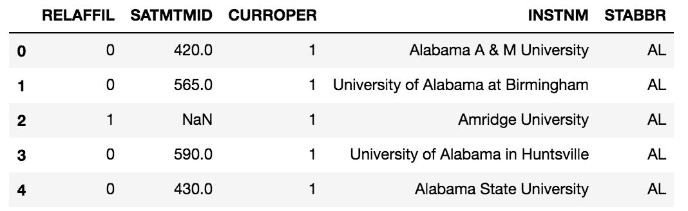

2.  检查每一列的数据类型：

```py
>>> col2.dtypes
RELAFFIL      int64
SATMTMID    float64
CURROPER      int64
INSTNM       object
STABBR       object
dtype: object
```

3.  使用`memory_usage`方法查找每一列的内存使用情况：

```py
>>> original_mem = col2.memory_usage(deep=True)
>>> original_mem
Index           80
RELAFFIL     60280
SATMTMID     60280
CURROPER     60280
INSTNM      660240
STABBR      444565
dtype: int64
```

4.  `RELAFFIL` 列不需要使用 64 位，因为它仅包含 0/1 值。 让我们使用`astype`方法将此列转换为 8 位（1 字节）整数：

```py
>>> col2['RELAFFIL'] = col2['RELAFFIL'].astype(np.int8)
```

5.  使用`dtypes`属性来确认数据类型更改：

```py
>>> col2.dtypes
RELAFFIL       int8
SATMTMID    float64
CURROPER      int64
INSTNM       object
STABBR       object
dtype: object
```

6.  再次查找每一列的内存使用情况，并注意减少的地方：

```py
>>> college[different_cols].memory_usage(deep=True)
Index           80 
RELAFFIL      7535 
SATMTMID     60280 
CURROPER     60280 
INSTNM      660240
STABBR      444565
```

7.  为了节省更多内存，如果对象数据类型的基数相当低（唯一值数量），则将需要考虑将其更改为分类。 首先让我们检查两个对象列的唯一值数量：

```py
>>> col2.select_dtypes(include=['object']).nunique()
INSTNM    7535
STABBR      59
dtype: int64
```

8.  `STABBR`列是转换为分类的很好的候选者，因为其值的唯一值少于百分之一：

```py
>>> col2['STABBR'] = col2['STABBR'].astype('category')
>>> col2.dtypes
RELAFFIL        int8
SATMTMID     float64
CURROPER       int64
INSTNM        object
STABBR      category
dtype: object
```

9.  再次计算内存使用情况：

```py
>>> new_mem = col2.memory_usage(deep=True)
>>> new_mem
Index           80
RELAFFIL      7535
SATMTMID     60280
CURROPER     60280
INSTNM      660699
STABBR       13576
dtype: int64
```

10.  最后，让我们比较原始内存使用情况和更新后的内存使用情况。 正如预期的那样，`RELAFFIL`列是其原始大小的八分之一，而`STABBR`列已缩小到其原始大小的百分之三：

```py
>>> new_mem / original_mem
Index       1.000000
RELAFFIL    0.125000
SATMTMID    1.000000
CURROPER    1.000000
INSTNM      1.000695
STABBR      0.030538
dtype: float64
```

# How it works...

Pandas 将`integer`和`float`数据类型默认为 64 位，而不管特定数据帧的最大必要大小如何。 可以使用`astype`方法将整数，浮点数甚至是布尔值强制转换为其他数据类型，并将其作为字符串或特定对象的确切类型传递给它，如步骤 4 所示。

`RELAFFIL` 列是转换为较小整数类型的好选择，因为数据字典说明其值必须为 0/1。 现在`RELAFFIL`的内存是`CURROPER`的八分之一，仍然是以前的类型。

The memory units displayed are in bytes and not bits. One byte is equivalent to 8 bits, so when `RELAFFIL` was changed to an 8-bit integer, it uses one 1 byte of memory and as there are 7,535 rows, its memory footprint is equivalent to 7,535 bytes.

对象数据类型的列（例如`INSTNM`）与其他 pandas 数据类型不同。 对于所有其他 Pandas 数据类型，该列中的每个值都是相同的数据类型。 例如，当列具有`int64` 类型时，每个单独的列值也都是`int64`。 对于对象数据类型的列，情况并非如此。 每个单独的列值可以是任何类型。 对象数据类型可以混合使用字符串，数字，日期时间，甚至其他 Python 对象（例如列表或元组）。 因此，对于与任何其他数据类型都不匹配的数据列，有时将对象数据类型称为*全部捕获*。 但是，绝大多数时候，对象数据类型列都是字符串。

Relational database management systems such as Microsoft's SQL Server or PostgreSQL have specific data types for characters such as `varchar`, `text`, or `nchar` that also usually specify a maximum number of characters. Pandas object data type is a much broader data type. Every value in an object column can be of any data type.

因此，对象数据类型列中每个单独值的存储都不一致。 像其他数据类型一样，每个值都没有预定义的内存量。 为了使 Pandas 提取对象数据类型列的确切内存量，必须在`memory_usage`方法中将`deep`参数设置为`True`。

对象列是最大节省内存的目标。 Pandas 还有 NumPy 中不提供的其他分类数据类型。 当转换为`category`时，Pandas 内部会创建从整数到每个唯一字符串值的映射。 因此，每个字符串仅需要在内存中保留一次。 如您所见，这种简单的数据类型更改将内存使用量减少了 97％。

您可能还已经注意到，索引使用的内存量极低。 如果在创建数据帧的过程中未指定索引（如本食谱所述），pandas 会将索引默认为`RangeIndex`。 `RangeIndex`与内置量程功能非常相似。 它按需产生值，并且仅存储创建索引所需的最少信息量。

# There's more...

为了更好地了解对象数据类型的列与整数和浮点数之间的区别，可以修改这些列中每个列的单个值，并显示结果的内存使用情况。 `CURROPER`和`INSTNM` 列分别为`int64`和对象类型，：

```py
>>> college.loc[0, 'CURROPER'] = 10000000
>>> college.loc[0, 'INSTNM'] = college.loc[0, 'INSTNM'] + 'a'
>>> college[['CURROPER', 'INSTNM']].memory_usage(deep=True)
Index           80
CURROPER     60280
INSTNM      660345
```

`CURROPER`的内存使用量保持不变，因为 64 位整数足以容纳更大的数字。 另一方面，仅将一个字母添加到一个值中，`INSTNM`的内存使用量增加了 105 个字节。

Python 3 uses Unicode, a standardized character representation intended to encode all the world's writing systems. Unicode uses up to 4 bytes per character. It seems that pandas has some overhead (100 bytes) when making the first modification to a character value. Afterward, increments of 5 bytes per character are sustained.

并非所有列都可以强制转换为所需的类型。 看一下`MENONLY` 列，在数据字典中似乎只包含 0/1 值。 导入时该列的实际数据类型意外地为`float64`。 这样做的原因是碰巧缺少值，用`np.nan`表示。 没有整数表示丢失的值。 甚至只有一个缺失值的任何数字列都必须是浮点数。 此外，如果其中一个值丢失，则`integer`数据类型的任何列将自动强制为浮点型：

```py
>>> college['MENONLY'].dtype
dtype('float64')

>>> college['MENONLY'].astype(np.int8)
ValueError: Cannot convert non-finite values (NA or inf) to integer
```

此外，在引用数据类型时，可以用字符串名称代替 Python 对象。 例如，当在`describe` DataFame 方法中使用`include`参数时，可以传递形式对象 NumPy / pandas 对象或其等效字符串表示形式的列表。 这些内容可在 *[第 2 章](../Text/ch02.html#2OM4A0-5686c430c0a9442a82c4c5795c8553c9)，*基本数据帧操作*中的*配方方法选择列的开头的表格中找到。 例如，以下每个产生相同的结果：

```py
>>> college.describe(include=['int64', 'float64']).T
>>> college.describe(include=[np.int64, np.float64]).T
>>> college.describe(include=['int', 'float']).T 
>>> college.describe(include=['number']).T      
```

在更改类型时，可以类似地使用以下字符串：

```py
>>> college['MENONLY'] = college['MENONLY'].astype('float16')
>>> college['RELAFFIL'] = college['RELAFFIL'].astype('int8')
```

The equivalence of a string and the outright pandas or NumPy object occurs elsewhere in the pandas library and can be a source of confusion as there are two different ways to access the same thing.

最后，可以看到最小的`RangeIndex`和`Int64Index`之间存在巨大的存储差异，后者将每个行索引存储在内存中：

```py
>>> college.index = pd.Int64Index(college.index)
>>> college.index.memory_usage() # previously was just 80
60280 
```

# See also

*   Pandas 有关数据类型的官方文档（ [http://bit.ly/2vxe8ZI](http://pandas.pydata.org/pandas-docs/stable/basics.html#dtypes) ）

# 从最大的中选择最小的

此食谱可用于创建吸引人的新闻头条，例如*在前 100 名最好的大学中，这 5 名学费最低*或*在前 50 个城市中，这 10 个是最便宜的* 。 在分析期间，可能首先需要找到一个数据组，该数据组在单个列中包含最高的 *n* 值，然后从该子集中找到最低的 *m* 基于不同列的值。

# Getting ready

在本食谱中，我们利用便利的方法`nlargest`和`nsmallest`从前 100 名得分最高的电影中找到了前五部预算最低的电影。

# How to do it...

1.  读取电影数据集，然后选择`movie_title`，`imdb_score`和`budget`列：

```py
>>> movie = pd.read_csv('data/movie.csv')
>>> movie2 = movie[['movie_title', 'imdb_score', 'budget']]
>>> movie2.head()
```

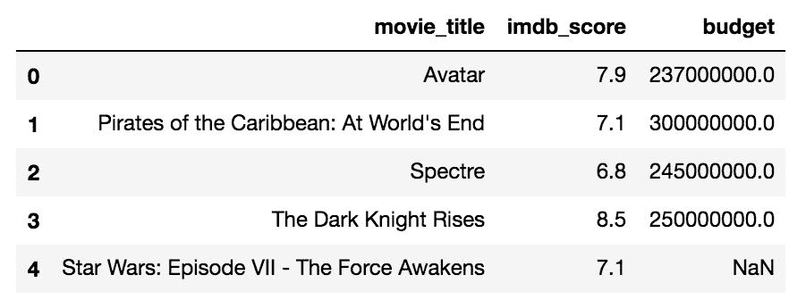

2.  使用`nlargest` 方法通过`imdb_score`选择前 100 个电影：

```py
>>> movie2.nlargest(100, 'imdb_score').head()
```

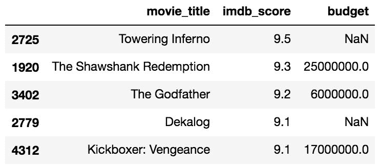

3.  链接`nsmallest` 方法可返回前 100 名得分最低的五部预算电影：

```py
>>> movie2.nlargest(100, 'imdb_score').nsmallest(5, 'budget')
```

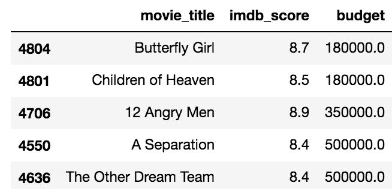

# How it works...

`nlargest`方法的第一个参数`n`必须为整数，并选择要返回的行数。 第二个参数`columns`以列名作为字符串。 步骤 2 返回得分最高的 100 部电影。 我们可以将该中间结果另存为自己的变量，但是，我们在步骤 3 中将`nsmallest`方法链接到该变量，该方法恰好返回五行，按`budget`排序。

# There's more...

可以将列名列表传递给`nlargest` / `nsmallest`方法的`columns`参数。 仅当在列表的第一列中存在重复的值共享第 n 个排名位的情况时，这才对打破关系有用。

# 通过排序选择每个组中最大的组

在数据分析期间执行的最基本，最常见的操作之一是选择包含组中某个列的最大值的行。 例如，这就像在内容分级中查找每年评分最高的电影或票房最高的电影。 要完成此任务，我们需要对组以及用于对组中每个成员进行排名的列进行排序，然后提取每个组的最高成员。

# Getting ready

在此食谱中，我们将找到每年评分最高的电影。

# How to do it...

1.  读入电影数据集并将其缩小为我们关心的三列`movie_title`，`title_year`和`imdb_score`：

```py
>>> movie = pd.read_csv('data/movie.csv')
>>> movie2 = movie[['movie_title', 'title_year', 'imdb_score']]
```

2.  使用`sort_values`方法按`title_year`对数据帧进行排序。 默认行为从最小到最大。 通过将`ascending`参数设置为等于`True`，可以反转此行为：

```py
>>> movie2.sort_values('title_year', ascending=False).head()
```

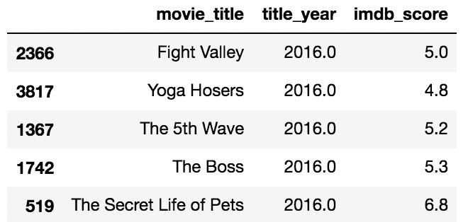

3.  注意只有年份是如何排序的。 要一次对多列进行排序，请使用一个列表。 让我们看看如何对年份和分数进行排序：

```py
>>> movie3 = movie2.sort_values(['title_year','imdb_score'],
                                 ascending=False)
>>> movie3.head()
```

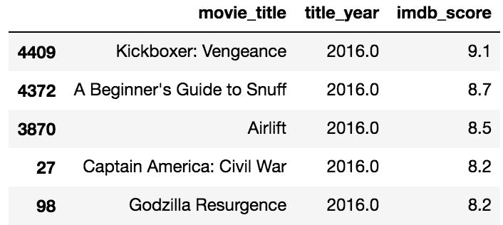

4.  现在，我们使用`drop_duplicates`方法仅保留每年的第一行：

```py
>>> movie_top_year = movie3.drop_duplicates(subset='title_year')
>>> movie_top_year.head()
```

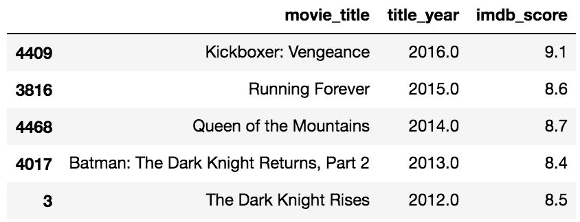

# How it works...

在第 1 步中，我们将数据集精简为仅关注重要的列。 此配方将与整个数据帧相同。 第 2 步显示了如何按单个列对数据帧进行排序，这并不是我们想要的。 步骤 3 同时对多个列进行排序。 它首先通过对所有`title_year`排序，然后在`title_year`的每个不同值内按`imdb_score`排序来工作。

`drop_duplicates`方法的默认行为是保留每个唯一行的第一次出现，因为每一行都是唯一的，所以不会删除任何行。 但是，`subset`参数将其更改为仅考虑为其提供的列（或列列表）。 在此示例中，每年仅返回一行。 正如我们在最后一步中按年份和得分排序一样，我们获得的年度最高评分电影。

# There's more...

可以按升序对一列进行排序，而同时按降序对另一列进行排序。 为此，请将布尔值列表传递给`ascending`参数，该参数与您希望对每一列进行排序的方式相对应。 以下`title_year`和`content_rating`降序排列，`budget`升序排列。 然后，它查找每年和内容分级组中预算最低的电影：

```py
>>> movie4 = movie[['movie_title', 'title_year',
                    'content_rating', 'budget']]
>>> movie4_sorted = movie4.sort_values(['title_year', 
                                        'content_rating', 'budget'], 
                                        ascending=[False, False, True])
>>> movie4_sorted.drop_duplicates(subset=['title_year', 
                                          'content_rating']).head(10)
```


默认情况下，`drop_duplicates`保持最开始的外观，但是可以通过在最后传递`keep`参数*来选择每个组的最后一行，或通过`False`完全删除所有重复项来修改此行为。*

# 用 sort_values 复制最大的

前两个配方的工作原理类似，它们以略有不同的方式对值进行排序。 查找一列数据的顶部`n`值等同于对整个列进行降序排序并获取第一个`n`值。 Pandas 有许多可以通过多种方式做到这一点的行动。

# Getting ready

在本配方中，我们将复制*，并使用`sort_values`方法从最大的* 配方中选择最小的一种，并探讨两者之间的区别。

# How to do it...

1.  让我们从*的最后步骤中重新创建结果，从最大的*配方中选择最小的配方：

```py
>>> movie = pd.read_csv('data/movie.csv')
>>> movie2 = movie[['movie_title', 'imdb_score', 'budget']]
>>> movie_smallest_largest = movie2.nlargest(100, 'imdb_score') \
                                   .nsmallest(5, 'budget')
>>> movie_smallest_largest
```


2.  使用`sort_values`复制表达式的第一部分，并使用`head`方法获取第一`100`行：

```py
>>> movie2.sort_values('imdb_score', ascending=False).head(100)
```

3.  现在，我们拥有得分最高的 100 部电影，我们可以再次将`sort_values`与`head`结合使用，以`budget`来获得最低的五部电影：

```py
>>> movie2.sort_values('imdb_score', ascending=False).head(100) \
          .sort_values('budget').head()
```


# How it works...

如步骤 2 所示，通过在操作后链接`head`方法，`sort_values`方法几乎可以复制`nlargest`。步骤 3 通过链接另一个`sort_values`可以复制`nsmallest`，并且只需取前五个即可完成查询。 `head`方法显示行。

查看步骤 1 中第一个数据帧的输出，并将其与步骤 3 中的输出进行比较。它们是否相同？ 没有！ 发生了什么？ 要了解为什么两个结果不相等，让我们看一下每个配方的中间步骤的尾部：

```py
>>> movie2.nlargest(100, 'imdb_score').tail()
```

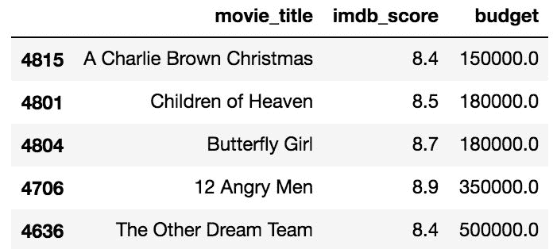

```py
>>> movie2.sort_values('imdb_score', ascending=False) \
          .head(100).tail()
```

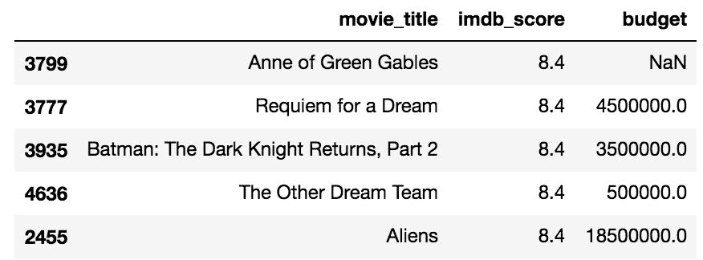

由于存在超过 100 部评分至少为`8.4`的电影而引起问题。 每种方法`nlargest`和`sort_values`的联系均不同，导致 100 行数据帧略有不同。

# There's more...

如果查看`nlargest`文档，则会看到`keep` 参数具有三个可能的值，`first`，`last`和`False`。 据我对其他 Pandas 方法的了解，`keep=False`应该允许所有纽带保留在结果中。 不幸的是，Pandas 在尝试执行此操作时会引发错误。 我在 GitHub 上与 pandas 开发团队创建了一个问题，以进行此增强（ [http://bit.ly/2fGrCMa](https://github.com/pandas-dev/pandas/issues/16818) ）。

# 计算追踪止损单价格

本质上，有无数种交易股票的策略。 许多投资者采用的一种基本交易类型是止损单。 止损单是投资者下达的买卖股票的命令，每当市场价格达到某个点时，该订单就会执行。 止损单对于防止巨大损失和保护收益都是有用的。

就本食谱而言，我们将仅检查用于出售当前拥有股票的止损单。 在典型的止损订单中，价格在订单的整个生命周期内都不会改变。 例如，如果您以每股 100 美元的价格购买了股票，则可能希望将停止订单设置为每股 90 美元，以将下行空间限制为 10％。

一种更高级的策略是，如果价值增加，则不断修改止损单的销售价格以跟踪股票的价值。 这称为**追踪止损指令**。 具体来说，如果相同的$ 100 股票增加到$ 120，那么低于当前市场价格 10％的追踪止损单将使销售价格上涨到$ 108。

自购买之日起，追踪止损单永远不会向下移动，并始终与最大值挂钩。 如果股票价格从 120 美元跌至 110 美元，止损单仍将保持在 108 美元。 仅当价格升至 120 美元以上时，价格才会增加。

# Getting ready

此食谱需要使用第三方软件包 pandas-datareader 来在线获取股市价格。 它没有预装在 Anaconda 发行版中。 要安装此软件包，只需访问命令行并运行`conda install pandas-datareader`。 如果没有 Anaconda，可以通过运行`pip install pandas-datareader`进行安装。 该配方确定给定任何股票的初始购买价格的追踪止损单价格。

# How to do it...

1.  首先，我们将与 Tesla Motors（TSLA）股票合作，并假设在 2017 年的第一个交易日进行购买：

```py
>>> import pandas_datareader as pdr
>>> tsla = pdr.DataReader('tsla', data_source='google',
                          start='2017-1-1')
>>> tsla.head(8)
```

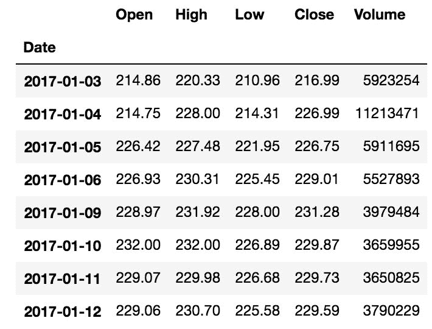

2.  为简单起见，我们将使用每个交易日的收盘价：

```py
>>> tsla_close = tsla['Close']
```

3.  使用`cummax`方法跟踪直到当前日期的最高收盘价：

```py
>>> tsla_cummax = tsla_close.cummax()
>>> tsla_cummax.head(8)
Date
2017-01-03    216.99
2017-01-04    226.99
2017-01-05    226.99
2017-01-06    229.01
2017-01-09    231.28
2017-01-10    231.28
2017-01-11    231.28
2017-01-12    231.28
Name: Close, dtype: float64
```

4.  为了将下行限制为 10％，我们将`tsla_cummax`乘以 0.9。 这将创建跟踪止损单：

```py
>>> tsla_trailing_stop = tsla_cummax * .9
>>> tsla_trailing_stop.head(8)
Date
2017-01-03    195.291
2017-01-04    204.291
2017-01-05    204.291
2017-01-06    206.109
2017-01-09    208.152
2017-01-10    208.152
2017-01-11    208.152
2017-01-12    208.152
Name: Close, dtype: float64
```

# How it works...

`cummax`方法通过保留遇到的最大值直到并包括当前值来工作。 将该序列乘以 0.9 或您要使用的任何缓冲，将创建跟踪止损单。 在此特定示例中，TSLA 的值增加了，因此其尾随止损也增加了。

# There's more...

该食谱仅介绍了如何使用有用的 Pandas 来交易证券，并且在计算止损单是否触发以及何时触发止损时停止了计算。 可以将此配方转换为接受代码，购买日期和止损百分比并返回尾随止损价格的函数：

```py
>>> def set_trailing_loss(symbol, purchase_date, perc):
        close = pdr.DataReader(symbol, 'google',
                               start=purchase_date)['Close']
        return close.cummax() * perc

>>> msft_trailing_stop = set_trailing_loss('msft', '2017-6-1', .85)
>>> msft_trailing_stop.head()
Date
2017-06-01    59.585
2017-06-02    60.996
2017-06-05    61.438
2017-06-06    61.642
2017-06-07    61.642
Name: Close, dtype: float64
```

在减肥计划中可以使用非常相似的策略。 只要您偏离最小体重太远，都可以设置警告。 Pandas 为您提供了`cummin`方法来跟踪最小值。 如果您连续跟踪每天的体重，则以下代码可提供比迄今为止最低记录体重高出 5％的尾随减肥：

```py
>>> weight.cummin() * 1.05
```

# See also

*   Pandas 的另外两种累积方法的官方文档，`cumsum`（ [http://bit.ly/2v3B6EZ](https://pandas.pydata.org/pandas-docs/stable/generated/pandas.DataFrame.cumsum.html) ）和`cumprod`（ [http://bit.ly/2uHBWGt](https://pandas.pydata.org/pandas-docs/stable/generated/pandas.DataFrame.cumprod.html) ）