# 选择数据子集

在本章中，我们将介绍以下主题：

*   选择系列数据
*   选择数据帧行
*   同时选择数据帧行和列
*   同时选择整数和标签的数据
*   加快标量选择
*   懒惰地切片行
*   按词典顺序切片

# 介绍

序列或数据帧中数据的每个维度都通过索引对象标记。 正是这个索引将 Pandas 数据结构与 NumPy 的 n 维数组分开。 索引为数据的每一行和每一列提供了有意义的标签，而 Pandas 用户可以通过使用这些标签来选择数据。 此外，pandas 允许其用户通过行和列的整数位置选择数据。 这种双重选择功能（一种使用标签，另一种使用整数位置）使得强大而又令人困惑的语法可以选择数据子集。

通过使用标签或整数位置选择数据并非 Pandas 所独有。 Python 字典和列表是内置的数据结构，它们以下列其中一种方式选择其数据。 字典和列表都具有精确的说明，并且对于传递给索引运算符的内容都具有有限的用例。 字典的键（其标签）必须是不可变的对象，例如字符串，整数或元组。 列表必须使用整数或切片对象进行选择。 通过将键传递给索引运算符，词典一次只能选择一个对象。 从某种意义上说，Pandas 结合了使用整数（如列表）和标签（如字典）选择数据的能力。

# 选择系列数据

序列和数据帧是复杂的数据容器，具有多个属性，这些属性使用索引运算符以不同方式选择数据。 除了索引运算符本身之外，`.iloc`和`.loc`属性也可用，并以其自己的独特方式使用索引运算符。 这些属性统称为**索引器**。

索引术语可能会引起混淆。 这里使用术语“索引运算符”将其与其他索引器区分开。 它指代直接在序列或数据帧之后的括号`[]`。 例如，给定一个`s`序列，您可以通过以下方式选择数据：`s[item]`和`s.loc[item]`。 第一个使用索引运算符。 第二个使用`.loc`索引器。

序列和数据帧索引器允许按整数位置（如 Python 列表）和标签（如 Python 字典）进行选择。`.iloc`索引器仅按整数位置选择，并且与 Python 列表类似。`.loc`索引器仅按索引标签进行选择，这与 Python 词典的工作方式类似。

# 准备

`.loc`和。`iloc`与序列和数据帧一起使用。 此秘籍展示了如何通过`.iloc`通过整数位置以及通过`.loc`通过标签选择系列数据。 这些索引器不仅获取标量值，还获取列表和切片。

# 操作步骤

1.  读取以机构名称作为索引的大学数据集，并使用索引运算符选择一个列作为“系列”：

```py
>>> college = pd.read_csv('data/college.csv', index_col='INSTNM')
>>> city = college['CITY']
>>> city.head()
INSTNM
Alabama A & M University                   Normal
University of Alabama at Birmingham    Birmingham
Amridge University                     Montgomery
University of Alabama in Huntsville    Huntsville
Alabama State University               Montgomery
Name: CITY, dtype: object
```

2.  `.iloc`索引器仅按整数位置进行选择。 向其传递整数将返回标量值：

```py
>>> city.iloc[3]
Huntsville
```

3.  要选择几个不同的整数位置，请将列表传递给`.iloc`。 这将返回一个序列：

```py
>>> city.iloc[[10,20,30]]
INSTNM
Birmingham Southern College                            Birmingham
George C Wallace State Community College-Hanceville    Hanceville
Judson College                                             Marion
Name: CITY, dtype: object
```

4.  要选择等间距的数据分区，请使用切片符号：

```py
>>> city.iloc[4:50:10]
INSTNM
Alabama State University              Montgomery
Enterprise State Community College    Enterprise
Heritage Christian University           Florence
Marion Military Institute                 Marion
Reid State Technical College           Evergreen
Name: CITY, dtype: object
```

5.  现在，我们转到`.loc`索引器，该索引器仅使用索引标签进行选择。 传递单个字符串将返回标量值：

```py
>>> city.loc['Heritage Christian University']
Florence
```

6.  要选择几个不相交的标签，请使用一个列表：

```py
>>> np.random.seed(1)
>>> labels = list(np.random.choice(city.index, 4))
>>> labels
['Northwest HVAC/R Training Center',
 'California State University-Dominguez Hills',
 'Lower Columbia College',
 'Southwest Acupuncture College-Boulder']

>>> city.loc[labels]
INSTNM
Northwest HVAC/R Training Center                Spokane
California State University-Dominguez Hills      Carson
Lower Columbia College                         Longview
Southwest Acupuncture College-Boulder           Boulder
Name: CITY, dtype: object
```

7.  要选择等间距的数据分区，请使用切片符号。 确保起始值和终止值是字符串。 您可以使用整数来指定切片的步长：

```py
>>> city.loc['Alabama State University':
             'Reid State Technical College':10]
INSTNM
Alabama State University              Montgomery
Enterprise State Community College    Enterprise
Heritage Christian University           Florence
Marion Military Institute                 Marion
Reid State Technical College           Evergreen
Name: CITY, dtype: object
```

# 工作原理

序列中的值由从 0 开始的整数引用。步骤 2 使用`.loc`索引器选择序列的第四个元素。 步骤 3 将三个项目的整数列表传递给索引运算符，该运算符返回选择了那些整数位置的序列。 此功能是对 Python 列表的增强，它无法以这种方式选择多个不相交的项目。

在步骤 4 中，使用指定了`start`，`stop`和`step`值的切片符号来选择系列的整个部分。

步骤 5 至 7 使用基于标签的索引器`.loc`复制步骤 2 至 4。 标签必须与索引中的值完全匹配。 为了确保标签正确，我们在步骤 6 中从索引中随机选择四个标签，并将它们存储到列表中，然后再将它们的值选择为序列。 使用`.loc`索引器的选择始终包含最后一个元素，如步骤 7 所示。

# 更多

与步骤 2 和步骤 5 一样，当将标量值传递给索引运算符时，将返回标量值。 与其他步骤一样，传递列表或切片时，将返回一个序列。 此返回值似乎不一致，但是如果我们将序列视为将标签映射到值的类似于字典的对象，则返回值是有意义的。 要选择单个项目并将其保留在系列中，请以单项列表而不是标量值的形式传递：

```py
>>> city.iloc[[3]]
INSTNM
University of Alabama in Huntsville    Huntsville
Name: CITY, dtype: object
```

将切片符号与`.loc`一起使用时需要格外小心。 如果`start`索引出现在`stop`索引之后，则返回一个空序列，而不会引发异常：

```py
>>> city.loc['Reid State Technical College':
             'Alabama State University':10]
Series([], Name: CITY, dtype: object)
```

# 另见

*   [Pandas 索引的官方文档](http://pandas.pydata.org/pandas-docs/stable/indexing.html)

# 选择数据帧行

选择[DataGate]行的最明确，最优选的方法是使用`.iloc`和`.loc`索引器。 它们能够独立且同时选择行或列。

# 准备

此秘籍向您展示如何使用`.iloc`和`.loc`索引器从数据帧中选择行。

# 操作步骤

1.  读取大学数据集，并将索引设置为机构名称：

```py
>>> college = pd.read_csv('data/college.csv', index_col='INSTNM')
>>> college.head()
```

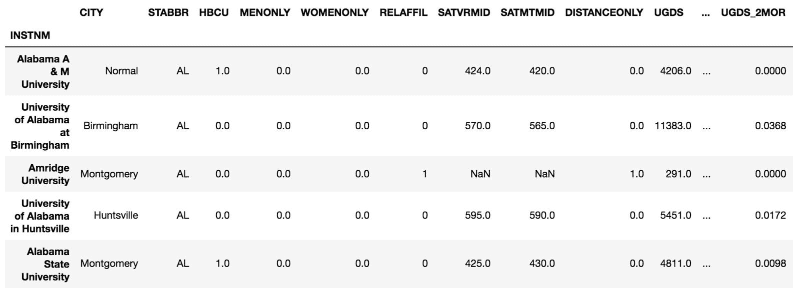

2.  将整数传递给`.iloc`索引器，以选择该位置的整个行：

```py
>>> college.iloc[60]
CITY                  Anchorage
STABBR                       AK
HBCU                          0
                        ...    
UG25ABV                  0.4386
MD_EARN_WNE_P10           42500
GRAD_DEBT_MDN_SUPP      19449.5
Name: University of Alaska Anchorage, Length: 26, dtype: object
```

3.  要获得与上一步相同的行，请将索引标签传递给`.loc`索引器：

```py
>>> college.loc['University of Alaska Anchorage']
CITY                  Anchorage
STABBR                       AK
HBCU                          0
                        ...    
UG25ABV                  0.4386
MD_EARN_WNE_P10           42500
GRAD_DEBT_MDN_SUPP      19449.5
Name: University of Alaska Anchorage, Length: 26, dtype: object
```

4.  要将不相交的一组行选择为数据帧，请将整数列表传递给`.iloc`索引器：

```py
>>> college.iloc[[60, 99, 3]]
```


5.  可以使用`.loc`通过将确切的机构名称列表传递给第 4 步中相同的数据帧：

```py
>>> labels = ['University of Alaska Anchorage',
              'International Academy of Hair Design',
              'University of Alabama in Huntsville']
>>> college.loc[labels]
```

6.  将切片符号与`.iloc`一起使用以选择整个数据段：

```py
>>> college.iloc[99:102]
```

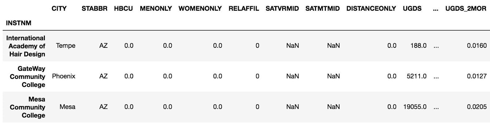

7.  切片符号也可以与`.loc`索引器一起使用，并且包含最后一个标签：

```py
>>> start = 'International Academy of Hair Design'
>>> stop = 'Mesa Community College'
>>> college.loc[start:stop]
```

# 工作原理

将标量值，标量列表或切片对象传递给`.iloc`或`.loc`索引器，会使 Pandas 扫描索引标签中的适当行并返回它们。 如果传递单个标量值，则返回一个序列。 如果传递了列表或切片对象，则返回一个数据帧。

# 更多

在步骤 5 中，可以直接从步骤 4 中返回的数据帧中选择索引标签列表，而无需复制和粘贴：

```py
>>> college.iloc[[60, 99, 3]].index.tolist()
['University of Alaska Anchorage',
 'International Academy of Hair Design',
 'University of Alabama in Huntsville']
```

# 另见

*   请参阅第 6 章，“索引对齐”的“检查索引对象”秘籍。

# 同时选择数据帧行和列

直接使用索引运算符是从数据帧中选择一列或多列的正确方法。 但是，它不允许您同时选择行和列。 要同时选择行和列，您将需要将有效的行和列选择都用逗号传递给`.iloc`或`.loc`索引器。

# 准备

选择行和列的通用形式将类似于以下代码：

```py
>>> df.iloc[rows, columns]
>>> df.loc[rows, columns]
```

`rows`和`columns`变量可以是标量值，列表，切片对象或布尔序列。

Passing a boolean sequence to the indexers is covered in [Chapter 5](../Text/#6JMSS0-5686c430c0a9442a82c4c5795c8553c9), *Boolean Indexing*.

在此秘籍中，每个步骤都显示使用`.iloc`同时选择行和列，以及使用`.loc`进行精确复制。

# 操作步骤

1.  读入大学数据集，并将索引设置为机构名称。 用切片符号选择前三行和前四列：

```py
>>> college = pd.read_csv('data/college.csv', index_col='INSTNM')
>>> college.iloc[:3, :4]
>>> college.loc[:'Amridge University', :'MENONLY']
```

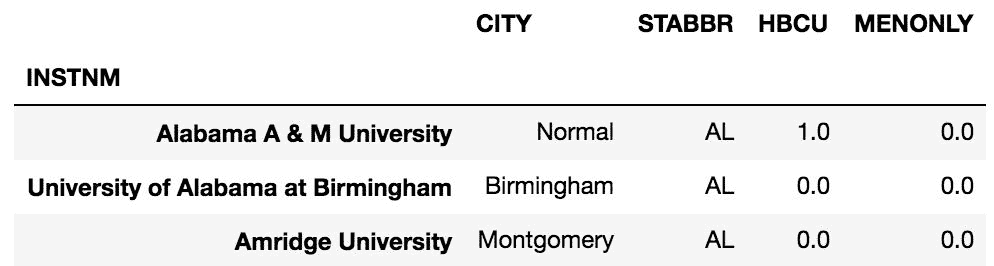

2.  选择两个不同列的所有行：

```py
>>> college.iloc[:, [4,6]].head()
>>> college.loc[:, ['WOMENONLY', 'SATVRMID']].head()
```

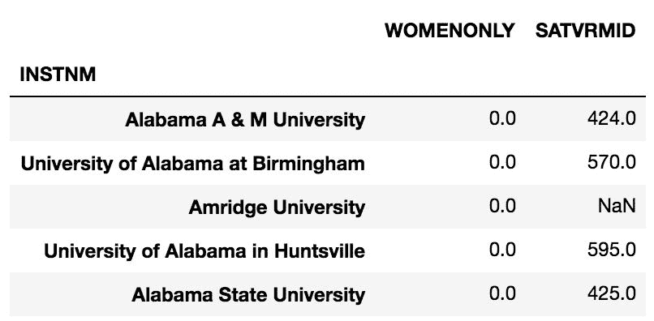

3.  选择不相交的行和列：

```py
>>> college.iloc[[100, 200], [7, 15]]
>>> rows = ['GateWay Community College',
            'American Baptist Seminary of the West']
>>> columns = ['SATMTMID', 'UGDS_NHPI']
>>> college.loc[rows, columns]
```

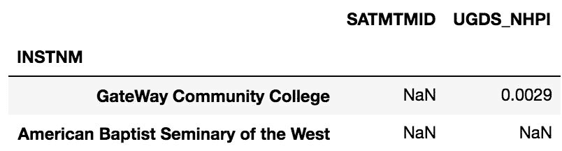

4.  选择一个标量值：

```py
>>> college.iloc[5, -4]
>>> college.loc['The University of Alabama', 'PCTFLOAN']
-.401
```

5.  切片行并选择单个列：

```py
>>> college.iloc[90:80:-2, 5]
>>> start = 'Empire Beauty School-Flagstaff'
>>> stop = 'Arizona State University-Tempe'
>>> college.loc[start:stop:-2, 'RELAFFIL']
INSTNM
Empire Beauty School-Flagstaff     0
Charles of Italy Beauty College    0
Central Arizona College            0
University of Arizona              0
Arizona State University-Tempe     0
Name: RELAFFIL, dtype: int64
```

# 工作原理

同时选择行和列的关键之一是了解方括号中逗号的用法。 逗号左侧的选择始终根据行索引选择行。 逗号右边的选择始终根据列索引选择列。

不必同时选择行和列。 步骤 2 显示了如何选择所有行和列的子集。 冒号表示一个切片对象，该对象仅返回该维度的所有值。

# 更多

选择行的子集以及所有列时，不必在逗号后使用冒号。 如果没有逗号，则默认行为是选择所有列。 先前的秘籍正是以这种方式选择了行。 但是，您可以使用冒号表示所有列的一部分。 以下代码行是等效的：

```py
>>> college.iloc[:10]
>>> college.iloc[:10, :]
```

# 同时选择整数和标签的数据

`.iloc`和`.loc`索引器均通过整数或标签位置选择数据，但不能同时处理两种输入类型的组合。 在早期版本的 Pandas 中，可以使用另一个索引器`.ix`通过整数和标签位置选择数据。 尽管这在某些特定情况下很方便，但是它本质上是模棱两可的，并且使许多 Pandas 使用者感到困惑。`.ix`索引器随后被弃用，因此应避免使用。

# 准备

在`.ix`弃用之前，可以使用`college.ix[:5, 'UGDS_WHITE':'UGDS_UNKN']`从`UGDS_WHITE`到`UGDS_UNKN`选择大学数据集的前五行和列。 现在不可能直接使用`.loc`或`.iloc`来做到这一点。 以下秘籍显示了如何找到列的整数位置，然后使用`.iloc`完成选择。

# 操作步骤

1.  读入大学数据集，并将机构名称（`INSTNM`）分配为索引：

```py
>>> college = pd.read_csv('data/college.csv', index_col='INSTNM')
```

2.  使用索引方法`get_loc`查找所需列的整数位置：

```py
>>> col_start = college.columns.get_loc('UGDS_WHITE')
>>> col_end = college.columns.get_loc('UGDS_UNKN') + 1
>>> col_start, col_end
```

3.  使用`col_start`和`col_end`使用`.iloc`按整数位置选择列：

```py
>>> college.iloc[:5, col_start:col_end]
```

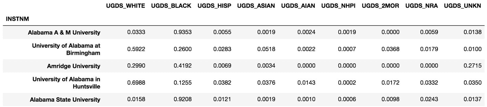

# 工作原理

步骤 2 首先通过`columns`属性检索列索引。 索引具有`get_loc`方法，该方法接受索引标签并返回其整数位置。 我们找到要切片的列的开始和结束整数位置。 我们添加一个是因为用`.iloc`切片不包括最后一项。 步骤 3 将切片符号与行和列一起使用。

# 更多

我们可以做一个非常相似的操作来使`.loc`与整数和位置的混合使用。 下面显示了如何选择第 10 至 15 行（包括第 10 行）以及`UGDS_WHITE`至`UGDS_UNKN`列：

```py
>>> row_start = df_college.index[10]
>>> row_end = df_college.index[15]
>>> college.loc[row_start:row_end, 'UGDS_WHITE':'UGDS_UNKN']
```

使用`.ix`进行相同的操作（已弃用，因此请勿执行此操作）如下所示：

```py
>>> college.ix[10:16, 'UGDS_WHITE':'UGDS_UNKN']
```

通过将`.loc`和`.iloc`链接在一起可以实现相同的结果，但是链接索引器通常不是一个好主意：

```py
>>> college.iloc[10:16].loc[:, 'UGDS_WHITE':'UGDS_UNKN']
```

# 另见

*   请参考第 2 章，“基本数据帧操作”的“用方法选择列”。

# 加快标量选择

`.iloc`和`.loc`索引器都能够从序列或数据帧中选择单个元素（标量值）。 但是，存在分度器`.iat`和`.at`，它们分别以更快的速度实现相同的功能。 与`.iloc`相似，`.iat`索引器使用整数位置进行选择，并且必须传递两个以逗号分隔的整数。 与`.loc`相似，`.at`索引使用标签进行选择，并且必须传递一个索引和由逗号分隔的列标签。

# 准备

如果计算时间至关重要，则此秘籍很有价值。 当使用标量选择时，它显示了`.iat`和`.at`相对于`.iloc`和`.loc`的性能提高。

# 操作步骤

1.  以机构名称作为索引，读取`college`记分板数据集。 将大学名称和列名称传递给`.loc`，以便选择标量值：

```py
>>> college = pd.read_csv('data/college.csv', index_col='INSTNM')
>>> cn = 'Texas A & M University-College Station'
>>> college.loc[cn, 'UGDS_WHITE']
.661
```

2.  使用`.at`获得相同的结果：

```py
>>> college.at[cn, 'UGDS_WHITE']
.661
```

3.  使用`%timeit`魔术命令查找速度差异：

```py
>>> %timeit college.loc[cn, 'UGDS_WHITE']
8.97 µs ± 617 ns per loop (mean ± std. dev. of 7 runs, 100000 loops each)

>>> %timeit college.at[cn, 'UGDS_WHITE']
6.28 µs ± 214 ns per loop (mean ± std. dev. of 7 runs, 100000 loops each)
```

4.  找到前面选择的整数位置，然后计时`.iloc`和`.iat`之间的差：

```py
>>> row_num = college.index.get_loc(cn)
>>> col_num = college.columns.get_loc('UGDS_WHITE')
>>> row_num, col_num
(3765, 10)

>>> %timeit college.iloc[row_num, col_num]
9.74 µs ± 153 ns per loop (mean ± std. dev. of 7 runs, 100000 loops each)

>>> %timeit college.iat[row_num, col_num]
7.29 µs ± 431 ns per loop (mean ± std. dev. of 7 runs, 100000 loops each)
```

# 工作原理

标量索引器`.iat`和`.at`仅接受标量值。 如果其他任何东西传递给他们，他们就会失败。 在进行标量选择时，它们是`.iloc`和`.loc`的直接替代品。`timeit`魔术命令在以两个百分号开头时对整个代码块计时，而在以一个百分号开头时一次。 它表明，通过切换到标量索引器，平均可节省约 2.5 微秒。 这可能并不多，但是如果在程序中重复进行标量选择，则可能会很快加起来。

# 更多

`.iat`和`.at`都可以与序列一起使用。 给它们传递一个标量值，它们将返回一个标量：

```py
>>> state = college['STBBR']   # Select a Series
>>> state.iat[1000]
'IL'

>>> state.at['Stanford University']
'CA'
```

# 懒惰地切片行

本章前面的秘籍展示了如何使用`.iloc`和`.loc`索引器选择任一维度中的序列和数据帧的子集。 选择行的快捷方式仅包含索引运算符本身。 这只是显示 Pandas 其他功能的捷径，但索引运算符的主要功能实际上是选择数据帧列。 如果要选择行，则最好使用`.iloc`或`.loc`，因为它们是明确的。

# 准备

在此秘籍中，我们将切片对象传递给序列和数据帧索引运算符。

# 操作步骤

1.  读取以机构名称作为索引的大学数据集，然后从索引 10 到 20 选择每隔一行：

```py
>>> college = pd.read_csv('data/college.csv', index_col='INSTNM')
>>> college[10:20:2]
```

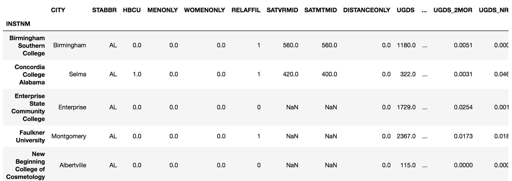

2.  序列也存在相同的切片：

```py
>>> city = college['CITY']
>>> city[10:20:2]
INSTNM
Birmingham Southern College              Birmingham
Concordia College Alabama                     Selma
Enterprise State Community College       Enterprise
Faulkner University                      Montgomery
New Beginning College of Cosmetology    Albertville
Name: CITY, dtype: object
```

3.  序列和数据帧都可以仅通过索引运算符按标签进行切片：

```py
>>> start = 'Mesa Community College'
>>> stop = 'Spokane Community College'
>>> college[start:stop:1500]
```

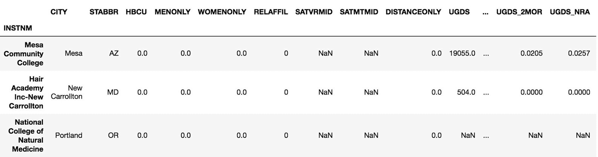

4.  这是带有系列的同一标签：

```py
>>> city[start:stop:1500]
INSTNM
Mesa Community College                            Mesa
Hair Academy Inc-New Carrollton         New Carrollton
National College of Natural Medicine          Portland
Name: CITY, dtype: object
```

# 工作原理

索引运算符根据传递给它的对象类型来更改行为。 以下伪代码概述了数据帧索引运算符如何处理其传递的对象：

```py
>>> df[item]  # Where `df` is a DataFrame and item is some object

If item is a string then
    Find a column name that matches the item exactly
    Raise KeyError if there is no match
    Return the column as a Series

If item is a list of strings then
    Raise KeyError if one or more strings in item don't match columns
    Return a DataFrame with just the columns in the list

If item is a slice object then
   Works with either integer or string slices
   Raise KeyError if label from label slice is not in index
   Return all ROWS that are selected by the slice

If item is a list, Series or ndarray of booleans then
   Raise ValueError if length of item not equal to length of DataFrame
   Use the booleans to return only the rows with True in same location
```

前面的逻辑涵盖了所有最常见的情况，但并不详尽。 系列的逻辑与数据帧的逻辑稍有不同，实际上更为复杂。 由于其复杂性，最好避免在序列上仅使用索引运算符本身，而应使用显式的`.iloc`和`.loc`索引器。

One acceptable use case of the Series indexing operator is when doing boolean indexing. See [Chapter 6](../Text/#6JMSS0-5686c430c0a9442a82c4c5795c8553c9), *Index Alignment* for more details.

我在本节中将这种行切片称为*惰性*，因为它不使用更明确的`.iloc`或`.loc`。 就个人而言，我总是在对行进行切片时使用这些索引器，因为从来没有确切地知道我在做什么。

# 更多

重要的是要知道，这种延迟切片不适用于列，仅适用于数据帧行和系列，也不能同时选择行和列。 以下面的代码为例，该代码尝试选择前十行​​和两列：

```py
>>> college[:10, ['CITY', 'STABBR']]
TypeError: unhashable type: 'slice' 
```

要以这种方式进行选择，您需要使用`.loc`或`.iloc`。 这是一种可能的方法，该方法首先选择所有机构标签，然后使用基于标签的索引器`.loc`：

```py
>>> first_ten_instnm = college.index[:10]
>>> college.loc[first_ten_instnm, ['CITY', 'STABBR']]
```

# 按词典顺序切片

`.loc`索引器通常根据索引的确切字符串标签选择数据。 但是，它还允许您根据索引中值的字典顺序选择数据。 具体来说，`.loc`允许您使用切片符号按词典顺序选择带有索引的所有行。 仅在对索引排序时有效。

# 准备

在本秘籍中，您将首先对索引进行排序，然后在`.loc`索引器中使用切片符号选择两个字符串之间的所有行。

# 操作步骤

1.  读取大学数据集，并将机构名称设置为索引：

```py
>>> college = pd.read_csv('data/college.csv', index_col='INSTNM')
```

2.  尝试选择所有词典名称在`'Sp'`和`'Su'`之间的大学：

```py
>>> college.loc['Sp':'Su']
KeyError: 'Sp'
```

3.  由于索引未排序，因此前面的命令失败。 让我们继续对索引进行排序：

```py
>>> college = college.sort_index()
```

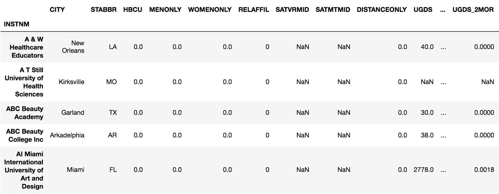

4.  现在，让我们从步骤 2 重新运行相同的命令：

```py
>>> college.loc['Sp':'Su']
```

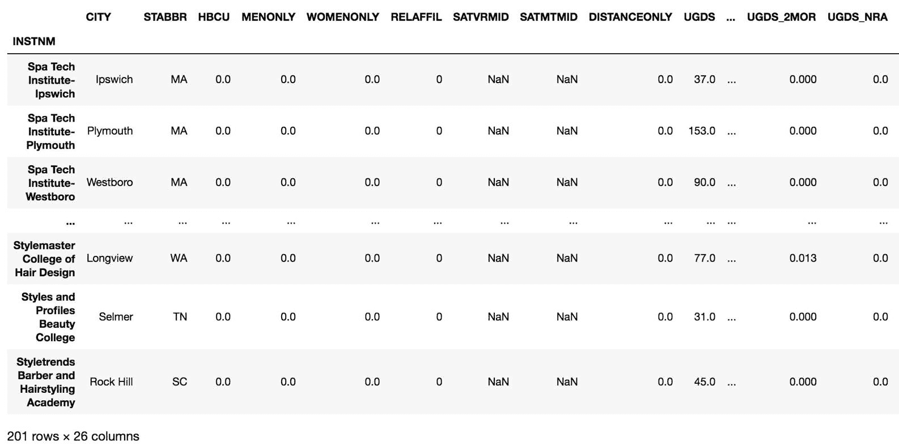

# 工作原理

`.loc`的正常行为是根据传递给它的确切标签来选择数据。 在索引中找不到这些标签时，将引发`KeyError`。 但是，只要按字典顺序对索引进行排序并将切片传递给该索引，就会存在对此行为的一个特殊例外。 现在可以在切片的`start`和`stop`标签之间进行选择，即使它们不是索引的精确值也是如此。

# 更多

使用此秘籍，可以轻松地在两个字母之间选择大学。 例如，要选择所有以字母`D`至`S`开头的大学，则可以使用`college.loc['D':'T']`。 像这样的切片仍然包含最后一个索引，因此从技术上讲，这将返回一确切名称为`T`的大学。

当索引按相反方向排序时，这种切片方式也适用。 您可以使用索引属性`is_monotonic_increasing`或`is_monotonic_decreasing`确定索引的排序方向。 为了使字典式切片能够正常工作，这些参数中的任何一个都必须为`True`。 例如，以下代码按字典顺序对索引从`Z`到`A`进行排序：

```py
>>> college = college.sort_index(ascending=False)
>>> college.index.is_monotonic_decreasing
True
>>> college.loc['E':'B']
```

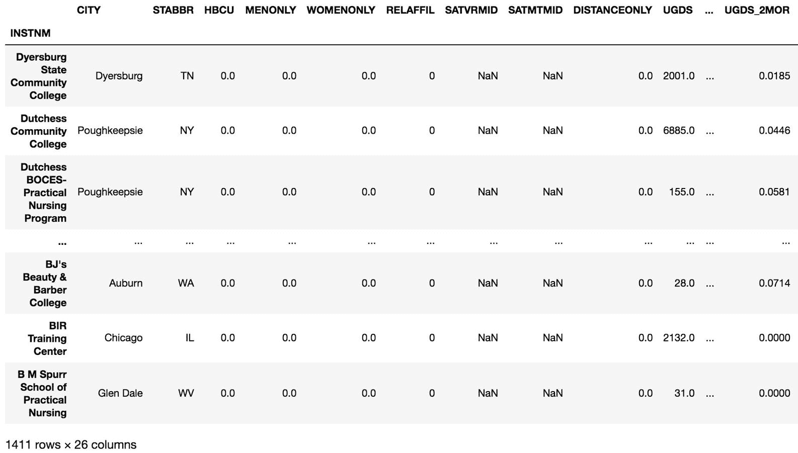

Python 将所有大写字母排在小写字母之前，并将所有整数排在大写字母之前。