# 布尔索引

在本章中，我们将介绍以下主题：

*   计算布尔统计量
*   构造多个布尔条件
*   使用布尔索引进行过滤
*   使用索引选择来替代布尔索引
*   使用唯一索引和排序索引进行选择
*   了解股票价格
*   翻译 SQL `WHERE`子句
*   确定股票市场收益的正态性
*   使用`query`方法提高布尔索引的可读性
*   使用`where`方法保留序列
*   屏蔽数据帧的行
*   使用布尔值，整数位置和标签进行选择

## 介绍

从数据集中过滤数据是最常见的基本操作之一。 有许多方法可以使用**布尔下标**过滤（或子集）Pandas 中的数据。 布尔索引（也称为**布尔选择**）可能是一个令人困惑的术语，但出于 Pandas 的目的，它是指通过为每行提供布尔值（`True`或`False`）来选择行 。 这些布尔值通常存储在序列或 NumPy `ndarray`中，通常是通过将布尔条件应用于数据帧中的一个或多个列来创建的。 我们首先创建布尔系列并计算它们的统计量，然后继续创建更复杂的条件，然后以多种方式使用布尔索引来过滤数据。

## 计算布尔统计量

首次引入布尔系列时，计算有关它们的基本摘要统计信息可能会很有帮助。 布尔系列的每个值的取值为 0 或 1，因此所有适用于数值的序列方法也适用于布尔值。

### 准备

在此秘籍中，我们通过将条件应用于数据列来创建布尔系列，然后从中计算汇总统计信息。

### 操作步骤

1.  读取`movie`数据集，将索引设置为电影标题，然后检查前几行：

```py
>>> movie = pd.read_csv('data/movie.csv', index_col='movie_title')
>>> movie.head()
```

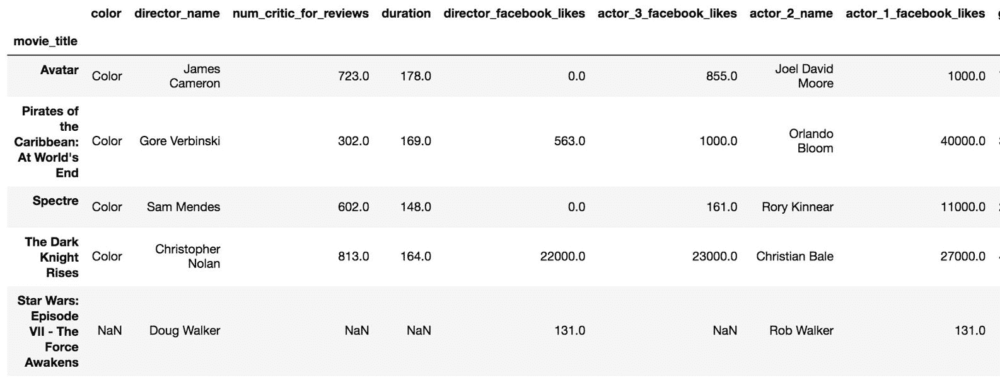

2.  通过对`duration`系列使用大于比较运算符，确定每部电影的时长是否大于两个小时：

```py
>>> movie_2_hours = movie['duration'] > 120
>>> movie_2_hours.head(10)
movie_title
Avatar                                         True
Pirates of the Caribbean: At World's End       True
Spectre                                        True
The Dark Knight Rises                          True
Star Wars: Episode VII - The Force Awakens    False
John Carter                                    True
Spider-Man 3                                   True
Tangled                                       False
Avengers: Age of Ultron                        True
Harry Potter and the Half-Blood Prince         True
Name: duration, dtype: bool
```

3.  现在，我们可以使用该系列来确定超过两个小时的电影数量：

```py
>>> movie_2_hours.sum()
1039
```

4.  要查找超过两个小时的数据集中的电影百分比，请使用`mean`方法：

```py
>>> movie_2_hours.mean()
0.2114
```

5.  不幸的是，步骤 4 的输出具有误导性。`duration`列缺少一些值。 如果回头看步骤 1 的数据帧输出，您将看到最后一行缺少`duration`的值。 为此，步骤 2 中的布尔条件返回`False`。 我们需要先删除丢失的值，然后求值条件并取均值：

```py
>>> movie['duration'].dropna().gt(120).mean()
.2112
```

6.  使用`describe`方法输出有关布尔系列的一些摘要统计信息：

```py
>>> movie_2_hours.describe()
count      4916
unique        2
top       False
freq       3877
Name: duration, dtype: object
```

### 工作原理

大多数数据帧不会像我们的电影数据集那样具有布尔值列。 产生布尔序列的最直接方法是使用比较运算符之一将条件应用于列之一。 在步骤 2 中，我们使用大于号运算符来测试每部电影的时长是否超过两个小时（120 分钟）。 第 3 步和第 4 步从布尔序列计算两个重要量，即和和均值。 这些方法是可行的，因为 Python 将`False`/`True`求值为 0/1。

您可以自己证明布尔级数的均值代表`True`值的百分比。 为此，请使用`value_counts`方法，将`normalize`参数设置为`True`，以获取其分布：

```py
>>> movie_2_hours.value_counts(normalize=True)
False    0.788649
True     0.211351
Name: duration, dtype: float64
```

步骤 5 提醒我们步骤 4 的错误结果。即使`duration`列缺少值，布尔条件也将所有这些比较与缺少的值求值为`False`。 删除这些缺失值使我们能够计算出正确的统计量。 通过方法链接，只需一步即可完成。

步骤 6 显示，Pandas 通过显示频率信息对待布尔列的方式类似于对待对象数据类型的方式。 这是考虑布尔系列的自然方法，而不是像对数字数据那样显示分位数。

### 更多

可以比较来自同一数据帧的两列以生成布尔系列。 例如，我们可以确定具有演员 1 的 Facebook 拥有比演员 2 更多的 Facebook 喜欢的电影的百分比。要做到这一点，我们将选择这两列，然后删除任何其中一部电影缺少值的行。 然后，我们将进行比较并计算均值：

```py
>>> actors = movie[['actor_1_facebook_likes', 
                    'actor_2_facebook_likes']].dropna()
>>> (actors['actor_1_facebook_likes'] > 
     actors['actor_2_facebook_likes']).mean()
.978
```

### 另见

*   参阅第 1 章，“Pandas 基础”的“将序列方法链接到一起”秘籍
*   参阅第 1 章，“Pandas 基础”中的“使用运算符”秘籍

## 构造多个布尔条件

在 Python 中，布尔表达式使用内置的逻辑运算符`and`，`or`和`not`。 这些关键字不适用于 Pandas 中的布尔索引，而是分别用`&`，`|`和`~`代替。 此外，每个表达式必须用括号括起来，否则会产生错误。

### 准备

为数据集构造一个精确的过滤器可能会使您将多个布尔表达式组合在一起以提取一个精确的子集。 在此秘籍中，我们将构造多个布尔表达式，然后将它们组合在一起以查找`title_year`为 2000 之前或 2009 年之后，`imdb_score`大于 8，并且`content_rating`为`PG-13`的所有电影。

### 操作步骤

1.  加载电影数据集并将索引设置为标题：

```py
>>> movie = pd.read_csv('data/movie.csv', index_col='movie_title')
```

2.  创建一个变量以将每个条件集作为布尔系列独立保存：

```py
>>> criteria1 = movie.imdb_score > 8
>>> criteria2 = movie.content_rating == 'PG-13'
>>> criteria3 = ((movie.title_year < 2000) | 
                 (movie.title_year > 2009))

>>> criteria2.head()     # all criteria Series look similar
movie_title
Avatar                                         True
Pirates of the Caribbean: At World's End       True
Spectre                                        True
The Dark Knight Rises                          True
Star Wars: Episode VII - The Force Awakens    False
Name: content_rating, dtype: bool
```

3.  将所有条件组合到一个布尔系列中：

```py
>>> criteria_final = criteria1 & criteria2 & criteria3
>>> criteria_final.head()
movie_title
Avatar                                        False
Pirates of the Caribbean: At World's End      False
Spectre                                       False
The Dark Knight Rises                          True
Star Wars: Episode VII - The Force Awakens    False
dtype: bool
```

### 工作原理

可以使用标准比较运算符（`<`，`>`，`==`，`!=`，`<=`和`>=`）将系列中的所有值与标量值进行比较。 表达式`movie.imdb_score > 8`产生一系列布尔值，其中所有超过 8 的`imdb_score`值价格均为`True`，而小于或等于 8 的价格为`False`。 此布尔系列的索引保留与原始索引相同的索引，在这种情况下，为电影的标题。

`criteria3`变量由两个独立的布尔表达式创建。 每个表达式必须用括号括起来才能正常运行。 管道字符`|`用于在两个系列的每个值之间创建逻辑`or`条件。

所有三个条件都必须为`True`以匹配秘籍要求。 它们每个都与和号字符`&`组合在一起，后者在每个序列值之间创建逻辑`and`条件。

### 更多

Pandas 对逻辑运算符使用不同语法的结果是运算符优先级不再相同。 比较运算符的优先级高于`and`，`or`和`not`。 但是，Pandas 的新运算符（按位运算符`&`，`|`和`~`）比比较运算符具有更高的优先级，因此需要括号。 一个例子可以帮助清除这一点。 采取以下表达式：

```py
>>> 5 < 10 and 3 > 4
False 
```

在前面的表达式中，首先求值`5 < 10`，然后求值`3 < 4`，最后求值`and`。 Python 通过表达式进行如下操作：

```py
>>> 5 < 10 and 3 > 4
>>> True and 3 > 4
>>> True and False
>>> False
```

让我们看一下如果`criteria3`中的表达式编写如下会发生什么：

```py
>>> movie.title_year < 2000 | movie.title_year > 2009
TypeError: cannot compare a dtyped [float64] array with a scalar of type [bool]
```

由于按位运算符的优先级比比较运算符的优先级高，因此`2000 | movie.title_year`首先被求值，这是没有意义的，并且会产生错误。 因此，需要括号以正确的顺序求值操作。

为何 Pandas 不能使用`and`，`or`和`not`？ 当求值这些关键字时，Python 尝试查找整个对象的**真实性**。 因为将整个系列而不是每个元素作为`True`或`False`都没有意义，Pandas 都会引发错误。

Python 中的许多对象都具有布尔表示形式。 例如，除 0 以外的所有整数都被视为`True`。 除空字符串外，所有字符串均为`True`。 所有非空集，元组，字典和列表都是`True`。 空的数据帧或序列不会求值为`True`或`False`，而是会引发错误。 通常，要检索 Python 对象的真实性，请将其传递给`bool`函数。

### 另见

*   [Python 运算符优先级](https://docs.python.org/3/reference/expressions.html#operator-precedence)

## 使用布尔索引进行过滤

序列和数据帧对象的布尔选择实际上是相同的。 两者都通过将与要过滤的对象索引相同的一系列布尔值传递给索引运算符来工作。

### 准备

此秘籍为不同的电影组构造了两个复杂且独立的布尔标准。 第一组电影是根据之前的秘籍制作的，包括`imdb_score`大于 8，`content_rating`为`PG-13`和`title_year`在 2000 年之前或 2009 年之后的电影。第二组电影包括`imdb_score`小于 5，`content_rating`的 R 和`title_year`在 2000 年至 2010 年之间的数据。

### 操作步骤

1.  读取`movie`数据集，将索引设置为`movie_title`，并创建第一组条件：

```py
>>> movie = pd.read_csv('data/movie.csv', index_col='movie_title')
>>> crit_a1 = movie.imdb_score > 8
>>> crit_a2 = movie.content_rating == 'PG-13'
>>> crit_a3 = (movie.title_year < 2000) | (movie.title_year > 2009)
>>> final_crit_a = crit_a1 & crit_a2 & crit_a3
```

2.  为第二组电影创建条件：

```py
>>> crit_b1 = movie.imdb_score < 5
>>> crit_b2 = movie.content_rating == 'R'
>>> crit_b3 = ((movie.title_year >= 2000) & 
               (movie.title_year <= 2010))
>>> final_crit_b = crit_b1 & crit_b2 & crit_b3
```

3.  使用 pandas `or`运算符组合两组标准。 这将产生一个布尔系列，其中的任何一部电影都是这两组电影的成员：

```py
>>> final_crit_all = final_crit_a | final_crit_b
>>> final_crit_all.head()
movie_title
Avatar                                        False
Pirates of the Caribbean: At World's End      False
Spectre                                       False
The Dark Knight Rises                          True
Star Wars: Episode VII - The Force Awakens    False
dtype: bool
```

4.  拥有布尔系列后，只需将其传递给索引运算符即可过滤数据：

```py
>>> movie[final_crit_all].head()
```

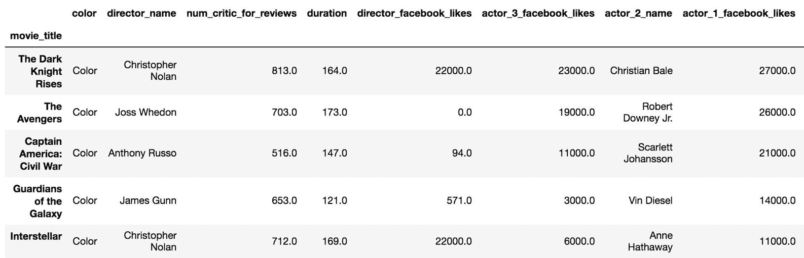

5.  我们已经成功过滤了数据和数据帧的所有列。 我们无法轻松地执行手动检查来确定过滤器是否正常工作。 让我们使用`.loc`索引器过滤行和列：

```py
>>> cols = ['imdb_score', 'content_rating', 'title_year']
>>> movie_filtered = movie.loc[final_crit_all, cols]
>>> movie_filtered.head(10)
```

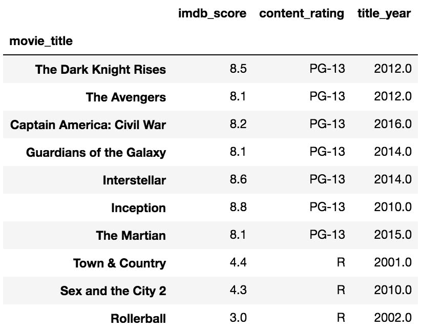

### 工作原理

在步骤 1 和步骤 2 中，每组条件都是从更简单的布尔表达式构建的。 不必像此处所做的那样为每个布尔表达式创建一个不同的变量，但是这样做确实使读取和调试任何逻辑错误变得容易得多。 当我们需要两组电影时，步骤 3 使用 Pandas 逻辑`or`运算符将它们组合在一起。

步骤 4 显示了布尔索引工作原理的确切语法。 您只需将从第 3 步创建的布尔值系列直接传递给索引运算符即可。 仅选择`final_crit_all`中具有`True`值的电影。

如步骤 5 所示，布尔索引还可以与`.loc`索引器配合使用，同时执行布尔索引和单个列选择。 精简的数据帧易于手动检查  逻辑是否正确实现。

布尔索引与`.iloc`索引运算符不能完全兼容。 如果将布尔序列传递给它，则会引发异常。 但是，如果您传递布尔 N 维数组，则它将与其他索引器在此秘籍中的行为相同。

### 更多

如前所述，可以使用一个长布尔表达式代替其他几个短布尔表达式。 要使用一长行代码复制第 1 步中的`final_crit_a`变量，我们可以执行以下操作：

```py
>>> final_crit_a2 = (movie.imdb_score > 8) & \
                    (movie.content_rating == 'PG-13') & \
                    ((movie.title_year < 2000) | 
                     (movie.title_year > 2009))
>>> final_crit_a2.equals(final_crit_a)
True
```

### 另见

*   [Pandas “布尔索引”官方文档](http://pandas.pydata.org/pandas-docs/stable/indexing.html#boolean-indexing)
*   [检查 Python 对象的真实性](https://docs.python.org/3/library/stdtypes.html#truth)

## 使用索引选择来替代布尔索引

通过使用索引，可以复制布尔选择的特定情况。 通过索引进行选择更加直观，并提高了可读性。

### 准备

在此秘籍中，我们使用`college`数据集通过布尔索引和索引选择从特定状态中选择所有机构，然后将它们各自的性能相互比较。

### 操作步骤

1.  读取`college`数据集，并使用布尔索引从德克萨斯（`TX`）州选择所有机构：

```py
>>> college = pd.read_csv('data/college.csv')
>>> college[college['STABBR'] == 'TX'].head()
```

Pandas official documentation on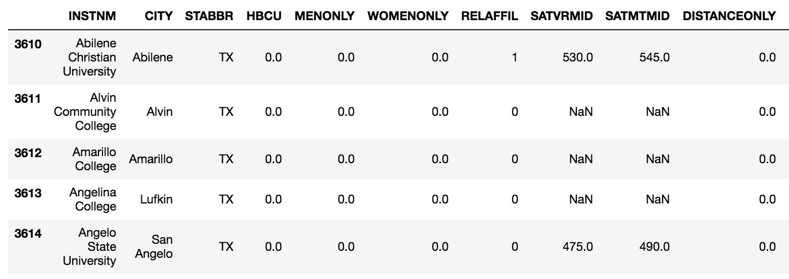

2.  要使用索引选择复制此内容，我们需要将`STABBR`列移入索引。 然后，我们可以在`.loc`索引器中使用基于标签的选择：

```py
>>> college2 = college.set_index('STABBR')
>>> college2.loc['TX'].head()
```

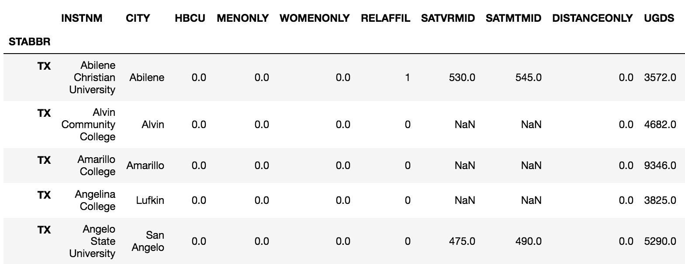

3.  让我们比较两种方法的速度：

```py
>>> %timeit college[college['STABBR'] == 'TX']
1.43 ms ± 53.5 µs per loop (mean ± std. dev. of 7 runs, 1000 loops each)

>>> %timeit college2.loc['TX']
526 µs ± 6.67 µs per loop (mean ± std. dev. of 7 runs, 1000 loops each)
```

4.  布尔索引的时间是索引选择时间的三倍。 由于设置索引不是免费的，所以让我们也计时一下该操作：

```py
>>> %timeit college2 = college.set_index('STABBR')
1.04 ms ± 5.37 µs per loop (mean ± std. dev. of 7 runs, 1000 loops each)
```

### 工作原理

步骤 1 通过确定哪些数据行具有`STABBR`等于`TX`来创建布尔系列。 该系列传递给索引运算符，该运算符对数据进行子集化。 可以通过将同一列移到索引，并简单地将基本的基于标签的索引选择与`.loc`一起使用来复制此过程。 通过索引选择比布尔选择快得多。

### 更多

此秘籍仅选择一个状态。 可以使用布尔选择和索引选择来选择多个状态。 让我们选择**德州**（`TX`），**加利福尼亚**（`CA`）和**纽约**（`NY`）。 使用布尔选择时，可以使用`isin`方法，但是使用索引时，只需将列表传递给`.loc`即可：

```py
>>> states = ['TX', 'CA', 'NY']
>>> college[college['STABBR'].isin(states)]
>>> college2.loc[states]
```

故事的内容比该秘籍的解释要多得多。 Pandas 根据索引是唯一索引还是排序索引来不同地实现索引。 有关更多详细信息，请参见以下秘籍。

## 使用唯一索引和排序索引进行选择

当索引是唯一的或已排序时，索引选择性能会大大提高。 先前的秘籍使用了包含重复项的未排序索引，因此选择速度相对较慢。

### 准备

在此秘籍中，我们使用`college`数据集来形成唯一索引或排序索引，以提高索引选择的性能。 我们还将继续将性能与布尔索引进行比较。

### 操作步骤

1.  读取大学数据集，以`STABBR`作为索引创建一个单独的数据帧，然后检查索引是否已排序：

```py
>>> college = pd.read_csv('data/college.csv')
>>> college2 = college.set_index('STABBR')
>>> college2.index.is_monotonic
False
```

2.  对`college2`中的索引进行排序，并将其存储为另一个对象：

```py
>>> college3 = college2.sort_index()
>>> college3.index.is_monotonic
True
```

3.  从所有三个数据帧中选择德克萨斯州（`TX`）的时间：

```py
>>> %timeit college[college['STABBR'] == 'TX']
1.43 ms ± 53.5 µs per loop (mean ± std. dev. of 7 runs, 1000 loops each)

>>> %timeit college2.loc['TX']
526 µs ± 6.67 µs per loop (mean ± std. dev. of 7 runs, 1000 loops each)

>>> %timeit college3.loc['TX']
183 µs ± 3.67 µs per loop (mean ± std. dev. of 7 runs, 1000 loops each)
```

4.  排序后的索引执行速度比布尔选择快近一个数量级。 现在让我们转向唯一索引。 为此，我们使用机构名称作为索引：

```py
>>> college_unique = college.set_index('INSTNM')
>>> college_unique.index.is_unique
True
```

5.  让我们选择带有布尔索引的斯坦福大学：

```py
>>> college[college['INSTNM'] == 'Stanford University']
```

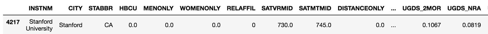

6.  让我们通过索引选择来选择斯坦福大学：

```py
>>> college_unique.loc['Stanford University']
CITY                  Stanford
STABBR                      CA
HBCU                         0
...
UG25ABV                 0.0401
MD_EARN_WNE_P10          86000
GRAD_DEBT_MDN_SUPP       12782
Name: Stanford University, dtype: object
```

7.  它们都产生相同的数据，只是对象不同。 让我们为每种方法计时：

```py
>>> %timeit college[college['INSTNM'] == 'Stanford University']
1.3 ms ± 56.8 µs per loop (mean ± std. dev. of 7 runs, 1000 loops each)

>>> %timeit college_unique.loc['Stanford University']
157 µs ± 682 ns per loop (mean ± std. dev. of 7 runs, 10000 loops each)
```

### 工作原理

当索引未排序且包含重复项时（如`college2`一样），Pandas 将需要检查索引中的每个单个值以进行正确选择。 像`college3`一样对索引进行排序时，pandas 利用称为**二分搜索**的算法来大大提高性能。

在秘籍的后半部分，我们使用唯一列作为索引。 Pandas 通过哈希表实现唯一索引，从而使选择速度更快。 几乎可以在同一时间查找每个索引位置，而不管其长度如何。

### 更多

布尔选择比索引选择具有更大的灵活性，因为可以对任意数量的列进行条件调整。 在此秘籍中，我们使用单列作为索引。 可以将多个列连接在一起以形成索引。 例如，在以下代码中，我们将索引设置为等于`city`和`state`列的串联：

```py
>>> college.index = college['CITY'] + ', ' + college['STABBR']
>>> college = college.sort_index()
>>> college.head()
```

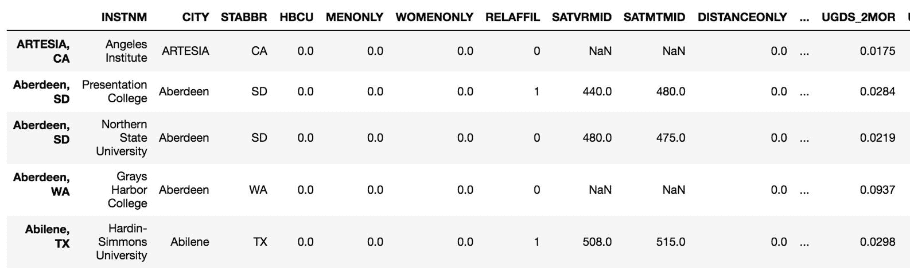

从这里，我们可以从特定城市和州的组合中选择所有大学，而无需布尔索引。 让我们从`Miami, FL`中选择所有大学：

```py
>>> college.loc['Miami, FL'].head()
```


我们可以将这种复合索引选择与布尔索引的速度进行比较。 有一个数量级以上的差异：

```py
>>> %%timeit 
>>> crit1 = college['CITY'] == 'Miami' 
>>> crit2 = college['STABBR'] == 'FL'
>>> college[crit1 & crit2]
2.43 ms ± 80.4 µs per loop (mean ± std. dev. of 7 runs, 100 loops each)

>>> %timeit college.loc['Miami, FL']
197 µs ± 8.69 µs per loop (mean ± std. dev. of 7 runs, 10000 loops each)
```

### 另见

*   [二分搜索算法](https://en.wikipedia.org/wiki/Binary_search_algorithm)

## 了解股票价格

购买了多头股票的投资者显然希望以历史最高价或接近历史最高价的价格出售股票。 当然，这在实践中很难做到，尤其是当股价仅将其历史的一小部分花费在一定阈值之上时。 我们可以使用布尔索引来查找股票花费高于或低于某个特定值的所有时间点。 此练习可以帮助我们了解某些股票的交易范围。

### 准备

在此秘籍中，我们研究了从 2010 年初到 2017 年中期的斯伦贝谢股票。 我们使用布尔索引来提取这段时间内收盘价的最低和最高百分之十的系列。 然后，我们绘制所有点并突出显示上下百分之十的点。

### 操作步骤

1.  读入斯伦贝谢股票数据，将`Date`列放入索引，并将其转换为`DatetimeIndex`：

```py
>>> slb = pd.read_csv('data/slb_stock.csv', index_col='Date', 
                     parse_dates=['Date'])
>>> slb.head()
```

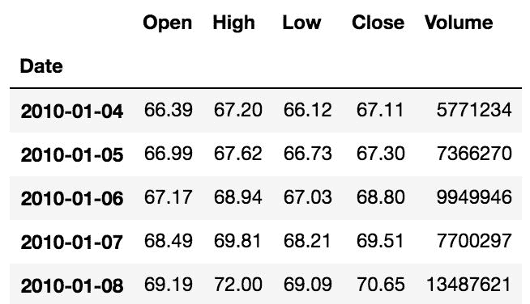

2.  选择收盘价作为系列，然后使用`describe`方法返回摘要统计信息作为系列：

```py
>>> slb_close = slb['Close']
>>> slb_summary = slb_close.describe(percentiles=[.1, .9])
>>> slb_summary
count    1895.000000
mean       79.121905
std        11.767802
min        51.750000
10%        64.892000
50%        78.000000
90%        93.248000
max       117.950000
Name: Close, dtype: float64
```

3.  使用布尔选择，选择最高或最低百分之十的所有收盘价：

```py
>>> upper_10 = slb_summary.loc['90%']
>>> lower_10 = slb_summary.loc['10%']
>>> criteria = (slb_close < lower_10) | (slb_close > upper_10)
>>> slb_top_bottom_10 = slb_close[criteria]
```

4.  在所有收盘价黑色上方，将生成的过滤后的系列以浅灰色绘制。 使用`matplotlib`库在第十和第九十个百分位处绘制水平线：

```py
>>> slb_close.plot(color='black', figsize=(12,6))
>>> slb_top_bottom_10.plot(marker='o', style=' ',
                           ms=4, color='lightgray')

>>> xmin = criteria.index[0]
>>> xmax = criteria.index[-1]
>>> plt.hlines(y=[lower_10, upper_10], xmin=xmin,
               xmax=xmax, color='black')
```

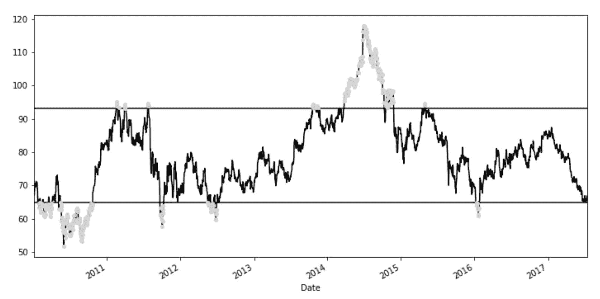

### 工作原理

步骤 2 中`describe`方法的结果本身就是一个以识别摘要统计量作为其索引标签的序列。 该摘要系列用于将第十和九十个百分位存储为它们自己的变量。 步骤 3 使用布尔索引来仅选择分布的高和低十分之一的那些值。

序列和数据帧都具有通过`plot`方法的直接绘图功能。 对`plot`方法的第一个调用来自`slb_close`系列，其中包含所有 SLB 收盘价。 这是绘图中的黑线。 来自`slb_filtered`的点直接在收盘价上方绘制为灰色标记。`style`参数设置为单个空格，因此不会画线。`ms`参数设置标记大小。

Matplotlib 带有便利功能`hlines`，它可以绘制水平线。 它获取`y`值的列表，并将它们从`xmin`绘制到`xmax`。

从我们创建的图块的新角度来看，很明显地看到，尽管 SLB 的历史最高价接近每股 120 美元，但在过去七年中只有 10% 的交易日超过了 93 美元。

### 更多

我们可以使用 matplotlib 的`fill_between`函数，而不是在收盘价上方绘制红点（黑点）以指示上下十分之一百分位。 此功能填充两行之间的所有区域。 它带有一个可选的`where`参数，该参数接受一个布尔系列，并警告其确切要填充的位置：

```py
>>> slb_close.plot(color='black', figsize=(12,6))
>>> plt.hlines(y=[lower_10, upper_10], 
               xmin=xmin, xmax=xmax,color='lightgray')
>>> plt.fill_between(x=criteria.index, y1=lower_10,
                     y2=slb_close.values, color='black')
>>> plt.fill_between(x=criteria.index,y1=lower_10,
                     y2=slb_close.values, where=slb_close < lower_10,
                     color='lightgray')
>>> plt.fill_between(x=criteria.index, y1=upper_10, 
                     y2=slb_close.values, where=slb_close > upper_10,
                     color='lightgray')
```

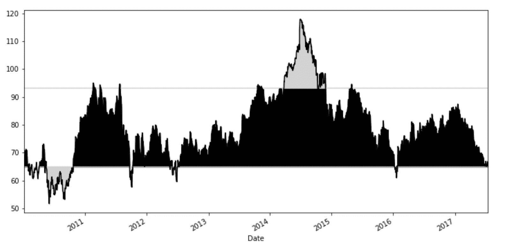

### 另见

*   请参阅第 11 章，“使用 Matplotlib，Pandas 和 Seaborn 进行可视化”

## 翻译 SQL WHERE 子句

许多 Pandas 用户将使用通用的**结构化查询语言**（**SQL**）直接从数据库中处理数据。 SQL 是用于定义，操作和控制存储在数据库中的数据的标准化语言。`SELECT`语句是使用 SQL 选择，过滤，聚合和排序数据的最常用方法。 Pandas 可以连接数据库并向它们发送 SQL 语句。

SQL 是数据科学家要了解的非常重要的语言。 世界上许多数据都存储在数据库中，这需要 SQL 来检索，操作和执行分析。 SQL 语法非常简单易学。 Oracle，Microsoft，IBM 等公司提供了许多不同的 SQL 实现。 尽管语法在不同的实现之间不兼容，但其核心看起来几乎相同。

### 准备

在 SQL `SELECT`语句中，`WHERE`子句非常常见，并过滤数据。 此秘籍将编写与选择雇员数据集的特定子集的 SQL 查询等效的 Pandas 代码。

无需了解任何 SQL 语法即可使用此秘籍。

假设我们有一项任务是找到所有在警察或消防部门工作的女性雇员，其基本工资在 80 到 12 万美元之间。 以下 SQL 语句将为我们回答此查询：

```py
SELECT
    UNIQUE_ID,
    DEPARTMENT,
    GENDER,
    BASE_SALARY
FROM
    EMPLOYEE
WHERE
    DEPARTMENT IN ('Houston Police Department-HPD', 
                   'Houston Fire Department (HFD)') AND
    GENDER = 'Female' AND 
    BASE_SALARY BETWEEN 80000 AND 120000;
```

### 操作步骤

1.  读取`employee`数据集作为数据帧：

```py
>>> employee = pd.read_csv('data/employee.csv')
```

2.  在过滤出数据之前，对每个过滤后的列进行一些手动检查以了解将在过滤器中使用的确切值会有所帮助：

```py
>>> employee.DEPARTMENT.value_counts().head()
Houston Police Department-HPD     638
Houston Fire Department (HFD)     384
Public Works & Engineering-PWE    343
Health & Human Services           110
Houston Airport System (HAS)      106
Name: DEPARTMENT, dtype: int64

>>> employee.GENDER.value_counts()
 Male 1397
 Female 603

>>> employee.BASE_SALARY.describe().astype(int)
count      1886
mean      55767
std       21693
min       24960
25%       40170
50%       54461
75%       66614
max      275000
Name: BASE_SALARY, dtype: int64
```

3.  为每个条件写一个声明。 使用`isin`方法测试是否等于多个值之一：

```py
>>> depts = ['Houston Police Department-HPD', 
             'Houston Fire Department (HFD)']
>>> criteria_dept = employee.DEPARTMENT.isin(depts)
>>> criteria_gender = employee.GENDER == 'Female'
>>> criteria_sal = (employee.BASE_SALARY >= 80000) & \
                   (employee.BASE_SALARY <= 120000)
```

4.  将所有布尔系列结合在一起：

```py
>>> criteria_final = (criteria_dept & 
                      criteria_gender & 
                      criteria_sal)
```

5.  使用布尔索引来选择仅符合最终条件的行：

```py
>>> select_columns = ['UNIQUE_ID', 'DEPARTMENT',
                     'GENDER', 'BASE_SALARY']
>>> employee.loc[criteria_final, select_columns].head()
```


### 工作原理

在实际进行任何过滤之前，您显然需要知道将使用的确切字符串名称。 序列`value_counts`方法是获取确切的字符串名称和该值的出现次数的极好方法。

`isin`序列方法等效于 SQL `IN`运算符，并接受要保留的所有可能值的列表。 可以使用一系列`OR`条件来复制此表达式，但效率不高或惯用。

薪水标准`criteria_sal`是通过组合两个简单的不等式表达式形成的。 最后，所有条件都与 Pandas`and`运算符`&`结合在一起，以产生单个布尔系列作为过滤器。

### 更多

对于许多操作，Pandas 有多种方法来做同一件事。 在前面的秘籍中，薪水标准使用两个单独的布尔表达式。 与 SQL 相似，序列具有`between`方法，其工资标准等效编写如下：

```py
>>> criteria_sal = employee.BASE_SALARY.between(80000, 120000)
```

`isin`的另一个有用的应用是提供由其他一些 pandas 语句自动生成的值序列。 这样可以避免进行任何手动调查来查找要存储在列表中的确切字符串名称。 相反，让我们尝试从最经常出现的五个部门中排除行：

```py
>>> top_5_depts = employee.DEPARTMENT.value_counts().index[:5]
>>> criteria = ~employee.DEPARTMENT.isin(top_5_depts)
>>> employee[criteria]
```

SQL 的等效项如下：

```py
SELECT 
    * 
FROM 
    EMPLOYEE 
WHERE 
    DEPARTMENT not in 
    (
      SELECT 
          DEPARTMENT 
     FROM (
           SELECT
               DEPARTMENT,
               COUNT(1) as CT
           FROM
               EMPLOYEE
           GROUP BY
               DEPARTMENT
           ORDER BY
               CT DESC
           LIMIT 5
          )
   );                          
```

注意，使用了 pandas 否定运算符`~`，它否定了序列的所有布尔值。

### 另见

*   Pandas [`isin`](http://pandas.pydata.org/pandas-docs/stable/generated/pandas.Series.isin.html)和[`between`](http://pandas.pydata.org/pandas-docs/stable/generated/pandas.Series.between.html)序列方法的官方文档
*   请参阅第 9 章，“合并 Pandas 对象”中的“连接到 SQL 数据库”秘籍。
*   [W3Schools 的 SQL 基本介绍](https://www.w3schools.com/sql/DEfaULT.asp)
*   [SQL `IN`运算符](https://www.w3schools.com/sql/sql_in.asp)
*   [SQL `BETWEEN`运算符](https://www.w3schools.com/sql/sql_between.asp)

## 确定股票市场收益的正态性

在基础统计教科书中，正态分布非常依赖于描述许多不同的数据种群。 尽管大多数时间里许多随机过程的确看起来像正态分布，但现实生活中往往更为复杂。 股市回报率是分布的主要示例，该分布看上去看起来很正常，但实际上相差很远。

### 准备

该秘籍描述了如何查找互联网零售巨头亚马逊的每日股市收益，并非正式地测试它们是否遵循正态分布。

### 操作步骤

1.  加载亚马逊库存数据并将日期设置为索引：

```py
>>> amzn = pd.read_csv('data/amzn_stock.csv', index_col='Date',
                      parse_dates=['Date'])
>>> amzn.head()
```

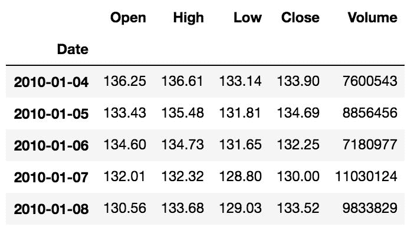

2.  通过仅选择收盘价然后使用`pct_change`方法获得每日收益率来创建系列：

```py
>>> amzn_daily_return = amzn.Close.pct_change()
>>> amzn_daily_return.head()
Date
2010-01-04         NaN
2010-01-05    0.005900
2010-01-06   -0.018116
2010-01-07   -0.017013
2010-01-08    0.027077
Name: Close, dtype: float64
```

3.  删除缺失值并绘制收益的直方图，以目视检查分布：

```py
>>> amzn_daily_return = amzn_daily_return.dropna()
>>> amzn_daily_return.hist(bins=20)
```

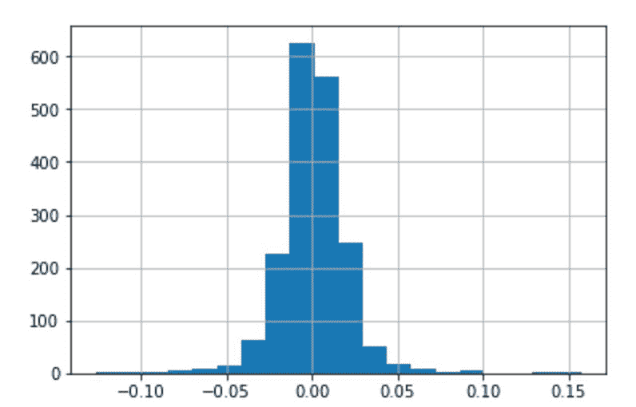

4.  正态分布大致遵循 68-95-99.7 规则-这意味着 68% 的数据介于平均值的 1 个标准差之间，95% 介于 2 个平均值之间和 39.7% 介于 3 个平均值之间。我们现在将计算均值介于 1、2 和 3 个标准差之间的每日收益的百分比。 为此，我们需要均值和标准差：

```py
>>> mean = amzn_daily_return.mean() 
>>> std = amzn_daily_return.std()
```

5.  计算每个观察值的`z-score`的绝对值。`z-score`是偏离平均值的标准差数：

```py
>>> abs_z_score = amzn_daily_return.sub(mean).abs().div(std)
```

6.  查找在 1、2 和 3 个标准差内的收益百分比：

```py
>>> pcts = [abs_z_score.lt(i).mean() for i in range(1,4)]
>>> print('{:.3f} fall within 1 standard deviation. '
          '{:.3f} within 2 and {:.3f} within 3'.format(*pcts))
0.787 fall within 1 standard deviation. 0.957 within 2 and 0.985 within 3
```

### 工作原理

默认情况下，`pct_change`序列方法计算当前元素和上一个元素之间的百分比变化。 这会将原始股票收盘价转换为每日百分比收益。 返回的系列的第一个元素是缺少值，因为没有先前的价格。

直方图是用于汇总和可视化一维数字数据的奇妙图。 从图中可以明显看出，分布是对称的，但仍然很难确定其是否为正态。 有正式的统计程序可以确定分布的正态性，但是我们仅会发现数据与 68-95-99.7 规则的匹配程度。

步骤 5 为每个观测值计算远离平均值的标准差数，称为`z-score`。 此步骤使用方法而不是符号（`-`和`/`）进行减法和除法。 小于的方法也用于步骤 6 中的符号。

在步骤 6 中取平均值似乎有些奇怪。`abs_z_score.lt(1)`表达式的结果是一系列布尔值。 当布尔值求值为 0 或 1 时，取该系列的平均值将返回`True`元素的百分比，这就是我们所希望的。

现在，我们可以将结果数（78.7-95.7-98.5）与 68-95-99.7 规则进行比较，从而更轻松地确定收益的正态性。 百分比与 1 和 3 个标准差的规则有很大差异，我们可以得出结论，亚马逊的每日股票收益率不遵循正态分布。

### 更多

为了使这一过程自动化，我们可以编写一个函数，该函数在中接收股票数据，并输出日收益率的直方图以及与平均值相差 1、2 和 3 个标准差的百分比。 下面的函数执行此操作，并将方法替换为其对应的符号：

```py
>>> def test_return_normality(stock_data):
        close = stock_data['Close']
        daily_return = close.pct_change().dropna()
        daily_return.hist(bins=20)
        mean = daily_return.mean() 
        std = daily_return.std()

        abs_z_score = abs(daily_return - mean) / std 
        pcts = [abs_z_score.lt(i).mean() for i in range(1,4)]

        print('{:.3f} fall within 1 standard deviation. '
              '{:.3f} within 2 and {:.3f} within 3'.format(*pcts))

>>> slb = pd.read_csv('data/slb_stock.csv', index_col='Date',
                      parse_dates=['Date'])
>>> test_return_normality(slb)
0.742 fall within 1 standard deviation. 0.946 within 2 and 0.986 within 3
```

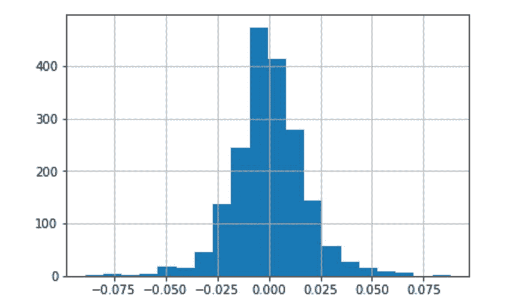

### 另见

*   [Pandas `pct_change`序列方法的官方文档](http://pandas.pydata.org/pandas-docs/stable/generated/pandas.Series.pct_change.html)

## 使用`query`方法提高布尔索引的可读性

布尔索引不一定是读取或写入的最令人愉快的语法，尤其是在使用单行编写复杂过滤器时。 Pandas 通过数据帧的`query`方法具有替代的基于字符串的语法，该语法可提供更高的清晰度。

数据帧的`query`方法是实验性的，不具备布尔索引功能，因此不应用于生产代码。

### 准备

此秘籍复制了本章中的较早秘籍“转换 SQL 数据帧的`WHERE`子句”，但是利用了`query`方法。 此处的目标是为来自警察局或消防局的，薪水在 80 至 12 万美元之间的女性雇员筛选雇员数据。

### 操作步骤

1.  读入员工数据，分配所选部门，并将列导入变量：

```py
>>> employee = pd.read_csv('data/employee.csv')
>>> depts = ['Houston Police Department-HPD',
             'Houston Fire Department (HFD)']
>>> select_columns = ['UNIQUE_ID', 'DEPARTMENT',
                      'GENDER', 'BASE_SALARY']
```

2.  构建查询字符串并执行方法：

```py
>>> qs = "DEPARTMENT in @depts " \
         "and GENDER == 'Female' " \
         "and 80000 <= BASE_SALARY <= 120000"

>>> emp_filtered = employee.query(qs)
>>> emp_filtered[select_columns].head()
```

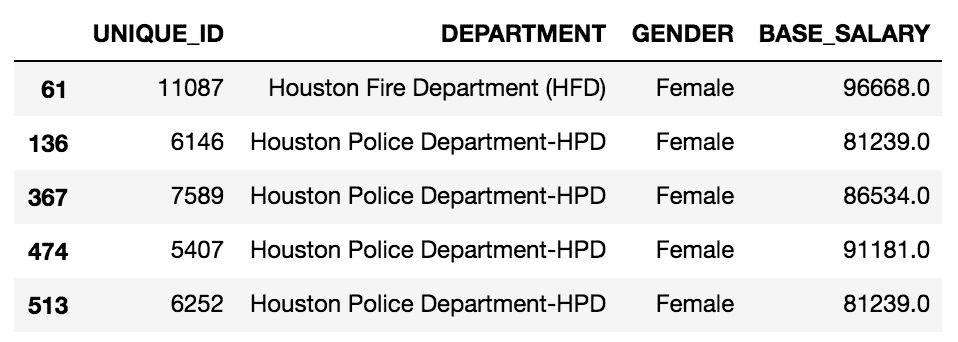

### 工作原理

传递给`query`方法的字符串看起来比普通的 Pandas 代码更像普通的英语。 与`depts`一样，可以使用 at 符号（`@`）来引用 Python 变量。 通过简单地引用其名称而不用内引号，可在查询名称空间中使用所有数据帧的列名称。 如果需要一个字符串，例如`Female`，则需要用引号将其引起来。

`query`语法的另一个不错的功能是能够在单个表达式中编写双重不等式，并且能够理解冗长的逻辑运算符`and`，`or`和`not`，而不是像布尔值那样的按位等效索引。

### 更多

不用手动输入部门名称列表，我们可以以编程方式创建它。 例如，如果我们要按频率查找不是前十名部门成员的所有女性雇员，则可以运行以下代码：

```py
>>> top10_depts = employee.DEPARTMENT.value_counts() \
                                     .index[:10].tolist()
>>> qs = "DEPARTMENT not in @top10_depts and GENDER == 'Female'"
>>> employee_filtered2 = employee.query(qs)
>>> employee_filtered2.head()
```

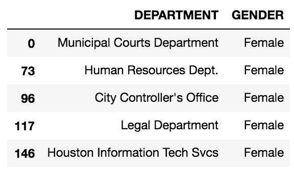

### 另见

*   [Pandas `query`方法的官方文档](http://pandas.pydata.org/pandas-docs/stable/indexing.html#indexing-query)

## 使用`where`方法保留序列

布尔索引必须通过删除不符合条件的所有行来过滤数据集。 除了丢弃所有这些值外，还可以使用`where`方法保留它们。`where`方法将保留序列或数据帧的大小，并将不符合条件的值设置为缺失或将其替换为其他值。

### 准备

在此秘籍中，我们通过`where`方法布尔条件，在`movie`数据集中，针对参与者 1 的 Facebook 点赞的最小和最大数目设置上下限。

### 操作步骤

1.  读取`movie`数据集，将影片标题设置为索引，然后选择`actor_1_facebook_likes`列中所有不丢失的值：

```py
>>> movie = pd.read_csv('data/movie.csv', index_col='movie_title')
>>> fb_likes = movie['actor_1_facebook_likes'].dropna()
>>> fb_likes.head()
movie_title
Avatar                                         1000.0
Pirates of the Caribbean: At World's End      40000.0
Spectre                                       11000.0
The Dark Knight Rises                         27000.0
Star Wars: Episode VII - The Force Awakens      131.0
Name: actor_1_facebook_likes, dtype: float64
```

2.  让我们使用`describe`方法来了解分布情况：

```py
>>> fb_likes.describe(percentiles=[.1, .25, .5, .75, .9]) \
            .astype(int)
count      4909
mean       6494
std       15106
min           0
10%         240
25%         607
50%         982
75%       11000
90%       18000
max      640000
Name: actor_1_facebook_likes, dtype: int64
```

3.  此外，我们可以绘制此系列的直方图以直观地检查分布：

```py
>>> fb_likes.hist()
```

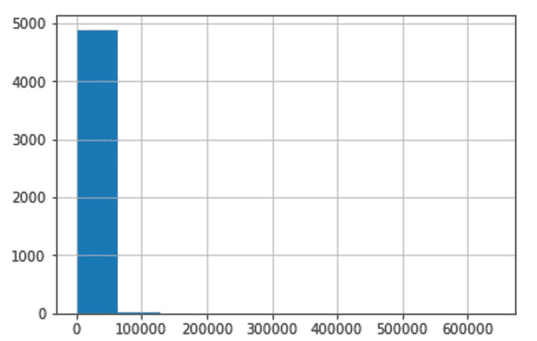

4.  这是非常糟糕的可视化，并且很难了解分布情况。 另一方面，第 2 步的汇总统计信息似乎在告诉我们，在很多观察中，该数据高度偏向右侧，比中位数大一个数量级。 让我们创建标准来测试点赞次数是否少于 20,000：

```py
>>> criteria_high = fb_likes < 20000
>>> criteria_high.mean().round(2)
.91
```

5.  大约 91% 的电影的演员 1 少于 20,000 个。 现在，我们将使用`where`方法，该方法接受布尔条件。 默认行为是返回与原始大小相同的序列，但将所有`False`位置替换为缺少的值：

```py
>>> fb_likes.where(criteria_high).head()
movie_title
Avatar                                         1000.0
Pirates of the Caribbean: At World's End          NaN
Spectre                                       11000.0
The Dark Knight Rises                             NaN
Star Wars: Episode VII - The Force Awakens      131.0
Name: actor_1_facebook_likes, dtype: float64
```

6.  `where`方法的第二个参数`other`允许您控制替换值。 让我们将所有缺失值更改为 20,000：

```py
>>> fb_likes.where(criteria_high, other=20000).head()
movie_title
Avatar                                         1000.0
Pirates of the Caribbean: At World's End      20000.0
Spectre                                       11000.0
The Dark Knight Rises                         20000.0
Star Wars: Episode VII - The Force Awakens      131.0
Name: actor_1_facebook_likes, dtype: float64
```

7.  类似地，我们可以创建条件来为最少的点赞次数设置下限。 在这里，我们链接另一个`where`方法，并将不符合条件的值替换为`300`：

```py
>>> criteria_low = fb_likes > 300
>>> fb_likes_cap = fb_likes.where(criteria_high, other=20000)\
                           .where(criteria_low, 300)
>>> fb_likes_cap.head()
movie_title
Avatar                                         1000.0
Pirates of the Caribbean: At World's End      20000.0
Spectre                                       11000.0
The Dark Knight Rises                         20000.0
Star Wars: Episode VII - The Force Awakens      300.0
Name: actor_1_facebook_likes, dtype: float64
```

8.  原始系列和修改后的系列的长度相同：

```py
>>> len(fb_likes), len(fb_likes_cap)
(4909, 4909)
```

9.  让我们使用修改后的系列创建直方图。 数据范围更窄时，应该可以绘制出更好的图：

```py
>>> fb_likes_cap.hist()
```

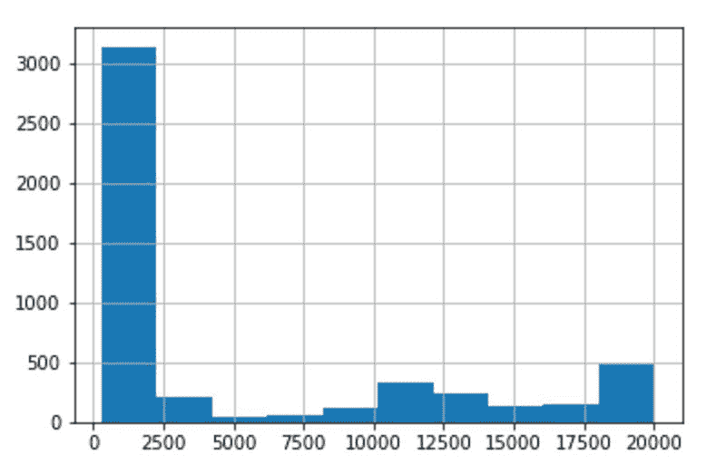

### 工作原理

`where`方法再次保留调用对象的大小和形状，并且不修改传递的布尔值为`True`的值。 重要的是在步骤 1 中删除丢失的值，因为`where`方法最终将在以后的步骤中将其替换为有效数字。

第 2 步中的摘要统计信息为我们提供了一些直观的方法来限定数据上限。 另一方面，第 3 步中的直方图似乎会将所有数据聚集到一个桶中。 对于纯直方图，数据有太多离群值，因此无法绘制出正确的图。`where`方法允许我们在数据上放置一个上限和下限，这将导致带有更多可见条的直方图。

### 更多

Pandas 实际上具有复制此操作的内置方法`clip`，`clip_lower`和`clip_upper`。`clip`方法可以同时设置地板和天花板。 我们还检查此替代方法是否产生完全相同的序列，它会执行以下操作：

```py
>>> fb_likes_cap2 = fb_likes.clip(lower=300, upper=20000)
>>> fb_likes_cap2.equals(fb_likes_cap)
True
```

### 另见

*   [Pandas `where`方法的官方文档](http://bit.ly/2vmW2cv)

## 屏蔽数据帧的行

`mask`方法执行与`where`方法完全相反的操作。 默认情况下，无论布尔条件为`True`，它都会创建缺失值。 从本质上讲，它实际上是掩盖或掩盖数据集中的值。

### 准备

在此秘籍中，我们将屏蔽 2010 年之后制作的电影数据集的所有行，然后过滤所有缺少值的行。

### 操作步骤

1.  读取`movie`数据集，将电影标题设置为索引，并创建条件：

```py
>>> movie = pd.read_csv('data/movie.csv', index_col='movie_title')
>>> c1 = movie['title_year'] >= 2010
>>> c2 = movie['title_year'].isnull()
>>> criteria = c1 | c2
```

2.  在数据帧上使用`mask`方法可以使从 2010 年开始制作的带有电影的行中的所有值都丢失。 最初具有`title_year`缺失值的所有电影也会被屏蔽：

```py
>>> movie.mask(criteria).head()
```

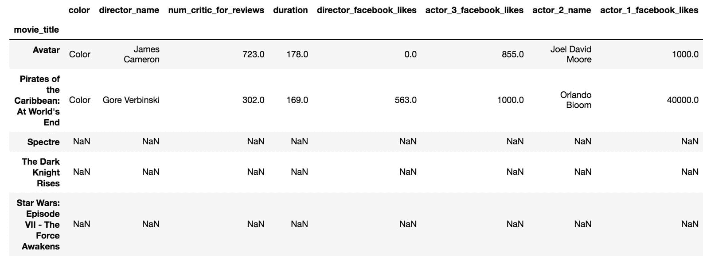

3.  请注意，前面的数据帧中的第三，第四和第五行中的所有值是如何丢失的。 链接`dropna`方法以删除所有值均缺失的行：

```py
>>> movie_mask = movie.mask(criteria).dropna(how='all')
>>> movie_mask.head()
```

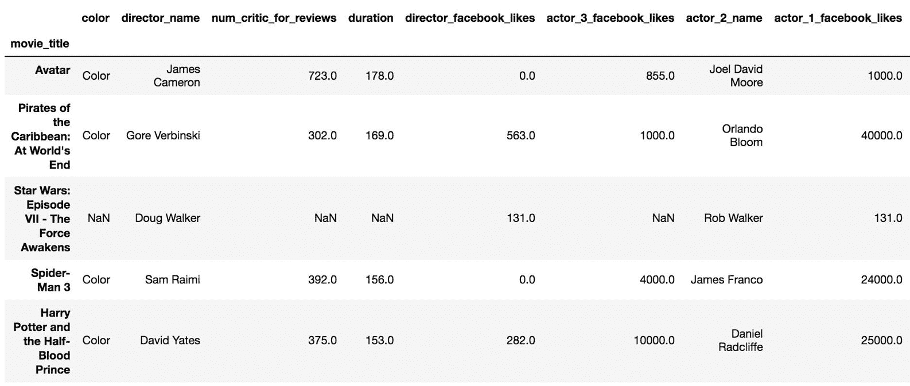

4.  步骤 3 中的操作只是执行基本布尔索引的一种复杂方法。 我们可以检查两个方法是否产生相同的数据帧：

```py
>>> movie_boolean = movie[movie['title_year'] < 2010]
>>> movie_mask.equals(movie_boolean)
False
```

5.  `equals`方法告诉我们它们不相等。 出了点问题。 让我们进行一些完整性检查，看看它们是否具有相同的形状：

```py
>>> movie_mask.shape == movie_boolean.shape
True
```

6.  当我们使用前面的`mask`方法时，它创建了许多缺失值。 缺少值是`float`数据类型，因此任何以前的整数列现在都是浮点数。 如果列的数据类型不同，即使值相同，`equals`方法也会返回`False`。 让我们检查数据类型的相等性，以查看是否发生了这种情况：

```py
>>> movie_mask.dtypes == movie_boolean.dtypes
color                         True
director_name                 True
num_critic_for_reviews        True
duration                      True
director_facebook_likes       True
actor_3_facebook_likes        True
actor_2_name                  True
actor_1_facebook_likes        True
gross                         True
genres                        True
actor_1_name                  True
num_voted_users              False
cast_total_facebook_likes    False
.....
dtype: bool
```

7.  事实证明，几列没有相同的数据类型。 Pandas 对于这些情况有另一种选择。 在其开发人员主要使用的测试模块中，有一个函数`assert_frame_equal`，您可以使用它检查序列和数据帧的相等性，而无需同时检查数据类型的相等性：

```py
from pandas.testing import assert_frame_equal
>>> assert_frame_equal(movie_boolean, movie_mask, check_dtype=False)
```

### 工作原理

默认情况下，`mask`方法覆盖缺少值的数据。`mask`方法的第一个参数是条件，该条件通常是布尔级数，例如`criteria`。 因为`mask`方法是从数据帧调用的，所以条件为`False`的每一行中的所有值都将变为丢失。 步骤 3 使用此掩码的数据帧删除包含所有缺失值的行。 步骤 4 显示了如何使用布尔索引执行相同的过程。

在数据分析过程中，持续验证结果非常重要。 检查序列和数据帧的相等性是一种非常通用的验证方法。 我们在步骤 4 中的首次尝试产生了意外结果。 在深入研究之前，一些基本的健全性检查（例如确保行和列的数目相同或行和列的名称相同）是很好的检查。

步骤 6 将两个系列的数据类型一起比较。 在这里，我们揭示了数据帧不等效的原因。`equals`方法检查值和数据类型是否相同。 步骤 7 中的`assert_frame_equal`函数具有许多可用参数，可以通过各种方式测试相等性。 注意，调用`assert_frame_equal`后没有输出。 当两个传递的数据帧相等时，此方法返回`None`；否则，将引发错误。

### 更多

让我们比较掩盖和删除丢失的行与布尔索引之间的速度差异。 在这种情况下，布尔索引大约快一个数量级：

```py
>>> %timeit movie.mask(criteria).dropna(how='all')
11.2 ms ± 144 µs per loop (mean ± std. dev. of 7 runs, 100 loops each)

>>> %timeit movie[movie['title_year'] < 2010]
1.07 ms ± 34.9 µs per loop (mean ± std. dev. of 7 runs, 1000 loops each)
```

### 另见

*   [Pandas `assert_frame_equal`的官方文档](https://pandas.pydata.org/pandas-docs/stable/generated/pandas.testing.assert_frame_equal.html)
*   [Python `assert`语句的官方文档](https://docs.python.org/3/reference/simple_stmts.html#the-assert-statement)

## 使用布尔值，整数位置和标签进行选择

第 4 章，“选择数据子集”涵盖了有关通过`.iloc`和`.loc`索引器选择不同数据子集的各种方法。 这两个索引器都通过整数位置或标签同时选择行和列。 这两个索引器都可以通过布尔索引进行数据选择，即使布尔不是整数也不是标签。

### 准备

在本秘籍中，我们将为`.iloc`和`.loc`索引器使用布尔索引过滤行和列。

### 操作步骤

1.  读入电影数据集，将索引设置为标题，然后创建一个布尔系列，匹配内容分级为`G`和 IMDB 得分小于`4`的所有电影：

```py
>>> movie = pd.read_csv('data/movie.csv', index_col='movie_title')
>>> c1 = movie['content_rating'] == 'G'
>>> c2 = movie['imdb_score'] < 4
>>> criteria = c1 & c2
```

2.  首先，将这些条件传递给`.loc`索引器以过滤行：

```py
>>> movie_loc = movie.loc[criteria]
>>> movie_loc.head()
```

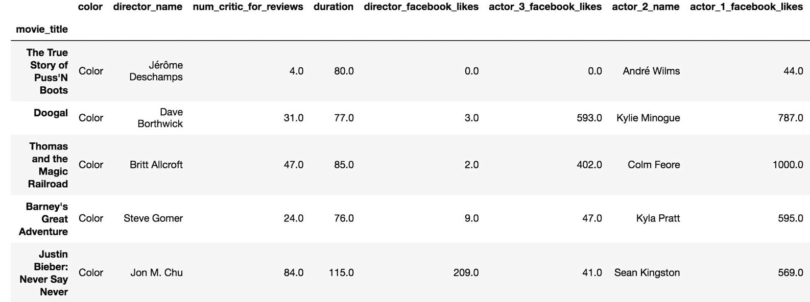

3.  让我们检查一下此数据帧是否完全等于直接由索引运算符生成的数据帧：

```py
>>> movie_loc.equals(movie[criteria])
True
```

4.  现在，让我们尝试使用`.iloc`索引器进行相同的布尔索引：

```py
>>> movie_iloc = movie.iloc[criteria]
ValueError: iLocation based boolean indexing cannot use an indexable as a mask
```

5.  事实证明，由于存在索引，我们不能直接使用一系列布尔值。 但是，我们可以使用布尔值的 ndarray。 要提取数组，请使用`values`属性：

```py
>>> movie_iloc = movie.iloc[criteria.values]
>>> movie_iloc.equals(movie_loc)
True
```

6.  尽管不是很常见，但可以进行布尔索引来选择特定的列。 在这里，我们选择所有数据类型为 64 位整数的列：

```py
>>> criteria_col = movie.dtypes == np.int64
>>> criteria_col.head()
color                      False
director_name              False
num_critic_for_reviews     False
duration                   False
director_facebook_likes    False
dtype: bool

>>> movie.loc[:, criteria_col].head()
```

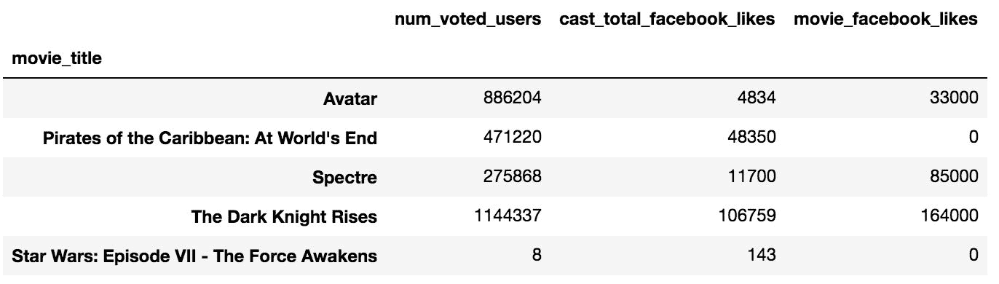

7.  由于`criteria_col`是一个系列，始终有一个索引，因此必须使用基础 ndarray 使其与`.iloc`一起使用。 以下产生与步骤 6 相同的结果。

```py
>>> movie.iloc[:, criteria_col.values].head() 
```

8.  布尔系列可以用于选择行，然后同时选择具有整数或标签的列。 请记住，您需要在行和列选择之间加上逗号。 让我们保留行标准，然后选择`content_rating`，`imdb_score`，`title_year`和`gross`：

```py
>>> cols = ['content_rating', 'imdb_score', 'title_year', 'gross']
>>> movie.loc[criteria, cols].sort_values('imdb_score')
```

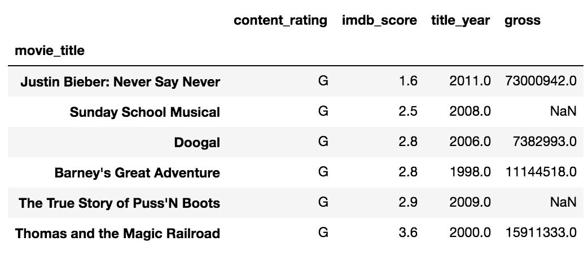

9.  可以使用`.iloc`复制相同的操作，但是您需要获取所有列的整数位置：

```py
>>> col_index = [movie.columns.get_loc(col) for col in cols]
>>> col_index
[20, 24, 22, 8]

>>> movie.iloc[criteria.values, col_index] 
```

### 工作原理

布尔索引可以用`.iloc`和`.loc`索引器完成，但要注意的是`.iloc`不能传递给序列而是基础`ndarray`。 让我们看一下条件序列的一维`ndarray`：

```py
>>> a = criteria.values
>>> a[:5]
array([False, False, False, False, False], dtype=bool)

>>> len(a), len(criteria)
(4916, 4916)
```

数组的长度与序列的长度相同，而序列与电影的数据帧长度相同。 布尔数组的整数位置与数据帧的整数位置对齐，并且过滤器按预期进行。 这些数组也可以与`.loc`运算符一起使用，但是它们对于`.iloc`是必需的。

步骤 6 和 7 显示了如何按列而不是按行进行过滤。 需要冒号`:`来指示所有行的选择。 冒号后面的逗号分隔行和列的选择。 实际上，通过`select_dtypes`方法可以更轻松地选择具有整数数据类型的列。

步骤 8 和 9 显示了一种同时对行和列选择进行布尔索引的非常通用和有用的方法。 您只需在行和列选择之间放置一个逗号。 第 9 步使用列表推导式遍历所有所需的列名，以使用索引方法`get_loc`查找其整数位置。

### 更多

实际上，可以将数组和布尔值列表传递给序列对象，这些对象的长度与您要建立索引的数据帧的长度不同。 让我们通过选择第一行和第三行以及第一列和第四列来查看一个示例：

```py
>>> movie.loc[[True, False, True], [True, False, False, True]]
```

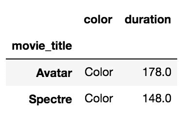

这两个布尔列表的长度与其所索引的轴的长度不同。 列表中未明确指定布尔值的其余行和列将被删除。

### 另见

*   请参阅第 4 章，“选择数据子集”中的“同时使用整数和标签选择数据”秘籍。
*   请参阅第 2 章，“基本数据帧操作”的“用方法选择列”。