# 分组以进行汇总，过滤和转换

在本章中，我们将介绍以下主题：

*   定义聚合
*   具有多个列和功能的分组和聚合
*   分组后删除 MultiIndex
*   自定义聚合功能
*   使用`*args`和`**kwargs`自定义聚合功能
*   检查`groupby`对象
*   筛选少数居多的州
*   通过减肥赌注转型
*   计算每个州的 SAT 加权平均成绩
*   按连续变量分组
*   计算城市之间的航班总数
*   寻找最长的准时航班

# 介绍

数据分析过程中最基本的任务之一是在对每个组执行计算之前将数据分成独立的组。 该方法已经存在了相当长的时间，但是最近被称为**拆分应用组合**。 本章介绍了功能强大的`groupby`方法，该方法可让您以可想象的任何方式对数据进行分组，并在返回单个数据集之前将任何类型的函数独立地应用于每个组。

Hadley Wickham 创造了术语“拆分应用组合”，用于描述将数据分为独立的可管理块，将函数独立应用于这些块，然后将结果组合在一起的通用数据分析模式。 可以在[他的论文](http://www.stat.wvu.edu/~jharner/courses/stat623/docs/plyrJSS.pdf)中找到更多详细信息。

在开始使用秘籍之前，我们只需要了解一些术语。 所有基本的 groupby 操作都有**分组列**，这些列中值的每个唯一组合代表数据的独立分组。 语法如下所示：

```py
>>> df.groupby(['list', 'of', 'grouping', 'columns'])
>>> df.groupby('single_column')  # when grouping by a single column
```

该操作的结果返回一个 groupby 对象。 正是这个 groupby 对象将成为驱动整个整章所有计算的引擎。 在通过对象创建此分组时，Pandas 实际上很少执行，仅验证了分组是可能的。 您必须在该 groupby 对象上链接方法，以释放其功能。

从技术上讲，该操作的结果将是`DataFrameGroupBy`或`SeriesGroupBy`，但为简单起见，在整章中将其称为 groupby 对象。
# 定义聚合

`groupby`方法最常见的用途是执行聚合。 实际是什么聚合？ 在我们的数据分析世界中，当许多输入的序列被汇总或组合为单个值输出时，就会发生汇总。 例如，对一列的所有值求和或求其最大值是应用于单个数据序列的常见聚合。 聚合仅获取许多值，然后将其转换为单个值。

除了介绍中定义的分组列外，大多数聚合还有两个其他组件，**聚合列**和**聚合函数**。 汇总列是其值将被汇总的列。 聚集功能定义聚集的方式。 主要的聚合功能包括`sum`，`min`，`max`，`mean`，`count`，`variance`和`std`等。

# 准备

在此秘籍中，我们检查航班数据集，并执行最简单的可能的汇总，仅涉及单个分组列，单个汇总列和单个汇总函数。 我们将找到每家航空公司的平均到达延误时间。 Pandas 具有相当多种不同的语法来产生聚合，本秘籍涵盖了它们。

# 操作步骤

1.  读取飞行数据集，并定义分组列（`AIRLINE`），聚合列（`ARR_DELAY`）和聚合函数（`mean`）：

```py
>>> flights = pd.read_csv('data/flights.csv')
>>> flights.head()
```

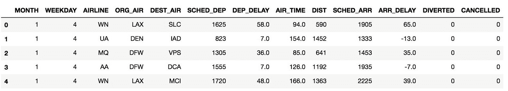

2.  将分组列放在`groupby`方法中，然后通过字典将[聚集]列及其聚集函数配对的`agg`方法：

```py
>>> flights.groupby('AIRLINE').agg({'ARR_DELAY':'mean'}).head()
```

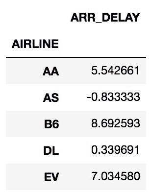

3.  或者，您可以将汇总列放在索引运算符中，然后将汇总函数作为字符串传递给`agg`：

```py
>>> flights.groupby('AIRLINE')['ARR_DELAY'].agg('mean').head()
AIRLINE
AA     5.542661
AS    -0.833333
B6     8.692593
DL     0.339691
EV     7.034580
Name: ARR_DELAY, dtype: float64
```

4.  上一步中使用的字符串名称是 Pandas 提供的一种便捷功能，可让您引用特定的聚合函数。 您可以将任何聚合函数直接传递给`agg`方法，例如 NumPy `mean`函数。 输出与上一步相同：

```py
>>> flights.groupby('AIRLINE')['ARR_DELAY'].agg(np.mean).head()
```

5.  在这种情况下，可以完全跳过`agg`方法，而直接使用`mean`方法。 此输出也与步骤 3 相同：

```py
>>> flights.groupby('AIRLINE')['ARR_DELAY'].mean().head()
```

# 工作原理

`groupby`方法的语法不像其他方法那么简单。 让我们通过将`groupby`方法的结果存储为自己的变量来拦截步骤 2 中的方法链

```py
>>> grouped = flights.groupby('AIRLINE')
>>> type(grouped)
pandas.core.groupby.DataFrameGroupBy
```

首先使用其自己独特的属性和方法来生产一个全新的中间对象。 在此阶段没有任何计算。 Pandas 仅验证分组列。 该 groupby 对象具有`agg`方法来执行聚合。 使用此方法的一种方法是向其传递一个字典，该字典将聚合列映射到聚合函数，如步骤 2 所示。

有几种不同的语法产生相似的结果，而步骤 3 显示了另一种方法。 与其标识字典中的聚合列，不如将其放在索引运算符中，就如同您从数据帧中将其选择为列一样。 然后，将功能字符串名称作为标量传递给`agg`方法。

您可以将任何汇总函数传递给`agg`方法。 为了简单起见，Pandas 允许您使用字符串名称，但是您也可以像在步骤 4 中一样明确地调用一个聚合函数。NumPy 提供了许多聚合值的函数。

步骤 5 显示了最后一种语法风格。 如本例所示，当仅应用单个聚合函数时，通常可以直接将其作为对 groupby 对象本身的方法进行调用，而无需使用`agg`。 并非所有聚合函数都具有等效的方法，但是许多基本函数都有。 以下是几个聚合函数的列表，这些函数可以作为字符串传递给`agg`或作为方法直接链接到 groupby 对象：

```py
min     max    mean    median    sum    count    std var size    describe    nunique     idxmin     idxmax
```

# 更多

如果您不对`agg`使用汇总功能，则 pandas 会引发异常。 例如，让我们看看将平方根函数应用于每个组会发生什么：

```py
>>> flights.groupby('AIRLINE')['ARR_DELAY'].agg(np.sqrt)
ValueError: function does not reduce
```

# 另见

*   [Pandas *聚合*的官方文档](http://pandas.pydata.org/pandas-docs/stable/groupby.html#aggregation)

# 具有多个列和功能的分组和聚合

可以对多列进行分组和聚合。 语法仅与使用单个列进行分组和聚合时稍有不同。 与任何分组操作一样，它有助于识别三个组成部分：分组列，聚合列和聚合函数。

# 准备

在本秘籍中，我们通过回答以下查询来展示`groupby` DataFrame 方法的灵活性：

*   查找每个工作日每个航空公司的取消航班数量
*   找出每个航空公司在工作日内取消和改航的航班数量和百分比
*   对于每个始发地和目的地，查找航班总数，已取消航班的数量和百分比，以及通话时间的平均值和方差

# 操作步骤

1.  读取航班数据集，并通过定义分组列（`AIRLINE, WEEKDAY`），聚合列（`CANCELLED`）和聚合函数（`sum`）回答第一个查询：

```py
>>> flights.groupby(['AIRLINE', 'WEEKDAY'])['CANCELLED'] \
           .agg('sum').head(7)
AIRLINE  WEEKDAY
AA       1          41
         2           9
         3          16
         4          20
         5          18
         6          21
         7          29
Name: CANCELLED, dtype: int64
```

2.  通过使用每对分组和聚集列的列表来回答第二个查询。 另外，对汇总功能使用列表：

```py
>>> flights.groupby(['AIRLINE', 'WEEKDAY']) \
            ['CANCELLED', 'DIVERTED'].agg(['sum', 'mean']).head(7)
```

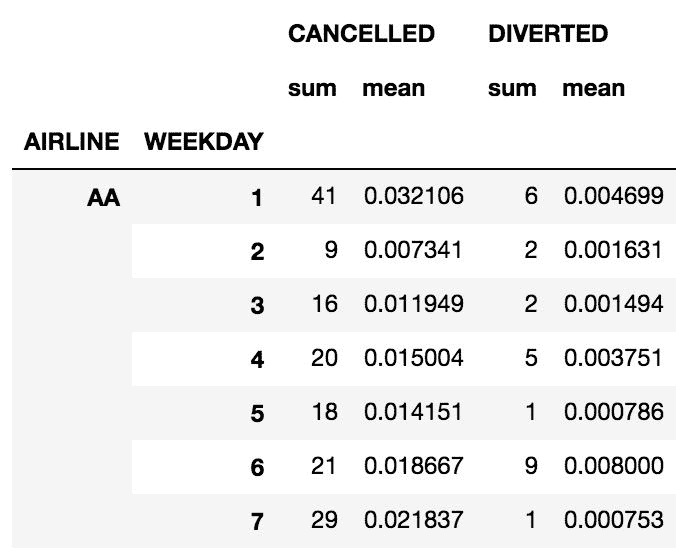

3.  使用`agg`方法中的字典来回答第三个查询，以将特定的聚合列映射到特定的聚合函数：

```py
>>> group_cols = ['ORG_AIR', 'DEST_AIR']
>>> agg_dict = {'CANCELLED':['sum', 'mean', 'size'], 
                'AIR_TIME':['mean', 'var']}
>>> flights.groupby(group_cols).agg(agg_dict).head()
```


# 工作原理

要像步骤 1 一样按多列分组，我们将字符串名称列表传递给`groupby`方法。 `AIRLINE`和`WEEKDAY`的每个唯一组合均形成一个独立的组。 在每个组中，找到已取消航班的总数，然后将其作为系列返回。

步骤 2，再次按`AIRLINE`和`WEEKDAY`分组，但这一次汇总了两列。 它将两个聚合函数`sum`和`mean`中的每一个应用于每个列，从而每组返回四个列。

步骤 3 进一步进行，并使用字典将特定的聚合列映射到不同的聚合函数。 请注意，`size`聚合函数返回每个组的总行数。 这与`count`汇总函数不同，后者会返回每组非缺失值的数量。

# 更多

执行聚合时，会遇到几种主要的语法。 以下四个伪代码块总结了使用`groupby`方法执行聚合的主要方式：

1.  将`agg`与字典一起使用是最灵活的方法，它允许您为每一列指定汇总功能：

```py
>>> df.groupby(['grouping', 'columns']) \
      .agg({'agg_cols1':['list', 'of', 'functions'], 
            'agg_cols2':['other', 'functions']})
```

2.  将`agg`与聚合函数列表一起使用，会将每个函数应用于每个聚合列：

```py
>>> df.groupby(['grouping', 'columns'])['aggregating', 'columns'] \
      .agg([aggregating, functions])
```

3.  直接使用紧随汇总列之后的方法而不是`agg`，仅将该方法应用于每个汇总列。 这种方式不允许多种聚合功能：

```py
>>> df.groupby(['grouping', 'columns'])['aggregating', 'columns'] \
      .aggregating_method()
```

4.  如果您未指定汇总列，则汇总方法将应用于所有非分组列：

```py
>>> df.groupby(['grouping', 'columns']).aggregating_method()
```

在前面的四个代码块中，当按单个列进行分组或聚合时，可以用字符串代替任何列表。

# 分组后删除 MultiIndex

不可避免地，当使用`groupby`时，您可能会在列或行或两者中都创建 MultiIndex。 具有 MultiIndexes 的数据帧更加难以导航，并且有时列名称也令人困惑。

# 准备

在本秘籍中，我们使用`groupby`方法执行聚合，以创建具有行和列 MultiIndex 的数据帧，然后对其进行处理，以使索引为单个级别，并且列名具有描述性。

# 操作步骤

1.  读取航班数据集； 编写声明以查找飞行的总里程和平均里程； 以及每个航空公司在每个工作日的最大和最小到达延误：

```py
>>> flights = pd.read_csv('data/flights.csv')
>>> airline_info = flights.groupby(['AIRLINE', 'WEEKDAY'])\
                          .agg({'DIST':['sum', 'mean'], 
                                'ARR_DELAY':['min', 'max']}) \
                          .astype(int)
>>> airline_info.head(7)
```

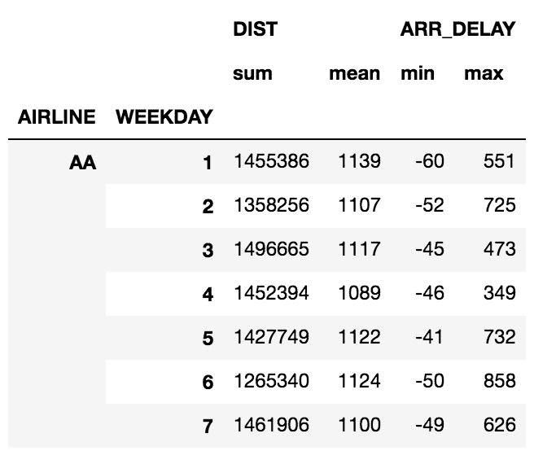

2.  行和列均由具有两个级别的 MultiIndex 标记。 让我们将其压缩到单个级别。 为了解决这些列，我们使用 MultiIndex 方法`get_level_values`。 让我们显示每个级别的输出，然后将两个级别连接起来，然后再将其设置为新的列值：

```py
>>> level0 = airline_info.columns.get_level_values(0)
Index(['DIST', 'DIST', 'ARR_DELAY', 'ARR_DELAY'], dtype='object')

>>> level1 = airline_info.columns.get_level_values(1)
Index(['sum', 'mean', 'min', 'max'], dtype='object')

>>> airline_info.columns = level0 + '_' + level1
>>> airline_info.head(7)
```


3.  使用`reset_index`将行标签返回到单个级别：

```py
>>> airline_info.reset_index().head(7)
```

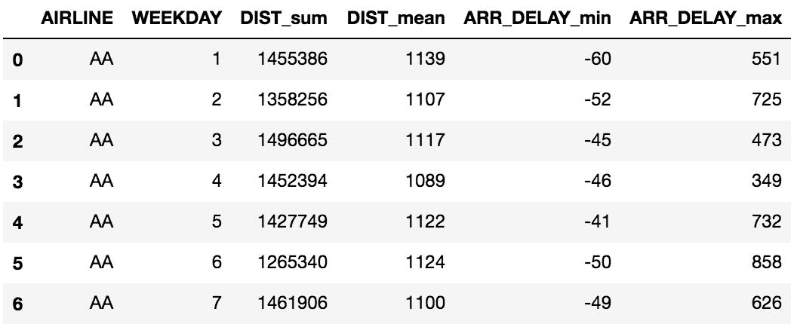

# 工作原理

当使用`agg`方法对多个列执行聚合时，pandas 将创建一个具有两个级别的索引对象。 聚合列变为顶层，聚合功能变为底层。 Pandas 显示的 MultiIndex 级别与单级别的列不同。 除了最里面的**级别**以外，屏幕上不会显示重复的索引值。 您可以检查第 1 步中的数据帧以进行验证。 例如，`DIST`列仅显示一次，但它引用了前两列。

最里面的 MultiIndex 级别是最接近数据的级别。 这将是最底部的列级别和最右边的索引级别。

步骤 2 通过首先使用 MultiIndex 方法`get_level_values.`检索每个级别的基础值来定义新列。此方法接受一个整数，该整数标识索引级别。 它们从顶部/左侧以零开始编号。 索引支持向量化操作，因此我们将两个级别与下划线分开。 我们将这些新值分配给`columns`属性。

在第 3 步中，我们将两个索引级别都设为`reset_index`作为列。 我们可以像在第 2 步中那样将级别串联在一起，但是将它们保留为单独的列更有意义。

# 更多

默认情况下，在 groupby 操作结束时，pandas 将所有分组列放入索引中。 可以将`groupby`方法中的`as_index` 参数设置为`False`，以避免此行为。 您可以在分组后将`reset_index`方法链接起来，以获得与步骤 3 中相同的效果。让我们看一下其中的一个示例，该示例通过查找每个航空公司从每个航班出发的平均距离来得出：

```py
>>> flights.groupby(['AIRLINE'], as_index=False)['DIST'].agg('mean') \
                                                        .round(0)
```

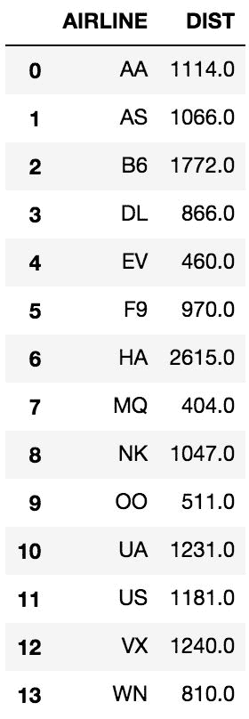

看一下先前结果中航空公司的顺序。 默认情况下，pandas 对分组列进行排序。 `sort`参数存在于`groupby`方法中，并且默认为`True`。 您可以将其设置为`False`，以使分组列的顺序与在数据集中遇到分组列的顺序相同。 通过不对数据进行排序，您还将获得较小的性能提升。

# 自定义聚合功能

Pandas 提供了许多最常见的聚合功能，供您与 groupby 对象一起使用。 在某些时候，您将需要编写自己的自定义用户定义函数，而这些函数在 pandas 或 NumPy 中不存在。

# 准备

在此秘籍中，我们使用大学数据集来计算每个州的本科生人数的均值和标准差。 然后，我们使用此信息从每个状态的任何单一总体值的均值中找到最大标准差数。

# 操作步骤

1.  读取大学数据集，并按州找到本科人口的均值和标准差：

```py
>>> college = pd.read_csv('data/college.csv')
>>> college.groupby('STABBR')['UGDS'].agg(['mean', 'std']) \
                                     .round(0).head()
```

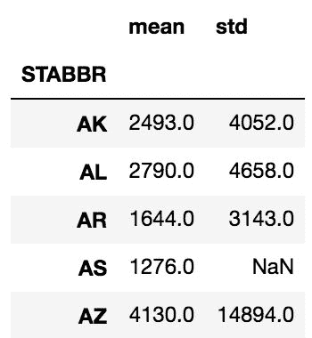

2.  这个输出不是我们想要的。 我们不是在寻找整个组的均值和标准差，而是寻找任何一个机构的均值的最大标准差数。 为了计算这一点，我们需要从每个机构的本科生人数中减去各州的本科生平均人数，然后除以标准差。 这使每个群体的本科生人数标准化。 然后，我们可以利用这些分数的绝对值的最大值来找到距离均值最远的那个。 Pandas 不提供能够执行此操作的功能。 相反，我们将需要创建一个自定义函数：

```py
>>> def max_deviation(s):
        std_score = (s - s.mean()) / s.std()
        return std_score.abs().max()
```

3.  定义函数后，将其直接传递给`agg`方法以完成聚合：

```py
>>> college.groupby('STABBR')['UGDS'].agg(max_deviation) \
                                     .round(1).head()
STABBR
AK    2.6
AL    5.8
AR    6.3
AS    NaN
AZ    9.9
Name: UGDS, dtype: float64
```

# 工作原理

不存在预定义的 Pandas 函数来计算偏离均值的最大标准偏差数。 我们被迫在步骤 2 中构造一个自定义函数。请注意，此自定义函数`max_deviation`接受单个参数`s`。 展望第 3 步，您会注意到函数名称位于`agg`方法内，而没有直接调用。 参数 `s` 没有明确传递给 `max_deviation` 的地方。 相反，Pandas 将`UGDS`列作为系列隐式传递给 `max_deviation` 。

每个组都会调用一次`max_deviation`函数。 由于`s`是系列，因此所有常规的序列方法均可用。 在称为**标准化**的过程中，从组中的每个值中减去该特定组的平均值，然后再除以标准差。

标准化是一种常见的统计过程，用于了解各个值与平均值之间的差异。 对于正态分布，数据的 99.7% 位于平均值的三个标准差之内。

由于我们对均值的绝对偏差感兴趣，因此我们从所有标准化得分中获取绝对值并返回最大值。 `agg`方法必须从我们的自定义函数中返回单个标量值，否则将引发异常。 Pandas 默认使用样本标准偏差，该样本标准偏差对于只有单个值的任何组均未定义。 例如，州缩写`AS`（美属萨摩亚）返回了缺失值，因为它在数据集中只有一个机构。

# 更多

可以将我们的自定义函数应用于多个聚合列。 我们只需将更多列名称添加到索引运算符。 `max_deviation`函数仅适用于数字列：

```py
>>> college.groupby('STABBR')['UGDS', 'SATVRMID', 'SATMTMID'] \
           .agg(max_deviation).round(1).head()
```

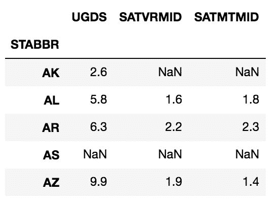

您还可以将自定义的聚合函数与预构建函数一起使用。 以下是按国家和宗教派别进行的分组：

```py
>>> college.groupby(['STABBR', 'RELAFFIL']) \
            ['UGDS', 'SATVRMID', 'SATMTMID'] \
           .agg([max_deviation, 'mean', 'std']).round(1).head()
```

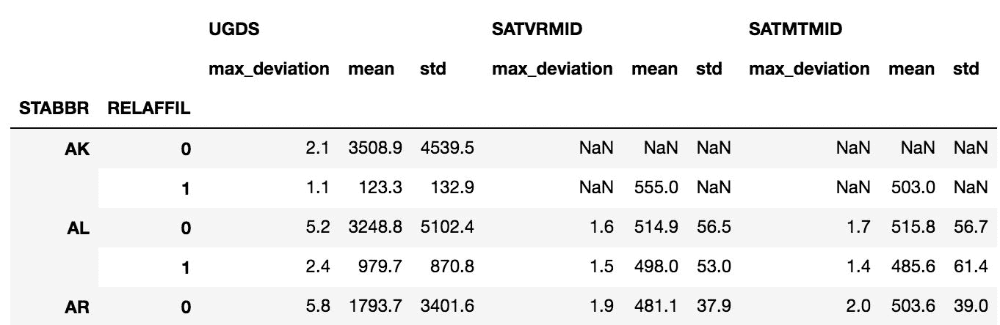

请注意，pandas 使用函数名称作为返回列的名称。 您可以使用重命名方法直接更改列名称，也可以修改特殊功能属性`__name__`：

```py
>>> max_deviation.__name__
'max_deviation'

>>> max_deviation.__name__ = 'Max Deviation'
>>> college.groupby(['STABBR', 'RELAFFIL']) \
            ['UGDS', 'SATVRMID', 'SATMTMID'] \
           .agg([max_deviation, 'mean', 'std']).round(1).head()
```

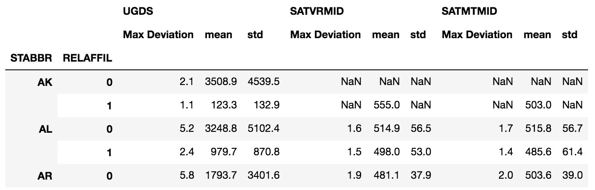

# 使用* args 和** kwargs 自定义聚合函数

在编写自己的用户定义的自定义聚合函数时，pandas 隐式地将每个聚合列作为一个系列一次传递给它。 有时，您将需要向函数传递的参数不仅仅是序列本身。 为此，您需要了解 Python 将任意数量的参数传递给函数的能力。 在`inspect`模块的帮助下，让我们看一下 groupby 对象的`agg`方法的签名：

```py
>>> college = pd.read_csv('data/college.csv')
>>> grouped = college.groupby(['STABBR', 'RELAFFIL'])

>>> import inspect
>>> inspect.signature(grouped.agg)
<Signature (arg, *args, **kwargs)>
```

参数`*args`允许您将任意数量的非关键字参数传递给自定义的聚合函数。 同样，`**kwargs`允许您传递任意数量的关键字参数。

# 准备

在此秘籍中，我们为大学数据集构建了一个自定义函数，该函数可按州和宗教隶属关系找到本科生人口在两个值之间的学校所占的百分比。

# 操作步骤

1.  定义一个函数，该函数返回大学人口在 1000 至 3,000 之间的学校的百分比：

```py
>>> def pct_between_1_3k(s):
        return s.between(1000, 3000).mean()
```

2.  计算按州和宗教归属分类的百分比：

```py
>>> college.groupby(['STABBR', 'RELAFFIL'])['UGDS'] \
           .agg(pct_between_1_3k).head(9)
STABBR  RELAFFIL
AK      0           0.142857
        1           0.000000
AL      0           0.236111
        1           0.333333
AR      0           0.279412
        1           0.111111
AS      0           1.000000
AZ      0           0.096774
        1           0.000000
Name: UGDS, dtype: float64
```

3.  该功能可以正常工作，但不能给用户提供选择上下限的灵活性。 让我们创建一个新功能，该功能允许用户定义以下范围：

```py
>>> def pct_between(s, low, high):
        return s.between(low, high).mean()
```

4.  将此上限和下限传递给`agg`方法：

```py
>>> college.groupby(['STABBR', 'RELAFFIL'])['UGDS'] \
           .agg(pct_between, 1000, 10000).head(9)
STABBR  RELAFFIL
AK      0           0.428571
        1           0.000000
AL      0           0.458333
        1           0.375000
AR      0           0.397059
        1           0.166667
AS      0           1.000000
AZ      0           0.233871
        1           0.111111
Name: UGDS, dtype: float64
```

# 工作原理

步骤 1 创建一个不接受任何额外参数的函数。 上下限必须硬编码到函数本身中，这不是很灵活。 步骤 2 显示了此聚合的结果。

我们在第 3 步中创建了一个更加灵活的功能，该功能允许用户动态定义上下限。 步骤 4 是`*args`和`**kwargs`的魔力发挥作用的地方。 在此特定示例中，我们将两个非关键字参数 1,000 和 10,000 传递给`agg`方法。 Pandas 分别将这两个参数传递给`pct_between`的`low`和`high`参数。

在步骤 4 中，有几种方法可以达到相同的结果。我们可以在以下命令中明确使用参数名称来产生相同的结果：

```py
>>> college.groupby(['STABBR', 'RELAFFIL'])['UGDS'] \
           .agg(pct_between, high=10000, low=1000).head(9)
```

关键字参数的顺序并不重要，只要它们位于函数名称之后即可。 更进一步，我们可以混合使用非关键字和关键字参数，只要关键字参数排在最后即可：

```py
>>> college.groupby(['STABBR', 'RELAFFIL'])['UGDS'] \
           .agg(pct_between, 1000, high=10000).head(9)
```

为了便于理解，最好按函数签名中定义的顺序包含所有参数名称。

Technically, when `agg` is called, all the non-keyword arguments get collected into a tuple named `args` and all the keyword arguments get collected into a dictionary named `kwargs`.

# 更多

不幸的是，当同时使用多个聚合函数时，Pandas 没有直接使用这些附加参数的方法。 例如，如果您希望使用`pct_between`和`mean`函数进行汇总，则会出现以下异常：

```py
>>> college.groupby(['STABBR', 'RELAFFIL'])['UGDS'] \
           .agg(['mean', pct_between], low=100, high=1000) 
TypeError: pct_between() missing 2 required positional arguments: 'low' and 'high'
```

Pandas 无法理解需要将额外的参数传递给`pct_between`。 为了将我们的自定义函数与其他内置函数甚至其他自定义函数一起使用，我们可以定义一种称为**闭包**的特殊类型的嵌套函数。 我们可以使用通用闭包来构建所有自定义函数：

```py
>>> def make_agg_func(func, name, *args, **kwargs):
        def wrapper(x):
            return func(x, *args, **kwargs)
        wrapper.__name__ = name
        return wrapper

>>> my_agg1 = make_agg_func(pct_between, 'pct_1_3k', low=1000, high=3000)
>>> my_agg2 = make_agg_func(pct_between, 'pct_10_30k', 10000, 30000)

>>> college.groupby(['STABBR', 'RELAFFIL'])['UGDS'] \
           .agg(['mean', my_agg1, my_agg2]).head()
```

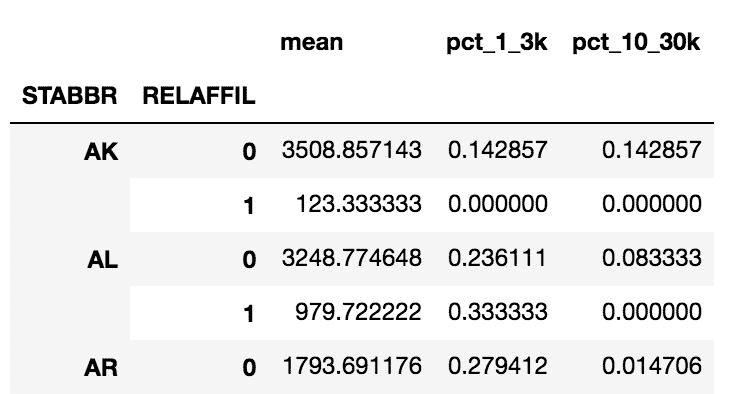

`make_agg_func`函数充当创建自定义聚合功能的工厂。 它接受您已经构建的自定义聚合函数（在这种情况下为`pct_between`），`name`参数以及任意数量的额外参数。 它返回一个已经设置了额外参数的函数。 例如，`my_agg1`是一个特定的定制汇总功能，可以找到大学人口在一千到三千之间的学校所占的百分比。 额外的参数（ `*args` 和 `**kwargs` ）为您的自定义函数（ `pct_between` ）指定了一组精确的参数 ）。 `name`参数非常重要，每次调用 `make_agg_func` 时必须唯一。 它将最终用于重命名聚合列。

闭包是一个在其中包含一个函数（一个嵌套函数），并返回此嵌套函数的函数。 此嵌套函数必须引用外部函数范围内的变量才能成为闭包。 在此示例中，`make_agg_func`是外部函数，并返回嵌套函数`wrapper`，该函数从外部函数访问变量`func`，`args`和`kwargs`。

# 另见

*   [Python *任意参数列表*文档](https://docs.python.org/3/tutorial/controlflow.html#arbitrary-argument-lists)
*   [Python *闭包*教程](http://www.geeksforgeeks.org/python-closures/)

# 检查 groupby 对象

在数据帧上使用`groupby`方法的直接结果将是一个 groupby 对象。 通常，我们将继续对该对象进行操作以进行聚合或转换，而无需将其保存到变量中。 在中，检查此 groupby 对象的主要目的是检查单个组。

# 准备

在本秘籍中，我们通过直接在其上调用方法以及遍历其每个组来检查 groupby 对象本身。

# 操作步骤

1.  首先，将大学数据集中的州和宗教隶属关系列进行分组，然后将结果保存到变量中并确认其类型：

```py
>>> college = pd.read_csv('data/college.csv')
>>> grouped = college.groupby(['STABBR', 'RELAFFIL'])
>>> type(grouped)
pandas.core.groupby.DataFrameGroupBy
```

2.  使用`dir`函数发现其所有可用功能：

```py
>>> print([attr for attr in dir(grouped) if not attr.startswith('_')])
['CITY', 'CURROPER', 'DISTANCEONLY', 'GRAD_DEBT_MDN_SUPP', 'HBCU', 'INSTNM', 'MD_EARN_WNE_P10', 'MENONLY', 'PCTFLOAN', 'PCTPELL', 'PPTUG_EF', 'RELAFFIL', 'SATMTMID', 'SATVRMID', 'STABBR', 'UG25ABV', 'UGDS', 'UGDS_2MOR', 'UGDS_AIAN', 'UGDS_ASIAN', 'UGDS_BLACK', 'UGDS_HISP', 'UGDS_NHPI', 'UGDS_NRA', 'UGDS_UNKN', 'UGDS_WHITE', 'WOMENONLY', 'agg', 'aggregate', 'all', 'any', 'apply', 'backfill', 'bfill', 'boxplot', 'corr', 'corrwith', 'count', 'cov', 'cumcount', 'cummax', 'cummin', 'cumprod', 'cumsum', 'describe', 'diff', 'dtypes', 'expanding', 'ffill', 'fillna', 'filter', 'first', 'get_group', 'groups', 'head', 'hist', 'idxmax', 'idxmin', 'indices', 'last', 'mad', 'max', 'mean', 'median', 'min', 'ndim', 'ngroup', 'ngroups', 'nth', 'nunique', 'ohlc', 'pad', 'pct_change', 'plot', 'prod', 'quantile', 'rank', 'resample', 'rolling', 'sem', 'shift', 'size', 'skew', 'std', 'sum', 'tail', 'take', 'transform', 'tshift', 'var']
```

3.  查找具有`ngroups`属性的组数：

```py
>>> grouped.ngroups
112
```

4.  要查找每个组的唯一标识标签，请查看`groups`属性，该属性包含映射到该组的所有相应索引标签的每个唯一组的字典：

```py
>>> groups = list(grouped.groups.keys())
>>> groups[:6]
[('AK', 0), ('AK', 1), ('AL', 0), ('AL', 1), ('AR', 0), ('AR', 1)]
```

5.  通过将`get_group`方法传递给一个确切的组标签的元组来检索单个组。 例如，要获得佛罗里达州的所有宗教附属学校，请执行以下操作：

```py
>>> grouped.get_group(('FL', 1)).head()
```

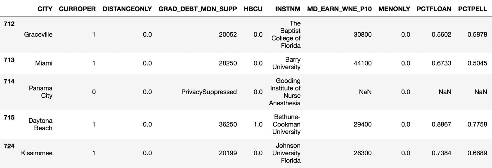

6.  您可能想看看每个单独的组。 这是可能的，因为 groupby 对象是可迭代的：

```py
>>> from IPython.display import display
>>> for name, group in grouped:
        print(name)
        display(group.head(3))
```

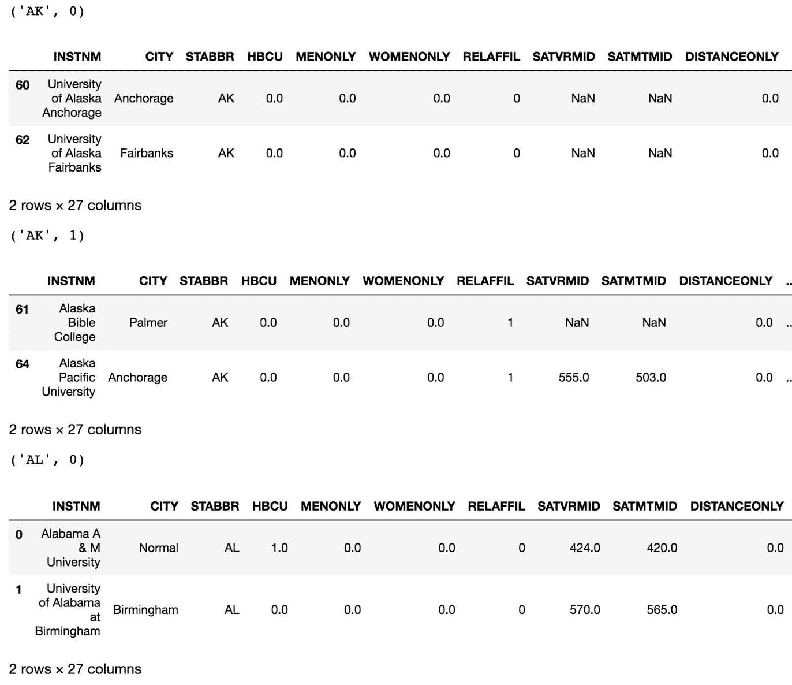

7.  您还可以在 groupby 对象上调用 head 方法，以在单个数据帧中将每个组的第一行放在一起。

```py
>>> grouped.head(2).head(6)
```

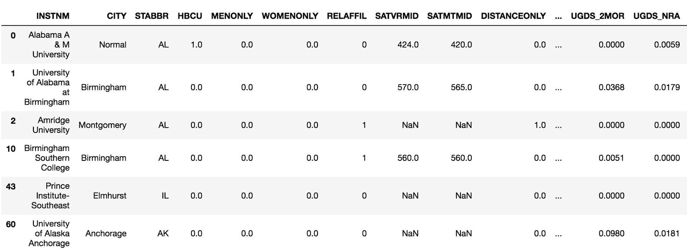

# 工作原理

步骤 1 正式创建了 groupby 对象。 显示所有公共属性和方法以揭示所有可能的功能（如在步骤 2 中所做的那样）很有用。每个组由元组唯一标识，该元组包含分组列中值的唯一组合。 Pandas 允许您使用第 5 步中显示的`get_group`方法选择特定的组作为数据帧。

很少需要遍历整个组，通常，如果有必要，应避免这样做，因为这样做可能会很慢。 有时候，您别无选择。 当通过对象遍历 group 时，将为您提供一个元组，其中包含组名和数据帧，而没有分组列。 在步骤 6 中，此元组在 for 循环中解包为变量`name`和`group`。

在遍历组时可以做的一件有趣的事情是直接在笔记本中显示每个组的几行。 为此，可以使用`IPython.display`模块中的打印功能或`display`函数。 使用`print`函数可得到纯文本格式的数据帧，而没有任何不错的 HTML 格式。 使用`display`函数将以其常规的易于阅读的格式生成数据帧。

# 更多

在步骤 2 的列表中没有探索几种有用的方法。例如`nth`方法，当给定一个整数列表时，该方法从每个组中选择那些特定的行。 例如，以下操作从每个组中选择第一行和最后一行：

```py
>>> grouped.nth([1, -1]).head(8)
```

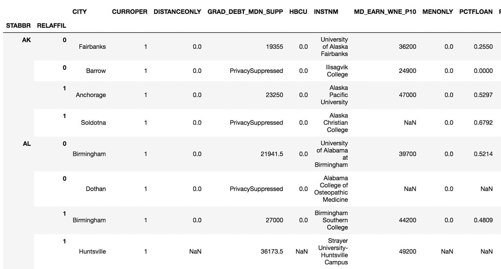

# 另见

*   [IPython `display`函数的官方文档](http://ipython.readthedocs.io/en/stable/api/generated/IPython.display.html#IPython.display.display)

# 筛选少数居多的州

在第 4 章，“选择数据子集”中，我们在过滤掉`False`行之前将每一行标记为`True`或`False`。 以类似的方式，可以在过滤掉`False`组之前将整个数据组标记为`True`或`False`。 为此，我们首先使用`groupby`方法形成组，然后应用`filter`方法。 `filter`方法接受必须返回`True`或`False`来指示是否保留组的函数。

This `filter` method applied after a call to the `groupby` method is completely different than the DataFrame `filter` method covered in the *Selecting columns with methods* recipe from [Chapter 2](../Text/ch02.html#2OM4A0-5686c430c0a9442a82c4c5795c8553c9), *Essential DataFrame Operations*.

# 准备

在此秘籍中，我们使用大学数据集查找非白人大学生比白人多的所有州。 由于这是来自美国的数据集，因此白人占多数，因此，我们正在寻找少数居多的州。

# 操作步骤

1.  读取大学数据集，按州分组，并显示分组总数。 这应该等于从`nunique` Series 方法检索的唯一状态数：

```py
>>> college = pd.read_csv('data/college.csv', index_col='INSTNM')
>>> grouped = college.groupby('STABBR')
>>> grouped.ngroups
59

>>> college['STABBR'].nunique() # verifying the same number
59
```

2.  `grouped`变量具有`filter`方法，该方法接受一个自定义函数来确定是否保留组。 自定义函数将隐式传递给当前组的数据帧，并且需要返回一个布尔值。 我们定义一个函数来计算少数民族学生的总百分比，如果该百分比大于用户定义的阈值，则返回`True`：

```py
>>> def check_minority(df, threshold):
        minority_pct = 1 - df['UGDS_WHITE']
        total_minority = (df['UGDS'] * minority_pct).sum()
        total_ugds = df['UGDS'].sum()
        total_minority_pct = total_minority / total_ugds
        return total_minority_pct > threshold
```

3.  使用`check_minority`函数传递的`filter`方法和 50% 的阈值来查找具有少数多数的所有状态：

```py
>>> college_filtered = grouped.filter(check_minority, threshold=.5)
>>> college_filtered.head()
```

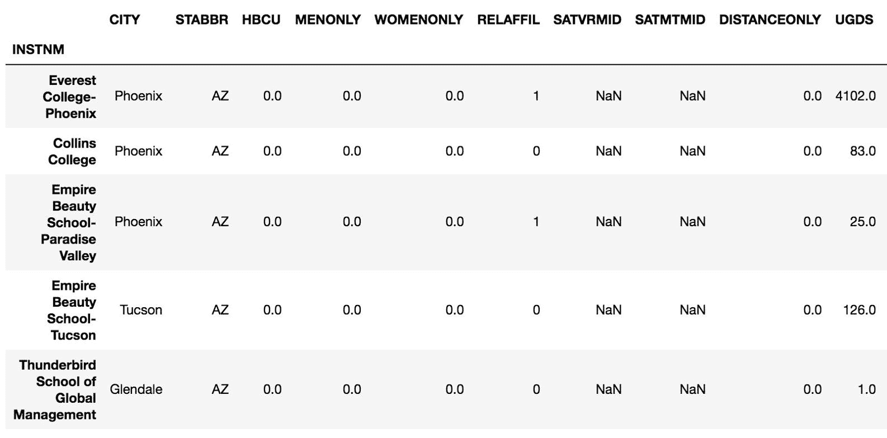

4.  仅查看输出可能并不表示实际发生了什么。数据帧以状态 Arizona（AZ）而不是阿拉斯加（AK）开头，因此我们可以从视觉上确认某些更改。 让我们将此过滤后的数据帧的`shape`与原始数据进行比较。 查看结果，大约 60% 的行已被过滤，仅剩下 20 个州占少数：

```py
>>> college.shape
(7535, 26)

>>> college_filtered.shape
(3028, 26)

>>> college_filtered['STABBR'].nunique()
20
```

# 工作原理

此秘籍以州为单位查看所有机构的总人口。 目标是保留所有州中总体上占少数的所有行。 这要求我们按状态对数据进行分组，这是在步骤 1 中完成的。我们发现有 59 个独立的组。

`filter` groupby 方法将所有行保留在一个组中或将其过滤掉。 它不会更改列数。 `filter` groupby 方法通过用户定义的功能（例如此秘籍中的`check_minority`）执行此关守。 要过滤的一个非常重要的方面是它将特定组的整个数据帧传递给用户定义的函数，并为每个组返回一个布尔值。

在`check_minority`函数内部，首先计算每个机构的非白人学生的百分比和总数，然后找到所有学生的总数。 最后，根据给定的阈值检查整个州的非白人学生百分比，这会产生布尔值。

最终结果是一个数据帧，其列与原始列相同，但过滤掉了不符合阈值的状态中的行。 由于过滤后的数据帧的标题可能与原始标题相同，因此您需要进行一些检查以确保操作成功完成。 我们通过检查行数和唯一状态数来验证这一点。

# 更多

我们的函数`check_minority`是灵活的，并接受参数以降低或提高少数群体阈值的百分比。 让我们检查几个其他阈值的唯一状态的形状和数量：

```py
>>> college_filtered_20 = grouped.filter(check_minority, threshold=.2)
>>> college_filtered_20.shape
(7461, 26)

>>> college_filtered_20['STABBR'].nunique()
57

>>> college_filtered_70 = grouped.filter(check_minority, threshold=.7)
>>> college_filtered_70.shape
(957, 26)

>>> college_filtered_70['STABBR'].nunique()
10
```

# 另见

*   [Pandas *过滤*的官方文档](https://pandas.pydata.org/pandas-docs/stable/groupby.html#filtration)

# 通过减肥赌注转型

增加减肥动机的一种方法是与他人打赌。 此秘籍中的方案将跟踪四个月内两个人的体重减轻情况，并确定获胜者。

# 准备

在此秘籍中，我们使用来自两个人的模拟数据来跟踪四个月内体重减轻的百分比。 在每个月底，将根据当月体重百分比最高的个人宣布获胜者。 要跟踪体重减轻，我们将数据按月和人分组，然后调用`transform`方法以查找从月初起每周每周的体重减轻百分比。

# 操作步骤

1.  读取原始 weight_loss 数据集，并检查两个人`Amy`和`Bob`的第一个月数据。 每月总共有四个称量：

```py
>>> weight_loss = pd.read_csv('data/weight_loss.csv')
>>> weight_loss.query('Month == "Jan"')
```

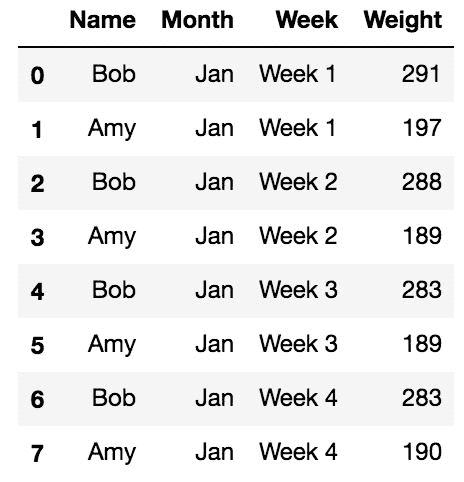

2.  要确定每个月的赢家，我们只需要比较每月第一周到最后一周的减肥效果即可。 但是，如果我们想每周更新一次，我们还可以计算从当前周到每月第一周的体重减轻。 让我们创建一个能够提供每周更新的功能：

```py
>>> def find_perc_loss(s):
        return (s - s.iloc[0]) / s.iloc[0]
```

3.  让我们在一月份为 Bob 测试此功能。

```py
>>> bob_jan = weight_loss.query('Name=="Bob" and Month=="Jan"')
>>> find_perc_loss(bob_jan['Weight'])
0    0.000000
2   -0.010309
4   -0.027491
6   -0.027491
Name: Weight, dtype: float64
```

您应该忽略最后一个输出中的索引值。 0、2、4 和 6 只是引用数据帧的原始行标签，与星期无关。

4.  第一周后，鲍勃体重减轻了 1% 。 他在第二周继续减肥，但在最后一周没有任何进展。 我们可以将此功能应用于人和周的每个单一组合，以获得相对于每月第一周的每周体重减轻。 为此，我们需要将数据按`Name`和`Month`分组，然后使用`transform`方法应用此自定义函数：

```py
>>> pcnt_loss = weight_loss.groupby(['Name', 'Month'])['Weight'] \
                           .transform(find_perc_loss)
>>> pcnt_loss.head(8)
0    0.000000
1    0.000000
2   -0.010309
3   -0.040609
4   -0.027491
5   -0.040609
6   -0.027491
7   -0.035533
Name: Weight, dtype: float64
```

5.  `transform`方法必须返回与调用数据帧具有相同行数的对象。 让我们将此结果作为新列添加到原始数据帧中。 为了帮助缩短输出，我们将选择 Bob 的前两个月的数据：

```py
>>> weight_loss['Perc Weight Loss'] = pcnt_loss.round(3)
>>> weight_loss.query('Name=="Bob" and Month in ["Jan", "Feb"]')
```

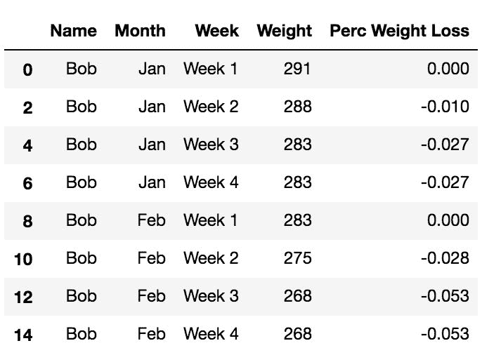

6.  请注意，减肥百分比在新月后重新设置。 通过这个新的专栏，我们可以手动确定获胜者，但让我们看看是否可以找到一种自动执行此操作的方法。 由于唯一重要的一周是最后一周，所以我们选择第 4 周：

```py
>>> week4 = weight_loss.query('Week == "Week 4"')
>>> week4 
```

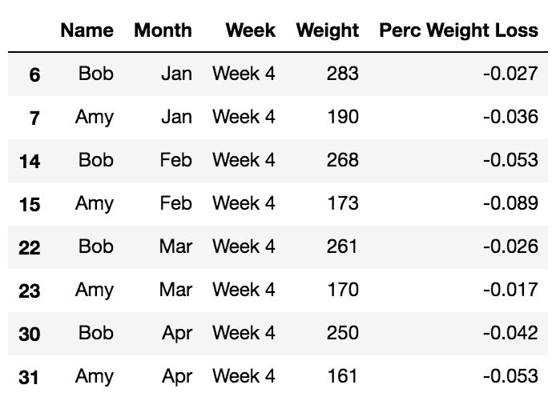

7.  这缩小了周数，但仍然不会自动找出每个月的赢家。 让我们使用`pivot`方法重塑此数据，以便 Bob 和 Amy 每月的体重减轻百分比并排：

```py
>>> winner = week4.pivot(index='Month', columns='Name',
                         values='Perc Weight Loss')
>>> winner
```

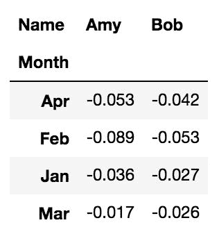

8.  此输出使每个月的获胜者更加清楚，但我们仍然可以走得更远。 NumPy 具有一个称为`where`的矢量化 if-then-else 函数，该函数可以将序列或布尔数组映射到其他值。 让我们为获奖者的名字创建一个列，并突出显示每个月的获奖百分比：

```py
>>> winner['Winner'] = np.where(winner['Amy'] < winner['Bob'],
                                'Amy', 'Bob')
>>> winner.style.highlight_min(axis=1)
```

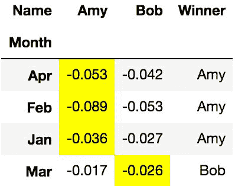

9.  使用`value_counts`方法以赢得的月份数返回最终分数：

```py
>>> winner.Winner.value_counts()
Amy    3
Bob    1
Name: Winner, dtype: int64
```

# 工作原理

在整个秘籍中，`query`方法用于过滤数据，而不是布尔索引。 有关更多信息，请参阅第 5 章，“布尔索引”的“查询方法”秘籍，以提高布尔索引的可读性。

我们的目标是找到每个人每个月的减肥百分比。 一种完成此任务的方法是计算相对于每个月初的每周减肥。 此特定任务非常适合`transform` groupby 方法。 `transform`方法接受一项功能作为其必需的参数。 该函数隐式地传递给每个非分组列（或仅使用在索引运算符中指定的列，如在此秘籍中使用`Weight`所做的那样）。 它必须返回与传递的组长度相同的值序列，否则将引发异常。 本质上，原始数据帧中的所有值都在转换。 没有聚集或过滤发生。

第 2 步创建一个函数，该函数从其所有值中减去传递的序列的第一个值，然后将该结果除以第一个值。 这将计算相对于第一个值的百分比损失（或收益）。 在第 3 步中，我们在一个月内对一个人测试了此功能。

在步骤 4 中，我们在人和周的每个组合上以相同的方式使用此功能。 从字面上看，我们正在将`Weight`列转换为当前一周的体重损失百分比。 为每个人输出第一个月的数据。 Pandas 将新数据作为系列返回。 该系列本身并没有什么用处，并且更有意义地作为新列附加到原始数据帧中。 我们在步骤 5 中完成此操作。

要确定获胜者，只需每月的第 4 周。 我们可以在这里停下来，手动确定获胜者，但 Pandas 提供了自动执行此功能的功能。 第 7 步中的`pivot`函数通过将一列的唯一值转换为新的列名称来重塑我们的数据集。 `index`参数用于您不想旋转的列。 传递给`values`参数的列将平铺在`index`和`columns`参数中列的每个唯一组合上。

只有在`index`和`columns`参数中的列的每种唯一组合仅出现一次时，`pivot`方法才有效。 如果唯一的组合不止一个，则会引发异常。 在这种情况下，您可以使用`pivot_table`方法，该方法允许您将多个值聚合在一起。

枢纽化之后，我们利用高效且快速的 NumPy `where`函数，该函数的第一个参数是产生一系列布尔值的条件。 `True`值映射到`Amy`，`False`值映射到`Bob`。我们突出显示每个月的获胜者，并使用`value_counts`方法统计最终得分。

# 更多

看一下第 7 步中的数据帧输出。您是否注意到月份是按字母顺序而不是按时间顺序排列的？ 不幸的是，至少在这种情况下，Pandas 按字母顺序为我们订购了几个月。 我们可以通过将`Month`的数据类型更改为分类变量来解决此问题。 分类变量将每列的所有值映射为一个整数。 我们可以选择此映射为月份的正常时间顺序。 Pandas 在`pivot`方法期间使用此基础整数映射按时间顺序排列月份：

```py
>>> week4a = week4.copy()
>>> month_chron = week4a['Month'].unique() # or use drop_duplicates
>>> month_chron
array(['Jan', 'Feb', 'Mar', 'Apr'], dtype=object)

>>> week4a['Month'] = pd.Categorical(week4a['Month'],
                                     categories=month_chron,
                                     ordered=True)
>>> week4a.pivot(index='Month', columns='Name',
                 values='Perc Weight Loss')
```


要转换`Month`列，请使用`Categorical`构造函数。 将原始列作为序列传递，并将所有类别的唯一序列按所需顺序传递给`categories`参数。 由于`Month`列已经按时间顺序排列，因此我们可以简单地使用`unique`方法，该方法保留了获取所需数组的顺序。 通常，要按字母顺序以外的其他方式对对象数据类型的列进行排序，请将其转换为类别。

# 另见

*   [Pandas `groupby`*转换*的官方文档](http://pandas.pydata.org/pandas-docs/stable/groupby.html#transformation)
*   [NumPy `where`函数的官方文档](https://docs.scipy.org/doc/numpy/reference/generated/numpy.where.html)

# 计算每个州的 SAT 加权平均成绩

groupby 对象具有四个接受一个或多个函数以对每个组执行计算的方法。 这四种方法是`agg`，`filter`，`transform`和`apply`。 这些方法的前三个方法中的每个方法都有一个非常特定的输出，函数必须返回该输出。 `agg`必须返回标量值，`filter`必须返回布尔值，`transform`必须返回与传递的组长度相同的序列。 但是，`apply`方法可能返回标量值，系列或什至任何形状的数据帧，因此使其非常灵活。 每个组也仅将其称为  ，这与对每个非分组列调用一次的`transform`和`agg`形成对比。 `apply`方法能够同时对多个列进行操作时返回单个对象的能力，使得此秘籍中的计算成为可能。

# 准备

在此秘籍中，我们从大学数据集中计算每个州的数学和口头 SAT 分数的加权平均值。 我们根据每个学校的本科生人数对分数进行加权。

# 操作步骤

1.  读取大学数据集，并在`UGDS`，`SATMTMID`或`SATVRMID`列中删除所有缺少值的行。 这三列中的每一列都必须具有非缺失值：

```py
>>> college = pd.read_csv('data/college.csv')
>>> subset = ['UGDS', 'SATMTMID', 'SATVRMID']
>>> college2 = college.dropna(subset=subset)
>>> college.shape
(7535, 27)

>>> college2.shape
(1184, 27)
```

2.  绝大多数机构没有我们三个必填列的数据，但这仍然足够继续。 接下来，创建一个用户定义的函数以仅计算 SAT 数学分数的加权平均值：

```py
>>> def weighted_math_average(df):
        weighted_math = df['UGDS'] * df['SATMTMID']
        return int(weighted_math.sum() / df['UGDS'].sum())
```

3.  按状态分组，然后将此函数传递给`apply`方法：

```py
>>> college2.groupby('STABBR').apply(weighted_math_average).head()
STABBR
AK    503
AL    536
AR    529
AZ    569
CA    564
dtype: int64
```

4.  我们成功为每个组返回了一个标量值。 让我们绕个小弯路，将相同的函数传递给`agg`方法，看看结果如何：

```py
>>> college2.groupby('STABBR').agg(weighted_math_average).head()
```

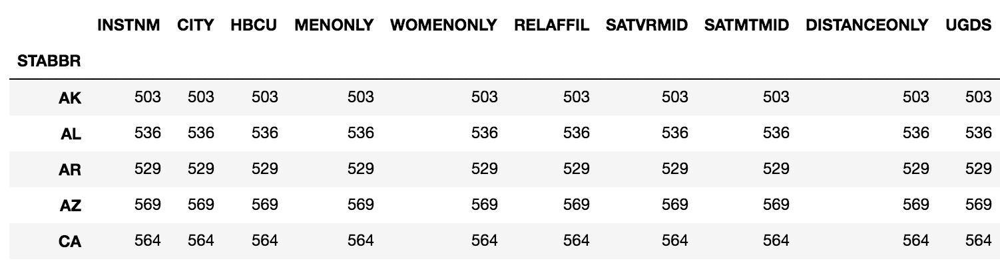

5.  `weighted_math_average`函数将应用于数据帧中的每个非聚合列。 如果尝试将列限制为`SATMTMID`，则将出现错误，因为您将无法访问`UGDS`。 因此，完成对多列操作的最佳方法是使用`apply`：

```py
>>> college2.groupby('STABBR')['SATMTMID'] \
            .agg(weighted_math_average)
KeyError: 'UGDS'
```

6.  `apply`的一个不错的功能是您可以通过返回一个序列来创建多个新列。 此返回的序列的索引将是新的列名。 让我们修改一下函数，以计算两个 SAT 分数的加权平均值和算术平均值，以及每个组中机构数量的计数。 我们以系列返回以下五个值：

```py
>>> from collections import OrderedDict
>>> def weighted_average(df):
        data = OrderedDict()
        weight_m = df['UGDS'] * df['SATMTMID']
        weight_v = df['UGDS'] * df['SATVRMID']

        wm_avg = weight_m.sum() / df['UGDS'].sum()
        wv_avg = weight_v.sum() / df['UGDS'].sum()

        data['weighted_math_avg'] = wm_avg
        data['weighted_verbal_avg'] = wv_avg
        data['math_avg'] = df['SATMTMID'].mean()
        data['verbal_avg'] = df['SATVRMID'].mean()
        data['count'] = len(df)
        return pd.Series(data, dtype='int')

>>> college2.groupby('STABBR').apply(weighted_average).head(10)
```

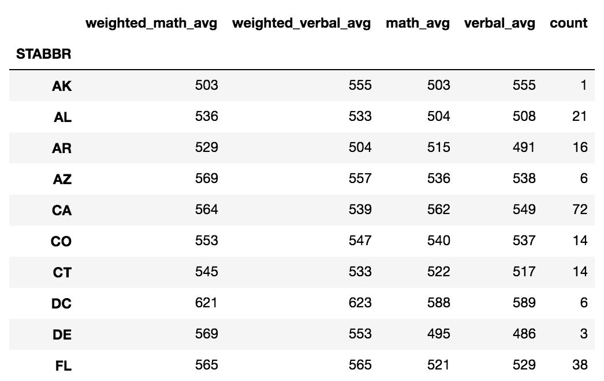

# 工作原理

为了正确完成此秘籍，我们需要首先过滤没有`UGDS`，`SATMTMID`和`SATVRMID`值缺失的机构。 默认情况下，`dropna`方法删除具有一个或多个缺失值的行。 我们必须使用`subset`参数来限制其查找缺少值的列。

在第 2 步中，我们定义一个仅计算`SATMTMID`列的加权平均值的函数。 加权平均值与算术平均值的不同之处在于，每个值都乘以一定的权重。 然后将这个数量相加并除以权重之和。 在这种情况下，我们的体重就是在校学生人数。

在第 3 步中，我们将此函数传递给`apply`方法。 我们的函数`weighted_math_average`传递了每个组所有原始列的数据帧。 它返回单个标量值，即`SATMTMID`的加权平均值。 此时，您可能认为可以使用`agg`方法进行此计算。 用`agg`直接替换`apply`不起作用，因为`agg`返回其每个聚合列的值。

It actually is possible to use `agg` indirectly by precomputing the multiplication of `UGDS` and `SATMTMID`.

步骤 6 确实显示了`apply`的多功能性。 我们构建了一个新函数，该函数计算两个 SAT 列的加权平均值和算术平均值以及每个组的行数。 为了使`apply`创建多个列，您必须返回一个序列。 索引值用作结果数据帧中的列名。 您可以使用此方法返回任意多个值。

请注意，`OrderedDict`类是从`collections`模块导入的，该模块是标准库的一部分。 该有序字典用于存储数据。 普通的 Python 字典不能用来存储数据，因为它不保留插入顺序。

The constructor, `pd.Series`, does have an index parameter that you can use to specify order but using an `OrderedDict` is cleaner.

# 更多

在此秘籍中，我们为每个组返回一行作为系列。 通过返回数据帧，可以为每个组返回任意数量的行和列。 除了查找算术和加权均值之外，我们还查找两个 SAT 列的几何和谐波均值，然后将结果作为数据帧返回，其中数据行是均值类型的名称，列是 SAT 类型。 为了减轻我们的负担，我们使用 NumPy 函数`average`来计算加权平均值，并使用 SciPy 函数`gmean`和`hmean`来计算几何和调和平均值：

```py
>>> from scipy.stats import gmean, hmean
>>> def calculate_means(df):
        df_means = pd.DataFrame(index=['Arithmetic', 'Weighted',
                                       'Geometric', 'Harmonic'])
        cols = ['SATMTMID', 'SATVRMID']
        for col in cols:
            arithmetic = df[col].mean()
            weighted = np.average(df[col], weights=df['UGDS'])
            geometric = gmean(df[col])
            harmonic = hmean(df[col])
            df_means[col] = [arithmetic, weighted,
                             geometric, harmonic]

        df_means['count'] = len(df)
        return df_means.astype(int)

>>> college2.groupby('STABBR').apply(calculate_means).head(12)
```

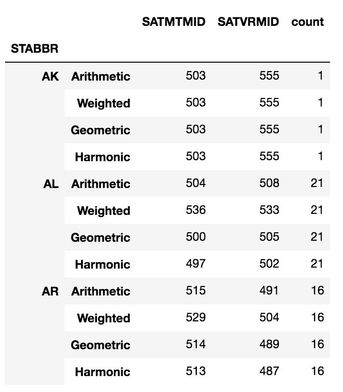

# 另见

*   [Pandas `apply`和`groupby`方法的官方文档](http://pandas.pydata.org/pandas-docs/stable/groupby.html#flexible-apply)
*   [Python `OrderedDict`类的官方文档](https://docs.python.org/3/library/collections.html#collections.OrderedDict)
*   [SciPy `stats`模块的官方文档](https://docs.scipy.org/doc/scipy/reference/stats.html)

# 按连续变量分组

在对 Pandas 进行分组时，通常使用具有离散重复值的列。 如果没有重复的值，则分组将毫无意义，因为每个组只有一行。 连续数字列通常具有很少的重复值，并且通常不用于形成组。 但是，如果我们可以将具有连续值的列转换为离散列，方法是将每个值放入一个 bin 中，四舍五入或使用其他映射，则将它们分组是有意义的。

# 准备

在此秘籍中，我们探索航班数据集以发现不同旅行距离的航空公司分布。 例如，这使我们能够找到在 500 到 1,000 英里之间飞行最多的航空公司。 为此，我们使用 Pandas`cut`函数离散化每次飞行的距离。

# 操作步骤

1.  读取航班数据集，并输出前五行：

```py
>>> flights = pd.read_csv('data/flights.csv')
>>> flights.head()
```

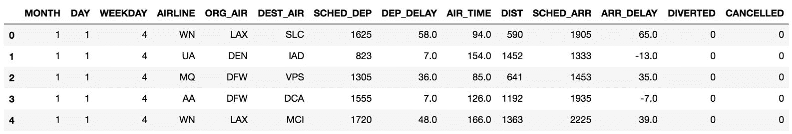

2.  如果要查找一定距离范围内的航空公司分布，则需要将`DIST`列的值放入离散的 bin 中。 让我们使用 pandas `cut`函数将数据分为五个 bin：

```py
>>> bins = [-np.inf, 200, 500, 1000, 2000, np.inf]
>>> cuts = pd.cut(flights['DIST'], bins=bins)
>>> cuts.head()
0     (500.0, 1000.0]
1    (1000.0, 2000.0]
2     (500.0, 1000.0]
3    (1000.0, 2000.0]
4    (1000.0, 2000.0]
Name: DIST, dtype: category
Categories (5, interval[float64]): [(-inf, 200.0] < (200.0, 500.0] < (500.0, 1000.0] < (1000.0, 2000.0] < (2000.0, inf]]
```

3.  创建有序的分类系列。 为了帮助您了解发生了什么，让我们计算每个类别的值：

```py
>>> cuts.value_counts()
(500.0, 1000.0]     20659
(200.0, 500.0]      15874
(1000.0, 2000.0]    14186
(2000.0, inf]        4054
(-inf, 200.0]        3719
Name: DIST, dtype: int64
```

4.  `cuts`系列现在可以用于形成组。 Pandas 允许您以任何希望的方式来分组。 将`cuts`系列传递到`groupby`方法，然后在`AIRLINE`列上调用`value_counts`方法以查找每个距离组的分布。 请注意，SkyWest（`OO`）组成了少于 200 英里的航班的 33%，但仅占 200 到 500 英里之间的航班的 16%：

```py
>>> flights.groupby(cuts)['AIRLINE'].value_counts(normalize=True) \
                                    .round(3).head(15)
DIST            AIRLINE
(-inf, 200.0]   OO         0.326
                EV         0.289
                MQ         0.211
                DL         0.086
                AA         0.052
                UA         0.027
                WN         0.009
(200.0, 500.0]  WN         0.194
                DL         0.189
                OO         0.159
                EV         0.156
                MQ         0.100
                AA         0.071
                UA         0.062
                VX         0.028
Name: AIRLINE, dtype: float64
```

# 工作原理

在步骤 2 中，`cut`函数将`DIST`列的每个值放入五个仓位之一。 箱由定义边缘的六个数字序列创建。 您总是需要比容器数多一个边缘。 您可以为`bins`参数传递一个整数，该整数将自动创建该数目的等宽槽。 NumPy 中提供了负无穷大对象和正无穷大对象，并确保将所有值放置在 bin 中。 如果您的值在箱边缘之外，则将使它们丢失并且不会放置在箱中。

`cuts`变量现在是一系列五个有序类别。 它具有所有常规的序列方法，在步骤 3 中，使用`value_counts`方法来了解其分布。

非常有趣的是，pandas 允许您将`groupby`方法传递给任何对象。 这意味着您可以从与当前数据帧完全无关的内容中形成组。 在这里，我们将`cuts`变量中的值分组。 对于每个分组，我们通过将`normalize`设置为`True`，以`value_counts`查找每个航空公司的航班百分比。

从这个结果可以得出一些有趣的见解。 从全部结果来看，SkyWest 是领先的航空公司，飞行距离不到 200 英里，但没有超过 2,000 英里的航班。 相比之下，美国航空公司在 200 英里以下的航班中排名第五，但到目前为止，在 1,000 到 2,000 英里之间的航班最多。

# 更多

当按`cuts`变量分组时，我们可以找到更多结果。 例如，我们可以为每个距离分组找到第 25、50 和 75% 的通话时间。 由于通话时间以分钟为单位，因此我们可以除以 60 得到小时：

```py
>>> flights.groupby(cuts)['AIR_TIME'].quantile(q=[.25, .5, .75]) \
                                     .div(60).round(2)
DIST                  
(-inf, 200.0]     0.25    0.43
                  0.50    0.50
                  0.75    0.57
(200.0, 500.0]    0.25    0.77
                  0.50    0.92
                  0.75    1.05
(500.0, 1000.0]   0.25    1.43
                  0.50    1.65
                  0.75    1.92
(1000.0, 2000.0]  0.25    2.50
                  0.50    2.93
                  0.75    3.40
(2000.0, inf]     0.25    4.30
                  0.50    4.70
                  0.75    5.03
Name: AIR_TIME, dtype: float64
```

当使用`cut`函数时，我们可以使用此信息来创建内容丰富的字符串标签。 这些标签代替了间隔符号。 我们还可以链接`unstack`方法，该方法将内部索引级别转换为列名称：

```py
>>> labels=['Under an Hour', '1 Hour', '1-2 Hours',
            '2-4 Hours', '4+ Hours']
>>> cuts2 = pd.cut(flights['DIST'], bins=bins, labels=labels)
>>> flights.groupby(cuts2)['AIRLINE'].value_counts(normalize=True) \
                                     .round(3) \
                                     .unstack() \
                                     .style.highlight_max(axis=1)
```

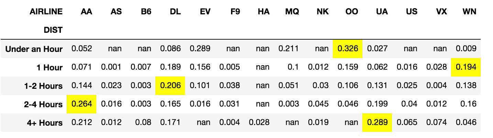

# 另见

*   [Pandas `cut`函数的官方文档](https://pandas.pydata.org/pandas-docs/stable/generated/pandas.cut.html)
*   更多秘籍请参考第 8 章， “将数据整理为整齐的格式”

# 计算城市之间的航班总数

在航班数据集中，我们具有始发地和目的地机场的数据。 例如，计算从休斯敦出发并降落在亚特兰大的航班数量是微不足道的。 更困难的是计算两个城市之间的航班总数，而不管始发地或目的地是哪一个。

# 准备

在此秘籍中，我们计算两个城市之间的航班总数，而不管始发地或目的地是哪个。 为此，我们按字母顺序对始发和目的地机场进行排序，以使机场的每种组合始终以相同的顺序出现。 然后，我们可以使用这种新的列安排来形成组，然后进行计数。

# 操作步骤

1.  读取航班数据集，并找到每个始发地与目的地机场之间的航班总数：

```py
>>> flights = pd.read_csv('data/flights.csv')
>>> flights_ct = flights.groupby(['ORG_AIR', 'DEST_AIR']).size()
>>> flights_ct.head()
ORG_AIR  DEST_AIR
ATL      ABE         31
         ABQ         16
         ABY         19
         ACY          6
         AEX         40
dtype: int64
```

2.  选择在两个方向上的休斯顿（`IAH`）和亚特兰大（`ATL`）之间的航班总数：

```py
>>> flights_ct.loc[[('ATL', 'IAH'), ('IAH', 'ATL')]]
ORG_AIR  DEST_AIR
ATL      IAH         121
IAH      ATL         148
dtype: int64
```

3.  我们可以简单地将这两个数字相加得出城市之间的总航班，但是有一种更有效，更自动化的解决方案可以适用于所有航班。 让我们按照字母顺序对每一行的起点和终点城市进行独立排序：

```py
>>> flights_sort = flights[['ORG_AIR', 'DEST_AIR']] \
                          .apply(sorted, axis=1)
>>> flights_sort.head()
```

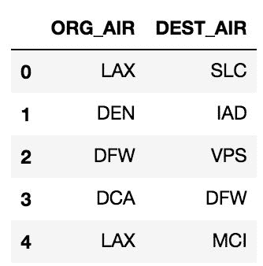

4.  现在，每行都已独立排序，列名不正确。 让我们将其重命名为更通用的名称，然后再次找到所有城市之间的航班总数：

```py
>>> rename_dict = {'ORG_AIR':'AIR1', 'DEST_AIR':'AIR2'}
>>> flights_sort = flights_sort.rename(columns=rename_dict)
>>> flights_ct2 = flights_sort.groupby(['AIR1', 'AIR2']).size()
>>> flights_ct2.head()
AIR1  AIR2
ABE   ATL     31
      ORD     24
ABI   DFW     74
ABQ   ATL     16
      DEN     46
dtype: int64
```

5.  让我们选择亚特兰大和休斯顿之间的所有航班，并验证其是否与步骤 2 中的值之和匹配：

```py
>>> flights_ct2.loc[('ATL', 'IAH')]
269
```

6.  如果我们尝试选择休斯顿和亚特兰大的航班，则会出现错误：

```py
>>> flights_ct2.loc[('IAH', 'ATL')]
IndexingError: Too many indexers
```

# 工作原理

在第 1 步中，我们按起点和目的地机场列形成分组，然后将`size`方法应用于 groupby 对象，该对象仅返回每个组的总行数。 请注意，我们可以将字符串`size`传递给`agg`方法以获得相同的结果。 在步骤 2 中，选择了亚特兰大和休斯顿之间每个方向的航班总数。 系列`flights_count`具有两个级别的 MultiIndex。 从 MultiIndex 中选择行的一种方法是将`loc`索引运算符传递给精确级别值的元组。 在这里，我们实际上选择了两个不同的行`('ATL', 'HOU')`和`('HOU', 'ATL')`。 我们使用元组列表来正确执行此操作。

步骤 3 是秘籍中最相关的步骤。 对于亚特兰大和休斯顿之间的所有航班，我们只希望有一个标签，到目前为止，我们有两个标签。 如果我们按字母顺序对出发地和目的地机场的每种组合进行排序，那么我们将为机场之间的航班使用一个标签。 为此，我们使用 DataFrame `apply`方法。 这与 groupby `apply`方法不同。 在步骤 3 中没有形成组。

必须向 DataFrame `apply`方法传递一个函数。 在这种情况下，它是内置的`sorted`函数。 默认情况下，此函数作为系列应用于每个列。 我们可以使用`axis=1`（或`axis='index'`）来改变计算方向。 `sorted`函数将每行数据隐式地作为系列传递给它。 它返回已排序的机场代码的列表。 这是将第一行作为序列传递给排序函数的示例：

```py
>>> sorted(flights.loc[0, ['ORG_AIR', 'DEST_AIR']])
['LAX', 'SLC']
```

`apply`方法以这种确切的方式使用`sorted`遍历所有行。 完成此操作后，将对每一行进行独立排序。 列名现在已无意义。 我们在下一步中对列名称进行重命名，然后执行与步骤 2 中相同的分组和汇总。这次，亚特兰大和休斯顿之间的所有航班都属于同一标签。

# 更多

您可能想知道为什么我们不能使用更简单的`sort_values` Series 方法。 此方法不是独立进行排序，而是将行或列保留为单个记录，就像在进行数据分析时所期望的那样。 步骤 3 是非常昂贵的操作，需要几秒钟才能完成。 只有大约 60,000 行，因此该解决方案无法很好地扩展到更大的数据。 呼叫

步骤 3 是非常昂贵的操作，需要几秒钟才能完成。 只有大约 60,000 行，因此该解决方案无法很好地扩展到更大的数据。 在所有 Pandas 中，用`axis=1`调用`apply`方法是性能最低的操作之一。 在内部，Pandas 在每行上循环，不会因 NumPy 提供任何速度提升。 如果可能，请避免将`apply`与`axis=1`一起使用。

使用 NumPy `sort`函数可以大大提高速度。 让我们继续使用此功能并分析其输出。 默认情况下，它将对每一行进行独立排序：

```py
>>> data_sorted = np.sort(flights[['ORG_AIR', 'DEST_AIR']])
>>> data_sorted[:10]
array([['LAX', 'SLC'],
       ['DEN', 'IAD'],
       ['DFW', 'VPS'],
       ['DCA', 'DFW'],
       ['LAX', 'MCI'],
       ['IAH', 'SAN'],
       ['DFW', 'MSY'],
       ['PHX', 'SFO'],
       ['ORD', 'STL'],
       ['IAH', 'SJC']], dtype=object)
```

返回二维 NumPy 数组。 NumPy 并不容易进行分组操作，因此让我们使用数据帧构造函数创建一个新的数据帧并检查它是否等于步骤 3 中的`flights_sorted` DataFrame：

```py
>>> flights_sort2 = pd.DataFrame(data_sorted, columns=['AIR1', 'AIR2'])
>>> fs_orig = flights_sort.rename(columns={'ORG_AIR':'AIR1',
                                           'DEST_AIR':'AIR2'})
>>> flights_sort2.equals(fs_orig)
True
```

由于数据帧相同，因此您可以将第 3 步替换为先前的更快排序例程。 我们来计时一下每种不同的排序方法之间的区别：

```py
>>> %%timeit 
>>> flights_sort = flights[['ORG_AIR', 'DEST_AIR']] \
                          .apply(sorted, axis=1)
7.41 s ± 189 ms per loop (mean ± std. dev. of 7 runs, 1 loop each)

>>> %%timeit
>>> data_sorted = np.sort(flights[['ORG_AIR', 'DEST_AIR']])
>>> flights_sort2 = pd.DataFrame(data_sorted,
                                 columns=['AIR1', 'AIR2'])
10.6 ms ± 453 µs per loop (mean ± std. dev. of 7 runs, 100 loops each)
```

NumPy 解决方案的速度比对 Pandas 使用`apply`快 700 倍。

# 另见

*   [NumPy `sort`函数的官方文档](https://docs.scipy.org/doc/numpy/reference/generated/numpy.sort.html)

# 寻找最长的准时航班

对于航空公司而言，最重要的指标之一是其准时飞行绩效。 美国联邦航空管理局（Federal Aviation Administration）认为，航班在比原定抵达时间至少晚 15 分钟后才抵达。 Pandas 有直接的方法来计算每个航空公司的准时航班总数和百分比。 尽管这些基本摘要统计数据是一个重要的指标，但是还有其他一些重要的计算很有趣，例如，找出每个航空公司在其始发机场的连续准点飞行时间。

# 准备

在此秘籍中，我们找到了每个始发机场的每家航空公司的最长连续航班准点率。 这要求列中的每个值都必须知道紧随其后的值。 为了将条纹应用到每个组之前，我们巧妙地使用了`diff`和`cumsum`方法来发现条纹。

# 操作步骤

1.  在开始实际的航班数据集之前，让我们练习计算带有少量样本系列的航班的条纹：

```py
>>> s = pd.Series([0, 1, 1, 0, 1, 1, 1, 0])
>>> s
0    0
1    1
2    1
3    0
4    1
5    1
6    1
7    0
dtype: int64
```

2.  我们对 1 的条纹的最终表示将是与原始序列相同长度的系列，每个条纹从 1 开始独立计数。 首先，我们使用`cumsum`方法：

```py
>>> s1 = s.cumsum()
>>> s1
0    0
1    1
2    2
3    2
4    3
5    4
6    5
7    5
dtype: int64
```

3.  现在，我们已经积累了系列赛中的所有比赛。 让我们将此系列乘以原始系列：

```py
>>> s.mul(s1)
0    0
1    1
2    2
3    0
4    3
5    4
6    5
7    0
dtype: int64
```

4.  我们最初只有一个非零值。 这个结果非常接近我们的期望。 我们只需要重新开始每个连胜，而不是从累加的总和开始。 让我们链接`diff`方法，该方法从当前值中减去前一个值：

```py
>>> s.mul(s1).diff()
0    NaN
1    1.0
2    1.0
3   -2.0
4    3.0
5    1.0
6    1.0
7   -5.0
dtype: float64
```

5.  负值表示条纹结束。 我们需要将负值向下传播到序列上，并使用它们减去步骤 2 中多余的累加。为此，我们将使用`where`方法使所有非负值都丢失：

```py
>>> s.mul(s1).diff().where(lambda x: x < 0)
0    NaN
1    NaN
2    NaN
3   -2.0
4    NaN
5    NaN
6    NaN
7   -5.0
dtype: float64
```

6.  现在，我们可以使用`ffill`方法向下传播这些值：

```py
>>> s.mul(s1).diff().where(lambda x: x < 0).ffill()
0    NaN
1    NaN
2    NaN
3   -2.0
4   -2.0
5   -2.0
6   -2.0
7   -5.0
dtype: float64
```

7.  最后，我们可以将此系列添加回`s1`，以清除多余的累积量：

```py
>>> s.mul(s1).diff().where(lambda x: x < 0).ffill() \
     .add(s1, fill_value=0)
0    0.0
1    1.0
2    2.0
3    0.0
4    1.0
5    2.0
6    3.0
7    0.0
dtype: float64
```

8.  现在我们有了一个连续工作的条纹查找器，我们可以找到每个航空公司和始发机场最长的条纹。 让我们读入航班数据集并创建一列以表示准时到达：

```py
>>> flights = pd.read_csv('data/flights.csv')
>>> flights['ON_TIME'] = flights['ARR_DELAY'].lt(15).astype(int)
>>> flights[['AIRLINE', 'ORG_AIR', 'ON_TIME']].head(10)
```

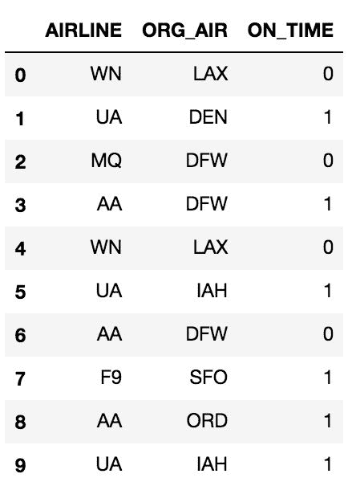

9.  使用前七个步骤中的逻辑来定义一个函数，该函数返回给定序列的最大连胜数：

```py
>>> def max_streak(s):
        s1 = s.cumsum()
        return s.mul(s1).diff().where(lambda x: x < 0) \
                .ffill().add(s1, fill_value=0).max()
```

10.  找出每个航空公司和始发机场的最大准点到达率，以及航班总数和准点到达率。 首先，对一年中的日期和预定的出发时间进行排序：

```py
>>> flights.sort_values(['MONTH', 'DAY', 'SCHED_DEP']) \
           .groupby(['AIRLINE', 'ORG_AIR'])['ON_TIME'] \
           .agg(['mean', 'size', max_streak]).round(2).head()
```

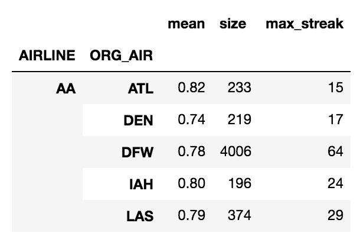

# 工作原理

在 Pandas 中查找数据中的条纹并不是一项简单的操作，需要先行或后行的方法，例如`diff`或`shift`，或记住当前状态的方法，例如`cumsum`。 前七个步骤的最终结果是序列的长度与原始序列的长度相同，可以跟踪所有连续的序列。 在这些步骤中，我们使用`mul`和`add` 方法代替它们的等效运算符（`*`）和（`+`）。 我认为，这样可以使计算从左到右的过程更加简洁。 您当然可以将它们替换为实际的运算符。

理想情况下，我们希望告诉 Pandas 在每个条纹开始时都应用`cumsum`方法，并在每个条纹结束后重新设置自身。 要将此信息传达给 Pandas，需要采取许多步骤。 第 2 步将整个系列中的所有结果累积起来。 其余步骤将慢慢清除所有多余的累积。 为了识别这种多余的累积，我们需要找到每个条纹的末尾并从下一个条纹的开始减去该值。

要找到每个条纹的结尾，请通过在步骤 3 中将`s1`乘以原始零系列和 1 来巧妙地使所有值不属于条纹零。 条纹。 很好，但是同样，我们需要消除多余的累积。 知道条纹结束的地方并不能使我们到达那里。

在第 4 步中，我们使用`diff`方法来查找此多余部分。 `diff`方法获取当前值与位于距离其一定行数的任何值之间的差。 默认情况下，返回当前值与前一个值之间的差。

在步骤 4 中，只有负值才有意义。那些是连续结束后的值。 这些值需要向下传播，直到后续条纹结束。 为了消除（丢失）所有我们不关心的值，我们使用`where`方法，该方法采用一系列与调用序列大小相同的条件。 默认情况下，所有`True`值保持不变，而`False`值丢失。 `where`方法允许您通过将函数作为第一个参数来将调用系列用作条件的一部分。 使用一个匿名函数，该函数隐式传递给调用序列，并检查每个值是否小于零。 第 5 步的结果是一个序列，其中仅保留负值，其余更改为 missing。

步骤 6 中的`ffill`方法将缺失值替换为在系列中前进/后退的最后一个非缺失值。 由于前三个值不跟随非缺失值，因此它们仍然丢失。 我们终于有了消除多余积蓄的系列。 我们将累加系列添加到步骤 6 的结果中，以使条纹全部从零开始。 `add`方法允许我们用`fill_value`参数替换缺少的值。 这样就完成了在数据集中查找条纹的过程。 当执行这样的复杂逻辑时，最好使用一个小的数据集，在此您可以知道最终的输出是什么。 从第 8 步开始并在分组时建立这种寻路逻辑将是非常困难的任务。

在步骤 8 中，我们创建`ON_TIME`列。 值得注意的一项是，已取消的排期缺少`ARR_DELAY`的值，该值未通过布尔条件，因此`ON_TIME`列的值为零。 取消的航班与延迟的航班一样。

第 9 步将我们的逻辑从前七个步骤转变为一个函数，并链接`max`方法以返回最长的条纹。 由于我们的函数返回单个值，因此它正式是一个聚合函数，可以按照步骤 10 的操作传递给`agg`方法。为确保我们正在查看实际的连续航班，我们使用`sort_values`方法按日期和预定的出发时间进行排序。

# 更多

既然我们找到了准点到达时间最长的条纹，我们可以轻松地找到相反的地方-延迟到达的最长条纹。 以下函数为传递给它的每个组返回两行。 第一行是条纹的起点，最后一行是条纹的终点。 每行包含开始/结束条纹的月份和日期，以及条纹的总长度：

```py
>>> def max_delay_streak(df):
        df = df.reset_index(drop=True)
        s = 1 - df['ON_TIME']
        s1 = s.cumsum()
        streak = s.mul(s1).diff().where(lambda x: x < 0) \
                  .ffill().add(s1, fill_value=0)
        last_idx = streak.idxmax()
        first_idx = last_idx - streak.max() + 1
        df_return = df.loc[[first_idx, last_idx], ['MONTH', 'DAY']]
        df_return['streak'] = streak.max()
        df_return.index = ['first', 'last']
        df_return.index.name='type'
        return df_return

>>> flights.sort_values(['MONTH', 'DAY', 'SCHED_DEP']) \
           .groupby(['AIRLINE', 'ORG_AIR']) \
           .apply(max_delay_streak) \
           .sort_values('streak', ascending=False).head(10)
```

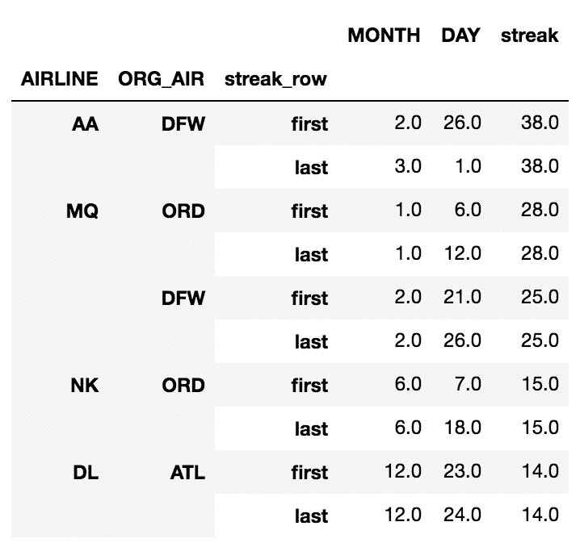

当我们使用`apply` groupby 方法时，每个组的数据帧都传递给`max_delay_streak`函数。 在此函数内部，删除了数据帧的索引并用`RangeIndex`代替，以便我们轻松找到条纹的第一行和最后一行。 反转`ON_TIME`列，然后使用相同的逻辑查找延迟飞行的条纹。 条纹的第一行和最后一行的索引存储为变量。 然后，这些索引用于选择条纹结束的月份和日期。 我们使用数据帧返回结果。 我们标记并命名索引以使最终结果更清晰。

我们的最终结果显示了最长的延迟条纹以及第一和最后一个日期。 让我们进行调查，看看是否可以找出导致这些延迟的原因。 天气恶劣是航班延误或取消的常见原因。 从第一行开始，美国航空（AA）从达拉斯沃思堡（DFW）机场开始连续 38 班延误航班，始于 2015 年 2 月 26 日至 2015 年 3 月 1 日。查看 2015 年 2 月 27 日的历史天气数据 ，降雪量为 2 英寸，[这是当天的记录](http://bit.ly/2iLGsCg)。 [这是 DFW 的主要天气事件](http://bit.ly/2wmsHPj)，并给整个城市造成了严重问题。 请注意，DFW 出现了第三次最长的连胜纪录，但这次是几天前，并且是另一家航空公司。

# 另见

*   请参阅第 1 章，“Pandas 基础”的“将运算符与序列一起使用”秘籍
*   [Pandas `ffill`的官方文档](http://bit.ly/2gn5zGU)