# 将数据重组为整齐的表格

在本章中，我们将介绍以下主题：

*   使用`stack`将变量值整理为列名
*   使用`melt`将变量值整理为列名
*   同时堆叠多组变量
*   反转堆叠数据
*   `groupby`聚合后拆栈
*   用`groupby`聚合复制`pivot_table`
*   重命名轴级别以方便重塑
*   将多个变量存储为列名时进行整理
*   将多个变量存储为列值时进行整理
*   在同一单元格中存储两个或多个值时进行整理
*   在列名和值中存储变量时进行整理
*   将多个观测单位存储在同一表中时进行整理

# 介绍

前几章中使用的所有数据集都没有做太多或做任何工作来更改其结构。 我们立即开始以原始形状处理数据集。 在开始更详细的分析之前，许多野外的数据集将需要大量的重组。 在某些情况下，整个项目可能只关心格式化数据，以便其他人可以轻松处理它。

有许多术语用于描述数据重组的过程，其中**整齐的数据**是数据科学家最常用的。 整洁的数据是 Hadley Wickham 创造的一个术语，用于描述使分析变得容易进行的数据形式。 本章将涵盖 Hadley 提出的许多想法以及如何用 Pandas 来实现它们。 要了解有关整理数据的更多信息，请阅读 Hadley 的论文（ [http://vita.had.co.nz/papers/tidy-data.pdf](http://vita.had.co.nz/papers/tidy-data.pdf) ）。

什么是整洁的数据？ Hadley 提出了三个简单的指导原则来确定数据集是否整洁：

*   每个变量组成一列
*   每个观察结果排成一行
*   每种观察单位组成一个表格

任何不符合这些准则的数据集都被认为是混乱的。 一旦开始将数据重组为整齐的格式，此定义将变得更有意义，但是现在，我们需要知道什么是变量，观测值和观测单位。

要获得关于变量实际含义的直觉，最好考虑一下变量名称和变量值之间的区别。 变量名称是标签，例如性别，种族，薪水和职位。 变量值是指每次观察都可能发生变化的事物，例如性别中的男性/女性或种族中的白色/黑色。 单个观测值是单个观测单位的所有变量值的集合。 为了帮助了解观察单位可能是什么，请考虑零售商店，该商店具有有关每个交易，员工，客户，物品和商店本身的数据。 这些中的每一个都可以视为观察单位，并且需要自己的表格。 将员工信息（例如，工作时间）与客户信息（例如，花费的金额）组合在同一张表中，将破坏这一整洁的原则。

解决杂乱数据的第一步是在存在杂乱数据时对其进行识别，并且存在无限可能。 Hadley 明确提到了五种最常见的混乱数据类型：

*   列名是值，不是变量名
*   多个变量存储在列名中
*   变量存储在行和列中
*   多种观测单位存储在同一表中
*   一个观察单位存储在多个表中

重要的是要了解，整理数据通常不涉及更改数据集的值，填写缺失的值或进行任何类型的分析。 整理数据涉及更改数据的形状或结构以符合整理原则。 整洁的数据类似于将所有工具都放在工具箱中，而不是随机散布在整个房屋中。 在工具箱中正确放置工具可以轻松完成所有其他任务。 数据格式正确后，进行进一步分析变得容易得多。

一旦发现混乱的数据，您将使用 Pandas 工具来重组数据，使数据整洁。 Pandas 提供给您的主要整洁工具是数据帧方法`stack`，`melt`，`unstack`和`pivot`。 较复杂的整理工作涉及撕裂文本，这需要`str`访问器。 其他辅助方法，例如`rename`，`rename_axis`，`reset_index`和`set_index`，将有助于对整洁的数据进行最终处理。

# 将变量值整理为带有堆栈的列名

为了帮助理解整洁数据和混乱数据之间的差异，让我们看一下一个简单的表格，该表格可能是也可能不是整齐的：

```py
>>> state_fruit = pd.read_csv('data/state_fruit.csv', index_col=0)
>>> state_fruit
```

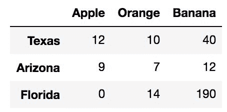

该表似乎没有任何混乱，并且该信息很容易消耗。 但是，按照整洁的原则，它实际上并不是整洁的。 每个列名称实际上是变量的值。 实际上，数据帧中甚至都没有变量名。 将凌乱的数据集转换为整洁的数据的第一步之一就是识别所有变量。 在此特定数据集中，我们具有**状态**和**水果**的变量。 在问题的背景下，还没有找到任何数字数据。 我们可以将此变量标记为**权重**或其他任何明智的名称。

# 准备

这个特定的混乱数据集包含变量值作为列名。 我们将需要将这些列名称转换为列值。 在本食谱中，我们使用`stack`方法将数据帧重组为整齐的形式。

# 操作步骤

1.  首先，请注意，状态名称位于数据帧的索引中。 这些状态正确地垂直放置，不需要重组。 问题是列名。 `stack`方法采用所有列名，并将其整形为垂直，作为单个索引级别：

```py
>>> state_fruit.stack()
Texas    Apple      12
         Orange     10
         Banana     40
Arizona  Apple       9
         Orange      7
         Banana     12
Florida  Apple       0
         Orange     14
         Banana    190
dtype: int64
```

2.  注意，我们现在有了一个带有 MultiIndex 的序列。 现在索引中有两个级别。 原始索引已被推到左侧，以便为旧的列名腾出空间。 使用这一命令，我们现在基本上有了整洁的数据。 每个变量，状态，水果和重量都是垂直的。 让我们使用`reset_index`方法将结果转换为数据帧：

```py
>>> state_fruit_tidy = state_fruit.stack().reset_index()
>>> state_fruit_tidy
```

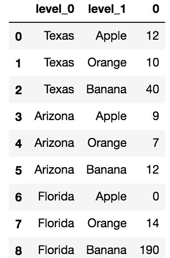

3.  现在我们的结构是正确的，但是列名没有意义。 让我们用适当的标识符替换它们：

```py
>>> state_fruit_tidy.columns = ['state', 'fruit', 'weight']
>>> state_fruit_tidy
```

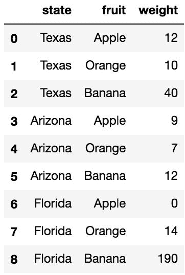

4.  可以直接使用鲜为人知的序列方法`rename_axis`来设置索引级别的名称，而不是直接更改 columns 属性，然后再使用`reset_index`：

```py
>>> state_fruit.stack()\
               .rename_axis(['state', 'fruit'])

state    fruit 
Texas    Apple      12
         Orange     10
         Banana     40
Arizona  Apple       9
         Orange      7
         Banana     12
Florida  Apple       0
         Orange     14
         Banana    190
dtype: int64
```

5.  从这里，我们可以简单地将`reset_index`方法与`name`参数链接起来，以重现步骤 3 的输出：

```py
>>> state_fruit.stack()\
               .rename_axis(['state', 'fruit'])\
               .reset_index(name='weight')
```

# 工作原理

`stack`方法功能强大，需要花费一些时间才能完全理解和欣赏。 它接受所有列名并转置它们，因此它们成为新的最里面的索引级别。 请注意，每个旧列名称仍如何通过与每个状态配对来标记其原始值。 3 x 3 数据框中有 9 个原始值，这些值被转换为具有相同数量值的单个序列。 原始的第一行数据成为结果系列中的前三个值。

在步骤 2 中重置索引后，pandas 将我们的数据帧列默认设置为`level_0`，`level_1`和`0`。 这是因为调用此方法的序列具有两个未正式命名的索引级别。 Pandas 还从外部从零开始按整数引用索引。

步骤 3 显示了一种重命名列的简单直观的方法。 您可以通过将 columns 属性设置为等于列表来简单地为整个数据帧设置新列。

或者，可以通过链接`rename_axis`方法在一个步骤中设置列名称，该方法在将列表作为第一个参数传递时，将这些值用作索引级别名称。 重置索引时，Pandas 使用这些索引级别名称作为新的列名称。 此外，`reset_index`方法具有一个`name`参数，该参数对应于序列值的新列名称。

All Series have a `name` attribute that can be set directly or with the `rename` method. It is this attribute that becomes the column name when using `reset_index`.

# 更多

使用`stack`的关键之一是将所有不希望转换的列都放在索引中。 最初使用索引中的状态读取此配方中的数据集。 让我们看一下如果不将状态读入索引，将会发生什么：

```py
>>> state_fruit2 = pd.read_csv('data/state_fruit2.csv')
>>> state_fruit2
```

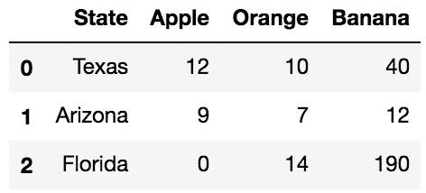

由于状态名称不在索引中，因此在此数据帧上使用`stack`可将所有值整形为一个长值系列：

```py
>>> state_fruit2.stack()
0  State       Texas
   Apple          12
   Orange         10
   Banana         40
1  State     Arizona
   Apple           9
   Orange          7
   Banana         12
2  State     Florida
   Apple           0
   Orange         14
   Banana        190
dtype: object
```

这个命令将重塑所有列，这次包括状态，而这根本不是我们所需要的。 为了正确地重塑此数据，您需要首先使用`set_index`方法将所有未重塑的列放入索引中，然后使用`stack`。 下面的代码与步骤 1 产生相似的结果：

```py
>>> state_fruit2.set_index('State').stack()
```

# 另见

*   有关*重塑和数据透视表*的 Pandas 官方文档（ [http://bit.ly/2xbnNms](http://pandas.pydata.org/pandas-docs/stable/reshaping.html) ）
*   有关`stack`方法的 Pandas 官方文档（ [http://bit.ly/2vWZhH1](https://pandas.pydata.org/pandas-docs/stable/generated/pandas.DataFrame.stack.html) ）

# 使用 melt 将变量值​​整理为列名称

像大多数大型 Python 库一样，Pandas 也有许多不同的方式来完成同一任务-区别通常是可读性和性能。 Pandas 包含一个名为 `melt`的数据帧方法，该的工作原理与先前食谱中介绍的 `stack` 方法相似，但灵活性更高。

Before pandas version 0.20, `melt` was only provided as a function that had to be accessed with `pd.melt`. Pandas is still an evolving library and you need to expect changes with each new version. Pandas has been making a push to move all functions that only operate on DataFrames to methods, such as they did with `melt`. This is the preferred way to use `melt` and the way this recipe uses it. Check the *What's New* part of the pandas documentation to stay up to date with all the changes ([http://bit.ly/2xzXIhG](http://bit.ly/2xzXIhG)).

# 准备

在本食谱中，我们使用`melt`方法来整理一个简单的数据帧，以变量值作为列名。

# 操作步骤

1.  读取`state_fruit2`数据集，并确定哪些列需要转换，哪些列不需要转换：

```py
>>> state_fruit2 = pd.read_csv('data/state_fruit2.csv')
>>> state_fruit2
```


2.  通过将适当的列传递给`id_vars`和`value_vars`参数来使用`melt`方法：

```py
>>> state_fruit2.melt(id_vars=['State'],
                      value_vars=['Apple', 'Orange', 'Banana'])
```

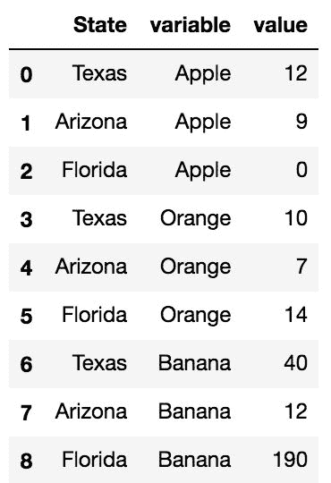

3.  这一步为我们创建了整洁的数据。 默认情况下，`melt`将转换后的前列名称称为*变量*，并将相应的值称为*值*。 方便地，`melt`有两个附加参数`var_name`和`value_name`，它们使您能够重命名这两列：

```py
>>> state_fruit2.melt(id_vars=['State'],
                      value_vars=['Apple', 'Orange', 'Banana'],
                      var_name='Fruit',
                      value_name='Weight')
```

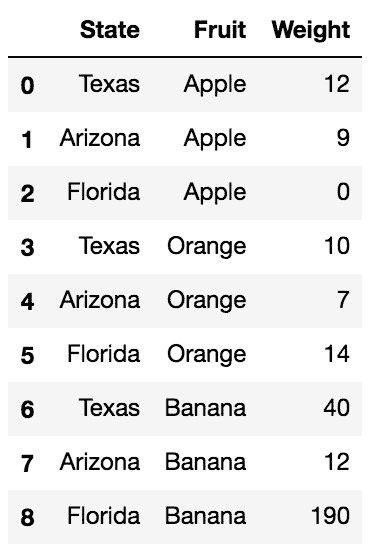

# 工作原理

`melt`方法功能强大，可以显着重塑您的数据帧。 它最多包含五个参数，其中两个参数对于理解如何正确重塑数据至关重要：

*   `id_vars` 是 您要保留为列且不重塑形状的列名列表
*   `value_vars` 是您想要重整为单个列的列名列表

`id_vars`或标识变量保留在同一列中，但对于传递给`value_vars`的每列重复一次。 `melt`的一个关键方面是它忽略索引中的值，实际上，它默默地删除了您的索引并用默认的`RangeIndex`代替了它。 这意味着，如果您确实希望保留索引中的值，那么在使用`melt`之前，需要先重置索引。

It is somewhat common terminology to refer to the transformation of horizontal column names into vertical column values as **melting**, **stacking**, or **unpivoting**.

# 更多

`melt`方法的所有参数都是可选的，并且如果您希望所有值都位于单个列中，而它们的旧列标签位于另一个列中，则可以使用其默认值调用`melt`：

```py
>>> state_fruit2.melt()
```

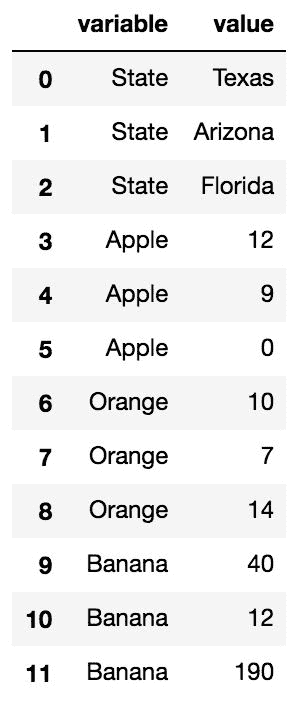

实际上，您可能有很多需要融合的变量，并且只想指定标识变量。 在这种情况下，以以下方式调用`melt`会产生与步骤 2 相同的结果。在融化单个列时，实际上甚至不需要列表，只需传递其字符串值即可：

```py
>>> state_fruit2.melt(id_vars='State')
```

# 另见

*   关于`melt`方法的 Pandas 官方文档（ [http://bit.ly/2vcuZNJ](https://pandas.pydata.org/pandas-docs/stable/generated/pandas.DataFrame.melt.html) ）
*   Pandas 开发人员讨论了将`melt`和其他类似功能转换为方法的问题（ [http://bit.ly/2iqIQhI](https://github.com/pandas-dev/pandas/issues/12640) ）

# 同时堆叠多组变量

一些数据集包含多组变量作为列名，需要同时堆叠到自己的列中。 以`movie`数据集为例可以帮助阐明这一点。 首先，选择包含演员姓名及其对应的 Facebook 点赞的所有列：

```py
>>> movie = pd.read_csv('data/movie.csv')
>>> actor = movie[['movie_title', 'actor_1_name', 
                   'actor_2_name', 'actor_3_name', 
                   'actor_1_facebook_likes',
                   'actor_2_facebook_likes',
                   'actor_3_facebook_likes']]
>>> actor.head()
```

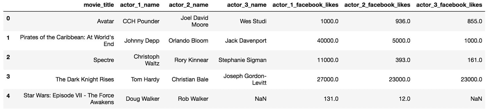

如果我们将变量定义为电影的标题，演员名称和喜欢的 Facebook 人数，那么我们将需要独立地堆叠两组列，而仅通过一次调用`stack`或`melt`。

# 准备

在本食谱中，我们将通过同时堆叠演员名称及其与`wide_to_long`功能相对应的 Facebook 赞来整理`actor` DataFrame。

# 操作步骤

1.  我们将使用通用的`wide_to_long`函数将数据重整为整齐的形式。 要使用此功能，我们将需要更改要堆叠的列名，以使它们以数字结尾。 我们首先创建一个用户定义的函数来更改列名：

```py
>>> def change_col_name(col_name):
        col_name = col_name.replace('_name', '')
        if 'facebook' in col_name:
            fb_idx = col_name.find('facebook')
            col_name = col_name[:5] + col_name[fb_idx - 1:] \
                                    + col_name[5:fb_idx-1]
        return col_name
```

2.  将此函数传递给方法以转换所有列名：

```py
>>> actor2 = actor.rename(columns=change_col_name)
>>> actor2.head()
```

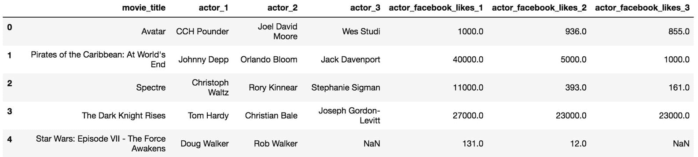

3.  使用`wide_to_long`函数可同时堆叠 actor 和 Facebook 列集：

```py
>>> stubs = ['actor', 'actor_facebook_likes']
>>> actor2_tidy = pd.wide_to_long(actor2, 
                                  stubnames=stubs, 
                                  i=['movie_title'], 
                                  j='actor_num', 
                                  sep='_')
>>> actor2_tidy.head()
```

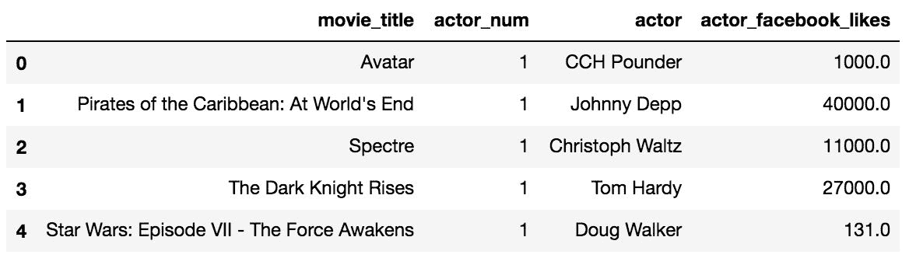

# 工作原理

`wide_to_long` 功能以相当特定的方式工作。 它的主要参数是`stubnames`，它是一个字符串列表。 每个字符串代表一个列分组。 以该字符串开头的所有列都将被堆叠到一个列中。 在此配方中，有两列列： *actor* 和 *actor_facebook_likes* 。 默认情况下，这些列的每个组都需要以数字结尾。 此数字随后将用于标记整形数据。 每个列组都有一个下划线字符，将`stubname`与结尾数字分开。 为此，必须使用`sep`参数。

原始列名称与`wide_to_long`工作所需的模式不匹配。 可以通过使用列表精确指定列名称来手动更改列名称。 这很快就会成为很多类型的输入，因此，我们定义了一个函数，该函数自动将我们的列转换为有效的格式。 `change_col_name` 函数从参与者列中删除 **_ 名称**，并重新排列 Facebook 列，以便现在它们都以数字结尾。

要实际完成列重命名，我们在步骤 2 中使用`rename`方法。它接受许多不同类型的参数，其中之一是函数。 将其传递给函数时，每个列名都会一次隐式传递给它。

现在，我们已经正确地创建了两个独立的列组，即以 **actor** 和 **actor_facebook_likes** 开头的列，它们将被堆叠**。** 除此之外，`wide_to_long`还需要一个唯一列，即参数`i`，用作不会堆叠的标识变量。 还需要参数`j`，该参数仅重命名从原始列名的末尾去除的标识数字。 默认情况下，prefix 参数包含搜索一个或多个数字的**正则表达式**， **\ d +** 。 **\ d** 是与数字 0-9 匹配的特殊令牌。 加号 **+** 使表达式与这些数字中的一个或多个匹配。

To become a powerful user of the `str` methods, you will need to be familiar with regular expressions, which are a sequence of characters that match a particular pattern within some text. They consist of **metacharacters**, which have a special meaning, and **literal** characters. To make yourself useful with regular expressions check this short tutorial from *Regular-Expressions.info* ([http://bit.ly/2wiWPbz](http://bit.ly/2wiWPbz)).

# 更多

当所有变量分组具有相同的数字结尾（如此配方中的数字）时，功能`wide_to_long`起作用。 当您的变量没有相同的结尾或不是以数字结尾时，您仍然可以使用`wide_to_long`同时进行列堆栈。 例如，让我们看一下以下数据集：

```py
>>> df = pd.read_csv('data/stackme.csv')
>>> df
```

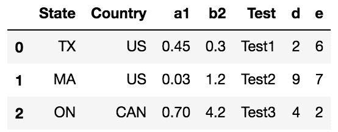

假设我们希望将`a1`和`b1`列以及`d`和`e`列堆叠在一起。 另外，我们想使用`a1`和`b1`作为行的标签。 要完成此任务，我们需要重命名列，以便它们以所需的标签结尾：

```py
>>> df2 = df.rename(columns = {'a1':'group1_a1', 'b2':'group1_b2',
                               'd':'group2_a1', 'e':'group2_b2'})
>>> df2
```

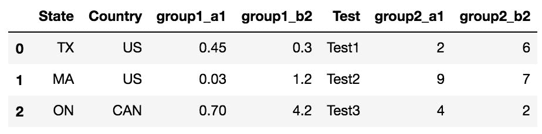

然后，我们需要修改后缀参数，该参数通常默认为选择数字的正则表达式。 在这里，我们只是简单地告诉它找到任意数量的字符：

```py
>>> pd.wide_to_long(df2, 
                    stubnames=['group1', 'group2'], 
                    i=['State', 'Country', 'Test'], 
                    j='Label', 
                    suffix='.+', 
                    sep='_')
```

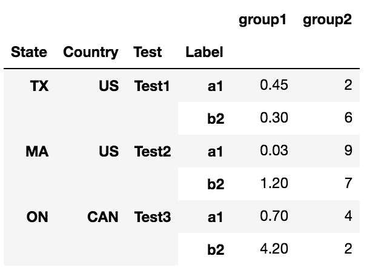

# 另见

*   Pandas `wide_to_long`的官方文档（ [http://bit.ly/2xb8NVP](https://pandas.pydata.org/pandas-docs/stable/generated/pandas.wide_to_long.html) ）

# 反转堆叠数据

DataFrame 具有两种相似的方法`stack`和`melt`，用于将水平列名称转换为垂直列值。 DataFrames 分别具有分别通过`unstack`和`pivot`方法直接反转这两个操作的能力。 `stack` / `unstack`是更简单的方法，仅允许控制列/行索引，而`melt` / `pivot`提供更大的灵活性来选择要重塑的列。

# 准备

在此配方中，我们将`stack` / `melt`一个数据集，并立即将`unstack` / `pivot`的操作转换回其原始形式。

# 操作步骤

1.  读取`college`数据集，以机构名称作为索引，并且仅包含大学生种族栏目：

```py
>>> usecol_func = lambda x: 'UGDS_' in x or x == 'INSTNM'
>>> college = pd.read_csv('data/college.csv', 
                          index_col='INSTNM', 
                          usecols=usecol_func)
>>> college.head()
```

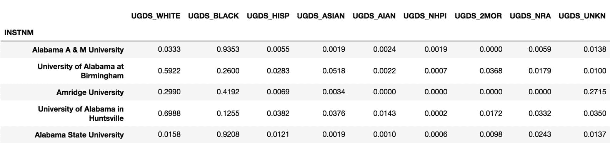

2.  使用`stack`方法将每个水平列名称转换为垂直索引级别：

```py
>>> college_stacked = college.stack()
>>> college_stacked.head(18)
INSTNM                                         
Alabama A &amp; M University         UGDS_WHITE    0.0333
                                     UGDS_BLACK    0.9353
                                     UGDS_HISP     0.0055
                                     UGDS_ASIAN    0.0019
                                     UGDS_AIAN     0.0024
                                     UGDS_NHPI     0.0019
                                     UGDS_2MOR     0.0000
                                     UGDS_NRA      0.0059
                                     UGDS_UNKN     0.0138
University of Alabama at Birmingham  UGDS_WHITE    0.5922
                                     UGDS_BLACK    0.2600
                                     UGDS_HISP     0.0283
                                     UGDS_ASIAN    0.0518
                                     UGDS_AIAN     0.0022
                                     UGDS_NHPI     0.0007
                                     UGDS_2MOR     0.0368
                                     UGDS_NRA      0.0179
                                     UGDS_UNKN     0.0100
dtype: float64
```

3.  使用`unstack` Series 方法将堆叠的数据转换回原始格式：

```py
>>> college_stacked.unstack()
```

4.  可以先执行`melt`，然后执行`pivot`，然后执行类似的操作序列。 首先，读入数据而不将机构名称放在索引中：

```py
>>> college2 = pd.read_csv('data/college.csv', 
                          usecols=usecol_func)
>>> college2.head()
```

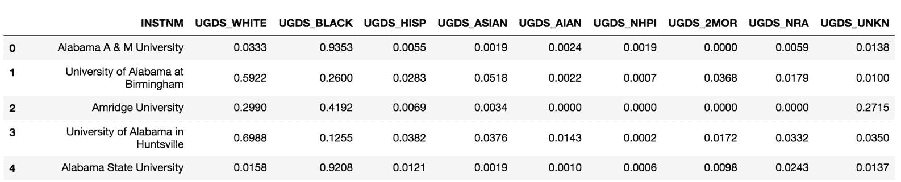

5.  使用`melt`方法将所有竞速列转置为单列：

```py
>>> college_melted = college2.melt(id_vars='INSTNM', 
                                   var_name='Race',
                                   value_name='Percentage')
>>> college_melted.head()
```

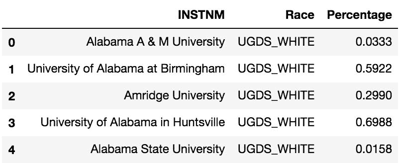

6.  使用`pivot`方法来反转之前的结果：

```py
>>> melted_inv = college_melted.pivot(index='INSTNM', 
                                      columns='Race',
                                      values='Percentage')
>>> melted_inv.head()
```

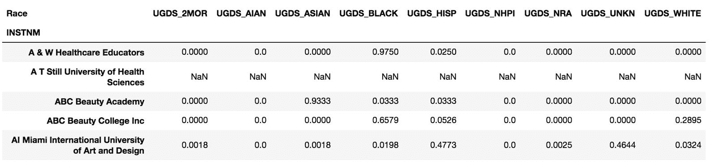

7.  请注意，机构名称现在已转移到索引中，而不是按其原始顺序排列。 列名称不是按其原始顺序。 要从第 4 步中完全复制起始数据帧，请使用`.loc`索引运算符同时选择行和列，然后重置索引：

```py
>>> college2_replication = melted_inv.loc[college2['INSTNM'],
                                          college2.columns[1:]]\
                                     .reset_index()
>>> college2.equals(college2_replication)
True
```

# 工作原理

在步骤 1 中，有多种方法可以完成相同的任务。在这里，我们展示`read_csv`函数的多功能性。 `usecols`参数接受我们要导入的列的列表或动态确定它们的函数。 我们使用匿名函数来检查列名是否包含`UGDS_`或等于`INSTNM`。 该函数以字符串的形式传递给每个列名，并且必须返回一个布尔值。 通过这种方式可以节省大量的内存。

步骤 2 中的`stack`方法将所有列名称放入最里面的索引级别，并返回一个序列。 在步骤 3 中，`unstack`方法通过获取最里面的索引级别中的所有值将它们转换为列名来反转此操作。

The result from step 3 isn't quite an exact replication of step 1\. There are entire rows of missing values, and by default, the `stack` method drops these during step 2\. To keep these missing values and create an exact replication, use `dropna=False` in the `stack` method.

步骤 4 读取与步骤 1 相同的数据集，但没有将机构名称放入索引中，因为`melt`方法无法访问它。 步骤 5 使用`melt`方法转置所有 **Race** 列。 它通过将`value_vars`参数保留为其默认值`None`来执行此操作。 如果未指定，则`id_vars`参数中不存在的所有列都将转置。

步骤 6 用`pivot`方法反转了步骤 5 的操作，该方法接受三个参数。 每个参数都将一列作为字符串。 `index`参数引用的列保持垂直并成为新索引。 `columns`参数引用的列的值成为列名。 `values`参数引用的值将平铺以对应于其先前索引和列标签的交集。

要使用`pivot`进行精确复制，我们需要按照与原始顺序完全相同的顺序对行和列进行排序。 由于机构名称在索引中，因此我们使用`.loc`索引运算符作为通过其原始索引对数据帧进行排序的方式。

# 更多

为了帮助进一步理解`stack` / `unstack`，让我们将它们用于**转置** `college` DataFrame。

In this context, we are using the precise mathematical definition of the transposing of a matrix, where the new rows are the old columns of the original data matrix.

如果您看一下步骤 2 的输出，您会注意到有两个索引级别。 默认情况下，`unstack`方法使用最里面的索引级别作为新的列值。 索引级别从外部从零开始编号。 Pandas 默认将`unstack`方法的`level`参数设置为-1，这是指最里面的索引。 我们可以使用`level=0`代替`unstack`最外面的列：

```py
>>> college.stack().unstack(0)
```

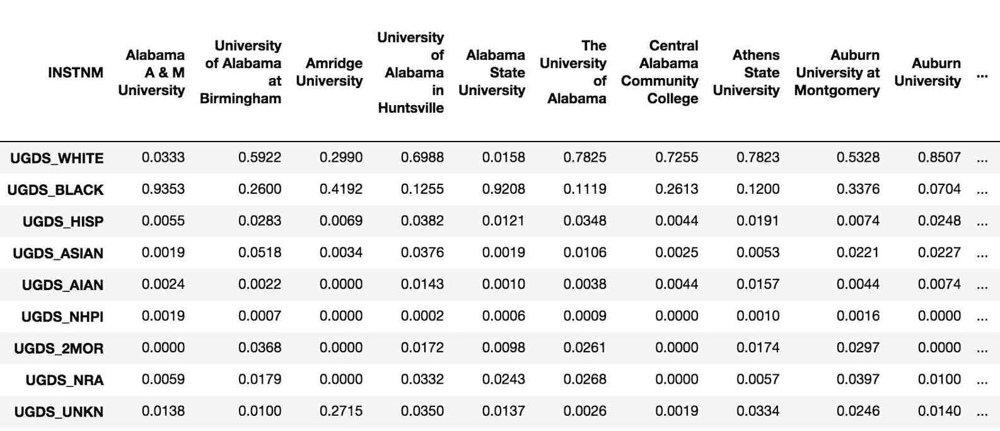

实际上，有一种非常简单的方法可以通过使用`transpose`方法或`T`属性来转置不需要`stack`或`unstack`的数据帧：

```py
>>> college.T
>>> college.transpose()
```

# 另见

*   请参阅*同时选择数据帧行和列[中的](../Text/ch04.html#5DI6C0-5686c430c0a9442a82c4c5795c8553c9)*配方第 4 章，*选择数据子集*
*   Pandas `unstack`（ [http://bit.ly/2xIyFvr](https://pandas.pydata.org/pandas-docs/stable/generated/pandas.DataFrame.unstack.html) ）和`pivot`（ [http://bit.ly/2f3qAWP](https://pandas.pydata.org/pandas-docs/stable/generated/pandas.DataFrame.pivot.html) ）方法的官方文档

# 分组汇总后拆栈

按单个列对数据进行分组并在单个列上执行聚合将返回简单易用的结果，并且易于使用。 当按多个列进行分组时，可能不会以使消耗变得容易的方式来构造结果聚合。 由于默认情况下`groupby`操作将唯一的分组列放在索引中，因此`unstack`方法对于重新排列数据非常有用，以便以对解释更有用的方式显示数据。

# 准备

在此配方中，我们使用`employee`数据集执行聚合，并按多列分组。 然后，我们使用`unstack`方法将结果重塑为一种格式，以便于比较不同组。

# 操作步骤

1.  读取员工数据集，并按种族找到平均工资：

```py
>>> employee = pd.read_csv('data/employee.csv')
>>> employee.groupby('RACE')['BASE_SALARY'].mean().astype(int)
RACE
American Indian or Alaskan Native    60272
Asian/Pacific Islander               61660
Black or African American            50137
Hispanic/Latino                      52345
Others                               51278
White                                64419
Name: BASE_SALARY, dtype: int64
```

2.  这是一个非常简单的`groupby`操作，可产生易于阅读且无需重塑的序列。 现在让我们按性别查找所有种族的平均工资：

```py
>>> agg = employee.groupby(['RACE', 'GENDER'])['BASE_SALARY'] \
                  .mean().astype(int)
>>> agg
RACE                               GENDER
American Indian or Alaskan Native  Female    60238
                                   Male      60305
Asian/Pacific Islander             Female    63226
                                   Male      61033
Black or African American          Female    48915
                                   Male      51082
Hispanic/Latino                    Female    46503
                                   Male      54782
Others                             Female    63785
                                   Male      38771
White                              Female    66793
                                   Male      63940
Name: BASE_SALARY, dtype: int64
```

3.  这种聚合更加复杂，可以进行重塑以简化不同的比较。 例如，如果每个种族并排而不是像现在这样垂直，则比较男性和女性的工资会更容易。 让我们解开性别索引级别：

```py
>>> agg.unstack('GENDER')
```

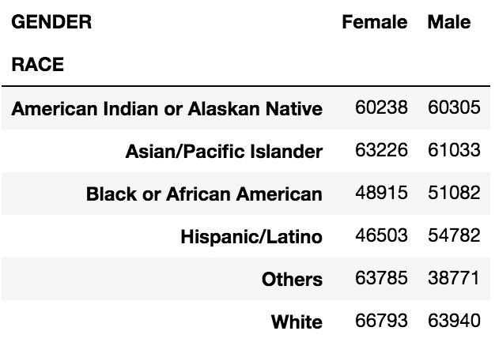

4.  同样，我们可以`unstack`竞赛索引级别：

```py
>>> agg.unstack('RACE')
```

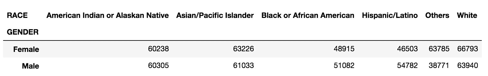

# 工作原理

第 1 步使用单个分组列（`RACE`），单个聚合列（`BASE_SALARY`）和单个聚合函数（`mean`）进行最简单的聚合。 此结果易于使用，不需要任何其他处理即可评估。 第 2 步通过将种族和性别分组在一起，稍微增加了复杂性。 生成的 MultiIndex Series 在一个维中包含所有值，这使得比较更加困难。 为了使信息更易于使用，我们使用`unstack`方法将一个（或多个）级别中的值转换为列。

默认情况下， `unstack` 使用最里面的索引级别作为新列。 您可以使用 `level` 参数指定要取消堆叠的确切级别，该参数接受级别名称作为字符串或级别整数位置。 最好在整数位置上使用级别名称，以避免产生歧义。 第 3 步和第 4 步将每个级别拆栈，这将导致数据帧具有单级索引。 现在，按性别比较每个种族的薪水要容易得多。

# 更多

如果有多个分组和聚合列，则直接结果将是数据帧而不是序列。 例如，让我们计算除平均值以外的更多聚合，如步骤 2 所示：

```py
>>> agg2 = employee.groupby(['RACE', 'GENDER'])['BASE_SALARY'] \
                   .agg(['mean', 'max', 'min']).astype(int)
>>> agg2
```


堆叠**性别**列将产生 MultiIndex 列。 从这里开始，您可以继续使用`unstack`和`stack`方法交换行和列级别，直到获得所需的数据结构为止：

```py
>>> agg2.unstack('GENDER')
```

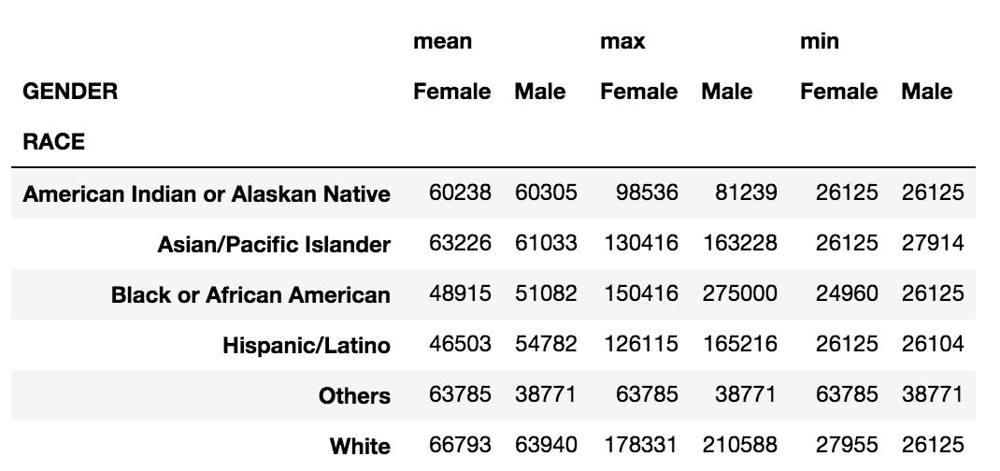

# 另见

*   请参阅*分组和多列聚合* 配方和来自[第 7 章](../Text/ch07.html#A56FQ0-5686c430c0a9442a82c4c5795c8553c9)，*分组进行聚集，过滤和转换的功能*

# 使用 groupby 聚合复制 ivot_table

乍一看，`pivot_table`方法似乎提供了一种独特的数据分析方法。 但是，在进行少量按摩之后，可以使用`groupby`聚合完全复制其功能。 知道这种等效性可以帮助缩小 Pandas 功能的范围。

# 准备

在此配方中，我们使用`flights`数据集创建数据透视表，然后使用`groupby`操作重新创建它。

# 操作步骤

1.  读取航班数据集，并使用`pivot_table`方法查找每个航空公司每个始发机场已取消航班的总数：

```py
>>> flights = pd.read_csv('data/flights.csv')
>>> fp = flights.pivot_table(index='AIRLINE', 
                             columns='ORG_AIR', 
                             values='CANCELLED', 
                             aggfunc='sum',
                             fill_value=0).round(2)
>>> fp.head()
```


2.  `groupby`聚合无法直接复制此表。 诀窍是首先对`index`和`columns`参数中的所有列进行分组：

```py
>>> fg = flights.groupby(['AIRLINE', 'ORG_AIR'])['CANCELLED'].sum()
>>> fg.head()
AIRLINE  ORG_AIR
AA       ATL         3
         DEN         4
         DFW        86
         IAH         3
         LAS         3
Name: CANCELLED, dtype: int64
```

3.  使用`unstack`方法将`ORG_AIR`索引级别转换为列名称：

```py
>>> fg_unstack = fg.unstack('ORG_AIR', fill_value=0)
>>> fp.equals(fg_unstack)
True
```

# 工作原理

`pivot_table`方法非常通用且灵活，但是执行与`groupby`聚合相当相似的操作，其中步骤 1 显示了一个简单示例。 `index`参数采用一列（或多列），该列将不会被透视，并且其唯一值将放置在索引中。 `columns`参数采用一列（或多列），该列将被透视，并且其唯一值将作为列名称。 `values`参数采用将汇总的一列（或多列）。

还存在一个`aggfunc`参数，该参数带有一个或多个聚合函数，这些函数确定`values`参数中的列如何聚合。 它默认为均值，在此示例中，我们将其更改为计算总和。 此外，`AIRLINE`和`ORG_AIR`的某些唯一组合不存在。 这些缺失的组合将默认为结果数据帧中的缺失值。 在这里，我们使用`fill_value`参数将其更改为零。

步骤 2 使用`index`和`columns`参数中的所有列作为分组列开始复制过程。 这是使此配方生效的关键。 数据透视表只是分组列的所有唯一组合的交集。 步骤 3 通过使用`unstack`方法将最里面的索引级别转换为列名来完成复制。 就像`pivot_table`一样，并非`AIRLINE`和`ORG_AIR`的所有组合都存在。 我们再次使用`fill_value`参数将这些缺失的交集强制为零。

# 更多

可以使用`groupby`聚合复制更复杂的数据透视表。 例如，从`pivot_table`中获得以下结果：

```py
>>> flights.pivot_table(index=['AIRLINE', 'MONTH'],
                        columns=['ORG_AIR', 'CANCELLED'],
                        values=['DEP_DELAY', 'DIST'],
                        aggfunc=[np.sum, np.mean],
                        fill_value=0)
```


要使用`groupby`聚合复制此代码，只需遵循配方中的相同模式，并将`index`和`columns`参数中的所有列放入`groupby`方法中，然后将`unstack`列中：

```py
>>> flights.groupby(['AIRLINE', 'MONTH', 'ORG_AIR', 'CANCELLED']) \
           ['DEP_DELAY', 'DIST'] \
           .agg(['mean', 'sum']) \
           .unstack(['ORG_AIR', 'CANCELLED'], fill_value=0) \
           .swaplevel(0, 1, axis='columns')
```

有一些区别。 当像`agg` groupby 方法那样作为列表传递时，`pivot_table`方法不接受聚合函数作为字符串。 相反，您必须使用 NumPy 函数。 列级别的顺序也有所不同，其中`pivot_table`将聚合函数置于`values`参数中列之前的级别。 这与`swaplevel`方法相等，在这种情况下，该方法将切换前两个级别的顺序。

As of the time of writing this book, there is a bug when unstacking more than one column. The `fill_value` parameter is ignored ([http://bit.ly/2jCPnWZ](https://github.com/pandas-dev/pandas/issues/13971)). To work around this bug, chain `.fillna(0)` to the end of the code.

# 重命名轴级别以方便重塑

当每个轴（索引/列）级别具有名称时，使用`stack` / `unstack`方法进行重塑要容易得多。 Pandas 允许用户按整数位置或名称引用每个轴级别。 由于整数位置是隐式的而不是显式的，因此应尽可能考虑使用级别名称。 此建议来自 *Python 的* *Zen* （ [http://bit.ly/2xE83uC](http://bit.ly/2xE83uC) ），这是 Python 的指导原则的简短列表，第二个 一个是*显式优于隐式*。

# 准备

当用多列进行分组或聚合时，所得的 Pandas 对象将在一个或两个轴上具有多个级别。 在本配方中，我们将命名每个轴的每个级别，然后使用`stack` / `unstack`方法将数据显着重塑为所需的形式。

# 操作步骤

1.  阅读大学数据集，并按机构和宗教信仰找到一些关于大学人口和 SAT 数学成绩的基本摘要统计数据：

```py
>>> college = pd.read_csv('data/college.csv')
>>> cg = college.groupby(['STABBR', 'RELAFFIL']) \
                ['UGDS', 'SATMTMID'] \
                .agg(['size', 'min', 'max']).head(6)
```

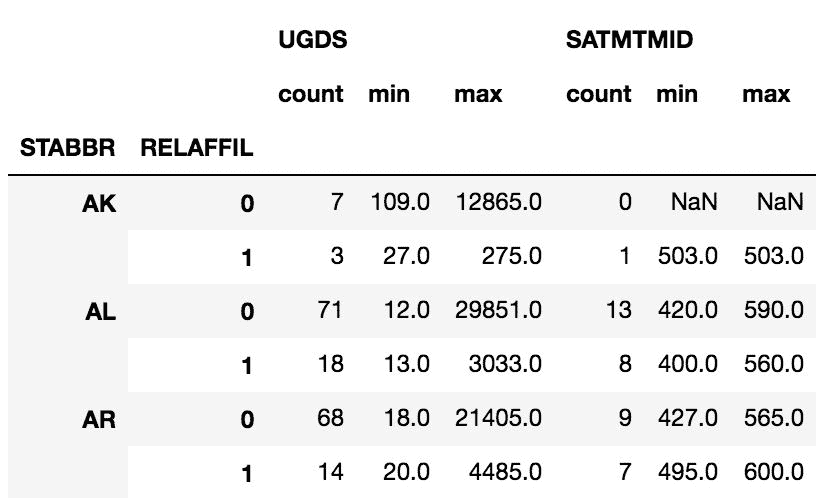

2.  请注意，两个索引级别都有名称，并且都是旧的列名称。 另一方面，列级别没有名称。 使用`rename_axis`方法为它们提供级别名称：

```py
>>> cg = cg.rename_axis(['AGG_COLS', 'AGG_FUNCS'], axis='columns')
>>> cg
```

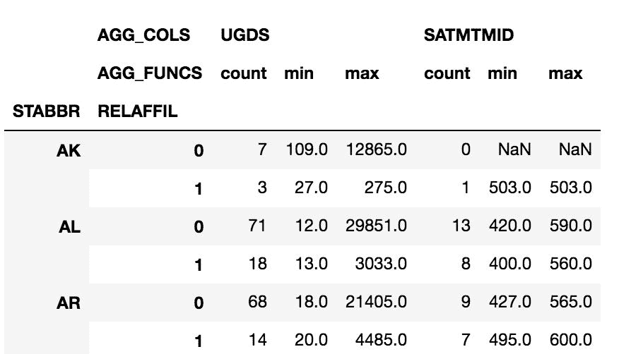

3.  现在每个轴级别都有一个名称，重塑变得轻而易举。 使用`stack`方法将`AGG_FUNCS`列移至索引级别：

```py
>>> cg.stack('AGG_FUNCS').head()
```

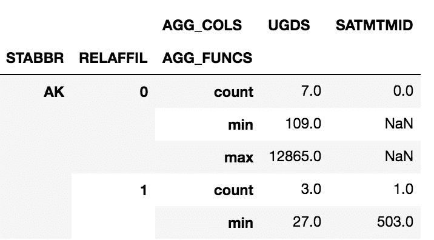

4.  默认情况下，堆叠会将新的列级别放置在最里面的位置。 使用`swaplevel`方法切换电平的位置：

```py
>>> cg.stack('AGG_FUNCS').swaplevel('AGG_FUNCS', 'STABBR',
                                    axis='index').head()
```

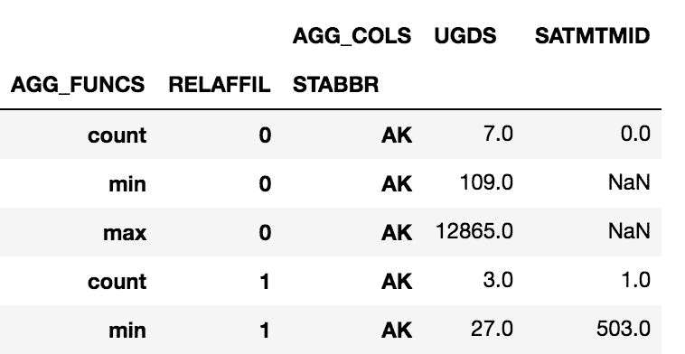

5.  通过使用`sort_index`方法对级别进行排序，我们可以继续使用轴级别名称：

```py
>>> cg.stack('AGG_FUNCS') \
      .swaplevel('AGG_FUNCS', 'STABBR', axis='index') \
      .sort_index(level='RELAFFIL', axis='index') \
      .sort_index(level='AGG_COLS', axis='columns').head(6)
```


6.  为了完全重塑数据，您可能需要堆叠一些列，同时堆叠其他列。 在单个命令中将两个方法链接在一起：

```py
>>> cg.stack('AGG_FUNCS').unstack(['RELAFFIL', 'STABBR'])
```

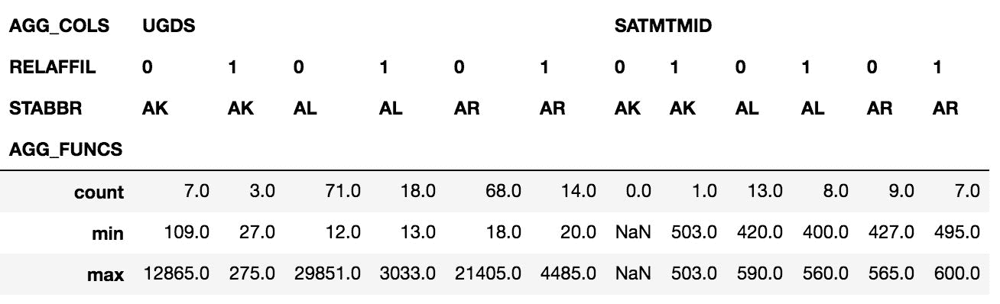

7.  一次堆叠所有列以返回系列：

```py
>>> cg.stack(['AGG_FUNCS', 'AGG_COLS']).head(12)
STABBR  RELAFFIL  AGG_FUNCS  AGG_COLS
AK      0         count      UGDS            7.0
                             SATMTMID        0.0
                  min        UGDS          109.0
                  max        UGDS        12865.0
        1         count      UGDS            3.0
                             SATMTMID        1.0
                  min        UGDS           27.0
                             SATMTMID      503.0
                  max        UGDS          275.0
                             SATMTMID      503.0
AL      0         count      UGDS           71.0
                             SATMTMID       13.0
dtype: float64
```

# 工作原理

`groupby`聚合的结果通常会产生具有多个轴级别的数据帧或序列。 步骤 1 中`groupby`操作的结果数据帧每个轴具有多个级别。 列级别未命名，这将要求我们仅按其整数位置引用它们。 为了大大简化我们引用列级别的能力，我们使用`rename_axis`方法对其进行了重命名。

`rename_axis`方法有点奇怪，因为它可以根据传递给它的第一个参数的类型来修改级别名称和级别值。 向其传递一个列表（如果只有一个级别，则为标量）会更改级别的名称。 向其传递字典或函数会更改级别的值。 在第 2 步中，我们向`rename_axis`方法传递一个列表，并返回一个具有所有轴级别命名的数据帧。

一旦所有轴级别都有名称，我们就可以轻松明确地控制数据的结构。 步骤 3 将`AGG_FUNCS`列堆叠到最里面的索引级别。 步骤 4 中的`swaplevel`方法接受要交换的级别的名称或位置作为前两个参数。 `sort_index`方法被调用两次，并对每个级别的实际值进行排序。 请注意，列级别的值是列名`SATMTMID`和`UGDS`。

通过步骤 6 进行堆叠和拆栈，我们可以得到截然不同的输出。也可以将每个单独的列级别堆叠到索引中以产生一个序列。

# 更多

如果您希望完全丢弃电平值，可以将它们设置为`None`。 当需要减少数据帧的可视输出中的混乱情况，或者很明显列级别代表什么并且不进行进一步处理时，可以采取这种措施：

```py
>>> cg.rename_axis([None, None], axis='index') \
      .rename_axis([None, None], axis='columns')
```

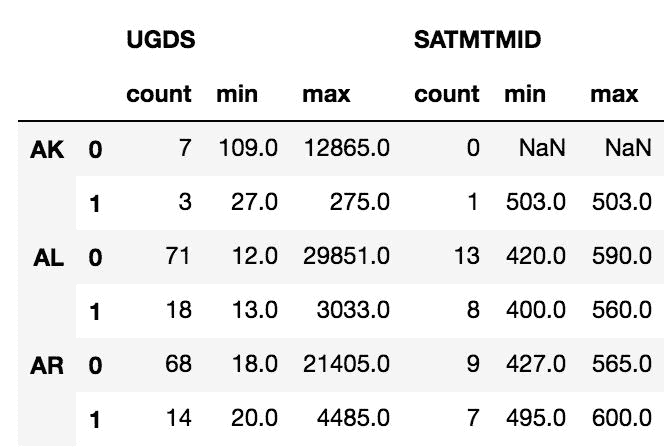

# 将多个变量存储为列名时进行整理

每当列名称本身包含多个不同的变量时，就会出现一种特殊的混乱数据。 当年龄和性别连接在一起时，便会出现这种情况的常见示例。 要整理这样的数据集，我们必须使用 pandas `str`访问器来操作列，该访问器包含用于字符串处理的其他方法。

# 准备...

在本食谱中，我们将首先确定所有变量，其中一些变量将被串联在一起作为列名。 然后，我们对数据进行整形并解析文本以提取正确的变量值。

# 操作步骤

1.  读取男士的`weightlifting`数据集，并标识变量：

```py
>>> weightlifting = pd.read_csv('data/weightlifting_men.csv')
>>> weightlifting
```

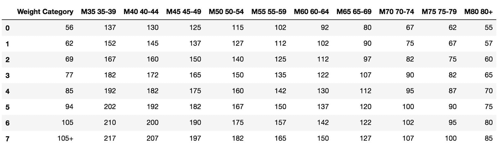

2.  变量是体重类别，性别/年龄类别和合格总数。 年龄和性别变量已合并为一个单元格。 在将它们分开之前，让我们使用`melt`方法将 age 和 sex 列名称转置为单个垂直列：

```py
>>> wl_melt = weightlifting.melt(id_vars='Weight Category', 
                                 var_name='sex_age', 
                                 value_name='Qual Total')
>>> wl_melt.head()
```

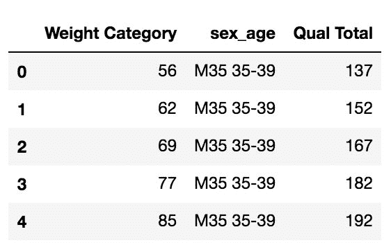

3.  选择`sex_age`列，然后使用`str`访问器中可用的`split`方法将该列分为两个不同的列：

```py
>>> sex_age = wl_melt['sex_age'].str.split(expand=True)
>>> sex_age.head()
```

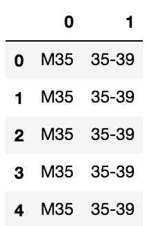

4.  此操作返回了一个完全独立的数据帧，具有无意义的列名。 让我们重命名列，以便我们可以显式访问它们：

```py
>>> sex_age.columns = ['Sex', 'Age Group']
>>> sex_age.head()
```

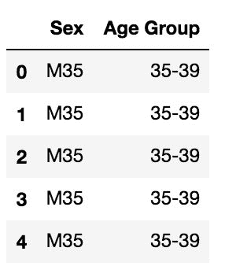

5.  在`str`访问器之后直接使用索引运算符从`Sex`列中选择第一个字符：

```py
>>> sex_age['Sex'] = sex_age['Sex'].str[0]
>>> sex_age.head()
```

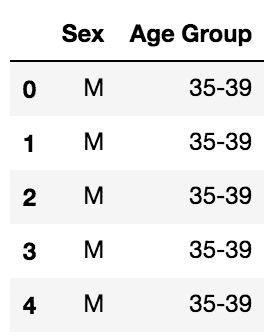

6.  使用`pd.concat`函数将此数据框与`wl_melt`串联在一起，以生成整洁的数据集：

```py
>>> wl_cat_total = wl_melt[['Weight Category', 'Qual Total']]
>>> wl_tidy = pd.concat([sex_age, wl_cat_total], axis='columns')
>>> wl_tidy.head()
```

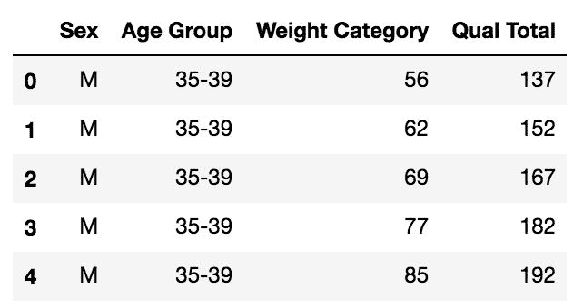

7.  可以使用以下方法创建相同的结果：

```py
>>> cols = ['Weight Category', 'Qual Total']
>>> sex_age[cols] = wl_melt[cols]
```

# 工作原理

`weightlifting`数据集与许多数据集一样，具有原始格式的易于消化的信息，但是从技术上讲，它很混乱，因为除一个列名之外，所有其他列都包含性别和年龄信息。 一旦确定了变量，就可以开始整理数据集。 只要列名称包含变量，就需要使用`melt`（或`stack`）方法。 `Weight Category`变量已经在正确的位置，因此我们通过将其传递给`id_vars`参数来将其保留为标识变量。 请注意，我们不需要明确地命名要与`value_vars`融合的所有列。 默认情况下，`id_vars`中不存在的所有列都会融化。

`sex_age`列需要解析，并分为两个变量。 为此，我们转向`str`访问器提供的额外功能，该功能仅适用于序列（单个数据帧列）。 在这种情况下，`split`方法是较常见的方法之一，因为它可以将字符串的不同部分分成各自的列。 默认情况下，它在空白处分割，但是您也可以使用`pat`参数指定字符串或正则表达式。 当`expand`参数设置为`True`时，将为每个独立的分割字符段形成一个新列。 当`False`时，返回单个列，其中包含所有段的列表。

在第 4 步中重命名列之后，我们需要再次使用`str`访问器。 有趣的是，索引运算符可用于选择或分割字符串段。 在这里，我们选择第一个字符，这是性别变量。 我们可以更进一步，将年龄分为最小年龄和最大年龄两个单独的列，但是通常以这种方式指代整个年龄组，因此我们将其保持不变。

步骤 6 显示了将所有数据连接在一起的两种不同方法之一。 `concat`函数接受数据帧的集合，并将它们垂直（`axis='index'`）或水平（`axis='columns'`）串联。 由于两个数据帧的索引相同，因此可以像第 7 步中那样将一个数据帧的值分配给另一列中的新列。

# 更多

从步骤 2 开始，完成此配方的另一种方法是直接从`sex_age`列中分配新列，而无需使用`split`方法。 `assign`方法可用于动态添加以下新列：

```py
>>> age_group = wl_melt.sex_age.str.extract('(\d{2}[-+](?:\d{2})?)',
                                            expand=False)
>>> sex = wl_melt.sex_age.str[0]
>>> new_cols = {'Sex':sex, 
                'Age Group': age_group}
>>> wl_tidy2 = wl_melt.assign(**new_cols) \
                      .drop('sex_age',axis='columns')

>>> wl_tidy2.sort_index(axis=1).equals(wl_tidy.sort_index(axis=1))
True
```

以与步骤 5 完全相同的方式找到`Sex`列。由于我们没有使用`split`，因此必须以不同的方式提取`Age Group`列。 `extract`方法使用复杂的正则表达式来提取字符串的非常特定的部分。 为了正确使用`extract`，您的图案必须包含捕获组。 通过将圆括号括在图案的一部分周围来形成捕获组。 在此示例中，整个表达式是一个大捕获组。 它以`\d{2}`开头，它精确地搜索两位数，然后是文字的正负号，或者是可选的后两位。 尽管表达式的最后部分`(?:\d{2})?`被括号括起来，但是`?:`表示它实际上不是捕获组。 从技术上讲，它是一个非捕获组，用于同时表示两个数字（可选）。 不再需要`sex_age`列，将其删除。 最后，将两个整洁的数据帧相互比较，发现它们是等效的。

# 另见

*   有关非捕获组的更多信息，请参见网站 *Regular-Expressions.info* （ [http://bit.ly/2f60KSd](http://www.regular-expressions.info/brackets.html) ）

# 将多个变量存储为列值时进行整理

整洁的数据集每个变量必须有一个单独的列。 有时，多个变量名放在一列中，而其对应的值放在另一列中。 这种杂乱数据的一般格式如下：

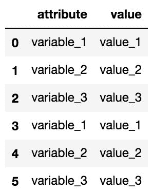

在此示例中，前三行和后三行表示两个不同的观察值，每个观察值应为行。 需要对数据进行透视，使其最终如下所示：

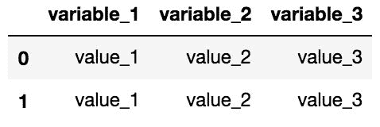

# 准备

在此配方中，我们确定包含结构错误的变量的列，并将其旋转以创建整洁的数据。

# 操作步骤

1.  读取餐厅`inspections`数据集，然后将`Date`列数据类型转换为`datetime64`：

```py
>>> inspections = pd.read_csv('data/restaurant_inspections.csv',
                              parse_dates=['Date'])
>>> inspections.head()
```

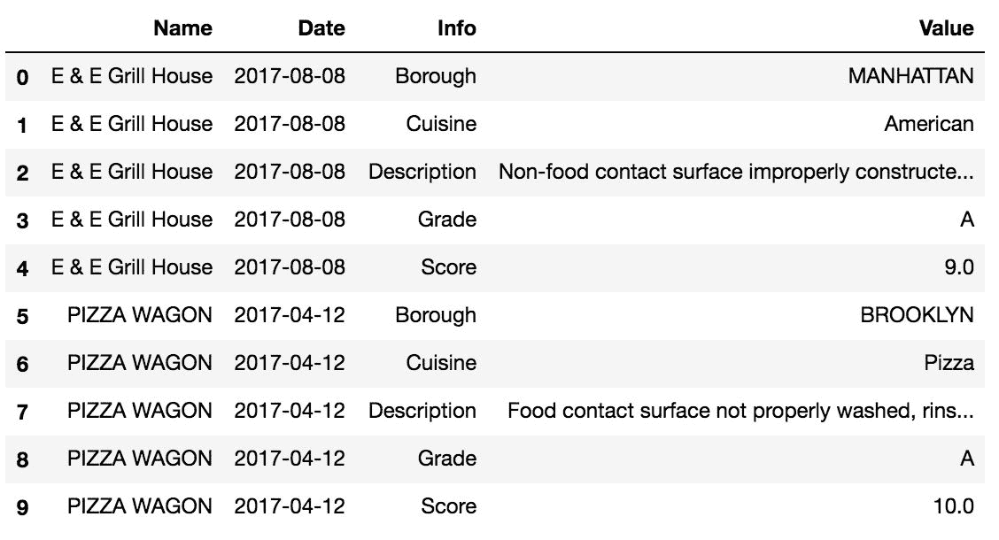

2.  该数据集具有两个变量`Name`和`Date`，它们分别正确地包含在单个列中。 `Info`列本身具有五个不同的变量：`Borough`，`Cuisine`，`Description`，`Grade`和`Score`。 让我们尝试使用`pivot`方法使`Name`和`Date`列保持垂直，从`Info`列中的所有值中创建新列，并使用`Value`列作为它们的交集：

```py
>>> inspections.pivot(index=['Name', 'Date'],
                      columns='Info', values='Value')
NotImplementedError: > 1 ndim Categorical are not supported at this time
```

3.  不幸的是，Pandas 开发人员尚未为我们实现此功能。 将来，这行代码很有可能会起作用。 幸运的是，在大多数情况下，Pandas 有多种完成同一任务的方法。 让我们将`Name`，`Date`和`Info`放入索引中：

```py
>>> inspections.set_index(['Name','Date', 'Info']).head(10)
```

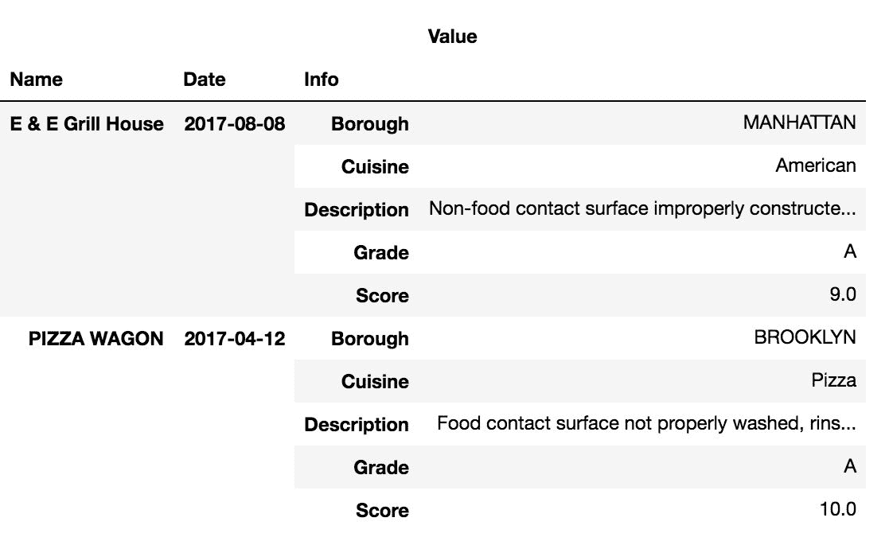

4.  使用`unstack`方法来旋转`Info`列中的所有值：

```py
>>> inspections.set_index(['Name','Date', 'Info']) \
               .unstack('Info').head()
```

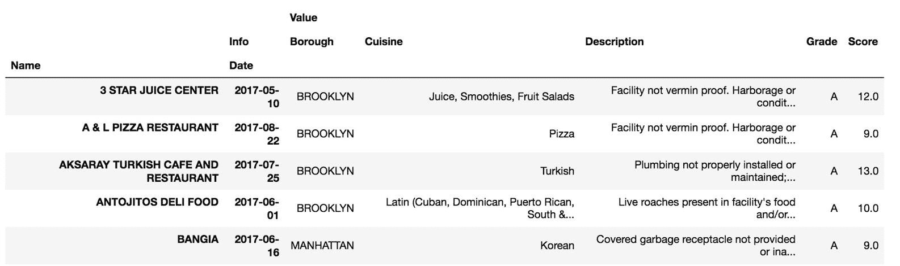

5.  使用`reset_index`方法将索引级别分为几列：

```py
>>> insp_tidy = inspections.set_index(['Name','Date', 'Info']) \
                           .unstack('Info') \
                           .reset_index(col_level=-1)
>>> insp_tidy.head()
```

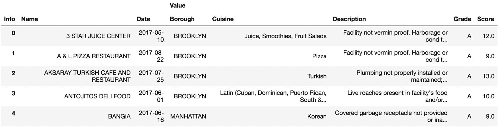

6.  数据集很整齐，但是有一些烦人的剩余 Pandas 残骸需要清除。 让我们使用 MultiIndex 方法`droplevel`删除顶部的列级别，然后将索引级别重命名为`None`：

```py
>>> insp_tidy.columns = insp_tidy.columns.droplevel(0) \
                                         .rename(None)
>>> insp_tidy.head()
```

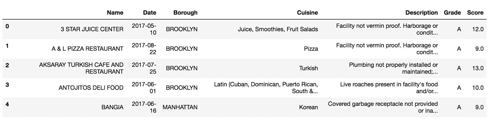

7.  通过使用`squeeze`方法将该列数据帧转换为序列，可以避免在步骤 4 中创建 MultiIndex 列。 以下代码产生与上一步相同的结果：

```py
>>> inspections.set_index(['Name','Date', 'Info']) \
               .squeeze() \
               .unstack('Info') \
               .reset_index() \
               .rename_axis(None, axis='columns')
```

# 工作原理

在第 1 步中，我们注意到在`Info`列中垂直放置了五个变量，在`Value`列中有相应的值。 因为我们需要将这五个变量中的每一个作为水平列名进行透视，所以`pivot`方法似乎可以工作。 不幸的是，当有多个非枢轴列时，Pandas 开发人员尚未实现这种特殊情况。 我们被迫使用另一种方法。

`unstack`方法还枢转垂直数据，但仅适用于索引中的数据。 第 3 步通过使用`set_index`方法移动将和不会旋转到索引中的两个列来开始此过程。 这些列进入索引后，即可像在步骤 3 中一样操作`unstack`。

请注意，当我们拆开数据帧时，pandas 会保留原始的列名（在这里，它只是一个列`Value`），并创建一个以旧列名为上层的 MultiIndex。 数据集现在基本上是整齐的，但是我们继续使用`reset_index`方法将无枢轴的列设置为普通列。 因为我们有 MultiIndex 列，所以我们可以使用`col_level`参数选择新列名称所属的级别。 默认情况下，名称会插入到最高级别（级别 0）。 我们使用`-1`表示最底层。

毕竟，我们还有一些多余的数据帧名称和索引需要丢弃。 不幸的是，没有可以删除级别的数据帧方法，因此我们必须进入索引并使用其`droplevel`方法。 在这里，我们用单级列覆盖了旧的 MultiIndex 列。 这些列仍具有无用的名称属性`Info`，该属性已重命名为`None`。

通过将步骤 3 中的结果数据帧强制为序列，可以避免清理 MultiIndex 列。 `squeeze`方法仅适用于单列数据帧，并将其转换为序列。

# 更多

实际上，可以使用`pivot_table`方法，该方法对允许多少个非透视列没有限制。 `pivot_table`方法与`pivot`不同，它对与`index`和`columns`参数中的列之间的交点相对应的所有值执行汇总。 由于此交点中可能存在多个值，因此`pivot_table`要求用户向其传递一个汇总函数，以便输出单个值。 我们使用`first`汇总函数，该函数采用组中的第一个值。 在此特定示例中，每个交叉点都只有一个值，因此没有任何要累加的值。 默认的聚合函数是均值，在这里会产生错误，因为某些值是字符串：

```py
>>> inspections.pivot_table(index=['Name', 'Date'], 
                            columns='Info', 
                            values='Value', 
                            aggfunc='first') \
               .reset_index() \
               .rename_axis(None, axis='columns')
```

# 另见

*   Pandas `droplevel`（ [http://bit.ly/2yo5BXf](http://pandas.pydata.org/pandas-docs/stable/generated/pandas.MultiIndex.droplevel.html) ）和`squeeze`（ [http://bit.ly/2yo5TgN](http://pandas.pydata.org/pandas-docs/stable/generated/pandas.DataFrame.squeeze.html) ）方法的官方文档

# 在同一单元格中存储两个或多个值时进行整理

表格数据本质上是二维的，因此，可以在单个单元格中显示的信息量有限。 解决方法是，您偶尔会看到在同一单元格中存储了多个值的数据集。 整洁的数据可为每个单元格精确地提供一个值。 为了纠正这些情况，通常需要使用`str` Series 访问器中的方法将字符串数据解析为多列。

# 准备...

在本食谱中，我们检查一个数据集，该数据集的每个列中都有一个包含多个不同变量的列。 我们使用`str`访问器将这些字符串解析为单独的列以整理数据。

# 怎么做..

1.  读取 Texas `cities`数据集，并标识变量：

```py
>>> cities = pd.read_csv('data/texas_cities.csv')
>>> cities
```

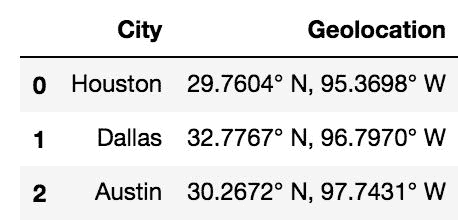

2.  `City`列看起来不错，并且仅包含一个值。 另一方面，`Geolocation`列包含四个变量：`latitude`，`latitude direction`，`longitude`和`longitude direction`。 让我们将`Geolocation`列分为四个单独的列：

```py
>>> geolocations = cities.Geolocation.str.split(pat='. ',
                                                expand=True)
>>> geolocations.columns = ['latitude', 'latitude direction',
                            'longitude', 'longitude direction']
>>> geolocations
```

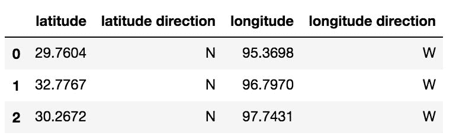

3.  因为`Geolocation`的原始数据类型是对象，所以所有新列也是对象。 让我们将`latitude`和`longitude`更改为浮点数：

```py
>>> geolocations = geolocations.astype({'latitude':'float',
                                        'longitude':'float'})
>>> geolocations.dtypes
latitude               float64
latitude direction      object
longitude              float64
longitude direction     object
dtype: object
```

4.  将这些新列与原始的`City`列连接在一起：

```py
>>> cities_tidy = pd.concat([cities['City'], geolocations],
                            axis='columns')
>>> cities_tidy
```

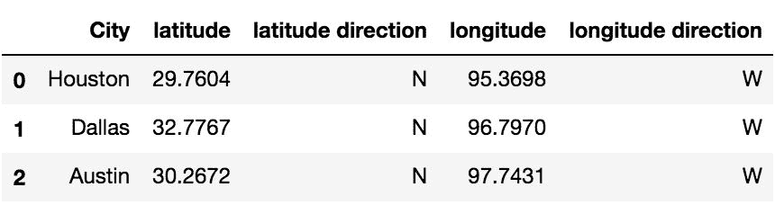

# 工作原理

读取数据后，我们决定数据集中有多少个变量。 在这里，我们选择将`Geolocation`列分为四个变量，但是我们可以只选择两个作为纬度和经度，并使用负号来区分西/东和南/北。

有几种方法可以使用`str`访问器中的方法来解析`Geolocation`列。 最简单的方法是使用`split`方法。 我们为它传递一个由任何字符（句点）和空格定义的简单正则表达式。 当空格跟随任何字符时，将进行分割，并形成一个新列。 该模式的首次出现在纬度的尽头。 空格紧跟度数字符，并形成分割。 分割字符将被丢弃，而不保留在结果列中。 下一个分割与逗号和空格匹配，紧跟在纬度方向之后。

总共进行了三个拆分，得到了四列。 步骤 2 的第二行为其提供了有意义的名称。 即使所得的`latitude`和`longitude`列似乎是浮点数，也并非如此。 它们最初是从对象列进行解析的，因此仍然是对象数据类型。 步骤 3 使用字典将列名称映射到其新类型。

您可以使用函数`to_numeric`尝试将每一列转换为整数或浮点数，而不是使用字典，如果字典有很多列名，则需要大量输入。 要在每列上迭代应用此功能，请对以下内容使用`apply`方法：

```py
>>> geolocations.apply(pd.to_numeric, errors='ignore')
```

步骤 4 将城市连接到此新数据帧的前面，以完成整理数据的过程。

# 更多

`split`方法在此示例中使用简单的正则表达式非常有效。 对于其他示例，某些列可能会要求您根据几种不同的模式创建拆分。 要搜索多个正则表达式，请使用竖线字符`|`。 例如，如果我们只想分割度数符号和逗号，并在其后跟一个空格，则可以执行以下操作：

```py
>>> cities.Geolocation.str.split(pat='° |, ', expand=True)
```

这将从步骤 2 返回相同的数据帧。可以使用管道字符将任意数量的其他拆分模式附加到前面的字符串模式。

`extract`方法是另一种出色的方法，它允许您提取每个单元格中的特定组。 这些捕获组必须用括号括起来。 结果中不存在任何括号外匹配的内容。 下一行产生与步骤 2 相同的输出：

```py
>>> cities.Geolocation.str.extract('([0-9.]+). (N|S), ([0-9.]+). (E|W)',
                                   expand=True)
```

此正则表达式具有四个捕获组。 第一组和第三组至少搜索一个或多个带小数的连续数字。 第二和第四组搜索单个字符（方向）。 第一个和第三个捕获组由任何字符分隔，后跟一个空格。 第二个捕获组用逗号分隔，然后用空格隔开。

# 在列名和值中存储变量时进行整理

每当变量在列名称中水平存储并且在列值垂直向下存储时，就会出现一种特别难以诊断的混乱数据形式。 通常，您会遇到这种类型的数据集，而不是在数据库中，而是从其他人已经生成的汇总报告中遇到。

# 准备

在此配方中，变量在垂直和水平方向都可以识别，并通过`melt`和`pivot_table`方法重新整理为整齐的数据。

# 操作步骤

1.  读取`sensors`数据集并标识变量：

```py
>>> sensors = pd.read_csv('data/sensors.csv')
>>> sensors
```

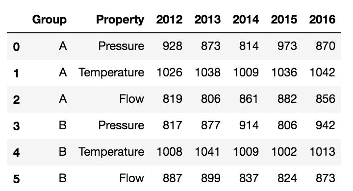

2.  正确放置在垂直列中的唯一变量是`Group`。 `Property`列似乎具有三个唯一变量`Pressure`，`Temperature`和`Flow`。 `2012`至`2016`列的其余部分本身都是一个变量，我们可以明智地将其命名为`Year`。 用单个数据帧方法不可能重组这种混乱的数据。 让我们从`melt`方法开始，将年份分为自己的专栏：

```py
>>> sensors.melt(id_vars=['Group', 'Property'], var_name='Year') \
           .head(6)
```

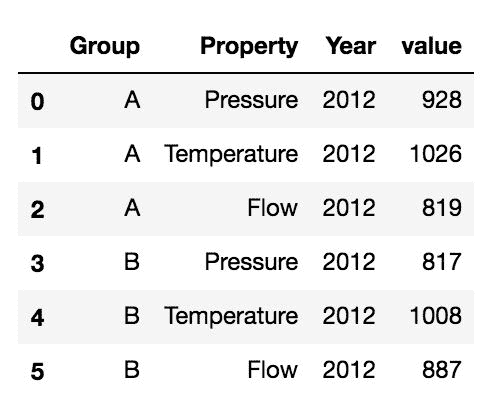

3.  这解决了我们的问题之一。 让我们使用`pivot_table`方法将`Property`列转换为新的列名称：

```py
>>> sensors.melt(id_vars=['Group', 'Property'], var_name='Year') \
           .pivot_table(index=['Group', 'Year'],
                        columns='Property', values='value') \
           .reset_index() \
           .rename_axis(None, axis='columns')
```

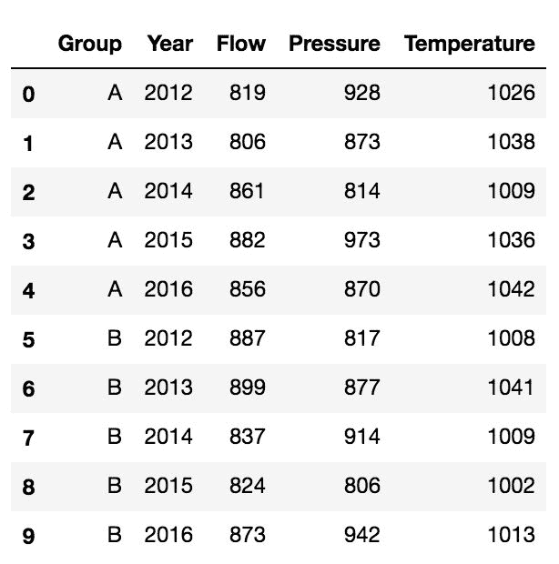

# 工作原理

一旦在步骤 1 中确定了变量，就可以开始重组。 Pandas 没有同时旋转，列的方法，因此我们必须一次完成这一任务。 我们通过将`Property`列传递给`melt`方法中的`id_vars`参数来保持年份垂直。

现在，结果就是在前面的配方*中将多个变量存储为列值时进行整理的混乱数据的模式。* 如*所述，该食谱还有*部分，当在`index`参数中使用多个列时，我们必须使用`pivot_table`来旋转数据帧。 旋转后，`Group`和`Year`变量卡在索引中。 我们将它们以列的形式推出。 `pivot_table`方法将`columns`参数中使用的列名称保留为列索引的名称。 重置索引后，该名称变得毫无意义，我们使用`rename_axis`将其删除。

# 更多

每当涉及`melt`，`pivot_table`或`pivot`的解决方案时，您都可以确定存在使用`stack`和`unstack`的替代方法。 诀窍是首先将当前未旋转到索引中的列移动：

```py
>>> sensors.set_index(['Group', 'Property']) \
           .stack() \
           .unstack('Property') \
           .rename_axis(['Group', 'Year'], axis='index') \
           .rename_axis(None, axis='columns') \
           .reset_index()
```

# 将多个观测单位存储在同一表中时进行整理

当每个表包含来自单个观察单位的信息时，通常更容易维护数据。 另一方面，当所有数据都在单个表中时，更容易发现见解；对于机器学习，所有数据都必须在单个表中。 整洁的数据的重点不是直接进行分析。 相反，它正在对数据进行结构化处理，以便更轻松地进行分析，并且在一个表中有多个观察单位时，可能需要将其分成各自的表。

# 准备

在本食谱中，我们使用`movie`数据集来识别三个观察单位（电影，演员和导演），并分别为每个观察单位创建表格。 制定此食谱的关键之一是了解 Facebook 喜欢的演员和导演与电影无关。 每个演员和导演都映射到一个表示他们喜欢 Facebook 的人数的单一值。 由于这种独立性，我们可以将电影，导演和演员的数据分离到各自的表中。 数据库人员将此过程标准化，这可以提高数据完整性并减少冗余。

# 操作步骤

1.  读入更改后的`movie`数据集，并输出前五行：

```py
>>> movie = pd.read_csv('data/movie_altered.csv')
>>> movie.head()
```

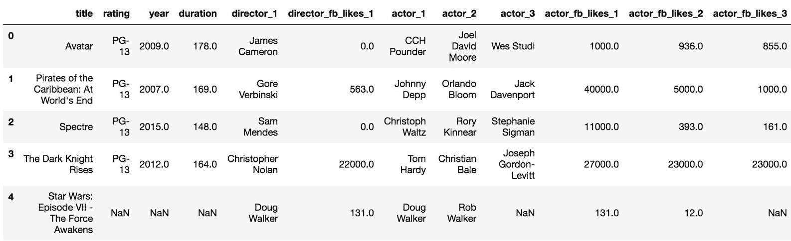

2.  该数据集包含有关电影本身，导演和演员的信息。 这三个实体可以视为观测单位。 在开始之前，让我们使用`insert`方法创建一列来唯一标识每个电影：

```py
>>> movie.insert(0, 'id', np.arange(len(movie)))
>>> movie.head()
```

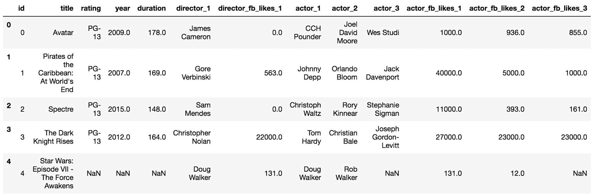

3.  让我们尝试使用`wide_to_long` 函数整理此数据集，以将所有演员放在一列中，并将其对应的 Facebook 喜欢放在另一列中，并为导演做同样的事情，即使每部电影只有一个 ：

```py
>>> stubnames = ['director', 'director_fb_likes',
                 'actor', 'actor_fb_likes']
>>> movie_long = pd.wide_to_long(movie, 
                                 stubnames=stubnames, 
                                 i='id', 
                                 j='num', 
                                 sep='_').reset_index()

>>> movie_long['num'] = movie_long['num'].astype(int)
>>> movie_long.head(9)
```


4.  现在可以将数据集拆分为多个较小的表：

```py
>>> movie_table = movie_long[['id', 'year', 'duration', 'rating']]
>>> director_table = movie_long[['id', 'num',
                                 'director', 'director_fb_likes']]
>>> actor_table = movie_long[['id', 'num',
                              'actor', 'actor_fb_likes']]
```

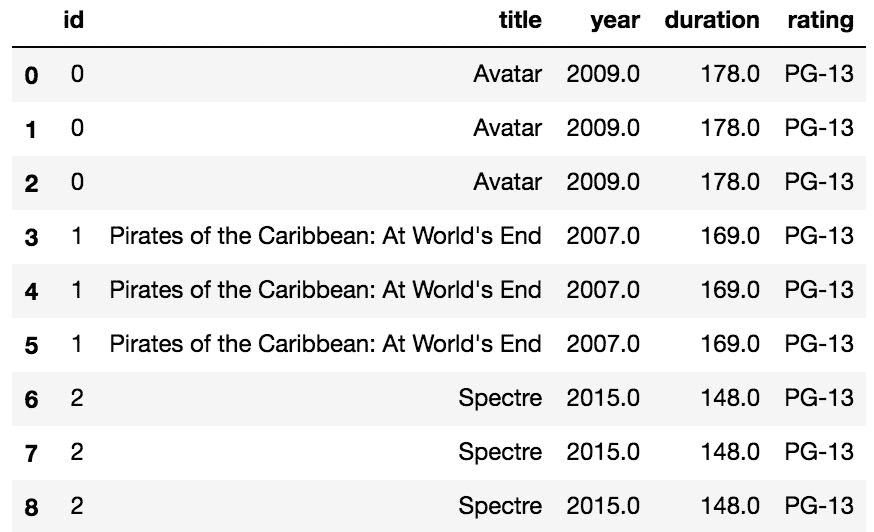  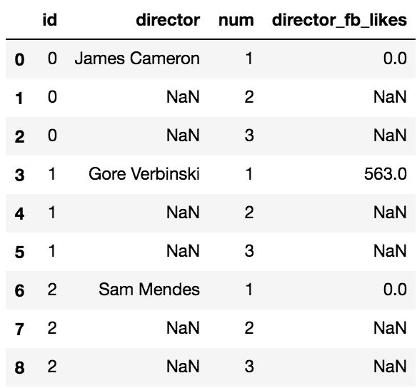  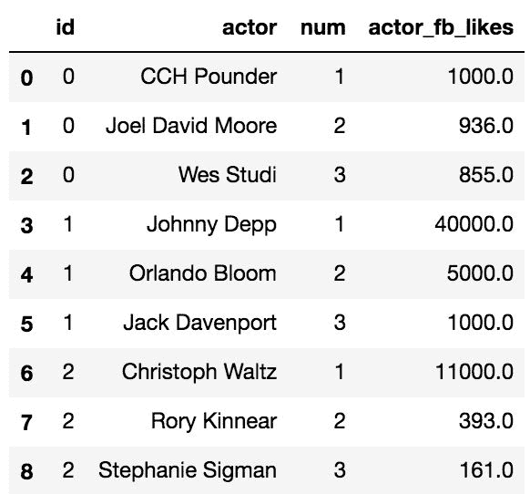

5.  这些表仍然存在几个问题。 `movie`表将每个电影重复三遍，导演表的每个 ID 都有两行缺失，而一些电影的某些演员有缺失值。 让我们来照顾这​​些问题：

```py
>>> movie_entity = movie_entity.drop_duplicates() \
                               .reset_index(drop=True)
>>> director_entity = director_entity.dropna() \
                                     .reset_index(drop=True)
>>> actor_table = actor_table.dropna() \
                             .reset_index(drop=True)
```

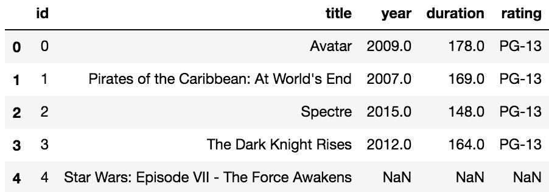    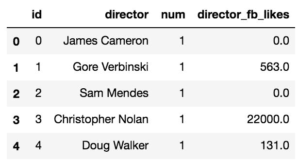

6.  现在，我们已将观测单位分为各自的表，让我们将原始数据集的内存与这三个表进行比较：

```py
>>> movie.memory_usage(deep=True).sum()
2318234

>>> movie_table.memory_usage(deep=True).sum() + \
    director_table.memory_usage(deep=True).sum() + \
    actor_table.memory_usage(deep=True).sum()
2627306
```

7.  实际上，我们的新整理数据会占用更多的内存。 这是可以预期的，因为原始列中的所有数据都被简单地散布到新表中。 新表还每个都有索引，并且其中两个表都有一个额外的`num`列，这些列占了额外的内存。 但是，我们可以利用以下事实：Facebook 喜欢的人数与电影无关，这意味着每个演员和导演在所有电影中都有一个 Facebook 喜欢的人数。 在执行此操作之前，我们需要创建另一个表，将每个电影映射到每个演员/导演。 首先，创建特定于 actor 和 director 表的`id`列，以唯一标识每个 actor / director：

```py
>>> director_cat = pd.Categorical(director_table['director'])
>>> director_table.insert(1, 'director_id', director_cat.codes)

>>> actor_cat = pd.Categorical(actor_table['actor'])
>>> actor_table.insert(1, 'actor_id', actor_cat.codes)
```

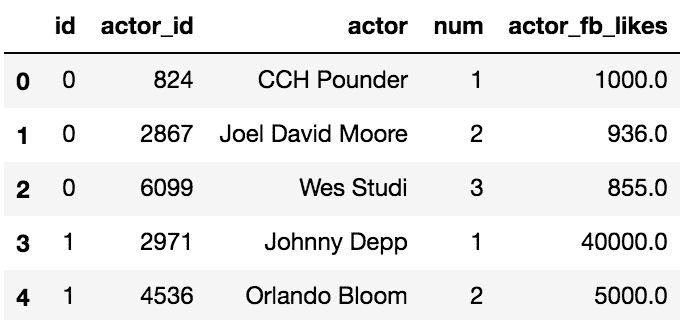   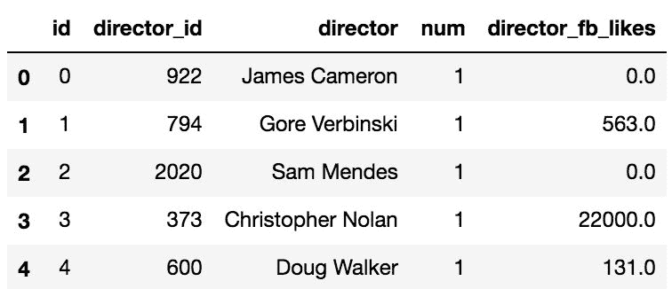

8.  我们可以使用这些表形成中间表和唯一的`actor` / `director`表。 我们首先使用`director`表执行此操作：

```py
>>> director_associative = director_table[['id', 'director_id',
                                           'num']]
>>> dcols = ['director_id', 'director', 'director_fb_likes']
>>> director_unique = director_table[dcols].drop_duplicates() \
                                           .reset_index(drop=True)
```

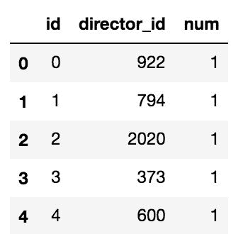     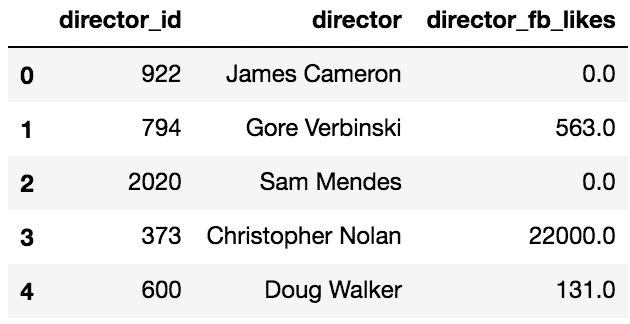

9.  让我们对`actor`表做同样的事情：

```py
>>> actor_associative = actor_table[['id', 'actor_id', 'num']]
>>> acols = ['actor_id', 'actor', 'actor_fb_likes']
>>> actor_unique = actor_table[acols].drop_duplicates() \
                                     .reset_index(drop=True)
```

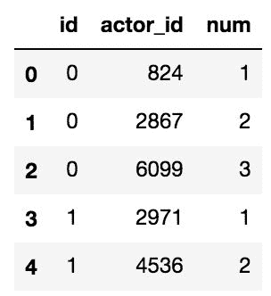    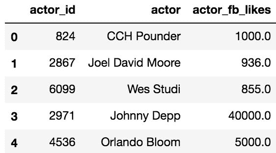

10.  让我们找出我们的新表消耗了多少内存：

```py
>>> movie_table.memory_usage(deep=True).sum() + \
    director_associative.memory_usage(deep=True).sum() + \
    director_unique.memory_usage(deep=True).sum() + \
    actor_associative.memory_usage(deep=True).sum() + \
    actor_unique.memory_usage(deep=True).sum()
1833402
```

11.  现在我们已经标准化了表，我们可以构建一个实体关系图，显示所有表（实体），列和关系。 此图是使用易于使用的 ERDPlus（ [https://erdplus.com](https://erdplus.com/#/) ）创建的：
    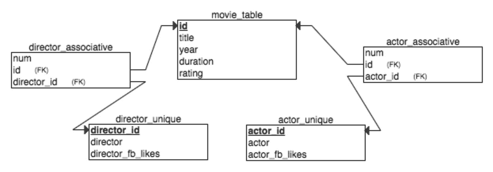

# 工作原理

导入数据并识别这三个实体后，我们必须为每个观察创建一个唯一的标识符，以便在将电影，演员和导演分成不同的表格后，可以将它们链接在一起。 在第 2 步中，我们只需将 ID 列设置为从零开始的行号。 在第 3 步中，我们使用`wide_to_long`函数同时`melt`，`actor`和`director`列。 它使用列的整数后缀垂直对齐数据，并将此整数后缀放置在索引中。 参数`j`用于控制其名称。 重复`stubnames`列表中不在列中的值以与已熔化的列对齐。

在第 4 步中，我们创建三个新表，并在每个表中保留`id`列。 我们还保留`num`列以标识确切的`director` / `actor`列。 步骤 5 通过删除重复项和缺失值来压缩每个表。

在第 5 步之后，这三个观测单位在各自的表中，但它们仍然包含与原始相同的数据量（还有更多），如步骤 6 所示。返回 要从`object`数据类型列的 `memory_usage` 方法中获得正确的字节数，必须将 `deep` 参数设置为 `True` 。

每个演员/导演在其各自的表中仅需要一个条目。 我们不能简单地列出演员姓名和 Facebook 喜欢的表格，因为无法将演员链接回原始电影。 电影和演员之间的关系称为**多对多关系**。 每个电影与多个演员相关联，每个演员可以出现在多个电影中。 为了解决此关系，创建了一个中间表或关联表，该表包含电影和演员的唯一标识符（**主键**）。

要创建关联表，我们必须唯一地标识每个演员/导演。 一种技巧是使用`pd.Categorical`从每个演员/导演姓名中创建一个分类数据类型。 分类数据类型具有从每个值到整数的内部映射。 在`codes`属性中可以找到该整数，该属性用作唯一 ID。 要设置关联表的创建，我们将此唯一 ID 添加到`actor` / `director`表中。

步骤 8 和步骤 9 通过选择两个唯一标识符来创建关联表。 现在，我们可以将`actor`和`director`表简化为唯一的名称和 Facebook 喜欢的名称。 这种新的表安排使用的内存比原始表少 20％。 正式的关系数据库具有实体关系图以可视化表格。 在第 10 步中，我们使用简单的 ERDPlus 工具进行可视化，这大大简化了对表之间关系的理解。

# 更多

通过将所有表重新结合在一起，可以重新创建原始的`movie`表。 首先，将关联表连接到`actor` / `director`表。 然后旋转 num 列，并向后添加列前缀：

```py
>>> actors = actor_associative.merge(actor_unique, on='actor_id') \
                              .drop('actor_id', 1) \
                              .pivot_table(index='id', 
                                           columns='num',
                                           aggfunc='first')

>>> actors.columns = actors.columns.get_level_values(0) + '_' + \
                     actors.columns.get_level_values(1).astype(str)

>>> directors = director_associative.merge(director_unique,
                                           on='director_id') \
                                    .drop('director_id', 1) \
                                    .pivot_table(index='id',
                                                 columns='num',
                                                 aggfunc='first')

>>> directors.columns = directors.columns.get_level_values(0) + '_' + \
                        directors.columns.get_level_values(1) \
                                         .astype(str)
```

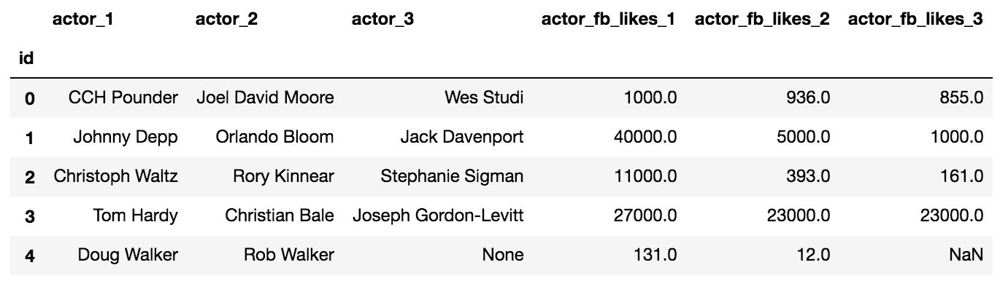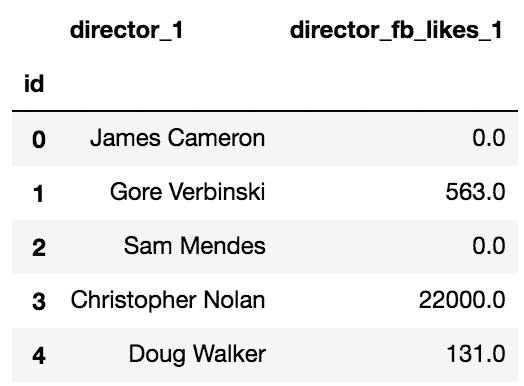

这些表现在可以与`movie_table`结合在一起：

```py
>>> movie2 = movie_table.merge(directors.reset_index(),
                               on='id', how='left') \
                        .merge(actors.reset_index(),
                               on='id', how='left')
>>> movie.equals(movie2[movie.columns])
True
```

# 另见

*   有关数据库规范化（ [http://bit.ly/2w8wahQ](https://en.wikipedia.org/wiki/Database_normalization) ），关联表（ [http://bit.ly/2yqE4oh](https://en.wikipedia.org/wiki/Associative_entity) ）以及主键和外键（ [http://bit.ly/2xgIvEb](https://en.wikipedia.org/wiki/Unique_key) ）
*   有关`wide_to_long`功能的更多信息，请参阅本章中的*同时堆叠多组变量* 配方