# 时间序列分析

在本章中，我们将介绍以下主题：

*   了解 Python 和 Pandas 日期工具之间的区别
*   智能分割时间序列
*   使用仅适用于 DatetimeIndex 的方法
*   计算每周的犯罪数量
*   分别汇总每周犯罪和交通事故
*   按工作日和年份衡量犯罪
*   与带有 DateTimeIndex 的匿名函数分组
*   按时间戳和另一列分组
*   使用`merge_asof`，发现上次犯罪率降低了 20％

# 介绍

大 Pandas 的根源在于分析金融时间序列数据。 作者 Wes McKinney 当时对可用的 Python 工具并不满意，因此决定在他工作的对冲基金中建立 Pandas 来满足自己的需求。 从广义上讲，时间序列只是随时间推移收集的数据点。 最典型地，时间在每个数据点之间平均间隔。 Pandas 在处理日期，在不同时间段内进行汇总，对不同时间段进行采样等方面具有出色的功能。

# 了解 Python 和 Pandas 日期工具之间的区别

在介绍 Pandas 之前，了解并了解 Python 核心的日期和时间功能可能会有所帮助。 `datetime`模块提供了三种不同的数据类型，`date`，`time`和`datetime`。 正式而言，`date`是一个由年，月和日组成的时刻。 例如，2013 年 6 月 7 日为日期。 `time`由小时，分钟，秒和微秒（百万分之一秒）组成，并且未附加到任何日期。 时间的示例是 12 小时 30 分钟。 `datetime`由日期和时间这两个元素共同组成。

另一方面，Pandas 有一个封装日期和时间的对象，称为`Timestamp`。 它具有纳秒级（十亿分之一秒）的精度，并且源自 NumPy 的`datetime64`数据类型。 Python 和 Pandas 都具有`timedelta`对象，在进行日期加/减时很有用。

# 做好准备

在本食谱中，我们将首先探索 Python 的`datetime`模块，然后转向 Pandas 中相应的高级日期工具。

# 怎么做...

1.  首先，将`datetime`模块导入我们的名称空间并创建`date`，`time`和`datetime`对象：

```py
>>> import datetime

>>> date = datetime.date(year=2013, month=6, day=7)
>>> time = datetime.time(hour=12, minute=30, 
                         second=19, microsecond=463198)
>>> dt = datetime.datetime(year=2013, month=6, day=7, 
                           hour=12, minute=30, second=19, 
                           microsecond=463198)

>>> print("date is ", date)
>>> print("time is", time)
>>> print("datetime is", dt)

date is 2013-06-07 
time is 12:30:19.463198 
datetime is 2013-06-07 12:30:19.463198
```

2.  让我们构造并打印出`timedelta`对象，这是`datetime`模块中的另一种主要数据类型：

```py
>>> td = datetime.timedelta(weeks=2, days=5, hours=10,
                            minutes=20, seconds=6.73,
                            milliseconds=99, microseconds=8)
>>> print(td)
19 days, 10:20:06.829008
```

3.  将此`timedelta`添加/减去到步骤 1 中的`date`和`datetime`对象中：

```py
>>> print('new date is', date + td)
>>> print('new datetime is', dt + td)
new date is 2013-06-26
new datetime is 2013-06-26 22:50:26.292206
```

4.  尝试将`timedelta`添加到`time`对象是不可能的：

```py
>>> time + td
TypeError: unsupported operand type(s) for +: 'datetime.time' and 'datetime.timedelta'
```

5.  让我们看一下 Pandas 及其`Timestamp`对象，这是具有纳秒精度的时间片刻。 `Timestamp`构造函数非常灵活，可以处理各种输入：

```py
>>> pd.Timestamp(year=2012, month=12, day=21, hour=5,
                 minute=10, second=8, microsecond=99)
Timestamp('2012-12-21 05:10:08.000099')

>>> pd.Timestamp('2016/1/10') Timestamp('2016-01-10 00:00:00')

>>> pd.Timestamp('2014-5/10') Timestamp('2014-05-10 00:00:00')

>>> pd.Timestamp('Jan 3, 2019 20:45.56') Timestamp('2019-01-03 20:45:33')

>>> pd.Timestamp('2016-01-05T05:34:43.123456789') Timestamp('2016-01-05 05:34:43.123456789')
```

6.  也可以将单个整数或浮点数传递给`Timestamp`构造函数，该构造函数返回的日期等于 Unix 纪元（即 1970 年 1 月 1 日）之后的纳秒数：

```py
>>> pd.Timestamp(500)
Timestamp('1970-01-01 00:00:00.000000500')

>>> pd.Timestamp(5000, unit='D')
Timestamp('1983-09-10 00:00:00')
```

7.  Pandas 提供了`to_datetime` 函数，其功能与`Timestamp`构造函数非常相似，但在特殊情况下带有一些不同的参数。 请参阅以下示例：

```py
>>> pd.to_datetime('2015-5-13')
Timestamp('2015-05-13 00:00:00')

>>> pd.to_datetime('2015-13-5', dayfirst=True)
Timestamp('2015-05-13 00:00:00')

>>> pd.to_datetime('Start Date: Sep 30, 2017 Start Time: 1:30 pm', 
               format='Start Date: %b %d, %Y Start Time: %I:%M %p')
Timestamp('2017-09-30 13:30:00')

>>> pd.to_datetime(100, unit='D', origin='2013-1-1')
Timestamp('2013-04-11 00:00:00')
```

8.  `to_datetime`功能具有更多功能。 它能够将整个列表或一系列字符串或整数转换为时间戳。 由于我们更可能与序列或 DataFrames 交互，而不是与单个标量值交互，因此您比`Timestamp`更可能使用`to_datetime`：

```py
>>> s = pd.Series([10, 100, 1000, 10000])
>>> pd.to_datetime(s, unit='D')
0   1970-01-11
1   1970-04-11
2   1972-09-27
3   1997-05-19
dtype: datetime64[ns]

>>> s = pd.Series(['12-5-2015', '14-1-2013',
                   '20/12/2017', '40/23/2017'])
>>> pd.to_datetime(s, dayfirst=True, errors='coerce')
0   2015-05-12
1   2013-01-14
2   2017-12-20
3          NaT
dtype: datetime64[ns]

>>> pd.to_datetime(['Aug 3 1999 3:45:56', '10/31/2017'])
DatetimeIndex(['1999-08-03 03:45:56', 
               '2017-10-31 00:00:00'], dtype='datetime64[ns]', freq=None)
```

9.  类似于`Timestamp`构造函数和`to_datetime`函数，pandas 具有`Timedelta`和`to_timedelta`来表示时间量。 `Timedelta`构造函数和`to_timedelta`函数都可以创建一个`Timedelta`对象。 与`to_datetime`一样，`to_timedelta`具有更多功能，可以将整个列表或系列转换为`Timedelta`对象。

```py
>>> pd.Timedelta('12 days 5 hours 3 minutes 123456789 nanoseconds')
Timedelta('12 days 05:03:00.123456')

>>> pd.Timedelta(days=5, minutes=7.34)
Timedelta('5 days 00:07:20.400000')

>>> pd.Timedelta(100, unit='W')
Timedelta('700 days 00:00:00')

>>> pd.to_timedelta('67:15:45.454')
Timedelta('2 days 19:15:45.454000')

>>> s = pd.Series([10, 100])
>>> pd.to_timedelta(s, unit='s')
0   00:00:10
1   00:01:40
dtype: timedelta64[ns]

>>> time_strings = ['2 days 24 minutes 89.67 seconds',
                    '00:45:23.6']
>>> pd.to_timedelta(time_strings)
TimedeltaIndex(['2 days 00:25:29.670000', 
                '0 days 00:45:23.600000'], dtype='timedelta64[ns]', freq=None)
```

10.  可以将时间戳添加到时间戳中或从时间戳中减去。 它们甚至可以彼此分开以返回浮点数：

```py
>>> pd.Timedelta('12 days 5 hours 3 minutes') * 2
Timedelta('24 days 10:06:00')

>>> pd.Timestamp('1/1/2017') + \
    pd.Timedelta('12 days 5 hours 3 minutes') * 2
Timestamp('2017-01-25 10:06:00')

>>> td1 = pd.to_timedelta([10, 100], unit='s')
>>> td2 = pd.to_timedelta(['3 hours', '4 hours'])
>>> td1 + td2
TimedeltaIndex(['03:00:10', '04:01:40'],
               dtype='timedelta64[ns]', freq=None)

>>> pd.Timedelta('12 days') / pd.Timedelta('3 days')
4.0
```

11.  时间戳记和时间戳记都有大量可用作属性和方法的功能。 让我们采样其中的一些：

```py
>>> ts = pd.Timestamp('2016-10-1 4:23:23.9')

>>> ts.ceil('h')
Timestamp('2016-10-01 05:00:00'

>>> ts.year, ts.month, ts.day, ts.hour, ts.minute, ts.second
(2016, 10, 1, 4, 23, 23)

>>> ts.dayofweek, ts.dayofyear, ts.daysinmonth
(5, 275, 31)

>>> ts.to_pydatetime()
datetime.datetime(2016, 10, 1, 4, 23, 23, 900000)

>>> td = pd.Timedelta(125.8723, unit='h')
>>> td
Timedelta('5 days 05:52:20.280000')

>>> td.round('min')
Timedelta('5 days 05:52:00')

>>> td.components
Components(days=5, hours=5, minutes=52, seconds=20, milliseconds=280, microseconds=0, nanoseconds=0)

>>> td.total_seconds()
453140.28
```

# 怎么运行的...

`datetime`模块是 Python 标准库的一部分，非常流行并且被广泛使用。 因此，最好对它有所了解，因为您可能会跨过它。 `datetime`模块实际上非常简单，总共只有六种类型的对象：`date`，`time`，`datetime`和`timedelta`以及时区上的其他两个对象。 Pandas`Timestamp`和`Timedelta`对象具有`datetime`模块对应物的所有功能以及更多功能。 在处理时间序列时，将有可能完全保留在 Pandas 中。

步骤 1 显示了如何使用`datetime`模块创建日期时间，日期，时间和时间增量。 只有整数可以用作日期或时间的每个组成部分，并作为单独的参数传递。 将此与第 5 步进行比较，在第 5 步中，pandas `Timestamp`构造函数可以接受与参数相同的组件，以及各种日期字符串。 除了整数部分和字符串，第 6 步还显示了如何将单个数字标量用作日期。 此标量的单位默认为*纳秒*（ *ns* ），但在第二条语句中将其更改为*天*（ *D* ），并带有 其他选项为*小时*（ *h* ），*分钟*（ *m* ），*秒*（ *s [ *毫秒，*毫秒（ms），*和*微秒（µs）。***

步骤 2 详细说明了`datetime`模块的`timedelta`对象及其所有参数的构造。 再次，将其与步骤 9 中显示的 pandas `Timedelta`构造函数进行比较，该构造函数接受这些相同的参数以及字符串和标量数字。

除了仅能创建单个对象的`Timestamp`和`Timedelta` 构造函数之外，`to_datetime`和`to_timedelta`函数还可以将整数或字符串的整个序列转换为所需的类型 。 这些函数还提供了构造函数不可用的其他几个参数。 这些参数之一是`errors`，默认为字符串值*提高*，但也可以设置为*忽略*或*强制*。 每当无法转换字符串日期时，`errors`参数都会确定要采取的措施。 当设置为*引发*时，引发异常并且程序执行停止。 当设置为*时，忽略*，将返回原始序列，就像进入功能之前一样。 当设置为*强制*时，`NaT`（不是时间）对象用于表示新值。 步骤 8 的第二条语句将所有值正确转换为`Timestamp`，最后一个被强制变为`NaT`。

仅可用于`to_datetime`的这些参数中的另一个参数是`format`，当字符串包含 Pandas 无法自动识别的特定日期模式时，该参数特别有用。 在步骤 7 的第三条语句中，我们在其他一些字符中嵌入了日期时间。 我们用它们各自的**格式指令**替换字符串的日期和时间。

A date formatting directive appears as a single percentage sign, %, followed by a single character. Each directive specifies some part of a date or time. See the official Python documentation for a table of all the directives ([http://bit.ly/2kePoRe](https://docs.python.org/3/library/datetime.html#strftime-and-strptime-behavior)).

# 还有更多...

当将大量字符串转换为时间戳时，日期格式指令实际上可以产生很大的不同。 每当 Pandas 使用 `to_datetime` 将字符串序列转换为时间戳时，它都会搜索代表日期的大量不同字符串组合。 即使所有字符串都具有相同的格式，也是如此。 通过 `format` 参数，我们可以指定确切的日期格式，这样 Pandas 不必每次都搜索正确的日期格式。 让我们创建一个日期列表作为字符串，并使用和不使用格式指令将它们转换为时间戳的时间：

```py
>>> date_string_list = ['Sep 30 1984'] * 10000

>>> %timeit pd.to_datetime(date_string_list, format='%b %d %Y')
35.6 ms ± 1.47 ms per loop (mean ± std. dev. of 7 runs, 10 loops each)

>>> %timeit pd.to_datetime(date_string_list)
1.31 s ± 63.3 ms per loop (mean ± std. dev. of 7 runs, 1 loop each)
```

提供格式化指令可使性能提高 40 倍。

# 也可以看看

*   `datetime`模块的 Python 官方文档（ [http://bit.ly/2xIjd2b](https://docs.python.org/3/library/datetime.html) ）
*   Pandas*时间序列*的官方文档（ [http://bit.ly/2xQcani](http://pandas.pydata.org/pandas-docs/stable/timeseries.html) ）
*   Pandas 官方*时间增量*（ [http://bit.ly/2yQTVMQ](http://pandas.pydata.org/pandas-docs/stable/timedeltas.html) ）

# 智能分割时间序列

在[第 4 章](../Text/ch04.html#5DI6C0-5686c430c0a9442a82c4c5795c8553c9)和*选择数据子集*中，彻底介绍了数据帧的选择和切片。 当数据帧具有`DatetimeIndex`时，将出现更多选择和切片的机会。

# Getting ready

在本食谱中，我们将使用部分日期匹配来选择和切片带有`DatetimeIndex`的数据帧。

# How to do it...

1.  从`hdf5`文件`crimes.h5`读取丹佛`crimes`数据集，并输出列数据类型和前几行。 `hdf5`文件格式允许有效地存储大量科学数据，并且与 CSV 文本文件完全不同。

```py
>>> crime = pd.read_hdf('data/crime.h5', 'crime')
>>> crime.dtypes
OFFENSE_TYPE_ID              category
OFFENSE_CATEGORY_ID          category
REPORTED_DATE          datetime64[ns]
GEO_LON                       float64
GEO_LAT                       float64
NEIGHBORHOOD_ID              category
IS_CRIME                        int64
IS_TRAFFIC                      int64
dtype: object
```

2.  请注意，有三个类别列和一个`Timestamp`（由 NumPy 的`datetime64`对象表示）。 这些数据类型是在创建数据文件时存储的，这与仅存储原始文本的 CSV 文件不同。 设置`REPORTED_DATE`列作为索引，以便进行智能 Timestamp 切片：

```py
>>> crime = crime.set_index('REPORTED_DATE')
>>> crime.head()
```

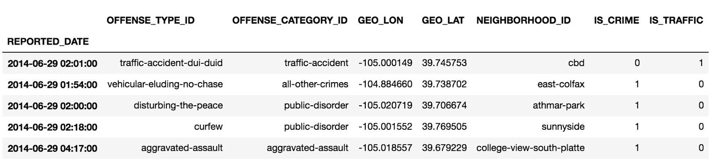

3.  像往常一样，可以通过将值传递给`.loc`索引运算符来选择等于单个索引的所有行：

```py
>>> crime.loc['2016-05-12 16:45:00']
```

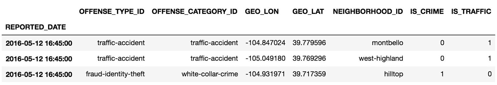

4.  在索引中使用`Timestamp`时，可以选择部分匹配索引值的所有行。 例如，如果我们要获取 2016 年 5 月 5 日以后的所有罪行，则只需选择以下内容：

```py
>>> crime.loc['2016-05-12']
```

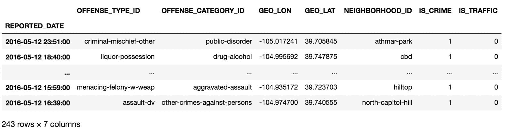

5.  您不仅可以选择不正确的日期，而且可以选择整个月，一年甚至一天的小时：

```py
>>> crime.loc['2016-05'].shape
(8012, 7)

>>> crime.loc['2016'].shape
(91076, 7)

>>> crime.loc['2016-05-12 03'].shape
(4, 7)
```

6.  选择字符串还可以包含月份名称：

```py
>>> crime.loc['Dec 2015'].sort_index()
```

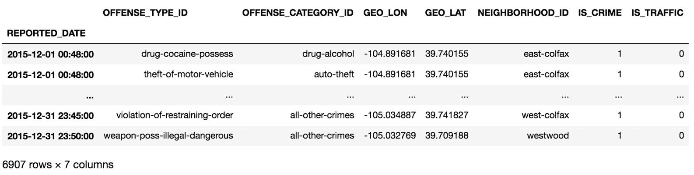

7.  包含月份名称的许多其他字符串模式也可以使用：

```py
>>> crime.loc['2016 Sep, 15'].shape
(252, 7)

>>> crime.loc['21st October 2014 05'].shape
(4, 7)
```

8.  除了选择之外，您还可以使用切片符号来选择精确的数据范围：

```py
>>> crime.loc['2015-3-4':'2016-1-1'].sort_index()
```

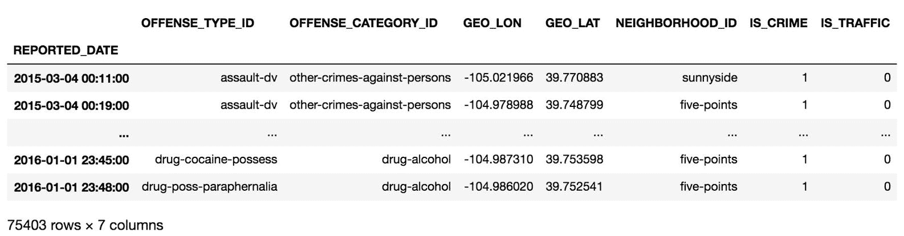

9.  请注意，无论何时何地，在结束日期实施的所有犯罪都包含在返回的结果中。 对于使用基于标签的`.loc`索引器的任何结果，都是如此。 您可以为切片的任何开始或结束部分提供尽可能多的精度（或缺乏精度）：

```py
>>> crime.loc['2015-3-4 22':'2016-1-1 11:45:00'].sort_index()
```

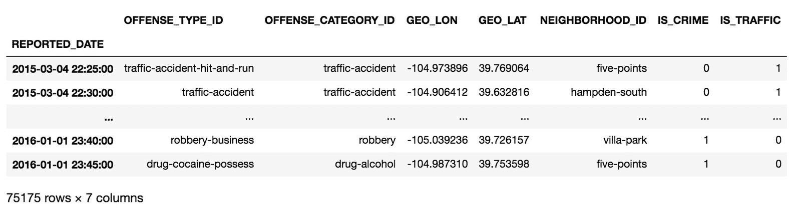

# How it works...

`hdf5`文件的许多不错的功能之一是它们保留每一列的数据类型的能力，从而大大减少了所需的内存。 在这种情况下，这些列中的三列存储为 pandas 类别而不是对象。 将它们存储为对象将导致内存使用量增加四倍：

```py
>>> mem_cat = crime.memory_usage().sum()
>>> mem_obj = crime.astype({'OFFENSE_TYPE_ID':'object', 
                            'OFFENSE_CATEGORY_ID':'object', 
                            'NEIGHBORHOOD_ID':'object'}) \
                   .memory_usage(deep=True).sum()
>>> mb = 2 ** 20
>>> round(mem_cat / mb, 1), round(mem_obj / mb, 1)
(29.4, 122.7)
```

为了使用索引运算符按日期智能地选择和切片行，索引必须包含日期值。 在步骤 2 中，我们将`REPORTED_DATE`列移到索引中，并正式创建`DatetimeIndex`作为新索引：

```py
>>> crime.index[:2]
DatetimeIndex(['2014-06-29 02:01:00', '2014-06-29 01:54:00'],
dtype='datetime64[ns]', name='REPORTED_DATE', freq=None)
```

使用`DatetimeIndex`时，可以使用`.loc`索引器使用多种字符串选择行。 实际上，所有可以发送到 pandas `Timestamp`构造函数的字符串都将在这里工作。 出乎意料的是，对于该配方中的任何选择或切片，实际上都没有必要使用`.loc`索引器。 索引运算符本身将以完全相同的方式工作。 例如，步骤 6 的第二条语句可以写为`crime['21st October 2014 05']`。 索引运算符通常为列保留，但只要存在`DatetimeIndex`，就可以灵活地使用时间戳。

就个人而言，我更喜欢在选择行时使用`.loc`索引器，并且始终将其本身用于索引运算符。 `.loc`索引器是显式的，传递给它的第一个值始终用于选择行。

步骤 8 和 9 显示切片的工作方式与从先前步骤中选择的相同。 结果中将包括与片段的开始或结束值部分匹配的任何日期。

# There's more...

我们原始的犯罪数据框未排序，并且切片仍按预期工作。 对索引进行排序将导致性能大幅提高。 让我们看一下与第 8 步完成的切片的区别：

```py
>>> %timeit crime.loc['2015-3-4':'2016-1-1']
39.6 ms ± 2.77 ms per loop (mean ± std. dev. of 7 runs, 10 loops each)

>>> crime_sort = crime.sort_index()
>>> %timeit crime_sort.loc['2015-3-4':'2016-1-1']
758 µs ± 42.1 µs per loop (mean ± std. dev. of 7 runs, 1000 loops each)
```

排序后的数据帧与原始数据相比，性能提高了 50 倍。

# See also

*   请参阅[第 4 章](../Text/ch04.html#5DI6C0-5686c430c0a9442a82c4c5795c8553c9)和*选择数据子集*

# 使用仅适用于 DatetimeIndex 的方法

有许多仅适用于 DatetimeIndex 的 DataFrame / Series 方法。 如果索引为任何其他类型，则这些方法将失败。

# Getting ready

在本食谱中，我们将首先使用方法按照时间成分选择数据行。 然后，我们将学习功能强大的 DateOffset 对象及其别名。

# How to do it...

1.  读取犯罪 hdf5 数据集，将索引设置为`REPORTED_DATE`，并确保我们具有 DatetimeIndex：

```py
>>> crime = pd.read_hdf('data/crime.h5', 'crime') \
              .set_index('REPORTED_DATE')
>>> print(type(crime.index))
&lt;class 'pandas.core.indexes.datetimes.DatetimeIndex'>
```

2.  使用`between_time`方法选择在凌晨 2 点到凌晨 5 点之间发生的所有犯罪，无论日期如何：

```py
>>> crime.between_time('2:00', '5:00', include_end=False).head()
```


3.  使用`at_time`选择特定时间的所有日期：

```py
>>> crime.at_time('5:47').head()
```

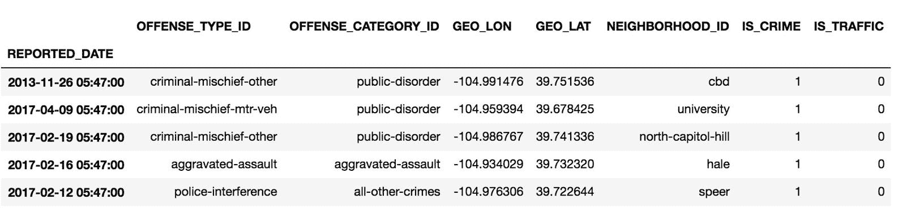

4.  `first`方法提供了一种选择前 *n* 个时间段的优雅方法，其中 *n* 是整数。 这些时间段由可以在`pd.offsets`模块中的 DateOffset 对象正式表示。 必须按其索引对数据帧进行排序，以确保此方法可以工作。 让我们选择犯罪数据的前六个月：

```py
>>> crime_sort = crime.sort_index()
>>> crime_sort.first(pd.offsets.MonthBegin(6))
```

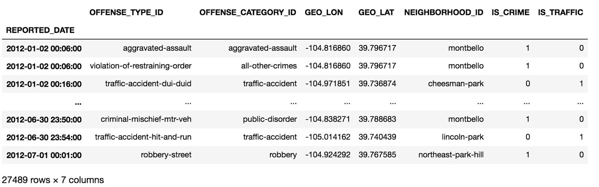

5.  这捕获了从 1 月到 6 月的数据，但令人惊讶的是，在 7 月选择了一行。 原因是 Pandas 实际上使用了索引中第一个元素的时间分量，在此示例中为`6`分钟。 让我们使用`MonthEnd`，这是一个稍微不同的偏移量：

```py
>>> crime_sort.first(pd.offsets.MonthEnd(6))
```

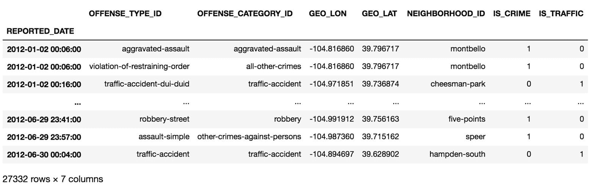

6.  这捕获了几乎相同数量的数据，但是如果仔细观察，仅捕获了 6 月 30 日以来的一行。 同样，这是因为保留了第一个索引的时间部分。 确切的搜索结果为 *2012-06-30 00:06:00* 。 那么，我们如何才能准确地获得六个月的数据呢？ 有两种方法。 所有 DateOffsets 都有一个`normalize`参数，当设置为`True`时，会将所有时间分量设置为零。 以下应该使我们非常接近我们想要的：

```py
>>> crime_sort.first(pd.offsets.MonthBegin(6, normalize=True))
```

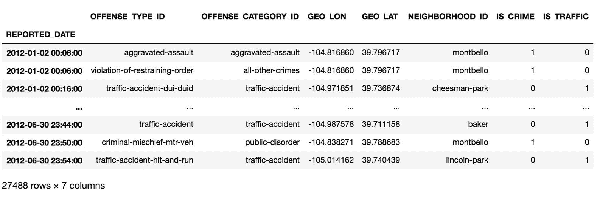

7.  此方法已成功捕获了一年前六个月的所有数据。 在将 normalize 设置为`True`的情况下，搜索到 *2012-07-01 00:00:00* ，它实际上将包括该日期和时间确切报告的任何犯罪。 实际上，无法使用第一种方法来确保仅捕获从一月到六月的数据。 以下非常简单的切片将产生准确的结果：

```py
>>> crime_sort.loc[:'2012-06']
```

8.  有十二个 DateOffset 对象，可以非常精确地向前或向后移动到下一个最近的偏移量。 您可以使用名为**偏移别名**的字符串代替在`pd.offsets`中查找 DateOffset 对象。 例如，MonthEnd 的字符串是 *M* ，MonthBegin 的字符串是 *MS* 。 要表示这些偏移别名的数量，只需在其前面放置一个整数。 使用此表查找所有别名（ [http://bit.ly/2xO5Yg0](http://pandas.pydata.org/pandas-docs/stable/timeseries.html#offset-aliases) ）。 让我们看一下偏移别名的一些示例，其中包含对注释中所选内容的描述：

```py
>>> crime_sort.first('5D') # 5 days
>>> crime_sort.first('5B') # 5 business days
>>> crime_sort.first('7W') # 7 weeks, with weeks ending on Sunday
>>> crime_sort.first('3QS') # 3rd quarter start
>>> crime_sort.first('A') # one year end
```

# How it works...

一旦确保索引为 DatetimeIndex，就可以利用本食谱中的所有方法。 使用`.loc`索引器无法仅根据`Timestamp`的时间成分进行选择或切片。 要按时间范围选择所有日期，必须使用`between_time`方法，或者要选择确切的时间，请使用`at_time`。 确保为开始时间和结束时间传递的字符串至少包含小时和分钟。 也可以使用`datetime`模块中的`time`对象。 例如，以下命令将产生与步骤 2 相同的结果：

```py
>>> import datetime
>>> crime.between_time(datetime.time(2,0), datetime.time(5,0),
                       include_end=False)
```

在第 4 步中，我们开始使用简单的`first`方法，但使用复杂的参数`offset`。 它必须是 DateOffset 对象，也可以是字符串的偏移别名。 为了帮助理解 DateOffset 对象，最好查看它们对单个`Timestamp`的作用。 例如，让我们采用索引的第一个元素，并以两种不同的方式为其添加六个月的时间：

```py
>>> first_date = crime_sort.index[0]
>>> first_date
Timestamp('2012-01-02 00:06:00')

>>> first_date + pd.offsets.MonthBegin(6)
Timestamp('2012-07-01 00:06:00')

>>> first_date + pd.offsets.MonthEnd(6)
Timestamp('2012-06-30 00:06:00')
```

`MonthBegin`和`MonthEnd`偏移量都不会增加或减少确切的时间量，而是有效地向上舍入到下个月的下一个月初或下个月，而不管它是在哪一天。 在内部，`first`方法使用数据帧的第一个索引元素，并添加传递给它的 DateOffset。 然后切成片直到这个新日期。 例如，步骤 4 等效于以下内容：

```py
>>> step4 = crime_sort.first(pd.offsets.MonthEnd(6))

>>> end_dt = crime_sort.index[0] + pd.offsets.MonthEnd(6)
>>> step4_internal = crime_sort[:end_dt]
>>> step4.equals(step4_internal)
True
```

步骤 5 至 7 直接从前面的等效操作开始。 在步骤 8 中，偏移别名使引用 DateOffsets 的方法更加紧凑。

The counterpart to the `first` method is the `last` method, which selects the last *n* time segments from a DataFrame given a DateOffset. The groupby object has two methods with the exact same name but with a completely different functionality. They return the first or last element of each group and have nothing to do with having a DatetimeIndex.

# There's more...

当可用的那些不能完全满足您的需求时，可以构建一个自定义的 DateOffset：

```py
>>> dt = pd.Timestamp('2012-1-16 13:40')
>>> dt + pd.DateOffset(months=1)
Timestamp('2012-02-16 13:40:00')
```

请注意，此自定义 DateOffset 使`Timestamp`精确增加了一个月。 让我们再看一个使用更多日期和时间组件的示例：

```py
>>> do = pd.DateOffset(years=2, months=5, days=3,
                       hours=8, seconds=10)
>>> pd.Timestamp('2012-1-22 03:22') + do
Timestamp('2014-06-25 11:22:10')
```

# See also

*   Pandas *DateOffsets 对象*的官方文档（ [http://bit.ly/2fOintG](http://pandas.pydata.org/pandas-docs/stable/timeseries.html#dateoffset-objects) ）

# 计算每周的犯罪数量

原始的丹佛犯罪数据集非常庞大，有 460,000 多行标记有报告日期。 计算每周犯罪的数量是可以通过根据一段时间进行分组来回答的许多查询之一。 `resample`方法提供了一个简单的界面，可以按任何可能的时间跨度进行分组。

# Getting ready

在本食谱中，我们将同时使用`resample`和`groupby`方法来计算每周犯罪的数量。

# How to do it...

1.  读取犯罪 hdf5 数据集，将索引设置为 `REPORTED_DATE` ，然后对其进行排序以提高其余配方的性能：

```py
>>> crime_sort = pd.read_hdf('data/crime.h5', 'crime') \
                   .set_index('REPORTED_DATE') \
                   .sort_index()
```

2.  为了计算每周的犯罪数量，我们需要每周组成一个小组。 `resample`方法采用 DateOffset 对象或别名，并返回准备对所有组执行操作的对象。 从`resample`方法返回的对象与调用`groupby`方法后产生的对象非常相似：

```py
>>> crime_sort.resample('W')
DatetimeIndexResampler [freq=<Week: weekday=6>, axis=0, closed=right, label=right, convention=start, base=0]
```

3.  偏移别名 *W* ， 用来通知 Pandas 我们要按周分组。 在上一步中没有发生太多事情。 Pandas 只是简单地验证了我们的偏移量，并返回了一个对象，该对象准备好每周作为一组执行操作。 调用 `resample` 返回一些数据后，可以链接几种方法。 让我们链接 `size` 方法以计算每周犯罪数量：

```py
>>> weekly_crimes = crime_sort.resample('W').size()
>>> weekly_crimes.head()
REPORTED_DATE
2012-01-08     877
2012-01-15    1071
2012-01-22     991
2012-01-29     988
2012-02-05     888
Freq: W-SUN, dtype: int64
```

4.  现在，我们将每周犯罪计数列为一个系列，而新索引一次增加一周。 默认情况下，有些事情是很重要的，要理解。 选择周日作为一周的最后一天，并且该日期也是用来标记所得系列中每个元素的日期。 例如，第一个索引值 2012 年 1 月 8 日是星期日。 在截至 8 日的那一周内，共发生了 877 起犯罪。 1 月 9 日星期一至 1 月 15 日星期日这周记录了 1,071 起犯罪。 让我们做一些健全性检查，并确保我们的重采样正是这样做的：

```py
>>> len(crime_sort.loc[:'2012-1-8'])
877

>>> len(crime_sort.loc['2012-1-9':'2012-1-15'])
1071
```

5.  让我们选择除周日之外的另一天，以**固定偏移**结束一周：

```py
>>> crime_sort.resample('W-THU').size().head()
REPORTED_DATE
2012-01-05     462
2012-01-12    1116
2012-01-19     924
2012-01-26    1061
2012-02-02     926
Freq: W-THU, dtype: int64
```

6.  `resample`的几乎所有功能都可以通过`groupby`方法再现。 唯一的区别是必须在`pd.Grouper`对象中传递偏移量：

```py
>>> weekly_crimes_gby = crime_sort.groupby(pd.Grouper(freq='W')) \
                                  .size()
>>> weekly_crimes_gby.head()
REPORTED_DATE
2012-01-08     877
2012-01-15    1071
2012-01-22     991
2012-01-29     988
2012-02-05     888
Freq: W-SUN, dtype: int64

>>> weekly_crimes.equal(weekly_crimes_gby)
True
```

# How it works...

默认情况下，`resample`方法与 DatetimeIndex 隐式工作，这就是为什么我们在步骤 1 中将其设置为`REPORTED_DATE`的原因。在步骤 2 中，我们创建了一个中间对象，可帮助我们了解如何在数据内形成组。 `resample`的第一个参数是`rule`，用于确定如何对索引中的时间戳进行分组。 在这种情况下，我们使用偏移别名`W`来形成长度为一周的组，该组在周日结束。 默认的结束日期是星期日，但可以通过在星期几的前面加上破折号和前三个字母来更改锚定的偏移量。

一旦我们与`resample`组成了小组，我们就必须链接一个方法以对每个小组采取行动。 在第 3 步中，我们使用`size`方法来计算每周的犯罪数量。 您可能想知道调用`resample`之后可以使用哪些所有可能的属性和方法。 下面检查`resample`对象并输出它们：

```py
>>> r = crime_sort.resample('W')
>>> resample_methods = [attr for attr in dir(r) if attr[0].islower()]
>>> print(resample_methods)
['agg', 'aggregate', 'apply', 'asfreq', 'ax', 'backfill', 'bfill', 'count', 'ffill', 'fillna', 'first', 'get_group', 'groups', 'indices', 'interpolate', 'last', 'max', 'mean', 'median', 'min', 'ndim', 'ngroups', 'nunique', 'obj', 'ohlc', 'pad', 'plot', 'prod', 'sem', 'size', 'std', 'sum', 'transform', 'var']
```

步骤 4 通过按周手动切片数据并计算行数来验证步骤 3 中计数的准确性。 实际上，甚至不需要按`Timestamp`分组`resample`方法，因为该功能可以直接从`groupby`方法本身获得。 但是，必须使用`freq`参数将偏移量`pd.Grouper`的实例传递给`groupby`方法，如步骤 6 所示。

A very similar object called `pd.TimeGrouper` is capable of grouping by time in the exact same fashion as `pd.Grouper`, but as of pandas version 0.21 it is deprecated and should not be used. Unfortunately, there are many examples online that use `pd.TimeGrouper` but do not let them tempt you.

# There's more...

即使索引不包含`Timestamp`，也可以使用`resample`。 您可以使用`on`参数选择带有时间戳的列，这些列将用于形成组：

```py
>>> crime = pd.read_hdf('data/crime.h5', 'crime')
>>> weekly_crimes2 = crime.resample('W', on='REPORTED_DATE').size()
>>> weekly_crimes2.equals(weekly_crimes)
True
```

同样，通过选择`key`参数的`Timestamp`列，可以将`groupby`与`pd.Grouper`结合使用：

```py
>>> weekly_crimes_gby2 = crime.groupby(pd.Grouper(key='REPORTED_DATE', 
                                                  freq='W')).size()
>>> weekly_crimes_gby2.equals(weekly_crimes_gby)
True
```

通过调用每周犯罪系列中的`plot`方法，我们还可以轻松地绘制丹佛所有犯罪（包括交通事故）的线图：

```py
>>> weekly_crimes.plot(figsize=(16, 4), title='All Denver Crimes')
```

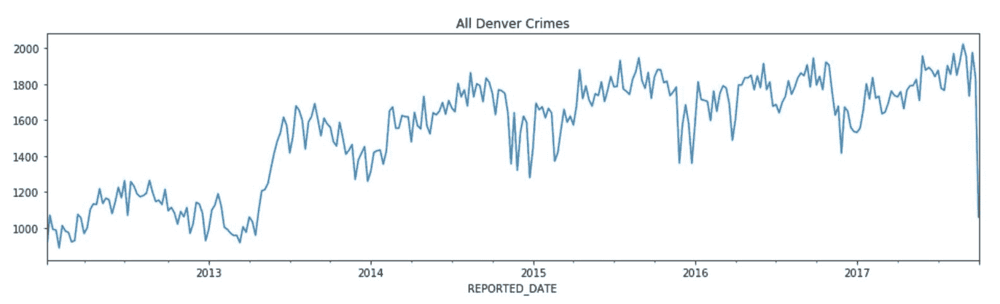

# See also

*   Pandas 关于*重采样*的官方文档（ [http://bit.ly/2yHXrbz](http://pandas.pydata.org/pandas-docs/stable/timeseries.html#resampling) ）
*   所有*锚定偏移量表*（ [http://bit.ly/2xg20h2](http://pandas.pydata.org/pandas-docs/stable/timeseries.html#anchored-offsets) ）

# 分别汇总每周犯罪和交通事故

丹佛犯罪数据集将所有犯罪和交通事故汇总在一个表格中，并通过二进制列`IS_CRIME`和`IS_TRAFFIC`将它们分开。 `resample`方法允许您按一段时间分组并分别汇总特定的列。

# Getting ready

在本食谱中，我们将使用`resample`方法对一年中的每个季度进行分组，然后分别汇总犯罪和交通事故的数量。

# How to do it...

1.  读取犯罪 hdf5 数据集，将索引设置为 `REPORTED_DATE` ，然后对其进行排序以提高其余配方的性能：

```py
>>> crime_sort = pd.read_hdf('data/crime.h5', 'crime') \
                   .set_index('REPORTED_DATE') \
                   .sort_index()
```

2.  使用`resample`方法按一年中的每个季度进行分组，然后将各组的`IS_CRIME`和`IS_TRAFFIC`列求和：

```py
>>> crime_quarterly = crime_sort.resample('Q')['IS_CRIME',
                                               'IS_TRAFFIC'].sum()
>>> crime_quarterly.head()
```

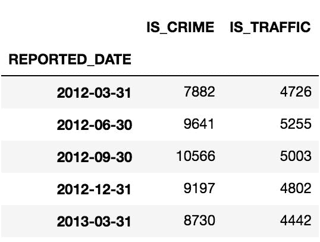

3.  请注意，所有日期均显示为该季度的最后一天。 这是因为偏移别名 *Q* 代表该季度末。 让我们使用偏移别名 *QS* 代表季度的开始：

```py
>>> crime_sort.resample('QS')['IS_CRIME', 'IS_TRAFFIC'].sum().head()
```

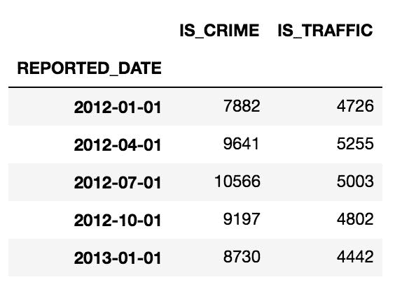

4.  让我们通过检查第二季度的数据是否正确来验证这些结果：

```py
>>> crime_sort.loc['2012-4-1':'2012-6-30', 
                   ['IS_CRIME', 'IS_TRAFFIC']].sum()
IS_CRIME      9641
IS_TRAFFIC    5255
dtype: int64
```

5.  可以使用`groupby`方法复制此操作：

```py
>>> crime_quarterly2 = crime_sort.groupby(pd.Grouper(freq='Q')) \
                                 ['IS_CRIME', 'IS_TRAFFIC'].sum()
>>> crime_quarterly2.equals(crime_quarterly)
True
```

6.  让我们作图以更好地分析一段时间内犯罪和交通事故的趋势：

```py
>>> plot_kwargs = dict(figsize=(16,4), 
                       color=['black', 'lightgrey'], 
                       title='Denver Crimes and Traffic Accidents')
>>> crime_quarterly.plot(**plot_kwargs)
```

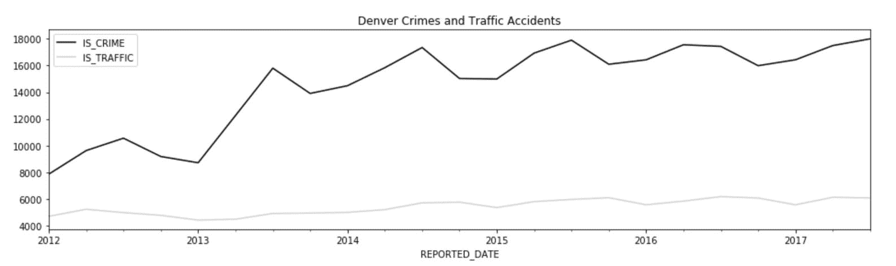

# How it works...

在第 1 步中读取并准备好数据后，我们在第 2 步中开始分组和聚合。调用`resample`方法后，我们可以通过链接方法或选择一组要聚合的列来继续进行操作。 我们选择选择`IS_CRIME`和`IS_TRAFFIC`列进行汇总。 如果我们不只是选择这两个，那么所有数字列的总和将具有以下结果：

```py
>>> crime_sort.resample('Q').sum().head()
```

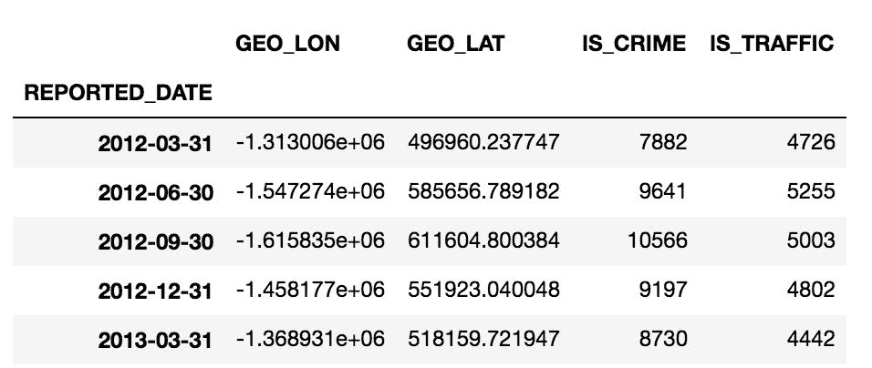

默认情况下，偏移别名 *Q* 在技术上使用 12 月 31 日作为一年的最后一天。 代表一个季度的日期范围全部使用此结束日期计算。 汇总结果使用该季度的最后一天作为标签。 步骤 3 使用偏移别名 *QS* ，默认情况下，它使用 1 月 1 日作为一年的第一天来计算季度。

大多数公共企业都报告季度收入，但是从一月开始，它们都没有相同的日历年。 例如，如果我们希望季度开始于 3 月 1 日，则可以使用 *QS-MAR* 来锚定偏移别名：

```py
>>> crime_sort.resample('QS-MAR')['IS_CRIME', 'IS_TRAFFIC'] \
              .sum().head()
```

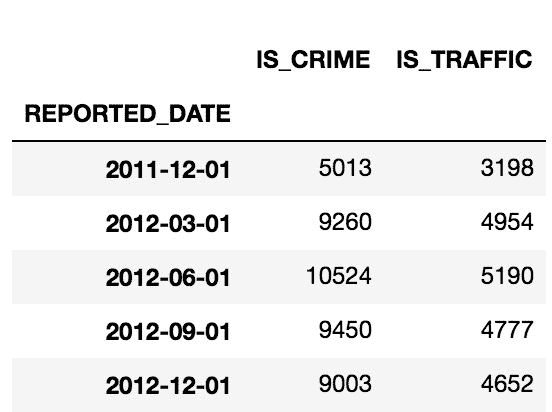

与前面的食谱一样，我们通过手动切片来验证结果，并使用`pd.Grouper`使用`groupby`方法复制结果以设置组长。 在第 6 步中，我们仅调用 DataFrame `plot`方法。 默认情况下，为每列数据绘制一条线。 该图清楚地表明，在今年的前三个季度，报告的犯罪数量急剧增加。 犯罪和贩运似乎都是季节性因素，在较冷的月份数字较低，在较暖的月份数字较高。

# There's more...

为了获得不同的视觉角度，我们可以绘制犯罪和交通增加百分比，而不是原始计数。 让我们将所有数据除以第一行并再次绘图：

```py
>>> crime_begin = crime_quarterly.iloc[0]
>>> crime_begin
IS_CRIME      7882
IS_TRAFFIC    4726
Name: 2012-03-31 00:00:00, dtype: int64

>>> crime_quarterly.div(crime_begin) \
                   .sub(1) \
                   .round(2) \
                   .plot(**plot_kwargs)
```

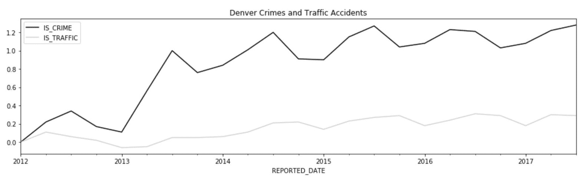

# 按工作日和年份衡量犯罪

通过按工作日和按年衡量犯罪的同时，必须具有直接从时间戳记中提取此信息的功能。 值得庆幸的是，此功能内置于任何包含`dt`访问器的时间戳组成的列中。

# Getting ready

在本食谱中，我们将使用`dt`访问器为我们提供每个犯罪的工作日名称和年份（系列）。 我们通过使用这两个系列的小组来计算所有犯罪。 最后，我们在创建犯罪总量热图之前，调整数据以考虑部分年份和人口。

# How to do it...

1.  读入丹佛犯罪 hdf5 数据集，将`REPORTED_DATE`保留为一列：

```py
>>> crime = pd.read_hdf('data/crime.h5', 'crime')
>>> crime.head()
```

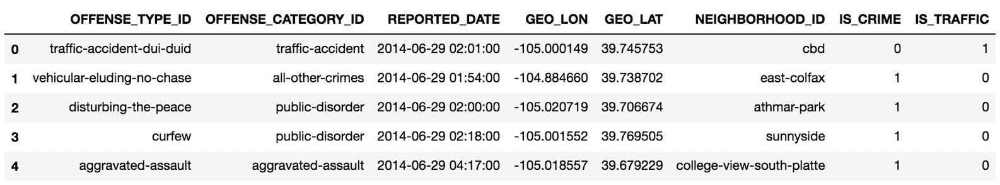

2.  所有“时间戳记”列均具有称为`dt`访问器的特殊属性，该属性可访问为它们专门设计的各种其他属性和方法。 让我们找到每个`REPORTED_DATE`的工作日名称，然后计算这些值：

```py
>>> wd_counts = crime['REPORTED_DATE'].dt.weekday_name \
                                         .value_counts()
>>> wd_counts
Monday       70024
Friday       69621
Wednesday    69538
Thursday     69287
Tuesday      68394
Saturday     58834
Sunday       55213
Name: REPORTED_DATE, dtype: int64
```

3.  周末看来，犯罪和交通事故的发生率大大降低。 让我们按正确的工作日顺序排列此数据，并绘制水平条形图：

```py
>>> days = ['Monday', 'Tuesday', 'Wednesday', 'Thursday', 
            'Friday', 'Saturday', 'Sunday']
>>> title = 'Denver Crimes and Traffic Accidents per Weekday'
>>> wd_counts.reindex(days).plot(kind='barh', title=title)
```

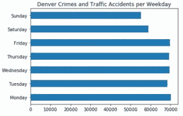

4.  我们可以执行非常类似的过程来按年份绘制计数：

```py
>>> title = 'Denver Crimes and Traffic Accidents per Year' 
>>> crime['REPORTED_DATE'].dt.year.value_counts() \
                             .sort_index() \
                             .plot(kind='barh', title=title)
```

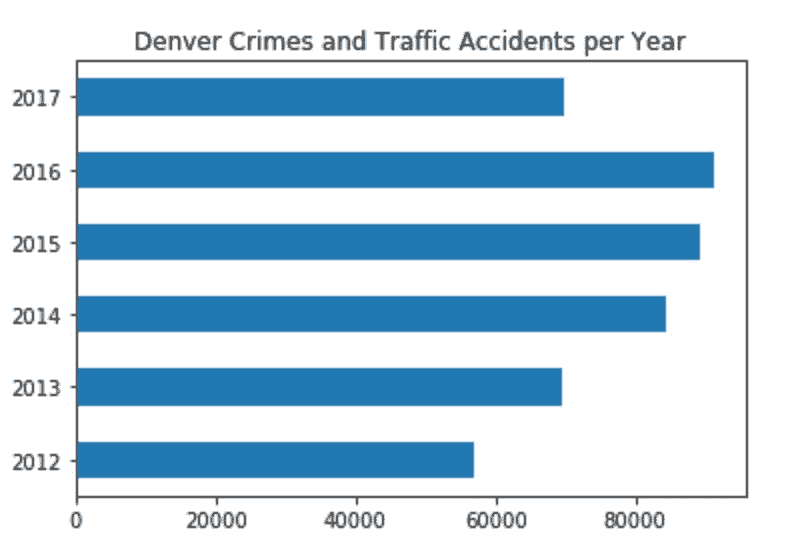

5.  我们需要按工作日和年份分组。 一种方法是将工作日和年份系列保存为单独的变量，然后将这些变量与`groupby`方法一起使用：

```py
>>> weekday = crime['REPORTED_DATE'].dt.weekday_name
>>> year = crime['REPORTED_DATE'].dt.year

>>> crime_wd_y = crime.groupby([year, weekday]).size()
>>> crime_wd_y.head(10)
REPORTED_DATE  REPORTED_DATE
2012           Friday            8549
               Monday            8786
               Saturday          7442
               Sunday            7189
               Thursday          8440
               Tuesday           8191
               Wednesday         8440
2013           Friday           10380
               Monday           10627
               Saturday          8875
dtype: int64
```

6.  我们已经正确汇总了数据，但是结构并不完全有利于轻松进行比较。 让我们先重命名那些无意义的索引级别名称，然后再将`unstack`重命名为工作日级别，以使我们的表更具可读性：

```py
>>> crime_table = crime_wd_y.rename_axis(['Year', 'Weekday']) \
                            .unstack('Weekday')
>>> crime_table
```

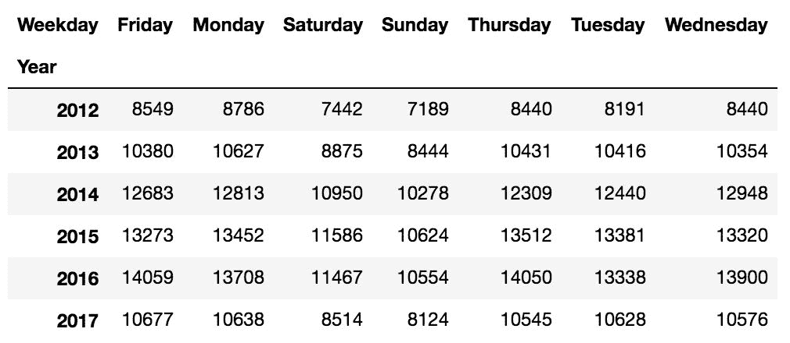

7.  现在，我们有了更好的表示形式，更易于阅读，但值得注意的是，2017 年的数字并不完整。 为了更公平地进行比较，我们可以进行简单的线性外推法来估算犯罪的最终数量。 首先让我们找到 2017 年数据的最后一天：

```py
>>> criteria = crime['REPORTED_DATE'].dt.year == 2017
>>> crime.loc[criteria, 'REPORTED_DATE'].dt.dayofyear.max()
272
```

8.  天真的估计是假设全年犯罪率保持不变，并将 2017 年表中的所有值乘以 365/272。 但是，我们可以做得更好，查看历史数据并计算在一年的前 272 天中发生的犯罪的平均百分比：

```py
>>> round(272 / 365, 3)
.745

>>> crime_pct = crime['REPORTED_DATE'].dt.dayofyear.le(272) \
                                      .groupby(year) \
                                      .mean() \
                                      .round(3)
>>> crime_pct
REPORTED_DATE
2012    0.748
2013    0.725
2014    0.751
2015    0.748
2016    0.752
2017    1.000
Name: REPORTED_DATE, dtype: float64

>>> crime_pct.loc[2012:2016].median()
.748
```

9.  事实证明，也许非常巧合的是，在一年的前 272 天发生的犯罪百分比几乎与该年过去的天数百分比成正比。 现在让我们更新 2017 年的行，并更改列顺序以匹配工作日顺序：

```py
>>> crime_table.loc[2017] = crime_table.loc[2017].div(.748) \
                                        .astype('int')
>>> crime_table = crime_table.reindex(columns=days)
>>> crime_table
```

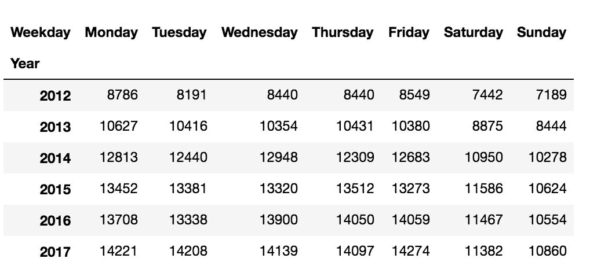

10.  我们可以绘制条形图或折线图，但这对于热图也是一个很好的情况，seaborn 库中提供了该图：

```py
>>> import seaborn as sns
>>> sns.heatmap(crime_table, cmap='Greys')
```

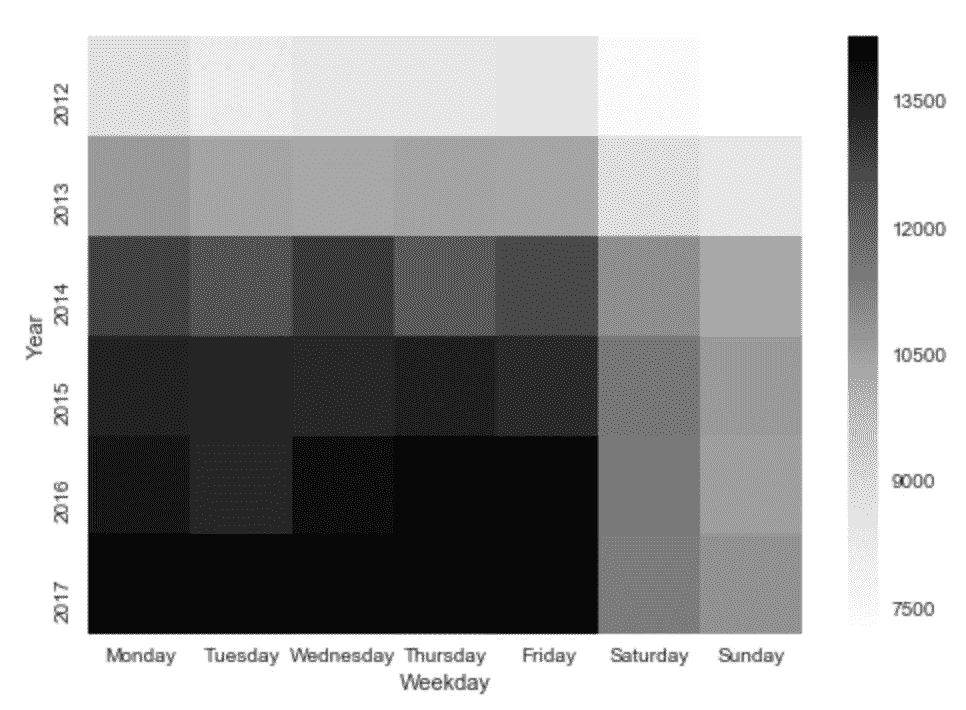

11.  犯罪似乎每年都在增加，但是该数据并未说明人口的增长。 让我们读一下有数据的每年丹佛人口的表格：

```py
>>> denver_pop = pd.read_csv('data/denver_pop.csv',
                             index_col='Year')
>>> denver_pop
```

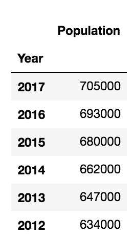

12.  据报告，许多犯罪指标是每 100,000 名居民的比率。 让我们将人口除以 100,000，然后将原始犯罪计数除以该数字即可得出每 100,000 居民的犯罪率：

```py
>>> den_100k = denver_pop.div(100000).squeeze()
>>> crime_table2 = crime_table.div(den_100k, axis='index') \
                              .astype('int')
>>> crime_table2
```

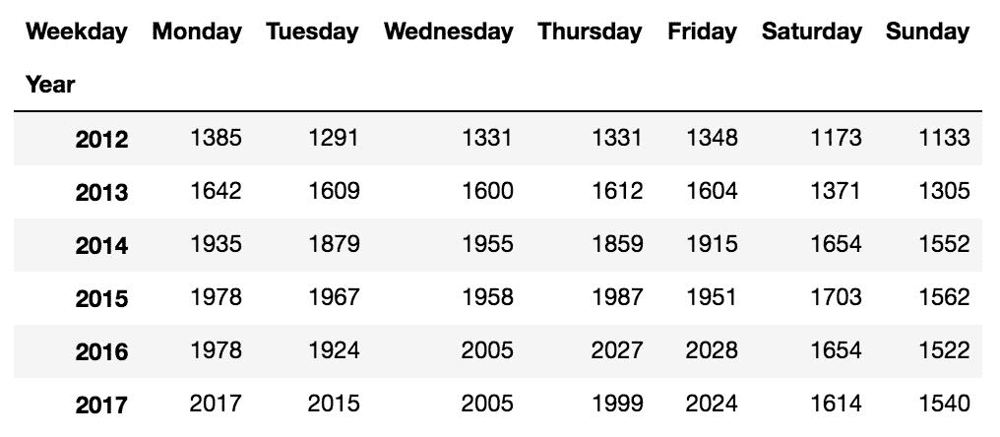

13.  再一次，我们可以制作一个热图，即使在调整了人口增长之后，该热图看起来也几乎与第一个相同：

```py
>>> sns.heatmap(crime_table2, cmap='Greys')
```

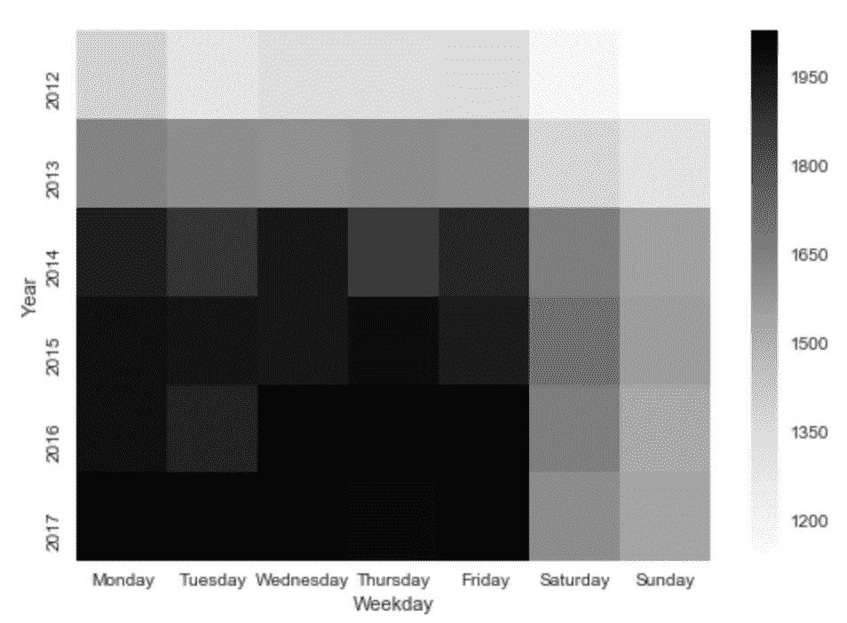

# How it works...

所有包含时间戳记的数据帧列都可以使用 `dt` 访问器访问许多其他属性和方法。 实际上，从 `dt` 访问器可用的所有这些方法和属性也可以直接从单个 Timestamp 对象获得。

在第 2 步中，我们使用仅适用于系列的`dt`访问器来提取工作日名称并简单地计算发生次数。 在执行步骤 3 之前，我们使用`reindex`方法手动重新排列索引的顺序，在最基本的使用情况下，该方法接受包含所需顺序的列表。 也可以使用`.loc`索引器完成此任务，如下所示：

```py
>>> wd_counts.loc[days]
Monday       70024
Tuesday      68394
Wednesday    69538
Thursday     69287
Friday       69621
Saturday     58834
Sunday       55213
Name: REPORTED_DATE, dtype: int64
```

与`.loc`相比，`reindex`方法实际上性能更高，并且在更多情况下具有许多参数。 然后，我们使用`dt`访问器的`weekday_name`属性检索一周中每一天的名称，并在制作水平条形图之前对出现的次数进行计数。

在第 4 步中，我们执行一个非常相似的过程，并再次使用`dt`访问器检索年份，然后使用`value_counts`方法对发生次数进行计数。 在这种情况下，我们使用`sort_index`而不是`reindex`，因为年份自然会按所需顺序排序。

配方的目标是将工作日和年份进行分组，因此这正是我们在第 5 步中所做的。`groupby`方法非常灵活，可以通过多种方式进行分组。 在此配方中，我们将两个系列`year`和`weekday`传递给它们，所有唯一的组合从中组成一个组。 然后，我们将`size`方法链接到该方法，该方法返回单个值，即每个组的长度。

在第 5 步之后，我们的系列很长，只有一列数据，这使得很难按年和工作日进行比较。 为了简化可读性，我们将工作日级别使用`unstack`旋转为水平列名称。

在步骤 7 中，我们使用布尔索引来仅选择 2017 年的犯罪，然后再次使用`dt`访问器中的`dayofyear`查找从年初开始经过的总天数。 该系列的最大值应告诉我们 2017 年有多少天的数据。

步骤 8 非常复杂。 我们首先通过使用`crime['REPORTED_DATE'].dt.dayofyear.le(272)`测试每个犯罪是否在每年的第 272 天或之前犯下来创建布尔值系列。 从这里开始，我们再次使用灵活的`groupby`方法按照先前计算的`year`系列来分组，然后使用`mean`方法来查找每年第 272 天或之前的犯罪百分比。

`.loc`索引器在步骤 9 中选择整个 2017 年数据行。我们用该行除以在步骤 8 中找到的中位数百分比来调整该行。

许多犯罪的可视化都是通过热图完成的，其中一个步骤是在第 10 步借助`seaborn`可视化库完成的。 `cmap`参数采用几十个可用 matplotlib 颜色图的字符串名称（ [http://bit.ly/2yJZOvt](https://matplotlib.org/examples/color/colormaps_reference.html) ）。

在第 12 步中，我们将`100k`居民的犯罪率除以该年的人口。 这实际上是一个相当棘手的操作。 通常，将一个数据帧除以另一个时，它们在其列和索引上对齐。 但是，在此步骤中，`crime_table`没有公用的`denver_pop`列，因此，如果我们尝试对它们进行划分，则没有值会对齐。 要解决此问题，我们使用 `squeeze` 方法创建了 `den_100k` 系列。 我们仍然不能简单地划分这两个对象，因为默认情况下，数据帧和序列之间的划分会将数据帧的列与序列的索引对齐，如下所示：

```py
>>> crime_table / den_100k
```

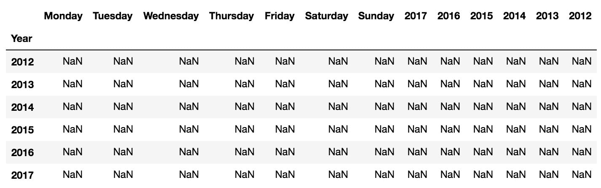

我们需要数据帧的索引与序列的索引对齐，并且为此，我们使用`div`方法，该方法允许我们使用`axis`参数更改对齐方向。 在步骤 13 中绘制已调整犯罪率的`heatmap`。

# There's more...

让我们通过编写一个函数来一次完成此食谱的所有步骤并添加选择特定类型犯罪的功能来完成此分析的完成：

```py
>>> ADJ_2017 = .748

>>> def count_crime(df, offense_cat):
        df = df[df['OFFENSE_CATEGORY_ID'] == offense_cat]
        weekday = df['REPORTED_DATE'].dt.weekday_name
        year = df['REPORTED_DATE'].dt.year

        ct = df.groupby([year, weekday]).size().unstack()
        ct.loc[2017] = ct.loc[2017].div(ADJ_2017).astype('int')

        pop = pd.read_csv('data/denver_pop.csv', index_col='Year')
        pop = pop.squeeze().div(100000)

        ct = ct.div(pop, axis=0).astype('int')
        ct = ct.reindex(columns=days)
        sns.heatmap(ct, cmap='Greys')
        return ct

>>> count_crime(crime, 'auto-theft')
```

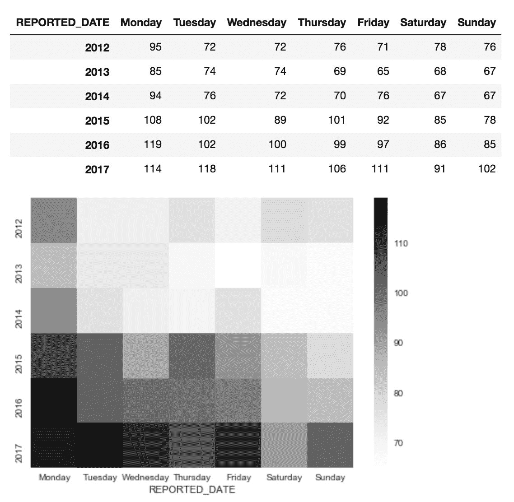

# See also

*   Pandas`reindex`方法的官方文档（ [http://bit.ly/2y40eyE](https://pandas.pydata.org/pandas-docs/stable/generated/pandas.DataFrame.reindex.html) ）
*   `heatmap`功能的原始官方文档（ [http://bit.ly/2ytbMNe](https://seaborn.pydata.org/generated/seaborn.heatmap.html) ）

# 使用带有 DatetimeIndex 的匿名函数进行分组

将 DataFrames 与`DatetimeIndex`一起使用将为许多新的和不同的操作打开一扇门，如本章中的几个配方所示。

# Getting ready

在本食谱中，我们将展示对具有`DatetimeIndex`的数据帧使用`groupby`方法的多功能性。

# How to do it...

1.  读入丹佛`crime hdf5`文件，将`REPORTED_DATE`列放在索引中，然后对其进行排序：

```py
>>> crime_sort = pd.read_hdf('data/crime.h5', 'crime') \
                   .set_index('REPORTED_DATE') \
                   .sort_index()
```

2.  `DatetimeIndex`本身具有许多与 Pandas`Timestamp`相同的属性和方法。 让我们看一下它们的共同点：

```py
>>> common_attrs = set(dir(crime_sort.index)) & \
                   set(dir(pd.Timestamp))
>>> print([attr for attr in common_attrs if attr[0] != '_'])

['to_pydatetime', 'normalize', 'day', 'dayofyear', 'freq', 'ceil', 
'microsecond', 'tzinfo', 'weekday_name', 'min', 'quarter', 'month', 
'tz_convert', 'tz_localize', 'is_month_start', 'nanosecond', 'tz', 
'to_datetime', 'dayofweek', 'year', 'date', 'resolution', 'is_quarter_end', 
'weekofyear', 'is_quarter_start', 'max', 'is_year_end', 'week', 'round', 
'strftime', 'offset', 'second', 'is_leap_year', 'is_year_start', 
'is_month_end', 'to_period', 'minute', 'weekday', 'hour', 'freqstr', 
'floor', 'time', 'to_julian_date', 'days_in_month', 'daysinmonth']
```

3.  然后，我们可以使用索引来查找工作日名称，类似于上一食谱的步骤 2 中所做的操作：

```py
>>> crime_sort.index.weekday_name.value_counts()
Monday       70024
Friday       69621
Wednesday    69538
Thursday     69287
Tuesday      68394
Saturday     58834
Sunday       55213
Name: REPORTED_DATE, dtype: int64
```

4.  令人惊讶的是，`groupby`方法具有接受函数作为参数的能力。 该函数将隐式传递给索引，并且其返回值用于形成组。 让我们通过使用将索引转换为工作日名称的函数进行分组，然后分别计算犯罪和交通事故的数量，来了解这一点：

```py
>>> crime_sort.groupby(lambda x: x.weekday_name) \
               ['IS_CRIME', 'IS_TRAFFIC'].sum()
```

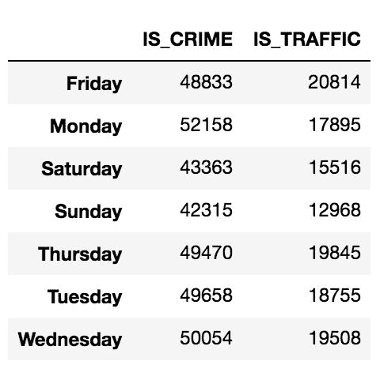

5.  您可以使用功能列表按年中的小时和年进行分组，然后对表进行整形以使其更具可读性：

```py
>>> funcs = [lambda x: x.round('2h').hour, lambda x: x.year]
>>> cr_group = crime_sort.groupby(funcs) \
                          ['IS_CRIME', 'IS_TRAFFIC'].sum()
>>> cr_final = cr_group.unstack()
>>> cr_final.style.highlight_max(color='lightgrey')
```

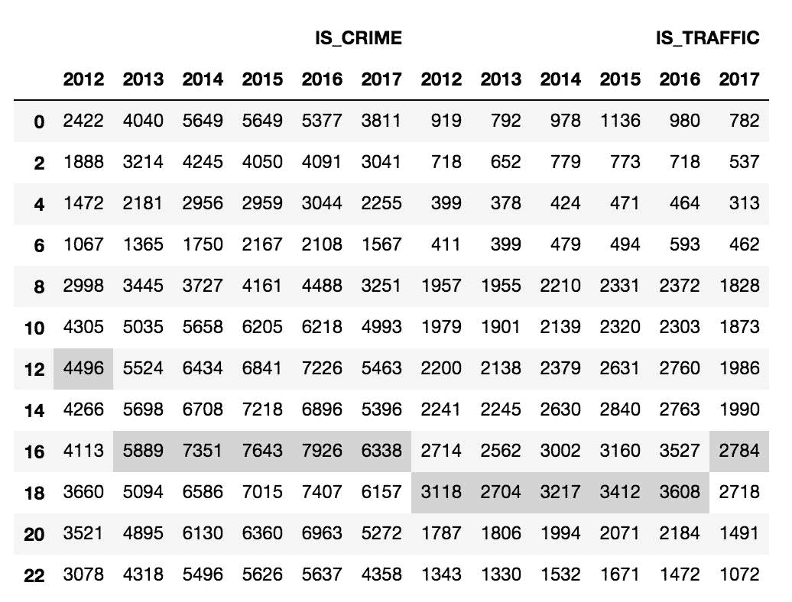

# How it works...

在第 1 步中，我们读入数据并将一列 Timestamps 放入索引中以创建 DatetimeIndex。 在第 2 步中，我们看到 DatetimeIndex 具有许多与单个 Timestamp 对象相同的功能。 在第 3 步中，我们直接使用 DatetimeIndex 的这些额外功能提取工作日名称。

在步骤 4 中，我们利用`groupby`方法的特殊功能来接受通过 DatetimeIndex 传递的函数。 匿名函数中的`x`实际上是 DatetimeIndex，我们使用它来检索工作日名称。 可以传递`groupby`任意数量的自定义函数的列表，如步骤 5 所示。这里，第一个函数使用`round` DatetimeIndex 方法将每个值四舍五入到最接近的第二小时。 第二个函数检索年份。 在分组和汇总之后，我们将`unstack`年作为列。 然后，我们突出显示每列的最大值。 犯罪率最高的报告时间是下午 3 点至 5 点。 大多数交通事故发生在下午 5 点之间。 晚上 7 点

# There's more...

此配方的最终结果是带有 MultiIndex 列的数据帧。 使用此数据帧，可以仅选择犯罪或交通事故。 `xs`方法允许您从任何索引级别中选择一个值。 让我们看一个示例，其中我们仅选择处理流量的数据部分：

```py
>>> cr_final.xs('IS_TRAFFIC', axis='columns', level=0).head()
```

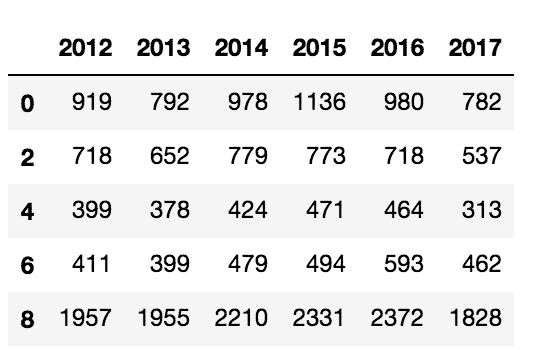

这称为在 Pandas 中截取的横截面。 我们必须使用`axis`和`level`参数专门表示我们的值所在的位置。 让我们再次使用`xs`仅选择 2016 年中处于不同级别的数据：

```py
>>> cr_final.xs(2016, axis='columns', level=1).head()
```

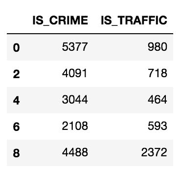

# See also

*   Pandas 的横截面方法`xs`的官方文档（ [http://bit.ly/2xkLzLv](https://pandas.pydata.org/pandas-docs/stable/generated/pandas.DataFrame.xs.html) ）

# 按时间戳和另一列分组

`resample`方法本身无法按时间段进行分组。 但是，`groupby`方法可以按时间段和其他列进行分组。

# Getting ready

在此食谱中，我们将展示两种非常相似但不同的方法来按时间戳分组，并在另一列中进行。

# How to do it...

1.  读取`employee`数据集，并使用`HIRE_DATE`列创建 DatetimeIndex：

```py
>>> employee = pd.read_csv('data/employee.csv', 
                           parse_dates=['JOB_DATE', 'HIRE_DATE'], 
                           index_col='HIRE_DATE')
>>> employee.head()
```

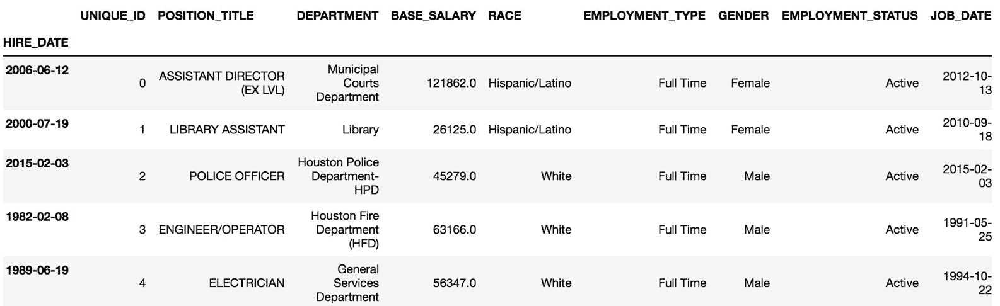

2.  首先，让我们按性别进行简单分组，然后找到每个分组的平均工资：

```py
>>> employee.groupby('GENDER')['BASE_SALARY'].mean().round(-2)
GENDER
Female    52200.0
Male      57400.0
Name: BASE_SALARY, dtype: float64
```

3.  让我们根据租用日期找到平均薪水，然后将每个人归类为 10 年：

```py
>>> employee.resample('10AS')['BASE_SALARY'].mean().round(-2)
HIRE_DATE
1958-01-01     81200.0
1968-01-01    106500.0
1978-01-01     69600.0
1988-01-01     62300.0
1998-01-01     58200.0
2008-01-01     47200.0
Freq: 10AS-JAN, Name: BASE_SALARY, dtype: float64
```

4.  如果我们想按性别和五年时间跨度分组，可以在致电`groupby`之后直接致电`resample`：

```py
>>> employee.groupby('GENDER').resample('10AS')['BASE_SALARY'] \
            .mean().round(-2)
GENDER  HIRE_DATE 
Female  1975-01-01     51600.0
        1985-01-01     57600.0
        1995-01-01     55500.0
        2005-01-01     51700.0
        2015-01-01     38600.0
Male    1958-01-01     81200.0
        1968-01-01    106500.0
        1978-01-01     72300.0
        1988-01-01     64600.0
        1998-01-01     59700.0
        2008-01-01     47200.0
Name: BASE_SALARY, dtype: float64
```

5.  现在，这已经完成了我们打算要做的工作，但是每当我们要比较男性和女性的工资时，我们都会遇到一个小问题。 让我们`unstack`性别级别，看看会发生什么：

```py
>>> sal_avg.unstack('GENDER')
```

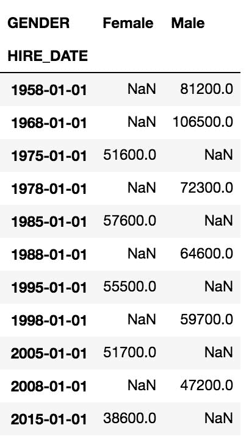

6.  男性和女性的 10 年期限不在同一日期开始。 发生这种情况的原因是，数据首先按性别分组，然后在每种性别内，根据雇用日期组成了更多的组。 让我们验证一下第一位雇用的男性是 1958 年，第一位雇用的女性是 1975 年：

```py
>>> employee[employee['GENDER'] == 'Male'].index.min()
Timestamp('1958-12-29 00:00:00')

>>> employee[employee['GENDER'] == 'Female'].index.min()
Timestamp('1975-06-09 00:00:00')
```

7.  要解决此问题，我们必须将日期与性别一起分组，并且只有通过`groupby`方法才能做到这一点：

```py
>>> sal_avg2 = employee.groupby(['GENDER', 
                                 pd.Grouper(freq='10AS')]) \
                        ['BASE_SALARY'].mean().round(-2)
>>> sal_avg2
GENDER  HIRE_DATE 
Female  1968-01-01         NaN
        1978-01-01     57100.0
        1988-01-01     57100.0
        1998-01-01     54700.0
        2008-01-01     47300.0
Male    1958-01-01     81200.0
        1968-01-01    106500.0
        1978-01-01     72300.0
        1988-01-01     64600.0
        1998-01-01     59700.0
        2008-01-01     47200.0
Name: BASE_SALARY, dtype: float64
```

8.  现在我们可以`unstack`性别，使行完美对齐：

```py
>>> sal_final = sal_avg2.unstack('GENDER')
>>> sal_final
```

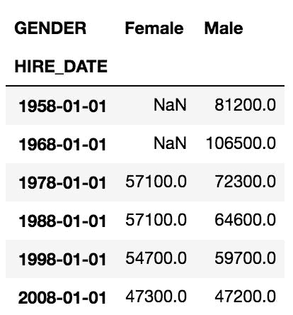

# How it works...

步骤 1 中的`read_csv`函数允许将列都转换为时间戳，并同时将它们放入索引中，以创建 DatetimeIndex。 第 2 步使用单个分组列“性别”执行简单的`groupby`操作。 步骤 3 使用`resample`方法和偏移别名 *10AS* 以 10 年的时间增量形成组。 *A* 是年份的别名， *S* 通知我们该时期的开始用作标签。 例如，标签 *1988-01-01* 的数据跨越该日期，直到 1997 年 12 月 31 日为止。

有趣的是，从对`groupby`方法的调用返回的对象具有其自己的`resample`方法，但反之则不成立：

```py
>>> 'resample' in dir(employee.groupby('GENDER'))
True

>>> 'groupby' in dir(employee.resample('10AS'))
False
```

在第 4 步中，根据最早雇用的员工，计算出男女的 10 年完全不同的开始日期。 步骤 6 验证每种性别最早雇用的雇员的年份与步骤 4 的输出相匹配。步骤 5 显示了当我们尝试将女性的工资与男性的工资进行比较时，这如何导致不一致。 他们没有相同的 10 年期限。

要缓解此问题，我们必须将“性别”和“时间戳记”归为一组。 `resample`方法仅能按单个时间戳记分组。 我们只能使用`groupby`方法完成此操作。 使用`pd.Grouper`，我们可以复制`resample`的功能。 我们只需将偏移别名传递给`freq`参数，然后将对象与我们希望分组的所有其他列一起放在列表中，如步骤 7 所示。由于现在男性和女性的开始日期都相同 10 年期间，步骤 8 中的重塑数据将针对每种性别进行调整，从而使比较变得更加容易。 看起来，随着工作时间的延长，男性的工资往往会更高，尽管在 10 年以下的工作中，男性和女性的平均工资相同。

# There's more...

从局外人的角度来看，步骤 8 中输出的行代表 10 年的间隔并不明显。 改善索引标签的一种方法是显示每个时间间隔的开始和结束。 我们可以通过将当前索引年份与自身添加的 9 串联来实现此目的：

```py
>>> years = sal_final.index.year
>>> years_right = years + 9
>>> sal_final.index = years.astype(str) + '-' + years_right.astype(str)
>>> sal_final
```

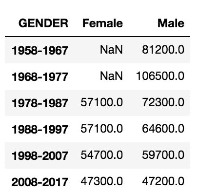

实际上，有一种完全不同的方法来制作此食谱。 我们可以使用`cut`函数根据每位员工的受聘年限并从中形成组来创建等宽间隔：

```py
>>> cuts = pd.cut(employee.index.year, bins=5, precision=0)
>>> cuts.categories.values
array([Interval(1958.0, 1970.0, closed='right'),
       Interval(1970.0, 1981.0, closed='right'),
       Interval(1981.0, 1993.0, closed='right'),
       Interval(1993.0, 2004.0, closed='right'),
       Interval(2004.0, 2016.0, closed='right')], dtype=object)

>>> employee.groupby([cuts, 'GENDER'])['BASE_SALARY'] \
            .mean().unstack('GENDER').round(-2)
```

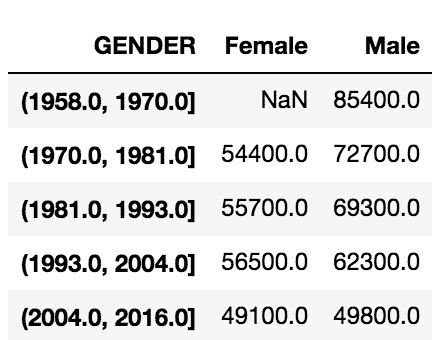

# 使用 merge_asof 查找上次犯罪率降低了 20％

很多时候，我们想知道上一次发生什么事情的时间。 例如，我们可能对上一次失业率低于 5％或上一次股市连续五天上涨或上一次睡眠八个小时感兴趣。 `merge_asof`功能为这些类型的问题提供答案。

# Getting ready

在此配方中，我们将找到每种犯罪类别当月的犯罪总数，然后找到上次发生率降低 20％的时间。

# How to do it...

1.  读入丹佛犯罪数据集，将`REPORTED_DATE`放在索引中，然后对其进行排序：

```py
>>> crime_sort = pd.read_hdf('data/crime.h5', 'crime') \
               .set_index('REPORTED_DATE') \
               .sort_index()
```

2.  查找最近一个月的数据：

```py
>>> crime_sort.index.max()
Timestamp('2017-09-29 06:16:00')
```

3.  由于我们没有 9 月份的全部数据，因此将其从数据集中删除：

```py
>>> crime_sort = crime_sort[:'2017-8']
>>> crime_sort.index.max()
Timestamp('2017-08-31 23:52:00')
```

4.  让我们计算每个月的犯罪和交通事故数量：

```py
>>> all_data = crime_sort.groupby([pd.Grouper(freq='M'),
                                   'OFFENSE_CATEGORY_ID']).size()
>>> all_data.head()
REPORTED_DATE  OFFENSE_CATEGORY_ID
2012-01-31     aggravated-assault     113
               all-other-crimes       124
               arson                    5
               auto-theft             275
               burglary               343
dtype: int64
```

5.  尽管`merge_asof`函数可以使用索引，但重置它会更容易：

```py
>>> all_data = all_data.sort_values().reset_index(name='Total')
>>> all_data.head()
```

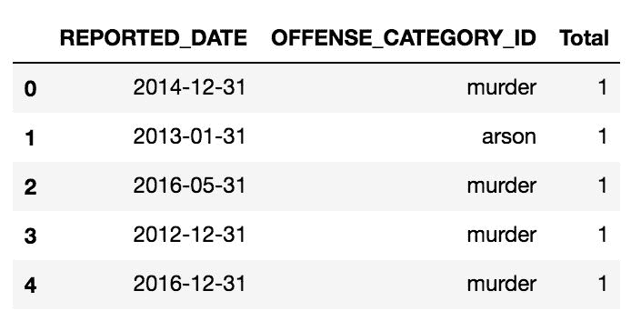

6.  让我们获取当前月份的犯罪计数，并新建一个列来表示目标：

```py
>>> goal = all_data[all_data['REPORTED_DATE'] == '2017-8-31'] \
                   .reset_index(drop=True)
>>> goal['Total_Goal'] = goal['Total'].mul(.8).astype(int)
>>> goal.head()
```

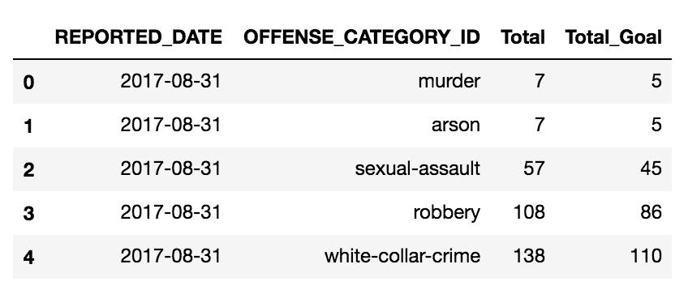

7.  现在使用`merge_asof` 函数查找每个犯罪类别的每月犯罪总数上一次小于`Total_Goal`列的时间：

```py
>>> pd.merge_asof(goal, all_data, left_on='Total_Goal',
                  right_on='Total', by='OFFENSE_CATEGORY_ID',
                  suffixes=('_Current', '_Last'))
```

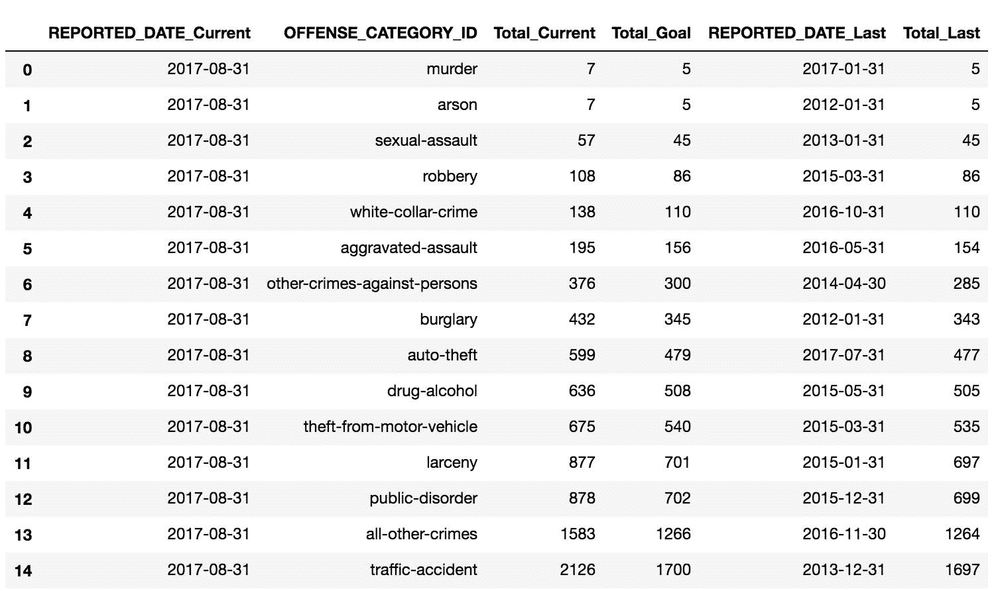

# How it works...

读完我们的数据后，我们决定不包括 2017 年 9 月的数据，因为它不是一个完整的月份。 我们使用部分日期字符串对直至 2017 年 8 月的所有犯罪进行分割，在第 4 步中，我们统计每月每个犯罪类别的所有犯罪，在第 5 步中，我们按此总数进行排序，得出 对于`merge_asof`是必需的。

在第 6 步中，我们将最新数据选择到单独的数据帧中。 我们将以 8 月的这个月为基准，并创建`Total_Goal`列，该列比当前少 20％。 在第 7 步中，我们使用`merge_asof`查找上一次每月犯罪计数少于`Total_Goal`列的时间。

# There's more...

除了 Timestamp 和 Timedelta 数据类型外，pandas 还提供了 Period 类型来表示确切的时间段。 例如， *2012-05* 代表 2012 年 5 月的整个月份。您可以通过以下方式手动构建“期间”：

```py
>>> pd.Period(year=2012, month=5, day=17, hour=14, minute=20, freq='T')
Period('2012-05-17 14:20', 'T')
```

该对象表示 2012 年 5 月 17 日下午 2:20 的整个分钟。 可以在步骤 4 中使用这些期间，而不用`pd.Grouper`按日期分组。 具有 DatetimeIndex 的数据帧具有`to_period`方法，可以将时间戳转换为期间。 它接受偏移别名来确定时间段的确切长度。

```py
>>> ad_period = crime_sort.groupby([lambda x: x.to_period('M'), 
                                    'OFFENSE_CATEGORY_ID']).size()
>>> ad_period = ad_period.sort_values() \
                         .reset_index(name='Total') \
                         .rename(columns={'level_0':'REPORTED_DATE'})
>>> ad_period.head()
```

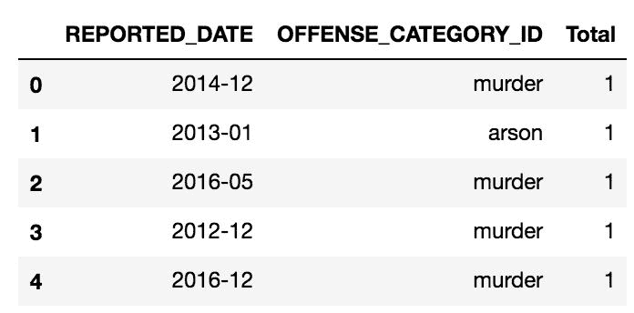

让我们验证此数据帧的最后两列是否等效于步骤 5 中的`all_data`：

```py
>>> cols = ['OFFENSE_CATEGORY_ID', 'Total']
>>> all_data[cols].equals(ad_period[cols])
True
```

现在，可以使用以下代码以几乎完全相同的方式复制步骤 6 和 7：

```py
>>> aug_2018 = pd.Period('2017-8', freq='M')
>>> goal_period = ad_period[ad_period['REPORTED_DATE'] == aug_2018] \
                           .reset_index(drop=True)
>>> goal_period['Total_Goal'] = goal_period['Total'].mul(.8).astype(int)

>>> pd.merge_asof(goal_period, ad_period, left_on='Total_Goal',
                  right_on='Total', by='OFFENSE_CATEGORY_ID',
                  suffixes=('_Current', '_Last')).head()
```

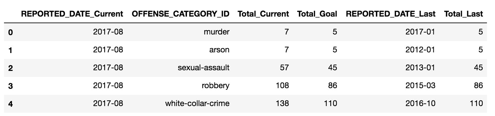