# Pandas，Matplotlib 和 Seaborn 的可视化

在本章中，我们将介绍以下主题：

*   matplotlib 入门
*   使用 matplotlib 可视化数据
*   用 Pandas 绘制基础知识
*   可视化航班数据集
*   堆叠面积图以发现新兴趋势
*   了解 Pandas 与 Pandas 的区别
*   使用 Seaborn 网格进行多元分析
*   在 Seaborn 钻石数据集中发现辛普森悖论

# 介绍

可视化是探索性数据分析以及演示和应用程序中的关键组成部分。 在探索性数据分析过程中，您通常是一个人或成小组工作，需要快速创建绘图以帮助您更好地理解数据。 它可以帮助您识别异常值和丢失的数据，也可以引发其他令人感兴趣的问题，这些问题将导致进一步的分析和更直观的显示。 通常不会在考虑最终用户的情况下完成这种类型的可视化。 严格来说是为了帮助您更好地了解当前情况。 情节不一定是完美的。

在为报表或应用程序准备可视化文件时，必须使用其他方法。 注意小细节。 此外，通常您必须将所有可能的可视化范围缩小到仅最能代表您数据的少数几个。 良好的数据可视化使观看者享受提取信息的体验。 就像使观众迷失的电影一样，好的可视化效果将包含大量真正引起人们兴趣的信息。

Python 中主要的数据可视化库是 matplotlib，该项目始于 2000 年代初期，旨在模仿 Matlab 的绘图功能。 Matplotlib 具有极大的能力来绘制您可以想象的大多数事物，它为用户提供了强大的功能来控制绘制表面的各个方面。 也就是说，对于初学者来说，它并不是最友好的库。 值得庆幸的是，Pandas 使我们对数据的可视化变得非常容易，并且通常只需单击`plot`方法即可绘制出我们想要的内容。 Pandas 实际上并没有独自策划。 它在内部调用 matplotlib 函数来创建图。 我认为，Pandas 还添加了自己的样式，该样式比 matplotlib 中的默认样式好一些。

Seaborn 还是一个可视化库，它在内部调用 matplotlib 函数，并且自身不进行任何实际绘制。 Seaborn 可以轻松轻松地制作漂亮的绘图，并允许创建许多新类型的绘图，而这些新绘图无法直接从 matplotlib 或 Pandas 获得。 Seaborn 处理整洁（长）数据，而 Pandas 处理汇总（宽）数据效果最佳。 Seaborn 在其绘图功能中还接受了 Pandas DataFrame 对象。

尽管可以在不直接运行任何 matplotlib 代码的情况下创建图，但有时仍需要使用它来手动调整更精细的图细节。 因此，前两个秘籍将介绍 matplotlib 的一些基础知识，如果您需要直接使用它，将非常有用。 除了前两个秘籍外，所有绘图示例都将使用 Pandas 或海生豆。

Python 中的可视化不一定必须依赖于 matplotlib。 Bokeh 迅速成为针对 Web 的非常流行的交互式可视化库。 它完全独立于 matplotlib，并且能够生成整个应用程序。

# matplotlib 入门

对于许多数据科学家而言，他们绝大部分的绘图命令将直接来自 Pandas 或海生动物，它们都完全依赖于 matplotlib 进行实际的绘图。 但是，pandas 和 seaborn 都不提供 matplotlib 的完整替代品，有时您需要直接使用它。 因此，本秘籍将简要介绍 matplotlib 的最关键方面。

# 准备

让我们从下图中的 matplotlib 图的解剖开始我们的介绍：

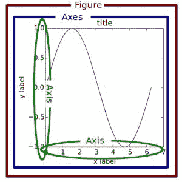

Matplotlib 使用对象层次结构在输出中显示其所有绘图项。 该层次结构是了解有关 matplotlib 的一切的关键。 **图形**和**轴**对象是层次结构的两个主要组成部分。 Figure 对象位于层次结构的顶部。 它是将要绘制的所有内容的容器。 图中包含一个或多个轴对象。 轴是使用 matplotlib 时将与之交互的主要对象，通常可以将其视为实际的绘图表面。 轴包含 *x/y* 轴，点，线，标记，标签，图例以及其他任何绘制的有用项目。

In early 2017, matplotlib underwent a major change when it released version 2.0\. Much of the default plotting parameters were changed. The anatomy figure is actually from the documentation of version 1 but does a better job at distinguishing between the Figure and the Axes than the updated anatomy figure from version 2 ([http://bit.ly/2gmNV7h](http://bit.ly/2gmNV7h)).

需要在轴对象和轴之间进行非常明显的区分。 它们是完全独立的对象。 使用 matplotlib 术语的 Axes 对象不是轴的复数，而是如前所述，该对象创建并控制了大多数有用的绘图元素。 轴仅指图的 *x* 或 *y* （甚至 *z*）轴。

It is unfortunate that matplotlib chose to use axes, the plural of the word axis, to refer to a completely different object, but it is central to the library and unlikely to be changed at this point.

由 Axes 对象创建的所有这些有用的绘图元素都称为艺术家。 甚至 Figure 和 Axes 对象本身也是艺术家。 对艺术家的这种区分对本秘籍而言并不重要，但在进行更高级的 matplotlib 绘图时，尤其是在阅读文档时，将很有用。

# Matplotlib 的面向对象指南

Matplotlib 为用户提供了两个不同的界面来进行绘图。 **有状态**接口直接通过`pyplot`模块进行所有调用。 此接口称为**有状态**，因为 matplotlib 隐式跟踪绘图环境的当前状态。 每当在有状态接口中创建图时，matplotlib 都会找到当前图形或当前轴并对其进行更改。 这种方法可以快速绘制一些东西，但是当处理多个图形和轴时可能变得笨拙。

Matplotlib 还提供了无状态或**面向对象**的接口，您可以在其中显式使用引用特定绘图对象的变量。 然后可以使用每个变量来更改绘图的某些属性。 面向对象的方法是显式的，您始终清楚地知道要修改的对象。

不幸的是，同时使用这两个选项会导致很多混乱，并且 matplotlib 以难以学习而著称。 该文档提供了使用这两种方法的示例。 教程，博客文章， Stack Overflow 文章在网络上比比皆是，这使这种混乱永久化。 本秘籍仅专注于面向对象的方法，因为它具有更多的 Python 风格，并且与我们与 Pandas 互动的方式更加相似。

如果您不熟悉 matplotlib，则可能不知道如何识别每种方法之间的差异。 通过有状态接口，所有命令将直接从`pyplot`发出，通常是别名`plt`。 制作简单的线图并在每个轴上添加一些标签如下所示：

```py
>>> import matplotlib.pyplot as plt

>>> x = [-3, 5, 7]
>>> y = [10, 2, 5]

>>> plt.figure(figsize=(15,3))
>>> plt.plot(x, y)
>>> plt.xlim(0, 10)
>>> plt.ylim(-3, 8)
>>> plt.xlabel('X Axis')
>>> plt.ylabel('Y axis')
>>> plt.title('Line Plot')
>>> plt.suptitle('Figure Title', size=20, y=1.03)
```

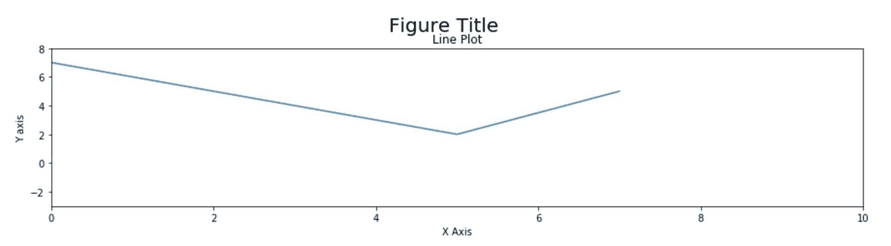

面向对象的方法仍然使用`pyplot`，但是通常，它只是在第一步中创建 Figure 和 Axes 对象。 创建后，将直接调用这些对象的方法来更改绘图。 以下代码使用面向对象的方法对上一个图进行精确复制：

```py
>>> fig, ax = plt.subplots(figsize=(15,3))
>>> ax.plot(x, y)
>>> ax.set_xlim(0, 10)
>>> ax.set_ylim(-3, 8)
>>> ax.set_xlabel('X axis')
>>> ax.set_ylabel('Y axis')
>>> ax.set_title('Line Plot')
>>> fig.suptitle('Figure Title', size=20, y=1.03)
```

在这个简单的示例中，我们仅直接使用两个对象，即图形和轴，但是通常，图可以包含数百个对象； 可以使用每一种都以非常精细的方式进行修改，而使用状态接口则不容易做到。 在本章中，我们将构建一个空图并使用面向对象的界面修改其一些基本属性。

# 操作步骤

1.  要使用面向对象的方法开始使用 matplotlib，您将需要导入`pyplot`模块和别名`plt`：

```py
>>> import matplotlib.pyplot as plt
```

2.  通常，当使用面向对象的方法时，我们将创建一个 Figure 和一个或多个 Axes 对象。 让我们使用`subplots`函数创建具有单个轴的图形：

```py
>>> fig, ax = plt.subplots(nrows=1, ncols=1)
```

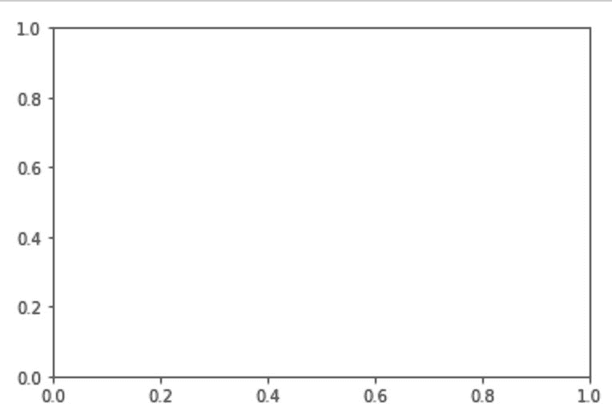

3.  `subplots`函数返回一个包含 Figure 和一个或多个 Axes 对象（这里只是一个）的两个项目元组对象，这些对象被解包到变量`fig`和`ax`中。 从现在开始，我们将通过常规的面向对象方法调用方法来直接使用这些对象。 让我们看一下每个对象的类型，以确保我们实际使用的是 Figure 和 Axes：

```py
>>> type(fig)
matplotlib.figure.Figure

>>> type(ax)
matplotlib.axes._subplots.AxesSubplot
```

4.  尽管您将调用比 Figure 方法更多的 Axes，但您可能仍需要与它们交互。 让我们找到图的大小，然后将其放大：

```py
>>> fig.get_size_inches()
array([ 6.,  4.])

>>> fig.set_size_inches(14, 4)
>>> fig
```

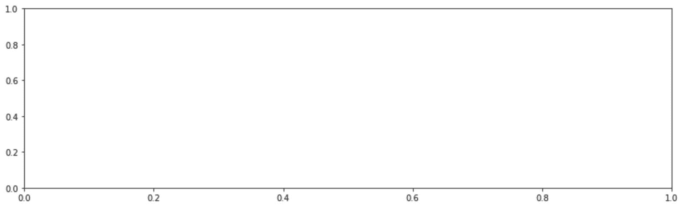

5.  在开始绘制之前，让我们检查一下 matplotlib 层次结构。 您可以使用`axes`属性收集图中的所有轴：

```py
>>> fig.axes
[<matplotlib.axes._subplots.AxesSubplot at 0x112705ba8>]
```

6.  此命令返回所有轴对象的列表。 但是，我们已经将轴对象存储在`ax` 变量中。 让我们确认它们实际上是同一对象：

```py
>>> fig.axes[0] is ax
True
```

7.  为了明显地将图形与轴区分开，我们可以给每个图形一个唯一的`facecolor`。 Matplotlib 接受各种不同的颜色输入类型。 字符串名称支持大约 140 种 HTML 颜色（请参见此列表： [http://bit.ly/2y52UtO](http://bit.ly/2y52UtO) ）。 您还可以使用包含从零到一的浮点数的字符串来表示灰色阴影：

```py
>>> fig.set_facecolor('.9')
>>> ax.set_facecolor('.7')
>>> fig
```

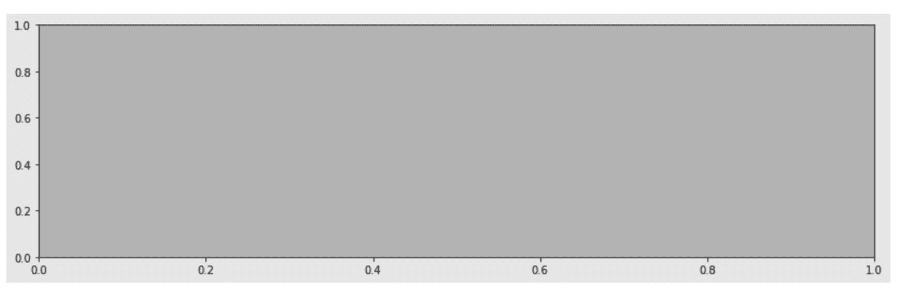

8.  现在我们已经区分了 Figure 和 Axes，让我们用`get_children`方法查看 Axes 的所有直接子代：

```py
>>> ax_children = ax.get_children()
>>> ax_children
[<matplotlib.spines.Spine at 0x11145b358>,
 <matplotlib.spines.Spine at 0x11145b0f0>,
 <matplotlib.spines.Spine at 0x11145ae80>,
 <matplotlib.spines.Spine at 0x11145ac50>,
 <matplotlib.axis.XAxis at 0x11145aa90>,
 <matplotlib.axis.YAxis at 0x110fa8d30>,
 ...]
```

9.  每个基本图都有四个刺和两个轴对象。 脊线代表数据边界，是您看到的与较深的灰色矩形（“轴”）接壤的四根物理线。 *x* 和 *y* 轴对象包含更多的绘图对象，例如刻度和它们的标签以及整个轴的标签。 我们可以从该列表中选择刺，但这通常不是这样做的。 我们可以使用`spines`属性直接访问它们：

```py
>>> spines = ax.spines
>>> spines
OrderedDict([('left', <matplotlib.spines.Spine at 0x11279e320>),
             ('right', <matplotlib.spines.Spine at 0x11279e0b8>),
             ('bottom', <matplotlib.spines.Spine at 0x11279e048>),
             ('top', <matplotlib.spines.Spine at 0x1127eb5c0>)])
```

10.  刺包含在有序字典中。 让我们选择左侧的脊椎，并更改其位置和宽度，使其更加突出，并使底部的脊椎不可见：

```py
>>> spine_left = spines['left']
>>> spine_left.set_position(('outward', -100))
>>> spine_left.set_linewidth(5)

>>> spine_bottom = spines['bottom']
>>> spine_bottom.set_visible(False)
>>> fig
```

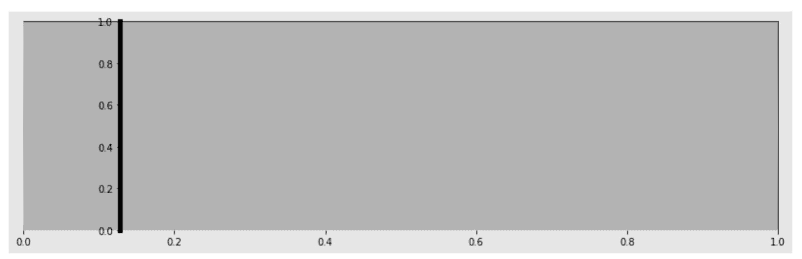

11.  现在，让我们集中讨论轴对象。 我们可以通过`xaxis`和`yaxis`属性直接访问每个轴。 `Axes`对象也可以直接使用某些轴属性。 在此步骤中，我们以两种方式更改每个轴的某些属性：

```py
>>> ax.xaxis.grid(True, which='major', linewidth=2,
                  color='black', linestyle='--')
>>> ax.xaxis.set_ticks([.2, .4, .55, .93])
>>> ax.xaxis.set_label_text('X Axis', family='Verdana', fontsize=15)

>>> ax.set_ylabel('Y Axis', family='Calibri', fontsize=20)
>>> ax.set_yticks([.1, .9])
>>> ax.set_yticklabels(['point 1', 'point 9'], rotation=45)
>>> fig
```

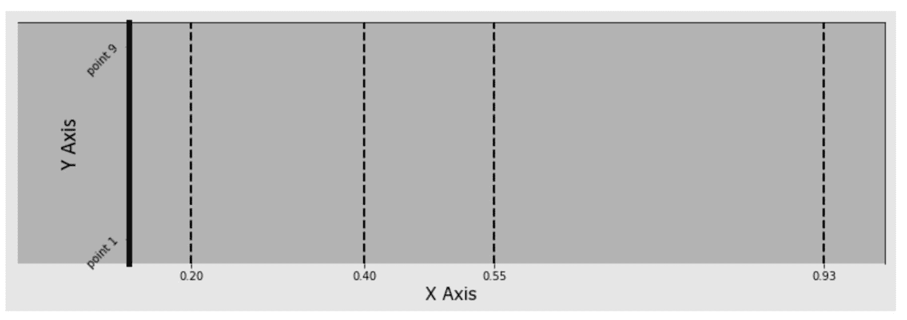

# 工作原理

面向对象方法要掌握的关键思想之一是每个绘图元素都具有**获取器**和**设置器**方法。 吸气剂方法均以`get_`开头，并检索特定属性或检索其他绘图对象。 例如，`ax.get_yscale()`检索绘制 *y* 轴以字符串形式绘制的比例类型（默认为`linear`），而`ax.get_xticklabels()`检索 matplotlib 文本对象列表 每个都有自己的获取器和设置器方法。 设置方法修改特定的属性或整个对象组。 许多 matplotlib 归结为锁存到特定的绘图元素上，然后通过 getter 和 setter 方法进行检查和修改。

It might be useful to make an analogy of the matplotlib hierarchy as a home. The home and all of its contents would be the Figure. Each individual room would be the Axes and the contents of the room would be the artists.

开始使用面向对象接口的最简单方法是使用`pyplot`模块，该模块通常是步骤 1 中的别名`plt` 和。步骤 2 显示了最常见的启动方法之一 面向对象的方法。 `plt.subplots`函数创建一个图形，以及一个 Axes 对象网格。 前两个参数`nrows`和`ncols` 和定义了统一的轴对象网格。 例如，`plt.subplots(2,4)`在一个图形中创建了八个相同大小的轴对象。

`plt.subplots`函数有点奇怪，因为它返回一个两个项的元组。 第一个元素是 Figure，第二个元素是 Axes 对象。 该元组被解压缩为两个不同的变量`fig`和`ax`。 如果您不习惯于拆开元组，则可能会看到步骤 2 如下所示：

```py
>>> plot_objects = plt.subplots(nrows=1, ncols=1)
>>> type(plot_objects)
tuple

>>> fig = plot_objects[0]
>>> ax = plot_objects[1]
```

如果使用`plt.subplots` 和创建多个轴，则元组中的第二项是包含所有轴的 NumPy 数组。 让我们在这里演示一下：

```py
>>> plot_objects = plt.subplots(2, 4)
```

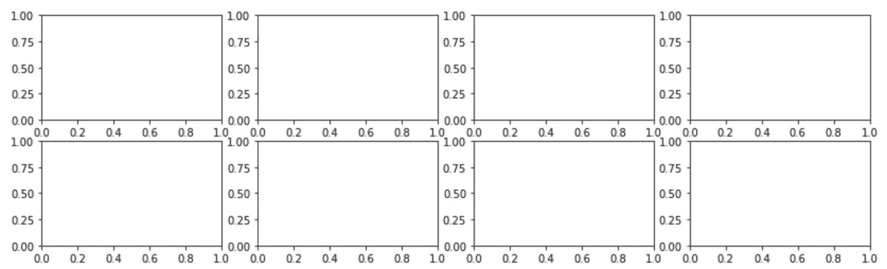

`plot_objects`变量是一个元组，其中包含一个数字作为其第一个元素，并包含一个 Numpy 数组作为其第二个元素：

```py
>>> plot_objects[1]
array([[<matplotlib.axes._subplots.AxesSubplot object at 0x133b70a20>,
        <matplotlib.axes._subplots.AxesSubplot object at 0x135d6f9e8>,
        <matplotlib.axes._subplots.AxesSubplot object at 0x1310e4668>,
        <matplotlib.axes._subplots.AxesSubplot object at 0x133565ac8>],
       [<matplotlib.axes._subplots.AxesSubplot object at 0x133f67898>,
        <matplotlib.axes._subplots.AxesSubplot object at 0x1326d30b8>,
        <matplotlib.axes._subplots.AxesSubplot object at 0x1335d5eb8>,
        <matplotlib.axes._subplots.AxesSubplot object at 0x133f78f28>]], dtype=object)
```

步骤 3 验证我们确实有适当变量引用的 Figure 和 Axes 对象。 在第 4 步中，我们遇到了 getter 和 setter 方法的第一个示例。 Matplotlib 将所有图形的默认宽度设置为 6 英寸乘以 4 英寸高，这不是屏幕上的实际大小，但是如果将图形保存到文件中，则将是确切大小。

步骤 5 显示，除了 getter 方法之外，有时您还可以通过其属性直接访问另一个绘图对象。 通常，同时存在属性和获取方法来检索同一对象。 例如，查看以下示例：

```py
>>> fig.axes == fig.get_axes()
True

>>> ax.xaxis == ax.get_xaxis()
True

>>> ax.yaxis == ax.get_yaxis()
True
```

许多美术师都具有`facecolor`属性，可以将其设置为覆盖一种特定颜色的整个表面，如步骤 7 所示。在步骤 8 中，可以使用`get_children`方法更好地了解对象层次。 返回轴正下方所有对象的列表。 可以从此列表中选择所有对象，然后开始使用 setter 方法来修改属性，但这不是惯例。 通常，我们通常直接从属性或 getter 方法中收集对象。

通常，在检索绘图对象时，它们会在列表或字典之类的容器中返回。 这就是在步骤 9 中收集刺时发生的情况。您必须从它们各自的容器中选择单个对象，以便在它们上使用 getter 或 setter 方法，如在步骤 10 中所做的那样。通常也使用 for -loop 一次迭代一次。

步骤 11 以特殊方式添加网格线。 我们期望有`get_grid`和`set_grid`方法，但是，只有`grid`方法，该方法接受布尔值作为打开/关闭网格线的第一个参数。 每个轴都有主刻度和次刻度，但默认情况下，副刻度是关闭的。 `which`参数用于选择带有网格线的刻度线类型。

请注意，步骤 11 的前三行选择`xaxis`属性并从中调用方法，而后三行直接从 Axes 对象本身调用等效方法。 第二组方法是 matplotlib 提供的一种方便方式，可以节省一些击键。 通常，大多数对象只能设置自己的属性，而不能设置其子级的属性。 无法通过轴设置许多轴级属性，但是在此步骤中，可以设置一些属性。 两种方法都可以接受。

在步骤 11 中将网格线与第一行添加在一起时，我们设置属性`linewidth`，`color`，，和`linestyle`。 这些都是 matplotlib 线（正式为 Line2D 对象）的所有属性。 您可以在此处查看所有可用属性： [http://bit.ly/2kE6MiG](http://bit.ly/2kE6MiG) 。 `set_ticks`方法接受一个浮点序列，并仅在那些位置绘制刻度线。 使用空列表将完全删除所有刻度。

每个轴可能都标有一些文本，为此 matplotlib 正式使用了`Text`对象。 所有可用文本属性（ [http://bit.ly/2yXIZfP](http://bit.ly/2yXIZfP) ）中仅更改了几个。 `set_yticklabels`轴方法接收一个字符串列表，用作每个刻度的标签。 您可以设置任意数量的文本属性。

# 更多

为了帮助找到每个绘图对象的所有可能的属性，只需调用 properties 方法，该方法会将所有它们显示为字典。 让我们看一下轴对象的属性的精选列表：

```py
>>> ax.xaxis.properties()
{'alpha': None,
 'gridlines': <a list of 4 Line2D gridline objects>,
 'label': Text(0.5,22.2,'X Axis'),
 'label_position': 'bottom',
 'label_text': 'X Axis',
 'tick_padding': 3.5,
 'tick_space': 26,
 'ticklabels': <a list of 4 Text major ticklabel objects>,
 'ticklocs': array([ 0.2 , 0.4 , 0.55, 0.93]),
 'ticks_position': 'bottom',
 'visible': True}
```

# 另见

*   Matplotlib 使用指南的官方文档（ [http://bit.ly/2xrKjeE](http://bit.ly/2xrKjeE) ）
*   Axes 对象的所有方法的分类列表（ [http://bit.ly/2kEhi9w](http://bit.ly/2kEhi9w) ）
*   *Matplotlib 剖析*，主要贡献者 Ben Root（ [http://bit.ly/2y86c1M](http://bit.ly/2y86c1M) ）
*   有状态`pyplot`模块和面向对象方法的 Matplotlib 官方文档（ [http://bit.ly/2xqYnVR](http://bit.ly/2xqYnVR) ）
*   Matplotlib *艺术家教程*的官方文档（ [http://bit.ly/2kwS2SI](http://bit.ly/2kwS2SI) ）

# 使用 matplotlib 可视化数据

Matplotlib 有几十种绘图方法，几乎​​可以想象任何一种绘图。 线，条，直方图，散点图，方格，小提琴，轮廓，饼图以及许多其他图都可以从“轴”对象中用作方法。 只有在 1.5 版（2015 年发布）中，matplotlib 才开始接受来自 Pandas DataFrames 的数据。 在此之前，必须将数据从 NumPy 数组或 Python 列表传递给它。

# 准备

在本秘籍中，我们将通过将 Pandas 数据帧中的数据减少到 NumPy 数组来可视化电影预算随时间的趋势，然后将其传递给 matplotlib 绘图功能。

# 操作步骤

1.  既然我们知道如何选择绘图元素并更改其属性，那么让我们实际创建数据可视化。 让我们阅读电影数据集，计算每年的预算中位数，然后找到五年滚动平均值以使数据平滑：

```py
>>> movie = pd.read_csv('data/movie.csv')
>>> med_budget = movie.groupby('title_year')['budget'].median() / 1e6
>>> med_budget_roll = med_budget.rolling(5, min_periods=1).mean()
>>> med_budget_roll.tail()
title_year
2012.0    20.893
2013.0    19.893
2014.0    19.100
2015.0    17.980
2016.0    17.780
Name: budget, dtype: float64
```

2.  让我们将数据放入 NumPy 数组中：

```py
>>> years = med_budget_roll.index.values
>>> years[-5:]
array([ 2012.,  2013.,  2014.,  2015.,  2016.])

>>> budget = med_budget_roll.values
>>> budget[-5:]
array([ 20.893,  19.893,  19.1  ,  17.98 ,  17.78 ])
```

3.  `plot`方法用于创建折线图。 让我们用它在新图中绘制预算随时间推移的滚动中位数：

```py
>>> fig, ax = plt.subplots(figsize=(14,4), linewidth=5,
                           edgecolor='.5')
>>> ax.plot(years, budget, linestyle='--', 
            linewidth=3, color='.2', label='All Movies')

>>> text_kwargs=dict(fontsize=20, family='cursive')
>>> ax.set_title('Median Movie Budget', **text_kwargs)
>>> ax.set_ylabel('Millions of Dollars', **text_kwargs)
```


4.  有趣的是，电影预算中位数在 2000 年达到顶峰，随后又下降了。 也许这只是数据集的人工产物，其中近年来我们拥有的所有电影的数据都更多，而不仅仅是最受欢迎的电影。 让我们找出每年的电影数量：

```py
>>> movie_count = movie.groupby('title_year')['budget'].count()
>>> movie_count.tail()
title_year
2012.0    191
2013.0    208
2014.0    221
2015.0    192
2016.0     86
Name: budget, dtype: int64
```

5.  一个轴上可以放置任意数量的图，这些计数可以直接用中位数预算作为条形图绘制。 由于两个图的单位完全不同（美元与计数），因此我们可以创建辅助 *y* 轴，也可以将计数缩放到与预算相同的范围内。 我们选择后者，并在其前面直接将每个条的值标记为文本。 由于绝大多数数据都包含在最近几年中，因此我们也可以将数据限制为从 1970 年开始拍摄的电影：

```py
>>> ct = movie_count.values
>>> ct_norm = ct / ct.max() * budget.max()

>>> fifth_year = (years % 5 == 0) & (years >= 1970)
>>> years_5 = years[fifth_year]
>>> ct_5 = ct[fifth_year]
>>> ct_norm_5 = ct_norm[fifth_year]

>>> ax.bar(years_5, ct_norm_5, 3, facecolor='.5', 
           alpha=.3, label='Movies per Year')
>>> ax.set_xlim(1968, 2017)
>>> for x, y, v in zip(years    _5, ct_norm_5, ct_5):
        ax.text(x, y + .5, str(v), ha='center')
>>> ax.legend()
>>> fig
```

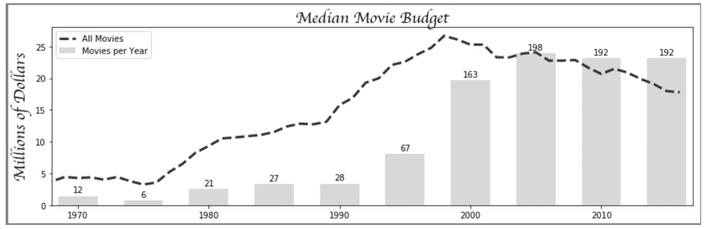

6.  如果仅查看每年预算最高的 10 部电影，这种趋势可能不会成立。 让我们找出每年仅前十部电影的五年滚动中位数：

```py
>>> top10 = movie.sort_values('budget', ascending=False) \
                 .groupby('title_year')['budget'] \
                 .apply(lambda x: x.iloc[:10].median() / 1e6)

>>> top10_roll = top10.rolling(5, min_periods=1).mean()
>>> top10_roll.tail()
title_year
2012.0    192.9
2013.0    195.9
2014.0    191.7
2015.0    186.8
2016.0    189.1
Name: budget, dtype: float64
```

7.  对于所有数据，这些数字表示一个比在步骤 13 中发现的数字高一个数量级。 以相同的比例绘制两条线看起来并不好。 让我们创建一个带有两个子图（轴）的全新图形，并在第二个轴中绘制上一步的数据：

```py
>>> fig2, ax_array = plt.subplots(2, 1, figsize=(14,8), sharex=True)
>>> ax1 = ax_array[0]
>>> ax2 = ax_array[1]

>>> ax1.plot(years, budget, linestyle='--', linewidth=3, 
             color='.2', label='All Movies')
>>> ax1.bar(years_5, ct_norm_5, 3, facecolor='.5', 
            alpha=.3, label='Movies per Year')
>>> ax1.legend(loc='upper left')
>>> ax1.set_xlim(1968, 2017)
>>> plt.setp(ax1.get_xticklines(), visible=False)

>>> for x, y, v in zip(years_5, ct_norm_5, ct_5):
        ax1.text(x, y + .5, str(v), ha='center')

>>> ax2.plot(years, top10_roll.values, color='.2',
             label='Top 10 Movies')
>>> ax2.legend(loc='upper left')

>>> fig2.tight_layout()
>>> fig2.suptitle('Median Movie Budget', y=1.02, **text_kwargs)
>>> fig2.text(0, .6, 'Millions of Dollars', rotation='vertical', 
              ha='center', **text_kwargs)

>>> import os
>>> path = os.path.expanduser('~/Desktop/movie_budget.png')
>>> fig2.savefig(path, bbox_inches='tight')
```

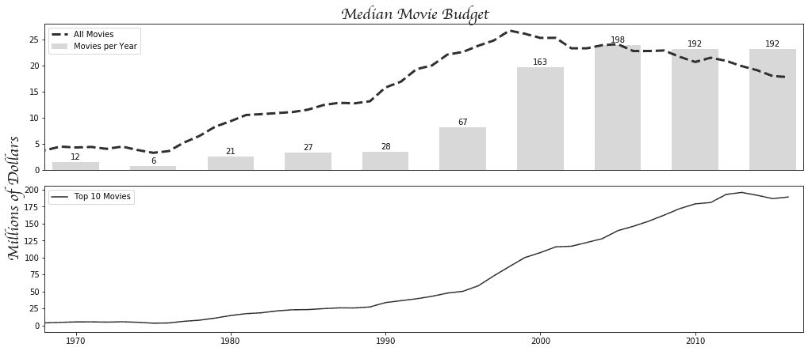

# 工作原理

在第 1 步中，我们开始寻求分析电影预算的方法，方法是找出每年的预算中位数（百万美元）。 找到每年的预算中位数后，我们决定对其进行平滑处理，因为每年之间会有很大的差异。 我们选择对数据进行平滑处理是因为我们正在寻找一个总体趋势，而不必对任何一年的确切价值感兴趣。

在此步骤中，我们使用`rolling`方法根据最近五年数据的平均值来计算每年的新值。 例如，将 2011 年至 2015 年的预算中位数进行分组并取平均值。 结果是 2015 年的新值。`rolling`方法唯一需要的参数是窗口的大小，默认情况下，窗口的大小将在当年结束。

`rolling`方法返回一个类似 groupby 的对象，该对象必须使其组与另一个函数共同作用才能产生结果。 让我们手动验证`rolling`方法是否能像往年一样工作：

```py
>>> med_budget.loc[2012:2016].mean()
17.78

>>> med_budget.loc[2011:2015].mean()
17.98

>>> med_budget.loc[2010:2014].mean()
19.1
```

这些值与步骤 1 的输出相同。在步骤 2 中，通过将数据放入 NumPy 数组中，我们准备使用 matplotlib。 在第 3 步中，我们创建图形和轴以设置面向对象的界面。 `plt.subplots`方法支持大量输入。 请参阅文档以查看此功能和`figure`函数的所有可能参数（ [http://bit.ly/2ydM8ZU](http://bit.ly/2ydM8ZU) 和 [http://bit.ly/2ycno40](http://bit.ly/2ycno40) ）。

`plot`方法中的前两个参数表示折线图的 x 和 y 值。 所有行属性都可以在`plot`的调用中进行更改。 `set_title` Axes 方法提供标题，并可以在其调用内设置所有可用的文本属性。 `set_ylablel`方法也是如此。 如果要为许多对象设置相同的属性，则可以将它们打包在一起作为字典，然后将该字典作为参数之一传递，如`**text_kwargs`一样。

在第 4 步中，我们注意到 2000 年左右开始的预算中值出现意外下降的趋势，并怀疑每年收集的电影数量可能起到解释作用。 我们选择通过从 1970 年开始每隔五年创建一个条形图来向图表添加此维度。我们对 NumPy 数据数组使用布尔选择的方式与在步骤 5 中对 Pandas 系列的处理方式相同。

`bar`方法将 x 值的高度和条形的宽度作为其前三个参数，并将条形的中心直接放在每个 x 值处。 条形高度是从电影计数中得出的，电影计数首先被缩小到零到一之间，然后乘以最大中位数预算。 这些钢筋高度存储在变量`ct_norm_5`中。 为了正确标记每个条形图，我们首先将条形图中心，其高度和实际影片数压缩在一起。 然后，我们遍历此压缩对象，并使用`text`方法将计数放在小节之前，该方法接受 x 值，y 值和字符串。 我们将 y 值略微向上调整，并使用水平对齐参数`ha`将文本居中。

回顾步骤 3，您会注意到`label`参数等于`All Movies`的`plot`方法。 这是为情节创建图例时 matplotlib 使用的值。 调用`legend` Axes 方法会将所有带有指定标签的图放置在图例中。

为了调查预算中位数的意外下降，我们可以仅关注每年预算最高的 10 部电影。 在按年份分组后，第 6 步使用自定义聚合函数，然后以与以前相同的方式对结果进行平滑处理。 这些结果可以直接绘制在同一张图上，但是由于值要大得多，因此我们选择创建一个带有两个轴的全新图形。

我们通过在两个两行一列的网格中创建具有两个子图的图形来开始执行步骤 7。 请记住，当创建多个子图时，所有轴都存储在 NumPy 数组中。 步骤 5 的最终结果将在顶部轴中重新创建。 我们在底部的轴上绘制预算最高的 10 部电影。 请注意，年份与底部和顶部轴都对齐，因为在图形创建中`sharex`参数设置为`True`。 共享轴时，matplotlib 会删除所有刻度线的标签，但会保留每个刻度线的细小垂直线。 要删除这些刻度线，我们使用`setp` `pyplot`函数。 尽管这不是直接面向对象的，但是当我们要为整个绘制对象序列设置属性时，它是显式的并且非常有用。 通过此有用的功能，我们将所有刻度线设置为不可见。

最后，我们然后多次调用 Figure 方法。 这与我们通常调用的 Axes 方法不同。 `tight_layout`方法通过删除多余的空间并确保不同的轴不会重叠来将子图调整为更好的外观。 `suptitle`方法为整个图形创建标题，而`set_title`轴方法则为单个轴创建标题。 它接受 x 和 y 位置来表示**图形坐标系**中的位置，其中（0，0）表示左下，而（1，1）表示右上。 默认情况下，y 值为 0.98，但我们将其上移了几个点至 1.02。

Each Axes also has a coordinate system in which (0, 0) is used for the bottom left and (1, 1) for the top right. In addition to those coordinate system, each Axes also has a data coordinate system, which is more natural to most people and represents the bounds of the *x* and *y-axis*. These bounds may be retrieved with `ax.get_xlim()` and `ax.get_ylim()` respectively. All the plotting before this used the data coordinate system. See the *Transformations tutorial* to learn more about the coordinate systems ([http://bit.ly/2gxDkX3](http://bit.ly/2gxDkX3)).

由于两个轴的 *y* 轴使用相同的单位，因此我们使用`text` Figure 方法使用图形坐标系将自定义 *y* 轴标签直接放置在每个轴之间。 最后，我们将图形保存到桌面。 路径中的波浪符号`~`代表主目录，但是`savefig`方法无法理解这意味着什么。 您必须使用`os`库中的`expanduser`函数来创建完整路径。 例如，`path`变量在我的机器上变为：

```py
>>> os.path.expanduser('~/Desktop/movie_budget.png')
'/Users/Ted/Desktop/movie_budget.png'
```

`savefig`方法现在可以在正确的位置创建文件。 默认情况下，`savefig`将仅保存在图形坐标系的（0，0）至（1，1）中绘制的内容。 由于我们的标题略微超出该区域，因此其中一些将被裁剪。 将`bbox_inches`参数设置为`yight`，matplotlib 将包含扩展到该区域之外的所有标题或标签。

# 更多

在 1.5 版发布之后，Matplotlib 开始接受其所有绘图功能的 pandas DataFrames。数据帧通过`data`参数传递给绘图方法。 这样做使您可以引用具有字符串名称的列。 以下脚本创建了从 2000 年开始随机选择的 100 部电影的 IMDB 分数与年份的散点图。 每个点的大小与预算成比例：[​​HTG2]

```py
>>> cols = ['budget', 'title_year', 'imdb_score', 'movie_title']
>>> m = movie[cols].dropna()
>>> m['budget2'] = m['budget'] / 1e6
>>> np.random.seed(0)
>>> movie_samp = m.query('title_year >= 2000').sample(100)

>>> fig, ax = plt.subplots(figsize=(14,6))
>>> ax.scatter(x='title_year', y='imdb_score',
               s='budget2', data=movie_samp)

>>> idx_min = movie_samp['imdb_score'].idxmin()
>>> idx_max = movie_samp['imdb_score'].idxmax()
>>> for idx, offset in zip([idx_min, idx_max], [.5, -.5]):
        year = movie_samp.loc[idx, 'title_year']
        score = movie_samp.loc[idx, 'imdb_score']
        title = movie_samp.loc[idx, 'movie_title']
        ax.annotate(xy=(year, score), 
        xytext=(year + 1, score + offset), 
        s=title + ' ({})'.format(score),
        ha='center',
        size=16,
        arrowprops=dict(arrowstyle="fancy"))
>>> ax.set_title('IMDB Score by Year', size=25)
>>> ax.grid(True)
```

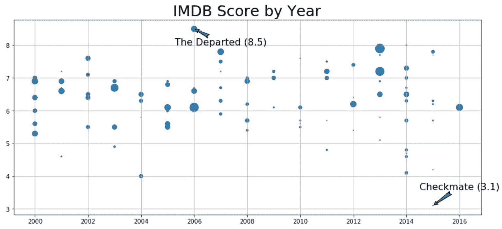

创建散点图后，最高得分的电影和最低得分的电影都用`annotate`方法标记。 `xy`参数是我们要注释的点的元组。 `xytext`参数是文本位置的另一个元组坐标。 由于`ha`设置为`center`，因此文本居中。

# 另见

*   Matplotlib 官方*图例指南*（ [http://bit.ly/2yGvKUu](http://bit.ly/2yGvKUu) ）
*   Matplotlib `scatter`方法的官方文档（ [http://bit.ly/2i3N2nI](http://bit.ly/2i3N2nI) ）
*   Matplotlib 官方*注解指南*（ [http://bit.ly/2yhYHoP](http://bit.ly/2yhYHoP) ）

# 用 Pandas 绘制基础知识

Pandas 通过自动执行许多步骤使绘制过程变得非常容易。 所有 Pandas 绘图均由 matplotlib 内部处理，并通过数据帧或 Series `plot`方法公开访问。 我们说 Pandas`plot`方法是围绕 matplotlib 的*包装器*。 在 Pandas 中创建图时，将返回 matplotlib 轴或图。 您可以使用 matplotlib 的全部功能来修改该对象，直到获得所需的结果。

Pandas 仅能生成 matplotlib 可用的一小部分图，例如线图，条形图，方框图和散点图，以及**核密度估计值**（**KDEs**）和直方图。 Pandas 通过使过程变得非常简单和高效而擅长于其创建的绘图，通常只需要一行代码，从而节省了探索数据的大量时间。

# 准备

了解 Pandas 绘图的关键之一就是要知道绘图方法是否需要一个或两个变量来进行绘图。 例如，线图和散点图需要两个变量来绘制每个点。 对于条形图也是如此，后者需要一些 x 坐标来定位条形，并需要另一个变量来设置条形的高度。 箱线图，直方图和 KDE 仅使用一个变量进行绘制。

默认情况下，两变量线图和散点图使用索引作为 *x* 轴，将列的值用作 *y* 轴。 单变量图忽略索引，并对每个变量应用转换或聚合以制作其图。 在本秘籍中，我们将考察 Pandas 中两变量和一变量绘图之间的差异。

# 怎么做..

1.  创建一个具有有意义索引的小型数据帧：

```py
>>> df = pd.DataFrame(index=['Atiya', 'Abbas', 'Cornelia', 
                             'Stephanie', 'Monte'], 
                      data={'Apples':[20, 10, 40, 20, 50],
                            'Oranges':[35, 40, 25, 19, 33]})
```

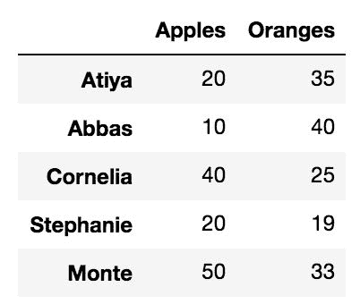

2.  条形图使用 *x* 轴的标签索引，并将列值用作条形高度。 在`kind` 参数设置为`bar`的情况下，使用`plot`方法：

```py
>>> color = ['.2', '.7']
>>> df.plot(kind='bar', color=color, figsize=(16,4))
```

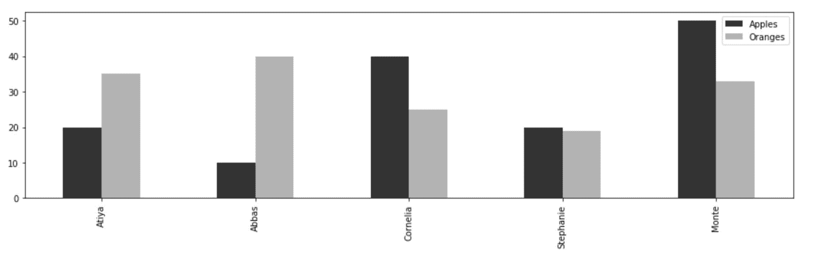

3.  KDE 图忽略索引，并将每列的值用作 *x* 轴，并计算 y 值的概率密度：

```py
>>> df.plot(kind='kde', color=color, figsize=(16,4))
```

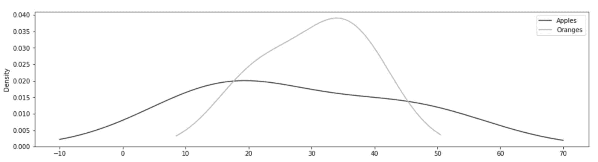

4.  让我们将所有两个变量图一起绘制在一个图中。 散点图是唯一需要您为 x 和 y 值指定列的散点图。 如果希望使用散点图的索引，则必须使用`reset_index`方法使其成为一列。 其他两个图使用 *x* 轴的索引，并为每个数字列创建一组新的线/条：

```py
>>> fig, (ax1, ax2, ax3) = plt.subplots(1, 3, figsize=(16,4))
>>> fig.suptitle('Two Variable Plots', size=20, y=1.02)
>>> df.plot(kind='line', color=color, ax=ax1, title='Line plot')
>>> df.plot(x='Apples', y='Oranges', kind='scatter', color=color, 
            ax=ax2, title='Scatterplot')
>>> df.plot(kind='bar', color=color, ax=ax3, title='Bar plot')
```

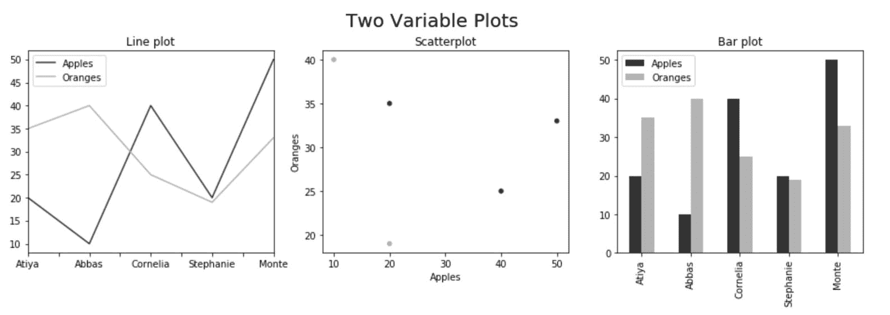

5.  让我们也将所有一变量图放在同一张图中：

```py
>>> fig, (ax1, ax2, ax3) = plt.subplots(1, 3, figsize=(16,4))
>>> fig.suptitle('One Variable Plots', size=20, y=1.02)
>>> df.plot(kind='kde', color=color, ax=ax1, title='KDE plot')
>>> df.plot(kind='box', ax=ax2, title='Boxplot')
>>> df.plot(kind='hist', color=color, ax=ax3, title='Histogram')
```

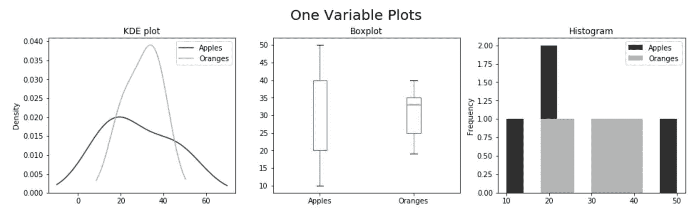

# 工作原理

第 1 步创建了一个小的样本数据帧，它将帮助我们说明使用 Pandas 进行的两个变量绘制和一变量绘制之间的差异。 默认情况下，Pandas 将使用数据帧的每个数字列制作一组新的条形，线形，KDE，盒形图或直方图，并在将其作为两变量图时将索引用作 x 值。 散点图是例外之一，必须明确为 x 和 y 值指定一列。

pandas `plot`方法非常通用，并具有大量参数，可让您根据自己的喜好自定义结果。 例如，您可以设置图形大小，打开和关闭网格线，设置 *x* 和 *y* 轴的范围，为图形着色，旋转刻度线，等等 更多。

您还可以使用特定 matplotlib 绘图方法可用的任何参数。 多余的参数将由`plot`方法的`**kwds`参数收集，并正确传递给基础的 matplotlib 函数。 例如，在第 2 步中，我们创建一个条形图。 这意味着我们可以使用 matplotlib `bar`函数中可用的所有参数，以及 Pandas`plot`方法中可用的参数（ [http://bit.ly/2z2l3rJ](https://matplotlib.org/api/_as_gen/matplotlib.pyplot.bar.html) ）。

在第 3 步中，我们创建一个单变量 KDE 图，该图将为数据帧中的每个数字列创建一个密度估计。 步骤 4 将所有两个变量图放置在同一图中。 同样，第 5 步将所有一变量图放置在一起。 第 4 步和第 5 步中的每个步骤都会创建一个具有三个轴对象的图形。 命令`plt.subplots(1, 3)`创建一个图形，该图形具有分布在一行和三列上的三个轴。 它返回一个由图和包含轴的一维 NumPy 数组组成的两元组。 元组的第一项被解包到变量`fig`中。 元组的第二个项目被解包为另外三个变量，每个变量一个。 Pandas`plot`方法方便地带有`ax`参数，使我们可以将绘图结果放入图中的特定轴中。

# 更多

除散点图外，所有图均未指定要使用的列。 Pandas 默认使用每一个数字列，并且在使用双变量图的情况下默认使用索引。 当然，您可以指定要用于每个 x 或 y 值的确切列：

```py
>>> fig, (ax1, ax2, ax3) = plt.subplots(1, 3, figsize=(16,4))
>>> df.sort_values('Apples').plot(x='Apples', y='Oranges', 
                                  kind='line', ax=ax1)
>>> df.plot(x='Apples', y='Oranges', kind='bar', ax=ax2)
>>> df.plot(x='Apples', kind='kde', ax=ax3)
```

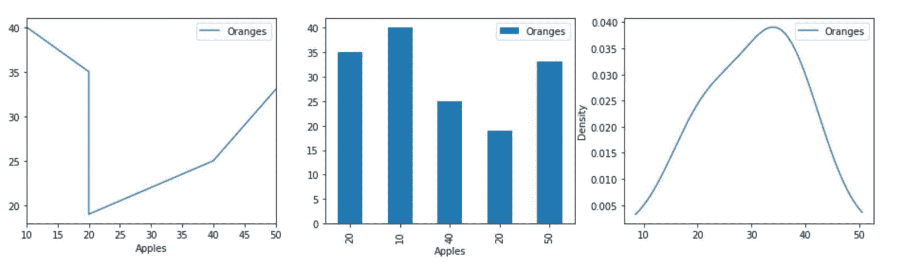

# 另见

*   Pandas *可视化*的官方文档（ [http://bit.ly/2zhUqQv](http://pandas.pydata.org/pandas-docs/stable/visualization.html) ）

# 可视化航班数据集

探索性数据分析主要由可视化指导，而 Pandas 为快速，轻松地创建它们提供了一个很好的界面。 开始可视化任何数据集时的一种简单策略是仅关注单变量图。 最受欢迎的单变量图往往是用于分类数据（通常是字符串）的条形图，以及用于连续数据（总是数字）的直方图，箱形图或 KDE。 直接在项目开始时尝试同时分析多个变量可能会很困难。

# 准备

在本秘籍中，我们通过直接用 Pandas 创建单变量和多变量图来对航班数据集进行一些基本的探索性数据分析。

# 操作步骤

1.  读取航班数据集，并输出前五行：

```py
>>> flights = pd.read_csv('data/flights.csv')
>>> flights.head()
```

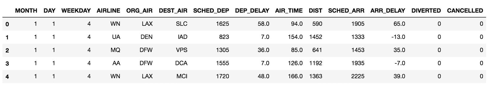

2.  在开始绘制之前，让我们计算转向，取消，延迟和准时飞行的数量。 我们已经有用于转移和取消的二进制列。 只要航班到达时间晚于预定时间 15 分钟或更长时间，便视为航班延误。 让我们创建两个新的二进制列来跟踪延迟到达和准时到达：

```py
>>> flights['DELAYED'] = flights['ARR_DELAY'].ge(15).astype(int)
>>> cols = ['DIVERTED', 'CANCELLED', 'DELAYED']
>>> flights['ON_TIME'] = 1 - flights[cols].any(axis=1)

>>> cols.append('ON_TIME')
>>> status = flights[cols].sum()
>>> status
DIVERTED       137
CANCELLED      881
DELAYED      11685
ON_TIME      45789
dtype: int64
```

3.  现在，让我们在同一图上为分类列和连续列绘制几个图：

```py
>>> fig, ax_array = plt.subplots(2, 3, figsize=(18,8))
>>> (ax1, ax2, ax3), (ax4, ax5, ax6) = ax_array
>>> fig.suptitle('2015 US Flights - Univariate Summary', size=20)

>>> ac = flights['AIRLINE'].value_counts()
>>> ac.plot(kind='barh', ax=ax1, title='Airline')

>>> oc = flights['ORG_AIR'].value_counts()
>>> oc.plot(kind='bar', ax=ax2, rot=0, title='Origin City')

>>> dc = flights['DEST_AIR'].value_counts().head(10)
>>> dc.plot(kind='bar', ax=ax3, rot=0, title='Destination City')

>>> status.plot(kind='bar', ax=ax4, rot=0, 
                log=True, title='Flight Status')
>>> flights['DIST'].plot(kind='kde', ax=ax5, xlim=(0, 3000),
                         title='Distance KDE')
>>> flights['ARR_DELAY'].plot(kind='hist', ax=ax6, 
                              title='Arrival Delay',
                              range=(0,200))
```

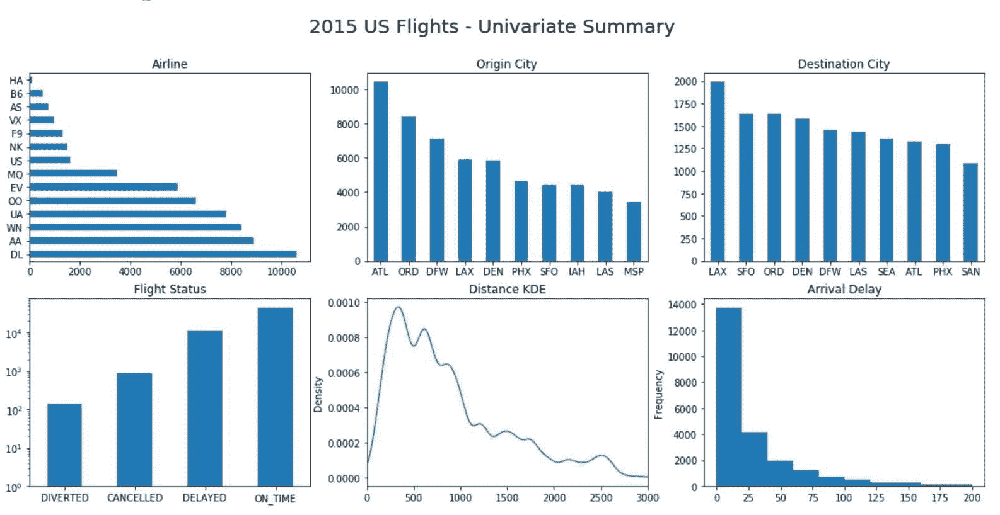

4.  这不是对所有单变量统计信息的详尽研究，但为我们提供了一些变量的详细信息。 在继续进行多变量图绘制之前，让我们绘制出每周的飞行次数。 使用带有 *x* 轴上日期的时间序列图的正确情况。 不幸的是，我们在任何列中都没有 Pandas 时间戳，但确实有月和日。 `to_datetime`函数有一个巧妙的技巧，可以识别与时间戳记组件匹配的列名。 例如，如果您有一个数据帧架，其中的标题栏正好为三列`year`，`month,`和`day,`，则将该数据帧传递给`to_datetime`函数将返回时间戳序列。 要准备我们当前的数据帧，我们需要为年份添加一列，并使用计划的出发时间来获取小时和分钟：

```py
>>> hour = flights['SCHED_DEP'] // 100
>>> minute = flights['SCHED_DEP'] % 100
>>> df_date = flights[['MONTH', 'DAY']].assign(YEAR=2015, HOUR=hour,
                                               MINUTE=minute)
>>> df_date.head()
```

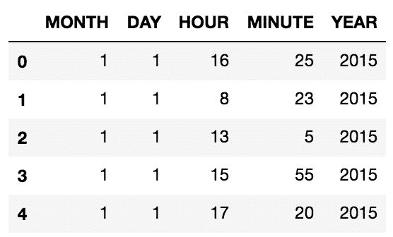

5.  然后，几乎可以用`to_datetime`函数将这个数据帧转换为适当的时间戳系列：

```py
>>> flight_dep = pd.to_datetime(df_date)
>>> flight_dep.head()
0   2015-01-01 16:25:00
1   2015-01-01 08:23:00
2   2015-01-01 13:05:00
3   2015-01-01 15:55:00
4   2015-01-01 17:20:00
dtype: datetime64[ns]
```

6.  让我们将此结果用作新索引，然后使用`resample`方法查找每周的航班计数：

```py
>>> flights.index = flight_dep
>>> fc = flights.resample('W').size()
>>> fc.plot(figsize=(12,3), title='Flights per Week', grid=True)
```

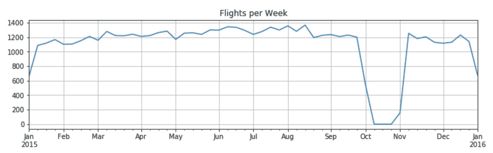

7.  这个情节很有启发性。 看来我们没有十月份的数据。 由于缺少这些数据，如果存在趋势，则很难通过视觉分析任何趋势。 前几周和后几周也低于正常水平，可能是因为没有整周的数据。 让我们每周进行一次缺少少于 1,000 个航班的数据。 然后，我们可以使用 `interpolate` 方法填写此丢失的数据：

```py
>>> fc_miss = fc.where(fc > 1000)
>>> fc_intp = fc_miss.interpolate(limit_direction='both')

>>> ax = fc_intp.plot(color='black', figsize=(16,4))
>>> fc_intp[fc < 500].plot(linewidth=10, grid=True, 
                           color='.8', ax=ax)

>>> ax.annotate(xy=(.8, .55), xytext=(.8, .77), 
                xycoords='axes fraction', s='missing data', 
                ha='center', size=20, arrowprops=dict())
>>> ax.set_title('Flights per Week (Interpolated Missing Data)')
```

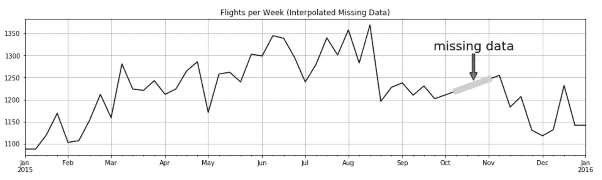

8.  让我们改变方向，专注于多变量绘图。 让我们找到以下 10 个机场：
    *   入境航班旅行的平均距离最长
    *   至少有 100 个航班：

```py
>>> flights.groupby('DEST_AIR')['DIST'] \
           .agg(['mean', 'count']) \
           .query('count > 100') \
           .sort_values('mean') \
           .tail(10) \
           .plot(kind='bar', y='mean', rot=0, legend=False,
                 title='Average Distance per Destination')
```

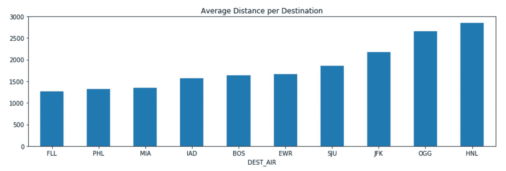

9.  头两个目的地机场在夏威夷也就不足为奇了。 现在，让我们通过对 2,000 英里以下的所有航班的距离和通话时间进行散点图来同时分析两个变量：

```py
>>> fs = flights.reset_index(drop=True)[['DIST', 'AIR_TIME']] \
                .query('DIST <= 2000').dropna()
>>> fs.plot(x='DIST', y='AIR_TIME', kind='scatter',
            s=1, figsize=(16,4))
```

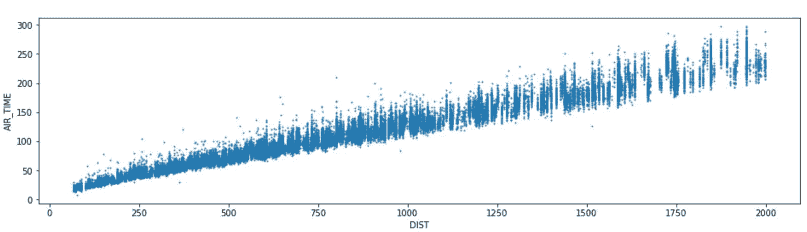

10.  正如预期的那样，距离和通话时间之间存在紧密的线性关系，尽管方差似乎随着里程数的增加而增加。 有一些航班不在趋势线之外。 让我们尝试识别它们。 可以使用线性回归模型来正式识别它们，但是由于 Pandas 不直接支持线性回归，因此我们将采用更为手动的方法。 让我们使用`cut`函数将飞行距离分为八组之一：

```py
>>> fs['DIST_GROUP'] = pd.cut(fs['DIST'], bins=range(0, 2001, 250))
>>> fs['DIST_GROUP'].value_counts().sort_index()
(0, 250]         6529
(250, 500]      12631
(500, 750]      11506
(750, 1000]      8832
(1000, 1250]     5071
(1250, 1500]     3198
(1500, 1750]     3885
(1750, 2000]     1815
Name: DIST_GROUP, dtype: int64
```

11.  我们将假设每个组中的所有航班应具有相似的飞行时间，因此，如果飞行时间偏离该组平均值，则为每个航班计算标准差的数量：

```py
>>> normalize = lambda x: (x - x.mean()) / x.std()
>>> fs['TIME_SCORE'] = fs.groupby('DIST_GROUP')['AIR_TIME'] \
                         .transform(normalize)
>>> fs.head()
```

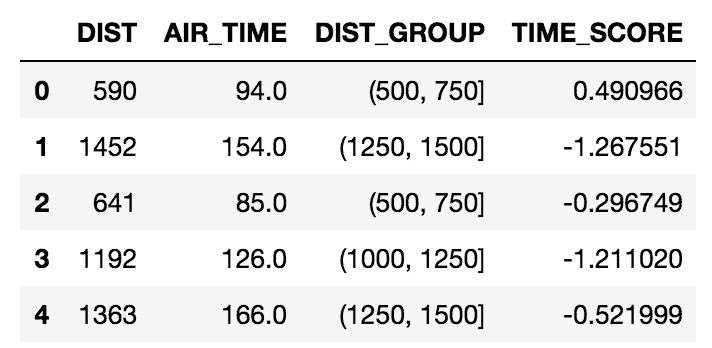

12.  现在，我们需要一种发现异常值的方法。 箱形图为检测异常值提供了很好的视觉效果。 不幸的是，尝试使用`plot`方法绘制箱形图时存在一个错误，但是幸运的是，有一种 DataFrame `boxplot`方法可以正常工作：

```py
>>> ax = fs.boxplot(by='DIST_GROUP', column='TIME_SCORE',
                    figsize=(16,4))
>>> ax.set_title('Z-Scores for Distance Groups')
>>> ax.figure.suptitle('')
```

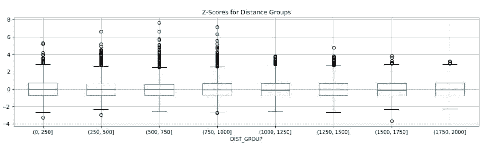

13.  让我们任意选择检查距离均值大于六个标准偏差的点。 因为我们在步骤 9 中重置了`fs` DataFrame 中的索引，所以我们可以使用它来标识广告投放数据帧中的每个唯一行。 让我们创建一个仅包含异常值的单独的数据帧：

```py
>>> outliers = flights.iloc[fs[fs['TIME_SCORE'] > 6].index]
>>> outliers = outliers[['AIRLINE','ORG_AIR', 'DEST_AIR', 'AIR_TIME',
                         'DIST', 'ARR_DELAY', 'DIVERTED']]
>>> outliers['PLOT_NUM'] = range(1, len(outliers) + 1)
>>> outliers
```

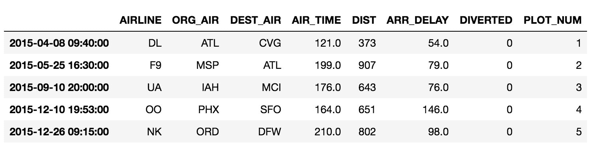

14.  我们可以使用此表从步骤 9 识别出图中的离群值。Pandas 还提供了一种将表附加到图形底部的方法：

```py
>>> ax = fs.plot(x='DIST', y='AIR_TIME', 
                 kind='scatter', s=1, 
                 figsize=(16,4), table=outliers)
>>> outliers.plot(x='DIST', y='AIR_TIME',
                  kind='scatter', s=25, ax=ax, grid=True)

>>> outs = outliers[['AIR_TIME', 'DIST', 'PLOT_NUM']]
>>> for t, d, n in outs.itertuples(index=False):
        ax.text(d + 5, t + 5, str(n))

>>> plt.setp(ax.get_xticklabels(), y=.1)
>>> plt.setp(ax.get_xticklines(), visible=False)
>>> ax.set_xlabel('')
>>> ax.set_title('Flight Time vs Distance with Outliers')
```

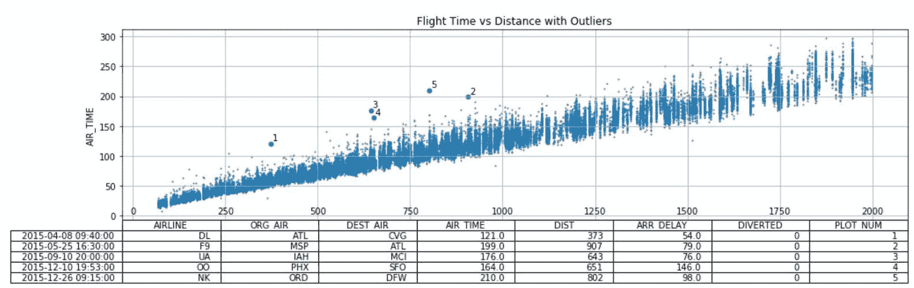

# 工作原理

在读取了步骤 1 中的数据并计算了延迟和按时航班的列之后，我们就可以开始制作单变量图了。 在第 3 步中对`subplots`函数的调用将创建一个大小相等的 2 x 3 轴网格。 我们将每个轴解压缩到其自己的变量中以进行引用。 对`plot`方法的每个调用都使用`ax`参数引用图中的特定轴。 `value_counts`方法用于创建三个系列，这些系列构成了第一行中的绘图。 `rot`参数将刻度标签旋转到给定角度。

左下角的绘图使用 *y* 轴的对数标度，因为准时航班的数量大约比取消航班的数量大两个数量级。 没有对数刻度，将很难看到左侧的两个条形图。 默认情况下，KDE 图可能会为不可能的值生成正数区域，例如底行中的负数英里。 因此，我们使用`xlim`参数限制 x 值的范围。

在到达延迟时，在右下角创建的直方图已传递`range`参数。 这不是 Pandas`plot`方法的方法签名的直接部分。 相反，此参数由`**kwds`参数收集，然后传递给 matplotlib `hist`函数。 在这种情况下，使用`xlim`不能如上图所示那样工作。可以仅裁剪图而不必重新计算图的该部分的新 bin 宽度。 但是，`range`参数不仅限制了 x 轴，而且仅计算了该范围的箱宽。

第 4 步创建一个特殊的额外数据帧来容纳仅包含日期时间组件的列，以便我们可以在第 5 步中使用`to_datetime`函数将每一行立即转换为时间戳。`resample`方法默认情况下使用索引来形成组 基于传递的日期偏移量。 我们以系列返回每周航班数（W），然后在其上调用`plot`方法，该方法很好地将索引的格式设置为 x 轴。 十月份出现了一个明显的漏洞。

为了填补这个漏洞，我们使用`where`方法在步骤 7 的第一行中仅将小于 1,000 的值设置为丢失。然后，我们通过线性插值法填充丢失的数据。 默认情况下，`interpolate`方法仅在正向插值，因此，在数据帧开头的所有丢失值都将保留。 通过将`limit_direction`参数设置为`both`，我们确保没有缺失值。 绘制现在存储在`fc_intp`中的新数据。 为了更清楚地显示缺少的数据，我们选择原始数据中缺少的点，并在前一条线上方的相同轴上绘制线图。 通常，当我们注释绘图时，我们可以使用数据坐标，但是在这种情况下， *x* 轴的坐标是什么并不明显。 要使用轴坐标系（范围从（0,0）到（1,1）的坐标系），请将`xycoords`参数设置为`axes fraction`。 现在，此新图将错误数据排除在外，这使得发现趋势变得容易得多。 夏季的空中交通流量比一年中其他任何时候都要多。

在第 8 步中，我们使用一长串方法对每个目标机场进行分组，并将`mean`和`count`两个功能应用于距离列。 `query`方法在方法链中使用时特别好，因为它可以清晰，简洁地选择给定条件的所需数据行。 进入`plot`方法时，数据帧中有两列，默认情况下，该方法将为每一列绘制条形图。 我们对`count`列不感兴趣，因此仅选择`mean`列来形成条形。 此外，在使用数据帧进行打印时，每个列名称都会出现在图例中。 这会将`mean`一词放在图例中，因此没有用，因此我们通过将`legend`参数设置为`False`将其删除。

步骤 9 通过查看行进距离与飞行时间之间的关系来开始新的分析。 由于点的数量众多，我们使用`s`参数缩小了它们的大小。 为了找到平均需要更长的时间到达目的地的航班，我们在步骤 10 中将每个航班分组为 250 英里，并在步骤 11 中找到与其组平均值的标准差数量。

在步骤 12 中，为`by`参数的每个唯一值在相同的轴中创建一个新的箱形图。 我们通过在调用`boxplot`之后将其保存到变量中来捕获 Axes 对象。 此方法会在图形上方创建不必要的标题，方法是先访问图形然后将`suptitle`设置为空字符串，然后将其删除。

在第 13 步中，当前 DataFrame `fs`包含我们找到最慢航班所需的信息，但它不具备我们可能需要进一步研究的所有原始数据。 因为我们在步骤 9 中重置了`fs`的索引，所以我们可以使用它来标识与原始行相同的行。 此步骤的第一行为我们做到了这一点。 我们还为每个异常行提供一个唯一的整数，以便以后在绘制时进行标识。

在第 14 步中，我们从与第 9 步中相同的散点图开始，但是使用 table 参数将离群值表附加到该图的底部。 然后，我们将离群值直接作为散点图绘制在顶部，并确保它们的点较大以轻松识别它们。 `itertuples`方法循环遍历每个数据帧行，并以元组的形式返回其值。 我们为绘图解压缩相应的 x 和 y 值，并用我们分配给它的编号标记它。

由于工作台直接放置在绘图的下方，因此会干扰 *x* 轴上的绘图对象。 我们将刻度线标签移动到轴的内部，并删除刻度线和轴标签。 该表向对这些外围事件感兴趣的任何人提供了一些不错的信息。

# 另见

*   Pandas 用表绘图的官方文档（ [http://bit.ly/2yhdBd7](http://bit.ly/2yhdBd7) ）

# 堆叠面积图以发现新兴趋势

堆积面积图是发现新兴趋势的绝佳可视化工具，尤其是在市场中。 通常会显示诸如互联网浏览器，手机或车辆之类的产品的市场份额百分比。

# 准备

在本秘籍中，我们将使用从受欢迎的网站 metup.com 收集的数据。 使用堆叠的面积图，我们将显示五个与数据科学相关的聚会组之间的成员分布。

# 操作步骤

1.  读取 metup 数据集，将`join_date`列转换为时间戳记，将其放置在索引中，然后输出前五行：

```py
>>> meetup = pd.read_csv('data/meetup_groups.csv', 
                          parse_dates=['join_date'], 
                          index_col='join_date')
>>> meetup.head()
```


2.  让我们获取每周加入每个组的人数：

```py
>>> group_count = meetup.groupby([pd.Grouper(freq='W'), 'group']) \
                        .size()
>>> group_count.head()
join_date   group   
2010-11-07  houstonr     5
2010-11-14  houstonr    11
2010-11-21  houstonr     2
2010-12-05  houstonr     1
2011-01-16  houstonr     2
dtype: int64
```

3.  取消堆叠组级别，以便每个聚会组都有自己的数据列：

```py
>>> gc2 = group_count.unstack('group', fill_value=0)
>>> gc2.tail()
```

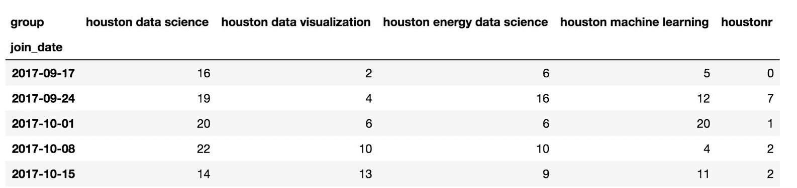

4.  此数据代表加入该特定星期的成员数量。 让我们取每一列的累加总和来获得成员的总数：

```py
>>> group_total = gc2.cumsum()
>>> group_total.tail()
```

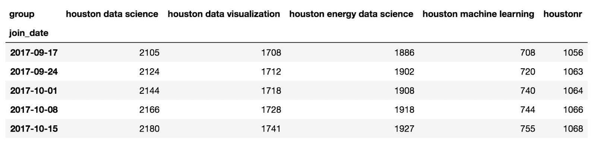

5.  许多堆叠的面积图使用总数的百分比，因此每一行总是相加 100% 。 让我们将每一行除以总行数以得出该百分比：

```py
>>> row_total = group_total.sum(axis='columns')
>>> group_cum_pct = group_total.div(row_total, axis='index')
>>> group_cum_pct.tail()
```

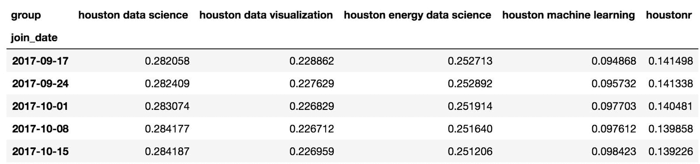

6.  现在，我们可以创建堆积面积图，该图将不断累积列，一个列位于另一个列之上：

```py
>>> ax = group_cum_pct.plot(kind='area', figsize=(18,4),
                            cmap='Greys', xlim=('2013-6', None), 
                            ylim=(0, 1), legend=False)
>>> ax.figure.suptitle('Houston Meetup Groups', size=25)
>>> ax.set_xlabel('')
>>> ax.yaxis.tick_right()

>>> plot_kwargs = dict(xycoords='axes fraction', size=15)
>>> ax.annotate(xy=(.1, .7), s='R Users', 
                color='w', **plot_kwargs)
>>> ax.annotate(xy=(.25, .16), s='Data Visualization', 
                color='k', **plot_kwargs)
>>> ax.annotate(xy=(.5, .55), s='Energy Data Science', 
                color='k', **plot_kwargs)
>>> ax.annotate(xy=(.83, .07), s='Data Science',
                color='k', **plot_kwargs)
>>> ax.annotate(xy=(.86, .78), s='Machine Learning',
                color='w', **plot_kwargs)
```

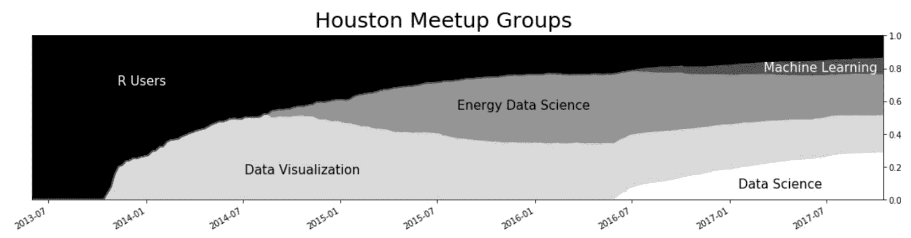

# 工作原理

我们的目标是确定休斯敦随时间推移在五个最大的数据科学聚会小组中的成员分布。 为此，我们需要找到自每个小组开始以来的每个时间点的成员总数。 我们有每个人加入每个小组的确切日期和时间。 在第 2 步中，我们按每周分组（偏移别名`W`）和见面组，并使用`size`方法返回该周的签约数量。

所得的系列不适合与 Pandas 作田。 每个见面组都需要自己的列，因此我们将`group`索引级别重塑为列。 我们将`fill_value`选项设置为零，以便在特定星期内没有成员资格的组不会缺少任何值。

我们每周需要会员总数。 步骤 4 中的`cumsum`方法为我们提供了此功能。 我们可以在此步骤之后直接创建堆积面积图，这将是可视化原始总成员资格的好方法。 在第 5 步中，通过将每个值除以其行总数，可以找到每个组在所有组中占总数的百分比。 默认情况下，Pandas 会自动按对象的列对齐对象，因此我们不能使用除法运算符。 相反，我们必须使用`div`方法将对齐轴更改为索引

现在，该数据非常适合我们在步骤 6 中创建的堆积面积图。请注意，pandas 允许您使用日期时间字符串设置轴限制。 如果使用`ax.set_xlim`方法直接在 matplotlib 中完成此操作将不起作用。 该绘图的开始日期提前了几年，因为 Houston R Users 组的成立要早于其他任何组。

# 更多

尽管数据可视化专家通常对此并不满意，但 Pandas 可以创建饼图。 在这种情况下，我们使用它们来查看整个组随时间分布的快照。 首先，从数据收集结束前的 18 个月开始，每三个月选择一次数据。 我们使用`asfreq`方法，该方法仅适用于索引中具有日期时间值的数据帧。 偏移别名`3MS`用于表示每三个月的开始。 由于`group_cum_pct`是按周汇总的，因此并非总是存在月份的第一天。 我们将`method`参数设置为`bfill`，代表回填； 它将及时查看以查找其中包含数据的月份的第一天。 然后，我们使用`to_period`方法（也仅适用于索引中的日期时间）将索引中的值更改为 Pandas 时间段。 最后，我们对数据进行转置，以便每一列代表该月 metup 组中成员的分布：

```py
>>> pie_data = group_cum_pct.asfreq('3MS', method='bfill') \
                            .tail(6).to_period('M').T
>>> pie_data
```

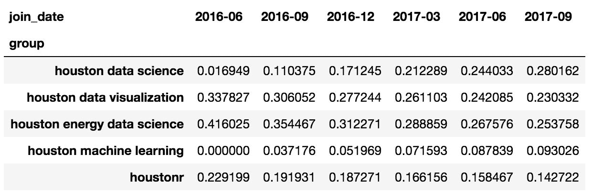

从这里，我们可以使用`plot`方法创建饼图：

```py
>>> from matplotlib.cm import Greys
>>> greys = Greys(np.arange(50,250,40))

>>> ax_array = pie_data.plot(kind='pie', subplots=True, 
                             layout=(2,3), labels=None,
                             autopct='%1.0f%%', pctdistance=1.22,
                             colors=greys)
>>> ax1 = ax_array[0, 0]
>>> ax1.figure.legend(ax1.patches, pie_data.index, ncol=3)
>>> for ax in ax_array.flatten():
        ax.xaxis.label.set_visible(True)
        ax.set_xlabel(ax.get_ylabel())
        ax.set_ylabel('')
>>> ax1.figure.subplots_adjust(hspace=.3)
```


# 了解 Pandas 与 Pandas 的区别

在 Pandas 之外，海上库是 Python 数据科学社区中创建可视化效果最广泛的库之一。 像 Pandas 一样，它本身不会进行任何实际的绘制，并且完全依赖于 matplotlib 进行繁重的工作。 Seaborn 绘图功能直接与 pandas DataFrames 配合使用，以创建美观的可视化效果。

尽管 seaborn 和 panda 都减少了 matplotlib 的开销，但它们处理数据的方式却完全不同。 几乎所有的海上绘图功能都需要整齐（或长）的数据。 当数据采用整齐的格式时，只有将某些功能应用到结果上后，才能准备使用或解释数据。 整洁的数据是使所有其他分析成为可能的原始构建块。 在数据分析过程中处理整洁的数据通常会创建聚合的数据或广泛的数据。 Pandas 使用这种格式的数据进行绘图。

# 准备

在此秘籍中，我们将使用 seaborn 和 matplotlib 构建相似的图，以明确表明它们接受整齐的数据还是广泛的数据。

# 操作步骤

1.  读入员工数据集，并输出前五行：

```py
>>> employee = pd.read_csv('data/employee.csv', 
                           parse_dates=['HIRE_DATE', 'JOB_DATE'])
>>> employee.head()
```

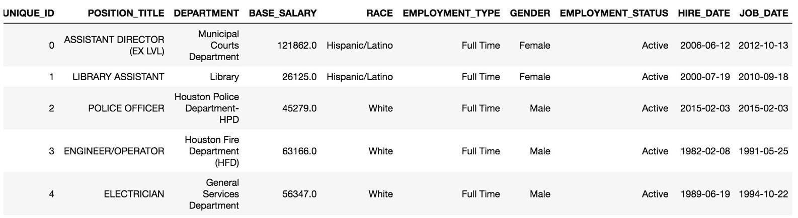

2.  导入 seaborn 库，并为其命名为`sns`：

```py
>>> import seaborn as sns
```

3.  让我们制作一个条形图，显示每个部门的 Seaborn：

```py
>>> sns.countplot(y='DEPARTMENT', data=employee)
```

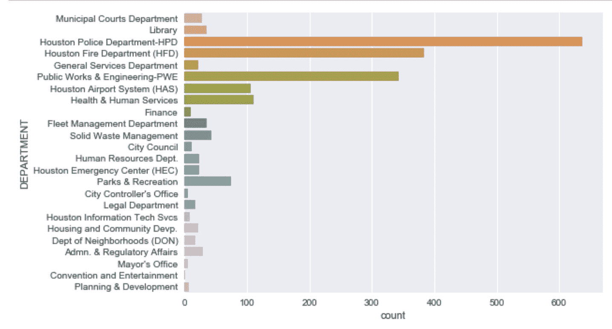

4.  要使用 Pandas 重现该绘图，我们需要预先汇总数据：

```py
>>> employee['DEPARTMENT'].value_counts().plot('barh')
```


5.  现在，让我们找到每个 seaborn 种族的平均工资：

```py
>>> ax = sns.barplot(x='RACE', y='BASE_SALARY', data=employee)
>>> ax.figure.set_size_inches(16, 4)
```

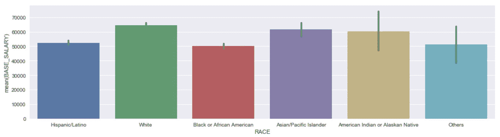

6.  要用 Pandas 复制它，我们将需要按种族分组：

```py
>>> avg_sal = employee.groupby('RACE', sort=False) \
                      ['BASE_SALARY'].mean()
>>> ax = avg_sal.plot(kind='bar', rot=0, figsize=(16,4), width=.8)
>>> ax.set_xlim(-.5, 5.5)
>>> ax.set_ylabel('Mean Salary')
```

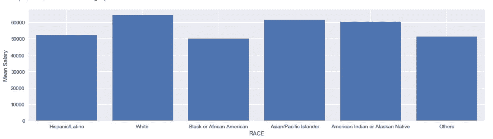

7.  Seaborn 在大多数绘图功能中，还可以通过第三个变量`hue`来区分数据中的组。 让我们按种族和性别找到平均工资：

```py
>>> ax = sns.barplot(x='RACE', y='BASE_SALARY', hue='GENDER', 
                     data=employee, palette='Greys')
>>> ax.figure.set_size_inches(16,4)
```

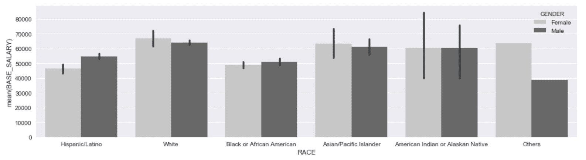

8.  对于 Pandas，我们将必须按种族和性别进行分组，然后将性别作为列名称拆开：

```py
>>> employee.groupby(['RACE', 'GENDER'], sort=False) \
            ['BASE_SALARY'].mean().unstack('GENDER') \
            .plot(kind='bar', figsize=(16,4), rot=0,
                  width=.8, cmap='Greys')
```

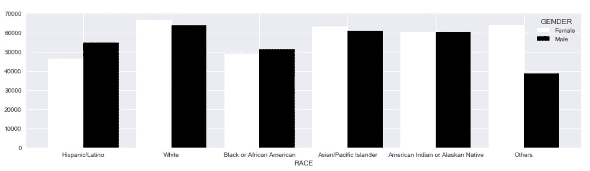

9.  箱形图是海豹和 Pandas 共同的另一种图。 让我们创建一个按种族，性别和 Seaborn 划分的薪金箱形图：

```py
>>> sns.boxplot(x='GENDER', y='BASE_SALARY', data=employee,
                hue='RACE', palette='Greys')
>>> ax.figure.set_size_inches(14,4)
```

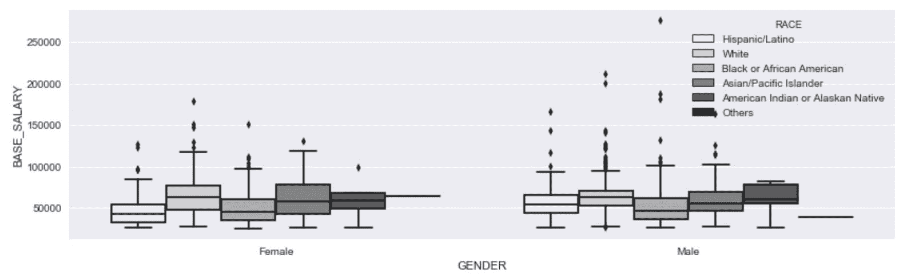

10.  Pandas 不容易为该箱形图产生精确的复制。 它可以为性别创建两个单独的轴，然后按种族绘制薪水箱形图：

```py
>>> fig, ax_array = plt.subplots(1, 2, figsize=(14,4), sharey=True)
>>> for g, ax in zip(['Female', 'Male'], ax_array):
        employee.query('GENDER== @g') \
                .boxplot(by='RACE', column='BASE_SALARY',
                         ax=ax, rot=20)
        ax.set_title(g + ' Salary')
        ax.set_xlabel('')
>>> fig.suptitle('')
```

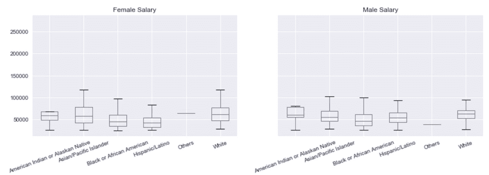

# 工作原理

在步骤 2 中导入 seaborn 会更改 matplotlib 的许多默认属性。 在类似字典的对象`plt.rcParams`中可以访问大约 300 个默认绘图参数。 要恢复 matplotlib 的默认设置，请不带任何参数调用`plt.rcdefaults`函数。 导入 seaborn 时，Pandas 绘图的样式也会受到影响。 我们的员工数据集满足了整洁数据的要求，因此非常适合用于几乎所有 Seaborn 的绘图功能。

Seaborn 将进行所有汇总； 您只需将数据帧提供给，，`data`，参数，并使用其字符串名称引用这些列。 例如，在步骤 3 中，`countplot`函数毫不费力地对`DEPARTMENT`的每次出现进行计数，以创建条形图。 所有海上绘图功能均具有`x`和`y`参数。 我们可以使用`x`而不是`y`绘制垂直条形图。 Pandas 会迫使您做更多的工作来获得相同的情节。 在第 4 步中，我们必须使用`value_counts`方法预先计算垃圾箱的高度。

Seaborn 可以使用`barplot`函数进行更复杂的聚合，如步骤 5 和 7 所示。 `hue`参数进一步在 *x* 轴上拆分每个组。 通过在步骤 6 和 8 中对`x`和`hue`变量进行分组，Pandas 能够几乎复制这些图。

箱形图可在海生和 Pandas 中使用，并且可以直接用整洁的数据绘制，而无需任何汇总。 即使没有必要进行聚合，seaborn 仍然具有优势，因为它可以使用`hue`参数将数据整齐地拆分为单独的组。 如步骤 10 所示，Pandas 无法轻松地从海洋中复制此功能。每个组都需要使用`query`方法进行拆分，并绘制在其自己的轴上。 实际上，Pandas 可能会拆分多个变量，从而将列表传递给`by`参数，但结果却不尽人意：

```py
>>> ax = employee.boxplot(by=['GENDER', 'RACE'], 
                      column='BASE_SALARY', 
                      figsize=(16,4), rot=15)
>>> ax.figure.suptitle('')
```

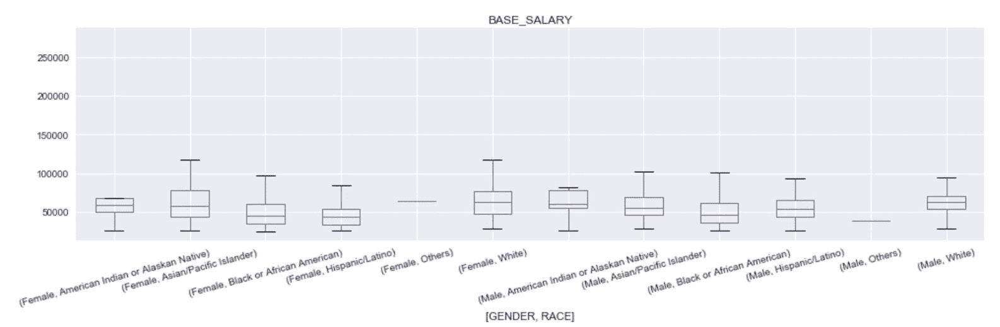

# 另见

*   Seaborn 官方教程（ [http://bit.ly/2yhwuPy](http://seaborn.pydata.org/tutorial.html) ）
*   Seaborn 完整 API（ [http://bit.ly/2ghWN0T](http://seaborn.pydata.org/api.html) ）

# 使用 Seaborn Grid 进行多元分析

要进一步了解 seaborn，了解作为海生网格返回多个轴的函数与返回单个轴的函数之间的层次结构会有所帮助：

| **网格类型** | **网格函数** | **轴函数** | **变量类型** |
| FacetGrid | `factorplot` | `stripplot`，`swarmplot`，`boxplot`，`violinplot`，`lvplot`，`pointplot`，`barplot`，`countplot` | 分类的 |
| FacetGrid | `lmplot` | `regplot` | 连续 |
| PairGrid | `pairplot` | `regplot`，`distplot`，`kdeplot` | Continuous |
| 联合网格 | `jointplot` | `regplot`，`kdeplot`，`residplot` | Continuous |
| 集群网格 | `clustermap` | `heatmap` | Continuous |

Seaborn 轴功能可以全部独立调用以生成单个图。 在大多数情况下，网格功能使用轴功能来构建网格。 从网格函数返回的最终对象是网格类型，其中有四种不同的类型。 高级用例需要直接使用网格类型，但是在绝大多数情况下，您将调用基础网格函数来生成实际的网格而不是构造函数本身。

# 准备

在本秘籍中，我们将研究性别和种族之间的经验年限与薪水之间的关系。 我们将首先使用海洋轴函数创建一个简单的回归图，然后使用网格函数为该图添加更多尺寸。

# 操作步骤

1.  阅读员工数据集，并创建一个具有多年经验的列：

```py
>>> employee = pd.read_csv('data/employee.csv', 
                       parse_dates=['HIRE_DATE', 'JOB_DATE'])
>>> days_hired = pd.to_datetime('12-1-2016') - employee['HIRE_DATE']

>>> one_year = pd.Timedelta(1, unit='Y')
>>> employee['YEARS_EXPERIENCE'] = days_hired / one_year
>>> employee[['HIRE_DATE', 'YEARS_EXPERIENCE']].head()
```

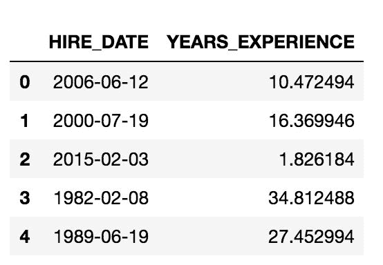

2.  让我们用拟合的回归线创建一个基本的散点图，以表示经验年限和薪水之间的关系：

```py
>>> ax = sns.regplot(x='YEARS_EXPERIENCE', y='BASE_SALARY',
                     data=employee)
>>> ax.figure.set_size_inches(14,4)
```

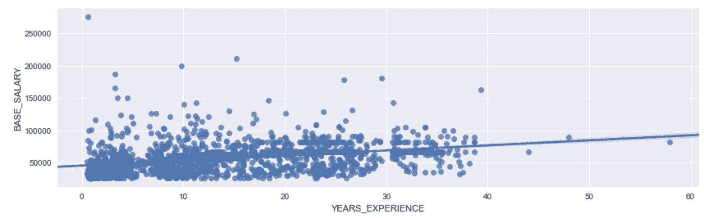

3.  `regplot`函数无法为第三个变量的不同级别绘制多条回归线。 让我们使用其父函数`lmplot`绘制一个 Seaborn Grid，为男性和女性添加相同的回归线：

```py
>>> g = sns.lmplot('YEARS_EXPERIENCE', 'BASE_SALARY',
                    hue='GENDER', palette='Greys',
                    scatter_kws={'s':10}, data=employee)
>>> g.fig.set_size_inches(14, 4)
>>> type(g)
seaborn.axisgrid.FacetGrid
```

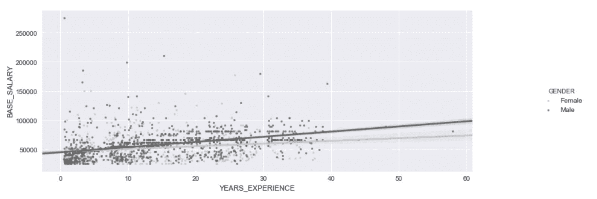

4.  Seaborn Grid 函数的真正功能是它们能够基于另一个变量添加更多轴。 每个海洋网格都有`col`和`row`参数，可用于将数据进一步分为不同的组。 例如，我们可以为数据集中的每个唯一种族创建一个单独的图，并且仍然按性别拟合回归线：

```py
>>> grid = sns.lmplot(x='YEARS_EXPERIENCE', y='BASE_SALARY',
                      hue='GENDER', col='RACE', col_wrap=3,
                      palette='Greys', sharex=False,
                      line_kws = {'linewidth':5},
                      data=employee)
>>> grid.set(ylim=(20000, 120000))
```

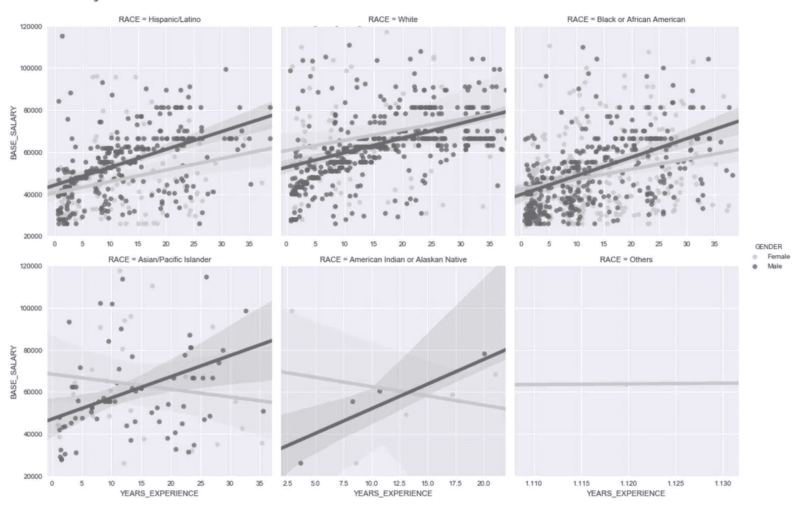

# 工作原理

在步骤 1 中，我们使用 Pandas 日期功能创建了另一个连续变量。 该数据是 2016 年 12 月 1 日从休斯敦市收集的。我们使用该日期来确定每个员工在该市工作了多长时间。 当减去日期时（如第二行代码所示），我们将返回一个 Timedelta 对象，其最大单位为天。 我们可以简单地将该数字除以 365 来计算经验年限。 取而代之的是，我们使用`Timedelta(1, unit='Y')`进行更精确的测量，如果您在家数的话，恰好是 365 天，5 小时，42 分钟和 19 秒。

第 2 步使用 seaborn 轴函数`regplot`来创建带有估计回归线的散点图。 它返回一个轴，我们使用它来更改图形的大小。 为了为每种性别创建两条单独的回归线，我们必须使用其父函数`lmplot`。 它包含`hue`参数，该参数为该变量的每个唯一值创建一个新的回归线。 在第 3 步结束时，我们验证`lmplot`确实确实返回了 Seaborn Grid 对象。

Seaborn Grid 本质上是整个图形的包装，并提供了一些方便的方法来更改其元素。 所有 Seaborn 网格都可以使用其`fig`属性访问基础图形。 步骤 4 显示了 Seaborn Grid 函数的常见用例，该用例是基于第三个甚至第四个变量创建多个图。 我们将`col`参数设置为`RACE`。 为数据集中的六个独特种族中的每个种族创建了六个回归图。 通常，这将返回由 1 行和 6 列组成的网格，但是我们使用`col_wrap`参数将列数限制为 3。

还有更多可用参数来控制网格的大多数重要方面。 可以从基础线和散点图 matplotlib 函数更改使用参数。 为此，请将`scatter_kws`或`line_kws`参数设置为等于具有 matplotlib 参数作为字符串的字典的字典，该字符串与您想要的值配对。

# 更多

具有分类特征时，我们可以进行类似类型的分析。 首先，让我们将类别变量 race 和 department 中的级别数分别减少到最常见的前两个和前三个：

```py
>>> deps = employee['DEPARTMENT'].value_counts().index[:2]
>>> races = employee['RACE'].value_counts().index[:3]
>>> is_dep = employee['DEPARTMENT'].isin(deps)
>>> is_race = employee['RACE'].isin(races)
>>> emp2 = employee[is_dep & is_race].copy()
>>> emp2['DEPARTMENT'] = emp2['DEPARTMENT'].str.extract('(HPD|HFD)',
                                                        expand=True)
>>> emp2.shape
(968, 11)

>>> emp2['DEPARTMENT'].value_counts()
HPD    591
HFD    377
Name: DEPARTMENT, dtype: int64

>>> emp2['RACE'].value_counts()
White                        478
Hispanic/Latino              250
Black or African American    240
Name: RACE, dtype: int64
```

让我们使用一种更简单的轴级功能，例如小提琴图来查看按性别划分的多年工作经验分布：

```py
>>> common_depts = employee.groupby('DEPARTMENT') \
                       .filter(lambda x: len(x) > 50)
>>> ax = sns.violinplot(x='YEARS_EXPERIENCE', y='GENDER',
                        data=common_depts)
>>> ax.figure.set_size_inches(10,4)
```

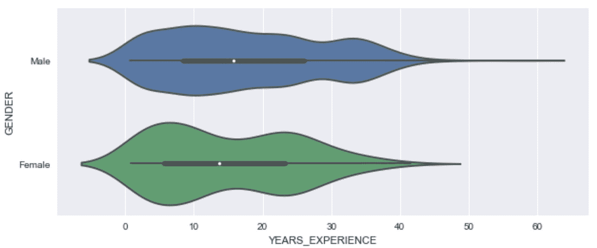

然后，我们可以使用网格函数`factorplot`为带有`col`和`row`参数的部门和种族的每个独特组合添加小提琴图：

```py
>>> sns.factorplot(x='YEARS_EXPERIENCE', y='GENDER',
                   col='RACE', row='DEPARTMENT', 
                   size=3, aspect=2,
                   data=emp2, kind='violin')
```

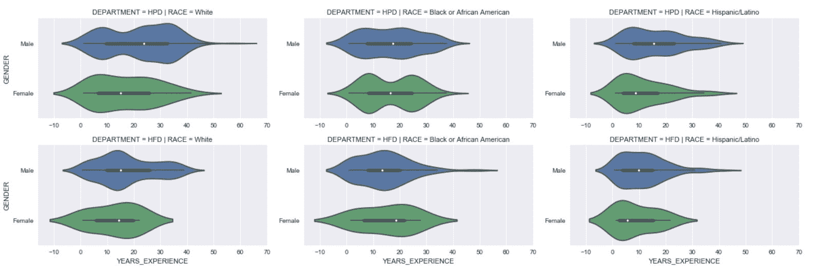

从秘籍的开头查看表格。 `factorplot` 功能必须使用这八个固定轴功能之一。 为此，您可以将其名称作为字符串传递给`kind`参数。

# 在 Seaborn 钻石数据集中发现辛普森悖论

不幸的是，在进行数据分析时，报告错误的结果非常容易。 辛普森悖论是一种可以在数据分析中出现的较普遍现象。 当汇总所有数据时，当一组显示的结果高于另一组时，会发生这种情况，但是在将数据细分为不同的细分时，则显示相反的结果。 例如，假设我们有两个学生 A 和 B，他们分别接受了 100 个问题的测试。 学生 A 回答了 50% 正确的问题，而学生 B 回答了 80% 正确的问题。 这显然表明学生 B 具有更高的才能：

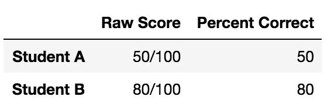

假设这两个测试非常不同。 学生 A 的测试包含 95 个困难的问题，只有五个容易解决的问题。 学生 B 接受了完全相反比例的测试。

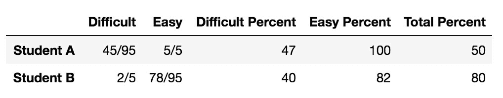

这描绘了一个完全不同的画面。 现在，学生 A 在困难和容易解决的问题中所占的比例较高，但总体上所占的比例却低得多。 这是辛普森悖论的典型例子。 汇总的整体显示了每个单独部分的相反情况。

# 准备

在此秘籍中，我们将首先得出一个令人困惑的结果，该结果似乎表明，高品质的钻石比低品质的钻石有价值。 我们通过对数据进行更细粒度的瞥见来揭示辛普森的悖论，这表明事实恰恰相反。

# 操作步骤

1.  读入钻石数据集，并输出前五行：

```py
>>> diamonds = pd.read_csv('data/diamonds.csv')
>>> diamonds.head()
```

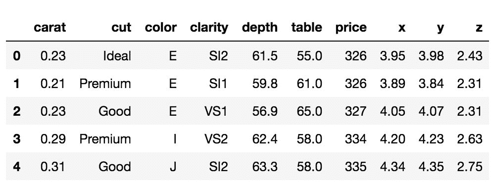

2.  在开始分析之前，让我们将`cut`，`color`和`clarity`列更改为有序的分类变量：

```py
>>> cut_cats = ['Fair', 'Good', 'Very Good', 'Premium', 'Ideal']
>>> color_cats = ['J', 'I', 'H', 'G', 'F', 'E', 'D']
>>> clarity_cats = ['I1', 'SI2', 'SI1', 'VS2',
                    'VS1', 'VVS2', 'VVS1', 'IF']
>>> diamonds['cut'] = pd.Categorical(diamonds['cut'],
                                     categories=cut_cats, 
                                     ordered=True)

>>> diamonds['color'] = pd.Categorical(diamonds['color'],
                                       categories=color_cats, 
                                       ordered=True)

>>> diamonds['clarity'] = pd.Categorical(diamonds['clarity'],
                                         categories=clarity_cats, 
                                         ordered=True)
```

3.  Seaborn 对其绘图使用类别订单。 让我们用条形图来表示每个级别的切割，颜色和清晰度的平均价格：

```py
>>> import seaborn as sns
>>> fig, (ax1, ax2, ax3) = plt.subplots(1, 3, figsize=(14,4))
>>> sns.barplot(x='color', y='price', data=diamonds, ax=ax1)
>>> sns.barplot(x='cut', y='price', data=diamonds, ax=ax2)
>>> sns.barplot(x='clarity', y='price', data=diamonds, ax=ax3)
>>> fig.suptitle('Price Decreasing with Increasing Quality?') 
```

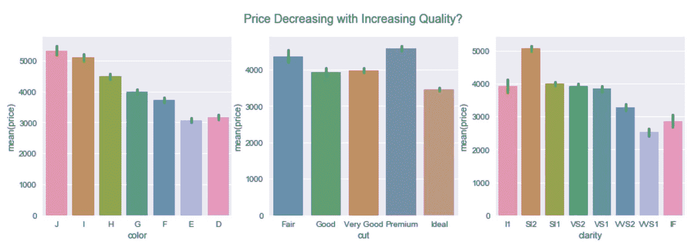

4.  颜色和价格似乎呈下降趋势。 最高质量的切割和净度水平也价格低廉。 怎么会这样？ 让我们更深入地挖掘并再次绘制每种钻石颜色的价格，但为每个透明度级别绘制一个新图：

```py
>>> sns.factorplot(x='color', y='price', col='clarity',
                   col_wrap=4, data=diamonds, kind='bar')
```

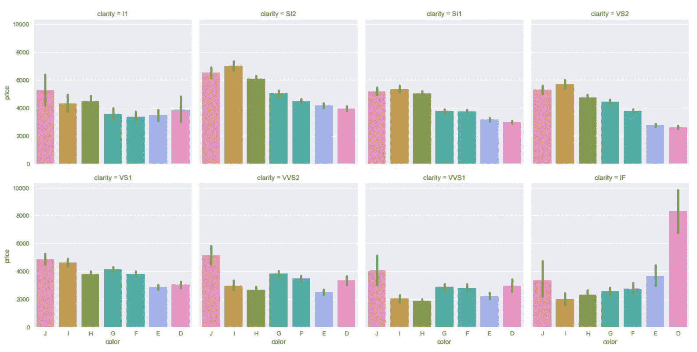

5.  这个情节更具启发性。 尽管价格似乎随着颜色质量的提高而下降，但是当清晰度达到最高水平时，价格不会下降。 价格实际上有大幅上涨。 我们还没有仅仅关注钻石的价格，而没有关注其尺寸。 让我们从步骤 3 重新创建图，但使用克拉大小代替价格：

```py
>>> fig, (ax1, ax2, ax3) = plt.subplots(1, 3, figsize=(14,4))
>>> sns.barplot(x='color', y='carat', data=diamonds, ax=ax1)
>>> sns.barplot(x='cut', y='carat', data=diamonds, ax=ax2)
>>> sns.barplot(x='clarity', y='carat', data=diamonds, ax=ax3)
>>> fig.suptitle('Diamond size decreases with quality')
```

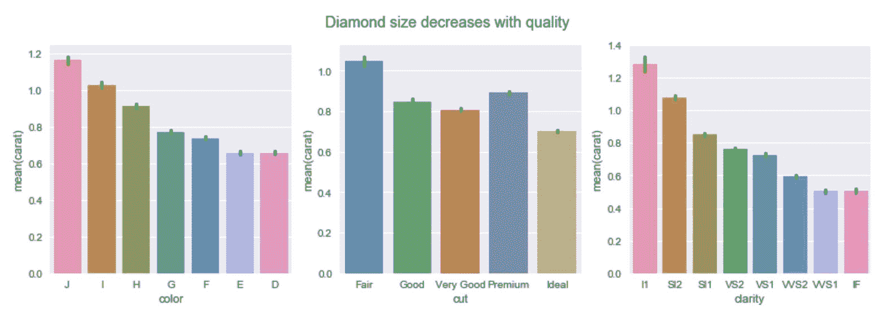

6.  现在我们的故事开始变得更有意义了。 高质量的钻石似乎尺寸较小，这在直觉上是有道理的。 让我们创建一个新变量，将`carat`值分为五个不同的部分，然后创建一个点图。 准确地显示出以下事实表明，按尺寸细分质量更高的钻石确实会花费更多金钱：

```py
>>> diamonds['carat_category'] = pd.qcut(diamonds.carat, 5)

>>> from matplotlib.cm import Greys
>>> greys = Greys(np.arange(50,250,40))

>>> g = sns.factorplot(x='clarity', y='price', data=diamonds,
                       hue='carat_category', col='color', 
                       col_wrap=4, kind='point', palette=greys)
>>> g.fig.suptitle('Diamond price by size, color and clarity',
                   y=1.02, size=20)
```

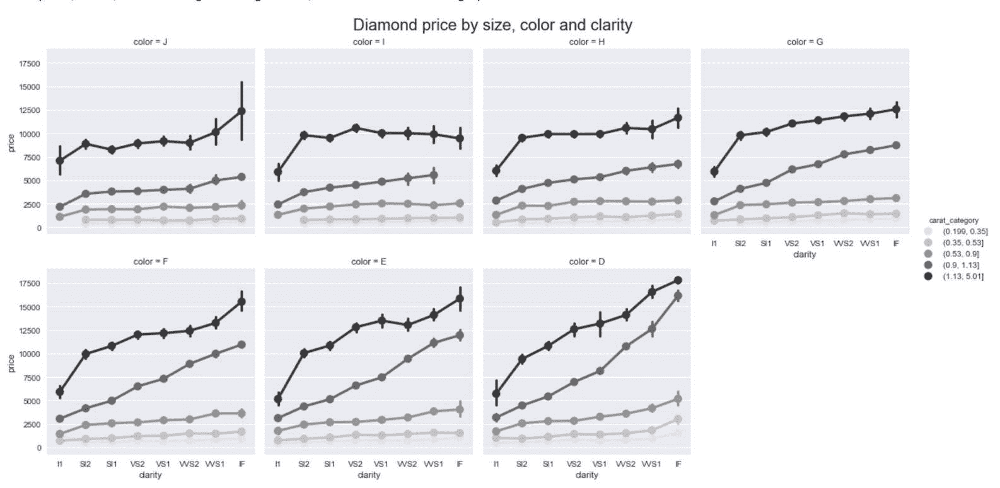

# 工作原理

在此秘籍中，创建分类列非常重要，因为可以对它们进行排序。 Seaborn 使用此顺序将标签放置在绘图上。 第 3 步和第 4 步显示了明显增加钻石质量的下降趋势。 这就是辛普森悖论成为中心焦点的地方。 整体的汇总结果与其他尚未检查的变量混淆。

揭示这一矛盾的关键在于关注克拉的大小。 第 5 步向我们揭示克拉的大小也随着质量的增加而减小。 考虑到这一事实，我们使用`qcut`函数将钻石尺寸切成五个相等大小的容器。 默认情况下，此函数根据给定的分位数将变量分为离散类别。 通过像此步骤一样将整数传递给它，可以创建等距的分位数。 您还可以选择将一系列显式非规则分位数传递给它。

使用此新变量，我们可以绘制第 6 步中每组每颗钻石尺寸的平均价格的图。seaborn 中的点图将创建一个连接每个类别均值的线图。 每个点的竖线是该组的标准偏差。 该图证实，只要我们将克拉的大小保持不变，钻石的确会随着质量的提高而变得更加昂贵。

# 更多

步骤 3 和 5 中的条形图可以使用更高级的 seaborn `PairGrid`构造函数创建的，该构造函数可以绘制双变量关系。 使用`PairGrid`分为两个步骤。 对`PairGrid`的第一次调用通过提醒网格哪些变量将为 x 和哪些变量将为 y 来准备网格。 第二步将图应用于 x 和 y 列的所有组合：

```py
>>> g = sns.PairGrid(diamonds,size=5,
                 x_vars=["color", "cut", "clarity"],
                 y_vars=["price"])
>>> g.map(sns.barplot)
>>> g.fig.suptitle('Replication of Step 3 with PairGrid', y=1.02)
```

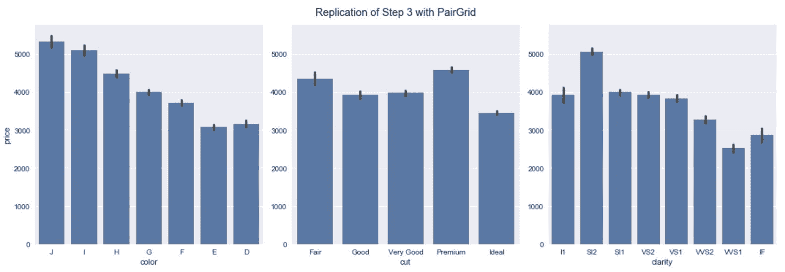