# 五、用于进行时间序列预测的深度学习

到目前为止，在本书中，我们已经描述了用于时间序列分析的传统统计方法。 在前面的章节中，我们讨论了从过去的观察结果中预测未来某个时间序列的几种方法。 一种进行预测的方法是**自回归**（**AR**）模型，该模型将时间`t`的序列表示为先前*的线性回归 p* 观察结果：


Є [t] 是 AR 模型的残差项。

可以将线性模型的基本思想概括为：时间序列预测的目的是开发一个函数`f`，该函数根据 *x [t]* 的预测值进行预测 先前的`p`时间点：

```py
*x[t] = f(x[t-1],x[t-2], ... ,x[t-p])*
```

在本章中，我们将探索三种基于神经网络的方法来开发函数`f`。 每种方法都包括定义一个神经网络体系结构（根据隐藏层的数量，每个隐藏层中神经元的数量等等），然后使用反向传播算法或其适合于当前网络体系结构的变体来训练网络。 用过的。

最近几年见证了对神经网络的兴趣兴起。 由于可以从数字媒体获得大量训练数据，并且可以更便宜地访问 GPU 驱动的并行计算，因此这之所以成为可能。 这些因素使训练神经网络具有数十万个参数，在某些情况下甚至具有数百万个参数。 不同体系结构的神经网络已成功应用于解决计算机视觉，语音识别和自然语言翻译方面的问题。 在这些领域中设计和训练神经网络的研究和实践被普遍称为**深度学习**，顾名思义，它指示了这些模型中使用的许多隐藏层。

深度学习提供了有趣的神经体系结构，旨在解决图像和语言数据的特殊结构特征。 例如，**卷积神经网络**（**CNN**）旨在利用图像的二维或三维结构，而大多数语言模型都使用**递归神经网络**（**RNN**）支持口语和书面语言固有的顺序和记忆。 这些新的发展也已应用于传统上统计机器学习占主导地位的领域。 这样的领域之一是时间序列预测。

在本章中，我们将探讨三种不同类型的神经网络，用于时间序列预测。 我们从 **Multi-layer perceptrons** 开始（**mlp**）。 这将是经常性的神经网络，其适用于数据点的连续排列。 最后，我们将涵盖卷积神经网络，这些网络主要用于图像，但我们将讨论 CNN 的特殊形式如何用于时间序列预测。 这些主题将通过对网络架构的解释以及如何应用于时间序列预测来涵盖这些主题。 代码演示向您展示如何使用尖端深度学习库来开发时间序列预测模型。 本章中的示例是使用 Keras API 来实现的，用于深入学习。 Keras 是一个高级 API，允许定义不同的神经网络架构并使用各种基于梯度的优化器训练它们。 在后端，Keras 使用在 C，C ++ 和 Fortran 中实现的低级计算框架。 有几种这样的低级框架是可用的开源。 Keras 支持以下三个：Tensorflow 由 Google 开发，是 Keras，CNTK 的默认后端，来自 Microsoft，以及 Theano 的开源框架，最初在加拿大蒙特利尔大学开发。 本书中的示例使用 TensorFlow 作为后端。 因此，要运行示例，您需要安装 keras 和 tensorflow。

因此，不用费劲，让我们深入研究深度学习中的时间序列预测的迷人主题。

# 多层感知器

**多层感知器**（**MLP**）是神经网络的最基本形式。 MLP 由三个组件组成：输入层，一堆隐藏层和输出层。 输入层表示回归变量或输入特征的向量，例如，从先前的`p`时间点[ *x [t-1] ，x [t-2] ，...，x [tp] ]*。 输入要素被馈送到具有`n`神经元的隐藏层，每个神经元对输入要素应用线性变换和非线性激活。 神经元的输出为 *g [i] = h（* **w [i] x** + *b [i]* ），其中 **w [i]** b [i] 是线性变换和 *h [* 是非线性激活函数。 非线性激活函数使神经网络能够对回归变量与目标变量之间的基础关系的复杂非线性进行建模。 通常，`h`是 S 型函数`1 / (1 - exp(-z))`，它将任意实数压缩为区间 **[0,1]**。 由于具有此特性，因此会使用 S 型函数来生成二进制类别的概率，因此通常在分类模型中使用。 非线性激活函数的另一种选择是`tanh`函数`(1 - exp(-z)) / (1 + exp(-z)))`，它将任何实数绑定到区间`[-1, 1]`。 在某些情况下，`h`是恒等式或线性函数。

在单个隐藏层神经网络的情况下（如下图左侧所示），每个神经元的输出将传递到输出层，该输出层将应用线性变换和激活函数来生成目标变量的预测 在时间序列预测的情况下，是在 *t <sup class="calibre23">th</sup>* 时间点的序列的预测值。 在 MLP 中，多个隐藏层相互堆叠。 来自一个隐藏层的神经元输出将作为输入馈送到下一个隐藏层。 该隐藏层中的神经元会转换输入并传递到下一个隐藏层。 最后，最后一个隐藏层进入输出层：

> 

图 5.1：多层感知器

MLP 的隐藏层也称为密集或有时完全连接的层。 “密集”一词具有以下含义：密集层的所有神经元都与上一层和下一层中的所有神经元相连。 如果前一层是输入层，则所有输入要素都将馈入隐藏层的每个神经元。 由于输入层和第一密集层之间以及密集层本身之间的多对多连接，MLP 具有大量可训练的权重。 例如，如果输入特征的数量为`p`，并且存在具有神经元数量 *n [1]*，*n [2 的三个致密层]* 和 *n [3]*，则可训练砝码的数量为`p × n[1] + n[1] × n[2] + n[2] × n[3] + n[3]`。 此计算中的最后一个元素是连接第三隐藏层和输出层的权重数。 深度 MLP 具有几层密集层，每层中有数百甚至数千个神经元。 因此，深层 MLP 中可训练权重的数量非常大。

# 培训 MLP

通过运行基于梯度的优化算法（例如随机梯度下降）来找到神经网络的权重`w`，该算法可迭代地使网络在进行预测时产生的损失或误差（`L`）最小化 在训练数据上。 **均方误差**（**MSE**）和**平均绝对误差**（**MAE**）（有时表示绝对百分比误差）通常用于回归 二进制和分类日志损失是分类问题的常见损失函数。 对于时间序列预测，MSE 和 MAE 将易于训练神经模型。

梯度下降算法通过沿权重的梯度路径移动权重`i`来工作。 梯度是损失函数`L`相对于重量的偏导数。 最简单的更改权重`w`的更新规则需要权重的值，`L`相对于权重的偏导数以及控制点下降速度的学习率α 沿渐变：


此基本更新规则具有多种变体，会影响算法的收敛性。 但是，所有基于梯度的算法的关键输入是必须为网络的所有权重计算的偏导数。 在深度神经网络（其中一些具有数百万的权重）中，导数计算可能是庞然大物的计算任务。 这正是著名的反向传播算法有效解决这一问题的地方。

要了解反向传播，首先应该了解计算图以及它们如何用于在神经网络中进行计算。

让我们考虑一个简单的单隐藏层神经网络，该网络具有两个隐藏单元，每个隐藏单元均具有 S 型激活。 输出单元是其输入的线性变换。 网络中有两个输入变量[ *x [1] ，x [2]* ]。 权重沿网络的边缘显示：


网络执行一系列加法，乘法和几个 S 形函数，以将输入转换为预测`y_hat`。 通过神经网络将输入转换为预测的过程称为*前向通过*。 下图显示了如何通过计算图对输入对 *[-1,2]* 实现正向传递。 每次计算都会产生一个中间输出 *p [ i ]*。 中间结果 *p [ 7 ]* 和 *p [ 8 ]* 是隐藏神经元 *g [ 1 ] [* 和 *g [ 2 ]*。 在训练过程中，损耗`L`也在前向通过中计算。


图 5.3：具有两个隐藏神经元的单层感知器的计算图

此时，将采用反向传播算法来计算通过边连接的两个节点之间的偏导数。 图中用于计算偏导数的向后遍历也称为*向后遍历*。 将偏微分算子应用于每个节点，并将偏导数分配给沿计算图连接下游节点的各个边。 遵循链规则，通过将连接权重节点和损失节点的所有边上的偏导数相乘来计算偏导数`∂L/∂w`。 如果权重节点和损失节点之间存在多条路径，则将沿每条路径的偏导数相加，以获得损失相对于权重的总偏导数。 这种基于图形的实现*正向*和*向后*传递的技术是强大的深度学习库中使用的基础计算技巧。 下图显示了*反向传递*：


图 5.4：计算图中的偏导数计算

损失相对于权重的偏导数可通过应用链式法则获得：


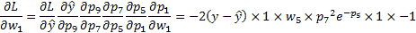


在训练期间，权重使用通常从具有[ *-1,1* ]的上限和下限的均匀分布或均值为零和单位方差的正态分布采样的随机数初始化。 这种随机初始化方案具有一些增强优化收敛性的变体。 在这种情况下，我们假设权重是根据均匀随机分布进行初始化的，因此 *w [1] = -0.33*，*w [2] = 0.57*，*w [3] = 0.02*，*w [4] = -0.01*，*w [5] = 0.07* 和 *w [6] = 0.82*。 使用这些值，让我们遍历*正向*和*向后*遍历计算图。 我们用蓝色的*前向通过*期间计算的值和红色的*反向通过*期间计算的梯度来更新前一图。 在此示例中，我们将目标变量的实际值设置为 *y = 1*：


图 5.5：向前（蓝色）和向后（以红色）通过计算图

一旦计算了沿边缘的梯度，相对于权重的偏导数就只是链式规则的应用，我们之前已经讨论过。 偏导数的最终值如下：


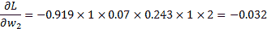

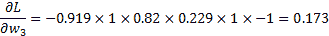


下一步是使用梯度下降算法更新权重。 因此，在学习率为α *= 0.01* 的情况下，*w [5]* 的新值= 0.07-0.01 x -0.384 = 0.0738。 其余权重也可以使用类似的更新规则进行更新。

迭代权重更新的过程重复多次。 权重更新完成的次数称为训练数据的经过次数或通过次数。 通常，与前一时期相比，损失函数变化的公差标准控制着时期的数量。

反向传播算法与基于梯度的优化器一起用于确定神经网络的权重。 值得庆幸的是，存在强大的深度学习库，例如 Tensorflow，Theano 和 CNTK，它们实现了计算图来训练任何体系结构和复杂性的神经网络。 这些库具有内置支持，可以将计算作为对多维数组的数学运算来运行，并且还可以利用 GPU 进行更快的计算。

# 用于时间序列预测的 MLP

在本节中，我们将使用 MLP 来开发时间序列预测模型。 这些示例中使用的数据集是关于空气污染的，该污染是通过直径小于或等于 2.5 微米的**颗粒物**（**PM**）的浓度测量的。 还有其他变量，例如气压，空气温度，露点等。 已经开发了几个时间序列模型，一个是气压，另一个是 pm 2.5。 该数据集已从 UCI 机器学习存储库下载。 问题描述和数据集的链接为[这个页面](https://archive.ics.uci.edu/ml/datasets/Beijing+PM2.5+Data)。

气压时间序列模型的代码在 Jupyter 笔记本中`code/Chapter_5_Air Pressure_Time_Series_Forecasting_by_MLP.ipynb`，而`pm2.5`上的代码在`code/ Chapter_5_Air Pressure_Time_Series_Forecasting_by_MLP.ipynb`中。 `code`文件夹位于该书的 GitHub 存储库中。 现在让我们描述如何开发气压的时间序列模型。

我们首先导入运行代码所需的软件包：

```py
from __future__ import print_function 
import os 
import sys 
import pandas as pd 
import numpy as np 
%matplotlib inline 
from matplotlib import pyplot as plt 
import seaborn as sns 
import datetime 

```

设置当前工作目录后，将数据集从`.csv`文件读取到`pandas.DataFrame`：

```py
#set current working directory 
os.chdir('D:/Practical Time Series') 
#Read the dataset into a pandas.DataFrame 
df = pd.read_csv('datasets/PRSA_data_2010.1.1-2014.12.31.csv') 
```

为确保行按观察日期和时间的正确顺序，从与日期和时间相关的列中创建一个新列`datetime`。 新列由 Python 的`datetime.datetime`对象组成。 `DataFrame`在此列上按升序排序：

```py
df['datetime'] = df[['year', 'month', 'day', 'hour']] 
                 .apply(lambda row: datetime.datetime(year=row['year'], month=row['month'], day=row['day'], 
                                                                                          hour=row['hour']), axis=1) 
df.sort_values('datetime', ascending=True, inplace=True)
```

`PRES`列包含有关气压的数据。 让我们绘制一个箱形图以可视化`PRES`的集中趋势和离散度：

```py
plt.figure(figsize=(5.5, 5.5)) 
g = sns.boxplot(df['PRES']) 
g.set_title('Box plot of Air Pressure') 
```

尽管箱形图未显示实际的时间序列，但它对于快速识别异常值很有用。 按照惯例，位于第 25 <sup xmlns:epub="http://www.idpf.org/2007/ops" class="calibre23">个</sup>四分位数之外的观测值是四分位数间距离的 1.5 倍，而在第<sup xmlns:epub="http://www.idpf.org/2007/ops" class="calibre23">个</sup>四分位数的范围内是 75 四分位数的范围外+ 1.5 倍。 四分位数之间的范围是第 75 <sup xmlns:epub="http://www.idpf.org/2007/ops" class="calibre23">个</sup>四分位数–第 25 <sup xmlns:epub="http://www.idpf.org/2007/ops" class="calibre23">个</sup>四分位数。 异常值的存在可用于确定训练神经网络的损失函数，正如我们将在本章的示例中看到的那样。

气压的箱线图显示没有观测值可以指定为离群值。


图 5.6：气压箱线图

接下来，我们绘制整个观察期间的气压时间序列：

```py
g = sns.tsplot(df['PRES']) 
g.set_title('Time series of Air Pressure') 
g.set_xlabel('Index') 
g.set_ylabel('Air Pressure readings in hPa') 
```


图 5.7：气压的时间序列

如果变量在[ *-1,1* ]范围内，则梯度下降算法的效果更好（例如，收敛速度更快）。 许多源将边界放宽到[ *-3,3* ]。 将`PRES`变量进行最小最大缩放，以将转换后的变量限制在[0,1]内。 变量`x`的最小值最大值缩放按以下方式进行：

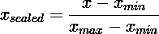

前面的公式将导致`x_scaled∈[0,1]`：

```py
from sklearn.preprocessing import MinMaxScaler
scaler = MinMaxScaler(feature_range=(0, 1))
df['scaled_PRES'] = scaler.fit_transform(np.array(df['PRES'])
 .reshape(-1, 1))
```

变量`scaled_PRES`用于开发时间序列预测模型。 为了对原始变量`PRES`进行预测，我们对模型的预测应用了适当的逆变换。

在培训模型之前，数据集分为两部分，列车集和验证集。 神经网络在火车集上培训。 这意味着在列车集上完成损耗函数，反向衰减和权重更新的计算。 验证集用于评估模型并确定培训的时期数量。 增加时期的数量将进一步降低火车集的损失函数，但由于火车集上的过度装备而可能不一定对验证集具有相同的效果。 因此，通过对验证集计算的损耗函数保持挖掘来控制时代的数量。 我们使用带有 TensoRFlow 后端的 Keras 来定义和培训模型。 模型训练和验证中涉及的所有步骤都是通过调用 Keras API 的适当函数来完成的。

首先，将数据分为训练集和验证集。 数据集的时间段为

2010 年 1 月 1 日至 2014 年 12 月 31 日。前四年（2010 年至 2013 年）用作火车和

保留 2014 以供验证：

```py
split_date = datetime.datetime(year=2014, month=1, day=1, hour=0) 
df_train = df.loc[df['datetime']<split_date] 
df_val = df.loc[df['datetime']>=split_date] 
print('Shape of train:', df_train.shape) 
print('Shape of test:', df_val.shape) 
```

前面的代码行生成以下输出：

```py
Shape of train: (35064, 15) 
Shape of test: (8760, 15) 
```

还绘制了`scaled_PRES`的训练和验证时间序列：

```py
plt.figure(figsize=(5.5, 5.5))
g = sns.tsplot(df_train['scaled_PRES'], color='b')
g.set_title('Time series of scaled Air Pressure in train set')
g.set_xlabel('Index')
g.set_ylabel(‘Scaled Air Pressure readings')
```

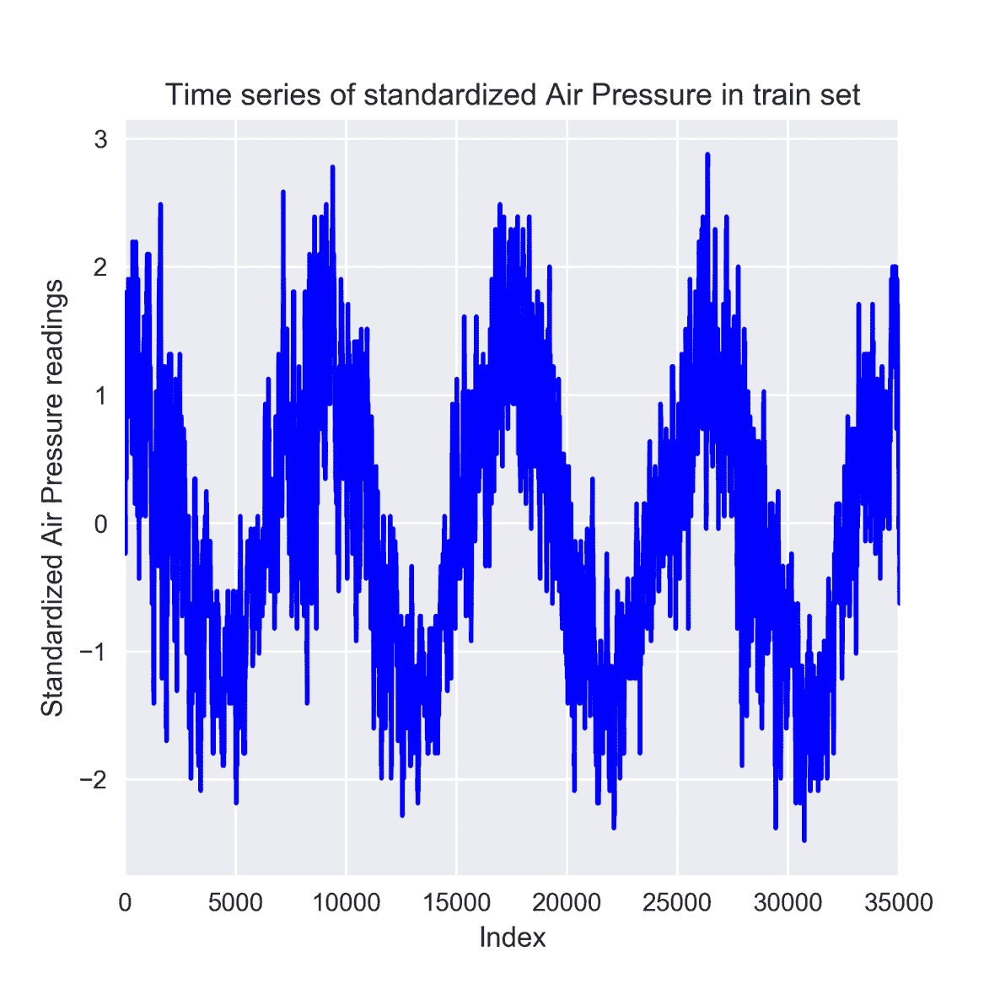

图 5.8：训练数据中最小最大比例气压的时间序列

```py
plt.figure(figsize=(5.5, 5.5)) 
g = sns.tsplot(df_val['scaled_PRES'], color='r') 
g.set_title('Time series of standardized Air Pressure in validation set') 
g.set_xlabel('Index') 
g.set_ylabel('Standardized Air Pressure readings') 

```


图 5.9：验证数据中最小最大标定气压的时间序列

现在我们需要生成回归变量（`X`）和目标变量（`y`），以进行训练和验证。 从`DataFrames`中`scaled_PRES`列的原始 1-D 数组创建一个 2D 回归数组和目标的 1-D 数组。 对于时间序列预测模型，过去 7 天的观测值用于预测第二天。 这等效于 AR（7）模型。 我们定义了一个函数，该函数以原始时间序列和时间步长为输入，以返回`X`和`y`的数组：

```py
def makeXy(ts, nb_timesteps): 
    """ 
    Input:  
           ts: original time series 
           nb_timesteps: number of time steps in the regressors 
    Output:  
           X: 2-D array of regressors 
           y: 1-D array of target  
    """ 
    X = [] 
    y = [] 
    for i in range(nb_timesteps, ts.shape[0]): 
        X.append(list(ts.loc[i-nb_timesteps:i-1])) 
        y.append(ts.loc[i]) 
    X, y = np.array(X), np.array(y) 
    return X, y 
```

调用`makeXy`函数来生成训练和验证集：

```py
X_train, y_train = makeXy(df_train['scaled_PRES'], 7) 
print('Shape of train arrays:', X_train.shape, y_train.shape) 
X_val, y_val = makeXy(df_val['scaled_PRES'], 7) 
print('Shape of validation arrays:', X_val.shape, y_val.shape) 
```

先前的`print`函数的输出如下：

```py
Shape of train arrays: (35057, 7) (35057,) 
Shape of validation arrays: (8753, 7) (8753,) 
```

现在，我们使用 Keras 功能 API 定义 MLP。 在这种方法中，各层被声明并级联为彼此的输入和输出：

```py
from keras.layers import Dense, Input, Dropout 
from keras.optimizers import SGD 
from keras.models import Model 
from keras.models import load_model 
from keras.callbacks import ModelCheckpoint 
```

输入层以形状`(None, 7)`和类型`float32`声明。 `None`指示在运行时确定的实例数：

```py
input_layer = Input(shape=(7,), dtype='float32') 
```

密集层通过线性激活来声明：

```py
dense1 = Dense(32, activation='linear')(input_layer) 
dense2 = Dense(16, activation='linear')(dense1) 
dense3 = Dense(16, activation='linear')(dense2) 
```

多个隐藏层和每个隐藏层中的大量神经元使神经网络能够对回归变量与目标之间基本关系的复杂非线性进行建模。 但是，深度神经网络也可能过度拟合训练数据，并在验证或测试集上给出较差的结果。 辍学已被用来规范化深度神经网络。 在此示例中，在输出层之前添加了一个辍学层。 删除操作会在进入下一层之前，将输入神经元的 p 分数随机设置为零。 随机丢弃的输入本质上充当了模型集合的自举聚合或袋装类型。 随机森林通过在输入要素的随机子集上构建树来使用装袋。 我们使用`p` = `0.2`删除 20％的随机选择输入要素：

```py
dropout_layer = Dropout(0.2)(dense3) 
```

最后，输出层可以预测第二天的气压：

```py
output_layer = Dense(1, activation='linear')(dropout_layer) 
```

输入，密集和输出层现在将打包在`Model`中，这是用于训练和做出预测的包装器类。 **均方误差**（**MSE**）被用作`loss`功能。

网络权重通过 **Adam 算法**优化。 亚当代表自适应矩估计，已经成为训练深度神经网络的流行选择。 与随机梯度下降不同，Adam 对每个权重使用不同的学习率，并随着训练的进行分别更新。 权重的学习率基于权重梯度和平方梯度的指数加权移动平均值进行更新：

```py
ts_model = Model(inputs=input_layer, outputs=output_layer) 
ts_model.compile(loss='mean_squared_error', optimizer='adam') 
ts_model.summary() 
```

`summary`功能显示分层详细信息，例如输入和输出的形状以及可训练砝码的数量：

```py
Layer (type)                 Output Shape              Param #   =================================================================
input_6 (InputLayer)         (None, 7)                 0         _________________________________________________________________
dense_21 (Dense)             (None, 32)                256       _________________________________________________________________
dense_22 (Dense)             (None, 16)                528       
_________________________________________________________________
dense_23 (Dense)             (None, 16)                272       _________________________________________________________________
dropout_6 (Dropout)          (None, 16)                0         _________________________________________________________________
dense_24 (Dense)             (None, 1)                 17        
=================================================================
Total params: 1,073
Trainable params: 1,073
Non-trainable params: 0
```

通过在模型对象上调用`fit`函数并传递`**X_train**`和`**y_train**`来训练模型。 训练针对预定数量的时期完成。 另外，`**batch_size**`定义了用于反向传播实例的火车样本集数量。 在每个时期完成后，还将传递验证数据集以评估模型。 `**ModelCheckpoint**`对象跟踪验证集上的损失函数，并为损失函数最小的时期保存模型：

```py
save_weights_at = os.path.join('keras_models', 'PRSA_data_Air_Pressure_MLP_weights.{epoch:02d}-{val_loss:.4f}.hdf5') 
save_best = ModelCheckpoint(save_weights_at, monitor='val_loss', verbose=0, 
                            save_best_only=True, save_weights_only=False, mode='min', 
                            period=1) 
ts_model.fit(x=X_train, y=y_train, batch_size=16, epochs=20, 
             verbose=1, callbacks=[save_best], validation_data=(X_val, y_val), 
             shuffle=True) 
```

Jupyter 笔记本`code/ Chapter_5_Air Pressure_Time_Series_Forecasting_by_MLP.ipynb`中详细介绍了训练集和验证集上的按时代划分的 MSE。 还显示了完成每个时期所需的时间。

预测是根据保存得最好的模型进行的。 对模型中基于标准气压的预测进行逆变换，以获得对原始气压的预测。 拟合优度或 R 平方也被计算：

```py
best_model = load_model(os.path.join('keras_models', 'PRSA_data_Air_Pressure_MLP_weights.06-0.0039.hdf5')) 
preds = best_model.predict(X_val) 
pred_PRES = mu + sigma*preds 
pred_PRES = np.squeeze(pred_PRES) 

from sklearn.metrics import r2_score 
r2 = r2_score(df_val['PRES'].loc[7:], pred_PRES) 
print('R-squared for the validation set:', round(r2,4)) 
```

验证集上模型的 R 平方为 0.9957。 最后，绘制了前五十个实际和预测的气压值：

```py
plt.figure(figsize=(5.5, 5.5)) 
plt.plot(range(50), df_val['PRES'].loc[7:56], linestyle='-', marker='*', color='r') 
plt.plot(range(50), pred_PRES[:50], linestyle='-', marker='.', color='b') 
plt.legend(['Actual','Predicted'], loc=2) 
plt.title('Actual vs Predicted Air Pressure') 
plt.ylabel('Air Pressure') 
plt.xlabel('Index') 
```


图 5.10：实际和 MLP 预测的气压时间序列

还为`pm2.5`变量训练了使用 MLP 的时间序列预测模型，详细实现在 Jupyter 笔记本`code\Chapter_5_PM2.5_Time_Series_Forecasting_by_MLP.ipynb`中。

绘制了`pm2.5`的箱线图，以检查异常值的存在：

```py
plt.figure(figsize=(5.5, 5.5)) 
g = sns.boxplot(df['pm2.5']) 
g.set_title('Box plot of pm2.5') 
```


图 5.11：PM2.5 时间序列的箱线图

如上图所示，`pm2.5`具有异常值，因此，选择 MSE 作为训练 MLP 的损失函数并不是最佳方法。 MSE 是实际值与预测值之间的偏差的平方，它会给损失函数带来巨大的波动。 这使梯度下降算法不稳定，并对其收敛产生不利影响。 MAE 绝对值是一阶差，因此不太容易受异常值的影响。 因此，在这种情况下，MAE 用于训练神经网络。

在继续定义和训练 MLP 之前，让我们仔细查看一年多和六个月以上的时间序列，以查看是否明显存在任何模式，例如趋势，季节性等。

```py
plt.figure(figsize=(5.5, 5.5)) 
g = sns.tsplot(df['pm2.5'].loc[df['datetime']<=datetime.datetime(year=2010,   month=6,day=30)], color='g') 
g.set_title('pm2.5 during 2010') 
g.set_xlabel('Index')  
g.set_ylabel('pm2.5 readings')
```

```py
plt.figure(figsize=(5.5, 5.5))
g = sns.tsplot(df['pm2.5'].loc[df['datetime']<=datetime.datetime(year=2010, month=1,day=31)], color='g')
g.set_title('pm2.5 during Jan 2010')
g.set_xlabel('Index')
g.set_ylabel('pm2.5 readings')
```


图 5.12：2010 年 1 月至 2010 年 6 月 PM2.5 的时间序列

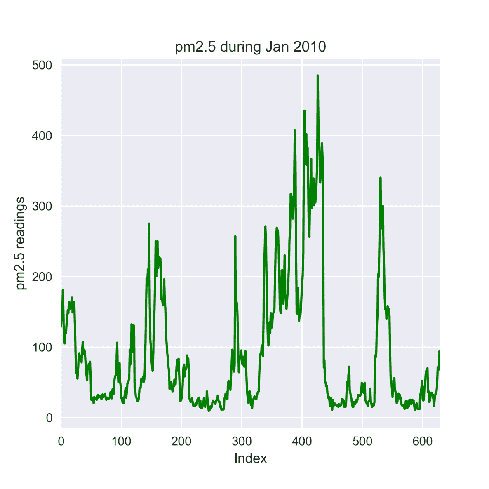

图 5.13：2010 年 1 月至 2010 年 12 月期间 PM2.5 的时间序列

当我们放大`pm2.5`的六个月数据时，就会看到一些模式。 `pm2.5`的时间序列显示出周期性的波峰和波谷，尽管两个高点和两个低点之间的时间间隔有所不同。 波峰的高度显示出很大的波动。 此外，波峰和波谷都分布在多个时间步长上。 这由被几个较小的峰包围的高峰表示。 同样，槽中的波动也很小。 如下图所示，整个系列（从 2010 年到 2014 年）没有显示任何长期趋势，尽管整个系列中可能都存在短期趋势：

```py
plt.figure(figsize=(5.5, 5.5))
g = sns.tsplot(df['pm2.5'])
g.set_title('Time series of pm2.5')
g.set_xlabel('Index')
g.set_ylabel('pm2.5 readings')
```


图 5.14：2010 年 1 月至 2014 年 12 月期间 PM2.5 的时间序列

具有多个隐藏层和每个隐藏层中多个神经元的神经网络将适合于对数据中的这种复杂非线性模式进行建模。 让我们尝试使用 MLP。

`**pm2.5**`的 MLP 分别具有三层致密层，分别在第一，第二和第三层中具有三十二，十六和十六个隐形神经元。 每层都有`tanh`激活。 输出层具有线性激活。 使用亚当优化器与 MAE 作为损失功能进行培训：

```py
input_layer = Input(shape=(7,), dtype='float32') 

dense1 = Dense(32, activation='tanh')(input_layer) 
dense2 = Dense(16, activation='tanh')(dense1) 
dense3 = Dense(16, activation='tanh')(dense2) 

dropout_layer = Dropout(0.2)(dense3) 

output_layer = Dense(1, activation='linear')(dropout_layer) 

ts_model = Model(inputs=input_layer, outputs=output_layer) 
ts_model.compile(loss='mean_absolute_error', optimizer='adam') 
```

最佳模型的验证集给出的 MAE 为 11.8993。 下图绘制了前五十个实际值和预测值：


图 5.15：PM2.5 的实际时间和 MLP 预测的时间序列

# 递归神经网络

到目前为止，我们已经使用 MLP 来开发时间序列预测模型。 为了预测时间[ *x [t-1] ，...，x [tp]* ]时的序列`p`，我们提供了过去`p`的输入向量 时间步长`p`到 MLP。 过去的`p`时间步长作为不相关的独立变量输入到 MLP。 这种模型的一个问题是，它没有隐式考虑观察值彼此相关的时间序列数据的顺序性质。 时间序列中的相关性也可以解释为时间序列自身的记忆。 在本节中，我们将讨论**递归神经网络**（**RNN**），它们在结构上与 MLP 不同，更适合于顺序数据。

RNN 成为开发语言模型的好选择，这种语言模型可以根据出现在单词之前的单词来模拟单词出现的概率。 到目前为止，RNN 已用于开发进行文本分类的模型，例如情感预测，语言翻译，并与卷积神经网络结合使用，通过文本生成来描述图像。

下图显示了具有`x_hat[t]`时间步长的 RNN，每个时间步长都由在相应步长处出现的输入提供。 最后一个时间步的输出是输入序列的预测。 例如，此 RNN 可用于开发时间序列预测模型，其中输入序列[ *x [t-1] ，...，x [ tp ]* ] 被馈送到 RNN，最后一个时间步的输出是预测：


图 5.16：具有`p`时间步长的递归神经网络

RNN 的每个计算单元的内部状态为`s[0]`，并承载该系列的内存。 每个时间步长中隐藏神经元的数量是内部状态的维数，其计算方式为`f`。 每个时间步长的这种内部状态都承载着该系列的记忆。 对于第一个时间步，输入`y = h(V s[t-1])`初始化为全零。 函数`h(·)`是非线性变换，例如`tanh`。 最后一个时间步长的输出是最后一个内部状态`U`的函数，其中`W`是非线性变换。 还可以使 RNN 返回每个时间步的输出，这对于要求翻译后的文本为目标语言中的一系列单词的语言翻译模型很有用。 要注意的重要一点是，权重`V`，`x[t]`和`x[t]` RNN 的时间步中共享，因此网络的可训练参数数量保持较低。

在语言模型的情况下，输入`m`可以是单词的一键编码。 对于一个变量的时间序列建模，`x[t]`是一个数字。 但是，RNN 可以应用于多元时间序列，这对于解决各个序列之间的互相关性特别有用。 如果 RNN 对`m`时间序列建模，则 *x [ i ]* 是`m`维向量。

# 双向递归神经网络

到目前为止讨论的 RNN 是单向的，并且沿原始时间序列的方向遍历。 但是，在许多情况下，捕获反向序列中的顺序信息和内存可以改善预测。 这种同时使用前向和后向遍历的 RNN 称为双向 RNN，它可以提高网络在长距离内捕获内存的能力。 下图显示了双向 RNN：


图 5.17：具有`p`时间步长的双向递归神经网络

# 深度递归神经网络

深度学习的强大功能是将多个计算层彼此堆叠在一起。 对于 MLP，多个隐藏层彼此相对放置。 我们可以通过将多个 RNN 相互堆叠来制作深层 RNN。 在深度 RNN 中，递归层的输入序列是前一个递归层的输出序列。 最终预测是从最终 RNN 层的最后时间步获得的。 下图说明了深层的 RNN：


图 5.18：具有`p`时间步长的深度递归神经网络

我们也可以通过将多个双向 RNN 相互堆叠来创建深度双向 RNN。 这种深层的 RNN 用于复杂的任务，例如语言翻译和文本生成，以描述可以是图像的上下文。 显然，深度 RNN 还需要数百万的网络权重才能得到训练。

# 训练递归神经网络

众所周知，RNN 很难训练。 到目前为止，我们一直在谈论的 RNN 属于 Vanilla RNN，其梯度逐渐消失和爆炸，导致训练期间的结果不稳定。 结果，RNN 难以学习远程依赖关系。 对于时间序列预测，过去追溯太多的时间步将是有问题的。 为了解决此问题，**长短期记忆**（**LSTM**）和**门控循环单元**（**GRU**）是 RNN 的特殊类型。 ，已介绍。 在本章中，我们将使用 LSTM 和 GRU 开发时间序列预测模型。 在此之前，让我们回顾一下如何使用**时间反向传播**（**BPTT**）训练 RNN，这是反向传播算法的一种变体。 我们将发现在 BPTT 期间消失梯度和爆炸梯度是如何产生的。

让我们考虑一下我们用于时间序列预测的 RNN 的计算图。 梯度计算如下图所示：


图 5.19：具有 p 个时间步长的深度递归神经网络的时间反向传播

对于权重`U`，有一条路径可以计算偏导数，如下所示：


但是，由于 RNN 的顺序结构，存在多个连接权重和损失以及与损失的路径。 因此，偏导数是沿着各个路径的偏导数的总和，该总导数从损耗节点开始，到计算图中的每个时间步节点结束：


通过对连接损失节点和每个时间步节点的路径求和来计算权重梯度的技术是沿时间反向传播，这是原始*反向传播*算法的特例。 远程 RNN 中梯度消失的问题是由于 BPTT 梯度计算中的乘法项引起的。 现在，让我们从上述方程式中的一个检查乘法项。

沿着连接损耗节点和第<sup class="calibre23">个第</sup>个时间步长的计算路径的梯度为：


梯度乘法的链很长，很难建模远距离依存关系，这就是梯度消失的问题所在。

内部状态`[0, 1)`的激活功能为`tanh`或 S 型。 `tanh`的一阶导数是`exp(-x) / (1 + exp(-x))²`，它绑定在`(0, 1/4]`中。 对于 S 型函数，一阶导数为`∂s[i]/∂s[i-1]`，它绑定在`s[i]`中。 因此，梯度`W`为正分数。 对于长时程，将这些分数梯度相乘会使最终乘积减小为零，并且长时步中没有梯度流。 由于梯度的值可以忽略不计，权重不会更新，因此据说神经元已饱和。

值得注意的是，`U`，`∂s[i]/∂s[i-1]`和`∂s[i]/∂W`是矩阵，因此偏导数`t`和`s[t]`是在矩阵上计算的。 最终输出通过矩阵乘法和加法计算。 矩阵的一阶导数称为 **Jacobian**。 如果雅可比矩阵的任何一个元素都是分数，那么对于远程 RNN，我们将看到消失的梯度。 另一方面，如果雅可比行列式的元素大于 1，则训练过程会遭受爆炸梯度的影响。

# 解决远程依赖问题

我们在上一节中看到，由于消失和爆炸梯度，香草 RNN 难以有效地学习远程依赖性。 为了解决这个问题，通过 SEPP Hochreiter 和 JürgenSchmidhuber 于 1997 年开发了长短的短期内存网络。 在 2014 年引入了门控经常性单位，并提供了更简单的 LSTM 版本。 让我们回顾 LSTM 和 GRU 如何解决学习远程依赖性的问题。

# 长期记忆

LSTM 在每个时间步中引入了其他计算。 但是，对于时间步长[ *h [t]* ），返回状态为内部状态[ *f [t]* ），并将其转发到下一个时间步。 但是，在内部，这些向量的计算方式不同。 LSTM 引入了三个新的门：输入（`o[t]`），忘记（`g[t]`）和输出（`c[t]`）门。每个时间步也具有内部隐藏状态（ *h [ t ]* ）和内部存储器（`σ(W x[t] + U s[t-1])`。这些新单位的计算方式如下：

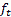 = 

 = 

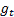 = 

 = 

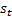 = 

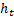 = 

现在，让我们了解一下计算。 门`o[t]`，`σ(·)`和`[0, 1]`是通过将其值限制在`f[t]`内的 S 型激活`h[t]`生成的。 因此，它们在与另一个变量相乘时仅散发值的一小部分而充当门。 输入门`o[t]`控制要保留的新计算输入的分数。 遗忘门`c[t]`确定前一个时间步的效果，输出门`f[t]`控制要释放的内部状态量。 内部隐藏状态是根据输入到当前时间步以及上一个时间步的输出来计算的。 请注意，这与在普通 RNN 中计算内部状态相同。 `h[t]`是当前时间步的内部存储单元，它考虑了上一步的存储器，但缩小了一部分`s[t]`，并减小了内部隐藏状态的影响，但与输入门`o[t]`混合在一起。 最后，`z[t]`将传递到下一个时间步，并根据当前内部存储器和输出门`r[t]`进行计算。 输入，忘记和输出门用于有选择地包括以前的内存和当前的隐藏状态，这些状态的计算方式与普通 RNN 中的相同。 LSTM 的门控机制允许从较长的时间步长进行内存传输。

# 门控循环单元

GRU 比 LSTM 简单，只有两个内部门，即更新门（ *z [t]* ）和复位门（ *r [t]* ）。 更新和重置门的计算如下：

```py
*z[t] = σ(W<sup class="calibre28">z</sup>x[t] + U<sup class="calibre28">z</sup>s[t-1])*
```

```py
*r[t] = σ(W<sup class="calibre28">r</sup>x[t] + U<sup class="calibre28">r</sup>s[t-1])*
```

使用输入 *x [t]*，状态 *s [t- 1 上一个时间步中的]*，更新和复位门：


由 S 形函数计算的更新确定在当前时间步中要保留多少前一步的内存。 复位门控制如何将先前的存储器与当前步骤的输入合并。

与具有三个门的 LSTM 相比，GRU 具有两个门。 它没有输出门和内部存储器，这两个都存在于 LSTM 中。 GRU 中的更新门决定了如何将先前的内存与当前的内存结合，并结合 LSTM 的输入门和忘记门所实现的功能。 结合了先前存储器和当前输入的效果的复位门直接应用于先前存储器。 尽管在沿序列传输内存的方式上存在一些差异，但 LSTM 和 GRU 中的门控机制都旨在学习数据中的远程依赖性。

# 使用哪一个-LSTM 或 GRU？

LSTM 和 GRU 都能够处理长 RNN 上的内存。 但是，一个常见的问题是使用哪个？ 长期以来，LSTM 一直是语言模型的首选，这从它们在语言翻译，文本生成和情感分类中的广泛使用可以明显看出。 与 LSTM 相比，GRU 的显着优势是可训练的砝码更少。 它已应用于以前 LSTM 占主导地位的任务。 但是，实证研究表明，在所有任务中，两种方法都无法胜过另一种方法。 诸如隐藏单元的维数之类的模型超参数的调整可改善两者的预测。 一个普遍的经验法则是在训练数据较少的情况下使用 GRU，因为它需要较少的可训练砝码。 在大型数据集（例如用于开发语言翻译模型的数据集）的情况下，LSTM 被证明是有效的。

# 递归神经网络用于时间序列预测

我们将继续使用空气污染数据集来演示递归神经网络以进行时间序列预测。 LSTM 用于预测气压，而 GRU 在`pm2.5`上进行了演示。

读取和预处理数据与在 MLP 上的示例相同。 原始数据集分为两组训练和验证，分别用于模型训练和验证。

`makeXy`函数用于生成回归变量和目标数组-`X_train`，`X_val`，`y_train`和`y_val`。 由`makeXy`函数生成的`X_train`和`X_val`是形状为`(number of samples, number of timesteps)`的 2D 数组。 但是，RNN 层的输入必须为`(number of samples, number of timesteps, number of features per timestep)`形状。 在这种情况下，我们只处理`pm2.5`，因此`number of features per timestep`是一个。 `Number of timesteps`为七个，`number of samples`与`X_train`和`X_val`中的`number of samples`相同，它们被重塑为 3D 阵列：

```py
X_train, X_val = X_train.reshape((X_train.shape[0], X_train.shape[1], 1)), 
                 X_val.reshape((X_val.shape[0], X_val.shape[1], 1)) 
print('Shape of 3D arrays:', X_train.shape, X_val.shape) 
```

`X_train`和`X_val`已重塑为 3D 阵列，并且它们的新形状在前面的`print`语句的输出中可见，如下所示：

```py
Shape of 3D arrays: (35057, 7, 1) (8753, 7, 1) 
```

要将 LSTM 层添加到神经网络，我们需要从 Keras 导入 LSTM 类：

```py
from keras.layers.recurrent import LSTM 
```

用于开发时间序列预测模型的神经网络具有输入层，该输入层馈入 LSTM 层。 LSTM 层有七个时间步，这与为第二天的气压做出预测所用的历史观测值相同。 仅 LSTM 的最后一个时间步返回输出。 LSTM 层的每个时间步中都有 64 个隐藏的神经元。 因此，LSTM 的输出具有六十四个功能：

```py
input_layer = Input(shape=(7,1), dtype='float32') 
lstm_layer = LSTM(64, input_shape=(7,1),  return_sequences=False)(input_layer) 
```

接下来，将 LSTM 的输出传递到一个 dropout 层，该 dropout 层在传递到 output 层之前会随机丢弃 20％的输入，后者具有一个具有线性激活函数的隐藏神经元：

```py
dropout_layer = Dropout(0.2)(lstm_layer) 
output_layer = Dense(1, activation='linear')(dropout_layer) 
```

最后，将所有层都包裹在`keras.models.Model`中，并使用 Adam 优化器训练 20 个纪元以最小化 MSE：

```py
ts_model = Model(inputs=input_layer, outputs=output_layer) 
ts_model.compile(loss='mean_squared_error', optimizer='adam') 
```

我们已将`keras.callbacks.ModelCheckpoint`用作回调，以在验证集上跟踪模型的 MSE，并保存来自提供最小验证错误的时期的权重。 验证集的最佳模型的 R 平方是 0.9959。 下图显示了前 50 个实际值和预测值：


图 5.20：实际和 LSTM 预测的气压时间序列

该示例的代码可以在 Jupyter 笔记本`code/Chapter_5_Air Pressure_Time_Series_Forecasting_by_LSTM.ipynb`中找到。

我们使用了两个堆叠的 GRU 层来开发基于 RNN 的`pm2.5`时间序列预测模型：

```py
gru_layer1 = GRU(64, input_shape=(7,1), return_sequences=True)(input_layer) 
gru_layer2 = GRU(32, input_shape=(7,64), return_sequences=False)(gru_layer1) 
```

第一个 GRU 从先前的输入层获取顺序输入。 第一个 GRU 的每个时间步都返回一个 64 维特征向量作为输出。 该序列作为输入传递到下一个 GRU 层。 第二个 GRU 层仅从最后一个时间步返回输出。 使用 Adam 优化器对神经网络进行训练，以最大程度地降低 MAE 损失。

验证集获得的最佳 MAE 为 11.388。

该示例的完整代码在 Jupyter 笔记本`code/Chapter_5_PM2.5_Time_Series_Forecasting_by_GRU.ipynb`中。


图 5.21：实际和 GRU 预测的气压时间序列

# 卷积神经网络

本节描述了**卷积神经网络**（**CNN**），当输入数据为图像时，它们主要用于开发有监督和无监督的模型。 通常，将**二维**（**2D**）卷积应用于图像，但是可以将**一维**（**1D**）卷积应用于图像上。 顺序输入以捕获时间依赖性。 本节将探讨这种方法，以开发时间序列预测模型。

# 2D 卷积

让我们从描述 2D CNN 开始，我们将导出 1D CNN 作为特殊情况。 CNN 利用图像的 2D 结构。 图像的矩形尺寸为`w`，其中`n`为高度，`h`x`w`x`n`为 图片的宽度。 每个像素的颜色值将成为模型的输入特征。 使用具有 28 x 28 个神经元的完全连接的密集层，可训练的权重数将为 28 x 28 x 100 =78400。对于 MNIST 数据集中的手写数字 32 x 32 的图像，第一个密集的可训练权重数 具有 100 个神经元的层将为 c =3。CIFAR-10 数据集通常用于训练对象识别模型。 此数据集中的彩色图像为 32 x 32 x 3 x 100 = 307200，并具有`m`x`m`x`3`3 个颜色通道，红色，绿色和蓝色。 因此，具有 100 个神经元的完全连接的密集层将具有可训练的权重。 因此，训练图像的密集层成为计算难题。

CNN 通过将神经元仅连接到图像的局部斑块来解决此问题。 如下图所示，尺寸过滤器应用于局部图像补丁。 滤镜的第三维与图像的颜色通道数相同。 滤波器中每个神经元的权重乘以图像中相应的像素值。 该局部补丁的最终特征是通过将这些单个值相加，并可选地加上一个偏差，然后将总和传递给激活函数来计算的。 激活功能的常用选择是**整流线性单位**（**ReLu**）：

*ReLu（z）= 0 且 f z≤0*

如果 z > 0 ，则 *= z*

ReLu 的一阶导数为 0 或 1，并且具有良好的梯度流动特性。 因此，在训练具有多层的深度卷积网络中是优选的。 下图所示的滤波器是一个卷积层。 为了学习不同的特征，卷积层通常具有多个过滤器。


图 5.22：滤波器在卷积神经层生成特征中的应用

为了覆盖整个图像，以 *4 x 4* 像素单位的水平步幅和 *2 x 2* 像素单位的垂直步幅移动滤镜。 滤镜在图像上的运动称为卷积。 由整个图像上的卷积产生的特征形成一个矩形特征图。 现在，让我们了解卷积如何生成特征图。 为此，让我们考虑具有单色通道并且像素值如下图所示的图像。 我们应用 *3 x 3* 卷积滤波器，并将其水平移动一个像素单位，垂直移动一个像素单位。

第一卷积被计算为 *1×-1 + 2×1 + 2×2 + 1×1 = 6*。 其他卷积的特征也以类似的方式计算。 在此示例中，所有计算值均为正，ReLu 激活的作用就像一个身份函数。 这个卷积过程将创建一个特征图，如下图所示：

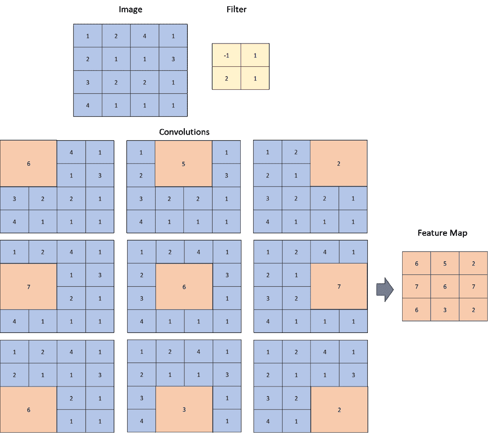

图 2.23：二维卷积图

请注意，*2 x 2* 滤镜的单位像素水平和垂直跨度将特征图的大小从原始图像中缩小为`3`x`3`。`6`x`6`。 为了确保特征图的大小与图像的大小相同，我们可以在图像的水平和垂直边界上串联零值像素，并使用滤镜。 添加零值像素称为零填充，在这种情况下，零填充将使输入图像的尺寸为 *2 x 2*。 下图显示了从零填充图像生成的特征图：

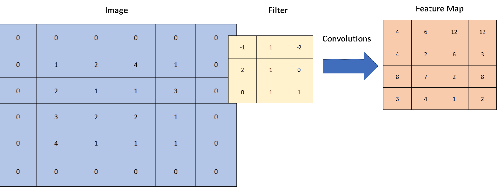

图 2.24：二维卷积生成的特征图

由卷积层生成的特征图将被馈送到下游的卷积层，就像原始输入已被提供给第一卷积层一样。 彼此叠置的多个卷积层从原始图像生成更好的特征。 然后将这些特征传递到下游的全连接密集层，这些密集层在对象类集合上生成 softmax 输出。

在大多数基于图像的深度学习模型中，不使用卷积层对原始图像或中间特征图进行下采样。 如果是这种情况，将卷积层的输出馈送到密集层时，可训练权重的数量仍然很大。 那么卷积层能实现什么呢？ 我们如何对特征图进行下采样以减少密集层中可训练权重的数量？

首先，尽管我们可以在卷积层中实现下采样，但最好将它们用于提取图像特征，例如边缘，拐角，形状等。 其次，由池化层实现的下采样，该池化层将过滤器应用于要素图的本地面片并计算单个要素。 过滤器卷积在整个特征图上。 池化层的卷积生成一个降采样的特征图。 池化层没有可训练的权重，但是应用简单的算术函数（例如最大值或平均值）来生成其输出特征图。 实证研究表明，maxpooling 层可以提取有用的图像特征并提高图像识别模型的准确性。 下图说明了 *2 x 2* maxpooling 层如何生成特征图。 maxpooling 层的水平和垂直步幅为两个单位，并且已将输入特征图从降低采样到 *28 x 28*。


图 2.25：二维 maxpooling 的图示

下图说明了用于图像识别的神经网络。 有两个卷积层块，然后是一个完全连接的密集层块。 带有标签的图像被馈送到该网络，并且输出是标签类别上的概率。 例如，可以使用具有`t`个手写数字（0、1、2，... 9）灰度图像的 MNIST 数据集训练数字识别模型。 灰度图像被馈送到神经网络，如下图所示。 网络的最后一层是 softmax 层，它提供了十位数字类的预测概率。 概率最高的类别是预测数字。


图 2.26：用于图像分类的深度卷积神经网络架构

# 一维卷积

一维卷积层可用于开发时间序列预测模型。 具有 1 个`m`观测值的时间序列类似于尺寸为`p`的图像，其高度为单个像素。 在这种情况下，可以使用`1`x`3`滤波器将 1D 卷积作为 2D 卷积的特殊情况。 另外，过滤器仅沿水平方向移动`1`x`8`时间单位的步长。

让我们了解一维卷积的工作原理。 考虑下图，该图显示了十个时间步长的时间序列。 （1 x -1）+（2x1）+（-1 x 2）= -1 过滤器在序列上移动了一个时间单位。 因此，生成了`1`x`3`特征图。 特征图的第一元素被计算为`1`x`10`。 其余时间步长以类似的方式计算。 我们没有对原始时间序列进行零填充，因此特征图比原始时间序列短两个单位。 但是，对输入时间序列的开始和结束进行零填充并使用相同的滤波器将导致`1`x`3`特征图。 可以将池化层与卷积层堆叠在一起以对特征图进行下采样。

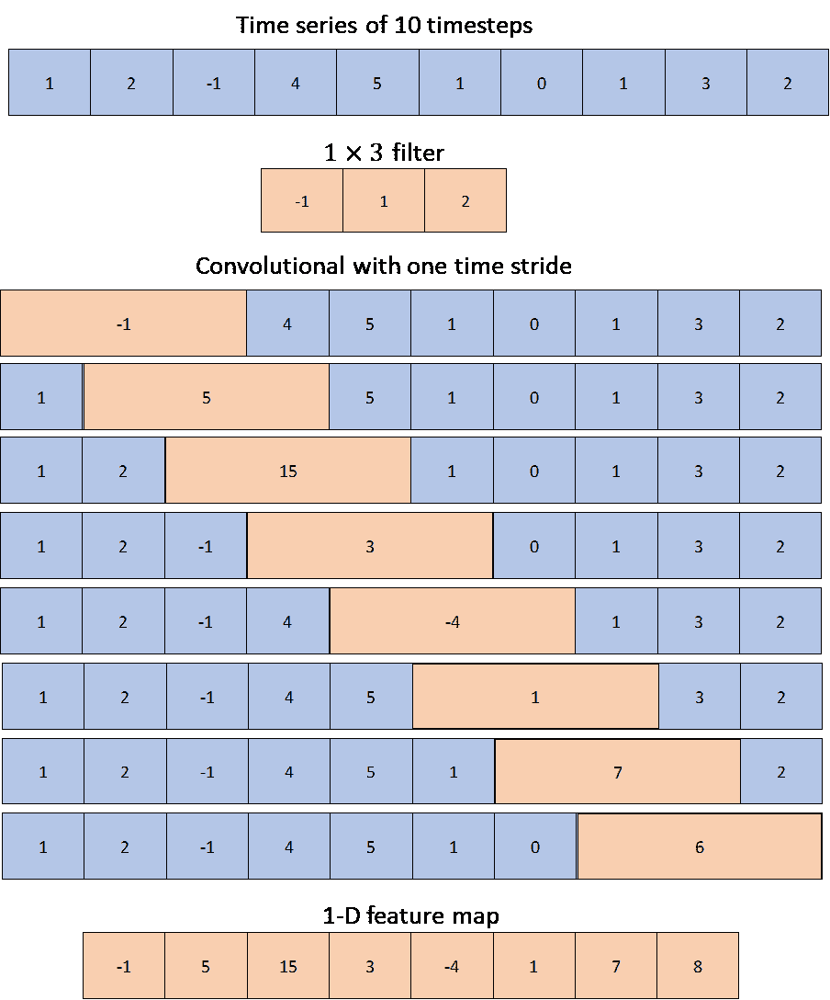

图 2.27：一维卷积图

使用 *1 x 3* 卷积滤波器的方法等效于训练几个三阶的局部自回归模型。 这些局部模型在输入时间序列的短期子集中生成特征。 在 1D 卷积层之后使用平均池化层时，它将在前一卷积层生成的特征图上创建移动平均值。 此外，几个 1D 卷积和合并层相互堆叠时，提供了一种从原始时间序列中提取特征的有效方法。 因此，在处理复杂的非线性时间序列（例如音频波，语音等）时，使用 CNN 证明是有效的。 实际上，CNN 已成功应用于音频波的分类。

在以下部分中，我们将使用 1D 卷积开发时间序列预测模型。

# 一维卷积用于时间序列预测

我们将继续使用空气污染数据集来演示时间序列预测的 1D 卷积。 输入到卷积层的形状为`(number of samples, number of timesteps, number of features per timestep)`。 在这种情况下，`number of timesteps`是七个，`number of feature per timestep`是我们仅担心的空气压力，这是一个单变量。 要开发卷积神经网络，我们需要导入三个新课程：

```py
from keras.layers.convolutional import ZeroPadding1D 
from keras.layers.convolutional import Conv1D 
from keras.layers.pooling import AveragePooling1D 
```

在输入层之后添加`ZeroPadding1D`层，以在每个序列的开头和结尾添加零。 零填充可确保卷积层不会减小输出序列的维数。 在卷积层之后添加的池化层用于对输入进行下采样：

```py
zeropadding_layer = ZeroPadding1D(padding=1)(input_layer)
```

接下来，我们添加一个`Conv1D`层。 `Conv1D`的第一个参数是过滤器的数量，它们确定输出中要素的数量。 第二个参数指示一维卷积窗口的长度。 第三个参数是`strides`，表示移动卷积窗口的位数。 最后，将`use_bias`设置为`True`会在计算输出特征时增加一个偏差值。 在这里，一维卷积可以认为是在三个时间单位的滚动窗口上生成本地 AR 模型。

```py
conv1D_layer = Conv1D(64, 3, strides=1, use_bias=True)(zeropadding_layer)
```

接下来添加`AveragePooling1D`，通过对三个时间步进行平均（跨度为一个时间步）对输入进行下采样。 在这种情况下，平均池可被视为对三个时间单位的滚动窗口进行移动平均。 我们使用平均池而不是最大池来生成移动平均值：

```py
avgpooling_layer = AveragePooling1D(pool_size=3, strides=1)(conv1D_layer) 
```

前面的池化层返回 3D 输出。 因此，在传递到输出层之前，先添加`Flatten`层。 `Flatten`层将对`(number of samples, number of timesteps×number of features per timestep)`的输入进行整形，然后在通过`Dropout`层之后将其馈送到输出层：

```py
flatten_layer = Flatten()(avgpooling_layer) 
dropout_layer = Dropout(0.2)(flatten_layer) 
output_layer = Dense(1, activation='linear')(dropout_layer) 
```

将这些层打包到`keras.models.Model`包装器中，并使用 Adam 优化器对其进行了培训，以使 MAE 降至最低。 最佳模型的验证 R 平方为 0.9933。

详细的实现在 Jupyter 笔记本`code/ Chapter_5_Air_Pressure_Time_Series_Forecasting_by_1D_Convolution.ipynb`中。 我们采用了类似的方法来为`pm2.5`开发基于 1D CNN 的时间序列预测模型，并将代码编写在 Jupyter 笔记本`code/ Chapter_5_PM2.5_Time_Series_Forecasting_by_1D_Convolution.ipynb`中。

# 概括

在本章中，我们描述了三种基于深度学习的方法来开发时间序列预测模型。 神经网络适用于几乎没有诸如长期趋势和季节性之类的基本属性的信息，或者这些信息过于复杂而无法通过传统统计方法以可接受的准确度进行建模的情况。 诸如 MLP，RNN 和 CNN 之类的不同神经网络架构会从数据中提取复杂的模式。 如果使用适当的措施对神经网络模型进行了训练，以避免对训练数据过度拟合，那么这些模型可以很好地针对看不见的验证或测试数据进行概括。 为了避免过度拟合，我们应用了 dropout，它在深度神经网络中广泛用于各种数据集和应用。 我们希望本章能使您对可用于时间序列预测的高级技术有所了解。 本章随附的 Jupyter 笔记本有望为您提供必要的基础知识，这对于开发用于解决复杂问题的更高级模型很有用。