# 二、计算几率

> 原文：[prob140/textbook/notebooks/ch02](https://nbviewer.jupyter.org/github/prob140/textbook/blob/gh-pages/notebooks/Chapter_02/)
> 
> 译者：[飞龙](https://github.com/wizardforcel)
> 
> 协议：[CC BY-NC-SA 4.0](http://creativecommons.org/licenses/by-nc-sa/4.0/)
> 
> 自豪地采用[谷歌翻译](https://translate.google.cn/)

一旦你开始处理概率问题，你很快就会意识到所有可能结果是等可能的假设并不总是合理的。例如，如果你认为硬币有偏差，那么你就不会认为它的正反面具有相同的几率。

为了处理一些情况，其中某些结果比其他结果几率更高，需要更普遍的理论。在 20 世纪 30 年代，俄罗斯数学家[安德烈科尔莫戈罗夫](https://en.wikipedia.org/wiki/Andrey_Kolmogorov)（Andrey Kolmogorov，1903-1987）提出了一些基本规则，称为公理，涵盖了丰富的情况，并成为现代概率论的基础。

公理从结果空间`Ω`开始。我们现在假设`Ω`是有限的。概率是一个定义在事件上的函数`P`，正如你所知，它是`Ω`的子集。前两个公理只是设置了度量的尺度：他们将概率定义为 0 和 1 之间的数字。

+   概率是非负的：对于每个事件`A`，。
+   整个空间的概率为 1：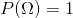。

第三个也是最后一个公理，它是概率成为事件“测度”的关键。在我们制定了一些相关术语后，我们会研究它。

## 加法

第三个公理关于互斥事件。非正式来讲，如果最多只有一个事件发生，则两个事件`A`和`B`是互斥的；换句话说，它们不能同时发生。

例如，假设你从一门课中随机抽取一名学生，其中 40% 的学生是新生，20% 是大二学生。每个学生既可以是大一学生，也可以是大二学生，也可以什么都不是；但没有一个学生既是大一学生，也是大二学生。所以如果`A`是“所选学生是新生”而`B`是事件“所选学生是二年级”的事件，则`A`和`B`是相斥的。

互斥事件有什么大不了的？要理解这一点，首先考虑所选学生是大一学生或大二学生的事件。在集合论的语言中，这是“新生”和“大二”两个事件的结合。使用维恩图来显示事件是一个好主意。在下图中，将`A`和`B`设想为两个互斥的事件，显示为蓝色和金色圆圈。因为事件是互斥的，所以相应的圆不重叠。并集是两个圆圈中所有点的集合。

```py
def show_disjoint_union():
    plt.figure(figsize=(10, 20))
    # create the circles with shapely
    a = sg.Point(1.4,2.5).buffer(1.0)
    b = sg.Point(3.3,2.5).buffer(0.75)


    # use descartes to create the matplotlib patches
    ax = plt.subplot(121)
    ax.add_patch(descartes.PolygonPatch(a, fc='darkblue', ec='k', alpha=0.8))
    ax.add_patch(descartes.PolygonPatch(b, fc='gold', ec='k', alpha=0.6))
    ax.annotate('A', [1.4, 2.5])
    ax.annotate('B', [3.3, 2.5])

    # control display
    plt.title('Mutually Exclusive Events')
    plt.axis('off')
    ax.set_xlim(0, 5); ax.set_ylim(0, 5)
    ax.set_aspect('equal')

    # use descartes to create the matplotlib patches
    ax = plt.subplot(122)
    ax.add_patch(descartes.PolygonPatch(a, fc='blue', ec='k', alpha=0.8))
    ax.add_patch(descartes.PolygonPatch(b, fc='blue', ec='k', alpha=0.8))

    # control display
    plt.title('Disjoint Union')
    plt.axis('off')
    ax.set_xlim(0, 5); ax.set_ylim(0, 5)
    ax.set_aspect('equal')
    
show_disjoint_union()
```


学生是大一或大二的几率是多少？ 在总体中，40% 是大一，20% 是大二，所以自然答案是 60%。 这是满足我们“大一或大二”标准的学生的百分比。 简单的加法是有效的，因为两组不相交。

科尔莫戈罗夫用这个想法来形成第三个，也是最重要的概率公理。正式来讲，如果交集为空，则`A`和`B`是互斥事件：


### 第三个公理，加法规则

在有限结果空间的背景下，公理表明：

+   如果`A`和`B`是互斥事件，那么 。

你将在练习中表明这个公理蕴涵着更一般的东西：

+   对于任何固定的`n`，如果 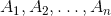 是互斥的（也就是对于所有 ，），那么：

    

    有时叫做有限可加性公理。
    
这个看似简单的公理具有巨大的力量，特别是当它扩展到无数个互斥的事件时。首先，它可以用来创建一些方便的计算工具。

### 嵌套事件

假设一个班级中有 50% 的学生将数据科学作为他们的专业之一，40% 的学生主修数据科学和计算机科学（CS）。 如果你随机选择一个学生，那么该学生主修数据科学，但不是 CS 的几率是什么？

下面的维恩图显示了一个对应于事件`A`（数据科学作为专业之一）的深蓝色圆圈，和一个对应`B`（主修数据科学和 CS）的金色圆圈（未按比例绘制）。这两个事件是嵌套的，因为`B`是`A`的一个子集：`B`中的每个人都把数据科学作为他们的专业之一。

所以 ，那些主修数据科学但不是 CS 的人是`A`与`B`的差：

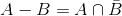

其中 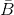 是`B`的补集。差是右侧浅蓝色的圆圈。

```py
def show_difference():
    plt.figure(figsize=(10, 20))
    # create the circles with shapely
    a = sg.Point(2,2.5).buffer(1.0)
    b = sg.Point(2,2.5).buffer(0.75)

    # compute the 2 parts
    left = a.difference(b)
    middle = a.intersection(b)

    # use descartes to create the matplotlib patches
    ax = plt.subplot(121)
    ax.add_patch(descartes.PolygonPatch(left, fc='darkblue', ec='k', alpha=0.8))
    ax.add_patch(descartes.PolygonPatch(middle, fc='olive', ec='k', alpha=0.8))

    # control display
    plt.title('Nested Events')
    plt.axis('off')
    ax.set_xlim(0, 5); ax.set_ylim(0, 5)
    ax.set_aspect('equal')

    # use descartes to create the matplotlib patches
    ax = plt.subplot(122)
    ax.add_patch(descartes.PolygonPatch(left, fc='blue', ec='k', alpha=0.8))
    ax.add_patch(descartes.PolygonPatch(middle, fc='None', ec='k', alpha=0.8))

    # control display
    plt.title('The Difference')
    plt.axis('off')
    ax.set_xlim(0, 5); ax.set_ylim(0, 5)
    ax.set_aspect('equal')

show_difference()
```


这个学生在浅蓝色的差中的几率是多少呢？ 如果你回答“50% - 40% = 10%”，你是对的，你的直觉说概率的行为就像区域一样。他们是这样。 事实上，这个计算是从可加性的公理出发的，我们也通过查看这些区域来受它们启发。

### 减法规则

假设`A`和`B`是事件，。那么 。

证明。由于 ，

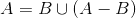

这是个不相交集合，根据加法公理：


所以，


### 补集

如果一个事件的几率是 40%，它不会发生的几率是多少？ 60% 的“明显”答案是减法规则的特例。

#### 补集规则

对于任何事件`B`，。

证明。 下面的维恩图显示了要做什么。 在减法公式取`A = Ω`，记住第二个公理 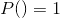。或者，在这种特殊情况下为减法规则重新取参数。

```py
def show_complement():
    plt.figure(figsize=(10, 20))
    # create the square and circle with shapely
    a = sg.box(0, 0, 4.5, 4.5) 
    b = sg.Point(2.25,2.5).buffer(1)

    # compute the 2 parts
    left = a.difference(b)
    middle = a.intersection(b)

    # use descartes to create the matplotlib patches
    ax = plt.subplot(121)
    ax.add_patch(descartes.PolygonPatch(left, fc='None', ec='k', alpha=0.8))
    ax.add_patch(descartes.PolygonPatch(middle, fc='darkblue', ec='k', alpha=0.8))

    # control display
    plt.title('An Event (Square = Omega)')
    plt.axis('off')
    ax.set_xlim(0, 5); ax.set_ylim(0, 5)
    ax.set_aspect('equal')

    # use descartes to create the matplotlib patches
    ax = plt.subplot(122)
    ax.add_patch(descartes.PolygonPatch(left, fc='blue', ec='k', alpha=0.8))
    ax.add_patch(descartes.PolygonPatch(middle, fc='None', ec='k', alpha=0.8))

    # control display
    plt.title('The Complement')
    plt.axis('off')
    ax.set_xlim(0, 5); ax.set_ylim(0, 5)
    ax.set_aspect('equal')

show_complement()
```

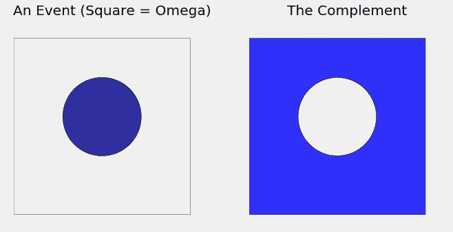

当你在概率计算中看到减号时，就像在上面的补集规则中一样，你会经常发现减号是由于在附加规则的应用中，术语的重新排列。

当你加或减概率时，你就隐式地将一个事件分解成不相交的部分。这被称为划分事件，是需要掌握的一项基本的重要技术。在随后的章节中，你将看到很多划分的用法。

## 示例

让我们看看我们是否可以使用我们开发的结果来计算一些几率。一些步骤不计算也能清楚；其他东西需要更多的工作。

示例 1：`n`次投掷中的正面和反面

一枚硬币被抛出`n`次，以使所有  种可能的正反面序列是等可能的。

问题。获得至少一个正面和至少一个反面的几率是多少？

回答。许多序列中每一面至少出现一次。例如，如果`n = 4`，则这样的序列包括`HTTT`，`HTHT`，`TTHT`等等。

方法 - 补集：当一个事件可能以多种不同的方式发生时，查看它不会发生的方式可能是一个好主意，因为这样情况较少。

对于`n = 4`，每个面没有至少出现一次的唯一序列是`HHHH`和`TTTT`。事实上，对于任何`n`，只有两个序列，我们不能从中得到两个面：所有都是正面和所有都是反面。这些是所有元素都相同的两个序列。

让`A`成为事件“我们得到至少一个正面和至少一个反面”。问题要求`P(A)`。因为  是事件“序列的所有元素都相同”，所以我们有：


根据补集规则：


请注意，随着`n`变大，答案趋于 1。随着大量的投掷，你几乎肯定可以看到正面和反面。

## 示例 2：骰子的 12 次投掷的最大值

一个骰子投掷了 12 次，所以所有 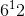 个点数序列是等可能的。将 12 个投掷的最大值定义为 12 个点数中出现的最大值。 例如，序列`354222143351`的最大值是 5。

问题 1。最大值小于 5 的概率是多少？

答案 1。关键是观察事件“最大值小于 5”与事件“所有 12 个面都小于 5”相同。 为了发生这种情况，12 个点数中的每一个都必须具有四个值 1 到 4 之一。所以：

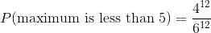

是的，我们可以进一步简化，但我们不打算，因为很快就会明白原因。

问题 2。最大值小于 4 的概率是多少？

答案 2。这里没有什么新东西，除了在问题 1 中将 5 替换成 4。

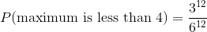

问题 3。最大值等于 4 的概率是多少？

答案 3：写下所有最大值等于 4 的序列的并不容易。 让我们看看，我们是否可以使用我们已经知道的。 最大值等于 4：

最大值必须小于 5，
并且不能小于 4。

我们将集合`{4}`看作一个差：`{1,2,3,4} - {1,2,3}`。

所以通过减法规则，

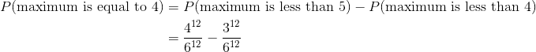

12 次投掷没有什么特别之处。你可以在整个过程中用`n`代替 12，并且参数将如上所述。

最大值是一个极值的例子，另一个是最小值。

解决问题的技巧：当你使用极值时，请记住我们在本例中使用的观察结果：说最大值很小等同于说所有元素都很小。类似地，说最小值很大等同于说所有元素都很大。

### 示例 3：大于第一个随机数的第二个随机数

一个随机数生成器产生两个数字，因此所有 100 对数字都是等可能的。

问题。第二位数字大于第一位的可能性是多少？

答案，方法一 - 划分：制定事件发生的所有方式的组织清单。 列出第二个数字大于第一个数字的一个好方法是，根据第一个数字的值来划分它们：

+   第一位数字 0，第二位 1 到 9
+   第一位数字 1，第二位 2 到 9
+   第一位数字 2，第二位 3 到 9
+   等等，直到
+   第一位数字 8，第二位 9

这个划分使其很容易计算，在 100 个可能的偶对中，第二个数字大于第一个数字的所有偶对：有`9 + 8 + 7 + 6 + 5 + 4 + 3 + 2 + 1 = (9×10) / 2 = 45`种。所以答案是 0.45。

答案，方法二 - 对称性：用一些对称性说服自己：第二个数字大于第一个数字的几率与第一个数字大于第二个数字的几率相同。一种方法是根据第二个数字的值，来划分第二个事件，并注意与方法一中的划分的对应关系。

所以如果 ，加法规则表明：


因为有 10 对相等的数字：`00, 11, 22, ..., 99`。现在求解`p`：


像之前一样。

学习这两种方法是一个好主意。划分和对称将在整个课程中使用。

## 乘法

概率的主要公理有关互斥事件，事实证明，我们不需要任何其他公理来处理相交的事件。

```py
def show_intersection():
    plt.figure(figsize=(8, 16))
    # create the circles with shapely
    a = sg.Point(-.5,0).buffer(1.0)
    b = sg.Point(0.5,0).buffer(0.75)

    # compute the 3 parts
    left = a.difference(b)
    right = b.difference(a)
    middle = a.intersection(b)

    # use descartes to create the matplotlib patches
    ax = plt.subplot(121)
    ax.add_patch(descartes.PolygonPatch(left, fc='darkblue', ec='k', alpha=0.8))
    ax.add_patch(descartes.PolygonPatch(right, fc='gold', ec='k', alpha=0.6))
    ax.add_patch(descartes.PolygonPatch(middle, fc='olive', ec='k', alpha=0.8))
    ax.annotate('A', [-0.5, 0])
    ax.annotate('B', [0.5, 0])

    # control display
    plt.title('Two Events')
    plt.axis('off')
    ax.set_xlim(-2, 2); ax.set_ylim(-2, 2)
    ax.set_aspect('equal')

    # use descartes to create the matplotlib patches
    ax = plt.subplot(122)
    ax.add_patch(descartes.PolygonPatch(left, fc='None', ec='k', alpha=0.8))
    ax.add_patch(descartes.PolygonPatch(right, fc='None', ec='k', alpha=0.8))
    ax.add_patch(descartes.PolygonPatch(middle, fc='blue', ec='k', alpha=0.8))

    # control display
    plt.title('The Intersection')
    plt.axis('off')
    ax.set_xlim(-2, 2); ax.set_ylim(-2, 2)
    ax.set_aspect('equal')
    
show_intersection()
```


让`A`和`B`为两个事件。 交集`A ∩ B`是`A`和`B`都是发生的事件，右侧的维恩图中以亮蓝色显示。

因为我们会一直遇到交集，所以在我们的表示法中我们会有点偷懒：我们将使用`AB`来表示交集，而不会写入交集符号`∩`。你必须记住`AB`是一个事件，而不是乘积。

这里有一个例子可以帮助解释我们即将制定的一些定义。

### 无放回随机抽取

假设我有一个小牌组，由一张红色，一张绿色和一张蓝色的牌组成。假设我洗牌，抽一张，给剩下的两张洗牌，然后从中抽出一张。这被称为在不从牌组替换的情况下，随机抽取两张牌。

一个合理的结果空间是`Ω = {RG, RB, GB, GR, BR, BG}`，其中所有六个元素的等可能的。

我们首先获得绿色，然后是红色的牌的几率，是单个序列`GR`的几率：


简单的计算包含更有趣的东西。 注意：


第二个因子 1/2 是什么？要理解这一点，只要看看`G`排在第一位的偶对。 其中，只有一个的下一张牌是`R`。乘积的第二个因子是：

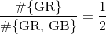

这个分数被称为，在`G`是第一个的条件下，`R`是第二个的条件概率。

它表示为`P(second card R∣first card G)`。这是垂直的条形，不是倾斜的。

现在我们对这张牌的原始计算可以写成一次一张牌：


### 条件概率

像上面这样的计算启发了一个新的定义。让`A`和`B`为两个事件。那么`B`在`A`条件下的条件概率定义为：

除法规则：

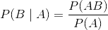

这里有一些滥用符号的情况。`B|A`不是一个事件。 但是符号很方便。整个左侧应被理解为“在发生`A`的情况下的`B`发生的概率”。

定义表明：给定`A`发生了，所以把你的注意力限制在`A`发生的结果上。 这就是你现在的整个空间，所以所有的几率必须相对于`P(A)`来计算。 现在`B`发生的几率是什么？答案是`P(AB)/P(A)`。

我们除以`P(A)`，你们之间更加小心可能会想知道如果`P(A) = 0`会发生什么。 那么，在这种情况下，我们不会给定`A`发生，因为`A`不会发生。所以我们不必担心这种情况。

乘法规则：

这只是条件概率定义的重新排列，但它也许是所有规则中最常用的规则。

让`A`和`B`为两个事件。 那么他们都发生的几率是：

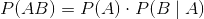

注意答案是“小部分的小部分”。`A`和`B`都发生的几率小于`A`发生的几率 - 事件上条件越多，发生的概率就越小。

由于`AB ⊆ B`，你知道`P(AB)`小于`P(B)`。你也检查一下：


我们将以一些简单的例子结束本节。 下一节包含一些需要更多工作的例子。

### 示例 1：两张牌中的两个 A

标准牌组由 52 张牌组成，其中 4 张是 A。两张牌无放回地随机发放。

问题 1。给定第一张牌是 A，第二张牌是 A 的几率是多少？

答案 1。3/51，因为现在你的套牌有 51 张牌，其中 3 张是 A。

问题 2。两张牌都是 A 的机会是多少？

答案 2：通过乘法规则和答案 1，答案是：

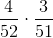

问题 3。如果带放回地发牌，问题 1 和问题 2 的答案如何改变？

答案 3（究竟谁带放回地发牌？仅仅在概率班里面......）在抽出第二张牌之前，你放回了牌。在这个假设下，你每次都从完全相同的牌组上进行抽取，所以：

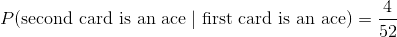

无论第一张牌是什么，答案都是一样的。同时：


注意，改变随机性的性质不会改变你是否乘以几率。你仍然在寻找交集的几率，所以你打算做乘法。假设的改变只会改变你的相乘方式。

### 示例 2：99 岁

根据你在 Data8 中看到的人口普查估计，2014 年美国人口为 318,857,056。 共有 9,037 名 99 岁男性和 32,791 名 99 岁女性。

问题。假设你在 2014 年从美国人口中随机挑选了一个人，那个人是 99 岁。根据这些信息，这个人是女性的几率是多少？

回答。答案自然是 99 岁中的女性百分比：

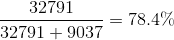

这与条件概率的定义一致，即你应该计算：


美国整体人口数字并不需要；它可以消去。 这是条件的重要观察。当你随机抽样并且你知道你的选择位于特定的子组中时，该子组内的数字都是重要的。

给定 99 岁的年龄，这个人的女性的概率几乎是男性的四倍。但正如你在 Data 8 中看到的，在我们最年轻的居民中 - 新生儿 - 男性多于女性。

## 更多示例

仅仅是一个加法规则和一个乘法规则 - 这就是所需要的一切。以下是标准问题求解技巧的一些示例。

### 示例 1：基本方法 - 从划分开始

一个盒子包含 6 个黑巧克力和 4 个牛奶巧克力。 我随机挑选了两个，不带放回。

问题。我得到每一种的几率是多少？

回答。你会注意到这个问题没有说明第一个是黑的还是牛奶。两个都可能发生。因此，请列出事件发生的不同方式，即事件划分：

第一个是黑的然后是牛奶：根据乘法规则，几率为`(6/10)·(4/9)`
第一个是牛奶然后是黑的：几率为`(4/10)·(6/9)`

（啊！这两项是相同的！为无放回抽样中的更多这样的对称性做好准备。）

现在将两个几率相加。 答案是`2·(6/10)·(4/9)`。

这种方法应该像呼吸一样自然。 你应该在不自然的假设下重做这个问题，即巧克力是带放回抽样的，看看什么变化了，什么保持不变。

### 示例 2：波利亚坛子模型

一个盒子包含`b`个黑球和`w`个白球。随机抽取一个球，然后把它放回，并放入`d`个同颜色更多的球。然后从坛子中随机抽出一个球。

问题 1。第一个抽出的球是黑色的几率是多少？

答案 1。不需要太多努力。


问题 2：第二个抽出的球是黑色的几率是多少？

答案 2。你自然而然会想，第一个球是什么，所以根据那个球的颜色进行划分，然后相加。基本方法再次发挥作用。


这与第一个球是黑色的几率是一样的，不管`d`是什么。这个规律很有趣！

问题 3：给定第一个球是黑色的，第二个球是黑色的概率是多少？

答案 3。我们已经在上面的计算中使用了它。 “随时间前进”的条件概率通常可以从问题中的信息中读出，例如：

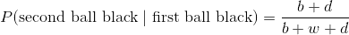

问题 4：给定第二个球是黑色的，第一个球是黑色的几率是多少？

答案 4，这种“时光倒流”的条件概率不易读出。这是除法规则的所在。


这个确实取决于`d`，但它与答案 3 一样。前后颠倒似乎没有什么区别。

现在你开始明白，为什么这个规律带有着名的创始人乔治波利亚（George Polya，1887-1985）的名字。你可以继续重复这个规律 - 用`d`个另一个颜色的球代替抽出的球，然后再次抽出 - 获得一个过程，具有美丽和有用的属性，以便在数据进入时更新观点。我们将在课程的后面看到。

## 更新概率

数据改变了思想。我们可能会从世界如何运作的一系列假设开始，但随着我们收集更多数据，我们可能需要根据数据中看到的内容更新我们的观点。

观点可以通过概率来反映，而这些观点也可以在信息进入时更新。在本节中，我们将建立一个给定数据情况下的概率更新方法。我们将从一个例子开始，然后我们将更广泛地陈述该方法。

### 示例：真阳性

人口中有一种罕见的疾病：只有 0.4% 的人拥有它。有一种针对这种疾病的检验，用于拥有这种病的人，有 99% 的几率返回阳性结果。用于没有疾病的人，它有 99.5% 的机会返回阴性结果。总的来说，这是一个相当不错的检验。

从这个人口中随机挑选一个人。给定这个人的测试结果为阳性，这个人患病的概率有多大？

以下是我们在 Data8 中绘制的树状图，用于总结问题中的信息。


为了解决这个问题，我们将使用除法规则。 让`D`为患者拥有疾病的事件，并且在一些数学符号被滥用的情况下，让`+`成为患者测试结果为阳性的事件。 那么我们要找的是`P(D | +)`。按照除法规则，

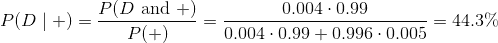

```py
(.004*.99)/(0.004*.99 + 0.996*.005)
# 0.44295302013422816
```

### 贝叶斯规则

一般来说，如果整个结果空间可以划分为事件 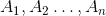，`B`是一个正概率事件，那么对于每个`i`，


这种计算称为贝叶斯规则，是一个环境下的除法规则的应用，其中事件  可以看做“较早”阶段的结果，并且`B`是“较晚”阶段的结果。通过计算，我们可以求出给定较晚事件的，较早事件的“时光倒流”的条件概率，通过写出给定较早事件的，较晚事件的“随时间前进”的条件概率。

### 先验的影响

让我们仔细看看在我们在例子中得到的答案的数值。这有点令人不安。它说，即使这个人结果为阳性，他们患病的几率也不到 50%。这似乎很奇怪，因为测试的准确率非常高。

这不是测试或贝叶斯规则的错误。这是因为我们的前提是“这个人是随机从人群中挑选的”。这种疾病非常罕见，患有该疾病并且是阳性的人的比例，实际上比没有该疾病并且测试结果错误的人少一些。这解释了为什么随机挑选的人的答案少于 50%。

但是做疾病测试的人，通常由于他们或他们的医生认为他们应该做。在这种情况下，他们不再是“随机挑选”的人口成员。

对于这样的人，我们必须重新思考我们对随机性的假设。如果一个人认为他们可能患有这种疾病，那么他们患这种疾病的主观概率，应该大于随机成员的概率。让我们执行以下步骤，看看之前的差异有多大。

+   我们将把疾病的“先验概率”从 0.004 改为其他值；“无疾病”的先验概率将相应做出改变。
+   我们将保持测试准确率不变。
+   我们将观察对于先验的不同值，给定某人是阳性，疾病的“后验概率”的变化。

```py
prior = make_array(0.004, 0.01, 0.05, 0.1, 0.5)
Table().with_columns(
   'Prior P(D)', prior,
    'Posterior P(D|+)', (prior*0.99)/(prior*0.99 + (1-prior)*0.005)
)
```

| 先验`P(D)` | 后验`P(D|+)` |
| --- | --- |
| 0.004 | 0.442953 |
| 0.01 | 0.666667 |
| 0.05 | 0.912442 |
| 0.1 | 0.956522 |
| 0.5 | 0.994975 |

该表格显示，给定测试结果为阳性，这个人患病的后验几率，很大程度上取决于先验。例如，如果这个人认为他们甚至有 10% 的几率患病，那么，给定他们测试为阳性，他们患病的概率会更新为 95% 以上。
