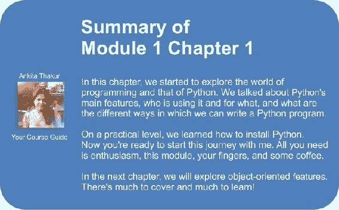

# 一、简介和第一步——深呼吸

“你交给某人一个程序，你将折磨他一整天；你教某人如何编写程序，你将折磨他一辈子。”

——程序员谚语

根据维基百科，**计算机编程** 为：

> *“ ...从计算问题的原始表述到可执行计算机程序的过程。编程涉及诸如分析，发展理解，生成算法，验证算法要求（包括其正确性和资源消耗）的活动，以及 目标编程语言实现算法（通常称为编码）”。*

简而言之，编码就是告诉计算机使用它理解的语言来执行某项操作。

计算机是非常强大的工具，但不幸的是，它们无法自己思考。 因此，他们需要被告知一切。 他们需要被告知如何执行任务，如何评估条件以决定要遵循的路径，如何处理来自网络或磁盘等设备的数据，以及在发生意外情况时如何应对。 ，有东西损坏或丢失。

您可以使用许多不同的样式和语言进行编码。 难吗？ 我会说“是”和“否”。 有点像写作。 每个人都可以学习如何写作，您也可以。 但是，如果您想成为一名诗人怎么办？ 仅仅写作是不够的。 您必须掌握其他全部技能，这将需要更长的时间和更大的努力。

最后，一切都取决于您要走多远。 编码不仅仅是将一些有效的指令组合在一起。 不仅如此！

好的代码简短，快速，优美，易于阅读和理解，简单，易于修改和扩展，易于缩放和重构以及易于测试。 能够同时编写具有所有这些特性的代码需要花费一些时间，但是好消息是，您现在正在阅读此模块，迈出了第一步。 我毫不怀疑您可以做到。 实际上，任何人都可以一直编程，只是我们不知道它。

您想举个例子吗？

假设您要煮速溶咖啡。 您必须得到一个杯子，速溶咖啡罐，茶匙，水和水壶。 即使您不知道它，您也在评估大量数据。 您要确保水壶中有水，并且水壶已插入电源，杯子是干净的，并且罐中有足够的咖啡。 然后，您将水烧开，同时在杯子中倒入咖啡。 准备好水后，将其倒入杯子中并搅拌。

那么，如何编程？

好吧，我们收集了资源（水壶，咖啡，水，茶匙和杯子），并验证了其中的一些条件（水壶已插入，杯子很干净，有足够的咖啡）。 然后，我们开始执行两个操作（将水煮沸并将咖啡倒入杯子中），当两个动作都完成时，我们最终通过将水倒入杯子中并搅拌来结束该过程。

你能看见它吗？ 我刚刚描述了咖啡程序的高级功能。 这并不难，因为这是大脑整天要做的事情：评估条件，决定采取行动，执行任务，重复其中的某些任务并在某个时刻停止。 清洁物体，放回它们，依此类推。

您现在所要做的就是学习如何解构在现实生活中自动执行的所有这些操作，以便计算机可以真正理解它们。 而且您还需要学习一种语言来进行指导。

这就是本模块的用途。 我将告诉您如何执行此操作，并通过许多简单但重点突出的示例（我最喜欢的示例）来尝试执行此操作。

# 适当的介绍

当我教编码时，我喜欢参考现实世界。 我相信它们可以帮助人们更好地保留这些概念。 但是，现在该变得更加严格了，从更技术的角度来看什么是编码。

编写代码时，我们在指导计算机执行什么操作。 动作在哪里发生？ 在许多地方：计算机内存，硬盘驱动器，网络电缆，CPU 等。 它是一个完整的“世界”，大部分时间是真实世界的子集的表示。

如果编写允许人们在线购买衣服的软件，则必须在程序的范围内代表真实的人，真实的衣服，真实的品牌，尺寸等等。

为此，您将需要在正在编写的程序中创建和处理对象。 一个人可以是一个对象。 汽车是物体。 一双袜子是一个对象。 幸运的是，Python 非常了解对象。

任何对象具有的两个主要功能是属性和方法。 让我们以一个人物对象为例。 通常，在计算机程序中，您会将人们表示为客户或雇员。 您针对他们存储的属性包括名称，SSN，年龄，是否具有驾驶执照，电子邮件，性别等。 在计算机程序中，您存储了为了将对象用于服务目的所需的所有数据。 如果您正在编写一个网站来销售服装，则可能要存储客户的身高和体重以及其他度量，以便为他们建议合适的服装。 因此，属性是对象的特征。 我们一直在使用它们：“你能把那支笔递给我吗？” - “哪一个？” - “黑色的那个。” 在这里，我们使用笔的“黑色”属性来识别它（最有可能在蓝色和红色之间）。

方法是对象可以做的事情。 作为一个人，我有*说话*，*走路*，*睡眠*，*唤醒*，*吃*等方法 ，*梦*，*写*，*读*等。 我可以做的所有事情都可以看作代表我的对象的方法。

因此，既然您知道对象是什么，并且它们公开了可以运行的方法以及可以检查的属性，那么您就可以开始编码了。 实际上，编码只是关于管理生活在我们在软件中复制的世界子集中的那些对象。 您可以根据需要创建，使用，重用和删除对象。

根据官方 Python 文档中的*数据模型*一章：

> *“对象是 Python 的数据抽象。Python 程序中的所有数据都由对象或对象之间的关系表示。”*

在下一章中，我们将仔细研究 Python 对象。 现在，我们只需要知道 Python 中的每个对象都有一个 ID（或标识），一个类型和一个值即可。

创建后，就永远不会更改对象的身份。 它是它的唯一标识符，当我们要使用它时，Python 在后台使用它来检索对象。

类型也不会改变。 类型告诉对象支持哪些操作以及可以分配给它的可能值。

该值可以更改，也可以不更改。 如果可以，则称该对象是**可变的**，而如果不能，则称该对象是**不可变的**。

我们如何使用对象？ 我们给它起个名字！ 给对象命名时，可以使用该名称检索对象并使用它。

从更一般的意义上讲，对象（例如数字，字符串（文本），集合等）与名称相关联。 通常，我们说这个名称是变量的名称。 您可以看到变量就像一个盒子，可以用来保存数据。

因此，您拥有了所需的所有对象：现在呢？ 好吧，我们需要使用它们，对吗？ 我们可能希望通过网络连接发送它们或将它们存储在数据库中。 也许将它们显示在网页上或将其写入文件。 为此，我们需要对用户填写表格，按下按钮或打开网页并执行搜索做出反应。 我们通过运行代码，评估条件来选择执行哪些部分，执行多少次以及在哪种情况下做出反应。

为此，基本上我们需要一种语言。 这就是 Python 的目的。 Python 是我们将在整个模块中一起使用的语言，指示计算机为我们做一些事情。

现在，足够多的理论知识，让我们开始吧。

# 输入 Python

Python 是荷兰计算机科学家和数学家 Guido Van Rossum 的奇妙生物，他决定通过 1989 年圣诞节期间向他赠送的一个项目向世界赠送礼物。该语言于 1991 年左右在公众面前露面。 现已发展成为当今世界上使用的领先编程语言之一。

我 7 岁那年开始在 Commodore VIC 20 上编程，后来被其较大的兄弟 Commodore 64 取代。该语言是 BASIC。 后来，我登陆了 Pascal，Assembly，C，C ++，Java，JavaScript，Visual Basic，PHP，ASP，ASP .NET，C＃和我什至不记得的其他次要语言，但是只有当我登陆 Python 时，我终于 当您在商店中找到合适的沙发时，就会有那种感觉。 当您所有的身体部位都大喊大叫时，“买这个！这个对我们来说很完美！”

我花了一天的时间来适应它。 它的语法与我以前使用的语法略有不同，通常，我很少使用定义缩进范围的语言。 但是在摆脱了最初的不适感（例如穿新鞋）后，我爱上了它。 深。 让我们看看为什么。

# 关于 Python

在深入探讨的细节之前，让我们先了解一下为什么有人想要使用 Python（我建议您阅读 Wikipedia 上的 Python 页面以获得更详细的介绍）。

在我看来，Python 具有以下特质。

## 便携性

Python 在任何地方都可以运行，将程序从 Linux 移植到 Windows 或 Mac 通常只是固定路径和设置的问题。 Python 专为可移植性而设计，它可以处理接口后面的**操作系统**（**OS**）特定的怪癖，从而使您免于必须编写针对特定平台的代码的痛苦 。

## 连贯性

Python 非常逻辑一致。 您可以看到它是由一位杰出的计算机科学家设计的。 大多数时候，如果您不知道该方法，则只能猜测该方法的调用方式。

您可能没有意识到这是多么重要，特别是如果您刚开始的时候，但这是一个主要功能。 这意味着更少的头脑混乱，更少的文档浏览，以及更少的代码编写需求。

## 开发人员的生产力

根据 Mark Lutz（*学习 Python，第 5 版*，*O'Reilly Media* ），Python 程序的大小通常是等效 Java 程序的五分之一到三分之一，或者 C ++ 代码。 这意味着工作可以更快地完成。 更快是好的。 更快意味着对市场的反应更快。 更少的代码不仅意味着更少的代码编写，还意味着更少的代码阅读（专业编码人员阅读的内容远远超过他们编写的内容），更少的代码需要维护，调试和重构。

另一个重要的方面是，Python 无需冗长且费时的编译和链接步骤即可运行，因此您不必等待查看工作结果。

## 内容丰富的图书馆

Python 具有令人难以置信的标准库（据说它带有“包括电池”）。 如果这还不够的话，全世界的 Python 社区都会维护大量针对特定需求的第三方库，您可以在 **Python 软件包索引**（**PyPI**）。 当您编写 Python 代码并意识到自己需要某种功能时，在大多数情况下，至少有一个已经为您实现了该功能的库。

## 软件质量

Python 非常注重的可读性，一致性和质量。 语言的统一性使代码具有较高的可读性，这对于当今的代码至关重要，因为代码更多的是集体努力而不是个人经验。 Python 的另一个重要方面是其固有的多范式性质。 您可以将其用作脚本语言，但也可以利用面向对象，命令式和函数式编程样式。 它是多功能的。

## 软件集成

的另一个重要方面是 Python 可以与许多其他语言进行扩展和集成，这意味着，即使一家公司使用其他语言作为其主流工具，Python 仍可以在其中充当胶粘剂。 需要以某种方式互相交谈的复杂应用。 这是一个高级主题，但是在现实世界中，此功能非常重要。

## 满意和享受

最后但并非最不重要的是，它的乐趣！ 使用 Python 很有趣。 我可以编写 8 个小时的代码，让办公室感到满意和满意，这与其他编码人员必须忍受的苦难相提并论，因为他们使用的语言无法为他们提供相同数量的精心设计的数据结构和构造。 毫无疑问，Python 使编码变得有趣。 乐趣可以提高动力和生产力。

这些就是为什么我会向所有人推荐 Python 的主要方面。 当然，我可以讨论许多其他技术和高级功能，但它们实际上与这样的介绍性部分无关。 在本模块中，它们会自然地出现。

# 有哪些缺点？

可能不是由于个人喜好而在 Python 中发现的唯一缺点是*执行速度*。 通常，Python 比其编译的兄弟慢。 运行应用时，Python 的标准实现产生称为字节码（扩展名为`.pyc`）的源代码的编译版本，然后由 Python 解释器运行。 这种方法的优点是可移植性，由于 Python 没有像其他语言一样被编译到机器级别，因此我们为此付出了缓慢的代价。

但是，Python 速度在今天几乎不再是问题，因此，不管这种次优功能如何，它的广泛使用。 发生的事情是，在现实生活中，硬件成本不再是问题，而且通常很容易通过并行化任务来提高速度。 不过，在进行数字运算时，可以切换到更快的 Python 实现，例如 PyPy，它可以通过实施高级编译技术将的平均速度提高 7 倍（请查看[这个页面](http://pypy.org/)供参考）。

在进行数据科学时，您很可能会发现，与 Python 一起使用的库（例如 Pandas 和 Numpy）由于实现方式而达到了本机速度。

如果这还不够好，那么您始终可以认为 Python 正在驱动着性能关注的 Spotify 和 Instagram 等服务的后端。 但是，Python 可以完美地完成其工作。

# 今天谁在使用 Python？

还没说服？ 让我们以来简要介绍一下今天使用 Python 的公司：Google，YouTube，Dropbox，Yahoo，Zope Corporation，Industrial Light & Magic，Walt Disney Feature Animation，Pixar，NASA，NSA，Red Hat， 诺基亚，IBM，Netflix，Yelp，英特尔，思科，惠普，高通和摩根大通（JPMorgan Chase）仅举几例。

甚至*《战地 2》，*，《文明 4》* 和 *QuArK* 之类的游戏也都使用 Python 实现。*

Python 用于许多不同的环境中，例如系统编程，Web 编程，GUI 应用，游戏和机器人技术，快速原型设计，系统集成，数据科学，数据库应用等等。

# 设置环境

在讨论在您的系统上安装 Python 之前，让我告诉您我将在此模块中使用哪个 Python 版本。

## Python 2 vs Python 3 –精彩的辩论

Python 有两个主要的版本-过去的 Python 2 和现在的 Python 3。 这两个版本虽然非常相似，但在某些方面不兼容。

在现实世界中，Python 2 实际上与过去已经相去甚远。 简而言之，即使 Python 3 自 2008 年问世以来，过渡阶段仍未结束。 这主要是由于 Python 2 在业界得到广泛使用的事实，当然，公司并没有那么热衷于为更新而急于更新其系统，如果*没问题的话， 不要解决*哲学。 您可以在 Web 上阅读有关两个版本之间的过渡的全部信息。

阻碍过渡的另一个问题是第三方库的可用性。 通常，一个 Python 项目依赖于数十个外部库，当然，当您开始一个新项目时，您需要确保已经存在与版本 3 兼容的库，可以满足可能出现的任何业务需求。 如果不是这种情况，那么在 Python 3 中启动一个全新的项目就意味着引入潜在的风险，许多公司对此并不满意。

在撰写本文时，大多数最广泛使用的库已移植到 Python 3，在大多数情况下，在 Python 3 中启动项目是相当安全的。 许多库已被重写，以使其与两个版本兼容，主要是利用了六（2 x 3）库的功能，这有助于根据所使用的版本进行内省和适应行为。

本模块中的所有示例都将使用此 Python 3.4.0 运行。 它们中的大多数也可以在 Python 2 中运行（我也安装了版本 2.7.6），而那些不需要的版本只需进行一些细微调整即可适应两个版本之间的微小不兼容性。

不过，不必担心该版本的问题：实际上这不是一个大问题。

### 注意

如果在您阅读本课程时，如果我要指向您的网址或资源不再存在，请记住：Google 是您的朋友。

# 本课程需要什么

如您所见，开始时有太多的要求，所以我准备了一张表，它为您概述了该课程每个模块的需求：

<colgroup class="calibre17"><col class="calibre18"> <col class="calibre18"> <col class="calibre18"> <col class="calibre18"></colgroup> 
| 

模块 1

 | 

模块 2

 | 

模块 3

 | 

模块 4

 |
| --- | --- | --- | --- |
| 本模块中的所有示例均依赖于 Python 3 解释器。 本模块中的某些示例依赖于 Python 不附带的第三方库。 这些在使用时在模块中引入，因此您无需提前安装。 但是，出于完整性考虑，以下是列表：

*   点子
*   要求
*   枕头
*   位数组

 | 尽管所有示例都可以在 Python Shell 中交互运行，但我们建议对该模块使用 IPython。 该模块中使用的库版本为：

*   NumPy 1.9.2
*   Pandas 0.16.2
*   matplotlib 1.4.3
*   表 3.2.2
*   pymongo 3.0.3
*   Redis 2.10.3
*   scikit 学习 0.16.1

 | 任何现代处理器（大约从 2010 年开始）和 4 GB 的 RAM 就足够了，并且您可能也可以在较慢的系统上运行几乎所有代码。最后两章是一个例外。 在这些章节中，我将逐步使用 Amazon Web Services（AWS）运行代码。 这可能会花费您一些钱，但是优点是系统设置比在本地运行代码少。如果您不想为这些服务付费，那么所使用的工具都可以在本地计算机上设置，但是您肯定需要一个现代化的系统来运行它。 至少需要内置 2012 年且 RAM 大于 4 GB 的处理器。 | 尽管代码示例也将与 Python 2.7 兼容，但是最好安装最新版本的 Python 3（可能是 3.4.3 或更高版本）。 |

## 安装 Python

Python 是一种很棒的，通用的，易于使用的语言。 它可用于所有三个主要操作系统（Microsoft Windows，Mac OS X 和 Linux），[并且安装程序以及文档可从官方 Python 网站下载](https://www.python.org)。

### 注意

Windows 用户将需要设置一个环境变量，以便从命令行使用 Python。 首先，找到 Python 3 的安装位置； 默认位置为`C:\Python34`。 接下来，在命令行（`cmd`程序）中输入此命令：将环境设置为`PYTHONPATH=%PYTHONPATH%;C:\Python34`。 如果 Python 安装在其他目录中，请记住要更改`C:\Python34`。

在系统上运行 Python 之后，您应该能够打开命令提示符并运行以下代码：

```pypy
$ python3
Python 3.4.0 (default, Apr 11 2014, 13:05:11)
[GCC 4.8.2] on Linux
Type "help", "copyright", "credits" or "license" for more information.
>>> print("Hello, world!")
Hello, world!
>>> exit()
```

请注意，我们将使用美元符号（`$`）表示要在终端中键入命令（在 Windows 中也称为 **shell** 或 **cmd**）。 您不需要键入此字符（或它后面的空格）。 只需键入该行的其余部分，然后按*输入*即可。

获得上述“您好，世界！”之后 运行示例，退出程序并继续安装更高级的环境来运行 Python 代码 IPython Notebook。

## 安装 IPython

IPython 是用于 Python 开发的平台，其中包含许多用于运行 Python 的工具和环境，并且具有比标准解释器更多的功能。 它包含功能强大的 IPython Notebook，可让您在 Web 浏览器中编写程序。 它还格式化您的代码，显示输出，并允许您注释脚本。 这是探索数据集的绝佳工具。

要在计算机上安装 IPython，可以在命令行提示符下（而不是 Python）键入以下内容：

```pypy
$ pip install ipython[all]
```

您需要管理员权限才能在整个系统范围内进行安装。 如果您不想（或不能）进行系统范围的更改，可以通过运行以下命令为当前用户安装它：

```pypy
$ pip install --user ipython[all]
```

这会将 IPython 软件包安装到用户特定的位置-您将可以使用它，但是计算机上没有其他人可以使用。 如果您在安装时遇到困难，[请查看官方文档以获取更多详细的安装说明](http://ipython.org/install.html)。

安装 IPython Notebook 后，您可以使用以下命令启动它：

```pypy
$ ipython3 notebook
```

这将做两件事。 首先，它将创建一个 IPython Notebook 实例，该实例将在您刚刚使用的命令提示符下运行。 其次，它将启动您的 Web 浏览器并连接到该实例，从而允许您创建一个新的笔记本。 看起来类似于以下屏幕截图（其中`home/bob`将被您当前的工作目录替换）：


要停止运行 IPython Notebook，请打开正在运行实例的命令提示符（您之前用于运行 IPython 命令的实例）。 然后，按 *Ctrl* +`C`，将提示您`Shutdown this notebook server (y/[n])?`。 输入`y`并按*输入*，IPython Notebook 将关闭。

## 安装其他软件包

Python 3.4 将包含一个名为`pip`的程序，该程序是一个程序包管理器，可帮助您在系统上安装新的库。 您可以通过运行`$ pip3 freeze`命令来验证`pip`是否在系统上运行，该命令会告诉您系统上已安装了哪些软件包。

附加软件包可以通过`pip`安装程序安装，该程序自 Python 3.3 起已成为 Python 标准库的一部分。 有关`pip`的更多信息，请参见[这个页面](https://docs.python.org/3/installing/index.html)。

成功安装 Python 之后，我们可以从命令行终端执行`pip`来安装其他 Python 软件包：

```pypy
pip install SomePackage
```

可以通过`--upgrade`标志更新已安装的软件包：

```pypy
pip install SomePackage --upgrade
```

强烈推荐的用于科学计算的 Python 替代发行版是 Continuum Analytics 的 **Anaconda**。 Anaconda 是一种免费的（包括商业用途的）企业级 Python 发行版，它将用于数据科学，数学和工程学的所有基本 Python 软件包捆绑在一个用户友好的跨平台发行版中。 您可以从[这个页面](http://continuum.io/downloads#py34)下载 Anaconda 安装程序，并可以从[这个页面](http://continuum.io/downloads#py34)。

成功安装 Anaconda 之后，我们可以使用以下命令安装新的 Python 软件包：

```pypy
conda install SomePackage
```

可以使用以下命令更新现有软件包：

```pypy
conda update SomePackage
```

下面列出了用于编写本课程的主要 Python 软件包：

*   NumPy
*   科学
*   scikit 学习
*   matplotlib
*   Pandas
*   桌子
*   pymongo
*   重复

由于这些软件包都托管在 Python 软件包索引 PyPI 上，因此可以很容易地通过`pip`安装。 要安装 NumPy，请运行：

```pypy
$ pip install numpy
```

要安装 scikit-learn，请运行：

```pypy
$ pip3 install -U scikit-learn
```

### 注意

**重要**

Windows 用户可能需要先安装 NumPy 和 SciPy 库，然后才能安装 scikit-learn。 这些用户可以在[这个页面](http://www.scipy.org/install.html)上获得安装说明。

大型 Linux 发行版（例如 Ubuntu 或 Red Hat）的用户可能希望从其软件包管理器中安装官方软件包。 并非所有发行版都具有 scikit-learn 的最新版本，因此请在安装前检查版本。

那些希望通过编译源代码来安装最新版本或查看更详细的安装说明的人员，可以转到[这个页面](http://scikit-learn.org/stable/install.html)以查看有关安装的正式文档。 scikit 学习。

大多数库都将具有版本的属性，因此，如果您已经安装了库，则可以快速检查其版本：

```pypy
>>> import redis
>>> redis.__version__
'2.10.3'
```

这对于大多数库来说效果很好。 少数（例如 pymongo）使用其他属性（pymongo 仅使用版本，不带下划线）。

# 如何运行 Python 程序

中有几种不同的方法可以运行 Python 程序。

## 运行 Python 脚本

可以将 Python 用作脚本语言。 实际上，它总是证明自己非常有用。 脚本是通常执行以执行类似任务的文件（通常是较小尺寸的文件）。 许多开发人员最终拥有自己的工具库，需要执行任务时便会触发这些工具。 例如，您可以使用脚本来解析某种格式的数据并将其呈现为另一种不同的格式。 或者，您可以使用脚本来处理文件和文件夹。 您可以创建或修改配置文件，等等。 从技术上讲，在脚本中没有太多不能做的事情。

在服务器上的准确时间运行脚本是很常见的。 例如，如果您的网站数据库需要每 24 小时清洁一次（例如，存储用户会话的表，该会话很快就会过期，但不会自动清除），则可以设置一个 cron 作业，在 3 时触发脚本： 凌晨 00 每天。

### 注意

根据 Wikipedia 的说法，软件实用程序 Cron 是类似 Unix 的计算机操作系统中的基于时间的作业调度程序。 设置和维护软件环境的人员使用 cron 安排作业（命令或 shell 脚本）以固定的时间，日期或间隔定期运行。

我有 Python 脚本来完成所有繁琐的工作，这些工作可能要花我几分钟甚至更多的时间来手动完成，在某个时候，我决定实现自动化。 例如，我有一台没有 *Fn* 键来打开和关闭触摸板的笔记本电脑。 我觉得这很烦人，我不想在需要时单击几个菜单，所以我写了一个小巧的脚本，它很聪明，可以告诉我的系统切换触摸板的活动状态，现在 只需单击启动器即可完成此操作 无价。

## 运行 Python 交互式 shell

运行 Python 的另一种方法是调用交互式 shell。 在控制台的命令行上键入`python`时，我们已经看到了这一点。

因此，打开一个控制台，激活您的虚拟环境（现在应该是您的自然环境吧？），然后键入`python`。 您将看到几行看起来像这样的行（如果您使用的是 Linux）：

```pypy
Python 3.4.0 (default, Apr 11 2014, 13:05:11)
[GCC 4.8.2] on linux
Type "help", "copyright", "credits" or "license" for more information.

```

那些`>>>`是 shell 的提示符。 他们告诉您 Python 正在等待您键入内容。 如果您键入一条简单的指令，而该指令仅适合一行，那么您将看到的全部内容。 但是，如果您键入的内容需要多于一行代码，则 Shell 会将提示符更改为`...`，从而为您提供了直观的线索，表明您正在键入多行语句（或任何需要多于一行的代码） 代码）。

继续尝试一下，让我们做一些基本的数学运算：

```pypy
>>> 2 + 4
6
>>> 10 / 4
2.5
>>> 2 ** 1024
179769313486231590772930519078902473361797697894230657273430081157732675805500963132708477322407536021120113879871393357658789768814416622492847430639474124377767893424865485276302219601246094119453082952085005768838150682342462881473913110540827237163350510684586298239947245938479716304835356329624224137216

```

最后一个操作向您展示了一些不可思议的东西。 我们将 2 提高到 1024 的幂，Python 可以毫不费力地处理此任务。 尝试使用 Java，C ++ 或 C＃进行操作。 除非您使用特殊的库来处理这么大的数字，否则它将无法正常工作。

我每天都使用交互式 shell。 快速调试非常有用，例如，检查数据结构是否支持操作。 或者检查或运行一段代码。

当您使用 Django（Web 框架）时，交互式外壳与之耦合，并允许您逐步使用框架工具，检查数据库中的数据以及更多其他内容。 您会发现交互式外壳将很快成为您踏上旅途中最亲爱的朋友之一。

以更好的图形布局出现的另一种解决方案是使用 **IDLE**（**集成开发环境**）。 这是一个非常简单的 IDE，主要供初学者使用。 它的功能集比您在控制台中获得的裸机交互外壳要大一些，因此您可能需要对其进行探索。 它在 Windows Python 安装程序中免费提供，您可以轻松地在其他任何系统中安装它。 您可以在 Python 网站上找到有关它的信息。

吉多·范·罗苏姆（Guido Van Rossum）以英国喜剧团 Monty Python 的名字命名 Python，因此有传言说 IDLE 被选中是为了纪念 Monty Python 的创始成员之一 Erik Idle。

## 将 Python 作为服务运行

除了作为脚本运行之外，并且在外壳程序范围内，Python 可以进行编码并作为适当的软件运行。 在整个模块中，我们将看到有关此模式的许多示例。 当我们谈论 Python 代码的组织和运行方式时，我们将对此有更多的了解。

## 将 Python 作为 GUI 应用运行

Python 也可以作为 **GUI**（**图形用户界面**）运行。 有几种可用的框架，其中一些是跨平台的，另一些是特定于平台的。

Tk 是一个图形用户界面工具包，它将桌面应用开发提升到比传统方法更高的水平。 它是**工具命令语言**（**TCL**）的标准 GUI，同时也是许多其他动态语言的标准 GUI，可以生成可在 Windows，Linux 和 Mac 上无缝运行的丰富本机应用 OS X 等。

Tkinter 与 Python 捆绑在一起，因此它使程序员可以轻松访问 GUI 世界，由于这些原因，我选择它作为本模块中将要介绍的 GUI 示例的框架。

在其他 GUI 框架中，我们发现以下是最广泛使用的框架：

*   PyQt
*   wxPython
*   PyGtk

详细描述它们不在本模块的范围内，但是您可以在 *GUI Programming* 部分的 Python 网站上找到所需的所有信息。 如果您正在寻找 GUI，请记住要根据一些原则选择所需的 GUI。 确保他们：

*   提供开发项目可能需要的所有功能
*   在您可能需要支持的所有平台上运行
*   依靠一个尽可能广泛和活跃的社区
*   包装可以轻松安装/访问的图形驱动程序/工具

# Python 代码是如何组织的

让我们谈谈 Python 代码的组织方式。 在本段中，我们将开始做一些进一步的介绍，并介绍一些技术名称和概念。

从基础开始，Python 代码是如何组织的？ 当然，您可以将代码写入文件中。 当保存扩展名为`.py`的文件时，该文件被称为 Python 模块。

### 注意

如果您使用的是 Windows 或 Mac，通常会向用户隐藏文件扩展名，请确保您更改了配置，以便可以看到文件的完整名称。 严格来说，这不是必须的要求，而是一个丰盛的建议。

将软件运行所需的所有代码保存在一个文件中是不切实际的。 该解决方案适用于*脚本*，这些脚本通常不超过几百行（通常比这短很多）。

一个完整的 Python 应用可以由成千上万行代码组成，因此您必须将其分散在不同的模块中。 更好，但还不够好。 事实证明，即使这样，使用代码仍然是不切实际的。 因此，Python 为您提供了另一种结构，称为**包**，该结构允许您将模块分组在一起。 包只不过是一个文件夹，该文件夹必须包含一个特殊文件`__init__.py`，该文件不需要保存任何代码，但需要存在该文件才能告诉 Python 该文件夹不仅是某个文件夹，而且 实际上是一个软件包（请注意，从 Python 3.3 `__init__.py`开始不再严格要求）。

与往常一样，示例将使所有这些变得更加清晰。 我在模块项目中以及当我在 Linux 控制台中键入内容时创建了一个示例结构：

```pypy
$ tree -v example

```

我得到了`ch1/example`文件夹内容的树形表示，其中包含本章示例的代码。 实际的简单应用的结构如下所示：

```pypy
example/
├── core.py
├── run.py
└── util
 ├── __init__.py
 ├── db.py
 ├── math.py
 └── network.py

```

您可以看到在此示例的根目录中，我们有两个模块`core.py`和`run.py`以及一个包：`util`。 在`core.py`中，可能存在我们应用的核心逻辑。 另一方面，在`run.py`模块中，我们可能可以找到启动应用的逻辑。 我希望在`util`包中找到各种实用工具，实际上，我们可以猜测那里的模块是由它们所拥有的工具的类型来调用的：`db.py`将拥有与数据库一起使用的工具，`math.py` 当然会拥有数学工具（也许我们的应用处理财务数据），`network.py`可能会拥有在网络上发送/接收数据的工具。

如前所述，`__init__.py`文件只是用来告诉 Python `util`是一个软件包，而不仅仅是一个文件夹。

如果仅将该软件组织在模块中，则推断其结构将更加困难。 我在`ch1/files_only`文件夹下放了一个*仅模块*示例，自己看看：

```pypy
$ tree -v files_only

```

这向我们展示了完全不同的图片：

```pypy
files_only/
├── core.py
├── db.py
├── math.py
├── network.py
└── run.py

```

很难猜测每个模块的作用，对吗？ 现在，考虑一下这只是一个简单的示例，因此您可以猜测，如果我们不能在包和模块中组织代码，那么理解一个真实的应用将变得更加困难。

## 我们如何使用模块和软件包

当开发人员正在编写应用时，他们很有可能需要在其不同部分应用相同的逻辑。 例如，当为来自用户可以填写网页的表格的数据编写解析器时，应用将必须验证某个字段是否包含数字。 无论如何编写这种验证的逻辑，很可能在多个地方都需要它。 例如，在民意测验应用中，向用户询问了许多问题，很可能其中几个用户将需要一个数字答案。 例如：

*   你几岁
*   您拥有多少只宠物
*   你有几个孩子
*   你结婚了多少次

在我们希望得到数字答案的每个地方复制粘贴（或更正确地说：重复）验证逻辑将是非常糟糕的做法。 这将违反 **DRY**（**不要重复自己**）的原则，该原则规定，在您的应用中，同一条代码不应重复多次。 我感到有必要强调这一原则的重要性：*在您的应用*中，您绝不应重复执行同一段代码（具有讽刺意味？）。

重复同一条逻辑可能会很糟糕的原因有几个，其中最重要的是：

*   逻辑中可能存在错误，因此，您必须在应用逻辑的每个位置进行纠正。
*   您可能需要修改执行验证的方式，并且再次必须在应用验证的每个位置进行更改。
*   您可能会忘记修复/修改逻辑，因为在搜索所有逻辑时都错过了它。 这将在您的应用中留下错误/不一致的行为。
*   没有充分的理由，您的代码将比所需的时间更长。

Python 是一种出色的语言，为您提供应用所有编码最佳实践所需的所有工具。 对于此特定示例，我们需要能够重用一段代码。 为了能够重用一段代码，我们需要一个可以为我们保存代码的构造，以便每次需要重复其中的逻辑时可以调用该构造。 该构造存在，称为**函数**。

我在这里不做详细介绍，所以请记住，函数是用于执行任务的有组织，可重用的代码块。 根据函数所属的环境，函数可以采用多种形式和名称，但是现在这并不重要。 稍后，当我们能够在模块中欣赏它们时，将看到这些细节。 函数是应用中模块化的构建块，它们几乎是必不可少的（除非您正在编写一个超级简单的脚本，否则您将一直使用函数）。

如前所述，Python 带有非常广泛的库。 现在，也许是时候定义一个库了：**库** 是功能和对象的集合，这些函数和对象提供了丰富语言功能的功能。

例如，在 Python 的`math`库中，我们可以找到许多函数，其中`factorial`函数就是其中之一，该函数当然会计算数字的阶乘。

### 注意

在数学上，非负整数`N`的**阶乘** 表示为 *N！* 定义为所有小于或等于 N 的正整数的乘积。例如，阶乘 5 的计算公式为：

```pypy
5! = 5 * 4 * 3 * 2 * 1 = 120

```

`0`的阶乘是`0! = 1`，以遵守关于空产品的约定。

因此，如果您想在代码中使用此函数，则只需导入并用正确的输入值调用它即可。 如果现在还不清楚输入值和调用的概念，请不要太担心，请专注于导入部分。

### 注意

我们通过从库中导入所需内容来使用库，然后使用它。

在 Python 中，要计算数字 5 的阶乘，我们只需要以下代码：

```pypy
>>> from math import factorial
>>> factorial(5)
120

```

### 注意

无论我们在 shell 中键入什么内容（如果它具有可打印的表示形式），都将在控制台上为我们打印（在这种情况下，函数调用的结果为：120）。

因此，让我们回到的示例，即具有`core.py`，`run.py`，`util`等的示例。

在我们的示例中，包`util`是我们的实用程序库。 我们的定制公用带可存放我们在应用中所需的所有那些可重复使用的工具（即功能）。 其中一些将处理数据库（`db.py`），一些将处理网络（`network.py`），另一些将执行数学计算（`math.py`），这些计算不在 Python 标准`math`库的范围内，因此，我们 必须自己编写代码。

现在让我们讨论另一个非常重要的概念：Python 的执行模型。

# Python 的执行模型

在本段中，我希望向您介绍一些非常重要的概念，例如作为范围，名称和名称空间。 当然，您可以在官方语言参考中阅读有关 Python 执行模型的全部信息，但是我认为它是技术性和抽象性很强的，所以让我先给您一个不太正式的解释。

## 名称和名称空间

假设您正在寻找一个模块，因此您去了图书馆，问某人要获取的模块。 他们告诉您类似“第二层 X 分区第三行”的信息。 因此，您上楼梯，寻找 X 区段，依此类推。

进入图书馆，将所有书籍以随机的顺序堆放在一个大房间里，这是完全不同的。 没有楼层，没有部分，没有行，没有顺序。 提取模块将非常困难。

在编写代码时，我们会遇到同样的问题：我们必须尝试对其进行组织，以便对以前没有相关知识的人轻松找到所需的内容。 如果软件的结构正确，它也会促进代码重用。 另一方面，杂乱无章的软件更有可能暴露出分散的重复逻辑。

首先，让我们从模块开始。 我们通过模块名称和 Python 术语来引用模块，这就是名称。 Python 名称是其他语言称为变量的最接近的抽象。 名称基本上是指对象，并通过名称绑定操作引入。 让我们举一个简单的例子（注意，`#`之后的所有内容都是注释）：

```pypy
>>> n = 3  # integer number
>>> address = "221b Baker Street, NW1 6XE, London"  # S. Holmes
>>> employee = {
...     'age': 45,
...     'role': 'CTO',
...     'SSN': 'AB1234567',
... }
>>> # let's print them
>>> n
3
>>> address
'221b Baker Street, NW1 6XE, London'
>>> employee
{'role': 'CTO', 'SSN': 'AB1234567', 'age': 45}
>>> # what if I try to print a name I didn't define?
>>> other_name
Traceback (most recent call last):
 File "<stdin>", line 1, in <module>
NameError: name 'other_name' is not defined

```

我们在前面的代码中定义了三个对象（您还记得每个 Python 对象具有的三个功能吗？）：

*   整数`n`（类型：`int`，值：`3`）
*   字符串`address`（类型：`str`，值：Sherlock Holmes 的地址）
*   字典`employee`（类型：`dict`，值：包含三个键/值对的字典）

别担心，我知道您不应该知道字典是什么。 我们将在中看到下一章，它是 Python 数据结构之王。

### 注意

您输入我的员工定义时，提示是否从`>>>`更改为`...`？ 这是因为定义跨越多行。

那么`n`，`address`和`employee`是什么？ 它们是**名称**。 我们可以用来在代码中检索数据的名称。 它们需要保存在某个地方，以便每当我们需要检索那些对象时，我们都可以使用它们的名称来获取它们。 我们需要一些空间来容纳它们，因此：命名空间！

因此，**名称空间**是从名称到对象的映射。 示例包括一组内置名称（包含始终可以在任何 Python 程序中免费访问的函数），模块中的全局名称以及函数中的本地名称。 甚至对象的属性集也可以视为名称空间。

命名空间的优点在于，它们使您可以清晰地定义和组织名称，而不会出现重叠或干扰。 例如，与我们在库中寻找的模块相关联的名称空间可用于导入模块本身，如下所示：

```pypy
from library.second_floor.section_x.row_three import module
```

我们从`library`命名空间开始，借助点（`.`）运算符，我们进入该命名空间。 在此命名空间中，我们寻找`second_floor`，然后再次使用`.`运算符进入它。 然后，我们进入`section_x`，最后进入最后一个命名空间`row_tree`，找到我们要寻找的名称：`module`。

当我们要处理真实的代码示例时，遍历命名空间将更加清晰。 现在，请记住，名称空间是名称与对象关联的地方。

还有一个与命名空间紧密相关的概念，我想简单地谈一谈：**范围**。

## 范围

根据 Python 的文档，*范围是 Python 程序的文本区域，可直接访问名称空间*。 直接访问意味着当您要查找对名称的不合格引用时，Python 会尝试在名称空间中找到它。

作用域是静态确定的，但实际上在运行时会动态使用它们。 这意味着，通过检查源代码，您可以知道对象的范围是什么，但这不会阻止软件在运行时进行更改。 Python 提供了四种不同的作用域（当然，它们不一定同时存在）：

*   **本地** 范围，其中是最内部的范围，并包含本地名称。
*   包含和范围的**，即是任何包含函数的范围。 它包含非本地名称以及非全局名称。**
*   **全局** 范围包含全局名称。
*   **内置** 范围包含内置名称。 Python 附带了一组可以以现成的方式使用的函数，例如`print`，`all`，`abs`等。 他们生活在内置范围内。

规则如下：当我们引用名称时，Python 开始在当前名称空间中查找它。 如果未找到名称，Python 将继续搜索到封闭范围，并继续进行直到搜索内置范围。 如果在搜索内置作用域后未找到名称，那么 Python 会引发一个`NameError` **异常**，这基本上意味着该名称尚未定义（您在 前面的示例）。

因此，查找名称时扫描名称空间的顺序为：**本地**，**包含**，**全局**，内置 **HTG8]（**LEGB**）。**

这都是非常理论上的，所以让我们看一个例子。 为了向您显示 Local 和 Enclosing 名称空间，我将必须定义一些函数。 只要记住以下代码，当您看到`def`时，就意味着我正在定义一个函数。

`scopes1.py`

```pypy
# Local versus Global

# we define a function, called local
def local():
    m = 7
    print(m)

m = 5
print(m)

# we call, or `execute` the function local
local()
```

在前面的示例中，我们在全局范围和本地范围（由函数 local 定义的范围）中都定义了相同的名称`m`。 当我们使用以下命令执行该程序时（您是否激活了 virtualenv？）：

```pypy
$ python scopes1.py

```

我们在控制台上看到两个数字：`5`和`7`。

发生的是 Python 解释器从上到下解析文件。 首先，它找到几个注释行，将其跳过，然后解析函数`local`的定义。 调用该函数时，它会做两件事：它为代表数字 7 的对象设置名称并进行打印。 Python 解释器不断前进，并找到了另一个名称绑定。 这次绑定发生在全局范围内，值为 5。下一行是对`print`函数的调用，该函数将被执行（因此，我们将在控制台上打印出第一个值：`5`）。

此后，将调用函数`local`。 此时，Python 执行该函数，因此此时发生绑定`m = 7`并打印出来。

需要注意的一件非常重要的事情是，属于函数 local 的定义的代码部分由右侧的四个空格缩进。 实际上，Python 通过缩进代码来定义作用域。 您可以通过缩进进入范围，而通过不缩进可以退出范围。 一些编码器使用两个空格，另一些使用三个空格，但是建议使用的空格数为四个。 这是最大化可读性的好方法。 稍后我们将讨论在编写 Python 代码时应遵循的所有约定。

如果我们删除该`m = 7`行会发生什么？ 记住 LEGB 规则。 Python 将开始在本地范围（功能`local`）中寻找`m`，但找不到它，它将进入下一个封闭的范围。 在这种情况下，下一个是全局的，因为`local`周围没有封装函数。 因此，我们将在控制台上看到两个数字`5`。 让我们实际看一下代码的样子：

`scopes2.py`

```pypy
# Local versus Global

def local():
    # m doesn't belong to the scope defined by the local function
    # so Python will keep looking into the next enclosing scope.
    # m is finally found in the global scope
    print(m, 'printing from the local scope')

m = 5
print(m, 'printing from the global scope')

local()
```

运行`scopes2.py`将打印以下内容：

```pypy
(.lpvenv)fab@xps:ch1$ python scopes2.py
5 printing from the global scope
5 printing from the local scope

```

正如预期的那样，Python 第一次打印`m`，然后在调用函数`local`时，在其范围内找不到`m`，因此 Python 会按照 LEGB 链查找它，直到`m`被 在全球范围内找到。

让我们看一个带有附加层的示例，即封闭范围：

`scopes3.py`

```pypy
# Local, Enclosing and Global

def enclosing_func():
    m = 13
    def local():
        # m doesn't belong to the scope defined by the local
        # function so Python will keep looking into the next
        # enclosing scope. This time m is found in the enclosing
        # scope
        print(m, 'printing from the local scope')

    # calling the function local
    local()
m = 5
print(m, 'printing from the global scope')

enclosing_func()
```

运行`scopes3.py`将在控制台上打印：

```pypy
(.lpvenv)fab@xps:ch1$ python scopes3.py
5 printing from the global scope
13 printing from the local scope

```

如您所见，功能`local`的`print`指令与以前一样是指`m`。 `m`仍未在函数本身中定义，因此 Python 会按照 LEGB 顺序启动作用域。 这次在封闭范围内找到了`m`。

如果现在还不清楚，请不要担心。 我们将通过本模块中的示例为您提供帮助。 Python 教程（官方文档）的*类*部分包含有关范围和名称空间的有趣段落。 如果您希望对本主题有更深入的了解，请确保在一定时间阅读。

在结束本章之前，我想再多谈一些对象。 毕竟，Python 中的基本上所有东西都是对象，因此我认为它们值得更多关注。

# 有关如何编写良好代码的准则

编写好的代码似乎并不像那样容易。 就像我之前说过的，好的代码暴露出一长串的质量，这些质量很难组合在一起。 在某种程度上，编写好的代码是一门艺术。 无论您乐于在何处定居，都有可以拥抱的东西可以使您的代码立即变得更好：**PEP8**。

根据维基百科：

> *“ Python 的开发主要通过 Python 增强建议（PEP）流程进行。PEP 流程是提出主要新功能，收集社区对问题的意见以及记录设计决策的主要机制。 已经进入 Python。”*

在所有 PEP 中，可能最著名的是 PEP8。 它列出了一套简单而有效的准则来定义 Python 美学，以便我们编写漂亮的 Python 代码。 如果您从本章中提出一个建议，请按照以下说明操作：使用它。 接受它。 您稍后会感谢我。

今天的编码不再是登记入住/退房业务。 相反，这更多是一种社会努力。 几个开发人员通过 git 和 mercurial 之类的工具协作编写一段代码，结果是许多不同的人掌握了这些代码。

### 注意

Git 和 Mercurial 可能是当今使用最广泛的分布式修订控制系统。 它们是必不可少的工具，旨在帮助开发人员团队在同一软件上进行协作。

如今，我们比以往任何时候都需要一种一致的代码编写方式，以使可读性最大化。 当一家公司的所有开发人员都遵守 PEP8 时，他们中的任何一个使用一段代码就认为自己编写了代码并不少见。 实际上，它一直在我身上发生（我总是忘记自己编写的代码）。

这具有巨大的优势：当您阅读可以编写的代码时，便可以轻松阅读。 如果没有约定，每个编码人员都将按照他们最喜欢的方式或只是按照他们的教导或习惯的方式来构造代码，这意味着必须根据他人的风格来解释每一行。 这意味着必须花更多的时间去尝试理解它。 多亏了 PEP8，我们可以避免这种情况。 我非常喜欢它，如果代码不遵守它，我不会签署代码审查。 因此，请花时间研究它，这非常重要。

在本模块的示例中，我将尽可能地尊重它。 不幸的是，我不能使用 79 个字符（这是 PEP *建议的最大行长），我将不得不减少空白行和其他内容，但是我保证您会尝试布局我的 代码，以使其尽可能具有可读性。

# Python 文化

Python 已在所有编码行业中广泛采用。 许多公司将其用于许多不同的目的，并且在教育中也使用了它（由于它的许多特质和易于学习的事实，因此是一种出色的语言）。

Python 之所以如此流行的原因之一是，它周围的社区辽阔，生机勃勃，充满了才华横溢的人们。 世界各地组织了许多活动，其中大多数活动围绕 Python 或其主要网络框架 Django 进行。

Python 是开放的，拥护它的人通常也是如此。 在 Python 网站上查看社区页面以获取更多信息并参与其中！

Python 的另一个方面围绕着 **Pythonic** 的概念。 这与以下事实有关：Python 允许您使用其他地方没有的某些习语，至少以不同的形式或易用性使用（当我不得不使用非 Python 语言编写代码时，我会产生幽闭恐惧症） 现在）。

无论如何，这些年来，Pythonic 的概念应运而生，据我所知，它就像*一样，以应有的方式在 Python 中完成工作。*

为了帮助您进一步了解 Python 的文化和成为 Python 语言，我将向您展示 Python *的 Zen*。 一个非常受欢迎的可爱的复活节彩蛋。 打开 Python 控制台，然后输入`import this`。 以下是该行的结果：

```pypy
>>> import this
The Zen of Python, by Tim Peters
Beautiful is better than ugly.
Explicit is better than implicit.
Simple is better than complex.
Complex is better than complicated.
Flat is better than nested.
Sparse is better than dense.
Readability counts.
Special cases aren't special enough to break the rules.
Although practicality beats purity.
Errors should never pass silently.
Unless explicitly silenced.
In the face of ambiguity, refuse the temptation to guess.
There should be one-- and preferably only one --obvious way to do it.
Although that way may not be obvious at first unless you're Dutch.
Now is better than never.
Although never is often better than *right* now.
If the implementation is hard to explain, it's a bad idea.
If the implementation is easy to explain, it may be a good idea.
Namespaces are one honking great idea -- let's do more of those!

```

### 注意

**下载示例代码**

该课程所有四个部分的代码文件都可以在[这个页面](https://github.com/PacktPublishing/Data-Science-With-Python)上找到。

这里有两个阅读级别。 一种是将其视为以一种有趣的方式制定的一组准则。 另一个是要记住它，并可能不时阅读它，以试图理解它对更深层次的意义。 为了按照预期的方式编写 Python，您必须深刻理解一些 Python 特性。 从有趣的级别开始，然后进行更深入的研究。 总是更深入。

# 关于 IDE 的说明

关于**集成开发环境**（**IDE**）的简短说明。 要遵循本模块中的示例，您不需要一个示例，任何文本编辑器都可以。 如果要具有语法着色和自动完成等更高级的功能，则必须获取自己的 IDE。 您可以在 Python 网站上找到完整的开源 IDE 列表（只是 Google 的“ python ides”）。 我个人使用 Sublime Text 编辑器。 免费试用，价格仅为几美元。 我一生中尝试了许多 IDE，但这是使我效率最高的一种。

两个非常重要的建议：

*   无论您选择使用哪种 IDE，都请尝试好好学习它，以便可以利用它的优势，但是*并不依赖于它*。 练习自己不时地与 VIM（或任何其他文本编辑器）一起工作，学习能够使用任何工具在任何平台上进行一些工作。
*   无论使用哪种文本编辑器/ IDE，在编写 Python 时，*缩进都是四个空格*。 不要使用制表符，不要将它们与空格混合。 使用四个空格，而不是两个，三个或五个。 只需使用四个。 整个世界都是这样工作的，并且您不想成为被淘汰者，因为您喜欢三空间布局。



