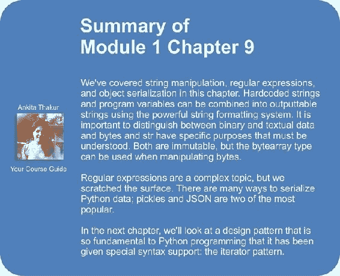

# 九、字符串和序列化

在涉及更高级别的设计模式之前，让我们深入研究 Python 最常见的对象之一：字符串。 我们将看到字符串不仅仅满足您的需求，而且还涵盖了在字符串中搜索模式以及对数据进行序列化以进行存储或传输的内容。

特别是，我们将访问：

*   字符串，字节和字节数组的复杂性
*   字符串格式化的来龙去脉
*   序列化数据的几种方法
*   神秘的正则表达式

# 字符串

字符串是 Python 中的基本原语； 到目前为止，我们几乎在每个示例中都使用了它们。 他们所做的只是代表一个不变的字符序列。 但是，尽管您以前可能没有考虑过，但是“字符”这个词有点模棱两可； Python 字符串可以表示重音字符序列吗？ 中国文字？ 那希腊文，西里尔文或波斯文呢？

在 Python 3 中，答案是肯定的。 Python 字符串全部以 Unicode 表示，Unicode 是一种字符定义标准，实际上可以表示地球上任何语言的任何字符（以及某些组合语言和随机字符）。 在大多数情况下，这是无缝完成的。 因此，让我们将 Python 3 字符串视为 Unicode 字符的不可变序列。 那么我们如何处理这个不变的序列呢？ 在前面的示例中，我们介绍了许多可操作字符串的方法，但让我们在一个地方快速介绍一下：字符串理论速成班！

## 字符串操作

如您所知，可以在 Python 中通过用单引号或双引号引起来的字符串序列来创建字符串。 可以使用三个引号字符轻松创建多行字符串，并且可以通过将多个硬编码字符串并排放置在一起来将它们串联在一起。 这里有些例子：

```py
a = "hello"
b = 'world'
c = '''a multiple
line string'''
d = """More
multiple"""
e = ("Three " "Strings "
        "Together")
```

解释器自动将最后一个字符串组成单个字符串。 也可以使用`+`运算符连接字符串（与`"hello " + "world"`一样）。 当然，不必对字符串进行硬编码。 它们也可以来自各种外部来源，例如文本文件，用户输入或在网络上编码。

### 注意

当缺少逗号时，相邻字符串的自动串联会导致一些搞笑的错误。 但是，当需要在函数调用中放置一个长字符串而不超过 Python 样式指南建议的 79 个字符的行长限制时，它非常有用。

像其他序列一样，可以对字符串进行迭代（逐个字符），进行索引，切片或连接。 语法与列表相同。

`str`类上有许多方法可以简化字符串的操作。 Python 解释器中的`dir`和`help`命令可以告诉我们如何使用所有这些命令。 我们将直接考虑一些更常见的问题。

几种布尔便捷方法可帮助我们识别字符串中的字符是否与特定模式匹配。 这是这些方法的摘要。 其中大多数，例如`isalpha`，`isupper` / `islower`和`startswith` / `endswith`都有明显的解释。 `isspace`方法也相当明显，但请记住，考虑了所有空白字符（包括制表符，换行符），而不仅仅是空格字符。

如果每个单词的首字符大写且所有其他字符均为小写，则`istitle`方法返回`True`。 请注意，它没有严格执行标题格式的英语语法定义。 例如，即使不是所有单词都大写，Leigh Hunt 的诗《手套和狮子》也应该是有效的标题。 即使最后一个单词的中间有一个大写字母，Robert Service 的“ Sam McGee 的火化”也应该是一个有效的标题。

使用`isdigit`，`isdecimal`和`isnumeric`方法时要小心，因为它们比您期望的要细微得多。 除了我们惯用的十位数字外，许多 Unicode 字符还被视为数字。 更糟糕的是，我们用来从字符串构造浮点数的句点字符不视为十进制字符，因此`'45.2'.isdecimal()`返回`False`。 实际的十进制字符由 Unicode 值 0660 表示，如 45.2（或`45\u06602`）所示。 此外，这些方法不验证字符串是否为有效数字；这些方法不适用。 对于所有三种方法，“ 127.0.0.1”都返回`True`。 我们可能认为应该为所有数值使用该十进制字符而不是句点，但是将该字符传递到`float()`或 i `nt()`构造函数中会将该十进制字符转换为零：

```py
>>> float('45\u06602')
4502.0

```

对于模式匹配有用的其他方法不返回布尔值。 `count`方法告诉我们给定子字符串出现在字符串中的次数，而`find`，`index`，`rfind`和`rindex`告诉我们给定子字符串在原始字符串中的位置。 两种'`r`'（用于'right'或'reverse'）方法从字符串的末尾开始搜索。 如果找不到子字符串，则`find`方法返回`-1`，而在这种情况下`index`会引发`ValueError`。 看看其中一些有效的方法：

```py
>>> s = "hello world"
>>> s.count('l')
3
>>> s.find('l')
2
>>> s.rindex('m')
Traceback (most recent call last):
 File "<stdin>", line 1, in <module>
ValueError: substring not found

```

其余大多数字符串方法都返回字符串的转换。 `upper`，`lower`，`capitalize`和`title`方法创建具有给定格式的所有字母字符的新字符串。 `translate`方法可以使用词典将任意输入字符映射到指定的输出字符。

对于所有这些方法，请注意，输入字符串保持不变。 而是返回一个全新的`str`实例。 如果需要处理结果字符串，则应将其分配给新变量，如`new_value = value.capitalize()`所示。 通常，一旦执行了转换，就不再需要旧值，因此常见的习惯用法是将其分配给相同的变量，如`value = value.title()`中所示。

最后，几个字符串方法返回或对列表进行操作。 `split`方法接受一个子字符串，并将该字符串拆分为一个字符串列表，无论该子字符串出现在何处。 您可以将数字作为第二个参数来限制结果字符串的数量。 如果您不限制字符串的数量，则`rsplit`的行为与`split`相同，但是如果您提供限制，则它会从字符串的末尾开始拆分。 `partition`和`rpartition` 方法仅在子字符串的第一次出现或最后一次出现时拆分字符串，并返回三个值的元组：子字符串之前的字符，子字符串本身以及子字符串之后的字符。

作为`split`的逆函数，`join`方法接受字符串列表，并通过将原始字符串放在它们之间来返回所有组合在一起的字符串。 `replace`方法接受两个参数，并返回一个字符串，其中第一个参数的每个实例都已被第二个替换。 以下是一些有效的方法：

```py
>>> s = "hello world, how are you"
>>> s2 = s.split(' ')
>>> s2
['hello', 'world,', 'how', 'are', 'you']
>>> '#'.join(s2)
'hello#world,#how#are#you'
>>> s.replace(' ', '**')
'hello**world,**how**are**you'
>>> s.partition(' ')
('hello', ' ', 'world, how are you')

```

在那里，对`str`类上最常见的方法进行了旋风之旅！ 现在，让我们看一下 Python 3 的构成字符串和变量以创建新字符串的方法。

## 字符串格式

Python 3 具有强大的字符串格式化和模板化机制，可让我们构造由硬编码文本和散置变量组成的字符串。 我们在许多先前的示例中都使用过它，但是它比我们使用的简单格式说明符具有更多的用途。

通过调用`format()`方法，可以将任何字符串转换为格式字符串。 此方法返回一个新字符串，其中输入字符串中的特定字符已替换为作为传递给函数的参数和关键字参数提供的值。 `format`方法不需要一组固定的参数。 在内部，它使用我们在第 7 章和 *Python 面向对象的快捷方式*中讨论的`*args`和`**kwargs`语法。

在格式化的字符串中替换的特殊字符是大括号字符`{`和`}`。 我们可以在字符串中插入这些对，然后将它们按顺序替换为传递给`str.format`方法的任何位置参数：

```py
template = "Hello {}, you are currently {}."
print(template.format('Dusty', 'writing'))
```

如果我们运行这些语句，它将用变量替换大括号，顺序是：

```py
Hello Dusty, you are currently writing.

```

如果我们要重用一个字符串中的变量或决定在其他位置使用它们，则此基本语法并不是非常有用。 我们可以将零索引的整数放在花括号内，以告诉格式化程序哪个位置变量将插入字符串中的给定位置。 让我们重复这个名字：

```py
template = "Hello {0}, you are {1}. Your name is {0}."
print(template.format('Dusty', 'writing'))
```

如果使用这些整数索引，则必须在所有变量中使用它们。 我们不能将空括号与位置索引混合使用。 例如，此代码失败，并带有适当的`ValueError`异常：

```py
template = "Hello {}, you are {}. Your name is {0}."
print(template.format('Dusty', 'writing'))
```

### 逃脱括号

括号字符除格式化外，在字符串中通常也很有用。 我们需要一种在我们希望它们作为自己显示而不是被替换的情况下逃避它们的方法。 这可以通过将花括号加倍来完成。 例如，我们可以使用 Python 格式化基本的 Java 程序：

```py
template = """
public class {0} {{
    public static void main(String[] args) {{
        System.out.println("{1}");
    }}
}}"""

print(template.format("MyClass", "print('hello world')"));
```

无论我们在模板中的何处看到`{{`或`}}`序列，即包围 Java 类和方法定义的花括号，我们都知道`format`方法将用单个花括号代替它们，而不是将某些参数传递给 `format`方法。 这是输出：

```py
public class MyClass {
 public static void main(String[] args) {
 System.out.println("print('hello world')");
 }
}

```

类的名称和输出内容已替换为两个参数，而双括号已替换为单括号，从而为我们提供了有效的 Java 文件。 原来，这是关于打印最简单的 Java 程序的最简单的 Python 程序，而 Java 程序可以打印最简单的 Python 程序！

### 关键字参数

如果我们正在格式化复杂的字符串，那么如果我们选择插入新的参数，记住参数的顺序或更新模板可能会变得很乏味。 因此，`format`方法允许我们在花括号内指定名称而不是数字。 然后将已命名的变量作为关键字参数传递给`format`方法：

```py
template = """
From: <{from_email}>
To: <{to_email}>
Subject: {subject}

{message}"""
print(template.format(
    from_email = "a@example.com",
    to_email = "b@example.com",
 message = "Here's some mail for you. "
 " Hope you enjoy the message!",
    subject = "You have mail!"
    ))
```

我们还可以混合使用索引参数和关键字参数（与所有 Python 函数调用一样，关键字参数必须位于位置参数之后）。 我们甚至可以将未标记的位置括号与关键字参数混合使用：

```py
print("{} {label} {}".format("x", "y", label="z"))
```

如预期的那样，此代码输出：

```py
x z y

```

### 容器查找

我们不限于将简单的字符串变量传递给`format`方法。 可以打印任何基元，例如整数或浮点数。 更有趣的是，可以使用复杂的对象，包括列表，元组，字典和任意对象，并且我们可以从`format`字符串中访问这些对象的索引和变量（但不能访问方法）。

例如，如果由于某种原因，我们的电子邮件将“从”和“到”电子邮件地址分组为一个元组，并将主题和消息放在字典中（也许是因为这是现有`send_mail`函数所需要的输入 我们想要使用），我们可以像这样格式化它：

```py
emails = ("a@example.com", "b@example.com")
message = {
        'subject': "You Have Mail!",
        'message': "Here's some mail for you!"
        }
template = """
From: <{0[0]}>
To: <{0[1]}>
Subject: {message[subject]}
{message[message]}"""
print(template.format(emails, message=message))
```

模板字符串中括号内的变量看起来有些奇怪，所以让我们看一下它们在做什么。 我们传递了一个参数作为基于位置的参数，将一个参数作为关键字参数。 这两个电子邮件地址由`0[x]`查找，其中`x`为`0`或`1`。 与其他基于位置的参数一样，初始零表示传递给`format`（在这种情况下为`emails`元组）的第一个位置参数。

内部带有数字的方括号与我们在常规 Python 代码中看到的索引查找类型相同，因此`0[0]`映射到`emails`元组中的`emails[0]`。 索引语法可用于任何可索引的对象，因此，当我们访问`message[subject]`时，我们会看到类似的行为，只是这次我们正在字典中查找字符串键。 注意，与 Python 代码不同，我们不需要在字典查找中在字符串两边加上引号。

如果我们有嵌套的数据结构，我们甚至可以执行多级查找。 我建议不要经常这样做，因为模板字符串很快变得难以理解。 如果我们有一个包含元组的字典，我们可以这样做：

```py
emails = ("a@example.com", "b@example.com")
message = {
        'emails': emails,
        'subject': "You Have Mail!",
        'message': "Here's some mail for you!"
        }
template = """
From: <{0[emails][0]}>
To: <{0[emails][1]}>
Subject: {0[subject]}
{0[message]}"""
print(template.format(message))
```

### 对象查找

索引使`format`查找功能强大，但是我们还没有完成！ 我们还可以将任意对象作为参数传递，并使用点符号在这些对象上查找属性。 让我们再次将电子邮件数据更改为一次类：

```py
class EMail:
    def __init__(self, from_addr, to_addr, subject, message):
        self.from_addr = from_addr
        self.to_addr = to_addr
        self.subject = subject
        self.message = message

email = EMail("a@example.com", "b@example.com",
        "You Have Mail!",
         "Here's some mail for you!")

template = """
From: <{0.from_addr}>
To: <{0.to_addr}>
Subject: {0.subject}

{0.message}"""
print(template.format(email))
```

该示例中的模板可能比以前的示例更具可读性，但是创建电子邮件类的开销增加了 Python 代码的复杂性。 为了明确地将对象包括在模板中而创建一个类是愚蠢的。 通常，如果我们要格式化的对象已经存在，我们将使用这种查找。 在所有示例中都是正确的； 如果有元组，列表或字典，则将其直接传递到模板中。 否则，我们将只创建一组简单的位置和关键字参数。

### 使其看起来正确

能够在模板字符串中包含变量是很好的，但是有时变量需要一点强制性才能使它们在输出中看起来正确。 例如，如果我们使用货币进行计算，则可能会以不希望显示在模板中的长十进制结尾：

```py
subtotal = 12.32
tax = subtotal * 0.07
total = subtotal + tax

print("Sub: ${0} Tax: ${1} Total: ${total}".format(
    subtotal, tax, total=total))
```

如果我们运行以下格式代码，则输出看起来不太像正确的货币：

```py
Sub: $12.32 Tax: $0.8624 Total: $13.182400000000001

```

### 注意

从技术上讲，我们永远不要在这样的货币计算中使用浮点数； 我们应该改为构造`decimal.Decimal()`对象。 浮点数很危险，因为它们的计算固有地超出了特定的精度水平。 但是我们只看字符串而不是浮点数，货币是格式化的一个很好的例子！

要修复前面的`format`字符串，我们可以在花括号内包含一些其他信息，以调整参数的格式。 我们可以自定义很多东西，但是花括号中的基本语法是相同的。 首先，我们使用较早的布局（位置，关键字，索引，属性访问）中的任何一种都适合于指定要放置在模板字符串中的变量。 我们在此之后加上一个冒号，然后是格式化的特定语法。 这是一个改进的版本：

```py
print("Sub: ${0:0.2f} Tax: ${1:0.2f} "
        "Total: ${total:0.2f}".format(
            subtotal, tax, total=total))
```

冒号后面的`0.2f`格式说明符基本上从左到右说：对于小于 1 的值，请确保小数点的左侧显示零；对于小于 1 的值，请确保零。 小数点后两位； 将输入值格式化为浮点型。

我们还可以通过在精度的句点前放置一个值，来指定每个数字在屏幕上应占据特定数量的字符。 这对于输出表格数据很有用，例如：

```py
orders = [('burger', 2, 5),
        ('fries', 3.5, 1),
        ('cola', 1.75, 3)]

print("PRODUCT    QUANTITY    PRICE    SUBTOTAL")
for product, price, quantity in orders:
    subtotal = price * quantity
 print("{0:10s}{1: ^9d}    ${2: <8.2f}${3: >7.2f}".format(
 product, quantity, price, subtotal))

```

好的，这是一个看起来很吓人的格式字符串，因此在将其分解为可理解的部分之前，让我们看看它是如何工作的：

```py
PRODUCT    QUANTITY    PRICE    SUBTOTAL
burger        5        $2.00    $  10.00
fries         1        $3.50    $   3.50
cola          3        $1.75    $   5.25

```

好漂亮！ 那么，这实际上是怎么发生的呢？ 在`for`循环的每一行中，我们有四个正在格式化的变量。 第一个变量是字符串，并使用`{0:10s}`格式化。 `s`表示它是一个字符串变量，`10`表示它应包含十个字符。 默认情况下，对于字符串，如果字符串短于指定的字符数，则会在字符串的右侧添加空格以使其足够长（但是请注意：如果原始字符串太长，则不会 被截断！）。 我们可以更改此行为（以填充其他字符或更改格式字符串中的对齐方式），就像对下一个值`quantity`一样。

`quantity`值的格式为`{1: ^9d}`。 `d`代表整数值。 `9`告诉我们该值应占用 9 个字符。 但是默认情况下，使用整数而不是空格，多余的字符为零。 看起来有点奇怪。 因此，我们明确指定一个空格（紧接在冒号之后）作为填充字符。 尖号`^`告诉我们，数字应在此可用填充的中心对齐； 这使该列看起来更加专业。 说明符的顺序必须正确，尽管它们都是可选的：首先填充，然后对齐，然后是大小，最后是类型。

我们对价格和小计的说明符执行类似的操作。 对于`price`，我们使用`{2: <8.2f}`；对于`subtotal`，我们使用`{3: >7.2f}`。 在这两种情况下，我们都指定一个空格作为填充字符，但是我们分别使用`<`和`>`符号来表示数字应在最小 8 个空格内向左或向右对齐。 七个字符。 此外，每个浮点数应格式化为两位小数。

不同类型的“类型”字符也会影响格式输出。 我们已经看到`s`，`d`和`f`类型，用于字符串，整数和浮点数。 其他大多数格式说明符都是这些说明符的替代版本； 例如，`o`代表八进制格式，`X`代表十六进制整数。 `n`类型说明符可用于以当前语言环境的格式格式化整数分隔符。 对于浮点数，`%`类型将乘以 100，并将浮点数格式化为百分比。

虽然这些标准格式器适用于大多数内置对象，但其他对象也可以定义非标准说明符。 例如，如果将`datetime`对象传递给`format`，则可以使用`datetime.strftime`函数中使用的说明符，如下所示：

```py
import datetime
print("{0:%Y-%m-%d %I:%M%p }".format(
    datetime.datetime.now()))
```

甚至可以为我们自己创建的对象编写自定义格式器，但这超出了本模块的范围。 如果需要在代码中执行此操作，请研究重写`__format__`特殊方法。 可以在 [PEP 3101](http://www.python.org/dev/peps/pep-3101/) 中找到最详尽的说明，尽管细节有些枯燥。 您可以使用网络搜索找到更多易消化的教程。

Python 格式化语法非常灵活，但是很难记住。 我每天都在使用它，但仍然偶尔需要在文档中查找被遗忘的概念。 它也不足以满足严重的模板需求，例如生成网页。 如果您需要做的不仅仅是一些字符串的基本格式设置，那么您可以研究几种第三方模板库。

## 字符串为 Unicode

在本节的开头，我们将字符串定义为不可变 Unicode 字符的集合。 实际上，这有时会使事情变得非常复杂，因为 Unicode 实际上并不是一种存储格式。 例如，如果您从文件或套接字获取一串字节，则它们将不会采用 Unicode。 实际上，它们将是内置类型`bytes`。 字节是……字节的不可变序列。 字节是计算中最低级别的存储格式。 它们代表 8 位，通常描述为 0 到 255 之间的整数，或 0 到 FF 之间的十六进制等值。 字节不代表任何特定内容； 字节序列可以存储编码字符串的字符或图像中的像素。

如果我们打印一个字节对象，则映射到 ASCII 表示形式的任何字节都将被打印为其原始字符，而非 ASCII 字节（无论是二进制数据还是其他字符）将被打印为`\x`转义序列转义的十六进制代码。 。 您可能会发现奇怪的是，以整数表示的字节可以映射到 ASCII 字符。 但是 ASCII 实际上只是一种代码，其中每个字母由不同的字节模式表示，因此由不同的整数表示。 字符“ a”由与整数 97 相同的字节表示，整数是十六进制数字 0x61。 具体地说，所有这些都是对二进制模式 01100001 的解释。

即使字节对象引用了文本数据，许多 I / O 操作也只知道如何处理`bytes`。 因此，至关重要的是要知道如何在`bytes`和 Unicode 之间进行转换。

问题是有很多方法可以将`bytes`映射到 Unicode 文本。 字节是机器可读的值，而文本是人类可读的格式。 位于两者之间的是一种编码，它将给定的字节序列映射到给定的文本字符序列。

但是，有多种此类编码（ASCII 只是其中之一）。 当使用不同的编码映射时，相同的字节序列表示完全不同的文本字符！ 因此，必须使用与编码相同的字符集对`bytes`进行解码。 不知道如何解码字节就不可能从字节中获取文本。 如果我们收到不带指定编码的未知字节，那么我们最好的办法就是猜测它们的编码格式，这可能是错误的。

### 将字节转换为文本

如果从某个位置有一个`bytes`数组，则可以使用`bytes`类上的`.decode`方法将其转换为 Unicode。 此方法接受一个字符串作为字符编码的名称。 这样的名字有很多。 西方语言常用的语言包括 ASCII，UTF-8 和 latin-1。

字节序列（以十六进制表示）63 6c 69 63 68 e9 实际上代表了 latin-1 编码中的单词 cliché的字符。 以下示例将对字节序列进行编码，并使用 latin-1 编码将其转换为 Unicode 字符串：

```py
characters = b'\x63\x6c\x69\x63\x68\xe9'
print(characters)
print(characters.decode("latin-1"))

```

第一行创建一个`bytes`对象； 字符串前面的`b`字符表明我们正在定义`bytes`对象，而不是普通的 Unicode 字符串。 在字符串中，每个字节使用十六进制数指定（在这种情况下）。 `\x`字符在字节字符串中转义，并且每个字符都说：“接下来的两个字符使用十六进制数字表示一个字节”。

假设我们使用的是可理解 latin-1 编码的外壳，则两个`print`调用将输出以下字符串：

```py
b'clich\xe9'
cliché

```

第一个`print`语句将 ASCII 字符的字节本身呈现出来。 未知字符（ASCII 未知）就是转义的十六进制格式。 该输出在行首包含`b`字符，以提醒我们它是`bytes`表示形式，而不是字符串。

下一个调用使用 latin-1 编码对字符串进行解码。 `decode`方法返回带有正确字符的普通（Unicode）字符串。 但是，如果我们使用西里尔字母“ iso8859-5”编码对同一字符串进行了解码，那么最终将得到字符串'clichщ'！ 这是因为`\xe9`字节映射到两种编码中的不同字符。

### 将文本转换为字节

如果我们需要将传入的字节转换为 Unicode，显然我们还会遇到将传出的 Unicode 转换为字节序列的情况。 这是通过`str`类上的`encode`方法完成的，该方法与`decode`方法一样，需要一个字符集。 以下代码创建一个 Unicode 字符串并将其编码为不同的字符集：

```py
characters = "cliché"
print(characters.encode("UTF-8"))
print(characters.encode("latin-1"))
print(characters.encode("CP437"))
print(characters.encode("ascii"))
```

前三种编码为重音字符创建了一组不同的字节。 第四个甚至不能处理该字节：

```py
b'clich\xc3\xa9'
b'clich\xe9'
b'clich\x82'
Traceback (most recent call last):
 File "1261_10_16_decode_unicode.py", line 5, in <module>
 print(characters.encode("ascii"))
UnicodeEncodeError: 'ascii' codec can't encode character '\xe9' in position 5: ordinal not in range(128)

```

您了解现在编码的重要性吗？ 对于每种编码，重音字符表示为不同的字节； 如果在将字节解码为文本时使用错误的字符，则会得到错误的字符。

在最后一种情况下，异常并非始终是所需的行为。 在某些情况下，我们希望以不同的方式处理未知字符。 `encode`方法采用名为`errors`的可选字符串参数，该参数可以定义如何处理此类字符。 该字符串可以是以下之一：

*   `strict`
*   `replace`
*   `ignore`
*   `xmlcharrefreplace`

`strict`替换策略是我们刚刚看到的默认策略。 当遇到在请求的编码中没有有效表示形式的字节序列时，将引发异常。 使用`replace`策略时，该字符将替换为其他字符； 在 ASCII 中，它是一个问号； 其他编码可能使用不同的符号，例如一个空框。 `ignore`策略只是丢弃不了解的任何字节，而`xmlcharrefreplace`策略创建代表 Unicode 字符的`xml`实体。 当转换未知字符串以用于 XML 文档时，此功能很有用。 以下是每种策略如何影响我们的样词：

<colgroup class="calibre17"><col class="calibre18"> <col class="calibre18"></colgroup> 
| 

战略

 | 

“cliché” .encode（“ ascii”，策略）

 |
| --- | --- |
| `replace` | `b'clich?'` |
| `ignore` | `b'clich'` |
| `xmlcharrefreplace` | `b'cliché'` |

可以在不传递编码字符串的情况下调用`str.encode`和`bytes.decode`方法。 该编码将被设置为当前平台的默认编码。 这将取决于当前的操作系统和区域设置或区域设置； 您可以使用`sys.getdefaultencoding()`功能进行查找。 不过，通常通常最好明确指定编码，因为平台的默认编码可能会更改，或者该程序有一天可能会扩展为可处理来自多种来源的文本。

如果您要编码文本，但不知道要使用哪种编码，则最好使用 UTF-8 编码。 UTF-8 可以代表任何 Unicode 字符。 在现代软件中，它是一种事实上的标准编码，可确保以任何语言（甚至多种语言）交换文档。 各种其他可能的编码对于遗留文档或默认情况下仍使用不同字符集的区域很有用。

UTF-8 编码使用 1 个字节表示 ASCII 和其他常见字符，使用 4 个字节表示更复杂的字符。 UTF-8 是特殊的，因为它与 ASCII 向后兼容。 使用 UTF-8 编码的任何 ASCII 文档将与原始 ASCII 文档相同。

### 注意

我永远都不记得要使用`encode`还是`decode`从二进制字节转换为 Unicode。 我一直希望这些方法分别命名为“ to_binary”和“ from_binary”。 如果您有相同的问题，请尝试将“ code”一词替换为“ binary”； “ enbinary”和“ debinary”非常接近“ to_binary”和“ from_binary”。 自从设计此助记符以来，通过不查找方法帮助文件节省了很多时间。

## 可变字节字符串

像`str`一样， `bytes`类型是不可变的。 我们可以在`bytes`对象上使用索引和切片符号，并搜索特定的字节序列，但不能扩展或修改它们。 在处理 I / O 时，这可能非常不方便，因为通常需要缓冲传入或传出的字节，直到准备好发送它们为止。 例如，如果我们正在从套接字接收数据，则在接收到完整的消息之前可能要进行几次`recv`调用。

这是内置`bytearray`的。此类型的行为类似于列表，但只包含字节。 该类的构造函数可以接受`bytes`对象来对其进行初始化。 `extend`方法可用于将另一个`bytes`对象附加到现有阵列（例如，当更多数据来自套接字或其他 I / O 通道时）。

切片符号可以在`bytearray`上用于内联修改项目。 例如，此代码从`bytes`对象构造一个`bytearray`，然后替换两个字节：

```py
b = bytearray(b"abcdefgh")
b[4:6] = b"\x15\xa3"
print(b)
```

输出如下：

```py
bytearray(b'abcd\x15\xa3gh')

```

当心; 如果我们要操作`bytearray`中的单个元素，它将期望我们传递一个介于 0 和 255 之间的整数作为值。 该整数表示特定的`bytes`模式。 如果我们尝试传递一个字符或`bytes`对象，它将引发异常。

可以使用`ord`（序数的缩写）功能将单字节字符转换为整数。 此函数返回单个字符的整数表示形式：

```py
b = bytearray(b'abcdef')
b[3] = ord(b'g')
b[4] = 68
print(b)
```

输出如下：

```py
bytearray(b'abcgDf')

```

在构造完数组之后，我们用字节 103 替换了索引`3`处的字符（第四个字符，因为索引从`0`开始，与列表一样）。此整数由`ord`函数返回，并且是 小写字母`g`的 ASCII 字符。 为了说明，我们还用字节号`68`替换了下一个字符，该字节号映射为大写`D`的 ASCII 字符。

`bytearray`类型的方法可以使其表现得像列表（例如，我们可以在其中附加整数字节），也可以像`bytes`对象一样； 我们可以像在`bytes`或`str`对象上使用相同的方式使用`count`和`find`之类的方法。 区别在于`bytearray`是可变类型，可用于从特定输入源建立复杂的字节序列。

# 正则表达式

您知道使用面向对象的原理实际上很难做什么？ 解析字符串以匹配任意模式，就是这样。 有很多学术论文都使用面向对象设计来设置字符串解析，但是结果总是很冗长且难以阅读，并且在实践中并未得到广泛使用。

在现实世界中，大多数编程语言中的字符串解析都是由正则表达式处理的。 这些不是冗长的，但是，至少在您学习语法之前，它们还是很难阅读的。 即使正则表达式不是面向对象的，Python 正则表达式库也提供了一些类和对象，可用于构造和运行正则表达式。

正则表达式用于解决一个常见问题：给定一个字符串，确定该字符串是否与给定的模式匹配，并有选择地收集包含相关信息的子字符串。 它们可用于回答以下问题：

*   该字符串是有效的网址吗？
*   日志文件中所有警告消息的日期和时间是什么？
*   `/etc/passwd`中的哪些用户在给定组中？
*   访问者键入的 URL 要求提供什么用户名和文档？

在中有许多类似的情况，其中正则表达式是正确的答案。 许多程序员错误地实现了复杂而脆弱的字符串解析库，因为他们不了解或不会学习正则表达式。 在本节中，我们将获得足够的正则表达式知识，不会犯此类错误！

## 匹配样式

正则表达式是复杂的迷你语言。 它们依靠特殊字符来匹配未知字符串，但让我们从始终与自身匹配的文字字符开始，例如字母，数字和空格字符。 让我们看一个基本的例子：

```py
import re

search_string = "hello world"
pattern = "hello world"

match = re.match(pattern, search_string)

if match:
    print("regex matches")
```

用于正则表达式的 Python 标准库模块称为`re`。 我们导入它并设置搜索字符串和模式以进行搜索； 在这种情况下，它们是相同的字符串。 由于搜索字符串与给定的模式匹配，因此条件传递通过并执行`print`语句。

请记住，`match`函数将模式匹配到字符串的开头。 因此，如果模式为`"ello world"`，则不会找到匹配项。 由于存在混乱的不对称性，解析器在找到匹配项后立即停止搜索，因此模式`"hello wo"`成功匹配。 让我们构建一个小的示例程序来演示这些差异并帮助我们学习其他正则表达式语法：

```py
import sys
import re

pattern = sys.argv[1]
search_string = sys.argv[2]
match = re.match(pattern, search_string)

if match:
    template = "'{}' matches pattern '{}'"
else:
    template = "'{}' does not match pattern '{}'"

print(template.format(search_string, pattern))
```

这是，只是先前示例的通用版本，它从命令行接受模式和搜索字符串。 我们可以看到模式的开头必须如何匹配，但是在以下命令行交互中找到匹配项后，将立即返回一个值：

```py
$ python regex_generic.py "hello worl" "hello world"
'hello world' matches pattern 'hello worl'
$ python regex_generic.py "ello world" "hello world"
'hello world' does not match pattern 'ello world'

```

在接下来的几节中，我们将使用此脚本。 尽管始终使用命令行`python regex_generic.py "<pattern>" "<string>"`调用脚本，但为了节省空间，我们仅在以下示例中显示输出。

如果您需要控制项目是在行的开头还是结尾（或者如果字符串中没有换行，则在字符串的开头和结尾），可以使用`^`和`$`字符来控制 分别代表字符串的开头和结尾。 如果您想要一个模式来匹配整个字符串，则最好将这两个都包括在内：

```py
'hello world' matches pattern '^hello world$'
'hello worl' does not match pattern '^hello world$'

```

### 匹配所选字符

让我们从匹配任意字符的开始。 在正则表达式模式中使用句点字符时，可以匹配任何单个字符。 在字符串中使用句点意味着您不必关心字符是什么，只需要在那里有一个字符即可。 例如：

```py
'hello world' matches pattern 'hel.o world'
'helpo world' matches pattern 'hel.o world'
'hel o world' matches pattern 'hel.o world'
'helo world' does not match pattern 'hel.o world'

```

注意最后一个示例如何不匹配，因为模式中句点的位置没有字符。

很好，但是如果我们只想匹配几个特定的​​字符怎么办？ 我们可以将一组字符放在方括号内，以匹配这些字符中的任何一个。 因此，如果我们在正则表达式模式中遇到字符串`[abc]`，我们知道这五个字符（包括两个方括号）将仅与要搜索的字符串中的一个字符匹配，此外，这个字符将是 `a`，`b`或`c`。 看几个例子：

```py
'hello world' matches pattern 'hel[lp]o world'
'helpo world' matches pattern 'hel[lp]o world'
'helPo world' does not match pattern 'hel[lp]o world'

```

这些方括号集应被命名为字符集，但是它们通常被称为**字符类**。 通常，我们希望在这些集合中包含大范围的字符，而全部键入它们可能是单调且容易出错的。 幸运的是，正则表达式设计师想到了这一点，并给了我们捷径。 字符集中的破折号将创建一个范围。 如果要按以下方式匹配“所有小写字母”，“所有字母”或“所有数字”，这将特别有用：

```py
'hello   world' does not match pattern 'hello [a-z] world'
'hello b world' matches pattern 'hello [a-z] world'
'hello B world' matches pattern 'hello [a-zA-Z] world'
'hello 2 world' matches pattern 'hello [a-zA-Z0-9] world'

```

还有其他匹配或排除单个字符的方法，但是如果要查找它们是什么，则需要通过网络搜索找到更全面的教程！

### 转义字符

如果在模式中将的句点字符与任何任意字符匹配，我们如何只匹配字符串中的句点？ 一种方法可能是将句点放在方括号内以创建字符类，但更通用的方法是使用反斜杠对其进行转义。 这是一个正则表达式，用于匹配介于 0.00 和 0.99 之间的两位十进制数字：

```py
'0.05' matches pattern '0\.[0-9][0-9]'
'005' does not match pattern '0\.[0-9][0-9]'
'0,05' does not match pattern '0\.[0-9][0-9]'

```

对于此模式，两个字符`\.`与单个`.`字符匹配。 如果句号字符丢失或为其他字符，则不匹配。

反斜杠转义序列用于正则表达式中的各种特殊字符。 您可以使用`\[`插入方括号而不启动字符类，并且可以使用`\(`插入括号，稍后我们还将看到这也是一个特殊字符。

更有趣的是，我们还可以使用转义符号后跟一个字符来表示特殊字符，例如换行符（`\n`）和制表符（`\t`）。 此外，可以使用转义字符串更简洁地表示某些字符类。 `\s`代表空格字符，`\w`代表字母，数字和下划线，`\d`代表数字：

```py
'(abc]' matches pattern '\(abc\]'
' 1a' matches pattern '\s\d\w'
'\t5n' does not match pattern '\s\d\w'
'5n' matches pattern '\s\d\w'

```

### 匹配多个字符

使用此信息，我们可以匹配大多数已知长度的字符串，但是大多数时候我们不知道在一个模式中要匹配多少个字符。 正则表达式也可以解决这一问题。 我们可以通过添加几个难以记住的标点符号之一来匹配多个字符来修改模式。

星号（`*`）字符表示先前的模式可以匹配零次或多次。 这听起来可能很愚蠢，但这是最有用的重复字符之一。 在探讨原因之前，请考虑一些愚蠢的示例，以确保我们了解它的作用：

```py
'hello' matches pattern 'hel*o'
'heo' matches pattern 'hel*o'
'helllllo' matches pattern 'hel*o'

```

因此，模式中的`*`字符表示先前的模式（`l`字符）是可选的，并且如果存在，则可以重复多次以匹配该模式。 其余字符（`h`，`e`和`o`）必须恰好出现一次。

多次匹配一个字母是很少见的，但是如果我们将星号与匹配多个字符的模式结合使用，就会变得更加有趣。 例如，`.*`将匹配任何字符串，而`[a-z]*`则匹配任何小写单词集合，包括空字符串。

例如：

```py
'A string.' matches pattern '[A-Z][a-z]* [a-z]*\.'
'No .' matches pattern '[A-Z][a-z]* [a-z]*\.'
'' matches pattern '[a-z]`.`'

```

模式中的加号（`+`）的行为类似于星号。 它指出前一个模式可以重复一次或多次，但是与星号不同，它不是可选的。 问号（？）可确保图案显示正确的次数为零或一，但不能多次。 让我们通过玩数字来探索其中的一些（记住`\d`与`[0-9]`匹配相同的字符类：

```py
'0.4' matches pattern '\d+\.\d+'
'1.002' matches pattern '\d+\.\d+'
'1.' does not match pattern '\d+\.\d+'
'1%' matches pattern '\d?\d%'
'99%' matches pattern '\d?\d%'
'999%' does not match pattern '\d?\d%'

```

### 将样式分组在一起

到目前为止，我们已经看到了如何重复多次模式，但是我们在可以重复哪些模式方面受到限制。 如果我们想重复单个字符，我们已经介绍了，但是如果我们想重复一个字符序列怎么办？ 将任何模式集括在括号中，可以在应用重复操作时将它们视为单个模式。 比较这些模式：

```py
'abccc' matches pattern 'abc{3}'
'abccc' does not match pattern '(abc){3}'
'abcabcabc' matches pattern '(abc){3}'

```

结合复杂的模式，此分组功能大大扩展了我们的模式匹配功能。 这是一个匹配简单英语句子的正则表达式：

```py
'Eat.' matches pattern '[A-Z][a-z]*( [a-z]+)*\.$'
'Eat more good food.' matches pattern '[A-Z][a-z]*( [a-z]+)*\.$'
'A good meal.' matches pattern '[A-Z][a-z]*( [a-z]+)*\.$'

```

第一个单词以大写字母开头，然后是零个或多个小写字母。 然后，我们输入一个与单个空格匹配的括号，后跟一个或多个小写字母的单词。 整个括号被重复零次或更多次，并且该模式以句点终止。 句点后不能有任何其他字符，如`$`与字符串结尾匹配。

我们已经看到了许多最基本的模式，但是正则表达式语言支持更多。 头几年，我每次使用需要执行某些操作时都使用正则表达式来查找语法。 值得为`re`模块的 Python 文档添加书签，并经常对其进行复审。 正则表达式几乎没有什么不匹配的，它们应该是解析字符串时要使用的第一个工具。

## 从正则表达式获取信息

现在让我们将集中在 Python 方面。 正则表达式语法是面向对象编程中最详尽的东西。 但是，Python 的`re`模块提供了一个面向对象的接口，可以进入正则表达式引擎。

我们一直在检查`re.match`函数是否返回有效对象。 如果模式不匹配，则该函数返回`None`。 但是，如果匹配，它将返回一个有用的对象，我们可以对其进行内省以获取有关模式的信息。

到目前为止，我们的正则表达式已经回答了诸如“此字符串与该模式匹配吗？”之类的问题。 匹配模式很有用，但是在许多情况下，一个更有趣的问题是：“如果此字符串与该模式匹配，则相关子字符串的值是多少？” 如果使用组来标识稍后要引用的模式部分，则可以使它们脱离匹配返回值，如以下示例所示：

```py
pattern = "^[a-zA-Z.]+@([a-z.]*\.[a-z]+)$"
search_string = "some.user@example.com"
match = re.match(pattern, search_string)

if match:
 domain = match.groups()[0]
    print(domain)
```

描述有效电子邮件地址的规范非常复杂，并且精确匹配所有可能性的正则表达式过长。 因此，我们作弊并制作了一个与某些常用电子邮件地址匹配的简单正则表达式； 关键是我们要访问域名（在`@`符号之后），以便我们可以连接到该地址。 通过将模式的该部分包装在括号中并在 match 返回的对象上调用`groups()`方法，可以轻松完成此操作。

`groups`方法返回模式内匹配的所有组的元组，您可以对其进行索引以访问特定值。 这些组从左到右排序。 但是，请记住，组可以嵌套，这意味着您可以在另一个组中包含一个或多个组。 在这种情况下，将按最左括号的顺序返回这些组，因此最外面的组将在其内部匹配的组之前返回。

除了匹配功能之外，`re`模块还提供了几个其他有用的功能`search`和`findall`。 `search`函数查找匹配模式的第一个实例，从而放宽了模式从字符串的第一个字母开始的限制。 请注意，通过使用 match 并将`^.*`字符放在模式的前面以匹配字符串开头和要查找的模式之间的任何字符，您可以获得类似的效果。

`findall`函数的行为与搜索类似，不同之处在于它会找到匹配模式的所有不重叠实例，而不仅仅是第一个实例。 基本上，它找到第一个匹配项，然后将搜索重置到该匹配字符串的末尾并找到下一个匹配项。

它不像您期望的那样返回匹配对象的列表，而是返回匹配字符串的列表。 或元组。 有时是字符串，有时是元组。 根本不是一个很好的 API！ 与所有不良 API 一样，您必须记住差异，而不要凭直觉。 返回值的类型取决于正则表达式中带括号的组的数量：

*   如果模式中没有组，则`re.findall`将返回一个字符串列表，其中每个值都是源字符串中与模式匹配的完整子字符串
*   如果模式中恰好有一组，`re.findall`将返回一个字符串列表，其中每个值都是该组的内容
*   如果模式中有多个组，则`re.findall`将返回一个元组列表，其中每个元组都包含一个匹配组中的值，按顺序

### 注意

在自己的 Python 库中设计函数调用时，请尝试使函数始终返回一致的数据结构。 设计可以接受任意输入并处理它们的函数通常是很好的，但是返回值不应根据输入从单个值切换为列表，或从值列表切换为元组列表。 让`re.findall`作为一个教训！

在下面的交互式会议中，示例将希望阐明这些差异：

```py
>>> import re
>>> re.findall('a.', 'abacadefagah')
['ab', 'ac', 'ad', 'ag', 'ah']
>>> re.findall('a(.)', 'abacadefagah')
['b', 'c', 'd', 'g', 'h']
>>> re.findall('(a)(.)', 'abacadefagah')
[('a', 'b'), ('a', 'c'), ('a', 'd'), ('a', 'g'), ('a', 'h')]
>>> re.findall('((a)(.))', 'abacadefagah')
[('ab', 'a', 'b'), ('ac', 'a', 'c'), ('ad', 'a', 'd'), ('ag', 'a', 'g'), ('ah', 'a', 'h')]

```

### 使重复的正则表达式有效

每当调用正则表达式方法之一时，引擎就必须将模式字符串转换成内部结构，从而使搜索字符串快速。 这种转换耗时很短。 如果正则表达式模式将被多次重用（例如，在`for`或`while`循环内），则最好只执行一次此转换步骤。

使用`re.compile`方法可以做到这一点。 它返回正则表达式的面向对象版本，该正则表达式已被编译并具有我们已经探讨的方法（`match`，`search`和`findall`）。 在案例研究中，我们将看到一些示例。

这绝对是对正则表达式的简要介绍。 在这一点上，我们对基础知识有很好的感觉，并且会认识到何时需要进行进一步的研究。 如果我们遇到字符串模式匹配问题，则正则表达式几乎可以肯定会为我们解决它们。 但是，我们可能需要在该主题的更全面的介绍中查找新的语法。 但是现在我们知道要寻找什么！ 让我们继续讨论另一个完全不同的主题：序列化数据以进行存储。

# 序列化对象

如今，我们具备将数据写入文件并在任意以后的日期取回数据的能力。 如此方便（想象一下如果我们什么也不能存储的计算状态！），我们经常发现自己将存储在一个好的对象或设计模式中的数据转换为某种笨拙的文本或二进制格式进行存储 ，通过网络传输或在远程服务器上进行远程调用。

Python `pickle`模块是一种面向对象的方法，可以直接以特殊的存储格式存储对象。 它实质上将一个对象（及其作为属性保存的所有对象）转换为可以存储或传输的字节序列，但是我们认为合适。

对于基础工作，`pickle`模块具有一个非常简单的界面。 它由四个基本功能组成，用于存储和加载数据。 两个用于操纵类似文件的对象，两个用于操纵`bytes`对象（后者只是类似文件的接口的快捷方式，因此我们不必自己创建`BytesIO`类似文件的对象）。

`dump`方法接受要写入的对象和类似文件的对象，以将序列化的字节写入其中。 该对象必须具有`write`方法（否则它不会像文件一样），并且该方法必须知道如何处理`bytes`参数（因此，为文本输出打开的文件将无效）。

`load`方法的作用恰恰相反。 它从类似文件的对象中读取序列化的对象。 该对象必须具有适当的类似文件的`read`和`readline`参数，当然每个参数都必须返回`bytes`。 `pickle`模块将从这些字节中加载对象，`load`方法将返回完全重建的对象。 这是一个在列表对象中存储然后加载一些数据的示例：

```py
import pickle

some_data = ["a list", "containing", 5,
        "values including another list",
        ["inner", "list"]]

with open("pickled_list", 'wb') as file:
 pickle.dump(some_data, file)

with open("pickled_list", 'rb') as file:
 loaded_data = pickle.load(file)

print(loaded_data)
assert loaded_data == some_data
```

此代码按公布的方式工作：将对象存储在文件中，然后从同一文件加载。 在每种情况下，我们都使用`with`语句打开文件，以使其自动关闭。 首先打开文件进行写入，然后第二次读取，具体取决于我们是存储还是加载数据。

如果新加载的对象不等于原始对象，则末尾的`assert`语句将引发错误。 平等并不意味着它们是同一对象。 确实，如果我们打印两个对象的`id()`，我们会发现它们是不同的。 但是，由于它们都是内容相同的列表，因此这两个列表也被视为相等。

`dumps`和`loads`函数的行为与文件类似的对象非常相似，不同之处在于它们返回或接受`bytes`而不是文件类对象。 `dumps`函数仅需要一个参数即要存储的对象，并且它返回一个序列化的`bytes`对象。 `loads`函数需要一个`bytes`对象并返回还原的对象。 方法名称中的`'s'`字符是字符串的缩写； 它是 Python 古代版本的旧名称，其中使用`str`对象代替`bytes`。

两种`dump`方法都接受可选的`protocol`参数。 如果我们要保存和加载仅在 Python 3 程序中使用的腌制对象，则不需要提供此参数。 不幸的是，如果我们存储的对象可能由旧版本的 Python 加载，则必须使用较旧且效率较低的协议。 通常这不是问题。 通常，唯一会加载腌制对象的程序与存储该对象的程序相同。 Pickle 是一种不安全的格式，因此我们不希望将它不安全地通过 Internet 发送给未知的口译员。

提供的参数是整数版本号。 默认版本号为 3，表示 Python 3 酸洗使用的当前高效存储系统。 数字 2 是较旧的版本，它将存储一个对象，该对象可以在所有解释器中加载回 Python 2.3。 由于 2.6 是仍在野外广泛使用的最古老的 Python，因此版本 2 的酸洗通常就足够了。 较旧的解释器支持版本 0 和 1。 0 是 ASCII 格式，而 1 是二进制格式。 还有一个优化的版本 4，有一天可能会成为默认版本。

根据经验，如果您知道要酸洗的对象将仅由 Python 3 程序加载（例如，只有您的程序将被加载），请使用默认的酸洗协议。 如果它们可能是由未知的解释程序加载的，请传递协议值 2，除非您真的相信它们可能需要由 Python 的原始版本加载。

如果确实将协议传递给`dump`或`dumps`，则应使用关键字参数来指定它：`pickle.dumps(my_object, protocol=2)`。 这不是严格必要的，因为该方法仅接受两个参数，但是键入 full 关键字参数会提醒我们代码的读者，数字的用途是什么。 在方法调用中具有随机整数将很难读取。 两个什么？ 存储对象的两个副本，也许吗？ 请记住，代码应始终可读。 在 Python 中，较少的代码通常比较长的代码更具可读性，但并非总是如此。 要明确。

可以在一个打开的文件上多次调用`dump`或`load`。 每次对`dump`的调用都将存储一个对象（以及它所组成或包含的任何对象），而对`load`的调用将仅加载并返回一个对象。 因此，对于单个文件，在存储对象时每个对`dump`的单独调用在以后恢复时都应该具有对`load`的关联调用。

## 自定义泡菜

对于大多数通用 Python 对象，腌制“是可行的”。 基本的原语（例如整数，浮点数和字符串）可以被腌制，任何容器对象（例如列表或字典）也可以被腌制，只要这些容器的内容也可以被腌制。 而且，重要的是，任何对象都可以被腌制，只要它的所有属性也是可腌制的。

那么，什么使属性无法拾取呢？ 通常，它与对时间敏感的属性有关，将来无法加载。 例如，如果我们将开放的网络套接字，开放的文件，正在运行的线程或数据库连接作为属性存储在对象上，则对这些对象进行腌制是没有意义的。 当我们稍后尝试重新加载它们时，很多操作系统状态都将消失。 我们不能仅仅假装线程或套接字连接存在并使其显示！ 不，我们需要以某种方式自定义此类瞬态数据的存储和还原方式。

这是一个每小时都会加载一次网页内容的类，以确保它们保持最新状态。 它使用`threading.Timer`类安排下一次更新：

```py
from threading import Timer
import datetime
from urllib.request import urlopen

class UpdatedURL:
    def __init__(self, url):
        self.url = url
        self.contents = ''
        self.last_updated = None
        self.update()

    def update(self):
        self.contents = urlopen(self.url).read()
        self.last_updated = datetime.datetime.now()
        self.schedule()

    def schedule(self):
        self.timer = Timer(3600, self.update)
        self.timer.setDaemon(True)
        self.timer.start()
```

`url`，`contents`和`last_updated`都是可腌制的，但是如果我们尝试腌制该类的实例，则`self.timer`实例会有点生气：

```py
>>> u = UpdatedURL("http://news.yahoo.com/")
>>> import pickle
>>> serialized = pickle.dumps(u)
Traceback (most recent call last):
 File "<pyshell#3>", line 1, in <module>
 serialized = pickle.dumps(u)
_pickle.PicklingError: Can't pickle <class '_thread.lock'>: attribute lookup lock on _thread failed

```

这不是一个非常有用的错误，但似乎我们正在尝试使不应该的内容腌制。 那将是`Timer`实例； 我们在 schedule 方法中存储了对`self.timer`的引用，并且该属性无法序列化。

当`pickle`尝试序列化一个对象时，它只是尝试存储该对象的`__dict__`属性； `__dict__`是将对象上的所有属性名称映射为其值的字典。 幸运的是，在检查`__dict__`之前，`pickle`检查是否存在`__getstate__`方法。 如果是这样，它将存储该方法的返回值，而不是`__dict__`。

让我们向`UpdatedURL`类添加`__getstate__`方法，该方法仅返回`__dict__`的副本而无需计时器：

```py
    def __getstate__(self):
        new_state = self.__dict__.copy()
        if 'timer' in new_state:
            del new_state['timer']
        return new_state
```

如果我们现在腌制对象，它将不再失败。 我们甚至可以使用`loads`成功还原该对象。 但是，还原的对象没有 timer 属性，因此它不会像设计的那样刷新内容。 解开对象后，我们需要以某种方式创建新的计时器（以替换缺少的计时器）。

正如我们可能期望的那样，可以实现一种互补的`__setstate__`方法来自定义解酸。 此方法接受一个参数，即`__getstate__`返回的对象。 如果我们同时实现这两种方法，则不需要`__getstate__`返回字典，因为`__setstate__`将知道如何处理选择`__getstate__`返回的任何对象。 在我们的例子中，我们只想还原`__dict__`，然后创建一个新计时器：

```py
    def __setstate__(self, data):
        self.__dict__ = data
        self.schedule()
```

`pickle`模块非常灵活，并在需要时提供其他工具来进一步自定义酸洗过程。 但是，这些超出了本模块的范围。 我们介绍的工具足以满足许多基本的酸洗任务。 通常，要腌制的对象是相对简单的数据对象。 例如，我们不会腌制整个正在运行的程序或复杂的设计模式。

## 序列化 Web 对象

从未知或不受信任的来源加载腌制的对象不是的好主意。 可以向腌制的文件中注入任意代码，以通过腌制恶意攻击计算机。 泡菜的另一个缺点是它们只能由其他 Python 程序加载，而不能轻易与其他语言编写的服务共享。

多年来，已经有许多格式用于此目的。 XML（可扩展标记语言）曾经非常流行，特别是在 Java 开发人员中。 YAML（又一种标记语言）是您偶尔会看到的另一种格式。 表格数据经常以 CSV（逗号分隔值）格式进行交换。 随着时间的流逝，其中许多变得越来越模糊，您还会遇到更多。 Python 对所有这些都有可靠的标准或第三方库。

在对不受信任的数据使用此类库之前，请确保对它们进行安全调查。 例如，XML 和 YAML 都具有晦涩的功能，这些功能被恶意使用，可以允许在主机上执行任意命令。 默认情况下，可能无法关闭这些功能。 做你的研究。

**JavaScript 对象符号**（**JSON**）是用于交换原始数据的人类可读格式。 JSON 是一种标准格式，可以由各种各样的异构客户端系统解释。 因此，JSON 对于在完全解耦的系统之间传输数据非常有用。 此外，JSON 不支持可执行代码，只能对数据进行序列化。 因此，向其中注入恶意语句更加困难。

因为 JSON 可以很容易地被 JavaScript 引擎解释，所以它通常用于将数据从 Web 服务器传输到支持 JavaScript 的 Web 浏览器。 如果提供数据的 Web 应用是用 Python 编写的，则需要一种将内部数据转换为 JSON 格式的方法。

有一个模块可以执行此操作，可预测的名称为`json`。 该模块提供与`pickle`模块类似的接口，具有`dump`，`load`，`dumps`和`loads`功能。 对这些函数的默认调用与`pickle`中的调用几乎相同，因此我们不再赘述。 有一些区别； 显然，这些调用的输出是有效的 JSON 表示法，而不是腌制的对象。 另外，`json`功能对`str`对象而不是`bytes`操作。 因此，在转储到文件或从文件加载时，我们需要创建文本文件，而不是二进制文件。

JSON 序列化程序不如`pickle`模块强大。 它只能序列化基本类型，例如整数，浮点数和字符串，以及简单的容器，例如字典和列表。 它们中的每一个都直接映射到 JSON 表示形式，但是 JSON 无法表示类，方法或函数。 无法以这种格式传输完整的对象。 因为我们转储为 JSON 格式的对象的接收者通常不是 Python 对象，所以无论如何，它将无法以与 Python 相同的方式理解类或方法。 尽管名称中使用 O for Object，但 JSON 是**数据**表示法； 您还记得，对象由数据和行为组成。

如果的对象仅要序列化数据，则始终可以序列化对象的`__dict__`属性。 或者，我们可以通过提供自定义代码从某些类型的对象创建或解析 JSON 可序列化字典来半自动化此任务。

在`json`模块中，对象存储和加载函数均接受可选参数以自定义行为。 `dump`和`dumps`方法接受名称不正确的`cls`（类的缩写，这是一个保留关键字）关键字参数。 如果通过，则它应该是`JSONEncoder`类的子类，并且`default`方法将被覆盖。 此方法接受任意对象，并将其转换为`json`可以消化的字典。 如果它不知道如何处理该对象，则应调用`super()`方法，以便它可以照常使用序列化基本类型。

`load`和`loads`方法也接受这样的`cls`参数，它可以是逆类`JSONDecoder`的子类。 但是，通常使用`object_hook`关键字参数将函数传递给这些方法就足够了。 该函数接受字典并返回一个对象； 如果它不知道如何处理输入字典，则可以不加修改地将其返回。

让我们来看一个例子。 假设我们有以下简单的联系人类要序列化：

```py
class Contact:
    def __init__(self, first, last):
        self.first = first
        self.last = last

    @property
    def full_name(self):
        return("{} {}".format(self.first, self.last))
```

我们可以序列化`__dict__`属性：

```py
>>> c = Contact("John", "Smith")
>>> json.dumps(c.__dict__)
'{"last": "Smith", "first": "John"}'

```

但是以这种方式访问​​特殊（双下划线）属性有点粗糙。 另外，如果接收代码（也许在网页上有一些 JavaScript）希望提供`full_name`属性该怎么办？ 当然，我们可以手动构造字典，但是让我们创建一个自定义编码器：

```py
import json
class ContactEncoder(json.JSONEncoder):
    def default(self, obj):
        if isinstance(obj, Contact):
            return {'is_contact': True,
                    'first': obj.first,
                    'last': obj.last,
                    'full': obj.full_name}
        return super().default(obj)
```

`default`方法基本上检查以查看我们要序列化的对象的种类。 如果是联系人，我们会手动将其转换为词典； 否则，我们让父类处理序列化（假设它是`json`知道如何处理的基本类型）。 请注意，我们传递了一个额外的属性来将该对象标识为联系人，因为在加载时将无法告知。 这只是一个惯例； 对于更通用的序列化机制，将字符串类型存储在字典中甚至是完整的类名（包括包和模块）可能更有意义。 请记住，字典的格式取决于接收端的代码。 必须就如何指定数据达成协议。

通过将类（而不是实例化的对象）传递给`dump`或`dumps`函数，我们可以使用此类对联系人进行编码：

```py
>>> c = Contact("John", "Smith")
>>> json.dumps(c, cls=ContactEncoder)
'{"is_contact": true, "last": "Smith", "full": "John Smith",
"first": "John"}'

```

为了进行解码，我们可以编写一个接受字典并检查`is_contact`变量是否存在的函数，以确定是否将其转换为联系人：

```py
def decode_contact(dic):
        if dic.get('is_contact'):
            return Contact(dic['first'], dic['last'])
        else:
            return dic
```

我们可以使用`object_hook`关键字参数将此函数传递给`load`或`loads`函数：

```py
>>> data = ('{"is_contact": true, "last": "smith",'
 '"full": "john smith", "first": "john"}')

>>> c = json.loads(data, object_hook=decode_contact)
>>> c
<__main__.Contact object at 0xa02918c>
>>> c.full_name
'john smith'

```

# 案例研究

让我们用 Python 构建一个基本的以正则表达式为动力的模板引擎。 该引擎将解析文本文件（例如 HTML 页面），并将某些指令替换为从输入到这些指令所计算出的文本。 这是我们要使用正则表达式执行的最复杂的任务。 实际上，对此的完整版本可能会使用适当的语言解析机制。

考虑以下输入文件：

```py
/** include header.html **/
<h1>This is the title of the front page</h1>
/** include menu.html **/
<p>My name is /** variable name **/.
This is the content of my front page. It goes below the menu.</p>
<table>
<tr><th>Favourite Books</th></tr>
/** loopover module_list **/
<tr><td>/** loopvar **/</td></tr>

/** endloop **/
</table>
/** include footer.html **/
Copyright &copy; Today
```

该文件包含`/** <directive> <data> **/`形式的“标签”，其中数据是可选的单个单词，伪指令为：

*   `include`：在此处复制另一个文件的内容
*   `variable`：在此处插入变量的内容
*   `loopover`：对作为列表的变量重复循环的内容
*   `endloop`：表示循环文本结束
*   `loopvar`：从要循环的列表中插入单个值

此模板将呈现一个不同的页面，具体取决于将哪些变量传递到其中。 这些变量将从所谓的上下文文件中传入。 这将被编码为`json`对象，其中的键代表所讨论的变量。 我的上下文文件可能看起来像这样，但是您将派生自己的文件：

```py
{
    "name": "Dusty",
    "module_list": [
        "Thief Of Time",
        "The Thief",
        "Snow Crash",
        "Lathe Of Heaven"
    ]
}
```

在进行实际的字符串处理之前，让我们将一些面向对象的样板代码汇总在一起，以处理文件并从命令行获取数据：

```py
import re
import sys
import json
from pathlib import Path

DIRECTIVE_RE = re.compile(
 r'/\*\*\s*(include|variable|loopover|endloop|loopvar)'
 r'\s*([^ *]*)\s*\*\*/')

class TemplateEngine:
    def __init__(self, infilename, outfilename, contextfilename):
        self.template = open(infilename).read()
        self.working_dir = Path(infilename).absolute().parent
 self.pos = 0
        self.outfile = open(outfilename, 'w')
        with open(contextfilename) as contextfile:
            self.context = json.load(contextfile)

    def process(self):
        print("PROCESSING...")

if __name__ == '__main__':
    infilename, outfilename, contextfilename = sys.argv[1:]
    engine = TemplateEngine(infilename, outfilename, contextfilename)
    engine.process()
```

这是的全部基本知识，我们创建一个类并使用在命令行中传递的一些变量对其进行初始化。

注意我们如何通过将正则表达式分为两行来使其更具可读性？ 我们使用原始字符串（r 前缀），因此我们不必对所有反斜杠进行两次转义。 这在正则表达式中很常见，但仍然一团糟。 （正则表达式总是有用的，但它们通常是值得的。）

`pos`指示我们正在处理的内容中的当前字符； 我们稍后会看到更多。

现在，剩下的就是实现该处理方法了。 有几种方法可以做到这一点。 让我们以相当明确的方式进行操作。

处理方法必须找到与正则表达式匹配的每个指令，并对其进行适当的处​​理。 但是，它还必须注意在未修改输出文件的每个指令之前，之后和之间输出普通文本。

正则表达式的编译版本的一个好功能是，可以通过传递`pos`关键字参数来告诉`search`方法在特定位置开始搜索。 如果我们暂时将使用指令进行适当的工作定义为“忽略指令并将其从输出文件中删除”，则我们的过程循环看起来非常简单：

```py
def process(self):
    match = DIRECTIVE_RE.search(self.template, pos=self.pos)
    while match:
        self.outfile.write(self.template[self.pos:match.start()])
 self.pos = match.end()
        match = DIRECTIVE_RE.search(self.template, pos=self.pos)
    self.outfile.write(self.template[self.pos:])
```

用英语来说，此函数在文本中查找与正则表达式匹配的第一个字符串，输出从当前位置到该匹配开始的所有内容，然后将位置前进到上述匹配的末尾。 一旦不匹配，它将输出自上一个位置以来的所有内容。

当然，在模板引擎中忽略该指令几乎是没有用的，因此让我们用该指令替换该位置前进行，该代码根据该指令委托给类上的其他方法：

```py
def process(self):
    match = DIRECTIVE_RE.search(self.template, pos=self.pos)
    while match:
        self.outfile.write(self.template[self.pos:match.start()])
 directive, argument = match.groups()
 method_name = 'process_{}'.format(directive)
 getattr(self, method_name)(match, argument)
        match = DIRECTIVE_RE.search(self.template, pos=self.pos)
    self.outfile.write(self.template[self.pos:])
```

因此，我们从正则表达式中获取指令和单个参数。 该伪指令成为方法名称，我们在`self`对象上动态查找该方法名称（如果模板编写器提供了无效伪指令，此处会进行一些错误处理会更好）。 我们将 match 对象和参数传递给该方法，并假定该方法将适当处理所有事情，包括移动`pos`指针。

到目前为止，我们已经有了面向对象的体系结构，实现委托给它们的方法实际上非常简单。 `include`和`variable`指令非常简单：

```py
def process_include(self, match, argument):
    with (self.working_dir / argument).open() as includefile:
        self.outfile.write(includefile.read())
 self.pos = match.end()

def process_variable(self, match, argument):
    self.outfile.write(self.context.get(argument, ''))
 self.pos = match.end()

```

第一个简单地查找包含的文件并插入文件内容，第二个简单地在上下文字典中查找变量名（从`__init__`方法中的`json`加载），如果没有，则默认为空字符串 不存在。

三种处理循环的方法更为复杂，因为它们必须在三种方法之间共享状态。 为简单起见（我敢肯定您渴望看到本长长的章节的结尾，我们几乎已经到了！），我们将把它作为类本身的实例变量来处理。 作为练习，您可能想考虑更好的架构方法，尤其是在阅读了下三章之后。

```py
    def process_loopover(self, match, argument):
        self.loop_index = 0
 self.loop_list = self.context.get(argument, [])
        self.pos = self.loop_pos = match.end()

    def process_loopvar(self, match, argument):
 self.outfile.write(self.loop_list[self.loop_index])
        self.pos = match.end()

    def process_endloop(self, match, argument):
 self.loop_index += 1
        if self.loop_index >= len(self.loop_list):
            self.pos = match.end()
            del self.loop_index
            del self.loop_list
            del self.loop_pos

		else:
 self.pos = self.loop_pos

```

当遇到`loopover`指令时，我们不必输出任何内容，但是必须在三个变量上设置初始状态。 假设`loop_list`变量是从上下文词典中提取的列表。 `loop_index`变量指示在循环的此迭代中应在该列表中的哪个位置输出，而`loop_pos`则被存储，因此我们知道到达循环末尾时要跳转到的位置。

`loopvar`伪指令输出`loop_list`变量当前位置的值，并跳至伪指令的末尾。 请注意，它不会增加循环索引，因为`loopvar`指令可以在循环内多次调用。

`endloop`指令更加复杂。 它确定`loop_list`中是否还有更多元素； 如果有的话，它只是跳回到循环的开始，增加索引。 否则，它将重置用于处理循环的所有变量，并跳转到指令的末尾，以便引擎可以继续进行下一个匹配。

请注意，这种特殊的循环机制非常脆弱。 如果模板设计者尝试嵌套循环或忘记了`endloop`调用，则对他们而言效果不佳。 我们将需要更多错误检查，并且可能想要存储更多循环状态才能使其成为生产平台。 但是我保证本章的结尾不远了，所以让我们在看一下示例模板及其上下文的呈现方式之后再开始练习：

```py
<html>
    <body>

<h1>This is the title of the front page</h1>
<a href="link1.html">First Link</a>
<a href="link2.html">Second Link</a>

<p>My name is Dusty.
This is the content of my front page. It goes below the menu.</p>
<table>
<tr><th>Favourite Books</th></tr>

<tr><td>Thief Of Time</td></tr>

<tr><td>The Thief</td></tr>

<tr><td>Snow Crash</td></tr>

<tr><td>Lathe Of Heaven</td></tr>

</table>
    </body>
</html>

Copyright &copy; Today
```

由于我们计划模板的方式，有些奇怪的换行效果，但是它按预期工作。




