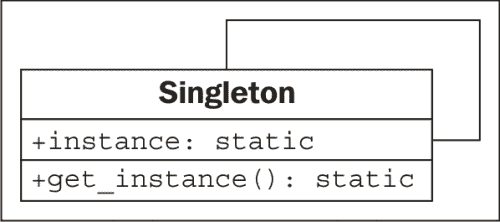

# 十一、Python 设计模式 I

在上一章中，我们对设计模式进行了简要介绍，并介绍了迭代器模式，该模式非常有用，通用，已被抽象为编程语言本身的核心。 在本章中，我们将回顾其他常见模式，以及它们如何在 Python 中实现。 与迭代一样，Python 经常提供替代语法来简化此类问题的处理。 我们将介绍“传统”设计以及这些模式的 Python 版本。 总而言之，我们将看到：

*   多种特定模式
*   Python 中每个模式的规范实现
*   Python 语法来替换某些模式

# 装饰器模式

装饰器模式允许我们“包装”一个提供核心功能的对象以及其他更改此功能的对象。 任何使用修饰对象的对象都将以与未修饰对象完全相同的方式与其进行交互（也就是说，修饰对象的接口与核心对象的接口相同）。

装饰器模式有两种主要的用法：

*   增强组件将数据发送到第二个组件时的响应
*   支持多种可选行为

第二种选择通常是替代多继承。 我们可以构造一个核心对象，然后围绕该核心创建一个装饰器。 由于装饰器对象与核心对象具有相同的接口，因此我们甚至可以将新对象包装在其他装饰器中。 这是在 UML 中的外观：


在此，**核心** 和所有装饰器都实现特定的**接口**。 装饰器通过合成维护对**接口**的另一个实例的引用。 调用时，装饰器在调用其包装的接口之前或之后进行一些附加处理。 包装的对象可以是另一个装饰器，也可以是核心功能。 尽管多个装饰器可以互相包裹，但是所有这些装饰器“中心”的对象提供了核心功能。

## 装饰器示例

让我们来看一个来自网络编程的例子。 我们将使用 TCP 套接字。 `socket.send()`方法采用一串输入字节，并将它们输出到另一端的接收套接字。 有许多库可以接受套接字并访问此功能以在流上发送数据。 让我们创建一个这样的对象； 它是一个交互式外壳程序，它等待来自客户端的连接，然后提示用户输入字符串响应：

```pypy
import socket

def respond(client):
    response = input("Enter a value: ")
    client.send(bytes(response, 'utf8'))
    client.close()

server = socket.socket(socket.AF_INET, socket.SOCK_STREAM)
server.bind(('localhost',2401))
server.listen(1)
try:
    while True:
        client, addr = server.accept()
        respond(client)
finally:
    server.close()
```

`respond`函数接受套接字参数，并提示要发送的数据作为答复，然后发送。 为了使用它，我们构造了一个服务器套接字，并告诉它侦听本地计算机上的端口`2401`（我随机选择了该端口）。 当客户端连接时，它将调用`respond`函数，该函数以交互方式请求数据并做出适当的响应。 需要注意的重要一点是`respond`功能仅关心套接字接口的两种方法：`send`和`close`。 为了测试这一点，我们可以编写一个非常简单的客户端，该客户端连接到相同的端口并在退出之前输出响应：

```pypy
import socket

client = socket.socket(socket.AF_INET, socket.SOCK_STREAM)
client.connect(('localhost', 2401))
print("Received: {0}".format(client.recv(1024)))
client.close()
```

要使用这些程序：

1.  在一个终端中启动服务器。
2.  打开第二个终端窗口并运行客户端。
3.  在**输入值：在服务器窗口中的**提示符下，键入一个值，然后按 Enter。
4.  客户端将收到您键入的内容，将其打印到控制台，然后退出。 再次运行客户端； 服务器将提示您输入第二个值。

现在，再次查看我们的服务器代码，我们看到两个部分。 `respond`函数将数据发送到套接字对象。 剩下的脚本负责创建该套接字对象。 我们将创建一对装饰器，它们可以自定义套接字行为，而不必扩展或修改套接字本身。

让我们从一个“记录”装饰器开始。 该对象将任何发送到服务器控制台的数据输出，然后再发送给客户端：

```pypy
class LogSocket:
    def __init__(self, socket):
        self.socket = socket

 def send(self, data):
 print("Sending {0} to {1}".format(
 data, self.socket.getpeername()[0]))
 self.socket.send(data)

 def close(self):
 self.socket.close()

```

该类装饰一个套接字对象，并向客户端套接字提供`send`和`close`接口。 一个更好的装饰器还将实现（并可能自定义）所有其余的套接字方法。 它也应该正确实现`send`的所有参数（实际上接受一个可选的 flags 参数），但让我们的示例保持简单！ 每当在此对象上调用`send`时，它都会使用原始套接字将输出记录到屏幕，然后再将数据发送到客户端。

我们只需要在原始代码中更改一行即可使用此装饰器。 而不是使用套接字调用`respond`，而是使用修饰的套接字来调用它：

```pypy
respond(LogSocket(client))
```

尽管这很简单，但是我们必须问自己为什么不仅仅扩展套接字类并覆盖`send`方法。 登录后，我们可以调用`super().send`进行实际发送。 这种设计也没有错。

面对装饰器和继承之间的选择时，仅当我们需要根据某些条件动态修改对象时，才应使用装饰器。 例如，如果服务器当前处于调试模式，我们可能只想启用日志记录装饰器。 当我们有多个可选行为时，装饰器还会击败多重继承。 例如，我们可以编写第二个装饰器，每当调用`send`时，该装饰器便会使用`gzip`压缩来压缩数据：

```pypy
import gzip
from io import BytesIO

class GzipSocket:
    def __init__(self, socket):
        self.socket = socket

    def send(self, data):
        buf = BytesIO()
        zipfile = gzip.GzipFile(fileobj=buf, mode="w")
        zipfile.write(data)
        zipfile.close()
 self.socket.send(buf.getvalue())

    def close(self):
        self.socket.close()
```

此版本中的`send`方法在将传入数据发送到客户端之前先对其进行压缩。

现在我们有了这两个装饰器，我们可以编写在响应时在它们之间动态切换的代码。 这个示例并不完整，但是它说明了混合和匹配装饰器可能遵循的逻辑：

```pypy
        client, addr = server.accept()
        if log_send:
            client = LoggingSocket(client)
        if client.getpeername()[0] in compress_hosts:
            client = GzipSocket(client)
        respond(client)
```

此代码检查名为`log_send`的假设配置变量。 如果启用，则将套接字包装在`LoggingSocket`装饰器中。 同样，它检查已连接的客户端是否在已知接受压缩内容的地址列表中。 如果是这样，它将客户端包装在`GzipSocket`装饰器中。 请注意，取决于配置和连接客户端，两个装饰器中的一个或两个都不能启用。 尝试使用多重继承编写此代码，看看您有多困惑！

## Python 中的装饰器

装饰器模式在 Python 中很有用，但还有其他选择。 例如，我们也许可以使用在第 7 章和 *Python 面向对象的快捷方式*中讨论过的猴子补丁来获得类似的效果。 单一继承（可以使用一种大方法进行“可选”计算）可以作为一种选择，并且多重继承不应该被注销，因为它不适用于前面提到的特定示例！

在 Python 中，在函数上使用此模式非常普遍。 正如我们在上一章中所看到的，函数也是对象。 实际上，函数修饰是如此普遍，以至于 Python 提供了一种特殊的语法来简化将此类修饰符应用于函数的过程。

例如，我们可以以更一般的方式查看日志记录示例。 除了记录日志外，仅在套接字上发送调用，我们可能会发现将所有调用记录到某些函数或方法中很有帮助。 以下示例实现了一个装饰器，该装饰器可以做到这一点：

```pypy
import time

def log_calls(func):
 def wrapper(*args, **kwargs):
        now = time.time()
        print("Calling {0} with {1} and {2}".format(
            func.__name__, args, kwargs))
 return_value = func(*args, **kwargs)
        print("Executed {0} in {1}ms".format(
            func.__name__, time.time() - now))
        return return_value
 return wrapper

def test1(a,b,c):
    print("\ttest1 called")

def test2(a,b):
    print("\ttest2 called")

def test3(a,b):
    print("\ttest3 called")
    time.sleep(1)

test1 = log_calls(test1)
test2 = log_calls(test2)
test3 = log_calls(test3)

test1(1,2,3)
test2(4,b=5)
test3(6,7)
```

装饰器功能与我们之前探讨的示例非常相似； 在这种情况下，装饰器将创建一个类似于套接字的对象，并创建一个类似于套接字的对象。 这次，我们的装饰器获取一个函数对象并返回一个新的函数对象。 该代码包含三个单独的任务：

*   一个函数`log_calls`，它接受另一个函数
*   此函数（内部）定义了一个名为`wrapper`的新函数，该函数在调用原始函数之前会做一些额外的工作
*   返回此新功能

三个示例函数演示了正在使用的装饰器。 第三个包括一个睡眠呼叫以演示时序测试。 我们将每个函数传递给装饰器，该装饰器返回一个新函数。 我们将此新函数分配给原始变量名，从而有效地将原始函数替换为修饰后的函数。

这种语法使我们能够像套接字示例一样动态地构建装饰的函数对象。 如果不替换名称，我们甚至可以在不同情况下保留经过修饰和未经修饰的版本。

通常，这些装饰器是对各种功能永久应用的常规修改。 在这种情况下，Python 支持一种特殊的语法以在定义函数时应用装饰器。 当我们讨论`property`装饰器时，我们已经看到了这种语法。 现在，让我们了解它是如何工作的。

除了在方法定义之后应用装饰器函数之外，我们可以使用`@decorator`语法一次完成所有操作：

```pypy
@log_calls
def test1(a,b,c):
    print("\ttest1 called")
```

此语法的主要好处是，我们可以轻松地看到在定义函数时已经对它进行了修饰。 如果稍后应用装饰器，则读取代码的人可能会完全忘记该功能已被更改。 回答诸如“为什么我的程序日志记录功能调用控制台？”之类的问题？ 会变得更加困难！ 但是，该语法只能应用于我们定义的函数，因为我们无法访问其他模块的源代码。 如果我们需要装饰别人的第三方库中的功能，则必须使用较早的语法。

装饰器语法比我们在这里看到的更多。 我们这里没有足够的空间来介绍高级主题，因此请查看 Python 参考手册或其他教程以获取更多信息。 装饰器可以创建为可调用对象，而不仅仅是返回函数的函数。 班级也可以装饰。 在这种情况下，装饰器将返回一个新类而不是一个新函数。 最后，装饰器可以接受参数以根据功能自定义它们。

# 观察者模式

观察者模式对于状态监视和事件处理情况很有用。 这种模式允许给定的对象由未知且动态的“观察者”对象组监视。

只要核心对象上的值发生更改，它就会通过调用`update()`方法让所有观察者对象知道发生了更改。 每当核心对象发生变化时，每个观察者可能负责不同的任务； 核心对象不知道或不在乎这些任务是什么，观察者通常也不知道或不在乎其他观察者在做什么。

在这里，它在 UML 中：


## 观察者的例子

观察者模式在冗余备份系统中可能有用。 我们可以编写一个维护某些值的核心对象，然后让一个或多个观察者创建该对象的序列化副本。 例如，这些副本可以存储在数据库中，远程主机上或本地文件中。 让我们使用属性来实现核心对象：

```pypy
class Inventory:
    def __init__(self):
        self.observers = []
        self._product = None
        self._quantity = 0

    def attach(self, observer):
        self.observers.append(observer)

    @property
    def product(self):
        return self._product
    @product.setter
    def product(self, value):
        self._product = value
        self._update_observers()

    @property
    def quantity(self):
        return self._quantity
    @quantity.setter
    def quantity(self, value):
        self._quantity = value
        self._update_observers()

    def _update_observers(self):
        for observer in self.observers:
            observer()
```

该对象具有两个属性，设置这些属性后，它们将自行调用`_update_observers`方法。 此方法所做的全部工作就是遍历可用的观察者，并让每个人都知道某些更改。 在这种情况下，我们直接调用观察者对象。 该对象将必须实现`__call__`以处理更新。 在许多面向对象的编程语言中这是不可能的，但这是 Python 中有用的快捷方式，可以帮助使我们的代码更具可读性。

现在，让我们实现一个简单的观察者对象； 这将只是向控制台输出一些状态：

```pypy
class ConsoleObserver:
    def __init__(self, inventory):
        self.inventory = inventory

 def __call__(self):
        print(self.inventory.product)
        print(self.inventory.quantity)
```

这里没有什么令人兴奋的事情。 被观察的对象是在初始化器中设置的，当观察者被调用时，我们做“某事”。 我们可以在交互式控制台中测试观察者：

```pypy
>>> i = Inventory()
>>> c = ConsoleObserver(i)
>>> i.attach(c)
>>> i.product = "Widget"
Widget
0
>>> i.quantity = 5
Widget
5

```

将观察者附加到库存对象后，只要我们更改两个观察到的属性之一，便会调用该观察者并调用其动作。 我们甚至可以添加两个不同的观察者实例：

```pypy
>>> i = Inventory()
>>> c1 = ConsoleObserver(i)
>>> c2 = ConsoleObserver(i)
>>> i.attach(c1)
>>> i.attach(c2)
>>> i.product = "Gadget"
Gadget
0
Gadget
0

```

这次更改产品时，有两组输出，每个观察者一组。 这里的关键思想是，我们可以轻松地添加完全不同类型的观察者，这些观察者可以同时备份文件，数据库或 Internet 应用中的数据。

观察者模式将正在观察的代码与进行观察的代码分离。 如果我们不使用这种模式，我们将不得不在每个属性中放置代码以处理可能出现的不同情况。 登录到控制台，更新数据库或文件等。 这些任务中的每一个的代码都将与观察到的对象混合在一起。 维护它将是一场噩梦，而日后添加新的监视功能将很痛苦。

# 策略模式

策略模式是面向对象编程中抽象的常见演示。 该模式对单个问题实施不同的解决方案，每个解决方案都在不同的对象中。 然后，客户端代码可以在运行时动态选择最合适的实现。

通常，不同的算法会有不同的权衡。 一种可能比另一种更快，但是会使用更多的内存，而当存在多个 CPU 或提供分布式系统时，第三种算法可能是最合适的。 这是 UML 中的策略模式：


连接到策略模式的**用户**代码仅需要知道它正在处理**抽象**接口。 选择的实际实现执行相同的任务，但是方式不同。 无论哪种方式，界面都是相同的。

## 一个策略示例

策略模式的典范示例是排序例程。 多年来，发明了许多算法来对一组对象进行分类。 快速排序，合并排序和堆排序都是具有不同功能的快速排序算法，每种算法本身都有用，具体取决于输入的大小和类型，输入的混乱程度以及系统的要求。

如果我们有需要对集合进行排序的客户端代码，则可以使用`sort()`方法将其传递给对象。 该对象可以是`QuickSorter`或`MergeSorter`对象，但是两种情况下的结果都是相同的：排序列表。 用于进行排序的策略是从调用代码中抽象出来的，从而使其具有模块化和可替换性。

当然，在 Python 中，我们通常只调用`sorted`函数或`list.sort`方法，并相信它将以接近最佳的方式进行排序。 因此，我们确实需要看一个更好的例子。

让我们考虑一个桌面墙纸管理器。 在桌面背景上显示图像时，可以通过不同方式将其调整为屏幕尺寸。 例如，假设图像小于屏幕，则可以将其平铺在屏幕上，居中放置或缩放以适合屏幕。 也可以使用其他更复杂的策略，例如缩放到最大高度或宽度，将其与纯色，半透明或渐变背景色组合，或进行其他操作。 虽然我们可能以后想添加这些策略，但让我们从基本策略开始。

我们的策略对象需要两个输入。 要显示的图像，以及屏幕的宽度和高度的元组。 它们每个都返回一个屏幕大小的新图像，并根据给定的策略对图像进行调整以适合显示。 您需要在`pip3 install pillow`中安装`pillow`模块，此示例才能正常工作：

```pypy
from PIL import Image

class TiledStrategy:
    def make_background(self, img_file, desktop_size):
        in_img = Image.open(img_file)
        out_img = Image.new('RGB', desktop_size)
        num_tiles = [
            o // i + 1 for o, i in
            zip(out_img.size, in_img.size)
        ]
        for x in range(num_tiles[0]):
            for y in range(num_tiles[1]):
                out_img.paste(
                    in_img,
                    (
                        in_img.size[0] * x,
                        in_img.size[1] * y,
                        in_img.size[0] * (x+1),
                        in_img.size[1] * (y+1)
                    )
                )
        return out_img

class CenteredStrategy:
    def make_background(self, img_file, desktop_size):
        in_img = Image.open(img_file)
        out_img = Image.new('RGB', desktop_size)
        left = (out_img.size[0] - in_img.size[0]) // 2
        top = (out_img.size[1] - in_img.size[1]) // 2
        out_img.paste(
            in_img,
            (
                left,
                top,
                left+in_img.size[0],
                top + in_img.size[1]
            )
        )
        return out_img

class ScaledStrategy:
    def make_background(self, img_file, desktop_size):
        in_img = Image.open(img_file)
        out_img = in_img.resize(desktop_size)
        return out_img
```

在这里，我们有三种策略，每种策略都使用`PIL`执行其任务。 个别策略具有`make_background`方法，该方法接受相同的参数集。 选择之后，可以调用适当的策略来创建正确大小的桌面映像版本。 `TiledStrategy`循环遍历适合图像宽度和高度的输入图像数量，并将其重复复制到每个位置。 `CenteredStrategy`计算出需要在图像的四个边缘上留出多少空间以使其居中。 `ScaledStrategy`强制图像达到输出尺寸（忽略宽高比）。

考虑在没有策略模式的情况下如何在这些选项之间进行切换。 我们需要将所有代码放入一个很大的方法中，并使用笨拙的`if`语句选择所需的代码。 每次我们想添加新策略时，都必须使该方法变得更加笨拙。

## Python 中的策略

尽管在大多数面向对象的库中很常见，但是策略模式的之前的规范实现在 Python 编程中很少见。

这些类各自表示只提供单个功能的对象，它们什么也不做。 我们可以轻松地调用该函数`__call__`并使对象直接可调用。 由于没有其他与该对象相关联的数据，因此我们只需要创建一组顶层函数并将其作为我们的策略传递即可。

因此，反对设计模式哲学的人会说：“因为 Python 具有一流的功能，所以不需要策略模式”。 实际上，Python 的一流功能使我们能够以更直接的方式实现策略模式。 知道存在模式仍然可以帮助我们为程序选择正确的设计，但是可以使用可读性更高的语法来实现它。 当我们需要允许客户端代码或最终用户从同一接口的多个实现中进行选择时，应使用策略模式或其顶层功能实现。

# 状态模式

状态模式在结构上类似于策略模式，但是其意图和目的有很大不同。 状态模式的目标是表示状态转换系统：即明显可以使对象处于特定状态并且某些活动可能将其驱动到不同状态的系统。

为了使这项工作有效，我们需要提供一个用于切换状态的接口的管理器或上下文类。 在内部，该类包含一个指向当前状态的指针。 每个州都知道允许其进入的其他州，并将根据对其执行的操作转换到那些州。

因此，我们有两种类型的类，上下文类和多个状态类。 上下文类维护当前状态，并将动作转发到状态类。 状态类通常对调用上下文的任何其他对象隐藏； 它就像一个黑匣子，恰好在内部执行状态管理。 这是在 UML 中的外观：


## 状态示例

为了说明的状态模式，让我们构建一个 XML 解析工具。 上下文类将是解析器本身。 它将以字符串作为输入，并将工具置于初始解析状态。 各种解析状态将吃掉字符，寻找特定的值，找到该值后，将其更改为其他状态。 目标是为每个标签及其内容创建一个节点对象树。 为了使事情易于管理，我们将仅解析 XML 的子集-标签和标签名称。 我们将无法处理标签上的属性。 它将解析标签的文本内容，但是不会尝试解析在文本内部具有标签的“混合”内容。 这是一个我们可以解析的示例“简化的 XML”文件：

```pypy
<module>
    <author>Dusty Phillips</author>
    <publisher>Packt Publishing</publisher>
    <title>Python 3 Object Oriented Programming</title>
    <content>
        <chapter>
            <number>1</number>
            <title>Object Oriented Design</title>
        </chapter>
        <chapter>
            <number>2</number>
            <title>Objects In Python</title>
        </chapter>
    </content>
</module>
```

在查看状态和解析器之前，让我们考虑一下该程序的输出。 我们知道我们想要`Node`对象的树，但是`Node`是什么样的？ 好吧，很显然，它需要知道它正在解析的标签的名称，并且由于它是一棵树，因此它可能应该维护一个指向父节点的指针以及该节点的子节点的顺序。 一些节点具有文​​本值，但不是全部。 让我们首先看一下`Node`类：

```pypy
class Node:
    def __init__(self, tag_name, parent=None):
        self.parent = parent
        self.tag_name = tag_name
        self.children = []
        self.text=""

    def __str__(self):
        if self.text:
            return self.tag_name + ": " + self.text
        else:
            return self.tag_name
```

此类在初始化时设置默认属性值。 我们提供`__str__`方法来帮助我们看完树结构。

现在，在查看示例文档时，我们需要考虑解析器可以处于什么状态。显然，它将以尚未处理任何节点的状态开始。 我们需要一个状态来处理开始标签和结束标签。 而且，当我们在带有文本内容的标记中时，也必须将其作为单独的状态进行处理。

切换状态可能很棘手。 我们如何知道下一个节点是开始标记，结束标记还是文本节点？ 我们可以在每个状态中加入一点逻辑来解决这个问题，但是创建一个新状态实际上更有意义，其唯一目的是弄清楚我们将要切换到下一个状态。 如果我们将此过渡状态称为 **ChildNode**，则最终将具有以下状态：

*   **FirstTag**
*   **ChildNode**
*   **OpenTag**
*   **CloseTag**
*   **Text**

**FirstTag** 状态将切换到 **ChildNode**，该子节点负责确定要切换到其他三种状态中的哪一种； 这些状态完成时，它们将切换回 **ChildNode**。 以下状态转换图显示了可用的状态更改：


各州负责处理“字符串的剩余部分”，处理尽可能多的字符串，然后告诉解析器处理其余部分。 让我们首先构造`Parser`类：

```pypy
class Parser:
    def __init__(self, parse_string):
        self.parse_string = parse_string
        self.root = None
        self.current_node = None

        self.state = FirstTag()

    def process(self, remaining_string):
        remaining = self.state.process(remaining_string, self)
        if remaining:
            self.process(remaining)

    def start(self):
        self.process(self.parse_string)
```

初始化程序在类中设置了一些变量，各个状态将访问该变量。 `parse_string`实例变量是我们尝试解析的文本。 `root`节点是 XML 结构中的“顶部”节点。 `current_node`实例变量是我们当前要添加子代的变量。

该解析器的重要功能是`process`方法，该方法接受剩余的字符串，并将其传递到当前状态。 解析器（`self`参数）也传递到该状态的处理方法中，以便该状态可以对其进行操作。 当状态完成处理时，期望状态返回未解析的字符串的其余部分。 然后，解析器对该剩余的字符串递归调用`process`方法，以构造树的其余部分。

现在，让我们看一下`FirstTag`状态：

```pypy
class FirstTag:
    def process(self, remaining_string, parser):
        i_start_tag = remaining_string.find('<')
        i_end_tag = remaining_string.find('>')
        tag_name = remaining_string[i_start_tag+1:i_end_tag]
        root = Node(tag_name)
        parser.root = parser.current_node = root
 parser.state = ChildNode()
        return remaining_string[i_end_tag+1:]

```

此状态在第一个标签上找到打开和关闭尖括号的索引（`i_`代表索引）。 您可能会认为这种状态是不必要的，因为 XML 要求在开始标记之前不能有文本。 但是，可能需要使用空白。 这就是为什么我们搜索开括号的原因，而不是假设它是文档中的第一个字符。 请注意，此代码假定输入文件有效。 正确的实现将是严格测试无效输入，并尝试恢复或显示极具描述性的错误消息。

该方法提取标记的名称，并将其分配给解析器的根节点。 它还将它分配给`current_node`，因为这是我们将在下一个添加子项的那个。

接下来是重要的部分：该方法将解析器对象上的当前状态更改为`ChildNode`状态。 然后，它返回字符串的其余部分（在开始标记之后）以允许对其进行处理。

`ChildNode`状态看似非常复杂，但实际上只需要一个简单的条件即可：

```pypy
class ChildNode:
    def process(self, remaining_string, parser):
        stripped = remaining_string.strip()
        if stripped.startswith("</"):
            parser.state = CloseTag()
        elif stripped.startswith("<"):
            parser.state = OpenTag()
        else:
            parser.state = TextNode()
        return stripped
```

`strip()`调用从字符串中删除空格。 然后，解析器确定下一个项目是开始标记还是结束标记，还是文本字符串。 根据发生哪种可能性，它将解析器设置为特定状态，然后告诉它解析字符串的其余部分。

`OpenTag`状态类似于`FirstTag`状态，不同之处在于它将新创建的节点添加到先前的`current_node`对象的`children`并将其设置为新的`current_node`。 继续执行以下操作之前，它将处理器置于`ChildNode`状态：

```pypy
class OpenTag:
    def process(self, remaining_string, parser):
        i_start_tag = remaining_string.find('<')
        i_end_tag = remaining_string.find('>')
        tag_name = remaining_string[i_start_tag+1:i_end_tag]
        node = Node(tag_name, parser.current_node)
        parser.current_node.children.append(node)
        parser.current_node = node
        parser.state = ChildNode()
        return remaining_string[i_end_tag+1:]
```

`CloseTag`状态基本上相反。 它将解析器的`current_node`设置回父节点，以便将外部标记中的任何其他子代添加到它：

```pypy
class CloseTag:
    def process(self, remaining_string, parser):
        i_start_tag = remaining_string.find('<')
        i_end_tag = remaining_string.find('>')
        assert remaining_string[i_start_tag+1] == "/"
        tag_name = remaining_string[i_start_tag+2:i_end_tag]
        assert tag_name == parser.current_node.tag_name
        parser.current_node = parser.current_node.parent
        parser.state = ChildNode()
        return remaining_string[i_end_tag+1:].strip()
```

这两个`assert`语句有助于确保解析字符串一致。 方法末尾的`if`语句可确保处理器在完成时终止。 如果节点的父节点是`None`，则意味着我们正在根节点上工作。

最后，`TextNode`状态非常简单地提取下一个关闭标签之前的文本，并将其设置为当前节点上的值：

```pypy
class TextNode:
    def process(self, remaining_string, parser):
        i_start_tag = remaining_string.find('<')
        text = remaining_string[:i_start_tag]
        parser.current_node.text = text
        parser.state = ChildNode()
        return remaining_string[i_start_tag:]
```

现在我们只需在我们创建的解析器对象上设置初始状态。 初始状态为`FirstTag`对象，因此只需将以下内容添加到`__init__`方法中：

```pypy
        self.state = FirstTag()
```

为了测试该类，让我们添加一个主脚本，该脚本从命令行打开一个文件，进行解析并打印节点：

```pypy
if __name__ == "__main__":
    import sys
    with open(sys.argv[1]) as file:
        contents = file.read()
        p = Parser(contents)
        p.start()

        nodes = [p.root]
        while nodes:
            node = nodes.pop(0)
            print(node)
            nodes = node.children + nodes
```

此代码打开文件，加载内容，然后解析结果。 然后按顺序打印每个节点及其子节点。 我们最初在节点类上添加的`__str__`方法负责格式化节点以进行打印。 如果我们在前面的示例中运行脚本，则其输出树如下：

```pypy
module
author: Dusty Phillips
publisher: Packt Publishing
title: Python 3 Object Oriented Programming
content
chapter
number: 1
title: Object Oriented Design
chapter
number: 2
title: Objects In Python

```

将其与进行比较，原始的简化 XML 文档告诉我们解析器正在工作。

## 国家与战略

状态模式看起来与策略模式非常相似； 实际上，两者的 UML 图是相同的。 实现也相同。 我们甚至可以将状态写为一等函数，而不是像策略建议那样将它们包装在对象中。

虽然这两种模式具有相同的结构，但它们可以解决完全不同的问题。 策略模式用于在运行时选择算法。 通常，将仅针对特定用例选择这些算法中的一种。 另一方面，状态模式设计为​​允许随着某些过程的发展动态地在不同状态之间切换。 在代码中，主要区别在于策略模式通常不了解其他策略对象。 在状态模式中，状态或上下文都需要知道可以切换到的其他状态。

## 作为协程的状态转换

状态模式是状态转换问题的经典面向对象解决方案。 但是，此模式的语法相当冗长。 通过将对象构造为协程，可以获得类似的效果。 还记得我们在第 9 章，“迭代器模式”中内置的正则表达式日志文件解析器吗？ 那是变相的国家过渡问题。 该实现与定义状态模式中使用的所有对象（或函数）的实现之间的主要区别在于，协程解决方案允许我们在语言构造中对更多样板进行编码。 有两种实现方式，但是没有一种在本质上优于另一种实现，但是对于给定的“可读”定义，您可能会发现协程更具可读性（首先必须了解协程的语法！）。

# 单例模式

单例模式是最具争议的模式之一； 许多人指责它是“反模式”，应该避免这种模式，而不应提倡这种模式。 在 Python 中，如果有人使用单例模式，则几乎可以肯定他们做错了事，这可能是因为它们来自限制性更强的编程语言。

那么为什么要讨论它呢？ Singleton 是所有设计模式中最著名的之一。 它在面向对象的语言中很有用，并且是传统的面向对象编程的重要组成部分。 更相关的是，即使我们在 Python 中以完全不同的方式实现该想法，单例背后的想法也很有用。

单例模式背后的基本思想是允许某个对象的确切一个实例存在。 通常，该对象是一种管理器类，类似于我们在第 5 章，“何时使用面向对象编程”中所讨论的类。 此类对象通常需要由各种其他对象引用，并且将对管理器对象的引用传递给需要它们的方法和构造函数会使代码难以阅读。

相反，当使用单例时，单独的对象会从类中请求管理器对象的单个实例，因此无需传递对其的引用。 UML 图没有完全描述它，但是这里是为了完整性：



在大多数编程环境中，通过将构造函数设为私有（因此没有人可以创建它的其他实例），然后提供一种静态方法来检索单个实例来实施单例。 此方法在首次调用时创建一个新实例，然后在每次再次调用时返回相同的实例。

## 单例实现

Python 没有私有的构造函数，但是为此，它有更好的东西。 我们可以使用`__new__`类方法来确保仅创建一个实例：

```pypy
class OneOnly:
    _singleton = None
    def __new__(cls, *args, **kwargs):
        if not cls._singleton:
            cls._singleton = super(OneOnly, cls
                ).__new__(cls, *args, **kwargs)
        return cls._singleton
```

调用`__new__`时，通常会构造该类的新实例。 覆盖它时，我们首先检查是否已创建单例实例； 如果不是，我们使用`super`调用创建它。 因此，每当我们在`OneOnly`上调用构造函数时，我们总是得到完全相同的实例：

```pypy
>>> o1 = OneOnly()
>>> o2 = OneOnly()
>>> o1 == o2
True
>>> o1
<__main__.OneOnly object at 0xb71c008c>
>>> o2
<__main__.OneOnly object at 0xb71c008c>

```

两个对象相等，并且位于相同的地址。 因此，它们是同一对象。 这个特定的实现不是很透明，因为创建单个对象并不明显。 每当我们调用构造函数时，我们都期望该对象有一个新实例； 在这种情况下，该合同被违反。 也许，如果我们真的认为我们需要一个单例，那么在类上使用良好的文档字符串可以缓解此问题。

但是我们不需要它。 Python 编码人员不愿强迫用户使用特定的思维方式。 我们可能认为只需要一个类的实例，但是其他程序员可能有不同的想法。 例如，单例可能会干扰分布式计算，并行编程和自动化测试。 在所有这些情况下，即使一个“正常”操作可能永远不需要一个实例，拥有一个特定对象的多个或替代实例也可能非常有用。

模块变量可以模仿单例

通常，在 Python 中，可以使用模块级变量充分模仿单例模式。 人们可以随时重新分配这些变量并不像单例的“安全”，但是正如我们在第 2 章，“Python 中的对象”中讨论的私有变量一样，这是 在 Python 中可以接受。 如果有人有正当理由要更改这些变量，为什么我们应该停止它们？ 它也不会阻止人们实例化该对象的多个实例，但是，如果他们有正当的理由，那么为什么还要进行干预呢？

理想情况下，我们应该为他们提供一种机制来访问“默认单例”值，同时还允许他们在需要时创建其他实例。 尽管从技术上讲根本不是单例，但它为类单例行为提供了最 Pythonic 的机制。

要使用模块级变量而不是单例，我们在定义类后实例化该类的实例。 我们可以改善状态模式以使用单例。 无需每次更改状态都创建新对象，而是可以创建始终可访问的模块级变量：

```pypy
class FirstTag:
    def process(self, remaining_string, parser):
        i_start_tag = remaining_string.find('<')
        i_end_tag = remaining_string.find('>')
        tag_name = remaining_string[i_start_tag+1:i_end_tag]
        root = Node(tag_name)
        parser.root = parser.current_node = root
 parser.state = child_node
        return remaining_string[i_end_tag+1:]

class ChildNode:
    def process(self, remaining_string, parser):
        stripped = remaining_string.strip()
        if stripped.startswith("</"):
 parser.state = close_tag
        elif stripped.startswith("<"):
 parser.state = open_tag
        else:
 parser.state = text_node
        return stripped

class OpenTag:
    def process(self, remaining_string, parser):
        i_start_tag = remaining_string.find('<')
        i_end_tag = remaining_string.find('>')
        tag_name = remaining_string[i_start_tag+1:i_end_tag]
        node = Node(tag_name, parser.current_node)
        parser.current_node.children.append(node)
        parser.current_node = node
 parser.state = child_node
        return remaining_string[i_end_tag+1:]
class TextNode:
    def process(self, remaining_string, parser):
        i_start_tag = remaining_string.find('<')
        text = remaining_string[:i_start_tag]
        parser.current_node.text = text
 parser.state = child_node
        return remaining_string[i_start_tag:]

class CloseTag:
    def process(self, remaining_string, parser):
        i_start_tag = remaining_string.find('<')
        i_end_tag = remaining_string.find('>')
        assert remaining_string[i_start_tag+1] == "/"
        tag_name = remaining_string[i_start_tag+2:i_end_tag]
        assert tag_name == parser.current_node.tag_name
        parser.current_node = parser.current_node.parent
 parser.state = child_node
        return remaining_string[i_end_tag+1:].strip()

first_tag = FirstTag()
child_node = ChildNode()
text_node = TextNode()
open_tag = OpenTag()
close_tag = CloseTag()

```

我们已经完成的所有工作是创建可重复使用的各种状态类的实例。 请注意，即使在定义变量之前，如何访问类中的这些模块变量？ 这是因为直到调用该方法后，类中的代码才会执行​​，并且到此为止，整个模块都已定义。

此示例的区别在于，我们不是在浪费内存以创建一堆必须进行垃圾回收的新实例，而是为每个状态重用了一个状态对象。 即使同时运行多个解析器，也只需要使用这些状态类。

当我们最初创建基于状态的解析器时，您可能想知道为什么我们没有在每个单独的状态下将解析器对象传递给`__init__`，而不是像我们那样将其传递给 process 方法。 该状态于是可以被称为`self.parser`。 这是状态模式的完美有效实现，但不允许利用单例模式。 如果状态对象维护对解析器的引用，则不能同时使用它们来引用其他解析器。

### 注意

请记住，这是两种不同的模式，具有不同的用途。 Singleton 的目的对于实现状态模式可能有用的事实并不意味着这两个模式是相关的。

# 模板模式

模板模式对于删除重复代码非常有用。 它是支持**不要重复自己**原理的一种实现，我们在第 5 章，“何时使用面向对象编程”中讨论了该原理。 它设计用于以下情况：我们要完成几个不同的任务，这些任务有一些但不是全部的相同步骤。 通用步骤在基类中实现，而不同的步骤在子类中被覆盖以提供自定义行为。 在某些方面，这类似于通用策略模式，只是使用基类共享算法的相似部分。 这是 UML 格式：


## 模板示例

让我们以为例创建一个汽车销售记者。 我们可以将销售记录存储在 SQLite 数据库表中。 SQLite 是一个简单的基于文件的数据库引擎，允许我们使用 SQL 语法存储记录。 Python 3 在其标准库中包括 SQLite，因此不需要额外的模块。

我们需要执行两个常见任务：

*   选择所有新车销售并将其以逗号分隔的格式输出到屏幕
*   输出以逗号分隔的所有销售人员及其销售总额的列表，并将其保存到可以导入电子表格的文件中

这些任务看起来似乎完全不同，但是它们具有一些共同的特征。 在这两种情况下，我们都需要执行以下步骤：

1.  连接到数据库。
2.  构造查询新车或销售总额。
3.  发出查询。
4.  将结果格式化为以逗号分隔的字符串。
5.  将数据输出到文件或电子邮件。

这两个任务的查询构造和输出步骤不同，但是其余步骤相同。 我们可以使用模板模式将常用步骤放在基类中，将不同步骤放在两个子类中。

在开始之前，让我们创建一个数据库，并使用几行 SQL 将一些示例数据放入其中：

```pypy
import sqlite3

conn = sqlite3.connect("sales.db")

conn.execute("CREATE TABLE Sales (salesperson text, "
        "amt currency, year integer, model text, new boolean)")
conn.execute("INSERT INTO Sales values"
        " ('Tim', 16000, 2010, 'Honda Fit', 'true')")
conn.execute("INSERT INTO Sales values"
        " ('Tim', 9000, 2006, 'Ford Focus', 'false')")
conn.execute("INSERT INTO Sales values"
        " ('Gayle', 8000, 2004, 'Dodge Neon', 'false')")
conn.execute("INSERT INTO Sales values"
        " ('Gayle', 28000, 2009, 'Ford Mustang', 'true')")
conn.execute("INSERT INTO Sales values"
        " ('Gayle', 50000, 2010, 'Lincoln Navigator', 'true')")
conn.execute("INSERT INTO Sales values"
        " ('Don', 20000, 2008, 'Toyota Prius', 'false')")
conn.commit()
conn.close()
```

希望即使您不了解 SQL，也可以看到这里发生的事情。 我们创建了一个表来保存数据，并使用六个插入语句来添加销售记录。 数据存储在名为`sales.db`的文件中。 现在我们有了一个样本，可以用来开发模板模式。

由于我们已经概述了模板必须执行的步骤，因此我们可以从定义包含步骤的基类开始。 每个步骤都有其自己的方法（以使其易于选择性地覆盖任何一个步骤），并且我们还有一个管理方法可以依次调用这些步骤。 如果没有任何方法内容，则可能是这样：

```pypy
class QueryTemplate:
    def connect(self):
        pass
    def construct_query(self):
        pass
    def do_query(self):
        pass
    def format_results(self):
        pass
    def output_results(self):
        pass

 def process_format(self):
        self.connect()
        self.construct_query()
        self.do_query()
        self.format_results()
        self.output_results()
```

`process_format`方法是外部客户端调用的主要方法。 它确保每个步骤均按顺序执行，但并不关心该步骤是在此类中还是在子类中实现的。 对于我们的示例，我们知道两个类之间的三个方法将完全相同：

```pypy
import sqlite3

class QueryTemplate:
    def connect(self):
 self.conn = sqlite3.connect("sales.db")

    def construct_query(self):
 raise NotImplementedError()

    def do_query(self):
 results = self.conn.execute(self.query)
 self.results = results.fetchall()

    def format_results(self):
 output = []
 for row in self.results:
 row =[str(i) for i in row]
 output.append(", ".join(row))
 self.formatted_results = "\n".join(output)

    def output_results(self):
 raise NotImplementedError()

```

为了帮助实现子类，未指定的两个方法将引发`NotImplementedError`。 当抽象基类看起来过于沉重时，这是在 Python 中指定抽象接口的常用方法。 这些方法可能具有空的实现（使用`pass`），或者可能尚未完全指定。 然而，提高`NotImplementedError`可以帮助程序员理解该类是要被子类化的，并且这些方法将被覆盖。 空方法或不存在的方法很难识别为需要实现，如果我们忘记实现它们，则很难调试。

现在，我们有了一个模板类，该模板类负责处理无聊的细节，但具有足够的灵活性以允许执行和格式化各种查询。 最好的部分是，如果我们想将数据库引擎从 SQLite 更改为另一个数据库引擎（例如 py-postgresql），则只需在此模板类中执行此操作，而不必触摸 我们可能已经编写了两个（或两百个）子类。

现在让我们看一下具体的类：

```pypy
import datetime
class NewVehiclesQuery(QueryTemplate):
 def construct_query(self):
        self.query = "select * from Sales where new='true'"

 def output_results(self):
        print(self.formatted_results)

class UserGrossQuery(QueryTemplate):
 def construct_query(self):
        self.query = ("select salesperson, sum(amt) " +
        " from Sales group by salesperson")

 def output_results(self):
        filename = "gross_sales_{0}".format(
                datetime.date.today().strftime("%Y%m%d")
                )
        with open(filename, 'w') as outfile:
            outfile.write(self.formatted_results)
```

考虑到它们在做什么，实际上这两个类很短：连接到数据库，执行查询，格式化结果并输出。 超类负责重复性工作，但让我们轻松指定在任务之间有所不同的那些步骤。 此外，我们还可以轻松更改基类中提供的步骤。 例如，如果我们要输出除逗号分隔的字符串以外的内容（例如：要上传到网站的 HTML 报告），我们仍然可以覆盖`format_results`。


