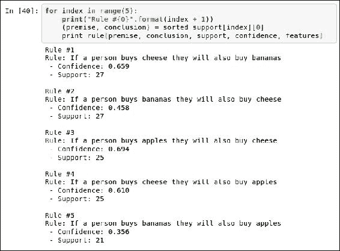

# 二十二、数据挖掘入门

我们正在以人类历史上从未见过的规模收集信息，并越来越重视在日常生活中使用这些信息。 我们希望我们的计算机将网页翻译成其他语言，预测天气，建议我们想要的书并诊断我们的健康问题。 这些期望将会增加，无论是应用数量还是预期的功效。 数据挖掘是一种方法，可以用来训练计算机使用数据进行决策，并且构成了当今许多高科技系统的骨干。

有充分的理由，Python 语言正在迅速普及。 它给程序员很大的灵活性。 它具有大量执行不同任务的模块； Python 代码通常比其他任何语言都更具可读性和简洁性。 有大量活跃的研究人员，从业人员和初学者使用 Python 进行数据挖掘。

在本章中，我们将介绍使用 Python 进行数据挖掘。 我们将涵盖以下主题：

*   什么是数据挖掘，可在哪里使用？
*   设置基于 Python 的环境以执行数据挖掘
*   亲和力分析示例，根据购买习惯推荐产品
*   （经典）分类问题的一个示例，根据其度量预测植物种类

# 引入数据挖掘

数据挖掘为计算机提供了一种学习如何对数据进行决策的方法。 这个决定可能是预测明天的天气，阻止垃圾邮件进入您的收件箱，检测网站的语言或在约会网站上找到新的恋情。 数据挖掘有许多不同的应用，新的应用一直在被发现。

数据挖掘是算法，统计，工程，优化和计算机科学的一部分。 我们还使用其他领域的概念和知识，例如语言学，神经科学或城市规划。 有效地应用它通常需要将此特定于领域的知识与算法集成在一起。

大多数数据挖掘应用都使用相同的高级视图，尽管细节通常会发生相当大的变化。 我们通过创建描述真实世界的一个方面的数据集来开始数据挖掘过程。 数据集包含两个方面的：

*   是现实世界中的对象的样本。 这可以是书，照片，动物，人或任何其他物体。
*   的功能是对数据集中样本的描述。 特征可以是给定单词的长度，频率，支路数量，创建日期等。

下一步是调整数据挖掘算法。 每个数据挖掘算法都有参数，这些参数可以在算法内，也可以由用户提供。 通过这种调整，算法可以学习如何制定有关数据的决策。

作为一个简单的示例，我们希望计算机能够将人们分类为“矮”或“高”。 我们从收集数据集开始，该数据集包括不同人的身高以及他们的矮矮或高矮：

<colgroup class="calibre17"><col class="calibre18"> <col class="calibre18"> <col class="calibre18"></colgroup> 
| 

人

 | 

高度

 | 

矮还是高？

 |
| --- | --- | --- |
| 1 | 155 厘米 | 短的 |
| 2 | 165 厘米 | 短的 |
| 3 | 175 厘米 | 高的 |
| 4 | 185 厘米 | 高的 |

下一步涉及调整我们的算法。 作为一种简单的算法； 如果身高大于`x`，则该人个子高，否则个子矮。 然后，我们的训练算法将查看数据并确定`x`的合适值。 对于前面的数据集，合理的值为 170 cm。 该算法认为身高高于 170 厘米的任何人。 其他人被认为是矮子。

在前面的数据集中，我们有一个明显的要素类型。 我们想知道人是矮还是高，所以我们收集了他们的身高。 此工程功能是数据挖掘中的重要问题。 在后面的章节中，我们将讨论选择好的特征以收集到数据集中的方法。 最终，此步骤通常需要一些专业知识，或者至少需要一些反复试验。

### 注意

在本模块中，我们将介绍通过 Python 进行数据挖掘。 在某些情况下，我们选择代码和工作流程的清晰度，而不是最优化的方式来做到这一点。 该有时涉及跳过一些细节，这些细节可以提高算法的速度或有效性。

# 一个简单的亲和力分析示例

在本节中，我们跳入第一个示例。 数据挖掘的一个常见用例是通过询问正在购买产品的客户是否也想要其他类似产品来提高销售。 这可以通过亲和力分析来完成，这是对事物何时存在的研究。

## 什么是亲和力分析？

相似性分析是一种数据挖掘类型，可以使样本（对象）之间具有相似性。 这可能是以下两者之间的相似之处：

*   网站上的用户，以提供各种服务或针对性的广告
*   出售给这些用户的商品，以便提供推荐的电影或产品
*   人类基因，以便找到拥有相同祖先的人

我们可以通过多种方式测量亲和力。 例如，我们可以记录两次购买产品的频率。 我们还可以记录一个人购买对象 1 以及购买对象 2 时语句的准确性。其他衡量亲和力的方法包括计算样本之间的相似度，我们将在后面的章节中介绍。

## 产品推荐

将传统业务（例如商务）在线移动的问题之一是，过去人类必须完成的任务需要自动化，以便在线业务得以扩展。 一个例子就是向上销售，或向已经购买的客户出售额外的物品。 通过数据挖掘进行自动产品推荐是电子商务革命的推动力之一，电子商务革命每年将数十亿美元转化为收入。

在此示例中，我们将专注于基本的产品推荐服务。 我们根据以下想法进行设计：历史上两个物品一起购买时，将来很有可能一起购买。 这种想法是在线和离线企业中许多产品推荐服务的背后。

对于这种类型的产品推荐算法，一种非常简单的算法是简单地找到用户带来商品的任何历史案例，并推荐历史用户带来的其他商品。 在实践中，像这样的简单算法效果很好，至少比选择要推荐的随机项目更好。 但是，可以极大地改进它们，这就是数据挖掘的用武之地。

为了简化编码，我们一次只考虑两项。 例如，人们可以在超市同时购买面包和牛奶。 在这个早期的示例中，我们希望找到以下形式的简单规则：

*如果某人购买产品 X，那么他们很可能会购买产品 Y*

涉及多个项目的更复杂的规则将无法涵盖，例如购买香肠和汉堡的人更有可能购买番茄酱。

## 使用 NumPy 加载数据集

可以从课程随附的代码包中下载数据集。 下载此文件并将其保存在计算机上，并注意数据集的路径。 对于本示例，建议您在计算机上创建一个新文件夹以放入数据集和代码。从此处打开 IPython Notebook，导航至该文件夹并创建一个新笔记本。

我们将在此示例中使用的数据集是 NumPy 二维数组，该数组是格式，是该模块其余部分中大多数示例的基础。 该数组看起来像一个表格，其中行代表不同的样本，列代表不同的特征。

单元格代表特定样本的特定特征的值。 为了说明这一点，我们可以使用以下代码加载数据集：

```py
import numpy as np
dataset_filename = "affinity_dataset.txt"
X = np.loadtxt(dataset_filename)
```

对于此示例，运行 IPython Notebook 并创建 IPython Notebook。 在笔记本的第一个单元格中输入上述代码。 然后，您可以通过按 *Shift* + *输入*来运行代码（这还将为下一批代码添加新的单元格）。 运行代码后，第一个单元格左侧的方括号将被分配一个递增数字，让您知道此单元格已完成。 第一个单元格应如下所示：


对于以后将花费更多时间运行的代码，此处将使用星号表示此代码正在运行或已计划运行。 代码运行完毕后，该星号将替换为数字。

您将需要将数据集保存到与 IPython Notebook 相同的目录中。 如果选择将其存储在其他位置，则需要将`dataset_filename`值更改为新位置。

接下来，我们可以显示数据集的某些行，以了解数据集的外观。 在下一个单元格中输入以下代码行并运行它，以便打印数据集的前五行：

```py
print(X[:5])
```

结果将显示在前五个交易中购买了哪些物品：


一次查看每行（水平线）即可读取数据集。 第一行`(0, 0, 1, 1, 1)`显示在第一笔交易中购买的物品。 每一列（垂直行）代表每个项目。 它们分别是面包，牛奶，奶酪，苹果和香蕉。 因此，在第一笔交易中，该人购买了奶酪，苹果和香蕉，但没有买面包或牛奶。

这些功能中的每一个都包含二进制值，仅说明是否购买了商品，而不说明购买了多少商品。 1 表示“至少购买了 1 个”此类商品，而 0 表示绝对未购买任何此类商品。

## 实施规则的简单排名

我们希望找到类型为*的规则。如果某人购买产品 X，那么他们很可能会购买产品 Y*。 通过简单地查找同时购买两种产品的所有情况，我们可以很容易地在数据集中创建所有规则的列表。 但是，我们然后需要一种从坏规则中确定好的规则的方法。 这将使我们能够选择要推荐的特定产品。

可以用很多方法来衡量这种类型的规则，其中我们将把重点放在两个方面：**支持**和**置信度**。

支持是规则在数据集中出现的次数，该次数是通过简单地计算该规则对其有效的样本数来计算的。 有时可以将其除以该规则的前提有效的总次数进行归一化，但是我们只计算该实现的总次数。

在支持测量规则存在的频率时，置信度测量规则在使用时的准确性。 可以通过确定前提适用时规则适用的次数百分比来计算。 我们首先计算一个规则在我们的数据集中适用的次数，然后将其除以前提（`if`语句）出现的样本数。

例如，如果一个人购买苹果，他们也购买香蕉，我们将计算规则*的支持度和置信度。*

如下例所示，我们可以通过检查`sample[3]`的值来判断是否有人在交易中购买了苹果，在该示例中，将样本分配给矩阵的一行：


同样，我们可以通过查看`sample[4]`的值是否等于 1（依此类推）来检查交易中是否购买了香蕉。 现在，我们可以计算规则在数据集中的存在次数，并由此计算出置信度和支持度。

现在，我们需要为数据库中的所有规则计算这些统计信息。 为此，我们将为*有效规则*和*无效规则*创建字典。 该词典的关键是元组（前提和结论）。 我们将存储索引，而不是实际的特征名称。 因此，我们将存储（3 和 4）以表示先前的规则*。如果某人购买苹果，他们还将购买香蕉*。 如果给出前提和结论，则该规则被视为有效。 尽管给出了前提但没有得出结论，但该规则被认为对该样本无效。

为了计算所有可能规则的置信度和支持度，我们首先设置一些字典来存储结果。 我们将为此使用`defaultdict`，如果访问的键尚不存在，它将设置默认值。 我们记录有效规则，无效规则的数量以及每个前提的出现：

```py
from collections import defaultdict
valid_rules = defaultdict(int)
invalid_rules = defaultdict(int)
num_occurances = defaultdict(int)
```

接下来，我们在一个大循环中计算这些值。 我们遍历数据集中的每个样本和特征。 第一个功能构成规则的前提-如果某人购买产品前提：

```py
for sample in X:
  for premise in range(4):
```

我们检查该样本是否存在前提。 如果不是这样，我们就不再需要对此样本/前提组合进行任何处理，然后移至循环的下一个迭代：

```py
  if sample[premise] == 0: continue
```

如果前提对于此样本有效（其值为 1），则我们记录此情况并检查规则的每个结论。 我们跳过与前提相同的任何结论，这将给我们一些规则，例如，如果某人购买苹果，那么他们购买苹果，这显然对我们没有多大帮助；

```py
  num_occurances[premise] += 1
  for conclusion in range(n_features):
      if premise == conclusion: continue
```

如果存在该样本的结论，则我们将增加此规则的有效计数。 如果没有，我们将为该规则增加无效计数：

```py
  if sample[conclusion] == 1:valid_rules[(premise, conclusion)] += 1else:
    invalid_rules[(premise, conclusion)] += 1
```

现在，我们已经完成了必要统计信息的计算，现在可以为每个规则计算*支持*和*置信度*。 和以前一样，支持只是我们的`valid_rules`值：

```py
support = valid_rules
```

置信度的计算方法相同，但是我们必须遍历每个规则才能计算出此置信度：

```py
confidence = defaultdict(float)
for premise, conclusion in valid_rules.keys():
    rule = (premise, conclusion)
    confidence[rule] = valid_rules[rule] / num_occurances[premise]
```

现在，我们有了一本字典，其中包含对每个规则的支持和信心。 我们可以创建一个函数，以一种可读的格式打印出规则。 规则的签名包含前提和结论索引，我们刚刚计算的支持和置信度字典以及可以告诉我们特征含义的特征数组：

```py
def print_rule(premise, conclusion,
              support, confidence, features):
```

我们获取前提和结论的特征名称，并以可读格式打印规则：

```py
    premise_name = features[premise]conclusion_name = features[conclusion]print("Rule: If a person buys {0} they will also buy {1}".format(premise_name, conclusion_name))
```

然后我们打印出此规则的`Support`和`Confidence`：

```py
    print(" - Support: {0}".format(support[(premise,
                                            conclusion)]))
    print(" - Confidence: {0:.3f}".format(confidence[(premise,
                                                    conclusion)]))
```

我们可以通过以下方式调用来测试代码-随意尝试不同的前提和结论：


## 排名以找到最佳规则

现在我们可以计算所有规则的支持度和置信度，我们希望能够找到*最佳*规则。 为此，我们执行排名并打印具有最高值的排名。 对于支持值和置信度值，我们都可以这样做。

为了找到支持最高的规则，我们首先对支持字典进行排序。 默认情况下，字典不支持排序。 `items()`函数为我们提供了一个包含字典中数据的列表。 我们可以使用`itemgetter`类作为键对列表进行排序，从而可以对嵌套列表（例如此列表）进行排序。 使用`itemgetter(1)`可以使我们根据值进行排序。 设置`reverse=True`首先为我们提供最高值：

```py
from operator import itemgetter
sorted_support = sorted(support.items(), key=itemgetter(1), reverse=True)
```

然后，我们可以打印出最重要的五个规则：

```py
for index in range(5):
    print("Rule #{0}".format(index + 1))
    premise, conclusion = sorted_support[index][0]
    print_rule(premise, conclusion, support, confidence, features)
```

结果将如下所示：



同样，我们可以根据置信度打印最重要的规则。 首先，计算排序后的置信度列表：

```py
sorted_confidence = sorted(confidence.items(), key=itemgetter(1), reverse=True)
```

接下来，使用与以前相同的方法将它们打印出来。 注意第三行对`sorted_confidence`的更改；

```py
for index in range(5):
    print("Rule #{0}".format(index + 1))
    premise, conclusion = sorted_confidence[index][0]
    print_rule(premise, conclusion, support, confidence, features)
```


两个列表的顶部附近有两个规则。 第一个是**如果一个人购买苹果，他们还将购买奶酪**，第二个是**如果一个人购买奶酪，他们还将购买香蕉**。 商店经理可以使用此类规则来组织商店。 例如，如果本周销售苹果，则在附近摆放奶酪。 同样，将两种香蕉与奶酪同时出售也没有意义，因为将近 66％的购买奶酪的人仍然会购买香蕉-我们的销售不会增加香蕉的购买量。

在这样的示例中，数据挖掘具有强大的探索能力。 一个人可以使用数据挖掘技术来探索其数据集中的关系以找到新的见解。 在下一节中，我们将数据挖掘用于其他目的：预测。


# 一个简单的分类示例

在相似性分析示例中，我们在数据集中寻找了不同变量之间的相关性。 在分类中，我们只具有一个我们感兴趣的变量，我们将其称为**类**（也称为目标）。 如果在上一个示例中，我们对如何使人们购买更多苹果感兴趣，则可以将该变量设置为作为类别，并寻找实现该目标的分类规则。 然后，我们将仅寻找与该目标相关的规则。

# 什么是分类？

无论是在实际应用还是在研究中，分类都是数据挖掘的最大用途之一。 和以前一样，我们有一组样本来表示我们感兴趣的分类对象或事物。 我们还有一个新的数组，类值。 这些类别值为我们提供了样本的分类。 一些示例如下：

*   通过查看植物的尺寸来确定植物的种类。 这里的分类值是*这是哪个物种？*。
*   确定图像中是否包含狗。 这个班级是*此图片上有只狗吗？*。
*   根据测试结果确定患者是否患有癌症。 类别为*该患者患有癌症吗？*。

尽管上面的许多示例都是二元（是/否）问题，但不一定非要如此，就像本节中植物种类的分类一样。

分类应用的目标是在一组具有已知类别的样本上训练模型，然后将该模型应用于具有未知类别的新的未见样本。 例如，我们要在过去的电子邮件上训练垃圾邮件分类器，我将其标记为垃圾邮件或非垃圾邮件。 然后，我想使用该分类器来确定我的下一封电子邮件是否为垃圾邮件，而无需自己进行分类。

## 加载和准备数据集

我们将在此示例中使用的数据集是著名的植物分类 Iris 数据库。 在此数据集中，我们有 150 个植物样品，每个样品有四个测量值：**萼片长度**，**萼片宽度**和**花瓣长度** 和**花瓣宽度**（均以厘米为单位）。 这个经典数据集（最早在 1936 年使用！）是数据挖掘经典数据集中的一个。 分为三类：**鸢尾鸢尾**，**鸢尾花**和**鸢尾花**。 目的是通过检查其测量值来确定样品属于哪种植物。

`scikit-learn`库包含此内置数据集，使数据集的加载变得简单：

```py
from sklearn.datasets import load_iris
dataset = load_iris()
X = dataset.data
y = dataset.target
```

您也可以打印（`dataset.DESCR`）以查看数据集的轮廓，包括有关要素的一些详细信息。

此数据集中的特征是连续值，这意味着它们可以采用任何范围的值。 测量是此类功能的一个很好的示例，其中测量可以取值为 1、1.2 或 1.25，依此类推。 关于连续特征的另一个方面是彼此接近的特征值指示相似性。 萼片长度为 1.2 厘米的植物就像萼片宽度为 1.25 厘米的植物一样。

相反，是分类特征。 这些功能通常用数字表示，但不能以相同的方式进行比较。 在虹膜数据集中，类值是分类特征的示例。 类 0 代表鸢尾鸢尾花，类 1 代表鸢尾花，类 2 代表鸢尾花。 这并不意味着 Iris Setosa 与 Iris Versicolour 比与 Iris Virginica 更相似，尽管其类值更相似。 此处的数字代表类别。 我们只能说类别是相同还是不同。

也有其他类型的功能，其中一些功能将在后面的章节中介绍。

尽管此数据集中的特征是连续的，但我们在本示例中将使用的算法需要分类特征。 将连续特征转换为分类特征的过程称为离散化。

一种简单的离散化算法是选择一些阈值，并且该阈值以下的任何值都给定值 0。与此同时，任何高于此阈值的值都给定值 1。对于我们的阈值，我们将计算该特征的均值（平均值） 。 首先，我们计算每个特征的均值：

```py
attribute_means = X.mean(axis=0)

```

这将给我们一个长度为 4 的数组，这是我们拥有的特征数。 第一个值是第一个特征的值的平均值，依此类推。 接下来，我们使用它来将数据集从具有连续特征的数据集转换为具有离散分类特征的数据集：

```py
X_d = np.array(X >= attribute_means, dtype='int')
```

我们将使用这个新的`X_d`数据集（用于 *X 离散化*）进行训练和测试，而不是原始数据集（`X`）。


## 实现 OneR 算法

OneR 是一种简单的算法，它通过查找特征值最频繁的类别来简单地预测样本的类别。 OneR 是的缩写，是*一个规则*，表示通过选择性能最佳的功能，我们仅对该分类使用一条规则。 尽管某些后来的算法明显更复杂，但该简单算法已在许多实际数据集中表现出良好的性能。

该算法从迭代每个功能的每个值开始。 对于该值，计算每个类别具有该特征值的样本数。 记录最频繁出现的特征值类别以及该预测的错误。

例如，如果某个要素具有两个值`0`和`1`，则我们首先检查所有值为`0`的样本。 对于该值，我们可能在`A`类中有 20 个，在`B`类中有 60 个，在`C`类中又有 20 个。 此值最常见的类别是`B`，并且有 40 个实例具有差异类别。 该特征值的预测为`B`，误差为 40，因为有 40 个样本的类别与预测不同。 然后，针对此功能的`1`值，然后对所有其他功能值组合执行相同的过程。

一旦计算了所有这些组合，我们就可以通过汇总该功能的所有值的误差来计算每个功能的误差。 总误差最低的特征被选为*一个规则*，然后用于对其他实例进行分类。

在代码中，我们将首先创建一个函数，该函数计算特定特征值的类预测和错误。 我们在先前的代码中使用了两个必要的导入`defaultdict`和`itemgetter`：

```py
from collections import defaultdict
from operator import itemgetter
```

接下来，我们创建函数定义，它需要数据集，类，我们感兴趣的特征的索引以及我们正在计算的值：

```py
def train_feature_value(X, y_true, feature_index, value):
```

然后，我们遍历数据集中的所有样本，计算具有该特征值的每个样本的实际类别：

```py
    class_counts = defaultdict(int)
    for sample, y in zip(X, y_true):
        if sample[feature_index] == value:
            class_counts[y] += 1
```

然后，我们通过对`class_counts`字典进行排序并找到最大值来找到分配最频繁的类：

```py
    sorted_class_counts = sorted(class_counts.items(),key=itemgetter(1), reverse=True)most_frequent_class = sorted_class_counts[0][0]
```

最后，我们计算该规则的误差。 在 OneR 算法中，具有此特征值的任何样本都将被预测为最频繁的类别。 因此，我们通过对其他类别（不是最常见）的计数求和来计算误差。 这些代表该规则不适用的训练样本：

```py
incorrect_predictions = [class_count for class_value, class_count in class_counts.items()if class_value != most_frequent_class]
error = sum(incorrect_predictions)
```

最后，我们既返回该特征值的预测类别，又返回该规则的分类错误的训练样本数，错误：

```py
    return most_frequent_class, error
```

使用此功能，我们现在可以通过遍历该功能的所有值，对错误求和并记录每个值的预测类来计算整个功能的误差。

函数头需要我们感兴趣的数据集，类和特征索引：

```py
def train_on_feature(X, y_true, feature_index):
```

接下来，我们找到给定功能采用的所有唯一值。 下一行的索引将查看给定功能的整列，并将其作为数组返回。 然后，我们使用 set 函数仅查找唯一值：

```py
    values = set(X[:,feature_index])
```

接下来，我们创建将存储预测变量的字典。 该词典将具有要素值作为键，并将分类作为值。 键值为 1.5 且值为 2 的条目表示，当要素的值设置为 1.5 时，将其归为 2 类。我们还创建了一个列表，用于存储每个要素值的错误：

```py
    predictors = {}
    errors = []
```

作为此功能的主要部分，我们迭代此功能的所有唯一值，并使用先前定义的函数`train_feature_value()`查找给定功能值的最常见类别和错误。 我们存储上述结果：

```py
    for current_value in values:
      most_frequent_class, error = train_feature_value(X, y_true, feature_index, current_value)
      predictors[current_value] = most_frequent_class
      errors.append(error)
```

最后，我们计算此规则的总误差，并返回预测值和该值：

```py
    total_error = sum(errors)
    return predictors, total_error
```

## 测试算法

当我们评估最后一部分的亲和力分析算法时，我们的目的是探索当前数据集。 通过这种分类，我们的问题就不同了。 我们想要建立一个模型，通过将它们与我们对问题的了解进行比较，从而对我们之前看不见的样本进行分类。

因此，我们将机器学习工作流程分为两个阶段：训练和测试。 在训练中，我们获取一部分数据集并创建模型。 在测试中，我们应用该模型并评估其在数据集上的有效性。 由于我们的目标是创建一个能够对以前看不见的样本进行分类的模型，因此我们不能使用测试数据来训练模型。 如果这样做，我们将面临过度拟合的风险。

**过度拟合**是创建模型的问题，该模型可以很好地对训练数据集进行分类，但在新样本上的表现不佳。 解决方案非常简单：永远不要使用训练数据来测试算法。 这个简单的规则有一些复杂的变体，我们将在后面的章节中介绍。 但是，目前，我们可以通过简单地将数据集分为两个小数据集来评估我们的 OneR 实现：训练数据集和测试数据集。 此工作流在本节中给出。

`scikit-learn`库包含一个将数据分为训练和测试组件的功能：

```py
from sklearn.cross_validation import train_test_split
```

此功能将根据给定的比率（默认情况下使用数据集的 25％进行测试）将数据集分为两个子数据集。 它是随机执行的，从而提高了对该算法进行适当测试的信心：

```py
Xd_train, Xd_test, y_train, y_test = train_test_split(X_d, y, random_state=14)
```

现在，我们有两个较小的数据集：`Xd_train`包含我们的训练数据，`Xd_test`包含我们的测试数据。 `y_train`和`y_test`给出了这些数据集的相应类别值。

我们还指定了一个特定的`random_state`。 设置随机状态将在每次输入相同的值时进行相同的分割。 *看起来*是随机的，但是所使用的算法是确定性的，输出将保持一致。 对于此模块，我建议将随机状态设置为与我相同的值，因为它将为您提供与我相同的结果，从而使您可以验证结果。 要获得每次运行都会改变的真正随机结果，请将`random_state`设置为`none`。

接下来，我们为数据集的所有特征计算预测变量。 请记住，仅在此过程中使用训练数据。 我们遍历数据集中的所有特征，并使用我们先前定义的函数来训练预测变量并计算误差：

```py
all_predictors = {}
errors = {}
for feature_index in range(Xd_train.shape[1]):
  predictors, total_error = train_on_feature(Xd_train, y_train, feature_index)
  all_predictors[feature_index] = predictors
  errors[feature_index] = total_error
```

接下来，我们通过找到错误最少的功能来找到用作“一个规则”的最佳功能：

```py
best_feature, best_error = sorted(errors.items(), key=itemgetter(1))[0]
```

然后，我们通过存储最佳功能的预测变量来创建`model`：

```py
model = {'feature': best_feature,
  'predictor': all_predictors[best_feature][0]}
```

我们的模型是一个字典，它告诉我们*一个规则*使用哪个功能以及根据其具有的值进行的预测。 在这种模型的情况下，我们可以通过查找特定特征的值并使用适当的预测变量来预测以前未见过的样本的类别。 以下代码针对给定的示例执行此操作：

```py
variable = model['variable']
predictor = model['predictor']
prediction = predictor[int(sample[variable])]
```

通常，我们想一次预测许多新样本，我们可以使用以下函数进行预测： 我们使用上面的代码，但是迭代数据集中的所有样本，以获得每个样本的预测：

```py
def predict(X_test, model):
    variable = model['variable']
    predictor = model['predictor']
    y_predicted = np.array([predictor[int(sample[variable])] for sample in X_test])
    return y_predicted
```

对于我们的`testing`数据集，我们通过调用以下函数来获得预测：

```py
y_predicted = predict(X_test, model)
```

然后，我们可以通过将其与已知类进行比较来计算其准确性：

```py
accuracy = np.mean(y_predicted == y_test) * 100
print("The test accuracy is {:.1f}%".format(accuracy))
```

这给出了 68％的准确度，对于单个规则来说还不错！


