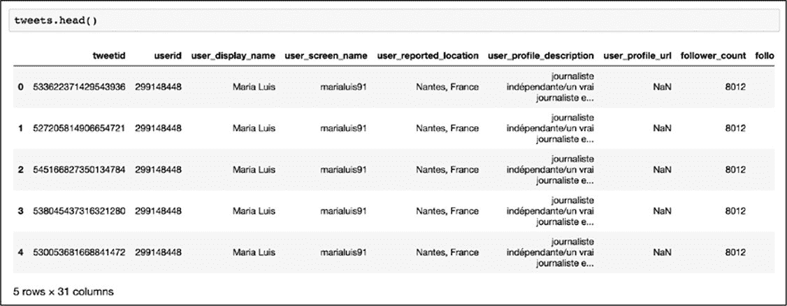
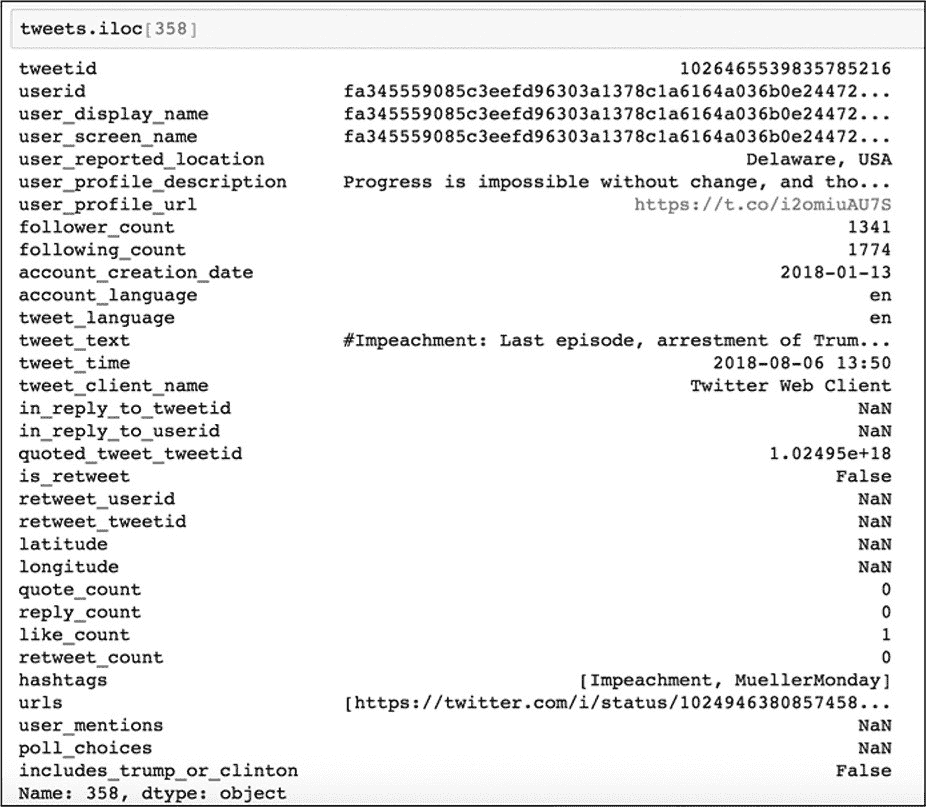
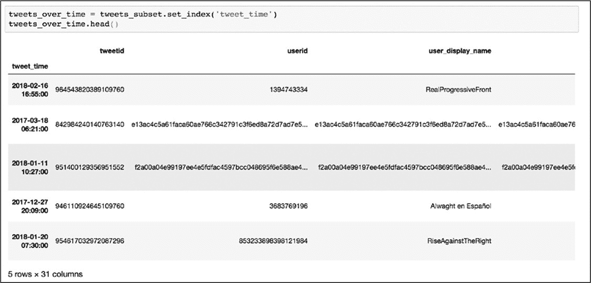
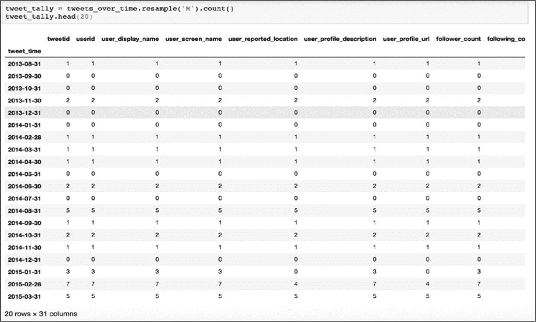

# 10 测量公众人物的 Twitter 活动
---------------------------------------------------------------------------------------------------

在第 9 章中，我们用一个大数据集进行了第一次数据分析，并了解了如何基于简单的分类回答一个问题。虽然这个过程产生了良好的结果，但这种分析非常有限：仅在一个时间点查看数据。另一方面，跨时间分析数据可以寻找趋势，能够更好地理解遇到的异常情况。通过研究数据中的变化和分离特定事件，可以在它们之间建立有意义的联系。

在本章中，我们将研究数据随时间的变化。具体来说，我们将研究 2018 年发布的一组 Twitter 数据，其中包括公众人物在 2016 年美国总统大选之前、期间和之后发布的推文，以影响美国和其他地方的公众舆论。数据转储是 Twitter 平台正在进行的一部分，该工作允许研究人员分析由虚假和雇佣的 Twitter 帐户运行的媒体操纵活动。我们想要查看使用与唐纳德·特朗普(Donald
Trump)和/或希拉里·克林顿(Hillary
Clinton)有关的标签的推文，并确定这些推文在一段时间内的表现。这些推文是否对美国的总统选举有影响？这些推文的关注度是在 2016 年大选之后是下跌，还是继续上升？

在此过程中，会学习到如何使用一种称为 lambda 的函数来筛选数据。将了解如何格式化原始数据并将其转换为时间序列以及如何对其进行重采样。还将学到一个与 Pandas 一起使用的新库，称为 matplotlib（https://matplotlib.org/）。matplotlib 库将通过在 Jupyter
Notebook 环境中可视化数据（使用简单的图形来说明数据波动）来帮助理解数据。在该项目结束时，就能够对 Pandas 和它可以做的事情有更好的了解。

#### 新手入门

在 2017 年和 2018 年中，Twitter、Facebook 和 Google 因为允许国际代理传播虚假或误导性的内容来影响美国和国外的公众舆论而受到严厉批评。这种公众监督最终导致了两大数据包的发布：一个是俄罗斯的推文------据 Twitter、国会和各种媒体报道------被用来操纵美国媒体格局；另一个是伊朗的推文，也做了同样的事情。

比起伊朗的数据集，俄罗斯的数据集要大很多，可能会减慢分析的进度。因此，把重点放在伊朗数据中（iranian_tweets_csv_hashed.csv），可以从 https://pan.baidu.com/s/1AYbjOq2NxzUps10I3XecBA 中直接下载。

该案例研究问题很简单：随着时间的变化，伊朗人员在 Twitter 上发布了几条与特朗普和克林顿相关的推文？把与特朗普和克林顿相关的推文定义为使用包含字符串 trump 或 clinton（忽略大小写）的主题标签的推文。如第 9 章所述，这种分类可能会遗漏一些推文，但出于教学目的仍然采用这种方法。在实际数据分析中，就需要更广泛、更加细致的分类。

#### 设置环境

正如前一章所做的，先要为项目建立一个新的文件夹。然后，在该文件夹中创建三个子文件夹:data、notebooks 和 output。完成之后把下载数据解压后放到 data 文件夹中。

接着在命令行接口中切换至项目目录，并输入 python3 -m venv
myvenv（Mac）用以在项目的目录中创建一个虚拟环境，然后使用 source
myvenv/bin/activate 激活该环境（如若不清楚，可返回第 8 章）。

激活虚拟环境后，就开始安装要使用的所有库。这个项目中需要 Jupyter、Pandas 和 Matplotlib，所有这些都可以使用 pip 安装，如下所示:

安装完库之后，在命令行接口中输入 Jupyter
Notebook 启动 Jupyter，然后在 Jupyter 中切换至 notebooks 文件夹并通过选择**New
▸ Python
3**创建一个新 notebook。最后重命名新笔记本：单击 title（显示为：*Untitled*），在弹出窗口中将其重命名为 twitter_analysis。

#### 把数据加载至 Notebook

使用 import 语句加载 Pandas 和 Matplotlib。在名为 twitter_analysis 的 Notebook 的第一个单元中键入以下内容：

 在第一行中，导入 Pandas 并以 pd 作为缩写，在之后的代码中只需引用 pd 即可访问 Pandas 的所有功能。在第二行中执行相同的操作之外，应注意导入的是 Matplotlib 的一个名为 pyplot 的子集，以 plt 作为快缩写。

然后运行此单元后就能够访问导入的库了。接下来就是加载数据，创建一个名为 tweets 的变量来保存导入的数据。在下一个单元中输入以下内容并运行：

此行使用 Pandas 的 read_csv()函数把 Twitter 数据加载至到 Notebook 中，该函数输入 csv 文件的路径并返回可以使用的数据框。

数据被读取后，考虑下一步该做什么？这个数据集包括涵盖广泛话题的推文，但我们只对唐纳德·特朗普(Donald
Trump)和希拉里·克林顿(Hillary
Clinton)的推文感兴趣。这表明需要筛选数据，与在第 9 章筛选 r/askscience 数据一样。

在筛选数据范围之前，应对数据进行一定的了解。既然数据已经加载到 Notebook 中，那么使用 head()函数来研究一下，在单元中输入以下内容并运行：

 其输出结果应如图 10-1 所示。

*图 10-1：加载的数据框*

如图所示，该数据集包含与推文相关的大量元数据。每一行代表一条推文，包括推文本身和推文用户的信息。应仍记得在第 8 章中，如何把数据框所有的列名作为一个列表输出：

运行该命令后的输出如下：

 出于我们的目的判断，在这个数据集中想要的列是 hashtags 和 tweet_time。hashtags 列以单词列表的形式显示每个推文中使用的所有推文话题（hashtag），话题的单词之间用逗号分隔，以开方括号开始和闭方括号结束。尽管遵循列表 list 的模式，但 Python 将其解释为一个长字符串。例如，图 10-2 显示在第 359 行中的 hashtags 是"Impeachment"和"MuellerMonday"，其被存储为一个长字符串"\[Impeachment，MuellerMonday\]"。请注意并非每条推文都有 hashtags，分析中将只考虑那些有 hashtags 的推文。

*图 10-2：使用.iloc\[\]方法显示数据框中的第 359 行推文*

然后，hashtags 列可以让我们用字符串 trump 或 clinton 对推文进行标识。tweet_time 列包含发送推文的时间戳。在筛选数据之后，将使用 tweet_time 列来计算与特朗普和克林顿相关推文的月度统计数据。

为了筛选数据，会重复前面关于疫苗相关数据分析中的一些相同步骤。创建了一个新列，并通过选择另一列并使用 contains()函数查看是否包含字符串 vaccin 来用 True 或 False 填充它。对于这个项目也将创建一个 True 或 False 列，但是不使用 contains()函数，而是使用一个更强大的 Pandas 特性：lambda 函数。

#### LAMBDA 函数

lambda 函数是一个匿名函数，可以把它应用于 Pandas 数据框中列的每个值。可以使用定制的 lambdas 来修改数据，而不是局限于 Pandas 或者 Python 开发人员已编写的函数（如：contains()函数）。

在使用 lambda 函数之前，先看看其结构。假设想要给一个数字加上 1 并返回新的数字，用于此目的的常规 Python 函数可能如下所示：

在上述代码中使用 def 关键字创建一个函数并将其命名为 add_one()，并将 x 定义为惟一的参数。然后看看等价于 add_one()函数的 lambda 用法：

与缩进的 Python 函数不同，lambda 主要是为一行程序而编写的，并可在 apply()函数内部使用。Lambda 函数代码显示：没有定义一个新函数，而是使用 lambda，后面跟着参数 x，然后指定要对 x 做什么------在本例中是对 x 加 1。lambda 函数没有定义名称，这就是为什么称 lambda 为匿名函数了。

将 lambda 函数本身作为参数传递给 Pandas 的 apply()函数来把需要实现的功能应用数据框的列（清单 10-1）。

*清单 10-1：给 apply()函数传递一个 lambda*

此例中，从一个名为 dataframe 的假想数据框架中选择名为 column_name 的列，并对该列应用 lambda
x +
1。(在此例子中，要使该功能能够实现，column_name 中的值必须是数字，而不是字符串。)这行代码将返回一系列结果，这些结果是把 column_name 列中每一行的值加 1 得到的。换句话说，此行代码将显示 column_name 列中加 1 后的每个值。

如果您需要对列应用更复杂的操作，则还可以将传统的 Python 函数传递给 apply()。例如，使用之前定义的 add_one()函数重写清单 10-1 中的代码，只需将名称传递给 apply()函数，如下所示：

lambda 可能是修改整个列的数据最有效的方法。匿名函数由于易于编写，因此非常适合一次性任务。

#### 筛选数据集

本章的项目只想要一个仅包含与 2016 年总统候选人相关推文的数据框。为此使用一种启发式方法思考该问题：hashtags 仅包含字符串 trump，clinton 或两者都包含在内的推文。也许这样操作无法涵盖有关唐纳德·特朗普或希拉里·克林顿的所有推文，这是一种清晰而容易理解的方式来看待这些产生错误信息代理的活动。

依据推文中是否包含字符串 trump 或 clinton 创建一个包含布尔值 True 或 False 的列，使用清单 10-2 中的代码来实现。

*清单 10-2：在推文数据集中创建一个包含的 True 或 False 列*

这段代码看上去非常稠密，所以把其分成几部分解释。在等号的左边，创建了一个名为 includes_trump_or_clinton 的新列，用于存储 lambda 函数的结果。在等号的右侧，选中 hashtags 列应用以下 lambda 函数：

此 lambda 函数做的第一件事是：
str(x).lower()方法先把字符串全部转换成小写。整行代码接收 hashtags 列中每一行传递出来的值 x，使用 str()函数将 x 转换为字符串，使用 lower()函数使字符串中的每个字母都变成小写，最后检查字符串"trump"/\"clinton\"是否在该小写字符串中。如果是则函数返回 True；如果不是则返回 False。在这里使用 str()函数是一种非常有用的方式，先把需要处理的任何值(甚至是空值和 NaN 值)转换为可以查询的字符串；如果没有 str()，空值可能会导致代码中的错误，还可以跳过包含空值的行。

当生成了包含 True 或 False 的列，就可以开始筛选推文了。使用清单 10-3 中的代码实现该过程。

*清单 10-3：筛选出只包含"trump"和"Clinton"的推文*

该代码会创建一个名为 tweets_subset 的新变量，该变量存储筛选后的数据框，其只原数据集的\"hashtags\"中含有特朗普或克林顿的推文。然后，使用方括号一句条件筛选原数据集的子集------在本例中，tweets\[\"
includes es_trump_or_clinton \"\]值是否为真。

通过这些代码已经把原数据集缩减至感兴趣的推文部分。在一个单独的单元中使用代码 len(tweets_subset)查看 tweets_subset 的行数，其结果应是 15264。接下来就是查看包含特朗普或克林顿相关话题的推文数量是如何随时间变化的。

#### 把数据格式化为 DATETIMES

通过对数据集的筛选，计算在特定时间段内包含特朗普或克林顿相关标签的推文的数量------这种计数方式通常被称为时间序列。为了回答上述问题，先要把数据列格式化为时间戳，并使用 Pandas 中的函数根据时间戳创建记录。

与第 6 章中 Google Sheets 相同，须在代码中指定要处理的数据类型。虽然 Google
Sheets 和 Pandas 可以自动检测数据类型，但自动检测也会出错，所以最好的方式是手动指定。在 Pandas 中的方法是选中包含时间戳的列，然后把其转换成 datetime 数据类型。

在转换数据类型之前，先使用 Pandas 的 dtypes 属性查看目前的数据类型：

在 Jupyter Notebook 中运行后显示的结果如下：

可以看到，有两列含有与时间相关的数据：account_creation_date 和 tweet_time。在本项目中感兴趣的是理解推文，因此把关注重点放在 tweet_time 上。目前，Pandas 把 tweet_time 列解释为 object 数据类型，在 Pandas 中 object 数据类型通常表示字符串。但 Pandas 有一个专门为时间戳设计的数据类型：datetime64\[ns\]。要把 tweet_time 列数据格式化为 datetime64\[ns\]，使用 Pandas 的 astype()函数。该函会将用包含相同数据但解释为 datetime 对象的数据列替换原 tweet_time 列中的数据（清单 10-4）。

*清单 10-4：使用 asytype()函数格式化 tweet_time 列的数据类型*

> 上述代码中，把 tweet_time 列放在方括号内将其选中，然后通过对其应用 astype()函数来替换其中的数据。在 Jupyter
> Notebook 的新单元中输入 tweets_subset.dtypes 查看转换是否成功。检查输出可以发现已经把 tweet_time 列的数据类型由 object 转换为 datetime64\[ns\]了。
>
> 数据类型转换完成后，就可以基于 tweet_time 列对 includes_trump_or_clinton 列进行统计了。

#### 对数据进行重采样

回想之前的问题：想要找到每个时间段包含特朗普或克林顿相关标签的推文数量。为了回答该问题，在这里使用一个称为重采样*resampling*的过程，此过程会在指定的时间间隔内聚合数据；把此概念映射到分析，就要是计算每天、每周或每月推文的数量。在本章的项目中将使用月进行采样，如果想要更细粒度的分析时可以按周甚至按天进行重采样。

重采样的第一步是把 tweet_time 设置为索引 index。设置成索引后就能让 Pandas 依据 tweet_time 值选择和定位条目，然后对其应用不同种类的数学操作。通过使用 set_index()函数把 tweet_time 列设置为索引。创建一个新的变量 tweets_over_time，该变量用于存储 set_index()函数返回的更新索引的数据框(清单 10-5)。

*清单 10-5：设置新索引并存储返回结果*

 在进行下一步操作之前，通过 tweets_over_time.head()先看看新索引是什么样子的（图 10-3）。

*图 10-3：把 tweet_time 列作为索引的数据框*

图 10-3 中显示了一个细微但重要的变化：tweet_time 列中的值取代了数据左侧基于整数的索引号并以粗体显示。这说明已经用 tweet_time 列中的时间戳替换了基于数字的索引。

应用新索引后就可以使用 resample()函数对数据进行分组和聚合（清单 10-6）。

*清单 10-6：使用 resample()对数据框中的数据进行分组和聚合*

在 resample()函数的括号中指定想要聚合数据的频率(每天、每周或每月)。在本例中以月作为时间间隔进行统计，故传入了字符串"M"(即 month 的缩写)。接着就需要指定想要以何种方式随时间聚合数据，因为本例中需要每个月统计一次推文的数量，所以这里使用 count()函数。

 运行了包含清单 10-6 代码的单元后，就可以在新单元中运行 tweet_tally.head()来查看数据。输出应该是一个包含每月每个列中的所有值的计数数据框（图 10-4）。

*图 10-4：重采样的数据框架，包含每个列值的月计数。请注意 2015-01-31 索引行数据的计数差异。*

如上图中所示，代码计算了每个月每个列中包含值的数量。从 tweet_time 的开始日期起，在 tweet_tally 数据框中每一行代表一个月。但是此结果并不理想，因为这些计数值散布在大约 30 个列中，除此之外在给定月份的每个列中的计数也可能不同。以图 10-4 中标记为 2015-01-31 的行为例，在 user_profile_url 列中计算得 0，但 tweet_id 列中的计数是 3。这说明在 2015-01 里伊朗特工发布了三条带有包含特朗普或克林顿的字符串标签的推文，但没有一条包含 user_profile_url。

基于此发现，应谨慎选择最能确定每月推文总数的依据，应谨慎计算哪些值？如果通过、user_profile_url 列机选推文的数量，只能捕获具有 user_profile_url 的推文，就不会捕获没有这些 url 的推文，而且会低估数据框架中所有推文的数量。

因此在重采样数据集之前，应先查看数据列中包含的值，然后通过计算对列中值的计算进行评估是否可用于重采样。这是一步骤非常重要：当使用 head()或 tai()函数显示部分数据时，似乎数据框中每一行都应有值存在，但是不能仅仅通过相对看一下数据集的一小部分就确定海量数据的存在。这一思考有助于考虑哪个列能够最可靠地代表了一个独特的实体，该实体在数据集中不能被忽略（例如，一条推文可能并不总是包含标签，但它必须具有唯一的标识符或 ID）。在清单 10-5 中存储在 tweets_over_time 变量的数据集中 tweetid 列的每一行都有一个值。

由于本例仅需要每月推文的总数，因此只需使用 tweetid 列的计数值，把该列存储在变量 monthly_tweet_count 中，如下所示：

通过 head()函数检查 monthly_tweet_count 可看到一个更清晰且含有每月计数值的数据框：

用前述代码创建的数据框让我们可以随着时间的推移更好地了解数据，但是用眼睛逐行浏览不是最佳的选中。本例中的目标是想要观察整个数据集的主要趋势。

#### 绘制数据

通过使用 Matplotlib 可以更全面地了解手上的数据。Matplotlib 库可以绘制和可视化 Pandas 数据框------特别是用于可视化时时间序列。

在这个绘图开始前，把 Matplotlib 库的 pyplot 函数作为 plt 导入，并缩写 plt 访问其下的绘图函数：

在本例中，把数据框 monthly_tweet_count 作为参数导入 plot()函数，该函数会在 x 轴上绘制数据框的日期，在 y 轴上绘制每月的推文数量，如图 10-5 所示。

*图 10-5：在 Jupyter
Notebook 中用 Matplotlib 创建的图表*  

图 10-5 表显示了与特朗普或克林顿相关标签的推文数量按照时间变化的形态。从图中可以看到从 2016 年底开始每月的推文数量急剧增加，这表明在 2016 年美国总统大选之前和之后，这个账户变得非常活跃，显然在选举几个月后活动发生了变化。虽然无法完成所有必要的研究来解释此活动，但数字取证研究实验室的研究人员已在 https://web.archive.org/web/20190504181644/上发布了对伊朗帐户的更深入分析。

#### 概要

本章的项目展示了用 Python 进行数据分析的强大功能。只需几行代码就可以打开一个庞大的数据集，根据其内容进行筛选，并将其汇总为每月计数，通过可视化以便更好地理解。在此过程中了解了 lambda 函数以及如何基于 datetime 对象对数据进行重采样。

本章是本书实践练习的总结。在下一章也就是最后一章中，我们将讨论您如何进一步自学这些入门课程，从而成为一个活跃的、自给自足的 Python 学习者。
