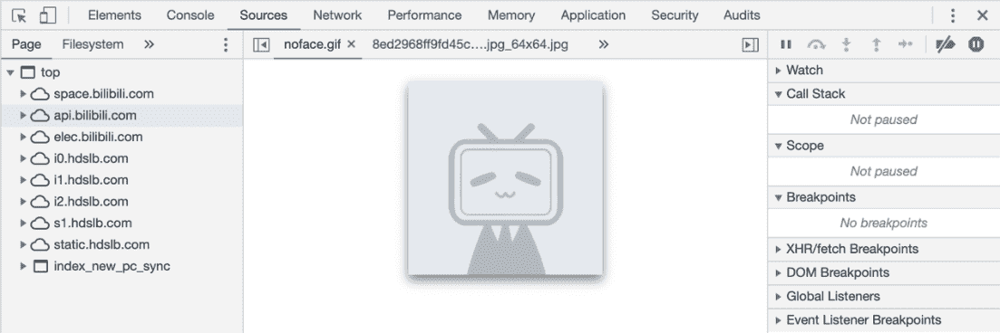
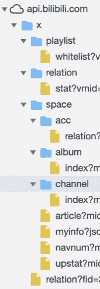
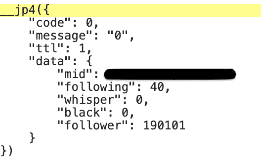

1 编写程序通过 API 获取网站的信息
-------------------------------

与第 2 章中提到的 FaceBook
API 不同，我国国内的视频网站已经不开放官方的数据 API 了，但是仍可通过对其网页进行解析得到相关信息。比如：国内大型在线视屏网站之一的哔哩哔哩，想要知道其中一个视频播主在 B 站上总共发了多少视频、播放量是多少等问题。在回答这些问题前，首先需要进行以下步骤来弄清楚从哪里获取这些数据。

#### 解析网页获取数据 API 链接

用 Chrome 打开哔哩哔哩某个播主的主页，然后点击按键 F12 开启 Chrome 的 Web
Inspector。在弹出的 Web
Inspector 窗口中点击*Sources*进入该页面的源码视图（图 F1-1）。

 

*图 F1-1：Web Inspector 的 Sources 界面*

 在 Sources 界面中可以看到*[api.bilibili.com]{.ul}*，用鼠标点击左侧的小三角将其内容展开（图 F1-2）。

*图 F1-2:展开后的 api.bilibili.com 中的内容*

从图 F1-2 中可以看到：api.bilibili.com 中包含一个文件夹 x，内容全部在 x 文件夹中，其中包含了 playlist、relation 以及 space 三个主要的文件夹。space 文件夹中还包含了 acc、album 和 channel 文件夹。

通过对比 bilibili 中该播主的主页，可以猜测这些文件夹所代表的含义：

1.  playlist ： 该播主可播放视频列表；

2.  relation ： 与播主的关系；

3.  space ： 播主在哔哩哔哩上的主页空间；

4.  acc ： 浏览该播主主页的账号与播主的关系；

5.  album ： 播主的相册；

6.  channel ： 播主的视频频道。

从这些含义的字面上可以得出一些基本的判断：relation 以及 acc 两文件夹中包含的信息不是想要的。逐个代开其他 4 个文件夹的内容后发现，以下 API 链接返回了我们想要的关于该播主的统计信息（图 F1-3 展示了在 Chrome 的 Web
Inspector 中显示的 API 内容）：

A.  [https://api.bilibili.com/x/relation/stat?vmid=xxxxxxx](https://api.bilibili.com/x/relation/stat?vmid=382666849)，含有：关注数、私信数、拉黑以及粉丝数的信息；

B.  [https://api.bilibili.com/x/space/navnum?mid=xxxxxxx](https://api.bilibili.com/x/space/navnum?mid=382666849)，含有：视频数、相册数等统计信息；

C.  [https://api.bilibili.com/x/space/upstat?mid=xxxxxxx](https://api.bilibili.com/x/space/upstat?mid=382666849)，含有：视频播放数、视频点赞数等统计信息。

 

*图 F1-3：API 链接返回的内容示例*

至此，我们掌握了一些该播主的统计信息，下一步就是把获取这些信息的步骤改由 Python 来完成。

**此处有些非常重要的提示：**

1.  读者的浏览器如果安装了某些广告屏蔽的软件，建议禁用；

2.  某些网站需要登陆后才能在 API 里面显示相关信息；

3.  某些网站对于加载其内容的浏览器有限制，在某些浏览器中不显示 API 信息。

#### 编写脚本完成自动化抓取

参考本书第 2 章和上一节中的内容，可以通过以下代码来获取播主的相关统计信息：

> *注：涉及到隐私以及可能的广告涉嫌，隐藏了该播主在 B 战上的 ID 编号。读者获取信息时可把代码中的"xxxxxxx"替换成想要抓取的播主 ID（即:API 链接后的 mid 对应的编号）。*

打开 Jupyter
Notebook，在一个单元内输入以上代码后运行（Shfit+Enter），其输出如下：

然后，在 Jupyter
Notebook 的另一个单元中导入 json 并解析该输出为 Python 字典格式（代码及输出如清单 F1-1）：

*清单 F1-1：把 API 的输出转换为 Python 字典格式*

从列表 F-1 中可以看出，需要的数据主要保存在字典的 data 键中，通过创建一个名为 summaries_data 的 Python 字典来存储这些信息（见清单：F1-2）。

*清单 F1-2：把数据存储在一个 Python 字典中*

接下来对在上一节中提及的另外两个 API 链接采用相同的方式把数据存储在一个字典中，为了叙述的简便以及对应本书中关于代码重复使用的原则，给读者呈现的是已封装为 getBiLi_Data 的函数（见清单 F1-3）。

*清单 F1-3：自定义函数 getBiLi_Data*

清单 F1-3 中 getBiLi_Data 函数有 3 个参数：url_Lists，Id 和 headers。其中 url_Lists 是在上一节中通过解析网页获得的 3 个 API 链接中不含"xxxxxxx"的部分，以文本的数据类型保存在 url_Lists（Python 的 list 列表）中。Id 是 3 个 API 链接中的"xxxxxxx"的部分，是某个播主在哔哩哔哩中的账号 ID，该参数输入的是一串数字。headers 是 requests 使用 get()函数时导入的*请求头部信息*，如果不设置这个参数，则在获取 3 个 API 链接中的最后一个时会发生错误。把 getBiLi_Data 函数的运行结果赋予变量 datA 后的输出见列表 F1-4 所示：

*清单 F1-4：在哔哩哔哩上获取的一个播主的统计信息*

仔细研究清单 F1-4 中的信息后，可以看到 id 为 xxxxxxx 的播主：40 人关注（following）；0 个私信（whisper）；0 次拉黑（black）等等。还可以看到 datA 字典中嵌套着另一个字典（共两层结构），在把 datA 字典中的信息写入文件前需要把 datA 字典碾平（即：字典里面不要嵌套字典）。

*清单 F1-5：碾平 datA 字典中的数据*

清单 F1-5 中代码是已经一个已经封装在名为 Panel_Data()中的函数，该函数接收一个字典作为参数，输出一个碾平后的字典。接下来的任务是：从哔哩哔哩网站上通过随机生成的用户 ID 获取该用户的统计信息，并把获得的信息写入 csv 文件中，完整的代码如下：

*清单 F1-6：完整的代码*

*清单 F1-6：完整的代码（续）*

清单 F1-6 中完整代码的解析交给读者自我领会，如果有哪里不清楚的可以参考第 2/3 章的内容。
