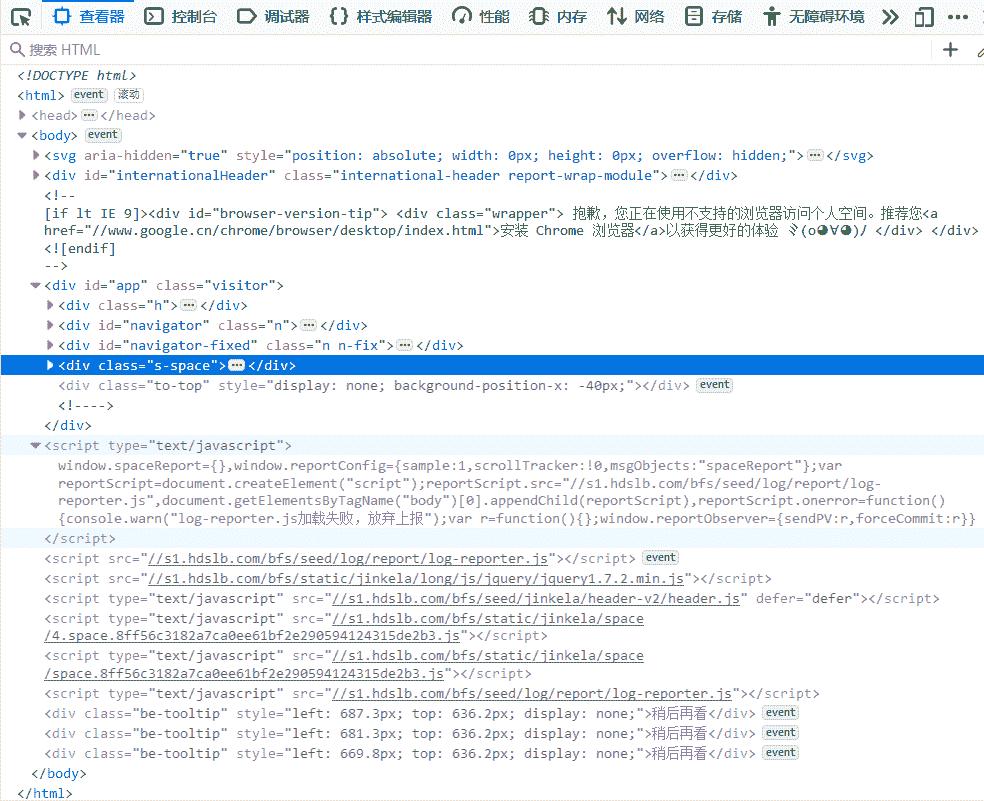
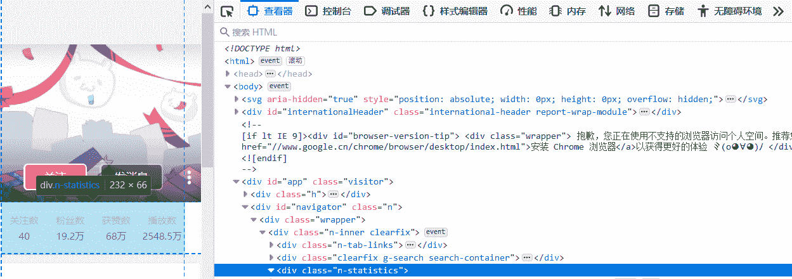
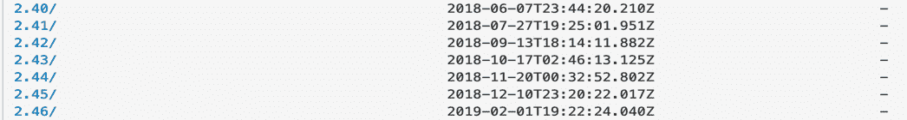
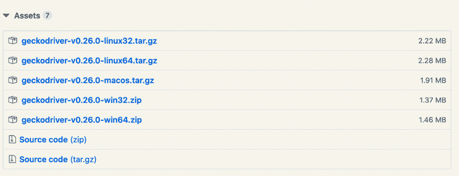
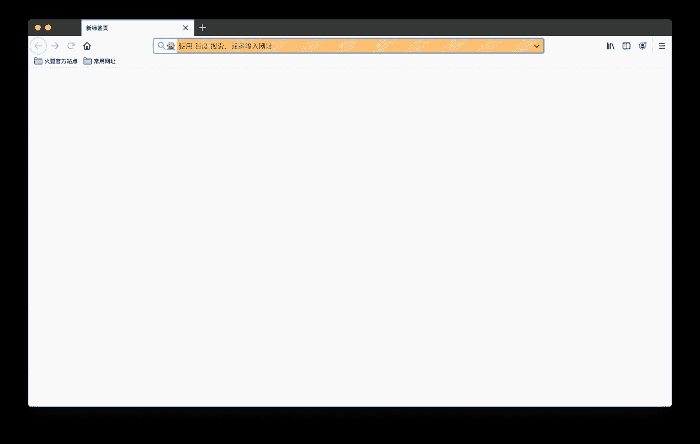
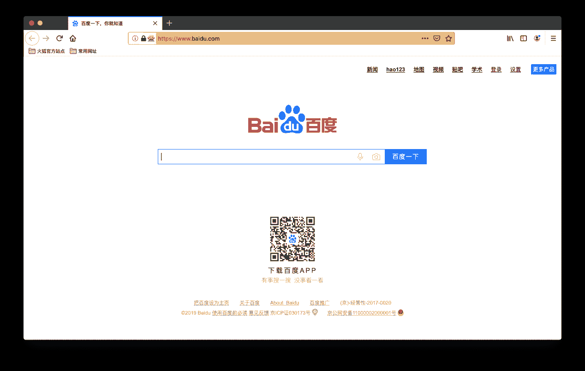

# 2 通过解析网页直接获取哔哩某播主的详细信息
------------------------------------------

在附录 1 中通过 API 链接直接获取了哔哩一些播主的统计信息，但是在这些信息非常有限，比如：仅知道播主的 ID 号，而不知道播主在哔哩的具体名称；获取到视频的数量但是不知道这些视频的名称等。接下来就是结合本书第 4、5 章的内容，通过直接解析网页的 HTML 代码获取缺失的信息。

#### 使用本书代码尝试抓取

 按照第 5 章中 5-3 的代码把其中的 url 替换成想要抓取的哔哩哔哩播主主页。我们先看看能不能直接获取到附录 1 中提到的播主的统计信息，仍然用浏览器打开该播主的主页，按 F12 调出"网页调试页面"（在附录 2 中译者采用了 Firefox 作为浏览器，读者可以按照自己的喜好来选择使用的浏览器，F12 按照后弹出的界面都大同小异），如图 F2-1 所示。

*图 F2-1：Firefox 中类似 Chrome 中的 Web Inspector 界面*

从图 F2-1 中可以看到，浏览器载入了很多的内容，图中高亮的部分（class="s-space"）就是 B 站上某播主的主页空间的内容。接下来使用第 5 章中的代码抓取该播主的部分统计信息（class="n-statistics"），见图 F2-2。

 

*图 F2-2：某播主的统计信息在 HTML 代码中的体现*

> *清单 F2-1：第 5 章中代码的修改版*
>
> 在 Jupyter
> Norebook 中运行以上代码后，可以发现 content 变量没有储存任何信息。为什么呢？我们来比较一下浏览器中的 HTML 代码（图 F2-1）与 requests 获得的 HTML 代码（清单 F2-2）之间的区别。

*清单 F2-2：requests 获得的 HTML 代码*

对比图 F2-1 可以确认清单 F2-2 中 requests 获得的代码在\
(红线标准的地方)之后少了很多，图 F2-3 中的 HTML 代码缺少了"\
\...\</div\>"中的内容，也没有了\<script
type=\"text/javascript\"\>\...\</script\>的部分等内容。

这是什么原因呢？因为哔哩哔哩网站采用的是动态网页[^2]，所以 requests 仅仅获得了网页的开始部分，剩下的大部分需要浏览器依据开始部分 HTML 代码继续加载其他的剩余部分（包括：Javascript 等等）。也就说使用第 5 章中的代码没有办法抓取附录 1 中获取的到的相同信息。

#### 动态网页抓取准备

这个时候就要使用到动态网页的抓取框架（亦称：爬虫框架）了。抓取框架有很多种组合，对于初学者来说最好的学习方式是能够所见所得，所以本附录采用 Selenium+WebDriver+
BeautifulSoup 的组合，这个组合是利用 Python 的 Selenium 模块加载用于控制浏览器的 WebDriver 并通过它启动浏览器后，解析浏览器加载的信息来获取动态网页上需要的数据。

首先，还是需要在计计算机上安装 Selenium 和 WebDriver。按照本书第 8 章中的步骤建立"虚拟环境"并切换至虚拟环境中，然后使用 pip 安装 Selenium（清单 F2-3）。

*清单 F2-3：使用 pip 安装 Selenium*

清单 F2-3 中代码会根据读者计算机中的情况，自动安装 Selenium 及其依赖的库。Selenium 安装完成后还不能直接使用，因为还缺少一个用于在计算机上控制浏览器的程序 WebDriver。WebDriver 需要另外下载并把其复制至虚拟环境的文件夹中才能使用。不同的浏览器对应不同的 WebDriver，以下是其的下载地址：

1.  Chromedriver （Chrome 浏览器）：

> http://npm.taobao.org/mirrors/chromedriver/

 

2.  geckodriver（FireFox 浏览器）：

> https://github.com/mozilla/geckodriver/releases

 

3.  Microsoft WebDriver（Edge 浏览器）：

> <https://developer.microsoft.com/en-us/microsoft-edge/tools/webdriver/>

 

此处需要说明一点：由于微软的 Edge 分为两个版本（Chromium 和 EdgeHTML），所以在下载之前需要知道 Edge 是哪个版本，步骤是：打开 Edge
\> 点击... \> 设置 \> 关于 Microsoft Edge 。

由于苹果为了加强 macOS 系统的安全性，以致原来许多 Safari 的扩展插件都不能使用，建议读者使用与译者相同的 FireFox 浏览器。在 Jupyter
Notebook 中输入如下代码尝试打开一个由程序控制的浏览器（清单 F2-4）：

*清单 F2-4：加载 WebDriver 错误的提示*

清单 F2-4 中给出了一个由于 WebDriver 放置的位置不对导致的错误提示。这是因为没有把 WebDriver 放置在正确的目录中，应放置到读者的虚拟环境目录的 bin 文件夹中（Anaconda 也一样）。然后重新运行 F2-4 中的代码后，就会弹出一个如图 F2-3 的浏览器窗口。代码中的 browser 是 WebDirver 生成的一个实例，采用 Selenium 库中的 webdriver 模块通过 geckodriver 程序启动了 FireFox 浏览器。

 

*图 F2-3：由程序控制的浏览器*

在图 F2-3 中红圈中可以看到一个机器人的图标，表明该浏览器正被程序控制着（本书中是 Python，还可以使用其他程序，译者不建议读者现在深入）。现在浏览器还没有载入任何页面，因为还没有给浏览器任何指令。

*清单 F2-5：使用程序控制浏览器打开指定的页面*

清单 F2-5 使用实例 browser 的 get()函数给浏览器指定 Web 页面，在 Jupyter
NoteBook 的新单元中输入该行代码就可以看到浏览器中打开了百度搜索的首页（图 F2-4）。

 

*图 F2-4：采用程序代码通过浏览器打开的百度首页*

#### 开始抓取动态网页

在使用浏览器抓取动态页面的数据之前，请读者回顾本书第 5 章"从实时网站抓取数据"。然后才接着看如下的代码：

清单 F2-6：抓取播主的统计信息

在清单 F2-6 中首先导入需要的库，第一个导入的是 Selenium 中的 webdriver。在第三行中导入了 re 模块，该字母 re 是*regular
expression*正则表达式的缩写，用来在字符串中搜索匹配要求的字符。

在圈记处用 re 模块生成了一个用于匹配字符串中数字字符的匹配器，在圈记中用这个匹配器搜索 HTML 代码（如：\<a
title="秒杀价 3999",href="<https://www.xxxx.com>"\>秒杀\</a\>）中的数字。由于在字符串中匹配出来的数据类型还是字符，所以用（
''.join()
）的方法把搜到的数字连接起来，最后对这个数字使用 Python 内置的 int()函数转换成整数类型。在圈记中使用了两个 HTML
tag（标记）通过 BeautifulSoup 来搜索内容，因为\
中包含的数据存在于\<\"a\"\>和\<\"div\"\>的两个子标记中。

在通过获取的统计信息验证所编写的代码没有错误后，采用类似的方式在该播主的哔哩哔哩空间中获取其他信息。

*清单 F2-7：使用代码获取播主空间中的信息*

在清单 F2-7 中可以看到，在圈记和使用了两种不同的 BeautifulSoup 属性"string"和"text"来获取 HTML 代码中的信息。因为如\\<li
contents="hill"\>\</li\>09:37\</span\>的 HTML 代码中用"string"属性无法直接获得其中的"09:37"，而用"text"属性绕过其中\<li\>\</li\>直接提取\<span\>\</span\>中包含的文本部分。在圈记中为了在未来数据收集的够多的时候减少数据处理的繁琐步骤，使用 Python 内置的 strip()方法对字符串进行预先处理，strip()方法在不添加任何参数时默认去除字符串头部以及尾部的空格或换行符，也通过通过制定参数去除制定的字符，如圈记中用于去除 URL 连接头部的"//"字符。

在圈记中使用了 split()方法，该方法通过指定的字符来分割字符串，如：使用代码\'https://www.baidu.com\'.split(\'.\')，把百度首页分割成如\[\'https://www\',\'baidu\',\'com\'\]的 Python 列表。当分析的数据量小的时候读者不会感觉到计算机运行的问题，但是一旦数据量非常大时如果对导入分析的数据能够预处理，如只取\'https://www\',\'baidu\',\'com\'中的\'baidu\'，那么内存的占用就会大大的减少。

通过对动态网页的抓取，我们有了一个播主的统计信息字典和主页空间视频信息字典，如何把两个字典合并以及如何写入 csv 文件就交给读者作为练习题来完成。
