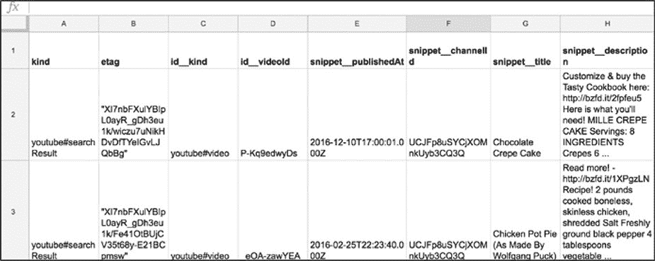
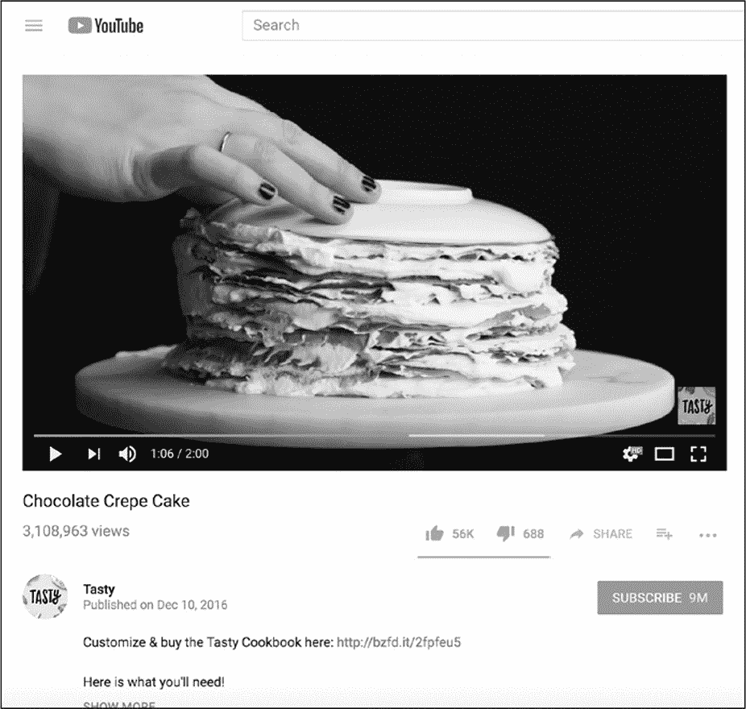
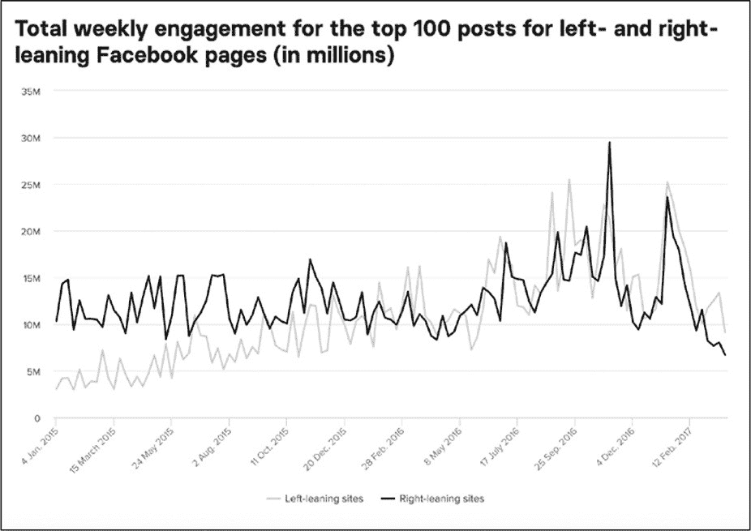
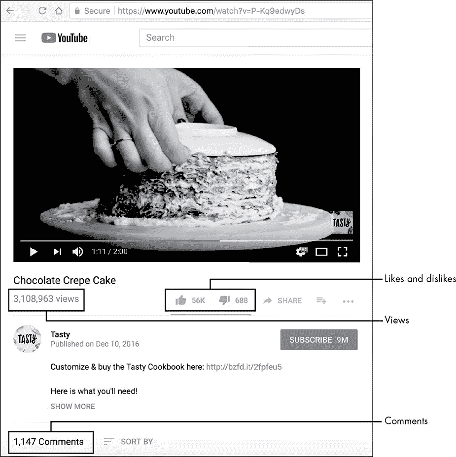

# 2 从哪里获取数据
---------------------------------------------------------------------------------------

当使用社交媒体时，我们的行为会留下痕迹。Facebook 上的点赞，Twitter 上的转发，Instagram 上的一颗心------每一个动作都代表着互联网某处记录的一个数据点。通过用户同意这些公司的服务条款，允许他们存储这些数据，反过来这些公司也可以向公众提供数据。

这些公司允许第三方通过应用程序编程接口(API)访问这些数据宝库。API 就像社交媒体平台和希望从中获取信息的开发人员之间的中间人。

在本章中以 YouTube 为例，更详细地解释什么是 API，以及可以从中获取哪些类型的数据。

#### 什么是 API？

API 是 Application Programming
Interface 的缩写，即应用程序编程接口。从最基本的层面上看，API 是允许程序员访问其他开发人员代码的接口。一些程序员使用 API 访问在线平台上的数据，这样他们就可以制作自己的应用程序。例如，第三方开发者可以使用官方的 Instagram 应用程序的 API，该 API 允许用户使用非官方的应用程序向他们的 Instagram
Feed 发布图片。换句话说，Instagram
API 允许开发者将自己的代码连接到 Instagram 管理其帐户的用户。

正如稍后即将讨论的，API 还允许开发人员使用脚本（一个与 web 上的服务器和数据库通信的程序）来请求数据。

为了更好地理解 API，采用一个例子进行类比。例如：你是餐馆的顾客，API 就像一个服务员，它给你一组选项、帮你点餐、取餐，然后拿给你。当然餐厅老板决定菜单上有哪些什么菜肴。餐厅老板还控制着菜肴的摆放和分量。菜单详细说明了你可以点哪些菜肴，这些菜肴的名字，以及这些菜肴的一半构成份。

就我们而言，社交媒体公司代表餐馆老板，开发人员(或客户)代表食客，菜单上的菜代表我们试图收集的数据。客户端是我们用来上网的任何技术，就像浏览器、手机、桌面的一个应用程序。

Facebook 或 Twitter 这样的公司是否提供 API 完全取决于：可以通过一个或多个 API 提供数据，也可以选择不提供任何数据。而且，即使公司允许第三方访问其数据存储，它通常也会限制可用的数据，并可以随时更改共享的数据。公众对隐私问题的愤怒、旨在保护人们数据的新法律法规、以及涉及社交媒体公司的新闻事件，都对公司是否提供数据的决策产生了影响。一些公司甚至可能对访问他们的数据进行收费。

要了解一家公司通过其 API 向开发人员提供了哪些信息方法是通读该公司的文档，然而文档是说明手册的一种时髦称谓而已。令人非常不愉快的是：文档并没有被标准化。即使是最有经验的研究人员也会感到迷失方向，尤其是当他们刚开始编写代码。这在一定程度上是因为文档通常是针对应用程序开发人员，而不是研究人员、营销人员或其他非开发人员。

查找一家公司提供哪些可用信息的最佳方法是简单地搜索该公司在谷歌（国内是 Baidu）上的 API。

#### 通过 API 获得数据

现在已经大致了解了 API 的工作方式，接下来研究如何使用 API 获得数据。

如前所述，第三方一般使用脚本从 API 请求数据。这些脚本通常是文本文件，由计算机之类的机器执行或运行。可以将把脚本想象成一个为您执行任务的小机器人。这个机器人可以与 API 通信，向 API 请求数据、读取接收到的数据、并根据数据创建电子表格。

脚本通常通过 URL 与 API 通信，如同访问网站时使用的 URL。使用 URL 与 API 通信被称为基于 URL 的 API 请求(API 调用)。与大多数其他 URL 一样，可以把 API 调用粘贴到任何浏览器中，浏览器将返回您请求的基于文本的数据。当使用脚本进行 API 调用时，脚本将接收浏览器中显示的信息。

以谷歌的 YouTube
API 为例。您可以使用这个 API 来访问大量数据，包括 YouTube 频道的描述数据或在一段时间内接收到的访问量。通过在 URL 中包含数据，可以告诉 API 需要调用哪些数据。对于本练习，我们将请求 BuzzFeed
Tasty YouTube 页面上发布的帖子的数据提要。为此使用如下 API 调用：

https://www.googleapis.com/youtube/v3/search?channelId=UCJFp8uSYCjXOMnkUyb3CQ3Q&part=snippet
。

URL 的每个部分都有不同的用途。其中有两种类型的字符串构成了一个 API 调用：一种是 base，它表示正在使用的 API；另一种是各种参数，它告诉调用希望获取哪些数据并传递有关您的信息(即请求信息的一方)。在之前的类比中，base 类似正在用餐的餐厅，参数是可以选择的单个菜单项目。

 

此例中的 API 基于*https://*[*www.googleapis.com/youtube/*
。](http://www.googleapis.com/youtube/%20。%20)该 API 把浏览器或 Python 脚本定向到谷歌的 YouTube
API 上。调用的下一部分是一个参数，该参数告诉谷歌需要使用的 API 版本。社交媒体网站经常更新，当网站更新时 API 也随着更新。版本由一个正斜杠与 base 分隔开。在本例中我们希望使用 API 的 v3 版本(由于这些版本经常更新，您应该参考文档以确保使用的是最新版本)。下一个参数是 search，该参数指定搜索 YouTube 的视频。

接下来指定要搜索的内容。此例中需要寻找来自 BuzzFeed
Tasty 频道的视频，该频道的 YouTube 频道 ID 为 UCJFp8uSYCjXOMnkUyb3CQ3Q。一般在 YouTube 频道 URL 的末尾找到频道 ID。例如，Tasty 频道的 URL 为：https://www.youtube.com/channel/UCJFp8uSYCjXOMnkUyb3CQ3Q。通过输入参数的名称 channelId 来调用频道 ID 参数，具体为在 channelId 后面跟一个等号(=)和长的频道 ID：channelId=UCJFp8uSYCjXOMnkUyb3CQ3Q。

现在有了一个 URL 地址，完成对 API 进行第一次调用的而准备。在下一章中通过 Python 脚本进行此调用，但是现在只需将 API 调用粘贴到浏览器中。此步操作可以立即看到 API 的响应。完成该操作后，浏览器应该返回清单 2-1 中的信息。

*清单 2-1:API 调用在浏览器中返回的代码，读者的响应可能看起来略有不同*

API 响应的结构是 JavaScript 对象标记(JSON)，这是 API 用来传递数据的格式。在接下来的页面中会更详细地讨论 JSON。

仔细查看该 API 返回的 JSON 数据发现单词 error，error 表示发生了问题，代表该 API 无法从 BuzzFeed
Tasty 频道获取请求的帖子。

处理代码的过程中经常需要阅读和理解错误（error）消息。作为一个初学者可能会觉得把大部分时间都花在了测试和修复代码上而没有实际的产出。但是在找到正确方法之前还是会犯错误，一旦经验积累起来后，就很容易改正这些错误。

大多数情况下错误消息提供了关于出错原因的线索。如果更仔细地检查 API 错误的响应，可以看到 API 返回了一个"消息"和一个错误通知"未经过身份验证的使用超出了每日限制"，继续使用需要注册。（Daily
Limit for Unauthenticated Use Exceeded. Continued use requires
signup.）"

若要修复这个错误需要一个"API 密钥"，这是一种将标识自己 API 的方法。YouTube 和其他有 API 的网站想要知道谁在使用他们的 API，所以有时会要求你注册开发者证书，这是开发者用来获得 API 访问权限的一种形式。凭证类似于用户名和密码。作为获取 API 使用权限的交换，社交媒体公司会跟踪用户，以防有人滥用 API。

###### 获取一个 YouTube API 密钥

对于 YouTube 等社交媒体网络，通常可以在该平台的网站上获取密钥。现在开始尝试从 YouTube 获取密钥。如果要注册 Google 的 YouTube 开发者密钥，首先需要注册一个 Google 帐户。如果没有请在*https://www.google.com*上创建一个。完成此步骤操作后，登录并导航到 Google 为开发人员设置的单独页面：*https://console.developers.google.com/apis/credentials
。*

 请按照谷歌的说明创建凭证，特别是 API 密钥。

完成创建一个通用 API 密钥后，密钥的默认名称是"API 密钥"，可以通过双击密钥名称来重命名。本例中被重命名为"数据收集密钥"。

有了密钥之后，在浏览器中导航到 Library 页面。谷歌提供了各种各样的 API，因此需要启用对所需的特定 API 的访问。在浏览器中导航到 YouTube 数据 API
v3 并单击 Enable。至此可以通过 API 密钥访问 YouTube 了。

该 API 密钥连接到您的谷歌帐户，它的作用类似于允许您访问谷歌 API 的用户名和密码。所以应像对待其他用户名和密码一样对待 API 密钥。以往编写并发布脚本到代码共享平台(如 GitHub)的开发人员会不小心在网上发布他们的密钥。如果犯了同样的错误，就会产生严重的后果。如有人可能会滥用您的密钥，导致在将来无法访问该 API 密钥代表的服务。

###### 使用凭证检索 JSON 对象

获得用户凭证后就可以使用 URL 再次访问 API。尽管每个 API 都不相同，但是通常 API 会要求您将 API 密钥直接输入到 API 调用中。如果发现之后使用其他 API 不是这种情况，那么应查看该 API 的文档找出在何处输入凭证。对于 Google 的 YouTube
API 可以在原始 API 调用指定的参数之后，将 API 密钥作为其自己的参数添加到 URL 中。输入以下 URL，用获得的 API 密钥替换\<YOUTUBE_API_KEY\>：https：//www.googleapis.com/youtube/v3/search？
channelId = UCJFp8uSYCjXOMnkUyb3CQ3Q＆part = snippet＆key =
\<YOUTUBE_API_KEY\>。

至此应该收到一个包含数据的 API 响应！清单 2-2 是 API 调用在浏览器中返回数据的示例。因为 BuzzFeed 页面是不断变化的，你的数据看起来应该会不同，但返回的数据结构应该是一样的。

*清单 2-2：YouTube API 返回的示例数据*

 查看返回代码后可以注意到，API 响应仍然是 JSON。也许有些让人不知所措，但是可以将 JSON 数据转换成一种更熟悉的格式---表格（图 2-1 所示）。阅读 API 响应中的一些字符串，能看到数据是来自 BuzzFeed
Tasty YouTube 频道的五个视频的快照。

*图 2-1：JSON 数据转换成表格格式*

刚开始接触是，JSON 格式的数据看起来感觉非常混乱、非常复杂，所以把每个部分一一分解后就可以更好地了解数据的结构。JSON 数据总是存储在两个大括号({})之间。每个 post 都存储为 JSON 对象，每个对象中的数据点存储为**键-值对（*key-value
pairs*）**。如第一个 post 包含以下数据点：

冒号前的字符串被称为键*key*➊,冒号后的字符串是一个与键*key*关联的值*value*➋。键*key*代表了数据的类型------可以将这个键*key*看作表格列的标题。值*value*包含实际数据，如：字符串、整数或浮点数。在 API 文档中可以查阅到这些数据点是哪种数据类型。在本例中键*key*被称为"*publishedAt*"，根据 YouTube 的文档，该键*key*描述了一个帖子或评论创建的时间和日期。本例中的值*value*（"*2016-12-10T17:00:01.000Z*"）是一个用 UTC 格式格式化的时间戳。UTC 是一种将日期和时间信息存储在一个字符串中的标准化方式。

API 返回哪种数据完全取决于提供数据的社交媒体平台。这也意味着社交媒体平台决定了返回数据的键值。例如，谷歌决定调整发布文章的日期和时间*publishedAt*代替*日期 date*或*published_on*。顺便提一句，这是谷歌及其 API 的特有风格（译者说：改用 Baidu 吧！Baidu 的风格更加夸张）。

*清单 2-3：YouTube 上一个名为"Chocolate Crepe Cake"的视频片段*

如清单 2-3 所示，每一个 YouTube 视频信息存储一组花括号{}➊之间,每一个 JSON 对象是由一个逗号分开➌。在这些大括号中有四个键("publishedAt"、"chann"、"title"、"description")和它们所关联的值("2016-12-10T17:00:01.000Z"，"UCJFp8uSYCjXOMnkUyb3CQ3Q"，"Chocolate
Crepe Cake"，"Customize & buy the Tasty Cookbook here:
http://bzfd.it/2fpfeu5 Here is what you'll need! MILLE CREPE CAKE
Servings：8 INGREDIENTS Crepes 6
..."，respectively)，这些键和值与前面的示例一样是成对显示的，每一个键-值对之间采用逗号分隔➋。

再次查看清单 2-2 中原始代码的部分片段(参见清单 2-4)。

*清单 2-4：重新访问 YouTube API 返回的示例数据*

清单 2-4 中显示所有的推文都嵌套在一对方括号(\[\])中。(注意，上面的清单 2-4 在本书中被截断了，虽然您应该能够在 API 调用的结果中看到开括号和闭括号，但是只能在这些页面中看到开括号。)所有这些数据的前面依次是字符串"items"，然后是冒号。这表示键"items"包含一个数据点列表------在本例中是 BuzzFeed 的 Tasty
YouTube 频道的视频。"items"键值对存储在另一组大括号({})之间，大括号组成整个 JSON 对象。

至此，完成了如何从 API 请求数据的过程，以及如何读取返回的 JSON 响应，接下来看看如何调整返回的数据以满足我们的需要。

###### 使用数据回答研究问题

可能已经注意到，API 调用返回的数据在视觉上相当稀疏。如果不指定需要的数据类型，API 会只返回基本信息以及提供默认数据点，这不是我们想要的数据。例如，清单 2-5 中包含清单 2-2 中 API 调用返回的一个视频的信息。

*清单 2-5：API 调用的示例响应，仅包含关于视频的基本信息*

此数据项对应于图 2-2 中 BuzzFeed 中 Tasty 频道上的视频。

 

*图 2-2：清单 2-5 所示的视频截图*

在线视频中显示的数据比通过 API 接收到的数据要多，如：观看和评论的数量。这些信息以及更多的信息都可以通过 API 获得，但是需要考虑想要获得的数据类型以及想用它来回答什么问题。具体来说需要做两件事。首先，需要为研究设定目标。设定研究目标可能是**最重要**但在现实过程中考虑最少的步骤，对研究有一套清晰的问题或假设会告诉你如何收集数据。其次，应当查阅 API 文档，看看是否有需要的数据来满足研究目标。

采用这种方法的一个很好的例子是 BuzzFeed 新闻的故事"Inside the Partisan
Fight for Your News Feed"
(https://buzzfeed.com/craigsilverman/inside-the-partisan-fight-
for-your-news-feed)。本文作者与 Craig Silverman，Jane Lytvynenko，Jeremy
Singer-Vine 组成的项目组通过 Facebook 的 Graph
API 从 452 个不同的 Facebook 页面收集了 400 万篇帖子。总共收集了数百万的数据点，这些数据点通过简单地分析不能无法找到任何有意义的模式或趋势。为此首先需要缩小想要使用的信息的范围。

由于越来越多的新闻机构依靠 Facebook 这样的第三方来接触他们的受众，作者的项目深入研究了新老机构在 Facebook 上是如何相互比较的。项目组决定分析[左倾]{.ul}和[右倾]{.ul}新闻机构的受欢迎程度（世界上哪有那么多左右之分呢？本文不谈论政治，作者也仅仅是用此项目当作一个事例。），受欢迎程度分析基于这些新闻机构的追随者数量和每个页面所获得的参与度(反应和评论)。将数据缩小到两个类别后就可以画出随时间变化的信息，如图 2-3 所示。

 

*图 2-3：BuzzFeed News 分析了左倾和右倾 Facebook 页面的表现*

从上图中可以看到：随着时间的推移，左倾的 Facebook 页面的参与度在不断增加。为了找到研究问题的答案，不仅需要访问信息，而且还需要过滤信息。

如果想要对 BuzzFeed 的"美味频道"(Tasty
channel)的内容在一段时间内的受欢迎程度进行类似的分析，首先需要考虑的是：可能有助于回答这个问题的数据类别。例如，有多种方法来衡量一个视频的受欢迎程度，如：观看、喜欢、不喜欢和评论等等的数量，然后决定要用哪种方法。

 在某些情况下，社交媒体平台帖子的视觉布局是决定如何回答研究问题的好方法。例如，图 2-4 可以告诉我们在 BuzzFeed 的"美味频道"(Tasty
channel)的流行度分析中使用了哪些数据。

*图 2-4：在清单 2-5 中看到的文章的注释截图*

要理解 BuzzFeed 内容的性质，最好的方法可能是看它的视频属性(如：每个视频的标题和描述)。例如，可以使用观看次数和支持或反对票数来衡量一个视频的受欢迎程度。最后但并非最终，可以使用视频时间戳来确定哪些内容在一段时间内表现良好。

如何访问上述提到的数据呢？通过查看 API 文档确定哪些信息是否可用。正如上节中提到的，像谷歌这样的庞然大物提供了许多 API 和各种文档集。我们对 YouTube 的数据 API 感兴趣，它的文档位于 https://developers.google.com/youtube/。每个 API 的组织方式不同，因此您需要阅读开始使用的任何 API 的介绍或概述。在介绍如何使用谷歌的 YouTube
API 之前，先回顾一下关于它的一些基础知识。

###### 优化 API 返回的数据

可以使用各种参数进一步缩小范围或指定希望收集的信息的种类。打开 YouTube 的 API 文档(https://developers.google.com/youtube/v3/docs/search/list)，向下滚动到 Parameters 表。左列按名称列出参数，右列提供描述和使用指南。在查找数据时，请阅读每个参数的概述同时找到与想要访问的信息类型相匹配的参数。假设把 API 的结果缩小到只包含之前提到的 cake 词的视频。为了优化 API 调用，使用参数 q
(query 的缩写)，然后输入正在搜索的术语。这意味着您将在浏览器中输入(https://www.googleapis.com/youtube/v3/search?channelId=UCJFp8uSYCjXOMnkUyb3CQ3Q&part=snippet&key=YOUR_API_KEY&q=cake)。

把这个调用拆开分析。第一部分类似于在本章前面所做的第一个 API 调用。正在访问搜索 API
*search*?并通过参数*channelId*指定我们希望将搜索限制在 BuzzFeed
Tasty 频道的视频中。接下来像之前一样输入 API 键，然后使用&表示我们要添加一个参数 q，然后使用等号(=)指定 API 返回的搜索词 cake。当在浏览器中输入这个 API 调用时，应该会得到一个 JSON 响应，其中只包含带有单词 cake 视频的描述或标题。

恭喜您！现在已经了解了如何使用参数来定制 API 的数据请求。

#### 概要

理解如何从 API 调用中访问特定的数据是理解技术和概念上的重要任务。虽然每个 API 都有自己的参数、限制和身份验证过程，但希望本章为读者提供了工具，可以成功地导航至每个 API 所需的各种方法。在下一章中，将向您展示如何使用 Python 脚本访问和优化数据。

