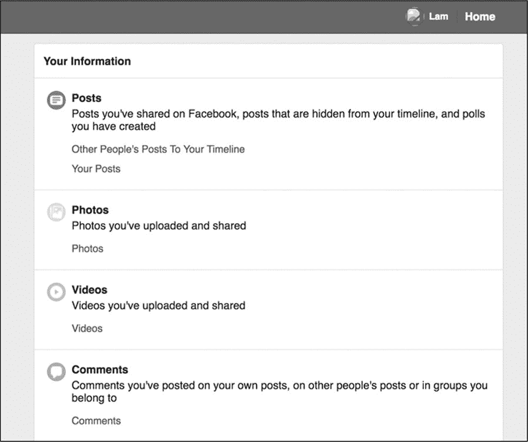
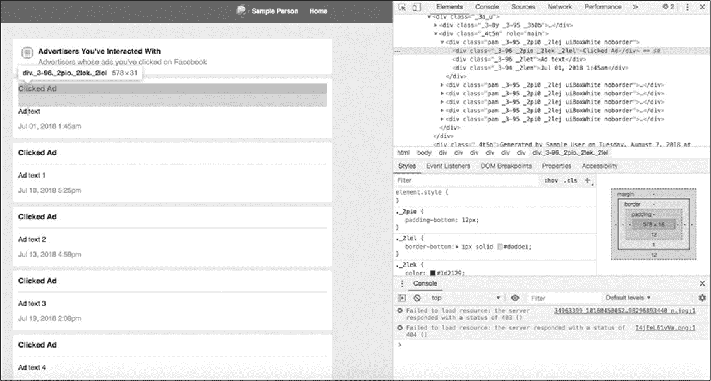
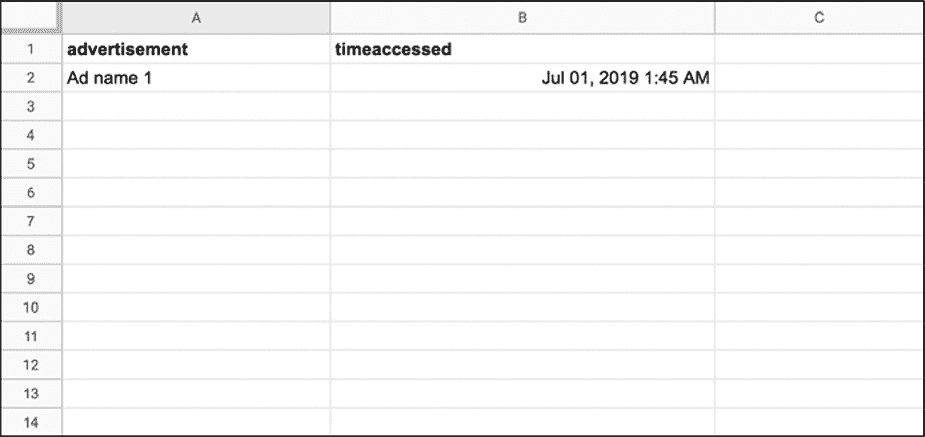

# 4 收集自己的 FACEBOOK 数据
-----------------------------------------------------------------------------------------------

社交媒体正在成为我们生活和记忆的数字金库；它的服务器存储了我们的行为历史，使我们能够以惊人的精度记住重要事件。许多社交媒体平台允许我们以数据文件或 HTML 网页的形式下载我们的社交媒体历史档案。这些档案可能包含我们的 Facebook 时间轴上的帖子，互相发送的消息，或者曾经发过的每一条推文。

在本章中，将要学习如何使用 Python 使用自动抓取工具从可下载的 Facebook 档案中获取数据。抓取工具遍历包含想要收集信息的每个 HTML 元素，然后提取这些信息，将其成行结构后把每一行数据写到一个列表或电子表格中。但这次我们会使用一种稍微不同的方法来填充电子表：在将数据写入 csv 文件之前，使用一个数据字典来构造数据。这是一种非常有用且被广泛采用的组织数据的方法，这种方法将扩展在前一章中使用的 csv 库的知识。

#### 自己的数据源

从注册账号的那一天开始，大多数社交媒体公司就开始存储关于你的数据。一般可以通过在 Facebook 和 Twitter 时间轴或 Instagram
feed 上向后滚动来查看这些数据。

尽管大多数平台允许用户下载大量个人数据，但人们往往不清楚这些数据档案有多完整。如同社交媒体公司希望通过 API 公开发布多少数据一样，这些公司也决定了他们希望向用户发布多少数据以及哪些数据。最重要的是，要弄清楚如何下载关于自己的数据存档时有点困难：下载选项可能隐藏在用户设置的小字中，并且在视觉上通常不显著。

对数据归档的访问因平台而异，可能是粒度非常小的，也可能在时间轴上非常稀疏的。2018 年 5 月，欧盟(EU)的《一般数据保护条例》(General
Data Protection
Regulation，简称 GDPR)生效，要求世界各地的公司保护用户的隐私，部分方法是让它们对自己的数据拥有更多控制权。尽管这些法律的出台主要是为了让欧盟(EU)的用户受益，但许多社交媒体公司已经为欧洲或非欧洲的任何人创建了更容易的途径来下载和查看自己的数据。

在本章中，只使用可下载的社交媒体档案中公开的数据。在本章中将会了解到 web 抓取（scraping），即从 web 收集和存储数据的过程。每个网站都有自己独特的数据挑战。出于本教程的目的，我们将研究如何从 Facebook 获取数据，Facebook 提供各种格式供我们分析。如果你没有 Facebook 账户，读者可以在这里找到一个样本文件：[[*https://github.com/lamthuyvo/social-media-data-book*](https://github.com/lamthuyvo/social-media-data-book)。]{.ul}

#### 下载自己的 Facebook 数据

首先，需要下载数据。许多社交媒体网站上都有下载关于自己档案的说明，但这些说明可能深藏在网站的某处。找到存档的一个简单方法是把这个公式输入搜索引擎：平台/语言+动词+对象。例如，要找到你的 Facebook 档案，可以搜索"Facebook 下载档案"或"Python 抓取 Facebook 档案"。

通过以下步骤下载 Facebook 档案：

1\. 单击任何 Facebook 页面右上角的向下箭头并选择 Settings。

2\. 在左边的侧边栏，点击 Facebook 信息下面的一般帐户设置。

3\. 导航至"下载信息"并单击 View。

4\.
打开浏览器新页面后，其中有一个选项可以创建包含存档的文件。保持默认设置(日期范围：我所有的数据；格式：HTML；媒体质量：中等)，单击创建文件。

接下来会提示输入你的帐户凭证（用户名、密码），然后 Facebook 应该将发送一个可下载文件的链接。

归档文件应该以 ZIP 格式下载。将此文件解压至本项目的文件夹中，打开目录后会看到多个文件和文件夹在一个名为 facebook-\<yourname\>的文件夹中。在作者的例子中，这个文件夹叫做 facebook-
lamthuyvo。

用浏览器打开标题为 index 的文件。在菜单的左侧可以看到下载信息(广告、消息、好友等)的类别，在右侧可以看到帐户信息的概览，如图 4-1 所示。

 

*图 4-1：Facebook 档案页面*

这个文件夹包含了一个更完整的存档，比在网上滚动你的 Facebook 账户时看到的更加完整。在这个文件夹中，可以找到你在 Facebook 上注册的所有电话号码、Facebook 用来标记你和你的朋友的面部识别数据的相关代码，以及你在过去三个月里点击的广告等信息。档案页面应该能让你了解 Facebook 为自己的目的存储的关于你的活动和在线状态的信息类型。

#### 查看数据并检查代码

为了介绍抓取的过程，将从查看在过去三个月点击的广告开始。

抓取的通常过程如下：

> 1\. 查看 web 浏览器中信息的可视显示。
>
> 2\. 检查包含此信息的代码。
>
> 3\. 指示抓取工具从这段代码中获取信息。

首先，在 Facebook 档案中的 ads 文件夹中打开 advisters_you\'ve_interactivated_with.html，这个页面包含在过去三个月点击的每个广告的标题和时间戳。

查看了广告数据之后，就到了第二步：检查代码。为了完成这一点，使用 Chrome 的内置开发工具（提示：第一章）。当 Web
Inspector 打开时应能突出显示刚刚右键单击的广告的代码。图 4-2 显示了 Chrome 中的 Web
Inspector 视图。

 

*图 4-2：Chrome 的 Web Inspector 视图*

Web 页面是 HTML 文件，其中包含 HTML 标记中使用 CSS
id 和类样式设计的信息。当一个页面呈现重复的内容时（比如：新闻提要中出现的文章或数据归档中列出的广告商），该页面可能会使用相同的 HTML 标记和 CSS 类来显示信息片段。为了获取这些 HTML 标记中包含的数据，必须识别和理解这些模式。

###### 结构化信息并输出数据

在本例中，所有的广告都在一个\<div\>标记中，该标记具有 class 属性"\_4t5n"和 role 属性"main"。清单 4-1 包含的 HTML 代码显示了一个 Facebook 广告示例。

*清单 4-1：Facebook 广告的示例代码*

清单 4-1 包含一个以类"\_3-96"和"\_2let"描述的 HTML\<div\>标记（注意！一对引号中的每个类都由一个空格分隔）。这个\<div\>标记包含用户点击的 Facebook 广告的标题。第二个类\<div\>的标记包含时间戳，指示用户点击广告的时间。

如果基于这个 HTML 创建了一个电子表格，可能的情况如图 4-3 所示。

 

*图 4-3：收集了一些数据后生成的电子表格示例*

在表格中采用了广告（*advertisement*）和访问时间（*timeaccessed）*标题来对数据进行分类和结构化。应当注意的是，有很多方法可以做到这一点；可以只选择查看广告的标题，或者将时间戳分隔为*date*和*time_of_day*列。数据收集是一个创造性的过程，找到的解决方案总是取决于正在处理的特定项目和数据。

图 4-3 中的表格是通过直接从 web 页面手动复制数据创建的。虽然可以手动抓取网页数据，但可以想象这样会花很多时间和精力。因此几乎所有的 web 抓取都是自动完成的。在下一节中，介绍使用 Python 设置一个自动抓取工具。

###### 自动化抓取

与脚本一样，可以把抓取工具看作一个小机器人，该机器人将为读者执行重复的任务。如同在第 3 章中使用的脚本一样，抓取工具获取数据并将其放入表格中。与第 3 章中的脚本不同，抓取工具是从 HTML 页面而非 API 响应中获取数据。

与 JSON 不同，HTML 数据的处理有点难度，因为 HTML 不是以友好的方式结构化数据的。那么，制定一个计划会有助于我们确定网站的哪些部分最适合作为数据进行结构化。与在 API 脚本中所做的一样，首先将任务列表写成伪代码，如清单 4-2 所示。

*清单 4-2：计划脚本*

接下来导入所需的库，见清单 4-3。

*清单 4-3：导入库*

对于这个案例，需要两个库：csv(内置于 Python 中)和 Beautiful Soup。Beautiful
Soup 可以让抓取工具阅读和理解 HTML 和 CSS。

因为 Beautiful
Soup 没有内置于 Python 中，所以需要在使用之前单独安装。可以使用 pip 命令安装：*pip
install beautifulsoup4* (beautifulsoup4 指的是 Beautiful
Soup 的第四个版本)。库安装完成后，理解和使用该库的最佳方法是查阅其文档：<https://www.crummy.com/software/BeautifulSoup/bs4/doc/>。

Beautiful
Soup 安装完成后就可以使用了。通常，Python 不能处理 HTML 中的标记（tags），所以用 Python 打开一个 HTML 页面时，信息只是一长串字符和空格：

Beautiful
Soup 从 HTML 和 CSS 代码中提取有用的数据，并将其转换为 Python 可以处理的对象------这一过程称为解析。可以把 Beautiful
Soup 想象成 x 射线护目镜，它能让抓取工具通过 HTML 编码语言进行查看，并将注意力集中在真正感兴趣的内容上(以下代码中用粗体表示)：

使用 Beautiful
Soup 将 HTML 代码转换成一个列表，其中包含每个广告的名称和它被访问的时间。在包含存档的文件夹中创建一个文件，并将其保存为 ad_scraper。然后在 ad_scraper.py 中设置代码的基本结构（见清单 4-4）。

*清单 4-4：创建一个空列表并打开*

第一步，创建变量 rows➊，用于保存数据。然后创建变量 foldername➋，用以保存文件夹的名称（数据所在的目录名），这样在未来如果抓取别人的归档➌可以很容易地修改脚本。然后打开 HTML 文件并将其信息存储在变量 page➍中。

最后，传递 page 至
BeautifulSoup➎()函数中。这个函数将 HTML 解析为可以使用的元素列表；具体的讲，BeautifulSoup()函数把页面转换成一个 BeautifulSoup 对象，这样库就可以区分 HTML 和其他内容。传递给 Beautiful
Soup()的第二个参数是"html.parser"，这个参数告诉 BeautifulSoup 将页面处理为 html。

#### 分析 HTML 代码以识别模式

在本章的前面看到每个广告名都包含在带有类"\_3-96"和"\_2let"的\<div\>标记中。与广告相关联的时间戳存储在具有类"\_3-94"和"\_2lem"的\<div\>标记中。

在清单 4-1 中某些类（如："\_3-96"）可用于其他\<div\>标记，例如包含 Clicked
Ad 一词的副标题。由于使用类来为可以重复使用的\<div\>元素设置样式，因此需要确定对于要抓取的信息类型而言唯一的 CSS 类和标记。也就是说，需要能够指示脚本仅从包含有关 Clicked
Ad 的信息\<div\>标记中获取内容。如果告诉脚本在不指定类的情况下从\<div\>标记中获取信息，则由于\<div\>标记可用于页面上的多种内容类型，因此最终会生成很多无关的信息。

###### 抓取想要的内容

为了得到想要的内容，先要添加一些代码来选择包含想要获取的所有广告名称和时间戳的父（外部）标记。然后进入父\<div\>标记并逐个搜索每个含有广告的相关信息的子\<div\>标记（见表 4-5）。

清单 4-5：使用 BeautifulSoup 选择特定的\<div\>

先找一个包含类 _4t5n➊的\<div\>标记，从清单 4-1 可以知道将包含所有想要抓取的广告信息。soup 是前面代码中解析的 HTML，通过将 find()函数应用到 soup 来查找这个标记。然后把这个函数的结果赋给变量 contents（使用等号）。

若需查找具有特定类的\<div\>标记，find()函数需要两个参数。第一需要知道在寻找哪种 HTML 标记。在本例中是\<div\>标记，通过字符串"div"指定（确保在单词 div 周围保留引号）。

 但是，如果仅使用 soup.find("div")就会检索所有带有"div"参数的 HTML 代码，那么脚本就不会返回正确的\<div\>标记的内容。这样，抓取工具会遍历整个 HTML 文件，找到每个\<div\>标记，然后只返回找到的最后一个。

为了找到具有类"\_4t5n"的\<div\>标记，需要将第二个参数 class="\_4t5n"传递给 find()函数。指定\<div\>标记使用的类有助于获取感兴趣的\<div\>标记中的内容。

遍历所有广告的\<div\>，选中每个包含需要信息的\<div\>标记，然后把这些\<div\>标记包含的内容存储在列表中。在 BeautifulSoup 中可以使用 find_all()函数来做到这一点。使用 find_all()返回带有 uiBoxWhite 类的每个\<div\>标记。该函数以列表形式返回结果，并将其存储在变量 ad_list 中。

###### 提取内容

有了广告信息列表后，就可以获取每个广告的标题和时间戳了。通过使用 for 循环遍历 ad_list 中的每个\<div\>标记并提取其内容。清单 4-6 显示了如何在 Python 中执行此操作。

*清单 4-6：提取 HTML 中\<div\>标记的内容*

第一步，写一个引入 for 循环➊的声明。"for item in
ad_list:"表示逐项遍历列表项，将当前项存储在变量 item 中，然后在 for 循环后面的行中运行指定的流程。在本例中，item 包含一个带有 uiBoxWhite 类的\<div\>标记。

第二步，抓取一个含有类"\_2let"的\<div\>标记，并将其存储在变量 advert➋中。此处不仅仅使用 find()；还通过在行尾调用 get_text()函数将另一个函数链接到 find()函数。Python 以及 Beautiful
Soup 之类的库允许通过在一个函数的末尾调用另一个函数来修改它的结果，这个过程称为**链接**（chaining）。在本例中，find()函数允许我们获取一个类似一下编码的\<div\>：

然后，应用 get_text()函数获取\<div\>标记内包含的文本：

重复以上过程，从含有类"\_2lem"的\<div\>标记➌中提取时间戳信息。刚才让抓取工具干了一大堆活！现在重温一下 HTML 代码，这样就知道抓取工具刚刚解析了哪些信息：

总结一下：抓取工具先找到包含所有广告的\<div\>标记➊，将每个广告信息变成一个列表项➋，然后遍历每个广告信息，从每个嵌套的\<div\>标记中提取其 title（标题）➌和 timestamp（时间戳）➍。

#### 将数据写入表格中

至此，明确了如何使用抓取工具来获得想要的信息。但还没有告诉小机器人如何处理这些信息。这就是 csv 文件可以提供帮助的地方------现在是时候让抓取工具把它所读取的数据转换成人类可以阅读的表格形式了。

###### 构建行列表

与利用 API 获取数据一样，需要指示脚本将每一行数据写入表格中。但是这次是通过创建一个 Python 字典实现这一点，这个数据结构允许我们将特定的数据点(值)分配给特定的数据类别(键)。字典类似于 JSON，因为字典把一个值映射到一个键。

最简单的字典如下所示：

在本例中，使用一对花括号（{}）定义了一个名为 row 的变量。字典中的数据在花括号中(此处添加了一些换行符和空格以使字典更清晰)。

在字典中，值以键-值对的形式存储。在本例中，有两个键"key_1"和"key_2"，每个键都与值"value_1"和"value_2"配对。每个键-值对由逗号分隔，让它们成为两个不同对的列表。可以将键想象成电子表格中的列标题。在本例中，字符串 key_1 表示列标题，value_1 是该列中的一个单元格。这个结构是不是看起来很熟悉，因为这就是 JSON 数据的结构。在某些方面，可以将 Python 字典视为 JSON 格式结构化数据的蓝图。

回到具体示例中，为数据创建一个字典并将其添加到 csv 文件中（见清单 4-7）。

*清单 4-7：把数据写入 csv 文件*

键"advert"和"timeaccessed"➋是字符串，表示想要收集数据中表格的列标题。每个键都与一个变量配对：键"advert"与变量 advert 一起使用，"timeaccessed"键与变量 timeaccessed 一起使用。回想一下，在前面使用这些变量来临时存储使用 Beautiful
Soup 从每个 HTML 元素提取的文本。在变量 row➊中存储该字典。

有了 row 之后，就可以把它与其他行一起存储。这就是在脚本顶部定义的 rows 变量发挥作用的地方。在 for 循环的每次迭代中，使用 append()函数➍向列表 rowszh 中添加数据行。使用这种方法从每个列表项获取最新的值，把这些值分配给适当的键，并把键和值追加到 rows 变量中。整个过程可以在每个循环中累积新的行数据，从而确保提取所有点击过的广告信息，同时确保把这些数据填充到 rows 中，最后把这些数据写入 csv 文件中。

###### 写入 CSV 文件

最后但不是最终，需要打开一个 csv 文件并将每一行写入其中。如前所述，这个过程有点不同于在第 3 章看到的。此处使用 DictWriter()函数代替 csv 库提供的简单 writer()函数，DictWriter()知道如何处理字典数据。这可以避免由于粗心导致的错误，比如：意外地交换列值。

清单 4-8 显示了创建 csv 文件的代码。

*清单 4-8：把数据转换为 csv 文件*

首先，创建并打开一个新文件 facebook---\<lamthuyvo\>-all-advertisers.csv➊，该文件名包含 csv 文件的文件夹的名称。然后打开 csv 文件并将其引用为 csvfile。接下来创建一个名为 fieldnames➋的变量用以存储字符串列表（见清单 4-7）。此处非常重要，因为使用 DictWriter()函数➌让 Python 写入基于字典的数据。DictWriter()函数要求参数 fieldnames 才能知道 csv 文件的列标题，以及应该访问数据行的哪些部分。换句话说，在 fieldnames 变量中列出和存储的字段名表示希望 DictWriter()函数写入 csv 文件中的数据部分。

然后,使用 writeheader()函数➍写入 csv 文件的第一行（每一列的标题）。因为 writer 已经知道了前一行的字段名，就不需要指定任何东西。现在 csv 文件应该如下样子：

剩下的过程就是添加数据。通过遍历 rows 中的每一行➎,可以把每一行的数据写入表格➏。

最后，把所有的部分组合在一起，完成的脚本应如清单 4-9 所示。

*清单 4-9：完整的抓取工具脚本*

代码看上去不错，运行一下试试看！

#### 运行此脚本

在本章的开头，把名为 ad_scraper.py 的脚本保存在包含 Facebook 存档的同一个文件夹中。现在可以像运行任何其他 Python 脚本一样运行它了。在命令行接口中切换到特定的文件夹。对于 Mac 用户，运行以下命令：

对于 Windows 用户，运行一下代码：

运行脚本后，抓取工具应该会浏览过去三个月中您点击过的每个广告，并且应该能看到一个文件名以 all-advertisers.csv 结尾的文件。该文件中包含存档页面 advertisers_you've_interacted_with.html 中列出的每个广告的标题和时间戳。这些数据将帮助您更好地了解您在 Facebook 上的行为。例如，可以使用这个 csv 文件来了解被点击广告的日期或月份。或者，可以调查可能多次点击过的广告。

本章中的示例代表一个非常简单的 Web 抓取版本：抓取的 HTML 页面是可以下载的页面（不是必须通过连接到互联网才能打开的页面），而且从该页面抓取的数据量不大。

如同抓取归档文件一样，对简单的 HTML 页面进行抓取是对 Web 抓取的基本原理的很好介绍。希望，本练习帮助您过渡到抓取更复杂的网站（无论是托管在网络上且经常更改的网页），或结构复杂得多的 HTML 页面。

#### 概要

通过本章学习了如何从 Facebook 档案库中检索 HTML 页面，以便查找 HTML 代码中的模式，这些模式可以将页面上看到的信息构造为数据。学习了如何使用 Beautiful
Soup 库在 HTML 页面中进行读取、识别并获取包含要收集的信息的\<div\>标记，使用字典将这些信息存储在数据行中，最后使用 DictWriter（）函数将其保存为 csv 文件。但更重要的是，学习了如何从网页中提取信息并将其写入数据文件，然后将其输入各种分析工具（例如 Google 表格）或 Python 的网络应用程序（例如 Jupyter
Notebook）中，这两种工具会在后面的章节中介绍。这意味着现在已经锁定在网页中的信息，并将其转换为更易于分析的格式！

在下一章中，以在本章中学到的东西为基础，应用类似的过程来抓取 Internet 上的网站。

