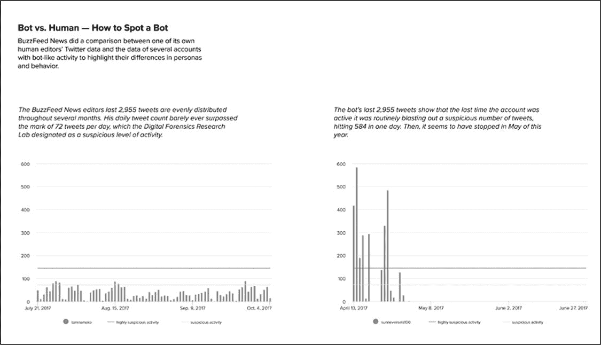
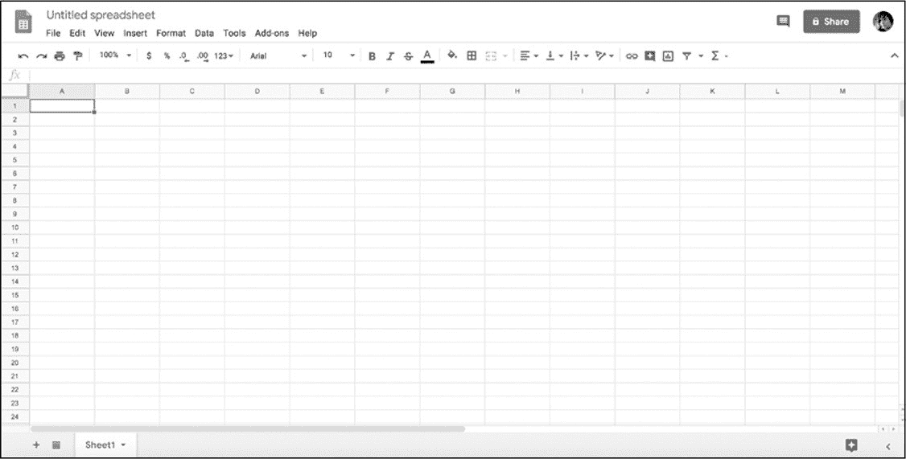
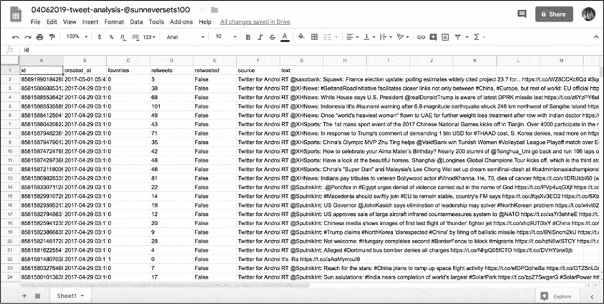
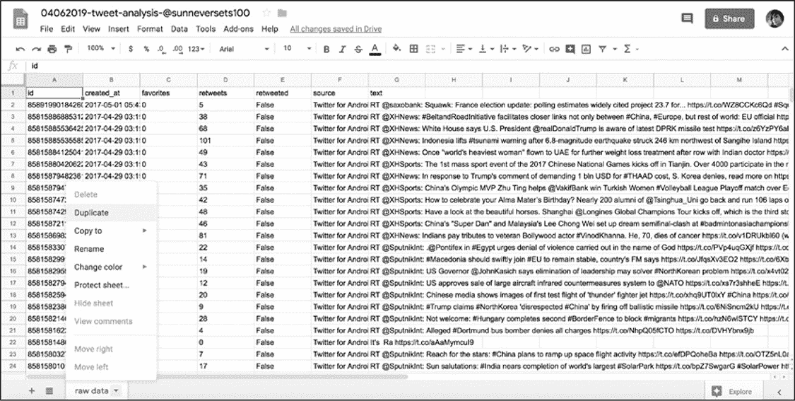
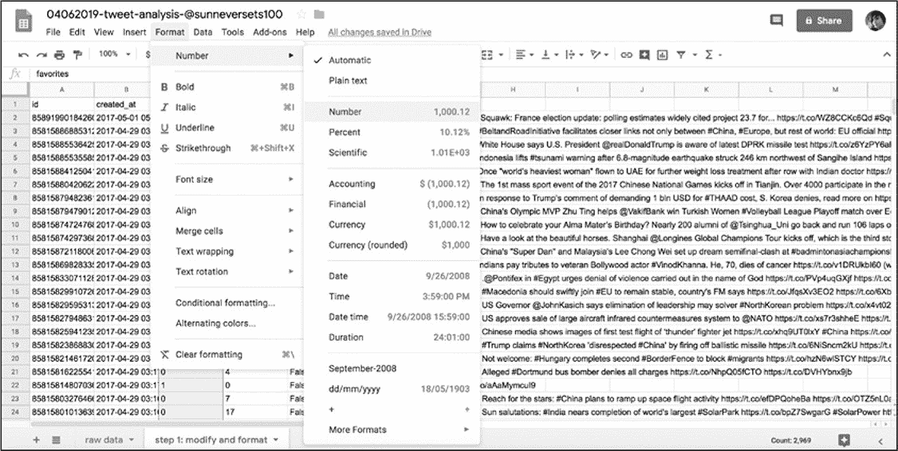
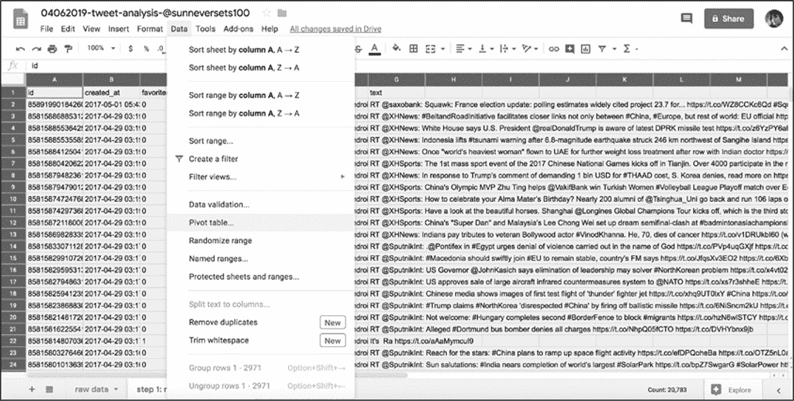
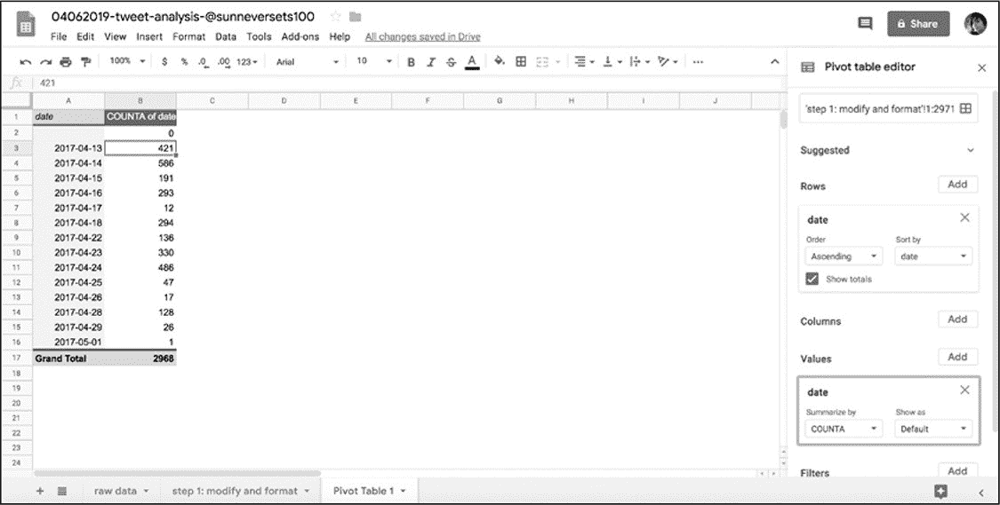
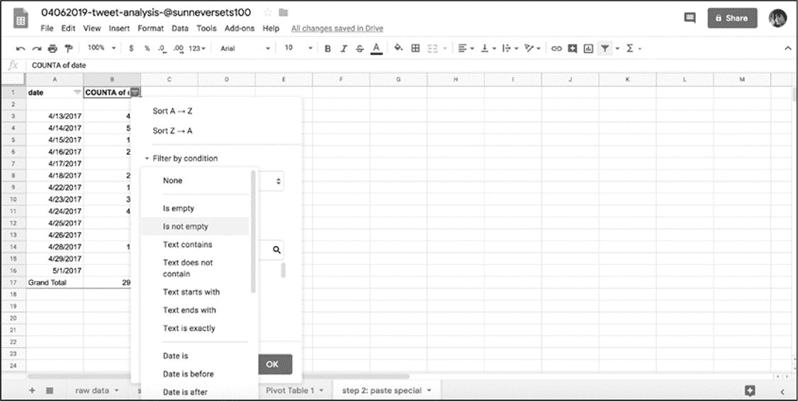
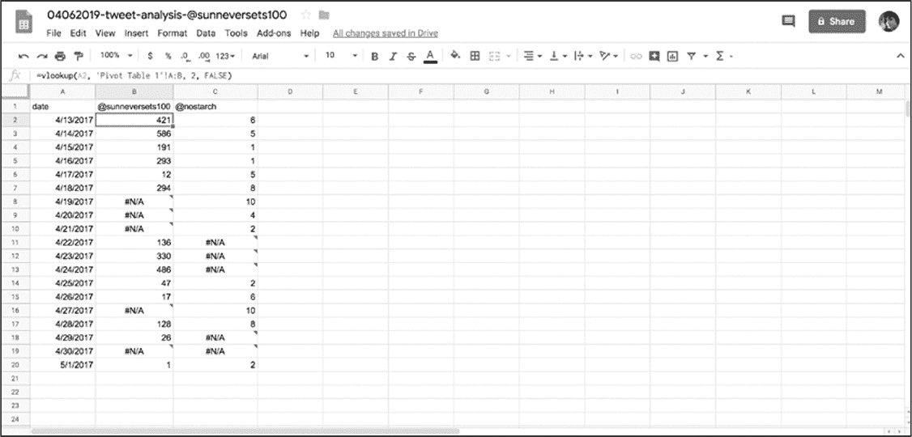
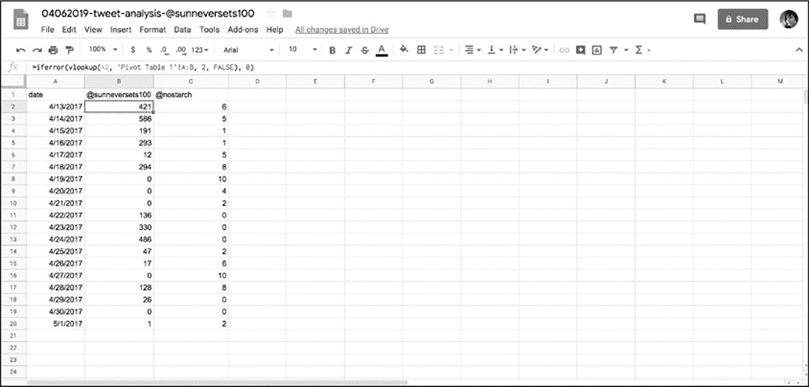

# 6 数据分析导论
-------------------------------------------------------------------------------------

过去的几章致力于寻找和收集数据。但是现在我们有了数据，接下来应该做什么呢？本章会帮助您理解如何进行简单的数据分析。

在很多情况下，术语数据分析描述了一个非常基本的行动：采访一个数据集。与任何采访一样，向该数据集问问题。有时，这些问题并不是特别复杂，比如：某一列从最大到最小值排序。在其他的时候问题可能非常复杂，需要通过运行多个分析来回答。

本章将向读者介绍通过*表格（Sheets）*进行数据分析的基本概念，*表格（sheets）*是一个 Google 基于 web 的程序，谷歌帐户持有人可以免费访问。本章中讨论的大多数特性也可以在 Microsoft
Excel 中找到。

虽然在本章中使用的许多方法和工具可以很容易地在 Python 中实现相同的功能，但是对于初学者来说，在专注于编写代码之前，应先专注于分析的概念步骤。换句话说在以代码形式执行数据分析之前，在类似于 Sheets 或 Excel 的程序中进行数据分析有助于对于数据分析概念的理解。为此，在本章中会将使用各种分析方法来检查两个 Twitter 帐户的活动，并逐步介绍数据分析过程。

#### 数据分析过程

在介绍数据分析过程之前，先要理解一个概念（或者说是假设）：数据集是可靠的事实集合，可以像接收这些数据一样使用它来进行研究。通常认为数据集只是汇总数据，但对汇总数据的发现过程会变得相当混乱，对分析问题或其他原始数据（未处理的数据）数据库的答复也可以千差万别。

美国人口普查局等组织提供的数据表通常已把成千上万的原始数据条目中进行了清理，处置和汇总，其中许多数据条目可能包含数据科学家努力解决的不一致之处。例如，在一张列出人们职业的简单表格中，这些组织可能已经解决了不同但本质上等效的回答，如"attorney"和"lawyer"（都指代律师）。

同样地，在本书中看到的来自社交网络的数据原始数据可能相当不规则，而且很难处理，因为这些数据是由真正的人提供的，每个人都有独特的怪癖和发帖习惯。必须对这些数据进行总结后，才能发现趋势和异常，然后回答提出的问题。这种处理并不一定非常复杂和非常困难；通常仅仅需要我们完成一些简单但相当乏味的任务。

在分析数据的过程中涉及到几种主要的方法。在这一章中看到的内容改编自阿曼达·考克斯 Amanda
Cox 和凯文·奎利 Kevin
Quealy 在纽约大学的数据新闻学课程：http://kpq.github.io/nyu-data-journalism-2014/classes/sort-filter-aggregate-merge/。

> **修改**（**modifying**）和**格式化**（**formatting**）：数据几乎从来都不按照需要的格式来组织的。通过修改和格式化，可以更容易地比较数据中的值。
>
> **聚合**（**aggregating**）：可以通过对格式化的数据应用简单的数学运算来查询数据，这步骤称为聚合。聚合数据可以是在数据列中查找所有值之和的形式，也可以表示对给定值的实例进行计数，例如名称在电子表格中出现的频率。
>
> **排序**（**sorting**）和**过滤**（**filtering**）：有时只想问数据，在任何给定的列或类别中最大或最小值是什么？一般通过对数据进行排序和过滤来回答这些基本问题。例如，通过按降序按钮对电子表格进行排序，就可以轻松地在表格的顶部看到最大值。通过过滤可以找出哪些行共享特定值。
>
> **合并**（**Merging**）：比较两个数据集的最有效技术之一是将它们合并，或将它们组合为一组。

概括地说，这些方法可能不是很直观，但在本章中会使用这些方法来调查和更好地理解两种类型的 Twitter 用户的活动：自动机器人帐户的活动和人类的活动。

#### 机器人识别

社交网络上既有通过社交媒体与朋友联系的真人，也有通过代码控制自动账户的机器人。机器人按照脚本的指示发布内容，这些机器人并不是全部用来制造混论或者实时网络诈骗，比如：一些自动账户会发布令人愉快的俳句，而另一些则会向你发送新闻机构的最新头条。

 在本章中将会学习如何使用谷歌 Sheets 来检查 Twitter 帐户的社交媒体数据，这些数据所属的账户已经被数字法医研究实验室的专家确认为机器人。然后将这些数据与真实社交媒体用户的活动进行比较。

本章中的分析与的 BuzzFeed News 分析非常相似，BuzzFeed
News 通过识别 Twitter 机器人可能显现的各种特征来识别自动账户。图 6-1 展示了 BuzzFeed 制作的两个图表，该图标用来说明机器人和人类活动之间的区别。

*图 6-1：两张图表显示了 2017 年人类活动与异常活跃机器人之间的对比* 

某些人出于经济或政治动机，使用机器人进行在线辩论，并引导对话转向特定的话题。在最坏的情况下，大量的机器人可以用来夸大有多少人持有某种观点。

虽然没有绝对可靠的方法来识别虚假或欺骗性的在线参与者的身份，但最能用于说明如何识别机器人的迹象之一是：一个账户发出的推文超出了人类的能力范围。所以在本实验中，查看机器人和真人的日常活动水平。通过导入、清理、格式化和分析从 Twitter 帐户\@sunneversets100 收集到的帖子的数据集，进行此项实验过程。在此过程中会熟悉谷歌 Sheets 提供的工具。

#### GOOGLE SHEETS 入门

为了使用 Google
Sheets，需要注册一个 Google 帐户。如果之前没有注册相关账户，则可以通过 https://accounts.google.com/SignUp 免费注册一个。完成注册后通过浏览器导航至 Google 云端硬盘（<https://drive.google.com/>）。

如何组织数据非常重要！与编写代码一样，数据分析可能需要多次尝试才能正确，而且可能会需要多个步骤才能完成分析（即：回答问题）。因此，组织数据不仅是为了整洁，也是为了准确。数据越有组织，就越容易跟踪分析的步骤，修改分析方法，并在未来重现分析过程。

首先在 Google
Drive 中创建一个文件夹，此文件夹用来存储与数据分析相关的所有文件。提示：将每个项目都放在一个文件夹中是一个很好的习惯。与脚本中的注释类似，创建不同文件和文件夹是帮助进行分析的一种方式，这些文件和文件夹就像对未来的自己提示当时思维过程的注释。文件夹和注释允许我们和其他人更容易地复制工作，并且可以补充我们为记录数据分析步骤而编写的任何其他注释。在 Google
Drive 新建一个文件夹步骤是：选择 New（新建）▸ Folder（文件夹）。

接下来就是在弹出框中命名新建的文件夹。对数据文件夹和文件有一个明确的命名约定是确保我们和观察者都能清楚地理解文件夹用途的好方法。项目的命名约定由您自己决定，但是要保持一致。作者通常使用日期和一些显示文件夹内容的关键字来命名文件夹，比如:mmddyyyy-related-keywords。在本练习中，可以使用这个约定并将新文件夹命名为 04062019-social-media-exercises。

现在创建一个新的电子表格文件。如果还没有在新文件夹中创建表格文件，可以通过 Google
Drive 的左侧导航栏中创建。

 通过选择：**New** ▸ **Google Sheets** ▸
**Blank
Spreadsheet**创建一个空白的电子表格。完成操作后在浏览器中会弹出一个新选项卡，新电子表格会在新选项卡中被加载(参见图 6-2)。如果之前使用的是微软 Excel，新选项卡中的样子会感到非常熟悉。

*图 6-2：空白表格*

使用与 04062019-social-media-exercises 文件夹相同的约定命名表格文件：04062019-tweet-analysis-\@sunneversets100。

接着就是用数据填充该表格。在本练习中使用用 Twitter
API 下载的来自\@sunneversets100 的数据填充。这些数据是 Python 脚本收集的，可以在 https://github.com/lamthuyvo/social-media-data-scripts/找到有关 Python 脚本的详细信息。数据从 API 收集后以 csv 文件的形式保存，csv 文件格式是 Google
Sheets 能够识别的文件之一。（读者也可以直接下载数据文件：https://github.com/lamthuyvo/social-media-data-book）

若要导入文件，请通过如下操作：**File** ▸ **Import** ▸
**Upload**。当出现提示时，选择上载（**Upload**）功能，切换至含有@
sunneversets100 数据的文件夹，然后上载 csv 文件。

Google Sheets 会要求您选择导入选项。选择导入位置（**Import
Location**），分隔符类型（**Separator
Type**），然后转换数字（**Numbers**）和日期（**Dates**）。然后选择"替换当前工作表（**Replace
Current
Sheet**）"作为导入位置------这就是使用 Twitter 数据填充当前空白工作表的步骤。由于数据格式为 csv 文件，因此选择逗号作为分隔符。还可以让 Google
Sheets 自动检测分隔符，这样操作一般也能正常导入。最后，当 Google
Sheets 要求将文本转换为数字和日期时，请选择**No**。

无论是在 Google
Sheets，Python 或任何其他工具的使用过程中，了解文本转换（**text
conversion**）在进行数据分析时是非常重要的。同样，格式化（在 Google
Sheets 中指的就是"转换文本"）在进行编程时也需要认真的对待。

诸如 Google
Sheets 之类的软件可以识别字符串（字符串：string，文本格式：text）与其他类型的数据（例如整数：integer，浮点数（数字）：float 或日期时间：time）之间的差异。尽管可以根据值的书写方式确定值是代表日期，数字还是单词？但是大多数软件和编程语言无法自动执行此操作，因此通常需要进行复杂的猜测。如果要在导入选项"将文本转换为数字和日期"下选择"是"，则 Google
Sheets 会进行处理，即尝试猜测哪个值是数字，日期或单词。猜测字符串应该是那种类型的数据，在数据分析中一般不让工具自动处理。如需要将邮政编码解释为文本而不是数字，因为尽管邮政编码仅包含数字，但其作用类似于区域的标签。但是，如果把确认邮政编码是那种数据类型的步骤留给 Google
Sheets，则可能会把邮政编码转换为数字，可能导致信息的丢失（如：以零开头的邮政编码会丢失第一位数字 0）。所以当涉及猜测时应尽量少用自动化程序，除非自动化得出的结果是完全符合要求的。

 当完成了前面所有的步骤之后，就会形成一个类似于图 6-3 的电子表格。

*图 6-3：在表格中导入不更改类型的数据*

#### 修改和格式化数据

为了有效地使用 Google Sheets 中的函数，需要让 Google
Sheets 能够正确地识别每个数据列的数据类型，为此要对数据列进行格式化。在开始更改表格之前，首先备份原始的、未更改的数据集。此步操作在进行数据分析时非常重要，可以在接下来的分析过程中发生错误时能够回到原始的数据状态。

由于人类的不可靠性，在分析过程中须反复检查数据操作和计算过程，所以发生问题时应确保可以回到原始的数据集。虽然 Google
Sheets 和其他谷歌产品一样能够自动跟踪文件的变化(见**File ▸ Version
History**)，但也应该保留一份格式容易理解数据的备份，这样就可以在分析时用于参考。当需要查看数据最初的样子时，就不用调出旧版本的表格了。

解决上诉问题最简单的方法就是为数据分析的每个步骤创建一个工作表的副本，并对其重命名（命名规则可参照之前的方式）。当从数据集中创建、更改或删除值或整个列并感觉到错误时尤其有用。因为对数据的破坏性修改后可能很难撤销，因此通过多个工作表跟踪分析步骤从长远来看可以使整个分析过程变得可靠。

 接下来开始对 Google
Sheets 进行操作，首先转到工作表的底部，双击 sheet1
选项卡，把 sheet1 修改成一个描述内容的名称。这是在本例中重命名的第一个工作表原始数据（**raw
data**）。然后复制工作表：单击工作表名称旁边的箭头，并从弹出的菜单中选择**duplicate**（复制），见图 6-4。

*图 6-4：复制表格*

复制完成后会产生第二张表，把新的表格重命名为"**step 1: modify and
format"**。此表就是用于更改格数据类型的表格。在"**step
1**表格"中，通过点击列标题上方的字母，选择包含每个推文特性的列（大部分时候，人们感兴趣的值是 B 列中的时间戳 timestamp），当选中后整列应突出显示为蓝色。然后选择**Format**
▸ **Number** ▸ **Number**，如图 6-5 所示。

此步骤操作会把该列中的每个值从字符串转换为数字。（对 retweets 列重复此操作）

 

*图 6-5：电子表格格式化选项*

之前从 API 获得的时间戳的粒度非常细，该时间戳显示了 Twitter 是如何构造和存储数据的。一般来说数据粒度越细越好，这样就可以各种方式聚合数据：可以看到发送推文的确切时间或者查看发布推文的日期。但是，要运用这些不同类型的数据前需要格式化这些数据。

之前提到过：数据分析通常包括将数据转换为正确格式的乏味且有时让人难受的过程。特别是对于人类创建的数据，需要先清洗数据，然后才能比较值。例如，之前收集的推文文本数据，在分析前需要解析同一单词的各种拼写（例如，"gray"对"grey"）或删除拼写错误和错别字。对于通过代码或由机器人收集的数据，可能需要通过将数据分为不同的部分或找到不同的组合方式来修改数据。以数据的时间戳数据为例，应将一条推文的发布日期与发送日期分开。

现在快速回顾一下任务：分析机器人的 Twitter 活动，用以区别于人类活动。通过查看可疑帐户\@sunneversets100 每天平均发推文次数来进行识别。专家曾说过：与人类发推文相比，机器人活动频率异常高。根据数字取证研究实验室的说法，每天发送推文 72 次以上非常可能是机器人，而每天发送推文 144 次以上可以认定是机器人了。完成数据的格式化后，就可以使用表格来确定\@sunneversets100 的活动水平是否可疑了。

当前数据中的时间戳数据同时显示发布推文的日期和时间，如：2017-05-01
05:43:57。通过计算原始数据中给定日期出现多少次，就可以获得每日发布的 tweets
@ sunneversets100 的计数。为此将使用一种称为透视表（pivot
table）的功能。但是使用数据透视表之前，必须创建一个仅包含每个推文发布的日期数据列。那么就需要删除时间戳中有关时间的信息，仅保留日期信息。

分割文本（现在表格中的时间戳仍是以文本格式存在）的一种简单方法是使用 Data 菜单下的 Split
Text to Columns
Tools。该内置工具通过在列值中查找特征找寻文本的模式，然后一句该模式把值分成两列。这些模式可以类似包括用逗号分隔的姓和名（如"Smith,
Paul"），也可以包括用空格分隔的日期和时间。

进行分割文本操作之前需要在 created_at 列的右侧创建一个空白列。右键单击 created_at 列上方的字母，然后从菜单中选择"**Insert
1 right**"。然后在使用"Split Text to Columns
Tools"工具时，不会覆盖其他数据。选中包含时间戳数据的列，然后选择"**Data**"▸"**Text
to Columns**"。

Google
Sheets 会通过弹出菜单提示选择分隔符（separator），默认为"自动检测"，但是由于可以确定分隔日期和时间的部分是一个空格，因此直接选择"空格"。完成操作后会把数据中空白的左侧值保留在当前列中，把数据中空白的右侧值保存至新建的列中。

此工具最适用于为纯文本格式的数据。回想一下在第一次导入数据时，Google
Sheets 要求将文本转换为数字和日期时选择了"No"。这样就确保了每个数据单元格都被解释为字符串而不是数字或日期。在本例中，最好在把数据格式化为其他数据类型之前，保留数据值的字符串格式然后再进行格式化操作。

为了让 Google
Sheets 知道如何解释数据类型，经常需要重新格式化整个列。如果把数据值格式化为日期（例如 created_at 列中的日期），那么该数据值只能使用"日期（一种特殊的数据类型）"的功能。同样，只能对已经格式化为数字的数据值执行数学运算。

在更改电子表格中其他数据值格式之前，先对刚刚生成的两列数据进行重命名（日期列命名为 date，时间列命名为 time）。完成重命名之后就可以计算在一天之内推送推文的频率了。

#### 聚合数据

通过之前的操作（导入数据、修改数据、格式化数据）之后，就完成了数据分析的必要且基本的步骤。在准备好数据之后，就可以进行下一步操作：**聚合数据**（也称之为：汇总数据）。在 Google
Sheets 中可以使用两个功能实现数据的聚合：数据透视表和公式。

###### 使用数据透视表汇总数据

如果读者使用过 Microsoft
Excel 之类软件，应该数据透视表是一个非常强大的工具，那么在 Google
Sheets 也是。数据透视表能够汇总大量详细数据并以各种方式对其进行分析。例如，计算术语在列中出现的次数，或者根据日期或类别计算数值的总和。换句话说，数据透视表可以在易于浏览的介面中鸟瞰大量资料。要实现上述的功能，需要创建一个汇总表，该表包括有关原始数据的统计信息，例如某个列中某个值出现的总次数。

现在使用数据透视表在 Twitter 数据集中找到每个日期的频率。由于数据集中的每一行代表有关单个推文的信息，因此特定日期出现的次数也代表在任何给定日期\@sunneversets100 帐户推送的推文数量。

进行此项分析时，先要选择要包含在数据透视表中的数据。选中"step
2"中的所有数据，然后在菜单中选择"**Data**"▸"**Pivot
Table...**"（见图 6-6），并在要求插入数据透视表的位置时选择选项表。完成之后会在 Google
Sheets 中看到一个名为"***Pivot Table 1***"的新表。

*图 6-6：在"Data"菜单中创建数据透视表* 

在***Pivot Table 1***表的右侧，Google
Sheets 提供了许多选项来填充数据透视表，在本例中用日期进行填充。

选择**Rows**▸**Add**，然后从下拉菜单中选择 date 列，Google
Sheets 会为数据集中出现的每个日期创建一行。然后需要告诉数据透视表如何对日期进行汇总（如：计数等）。

本例中需要计算每个唯一日期发送了多少次推文。单击**Values**▸**Add**，然后再次选择 date 列，然后选择希望 Google
Sheets 对数据执行的汇总类型。此时有两个选项可能符合分析要求：COUNT 和 COUNTA。由于 COUNT 仅适用于数字格式的数据，因此选择 COUNTA。一般来说，可以把 COUNTA 视为可以计数任何东西的工具。

 完成上述操作后，数据透视表就显示出数据集中每个日期发送推文的次数（图 6-7）。采用数据透视表就可以对\@sunneversets100 帐户进行初始评估。之前提到过，一天发送推文 72 次以上的帐户是可能时机器人，而发送 144 次以上的帐户是基本可以确认时机器人。那么现在的问题：该帐户是否存在每天发送 72 次以上的情况呢？是否有发送 144 次以上的情况？
通过查阅数据透视表可以看到，在最繁忙的一天该帐户发布了 586 次推文，这表面\@sunneversets100 账户在 24 小时内大约每 2.5 分钟发布一次推文，乍听起来好像是一个普通人只想与世界分享想法的事情。

*图 6-7：使用 COUNTA 生成的数据透视表来查找每个日期的出现频率*

###### 使用公式进行数学运算

在刚刚的操作中仅仅使用数据透视表来回答一个关于数据的重要问题：一个特定的 Twitter 帐户每天发推文的频率是多少？从汇总的数据中可以看到机器人在推特上发送推文的次数相对于人类用户来说是非常的高。但是人们在 Twitter 上发送推文的行为每天都在变化。即使一个账户一天发 72 次或更多的推文，也并不一定意味着这个账户可能是机器人。

如果还需要找出该帐户每天发送推文的平均数量，那么就要使用一个新特性来回答该问题------公式（formulas）!

一般来说，可以把公式看作是 Google Sheets 中内置的函数。Google
Sheets 通过等号（=）区分普通数据和公式。所有公式均由等号，函数名称以及括号组成，例如"=lower（A2）"。

如果在 Excel 或工作表中使用公式，那么就已经在做基本的编码（code）了。与 Python 函数一样，公式有严格的规则（即语法），接受参数并允许基于这些规则和参数之间的交互创建新值。

比如第 1 章中查找字符串的长度的 Python 函数 len()：

Google Sheets 也有公式**len**实现同样的功能。

在写入该公式的 Google
sheets 的单元格中会显示 9，这个 9 代表了刚才字符串的长度（空格也算一个字符）。

在 Google
Sheets 中可以把单元格作为参数传递给公式。要使用一个单元格作为参数的方法是使用单元格在电子表格中的坐标（列字母和行号：可以在电子表格的顶部和左侧找到）。

在第一列的第二个单元格（也就是：在列 A 和行 2 中）中输入 apple
pie。通过把刚才公式中的"apple
pie"替换为单元格坐标 A2 来显示这个字符串的长度(注意！在使用单元格坐标时不使用引号，这点与 Microsoft 的不同)：

还可以把多个单元传递给某些公式。选择多个单元格的语法根据要选择的单元格而改变。

回到数据分析案例，想要找到@
sunneversets100 帐户发布的平均帖子数。可以使用恰当命名的=average()公式来执行此操作。

average()公式可以接收一组单元格并得出这些单元格值的平均值。该公式可以选择单个单元格或范围内的单元格。例如，通过向 average()公式传递一个单元格列表（每个单元格坐标之间用逗号隔开），就可以获取数据透视表中所有单元格的平均值：

使用 average()公式更方便的方法是使用冒号选择一系列连续的单元格。选择的范围是从在冒号之前指定的单元格开始至冒号之后指定的单元格中的所有单元格。

要获得单元格 B2 至 B15 的平均值，可以直接使用如下方式：

要选择整个列时就不需要指定行号：=average(A:A)，对于整行也是一样：=average(2:2)。Google
Sheets 还可以从同一文件的不同工作表中选择单元格，方法是：用引号和感叹号指定工作表名称（=average("sheet1"!A:A)）。

选择单元格的最后一种方法是使用鼠标。在一个空单元格输入等号（=）写入公式，然后进入括号内后用鼠标选择要输入的公式的单元格即可。在此步骤的练习中使用"=len()"公式作为示例。输入公式后，使用鼠标选择要传递给该公式的单元格。这边选择刚刚输入字符串"apple
pie"的单元格 A2，"回车 Enter"之后就能看到在单元格 A2 的字符串的长度 9。

解了公式的工作原理后，回到 Twitter 分析中并应用所刚刚学到的知识。打开数据之前创建的透视表，然后把公式=average(B2:B15)输入到一个空单元格中。按下回车键后就可以看到\@sunneversets100 帐户每天的平均推文数量为 212，这个平均值仍然非常高。

Google
Sheets 包含很多类似的公式。例如，如果在一个单元格中输入公式=sum()并选择一列数字，就可以得到这些值的总和。

公式的优点是：可以把公式复制并粘贴到多个单元格中，这样就可以对几列或几行数据执行相同的操作。Google
Sheets 还能进行智能复制和粘贴。要查看其工作原理，请返回到"*step 1: modify
and format*"工作表。

假设要测量电子表格中每条推文的长度。在 H 列的右侧创建一个包含每个推文文本的新列，然后把公式=len(H2)输入到单元格 I2 中，然后把该公式粘贴到 I2 之后的所有行中，Google
Sheets 就能给出每个推文的长度。发生这种情况是因为 Google
Sheets 并不只是复制公式的实际字符，还因为 Google
Sheets 具有内置的逻辑可以更改与应用公式的单元格有关的公式参数。

本书并不涵盖 Google Sheets 提供的所有公式，但是应牢记一个便捷工具：Google
Sheets 检测到正在使用公式时显示的小帮助程序窗口。当开始输入公式时该窗口会自动弹出，通常会显示有关该公式采用的参数类型的信息、提供有关如何使用该公式的示例、并说明该公式输出的数据（图 6-8）。

使用数据透视表和公式就可以执行数据分析的简单操作，只需单击几下即可回答有关数据集的问题。更重要的是也可以通过其他多种方式回答数据查询问题。

 

*图 6-8：Google Sheets 弹出式公式帮助器窗口*

#### 排序和筛选数据

至此知道了如何导入、修改和汇总数据，下一步是对结果进行排序和过滤，以便对数据进行排名或分离操作。

从最大到最小（或反之亦然）对数据进行排序是一种为结果分配层次结构的好方法。在本章的案例中，可以对数据透视表中的数据进行排序，以便了解可疑的机器人帐户发送推文最多的一天的发送频率。要实现排序功能的一种方法是通过使用汇总结果创建一个新工作表并将整个工作表更改为*filter*（过滤器）视图。

首先通过拖动鼠标选中数据透视表的结果。高亮显示单元格后，右键单击其中一个高亮单元格并选择 copy(或 Mac 使用快捷方式 CMD-C,
PC 使用 CTRL-C)来复制所选内容。

然后创建一个用于对数据透视表数据进行排序的新工作表。通过使用一个名为*paste
special（在 Microsoft
Excel 中"选择性粘贴"）*的方法用数据透视表的结果填充这个工作表。

因为直接在 Google
Sheets 中复制会将公式和数据透视表的功能复制到新的表格中，所以就无法修改数据透视表中的实际值。不过 Google
Sheets 可以根据公式和数据透视表的结果粘贴值。右击新表的第一行和第一列的单元格，选择**Paste
Special** ▸ **Paste Values Only**（仅粘贴值）。当使用 Paste
Special 粘贴这些值时，这些值会被删除任何格式。这表明复制并粘贴到新单元格中的日期可以格式化为整数型字符串。若要重新格式化为日期，可以使用鼠标选中包含日期的单元格，右击其中一个高亮的单元格，然后选择**Format**
▸ **Number** ▸ **Date**。

 现在选中要转换为*filter*视图的数据，选择当前工作表中的所有数据的最简单方法是单击第一列旁边和第一行上面的空白矩形。接下来，单击过滤器图标旁边的小箭头(看起来像一个漏斗)，选择 Create
New filter View(图 6-9)。

*图 6-9：Google Drive 中筛选视图选项*

Filter
View（筛选视图）工具可以访问每个列的各种功能，比如根据值或条件过滤数据(如：只显示大于 100 的值)，还可以对数据进行排序。这个工具不会修改数据集------只会改变显示数据的顺序或者数据的哪些部分是可见的(当过滤值时不会删除值，这些值只是在应用过滤器时被隐藏了)。

在使用筛选视图工具前，先了解一下筛选视图工具的选项。在筛选视图中通过单击每个列标题旁边的三角形，可以对电子表格进行筛选。可以在每个列中选择和取消选择值，并根据是否包含某个值隐藏或显示行。

如果只对数据的一个子集感兴趣，筛选就非常有用了。筛选通常用于根据最小或最大阈值或特定时间段来分离原始数据。筛选视图工具的选项还可以帮助我们对数据集提出更具体的问题。例如在推文的分析中，可能只对至少有 100 个转发的推文感兴趣，或者希望查看某个特定月份内发布的推文。

筛选视图工具还可以根据条件筛选值------这是在前面学习 Python 时讨论过的概念。Google
Sheets 的筛选视图工具中内置了许多方便的条件，可以根据相当简单步骤筛选数据。如按照 Condition
Cell Not Empty 选项来选择筛选器后表格会只显示有数据的单元格(图 6-10)。

 

*图 6-10：Google Drive 上的筛选选项*

最后，使用 Sort A→Z（升序排序）和 Sort
Z→A（降序排序）选项对数据进行排序。Sort
A→Z：从最小的数值到最大的，从最早的日期到最近的日期，或按字母顺序从 A 到 Z。Sort
Z→A 按降序对数据进行排序，与升序相反。

对数据集进行排序能帮助回答所面临的许多研究问题之一。在 Twitter 分析中可能包括以下问题：这个账户最早发送的推文是什么？最近怎么样？哪条推文最受欢迎？哪个转发最多？现在尝试筛选数据来回答这些问题。

#### 合并数据集

在数据分析过程中将讨论的最后一种方法是合并（merge）或联接（join）数据集。通过使用 Google
Sheets 等工具把一个数据集与另一个数据集进行比较是非常有效的方法。通过合并两个工作表，可以很容易地比较同一类型的值。

在进行相应的合并操作之前，应非常谨慎地判断数据集之间的关系：**相关关系不等于因果关系**。这表明着即使两个数据集看起来有关系，也就是说是相关的，但并不意味着一个数据集导致了另一个数据集的结果。数据集之间的相关性和因果关系应该得到来自报告、专家或实地研究的其他研究的支持。即使是两个或多个数据集之间最简单的比较也能难说明问题。

那么，如何操作才能合并 Google
Sheets 中的两个表呢？使用一个=vlookup()的公式来实现交叉引用两个表格，然后按照一个公共值将其合并。想要实现通过引用一个值在将其当作字典的表中进行查找时可以使用 vlookup()公式。

例如，要把\@sunneversets100 账户与真实人类账户在 2017 年的头两个星期内操作的推文活动进行比较，可以使用自己的帐户信息执行与\@sunneversets100 相同的步骤。如果您没有 Twitter 帐户，则可以下载其他账户电子表格的副本（https://github.com/lamthuyvo/social-media-data-book），此副本中包含有关人力管理的\@nostarch 帐户信息（<https://twitter.com/nostarch/>）。

要合并两个电子表格，先在 Google
Sheets 中创建另一个表。在这个例子中用 2017 年上半年\@sunneversets100 账户的数据填充新建的表。可以把一个列命名为 merged_counts_sunneversets100\_\<account\>，其中\<account\>表示是由人控制的 Twitter 帐户名称。

对于时间序列的列，重命名为 date，然后填充日期数据。从 A2 单元格开始，最早的日期是 2017 年 4 月 13 日，然后在 A3 单元格输入 2017 年 4 月 14 日。想要 date 列中的其余行也填入日期，直至 2017 年 5 月 1 日，可以使用一些方便的表单功能来填充列的其余部分。输入两个日期后选中它，然后把鼠标移到选中第二个单元格的右下角，直到光标变成一个小十字，然后双击或拖动十字到第 20 行。Google
Sheets 将根据在前两个单元中检测到的模式自动调整行。

接下来使用=vlookup()公式把\@sunneversets100 账户的推文数据透视表与包含日期的工作表合并。在此之前，请在日期列旁边为\@sunneversets100 账户的每日推文计数设置一个新列。

vlookup()公式中使用四个参数。首先是查找哪个值：

在本例中，A2 单元应该包含时间序列中的第一个日期，即 2017 年 4 月 13 日。第二个参数是指哪个范围表示引用表或字典。

在此例中，第二个参数表示在此范围中查找单元格 A2 中的值(4/13/2017)。用字符串指定包含查找表的工作表的名称和\@sunneversets100 的推文的每日计数(在本例中为\'Pivot
table 1\')，然后用一个感叹号(!)表示\'Pivot table
1\'是不同于正在输入公式表的另一个工作表的名称。之后，就像前面选择单元格一样，我们需要指定查找表的值所在的列，在本例中是 A 和 B 列，在公式中表示为"A:B"。

选择的范围应包括用于连接数据集的列（A 列中的日期）以及要用于填充新表和合并表的值（B 列中的计数）。在这种情况下，应确保 A 列中包含日期，公式试图在该列中的 A2 单元格（4/13/2017）中查找所表示的日期。对于数据透视表始终应确保被选择范围内的第一列包含要查找的值。

Google Sheets 在"Pivot table
1"的 A 列中找到单元格 A2 中表示的日期后，会检查包含日期 4/13/2017 的行，然后在该行中查找值，查找到的值会显示在合并数据集中。vlookup()公式的第三个参数就是指定想要查找的值：需要告诉 vlookup()哪一列包含要被拼接到新合并表中的值。而且更加复杂的是：vlookup()需要知道该列相对于被选中范围中第一列的位置。在此例中，该数据位于 date 旁边的列中，该列在被选中的范围内相对于 date 是第 2 列。

到目前为止借助 vlookup()公式，已可以让 Google
Sheets 记住单元格 A2 中的日期。然后让 Google Sheets 转到"Pivot table
1"并筛选 A 列中的日期查找 B 列中的数据。一旦 vlookup()公式在 A 列中找到包含日期的行，要求公式转到通过选择中的范围('Pivot
table 1'! A：B)的相对第二列。

第四个参数是让 vlookup（）公式按照所查找的范围是否已按照与为数据合并创建的表相同的顺序排序。此处填入 FALSE（为了安全起见，最好将其设置为 FALSE，因为选择此选项将返回正确的结果，即使查找表的排序与当前表的排序相同）。*这个参数于 Microsoft
Excel 的 vlookup 函数的定义不同，如果读者采用 Excel 作为分析工具，那么请查看 vlookup 函数在 Excel 中的具体用例。*

要在指定的时间范围内(2017 年 4 月 13 日到 5 月 1 日)在整个列中运行这个公式，可以复制并粘贴到整个列中。如前所述，Google
Sheets 支持智能复制和粘贴，可以为每个不同日期运行公式。

完成上诉操作后，\@sunneversets100 列中的单元格应该包含一系列公式。

 如果对人类 Twitter 帐户信息重复对\@sunneversets100 账户的上述操作过程，会得到一个新的合并表，此表可以让我们并排查看数据（图 6-11）。

*图 6-11：vlookup()公式在无法从查找表检索数据的单元格中呈现错误*

从图 6-11 中可以看到，其中一些结果是\#N/A，表明公式返回了一个错误。这是因为数据透视表生成的一些日期没有相应的数据，发生错误的日期是账户\@sunneversets100 或人类账户没有发送推文的日期。

为了消除这些错误采用数值 0 填充包含\#N/A 的单元格。一种方法是把当前的公式修改成在出现错误时能够自动处理。让公式能够避免错误的概念在数据分析的过程中很重要，因为在程序员的工作过程错误总是反复出现。

 Google
Sheets 提供了一个可以修正错误的公式 iferror()。iferror()公式有两个参数，第一个是在单元格上运行的公式------在本例中是 vlookup()。由于已经编写了 vlookup()，所以只需把它及其参数嵌套在 iferror()公式中。

iferror()的第二个参数是在第一个参数返回错误时，Google
Sheets 需要返回的值。在本例中在 vlookup()回退值发生错误时返回 0。最终的 iferror()应同如：

完成编辑公式及将其复制到两个列中后并排显示两个列数据应如见图 6-12 所示。

 从途中可以看到机器人发出的推文比人类账户的多得多。虽然这不是最具统计代表性的分析，但这些数据仍然可以帮助理解自动账户与真实人类账户的区别。

*图 6-12：完成的电子表格示例*

此外本节还显示了一些非常重要的原则。现在知道了对数据需要进行修改和格式化，才能够让计算机能够处理这些数据。还了解了如何把原始数据合并到相同类型的更大的数据集中。同时了解到通过显示层次结构，对数据进行排序和过滤可以使分析更加清晰。这些概念原则会在使用 Google
Sheets 和 Python 进行数据分析的过程中发挥重要作用。当您想要继续扩展作为数据分析师的技能时，这些原则应该能够指导分析的思维过程。

#### 使用 Google Sheets 的另一种方法

本章介绍了 Google
Sheets 的许多功能，但是这个应用程序还有许多其他的功能在本书中没有讨论。Google 有一个手册详细介绍了这些功能：*https://support.google.com/docs/answer/6000292?hl=en&ref_topic=281
806/* 。

值得读者进一步研究的是：表格中其他可用的公式。一些使用频率较高的公式被用来处理字符串或进行数学计算：[*<https://support.google.com/docs/table/25273/>*
。]{.ul}

最后，如果发现自己重复地执行相同的任务，或者想要编写自定义函数。以下是如何做到这一点的简单介绍：*https://developers.google.com/apps-
script/guides/sheets/functions/*。

Google
Sheets 能够处理大量的简单分析，并且具有丰富的在线资源，基本可以满足需求。但也有局限性，尤其是在处理大量数据时会卡死或者变慢。在后面的章节中会介绍 Python 的 Pandas 库，到时会使用该库进行一些与本章相类似的分析，但是用于分析的数据量要大得多。

#### 概要

在本章中，了解了如何使用 Google
Sheets 进行简单的数据分析，学习了如何导入和组织数据表中的数据，如何询问数据集的特定问题，以及如何通过修改、排序、晒暖和聚合数据来回答这些问题。

在下一章中会在本章开始分析的基础上，学习如何更好地利用视觉效果来理解分析过程中的发现，将使用条件格式和图表等工具来更有效地解释和传递结果。

