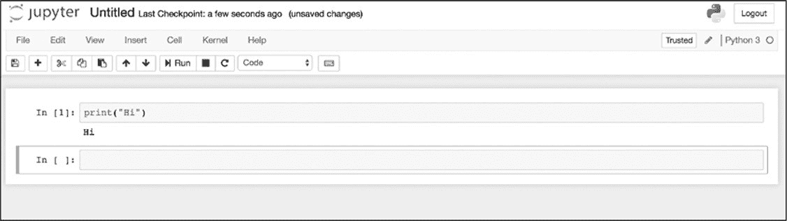
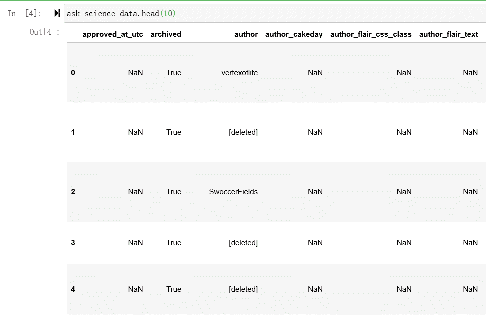

# 8 数据分析的高级工具
----------------------------------------------------------------------------------------------------------

在前一章中，了解了通过使用诸如 Google
Sheets 之类的简单工具，可以分析数千行来自机器人活动的数据。虽然 Microsoft
Excel 和 Google
Sheets 可以处理大量数据(Excel 有超过 100 万行和 16,000 列，谷歌有 400,000 个单元格)，但这些工具可能不适合对数百万或数十亿行复杂的数据进行分析。

在网络上用户每天创建数十亿的帖子、推文、回复和其他类型的在线数据。处理如此体量的信息对于想要在更大范围内调查人类网络行为的数据侦探来非常重要。为此需要熟悉能够处理大型数据文件的编程分析工具。即使您不经常使用这些工具，在决定使用哪种工具时，了解这些工具的功能也是非常有用的。

本章中将会练习使用 Python 读取和研究数据。在此过程中，您将了解更多与编程相关的工具和概念，读者将学习如何设置虚拟环境，这是一种使用库的本地化方式。在此之后，将会展示如何使用应用程序 Jupyter
Notebook，该界面可用于编写和修改代码、输出结果以及呈现文本和图表。最后会安装一个能够进行统计分析的 Python 库------Pandas。如同在前几章中的学习过程一样，读者将通过一个实际的练习来吸收所有这些新知识------提取和探索 Reddit 数据。

#### 使用 Jupyter Notebook

在前面的章节中通过命令行接口（CLI）和脚本使用了 Python。对于读者来说，这是一种快速且直接地熟悉编程语言的好方法。

但是，当使用 Python 技能并编辑更复杂的脚本时，应该尝试使那些更容易管理分析项目、结构化和可共享的工具。因为脚本越复杂，跟踪分析的每个步骤就越困难。

本节是学习如何使用 Jupyter
Notebook 的地方。Jupyter 是一个开源 Web 应用程序，可在计算机上本地运行，并在 Chrome 之类的浏览器中呈现。Jupyter
Notebook 可以一次运行多行代码，或以块的形式运行脚本，这样在迭代和改进代码时更容易调整部分代码。Jupyter
Notebook 程序是从 Web 应用程序 IPython
Notebooks 演变而来的，其创建目的：容纳三种编程语言（Julia，Python 和 R（Ju-Pyt-R）），但此后演变为能够支持许多其他编程语言。

Jupyter
Notebook 也被许多不同领域的数据科学家使用，包括：处理各种数字来提高网站性能的人、社会学家研究人口信息等等。使用 Jupyter
Notebook 的好处是：数据科学家和研究人员可以把他们的 Jupyter Notebook
(通常以详细和注释性的分析为特色)放在像 GitHub 这样的代码共享平台上，让像您这样的初学者更容易地复制他们的研究。

###### 设置虚拟环境

想要使用 Jupyter
Notebook，需要学习三个重要的概念，这些概念会让您的编码技能提升到一个新的水平。

首先要能够创建和理解虚拟环境。虚拟环境（Virtual
Environment）这个词可能很难让人理解，所以从虚拟环境的用途开始。

正如前几章中学习到的，每次要使用库时必须通过在命令行接口(CLI)中输入命令来导入。每个库都安装在计算机上，在卸载之前会一直停留在那里。

对于刚刚开始使用库的 Python 开发人员，他们的工作可能只需要一个或两个库就能完成。但随着您成为一个更成熟的研究人员时，就需要越来越多的库来处理不同的任务。例如：一些任务可能需要一个能够识别 PDF 图像文件中文本的库，而另一些任务可能需要一个能够对一个网站进行截屏的库。当提高技能并处理更多不同的项目时，可能需要在计算机上安装越来越多的库，库之间可能存在冲突。虚拟环境就是解决这种冲突的工具。

虚拟环境通过把库安装在指定的环境中来解决冲突的问题。可以把它想象成为每个项目创建的平行宇宙，可以在不影响计算机整体环境的情况下进行实验。虚拟环境就像计算机内部的另一台计算机，能够利用编程库的强大功能，而不必担心这些库与计算机的其他部分发生冲突。

尽管可以使用各种第三方工具来创建虚拟环境，但在本项目中使用 Python
3 的内置虚拟环境工具。不过，首先需要创建一个 python_scripts 项目文件夹来存储的 Jupyter
Notebook。之后打开命令行接口并切换至该文件夹。例如：把 python_scripts 文件夹存在 Mac 系统的 Documents 文件夹中时可以在命令行接口中输入命令，然后回车：

在 Windows 系统则输入如下命令，注意其中的区别：

切换至该文件夹后就可以通过运行一个命令来创建虚拟环境，如果是 Mac 系统：

在 Windows 系统则输入：

对创建虚拟环境的命令进行分解：首先告知命令行接口在 Mac 上使用 python3（PC 上使用 python）命令。接着是参数-m，告诉 python3 调用内置于 Python 中的模块。本命令中使用了虚拟环境模块 venv。最后给虚拟环境起了一个名字 myvenv。

运行该命令后应会在 python_scripts 文件夹中创建一个名称为 myvenv 的文件夹。在 myvenv 文件夹中会安装所有将要使用到的库。

至此虚拟环境设置完成了。但是想要进入该虚拟环境需要将其激活。可以通过在命令行接口中输入相关命令来激活和关闭虚拟环境。

如果命令行接口仍在 python_scripts 文件夹中，只需输入：

同样对该命令进行分解后分别理解。source 是 Mac 系统一个内置的命令，目的是运行指定的路径中包含的源代码(source 命令也可以用句点替换，所以代码".
myvenv/bin/activate"同样有效)。在此命令中，路径是 myvenv/bin/activate，该路径告诉计算机切换至当前目录中 myvenv 文件夹，然后切换至 myvenv 中的 bin 文件夹，最后运行 bin 中的 activate 文件。activate 文件包含一个用来激活虚拟环境的脚本。

命令运行完成后虚拟环境就被激活了！通过查看命令行接口来判断是否已激活：命令行接口的提示符应该以字符串（myvenv）开头。要停用或关闭虚拟环境，只需输入命令 deactivate，命令行接口的提示符的字符串（myvenv）就会消失。

###### 组织 Notebook

尽管不需要遵循特定的文件夹结构，但尽早组织输入数据、Notebook 文件和输出数据，可以防止以后进行分析时出错。因为尽早养成良好的习惯比以后破坏习惯容易。

现在创建三个单独的文件夹，这些文件夹存储在 python_scripts 文件夹中，但不在 myvenv 文件夹中。首先创建一个名为 data 的文件夹来存储输入数据，其中包含已从 API 或网站接收，下载或抓取的数据文件。然后创建一个 output 文件夹，其中将包含分析过程中导出的任何电子表格。在本书中的例子中不会创建电子表格，但是对于数据分析师来说，拥有一个 output 文件夹是一种很好的常规做法。在"使用系列和数据框架"中介绍 pandas 库时使用一个名为.to_csv()的简单函数，该函数到处有关分析的 csv 文件。最后把 Jupyter
Notebook 创建的文件保存在一个名为 notebooks 的文件夹中。

可以在计算机上手动创建这些文件夹或目录，但也可以使用 mkdir 命令以编码的方式创建。在命令行接口中切换至 python_scripts 文件夹（如果仍位于 myvenv 文件夹中，请使用"cd
.."向上移动）并输入以下三行：

命令 mkdir 采用指定的名称创建目录。完成这三个命令会创建刚才描述的三个文件夹。或者，可以使用 mkdir 后跟所有三个用空格分隔文件夹名称，如下所示：

###### 安装 Jupyter 并创建第一个 Notebook

Jupyter 可以创建 Notebook 文档，此类文档可以读取不同种类的代码，如：Python 和 Markdown（用于格式化文档的语言）等。由于 Notebook 能够读取各种编程语言，因此 Notebook 可以将 Python 代码的结果与 Markdown 文本一起呈现，从而使程序员更易于注释其分析。

像其他 Python 库一样通过 pip 从网上下载 Jupyter
Notebook 并安装本地的计算机上。安装 Jupyter Notebook 的命令如下：

安装过程结束后，通过在命令行接口中输入以下命令打开 Jupyter Notebook：

 输入此命令后，Jupyter
Notebook 将启动本地服务器（该服务器仅在本地计算机上运行），并在默认的 Web 浏览器中打开一个窗口（作者的默认浏览器为 Chrome，如[[图 8-1](#_bookmark293)所示]{.ul}。读者打开的应该时自己经常使用的浏览器）。

*图 8-1：Jupyter 界面*

在这个界面里可以切换至工作文件夹并在其中创建文件。切换至 notebooks 文件夹中，从下拉菜单中选择"**New
▸
Python3**"。完成后就会在 notebooks 文件夹中创建一个新的 notebook 文件，并在一个新的浏览器选项卡中打开该 notebook 文件。

Jupyter
Notebook 咋看起来很像普通的文本文档软件，具有编辑工具和完整的选项菜单。当然，这些都是根据 Python 开发人员的需要定制的。Jupyter
Notebook 有一个特别棒的功能，使用单元（*cells*）一次运行不同的 Python 代码块。换句话说可以把 Python 代码分隔成多个单元并逐个运行。

###### 使用单元

默认情况下 notebook 文件打开后会创建一个单元，可在其中输入文本和代码：

 用鼠标选中包含此代码的单元，然后按"**Run**"按钮（或使用快捷键 SHIFT-ENTER）来执行刚在单元中键入的 Python 代码。然后计算机应在单元格正下方打印出代码结果，同时创建第二个单元，如图 8-2 所示。

*图 8-2：在 Jupyter 中两个单元*

这里需要注意：Jupyter 运行了单元后，单元左侧的方括号将不再为空。由于刚刚在 Notebook 中运行的是第一个单元，因此左侧的方括号中应显示数字 1。当使用不同的代码运行相同的单元时会发生什么情况呢？修改第一个单元格内的代码：

现在单击单元左侧的区域来选中该单元格（蓝色条应突出显示当前所选单元格的左侧），然后再次单击"**Run**"按钮。单元下应显示字符串"Hello！"，与之前的字符串"Hi"一样。但是现在单元左侧的方括号应该包含数字 2。因此，Jupyter
Notebook 不仅跟踪运行单元，还记录运行的单元顺序。

由于 Jupyter
Notebook 中的代码分为多个单元，因此这种跟踪方式在后续的分析过程中会让查找错误变得非常方便。与从上到下运行脚本文件不同，单元可以不按照代码顺序运行该代码。跟踪可以准确告诉您 Notebook 已经运行了哪些代码，以及仍需要运行哪些代码。这可以帮助避免在使用 Jupyter 时发生的常见错误，如：当一个单元中的代码引用尚未运行的单元中定义的变量。

与 Microsoft Word 或 TextEdit 等文本编辑软件类似，Jupyter
Notebook 在可视界面中提供了许多出色的工具。可以使用工具栏执行以下操作：例如保存（软盘图标），剪切单元（剪刀图标），添加单元（加号）以及向上（向上箭头）或向下（向下箭头）移动单元。

至此了解了如何在 Jupyter
Notebook 中运行 Python 代码单元的基础知识。但是，随着通过重写、重新运行、删除或移动单元来改进 Notebook 代码来进行更多的试验时，可能会发现在 Notebook 的内存中存储了很多"垃圾"。例如，创建一些变量后最终决定删除它，或者存储以后不再使用的数据。这些垃圾会使 Notebook 运行速度变慢。那么，如何在不破坏在单元中编写的代码的情况下，清除在 Notebook 运行中产生的所有 Python 代码的内存？

有一个不错的技巧：转到菜单并按照顺序点击"**Kernel** ▸
**Restart**"后，就能清除所有先前运行代码时产生的"垃圾"以及单元左边方括号内的所有数字。如果再次运行一个单元，就应该呈现该段代码的结果，并在方括号重新显示数字 1。

还有一个可以按顺序运行多个单元的技巧。为了说明技巧，先把另一个单元添加到笔记本中（选中第一个单元后，点击加号（+）按钮）。然后在第二个单元中输入以下代码：

再添加另外两个单元，并在里面分别输入如下代码：

若要依次运行所有四个单元格，选中第一个单元格（其中包含代码：print（"Hello！"）），然后在菜单中依次点击"**Cell
▸ Run All
Below**"。此操作会自动运行被开的 Notebook 文件中选中的单元与之下的所有单。如果其中某个单元格包含错误，Jupyter
Notebook 会在错误的单元处停止运行并显示出错误代码。

Jupyter Notebook 可用于多种任务，以上讨论的基本步骤应能让您把 Jupyter
Notebook 作为数据分析工具。Jupyter
Notebook 可以运行在脚本文件中编写的所有代码。通过把代码分成多个单元，然后一次运行一个代码块，就可以直接运行本书之前编写的脚本了。

现在完成了解如何使用 Jupyter
Notebook 后，接下来就是如何使用 pandas 查看 Reddit 数据。

#### PANDAS 是什么？

在之前的章节中学习了如何使用各种 Python 库来收集数据。现在需要了解一个可以帮助分析数据的库。

尽管可能已经猜到：Pandas 库与可爱的熊猫毫无关系。这个库的名字实际上来源于面板数据的概念------由创建者 Wes
McKinney 建立的用来处理大型跨时间跨度测量的数据集。Pandas 允许 Python 从各种数据源(包括 csv、tsv、json 甚至 Excel 文件)获取数据，并能轻松地合并数据集。

与 Jupyter 和其他 Python 库一样，使用之前先要安装 Pandas（pip install
pandas）。若已按照之前的所有说明操作并打开了 Jupyter
Notebook，就说明已经在命令行接口中运行了本地服务器。要在不中断本地服务器的情况下安装 Pandas，可以在终端中打开一个新窗口或命令提示符，然后切换至相同的项目文件夹，再次激活虚拟环境，最后安装 Pandas 库。

完成安装之后就需要导入 Pandas 库。在 Jupyter
Notebook 中最传统的方法是在单元中输入一个 import 命令并运行：

该命令运行之后就完成了导入 pandas 库的步骤，然后就能够在之后的代码中使用缩写**pd**访问 pandas 库的函数。例如，可以写 pd.Series(\[12,53,57\])而不是 pandas.Series(\[12,53,57\])。这个导入命令是许多使用 pandas 的数据分析人员的一种默认约定，这有助于保持代码整洁和易于阅读。现在开始创建、读取和操作一些数据结构！

###### 使用序列（Series）和数据框（DataFrame）

可以加载到 pandas 中的最简单的数据结构是一个序列（series），序列有点类似于列表（List）或数组（Array）。通过 series()函数在 panda 中生成一个序列。

在 Jupyter Notebook 新单元中输入如下代码来生成一个序列：

代码➊把列表(12，53，57)存储在变量 numbers 中。在代码➋中调用导入 Pandas 时的缩写**pd**，紧随其后的是 Series()函数以及在函数内输入的参数 numbers。该段代码的功能是：使用 Series()函数来创建类型为 Series 的数据对象，并将列表 numbers 放入这个 Series 中。这与在第 4 章中访问另一个库 Beautiful
Soup 中函数的方法相同：首先通过分配给一个缩写来引用这个库，然后通过缩写访问其提供的函数。完成输入后运行该单元的结果如下：

这就是 pandas 表示一个简单数据序列的方式，也可以称其为一维数据集。在输出的左侧显示了一个列，该列表示每个数据的索引（或称其为：位置）。按照 Python 的惯例，索引从 0 开始每一行递增 1。输出的右侧是实际的数据值。在序列的最后还会看到用冒号分隔的单词：dtype(数据类型)和 int64(整型)。

 序列可能是最简单的一种数据集，因它只有一列数据，而且每一行只包含一个值。但在 pandas 中使用更多的是多列多行的二位数据集：数据框（DataFrame）。可以把数据框视为是比起 Excel 和 Google
Sheets 容纳更多数据且由 Python 读取的电子表格。与电子表格不同，数据框有索引*index*(行标签)和列*columns*
(列标签)组成。

通过 pandas 的内置 DataFrame()函数就能创建数据框。在一个新单元中，输入以下代码行：

 使用变量 numbers2➊来存储数据，然后该变量 numbers 被赋予一个字典（*dictionary*），该字典"one"被赋予一个 list（\[1.2,
2, 3,
4\]），"two"被赋予另一个 list（\[4,3,2.5,-1\]）。此处为了便于阅读，两个字典项中添加了换行符，但其不会影响代码的运行。运行此单元后的输出图 8-3 所示。

*图 8-3：数据框显示为一个表*

与序列相同，该数据框具有一个索引（*index*），以列的形式出现在最左边。数据框中还有两个列（*columns*）数据，分别命名为"one"和"two"，其中包含字典中的数据。

###### 读取和探索大型数据文件

数据集的大小和详细程度各不相同------有些数据集非常容易理解，而另一些数据集则非常复杂、庞大而且难以处理。社交媒体数据尤其难于处理：在线用户生成大量数据和内容，而这些数据和内容反过来又会产生许多反响、评论和其他响应。

当处理来自社交媒体公司、学者或其他数据存档人员的原始数据时，这种复杂性可能会变得更加严重。通常，研究人员收集的数据比他们进行单独分析所需要的数据要多，因为对一个大数据集提出各种问题要比为可能在目标和范围上发生变化的项目反复收集较小的数据集要容易得多。

由于 API 的限制，研究人员、记者和其他分析人员很难跟踪媒体操纵活动、恶意攻击或其他短期在线现象。在网上这种例子很多，在本书中就不再一一累述了。

作为对策，各种机构和个人已经开始收集和存储这些社交媒体数据。例如，互联网档案馆(Internet
Archive)每月进行一次数据提取，并在其服务器上托管数百万条推文。研究人员就能将这些推文用于语言或其他分析。学者们收集并存档了 Facebook 上的信息，试图理解一些社会现象。

虽然这些努力对实证研究非常有帮助，但产生的数据可能对如我们这样的数据侦探构成挑战。通常，在对数据进行有意义的分析之前，必须花费大量的时间来研究、探索和"了解"这些数据。

在接下来的几页中，将要学习如何阅读和浏览一个大型数据文件。在本章及以后的章节中，还将介绍数据档案管理员 Jason
Baumgartner 提供的 Reddit 数据集，他认为将社交媒体数据提供给学者和其他类型的研究人员至关重要。该数据集包含 2014 年至 2017 年之间 r/askscience 提交在 Reddit 论坛或 subreddit 上的所有数据，人们可以对该数据集提出与科学有关的问题。在本章的其余部分，还将通过 Pandas 来了解数据集的结构和大小。该数据集的下载地址：https://pan.baidu.com/s/1IjnXCkAdKgpbXczjh2UpMA。

当完成下载 Reddit 数据集后，将其解压至 python_scripts 文件夹的 data 文件夹中，然后返回至 Jupyter
Notebook 的界面中。按照惯例，Notebook 中的第一个单元包含 import pandas as
pd 命令，因为所有 import 语句应首先运行。在第二个单元中通过输入如下所示的代码加载 data 文件夹中的 csv 文件：

 指定名称为 ask_science_data 的变量用于存储 Reddit 数据集。然后，使用等号（=）为该变量分配一个 Pandas 函数 read_csv()创建的数据框。read_csv()函数需要将数据文件的路径作为参数（通常是 csv 文件，但 read_csv()也可以处理 tsv 和 txt 文件，只要这些文件包含用逗号、制表符或其他一致的分隔符分隔的数据即可）。如果采用非逗号分隔符，则必须在 read_csv()函数中指定第二个参数，该参数应是代表这些分隔符的字符串。由于在 Jupyter
Notebook 中运行该命令，因此第一个参数中的路径反映的是数据文件相对于 Notebook 文件的相对位置。使用两个点和正斜杠可以让命令切换到当前文件夹上一层的文件夹，在本例中为项目文件夹（python_scripts）。然后命令会自动按照输入的路径参数切换至包含名称为 askscience_subsmissions.csv 文件的 data 文件夹中。

###### 考察数据集

不同于 Microsoft Excel 或 Google
Sheets 之类的程序（这些程序是为用户通过可视界面操作数据而构造的），Pandas 实际上不会一次显示整个数据框。在上述的代码运行完成后 Pandas 并没有显示任何数据。这是因为把 read_csv()的输出分配给了一个变量，而不是输出或打印该变量。如果在未分配变量的情况下运行该函数，或者在其中运行了含有 ask_science_data 变量的单元，则会看到一小段数据。虽然这种截断会让人刚赶到困惑，但这种设置也节省了许多计算机的计算能力。当打开包含几十万行数据的文件时，某些软件可能会崩溃或运行变慢，这种情况取决于软件的复杂程度。因此，通过不显示完整的数据框 Pandas 可以更有效地处理大数据集。

这种特性表明需要找到一种方法来读取数据集的不同部分。Pandas 的开发者已经考虑到这种情况，只需要通过 Pandas 中一些便捷的功能就能轻松完成此任务。

若要查看数据集的前几行，可以使用一个 head()的函数。此函数接收整数作为唯一参数，如果不输入任何内容，则参数的默认值为 5。因此，如果想查看数据集的前 10 行，则可以在 Notebook 的单元中运行一下命令：

执行这个命令时，首先调用 ask_science_data 变量，该变量保存通过 csv 文件读取的数据。然后对变量包含的数据调用 head()函数，在 Jupyter
Notebook 中的输出应如图 8-4 所示的数据框。如果想要查看数据集最后 10 行，可以使用 ask_science_data.tail(10)代码，其输出与图 8-4 中类似。

 

*图 8-4：显示数据框中的前 10 行*

虽然不能一次看到全部数据，但这不是很重要。现在的需求是：考察数据集。这代表想知道的是，每个列中值的类型以及列名是什么？通过查看数据的前 10 行或后 10 行会有所帮助。

但可能已经注意到由于数据集的列比较多，必须往侧边滚动才能显示数据集的每一列。这种操作可能有点麻烦。Pandas 中的一些内置工具可以显示数据集的部分概要。

可以对数据集进行转置（*transpose*），把列转为行，把数据转为列。转置可以翻转整个数据框------这种操作看起来有点像逆时针旋转了 90 度的表。通过调用 Pandas 中的 T 属性实现转置的功能：

若要查看数据框的所有列名（可以作为一个 list 输出），可以使用一下代码：

想要获得数据框重所有数据类型的摘要，可以使用 dtypes 属性：

最后，可以使用 Python 内置的函数显示数据框的行数。是否记的在第一章中使用的 print()函数在交互式 shell 中显示信息？在第一章使用 print()结合 len()来显示的字符串或列表的长度。在这里也可以使用这些函数来查看数据框包含的数据有多少：

这段代码看起来有点复杂。首先，使用 len()函数通过传递参数 ask_science_data(数据集)来测量数据框的长度(即：数据框包含的行数)。换句话说，首先通过函数获取的是 ask_science_data 数据框的长度。当单独使用 len()时仅在 Jupyter
Notebook 单元中没有其他语句跟随的情况下才显示结果，所以最好将它放在 print()函数中，这样就可以确保单元显示 len()所测量的结果。

如果使用的是与本书相同的数据集，那么 Jupyter
Notebook 的输出应该是 618576。这个数字就是数据框包含的数据量。

如果通过传递 ask_science_data.columns 作为 len()的参数，可以得到数据框的列数：

ask_science_data 数据框应包含 65 个不同的列。因此，把 65 列乘以 618,576 行就能够得出 ask_science_data 数据框还有的数据值超过 4,000 万个。

这里译者还要介绍一个更加方便查看查看数据框大小的属性 shape()，这个属性能够直接以元组（一个不能修改其中值的列表）的形势输出数据框的大小：

###### 查看特定的行和列

知道如何获取数据框的结构意味着明白如何鸟瞰手中的数据。但如果想更仔细地查看数据的特定部分，该怎么办呢？

在方括号中加入包含在数据框的变量后，可以选择或索引该数据框不同的数据子集。例如，要查看特定的列时可以在方括号内指定该列名称的字符串：

上述代码可以显示 Reddit 数据集中 title 列。也可以使把显示的数据储存在变量中：

还可以同时查看多个列，通过把需要查看的列名称储存在一个 list 中，然后将这个 list 传递给数据框：

Pandas 还提供了其他方法来实现比上述更加复杂的查询功能。正如在本章前面提到的，数据框中的每一行都有一个索引，索引的作用有点像一个标签。默认情况下，Pandas 为每一行分配一个整数作为索引(也可以为每一行分配自定义索引，但在本练习中不进行这样的操作)。Pandas 提供了 iloc\[\]方法调用任何给定行，方法是将行索引号放在方括号内(在编程术语中，这称为基于整数位置的索引)：

如果在 Jupyter
Notebook 的单元中运行该代码，就会在输出的位置显示 Reddit 数据集的第 5 行（编程通常从 0 开始计数，Pandas 也沿袭了这种业内的默认设定）。

还可以把上面提到的两种方法结合起来。例如，如要调出名为 title 列第 5 行中的值：

由于要处理的数据是包含数百万个值的大型电子表格，通过以上一些方法可以更好地了解该数据集。到这里相信读者已经掌握了所有的基础知识，接下来就可以开始学习如何使用数据进行计算了。

#### 概要

本章带领读者了解了如何探索大型数据集，此过程是任何数据分析重要的第一步。只有在理解了数据的本质------内容、格式和结构之后，才能找到最佳策略来分析数据中包含的意义。

在下一章中将继续研究 Jupyter Notebook，并使用 Jupyter
Notebook 探索对数据集提出问题的方法。

