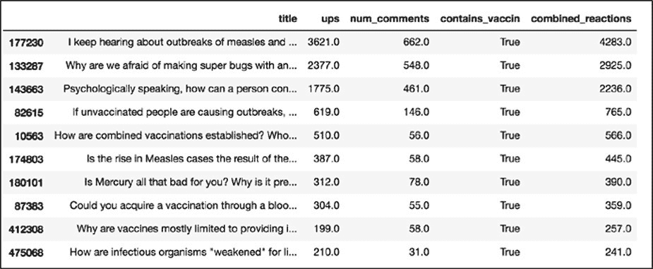
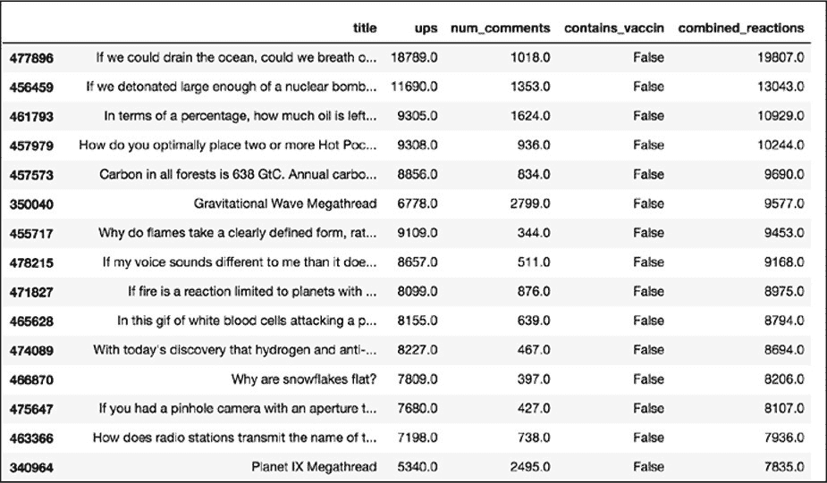

9 在 REDDIT 数据中寻找趋势
-----------------------------------------------------------------------------------------------

社交媒体数据中的部分数据以定量的方式列举人类行为，而另一部分则是定性的方式。例如，可以通过计算 Reddit 帖子"点赞"来衡量它的受欢迎程度，这就可以对其进行简单的聚合，如：在特定时间段内帖子获得点赞数的平均或中位数。然而，Reddit 上相类似数据的其他部分可能很难用定量的方式进行处理，如：帖子的评论在内容和风格上可能大相径庭。

比起计算像"点赞"这样的参与度指标（如：平均值），想要总结（或者说量化）人们讨论的话题及其讨论方式是非常困难的。但不可避免的，对社交网络上的数据进行有意义的分析需要同时观察这两种信息。然而，学习如何做到这一点对于我们非常有用，因为可以探索真实人的行为、思想和反应(也可能是机器人！)。

在本章中，将会学习如何浏览定性和定量信息。我们将通过分析第 8 章中的 r/askscience 数据，探讨人们如何与社交媒体中的疫苗接种主题互动，并从数据集中提出针对性的问题。首先，将通过搜索 subreddit 中带有词干 vaccin（例如：*vaccinate*和*vaccination*）一词的提交内容，来尝试更好地理解如何处理基于文本的信息。然后会比较疫苗贴与非疫苗贴的参与度，即：评论和点赞的总数。

#### 明确研究目标

在这一章中使用来自 r/askscience 的 subreddit 在线帖子来衡量疫苗接种在网络上讨论的热度。

虽然 Reddit 用户并不能代表所有人，但仍可以通过对比论坛上的其他帖子来了解这个帖子在论坛上的热度。此过程的技术关键是：就像其他任何对社交网络的研究一样，需要承认和理解被研究的每个数据集的特殊性。

首先，提出一个最基本的问题：r/askscience 在 Reddit 上提交的含有"vaccine"、"vaccinate"等 vaccination 词变体的帖子，是否比不含这些词的帖子更活跃？

#### 方法略述

回答问题的分析过程包含如下步骤：

> 1\.
> 筛选数据并将其分组到两个数据框中。第一个数据框架包含所有使用单词 vaccine、vaccinate 或 vaccination 的帖子。第二个数据框包含没有提到这些词的帖子。
>
> 2\.
> 在每个数据框上运行简单的计算。通过寻找平均或中位数的参与度指标来获得汇总数据(在本分析中，参与度指标由评论和点赞的组合数量表示)，可以让我们更好地理解 r/askscience 数据的每个子集，同时为提出的问题给出答案。

在开始分析之前需要理解一些统计学术语。均值*mean*是将数据的所有值相加，并将和除以数据总个数的结果。中位数*median*是数据中所有值从小到大排序后，位于最大值和最小值之间的数。如果数据个数是偶数则取中间两个数的均值。均值和中位数都是集中趋势的度量（*measures
of central
tendency）*，这些度量让我们可以通过查看某个中心点来评估数据集。当一个数据集含有非常多的数据且相对于数据集的总个数异常值*outlier*占比较小时，均值是度量其集中趋势的一个很好的方法。如果数据集中离群值的数量占比较大时可以通过中位数度量其集中趋势。

#### 缩小数据范围

Reddit 数据集本身相当大，即使只看其中的一个子集 subreddit 其规模也超乎想象。虽然尽可能从包含全部数据的数据集开始对于分析非常重要，但是根据特定项目筛选数据可以更好地、更整洁地对其进行概述。筛选还能减少运行每个计算所需的时间。

本章还介绍了总体*population*和样本*sample*数据的概念，总体数据描述了包含指定组整体的数据集。此处的指定组包含了 r/askscience 在 Reddit 上 2014 年到 2017 年之间的所有帖子。样本数据是数据集的子集或样本。在本练习中会生成两个子集：一个包含与疫苗相关的帖子，另一个包含所有其他帖子。通过对这两个子集进行分析来比较它们之间的不同点。

本练习使用第 8 章中设置的虚拟环境和 Jupyter
Notebook。该练习在原有的 Notebook 文件上进行扩展，并且使用与之前练习的相同变量名称。

###### 从特定列中选择数据

为了获取练习所需的数据，先 Reddit 数据集缩减到只包含与分析相关的列。然后删除那些包含不相关样本的行，如：空值 null。

在本练习中，我们对两种不同的数据特别感兴趣------帖子的标题和评论，包括：提交给 r/askscience 的文本，以及获得的反馈。如上一章所述，通过运行以下代码行可以把数据集的所有列名以列表的形式输出：

输出的结果是一个字符串列表，每个字符串代表一个列名：

以上显示了数据集有 62 个列。对于练习来说，只需要保留 title 列，ups 列以及 num_comments 列。

使用在上一张中提到的方法（"查看特定的行和列"），使用方括号在数据集中选中特定的列。现在确保已经打开了第 8 章的 Notebook 文件，并且已经运行了文件中的每个单元（**Kernel**
▸ **Restart & Run
ALL**）。然后，使用加号(+)在最底部的单元下面添加一个单元，并将清单 9-1 中代码输入其中：

*清单 9-1：从数据集中选择感兴趣的列*

首先创建一个名为 columns 的变量，并为其分配一个字符串列表，该字符串列表\[\"title\",
\"ups\",
\"num_comments\"\]包含想要储存在筛选后数据集的列。应确保每个列名的字符串与原数据集中的列名完全匹配，如果不匹配，无论是标点符号、大小写等拼写错误都可以导致 Python 脚本运行错误。

清单 9-1 的第二行代码创建了一个名为 ask_science_reduce 的变量，用于储存一个筛选后的数据框。此处应可以看到，改代码没有如之前那样在方括号中添加单个字符串，而是将包含列名的列表变量放在其中。将整个列表放在方括号中可以同时选择多个列。

至此，已经把数据集缩减到感兴趣的特定列，接下来筛选后数据集中删除包含与分析不相关值的数据行。

###### 处理空值

在一个很大且不一致的数据集中，某些行或单元格可能不包含任何信息。这些"空（*Null*）"单元格可能完全不包含任何值，也可能仅包含占位符（*placeholder*），即：设计数据结构的机构或人员指派的任意字符串。如果可能的话，占位符会在数据字典（*data
dictionary*）中被描述。数据字典是解释数据集内容、结构和格式的文档。一般情况下，必须自己通过研究数据集来了解。在最坏的情况是通过通过列名来猜测。还有一种简单的方法，就是通过询问收集数据的人来获取相关的信息。

在对数据进行解析的过程中，把这些空单元格称为空值。当在 Python 中试图在交互式 shell 或其他 Python 接口中打印空值时会返回 None。在 pandas 中空值被称为 NaN 值(not
a number 的缩写)，数据框把 NaN 作为缺失数据单元格的占位符。

空值在收集到的社交媒体用户信息中特别常见。例如，收集到发布到 Facebook 视频链接的列数据仅包含用户实际发布视频的帖子的值。对于任何不包含视频的帖子，数据集都将没有该项的值，而且可能使用占位符（例如字符串"
no video"），也可能把该项留空，这意味着该项数据会是一个具有空值。

占位符，Null 和 NaN 值会导致分析发生错误。在应用函数或计算时，脚本会按照代码设定的步骤进行操作，当发现空值时都会发生错误并停止运行。本节中将介绍两种处理空值的方法，每种方法的目的不尽相同：一种是完全从数据中删除这些 null 值，另一种是保留整个数据集并将空值计数为零。

######## 删除空值

如果数据集中的某列包含空值，则删除包含空值的整行数据。在 Pandas 中使用 dropna()函数进行相关的操作。清单 9-2 显示了依据列是否包含 NaN 值删除整行数据的代码。

*清单 9-2：删除列中包含 NaN 值的行*

在没有特别规定的情况下，dropna()函数告诉 Pandas 从数据框中删除整行。但是 dropna()函数还有一些其他的参数，如：subset 参数。在此示例中，使用 subset 参数告诉 Pandas 在 ups 和 num_comments 列中删除包含 NaN 值的行。如果不给 dropna()函数传递任何参数，则 Pandas 默认删除具有任何 null 值的行。

######## 填充空值

为了标识 NaN 值但想要保留数据框的每一行数据，可以使用 fillna()函数。该函数用字符串或数字填充每个空值。清单 9-3 显示了如何使用 fillna()函数采用数字 0 填充 num_comments 列中的空值：

*清单 9-3：用 0 填充空值*

在清单 9-3 的代码中把 0 赋给 value 参数。此代把 num_comments 列中的空值替换为数字 0。

确定用删除空值的方式还是填充空值的方式，取决于数据集以及想要如何回答研究问题。例如，如果想要获取整个数据集评论数的中位数时是否可以确定地认为缺失值仅表示提交内容中没有相关的评论。如果能够确定，则可以用 0 填充这些值并进行相应的计算。

依据包含缺失值或"空单元格"的行数，评论数的中位数可能会发生显著变化。但由于此数据集有时把注释或注释的数量记录为零，有时也记录为空值，因此假定包含这些列的空值的行应视为 0（如果空值表示 0，可以假设数据集将不包含任何实际的 0，这是因为把 0 视为了一种符号而不是数字）。相反，认为这些缺失值是档案管理员无法捕获的数据，其原因：也许帖子在他收集这些信息之前就被删除了；也许这些指标是在某些年份中引入的而其他年份则没有。因此为了便于练习，应处理现有的数据并删除包含缺失值的 ups 或 num_comments 列的数据行，如清单 9-2 所示。

###### 分类数据

下一步是根据关于疫苗接种的具体研究问题筛选数据。在进行筛选之前，需要对 Reddit 数据中关于疫苗接种的内容进行分类。

此处的分类方式是简化的。在处理大型数据集时简化分类是必经步骤，因为阅读每一篇文章并逐个对其解释是不可能实现的劳动密集型工作。即使可以雇佣一大群人阅读每个帖子并解释（在一些 prose-driven 项目中这种情况并不少见），但很难确保每个人都使用相同的标准来解释，这样做可能会使数据难以用标准的、可识别的方式分类。

在本章的示例中，把样本限制为包含单词 vaccination 及其变体的帖子，寻找 title 列中包含"vaccine"（在语言学中通常被称为词干，词干是一个词语去掉表示语法意义的词尾剩余的部分）的数据。该数据子集可能不能捕捉到关于疫苗接种的每一个帖子，但可以让我们定性地理解手头的问题。

通过在数据集中创建一个新列来依据帖子的标题 title 中是否包含字符串"vaccin"对数据集进行分类。新建列使用布尔值(也就是二进制值，True=1 或 False=0)填充。清单 9-4 显示了创建这个列所需的代码：

*清单 9-4：根据某列是否包含某个字符串对新建列进行填充*

在清单 9-4 中代码的等号左侧，使用方括号创建了一个名为 contains_vaccin 的新列。在等号右侧，使用了一个链式函数：首先使用方括号表示法从数据中选择 title 列，然后在该列上使用 str()函数将值转换为字符串，转换成字符串后就可以使用 contains()来确定列值是否包含"*vaccin*"。

这个链式函数的结果是一个布尔值：如果帖子的标题包含 vaccin，就返回 True；否则返回 False。代码运行后就会在 ask_science_dropped_rows 数据框生成一个新列 contains_vaccin，其值只有 True（1）或 False（0）。（译者注：清单 9-4 的代码再运行的时候会发生一个警告，但是不影响运行的结果。）

现在有了用于分类数据的列，就可以用这个列来筛选数据了。在 Jupyter
Notebook 的新单元中运行清单 9-5 中的代码：

*清单 9-5：根据条件筛选数据*

清单 9-5 中代码是否感觉很熟悉？在这里需要注意：在等号右侧的括号中使用了条件 ask_science_data_dropped_rows
\[\" contains_vaccin
\"\]==True。这段代码告诉 Pandas 检查 contains_vaccin 列中的值是否等于 True，这样就筛选到了一个数据集的子集，其中只包括词干中包含 vaccin 的数据。也可以设置条件等于 False，生成词干中不包含 vaccin 的子集：

至此已经生成了按照需求筛选的数据，现在可以查询一些有趣的见解。

#### 汇总数据

 为了确定 r/askscience 在 Reddit 上提交的包含"vaccine(接种)"、"vaccine(疫苗)"、"vaccinate(疫苗)"等不同单词的帖子是否比不包含这些词的帖子获得了更大的反响，可以查看这些帖子收到的被点赞和评论数的总和。

###### 对数据进行排序

首先创建另一个新列，该列中的值是每行点赞和评论数量的和。该步骤在 Pandas 中是非常简单的操作（清单 9-6）。

*清单 9-6：将多个列值合并在一列中*

 在清单 9-6 中，在之前两个数据框中分别创建一个称为 combined_reactions 的列，并为其分配等于 num_comments 和 ups 列之和的值。运行此代码时可能会遇到 SettingWithCopyWarning 警告，SettingWithCopyWarning 是一个警告 Warning，而不是错误 Error。错误和警告之间的区别：错误使您的代码无法运行，而警告只是促使您仔细检查正在运行的代码是否在执行所需的操作。对于这本书，这里显示的代码可以完成想要做的事情：在注释数上添加点赞数。如果对发出此警告的开发人员希望进行何种调查感到好奇，请参阅<http://pandas.pydata.org/pandas-docs/stable/user_guide/indexing.html>（该链接中的大致意思：Pandas 中的某些操作会返回数据的视图 View，某些操作会返回数据的副本 Copy。当对视图进行操作时就会发生 SettingWithCopyWarning，由于链式赋值 Chained
Assignment 以及隐蔽链式操作 Hidden
Chaining 也是对于视图的操作，所以也会发生 SettingWithCopyWarning。想要避免警告出现，建议如清单 9-1 以及 9-2 中在最后加上".copy()"。）

在新列中获得了 num_comments 和 ups 列之和的值之后，使用 sort_values()函数对该值进行排序，如清单 9-7 所示。

*清单 9-7：使用 sort_values()对数据框进行排序*

顾名思义，sort_values()函数是依据值的顺序对数据框进行排序。在清单 9-7 中给 sort_values()函数传递给了两个参数：by------告诉 Pandas 需要被排序的列；ascending------告诉 Pandas 排序的顺序（正向 True：从小到大/反向 False：从大到小）。在此处的代码中把 False 传递给 ascending 参数，数据会按照从大到小的顺序进行排序。

图 9-1 显示了对 ask_science_data_vaccinations 列进行排序后的数据框样子。

 *图 9-1：Jupyter
Notebook 屏幕上 ask_science_data_vaccinations 的部分数据框按合并的参与总数排序*

 图 9-2 显示了 ask_science_data_no_vaccinations 列的一些结果。

*图 9-2：Jupyter
Notebook 屏幕上 ask_science_data_no_vaccinations 的部分数据框按合并的参与总数排序*

如图所示，ask_science_data_no_vaccinations 数据框中 combined_reactions 比与 ask_science_data_vaccinations 数据框中 combined_reactions 的值更大。对于这两个数据集中的前十大参与数据也是如此。ask_science_data_no_vaccinations 的前十帖子的合并参与总数要远远高于 ask_science_data_vaccinations。因此，以 r/askscience 数据的每个子集的前 10 帖子的参与总数衡量可以得出结论，与疫苗接种相关的帖子没有像其他主题那样获得了足够的关注。

但这里有个很大的问题：只看了前十名的帖子。对数据集进行筛选和排序可以帮助更好地理解数据集，但是只展示了大量数据集的极值。在下一节中，将进一步研究分析数据的一些不同方法。

###### 对数据进行描述

一种常见的数据汇总方法是使用 mean()函数（清单 9-8）。

*清单 9-8：mean()函数*

在此使用 mean()函数来查找选中列(combined_reac)的平均值。当在一个单元中运行此代码后，应能得到以下数字：

对 ask_science_data_no_vaccates 数据框运行相同的代码及其输出，如下所示：

这些数字表明，不包含 vaccin 帖子的平均合并参与总数高于包含 vaccin 的帖子。换句话说，之前的结论---包含 vaccin 的帖子合并参与总数更少，因此这些帖子没有从 Reddit 其他用户那里获得更多的注意力，与对合并参与总数排名前 10 的帖子进行观察得出的结论相同。

平均值只是汇总的一种方法。可以使用 describe()函数在 Pandas 中一次查看多个指标(清单 9-9)。

*清单 9-9：describe()函数*

该函数的输出结果如下：

此摘要包括行数 count、均值 mean、标准差 std、最小值 min、25%分位数、50%分位数（中位数）和、最大值 max。

让在另一个单元中运行与 ask_science_data_no_vaccates 相同的代码：

该代码的输出结果如下：

以上输出展示了两个数据框的中位数是相同的，中位数是衡量一个帖子参与度的另一种方法。然而，这里的平均值可能是比较帖子数据的最佳方式，因为两个数据集的中位数都是 1，不能在一个数据集与另一个数据集之间的使用中位数做出明确的区分。

最后但并非最终，当展示对于数据的发现时，给刚刚运行的各种分析提供上下文环境非常重要。虽然向受众展示中位数和均值可能会有所帮助，但对数据所做的一切保持透明也至关重要。数据分析需要理解上下文环境：不仅要展示信息数据的范围，还须概括如何对数据进行分和任何其他有用的观察。

其中一个观察结果可能是观察数据子集的分布。如前所述，均值和中位数均旨在帮助度量数据集的集中趋势，但是在这种情况下它们的差异很大：两个数据子集中点赞和评论总数的中位数均为 1，而与疫苗接种相关与不相关子集的平均值为 13 和 16。通常，这种差异应促使进一步检查数据集的分布（在第 7 章中简要介绍了数据集分布的概念），其中可能包含了一些不寻常的特征。例如，考虑到数据的两个子集的中位数都是 1，可以认定至少有一半的帖子获得了 1 或更少的点赞和评论，这一事实是值得关注的。

无论最终在演示文稿，论文或文章中写什么，重要的是要描述数据本身、使用的过程、找到的结果以及任何可能有助于受众充分了解分析的上下文环境。

#### 概要

在本章中学习了如何使用处理、筛选和分析数据等各种步骤来思考研究问题。介绍了根据列中的潜在值对社交媒体数据进行分类和筛选的步骤。然后学习了如何对这些筛选后的数据集进行简单的数学计算。

重要的是：了解到有不止一种方法来处理这样的分析。这点可以从技术上体现出来：某些数据分析人员可能选择使用不同的功能来执行在本章中所做的各种筛选和汇总。在其他情况下，研究人员可能会尝试使用不同的方法论方法并思考不同的方法来对数据进行分类和汇总。例如，另一位开发人员可能使用了另一种方法来对有关疫苗接种的帖子进行分类，他们可能已根据多个词对数据进行了筛选。尽管一些固执己见的在线用户可能会这么想，但用数据来回答问题并没有万无一失的方法，但用我们拥有的数据做更多的实验并尝试用不同的方法来回答相同的研究问题还是很有帮助的。

在本章中，我们使用分类驱动的细分来汇总数据集，而在下一章中将研究如何汇总不同时间段的数据。

