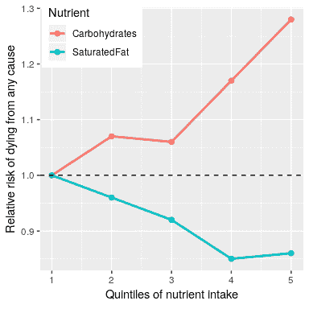

## 1.2 统计数据能为我们做什么？

我们可以用统计数据做三件主要的事情：

*   _ 描述 _：这个世界是复杂的，我们经常需要用我们能够理解的简单方式来描述它。

*   _ 决定 _：我们通常需要根据数据做出决定，通常是在面临不确定性的情况下。
*   _ 预测 _：我们经常希望根据我们对以前情况的了解来预测新的情况。

让我们来看一个实际的例子，集中在一个我们很多人都感兴趣的问题上：我们如何决定吃什么是健康的？
有许多不同的指导来源，从政府饮食指南到饮食书籍，再到博客。
让我们专注于一个特定的问题：我们饮食中的饱和脂肪是不是一件坏事？

我们回答这个问题的一种方法是常识。
如果我们吃脂肪，那么它会在我们的身体里直接变成脂肪，对吗？
我们都看过脂肪堵塞动脉的照片，所以吃脂肪会阻塞动脉，对吗？

我们回答这个问题的另一种方法是听取权威人士的意见。美国食品药品监督管理局的饮食指南作为其关键建议之一，“健康的饮食模式限制饱和脂肪的摄入”。你可能希望这些指南是基于良好的科学，在某些情况下是这样的，但正如尼娜·泰克罗兹在她的书中概述的那样。”大脂肪惊喜”（Teicholz，2014 年），这一特别建议似乎更多地基于营养研究人员的教条，而不是实际证据。

最后，我们可以看看实际的科学研究。让我们先看一个名为“纯粹研究”的大型研究，该研究对 18 个不同国家的 135000 多人的饮食和健康结果（包括死亡）进行了调查。在该数据集的一项分析中（发表于 2017 年的《柳叶刀》（The Lancet）（HTG1））；Dehghan 等人（2017 年）），纯研究人员报告了一项分析，分析了不同种类的宏量营养素（包括饱和脂肪和碳水化合物）的摄入与跟踪调查期间死亡的可能性之间的关系。对受试者进行了中位数为 7.4 年的跟踪调查，这意味着研究中一半受试者的跟踪调查时间不足，一半受试者的跟踪调查时间超过 7.4 年。图[1.1](#fig:PureDeathSatFat)描绘了研究中的一些数据（摘自论文），显示了饱和脂肪和碳水化合物摄入与任何原因死亡风险之间的关系。

图 1.1 纯研究的数据图，显示了任何原因导致的死亡与饱和脂肪和碳水化合物的相对摄入量之间的关系。

这个图是以十个数字为基础的。为了获得这些数据，研究人员将 135335 名研究参与者（我们称之为“样本”）分成 5 组（“五分位数”），根据他们对任何一种营养素的摄入量对其进行排序；第一个五分位数包含 20%的最低摄入量的人，第五个五分位数包含 20%的最低摄入量的人。五分位数含有最高摄入量的 20%。然后，研究人员计算了在被跟踪期间，每个研究小组中的人死亡的频率。这个数字用死亡的相对风险（与最低五分位数相比）来表示这一点：如果这个数字大于 1，这意味着这个群体中的人比最低五分位数中的人死亡的可能性高 _，而如果这个数字小于 1，这意味着死亡的可能性比最低五分位数中的人高 _。也就是说，小组中的人死亡的可能性要小一些。这个数字非常清楚：在研究过程中，摄入饱和脂肪越多的人死亡的可能性就越小，而且吃得越多，这种影响就越大。碳水化合物的情况正好相反，一个人吃的碳水化合物越多，他们在研究中死亡的可能性就越大。这个例子显示了我们如何使用统计数据来描述复杂的数据集，用一组简单得多的数字来描述；如果我们必须同时查看来自每个研究参与者的数据，我们将被数据超载，很难看到 EME 当它们被更简单地描述时。

图[1.1](#fig:PureDeathSatFat)中的数字似乎表明，随着饱和脂肪的摄入，死亡人数减少，而随着碳水化合物的摄入，死亡人数增加，但我们也知道，数据中存在很多不确定性；有些人即使吃低碳水化合物的饮食，也会过早死亡，同样，有些人甚至会因摄入低碳水化合物的食物而死亡。他吃了很多碳水化合物，但活到了成熟的老年。考虑到这种变异性，我们想 _ 决定 _ 我们在数据中看到的关系是否足够大，如果饮食和寿命之间没有真正的关系，我们就不会期望它们随机发生。统计数据为我们提供了做出这些决定的工具，通常外界认为这是统计数据的主要目的。但正如我们将在书中看到的，基于模糊证据的黑白决策的需要常常导致研究人员误入歧途。

基于这些数据，我们还想对未来的结果做出预测。例如，一家人寿保险公司可能想利用某个人摄入脂肪和碳水化合物的数据来预测他们的寿命。预测的一个重要方面是，它要求我们将已有的数据归纳为其他情况，通常是在将来；如果我们的结论仅限于某一特定时间研究中的特定人员，那么该研究就不会非常有用。一般来说，研究人员必须假设他们的特定样本代表了更大的（htg0）群体（htg1），这要求他们以无偏见的方式获取样本。例如，如果纯研究从信奉素食主义的宗教派别中招募了所有参与者，那么我们可能不想将结果推广到遵循不同饮食标准的人身上。