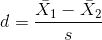
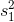
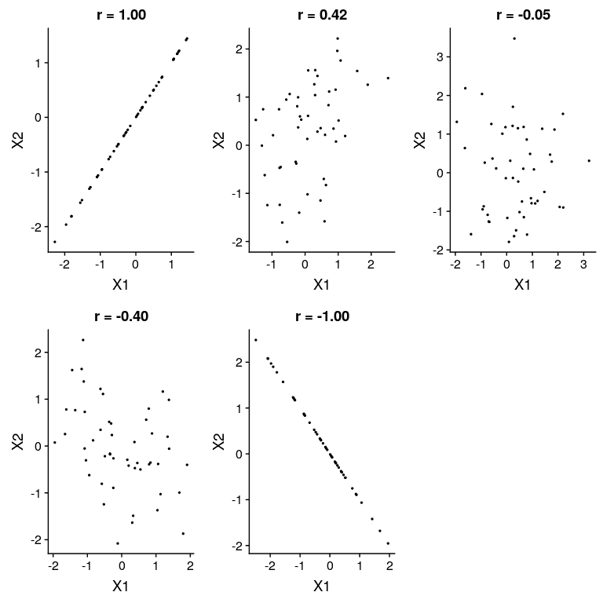

## 10.2 效果大小

> “统计显著性是最不有趣的结果。你应该用数量尺度来描述结果——不仅仅是治疗对人有影响，还有它对人有多大的影响。”基因玻璃（Ref）

在最后一章中，我们讨论了统计学意义不一定反映实际意义的观点。为了讨论实际意义，我们需要一种标准的方法来根据实际数据描述效应的大小，我们称之为 _ 效应大小 _。在本节中，我们将介绍这个概念，并讨论计算影响大小的各种方法。

效应大小是一种标准化的测量，它将某些统计效应的大小与参考量（如统计的可变性）进行比较。在一些科学和工程领域中，这个概念被称为“信噪比”。有许多不同的方法可以量化效果大小，这取决于数据的性质。

### 10.2.1 科恩

影响大小最常见的度量之一是以统计学家雅各布·科恩（Jacob Cohen）的名字命名的 _ 科恩的 D_，他在 1994 年发表的题为“地球是圆的（P&lt；.05）”的论文中最为著名。它用于量化两种方法之间的差异，根据它们的标准偏差：



其中和是两组的平均值，而是合并标准偏差（这是两个样本的标准偏差的组合，由样本大小加权）：


其中和是样品尺寸，和分别是两组的标准偏差。

有一个常用的尺度可以用科恩的 D 来解释效应的大小：

<colgroup><col style="width: 8%"> <col style="width: 22%"></colgroup> 
| D | 解释 |
| --- | --- |
| 0.2 条 | 小的 |
| 0.5 倍 | 中等的 |
| 0.8 倍 | 大的 |

观察一些常见的理解效果，有助于理解这些解释。

```r
# compute effect size for gender difference in NHANES

NHANES_sample <-
  NHANES_adult %>%
  drop_na(Height) %>%
  sample_n(250)

hsum <-
  NHANES_sample %>%
  group_by(Gender) %>%
  summarize(
    meanHeight = mean(Height),
    varHeight = var(Height),
    n = n()
  )

#pooled SD
s_height_gender <- sqrt(
  ((hsum$n[1] - 1) * hsum$varHeight[1] + (hsum$n[2] - 1) * hsum$varHeight[2]) / 
    (hsum$n[1] + hsum$n[2] - 2)
)

#cohen's d
d_height_gender <- (hsum$meanHeight[2] - hsum$meanHeight[1]) / s_height_gender

sprintf("Cohens d for male vs. female height = %0.2f", d_height_gender)
```

```r
## [1] "Cohens d for male vs. female height = 1.95"
```

参照上表，身高性别差异的影响大小（d=1.95）很大。我们也可以通过观察样本中男性和女性身高的分布来看到这一点。图[10.2](#fig:genderHist)显示，这两个分布虽然仍然重叠，但分离得很好，突出了这样一个事实：即使两个组之间的差异有很大的影响大小，每个组中的个体也会更像另一个组。


图 10.2 nhanes 数据集中男性和女性身高的平滑柱状图，显示了明显不同但明显重叠的分布。

同样值得注意的是，我们很少在科学中遇到这种规模的影响，部分原因是它们是如此明显的影响，以至于我们不需要科学研究来找到它们。正如我们将在第[17](#doing-reproducible-research)章中看到的那样，在科学研究中报告的非常大的影响往往反映出有问题的研究实践的使用，而不是自然界中真正的巨大影响。同样值得注意的是，即使有如此巨大的影响，这两种分布仍然是重叠的——会有一些女性比普通男性高，反之亦然。对于最有趣的科学效应来说，重叠的程度会大得多，所以我们不应该马上就基于一个大的效应大小得出关于不同人群的强有力的结论。

### 10.2.2 皮尔逊 R

Pearson 的 _r_ 也称为 _ 相关系数 _，是对两个连续变量之间线性关系强度的度量。我们将在[13](#modeling-continuous-relationships)章中更详细地讨论相关性，因此我们将保存该章的详细信息；这里，我们简单地介绍 _r_ 作为量化两个变量之间关系的方法。

_r_ 是一个在-1 到 1 之间变化的度量值，其中值 1 表示变量之间的完全正关系，0 表示没有关系，而-1 表示完全负关系。图[10.3](#fig:corrFig)显示了使用随机生成的数据的各种相关级别的示例。



图 10.3 不同水平皮尔逊 R 的示例。

### 10.2.3 优势比

在我们之前关于概率的讨论中，我们讨论了概率的概念——也就是说，某些事件发生与未发生的相对可能性：


优势比只是两个优势比。例如，让我们以吸烟和肺癌为例。2012 年发表在《国际癌症杂志》上的一项研究（Pesch 等人 2012 年）关于吸烟者和从未吸烟的个体肺癌发生率的综合数据，通过许多不同的研究。请注意，这些数据来自病例对照研究，这意味着这些研究的参与者之所以被招募，是因为他们要么患了癌症，要么没有患癌症；然后检查他们的吸烟状况。因此，这些数字并不代表一般人群中吸烟者的癌症患病率，但它们可以告诉我们癌症与吸烟之间的关系。

```r
# create table for cancer occurrence depending on smoking status
smokingDf <- tibble(
  NeverSmoked = c(2883, 220),
  CurrentSmoker = c(3829, 6784),
  row.names = c("NoCancer", "Cancer")
)
pander(smokingDf)
```

<colgroup><col style="width: 19%"> <col style="width: 22%"> <col style="width: 15%"></colgroup> 
| 从不吸烟 | 当前吸烟者 | 行名称 |
| --- | --- | --- |
| 2883 个 | 3829 年 | 无癌症者 |
| 220 | 6784 个 | 癌症 |

我们可以将这些数字转换为每个组的优势比：

```r
# convert smoking data to odds

smokingDf <-
  smokingDf %>%
  mutate(
    pNeverSmoked = NeverSmoked / sum(NeverSmoked),
    pCurrentSmoker = CurrentSmoker / sum(CurrentSmoker)
  )

oddsCancerNeverSmoked <- smokingDf$NeverSmoked[2] / smokingDf$NeverSmoked[1]
oddsCancerCurrentSmoker <- smokingDf$CurrentSmoker[2] / smokingDf$CurrentSmoker[1]
```

从未吸烟的人患肺癌的几率为 0.08，而目前吸烟者患肺癌的几率为 1.77。这些比值告诉我们两组患者患癌症的相对可能性：

```r
#compute odds ratio

oddsRatio <- oddsCancerCurrentSmoker/oddsCancerNeverSmoked
sprintf('odds ratio of cancer for smokers vs. nonsmokers: %0.3f',oddsRatio)
```

```r
## [1] "odds ratio of cancer for smokers vs. nonsmokers: 23.218"
```

23.22 的比值比告诉我们，吸烟者患癌症的几率大约是不吸烟者的 23 倍。