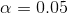
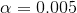
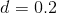

## 10.3 统计能力

请记住，在上一章中，根据 Neyman-Pearson 假设检验方法，我们必须指定我们对两种错误的容忍程度：假阳性（他们称之为 _I 型错误 _）和假阴性（他们称之为 _II 型错误 _）。人们经常把重点放在 I 型错误上，因为作出假阳性的声明通常被视为一件非常糟糕的事情；例如，韦克菲尔德（1999）现在不可信的声称自闭症与疫苗接种有关，导致了反疫苗情绪的大幅上升。儿童疾病，如麻疹。同样，我们也不想声称一种药物如果真的不能治愈一种疾病，这就是为什么 I 型错误的耐受性通常被设定为相当低的原因，通常是在。但是 II 型错误呢？

_ 统计功率 _ 的概念是对第二类错误的补充，也就是说，如果存在的话，很可能会得到一个正的结果：


Neyman-Pearson 模型的另一个重要方面，我们没有在上面讨论过，事实上，除了说明 I 型和 II 型错误的可接受水平外，我们还必须描述一个特定的替代假设——即，我们希望检测的影响大小计算机断层扫描？否则，我们无法解释——发现大效应的可能性总是高于发现小效应的可能性，因此将根据我们试图检测的效应大小而有所不同。

影响功率的因素有三个：

*   样本量：较大的样本提供更大的统计能力
*   效果大小：给定的设计总是比小效果有更大的发现大效果的能力（因为发现大效果更容易）
*   I 型错误率：I 型错误与功率之间存在一种关系，因此（其他所有情况相同）减少 I 型错误也会降低功率。

我们可以通过模拟看到这一点。首先，让我们模拟一个单独的实验，在这个实验中，我们使用标准 t 检验比较两组的平均值。我们将改变影响的大小（根据 Cohen's d 的规定）、I 类错误率和样本大小，并针对每一个，我们将检查重要结果（即功率）的比例是如何受到影响的。图[10.4](#fig:plotPowerSim)显示了功率如何随这些因素的函数而变化的示例。

```r
# Simulate power as a function of sample size, effect size, and alpha

# create a set of functions to generate simulated results
powerDf <-
  expand.grid(
    sampSizePerGroup = c(12, 24, 48, 96),
    effectSize = c(.2, .5, .8),
    alpha = c(0.005, 0.05)
  ) %>%
  tidyr::expand(effectSize, sampSizePerGroup, alpha) %>%
  group_by(effectSize, sampSizePerGroup, alpha)

runPowerSim <- function(df, nsims = 1000) {
  p <- array(NA, dim = nsims)
  for (s in 1:nsims) {
    data <- data.frame(
      y = rnorm(df$sampSizePerGroup * 2),
      group = array(0, dim = df$sampSizePerGroup * 2)
    )

    data$group[1:df$sampSizePerGroup] <- 1
    data$y[data$group == 1] <- data$y[data$group == 1] + df$effectSize
    tt <- t.test(y ~ group, data = data)
    p[s] <- tt$p.value
  }
  return(data.frame(power = mean(p < df$alpha)))
}

# run the simulation
powerSimResults <- powerDf %>%
  do(runPowerSim(.))
```


图 10.4 功率模拟结果，显示功率与样本大小的函数关系，效果大小显示为不同颜色，alpha 显示为线条类型。80%功率的标准标准标准用虚线黑线表示。

这个模拟表明，即使样本大小为 96，我们也几乎没有能力用找到一个小的效果（）。这意味着，一项旨在实现这一目标的研究将是徒劳的，也就是说，即使存在这种规模的真实效应，也几乎可以保证什么也找不到。

至少有两个重要的原因需要关注统计能力，一个是我们在这里讨论的，另一个是我们将在第[17 章](#doing-reproducible-research)中讨论的。如果你是一名研究人员，你可能不想花时间做无用的实验。运行一个动力不足的研究基本上是徒劳的，因为这意味着即使它存在，人们也很难找到效果。

### 10.3.1 功率分析

幸运的是，有一些工具可以帮助我们确定实验的统计能力。这些工具最常见的用途是在计划一个实验时，我们想确定我们的样本需要多大才能有足够的能力发现我们感兴趣的效果。

假设我们有兴趣进行一项研究，研究 iOS 和 Android 设备用户之间的特定个性特征是如何不同的。我们的计划是收集两组个体并测量他们的人格特征，然后用 t 检验比较这两组。为了确定必要的样本大小，我们可以使用`pwr`库中的`pwr.t.test()`函数。

```r
# power analysis for Cohen's d = 0.5, for 80% power with alpha = 0.05
pwr.t.test(d = 0.5, power = 0.8, sig.level = 0.05)
```

```r
## 
##      Two-sample t test power calculation 
## 
##               n = 64
##               d = 0.5
##       sig.level = 0.05
##           power = 0.8
##     alternative = two.sided
## 
## NOTE: n is number in *each* group
```

这告诉我们，为了有足够的力量找到中等规模的效果，我们需要每组至少 64 名受试者。在开始一项新的研究之前进行一次功率分析总是很重要的，以确保研究不会因为样本太小而无效。

您可能会想到，如果效果大小足够大，那么所需的样本将非常小。例如，如果我们运行相同的功率分析，效果大小为 d=3，那么我们将看到，每个组中只有大约 3 个受试者有足够的功率来发现差异。

```r
## 
##      Two-sample t test power calculation 
## 
##               n = 3.1
##               d = 3
##       sig.level = 0.05
##           power = 0.8
##     alternative = two.sided
## 
## NOTE: n is number in *each* group
```

然而，在科学界很少有人做这样一个实验，我们期望能发现如此巨大的影响——正如我们不需要统计数据来告诉我们 16 岁的孩子比 6 岁的孩子高一样。当我们进行功率分析时，我们需要指定一个对我们的研究合理的效应大小，这通常来自以前的研究。然而，在第[17 章](#doing-reproducible-research)中，我们将讨论一种被称为“赢家诅咒”的现象，这种现象可能导致公布的效果大小大于实际效果大小，因此也应记住这一点。