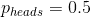
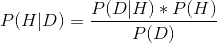
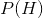
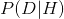

## 11.2 贝叶斯定理与逆推理

贝叶斯统计之所以有它的名字，是因为它利用了贝叶斯定理，从数据中作出推论，使之返回到生成数据的（潜在）模型的某些特征。假设我们想知道一枚硬币是否公平。为了测试这一点，我们将硬币翻转 10 次，然后拿出 7 个硬币头。在这个测试之前，我们很确定硬币是公平的（即），但是这些数据确实让我们停顿了一下。我们已经知道如何计算条件概率，如果硬币真的是公平的（htg1），我们会用二项分布从 10 中倒出 7 个或更多的头。

```r
# compute the conditional probability of 7 or more heads when p(heads)=0.5
sprintf(
  "p(7 or more heads | p(heads) = 0.5) = %.3f",
  pbinom(7, 10, .5, lower.tail = FALSE)
)
```

```r
## [1] "p(7 or more heads | p(heads) = 0.5) = 0.055"
```

这是一个相当小的数字，但这个数字并不能真正回答我们所问的问题——它告诉我们，考虑到头部的特定概率，7 个或更多头部的可能性，而我们真正想知道的是头部的概率。这听起来应该很熟悉，因为这正是我们进行无效假设测试的情况，它告诉我们数据的可能性，而不是假设的可能性。

记住，贝叶斯定理为我们提供了一个工具，我们需要它来反转条件概率：



我们可以认为这个定理有四个部分：

*   先验（）：我们在看到数据 D 之前对假设 H 的信任程度。
*   可能性（）：假设 h 下观察数据 d 的可能性有多大？
*   边际可能性（）：观察到的数据结合所有可能的假设的可能性有多大？
*   后验（）：我们对假设 h 的最新看法，给出了数据 d。

这里我们看到了频率主义和贝叶斯统计的主要区别之一。频率主义者不相信假设概率的概念（即我们对假设的信仰程度），对他们来说，假设要么是真的，要么不是真的。另一种说法是，对于频率主义者，假设是固定的，数据是随机的，这就是为什么频率主义者 ST 推理的重点是描述给定假设（即 P 值）的数据概率。另一方面，贝叶斯则乐于对数据和假设进行概率陈述。